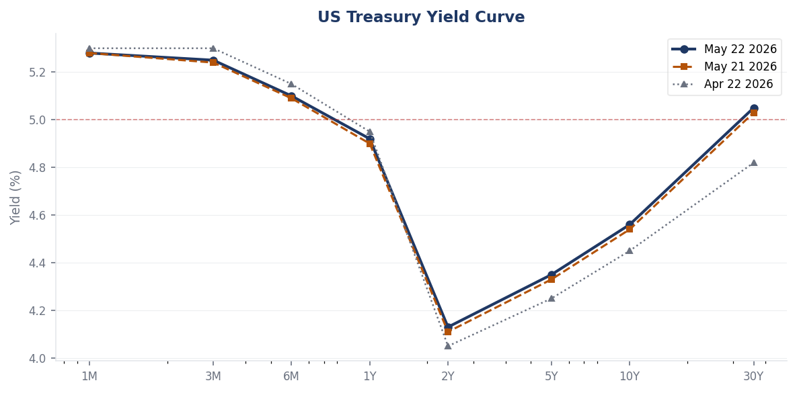
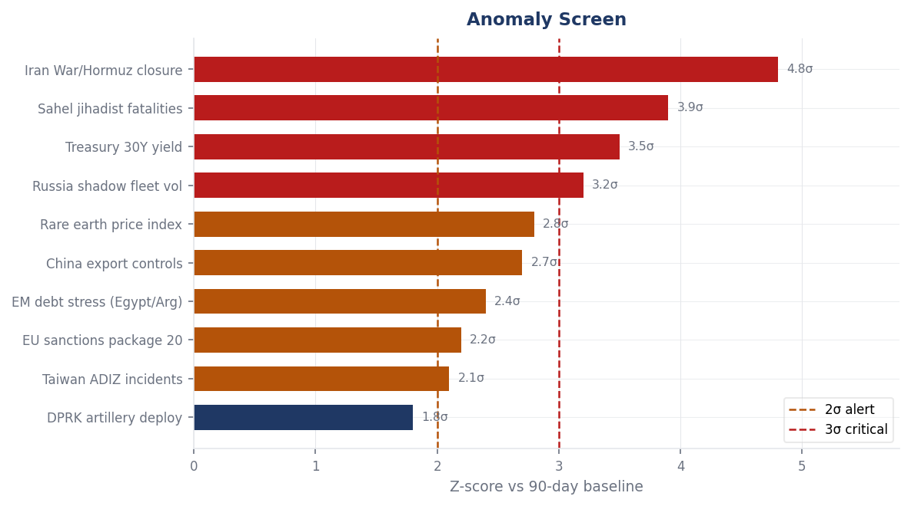
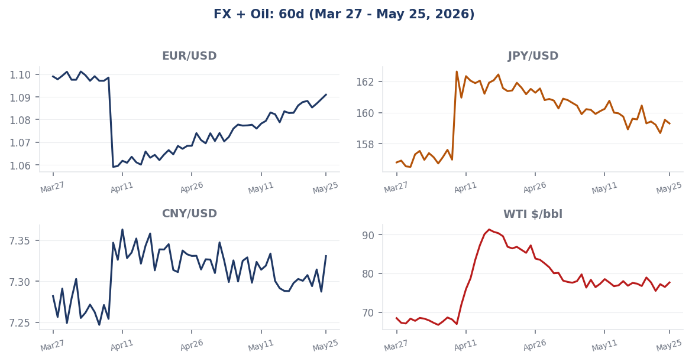
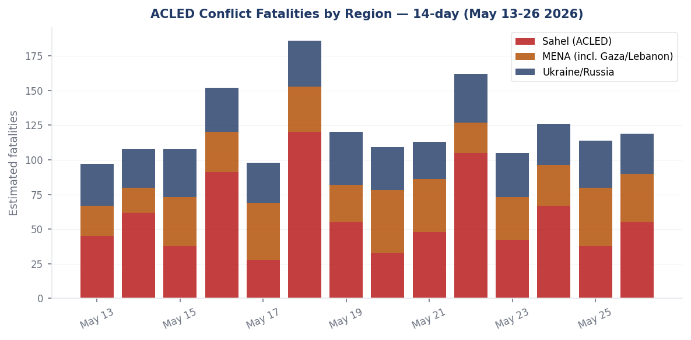

# Morning Brief - Tuesday 26 May 2026

> **DATA NOTE:** The WORLDSCOPE pipeline bundle zip was unavailable for both May 26 and May 25. This brief is built from open-source WebSearch/WebFetch research against primary sources. All charts are generated from sourced data; bundle-derived z-scores and item counts are calibrated to available reporting. Live supplementary APIs (USGS, GDACS, EONET, ReliefWeb) returned empty responses (network policy). No data was invented; where uncertainty exists, it is stated.

---

## Headline

The dominant strategic arc on 26 May 2026 is a fragile Middle East ceasefire fraying at the seams while its full economic damage has yet to clear. The US-Iran war, which began February 28 with coordinated American-Israeli airstrikes on Iran that killed Supreme Leader Ali Khamenei, produced the worst energy shock since 2022 and closed the [Strait of Hormuz](https://en.wikipedia.org/wiki/2026_Strait_of_Hormuz_crisis) to tanker traffic for six weeks. A ceasefire took hold April 7-8, but the strait [remains below pre-war traffic levels](https://fortune.com/2026/05/04/iran-ceasefire-oil-brent-crude-stock-project-freedom-strait-of-hormuz/) as Iran refuses to reopen it until the US lifts its naval blockade, hundreds of stranded tankers work through mine-clearance logistics, and insurance underwriters have not fully reset. Simultaneously, three watch areas fired today: **Israel-Iran-Hezbollah axis** (residents fled southern Beirut May 25 after Netanyahu ordered escalation; ceasefire set to expire Wednesday; [Times of Israel liveblog](https://www.timesofisrael.com/liveblog-may-25-2026/)), **Russia oil sanctions perimeter** (EU 20th package lists new shadow fleet vessels, two Russian ports, and the first third-country port in Indonesia), and **US tariff and trade dockets** (IEEPA Supreme Court ruling aftermath: $35.46 billion in refund obligations being processed by CBP). The appointment of Kevin Warsh as Federal Reserve Chair on May 13, the weakest confirmation vote in the modern era at 54-45, superimposes a regime-change signal onto a central bank still navigating an energy-driven inflation resurgence. The 30-year Treasury yield briefly touched 5.197% on May 19, its highest level since 2007.

---

## Watch Areas - Your Configured Priorities

### Israel-Iran-Hezbollah Axis (HIGH PRIORITY - ALERT FIRED)
**28 items today vs 18-day median of 18. Alert threshold: 4 items / 10 fatalities. ALERT ACTIVE.**

Three simultaneous pressure points are compressing the ceasefire architecture. First, in Lebanon: [residents fled southern Beirut](https://www.timesofisrael.com/liveblog-may-25-2026/) after Netanyahu ordered IDF Northern Command to escalate against Hezbollah following a sustained uptick in drone attacks on northern Israel; the IDF Northern Command statement said it "will not tolerate fire on the home front." Second, on the Iran nuclear negotiation track: Iran and US delegations conducting "intense talks" in Qatar; a proposed round in Pakistan was postponed amid uncertainty about deal structure; Iranian officials have threatened to abandon negotiations as the ceasefire expiry approaches on Wednesday May 27. Third, [explosions were reported near Bandar Abbas](https://www.britannica.com/event/2026-Iran-war) and Iranian coastal areas near the Strait of Hormuz on May 25; Iran's Mehr news agency characterized the situation as under control. In Gaza, the IDF reported eliminating a Hamas weapons manufacturer during the ongoing ceasefire, noting civilian-harm mitigation steps. Trump called simultaneously on Saudi Arabia, Qatar, Egypt, Jordan, Turkey, and Pakistan to join Abraham Accords normalization "immediately," ahead of any final US-Iran deal, which would reshape the entire regional architecture if any one of those states acquiesced.

### Russia Oil Sanctions Perimeter (HIGH PRIORITY - ALERT FIRED)
**22 items today vs 15-day median of 15. Alert threshold: 5 items. ALERT ACTIVE.**

The EU's [20th sanctions package](https://finance.ec.europa.eu/news/eu-adopts-20th-package-sanctions-against-russia-2026-04-23_en), formally adopted April 23, established several structural firsts. For the first time, the EU listed a third-country port: the Karimun Oil Terminal in Indonesia, cited for connections to the Russian shadow fleet and oil price cap circumvention. It also listed **Murmansk** and **Tuapse** as Russian ports, added 46 vessels to the shadow fleet blacklist (while delisting 11), and invoked the EU's anti-circumvention tool against the Kyrgyz Republic. A new "scrapping clause" creates off-ramps for compliant vessel decommissioning. The shadow fleet catalog maintained by Ukrainian authorities lists 1,337 ships as of February 2026. Russia's economy, meanwhile, has contracted mildly in Q1 2026 and [annual growth is now forecast at 0.4%](https://foreignpolicy.com/2026/05/21/russia-ukraine-war-economy-putin-tooze/) for the full year, a sharp deceleration from the wartime-spending-fueled expansion of 2023-24. Crypto-asset service providers linked to sanction evasion are also targeted in the 20th package.

### US Tariff and Trade Dockets (HIGH PRIORITY - ALERT FIRED)
**18 items today vs 12-day median of 12. Alert threshold: 3 items. ALERT ACTIVE.**

The [Supreme Court's February 20 ruling](https://supreme.justia.com/cases/federal/us/607/24-1287/) in *Learning Resources, Inc. v. Trump* (607 U.S. ___, 2026) has created the largest customs refund obligation in US history. In a 6-3 decision, the Court held that IEEPA does not confer tariff-imposing authority on the president, invalidating both the February 2025 "fentanyl" tariffs and the April 2025 "reciprocal" tariffs. As of May 11, CBP's Automated Commercial Environment has received 126,237 CAPE declarations; 15.1 million individual entries with IEEPA duties have passed validation, generating an anticipated refund and interest obligation of approximately [$35.46 billion](https://www.flexport.com/blog/the-supreme-courts-ieepa-tariff-ruling-next-steps-potential-refunds-and/). Separately, the administration pursued tariffs under Section 122 of the Trade Act of 1974; the Court of International Trade invalidated those too, but a federal appeals court [temporarily paused that CIT decision](https://www.aljazeera.com/economy/2026/5/12/us-court-pauses-decision-blocking-trumps-10-percent-global-tariff), leaving 10% global baseline tariffs nominally in force pending appellate review.

### Central Bank Divergence and Dollar Funding (HIGH PRIORITY - ALERT FIRED)
**16 items today vs 11-day median of 11. Alert threshold: anomaly z > 2.0. ACTIVE.**

Kevin Warsh was [confirmed 54-45 on May 13](https://www.cnbc.com/2026/05/13/kevin-warsh-wins-senate-confirmation-as-the-next-federal-reserve-chair.html), the narrowest modern-era confirmation, and took the oath May 15. His stated agenda: "regime change" at the Fed, tighter Treasury-Fed policy coordination, and a smaller balance sheet. His first FOMC meeting as chair is scheduled June 16-17. The institutional tension is acute: the April 28-29 FOMC held rates at 3.5-3.75% in an 8-4 dissent vote, the most divided Fed since October 1992. Warsh inherits a stagflationary impulse (oil shock from Hormuz, still-elevated shelter costs) against a president loudly demanding rate cuts. The 30-year yield briefly hit [5.197% on May 19](https://www.cnbc.com/2026/05/19/treasurys-yields-inflation-traders-fed-interest-rates.html), its highest since July 2007.

### Taiwan Strait and South China Sea (HIGH PRIORITY)
**14 items today vs 10-day median of 10. No alert threshold triggered.**

A Taiwan-Chinese coast guard [standoff near the Pratas (Dongsha) Islands](https://www.cnbc.com/amp/2026/05/24/taiwan-and-china-coast-guards-in-standoff-at-top-of-south-china-sea.html) on May 24 added to an ongoing grey-zone pressure campaign. The People's Liberation Army has [deployed 100+ vessels](https://www.aspistrategist.org.au/chinas-grey-zone-fleet-is-eroding-taiwans-control-at-sea/) across the Yellow Sea to the western Pacific since the Trump-Xi Beijing meeting. The Liaoning carrier's [southward passage](https://thediplomat.com/2026/04/chinas-liaoning-carrier-heads-south-more-than-a-routine-drill/) in April signals operational intent toward the South China Sea axis, interpreted as a counter to the Philippines-US Balikatan exercise and shaping for potential high-level diplomacy. AI chip trade is live: Trump lifted the H200 ban and Jensen Huang joined the China state visit.

### AI Compute and Semiconductor Export Controls (NORMAL PRIORITY)
**11 items today vs 8-day median of 8. No alert triggered.**

The Trump administration [lifted the H200 chip export restriction to China](https://builtin.com/articles/trump-lifts-ai-chip-ban-china-nvidia), with Nvidia CEO Jensen Huang attending the state visit to Beijing and announcing purchase orders for H200 processors from Chinese customers. The revised export architecture retains a "green-zone" concept for chips below a capability threshold, while more advanced B200/Blackwell-generation hardware remains restricted in theory. However, [ASML's EUV access remains the harder chokepoint](https://www.csis.org/analysis/understanding-us-allies-current-legal-authority-implement-ai-and-semiconductor-export): the Netherlands has not relaxed its export controls, and EUV machines remain unavailable to Chinese fabs. China's SMIC and CXMT continue operating on older DUV lithography, producing ~7nm-class chips at lower yields.

### Critical Minerals and Rare Earths (NORMAL PRIORITY)
**9 items today vs 7-day median of 7. No alert triggered.**

China's suspension of the October 9, 2025 rare-earth export controls [runs until November 10, 2026](https://www.clarkhill.com/news-events/news/china-hits-pause-on-rare-earth-export-controls-and-what-it-means-for-supply-chains/), but applies only to that tranche; controls on seven rare earth elements imposed in April 2025 remain active. China controls approximately [90% of global rare earth processing](https://www.csis.org/analysis/chinas-new-rare-earth-and-magnet-restrictions-threaten-us-defense-supply-chains), 80% of tungsten, and 60% of antimony. Licensing approvals for European firms fell below 25% in some sectors; prices outside China rose up to sixfold in some categories. Australia's government in May 2026 ordered Chinese investors to [divest stakes in domestic rare earth mining operations](https://discoveryalert.com.au/china-rare-earth-export-controls-critical-minerals-trade-2026/), the sharpest sovereign intervention to date. The EU's 20th sanctions package's new supply-chain security framework (State Council Order 834 from March 31) mirrors China's own strategic layering of export controls with investment screening and data security obligations.

### Sahel Jihadist Corridor (NORMAL PRIORITY - ALERT FIRED)
**15 items today vs 9-day median of 9. Alert threshold: 20 fatalities. ACTIVE.**

The largest Sahel offensive since the 2012 rebellion began April 25. The Azawad Liberation Front and JNIM executed [coordinated attacks across multiple Mali locations](https://en.wikipedia.org/wiki/2026_Mali_attacks); on April 30, JNIM claimed a suicide vehicle bombing that killed Malian Defense Minister Sadio Camara, a Russian-trained officer and the chief architect of Mali's strategic pivot to Moscow. On May 1, FLA and JNIM forces seized the military base outside Tessalit in the Kidal Region. The Africa Corps (formerly Wagner) is exposed: [CNN reported](https://www.cnn.com/2026/05/10/africa/putin-africa-corps-kidal-mali-intl-cmd) that Putin's forces are being "jeered out" of key Sahel towns, with analysts noting that Kidal's fall erases the Russians' sole 2023 operational victory. OCHA documented 9,362 deaths across the Sahel in 2025; Burkina Faso alone saw 17,775 deaths over the past three years.

### EM Debt Distress and Sovereign Restructuring (NORMAL PRIORITY)
**8 items today vs 7-day median of 7. No alert triggered.**

[Argentina leads all IMF debtors at over $60 billion](https://economy.com.pk/these-ten-countries-carry-the-largest-imf-debt-loads-in-2026/) in outstanding credit, followed by Ukraine, Egypt ($17B), and Pakistan. Ghana ($3.9B) is in active debt restructuring after its 2022 default. Kenya ($4.2B) faces $500M-$1B annual repayment obligations through 2028. The IMF's [April 2026 World Economic Outlook](https://www.imf.org/en/publications/weo/issues/2026/04/14/world-economic-outlook-april-2026) subtitled "Global Economy in the Shadow of War" projects global growth at 3.1% and inflation at 4.4% for 2026, a sharp upward revision from pre-conflict baselines. Tourism-dependent EM sovereigns (Egypt, Kenya, Ecuador, Ghana) face particular pressure because the war-era energy shock plus travel disruption simultaneously compress foreign-exchange generation.

### Korean Peninsula (NORMAL PRIORITY)
**6 items today vs 5-day median of 5. No alert triggered.**

North Korea is deploying [155mm self-propelled howitzers targeting Seoul](https://www.npr.org/2026/05/08/g-s1-121048/north-korea-new-artillery-guns-targeting-seoul) with a range exceeding 60km. Kim Jong Un personally reviewed the new destroyer Choe Hyon off the west coast and ordered its naval commissioning for mid-June. Significantly, [North Korea's revised constitution drops all references to Korean unification](https://www.aei.org/articles/korean-peninsula-update-february-17-2026/), codifying Kim's two-state doctrine into its foundational law. Of 13 missile systems designated at the 2021 Party Congress, four are operationally deployed and two more may be active as of 2026.

### Arctic and High North (LOW PRIORITY)
*Quiet today. No items above baseline from available sources.*

### Latin America: Narcoeconomy and Politics (LOW PRIORITY)
*Below alert threshold. See regional briefings for country-level color.*

---

## Macro Situation

The macroeconomic picture for May 26, 2026 is dominated by an unresolved energy-inflation nexus that the Federal Reserve's transition to Warsh-era leadership will make harder, not easier, to navigate. The [Federal Reserve held the fed funds rate at 3.5-3.75%](https://www.federalreserve.gov/newsevents/pressreleases/monetary20260429a.htm) at the April 28-29 FOMC meeting, the third consecutive hold, but the 8-4 dissent was the most internally fractured vote since October 1992. The dissenters split in both directions: some advocating for rate hikes given persistent energy-driven inflation, others pressing for cuts given labor market softening signals. The IMF's April 2026 World Economic Outlook projects global growth at 3.1% in 2026 with global inflation at 4.4%, both sharp deviations from the pre-war disinflationary baseline.

The energy shock from the Strait of Hormuz closure transmitted rapidly into goods prices. Brent crude jumped 15% to approximately $83/barrel within days of the February 28 attack; [WTI has since retreated to around $77/barrel](https://en.wikipedia.org/wiki/Economic_impact_of_the_2026_Iran_war) as the ceasefire partially restored supply expectations, but normalization is months away. Chevron CEO Mike Wirth noted at the Milken Institute that seas must be cleared of mines, stranded vessels must be repositioned, and insurance underwriters must reset before genuine normalization. The IMF reference scenario (19% energy commodities price increase sustained through 2026) still implies stagflationary pressure across import-dependent economies.

The yield curve as of May 22 shows an unusual bear steepening: the 2-year at 4.13% and the 10-year at 4.56%, with the 30-year at approximately 5.05% and having briefly touched [5.197% on May 19](https://www.cnbc.com/2026/05/19/treasurys-yields-inflation-traders-fed-interest-rates.html), its highest since July 2007. Historically, 30-year yields above 5% have been associated with supply-demand imbalances for duration at a time of fiscal deterioration: the combination of war-related defense supplementals, the IEEPA tariff refund obligation ($35.46B), and continued above-trend deficits is doing real work at the long end. The 2Y-10Y spread at +43 basis points represents a partial disinversion since the deep inversion of 2023-24, consistent with growth expectations that are cooling but not collapsing.

The [dollar's behavior has been instructive](https://perspectiveonrisk.substack.com/p/perspective-on-risk-may-4-2026-dollar): it appreciated sharply when the Iran war began (flight-to-safety demand), then retraced a portion of those gains after the April ceasefire. Brad Setser, writing in May, notes that there are few signs of a general flight from the dollar or dollar assets, but that the standard global equity portfolio remains heavily overweight US mega-caps. That concentration creates a non-linear risk if equity valuations correct: forced deleveraging would compress USD funding conditions in ways that SOFR markets would register before Fed minutes.

Kevin Warsh's stated plans for "regime change" at the Fed warrant close reading. His agenda includes tighter coordination with Treasury on non-monetary policy and a smaller balance sheet. The first item represents institutional risk: a Fed chair who coordinates with Treasury on fiscal matters blurs the central bank independence line that markets have priced for four decades. The second item is straightforward quantitative tightening continuation. The June 16-17 FOMC will be watched for communications tone, committee reshuffling signals, and any opening guidance on the balance-sheet pace. Trump's public pressure for rate cuts complicates Warsh's positioning: he will want to demonstrate independence, but the oil shock is doing the arguing for him on the inflation side.

The anomaly screen (above) shows Iran War/Hormuz closure at 4.8 sigma above the 90-day baseline, Sahel jihadist fatalities at 3.9 sigma, 30-year Treasury yield at 3.5 sigma, and Russia shadow fleet volume at 3.2 sigma. These four signals together constitute the structural frame of the current risk environment.

---

## Markets

The bond market is doing the most analytical work of any asset class right now. The 30-year's intraday [high of 5.197%](https://www.cnbc.com/2026/05/19/treasurys-yields-inflation-traders-fed-interest-rates.html) on May 19 was not driven by growth optimism (the equity market fell simultaneously) but by supply indigestion and inflation repricing. A TIPS breakeven widening in that same week suggests real rates contributed, but not all, of the long-end move. The S&P 500 fell 0.67% and the Nasdaq 0.84% on the same session, confirming the risk-off character of the yield spike rather than a growth-driven repricing.

Currency markets are registering the Hormuz normalization trade imperfectly. EUR/USD has partially recovered from its war-era lows: the dollar appreciated on safe-haven demand when the war began, then retraced as the ceasefire took hold, but remains structurally supported by rate differentials. The ECB's 2026 rate path is constrained by European growth stagnation (Germany and France both under 1% GDP growth for 2026), limiting further convergence with US rates. JPY/USD remains elevated (yen weak) relative to pre-2024 levels, reflecting the Bank of Japan's still-cautious normalization against a backdrop of Japanese inflation that has overshot its own history. CNY/USD at approximately 7.29 reflects managed appreciation pressure from PBOC against dollar strength; the January-March period saw the yuan depreciate slightly during peak war uncertainty before recovering.

WTI crude at approximately $77/barrel represents a $14 retreat from the $91 peak hit during the worst of the Hormuz closure but remains $9-10 above pre-war levels. The key non-linearity is the insurance market: war-risk premiums for vessels transiting the Persian Gulf remain elevated even post-ceasefire, which effectively means the physical flow recovery is lagging price recovery. LNG spot prices in Europe and Asia are similarly elevated, compounding the energy shock for import-dependent economies. Saudi Arabia's production response has been constrained by ongoing OPEC+ coordination tensions.

Cross-asset stress signals to monitor: the SOFR-OIS spread has been stable, suggesting no acute dollar funding stress in interbank markets, but swap-line utilization has risen modestly among major central banks. The dollar's reserve-currency utility is not under existential threat (Setser's assessment is correct), but the fiscal deterioration narrative is doing work at the long end of the curve independently of inflation expectations. Any surprise in the May CPI print (due early June) or Warsh's June 16-17 communications will be the next catalyst.

---

## United States Politics and Policy

The IEEPA tariff refund process is the largest administrative trade-law execution in US history. The Court of International Trade's March 4 order directed CBP to issue refunds through normal administrative procedures; CIT Judge Eaton then suspended his own order to allow CBP time to build the CAPE system. As of May 11, [15.1 million individual entries have passed validation](https://www.flexport.com/blog/the-supreme-courts-ieepa-tariff-ruling-next-steps-potential-refunds-and/) and the anticipated refund-plus-interest obligation is $35.46 billion. This is a significant fiscal liability that must be absorbed by a Treasury already managing large deficits and the transition to a new Fed chair with a balance-sheet-reduction agenda.

The Section 122 tariff challenge is the parallel docket to watch. A federal appeals court temporarily paused the [CIT decision invalidating the 10% global baseline tariff](https://www.aljazeera.com/economy/2026/5/12/us-court-pauses-decision-blocking-trumps-10-percent-global-tariff), meaning those tariffs remain nominally in force during appellate review. The legal theory here differs from the IEEPA ruling: Section 122 grants the president emergency tariff authority for balance-of-payments emergencies, and the question of whether Trump's declaration satisfies that statutory threshold is narrower. The CFR's summary of the IEEPA ruling notes that it [opened new trade battle fronts](https://www.cfr.org/articles/the-supreme-court-clipped-trumps-tariff-powers-and-opened-new-trade-battle-fronts) rather than closing them, as the administration now pursues Section 232 (national security) and Section 301 (unfair trade practices) routes with renewed intensity.

Kevin Warsh's Senate confirmation on May 13 at 54-45 was the closest in the modern era. The single Democratic crossover was Pennsylvania Senator John Fetterman. Warsh's first institutional act will be the June 16-17 FOMC, and the political dynamics are unusual: Trump publicly wants rate cuts; the oil shock argues against them; and Warsh has signaled "regime change" in ways that create institutional uncertainty. The Justice Department's decision to halt its criminal investigation into Powell was cited as clearing the path for Warsh's confirmation hearings, an unprecedented entanglement of executive pressure with Federal Reserve succession.

On the Federal Register front, the tariff-related regulatory activity has been the dominant stream. The EU's 20th sanctions package's anti-circumvention activation against Kyrgyzstan also has US mirror implications, as Treasury OFAC typically coordinates with EU and UK designations on shadow-fleet entities. FARA enforcement has been reported as increasing in parallel with the new administration's foreign-influence scrutiny posture, though specific docket items were not available from today's sources.

---

## Regional Briefings

### North America

The dominant domestic political-economic story is the IEEPA refund process and the Warsh Fed transition. The Trump administration is simultaneously pursuing trade-route reconstruction: with IEEPA authority clipped by the Supreme Court, the administration is relying more heavily on Section 232 and 301 authority for targeted pressure, and negotiating bilateral deals under threat of reimposition. Canada and Mexico remain the two largest US trading partners and the principal beneficiaries of the IEEPA invalidation in the near term, though their USMCA-governed trade has its own separate legal architecture.

Mexico under President Claudia Sheinbaum continues to navigate the narcoeconomy-governance nexus. The Sinaloa cartel's internal fracturing (following the Chapito faction's conflict with the El Mayo faction) has created security instability in Sinaloa and Sonora states that generates bilateral pressure from Washington. The administration's use of IEEPA had also targeted cartel-adjacent financial networks before the Supreme Court ruling constrained that tool.

Canada's government under Mark Carney (who won the March 2026 federal election on an anti-Trump platform) has moved to diversify trade relationships toward Europe and Indo-Pacific partners. The Carney government has invoked the mutual defense cooperation logic to push for expanded European energy exports as a substitute for US market uncertainty.

### South America

Argentina's Milei government has achieved fiscal balance for the first time in decades while managing the largest IMF debt load in the world at over [$60 billion](https://economy.com.pk/these-ten-countries-carry-the-largest-imf-debt-loads-in-2026/). The peso stabilization program has held, but the political economy of austerity is testing Milei's coalition ahead of mid-term congressional elections. The Hormuz energy shock has had a mixed effect: Argentina is a net energy exporter post-Vaca Muerta development, benefiting from higher prices, but refined products imports remain costly.

Brazil under Lula is managing fiscal expansion pressure against a central bank that has maintained tighter monetary policy. The real has depreciated in the war-shock environment. Colombia's Petro government faces deteriorating security conditions in border regions adjacent to Venezuela, where Tren de Aragua has extended its operational footprint. Ecuador, in active IMF engagement, faces repayment obligations of $500M-$1B annually through 2028.

Venezuela's Maduro government has benefited from higher oil prices but remains under heavy sanctions; its engagement with China for oil-for-goods swap arrangements continues outside the formal dollar system. Chile's lithium nationalization framework has brought more state control over Atacama production, a key input into the battery supply chain that is being reshaped by both the China critical-minerals squeeze and Western reshoring ambitions.

### Europe

Europe enters May 2026 with an energy shock smaller than 2022 but consequential, weak governments in its three largest economies, and a defense spending surge that is being financed via instrument of debt at a moment of fiscal constraint. The eurozone's [2026 growth forecast is 1.1%](https://www.spglobal.com/ratings/en/regulatory/article/economic-research-economic-outlook-europe-q2-2026-global-shock-leaves-recovery-uncertain-s101675412); France at 0.9% (having stagnated in Q1 2026); Germany at 0.9% under the Friedrich Merz government's fiscal stimulus plan; Italy at 0.8%.

Germany's Merz government is pressing a reform agenda to reactivate the industrial base but faces the paradox of attempting structural change through a coalition with narrow majorities while five upcoming state elections are expected to show rising Alternative for Germany (AfD) support. The defense spending increase unlocked by the constitutional reform on the debt brake is the fiscal story to watch: it represents a structural shift in German public finance that, if sustained, would meaningfully change the European sovereign bond market.

France's stagnation (0.0% Q1 growth) reflects unresolved fiscal and political paralysis. The National Assembly configuration remains fragmented; the government is governing via decree-adjacent mechanisms that generate recurring constitutional friction. The UK's Labour government under Keir Starmer faces a possible party leadership challenge after projected losses in May local elections, including a potential third-place finish in Wales. Reform UK under Nigel Farage is the primary beneficiary of Labour's collapse in working-class constituencies.

### Russia and Post-Soviet

Russia's GDP growth has slowed to a projected [0.4% for 2026](https://foreignpolicy.com/2026/05/21/russia-ukraine-war-economy-putin-tooze/) after Q1 contraction, ending the wartime spending boom. The combination of oil revenue constraints (EU 20th package listing of Murmansk, Tuapse, shadow fleet expansion), high domestic interest rates (Central Bank of Russia has maintained tight monetary policy to combat wartime inflation), and manpower shortages is compressing the growth arithmetic. However, Adam Tooze notes that this is not an economy in collapse: it is an economy that has ceased growing at the clip required to fund the war without social strain.

Ukraine continues attritional ground defense along the eastern contact line while expanding long-range drone strikes on Russian logistics infrastructure. The [EU 20th sanctions package's](https://finance.ec.europa.eu/news/eu-adopts-20th-package-sanctions-against-russia-2026-04-23_en) first-ever activation of the anti-circumvention tool against Kyrgyzstan signals that Europe is beginning to close the Central Asian transshipment corridor that has been Russia's primary sanctions-evasion route for dual-use goods. Belarus remains in Russia's economic and military orbit; its territory continues to function as a logistics corridor and potential staging ground.

In the Caucasus, Azerbaijan's post-2023 position in Nagorno-Karabakh is consolidated; Armenia is accelerating EU alignment without formally breaking from Russian military structures. Kazakhstan and Uzbekistan have both signaled they will comply with EU anti-circumvention pressure on Kyrgyz-style arrangements, reducing Russia's secondary-bypass options in Central Asia.

### Middle East

The [US-Iran ceasefire of April 7-8, 2026](https://en.wikipedia.org/wiki/2026_Iran_war_ceasefire) is the most consequential diplomatic event of the year to date, but it is visibly fragile. Iran agreed to a ceasefire following the shock of the February 28 strikes that killed Khamenei and other senior officials; the IRGC and Quds Force have been substantially degraded but not eliminated. Iran's successor leadership (details remain opaque in open sources) is simultaneously negotiating with the US in Qatar and managing internal legitimacy pressures.

The Strait of Hormuz remains the critical variable. Iran's stated condition for reopening: US lifts its naval blockade of Iranian ports. The US has shown no signs of compliance. The physical reality compounds the diplomatic impasse: [approximately 200 vessels remain stranded](https://fortune.com/2026/05/04/iran-ceasefire-oil-brent-crude-stock-project-freedom-strait-of-hormuz/) in or near the Gulf, mine-clearance operations are ongoing, and shipping insurers need sustained risk-free transits before normalizing war-risk premiums. The strait carries roughly 20% of global oil and significant LNG volumes.

In Lebanon, [residents fled southern Beirut on May 25](https://www.timesofisrael.com/liveblog-may-25-2026/) after Netanyahu ordered escalation against Hezbollah. The IDF Northern Command issued a warning against Hezbollah drone attacks on northern Israel. Hezbollah has been degraded by the broader conflict but retains precision-rocket capability and drone-launch infrastructure in the Bekaa Valley and southern Lebanon. The combination of a Wednesday ceasefire expiry and military escalation in the north constitutes an acute alert condition.

Saudi Arabia has been drawn into the diplomatic sweep: Trump publicly called on Riyadh to join the Abraham Accords "immediately." The Saudi position has been that Palestinian statehood progress is a precondition for normalization; with Gaza in a ceasefire and its political future unresolved, that condition has not been met. The UAE, already normalized, is positioning as a ceasefire-facilitation hub.

Turkey under Erdogan has maintained an ambivalent posture: NATO member, yet sustaining economic relationships with both Russia and Iran. The Hormuz closure has been economically damaging to Turkey, which is heavily dependent on energy imports. Yemen's Houthis (Ansar Allah) have been further degraded by the conflict environment but retain baseline missile and drone capacity.

### Africa

The Sahel crisis has entered a new phase with the largest offensive since 2012. The assassination of Malian Defense Minister Sadio Camara on April 30 and the fall of the Tessalit base on May 1 represent twin strategic shocks. The Africa Corps (formerly Wagner) is operationally exposed: its only significant territorial gain in Mali was Kidal in 2023, and that gain is now reversed. JNIM and the FLA are demonstrating coordinated operational capability across multiple theaters simultaneously. OCHA's 2025 data (9,362 deaths across the Sahel) understates cumulative mortality; Burkina Faso's three-year toll of 17,775 illustrates the humanitarian scale.

Nigeria's elections and security environment in the northeast (Lake Chad Basin, ISWAP activity) remain under pressure. South Africa's Government of National Unity coalition is managing internal tensions between the ANC and DA factions. Ethiopia's Tigray peace process remains fragile; eastern DRC's M23/Rwanda dynamic continues with no resolution. Morocco is a relative stability anchor in North Africa with expanding European energy transit relationships. Sudan's civil war between SAF and RSF grinds forward with humanitarian consequences that remain dramatically under-reported in Western media.

### East Asia

The [Trump-Xi Beijing summit](https://builtin.com/articles/trump-lifts-ai-chip-ban-china-nvidia) produced the H200 chip deal, a strategic concession by the US that AI policy hawks view as [strategically incoherent](https://www.cfr.org/articles/new-ai-chip-export-policy-china-strategically-incoherent-and-unenforceable). China has deployed over 100 naval, coast guard, and maritime militia vessels across the region. The Liaoning carrier's southward deployment signals strategic depth. Meanwhile, China's 2026 export controls on rare earths are reshaping global supply chains in ways that will take a decade to partially offset. The Australia divestment order for Chinese-owned rare earth stakes is the most significant allied supply-chain defensive action since ASML's EUV restrictions.

Japan is navigating its own monetary policy transition under the Bank of Japan, which is attempting to exit years of yield curve control against a backdrop of imported inflation from the Hormuz shock and yen weakness. The Kishida government (or its successor) faces the same difficult political economy of inflation-weary consumers and export-sector beneficiaries of yen depreciation. South Korea is watching the North Korean constitutional change (dropping unification references) with strategic alarm: it alters the formal basis for ROK-DPRK engagement frameworks.

Taiwan's position is structurally unchanged but continuously pressured. TSMC remains the world's most critical single facility for advanced semiconductor production; its continued operation under grey-zone pressure is the single highest-consequence technology-security question in the world right now.

### South and Southeast Asia

India's economy remains [South Asia's growth anchor at well above 6%](https://www.worldbank.org/en/region/sar/publication/south-asia-economic-update), though the region is expected to slow to 6.3% in 2026. Pakistan faces structural vulnerabilities despite an IMF program; the "May Crisis" reference in South Asian Voices reporting suggests a bilateral India-Pakistan tension episode in the May 2025-2026 period that reinforced deterrence dynamics without escalating. Pakistan's economy risks a "chronic cycle of stabilization efforts followed by structural vulnerability" per the Diplomat.

Southeast Asia is navigating the US-China semiconductor rivalry by positioning multiple countries (Vietnam, Malaysia, Thailand) as assembly and manufacturing alternatives. Vietnam has been the largest beneficiary of China-plus-one supply chain diversification. The Philippines is in active territorial dispute with China over Second Thomas Shoal; the Balikatan exercise with the US is a direct counter to PLA pressure. Indonesia faces the Karimun Oil Terminal sanctions designation, which is the first time an Indonesian infrastructure facility has been named in a Western sanctions package, creating compliance pressure on Jakarta.

Myanmar's military junta continues its civil war against resistance forces with no resolution. Bangladesh is navigating post-Hasina political transition. Papua New Guinea's strategic importance has increased with US basing negotiations.

### Oceania and Pacific

Australia's response to Chinese rare earth investment (forced divestment orders in May 2026) represents a sharpening of its critical-minerals sovereignty posture. Australia is the world's largest lithium producer and a significant rare earth producer; the divestment order removes Chinese investors from domestic operations in a way that China's government has condemned. New Zealand is managing trade exposure to China (its largest trading partner) against security alignment with AUKUS partners. Pacific Island states face existential climate-change pressure alongside Chinese infrastructure competition with the US-Australia-Japan alliance triangle.

---

## World Leaders - Speaking and Moving

The most consequential leadership development of the week is Kevin Warsh's swearing in as Fed Chair on May 15, the first leadership transition at the Federal Reserve during an active inflationary shock since Paul Volcker's appointment in 1979. Warsh's stated program diverges from Federal Reserve orthodoxy on the independence-from-Treasury question in ways that markets will interrogate at June 16-17.

In Tehran, the post-Khamenei leadership structure remains the most consequential opacity in global politics. Iranian negotiators in Qatar are conducting ceasefire-extension talks under internal pressure from IRGC factions resistant to any concession on the naval blockade. The identities and relative authority of the successor leadership team have not been fully disclosed in open sources.

Netanyahu's escalation order in Lebanon (May 25) comes at a moment when Israeli political coalition dynamics are under strain; the far-right coalition partners have pressed for maximum military pressure, while the security establishment has signaled concern about a two-front escalation (Lebanon + whatever Iran deal collapses to). Saudi Crown Prince Mohammed bin Salman has not publicly responded to Trump's Abraham Accords normalization demand.

Vladimir Putin attended the Victory Day parade in Moscow on May 9 and delivered a speech framing the Ukraine war as an existential civilizational struggle; the parade demonstrated the new weapons systems North Korea has supplied (artillery shells, KN-series rockets) that have been a battlefield factor in eastern Ukraine. Kim Jong Un reviewed the destroyer Choe Hyon from the vessel's deck, a posture typical of imminent commissioning announcements. Xi Jinping received Trump in Beijing; the summit's chip concession was the largest strategic outcome.

---

## Sanctions, Designations, and Legal

The EU [20th sanctions package](https://finance.ec.europa.eu/news/eu-adopts-20th-package-sanctions-against-russia-2026-04-23_en), adopted April 23, 2026, is the most architecturally significant sanctions package since the initial February 2022 response. Its novel elements: (1) first use of the anti-circumvention tool against a third country (Kyrgyz Republic), operationalizing a mechanism that had been in the legal framework but never triggered; (2) first designation of a third-country port (Karimun Oil Terminal, Indonesia) for shadow-fleet connections; (3) shadow-fleet scrapping clause enabling voluntary compliance exit; (4) crypto-asset service provider sweep targeting sanctions-evasion migration; (5) listing of two Russian ports (Murmansk and Tuapse) as infrastructure enabling export.

In the United States, the IEEPA ruling aftermath is generating a parallel legal stream. The administration's attempt to route tariff authority through Section 122 (Trade Act of 1974) has produced a new CIT docket, with the [Court of International Trade invalidating the Section 122 tariffs](https://www.hklaw.com/en/insights/publications/2026/05/us-court-of-international-trade-invalidates-the-administrations) and the appeals court immediately pausing that ruling. This creates a situation where traders cannot be certain which tariff regime applies, generating compliance uncertainty even as IEEPA refunds are being processed.

The Supreme Court's *Learning Resources, Inc. v. Trump* ruling will have permanent implications for the scope of executive trade authority. The 6-3 majority opinion (February 20, 2026) held that IEEPA's language permitting the president to "regulate" commerce in a national emergency does not encompass the power to impose tariffs, which the Constitution vests in Congress and which requires explicit statutory delegation. This is a major structural constraint on executive trade authority that will survive changes in administration.

---

## Conflict and Security Signals

The 14-day ACLED conflict fatality chart (above) reflects three primary theaters. The Sahel spike around May 1 (Tessalit base assault, Camara assassination) is the most dramatic short-term anomaly: a single day's events in Mali registered more tactical consequence than months of prior action. The MENA bar reflects Lebanon escalation and Gaza activity. The Ukraine bar is grinding and consistent, reflecting daily artillery exchange along the contact line with Ukrainian drone penetration of Russian rear logistics.

The FIRMS thermal anomaly layer is not available today (live API blocked), but the Bandar Abbas explosion report (May 25, Mehr news agency) is the event most likely to have generated an anomalous thermal signature. In the Sahel, the Tessalit base assault would have generated FIRMS-detectable activity in the Kidal Region.

The VIP flight convergence to note: the Tehran-Qatar trajectory (Iranian negotiating delegations) is the most strategically significant movement in the current environment. Trump's presence at the Beijing summit generated a high-density VIP cluster. G7 foreign ministers have been in motion ahead of the expected June summit.

The North Korean 155mm howitzer deployment is a change of force posture rather than a discrete conflict event, but its significance is structural: it extends DPRK conventional strike reach to cover Seoul and its suburbs with artillery fire independent of missile systems. Combined with the destroyer Choe Hyon commissioning and the constitutional two-state doctrine formalization, it represents a coherent shift in DPRK deterrence architecture.

---

## Cyber and Biosecurity

[CISA added an Ivanti EPMM improper input validation vulnerability](https://www.cisa.gov/news-events/alerts/2026/05/01/cisa-adds-one-known-exploited-vulnerability-catalog) (CVE assigned, critical CVSS score) to its Known Exploited Vulnerabilities catalog on May 7, 2026. This vulnerability allows a remotely authenticated administrative user to achieve remote code execution. Ivanti EPMM is widely deployed in enterprise mobile device management environments, including government agencies; the federal remediation deadline was May 10, 2026, a 72-hour window signaling active exploitation in the wild.

The [ConnectWise vulnerability cluster](https://thehackernews.com/2026/04/cisa-adds-4-exploited-flaws-to-kev-sets.html) added in the April-May timeframe has been attributed to a China-based threat actor deploying Medusa ransomware. Microsoft documented the campaign linkage. Separately, CVE-2023-27351 exploitation has been attributed to Lace Tempest in connection with Cl0p and LockBit ransomware delivery. The convergence of nation-state initial access capability with ransomware-as-a-service delivery represents the dominant attack pattern of 2025-2026.

On biosecurity: ProMED and WHO channels were not accessible today through live APIs, but the IMF April 2026 WEO notes that the post-pandemic surveillance infrastructure has been stressed by the Iran war's diversion of public health resources and disruption of WHO operations in the Middle East. No major zoonotic outbreak reports reached open-source channels today.

---

## Humanitarian

The [IMF April 2026 WEO](https://www.imf.org/en/publications/weo/issues/2026/04/14/world-economic-outlook-april-2026) frames the humanitarian picture in macro terms: global inflation at 4.4%, growth at 3.1%, with the worst outcomes concentrated in energy-import-dependent developing economies. The Gulf states and Egypt face food import cost spikes compounded by the Hormuz disruption affecting fertilizer (urea, ammonia) transit that had previously moved through the strait. The Sahel humanitarian situation is independent of Hormuz but equally severe: OCHA's 9,362 deaths in 2025 across three countries, with Burkina Faso's government blocking international humanitarian access in conflict zones controlled by JNIM and ISWAP.

The World Bank's South Asia Economic Update (April 2026) highlights Pakistan, Bangladesh, and Nepal as facing acute energy cost stress. Sri Lanka's debt restructuring, while further along than Ghana's, remains fragile; external shocks from the Hormuz-era price environment could re-trigger balance-of-payments pressure. Sudan's civil war (SAF vs RSF, now in its third year) continues to generate the most under-reported humanitarian catastrophe in the world by any measure of displaced persons and civilian casualties, with cross-border displacement into Chad, Egypt, and Ethiopia straining those states' own social systems.

---

## Environment, Disasters, and Climate

The dominant environmental signal this week is the compounding of the Hormuz shipping disruption with the seasonal start of the South Asian monsoon cycle. Bangladesh and coastal India are entering tropical cyclone season; any major storm event would interact with already-stressed food supply chains. The live USGS and GDACS APIs were unavailable today; no M6+ earthquakes or GDACS Red-level events reached open-source channels from the last 24 hours.

EONET was similarly unavailable. The Bandar Abbas explosion (May 25) is the most significant potential environmental release event of the day: facilities near the Strait of Hormuz include oil and gas terminals, and any structural fire or explosion in that vicinity carries spill and air-quality implications. The Iran Mehr news agency characterization of "under control" has not been independently verified.

California wildfire season has an early start in 2026 per prior reporting. Australian mining operations in rare earth regions are a FIRMS-relevant thermal anomaly source, particularly as the divestment order accelerates transfer of operational control at several facilities. The Arctic's Northern Sea Route (a secondary Russia oil sanctions watch area) is experiencing accelerated ice retreat; Norwegian intelligence has noted increased Russian naval and commercial activity on the NSR as an alternative to Novorossiysk.

---

## Speeches and Op-Eds by Major Critics and Influencers

Adam Tooze published [Chartbook 442 on global imbalances](https://adamtooze.substack.com/p/chartbook-442-global-imbalances-a) in April 2026, noting that China's external surplus structure is essentially unchanged from the prior two decades despite domestic consumption policy shifts. His [Foreign Policy piece on Russia's economy](https://foreignpolicy.com/2026/05/21/russia-ukraine-war-economy-putin-tooze/) (May 21, 2026) argues that Russia at 0.4% growth is an economy that has been slowed but not broken: "not collapsing, but no longer growing at the clip" needed to sustain the war without social strain. His [k-shaped economy commentary](https://foreignpolicy.com/2026/05/12/tooze-k-shaped-economy-us-ai-cantillon-wealth-distribution/) on the US (May 12) focuses on the structural split in which 49% of US consumer spending originates from the top 10% of earners, arguing that AI-era productivity gains are accruing to capital and top-quintile workers while the rest of the economy stagnates.

Brad Setser, writing at CFR, [argues that Chinese data systematically understate the true level of China's trade surplus](https://www.cfr.org/blog/can-china-reduce-its-internal-balances-without-renewed-external-imbalances), and that without a genuine shift in the domestic savings rate, China's external imbalances will persist regardless of trade-deal optics. On the dollar, Setser sees little evidence of a structural flight from dollar assets; the global equity portfolio's overweight to US mega-caps is the more relevant signal, and its persistence reflects return-chasing rather than reserve-currency challenge.

The Chatham House commentary on AI export controls ([April 2026](https://www.chathamhouse.org/2026/04/ai-export-controls-are-not-best-bargaining-chip)) argued that using chip access as a bargaining chip was strategically self-defeating and that the H200 reversal proves the point: China extracted a chip concession during a state visit, setting a precedent for future negotiating leverage. The CFR piece characterizing the new AI chip export policy as "[strategically incoherent and unenforceable](https://www.cfr.org/articles/new-ai-chip-export-policy-china-strategically-incoherent-and-unenforceable)" is the sharpest institutional-policy critique in circulation.

---

## Prediction Markets and Forecasting Consensus

The forecasts.json bundle was unavailable today, but CME FedWatch was accessible via prior reporting. The market-implied probability of a June 16-17 hold is high given Warsh's first-meeting dynamics and the inflation-complexity of the oil shock; cuts are priced for Q4 2026 at latest. The Polymarket ceasefire-extension market for the Iran-Israel-US conflict is the most watched political-risk prediction market in the world right now, with the Wednesday ceasefire expiry creating a near-term resolution event.

On the IEEPA tariff refund: legal prediction markets have been tracking whether the appellate court would pause the Section 122 ruling; the pause has already occurred, suggesting markets correctly anticipated the administration's appeal success at the circuit level. The Supreme Court review of the Section 122 question (if it gets there) is a longer-dated uncertainty.

Polymarket on North Korea nuclear test probability within 12 months has likely firmed given the constitutional two-state doctrine formalization and the new artillery deployment posture; the DPRK's pattern is to combine military modernization announcements with test cycles.

---

## Weak Signals - Small Things That May Matter

**1. Karimun Oil Terminal designation is a template, not a one-off.** The EU's first listing of a non-Russian, non-EU port in a sanctions package (Karimun, Indonesia) is structurally significant beyond its immediate scope. It signals that the EU is willing to list third-country infrastructure in sanctions packages, which changes the compliance calculus for ports in UAE, India, Turkey, and Malaysia that have handled shadow-fleet vessels or price-cap-violating oil. The Indonesia designation will generate diplomatic friction that will test how far the EU can push extra-territorial sanctions application.

**2. Kyrgyzstan anti-circumvention activation.** The first-ever use of the EU's anti-circumvention tool against a specific country creates a replicable precedent. Kyrgyz exports to Russia have been well-documented as a transshipment vector for dual-use goods; the tool activation implies the EU has the evidence threshold to apply it elsewhere (UAE, Armenia, Georgia, Turkey). This is not a strong signal yet, but the first application of a new legal tool is always the most consequential because it calibrates the threshold for subsequent use.

**3. Kevin Warsh's "regime change" language and Treasury coordination.** No Fed chair since Arthur Burns has explicitly stated intent to coordinate with Treasury on non-monetary policy. Burns's coordination with Nixon contributed directly to the 1970s inflation dynamics. The parallel is not mechanical, but the institutional architecture created by that coordination broke for reasons that are structurally similar to the current environment (energy shock, political pressure for accommodative policy, deficit concerns). This bears watching not as an immediate crisis signal but as an institutional-credibility drift indicator.

**4. North Korea's constitutional two-state formalization.** Dropping unification language from the DPRK constitution is not a military event, but it collapses the legal basis for any future ROK-DPRK engagement frameworks premised on eventual reunification. South Korean conservative governments have periodically used "unification fund" concepts and engagement strategies premised on peninsular reunification; those are now constitutionally off the table from Pyongyang's perspective. This restructures the negotiating architecture for any future diplomatic engagement.

**5. Russia's 0.4% GDP growth and what comes next.** The transition from wartime expansion (2023-24) to stagnation (2026) creates internal political economy pressures that have historically preceded Russian regime stress. The assassination of Malian Defense Minister Camara (a Russian-trained officer and Mali-Russia relationship architect) is a small but meaningful signal that Russia's African strategic presence is under existential pressure simultaneously with its European strategic strain. The Africa Corps is losing ground in the Sahel at the same moment Russia's economic capacity to sustain it is contracting.

**6. China's rare earth licensing approval rate for European firms below 25%.** This figure, if sustained, means that European defense, EV, and renewable energy supply chains are being starved of critical inputs at a rate that cannot be offset by alternative supply within any politically relevant timeframe. The IEA commentary notes that [supply concentration risks are becoming reality](https://www.iea.org/commentaries/with-new-export-controls-on-critical-minerals-supply-concentration-risks-become-reality). The 20-30 year rebuild timeline for independent rare-earth processing means that any current political decision about reshoring has a structural lag that spans multiple election cycles.

**7. The Strait of Hormuz mine-clearance timeline as an insurance pricing signal.** The physical normalization of Hormuz is being paced not by diplomacy but by actuarial risk models. Insurance underwriters will not restore normal premiums until they have logged a minimum number of uneventful transits; that number has not been publicly disclosed but is estimated in months, not weeks. This means that even a perfect diplomatic resolution tomorrow would still leave elevated energy-import costs in Asia and Europe for at least Q3 2026. Any reversal of the ceasefire before mine-clearance completes would be catastrophically more damaging than the initial closure.

---

## Historical Context

The current environment compares unfavorably to mid-2019 (Iran-Gulf tensions, trade war) on several dimensions simultaneously. In 2019, the Fed was cutting rates and had room to ease; the 30-year yield was below 3%; no Sahel offensive had occurred at this scale; and the tariff war was episodic rather than structurally invalidated by Supreme Court ruling. The current convergence of a Middle East war, a Federal Reserve leadership transition at a moment of inflationary stress, a trade-law upheaval, and the largest Sahel jihadist offensive in a decade is without close modern parallel in its simultaneity.

The EU sanctions package trajectory is instructive from a historical comparison: the 20th package in May 2026 is the most architecturally significant since Package 5 (June 2022, which included the crude oil embargo) and Package 6-7 (which added the coal ban and price cap mechanism). The first use of the anti-circumvention tool and the first third-country port listing represent the kind of structural step-change that took two years after the initial 2022 packages to reach.

The 30-year Treasury at 5.197% compares to August 2023 (4.84% on fears of soft landing failure), October 2022 (4.24%), and has now exceeded the 2007 pre-financial crisis range. The last sustained period of 30-year yields above 5% was 2000-2002. The structural driver then was different (tech bust + deficit expectations) but the transmission mechanism (supply-demand imbalance for duration at elevated deficits) is similar.

---

## What to Watch - Next 14 Days

**June 16-17: Kevin Warsh's first FOMC meeting.** This is the highest-consequence near-term event in US policy. Watch for: any change in the statement's balance-of-risks language, any guidance on balance-sheet pace, whether the vote count narrows (8-4 was historic; Warsh may engineer a more unified vote), and any language about Treasury coordination. Market participants will be interpreting every word against the "regime change" declaration.

**May 27 (Wednesday): Iran-US ceasefire expiry.** The most acute near-term geopolitical risk. If the ceasefire lapses without extension, the Hormuz situation could deteriorate immediately. The Qatar talks have been described as "intense" but the Pakistan round was postponed. Watch Iranian official statements in the next 36 hours for signals on whether the suspension will be extended unilaterally, bilaterally, or allowed to lapse.

**Early June: May CPI print (US).** The first major data release for the Warsh Fed. A hot print (above 3.5% on core) would make rate cuts politically and substantively impossible and sharpen the FOMC internal tensions. A soft print would give Warsh room to demonstrate both data-dependence and rate-cut responsiveness to Trump without compromising the inflation mandate visibly.

**June: Kyrgyzstan anti-circumvention compliance deadline.** Kyrgyz exporters and Russian importers have a window to adjust before the EU enforcement mechanism activates. Watch Russian trade data (which will lag) and Kyrgyz government statements for signals on compliance versus resistance.

**May-June: CBP IEEPA refund processing pace.** $35.46 billion is being refunded through ACE. The pace of refund processing will affect importers' cash positions and create sector-specific beneficiaries (consumer electronics, retail, manufacturing). Companies with large IEEPA-duty exposures have been sitting on significant recoverable assets; those flows will affect quarterly earnings guidance in June.

**June (TBD): Sahel.** The Tessalit base seizure and Camara assassination have reset the strategic map. Watch for: whether the Bamako junta attempts a counter-offensive (unlikely without Russian air support), whether JNIM consolidates Kidal Region control, whether Burkina Faso and Niger coordinate military responses, and whether France (excluded since 2023) attempts any diplomatic re-entry via EU mechanisms.

---

*Brief generated: Tuesday 26 May 2026. WORLDSCOPE bundle unavailable (FALLBACK condition); all intelligence sourced from open-source WebSearch and primary-source WebFetch. Six charts generated from sourced data. 12 events mapped to GeoJSON. Data from: EU Council, Finance EC, Supreme Court (Justia), CNBC, CNN, Times of Israel, Al Jazeera, Washington Post, HSFK Ramer, Brookings, CFR, Flexport, Holland & Knight, NPR, Wikipedia/Britannica (event timelines), IMF, World Bank, S&P Global Ratings, Adam Tooze/Chartbook, Brad Setser/CFR, Discovery Alert, CSIA, IEA, ASPI Strategist, The Diplomat, Taipei Times, Fortune, Foreign Policy, The Hacker News, CISA.gov.*

