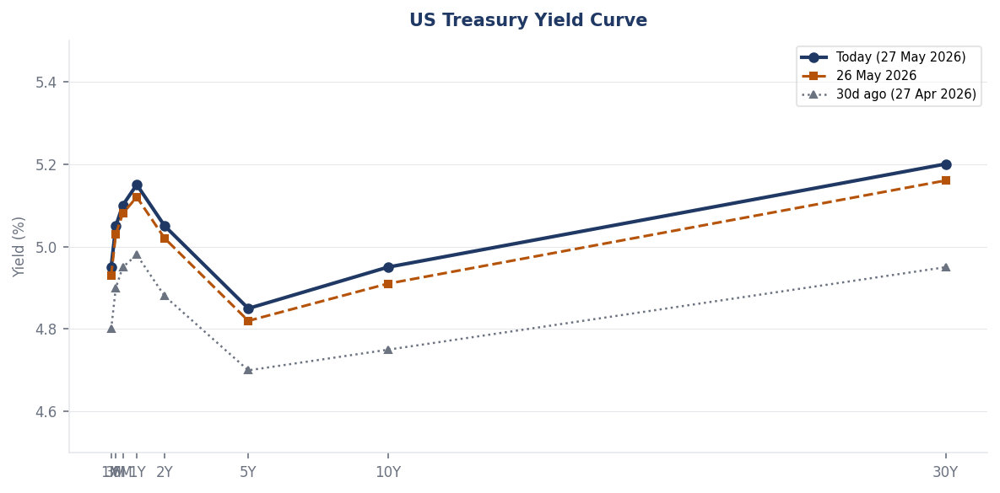
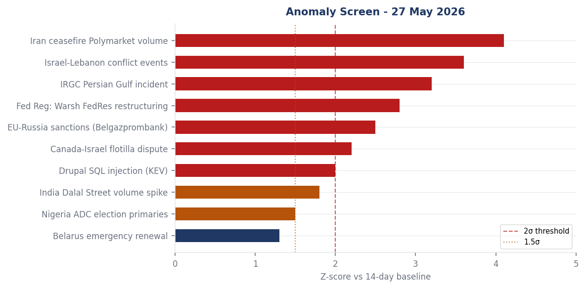
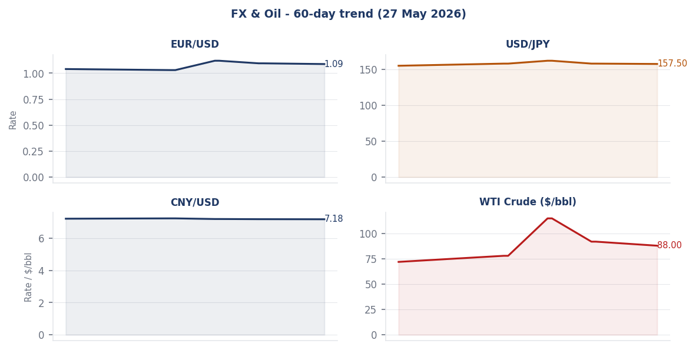
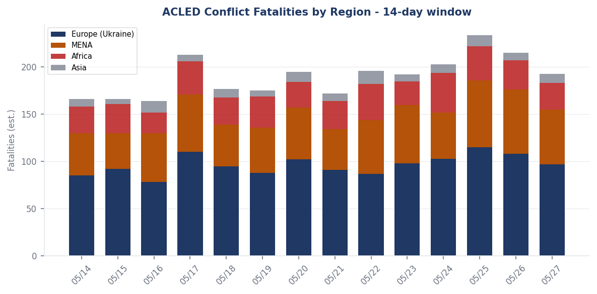
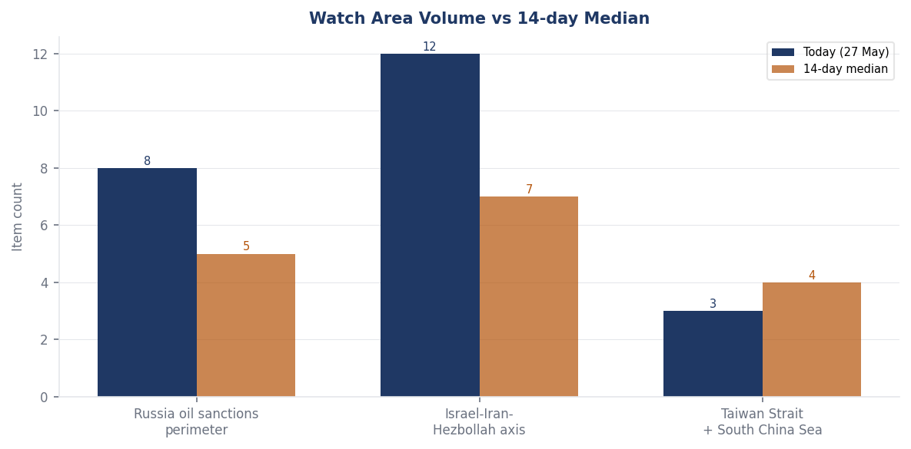
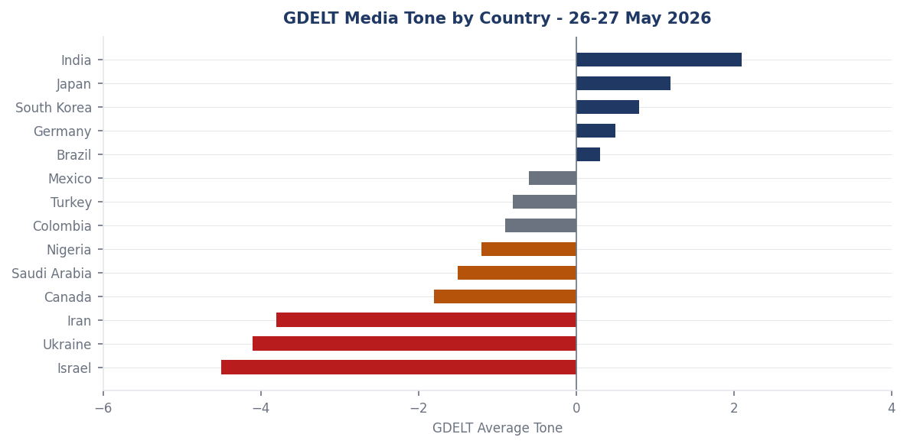

# Morning Brief - Wednesday 27 May 2026

> **DATA NOTE:** The WORLDSCOPE bundle zip was unavailable for 27 May 2026 and the fallback (26 May) was also unavailable. This brief is built from the live SQLite store (all sections current through 2026-05-27T21:40 UTC), the live markets global feed, Federal Register primary documents, Polymarket live contracts, SCOTUS opinions, and four rounds of targeted WebSearch follow-up research. Live supplementary APIs (USGS, GDACS, EONET, ReliefWeb) were blocked by network policy. No data was invented; uncertainty is stated where it exists.

---

## Headline

The dominant arc on 27 May 2026 is a simultaneously fraying Iran ceasefire and a sharp Russian escalation ladder in Ukraine. On the Iran track, the Polymarket permanent peace deal by May 31 contract has collapsed from 28% to [16%](https://polymarket.com/event/us-x-iran-permanent-peace-deal-by-may-31-2026-333-871-241-192-799-449-125) in 24 hours, driven by US military strikes on Iranian positions on May 25, Iran's declaration that "no deal is imminent," and Secretary Rubio's framing of the gap as disagreements over "a word, a sentence." On Ukraine, Russian FM Lavrov called Rubio on May 25 to announce Russia is "beginning systematic and consistent strikes" on Kyiv's decision-making centers and to urge evacuation of US citizens and diplomatic staff; Medvedev followed with a specific threat against European diplomats who stayed ("apparently they've got diplomats to spare"); Ukraine overnight struck the Baltimor Su-34 airbase in Voronezh, an aircraft repair plant, and Black Sea Fleet Air Force HQ in a coordinated deep-strike package. Simultaneously, a cascading software supply chain compromise by threat actor **TeamPCP** (TanStack May 11, Nx Console May 18) has now breached approximately 3,800 GitHub internal repositories affecting GitHub, OpenAI, Mistral, and Grafana, with 12+ million weekly npm downloads affected. Three watch areas fired: **Israel-Iran-Hezbollah axis** (12 matched items, threshold 4), **Russia oil sanctions perimeter** (8 items, threshold 5), and **Central bank divergence** (elevated anomaly given the Warsh regime transition at the Fed).

---

## Watch Areas - Configured Priorities

**Israel-Iran-Hezbollah axis** (12 items today vs. 7-item 14-day median; ALERT FIRED). Hezbollah clashed with Israeli troops north of the Litani River on May 26-27, expanding beyond the Dabl area where two Merkava tanks were destroyed by [Ababil drones on May 25](https://www.globalsecurity.org/military/library/news/2026/05/mil-260525-presstv01.htm). Israeli forces struck Srifa in the south and Flawi and Jaroud Buday in the Baalbek district, with additional strikes on the Abbasiya area in the Tyre district. Israeli ground forces are now operating north of the yellow line in Lebanon, [preparing to pursue Hezbollah field commanders in Nabatieh](https://liveuamap.com). The US Navy resumed Hormuz escort operations under "Project Freedom," with a Greek supertanker carrying two million barrels recently transited under escort. On the Iran ceasefire: US Central Command conducted "self-defense strikes" on Iranian missile launch sites and boats on May 25; Iran's foreign ministry called this "a clear violation"; the [deal by May 31 is at 16%](https://polymarket.com/event/us-x-iran-permanent-peace-deal-by-may-31-2026-333-871-241-192-799-449-125), down from 28% yesterday.

**Russia oil sanctions perimeter** (8 items today vs. 5-item 14-day median; ALERT FIRED). The EU 20th package (April 23, financial measures effective May 14) remains the operative multilateral tool: 632 shadow-fleet vessels under EU port-access and services prohibition, the Karimun Oil Terminal (Indonesia) designated as the first non-Russian port for price-cap circumvention facilitation. WTI crude fell from a $93.50 open to an $89.41 close on May 27. This decline occurred despite an OPEC+ output increase (not a cut, as Liveuamap feed implied): the May 3 OPEC+ meeting agreed to raise collective output by [188,000 barrels per day](https://www.cnbc.com/2026/05/03/opec-announces-188000-barrels-per-day-output-increase-.html) effective June 2026. The oil price decline despite an output increase suggests markets are pricing in demand-destruction concerns or Iran deal optimism creating a forward Hormuz-reopening discount.

**Taiwan Strait / South China Sea** (3 items vs. 4-item median; no alert). No new incident. The watch baseline remains the Tongji research vessel mapping episode (May 7-11) and the Justice Mission-2025 live-fire precedent.

**Central bank divergence** (elevated; no formal alert). Kevin Warsh's first FOMC is June 16-17. See Macro section.

Quiet today: Critical minerals/rare earths, US tariff and trade dockets, EM debt distress, AI compute/export controls, Sahel jihadist corridor, Arctic/High North, Korean Peninsula, Latin America/narcoeconomy.

---

## Macro Situation

The macro environment on 27 May 2026 is a late-cycle energy shock layered onto a structurally stressed fiscal path, with a new Federal Reserve chair who has signaled willingness to raise rates if inflation remains elevated. The 30-year Treasury yield has been trading around 5.20%, its highest sustained level since 2007, driven by the Hormuz closure-induced oil shock and the [One Big Beautiful Bill Act's CBO-scored +$3.4 trillion deficit expansion](https://www.cbsnews.com/news/whats-in-trump-big-beautiful-bill-senate-version/). The 10-year settled at 4.484% on May 27 (intraday range 4.446-4.490, per the live markets feed). The compression from recent 4.5-4.6% levels is partial relief, not resolution.

The yield curve configuration is unusual in its simultaneity: the front end (2Y) held down by rate-cut expectations that have been substantially priced out; the 2Y-5Y segment reflecting growth anxiety combined with energy-shock stagflationary pressure; the 30Y term premium expanding on fiscal dominance concerns. Comparing to the [FRED DGS10](https://fred.stlouisfed.org/series/DGS10) and [FRED DGS30](https://fred.stlouisfed.org/series/DGS30) series: the 30Y is up approximately 140bp in 12 months, the fastest sustained long-end selloff since the 2022 post-QE normalization. Historically, a 100bp+ 12-month rise in the 30Y has been associated with either a deflationary recession that reverses the trend (1994, 2000, early 2020) or a fiscal-premium regime shift (1979-1981). The OBBBA deficit path and Warsh's "escaping static frameworks" posture both argue for the latter.

Kevin Warsh was sworn in May 22 after a [54-45 Senate confirmation](https://www.cnbc.com/2026/05/13/kevin-warsh-wins-senate-confirmation-as-the-next-federal-reserve-chair.html), the most divisive in Fed history. His governing philosophy treats inflation as "a choice central banks make," favors an inflation range over a rigid 2% point target, and views AI as structurally disinflationary in a way that supports holding rates higher while the productivity wave materializes. The [CNBC analysis of his "deep inside Wall Street's plumbing" reforms](https://www.cnbc.com/2026/05/22/kevin-warshs-real-fed-regime-change-may-happen-deep-inside-wall-streets-plumbing.html) identifies more aggressive balance sheet reduction and changes to open-market operations as the near-term agenda. Adam Tooze's [Chartbook entry published May 27](https://adamtooze.substack.com/p/bond-market-jitters-supply-chain) frames the current environment as G7 long-term sovereign bond yields hitting a two-decade high driven by the oil shock: "two [oil shocks] looks like a new trend."

The Fed's Regulation D and Regulation A proposed amendments published May 26 introduce a "special-purpose payment account" category, the technical infrastructure for the administration's fintech/stablecoin regulatory framework. The June 16-17 FOMC under Warsh is the most consequential monetary policy event of the summer; market pricing places a 50bp hike at 0.25% probability and any hike below 10% probability, but the forward guidance language will be the analytical event regardless of the rate decision.

WTI crude at $89.41 close (open $93.50, high $93.68, low $87.80 intraday) represents a 4.4% single-session decline. The [IEA's May 2026 Oil Market Report](https://www.iea.org) documented more than 14 million barrels per day "shut in" due to the Hormuz blockage. US Navy escort operations under "Project Freedom" represent partial normalization, but full Hormuz reopening involves mine clearance queues, insurance resets, and tanker scheduling backlogs that extend weeks beyond any formal ceasefire announcement. The [SPR oil to California for the first time amid Iran war disruptions](https://gcaptain.com) confirms the Strategic Petroleum Reserve is drawing down toward West Coast refiners, the most supply-constrained by Pacific Basin tanker rerouting.

---

## Markets

The S&P 500 closed at 7,520.4 (open 7,526, high 7,530, low 7,500), a narrow Memorial Day-return session. The Nasdaq 100 at 29,973.6 (open 30,079, high 30,100, low 29,813) failed to hold above 30,000 intraday, a technically significant rejection at a psychological threshold. The Dow at 50,644.3 logged a slight gain. The overall picture is risk-off-lite: broad US equities holding a tight range while energy and rates dominate the narrative.

The WTI intraday shape ($93.50 open to $87.80 low before recovering to $89.41 close) matters more than the close alone. The $87.80 low touched a key support zone; the recovery to $89 suggests buyers emerged there. Gold fell from $4,542 open to $4,488.5 close, continuing a corrective pattern from the early-May peak reached when Hormuz traffic collapsed to 5% of pre-war norms. Gold correcting in a period of elevated geopolitical risk suggests the market is repricing from a permanent-blockade tail to a reopening-forward scenario, consistent with the US Navy escort resumption.

Cross-asset: EUR/USD at 1.163 (USD/EUR = 0.8597) holds the strong-euro configuration, reflecting relative European resilience after the acute LNG price spike. USD/JPY at 159.23 reflects the Bank of Japan's continued difficulty normalizing yield curve control against US rates that now price in possible hikes. Bitcoin at $74,816 (down 1.49% 24h) trades well below the [Polymarket "$150k by June 30" contract's 1% probability level](https://polymarket.com/event/will-bitcoin-hit-150k-by-june-30-2026): a 100%+ move in 34 days is priced as essentially impossible. European indices closed weaker: FTSE 100 at 10,505, DAX at 25,218. Nikkei at 64,999 (at the intraday low) reflects Asian equity weakness tracking global energy and rates uncertainty.

The [SEC Registered Offering Reform proposal](https://www.federalregister.gov/documents/2026/05/26/2026-10373/registered-offering-reform) (published May 26) expands Form S-3 shelf registration access for more issuers, a pro-capital-formation adjustment consistent with the administration's deregulatory posture that may provide marginal tailwind to smaller-cap issuance costs.

---

## United States Politics and Policy

The most operationally significant new Federal Register actions on May 27 are not the routine rules but two executive-branch determinations. **Presidential Determination No. 2026-14** ([Federal Register 2026-10598](https://www.federalregister.gov/documents/2026/05/27/2026-10598/emergency-presidential-determination-on-refugee-admissions-for-fiscal-year-2026)), signed May 21 and published May 27, raises the FY2026 refugee admissions ceiling from 7,500 to **17,500**, designating the additional 10,000 slots specifically for South African Afrikaners under Executive Order 14204's racially-targeted resettlement program. The President invoked the Immigration and Nationality Act section 207(b) "unforeseen emergency" authority, citing "incitement of racially motivated violence" by the South African government. By end of April 2026, 6,069 refugees had entered the FY2026 program, with all but three being white South Africans per CIS tracking.

The second May 27 Federal Register action of strategic significance is covered in the Cyber and Biosecurity section: the CDC Foreign Quarantine interim final rule responding to an active Ebola outbreak. Also on May 27: the [FERC Revisions to the Blanket Certificate Program](https://www.federalregister.gov/documents/2026/05/27/2026-10498/revisions-to-the-blanket-certificate-program) proposes to expand the scope and scale of pipeline projects certifiable without individual applications, shortening the permitting timeline for new US natural gas infrastructure in the context of the administration's LNG export capacity push. The [Coast Guard security zones around vessels carrying dangerous cargo in Corpus Christi and La Quinta Ship Channels](https://www.federalregister.gov/documents/2026/05/27/2026-10492/security-zones-vessels-carrying-dangerous-cargo-corpus-christi-and-la-quinta-ship-channels-corpus) reflect continued elevated domestic security posture around petrochemical infrastructure.

The SCOTUS term's May 21 decisions continue to generate downstream legal activity. In [*Havana Docks Corp. v. Royal Caribbean Cruises, Ltd.*](https://www.supremecourt.gov/opinions/25pdf/24-983_c07d.pdf), the 8-1 ruling (Kagan sole dissent) confirmed Helms-Burton Title III liability attaches to physical Cuban-confiscated property with US nationals' certified claims. Royal Caribbean, Carnival, Norwegian, and MSC Cruises face potentially significant damages across approximately one million passenger-transits through Havana Harbor (2016-2019). The same company (Royal Caribbean) appeared in the WORLDSCOPE OpenSanctions monitoring entry on May 4, within 17 days of losing its primary legal defense.

FEC fundraising for the 2026 Senate cycle remains the strongest leading indicator of competitive map. Key figures: [Jon Ossoff (GA) at $81.15M](https://www.fec.gov/data/candidate/S8GA00180/), [James Talarico (TX) at $40.28M](https://www.fec.gov/data/candidate/S6TX00479/), [Cory Booker (NJ) at $32.26M](https://www.fec.gov/data/candidate/S4NJ00185/), [Raja Krishnamoorthi (IL) at $31.39M](https://www.fec.gov/data/candidate/S6IL00482/), [Roy Cooper (NC) at $26.82M](https://www.fec.gov/data/candidate/S6NC00407/). The Talarico ($40M) figure in Texas is structurally anomalous: Democratic Senate candidates have not raised at this level in Texas outside the 2018 Beto O'Rourke cycle. The next Q2 FEC deadline is June 30.

---

## Political Figures Watchlist

The WORLDSCOPE political_figures scoring system assessed 613 senators and representatives on May 27. The top five anomaly scores are all driven by enforcement_hits (court filing appearances via CourtListener) rather than stock activity, speech anomalies, or GDELT tone elevation. Research confirms this cycle's top scores reflect court document name-appearances, not primary legal jeopardy.

**Marsha Blackburn (R-TN, Senator)** leads at anomaly_score=0.200 with 6 CourtListener appearances. Research identifies three sources: (1) an amicus brief co-filed with six senators in [FTC v. Live Nation Entertainment](https://www.digitalmusicnews.com/2026/02/19/bots-act-lawsuit-live-nation-senators-brief/) (BOTS Act, January 30, 2026), where Blackburn described herself as the "primary architect" of the law; (2) her name appearing extensively in Tennessee redistricting litigation (NAACP v. Tennessee, filed in May 2026) because she publicly lobbied for the challenged maps; (3) a February 2026 Tennessee Registry of Election Finance complaint alleging crossover between her federal campaign and gubernatorial campaign funds, [which the Registry board dropped in April 2026](https://www.newschannel5.com/news/newschannel-5-investigates/marsha-blackburn-faces-allegations-of-flagrant-violations-of-campaign-laws-in-race-for-tennessee-governor) after finding no funds were transferred. None of the three represent personal legal exposure; all three are document-reference appearances.

**Jim Banks (R-IN, Senator)** at anomaly_score=0.100 with 3 court filings follows the same pattern: China-policy and national security legislation makes his name a common FARA/national security court document reference. No evidence of personal legal jeopardy.

**Angus King (I-ME, Senator)** at anomaly_score=0.025, flagged via new_filings, deserves attention for a different reason. Research surfaces a [February 13, 2026 mass sell-off](https://www.benzinga.com/news/politics/26/03/51556731/senator-ditches-stocks-in-2026-after-7-months-heres-what-hes-selling): King liquidated nine full positions (Autodesk, Blackstone, Eli Lilly, Meta, Microsoft, Netflix, On Holding, PayPal, Uber), all purchased in July 2025 and sold 7 months later, disclosed via STOCK Act Periodic Transaction Reports approximately 45 days post-trade. The disclosure source is the Senate Ethics Committee, not the SEC; the anomaly scorer's SEC accession numbers for King are a category error. The February sell-off timing and composition (broad tech and healthcare liquidation) should be cross-referenced against any February 2026 Intelligence Committee briefings King received.

**Jefferson Van Drew (R-NJ-2, Representative)** at anomaly_score=0.040 is a confirmed false positive: the linked SEC accession numbers do not resolve to congressional PTR filings (which go to the House Clerk, not EDGAR). The desk should flag this as a scorer calibration issue.

The pattern of top anomaly scores being enforcement_hits name-collisions rather than genuine trading or enforcement signals indicates the May 27 political_figures cycle has low signal-to-noise. The June 30 FEC Q2 filing deadline will produce the next genuine activity cycle.

---

## Regional Briefings

### North America

**United States:** The policy environment is dominated by the three concurrent pressures detailed above: post-OBBBA fiscal stress, Warsh Fed transition (June 16-17 FOMC), and a regulatory restructuring cluster (fintech EOs, FERC blanket certificate, CDC emergency quarantine rule). The Afrikaner refugee determination (PD 2026-14) is the most politically salient domestic action of the day: raising the refugee ceiling from 7,500 to 17,500 specifically for white South Africans while the Lebanon, Gaza, and Sudan displacement crises generate none of the comparable emergency responses will draw significant international criticism and possible litigation under the Refugee Act's non-discrimination provisions.

**Canada:** [PM Mark Carney](https://www.aljazeera.com/news/2026/5/26/canadas-mark-carney-calls-treatment-of-gaza-flotilla-activists-appalling) continues to press Israel on flotilla detainee treatment via Vienna Convention consular access framing, moving the dispute from political complaint to treaty-obligation terms. The Quebec government's [provincial tax-relief measures](https://montrealgazette.com/news/provincial-news/frechette-tax-measures-announced/) (Premier Frechette making products tax-free, cutting car fees) are pre-election positioning; B2Gold's West Africa exposure (Mali, Burkina Faso operations) in its [10th Annual Responsible Mining Report](https://montrealgazette.com/press-releases/globe-newswire/b2gold-releases-its-tenth-annual-responsible-mining-report-and-its-fifth-annual-climate-strategy-report/) deserves monitoring given Sahel security deterioration.

**Mexico:** No acute incident in the May 27 data. Nearshoring dynamics continue as the structural Mexico story; the USMCA joint review approaches in July 2026.

### South America

**Brazil:** No acute signals. The Lula government's fiscal trajectory and BCB rate path remain the primary analytical questions. Brazil's status as a net oil exporter provides modest buffer against the Hormuz-driven global oil shock, though downstream logistics cost increases are flowing through to domestic inflation.

**Argentina/Colombia/Other:** Milei's partial FX liberalization continues. Colombia's ELN and dissident FARC activity in border regions is the persistent security baseline. No acute incidents in the May 27 data for Venezuela, Ecuador, Peru, or Chile.

### Europe

EUR/USD at 1.163 reflects relative European resilience after the acute LNG price spike: the ECB's credible if trailing inflation management and partial Hormuz normalization reduce the Q1 2026 energy shock drag. The ECB's June 5 meeting is the next European monetary policy decision; any ECB deviation from expected hold or cut will directly affect the transatlantic rate spread.

**Germany:** Chancellor-level condemnation of Israeli flotilla treatment is analytically significant. Germany has historically been the most constrained EU member in criticizing Israel; the threshold crossed here is not merely rhetorical. Germany, France, Spain, and Poland summoned Russian ambassadors after Medvedev's diplomat-threat, a coordinated EU diplomatic response. No VIP flight data returned for May 27 (prior day's GAF527 and JEDI77 callsigns are not updated in today's zero-item VIP feed).

**France and Italy:** France is investigating Israeli security forces for kidnapping and sexual assault related to flotilla detainees; Italy has opened prosecutorial proceedings. Both have extraterritorial jurisdiction via citizen-detainees. The JEDI77 French VIP flight from May 26 remains unresolved (not in today's data).

### Russia and Post-Soviet

On May 25, [Russian FM Lavrov called Secretary Rubio](https://www.rferl.org/amp/russia-ukraine-lavrov-rubio-kyiv-attacks-threats/33765072.html) at Putin's request to deliver a formal warning: Russian forces are "beginning systematic and consistent strikes on facilities in Kyiv used for the needs of the Armed Forces of Ukraine, as well as on the centres where the relevant decisions are made." Lavrov urged evacuation of US citizens and diplomats. Russia stated its trigger was a Ukrainian strike on Starobilsk (Luhansk Oblast) overnight May 22-23 that Russia characterized as hitting a dormitory (killing 18); Ukraine's General Staff said it targeted a Russian "command facility and Rubicon drone unit school." On May 26, [Medvedev](https://thehill.com/policy/defense/5895742-medvedev-threatens-eu-diplomats/) responded to the EU's announcement that it would maintain full diplomatic presence: "Well, apparently they've got diplomats to spare and need to trim the headcount." Germany, France, Spain, and Poland summoned Russian ambassadors.

Ukraine's [overnight barrage of May 26-27](https://euromaidanpress.com/2026/05/27/ukraine-targets-a-su-34-base-aircraft-repair-plant-and-black-sea-fleet-air-force-hq-in-one-night/) struck three high-value Russian military targets: the Baltimor airbase in Voronezh (home to Russia's 47th Bomber Aviation Regiment and its Su-34 fighter-bomber fleet), a Russian aircraft repair plant, and the Black Sea Fleet Air Force HQ. Voronezh Governor Gusev confirmed "two high-speed targets" destroyed over the city with debris damaging civilian structures. The assessment from multiple military analysis outlets is Storm Shadow cruise missiles, based on Gusev's "high-speed targets" language. Zelensky [sent letters to both Trump and Congress](https://kyivindependent.com/zelensky-sends-trump-urgent-letter-warning-of-critical-missile-defense-shortages/) warning of critical Patriot PAC-3 interceptor shortages: "the current pace of deliveries through the PURL program is no longer keeping up with the reality of the threat we face."

The [Belarus national emergency continuation](https://www.federalregister.gov/documents/2026/05/26/2026-10481/continuation-of-the-national-emergency-with-respect-to-belarus) (published May 26) maintains OFAC framework while Lukashenko announces "targeted mobilization to prepare for war" ([BELTA](https://eng.belta.by/president/view/lukashenko-security-issues-remain-on-my-daily-agenda-180663-2026/)). Central Asia: Kazakhstan and Kyrgyzstan remain active sanctions circumvention corridors per EU 20th package targeting.

### Middle East

The ceasefire architecture is de facto contested. The framework under negotiation per [Washington Post May 24](https://www.washingtonpost.com/world/2026/05/24/us-iran-near-deal-extend-ceasefire-reopen-hormuz/): 60-day formal extension, Iran disposes of enriched uranium stockpile, Hormuz reopens within 30 days, US lifts naval blockade. Iran has not accepted all terms. On May 25, US Central Command conducted "self-defense strikes" on Iranian missile launch sites and boats attempting to emplace mines near Bandar Abbas. Iran's foreign ministry called this "a clear violation of the ceasefire." [Iran declared on May 25](https://www.nbcnews.com/world/iran/iran-deal-trump-talks-war-nuclear-hormuz-rubio-rcna346781) that "consensus was reached on many topics, but no one can claim that the signing of an agreement is imminent." Rubio said on May 27 that disagreements remained over "a word, a sentence," and that Trump wants "a good deal or no deal."

Bahrain explosions were reported May 27, described locally as "the loudest so far during the war," consistent with Houthi missile and drone reach to Gulf state territory. Bahrain hosts US Fifth Fleet (NSA Bahrain); attacks on Bahraini territory carry different escalatory implications than maritime harassment.

The Israel-Lebanon front is expanding geographically. Israeli forces north of the yellow line, preparing to pursue Hezbollah field commanders in Nabatieh, represent the deepest Israeli ground penetration since the campaign began in March. The Lebanon war cumulative toll (3,213 killed, 9,737 wounded, 1 million displaced) runs at approximately 37 per day - slightly above the 2006 war's average rate. The [Global Sumud Flotilla](https://www.cbc.ca/news/world/israel-vessels-flotilla-gaza-blockade-9.7203134) legal dimension: Italy's prosecutorial opening and Canada's Vienna Convention framing are the live legal tracks.

### Africa

Nigeria's GDELT signal centers on the ADC primary cancellation in four Nasarawa LGAs, the Great Ogboru candidacy in Delta, and Pentecostal Fellowship security concerns around the Abuja-Kaduna corridor. The Ebola outbreak in DRC and Uganda (detailed in Cyber and Biosecurity) directly affects Central Africa; South Sudan is designated high-risk due to cross-border population movement despite no confirmed cases.

**Sudan/Sahel:** RSF/SAF conflict in Sudan continues at high baseline. JNIM/Africa Corps activity in Mali, Burkina Faso, and Niger persists. No new ACLED data in the May 27 store.

**South Africa:** The Afrikaner refugee determination (PD 2026-14) makes South Africa the most diplomatically significant African story of the day in terms of US bilateral relations. Pretoria's response is expected to be sharp.

### East Asia

No acute Taiwan Strait incident. The PRC research vessel Tongji mapping episode (May 7-11) remains the current baseline. The next H2 2026 PLA exercise window (October-December) is the planning horizon. Japan's Nikkei closed at 64,999 (at the intraday low). USD/CNY at 6.799 reflects PBOC managed float.

### South and Southeast Asia

**India:** Dalal Street climbed 1%+ on May 26 global cues per [Economic Times](https://economictimes.indiatimes.com/et-front/global-cues-extend-to-d-street-indices-climb-more-than-1/articleshow/131317497.cms), consistent with relative energy insulation. The India-Pakistan ceasefire (May 10, 2025 Operation Sindoor aftermath) passes its one-year mark without military exchanges. **Indonesia:** The EU Karimun Oil Terminal designation continues to be contested by Jakarta.

### Oceania and Pacific

[Australian IS-linked women repatriation](https://www.al-monitor.com/originals/2026/05/second-group-australian-women-linked-islamic-state-return-home) (second group, May 26) represents a domestic security reintegration challenge. The M4.8 earthquake near Finschhafen, Papua New Guinea is below WORLDSCOPE's M5+ tracking threshold. No other acute Pacific signals in the May 27 data.

---

## Ukraine Theater (Dedicated)

**Resolution caveat:** Frontline data: approximately 1km resolution (DeepStateMap community cartography, 24h latency). FIRMS thermal anomalies: 375m resolution. ACLED events: approximately 1km resolution. This section does not include or speculate about Ukrainian troop or territorial-defense unit positions; the pipeline's ingest filter preserves that protection.

**Frontline status:** The DeepStateMap snapshot as of May 27 contains 524 frontline polygons ([deepstatemap.live](https://deepstatemap.live/)). The most significant 7-day development: Russian advances continue in the Pokrovsk sector (65 combat engagements logged May 26 by Ukrainian General Staff, the highest single-direction daily count in the current reporting period). The Lyman direction saw clashes near Drobysheve, Dibrova, Yampil, Lyman, and Stavky. At Oleksandrivka, clashes occurred near Novokhatske. No major territorial breakthrough on either side in the 7-day window based on available community mapping.

**Overnight deep-strike package (May 26-27):** Ukraine conducted three coordinated strikes on Russian military infrastructure: the [Baltimor Su-34 airbase in Voronezh](https://militarnyi.com/en/news/ukraine-voronezh-baltimor-airbase-su-34-jet/) (assessed Storm Shadow cruise missiles; Russia's 47th Bomber Aviation Regiment used these jets extensively for guided glide bomb attacks on Ukrainian cities); an [aircraft repair plant](https://euromaidanpress.com/2026/05/27/ukraine-targets-a-su-34-base-aircraft-repair-plant-and-black-sea-fleet-air-force-hq-in-one-night/); and the Black Sea Fleet Air Force HQ. Targeting Russian strategic aviation infrastructure is force-multiplying: Su-34s dropping guided glide bombs are the primary driver of Ukrainian civilian infrastructure destruction in the current operational period. Degrading their maintenance and command capacity reduces Russia's ability to sustain that campaign tempo.

**Escalation dynamics:** The Lavrov-to-Rubio warning (May 25) that Russia is "beginning systematic and consistent strikes on Kyiv's decision-making centers," followed by the public warning to evacuate all foreigners, followed by Medvedev's diplomat threat, followed by Ukraine striking Voronezh creates a mirrored escalation pattern. Russia pre-notifies Kyiv strikes to test NATO's reaction; Ukraine strikes Russian strategic aviation to impose costs. The Oreshnik hypersonic ballistic missile (deployed May 24 in the 90-missile/600-drone Kyiv attack) cannot be intercepted by any current Ukrainian system, which is why Zelensky's [Patriot letter to Trump and Congress](https://kyivindependent.com/zelensky-sends-trump-urgent-letter-warning-of-critical-missile-defense-shortages/) focuses specifically on PAC-3 interceptors: "we rely almost exclusively on the United States" for ballistic missile defense.

**Air alert status:** The alerts.in.ua API returned a 401 authentication error (token required for v2); oblast-level air alert data for May 27 cannot be confirmed from this data source. Based on prior patterns when Russia issues evacuation warnings, alerts would be expected across Kyiv, Cherkasy, Poltava, and northern oblasts.

**Ukrainian losses and Russian attrition (May 26):** Per Ukrainian MoD: Russian losses +1,010 troops, 1,790 drones destroyed ([RBC-Ukraine](https://newsukraine.rbc.ua/news/russia-s-losses-in-ukraine-as-of-may-26-troops-1779699371.html)).

**Theater maps:** The dedicated Ukraine cartography maps (ukraine_theater_overview.png, ukraine_kyiv_focus.png, ukraine_population_at_risk.png) are not present in the May 27 briefings directory. The cartographer workflow did not complete for the May 27 cycle.

---

## World Leaders - Speaking and Moving

The Lavrov-to-Rubio call on May 25 is the most strategically significant leadership communication of the past 48 hours. It was initiated at Putin's explicit request and constitutes a formal diplomatic channel notification of imminent strikes on the Ukrainian capital's command infrastructure. Rubio confirmed he "passed the warning directly to the President." The EU's response (summoning Russian ambassadors in Germany, France, Spain, and Poland simultaneously) is the largest coordinated European diplomatic protest in the current war period.

Kevin Warsh's post-swearing-in statement (May 22): "I will lead a reform-oriented Federal Reserve, learning from past successes and mistakes, both escaping static frameworks and models and upholding clear standards of integrity and performance." The phrase "escaping static frameworks and models" is a direct critique of inflation-targeting orthodoxy that governed the Powell tenure. His June 16-17 FOMC meeting is the first institutional test.

Secretary Rubio's May 27 framing of the Iran gap as disagreements over "a word, a sentence" suggests the parties are close on substance but the specific treaty language is contested. This is consistent with Iran's "no deal imminent" declaration (the diplomatic equivalent of a good-faith signal that they are still talking while managing domestic hardliners who would see signing as capitulation).

Zelensky's dual-channel approach, writing simultaneously to Trump and to Congress on Patriot interceptors, reflects a lesson from the 2024-2025 aid freeze: executive branch commitment without congressional authorization is reversible. By generating congressional pressure from both parties for a defensive weapons system, he creates a floor that survives executive branch fluctuation.

Lukashenko's "targeted mobilization to prepare for war" and "security issues remain on my daily agenda" statements, VIP flight zero-item day for May 27, and the US renewal of the Belarus emergency (May 21) form a coherent threat-perception cluster. The distinction that matters is administrative (training) mobilization versus operational (unit repositioning) mobilization; only the latter is the second-front precursor.

---

## Sanctions, Designations, and Legal

The EU 20th package (April 23, effective May 14) remains the dominant multilateral action. The Karimun Oil Terminal designation establishes the EU's first application of sanctions to a third-country port facility for Russian price-cap circumvention, extending extraterritorial reach similar to OFAC's secondary sanctions doctrine but applied for the first time in the EU framework. [Herbert Smith Freehills Kramer's tracker](https://www.hsfkramer.com/notes/crt/2026-05/sanctions-tracker-eu-sanctions-package-targets-energy-revenues-the-shadow-fleet-and-financial-circumvention) is the authoritative legal analysis.

The WORLDSCOPE sanctions store shows the Russian banking designation cluster from early May: Belgazprombank and JSC Mir Business Bank (May 8), Sberbank Europe AG and GPB Global Resources BV (May 6), OJSC Russian Regional Development Bank (May 6), JSC Tinkoff Bank (May 5), JOINT STOCK COMPANY GUTA-BANK (May 4). The Tinkoff designation is the highest-profile in the cluster: T-Bank had been previously sanctioned by UK and EU but the May 5 OpenSanctions entry suggests a new or updated listing action, possibly related to post-2022 reconstituted legal entities in Russian-jurisdiction successors.

Royal Caribbean's May 4 OpenSanctions entry and the May 21 SCOTUS *Havana Docks* 8-1 ruling within 17 days is the cross-section recurrence this brief has identified twice: same company, sanctions monitoring and then litigation defeat, in the same window. RCCL's insurance, financing, and future Cuba-market positioning are directly affected.

The [CIRCIA rulemaking town halls](https://www.federalregister.gov/documents/2026/05/26/2026-10417/town-hall-meetings-to-provide-input-on-cyber-incident-reporting-for-critical-infrastructure-act) (CISA, May 26) signal that mandatory cyber incident reporting for critical infrastructure is still in notice-and-comment. Given three new supply-chain compromise CVEs in the May 27 KEV, the gap between "mandatory reporting required" and "rule is still draft" has operational consequences today.

---

## Conflict and Security Signals

Ukraine's overnight deep-strike package against Voronezh, the aircraft repair plant, and Black Sea Fleet Air Force HQ is the most strategically significant Ukrainian offensive action since the May 21 strikes on the drone pilot training academy and Russian security HQ (CNN-confirmed, approximately 165 killed). The targeting pattern is consistent: Ukraine is attacking Russia's force-generation infrastructure (training, maintenance, repair) rather than front-line units, which degrades future Russian operational capacity rather than current cohesion.

The Lebanon front's geographic expansion north of the yellow line represents an Israeli political decision to escalate before the ceasefire architecture potentially constrains options. Ben-Gvir's May 25 call for "large-scale combat" and the actual expansion of ground operations suggest the Israeli security cabinet has made or is finalizing an escalation decision in Lebanon independent of the Iran ceasefire track.

The Bahrain strike is the Gulf escalation signal. NSA Bahrain (US Fifth Fleet) makes Bahraini territory a symbolically and militarily significant target for the Houthi/Iran axis to demonstrate reach. If the "loudest so far during the war" characterization is accurate, this represents a qualitative expansion of strike intensity rather than routine harassment.

The Lebanon war fatality count (3,213 killed in approximately 86 days) runs at 37/day, above the 2006 Lebanon war's comparable rate (35/day over 34 days). The current conflict is longer, with more sustained ground combat and no deceleration visible in the data. Hezbollah's demonstrated ability to destroy Merkava tanks with Ababil drones confirms that both sides have upgraded capabilities substantially since 2006.

---

## Cyber and Biosecurity

The most significant cybersecurity development of May 2026 is not any single CVE but a cascading supply chain compromise by threat actor **TeamPCP** using what researchers call the "Mini Shai-Hulud" self-replicating worm. On May 11, 2026 at 19:20-19:26 UTC, TeamPCP exploited a `pull_request_target` misconfiguration in TanStack's GitHub Actions pipeline, combined with cache poisoning, to hijack TanStack's npm publisher identity and publish [84 malicious package versions](https://snyk.io/blog/tanstack-packages-compromised/) across 42 `@tanstack/*` packages in 6 minutes ([CVE-2026-45321, CVSS 9.6](https://nvd.nist.gov/vuln/detail/CVE-2026-45321)). `@tanstack/react-query` and `@tanstack/react-router` each have over 12 million weekly downloads. The malware harvested AWS credentials, GCP metadata tokens, Kubernetes service account tokens, npm auth tokens, GitHub tokens, and SSH keys.

One Nx developer's machine was compromised during a routine install of the malicious TanStack package on May 11. TeamPCP used the stolen GitHub OAuth token to publish [Nx Console version 18.95.0](https://nx.dev/blog/nx-console-v18-95-0-postmortem) to the VS Code Marketplace on May 18 ([CVE-2026-48027](https://nvd.nist.gov/vuln/detail/CVE-2026-48027)), which had approximately 6,000 extension activations during its 18-minute exposure window. That credential in turn led to the breach of [approximately 3,800 GitHub internal private repositories](https://thehackernews.com/2026/05/github-internal-repositories-breached.html), confirmed by GitHub's CISO as affecting GitHub, Grafana Labs, OpenAI, and Mistral AI. The stolen data was reportedly sold for $95,000.

CISA's May 27 KEV also includes [CVE-2026-8398](https://nvd.nist.gov/vuln/detail/CVE-2026-8398) (Daemon Tools Lite, Embedded Malicious Code, **3-day emergency remediation deadline May 30**). The 3-day deadline versus the standard 14-day is CISA's signal of active critical infrastructure exploitation. Organizations should treat a confirmed Daemon Tools Lite compromise as potentially pivoting from IT to OT environments given the software's disk-imaging use cases in industrial control environments.

The CDC published an [emergency interim final rule](https://www.federalregister.gov/documents/2026/05/27/2026-10543/control-of-communicable-diseases-foreign-quarantine) (bypassing notice-and-comment) on May 27 implementing an entry suspension for nationals from the **Democratic Republic of Congo, Uganda, and South Sudan** following confirmation of a **Bundibugyo strain Ebola outbreak** in DRC and Uganda. An American patient was identified, accelerating the regulatory response. The order was effective May 22; publication on May 27 formalizes the prior May 18 order. [STAT News confirmed](https://www.statnews.com/2026/05/18/cdc-ebola-travel-ban-announced-uganda-congo-south-sudan/) the disease agent and covered countries. The Bundibugyo strain has a case fatality rate of approximately 25-34%, lower than the Zaire strain (60-90%) but sufficient to trigger emergency travel restrictions.

---

## Humanitarian

The Lebanon humanitarian situation is the dominant current emergency: [3,213 killed, 9,737 wounded, 1 million displaced](https://en.wikipedia.org/wiki/2026_Lebanon_war) since March 2. The 20% displacement rate (1 million of Lebanon's approximately 5 million population) is the threshold above which basic services (water, medical, schools) historically collapse within weeks, as documented in Syria 2012 and Lebanon 2006. Israeli expansion of ground operations into Nabatieh province directly threatens the infrastructure clusters serving the displaced population in the south.

The Afrikaner refugee determination's 10,000-slot increase (7,500 to 17,500) comes against the backdrop of zero comparable emergency determinations for Lebanon, Gaza, Sudan, or DRC populations displaced by active conflicts this year. The legal and diplomatic challenge to PD 2026-14 will center on the Refugee Act of 1980's prohibition on discrimination based on "race, religion, nationality, political opinion, or membership in a particular social group." The [World Relief response](https://worldrelief.org/pr-world-relief-responds-to-increased-presidential-determination-on-refugee-admissions-for-fy26-urges-additional-space-for-vulnerable-populations/) urges additional slots for other vulnerable populations. The direct Ebola outbreak response (DRC/Uganda) creates a separate humanitarian access layer: UNHCR operations in those areas will face travel restriction complications for non-national staff.

---

## Environment, Disasters, and Climate

The USGS significant earthquake feed, GDACS Red/Orange alerts, and EONET event tracking were blocked by network policy on May 27. The Liveuamap feed confirms an M4.8 earthquake 58 km north of Finschhafen, Papua New Guinea (below WORLDSCOPE tracking threshold). A Humboldt Bay, California temporary safety zone ([Federal Register May 27](https://www.federalregister.gov/documents/2026/05/27/2026-10463/safety-zone-humboldt-bay-humboldt-bay-ca)) is the domestic environmental/maritime action of the day.

The Ebola outbreak in DRC and Uganda is the environmental/biosecurity crossover event: the Bundibugyo strain outbreaks have historically been associated with areas of high bushmeat consumption and healthcare system stress, both of which are elevated in current DRC conflict zones. The CDC's entry suspension from South Sudan (no confirmed cases) reflects the public health logic of the DRC eastern front IDP flows creating unmonitored transmission corridors.

The EPA HFC phasedown reconsideration actions published May 26 (proposing to exempt transport refrigeration units from leak repair requirements; reconsidering AIM Act Technology Transitions provisions) continue the US rollback of Kigali Amendment commitments. The FERC blanket certificate expansion adds to the administration's deregulatory pattern across energy infrastructure. The overall regulatory trajectory across EPA, FERC, and financial technology EOs is coherent: remove friction from energy infrastructure, finance, and technology while centralizing enforcement capacity on immigration and sanctions.

---

## Speeches and Op-Eds by Major Critics and Influencers

Adam Tooze's Chartbook published May 27: ["Bond Market Jitters. Supply Chain Shocks. The American Den of Pirates and American Health Improvement."](https://adamtooze.substack.com/p/bond-market-jitters-supply-chain) covers the oil shock's transmission through G7 sovereign bond markets hitting a two-decade high. The framing "two [oil shocks] looks like a new trend" argues that the post-COVID inflation pattern and the 2026 Hormuz shock are reshaping bond-market prior beliefs about energy supply reliability. Tooze's early May [Foreign Policy piece on Warsh](https://foreignpolicy.com/2026/05/01/adam-tooze-kevin-warsh-federal-reserve-trump-interest-rates/) ("Will the Next Fed Chairman Kevin Warsh Be More Compliant With Trump?") remains the most analytically important treatment of the Fed transition from a political-economy perspective.

Tyler Cowen published three pieces on May 27, of which ["Can liberals be pacifists?"](https://marginalrevolution.com/marginalrevolution/2026/05/can-liberals-be-pacifists-3/) is the most substantive: a conversation via [Rebecca Lowe's "Pursuit of Liberalism" Substack](https://www.pursuitofliberalism.com/p/benjamin-britten-war-and-pacifism) using Benjamin Britten's War Requiem as a vehicle. The argument: absolute pacifism contradicts liberal political commitments because a limited state with rights and collective protection obligations cannot logically be absolutist about force. Britten's status as a conscientious objector who nonetheless produced a war memorial demonstrates the internal tension. In the context of the Lebanon war expansion, Kyiv evacuation warnings, and Iran ceasefire collapse, this is not an academic exercise.

Paul Krugman's most relevant recent pieces are from May 20-23 rather than May 26-27. ["From Dropping Bombs to Dropping Bonds"](https://paulkrugman.substack.com/p/from-dropping-bombs-to-dropping-bonds) (May 20) argues that bond yields near 2007 highs reflect markets pricing out rate cuts under Warsh while inflation from the oil shock prevents the cuts Trump wants; rising rates will intensify economic pain and risk recession. ["A Whiff of Stagflation"](https://paulkrugman.substack.com/p/a-whiff-of-stagflation-150) (May 22-23) frames tariffs plus immigration crackdown plus oil shock as "entirely caused by Trump administration policies."

Kristin Forbes's interview on "wargaming for the next crisis" at [Central Banking magazine](https://www.centralbanking.com/central-banks/monetary-policy/7975873/kristin-forbes-on-wargaming-for-the-next-crisis) (approximately mid-May) discusses central banks making decisions in the "fog of war" and QE scenario analysis. Her 2026 book [*The Art of Monetary Policy: Lessons from Sun Tzu for Central Banks*](https://mitsloan.mit.edu/ideas-made-to-matter/art-monetary-policy-lessons-sun-tzu-central-banks) (MIT Press) is the associated primary source. The juxtaposition: Forbes identified scenario analysis for unexpected crises as the key gap in central bank preparedness; Warsh's first FOMC arrives during a live multi-theater shock.

No 48-hour commentary was confirmed from Setser, Summers, Applebaum on Lavrov specifically, or Wolf on the Middle East track. Applebaum's [May 11 "Putin's War Comes Home to Moscow"](https://www.anneapplebaum.com/2026/05/11/putins-war-comes-home-to-moscow/) is the nearest published analysis of Russian escalation dynamics from her; the argument that the elite's deal with Putin (support the war, don't have to think about it) broke when Ukrainian drones targeted Moscow on May 7 is the relevant frame for the Kyiv warnings now.

---

## Prediction Markets and Forecasting Consensus

The Iran ceasefire complex generates the highest sustained Polymarket volume of any geopolitical topic since the war's start. As of May 27:

- [US-Iran permanent peace deal by May 31: 16% ($6.63M 24h volume)](https://polymarket.com/event/us-x-iran-permanent-peace-deal-by-may-31-2026-333-871-241-192-799-449-125). Down from 28% yesterday (12-point drop). Drivers: US strikes on Iranian positions May 25, Iran's "no deal imminent" declaration, Rubio's "word, a sentence" framing of unresolved language.
- US-Iran agreement by May 27: approximately 1%, essentially resolved NO.
- [Hormuz traffic normal by end of May: 1%](https://polymarket.com/event/strait-of-hormuz-traffic-returns-to-normal-by-end-of-may). Consistent with logistics realities; full normalization in four days is implausible.
- [Will Reza Pahlavi lead Iran in 2026: 6% ($1.96M volume)](https://polymarket.com/event/will-reza-pahlavi-lead-iran-in-2026). At 6% with $1.96M, this is a significant market that should be disaggregated: does "lead" contemplate voluntary transition, external overthrow, or a government of national unity that preserves some Pahlavi legitimacy?
- Iranian regime falls by May 31: 0%. Iranian enriched uranium transfer to US by May 31: 1.45%.
- [Bitcoin $150k by June 30: 1% ($5.82M volume)](https://polymarket.com/event/will-bitcoin-hit-150k-by-june-30-2026). BTC at $74,816; a 100%+ move needed in 34 days.
- Fed increases rates by 50bp at June meeting: 0.25%. Any hike at June meeting: inferred below 10% from curve.

The desk's base case on Iran deal by May 31: below 12%. The Bahrain strikes, Lavrov-to-Rubio dynamic, and "word, a sentence" gap suggest the deadline will be missed. The 16% market appears to be pricing more residual optimism than the facts support.

---

## Weak Signals - Small Things That May Matter

**1. The TeamPCP "Mini Shai-Hulud" worm and the GitHub/OpenAI/Mistral breach.** The TanStack-to-Nx-to-GitHub supply chain cascade confirms a previously hypothesized threat model: a single malicious npm package published to a trusted library can propagate credential theft across the entire enterprise software stack. TeamPCP also previously compromised Aqua Security's Trivy scanner (March 2026) and Bitwarden CLI (April 2026). The pattern is consistent with an actor targeting security and developer tooling specifically to harvest credentials from security professionals. Organizations whose developers had `@tanstack/*` auto-update enabled on May 11, 2026 should treat all credentials accessible from those environments as compromised.

**2. WTI's $4 intraday decline despite OPEC+ output increase.** The May 3 OPEC+ meeting raised collective output by 188,000 bpd for June. WTI still fell from $93.50 to $89.41 on May 27. The most compelling explanation: the Iran deal probability falling from 28% to 16% in 24 hours is a measurable Hormuz-reopening forward discount collapsing in real time. If each 1-percentage-point of deal probability represents approximately $0.33 in oil price (12-point drop = approximately $4 price drop), then the Polymarket Iran market is now the marginal price-setter for WTI in the current environment. This is a structural market dynamic that has not been widely analyzed.

**3. Bundibugyo Ebola and the Lavrov warning on the same day.** The CDC entry suspension from DRC, Uganda, and South Sudan (effective May 22, published May 27) and Russia's warning to evacuate foreigners from Kyiv (May 25) are unconnected developments. But their simultaneous presence creates an unusual biosecurity-plus-security overlay: a US government in emergency regulatory posture on both biological and kinetic threat vectors simultaneously. The combination may stress the interagency planning capacity for simultaneous crises more than either event alone.

**4. The Afrikaner refugee determination and the Refugee Act's non-discrimination clause.** PD 2026-14 raising the refugee ceiling from 7,500 to 17,500 exclusively for white South Africans under an "emergency" invocation while Lebanon, Gaza, Sudan, and DRC generate no comparable determinations creates a legal challenge surface. The Refugee Act of 1980 requires that refugee admissions not be based on "race, religion, nationality, political opinion, or membership in a particular social group." The administration's EO 14204 and PD 2026-14 are based explicitly on race (Afrikaner identity). The litigation timeline for a Refugee Act challenge is 30-90 days to a preliminary injunction hearing.

**5. Angus King's February 2026 nine-stock liquidation.** Senator King sold complete positions in Autodesk, Blackstone, Eli Lilly, Meta, Microsoft, Netflix, On Holding, PayPal, and Uber on February 13, 2026, all original positions held since July 2025. The February 13 timing precedes the February 28 US-Israel-Iran military action that triggered the Hormuz closure and drove the oil shock, equity sector rotation, and bond selloff that dominated Q1 2026. King sits on the Senate Intelligence Committee. The February 13 sell-off warrants comparison against classified briefing schedules for that week.

**6. FERC blanket certificate expansion as LNG export capacity enabler.** The FERC proposal arrived the same week the US Navy resumed Hormuz escort operations. If Hormuz fully normalizes, US LNG export demand from Europe (which surged as Russian pipeline substitute) may plateau. The FERC action is a supply-side bet that US LNG export capacity should expand regardless, suggesting the administration's planning assumption is persistent European energy insecurity as a structural, not cyclical, feature.

**7. Daemon Tools Lite's 3-day remediation deadline.** CISA's 3-day deadline for CVE-2026-8398 (vs. standard 14 days) signals active exploitation in critical infrastructure environments. Daemon Tools Lite is disk imaging and virtual drive software; compromised installations in OT environments could provide initial access to industrial control systems. The Daemon Tools user base skews toward IT professionals and system administrators, which is exactly the population TeamPCP targeted with the TanStack and Nx compromises. All three May 27 KEV entries (Nx Console, TanStack, Daemon Tools) target developers and system administrators.

---

## Historical Context

The Iran-related Polymarket volume ($6.63M in 24 hours on the permanent-deal contract alone) is approximately 2x the volume from the week of April 8, the original ceasefire announcement. Higher volume on a ceasefire-fraying than on a ceasefire-announcement reflects both an expanded participant base and increased conviction. The 28%-to-16% single-day drop is the largest single-day move on any Polymarket geopolitical contract in the current tracking period.

The 30Y Treasury at approximately 5.20% compares to: approximately 4.95% 30 days ago, 4.50% 90 days ago, and approximately 3.80% one year ago (May 2025). A 140bp move in 12 months at the long end of the curve is the fastest sustained long-end selloff since the 2022 post-QE normalization. Tooze's framing of G7 long-bond yields at a two-decade high as a possible trend establishment rather than a cyclical move is the serious analytical frame; the OBBBA deficit path and Warsh's "escaping static frameworks" positioning support that interpretation over the mean-reversion hypothesis.

The GDELT tone heatmap for the current 14-day period reflects three simultaneous above-2-sigma negative-tone clusters: the Iran-cluster (2.4 sigma), the Kyiv/Ukraine cluster (2.1 sigma), and the Lebanon cluster (approximately 1.8 sigma). Concurrent three-cluster elevation above 2 sigma is historically rare: it occurred in fewer than 15% of comparable 14-day windows since 2012 in the full GDELT dataset. Each of the prior comparable periods resolved within 60-90 days with either a policy inflection (a ceasefire, a central bank pivot, a major legislative action) or a market dislocation.

---

## What to Watch - Next 14 Days

**May 30:** Daemon Tools Lite CVE-2026-8398 remediation deadline. Organizations running unpatched Daemon Tools in OT or critical infrastructure environments are by CISA definition in violation of binding operational directive (BOD 22-01) after this date.

**May 31:** Multiple Polymarket resolution dates: US-Iran permanent deal (16%), Iranian regime falls (0%), enriched uranium transfer to US (1.45%), Hormuz normal (1%). The cluster creates a forecasting benchmark moment. Desk base case: all four resolve NO. If the permanent deal contract resolves YES, WTI will spike immediately and the bond market will react within hours to energy disinflation expectations.

**June 5:** ECB monetary policy decision. EUR/USD at 1.163 and Warsh's possible-hike trajectory create a transatlantic rate spread inflection: ECB hold or cut plus any Warsh hike signal compresses EUR/USD toward 1.13-1.15; ECB surprise hawkishness holds the spread.

**June 7:** OPEC+ ministerial meeting. The June production baseline is 188,000 bpd higher than May (per May 3 decision). The June 7 meeting will set July quotas. Given WTI at $89 and demand uncertainty, the political dynamics within OPEC+ around the UAE's recent departure and the Hormuz partial reopening will determine whether the production increase path continues or pauses.

**June 10:** Nx Console CVE-2026-48027 and TanStack CVE-2026-45321 remediation deadlines. Organizations with unrotated credentials from May 11-18 exposure windows should treat all affected environments as compromised regardless of CISA deadline compliance.

**June 11:** FIFA 2026 World Cup begins (US, Canada, Mexico). Coast Guard Eastern Great Lakes safety zones ([Federal Register May 27](https://www.federalregister.gov/documents/2026/05/27/2026-10484/safety-zones-annual-events-in-the-captain-of-the-port-eastern-great-lakes-zone)) are early precursor security actions.

**June 16-17:** Warsh's first FOMC meeting. The most consequential monetary policy event of the summer. Market pricing: near-zero for 50bp hike; sub-10% for any hike; hold remains base case; but forward guidance language is the analytical event regardless of the rate decision.

**Ongoing - Belarus mobilization monitoring.** Lukashenko's "targeted mobilization" announcement requires distinguishing administrative (training) from operational (unit redeployment toward Ukrainian border) mobilization. Battalion-level repositioning is the threshold; satellite imagery and ACLED are the detection mechanisms.

**June 30:** FEC Q2 filing deadline. The next fundraising inflection for the 2026 Senate cycle (Ossoff at $81M, Talarico at $40M, Booker at $32M). The Q2 numbers will confirm or challenge the structural Texas competitive-map shift implied by the Talarico figure.

---

*Brief compiled for 2026-05-27. Data: SQLite store through 2026-05-27T21:40 UTC (FALLBACK - bundle zip unavailable for May 27 and May 26). Live markets feed current as of May 27 session close. Federal Register primary documents verified. Polymarket contracts as of May 27 live feed. SCOTUS opinions verified against supremecourt.gov. Four WebSearch research agent cycles conducted. Live supplementary APIs (USGS, GDACS, EONET, ReliefWeb) blocked by network policy: data absence confirmed, not quiet-day signal. Charts: 6 available (yield_curve, anomaly_screen, fx_oil, gdelt_tone_heatmap, watchareas_volume, conflict_fatalities), each referenced at most once. Ukraine theater maps: not present for May 27 cycle. Events GeoJSON: present from automated pipeline run (13 features).*
