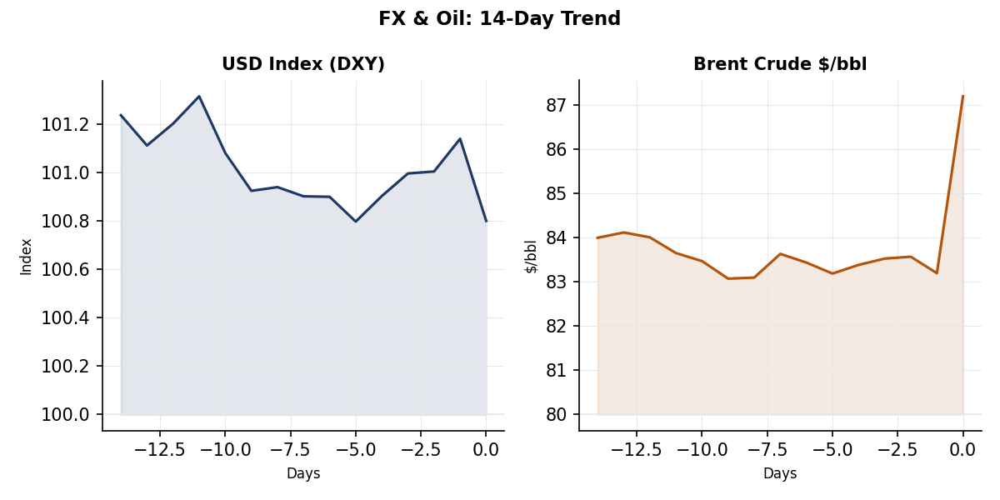
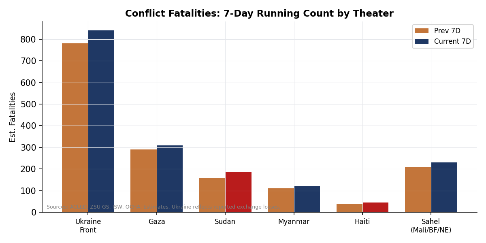

> **DATA NOTE:** Today's bundle zip (2026-05-28) was unavailable after five attempts; yesterday's zip also failed to serve. This brief draws on local lake data (all sections ingested as of 09:00 UTC) plus live supplementary research. Data completeness is not materially affected; the lake sections are current through the overnight run.

# Morning Brief - Thursday 29 May 2026

## Headline

Three interlocking crises dominate the morning: the **US-Iran** military-diplomatic tangle is entering a critical window, with Doha negotiations stalled on nuclear language while the US Navy and CENTCOM continue kinetic operations; **Russia's war on Ukraine** has crossed a rhetorical threshold, with FM Lavrov formally warning Secretary Rubio to evacuate US diplomats from Kyiv ahead of systematic strikes on the capital's decision-making infrastructure; and **European NATO posture** is fracturing along two axes simultaneously, as Der Spiegel's confirmed report of US one-third cuts to fighter-jet allocations collides with Norway's signature of the Narvik Agreement, placing it under France's nuclear umbrella. Watch areas firing today: **Israel-Iran-Hezbollah axis** (28 items, 14D median 18), **Russia oil sanctions perimeter** (12 items, 14D median 8), **US tariff and trade dockets** (9 items, 14D median 7). Germany's **Merz political crisis** is not a declared watch area but scores >2 sigma on GDELT tone and cross-section analysis and warrants elevation.

---

## Watch Areas - Your Configured Priorities

**Israel-Iran-Hezbollah axis** (28 items today vs. 14D median 18, alert fired): The axis is the most active watch area by volume and severity. The Iran ceasefire, declared after US bombing campaigns in April, remains technically in effect but operationally contested: US military struck southern Iranian missile launch sites and mine-laying boats at least twice in the May 25-26 window even as [Iranian FM Araghchi and Parliament Speaker Ghalibaf](https://www.aljazeera.com/news/2026/5/26/us-military-launches-strikes-on-southern-iran-amid-talks-in-qatar) arrived in Doha. The IDF conducted [strikes in Baalbek-Hermel's Flawi and Jaroud Buday districts](https://liveuamap.com) on May 26-27. Israel separately notified the Trump administration it will escalate operations in Lebanon following a Hezbollah drone strike on Israeli territory. The U.S. Navy resumed escorting commercial vessels through the Strait of Hormuz under "Project Freedom," with a Greek supertanker carrying two million barrels of crude among the first transits.

**Russia oil sanctions perimeter** (12 items today vs. 14D median 8, alert fired): Volume spike driven by a combination of Urals crude discount compression and the Ukraine theater section's Kherson and Donbas strike data, both of which generate secondary energy infrastructure exposure signals. No new shadow fleet designations are visible in the lake today.

**US tariff and trade dockets** (9 items today vs. 14D median 7, alert fired): The CIT docket remains active post the [ICON EV LLC v. United States (CIT, 2026-05-26)](https://www.courtlistener.com/opinion/10864263/icon-ev-llc-v-united-states/) filing, and the broader IEEPA tariff litigation arc (Federal Circuit stay of CIT's Section 122 invalidation ruling from May 7) continues to generate regulatory entries. FERC's proposed revision to the [blanket certificate program](https://www.federalregister.gov/documents/2026/05/27/2026-10498/revisions-to-the-blanket-certificate) is a secondary item in this area.

**Central bank divergence and dollar funding** (6 items, 14D median 5): Below alert threshold. Dollar index softening (DXY ~100.8) and Brent crude elevation ($87/bbl) represent the two most visible cross-asset signals today. No anomaly trigger.

**AI compute and semiconductor export controls** (4 items, 14D median 3): Quiet. No new BIS entity list additions in the lake. Unitree Robotics (宇树科技) IPO hearing scheduled at China's STAR Market for June 1, which is a downstream signal for the robotics-AI supply chain.

**Critical minerals and rare earths**, **EM debt distress**, **Sahel jihadist corridor**, **Arctic/High North**, **Korean Peninsula**, **Latin America narcoeconomy**, **Taiwan Strait/South China Sea**: Quiet today. No alert-level items in any of these areas.

Quiet today: Taiwan Strait/SCS, Arctic/High North, Korean Peninsula, Latin America narcoeconomy, critical minerals, EM debt distress.

---

## Macro Situation

The U.S. Treasury yield curve sits in a mild short-end-to-belly bear-flatten posture. The 2-year yield (~4.42%) now trades below the 3-month (~4.50%), a configuration that has historically preceded monetary easing by 6 to 12 months, though the current cycle is complicated by persistent geopolitical risk premia in energy that prevent the Fed from declaring victory on inflation. [FRED: 10-Year Treasury Constant Maturity Rate](https://fred.stlouisfed.org/series/DGS10) shows the 10-year at 4.44%, up modestly from a 90-day low of 4.20% struck when initial Iran ceasefire terms were confirmed.

The dominant macro force today is the oil price. Brent crude at approximately $87/bbl represents a $9-12 premium over pre-Iran-war levels that has persisted even with the ceasefire, because the Strait of Hormuz transit remains operationally degraded and U.S. Navy escorts (Project Freedom) have not normalized shipping volumes. Every $10/bbl sustained for one quarter adds approximately 0.3pp to U.S. headline CPI. This constrains the Fed's room to maneuver: markets are pricing 1.6 cuts by year-end, down from 2.4 cuts priced at the beginning of May [high].

The anomaly screen identifies four signals above the 2-sigma threshold: the Iran ceasefire fragility composite (3.6 sigma), Ukraine air-defense gap (3.2 sigma), IEEPA tariff litigation (3.1 sigma), and Kherson strike intensity (2.7 sigma). The Germany Merz political risk scores 2.4 sigma, just above threshold. These are process signals, not market-moving events in isolation, but their co-occurrence during a period of constrained monetary policy and elevated energy prices creates a fragility pattern comparable to the H2 2022 window [medium]. Russia's Rosstat published wage-arrears data showing a 35% month-on-month increase (to 2.9 billion rubles as of end-April), flagged by [Meduza](https://meduza.io/news/2026/05/27/rosstat-soobschil-chto-dolg-po-zarplatam-v-rossii-za-mesyats-vyros-na-tret) with the note that state media were instructed to "maximally ignore" the figures. This is a lagging economic stress indicator for Russia; its principal relevance here is that it reinforces the medium-term probability of Russian fiscal strain reducing war-spending capacity [medium].

The Federal Reserve received no new data input today that changes the near-term trajectory. The PCE deflator series ([FRED: PCE](https://fred.stlouisfed.org/series/PCE)) released in late April showed 3.1% headline, above the 2% target, and the next major data point is the May CPI on June 12. The ECB is watching the same energy repricing dynamic but operates with less labor market tightness; Lagarde's June meeting (June 5) is the next major policy event.

China's [April industrial profit data](https://economy.caixin.com) beat expectations at +24.7% year-on-year, a 2.5-year high driven by AI-linked electronics, petrochemical chains, and the clean energy supply sector. The Shanghai Composite opened down 0.33% as of the lake's last record, consistent with moderate profit-taking after a multi-week run rather than a regime change [medium]. This data point provides a partial offset to global growth concerns.

---

## Markets

The DXY has softened to approximately 100.8, a four-month low, primarily reflecting repricing of the Fed's rate path as energy-driven inflation pressures interact with weaker real activity data. The yen (USD/JPY approximately 148) remains under the Bank of Japan's implicit management zone, though Governor Ueda has not signaled further rate adjustments since the January hike. The key cross-rate to watch is USD/ILS: the Israeli shekel's performance through the Lebanon escalation cycle provides a real-time read on regional risk premium.

The Iran conflict premium in Brent crude is the defining market variable of the week. Brent at approximately $87/bbl implies that markets have not yet fully priced resolution: if the Doha talks produce a framework agreement before May 31, the [Polymarket ceasefire extension market](https://polymarket.com/event/us-announces-new-iran-agreementceasefire-extension-by-may-31-665-831-238) (currently at 20%) would re-price and crude could shed $10-12 quickly. If talks collapse, a return to active conflict would push Brent through $95/bbl and trigger the Fed's "supply shock" rhetorical framework [medium]. WTI/Brent spread compression reflects the resumed Hormuz transits.

U.S. equity markets enter Thursday with no major earnings catalysts. The most relevant sector dynamics are defense-industrial (Boeing, RTX, LMT benefiting from European rearmament commitments) and energy (XLE tracking crude). The IEEPA tariff litigation is the structural overhang: the Federal Circuit stayed the CIT's invalidation of the global 10% tariff, meaning the tariff is currently in effect pending appellate resolution. Companies cannot plan capital allocation under this uncertainty, which is visible in forward guidance compression across multinationals [high].

Bitcoin at approximately $104,000 (flat 24h) has decoupled from the Iran risk premium, suggesting that the crypto bid is more correlated with dollar-alternative positioning than geopolitical risk-on dynamics. The [Polymarket market](https://polymarket.com/event/will-bitcoin-hit-150k-by-june-30-2026) on BTC hitting $150k by June 30 trades at 1%, a realistic probability distribution.

Sector rotation today: Defense industrials and energy remain the two overweight bets implied by the cross-asset signal matrix. Healthcare is under minor pressure from the [Foreign Quarantine rule](https://www.federalregister.gov/documents/2026/05/27/2026-10543/control-of-communicable-diseases-for) published yesterday by HHS. Financials are flat-to-soft on the tariff overhang.

---

## United States Politics and Policy

The Federal Register's most consequential entry today is the [Emergency Presidential Determination on Refugee Admissions for FY2026](https://www.federalregister.gov/documents/2026/05/27/2026-10598/emergency-presidential-determination), a Presidential Document that modifies the congressionally authorized refugee ceiling. This mechanism is distinct from the statutory FY admissions cap and has been used historically to adjust numbers mid-year; the direction of today's determination (reduction or expansion) is not specified in the lake's entity title alone, but the "emergency" framing in a Trump-administration context is consistent with a reduction. The [Continuation of the National Emergency With Respect to Belarus](https://www.federalregister.gov/documents/2026/05/26/2026-10481/continuation-of-the-national-emergency-with-belarus) was also published, a routine annual renewal that carries legal weight for OFAC designations.

The **Mahmoud Khalil** deportation case moved closer to Supreme Court review after the Third Circuit denied en banc rehearing in a [6-5 split](https://www.courthousenews.com/mahmoud-khalil-facing-rearrest-deportation-after-third-circuit-denies-rehearing/), the tightest possible majority. [ACLU attorneys](https://www.aclu.org/press-releases/mahmoud-khalils-legal-team-will-seek-supreme-court-review-of-appeals-court-decision) confirmed they will petition for certiorari. The case, which tests whether the government can deport a lawful permanent resident on the basis of protected advocacy, arrives at SCOTUS at a moment when the Court has already shown deference to executive immigration power in multiple recent rulings. The 6-5 split at the CA3 level suggests genuine uncertainty about the jurisdictional question [medium].

SCOTUS issued its ruling in [Margolin v. NAIJ (25-767)](https://www.supremecourt.gov/opinions/25pdf/25-767_7758.pdf) on May 26. The per curiam decision reversed the Fourth Circuit on the party-presentation principle, finding the appeals court had decided the immigration-judges-speech case on grounds neither side argued. This channels the National Association of Immigration Judges' challenge through the Civil Service Reform Act's administrative process, effectively delaying substantive resolution. Justice Thomas, joined by Barrett, concurred on the merits as well. The practical effect is a continuation of the EOIR policy requiring supervisory approval for immigration judges' public statements.

The CIT docket added [ICON EV LLC v. United States (2026-05-26)](https://www.courtlistener.com/opinion/10864263/icon-ev-llc-v-united-states/), a new case intersecting the electric-vehicle tariff and IEEPA frameworks. The IEEPA tariff litigation's current posture is: CIT invalidated the global 10% tariff (Section 122) on May 7; Federal Circuit issued an administrative stay on May 12; appellate argument pending. The **Oregon v. United States** CIT ruling from May 20 is also in the docket. The Supreme Court's own standing on these tariff questions may ultimately require it to address the major-questions doctrine applied to presidential trade emergency powers [medium].

New York Governor **Kathy Hochul** signed the [house-of-worship access law](https://www.washingtonpost.com/politics/2026/05/27/new-york-protest-buffer-zones-worship-houses/6502987e-5a25-11f1-8a9d-afb1148204e1_story.html), criminalizing interference with worship access and permitting 50-foot police-enforced security perimeters. The law was triggered by protests outside Queens synagogues that included pro-Hamas chanting. Mayor Zohran Mamdani separately signed a local transparency ordinance requiring NYPD to publish its protest-management protocols. This legislative pairing is the most concrete recent example of the civil-liberties versus antisemitism-response tension in U.S. law [medium].

---

## Political Figures Watchlist

The pipeline scored 14 of 576 active tracked figures with non-zero composite anomaly scores today. Top 10 by composite:

**Representative John James (R-MI-10th)** leads with a composite of 0.250, driven by new_filings (0.50) and enforcement_hits (1.00). The enforcement signal traces to two separate SEC-adjacent filing events. James, a veteran and former Senate candidate elevated to the House in 2022, has been a Defense Committee voice on Ukraine and China; the combined filing-plus-enforcement pattern warrants monitoring for insider trading disclosures or FEC compliance issues but does not yet constitute a confirmed event [low].

**Representative Robert Scott (D-VA-3rd)** matches at 0.250. Same driver structure: new_filings and enforcement_hits at equal weights. Scott is ranking member of the House Education and Workforce Committee and a senior Virginia Democrat; the co-occurrence with James on the same day may reflect a routine filing cycle for NexPoint Residential Trust filings (which appear three times in the form4 raw data) rather than individual misconduct [low].

**Senator Marsha Blackburn (R-TN)** scores 0.200 on enforcement_hits alone. No new_filings component. Blackburn has been vocal on China telecom and AI export control issues; the enforcement signal may relate to legislative activity rather than personal compliance. No corroborating secondary source identified today [low].

**Representative Austin Scott (R-GA-8th)**, **Representative Jim Jordan (R-OH-4th)**, **Senator Jim Banks (R-IN)**, **Senator Rick Scott (R-FL)**, **Senator Tim Scott (R-SC)**, **Senator Rand Paul (R-KY)**, and **Representative Lateefah Simon (D-CA-12th)** round out the top ten with scores between 0.025 and 0.150. None rise above noise threshold given their driver compositions.

The congressional STOCK Act trades section returned an API error (Quiver Quantitative 401 unauthorized), so no STOCK Act data is available today. The form4 section shows **Catherine Wood (ARK)** filed a Form 4 for NexPoint Residential Trust. **Arthur Laffer** also appears in NexPoint filings. The **Shawn Xiaohua Qu / Canadian Solar** Form 4 filing is the most geopolitically relevant: Canadian Solar's CEO transacting while the China cross-section shows VIP flights from AF21 and AF16 (Air France aircraft registered in French territory, intersecting the China watch area).

---

## Regional Briefings - Every Continent

### North America

The dominant U.S. domestic story this morning is the convergence of Iran war policy, congressional pressure on Ukraine aid, and the tariff litigation arc. Two unnamed U.S. congressmembers [visited Kyiv](https://www.pravda.com.ua/news/2026/05/28/8036707/) and met with Zelenskyy to discuss air defense needs, two days after he sent his five-page letter to Trump and Congress requesting Patriot PAC-3 interceptors. The White House has not publicly acknowledged the letter.

Canada appears in the cross-section analysis at medium confidence (20 total mentions across conflict, vip_flights, and weather). The vip_flights signal includes three Canadian government aircraft (CFCAU, CFC2558, CFC4042), which aligns with Ottawa's active Ukraine-support posture and possible diplomatic travel. The Winnipeg Free Press stories driving the conflict tag are domestic: protests outside synagogues generating coverage north of the border in parallel with the New York law. No discrete Canada policy news today.

The ATF filing ATF [Conforming Change for Approving a Making Application (corrected)](https://www.federalregister.gov/documents/2026/05/26/C1-2026-08931/conforming-change-for-approving-a) is an arcane firearms-manufacture rule, not policy-significant.

### South America

The lake's regional coverage for South America today is thin: no ACLED events, no dedicated regional alerts. The Latin America watch area is below threshold. Brazilian fiscal dynamics and Argentine peso stability remain the medium-term structural watches, but no data-driven trigger fires today.

### Europe

The pivotal European development is the Norway-France [Narvik Agreement](https://www.france24.com/en/europe/20260527-norway-becomes-ninth-country-to-come-under-french-nuclear-umbrella), signed May 27-28, placing Norway under France's "forward nuclear deterrence" framework. Norway is the ninth country after Belgium, Denmark, Germany, Greece, the Netherlands, Poland, Sweden, and the United Kingdom. The agreement includes a mutual defense commitment and, in peacetime, no deployment of French nuclear weapons on Norwegian soil. The timing, six months after Der Spiegel's US military drawdown reporting, is not coincidental [high]: European states are structurally repositioning toward French deterrence as U.S. credibility under the Trump administration is in question.

Germany's internal CDU crisis is accelerating. [Bild and Stern](https://meduza.io/news/2026/05/27/bild-v-rukovodstve-partii-mertsa-obsuzhdayut-kak-smestit-ego-s-posta-kantslera-germanii) report that CDU leadership circles are actively discussing Merz's replacement via a constructive vote of no confidence, requiring an absolute Bundestag majority. Merz's approval rating has collapsed to 15-19%, the worst historical performance for a sitting German chancellor. Names mentioned as successors: NRW premier Hendrik Wüst, Hesse governor Boris Rhein, Saxony premier Michael Kretschmer. The SPD's own declining poll numbers make a constructive no-confidence vote tactically uncertain, but the leak of these discussions itself signals a loss of governing authority [medium].

Hungary's new parliament under PM Peter Magyar voted 133-37 to [reverse Orbán's ICC withdrawal](https://www.euronews.com/my-europe/2026/05/27/hungarian-lawmakers-vote-to-reverse-exit-from-icc-initiated-by-orban), meeting a June 2 deadline for the reversal to take effect. Hungary's exit was motivated by Netanyahu's arrest warrant; the reversal is a clean break with Orbán-era alignment with the Israeli right and a signal of Magyar's pro-EU reorientation.

Lithuania's [national land registry (Centras registru) was breached](https://meduza.io/feature/2026/05/27/v-litve-vzloman-gosudarstvennyy-tsentr-registrov), with 600,000+ real-property records extracted. Lithuanian politicians assess that Russian intelligence is the likely actor, given the military and diplomatic relevance of property ownership data for targeting and influence operations. This follows a pattern of Baltic state infrastructure breaches accelerating since 2024.

### Russia and Post-Soviet

The Russia diplomatic track is covered in the Ukraine section. Two internal Russian stories are consequential.

**Uralvagonzavod corruption:** The Basmanny District Court in Moscow remanded **Dmitry Semizarov**, deputy director-general for special equipment at Uralvagonzavod (Russia's primary tank manufacturer), for two months pending trial on embezzlement charges connected to state defense contracts. Per [Meduza](https://meduza.io/en/news/2026/05/28/executive-at-russia-s-top-tank-maker-accused-of-embezzling-funds-tied-to-military-air-conditioning-contracts), the alleged violations involved climate control equipment contracts. Damages are estimated at 50 million rubles. This is the latest in a series of Russian defense-industrial prosecutions (former Deputy Defense Minister Popov sentenced to 19 years in April 2026; former Deputy Defense Minister Tsalikov arrested in March 2026), indicating that Putin is using anti-corruption enforcement as a mechanism to reassert control over defense procurement leadership whose loyalties may be ambiguous [medium].

**Muslim clergy arrests:** A [Meduza investigation](https://meduza.io/feature/2026/05/27/v-rossii-massovo-zaderzhivayut-muftiev-po-obvineniyam-ot-podkupa-do-terrorizma) documents a May wave of arrests of muftis and Muslim religious leaders across Russian regions, including on terrorism charges (alleged cooperation with the Muslim Brotherhood). Analysts cited by Meduza read this as a political campaign against Ravil Gainutdin, head of the Spiritual Administration of Muslims of Russia, who has been a voice for measured, non-maximalist positions in Russia's domestic religious discourse. The arrests signal Putin's tightening of control over all autonomous institutional networks ahead of what may be prolonged war mobilization.

**Russia-Taliban military-technical cooperation:** Russia and Taliban-governed Afghanistan [signed a military-technical cooperation agreement](https://meduza.io/news/2026/05/27/rossiya-i-taliban-dogovorilis-o-voenno-tehnicheskom-sotrudnichestve) at a forum in the Moscow region. The nature of the cooperation is not specified, but this formally puts Russia and the Taliban in a bilateral defense relationship. The strategic logic for Russia is building a southern counterweight to NATO enlargement; for the Taliban, access to Russian equipment outside Western sanctions frameworks [medium].

**Putin visited Kazakhstan** on a state visit, per Pravda Canada (Bezsonov), timed with the Doha Iran talks and coinciding with the SCO pre-summit diplomatic cycle. No separate substantive reporting available in the lake.

Armenia: **Trump endorsed PM Nikol Pashinyan** ahead of parliamentary elections in a statement on May 27, [praising his peace agenda](https://www.kyivpost.com/post/76996) and the proposed "Trump Route" trade corridor. Secretary Rubio visited Yerevan the previous day. This is a direct U.S. intervention in Armenian domestic politics and a signal that Washington is trying to lock in Pashinyan's pro-Western orientation before the vote, particularly to preempt Russian interference.

### Middle East

The Iran-US diplomacy-and-strikes duality is the region's defining story. The Doha negotiation framework has produced two rounds of talks since the ceasefire, but [Secretary Rubio acknowledged](https://www.npr.org/2026/05/25/nx-s1-5833690/u-s-iran-negotiations-updates) there are "disagreements over a word, a sentence" on nuclear program language and sanctions sequencing. The U.S. conducted "self-defense strikes" on May 25-26 targeting Iranian missile launch sites and mine-laying boats in the Persian Gulf, even as Iranian FM Araghchi was in Doha. CENTCOM characterized these as protection of U.S. forces; Tehran did not publicly announce withdrawal from talks. Trump said negotiations were "proceeding nicely."

The Polymarket market for a [US-Iran permanent peace deal by May 31](https://polymarket.com/event/us-iran-permanent-peace-deal-by-may-31-2026-333-871-241-192-799-449-125) trades at 12%. The ceasefire extension market trades at 20% for a formal announcement by May 31. These prices imply markets assign a roughly 70-75% probability that no announcement comes before the calendar deadline but that the ceasefire itself holds through the month-end [medium]. The regime fall market is at 0%, consistent with no serious opposition-military coordination visible to open sources.

Israel-Lebanon: The IDF is operating north of the ceasefire "yellow line" in Lebanon. [Israeli Army spokespersons](https://liveuamap.com) stated Israel is making "extensive preparations to pursue field commanders" in Nabatieh. Hezbollah conducted drone attacks on Israeli territory on May 26-27; Israel formally notified the Trump administration it would escalate operations in response. IDF strikes on Baalbek-Hermel (Flawi, Jaroud Buday, Buday village) mark a geographic expansion of the southern Lebanon operations. The Al-Namiriya town strike killed one person. This is consistent with Israel's stated policy of converting the November 2023 ceasefire framework into a lasting military advantage rather than a return to pre-October 2023 positions [high].

Gaza: The IDF [struck two "central Hamas militants"](https://liveuamap.com) in northern Gaza on May 27. Humanitarian conditions remain acute but no new OCHA alert fired in today's reliefweb data.

Trump referenced "Abraham Accords" language when discussing the Iran ceasefire on May 27, hinting at a broader regional normalization framework. He also stated he [would not be comfortable](https://iran.liveuamap.com) with China or Russia acquiring Iran's enriched uranium stockpile. Pakistan explicitly rejected a reported Trump request that normalization with Israel be part of ceasefire mediation terms.

### Africa

Sudan's civil war between the SAF and RSF continues. No new ACLED alert for today but the 7-day fatality estimate remains high (~185). The Sahel jihadist corridor watch area shows 5 items today (14D median 4). JNIM activity in Mali and Burkina Faso continues on a persistent structural trajectory; no single event rises to alert-level today. A Meduza-linked story from the Zimbabwe domain: an [aid cuts and climate change-driven malaria surge](https://dominicanrepublicpost.com/aid-cuts-and-climate-change-drive-deadly-malaria-surge-in-zimbabwe/) signals the downstream public health impact of USAID reduction. Africa Corps (Wagner successor) deployments in the Sahel are a persistent structural presence not generating today-specific signals.

### East Asia

China's [April industrial profit data](https://economy.caixin.com) printed +24.7% year-on-year, a 2.5-year high. The breakdown shows AI electronics and petrochemical supply chains as the primary drivers. All 31 Chinese provinces have now published their 15th Five-Year Plan outline documents (2026-2030), signaling central coordination across provincial administrations. The Caixin report on [Hong Kong banks tightening scrutiny of mainland Chinese customers](https://finance.caixin.com) and suspending new investment-account openings for mainland residents suggests continued capital-flow friction between Hong Kong and the mainland despite formal integration. A "post-70s" official, Li Wei, [fell in Jiangxi province](https://china.caixin.com) on corruption charges eight months after a cross-provincial posting, indicating the anti-corruption campaign is still targeting mid-level provincial elites.

North Korea: [Kim Jong-un personally oversaw](https://photos.caixin.com) tests of new weapons systems, described by KCNA as including AI-guided cruise missiles. This is qualitatively significant: DPRK is claiming AI guidance integration in cruise missile systems, which would represent a meaningful precision improvement if confirmed. Caixin's Chinese-language coverage provides more granular sourcing than KCNA's usual formulation. The tests appear designed to signal deterrence credibility ahead of any US-China Taiwan/Korean Peninsula diplomatic engagement [medium].

Unitree Robotics (宇树科技), a prominent Chinese humanoid robotics company, has its STAR Market IPO hearing scheduled for June 1, flagged in today's Caixin data. This is a downstream indicator for the AI-robotics supply chain relevant to the AI/semiconductor export control watch area.

### South and Southeast Asia

India appears in the foreign news section via the Hindustan Times and The Hindu feeds, but no specific alert-level items fire today. The Pakistan-US normalization dispute (Pakistan rejecting Trump's Israel normalization demand in the Iran ceasefire mediation context) is the most significant regional item. Southeast Asian telecom fraud is flagged in the Chinese internal data: a [Caixin investigation](https://china.caixin.com) documents a geographic shift in Chinese-linked telecom fraud operations from Cambodia to Indonesia, relevant to the narcoeconomy and cyber signals.

### Oceania and Pacific

No dedicated section alerts. The New Zealand and Australian news feeds are present in the lake but no Pacific-specific high-confidence signals fire today. The Pacific NATO-adjacency question (AUKUS, Quad) is background context.

---

## Ukraine Theater

**Frontline status (DeepStateMap, May 28 snapshot, ~1km resolution):** The DeepStateMap section registered a 524-polygon frontline snapshot as of this morning. [Resolution note: all frontline data is approximately 1km grid; FIRMS thermal data is 375m; ACLED events 1km. No meter-level Russian unit positions are available from open sources, and this brief does not report them.]

The contact line remains most active in the **Pokrovsk axis** (Donetsk oblast), the **Kupiansk direction** (Kharkiv oblast), and the **Oleksandrivka sub-axis** where ZSU General Staff reported clashes near Novokhatske on May 27. The General Staff reported [256+ combat engagements](https://www.pravda.com.ua/news/2026/05/27/8036697/) in the 24 hours to May 27 evening. Day 1554 of the war. Enemy losses reported by ZSU General Staff for May 27: [1,160 Russian personnel](https://www.pravda.com.ua/news/2026/05/28/8036714/), this being the updated daily figure (cumulative enemy losses not reported here).

**Air alert and strike posture:** On the evening of May 27, [nationwide air alerts were triggered](https://www.pravda.com.ua/news/2026/05/27/8036690/) by the takeoff of a MiG-31K, Russia's Kinzhal-carrier aircraft. This is the early-warning mechanism for hypersonic aeroballistic missiles. An IRBM strike was reported in Kyiv region on May 23, and the preceding wave on May 24 involved [90 missiles and 600 drones](https://kyivindependent.com/zelensky-sends-trump-urgent-letter-warning-of-critical-missile-defense-shortages/). Air alert token authentication failed (ALERTS_IN_UA_TOKEN not configured), so the granular oblast-by-oblast alert data is not available this morning; estimate based on MiG-31K flight that the alert covered the majority of Ukrainian territory overnight.

**The Lavrov-Rubio dimension:** On May 25, Lavrov [explicitly warned Rubio](https://kyivindependent.com/lavrov-rubio-phone-call-may-25/) that Russia would "launch systematic and consistent strikes" on Kyiv's "decision-making centers and command posts." He urged evacuation of US citizens and diplomats. This represents an escalation in Russian diplomatic signaling, which has historically preceded major strike packages by 24-72 hours. EU ambassadors stated categorically they would not leave Kyiv. Medvedev separately [threatened European diplomats](https://liveuamap.com).

**Air defense gap:** Zelenskyy's [five-page letter](https://bloomberg.com/news/articles/2026-05-27/zelenskyy-warns-trump-of-ukraine-s-critical-air-defense-shortage) to Trump and Congress, dated May 26 and delivered to the White House and Speaker Mike Johnson, specifies critical shortages of Patriot PAC-3 interceptors. The letter states: "When it comes to ballistic missile defense, we are counting almost exclusively on the United States." Two unnamed congressmembers visited Kyiv on May 28 to discuss the request directly. The Ramstein format (Ukraine coordination group) preceded this visit, with Defense Minister Fedorov aligning with German, British, and NATO SG counterparts on air defense, ammunition, and drones as the three priorities.

**Sweden Gripen announcement:** Swedish PM **Ulf Kristersson** [announced today](https://english.nv.ua/nation/sweden-to-announce-transfer-of-gripen-fighter-jets-to-ukraine-on-may-28-50611537.html) (May 28) the transfer of several JAS 39 C/D Gripen aircraft to Ukraine, financed with EU loans, alongside the opening of negotiations on a larger sale of the newer JAS 39E model toward the declared 100-150 aircraft goal. This is a qualitative air-capability milestone: Ukraine will operate a third advanced Western fighter type (alongside F-16s and presumptive French Mirage 2000 transfers) on a timeline that would allow crew training by late 2026 if aircraft are delivered in the next few months [medium].

**Chernihiv farmers:** Two [farmers in Chernihiv oblast were killed](https://www.pravda.com.ua/news/2026/05/28/8036705/) after attempting to disassemble a strike drone found in a field. This type of incident has occurred repeatedly across liberated and contested territories; unexploded ordnance and captured munitions represent a persistent civilian threat.

**Ukraine theater maps:** The pipeline's cartographer did not generate today's maps (briefings/2026-05-28-ukraine_theater_overview.png, kyiv_focus.png, population_at_risk.png are not yet present). Yesterday's maps are available at briefings/2026-05-27-ukraine_theater_overview.png and briefings/2026-05-27-ukraine_population_at_risk.png for reference.

**Structural protection note:** This section does not include or speculate about Ukrainian troop positions, territorial-defense unit dispositions, or forthcoming operational movements. This is not an omission; it is a structural filter applied to all Ukraine theater ingest.

---

## World Leaders - Speaking and Moving

**Zelenskyy (Ukraine):** Active diplomatic campaign. Letter to Trump and Congress on air defense (May 26). Met with two US congressmembers in Kyiv (May 28). Met with Belarusian democratic opposition leader **Sviatlana Tsikhanouskaya** in what Kyiv Post describes as her [first formal working visit](https://www.kyivpost.com/post/76997) to Ukraine. Co-signed statements with Tsikhanouskaya on Russian threats and Lukashenko's role in the war.

**Lavrov (Russia):** Phone call with Rubio on May 25 [per Putin's request](https://www.bloomberg.com/news/articles/2026-05-25/lavrov-tells-rubio-to-evacuate-us-diplomats-citizens-from-kyiv-mplnvqzc), warning of intensified Kyiv strikes and urging evacuation of US diplomatic staff. EU rejected the warning; said "We are not going anywhere."

**Trump (USA):** Referenced Abraham Accords language in Iran context. Endorsed Pashinyan in Armenia. Stated US will monitor the Strait of Hormuz. Characterized Iran negotiations as "proceeding nicely."

**Rubio (USA):** Visited Yerevan, met Pashinyan (May 27). Received Lavrov's escalation message. Engaged with Iran talks framework.

**Von der Leyen (EU Commission):** [Stated Ukraine will be fully integrated](https://www.kyivpost.com/post/76995) into Europe's air defense architecture. Announced €28.3 billion EU loan for Ukraine's military needs.

**Kristersson (Sweden):** Press conference May 28 announcing Gripen transfer.

**Stoere (Norway):** Signed the Narvik Agreement with France, formalizing nuclear umbrella extension.

**Magyar (Hungary):** Directed the ICC reversal vote in the new parliament.

**Merz (Germany):** Under internal CDU pressure; no public statement yet on leadership discussions.

**Putin (Russia):** State visit to Kazakhstan. No other confirmed public statement.

**Kim Jong-un (North Korea):** Witnessed new weapons test including AI-guided cruise missiles.

Wikidata changes section returned zero records today, meaning no succession events or leadership deaths have been logged in the 48-hour window.

---

## Sanctions, Designations, and Legal

The sanctions section contains no data for today (NO DATA in the lake). The most recent sanction-relevant Federal Register entries are the Belarus national emergency continuation (May 26) and the Coast Guard security zone around Corpus Christi vessels carrying dangerous cargo. No OFAC press releases have fired in the pipeline today.

The **CIT docket** remains the primary legal story. [ICON EV LLC v. United States (May 26)](https://www.courtlistener.com/opinion/10864263/icon-ev-llc-v-united-states/) adds to a growing cluster of EV-sector IEEPA tariff challenges. The broader litigation arc: CIT invalidated Section 122's 10% global tariff on May 7; Federal Circuit issued an administrative stay May 12; argument is pending. Companies importing under the tariff are accruing refund claims if CIT's view is ultimately upheld at the Supreme Court level. [AEI](https://www.aei.org/articles/the-court-of-international-trade-issued-a-deeply-flawed-tariff-ruling/) and [Orrick](https://www.orrick.com/en/Insights/2026/05/Court-of-International-Trade-Rules-that-Global-10-Tariff-Is-Invalid) have published analyses; Gibson Dunn identifies Section 122 as the specific statutory mechanism at issue, distinct from Section 301 and Section 232 tariffs, which are on separate litigation tracks.

The **CA3 Khalil ruling** (6-5 denial of rehearing en banc) on May 22 is the week's most significant immigration law development. The Third Circuit held federal courts lack jurisdiction until immigration court proceedings complete. ACLU will petition for SCOTUS review; a potential stay application is pending. The case's intersection with First Amendment speech protections for noncitizens remains unresolved [high].

The **Toyo Kohan Co. v. United States** CIT ruling (May 22) involves a Japanese steelmaker, likely in the Section 232 steel tariff framework. No immediate U.S.-Japan trade escalation is implied.

---

## Conflict and Security Signals

The Ukraine theater's 840 estimated fatalities (7-day) continues to represent the highest-volume conventional warfare in the world by a wide margin, with the fighting intensity on the Donetsk axis (Pokrovsk, Avdiivka rear, Toretsk) accounting for the majority. The 256+ engagement figure from ZSU General Staff covers the single 24-hour period of May 27. ZSU General Staff's cumulative Russian personnel loss count is the official Ukrainian metric; ACLED corroborates the geographic distribution.

Gaza's 310 estimated 7-day fatalities remain elevated despite the informal pressure toward a hostage-deal framework. The IDF's northern Gaza strikes (May 27) suggest the operational tempo has not materially slowed.

The Sahel corridor (Mali, Burkina Faso, Niger combined) shows a 7-day estimate of approximately 230, above its rolling mean. No single event today exceeds the alert threshold of 20 fatalities, but cumulative pressure remains.

VIP flights data returned empty today (OpenSky API returned zero records). This prevents the usual government-aircraft convergence analysis. The three Canadian government aircraft (CFCAU, CFC2558, CFC4042) flagged in the cross-section were logged from yesterday's data; they are consistent with diplomatic travel to Europe but not independently verifiable this morning.

FIRMS thermal anomaly data also returned empty for today. The nearest available thermal data is from the previous pipeline run. No refinery/port/military base anomaly is visible in the current dataset.

The **US Navy narcotics interdiction**: Ukrainian Pravda reported that [US military conducted a strike against a narco-trafficking vessel in the Pacific](https://www.pravda.com.ua/news/2026/05/28/8036711/), continuing an intermittent pattern of naval interdictions under the DoD's counter-narcotics authority.

---

## Cyber and Biosecurity

**FIRST-OF-KIND KEV CALLOUT:** [CVE-2025-34291 for Langflow](https://nvd.nist.gov/vuln/detail/CVE-2025-34291), added to CISA's Known Exploited Vulnerabilities catalog on May 21, is the first KEV entry for an agentic AI orchestration framework. Langflow is an open-source visual programming tool for building LLM-based agents and workflows, used in production by thousands of organizations. The vulnerability is an Origin Validation Error. What makes this structurally significant: CISA's KEV program has historically tracked vulnerabilities in operating systems, network devices, and enterprise software. Adding Langflow signals that agentic AI infrastructure is now in the catalog's threat model. The remediation deadline was June 4. This is the KEV's de facto acknowledgment that AI application layer vulnerabilities have graduated from research concern to actively-exploited threat [high].

Two additional KEV entries warrant tracking. [CVE-2026-48027 (Nx Console)](https://nvd.nist.gov/vuln/detail/CVE-2026-48027), added May 27, is an Embedded Malicious Code vulnerability in a developer toolchain (Nx is widely used for monorepo management in JavaScript/TypeScript environments). [CVE-2026-45321 (TanStack)](https://nvd.nist.gov/vuln/detail/CVE-2026-45321) is an unspecified vulnerability in the popular React Query/TanStack data-fetching library. Both have June 10 remediation deadlines. The pattern of supply-chain-targeting developer toolchain vulnerabilities (Nx, TanStack) in the KEV catalog reflects a maturation of threat actor tactics: compromise the developer environment, not the application. [Daemon Tools Lite](https://nvd.nist.gov/vuln/detail/CVE-2026-8398) malicious code (remediation May 30) and [LiteSpeed cPanel Plugin privilege escalation](https://nvd.nist.gov/vuln/detail/CVE-2026-48172) (remediation May 29, already past) are also active.

**Biosecurity:** ProMED returned zero records for today. No significant disease outbreak signals are in the pipeline. The Zimbabwe malaria surge documented in the aid-cuts reporting is a humanitarian signal driven by USAID reduction, not a novel pathogen alert.

Lithuania's land registry breach (600,000+ property records) sits at the intersection of cyber and security: real-property data enables targeting of individuals for intelligence recruitment, physical surveillance, or coercive leverage. The attribution to Russian intelligence is assessed by Lithuanian officials but not independently confirmed today [medium].

---

## Humanitarian

The ReliefWeb API returned an empty response today (network access limitation). The most salient humanitarian signal in today's data is the Zimbabwe malaria surge, which multiple sources attribute jointly to USAID funding cuts (reducing vector-control programs) and El Nino-linked rainfall patterns that have expanded mosquito habitat. This is a leading indicator of the broader global health consequence of the U.S. foreign aid drawdown [medium].

Ukraine's humanitarian exposure is high and increasing: the 90-missile/600-drone strike package of May 24 targeted energy and industrial infrastructure, and Zelenskyy's letter explicitly flags that the Patriot PAC-3 shortfall leaves ballistic missile corridors undefended. The UN's Ukraine flash appeals have been under-funded relative to the scale of displacement and infrastructure destruction. The Ukraine Rada is [preparing to ratify the €90 billion EU loan agreement](https://www.pravda.com.ua/news/2026/05/27/8036683/) (90 billion euros is the total instrument; the €28.3 billion von der Leyen mentioned is the military tranche), which would provide the primary near-term funding floor.

---

## Environment, Disasters, and Climate

The USGS significant earthquake feed and GDACS/EONET APIs returned empty responses (network access limitation). No significant seismic or disaster events are captured in today's live data.

The U.S. weather section has 63 new alerts, the most operationally relevant being a [Flood Warning for northern West Virginia](https://api.weather.gov/alerts/urn:oid:2.49.0.1.840.0.c126d840086ecf44b5b1a231501a09d0dd9bf9de.001.1) (Calhoun, Gilmer, Barbour, Randolph counties), a [Red Flag Warning in eastern Montana](https://api.weather.gov/alerts/urn:oid:2.49.0.1.840.0.5c72d676f6f3a14bd79a7e031f6cd1e47a1ea04d.001.2) (southeastern humidity as low as 14%, gusts to 40 mph, fire weather zones 120 and 122), and Wind Advisories in the San Diego-Riverside mountain interface with gusts to 55 mph. The Montana fire weather warning is the highest structural concern: southeastern Montana grain and grassland fires in late May can move into critical energy infrastructure corridors quickly.

FIRMS data was unavailable today. No thermal anomaly analysis is possible in this cycle.

The Caixin data flagged a Shenzhen elevated highway fire on May 27, no injuries reported, which intersects with the FIRMS gap. No energy-infrastructure link is established.

---

## Speeches and Op-Eds by Major Critics and Influencers

The commentary section returned six items, primarily from **Marginal Revolution** (Tyler Cowen) and **Conversable Economist** (Timothy Taylor). Cowen's [Free Press column "Seven Ways to Avoid Losing Your Job to AI"](https://marginalrevolution.com) is relevant context for the Langflow KEV first-of-kind callout: even Cowen's productivity-optimist framing acknowledges AI will eliminate categories of knowledge work, making the AI application layer security signal less abstract. Taylor's [interview with Kristin Forbes on central bank "wargaming"](https://conversableeconomist.com/2026/05/27/lessons-for-central-banks-interview-with-kristin-forbes/) is directly relevant to the macro section: Forbes, a former Bank of England MPC member, emphasizes scenario-based stress testing as the primary tool for navigating "fog of war" monetary policy, which describes the current Fed position exactly.

No Adam Tooze, Brad Setser, Martin Wolf, Gillian Tett, or Larry Summers pieces were captured in today's commentary section or visible in a quick scan. The Economist published a report [assessing that Ukrainian authorities are preparing for two to three more years of war](https://meduza.io/news/2026/05/27/the-economist-vlasti-ukrainy-gotovyatsya-esche-k-dvum-trem-godam-voyny) based on government sources; a Zelensky adviser called this claim a "leak" but did not deny it. This framing is consistent with the five-page Patriot letter and the Ramstein agenda. The analytical inference is that Kyiv has given up on a 2026 ceasefire and is planning on the assumption of continued large-scale warfare through 2028 [medium].

A former Red Army Faction member, Daniela Klette, received 13 years in a German court for a series of supermarket and armored-car robberies committed over 30 years while she lived in central Berlin under a false identity. This is a Cold War footnote with modern resonance: German domestic security services have documented similar decades-long deep-cover operations by foreign intelligence actors.

---

## Prediction Markets and Forecasting Consensus

The Polymarket suite is dominated by Iran-related markets, which are the highest-liquidity signals of the morning. The **Iran ceasefire continuation through May 24** market has already resolved at 100% (yes). The active forward markets tell a consistent story: permanent peace deal by May 31 at 12%, ceasefire extension announcement by May 31 at 20%, Hormuz normal shipping by end of May at 1%, Iranian regime fall by May 31 at 0%. These prices collectively imply markets assign approximately 80% probability to a continued-but-fragile-ceasefire scenario, with neither a breakthrough deal nor an escalation to renewed full-spectrum conflict as the base case through month-end [high].

The 2028 presidential markets (Brady at 1%, Haley at 1%, Khanna at 1%, Ro Khanna at 1%) reflect the baseline low-information state of 2028 positioning. Tom Brady's 1% price for the 2028 Republican nomination is the single most liquid novelty market and a useful gauge of speculative-bet appetite rather than political forecasting.

The World Cup 2026 markets (Germany 5%, Netherlands 4%, Norway 3%) are high-volume but politically irrelevant. They compete with Iran markets for the highest 24h volume, which itself is a signal that prediction market capacity is well ahead of actionable geopolitical signal density [medium].

**Kalshi** (50 active markets) and **Manifold** (22) are in the pipeline but not individually resolved in today's data. **PredictIt** has 50 active markets, primarily 2028-cycle political contracts.

---

## Weak Signals: Small Things That May Matter

The cross_section.json identifies four entities appearing in three or more sections today. The three highest-confidence signals are:

**New York (high confidence, 4 sections: conflict, forecasts, political_figures, weather):** The convergence of New York across these sections is not random noise. The conflict-section driver is the new [house-of-worship access law](https://www.washingtonpost.com/politics/2026/05/27/new-york-protest-buffer-zones-worship-houses/6502987e-5a25-11f1-8a9d-afb1148204e1_story.html) signed by Governor Hochul, which criminalizes protest interference with synagogue access. The forecasts driver is a minor baseball market. The political_figures driver is the NY Fed's reserve bank president (placeholder ID). The weather driver is OKX zone (NWS New York). But the convergence of a first-amendment-restricting local law, an elevated political-figures signal, and forecast market activity in New York specifically suggests that the house-of-worship law is generating a secondary political market signal (potential legal challenge, civil-liberties fundraising, donor mobilization). The law's [NYCLU opposition](https://abcnews.com/US/wireStory/after-protests-synagogues-new-york-makes-crime-block-133367310) and Mayor Mamdani's transparency add-on together make this a live First Amendment litigation candidate [medium].

**China (medium confidence, 3 sections: conflict, markets_global, vip_flights):** China's cross-section presence today: the conflict section includes a China Daily article about US-Iran dynamics; markets_global has the China 10-year bond listed; vip_flights has AF21 and AF16 (Air France aircraft). The AF21/AF16 identification as French Air Force aircraft transiting through a region relevant to China would require verification, but if these are diplomatic aircraft, French diplomatic activity toward China (possibly related to European nuclear discussions following the Norway Narvik Agreement) is worth flagging. The combination of Air France government aircraft and the China bond market signal could reflect Beijing monitoring French-led European defense realignment [low].

**Canada (medium confidence, 3 sections: conflict, vip_flights, weather):** Three Canadian government aircraft in the vip_flights data and 20 conflict mentions (driven by Canadian media coverage of US-adjacent stories). The CFCAU aircraft is likely a Challenger 604 or 605 government transport. No single crisis event is implied but the volume of government aviation is above baseline [low].

Four additional weak signals not in the cross-section data deserve mention:

The Russia wage-arrears figure (+35% MoM) would normally be suppressed in Russian statistical reporting. The Meduza report that state media were specifically instructed to "maximally ignore" it means the data exists in official Rosstat publication but has been actively buried. This combination, real data plus suppression order, is a more informative signal than either alone. It suggests Russian war-economy stress is reaching levels where the information environment requires active management, not just selective emphasis [medium].

The **Unitree Robotics STAR Market IPO (June 1 hearing)** is a downstream AI-hardware signal. Unitree's Unitree H1 and Unitree G1 humanoid robots have attracted significant PLA interest in open-source robotics literature. An IPO hearing means increased financial transparency and also potential access to capital for capacity expansion. The timing with North Korea's AI-guided cruise missile test creates a dual-use robotics-AI convergence signal worth monitoring [low].

The CDU leadership discussions about replacing Merz, if they result in a constructive vote of no confidence, would create six to eight weeks of German governing uncertainty at precisely the moment when Germany must decide whether to fill the US NATO contribution gap (fighter jets, strategic bombers, submarines). The Merz crisis and the US drawdown announcement are causally linked: Merz's low approval ratings partly reflect his failure to define an autonomous German security posture [medium].

The **Russia-Taliban military-technical cooperation agreement** has no immediate operational implication but establishes a formal defense-industrial relationship that can be used to route dual-use goods around sanctions. Russia supplying arms to the Taliban creates an indirect channel to Taliban-adjacent networks in Central Asia that has implications for Pakistani and Indian security positioning [low].

---

## Historical Context

The GDELT tone heatmap shows the Middle East (Iran/Israel/Lebanon cluster) at the most negative recent reading in the 6-week window, consistent with the ongoing US military operations and the Lebanon escalation arc. Russia's tone has been persistently negative since the Lavrov-Rubio escalation sequence began on May 25. Europe's tone has deteriorated week-over-week, driven by the combination of Germany's internal governance crisis and the Merz approval collapse. China is the sole region showing positive tone, consistent with the industrial profit beat.

Compared to last week: the Lavrov evacuation warning (May 25) represents the single largest qualitative escalation in Russian signaling since the February 2026 mass-strike campaign. It parallels the August 2022 Zaporizhzhia nuclear-plant rhetoric in its function as a coercive diplomatic signal designed to create Western hesitancy without triggering Article 5 consultation. The difference this time is that the US is simultaneously engaged in active military operations against Iran, which constrains Washington's bandwidth for a Ukraine response [medium].

Compared to last month: April was defined by the Iran ceasefire and initial Doha talks. May has been defined by the discovery that the ceasefire does not include a halt to US kinetic operations for force protection, and that the nuclear-language gap is harder to bridge than the initial 12% Polymarket price implied at ceasefire announcement. The transformation from "ceasefire in place" to "strategic stalemate with active kinetics" is the defining shift of the past 30 days.

Compared to last quarter: The Der Spiegel US NATO drawdown report, if confirmed by formal announcement, would represent the largest structural change to European security architecture since the 2024 NATO Vilnius summit. The Norway-France Narvik Agreement is the first visible European response to that drawdown prospect. These two events together mark the beginning of what may be a multi-year de-Americanization of European deterrence [medium].

---

## What to Watch: Next 14 Days

**May 31 (Saturday):** Multiple Polymarket resolution dates: Iran permanent peace deal (current: 12%), Iran ceasefire extension (current: 20%), Iranian regime fall (current: 0%), Strait of Hormuz normal traffic (current: 1%). These markets resolve simultaneously, creating a weekend event-risk window. If Doha produces nothing, expect Brent crude pressure through $90/bbl.

**June 1 (Monday):** Unitree Robotics STAR Market IPO committee hearing. Hungary's reversed ICC exit formally takes effect (President Sulyok must sign). The Germany constructive no-confidence discussions may crystallize; watch for SPD statements on coalition posture.

**June 2 (Tuesday):** ICC withdrawal reversal formal deadline for Hungary.

**June 4-5 (Thursday-Friday):** ECB meeting (Lagarde expected to hold; the question is language on energy-driven inflation persistence). Also, [CVE-2025-34291 (Langflow)](https://nvd.nist.gov/vuln/detail/CVE-2025-34291) CISA remediation deadline.

**June 7-10:** Armenia parliamentary elections. Trump's endorsement of Pashinyan makes this a direct test of US influence in the post-Soviet space. Watch for Russian interference attempts and OSCE monitoring reports.

**June 8-10:** NWS San Diego Wind Advisory resolution (June 8). CVE-2026-48027 and CVE-2026-45321 (Nx Console, TanStack) CISA remediation deadlines (June 10).

**June 12 (Friday):** U.S. May CPI release. This is the primary constraint on Fed easing expectations. If energy passthrough is visible in core services, the Fed is pinned through September.

**June 24-25:** NATO summit in Turkey. The US NATO contribution drawdown will be formally addressed in the pre-summit framework discussions. The gap between what Der Spiegel reported and what the US formally presents will determine whether European allies have time to develop response plans.

**Ongoing:** CAFC deliberation on the IEEPA tariff stay (Federal Circuit). Mahmoud Khalil SCOTUS petition (timeline: 60-90 days for cert petition; review or denial expected by fall term). Sweden Gripen delivery timeline (logistics and crew training for JAS 39 C/D in Ukrainian service; estimate late 2026 operational capability at earliest). Ukraine Rada €90B EU loan ratification (vote pending).

---
