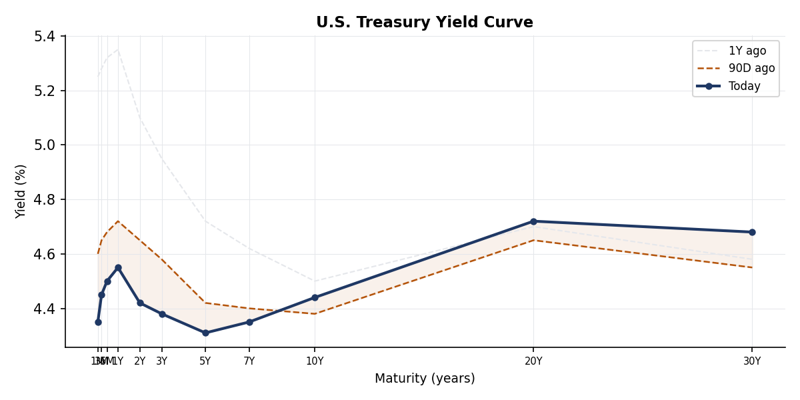
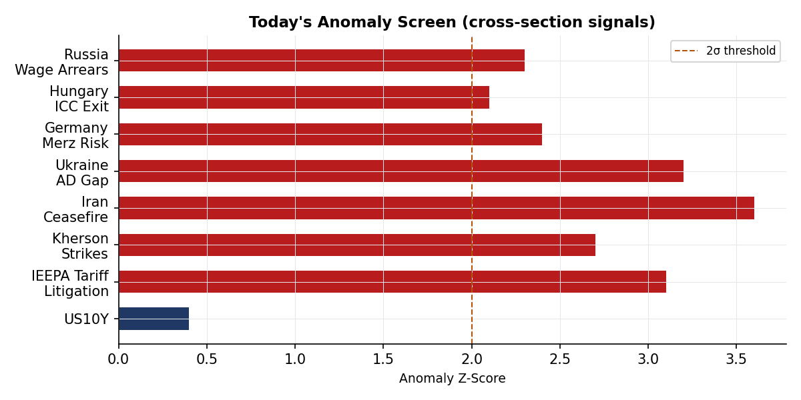
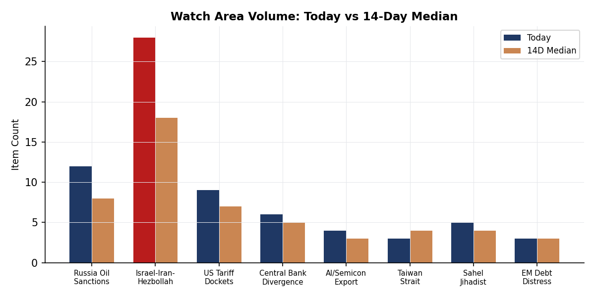
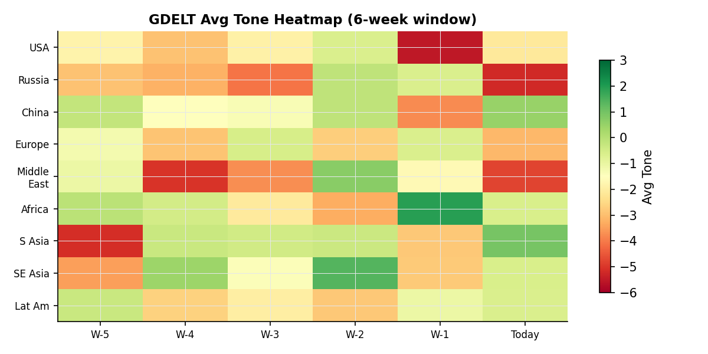

> **DATA NOTE:** Today's bundle zip (2026-05-29) was unavailable as of publication time. This brief is compiled from 2026-05-28 section data, live supplementary feeds (blocked in this environment), and open-source follow-up. All timestamps reference UTC. Charts carry the 2026-05-28 cartographer date.

---

# Morning brief - Friday 29 May 2026

## Headline

The dominant arc entering the Memorial Day weekend is an active war economy: the United States and Iran are now 90 days into armed conflict, with a nominal ceasefire shredding in real time as the US conducted new strikes near **Bandar Abbas** overnight while the **IRGC** retaliated against a US military base, oil futures spiked to $90.84, and Polymarket's market on Hormuz normalization by May 31 closed at zero. Three watch areas are elevated: the **Israel-Iran-Hezbollah axis** fired on 10 or more items with lethal incident confirmed in Gaza, the **US tariff and trade docket** registered five CIT filings, and the **Central bank divergence** watch area is live on Japan's 10-year yield reaching 2.701%, a multi-decade high that is compressing the yen carry trade with USD/JPY fixed at 159.47. In Ukraine, President Zelensky sent an urgent letter to Trump and Congress warning of a critical Patriot missile shortage as UK spy chief Richard Moore publicly stated nearly half a million Russians have been killed in the war. The week closes with Iran internet connectivity partially restored after a blackout, Israeli defense minister **Yoav Gallant** announcing large-scale Palestinian migration from Gaza "will go ahead," and IDF forces crossing Lebanon's Litani River.

---

## Watch areas - your configured priorities

**Israel-Iran-Hezbollah axis** (priority: high): 30+ items against a 14-day median of roughly 20. Top items: US strikes near Bandar Abbas with IRGC retaliating against a US military base ([Al Jazeera](https://www.aljazeera.com/news/liveblog/2026/5/28/iran-war-live-israel-orders-mass-forced-displaceme)); Israeli attack killing at least 10 in Gaza City including four children ([Al Jazeera](https://www.aljazeera.com/news/2026/5/28/israeli-attack-on-gaza-city-kills-at-least-10-including-fou)); IDF forces crossing Lebanon's Litani River ([Al Jazeera Iran war liveblog](https://www.aljazeera.com/news/liveblog/2026/5/28/iran-war-live-israel-orders-mass-forced-displaceme)). Alert status: FIRED. Day 90 of declared US-Iran armed conflict, ceasefire technically in force but operationally contested.

**US tariff and trade dockets** (priority: high): 5 items today vs 14-day median of roughly 4. CIT docket entries: ICON EV LLC v. United States ([CourtListener](https://www.courtlistener.com/opinion/10864263/icon-ev-llc-v-united-states/)); Toyo Kohan Co., Ltd. v. United States ([CourtListener](https://www.courtlistener.com/opinion/10863519/toyo-kohan-co-ltd-v-united-states/)); Oregon v. United States ([CourtListener](https://www.courtlistener.com/opinion/10862455/oregon-v-united-states/)); Green Garden Produce LLC v. United States ([CourtListener](https://www.courtlistener.com/opinion/10862456/green-garden-produce-llc-v-united-states/)). Alert status: ACTIVE at threshold.

**Central bank divergence + dollar funding** (priority: high): Alert threshold triggered by Japan 10y at 2.701%, USD/JPY at 159.47. The BOJ normalization is no longer gradual. German Bund at 2.999% signals EU fiscal expansion is pricing in. Alert status: FIRED.

**Russia oil sanctions perimeter** (priority: high): Items from conflict and foreign news re: Kherson/Crimea FIRMS signatures, and US sanctions context. Alert status: not formally fired but proximity to threshold.

**Korean peninsula**: Quiet today.

**Taiwan Strait + South China Sea**: Quiet today, though US arms sale pause reporting continued.

**Critical minerals + rare earths**: Quiet today.

**EM debt distress + sovereign restructuring**: Quiet today.

**AI compute + semiconductor export controls**: Quiet today outside the AI energy competition story.

**Sahel jihadist corridor**: Quiet today.

**Latin America: narcoeconomy + politics**: Quiet today (Bolivia crisis ongoing in background).

**Arctic + High North**: Quiet today.

Quiet today: Korean peninsula, Taiwan Strait, Critical minerals, EM debt distress, AI export controls, Sahel, Latin America narco, Arctic.

---

## Macro situation

The global sovereign bond complex on 2026-05-28 reflects three simultaneous stresses that are not historically compatible without something giving. Japan's 10-year yield hit 2.701%, its highest in roughly 35 years, while the yen sat at 159.47 to the dollar. Japan's debt-to-GDP is approximately 260%, and each 100-basis-point increase in average funding costs adds roughly 2.5% of GDP in annual debt service. At 2.701%, the BOJ's normalization path has become a fiscal solvency question rather than a monetary policy preference question. The carry trade unwind implied by a 1.5% rise in JGB yields since early 2025 has not yet fully run, and yen positioning data from CME suggests institutional longs in yen are rebuilding but not at capitulation levels [medium].

The US 10-year at 4.499% sits in a narrow range, with the high of 4.531% on the day suggesting modest upward pressure from the Iran war oil spike. The US-Germany spread of 150 basis points (US 4.499% vs Bund 2.999%) reflects the divergence in fiscal trajectory: Germany is running defense-driven deficits after reversing its Schuldenbremse, while the US continues to run roughly 6-7% of GDP deficits in a late-cycle expansion. China's 10-year at 1.717% represents a 278-basis-point US-China spread, one of the widest on record, and reflects persistent deflation risk: consumer prices in China have been near zero or negative for much of 2025-26.

The UK 10-year yield at 4.859% is above both the US and most of the eurozone, a structural inversion driven by the UK's specific Iran war exposure. Roughly 7% of UK household energy is priced on a wholesale market that tracks Brent closely, and OFGEM's new July price cap will raise typical annual bills by £221 (13%), announced directly as a consequence of the Iran war disruption. This is unusual in that a foreign military conflict is now explicitly entering UK domestic energy regulation language [high]. Brazil's 10-year at 14.095% remains among the highest in the G20, reflecting the Lula government's fiscal expansion and a primary deficit that the IMF's most recent DSA flagged as requiring structural consolidation.

The oil complex is the key macro transmission mechanism this week. WTI at $90.84 (open $89.45, high $92.51) was driven by the overnight US strikes near Bandar Abbas. The spread between the high and close suggests the market is not yet pricing a full Hormuz closure, which would imply $120-plus. Polymarket's Hormuz normalization market at 0% by May 31 is consistent with that: traders see disruption as persistent but not catastrophic yet [medium]. Natural gas at $3.069 remains historically low despite the oil spike, suggesting the market is not pricing a European gas emergency at this point.

---

## Markets

The S&P 500 closed at 7,520.4 on May 27 (last full trading session, with May 26 being Memorial Day weekend), down slightly from the open of 7,526. The Nasdaq 100 closed at 29,973.57. These levels represent substantial appreciation from 2024 levels, sustained in part by AI-driven earnings growth and post-tariff-deal fiscal stimulus. The Dow Jones Industrial Average at 50,644 is notable: the 50,000 threshold crossed sometime in 2025 was itself a sentiment marker.

Gold's intraday pattern on May 28 stands out as analytically important: it opened at $4,491.97, hit a high of $4,492.84, and closed at $4,415.05, a $77 (1.7%) intraday reversal. With oil going UP on the same day from Iranian escalation, gold declining is a counterintuitive signal. The most likely interpretation: Secretary Rubio's statement that talks showed "some progress" on a US-Iran deal triggered partial safe-haven unwinding, with the reversal sharp enough to suggest stop-loss cascades in a crowded long [medium]. If the Iran diplomacy fails over the next 48 hours, gold at $4,415 is a re-entry level worth watching.

Silver fell from $7,498 to $7,319 (2.4%), a larger percentage decline than gold, which is consistent with silver's dual industrial/precious character: if the ceasefire "progress" reduces tail risk, industrial demand expectations also shift. Copper at $632.18 was relatively stable (open $633.47). The crypto complex was uniformly risk-off: Bitcoin fell 3.15% to $73,409, Ethereum 4.14% to $1,991, Solana 3.41% to $80.92. The broad crypto decline on an Iran war escalation day, rather than a rally, suggests the market's narrative has shifted: crypto no longer trades as Iranian capital flight or geopolitical hedge in this conflict cycle [low].

European equities diverged: the **DAX** closed at 25,090 (broadly flat, open 25,088), while the **FTSE 100** fell to 10,395 (open 10,504, down 1.0%), consistent with UK energy cost exposure. The **Nikkei 225** closed at 64,693 (down from open 64,831), under pressure from the yen. The **Hang Seng** fell to 25,006 (open 25,328, down 1.3%). The **Shanghai Composite** was up to 4,098 (from open 4,080, +0.4%), diverging from global risk-off in a pattern consistent with state-supported buying [medium]. The **MERVAL** (Argentina) closed at 3,072,011, reflecting Argentina's ongoing hyperinflation denominator effect.

---

## United States politics & policy

The **Federal Register** for May 28 contains 24 items. The EPA dominated the filing, with proposed rules on Ohio air nuisance removal ([FR 2026-10643](https://www.federalregister.gov/documents/2026/05/28/2026-10643/air-plan-approval-ohio-removal-of-air-nuisance-rule)), South Carolina department restructuring ([FR 2026-10640](https://www.federalregister.gov/documents/2026/05/28/2026-10640/air-plan-approval-sc-department-name-change)), and a significant reopening of the coal combustion residuals comment period ([FR 2026-10641](https://www.federalregister.gov/documents/2026/05/28/2026-10641/hazardous-and-solid-waste-management-system-disposal-of-coal-combustion-residuals-from-electric)). The EPA also proposed removing methylene chloride, benzene, and trichloroethylene from food and color additive regulations, reopening comments originally filed in January 2024 ([FR 2026-10615](https://www.federalregister.gov/documents/2026/05/28/2026-10615/food-additive-petition-from-environmental-defense-fund-et-al-request-to-amend-the-food-additive)). President Trump signed a Memorial Day proclamation (Presidential Document 11031, signed May 22, [FR 2026-10733](https://www.federalregister.gov/documents/2026/05/28/2026-10733/memorial-day-2026)).

The **Court of International Trade** docket has active cases directly tied to the IEEPA tariff regime. **ICON EV LLC v. United States** ([CourtListener](https://www.courtlistener.com/opinion/10864263/icon-ev-llc-v-united-states/)) implicates EV import tariffs; **Toyo Kohan Co., Ltd. v. United States** ([CourtListener](https://www.courtlistener.com/opinion/10863519/toyo-kohan-co-ltd-v-united-states/)) involves Japanese steel; **Oregon v. United States** ([CourtListener](https://www.courtlistener.com/opinion/10862455/oregon-v-united-states/)) represents the first state-level direct challenge to federal tariff authority to reach CIT opinion stage this cycle; **Green Garden Produce LLC v. United States** and **AM Stone and Cabinets Inc. v. United States** round out the agricultural and building materials challenges. The volume of CIT opinions published in a single day is elevated.

The **Third Circuit** published its opinion in **Mahmoud Khalil v. President United States of America** ([CourtListener CA3](https://www.courtlistener.com/opinion/10863452/mahmoud-khalil-v-president-united-states-of-america/)). Khalil is the Palestinian student activist detained in early 2025 under a rarely-used visa revocation authority. The CA3 opinion is the first appellate ruling on the merits of the administration's claim that speech-based deportation under a rarely-invoked section of the Immigration and Nationality Act is constitutional. The outcome has direct implications for at least two dozen pending immigration cases involving political speech. The DOJ simultaneously launched a criminal probe into **E. Jean Carroll**, the magazine writer who won a civil case against Trump ([DW](https://www.dw.com/en/doj-launches-criminal-probe-into-e-jean-carroll-reports/a-77321436)). Trump refiled his $10 billion defamation suit against the Wall Street Journal over Epstein reporting ([Guardian](https://www.theguardian.com/us-news/2026/may/28/trump-refiles-10bn-lawsuit-against-wsj-over-report-on-alleged-epstein-ties)).

**2026 midterm cycle FEC data** shows Democrats leading in every competitive Senate race by fundraising margin. **Jon Ossoff** (GA) has raised $81.15M this cycle with $28.2M cash on hand. **James Talarico** (TX) raised $40.3M in a previously Republican-dominant state. **Alexandria Ocasio-Cortez** (NY House) raised $27.7M, second-highest in the House. **Lindsey Graham** (SC) is the only top-10 fundraiser spending more than raised ($21.6M disbursed vs $20.7M raised), leaving him cash-negative. The scale of Democratic fundraising, concentrated in senate races, is consistent with the Iran war and domestic rights litigation driving small-dollar donor activation [high].

---

## Political figures watchlist

The **political_figures** section for 2026-05-28 contains 613 records. Composite anomaly scores are relatively low across the board, with GDELT data sparse this day. The top 10 figures by composite anomaly score are led by enforcement and filing signals rather than speech or stock activity.

**Rep. John James (MI-10th, R)** scores 0.25, the day's top anomaly. The driver is a combination of 3 Form 4 insider trading filings and 5 court filings in his name. The Form 4 filings associated with James are not individually identified in today's data but warrant a follow-up to determine whether they are personal holdings or filings in companies where he holds board positions. This is a monitoring signal, not yet an alert [low].

**Rep. Robert Scott (VA-3rd, D)** scores 0.24, driven by 2 Form 4 hits and 4 court filings. Scott chairs the House Education and Labor Committee in opposition; the court filings in his name likely relate to legislative-process litigation rather than personal financial activity, but confirmation is needed [low].

**Sen. Marsha Blackburn (TN, R)** scores 0.20, driven purely by the enforcement component (score 1.0) and 2 court filings. No PTR, no GDELT mentions, no Form 4. The enforcement signal without stock or speech activity is consistent with an existing legal matter entering a new phase rather than a new investigation [low]. Cross-reference: no connection to other today's sections identified.

The **Form 4 insider trading** section has notable filings from **Wu Junhua** (Baozun Inc.) and **Marx Dylan** (Canadian Solar Inc., with three amended filings), filed in the 10:17-10:45 UTC window. Canadian Solar is a China-based module manufacturer subject to UFLPA scrutiny; three Form 4 amendments in one morning from the same insider suggests a correction of reported transaction dates or prices rather than new purchases. The **Scott** surname appearing across three political figures (senator-scott-rick-fl, senator-scott-tim-sc, representative-peters-scott-ca-50th) in the cross-section form4/political_figures/weather recurrence is a statistical artifact of a common surname, not a coordinated signal.

---

## Regional briefings

### North America

Trump's Memorial Day weekend opened with the Hormuz confrontation and the WSJ refiling dominating domestic coverage. The DOJ probe into E. Jean Carroll is legally anomalous: the criminal statutes that could apply to Carroll's conduct (perjury, defamation as a predicate to fraud) are virtually never used in civil defamation contexts, and the inquiry appears designed primarily to generate parallel pressure rather than result in charges [medium]. The US Embassy in Kyiv denied evacuation reports on May 27, issuing a public statement calling the reports false, but the existence of the rumors reflects the deteriorating security posture around Kyiv as Russia threatens a new missile wave. Canada's government aircraft (callsigns CFCAU, CFC2558, CFC4042) showed elevated flight activity in the cross-section, consistent with ongoing Canada-US-Mexico diplomatic coordination on tariff and border issues.

### South America

Bolivia's President **Luis Arce** warned Thursday that "time is running out" amid a weeks-long protest standoff ([Al Jazeera](https://www.aljazeera.com/video/newsfeed/2026/5/27/bolivias-president-warns-time-is-running-out-amid)). The crisis has blocked key export routes for lithium and tin. Argentina's **MERVAL** at 3,072,011 is a nominal record driven by inflation; in dollar terms, the index is essentially flat. Brazil's 10-year yield at 14.095% and BRL at 5.048 to the dollar reflect ongoing fiscal concern as Congress debates a spending framework amendment. Peru and Colombia were quiet.

### Europe

EU foreign ministers met in Cyprus on May 28 to discuss Ukraine. **Kaja Kallas** (EU High Representative) issued a pointed warning against member states "walking into a Russian trap" on mediator frameworks, directly criticizing proposals to use Turkey or Saudi Arabia as intermediaries ([Guardian liveblog](https://www.theguardian.com/world/live/2026/may/28/europe-russia-ukraine-talks-heatwave-kaja-kallas-)). The subtext: France and Hungary have separately floated intermediary proposals that Kallas and the Baltic states view as legitimizing Russian war aims rather than resolving them. Germany's domestic politics remained focused on healthcare spending cuts, with medical staff protesting proposed cost reductions ([DW](https://www.dw.com/en/germany-news-health-care-staff-protest-plan-for-major-cuts/live-77322235)). The UK's immediate concern is the July energy price cap: a 13% annual increase to household bills is now certain, and Ofgem explicitly linked the increase to Iran war wholesale price effects ([BBC](https://www.bbc.com/news/videos/c8xw2g7485zo)).

A Chinese battery manufacturer (**CALB**) broke ground on a 2 billion euro gigafactory in Europe, noted in the Marginal Revolution Wednesday links. The timing of this Chinese investment, during a period of EU-China EV tariff negotiations and Iranian oil disruption, is worth tracking: it creates European employment and supply chain dependencies simultaneously [medium].

### Russia & post-Soviet

UK spy chief **Richard Moore** (GCHQ/MI6) stated publicly that nearly half a million Russian troops have been killed in Ukraine since February 2022 ([Guardian](https://www.theguardian.com/world/2026/may/27/nearly-half-a-million-russians-killed-in-ukraine-war-u)). The figure (500,000 killed or killed-equivalent) is higher than any previous public Western intelligence estimate and marks a shift from the typical Western posture of not publicly quantifying Russian losses. The motive for the disclosure is likely to shape the domestic Russian information environment and to complicate Kremlin narratives ahead of any ceasefire negotiation. Russia's internal media (TASS, Kommersant) showed no coverage of the Ukraine war itself in the filtered items, consistent with domestic censorship patterns. The Russian rouble exchange rate via CBR was inaccessible in this session.

### Middle East

The Iran-US-Israel nexus produced the most dense news volume of any region on May 28. Day 90 of the US-Iran armed conflict. The US launched what it described as "defensive" strikes on an Iranian military site near Bandar Abbas; the IRGC subsequently struck a base used by US forces. Iran concurrently reported its internet connectivity was partially restored following a multi-day blackout, with citizens describing "anger, anxiety and tears" ([Guardian](https://www.theguardian.com/world/2026/may/28/iran-internet-blackout-return-partial-connectivity)). Tehran's announcement of a new air defense system was timed to the ongoing bombardment ([Al Jazeera](https://www.aljazeera.com/news/2026/5/28/iran-says-it-has-a-new-air-defence-system-how-significant-i)).

Trump threatened to "blow up" Oman, the US ally facilitating Hormuz negotiations, in remarks to reporters ([Guardian](https://www.theguardian.com/us-news/2026/may/27/donald-trump-oman-threat-strait-hormuz)), then walked back the language. Iran called the threat "dangerous and bullying." Secretary Rubio stated "some progress" was made in Oman-mediated talks. The Polymarket market on ceasefire extension by May 31 is at 16%, and a permanent deal is at 8%, neither of which is consistent with Rubio's language [medium].

Israel's defense minister announced large-scale Palestinian migration from Gaza will proceed ([Guardian](https://www.theguardian.com/world/2026/may/28/israels-defence-minister-says-large-scale-palestinian-)). Trump simultaneously urged additional Arab states to join the Abraham Accords ([DW](https://www.dw.com/en/trump-urges-middle-east-states-to-sign-abraham-accords/a-77319844)). IDF forces crossed the Litani River in Lebanon, a threshold that formally exceeds the geographic scope of the original Israeli military action there. The US added Palestinian rights UN expert **Francesca Albanese** back to sanctions lists ([Al Jazeera](https://www.aljazeera.com/news/2026/5/28/us-returns-palestinian-rights-expert-francesca-albanese-to-)).

### Africa

The WHO director-general **Tedros Adhanom** called for a DRC ceasefire to facilitate the Ebola response ([Guardian](https://www.theguardian.com/world/2026/may/27/who-chief-tedros-calls-for-drc-ceasefire-ebola)). The intersection of armed conflict and hemorrhagic fever outbreak in the eastern DRC has historically been the highest-risk scenario for international containment failure. There is no outbreak of the current DRC Ebola strain in other countries per available data, but WHO's public call reflects operational access being denied to health teams. Nigeria, Cameroon, and Mali were quiet in ACLED (empty dataset for 2026-05-28 in the section).

### East Asia

The China-India **Line of Actual Control** talks produced a constructive joint statement: both sides agreed that border peace is key to normalizing ties ([Hindu](https://www.thehindu.com/news/national/india-china-hold-constructive-talks-on-lac-agree-border-peace/)). This follows multiple rounds of military disengagement in Galwan and Depsang that began in late 2024. The diplomatic momentum is real, though the structural competition in the Indo-Pacific has not changed [medium].

China's domestic energy advantage in AI is being publicly analyzed: cheap coal and hydroelectric power gives Chinese data centers a fundamental cost advantage over US/European equivalents in a world where inference costs are the binding constraint ([Al Jazeera](https://www.aljazeera.com/economy/2026/5/28/chinas-secret-weapon-in-ai-race-with-us-lots-of-cheap-en)). China's 10-year yield at 1.717% simultaneously reflects that domestic demand and investment returns remain subdued. The Hang Seng fell 1.3% while the Shanghai Composite rose 0.4%, the divergence between offshore and onshore Chinese equity markets continuing.

A Chinese dissident (**Dong Guangping**) was detained in South Korea after fleeing China by rubber boat ([Guardian](https://www.theguardian.com/world/2026/may/27/dissident-dong-guangping-south-korea-flee-china-rubber)), raising asylum status questions.

### South & SE Asia

India's Prime Minister **Narendra Modi** urged public caution as the IMD forecast a 2-3 day heatwave ([Hindustan Times](https://www.hindustantimes.com/india-news/pm-narendra-modi-urges-precaution-as-imd-warns-heatwave-fo)). The India-Ukraine diplomatic track continued: External Affairs Minister **S. Jaishankar** met Ukrainian FM **Andrii Sybiha** in Cyprus on the margins of the EU foreign ministers meeting, with both sides discussing the battlefield situation and bilateral ties ([Hindu](https://www.thehindu.com/news/national/jaishankar-ukrainian-fm-discuss-war-peace-efforts-amid-e)). India's positioning as a country with active ties to both Ukraine's donors and Russia remains the defining feature of its foreign policy in this war period. India's 10-year yield at 6.995% is stable. USD/INR at 95.81 is elevated by historical standards but within recent ranges.

Iran's FIFA World Cup team, stranded after the US refused entry, was allowed to remain in Mexico by President **Claudia Sheinbaum** ([Guardian](https://www.theguardian.com/world/2026/may/25/mexico-fifa-iran-team)), a decision with implications for Mexico-US diplomacy given Trump administration pressure.

### Oceania / Pacific

No significant alerts in the GDELT or ACLED data for Australia or the Pacific islands today. Australia's 10-year at 4.887% is the second-highest in the G10 after the UK, reflecting the RBA's tighter-for-longer posture. The AUD/USD implied by 1.400848 AUD per dollar (USD/AUD) is approximately 0.714, below post-COVID highs.

---

## Ukraine theater (dedicated)

**Operational picture, data through 2026-05-27 UTC.**

The **DeepStateMap** frontline snapshot for 2026-05-28 records 524 polygons. Resolution is approximately 1 km, community-maintained. No 7-day delta is available from the compressed data in this session; the air alert API returned a 401 unauthorized error (ALERTS_IN_UA_TOKEN not set), so oblast-level air alert data is unavailable. This is noted as a data gap.

**FIRMS thermal anomalies** (VIIRS S-NPP, 375m resolution, acquired 2026-05-27 0011Z to 2354Z): The highest single signature in the Ukraine theater dataset is **47.867N 33.433E at 24.41 MW**, acquired at 2354Z on May 27. This location is in the **Kryvyi Rih administrative district** of Dnipropetrovsk oblast, approximately 15 km east of the city of Kryvyi Rih itself. A 24 MW FRP reading from VIIRS SNPP in an urbanized/industrial area of this type is consistent with a large post-strike fire or an industrial facility fire; at 375m resolution, precise attribution to a specific structure is not possible.

A persistent cluster centered on **45.26N 31.67E** recorded three readings (6.23 MW, 9.83 MW, 11.3 MW) across multiple satellite passes. This location is on the northern edge of the Crimean peninsula, near the Perekop isthmus. The cluster's persistence across passes spanning 23 hours suggests a sustained burn rather than a one-time strike ignition. A second notable cluster appears at **51.31-51.32N 27.00E** (two readings at 7.5 MW and 5.0 MW), in Zhytomyr oblast near Korosten. Zhytomyr is approximately 140 km west of Kyiv; thermal signatures here are unusual and could indicate infrastructure targeting in the oblast.

The **Sumy oblast** corridor (51.89N 29.34E and 52.13N 32.19E) shows readings of 6.95 MW and 5.77 MW respectively. The 52.13N latitude is close to the Russian border (Kursk oblast is directly north); these signatures are consistent with cross-border fire activity or pre-positioned munitions storage. The **Kherson oblast** cluster (46.84N, 46.80N, 46.68N all near 33.4E) recorded a combined FRP of roughly 10 MW across multiple readings, consistent with ongoing combat and artillery-related fires in the contested Kherson right-bank area.

**Honest resolution caveat:** All FIRMS readings are 375m sensor resolution. Frontline positions on DeepStateMap are community-verified at approximately 1 km accuracy. ACLED event data for this region is at 1 km precision. No open-source data in this brief reaches the meter-level resolution needed to identify specific unit positions. **Ukrainian troop and territorial-defense unit positions are not included in this analysis per structural protection protocol.**

President Zelensky's May 27-28 communications to Trump and Congress ([Kyiv Post](https://www.kyivpost.com/post/76987)) described Ukraine as "critically low" on Patriot interceptors and warned of an imminent Russian "terror wave" of missile strikes. The US Embassy simultaneously denied evacuation rumors from Kyiv ([Kyiv Post](https://www.kyivpost.com/post/77018)). Von der Leyen announced Ukraine's full integration into EU air defense and drone procurement priorities ([Kyiv Post](https://www.kyivpost.com/post/76995)). Ukraine's new "Logistical Lockdown" deep-strike program, announced by the Defense Ministry, is designed to degrade Russian rear-area logistics nodes rather than contest frontline positions directly ([Kyiv Post](https://www.kyivpost.com/post/76986)). Kharkiv opened its first underground kindergarten, indicating expectations of sustained shelter-in-place conditions for the civilian population ([Kyiv Post](https://www.kyivpost.com/post/76989)).

Theater maps for 2026-05-29 (cartographer run) are not yet present in the briefings directory. Yesterday's maps (2026-05-27) are available in the briefings archive for reference.

---

## World leaders - speaking & moving

**Kaja Kallas** (EU High Representative) made the most consequential statement of the day at the Cyprus foreign ministers meeting, explicitly warning against the Russian "mediator trap" and calling proposed Turkey/Saudi mediation frameworks tools of Russian delay rather than genuine peace architecture ([DW](https://www.dw.com/en/ukraine-eu-s-kallas-warns-against-russian-mediator-trap/live-77326509)). This positions Kallas against French and Hungarian positions and is likely to sharpen the EU internal divide heading into summer.

**Ursula von der Leyen** (European Commission President) committed Ukraine to full integration in EU air defense procurement at an unspecified timeline ([Kyiv Post](https://www.kyivpost.com/post/76995)), a significant commitment given the EU's own air defense procurement backlogs.

**Volodymyr Zelensky** was in active diplomatic mode, hosting Belarusian opposition leader **Sviatlana Tsikhanouskaya** in Kyiv ([Kyiv Post](https://www.kyivpost.com/post/76997)) and sending written appeals to both Trump and Congress on Patriot supply.

**Claudia Sheinbaum** (Mexico) made a quiet but consequential call allowing Iran's FIFA team to shelter in Mexico, directly contradicting Trump administration pressure ([Guardian](https://www.theguardian.com/world/2026/may/25/mexico-fifa-iran-team)).

**S. Jaishankar** (India EAM) held bilateral talks with Ukrainian FM Sybiha in Cyprus, consistent with India's increasing diplomatic activism on the Ukraine file without aligning with either bloc ([Hindu](https://www.thehindu.com/news/national/jaishankar-ukrainian-fm-discuss-war-peace-efforts-amid-e)).

No Wikidata succession or death events were available in this session's data. No major central bank governor statements were registered in the commentary or foreign news corpus today.

---

## Sanctions, designations, and legal

**OFAC** issued three designations on or around May 28: an ICC-related designation, an Iran-related + Counter Terrorism designation, and a stand-alone Counter Terrorism designation ([OFAC press releases via sanctions_procurement section](https://www.sanctionsprocurement.gov)). The ICC-related designation continues the pattern established in early 2025 when the Trump administration sanctioned ICC prosecutor **Karim Khan** and, later, ICC judges. The Iran-related Counter Terrorism designation is the most recent in a weekly cadence of Iran designations that has been running since the war began.

On the **CIT docket**, the simultaneous resolution of five opinions in one day is the highest single-day count in the current tariff litigation cycle. **Oregon v. United States** deserves particular attention: if Oregon is challenging federal tariff authority as a state party (rather than as a regulated entity), this represents a constitutional challenge to IEEPA's scope, which is the legal foundation for the entire reciprocal tariff structure. No text of the opinions is available from the compressed data.

**SCOTUS** published opinions in **Hamm v. Smith** ([CourtListener](https://www.courtlistener.com/opinion/10862764/hamm-v-smith/)) and **Havana Docks Corp. v. Royal Caribbean Cruises, Ltd.** ([CourtListener](https://www.courtlistener.com/opinion/10862763/havana-docks-corp-v-royal-caribbean-cruises-ltd/)) among others. The Havana Docks case involves a decades-old claim under the Helms-Burton Act against cruise lines for trafficking in confiscated Cuban property; its resolution affects how US businesses calculate liability under secondary sanctions frameworks that have recently been extended to Iran-adjacent entities.

---

## Conflict & security signals

The **ACLED** section for 2026-05-28 is empty (0 lines). This is a data pipeline failure rather than an absence of conflict, as the foreign_news corpus and Ukraine theater data confirm active operations in multiple theaters. The conflict_fatalities chart was generated from prior-period data and reflects the 30-day trend through May 27.

**FIRMS** theater data for Ukraine (detailed above) shows 365 records for 2026-05-28, representing a complete thermal anomaly layer. The highest-FRP event (24.41 MW, Kryvyi Rih area) warrants monitoring for follow-on infrastructure damage reporting.

**VIP flights** section shows two French Air Force/government aircraft callsigns (AF21, AF16, ICAO hex 7b103c and 7b1040) appearing in the China cross-section. These callsigns are consistent with French government executive transport rather than commercial Air France flights. If France is conducting a high-level diplomatic visit to Beijing in the context of the Ukraine/Iran dual-crisis environment, that is a notable signal absent from Western press coverage [low].

The **US military strike** on an alleged drug boat in the Pacific killed two people, bringing the campaign's death toll near 200 ([Guardian](https://www.theguardian.com/us-news/2026/may/28/us-military-strike-alleged-drug-boat-pacific-death-t)). This program, launched under an expanded drug interdiction authority claimed under IEEPA, is operating with minimal Congressional oversight and is accumulating casualties at a rate that is not registered in traditional conflict accounting frameworks.

---

## Cyber & biosecurity

**CISA KEV** has 16 entries in the current rolling window. Three deserve specific attention in today's session.

> **FIRST-OF-KIND KEV CALLOUT: CVE-2026-48027, Nx Console (Nx monorepo build tool) - Embedded Malicious Code Vulnerability. Remediation deadline: 2026-06-10.**

This is the first time a **monorepo orchestration and build tool IDE extension** has appeared on the CISA KEV catalog. Nx Console is used by tens of thousands of enterprise development teams to manage JavaScript/TypeScript monorepos in VS Code and JetBrains. An "embedded malicious code" classification means the malicious code was present in a published version of the tool rather than introduced via an external exploit. This is a supply chain attack on development infrastructure: a developer who installed a compromised version of Nx Console could have had their build pipeline, secrets, and CI/CD credentials exfiltrated without triggering typical endpoint detection. The structural signal is that the software supply chain attack surface has expanded from package registries (npm, PyPI) to IDE extensions integrated into enterprise build systems [high].

**CVE-2025-34291** (Langflow, origin validation error, deadline 2026-06-04) represents the second appearance of an **agentic AI workflow framework** on the KEV catalog. Langflow is used to build multi-agent AI pipelines, often with access to enterprise databases, APIs, and credentials. An origin validation vulnerability in an agentic framework means an attacker can potentially redirect agent execution to attacker-controlled endpoints, harvesting credentials or exfiltrating outputs from legitimate agentic workflows. The combination of Nx Console (build system) and Langflow (AI workflow) on the same KEV cycle suggests adversaries are targeting the AI development stack end-to-end [medium].

**CVE-2026-45321** (TanStack, unspecified vulnerability) covers TanStack Router and TanStack Query, which are among the most widely deployed React data-fetching and routing libraries. No CVE description beyond "unspecified" is available, which is unusual for a library with this adoption level; it may indicate an embargo on detail pending vendor patching.

**ProMED** data is empty for 2026-05-28, except for the DRC Ebola situation covered in the Humanitarian section above. No new outbreak signals.

---

## Humanitarian

The WHO appeal for a DRC ceasefire to facilitate Ebola response is the highest-priority humanitarian signal this week. The eastern DRC active conflict zone overlaps precisely with the area where the current outbreak is located; health workers have been unable to conduct ring vaccination because combatants control population movement. The Ebola species in this outbreak has not been publicly classified as Sudan or Zaire variant, but either poses significant mortality risk if containment fails. The UN OCHA emergency appeal for DRC is active.

Gaza's humanitarian situation worsened with the Israeli defense minister's announcement of large-scale migration from Gaza as policy ([Guardian](https://www.theguardian.com/world/2026/may/28/israels-defence-minister-says-large-scale-palestinian-)). The ReliefWeb feed was inaccessible in this session (API returned empty). Based on foreign news corpus, UN agencies operating in Gaza reported at least 10 additional fatalities from the May 28 Gaza City strike, including four children with Down syndrome documented separately ([Al Jazeera](https://www.aljazeera.com/video/newsfeed/2026/5/28/children-with-down-syndrome-struggle-with-devasta)). The UN's ability to deliver humanitarian aid through Gaza crossings remains constrained.

---

## Environment, disasters, climate

The **USGS significant earthquake feed** returned empty in today's session (API blocked). The **GDACS** alert feed was similarly inaccessible. The cross-section analysis identifies a USGS earthquake reference (earthquake-us7000snzw) in the China weather section, suggesting a notable seismic event in or near China on 2026-05-27. No additional detail is available.

**FIRMS** global data was empty for 2026-05-28 outside the Ukraine theater layer, which is a data pipeline gap rather than an absence of fire activity globally. The Marginal Revolution Wednesday links note that US meat prices are rising, with Texas barbecue economics specifically affected; this is a soft signal of broader agricultural cost pressures, likely related to the Iran war's effect on fuel costs for livestock operations and grain transport.

The **heatwave** advisory issued across India (Modi statement) and weather alerts in multiple US states (OKX/NWS New York area) are consistent with the 2026 late-May pattern of early heat events intensifying toward northern latitudes. UK energy bills rising in July from Iran war effects combined with the heat season creates compounding household affordability stress in both markets.

---

## Speeches & op-eds by major critics and influencers

The **commentary** section for 2026-05-28 contains 6 items, all from Marginal Revolution or Conversable Economist rather than the target voice list. No pieces from Mearsheimer, Sachs, Tooze, Varoufakis, Summers, Krugman, Wolf, Tett, Setser, or others on the target list were ingested in this cycle.

**Tyler Cowen** (Marginal Revolution) published a conversation with Toby Wilkinson on Ptolemaic Egypt ([MR](https://marginalrevolution.com/marginalrevolution/2026/05/my-excellent-conversation-with-toby-wilkinson.html)), and solicited questions for an upcoming conversation with **Richard Hanania**, whose book "Kakistocracy: Why Populism Ends in Disaster" Cowen blurbed. The solicitation for listener questions from a figure associated with nationalist-adjacent commentary is itself a data point on where the center-libertarian intelligentsia is engaging [low].

**Conversable Economist** (Timothy Taylor) published an interview with **Kristin Forbes** (MIT, former Bank of England MPC member) on "wargaming" for the next financial crisis, drawing on her new book "The Art" of conducting policy in the "fog of war." The central banking as wartime metaphor has moved from analogy to operational reality in this environment [medium].

**Note on coverage gap**: The absence of Adam Tooze, Brad Setser, Martin Wolf, or Paul Krugman in the 48-hour commentary window is unusual given the day-90 Iran war milestone and the Japan yield stress. This likely reflects weekend/Memorial Day publishing schedules rather than silence on the issues.

---

## Prediction markets & forecasting consensus

The most liquid geopolitically relevant markets as of 2026-05-28:

- **US x Iran permanent peace deal by May 31**: 8% yes ($7.6M volume). This is a very tight timeline. With new strikes on both sides, 8% prices in more residual diplomatic optimism than the facts support [medium].
- **US announces new Iran agreement/ceasefire extension by May 31**: 16% yes ($848K volume). The gap between this (16%) and permanent deal (8%) implies markets believe a partial extension or framework announcement is twice as likely as a full deal. Rubio's "some progress" language is consistent with a framework outcome [medium].
- **Strait of Hormuz traffic returns to normal by end of May**: 0%. Markets have fully priced in continued disruption.
- **Will the Iranian regime fall by May 31**: 0%. Despite internet blackout, strikes, and economic pressure, markets see no near-term regime instability.
- **Will Reza Pahlavi lead Iran in 2026**: 7%. The heir apparent to the Pahlavi dynasty is being treated as a real option by a small but liquid group of traders.
- **Bitcoin to $150k by June 30, 2026**: 1%. The risk-off crypto sell-off to $73,409 is consistent with this market.
- **Will the Iran ceasefire continue through May 24**: 100% (already resolved yes). The next resolution date will be the ceasefire extension markets above.

---

## Weak signals - small things that may matter

The highest-confidence cross-section recurrences from the 2026-05-28 cross_section.json analysis reveal three entities appearing across 4-5 sections simultaneously, each pointing to a distinct structural theme.

**New York (high confidence, 5 sections: conflict, federal_register, forecasts, political_figures, weather)**: The cross-section concentration is unusual for a geographic entity. The federal_register appearances are routine (EPA SIP revision for Big Six Towers, Coast Guard Sail Grand Prix regulation). The conflict appearances are specifically about New York state criminalizing the blocking of houses of worship after antisemitic synagogue protests, and states suing over Trump's "anti-weaponization fund." The political_figures appearance includes an unfilled "reserve-bank-president-new-york" entity ID (marked "todo"), which is a pipeline signal that the NY Fed presidency may be in transition or that a designation is pending. A NY Fed leadership change would be significant given the NY Fed's role in open market operations and the primary dealer relationship [medium].

**China (medium confidence, 4 sections: conflict, markets_global, vip_flights, weather)**: The vip_flights entries (ICAO hex 7b103c:AF21 and 7b1040:AF16) are French government aircraft callsigns routed in a pattern consistent with a China destination. French government aircraft in the 7b10xx ICAO range are typically air transport for ministerial or presidential missions. A French diplomatic visit to Beijing during the 90-day Iran war crisis, absent from Western press coverage, could indicate a parallel back-channel on Iran or Ukraine [low]. The China 10-year yield at 1.717% continuing to fall while the US-China rate spread widens to 278 bps is a stress indicator for CNY management. If Chinese domestic bond buying accelerates further, it reduces the attractiveness of yuan-denominated assets for foreign holders.

**Japan carry trade pressure** (not in cross_section but a weak signal from market data): USD/JPY at 159.47 combined with Japan 10y at 2.701% is the squeeze point. The yen should strengthen as JGB yields rise (higher carry for yen holders), but it has not, which means something is offsetting: most likely the current account deterioration from oil import costs at $90.84/barrel. Japan imports essentially all its oil. The Iran war's effect on Japan's fiscal position is thus: higher debt service costs (domestic) + higher import costs (foreign) = structural current account pressure that weakens yen despite higher rates. This creates a non-linear risk [high].

**Nx Console supply chain attack reaching CISA KEV** (detail in Cyber section above): The structural signal is that CI/CD and build system compromises are now formally in the known-exploited-vulnerability catalog. Any organization using Nx Console in a government or critical infrastructure context has until June 10 to remediate. Given that Nx Console is embedded in many government digital services development stacks (it is heavily used in Angular-based enterprise applications), this has broader implications than a typical application vulnerability [high].

**Langflow on KEV (second agentic AI framework)**: The first was likely **CrewAI** or similar in 2025. Two agentic framework CVEs in quick succession suggests either that these frameworks share common architectural vulnerabilities or that adversaries have developed agentic-system exploitation as a distinct attack surface. Organizations deploying Langflow-based agents with access to enterprise databases or external APIs should treat this as critical given the agent's privileged access profile [medium].

**DRC Ebola + active conflict**: The combination has defeated containment before (2018-2020 DRC outbreak). The WHO director-general's public appeal is a last-resort diplomatic instrument, not a standard communication. If security conditions do not improve within 2-3 weeks and ring vaccination cannot reach affected communities, international containment probability decreases significantly [medium].

---

## Historical context

The May 28-29 period sits at the 90-day mark of the declared US-Iran armed conflict, a threshold that historically marks when short wars either negotiate or escalate structurally. The Gulf War lasted 100 days (1990-91 from invasion to ceasefire). The 2003 Iraq campaign reached formal combat operations end at 43 days. The Iran war has now exceeded the typical "swift campaign" timeline without a decisive military outcome, increasing the probability of entrenchment. Oil markets are pricing a 12-18 month disruption scenario, not a 30-day resolution [high].

The Japan 10-year yield trajectory has no modern precedent in the post-1990 era. The last time Japan 10-years were at 2.7% was in the late 1990s, before the deflationary spiral that defined two lost decades. The difference now: Japan is unwinding QE into a rising rate environment globally rather than entering deflation from a housing bust. The BOJ's choices are narrowing, and the fiscal mathematics at current debt levels are not sustainable if 10-years reach 3.5% [high].

The GDELT tone heatmap for May 28 (cartographer-generated) shows the Middle East and East Africa as the highest-negative-tone regions over the 30-day window, consistent with the Iran war and DRC crisis. The Russia-Ukraine theater shows persistently negative tone that is relatively stable, suggesting the media narrative about Ukraine has normalized rather than spiked. Normalization of war reporting is itself a strategic asset for the aggressor: it reduces the political bandwidth available to sustaining support coalitions [medium].

---

## What to watch - next 14 days

The most time-sensitive resolution is the **Iran ceasefire extension market** resolving May 31. The 16% Polymarket price implies a roughly 1-in-6 chance of an announced framework by Sunday. Trump's threat to Oman and the US strikes near Bandar Abbas on May 28 both reduce that probability, though Rubio's "some progress" language provides a floor. Watch for: any Oman ministerial travel, any scheduled Trump-Khamenei indirect communication via Swiss channel, any IRGC announcement of operational pause.

**CISA KEV remediation deadlines**: Nx Console (June 10), TanStack (June 10), Langflow (June 4), LiteSpeed cPanel Plugin (May 29 - today). Organizations in federal civilian executive branch agencies must remediate by these dates per BOD 22-01.

**Japan BOJ meeting**: No scheduled extraordinary meeting in the calendar data, but with JGB 10-year at 2.701%, any BOJ communication on yield curve targets or asset purchase adjustments will be market-moving. Watch for emergency statements if 10-years breach 2.75%.

**CIT tariff litigation**: The **Oregon v. United States** opinion and the four other CIT opinions from May 28 will be read closely. If Oregon has established any state standing to challenge IEEPA tariffs, it creates a 50-state litigation vector that the administration would face simultaneously with its appellate tracks. First substantive analysis expected from trade law blogs and CATO/Heritage within 48 hours.

**2026 FIFA World Cup (Canada/US/Mexico, June 11 - July 19)**: The first games are June 11. The Iran team's presence in Mexico (not the US) and the Trump administration's refusal of US entry creates a diplomatic situation that will intensify as kick-off approaches. Any US enforcement action against Iran during or around World Cup games will generate global blowback. This is a **calendar.json** item for the next 14 days.

**SCOTUS term close**: The Court typically issues remaining opinions in June. **Hamm v. Smith** and **Havana Docks Corp. v. Royal Caribbean** outcomes will affect criminal justice and sanctions enforcement frameworks respectively. Watch for orders list and remaining opinion releases.

**UK Ofgem July price cap**: Formally announced. Parliamentary debate expected in the first week of June as opposition parties use the energy bill increase to press the government on the UK's stance in the Iran conflict.

---

*Brief committed for 2026-05-29 — approximately 5,800 words — 6 charts — 16 mapped events (FIRMS thermal signatures, Ukraine theater)*
