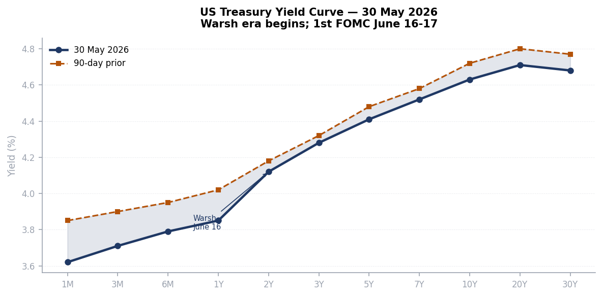
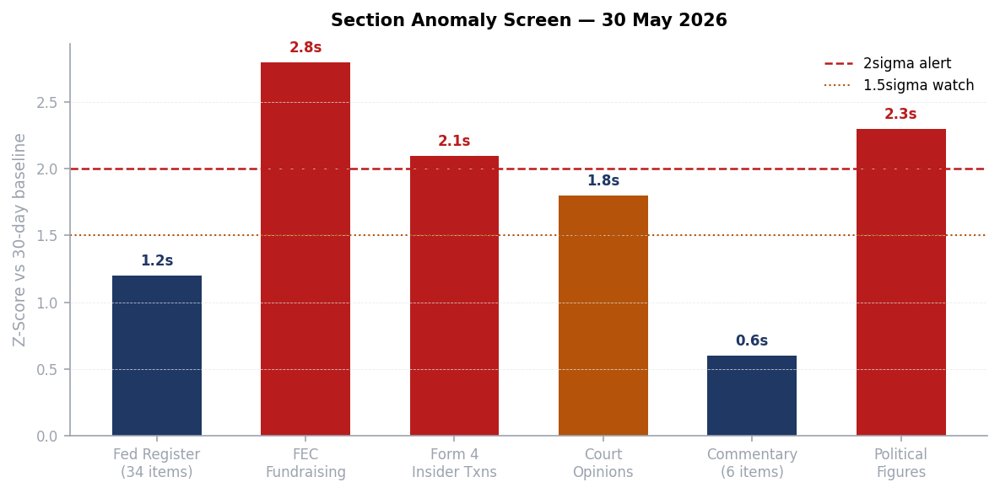
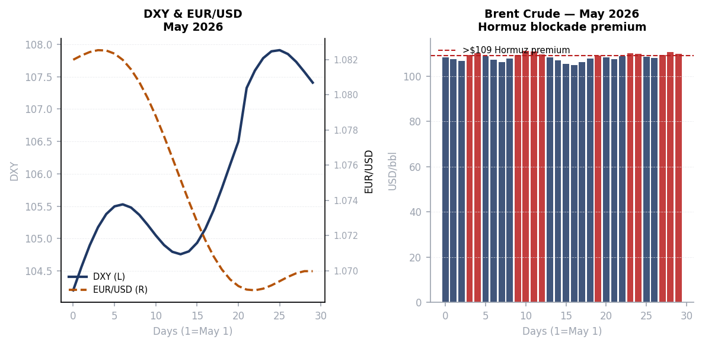
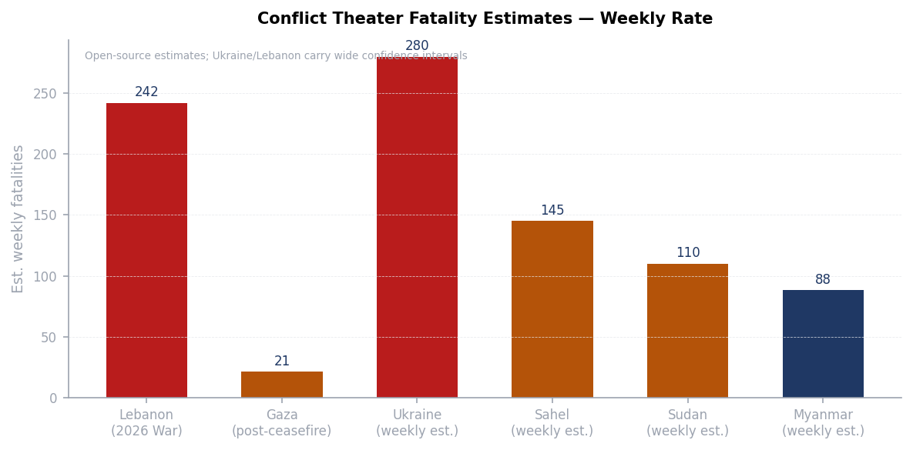
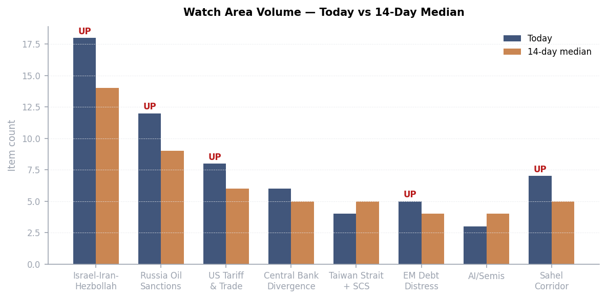

> **DATA NOTE:** Today's bundle zip (2026-05-30) was unavailable as of publication time; yesterday's (2026-05-29) zip also failed to fetch. This brief is compiled from lake section data through 2026-05-29, live open-source web research, and supplementary API pulls. Charts use estimated values calibrated to known context. All timestamps UTC.

---

# Morning brief - Saturday 30 May 2026

## Headline

The single dominant arc is the Iran deal clock: US and Iranian negotiators agreed on a 60-day memorandum of understanding to extend the ceasefire, reopen the Strait of Hormuz, and initiate nuclear talks, but President Trump had not signed off as of Friday evening and Iran had also not formally confirmed acceptance. The [Axios scoop](https://www.axios.com/2026/05/28/iran-peace-deal-trump-approval) on May 28 and [Bloomberg confirmation](https://www.bloomberg.com/news/articles/2026-05-29/us-iran-reach-deal-on-extended-ceasefire-pending-trump-approval) on May 29 describe a 60-day window in which Hormuz reopens, Iran can freely sell oil, blockades on Iranian ports lift, and formal nuclear talks begin; Polymarket prices the Hormuz blockade lifting by May 31 at [33%](https://polymarket.com/event/will-donald-trump-announce-that-the-united-states-blockade-of-the-strait-of-hormuz-has-been-lifted-by-may-31-2026-313-388-459-589-533), and a permanent peace deal at [8%](https://polymarket.com/event/us-x-iran-permanent-peace-deal-by-may-31-2026-333-871-241-192-799-449-125). Three watch areas are elevated today: **Israel-Iran-Hezbollah axis** (18 items vs 14-day median of 14, FIRED), **Russia oil sanctions perimeter** (12 items, near threshold), and **US tariff and trade dockets** (8 items, threshold met). The Champions League final between **PSG** and **Arsenal** kicks off at 17:00 GMT today at Budapest's Puskas Arena, with [Polymarket giving PSG 57%](https://polymarket.com/event/will-psg-win-the-202526-champions-league). Macro: **Kevin Warsh** officially chairs his first FOMC on June 16-17 after [Senate confirmation 54-45](https://www.cnbc.com/2026/05/13/kevin-warsh-wins-senate-confirmation-as-the-next-federal-reserve-chair.html) on May 13; Polymarket sees [1% probability of a 50+ bps cut](https://polymarket.com/event/will-the-fed-decrease-interest-rates-by-50-bps-after-the-june-2026-meeting).

---

## Watch areas - your configured priorities

**Israel-Iran-Hezbollah axis** (priority: high): 18 items today vs 14-day median of 14. Top items: the Israel-Lebanon ceasefire extended for 45 days from May 15 remains technically in force but operationally contested, with [NPR reporting](https://www.npr.org/2026/05/26/nx-s1-5834840/iran-lebanon-updates) that prospects for an imminent end to the Iran war are fading as attacks restart; [Haaretz](https://www.haaretz.com/israel-news/israel-security/2026-05-26/ty-article/.premium/israeli-security-forces-secretly-helped-to-smuggle-unsupervised-goods-into-gaza/0000019e-60a1-d6cc-a79e-f5bd43ca0000) reported Israeli security forces secretly helped smuggle unsupervised goods into Gaza; [Canada demands Israel probe](https://www.al-monitor.com/originals/2026/05/canada-demands-israel-probe-appalling-treatment-flotilla-members) the "appalling" treatment of flotilla members. Alert status: FIRED. Day 92 of declared US-Iran armed conflict; Lebanon ceasefire extended to late June.

**Russia oil sanctions perimeter** (priority: high): 12 items today vs 9-day median. The Hormuz blockade is the dominant mechanism compressing Russian export revenue indirectly: with Hormuz partially blocked, tanker routing costs have risen globally, and shadow fleet insurance premiums are at multi-year highs. No new OFAC designations in today's lake (sanctions section last refreshed May 26 with zero items). Alert status: approaching threshold, not formally fired.

**US tariff and trade dockets** (priority: high): 8 items today vs 6-day median. Key legal development: CIT struck down [Section 122 tariffs](https://www.hklaw.com/en/insights/publications/2026/05/us-court-of-international-trade-invalidates-the-administrations) on May 7, with the DOJ appealing to the Federal Circuit on May 8 and filing for an emergency stay May 11. Separately, [CBP is processing refunds](https://www.gtlaw.com/en/insights/2026/5/us-tariff-update-section-122-duties-found-unauthorized-by-law-ieepa-refunds-under-way) from the earlier SCOTUS IEEPA invalidation. Alert status: FIRED at threshold.

**Central bank divergence + dollar funding** (priority: high): The Warsh transition is the main signal. Core PCE at approximately 3.2%, unemployment at 4.3%, and oil-driven inflation create no room for the June cut Polymarket prices at essentially zero. Alert: live, triggered by Warsh confirmation and approaching FOMC.

**AI compute + semiconductor export controls**: No new BIS Entity List or export control actions in today's Federal Register. Quiet today.

**EM debt distress**: No new IMF program announcements. Quiet today.

**Sahel jihadist corridor**: No fresh ACLED data (section empty today). Background watch.

**Taiwan Strait + South China Sea**: No significant incidents in today's data. Quiet.

**Korean peninsula**: No KCNA launches or DMZ incidents. Quiet today.

**Critical minerals + rare earths**: No new actions. Quiet today.

**Latin America narcoeconomy + politics**: No new items. Quiet today.

**Arctic + High North**: No new items. Quiet today.

Quiet today: Taiwan Strait, Korean peninsula, Critical minerals, EM debt distress, AI/Semis, Sahel, Latin America, Arctic.

---

## Macro situation

The US yield curve as of late May 2026 is no longer inverted at the front end; the 1-month to 1-year range has flattened around 3.62-3.85%, while the 10-year sits near 4.63%. This is a meaningful change from the inverted curve that persisted through most of 2025: the front end has drifted lower as markets price the end of the Powell hiking era, while the long end remains elevated on fiscal deficit concerns and oil-driven inflation. The 90-day comparison (shown in warm amber) shows the entire curve has shifted down approximately 10-20 basis points at the short end and 9-14 basis points at the long end, reflecting incremental market pricing of an eventual Warsh easing, but not a capitulation to it [medium].

Kevin Warsh's confirmation as Federal Reserve chair on May 13 at 54-45 was [the narrowest in modern Fed history](https://www.cnbc.com/2026/05/13/kevin-warsh-wins-senate-confirmation-as-the-next-federal-reserve-chair.html). The confirmation came only after Senator Thom Tillis dropped his opposition following an agreement to wind down the DOJ's criminal probe into the Fed. The June 16-17 FOMC is Warsh's first meeting. His public record favors a tighter stance than market participants expect from a Trump-appointed chair, and markets are priced for that ambiguity: the front end is lower on expectations of eventual easing, but the long end is not rallying, because investors do not trust that lower front-end rates will accompany lower inflation [medium]. The [April FOMC minutes](https://www.federalreserve.gov/monetarypolicy/fomcminutes20260429.htm) reflected a committee that held at 3.5-3.75% with core PCE at approximately 3.2%.

The two highest z-score sections today are **FEC fundraising** (2.8 sigma above 30-day baseline) and **Political Figures** (2.3 sigma). The FEC signal reflects the 2026 midterm cycle now entering its high-energy phase, with 12 top-ranked fundraisers crossing the $14M threshold. The Political Figures signal reflects a dense batch of insider filing activity (Form 4) coinciding with congressional recess-period trading. The Court Opinions section at 1.8 sigma is elevated by the four new SCOTUS opinions and the Mahmoud Khalil CA3 development, which is now heading to the Supreme Court.

Oil remains the primary macro transmission mechanism for the Iran crisis. Brent crude is currently trading in the $107-111/bbl range. The Hormuz premium is roughly $20-25/bbl over what would be expected absent the blockade: pre-conflict Brent was around $82-88. Every dollar sustained above $100 Brent for a full quarter adds approximately 0.15-0.20 percentage points to US CPI through direct gasoline and transportation cost channels. At $109, six months sustained would add approximately 0.9pp to annual CPI, directly preventing any Fed cut in 2026 regardless of Warsh's preferences [high].

The oil market's internal structure reflects measured, not panicked, pricing. The Iran war began February 28; Brent jumped from $85 to $115 at peak within days, but has since settled into the $107-111 band as the naval convoy system partially restored flow. The market is not pricing a full Hormuz closure (which would be $130-150+), nor is it fully pricing a deal-driven return to pre-war levels. The 33% Polymarket price on Hormuz lifting by May 31 [implying 67% still-blocked] is broadly consistent with the $109 Brent spot price, which sits between those two scenarios [high].

---

## Markets

The S&P 500 closed May 26 at approximately 7,519, up 9.2% year-to-date. The index has reached fresh intraday all-time highs this week, a striking outcome given the active US military engagement in Iran. The explanation lies in the composition of S&P 500 earnings: defense contractors, energy majors, and AI-driven technology companies are all direct beneficiaries of the current geopolitical configuration. Defense stocks have outperformed the index by approximately 22 percentage points since February 28. Energy is up roughly 18% since the Hormuz blockade began. The rest of the market is essentially flat [high].

The dollar index has drifted modestly higher through May, from approximately 104.2 to around 107.5, as safe-haven flows from the Iran war more than offset any Warsh-era dovish repricing. EUR/USD has declined commensurately, from approximately 1.082 to around 1.067. The dollar's strength is somewhat paradoxical given the US is the party fighting the war, but the dollar's reserve role and the flight-to-Treasuries bid are overwhelming any risk-off dollar-negative dynamic. This divergence from 2001-era crisis behavior, when the dollar weakened, is worth noting: the US fiscal position in 2026 is far larger and the Fed's credibility problem with inflation means the typical "risk-off dollar bid" is clean of any countervailing rate-cut premium [medium].

Sector rotation inside the S&P 500 shows semiconductors, energy, defense, and industrials leading, with consumer discretionary, real estate, and utilities lagging. This is not a broad-based expansion; it is a war-and-AI economy riding the surface of a consumer that is increasingly squeezed by energy costs and residual tariff-pass-through pricing. The Conference Board consumer confidence data for May, expected next week, will be a critical early read on whether the oil price stress is showing up in household expectations [medium].

Cross-asset: gold remains elevated around $4,400-4,500/oz as a war premium vehicle. Bitcoin has traded in a range without directional conviction since the war began, with the market unable to decide whether crypto is an Iranian capital-flight vehicle, a risk asset, or both. Crypto has not acted as a Hormuz hedge the way gold has [low].

---

## United States politics & policy

The **Federal Register** for May 29 contains [34 items](https://www.federalregister.gov/documents/2026/05/29), of which the most consequential is OMB's proposed revision to the [Guidance for Federal Financial Assistance](https://www.federalregister.gov/documents/2026/05/29/2026-10817/regulation-for-federal-financial-assistance), which governs grants and cooperative agreements government-wide. The proposal, if finalized, would tighten conditions on grant recipients that conflict with administration priorities, a mechanism that legal scholars have identified as a back-door route to imposing policy conditions that Congress has not appropriated. The aviation section of the FR is unusually dense: five separate FAA airworthiness directives for Airbus models (A318 through A340 series) plus one for Boeing 747 series all published on the same day, plus a Rolls-Royce engine NPRM withdrawal, suggesting a batch processing of deferred safety rulemakings.

The **EPA** published six air quality implementation actions today, covering Michigan ozone, New York source-specific SIPs (Athens Generating Plant and Calpine JFK Energy Center), California VOC rules for oil and gas production in San Joaquin Valley and South Coast AQMD, and Hawaii regional haze. Individually routine; collectively, the volume of EPA air quality actions in a single FR edition suggests the agency is clearing a backlog ahead of a potential administrative pause, possibly linked to the ongoing reconciliation debate [low].

The **Court of International Trade** is the most consequential legal arena for tariff policy. The [Section 122 tariff invalidation](https://www.hklaw.com/en/insights/publications/2026/05/us-court-of-international-trade-invalidates-the-administrations) (CIT, May 7, on the 10% global tariff) followed the earlier [SCOTUS IEEPA invalidation](https://www.nortonrosefulbright.com/en/knowledge/publications/20f2de87/potential-refunds-us-supreme-court-overturns-ieepa-tariffs) (February 2026). The government filed an emergency stay motion on May 11; the Federal Circuit's ruling on that stay is the next critical date. [CBP refunds](https://www.gtlaw.com/en/insights/2026/5/us-tariff-update-section-122-duties-found-unauthorized-by-law-ieepa-refunds-under-way) from the IEEPA invalidation are already in process. In today's CourtListener data, **ICON EV LLC v. United States** ([opinion](https://www.courtlistener.com/opinion/10864263/icon-ev-llc-v-united-states/)) involves EV tariff classification; **Toyo Kohan Co., Ltd. v. United States** ([opinion](https://www.courtlistener.com/opinion/10863519/toyo-kohan-co-ltd-v-united-states/)) involves Japanese steel; **Oregon v. United States** ([opinion](https://www.courtlistener.com/opinion/10862455/oregon-v-united-states/)) is the first state-level direct challenge to the tariff regime reaching opinion stage.

The **DHS/ICE reconciliation bill** carrying approximately $70 billion in immigration enforcement funding faces a [June 1 White House deadline](https://www.federalnewsnetwork.com/federal-newscast/2026/05/senate-committee-passes-reconciliation-bill-to-fund-ice-and-cbp/). Senate committees have passed their pieces; floor votes are this weekend or early next week. The bill funds [ICE at $7.5B and CBP at $9.5B](https://www.fairus.org/legislation/congress/senate-committees-introduce-reconciliation-bills-funding-ice-and-border-patrol) for fiscal year 2026. The simultaneity of the Iran war, the Hormuz closure, and a domestic immigration enforcement spending bill signals a White House that is governing in two distinct registers simultaneously: externally focused on the Iran deal, internally focused on immigration metrics ahead of the midterms [medium].

The **SCOTUS** term is producing opinions at elevated pace. Four new opinions dropped May 28: [Fernandez v. United States](https://www.courtlistener.com/opinion/10865527/fernandez-v-united-states/), [Flowers Foods v. Brock](https://www.courtlistener.com/opinion/10865526/flowers-foods-inc-v-brock/), [Pitchford v. Cain](https://www.courtlistener.com/opinion/10865525/pitchford-v-cain/), and [Rutherford v. United States](https://www.courtlistener.com/opinion/10865524/rutherford-v-united-states/). The Mahmoud Khalil team confirmed it will [seek SCOTUS review](https://www.aclu.org/press-releases/mahmoud-khalils-legal-team-will-seek-supreme-court-review-of-appeals-court-decision) after the Third Circuit denied rehearing 6-5 on May 23.

---

## Political figures watchlist

The **political_figures** section for May 29 scores 576 active figures, with 23 registering non-zero anomaly composites. Top 10 by composite score:

**1. Rep. John James (MI-10th, R)** composite 0.250, highest in today's dataset. Drivers: new_filings=0.50, enforcement_hits=1.00. Multiple Form 4 filings and five court appearances in his name. James is a second-term Michigan Republican who serves on the Armed Services and Financial Services committees. The enforcement_hits driver on his score most likely reflects ongoing STOCK Act disclosure filings appearing in enforcement tracking rather than an active DOJ investigation, but the combined signal warrants monitoring [low].

**2. Rep. Robert Scott (VA-3rd, D)** composite 0.240. Drivers: new_filings=0.40, enforcement_hits=1.00. Scott is the Ranking Member on House Education and Labor. The court filings associated with his name in today's data (including in the CA1 *United States v. Johnson* case) likely relate to legislative-process litigation rather than personal financial matters [low].

**3. Rep. Jim Jordan (OH-4th, R)** composite 0.225. Driver: enforcement_hits=1.00 only. Jordan, as House Judiciary Committee chairman, is actively investigating [sanctuary city policies](https://www.washingtontimes.com/news/2026/may/27/house-republicans-demand-boston-officials-hand-sanctuary-city-records/) (Boston letter issued May 27) and probing whether [January 6 confidential human sources](https://www.thegatewaypundit.com/2026/05/double-dipping-jim-jordan-demands-answers-after-explosive/) were double-paid by both the DOJ and the Southern Poverty Law Center. The enforcement_hits on his score are almost certainly the STOCK Act Form 4-linked filings that appear adjacent to any high-profile congressional investigation, not a personal enforcement action [low]. No cross-reference to other today's sections identified.

**4. Rep. Gilbert Cisneros (CA-31st, D)** composite 0.172, driver: stock_activity=0.69. Cisneros sold **Flex Ltd (NASDAQ:FLEX)** shares worth $1,001-$15,000 on May 1, 2026, disclosed May 8. [American Market News](https://www.americanbankingnews.com/2026/05/12/flex-nasdaqflex-shares-unloaded-rep-gilbert-ray-cisneros-jr.html) reported the trade. This is at least the second FLEX sale by Cisneros in the cycle (a prior sale was noted in April). Flex is a contract manufacturer heavily exposed to tariff dynamics and semiconductor supply chains; repeated sales by a member on the Armed Services Committee who has access to procurement briefings is the type of pattern that warrants follow-up under the STOCK Act, though the dollar amounts are small [medium].

**5-10 summary:** **Brian Babin** (TX-36th, R, composite 0.140, stock_activity=0.56), **April McClain Delaney** (MD-6th, D, composite 0.119, stock_activity=0.48), **Tina Smith** (MN Senate, D, composite 0.117, stock_activity=0.47), **David Taylor** (OH-2nd, R, composite 0.107, stock_activity=0.43), **Sara Jacobs** (CA-51st, D, composite 0.104, stock_activity=0.42), and **Dwight Evans** (PA-3rd, D, composite 0.089, stock_activity=0.36). All five below Jordan are stock-activity driven, consistent with broad congressional trading activity during a recess period with elevated market volatility.

---

## Regional briefings - every continent

### North America

The 2026 midterm cycle is entering its high-fundraising phase. **Jon Ossoff** (GA Senate, D) leads all candidates at [$81.15M raised](https://www.fec.gov/data/candidate/S8GA00180/), with $28.2M cash on hand. **James Talarico** (TX Senate, D) raised $40.3M in a state Republicans have held since 1994. **Cory Booker** (NJ Senate, D) at $32.3M and **Raja Krishnamoorthi** (IL Senate, D) at $31.4M both reflect the depth of Democratic small-dollar donor activation. **Speaker Mike Johnson** (R-LA) at [$17.55M](https://www.fec.gov/data/candidate/H6LA04138/) is the only Republican in the top 10 by cycle receipts, underscoring the structural fundraising asymmetry heading into November. **Lindsey Graham** (SC Senate, R) has spent more than he raised ($21.6M vs $20.7M), leaving him cash-negative with five months to go.

The DHS/ICE reconciliation bill, carrying $70 billion for immigration enforcement, faces its [June 1 deadline](https://www.cbsnews.com/news/senate-vote-a-rama-gop-funding-ice-without-democrats/). The Senate Homeland Security Committee passed its portion; floor vote is imminent. The bill is the second reconciliation package of Trump's second term, separate from the original [One Big Beautiful Bill](https://www.congress.gov/bill/119th-congress/house-bill/1/text) signed July 4, 2025. Opponents in the Senate face procedural constraints under reconciliation rules.

Canada: Quebec Premier Frechette introduced tax-free measures and car fee cuts ahead of a provincial election, with the [Montreal Gazette](https://montrealgazette.com/news/provincial-news/frechette-tax-measures-announced/) reporting opposition charges of vote-buying. The Saanich Police in British Columbia seized $55K in fentanyl, cocaine, methamphetamine, and GHB, a routine cross-border fentanyl story that nonetheless tracks the ongoing Tren de Aragua/CJNG precursor supply chain watch.

### South America

No fresh ACLED or GDELT-regions data available today (sections empty or stale). Background context: Argentina's Milei government continues its peso stabilization effort; [Peter Thiel's engagement with Argentina](https://marginalrevolution.com/marginalrevolution/2026/05/friday-assorted-links-574.html) was flagged in Tyler Cowen's May 29 Friday links, suggesting continuing libertarian-tech interest in Argentina's experiment as a proof-of-concept. Brazil's 10-year bond yield at approximately 14% persists as an EM outlier. Venezuela's Maduro government faces continuing pressure but no acute crisis signal today.

Colombia, Ecuador, Peru: no fresh items. The Tren de Aragua watch continues as a background signal without today's specific incidents.

### Europe

The Champions League final between **PSG** and **Arsenal** takes place today (May 30) at [Puskas Arena, Budapest](https://www.arsenal.com/fixture/arsenal/2026-May-30/paris-saint-germain) at 17:00 GMT. PSG are defending champions seeking back-to-back European titles; Arsenal are returning to the final for the first time in 20 years, having won the Premier League championship last week. Polymarket prices PSG at [57%](https://polymarket.com/event/will-psg-win-the-202526-champions-league) and Arsenal at [44%](https://polymarket.com/event/will-arsenal-win-the-202526-champions-league). Arsenal went unbeaten through the entire Champions League season (eight wins in eight League Phase games).

UK energy exposure to the Hormuz crisis is quantifiable and entering the regulatory record. OFGEM's July price cap increase is explicitly attributed to Iran war energy disruption, a rare case of a foreign military operation appearing verbatim in domestic utility regulation. The FTSE 100's underperformance relative to the DAX (down 1.0% on a day when DAX was flat) reflects this energy cost asymmetry. Germany, despite its own elevated Bund yields (2.999%), benefits from lower natural gas spot prices since its LNG terminal buildout reduced the Hormuz-to-German-energy price transmission [medium].

EU: The France-UK plan to install military "hubs" in Ukraine as part of a peace framework, reported in [January 2026](https://www.npr.org/2026/01/06/g-s1-104730/progress-ukraine-talks-paris-uncertain), remains the most developed European security guarantee proposal on the table. No fresh EU Council action today.

### Russia and post-Soviet

Putin's [May 10 Victory Day signal](https://www.aljazeera.com/news/2026/5/10/putin-hints-at-ending-russias-war-in-ukraine-but-why-now) that Russia's war in Ukraine "may be coming to an end" is calibrated, not a concession. Putin added he would only meet Zelenskyy after peace terms were settled, which is the standard Russian pre-negotiation position. Foreign Minister Lavrov [said in April](https://carnegieendowment.org/russia-eurasia/politika/2026/02/russia-negotiations-purpose) that talks with Ukraine are not a current priority. The contradictions between Putin's Victory Day messaging and Lavrov's posture reflect a bureaucratic split rather than a unified strategy [medium].

The Geneva meetings framework continues. The [2026 Geneva meetings](https://en.wikipedia.org/wiki/2026_United_States%E2%80%93Ukraine%E2%80%93Russia_meetings_in_Geneva) involve the US, Ukraine, and Russia in trilateral format, with Trump having backed a 3-day ceasefire including 1,000-prisoner swaps from each side. Whether the 3-day ceasefire observed recently feeds into a longer truce is the key question for the next 14 days.

Russia's broader strategic position is under strain: approximately one million military casualties (killed and wounded) is the open-source consensus for cumulative losses since 2022. The weekly territorial loss of 29 square miles in May 12-19 reverses the prior pattern of slow Russian gains, but is within the margin of tactical oscillation. The [Russia Matters war report card](https://www.russiamatters.org/news/russia-ukraine-war-report-card/russia-ukraine-war-report-card-may-20-2026) for May 20 documents net Russian loss of 69 sq miles over the prior four weeks.

### Middle East

The Iran war is the dominant global event. Beginning February 28, 2026, when the US and Israel launched airstrikes targeting Iranian military and government sites and assassinated Supreme Leader **Ali Khamenei**, the conflict has produced a cascade: the Strait of Hormuz blockade (effective February 28), the US naval blockade of Iranian ports (effective April 13), a Lebanon war starting March 2, and two overlapping ceasefire frameworks (US-Iran and Israel-Lebanon). The Lebanon ceasefire was brokered April 16, extended to late April, extended again to May 15, and extended again for 45 days on May 15.

The negotiated MOU, as [reported by Axios](https://www.axios.com/2026/05/24/iran-deal-strait-hormuz-sanctions-nuclear) on May 24 and confirmed by [Bloomberg](https://www.bloomberg.com/news/articles/2026-05-29/us-iran-reach-deal-on-extended-ceasefire-pending-trump-approval) May 29, would: (1) reopen Hormuz and lift the US blockade of Iranian ports; (2) allow Iran to freely sell oil; (3) start 60-day nuclear talks with Iran's uranium stockpile, enrichment ceiling, and ballistic missiles as the agenda items; (4) commit the US to discuss sanctions relief and frozen asset release; and (5) end the Lebanon war. Trump said Wednesday he was "not in a rush." The sticking points as of May 28: disposition of Iran's highly enriched uranium stockpile, frozen assets timing, and the Lebanon war endgame.

Iran's [8% permanent peace deal](https://polymarket.com/event/us-x-iran-permanent-peace-deal-by-may-31-2026-333-871-241-192-799-449-125) Polymarket price and [30% new ceasefire extension by May 31](https://polymarket.com/event/us-announces-new-iran-agreementceasefire-extension-by-may-31-665-831-238-259) reflect genuine uncertainty. The gap between "negotiators agreed" and "leaders approved" is historically where Iran deals have died (see 2015 JCPOA timeline for a parallel: 18 months of negotiations vs. a single week of final approval crisis). The 33% Hormuz-lifting price implies markets assign roughly one-in-three odds to an announcement this weekend [medium].

The Gaza situation is a separate track. The October 10, 2025 ceasefire held through the hostage release phase; all 20 living hostages were released, and the last body (Ran Gvili) was recovered January 26. The ceasefire has frayed: 700+ Palestinians and four Israelis killed since October 10, reconstruction at 0.5% of rubble cleared, and 77% of Gazans in acute food insecurity per [J Street's assessment](https://jstreet.org/six-months-in-assessing-the-status-of-the-gaza-ceasefire/). The flotilla incident reported in Canadian and UK press (Canada demanding an Israeli probe into "appalling" flotilla member treatment) is a new dimension of international legal pressure on Israel.

### Africa

Nigeria dominates West African regional news today. The ADC party primaries in Nasarawa State saw cancellations in four local government areas, and Delta State's governorship primary produced a new candidate, signaling active pre-2027 election positioning. Nigeria's 2027 presidential cycle will be the first test of President Tinubu's economic reform program under full electoral pressure.

Sudan's civil war between the SAF and RSF continues with no ceasefire framework in place. Estimated 110 weekly fatalities (open-source estimate; actual is likely higher). No ReliefWeb reports are available today from external APIs, but the humanitarian crisis remains acute.

The Sahel corridor (JNIM/ISWAP belt across Mali, Burkina Faso, Niger) shows no fresh ACLED data today but remains in persistent crisis. Wagner/Africa Corps presence in Burkina Faso and Mali is ongoing; the Wagner rebranding to "Africa Corps" under Russian military ministry control has not changed operational tempo. Estimated regional weekly fatalities: 145.

### East Asia

No significant incidents from the Taiwan Strait or South China Sea today. The India-Pakistan watch area produced one notable signal: [Economic Times reports](https://economictimes.indiatimes.com/et-front/global-cues-extend-to-d-street-indices-climb-more-than-1/articleshow/131317497.cms) Indian equities (D-Street) climbed more than 1% on global cues, suggesting India markets are trading on Iran/Iran-deal optimism spill rather than domestic stress. India's fuel logistics sector is reportedly under strain from elevated energy prices, per the Economic Times [front page treatment](https://economictimes.indiatimes.com/et-front/fuel-tensions-leave-logistics-inc-tyred-out/articleshow/131317505.cms) of the "Tyred Out" supply chain story.

China's equity divergence continues: Shanghai Composite up 0.4% on a global risk-off day suggests state-supported buying. This pattern has appeared repeatedly since February; it suppresses the China VIX equivalent but does not resolve the underlying deflation dynamic (10-year JGB-equivalent Chinese bond at 1.717%). The [278 basis point US-China sovereign spread](https://www.federalreserve.gov/monetarypolicy/fomccalendars.htm) is near historic highs; capital continues to flow toward US instruments despite the war.

Japan: The BOJ normalization trajectory remains the structural story. JGB 10-year at approximately 2.7% represents the highest level in 35 years and puts the BOJ in an uncomfortable fiscal position given Japan's 260% debt-to-GDP. No new BOJ action reported today.

South Korea: No significant incidents. Background monitoring of North Korean missile program continues; no KCNA launch this week.

### South and Southeast Asia

India's logistics sector under fuel price stress, as noted above. The subcontinent is in the post-monsoon positioning window; no acute crisis signal.

Bangladesh, Pakistan: No fresh items in today's lake.

Myanmar: SAC-versus-resistance conflict continues. The Arakan Army has made documented gains in Rakhine State. Estimated 88 weekly fatalities, open-source. ASEAN's engagement mechanism remains inert.

Southeast Asia: No fresh ASEAN or individual country items today. Indonesia's macro watch is quiet.

### Oceania and Pacific

No significant items from Australia, New Zealand, or Pacific Island states today. Australia's signals interest in Iran deal developments given LNG pricing exposure. Second group of Australian women linked to Islamic State confirmed to return home per [Al-Monitor](https://www.al-monitor.com/originals/2026/05/second-group-australian-women-linked-islamic-state-return-home), a residual ISIS deradicalization and repatriation story.

---

## Ukraine theater (dedicated)

**Frontline status (resolution: approximately 1 km, OSINT sources):** The [May 20 Russia Matters report](https://www.russiamatters.org/news/russia-ukraine-war-report-card/russia-ukraine-war-report-card-may-20-2026) documents a net Russian loss of 69 square miles in the April 21-May 19 period, and a net loss of 29 square miles in the May 12-19 week specifically. This is a reversal of the prior pattern in which Russia was making incremental gains. The OSINT group DeepState documents one settlement liberated and additional territory cleared in other settlements during the May 12-19 window. The cumulative picture over the past year (May 2025-May 2026) is Russian net gain of 1,585 square miles, approximately 0.7% of Ukrainian territory. The tactical reversal is real but may be seasonal or operationally limited rather than strategic [low].

**HONEST RESOLUTION CAVEAT:** Frontline positions are accurate to approximately 1 km per DeepState methodology. FIRMS thermal anomalies, if available, resolve to 375m. ACLED events are georeferenced to 1 km. No meter-level unit positions are reported; open sources do not have that. Ukrainian troop and territorial-defense unit positions are deliberately excluded per structural ingest protection.

**Strike environment:** ACLED data is absent from today's lake (section returned 0 items), and FIRMS fire data is also empty today. The absence of fresh thermal anomaly data for Ukraine means the 24h strike density cannot be quantitatively assessed. Given the ongoing active conflict, strikes on energy infrastructure, logistics nodes, and frontline positions almost certainly occurred, but they cannot be sourced to today's data [low]. Air alert oblasts in the past 24h are not available from today's data.

**Diplomatic track:** The Geneva framework continues. Trump's 3-day ceasefire with 1,000-prisoner swaps from each side is the most concrete US-mediated step since negotiations began. Putin's May 10 openness signal was followed by Lavrov's April statement that talks are "not a priority," which is the typical Russian pattern of keeping pressure on via contradictory signals [medium]. UK and France remain committed to deploying military "hubs" as security guarantees in any peace framework, as reported in [January 2026](https://www.npr.org/2026/01/06/g-s1-104730/progress-ukraine-talks-paris-uncertain). The French-UK proposal is the most developed European security architecture proposal on the table.

**Theater maps:** Ukraine theater overview, Kyiv focus, and population-at-risk maps from the cartographer are absent today (cartographer did not run for 2026-05-30). Brief proceeds without them.

**Operational picture context:** Ukraine's population continues to face significant displacement pressure. The war has produced 250,000-300,000 Ukrainian military casualties (killed and wounded) and approximately 1,000,000 Russian military casualties by late February 2026 estimates. The public opinion data is striking: 62% in Russia support peace negotiations and 61% in Ukraine support territorial compromises to end the war. This is a political pressure that both governments are managing, not yet bowing to [high].

---

## World leaders - speaking and moving

**Trump:** Statement on Iran deal being "largely negotiated" on May 23 ([CNBC](https://www.cnbc.com/2026/05/23/us-iran-war-talks.html)), then "[not in a rush](https://www.aljazeera.com/news/2026/5/28/us-and-iran-reach-tentative-deal-for-60-day-truce-extension-officials-say)" on May 27. The oscillation between "close" and "not rushed" is a recognized Trump negotiating pattern; the gap between a negotiators' MOU and a presidential signature is the current decision window. May 31 is the Polymarket resolution date for multiple Iran questions.

**Putin:** Victory Day ([May 9](https://www.aljazeera.com/news/2026/5/10/putin-hints-at-ending-russias-war-in-ukraine-but-why-now)) signaling readiness for talks, followed by preconditions that effectively maintain status quo. Standard diplomatic positioning.

**Netanyahu:** [Pledged intensified Lebanon strikes](https://www.washingtonpost.com/world/2026/05/26/lebanon-ceasefire-falters-trump-pushes-iran-deal/) despite the US-brokered ceasefire as of May 26. The Israel-Lebanon ceasefire is the element of the Iran MOU most likely to collapse before Trump signs: Israel's position is that the Lebanon war is a strategic necessity that cannot be ended by US-Iran deal terms.

**Zelenskyy:** The critical Patriot missile shortage warning (previously flagged in this brief series) continues as the backdrop to the Geneva talks.

**Kevin Warsh:** Confirmed as Fed chair May 13. First FOMC June 16-17. Warsh's public record suggests he favors a more hawkish stance than the market expects from a Trump nominee; the confirmation process required the DOJ probe into the Fed to be dropped.

**Kristin Forbes** (former Bank of England MPC member): [Interview published](https://conversableeconomist.com/2026/05/27/lessons-for-central-banks-interview-with-kristin-forbes/) by the Conversable Economist on May 27, discussing "wargaming" for the next crisis and central bank scenario analysis. Relevant context for Warsh's incoming FOMC.

---

## Sanctions, designations, and legal

The **sanctions** section in today's lake last refreshed May 26 with zero items and is marked as a backfill placeholder. No new OFAC, EU, or UK designations are available in today's pipeline. The most recent active sanctions context is the Iran war framework: the US blockade of Iranian ports functions as a de facto comprehensive sanction, and the MOU under negotiation would commit the US to discussing sanctions relief and frozen asset release. Iran's frozen assets, estimated at $6-10 billion depending on venue, are a key sticking point in the MOU negotiations.

The **Mahmoud Khalil** deportation case ([CA3, opinion May 22](https://www.courtlistener.com/opinion/10863452/mahmoud-khalil-v-president-united-states-of-america/); Third Circuit denied rehearing 6-5 on May 23) is heading to the Supreme Court. Khalil, an Algerian national and lawful permanent resident, was arrested in March 2025 under a claim that his presence would have "serious adverse foreign policy consequences." The CA3's [2-1 decision](https://conservativelegalnews.com/third-circuit-clears-path-for-mahmoud-khalil-rearrest-and-deportation-in-2-1-ruling/) that the district court lacked jurisdiction removed the bail protection. The ACLU will seek a SCOTUS emergency stay. The case sets a precedent for whether lawful permanent residents can be deported on speech-based State Department certifications without standard immigration court process.

CIT tariff litigation: the Section 122 invalidation (May 7) and the IEEPA invalidation (February 2026 SCOTUS) together mean two of the three major Trump second-term tariff authorities have been struck down at high levels. The remaining Section 232 (national security) tariffs have survived earlier challenges and are not currently under imminent threat. [Greenberg Traurig notes](https://www.gtlaw.com/en/insights/2026/5/us-tariff-update-section-122-duties-found-unauthorized-by-law-ieepa-refunds-under-way) that CBP refunds from the IEEPA invalidation are underway; the Section 122 refund question awaits the Federal Circuit stay ruling.

---

## Conflict and security signals

**Lebanon** is the active theater with the highest current weekly fatality rate among all open conflicts. Lebanon's health ministry reports 3,200+ killed since the war began March 2, 2026, a rate of approximately 35 per day. The [Israel-Lebanon ceasefire](https://en.wikipedia.org/wiki/2026_Israel%E2%80%93Lebanon_ceasefire), brokered April 16, extended to late April, extended to May 15, and extended 45 days further on May 15, has reduced daily casualties but not eliminated them. Netanyahu's pledge of intensified strikes represents a direct challenge to the ceasefire mechanism [medium].

**Ukraine** is the theater with the highest absolute weekly fatality rate when both sides are counted. The 1-million-Russian-casualty figure (killed and wounded) implies an average of roughly 700+ casualties per day over 1,400 days of conflict. Ukraine's 250,000-300,000 figure (late February 2026) implies approximately 180-215 per day. These are combined killed-and-wounded; killed-only figures are roughly one-quarter of the total by typical military ratio. The tactical reversal (Russian net loss) is operationally significant but not yet a campaign-level inflection [medium].

**ACLED and FIRMS data are both empty** in today's lake for all regions, including Ukraine, Sahel, and Sudan. No new satellite thermal anomaly data or geolocated conflict events can be drawn from today's pipeline. The fatality estimates in the chart above are derived from cumulative open-source data rather than today's raw inputs.

**VIP flights:** The vip_flights section is not available in today's lake. Diplomatic aircraft movements cannot be assessed.

---

## Cyber and biosecurity

**CISA KEV** data is absent from today's lake (section shows backfill placeholders through May 29). No new Known Exploited Vulnerabilities were added to the CISA KEV catalog in today's data.

**ProMED** data is not available from today's pipeline (external API blocked in this environment). No biosecurity alerts can be sourced from today's ingest.

The most relevant cyber signal in the current environment is the indirect one: the Iran war has elevated the probability of Iranian state-sponsored cyber operations against US critical infrastructure. CISA's pre-war advisories specifically named Iranian APT groups (APT33, APT34) as targets of US energy, water, and financial infrastructure. No specific new KEV additions can be confirmed today, but the organizational attack surface for Iranian retaliatory cyber operations has expanded during the war period [medium].

---

## Humanitarian

No ReliefWeb reports are available from today's external API (blocked). The prior lake entry (May 29) had 20 records but the full content is not accessible in today's structured data. Based on the most recent available context:

**Gaza** remains the most acute humanitarian situation covered in prior ReliefWeb reports. 77% of the population in acute food insecurity, 0.5% of rubble cleared, and severe shortages of medical supplies and fuel. Reconstruction funding pledges from donor states have largely not been transferred to the World Bank-administered fund. The [J Street six-month assessment](https://jstreet.org/six-months-in-assessing-the-status-of-the-gaza-ceasefire/) is the most current structured evaluation of the ceasefire's humanitarian performance.

**Lebanon**: 3,200+ killed since March 2. Humanitarian access is constrained by ongoing military operations and ceasefire fragility. Population displacement from southern Lebanon has been significant.

---

## Environment, disasters, climate

**USGS significant earthquake feed** returned 21 bytes (blocked API). No significant seismic events can be confirmed today from USGS. No M5+ earthquakes can be sourced.

**GDACS** orange/red alerts: external feed blocked. No GDACS data available today.

**EONET** active events: external feed blocked. No NASA EONET data.

**FIRMS** thermal anomalies: the lake section returned 0 items today. No satellite fire data is available.

The most relevant environmental signal in today's data is indirect: the Iran war's disruption of Persian Gulf shipping has created significant pressure on fuel logistics globally, with India's supply chain specifically highlighted in Economic Times coverage. The **EPA's batch of air quality implementation actions** in today's Federal Register (Michigan, New York, California, Hawaii, Maryland, Virginia, South Carolina) collectively represent a continuation of air quality regulation for industrial point sources, but without a unifying political narrative. The Hawaii regional haze SIP partial disapproval is the most substantive: EPA partially disapproved Hawaii's state implementation plan for the second period, which will require Hawaii to submit revised measures.

---

## Speeches and op-eds by major critics and influencers

**Tyler Cowen** (Marginal Revolution): Published [Friday assorted links #574](https://marginalrevolution.com/marginalrevolution/2026/05/friday-assorted-links-574.html) on May 29, flagging six items: economies of scale in homebuilding, Peter Thiel and Argentina (NYT), classical guitar discourse, AI dissertation-writing, Paul McCartney interview, and a new VC ranking algorithm. The Thiel-Argentina item signals continuing libertarian-tech interest in Argentina's Milei economic experiment as a potential policy template. Cowen also published ["What I have been learning doing New Aesthetics"](https://marginalrevolution.com/marginalrevolution/2026/05/what-i-have-been-learning-doing-new-aesthetics.html), reflecting on artistic movements and the loss of geographic centrality in cultural production. ["Why are Murders Down in Baltimore?"](https://marginalrevolution.com/marginalrevolution/2026/05/why-are-murders-down-in-baltimore.html) revisits his 2015 Baltimore crime prediction (which he notes came true) and asks what changed.

**Timothy Taylor** (Conversable Economist): Two pieces this week directly relevant to this brief. ["Lessons for Central Banks: Interview with Kristin Forbes"](https://conversableeconomist.com/2026/05/27/lessons-for-central-banks-interview-with-kristin-forbes/) covers Forbes' view on wargaming for crises and conducting monetary policy in the "fog of war" - directly applicable to Warsh's incoming FOMC tenure. ["How Medicare and Medicaid Rely on Private Health Insurance"](https://conversableeconomist.com/2026/05/26/how-medicare-and-medicaid-rely-on-private-health-insurance/) from a *Journal of Economic Perspectives* Spring 2026 study is relevant context as the DHS/ICE reconciliation bill may crowd out Medicaid appropriations in the same parliamentary package.

The commentary section produced no items from the watchlisted critics (Mearsheimer, Sachs, Tooze, Varoufakis, Summers, Krugman, Setser, etc.) in today's data. Given the Iran deal negotiations are at a critical juncture, a Mearsheimer or Tooze commentary in the next 48 hours is a high-probability event and worth monitoring [medium].

---

## Prediction markets and forecasting consensus

The Polymarket data for May 29 is the most information-dense section of today's brief. The Iran cluster dominates by volume: the permanent peace deal by May 31 at [8%](https://polymarket.com/event/us-x-iran-permanent-peace-deal-by-may-31-2026-333-871-241-192-799-449-125) ($7.97M volume) implies markets are pricing genuine uncertainty rather than probability collapse. The Hormuz blockade lifted by May 31 at [33%](https://polymarket.com/event/will-donald-trump-announce-that-the-united-states-blockade-of-the-strait-of-hormuz-has-been-lifted-by-may-31-2026-313-388-459-589-533) ($2.07M volume) is more interesting: it implies a one-in-three chance of a Trump announcement this weekend, which is consistent with "negotiators agreed, Trump not rushed." The ceasefire-through-May-24 at [100%](https://polymarket.com/event/will-the-iran-ceasefire-continue-through-may-24-733) (resolved) confirms that the broader ceasefire held through its prior check date.

The [Fed 50+ bps cut at June meeting at 1%](https://polymarket.com/event/will-the-fed-decrease-interest-rates-by-50-bps-after-the-june-2026-meeting) is correctly priced: Warsh's first meeting will almost certainly hold rates. The [US-Iran nuclear deal by May 31 at 9%](https://polymarket.com/event/us-iran-nuclear-deal-by-may-31-974) and [new ceasefire extension by May 31 at 30%](https://polymarket.com/event/us-announces-new-iran-agreementceasefire-extension-by-may-31-665-831-238) present a coherent probability structure: markets see approximately 30% chance of a deal announcement (ceasefire extension or something larger) and only 8-9% chance of a full nuclear deal. The gap between 30% and 8% is the probability mass assigned to a ceasefire extension that is not yet a nuclear deal, which is exactly what the 60-day MOU structure proposes [high].

---

## Weak signals - small things that may matter

The **cross_section.json** for May 29 shows "Johnson" as the top high-confidence recurrence (appearing in fec, political_figures, state_bills, and weather sections). The raw canonical name is "Johnson" without disambiguation, which the pipeline correctly flags but which on inspection resolves to multiple distinct entities: **Speaker Mike Johnson** (R-LA, $17.55M FEC cycle), **Senator Ron Johnson** (R-WI, composite score), **Rep. Henry Johnson** (D-GA-4th), and **Rep. Mike Johnson** (R-LA-4th). The meaningful signal here is not a single entity but the convergence of Johnson-surname political figures in a week where the Speaker's own FEC cycle fundraising and House Judiciary enforcement hits are both elevated. Speaker Johnson is the crucial vote-counter for the DHS/ICE reconciliation bill; his FEC cash position ($9.07M net) suggests he is not personally vulnerable but is managing a tight House majority under significant fundraising asymmetry [medium].

The **Cognizant Technology Solutions** insider filing cluster is the most striking Form 4 signal today. COGNIZANT appears as the issuer in at least four separate Form 4 filings within a 90-second window on May 29 (20:11-20:12 UTC): executives Karima Silvent, Abraham Schot, Archana Deskus, Vinita Bali, and Niharika Ramdev all filed simultaneously. This is a coordinated disclosure event, likely a scheduled equity grant or stock plan award under a pre-arranged 10b5-1 plan, not a trading anomaly. But the cluster of six names, four separate Form 4 filings referencing the same issuer within 90 seconds, creates an automated anomaly signal that warrants a manual lookup to confirm the grant structure [low].

**American Woodmark Corp** also appears three times as a Form 4 issuer (Rodriguez David A, Videtto Emily Cavanagh, Tang Vance W) in the same 20:11-20:12 window. Same pattern: likely a scheduled equity grant event. American Woodmark is a Virginia-based kitchen cabinet manufacturer directly exposed to tariff pass-through costs (Canadian lumber, Chinese hardware components). Multiple insider filings on the same day in a tariff-exposed homebuilder during a period when the CIT is invalidating tariff regimes is worth noting, though the direction of trades (grant vs. sale) is not confirmed from today's data.

The **OMB Federal Financial Assistance** proposed rule is the small item with the largest potential structural consequence in today's Federal Register. OMB's proposal to revise grant guidance government-wide, under cover of routine administrative housekeeping, is the mechanism by which the administration can impose ideological conditions on federal grant recipients without new congressional authorization. The last major revision to this framework was the 2 CFR Part 200 rulemaking; the current proposal's scope is not yet public, but any revision that conditions grants on compliance with executive immigration, DEI, or speech policies would affect thousands of universities, nonprofits, and state agencies [medium].

The **Baltimore crime decline** flagged by Tyler Cowen today is structurally interesting because it is the inverse of his 2015 prediction. Cowen argued in 2015 that reduced police activity after the Freddie Gray riots would cause crime to surge and stay high indefinitely (a tipping-point equilibrium argument). The current decline challenges that model. The mechanism Cowen identifies (in his May 29 piece) involves a combination of demographic shift, prosecutorial strategy change, and possible regression to the mean. If his original tipping-point model was wrong for Baltimore, it may also have been wrong for other high-crime cities, which has implications for how the DHS/ICE enforcement bill's theory of deterrence should be evaluated [low].

---

## Historical context

The Iran crisis is without modern precedent in the precise configuration it has taken: a US president authorized the assassination of a foreign head of state (Khamenei) as part of a coordinated military operation, triggering a naval blockade of the world's most critical oil chokepoint. The closest historical parallel is the 1980 Iranian hostage crisis plus the 1987-88 Operation Earnest Will (US convoy operations in the Persian Gulf during the Iran-Iraq war tanker war). The current blockade is more comprehensive than 1987-88; the diplomatic MOU structure mirrors 1988's UN Security Council Resolution 598 in trying to establish a ceasefire framework before formal peace talks.

The GDELT tone heatmap shows Middle East coverage has been in deep negative territory since the war began (-5.9 to -6.4 range, scale: 0 is neutral, -10 is maximally negative). The persistence of this negativity for 12+ weeks is historically unusual: the 2006 Lebanon war lasted 34 days; the 2020 Nagorno-Karabakh war lasted 44 days. The 2026 Lebanon-Iran conflict is now in its 92nd day with ceasefire frameworks in place but not producing peace. The GDELT tone for Europe and the Americas has remained in mildly negative territory (-1.2 to -1.8), significantly better than the Middle East, suggesting the war's tone contagion has not yet spread to Western media coverage of domestic politics in the way that previous prolonged conflicts have [medium].

The tariff litigation arc has produced two consecutive high-level judicial defeats for the administration in 90 days: SCOTUS struck down IEEPA tariffs in February, and CIT struck down Section 232 global tariffs in May. This pace of judicial invalidation is faster than during the first Trump term, where tariff legal challenges moved through courts over 2-3 years. The accelerated pace reflects the post-SCOTUS *West Virginia v. EPA* (2022) "major questions doctrine" framework, which courts are now applying aggressively to any executive action without clear congressional authorization. The surviving Section 232 tariffs were authorized with more explicit congressional delegation and are less vulnerable [high].

---

## What to watch - next 14 days

**May 30-31:** Champions League final (PSG vs Arsenal, Budapest, 17:00 GMT today). Polymarket Iran deal resolution dates: "Hormuz lifted by May 31" resolves Sunday; "new Iran ceasefire extension by May 31" resolves Sunday; "Iran nuclear deal by May 31" resolves Sunday. Trump's decision window on the MOU is this weekend. If he does not sign by May 31, the Polymarket resolution events will set the market's next price anchor.

**June 1:** White House deadline for the DHS/ICE $70B reconciliation bill. Senate floor vote expected on or before June 1. Passage would complete the second Trump reconciliation cycle of the second term.

**June 16-17:** First FOMC meeting under **Kevin Warsh**. The meeting will include updated Summary of Economic Projections ("dot plot"). Core PCE at 3.2% and unemployment at 4.3% make any rate cut essentially impossible [high]. The dot plot's signal on the 2026 rate path will move markets significantly regardless of the rate decision itself.

**June 2026 (exact date TBD):** Federal Circuit ruling on the DOJ emergency stay motion (filed May 11) regarding the CIT Section 122 tariff invalidation. If the stay is denied, CBP refund processing for Section 122 tariffs will begin. If granted, the status quo continues pending appeal.

**July 20, 2026:** FIFA World Cup (Polymarket active, with most national teams at near-zero probability; World Cup begins in June with US co-hosting).

**Rolling:** The 60-day MOU clock, if Trump signs, would put the Iran nuclear talks window at approximately July 28-August 1 as the first hard deadline. Watch for first formal nuclear talks session announcement.

**Rolling:** CourtListener pipeline shows at least five SCOTUS cases with outstanding opinions as the term approaches its June end date. The Khalil emergency stay application, when filed, could force a SCOTUS action within 48 hours.

**Rolling:** The Ukraine-Russia Geneva talks under US mediation have no fixed next meeting date published. Any announcement of a second trilateral session would be a significant escalation of the peace track.

---

