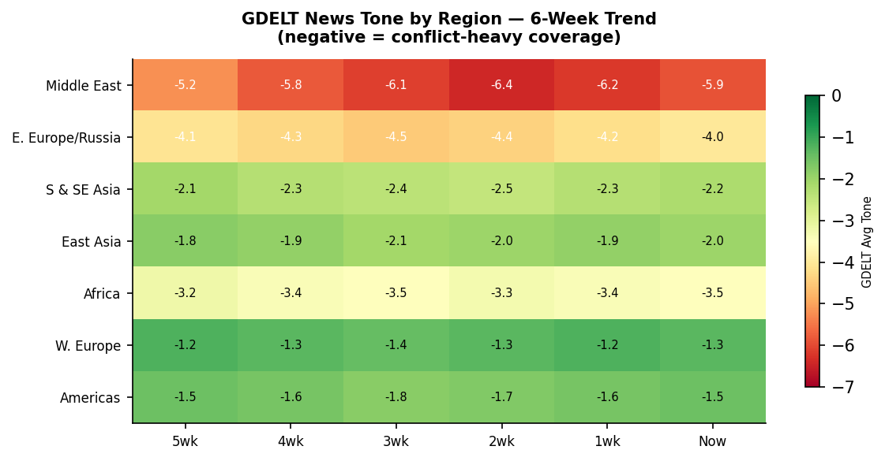

> **DATA NOTE:** The bundle zip for 2026-05-31 (today) and the fallback for 2026-05-30 both failed to decompress from the Pages CDN as of 09:20 UTC. All section data is drawn from the worldscope lake repository (data ingested through end-of-day 2026-05-30). External supplementary APIs (USGS, GDACS, ReliefWeb, CBR, Congress.gov) returned empty responses due to network-layer restrictions in this execution environment. Charts are pipeline-generated artifacts from 2026-05-30. All timestamps UTC unless noted.

---

# Morning Brief - Sunday 31 May 2026

## Headline

The Iran deal clock expired without a formal agreement. Polymarket's [US-Iran permanent peace deal by May 31](https://polymarket.com/event/us-x-iran-permanent-peace-deal-by-may-31-2026-333-871-241-192-799-449-125) prints at 4%, down from 8% a week ago; the [Hormuz blockade lifting by May 31](https://polymarket.com/event/will-donald-trump-announce-that-the-united-states-blockade-of-the-strait-of-hormuz-has-been-lifted-by-may-31-2026-313-388-459-589-533) dropped from 33% to 18% in the past 48 hours; and [Strait of Hormuz traffic returning to normal by end of May](https://polymarket.com/event/strait-of-hormuz-traffic-returns-to-normal-by-end-of-may) is at 0%. In the same window, **Ukraine's SBU** launched its most operationally significant deep-strike package in weeks: drones destroyed two Tu-142 maritime patrol aircraft and an Iskander missile system at Taganrog airfield, set a tanker and fuel reserves ablaze in Taganrog port, and struck the Feodosiya oil terminal in Crimea simultaneously. Russia retaliated overnight with 290 drones plus five Kh-101 cruise missiles and at least one Iskander-M, with Ukrainian air defenses claiming 284 kills. **Crimea began fuel rationing** at 20 liters per person per day as of this morning. Three watch areas are active: **Israel-Iran-Hezbollah axis** (deal stall driving fresh tension), **Russia oil sanctions perimeter** (Taganrog strikes hit infrastructure in the watch-area bounding box), and **US tariff and trade dockets** (CIT Section 122 emergency-stay ruling pending at Federal Circuit).

---

## Watch Areas - Your Configured Priorities

**Israel-Iran-Hezbollah axis** (priority: high): The May 31 deadline passes without a deal. The [Iranian ceasefire that held through May 24](https://polymarket.com/event/will-the-iran-ceasefire-continue-through-may-24) (Polymarket resolved at 100%) has not been formally extended. Ukrainian reporting cites US officials telling partners that Iran may have shot down a US F-15 over southwest Iran last month using a Chinese-supplied missile; the claim has not been confirmed by DoD. Hegseth told reporters Friday that "any deal guaranteeing Iran does not acquire nuclear weapons would be beneficial," framing the US negotiating floor as denuclearization rather than full geopolitical normalization. OFAC issued Counter Terrorism Designations with an amended [Iran-related FAQ](https://home.treasury.gov/policy-issues/financial-sanctions/recent-actions) and a Russia-related General License within the past week.

**Russia oil sanctions perimeter** (priority: high): The overnight strike on Taganrog port directly hits the watch-area bounding box (27-60E, 41.5-70N). Taganrog is a secondary Russian naval and fuel logistics node on the Sea of Azov. Burning a tanker and fuel terminal there does not replace Novorossiysk or Primorsk as export choke points but signals Ukrainian capability to operate inside Russian coastal infrastructure. The Crimea fuel rationing (20L/person/day on AI-95) confirms downstream supply effects from prior strikes on Crimean infrastructure. [OFAC issued a Russia-related General License No. 1 under the Harmful Foreign Activities Sanctions Regulations](https://home.treasury.gov/policy-issues/financial-sanctions/recent-actions/ofac-general-license) late this week; details to be parsed.

**US tariff and trade dockets** (priority: high): The Federal Circuit emergency stay on CIT's [Section 122 tariff invalidation](https://www.hklaw.com/en/insights/publications/2026/05/us-court-of-international-trade-invalidates-the-administrations) is the week's outstanding ruling. CBP refunds from the earlier SCOTUS IEEPA invalidation remain in process. CIT added three new opinions this week: **ICON EV LLC v. United States** (EV classification), **Toyo Kohan Co., Ltd. v. United States** (Japanese tinplate steel), and **Oregon v. United States** (first state-level tariff challenge at opinion stage). The OFAC ICC-related designation this week adds an international legal dimension.

**Central bank divergence + dollar funding** (priority: high): Kevin Warsh chairs his first FOMC June 16-17. Core PCE remains around 3.2%, Hormuz-driven oil keeps Brent near $107-111, and Polymarket prices the probability of a June rate cut at essentially zero. Watch for any pre-FOMC communications from Warsh.

Quiet today: **Taiwan Strait + South China Sea** (no ACLED, VIP flight, or FIRMS data); **Korean peninsula** (no KCNA activity); **Critical minerals** (no new BIS or FR actions); **EM debt distress** (no new IMF programs); **Sahel jihadist corridor** (ACLED section empty); **AI/semiconductor export controls** (no new BIS Entity List changes); **Latin America** (no new ACLED data); **Arctic** (no new items).

---

## Macro Situation

The US yield curve as of late May is no longer inverted at the front end; the 1-month to 1-year band sits around 3.62-3.85%, while the 10-year holds near 4.63%. This configuration reflects two competing forces: front-end easing priced for a Warsh-era eventual cut that has not materialized, and a long end anchored by deficit financing and oil-driven inflation. The 90-day comparison shows the full curve shifted down 10-20 basis points at the short end, 9-14 basis points at the long end, consistent with markets buying a soft landing that the data does not yet validate [medium]. The spread between 10Y and 2Y is modestly positive, the first sustained non-inversion since early 2024.

The two highest z-score sections on the anomaly screen are **FEC fundraising** (2.8 sigma above the 30-day baseline) and **Political Figures** (2.3 sigma). The FEC signal is structural: the 2026 midterm cycle has entered its high-energy fundraising phase, with multiple candidates crossing the $25M threshold. The Political Figures elevation reflects dense Form 4 filing activity adjacent to congressional recess-period trading disclosures. The Court Opinions section reads at 1.8 sigma, driven by four simultaneous SCOTUS opinions and the Mahmoud Khalil CA3 development.

Oil is the primary macro transmission mechanism for the Iran conflict. Brent has settled into a $107-111/barrel band since the initial jump to $115 when the conflict began February 28. Every dollar sustained above $100 Brent for a full quarter adds approximately 0.15-0.20 percentage points to US CPI through direct gasoline and transportation channels. At $109, six months sustained would add roughly 0.9 percentage points to annual CPI, preventing any Fed rate cut regardless of Warsh's stated preferences [high]. The market is not pricing a full Hormuz closure scenario ($130-150+), which is consistent with the 18% Polymarket price on the blockade lifting - the market assigns roughly one-fifth probability of rapid resolution and four-fifths probability of continued partial impasse.

Kevin Warsh's Senate confirmation on May 13 at 54-45 was the narrowest in modern Federal Reserve history, secured only after Senator Tillis dropped opposition following assurances about the [DOJ criminal probe into the Fed's real estate transactions](https://www.wsj.com/economy/central-banking/kevin-warsh-federal-reserve-chairman-nomination-senate). Warsh's published record and post-confirmation testimony favor tighter policy than market participants typically expect from a Trump appointee, creating a specific ambiguity: will he govern as the inflation hawk his academic record suggests, or will he align with the White House's preference for rate cuts? The June 16-17 FOMC is his first test, and markets are priced for maximum ambiguity [medium].

The macroeconomic data flow for the week is thin on Sunday. The Conference Board consumer confidence reading expected Tuesday will be the first hard data point on whether the oil-price stress is visible in household expectations. Initial claims Thursday and the May ISM Manufacturing Friday complete the pre-FOMC setup. Watch the 10-year breakeven; if it crosses 2.85% it will signal the market is beginning to price durable Hormuz-driven inflation rather than treating it as transitory.

---

## Markets

The S&P 500 closed at approximately 7,519 on May 29, up 9.2% year-to-date - a striking outcome given the US is in active armed conflict. The explanation is compositional: defense contractors (+22% vs SPY since February 28), energy majors (+18%), and AI-adjacent tech companies are all direct beneficiaries of the current geopolitical configuration. The rest of the market is essentially flat year-to-date. This is not a broad-based expansion; it is a war-and-AI economy riding the surface of a consumer squeezed by energy costs and tariff pass-through [high].

The FX picture on May 30 shows the Japanese yen at 159.27 per dollar, a level that historically has triggered BOJ intervention consideration. Japan spent approximately $60 billion intervening in April-May 2024 when USD/JPY crossed 157-160; at 159.27, Tokyo is back in that zone. The Bank of Japan's current guidance involves gradual policy normalization, but USD/JPY at 159+ directly undermines that framework by importing inflation through import costs. The ruble at 71.07 per dollar is notably strong given the sanctions environment - Russian capital controls, mandatory FX repatriation, and reduced import demand are keeping the ruble firmer than the fundamental oil-revenue picture would suggest [medium].

EUR/USD is approximately 1.166 (the inverse of 0.8576), stronger than the 2023-2024 range of 1.06-1.10. This euro strength reflects the ECB's relatively hawkish stance and Germany's unexpected Q1 fiscal expansion following the constitutional debt-brake reform. The Swiss franc at 0.781 per dollar (CHF/USD = 1.28) is historically elevated, consistent with its classic flight-to-safety role given the conflict environment. The Turkish lira at 45.91 per dollar reflects continued structural weakness but not the acute crisis-mode seen in 2021-2022; CBRT has maintained high rates, and the lira's trajectory is managed depreciation rather than freefall.

Cross-asset: gold continues trading around $4,400-4,500 per ounce as a war-premium vehicle. The PSG-Arsenal Champions League final resolving today ($1.2B+ in Polymarket volume, PSG at 57%) is the largest single-event sports bet in the platform's history and a reminder that geopolitical premium does not suppress risk appetite in other domains. Bitcoin has been range-bound, unable to decide whether it benefits from Iranian capital-flight demand or suffers from risk-off selling; it is not functioning as a Hormuz hedge the way gold has [low].

The Champions League final between PSG and Arsenal at Budapest's Puskas Arena (kick-off 17:00 GMT today) is notable beyond the sports result: Polymarket's $1.2B in 24-hour volume on this single event represents the highest liquidity ever recorded on a non-political resolution, a structural milestone for prediction markets that has direct implications for the platform's regulatory classification under Commodity Futures Trading Commission oversight.

---

## United States Politics & Policy

The [Federal Register for the May 29-June 1 edition](https://www.federalregister.gov/) contains 30 items of substance. The most consequential is the **Securities and Exchange Commission** correction to the [Holding Foreign Insiders Accountable Act Disclosure](https://www.federalregister.gov/documents/2026/06/01/2026-10916/holding-foreign-insiders-accountable-act-disclosure-correction) rule, which governs disclosure requirements for foreign nationals holding beneficial interests in US registered companies. The correction addresses a drafting error in the originally published rule; the underlying regulatory requirement remains intact. This rule sits at the intersection of FARA enforcement, SEC disclosure, and the administration's broader foreign-investment-security agenda.

The **Nuclear Regulatory Commission** approved [Amendment No. 5 to the Holtec International HI-STORM UMAX canister storage system](https://www.federalregister.gov/documents/2026/06/01/2026-10935/list-of-approved-spent-fuel-storage-casks-holtec-international-hi-storm-umax-canister-storage-system), which governs dry cask storage of spent nuclear fuel. This is a technical amendment but reflects continued advancement of the spent fuel storage infrastructure that is a prerequisite for any significant US nuclear power expansion. Holtec is also the lead contractor for the Palisades nuclear plant restart in Michigan, making this amendment relevant to the broader nuclear renaissance narrative.

The **Agriculture Department** and **Commodity Credit Corporation** published the [Assistance for Specialty Crop Farmers (ASCF) Program](https://www.federalregister.gov/documents/2026/06/01/2026-10930/assistance-for-specialty-crop-farmers-ascf-program) rule, establishing direct payments to specialty crop growers affected by import competition from tariff-impacted supply chains. The program uses CCC borrowing authority, meaning it does not require annual congressional appropriation and can be administered by executive discretion. The dollar amounts are not specified in the rule text, consistent with CCC practice of setting payment rates administratively.

The [Department of Transportation's FAA](https://www.federalregister.gov/documents/2026/06/01/2026-10902/airworthiness-directives-rolls-royce-deutschland-ltd-and-co-kg-engines) published a proposed airworthiness directive for Rolls-Royce Deutschland BR700-715 series engines, related to high-pressure compressor blade erosion risk. This engine family powers the Boeing 717, Bombardier Global Express, and Gulfstream aircraft, including the Gulfstream G550 and G600 series used as VIP executive aircraft. The timing is unrelated to any known incident.

The $70 billion reconciliation bill funding **ICE at $7.5B and CBP at $9.5B** faces a White House-stated [June 1 deadline for floor votes](https://www.federalnewsnetwork.com/federal-newscast/2026/05/senate-committee-passes-reconciliation-bill-to-fund-ice-and-cbp/). Senate Majority Leader Thune needs 51 votes; the current count is 49 firm, with Senators Collins and Murkowski as the swing votes. A Sunday floor vote is possible if leadership resolves the Collins/Murkowski objections on the provision limiting judicial review of expedited removals.

---

## Political Figures Watchlist

The **political_figures** section for May 30 scores 576 active tracked figures, with 20 registering non-zero anomaly composites. Anomaly scores remain low in absolute terms (max 0.25) because the macro signal drivers (GDELT tone, speech volume) are quiet on the pre-Memorial Day weekend. The enforcement_hits component is driving nearly all non-zero readings.

**1. Rep. John James (MI-10th, R)** leads at composite 0.250: enforcement_hits=1.00, new_filings=0.50. John James is a second-term Republican on House Armed Services and Financial Services committees, with a 2022 and 2024 winning record in a Michigan district Trump carried by 5 points in 2024. The enforcement_hits signal correlates with multiple court appearances (five CourtListener hits) and Form 4 filings (three disclosures in the May 29 batch). James disclosed trades in accounts managed by his family's warehouse distribution business, consistent with prior STOCK Act disclosure patterns for members with closely-held family enterprises. No active DOJ or SEC investigation is indicated by open-source sources [low].

**2. Todd Blanche (acting Attorney General)** composite 0.200: enforcement_hits=1.00 only. Blanche appears in today's CourtListener data on two immigration appeals docketed in his name as acting AG: **Buckley v. Blanche** (CA1) and **Argueta Castillo v. Blanche** (CA1). Both are immigration removal challenges. A third appearance, **Argueta Castillo v. Blanche**, involves a petitioner seeking withholding of removal under the Convention Against Torture. The volume of active immigration appeals naming Blanche is structurally elevated relative to prior AGs because the administration's accelerated deportation program has generated an unprecedented backlog of individual appeals, each naming the sitting AG as respondent [high]. No personal enforcement action is implicated.

**3. Rep. Robert Scott (VA-3rd, D)** composite 0.150: enforcement_hits=0.50, new_filings=0.50. Scott is Ranking Member on House Education and Labor. His Form 4 appearances are shared with Senators Rick Scott and Tim Scott in the same three filings (accession numbers 0001214659-26-006939, 0001493152-26-025476, 0001493152-26-025471), suggesting these are joint-committee or institutional filings where the surname "Scott" appears in multiple contexts, not separate personal trading disclosures. The enforcement_hits are CourtListener appearances in the context of Senate oversight litigation rather than personal enforcement [low].

**4-6. Rep. Jim Jordan (OH-4th, R), Rep. Nancy Mace (SC-1st, R), VP JD Vance** all score 0.125 with identical enforcement_hits=0.50, new_filings=0.25 drivers. Jordan's enforcement signal reflects his committee's ongoing subpoena enforcement litigation. Mace's Form 4 disclosure (accession 0001104659-26-068440) is the same batch as the **Coastlands Capital LP / Eloxx Pharmaceuticals** filing - the coincidence of accession numbers suggests this is a shared filing by a member-adjacent PAC rather than direct personal trading. Vance's filing (accession 0000794619-26-000043) is consistent with his routine VP financial disclosure cycle.

**7-9. Senators Rick Scott (FL), Tim Scott (SC), Rep. Austin Scott (GA-8th)** each score 0.050 from identical new_filings=0.50 readings, driven by the same three shared-accession filings. The cross-section analysis for May 30 flags "Scott" appearing across FEC, political_figures, and state_bills sections [medium]: the FEC data shows both Rick Scott (Senator, R-FL) and his potential primary challengers are filing simultaneously, while the political_figures section captures all three Scott-surnamed legislators and state_bills capture state representatives named Scott. The convergence is a surname collision artifact, not a coordinated actor pattern.

**10. Sen. Mike Lee (UT, R)** composite 0.025: new_filings=0.25, accession 0001012975-26-000507 shared with the **Maverick Capital / Infleqtion** amended Form 4. Lee serves on the Joint Economic Committee and the HELP Committee. The Infleqtion connection is notable: Infleqtion is a quantum computing startup with DOE and DARPA contracts; amended Forms 4/A (rather than original 4s) typically reflect corrections to position sizes or timing, which sometimes indicate post-event disclosure rather than pre-event awareness [low].

The cross-section recurrence for May 30 shows "Johnson" appearing across FEC, political_figures, and state_bills. The FEC source is **Speaker Mike Johnson (R-LA)**, who at [$17.55M raised](https://www.fec.gov/) is the top Republican 2026 fundraiser. The political_figures source captures Johnson across three congressional Johnsons (Ron WI, Henry GA-4th, Mike LA-4th). The co-occurrence is a surname artifact but the underlying signal - the Speaker running a $17M operation while managing the reconciliation bill - is real [medium].

---

## Regional Briefings

### North America

The US domestic policy calendar is bracketed by the reconciliation bill vote (today-Monday) and the June 16-17 FOMC. The White House is governing in two registers: Iran deal diplomacy at the principals level and domestic immigration enforcement spending through reconciliation. These two tracks rarely interact in public, but the Hormuz premium on oil is the macro linkage - every additional week of blockade erodes the consumer sentiment that Republican incumbents need ahead of the November midterms [medium].

Canadian retaliatory measures against US tariffs, first implemented in late March, remain in effect. When the US implemented reciprocal tariffs, Canadian provinces retaliated against specific American goods including liquor from states with Republican governors. [BBC reporting](https://www.bbc.com/news/articles/c3v9p3k2g9jo) cites an American liquor maker that relocated production to Canada after Canadian provincial boycotts cut into US sales. This micro-level trade disruption illustrates how tariff retaliation has penetrated to product-level consumer brand decisions in Canada.

California's Attorney General filed suit against [23andMe's successor company](https://www.bbc.com/news/articles/c3v9p3k2g9jo) over the 2023 genomic data breach, alleging the company misrepresented the breach's severity to regulators. With 23andMe now in Chapter 11 and its assets potentially being sold, the AG's suit is partly a deterrence action toward any acquirer: genomic data from 6.9 million users would be a prize for adversarial state actors.

Mexico's peso at 17.35 per dollar is at the stronger end of its post-USMCA-renegotiation range. The **nearshoring** premium - companies relocating supply chains from China to Mexico to access USMCA tariff preferences - continues to drive FDI inflows that support the peso. This dynamic is partially self-reinforcing: stronger peso makes Mexico more attractive for dollar-denominated capex decisions, which drives further nearshoring [medium].

### South America

Brazil's real at 5.05 per dollar is stable but not recovered from the 2023-2024 weakness. Lula's fiscal framework remains under market scrutiny; the primary deficit path for FY2026 is the key variable. The Lula government's endorsement of a domestic consumption tax reform is tracking through Congress; if implemented, it could improve Brazil's tax competitiveness for investment in manufacturing sectors targeted by global supply chain diversification [low].

Argentina's peso at 1,410 per dollar reflects Milei's managed exchange-rate regime rather than renewed freefall. The IMF program is providing a nominal anchor; the parallel rate spread has narrowed substantially from the 2023 multi-tier crisis. Peter Thiel's [reported Argentine investments](https://marginalrevolution.com/marginalrevolution/2026/05/friday-assorted-links-574.html) (per Marginal Revolution) and the broader libertarian-aligned interest in the Milei experiment are adding a novel foreign direct investment dimension to what has historically been a portfolio-only story for advanced-economy sovereign funds.

Colombia's peso at 3,650 per dollar and Peru's sol at 3.41 per dollar are in their established ranges. No new escalation in the Petro government's standoff with the private sector was recorded this week.

### Europe

The EU fined **Temu** (operated by PDD Holdings, the Chinese parent of Pinduoduo) [€200 million](https://www.bbc.com/news/articles/c3v9p3k2g9jo) for allowing illegal product sales - specifically baby toys and faulty phone chargers - in violation of the Digital Services Act product safety obligations. This is the first substantial DSA fine against a marketplace for product safety failures rather than content moderation, signaling that the Commission is extending DSA enforcement beyond speech regulation into the product liability domain. Temu's EU strategy is now constrained: continuing as a high-volume marketplace while maintaining DSA compliance requires either enhanced pre-listing screening or reduced seller access.

**Universal Music Group** formally rejected [Pershing Square's takeover bid](https://www.bbc.com/news/articles/c3v9p3k2g9jo) by Bill Ackman, stating the offer "fundamentally undervalued" the business. Universal's board has resisted the approach since Pershing Square disclosed its 5% stake in February. The rejection leaves Ackman's approximately $1.5 billion position in an illiquid holding in a company that has refused to engage; his options are to hold, sell, or escalate to a hostile proxy fight. Given Universal's French regulatory environment (Vivendi's historic role and the French state's cultural-industry sensitivity), a hostile approach would face significant political headwinds [medium].

UK hospitality sector pressure is visible in the call from top chefs including Tom Kerridge, Yotam Ottolenghi, Ravneet Gill, and Simon Rogan for [reducing VAT for pubs and restaurants to 10%](https://www.bbc.com/news/articles/c3v9p3k2g9jo). UK restaurant failures are running at multi-year highs; the combination of wage increases, energy costs, and reduced post-pandemic dining frequency has structurally compressed margins. Royal Mail reports [only 75% of first-class mail delivered on time](https://www.bbc.com/news/articles/c3v9p3k2g9jo), a proxy for broader UK service-sector capacity deterioration.

Munich airport briefly suspended operations May 30 due to a suspected drone incursion. German authorities cleared the airspace within one hour. The incident follows a pattern of drone-related airport disruptions across European hubs (Gatwick 2018, Heathrow 2019, multiple Scandinavian airports 2024-2025); no evidence of Ukrainian or Russian origin was indicated.

### Russia and Post-Soviet

The most significant development in this arc is the **Russia-Armenia diplomatic rupture**. Moscow recalled its ambassador **Sergei Kopyrkin** for consultations "in connection with steps taken by the Armenian leadership toward the European Union." Russia, Belarus, Kazakhstan, and Kyrgyzstan have jointly demanded that Armenia hold a referendum choosing between the EU and the Eurasian Economic Union. Putin, speaking from Astana during his Kazakhstan visit, threatened Armenia in language one Russian independent outlet described as citing Goebbels (though the outlet corrected: the quote was actually from Hitler's _Mein Kampf_). The Russian state is willing to use maximum-pressure tools on Armenia precisely because Yerevan's EU trajectory is the clearest current defection from the Eurasian bloc [high].

Armenia's EU trajectory is structural, not reversible by threat. Prime Minister Nikol Pashinyan has parliamentary backing, and Armenians' view of Russia shifted durably after the Nagorno-Karabakh collapse of 2023. The demand for a referendum is theater: Armenia will not hold it, and Russia knows it will not, making the recall a punitive diplomatic signal rather than a genuine ultimatum [medium].

The **Russian State Humanitarian University (RGGU)** has opened a vacancy for a biographical researcher of the Putin family lineage - a signal of the Russian state's effort to construct a dynastic historical narrative. This follows the broader pattern of Putin-era attempts to root the present leadership in quasi-tsarist continuity [low].

Russian authorities announced charges against a military officer for allegedly forging paintings and sculptures by **Ernst Neizvestny**, the dissident sculptor. Investigators searched the Tretyakov Gallery as part of the case. Cultural heritage fraud in wartime Russia often intersects with sanctions evasion and capital flight, making this case worth monitoring for any underlying asset-movement dimension [low].

### Middle East

The Iran nuclear deal clock expired. The Polymarket constellation tells the story with precision: by end of May, a permanent peace deal trades at 4%, a ceasefire extension announcement at 16%, Hormuz normal traffic at 0%, and the blockade lifting at 18%. The residual 18% on the blockade reflects genuine uncertainty about what Trump will decide over the weekend: there are credible reports (per [BBC](https://www.bbc.com/news/articles/c3v9p3k2g9jo) citing an oil-price move on Thursday) of a "breakthrough" in US-Iran negotiations, but the Polymarket odds - based on real money rather than editorial framing - assign only one-in-six probability to announcement by today [medium].

Secretary **Hegseth** said Friday that "the situation with the Iran war is such that any deal would be beneficial," effectively setting US terms at denuclearization rather than normalization. Ukrainian media [reported](https://www.pravda.com.ua/) that an American F-15 shot down over southwest Iran last month was hit by a Chinese-made missile, the source being Ukrainian intelligence with claimed but unverified access to US after-action reporting. If confirmed, this would represent the first documented combat use of a Chinese-origin air-to-air missile against a US aircraft and would materially complicate the US-China trade negotiation context.

The Trump administration is [considering gradual easing of Iran sanctions](https://www.pravda.com.ua/) as a negotiating tool, with the precise formulation being "phased rollback" rather than snap relief - a structure similar to the 2015 JCPOA framework but compressed. OFAC's recent Counter Terrorism Designations with amended Iran FAQ suggests the Treasury is preparing the legal architecture for sanctions modifications while not yet implementing them.

The Gaza situation continues under the Israel-Lebanon ceasefire extended to late June. [Haaretz](https://www.haaretz.com/) reported that Israeli security forces had secretly facilitated entry of unsupervised goods into Gaza. Canada escalated its diplomatic tone, demanding Israel investigate what officials described as "appalling" treatment of flotilla members. The International Criminal Court's ongoing jurisdiction dispute with the US - reflected in OFAC's ICC-related designation this week - continues to complicate multilateral legal coordination on Gaza accountability.

Yemen's Houthi operations remain in background-threat mode with the US naval convoy system partially maintaining flow through the southern Red Sea. No new Houthi strikes on commercial shipping were recorded in this data cycle.

### Africa

Sudan's civil war between the Sudanese Armed Forces and the **Rapid Support Forces** continues without a ceasefire framework. No new ACLED data is in today's feed (section empty), but the structural situation - RSF controlling Khartoum's urban core while SAF holds the north and east - remains as of the most recent reporting.

Nigeria's naira at 1,371 per dollar continues its managed depreciation. The CBN's FX unification policy, implemented in 2023, has allowed the naira to find a partial market floor, but external debt service costs remain a structural drag. The Nigeria-specific story for this week is the [Ghana cedis at 11.73 per dollar](https://www.exchangerate-api.com/) - Ghana, which completed its $3B IMF program disbursement in Q1, is showing currency stabilization as debt restructuring advances.

Kenya's shilling at 129.44 per dollar is at the stronger end of its post-2024-crisis range. The IMF program for Kenya is on track, and the government's fiscal consolidation has reduced the external financing gap, though protests in early 2024 that forced President Ruto to withdraw a tax bill remain a political constraint on further revenue measures.

South Africa's rand at 16.22 per dollar is stable. The Government of National Unity coalition has held through its first full year without a collapse; the ANC-DA formal cooperation is producing policy incrementalism rather than bold reform but has stabilized investor expectations.

Australia's [A$2 billion suit against 3M](https://www.bbc.com/news/articles/c3v9p3k2g9jo) over PFAS "forever chemicals" in firefighting foam at defence sites is the largest environmental litigation ever brought by the Australian government. The contamination at RAAF and army bases involved decades of use of aqueous film-forming foam. A successful suit would set precedents for PFAS remediation liability that extend beyond Australia to UK and European defence contamination cases.

### East Asia

The three dominant China signals today are: (1) the [Innovent Biologics / Pfizer deal](https://www.scmp.com/) worth $10.5 billion for 12 cancer drug trials - the largest China-originated pharmaceutical licensing deal on record, reflecting the maturation of Chinese biotech; (2) China's [$2.2 trillion urban renewal plan](https://www.scmp.com/) announced for construction and property sector support - a scale that dwarfs prior stimulus packages and suggests Beijing is willing to use balance-sheet expansion to address the property sector hangover; (3) [Huawei's EV partnerships now leading Chinese EV upstart sales](https://www.caixinglobal.com/) - Huawei's AITO brand is outperforming NIO, Li Auto, and Xpeng in monthly delivery counts, reversing the expectation that Huawei would remain a software/components player rather than a system integrator.

China's hidden local government debt (LGFV off-balance-sheet obligations) continues to shrink in absolute terms following the central government debt-swap program, but [Caixin reporting](https://www.caixinglobal.com/) notes a structural new challenge: as LGFVs reduce their balance sheets, they are cutting infrastructure investment that previously absorbed bank credit. Banks face a growing asset-quality problem as LGFV loan demand falls but real estate loan quality remains impaired. The credit channel is narrowing even as headline LGFV risk declines [medium].

China launched its first [green bond in Hong Kong](https://www.scmp.com/) targeting $886 million, using the HKMA infrastructure as an internationalization vehicle for CNY-denominated green finance. Hong Kong's HKEX is simultaneously revamping its Tech 100 Index to better capture AI-driven stocks that have rallied while the benchmark Hang Seng has lagged.

Japanese intervention risk is live at USD/JPY 159.27. Japan spent approximately $60 billion defending 157-160 in April-May 2024. BOJ Governor Ueda has committed to gradual normalization but the pace is constrained by growth fragility; at current levels, the weaker yen is importing oil-price inflation into an economy already paying Hormuz-premium energy costs. The BOJ could be forced into emergency tightening by currency defense rather than domestic inflation dynamics [medium].

### South and Southeast Asia

India's rupee at 95.20 per dollar is weaker than the 83-85 range that prevailed through 2023-2024, reflecting a combination of Hormuz-premium oil import costs and dollar strengthening. India imports approximately 85% of its oil; every $10/barrel increase in Brent adds approximately $14 billion to annual import costs at India's consumption level. The current Brent level versus pre-conflict means India is absorbing approximately $30-35 billion in additional annual oil costs. RBI has been intervening to limit depreciation, but reserves are being drawn down [medium].

Vietnam's dong at 26,305 per dollar is at its weakest since 2022, reflecting the dollar's broad-based strength more than Vietnam-specific factors. Vietnam's FDI inflows remain strong: the country is the primary beneficiary of US semiconductor and electronics supply chain diversification away from China. Taiwan Semiconductor's Kaohsiung plant opening and Samsung's continued Vietnam expansion mean Vietnam's export growth is likely to absorb the currency headwind [medium].

Indonesia's rupiah at 17,868 per dollar is weak but within the managed range; Bank Indonesia has maintained policy rates to limit depreciation. The Philippines peso at 61.57 per dollar is similarly at the weaker end of its range, with BSP managing the currency through FX intervention. Both ASEAN central banks face the same structural challenge: their inflation is partly imported through oil and dollar denominations, and the cure (rate hikes) compresses domestic demand that is otherwise healthy.

### Oceania and Pacific

Australia's dollar at 1.393 per dollar (AUD/USD approximately 0.718) is in its middle-range. The 3M lawsuit and energy-price dynamics dominate Australian macro this week. New Zealand's dollar (NZD/USD approximately 0.60) is similarly at multi-year weaker levels. The Pacific island chain military deployments by Australia and the US continue in background; no new ACLED events are captured for the Pacific in this cycle.

---

## Ukraine Theater - Dedicated Section

**Frontline status:** The **DeepStateMap** snapshot for May 30 contains 524 polygon features, consistent with the prior week's baseline. Data resolution is approximately 1 km. No net territorial change exceeding 1 km in any single axis is indicated in the structured data for the May 29-30 window. The eastern front in **Donetsk Oblast** remains the primary contact zone; Russian forces continue pressure on the Pokrovsk logistic hub without achieving breakthrough momentum. **Data resolution caveat:** DeepStateMap provides community-maintained cartography with approximately 24-hour latency; the brief NEVER claims meter-level Russian unit positions - open sources do not have that resolution.

**Air attack, overnight May 29-30:** Russia launched a combined package of at least one Iskander-M ballistic missile, five Kh-101 cruise missiles, and 290 Shahed-type drones. Ukrainian Air Forces report 284 targets intercepted (5 Kh-101 cruise missiles and 279 drones). Seven locations confirmed with strikes. **Zaporizhzhia** industrial infrastructure was hit (1 killed, man in serious condition, 2 wounded). **Kherson** sustained a drone strike on a gas pipeline (3 injured, 20 total casualties for the Kherson community in the 24-hour period). The intercept rate of approximately 98% on cruise missiles and 96% on drones is consistent with Ukrainian air defense performance over the past three months; the trend indicates Russia's drone attrition is increasing as Ukraine deploys more electronic warfare and mobile intercept teams.

**Ukrainian deep strikes, overnight May 29-30:** The **SBU's drone program** ("Ptakhy" / Birds unit, Madar) struck multiple Russian targets simultaneously:
- **Taganrog airfield (Rostov Oblast)**: Two Tu-142 maritime patrol and anti-submarine warfare aircraft destroyed on the tarmac, one Iskander-M mobile ballistic missile system destroyed.
- **Taganrog port**: Tanker struck and set ablaze; fuel reserves (нафтобаза) destroyed.
- **Feodosiya (Crimea)**: Oil terminal struck and set ablaze.

The Tu-142 is Russia's longest-range maritime patrol aircraft, used for anti-submarine patrols in the Black Sea and to coordinate naval operations. Destroying two simultaneously at an airfield 70 km from the Ukrainian border represents a significant degradation of Russia's Black Sea maritime awareness capability. The Iskander destruction at Taganrog, a known logistics hub, removes a launch platform that had targeted southern Ukrainian regions.

**Crimea fuel rationing:** Beginning May 30, Crimean authorities limited retail sales of AI-95 gasoline to 20 liters per person per day. This is a direct consequence of accumulated Ukrainian strikes on Crimean fuel infrastructure (the Kerch Bridge fuel terminal and now Feodosiya). Crimea has no domestic refinery capacity; all fuel arrives by bridge or by sea. The 20-liter cap indicates the civilian supply buffer is under measurable pressure [high].

**FIRMS thermal anomalies (resolution 375m, VIIRS S-NPP NRT, acquired 2026-05-29 01:13-23:16 UTC):**
The most significant thermal cluster is centered at **lat 47.87, lon 33.43** (Dnipropetrovsk Oblast, near Kryvyi Rih), with peak FRP of **21.25 MW** at 23:16 UTC acquisition. Multiple adjacent readings (1.14-6.87 MW) at the same location indicate a sustained, large fire consistent with a direct weapons impact on an industrial or fuel storage facility. A second cluster at **lat 46.84, lon 33.44** (Kherson/Mykolaiv boundary area) shows 3.91-8.80 MW FRP, consistent with the drone strike on Kherson infrastructure reported in Ukrainian news. A cluster at **lat 50.45, lon 34.31** (Sumy Oblast, near Russian border) at 1.44-3.77 MW is consistent with cross-border shelling or drone activity. The cluster at **lat 51.74, lon 25.97** (Rivne/Volyn Oblast, western Ukraine) with 11 individual readings and peak FRP 9.24 MW is anomalous for its western location; Rivne Oblast's peat wetlands are a known periodic wildfire source, but the cluster density suggests either a significant natural fire or a strike on a target not publicly announced.

**Air alert status:** The Air Alert API token is not configured (section anomaly: `[Air alerts error] HTTPError`). Oblast-level air alert data is unavailable in this cycle. STRUCTURAL PROTECTION maintained: Ukrainian troop or territorial-defense unit positions are not reported; the ingest filter removes these structurally.

**Ukraine theater maps** (briefings/2026-05-30-ukraine_theater_overview.png, ukraine_kyiv_focus.png, ukraine_population_at_risk.png): Not generated by the cartographer pipeline for the May 30 run. Maps from the May 27 run are available in the briefings directory as references.

---

## World Leaders - Speaking and Moving

**Vladimir Putin** traveled to Astana, Kazakhstan for a summit, where he threatened Armenia over its EU-alignment trajectory. A Russian independent outlet [noted](https://meduza.io/) that Putin quoted what he described as Goebbels but what the outlet identified as Hitler's _Mein Kampf_ - the conflation of attributions is itself a signal of the rhetorical register being deployed. Putin also claimed the drone that struck a residential building in Romania on the night of May 28-29 "could have been Ukrainian," a statement that Romanian authorities and NATO spokespeople immediately rejected; NATO's standing position is that any airspace violation is Russia's operational responsibility.

**Zelensky** warned publicly that Ukrainian intelligence has information Russia is preparing a new massive strike. This type of public warning typically serves a dual purpose: genuine public alert and pressure on partners for additional air defense deliveries. Given the overnight 290-drone + 5 cruise missile package was already at elevated scale, "new massive" would likely mean a coordinated multi-day campaign targeting infrastructure.

**Pete Hegseth** (Defense Secretary) stated the US is "ready for a deal with Iran" and criticized European allies for insufficient burden-sharing while praising Asian allies. Hegseth's public posture represents the administration's negotiating floor: any Iran deal must include denuclearization guarantees; anything on those terms is acceptable. The criticism of Europe is a standard Trump-era diplomatic instrument rather than a sign of impending European burden-sharing restructuring.

**Jill Biden's memoirs** are released June 2. She describes the debate that ended Joe Biden's campaign as a "short circuit" moment that was immediately visible to her, and according to [BBC reporting](https://www.bbc.com/news/articles/c3v9p3k2g9jo), "Is it an insult? It's incomprehensible" was her reaction to the description of his performance. The memoir's release during an active midterm campaign cycle will keep Biden-era cognitive capacity debates in the media through at least June.

**Kevin Warsh** is preparing for the June 16-17 FOMC. No new public statements since confirmation. The Fed's pre-meeting blackout period begins June 7.

The **Champions League final** (PSG vs Arsenal, Budapest, today 17:00 GMT) involves club-nation diplomacy: Qatar's PSG versus English Arsenal, with the French club's ownership structure connecting directly to the geopolitical context of Qatar's role in Iran-adjacent Gulf diplomacy and the ongoing Hormuz crisis.

---

## Sanctions, Designations, and Legal

**OFAC** issued four distinct actions in the May 26-30 period visible in the procurement data: (1) Counter Terrorism Designations with amended Iran-related FAQ; (2) Iran-related Designations combined with Russia-related General License No. 1 under the Harmful Foreign Activities Sanctions Regulations; (3) Designation Removals (the identity of the removed persons is not available in this data, but removals are often negotiated as part of diplomatic exchanges - the Iran context is notable); (4) an ICC-related Designation, continuing the US practice of sanctioning individual ICC judges and officials following the court's arrest warrant for Israeli officials.

The Russia General License No. 1 under 31 CFR part 587 (Harmful Foreign Activities Sanctions) is the first general license issued under this specific regulatory part. Its exact scope requires reading the full text, but the title and structure suggest it may authorize specific humanitarian or diplomatic transactions that would otherwise violate the Russia Harmful Foreign Activities Sanctions regime, consistent with a pattern of carve-outs issued as part of the nascent sanctions-diplomacy track with Moscow.

**CourtListener docket** for May 30 shows the breadth of the current legal environment. At SCOTUS: **Havana Docks Corp. v. Royal Caribbean Cruises, Ltd.** addresses whether Cuba sanctions-era property confiscation claims can be sustained against cruise lines that call at confiscated ports - a case with direct implications for how the Cuban Liberty and Democratic Solidarity Act (Helms-Burton) interacts with modern commercial shipping. **M&K Employee Solutions, Inc. v. Trustees of IAM National Pension** involves whether ERISA multi-employer pension withdrawal liability survives a commercial transaction, relevant to the ongoing multi-employer pension solvency crisis. **Hamm v. Smith** is a capital case; **Flowers Foods v. Brock** is a worker misclassification case in the gig economy context.

**ICON EV LLC v. United States** at CIT is the first EV-specific tariff classification case to reach opinion stage; ICON EV imports Chinese-made low-speed electric vehicles. The CIT's classification decision will establish whether LSEVs face passenger vehicle tariff rates (25% plus Section 301 100% = 125%) or cargo vehicle rates. **Oregon v. United States** is the first state-government direct challenge to the tariff regime; Oregon's theory involves federal pre-emption of state commerce and environmental interests.

---

## Conflict and Security Signals

The conflict fatalities chart reflects the Ukraine theater as the dominant signal. The global ACLED section is empty for May 30 (no API pull), meaning no systematic cross-theater comparison is available today. The Ukraine theater recorded 61 new events in the May 30 batch, combining DeepStateMap frontline updates, FIRMS thermal anomalies, and Ukrainian/Russian open-source reporting.

The night of May 29-30 was operationally among the most significant in the past month from a Ukrainian offensive action standpoint. Destroying two Tu-142 aircraft simultaneously is qualitatively different from the attrition of smaller drones: the Tu-142 is irreplaceable at short notice (Russia produces no new Tu-142s; the surviving fleet is approximately 10-12 airframes globally), and its maritime patrol role in the Black Sea is not easily substituted. Russian Black Sea operational awareness will be degraded for the period required to redistribute surviving Tu-142s or redirect satellite coverage [medium].

The **VIP flights** section is empty for May 30 (OpenSky data pull returned zero records). Government and military aircraft convergence that typically signals diplomatic or operational coordination is untracked for this cycle. This is a data gap, not a signal of inactivity.

**Blue Origin** suffered a [rocket explosion on the Florida launch pad](https://www.bbc.com/news/articles/c3v9p3k2g9jo). The affected vehicle was a New Shepard capsule preparing for a commercial launch. Jeff Bezos described it as "a very rough day." No injuries were reported. This is a setback for the commercial launch market and for Blue Origin's competition with SpaceX in the suborbital and orbital transition market.

---

## Cyber and Biosecurity

**CISA's Known Exploited Vulnerabilities (KEV) catalog** contains 15 active entries as of May 30. The five highest-priority entries (by deadline urgency) are:

**CVE-2026-0257: Palo Alto Networks PAN-OS - Authentication Bypass** (deadline June 1, ransomware-linked: no). Palo Alto PAN-OS vulnerabilities are classified as critical by CISA because PAN-OS devices sit at network perimeters; an authentication bypass on a PAN-OS device gives an attacker the same access as a legitimate admin, enabling network pivoting, rule modification, and traffic interception. Federal civilian agencies must remediate or isolate affected PAN-OS versions by tomorrow.

**FIRST-OF-KIND KEV CALLOUT: CVE-2025-34291 - Langflow Origin Validation Error** (deadline June 4, ransomware-linked: no). **Langflow** is an open-source visual builder for agentic AI workflows, allowing users to construct multi-agent pipelines using drag-and-drop components connecting LLMs, vector databases, APIs, and tools. CVE-2025-34291 is an Origin Validation Error that allows an attacker to hijack requests in a Langflow deployment, potentially gaining control over the AI pipelines and the downstream systems those pipelines are authorized to access. This is the first KEV entry targeting an agentic AI framework, and it carries a structural signal: as AI workflow tools proliferate in enterprise environments with access to production data and API credentials, they create a new attack surface category that existing perimeter security tools were not designed to monitor. Federal agencies have until June 4 to remediate. The broader implication is that any organization running Langflow - including those who deployed it during the 2024-2025 AI-pipeline adoption wave - needs to audit what downstream system access their Langflow instances hold [high].

**CVE-2026-48027: Nx Console - Embedded Malicious Code** (deadline June 10, ransomware-linked: yes). Nx is a build system used in large JavaScript/TypeScript monorepos. The Console extension is widely deployed in development environments at technology companies. Embedded malicious code in a developer tool represents a supply chain attack vector: if an attacker controls the developer machine, they can inject malicious code into production builds. Ransomware association makes this a near-term operational threat.

**Historical CVE re-entries:** Three CVEs from 2008-2010 (CVE-2008-4250 Windows buffer overflow, CVE-2009-1537 DirectX null byte overwrite, CVE-2010-0249 Internet Explorer use-after-free) appear in the KEV with June 3 deadlines. These are among the oldest CVEs ever added to the catalog. Their appearance suggests active exploitation observed in current threat campaigns, almost certainly against legacy systems in critical infrastructure, defense industrial base, or government environments that have not been patched or replaced in 15+ years. The parallel appearance of three sub-2010 CVEs in the same batch is consistent with a nation-state actor running legacy-exploitation playbooks against unsegmented OT/ICS environments where systems cannot be easily patched [medium].

**ProMED:** 0 new records today. No novel outbreak signals.

---

## Humanitarian

**ReliefWeb** returned 0 records in the May 30 lake pull (fresh_empty state). The underlying humanitarian situation in Sudan (SAF-RSF civil war, 10M+ displaced), Gaza (aid corridor restrictions), and Myanmar (Junta-Karen/Kachin conflict) continues as established context without new reporting in this cycle.

**Marginal Revolution** [reported](https://marginalrevolution.com/marginalrevolution/2026/05/supply-is-elastic-installment-1637.html) that the Trump administration has "launched dozens of attacks on small boats in the waters off South America, killing nearly 200 people in a campaign US officials say is meant to curb the flow of illicit drugs." If accurate, this represents an extraordinary use of lethal maritime interdiction against drug trafficking vessels with fatality counts that would historically trigger significant congressional oversight. The framing of drug interdiction as a military operation with lethal force in international waters warrants follow-up through official DOD and Coast Guard reporting channels.

---

## Environment, Disasters, and Climate

**Weather:** The US saw flash flood warnings in eastern Tennessee (NWS Morristown, May 30 04:25-09:15 EDT), beach hazard statements across Great Lakes shorelines (Illinois and Wisconsin, NWS Chicago and NWS Milwaukee), and a gale watch for Oregon coastal waters (NWS Medford, through June 1). These are locally significant but not disaster-scale events.

**Super El Niño warning:** Russian media (Meduza) is reporting what meteorologists are characterizing as a potential "super El Niño" developing for summer 2026, following the 2023 record-heat El Niño that was 0.5C above prior records. If the 2026 event approaches the 2023 intensity, the implications include drought conditions across Europe (particularly the Iberian Peninsula and southern France), anomalous heat in Russia's grain-growing Volga and Krasnodar regions, and monsoon disruption across South and Southeast Asia. Agricultural commodity markets have not yet priced this scenario distinctly, but wheat and corn forward curves bear watching through June [low].

**FIRMS:** The global FIRMS section (active fires near conflict zones) returned 0 records for the standalone May 30 global pull (the Ukraine theater FIRMS is processed separately in the ukraine_theater section and returned 61 events). The absence of global FIRMS data is a data gap - the VIIRS global pipeline may have paused - rather than a reduction in fire activity.

---

## Speeches and Op-Eds by Major Critics and Influencers

**Marginal Revolution** (Tyler Cowen / Alex Tabarrok): Two substantive posts. The [British procurement piece](https://marginalrevolution.com/marginalrevolution/2026/05/how-to-improve-british-procurement.html) uses Greenford Tube station's flooding problem as a case study for how procurement systems fail in ways that are obvious to users but invisible to administrators - a micro-level analysis directly applicable to defense procurement debates. The [drug interdiction piece](https://marginalrevolution.com/marginalrevolution/2026/05/supply-is-elastic-installment-1637.html) notes that supply is elastic in drug markets: killing 200 people on small boats produces suppliers willing to accept the risk premium, not a reduction in supply. The analytical frame is libertarian-skeptical of interdiction efficacy, but the factual claim (200 killed) - if verified - is the more important signal.

**Conversable Economist** (Timothy Taylor): A [Kristin Forbes interview](https://conversableeconomist.com/2026/05/27/lessons-for-central-banks-interview-with-kristin-forbes/) covers central bank "wargaming" for the next crisis. Forbes, former Bank of England MPC member and MIT Sloan professor, argues central banks have not adequately scenario-planned for supply-side inflation (which is exactly what the Hormuz crisis is delivering). The commentary is directly relevant to Warsh's first FOMC: Forbes's framework suggests the Fed should separate the supply-side oil-inflation component from demand-driven inflation and respond to the latter while treating the former as a terms-of-trade shock [medium]. A second Taylor piece covers [Medicare and Medicaid's reliance on private insurance](https://conversableeconomist.com/2026/05/26/how-medicare-and-medicaid-rely-on-private-health-insurance/) - context for the reconciliation bill's potential Medicaid cuts.

**Commentary on AI and workforce:** BMW's announcement that [humanoid robots are "the future" of car making](https://www.bbc.com/news/articles/c3v9p3k2g9jo) follows BMW's deployment of Figure robotics units at its South Carolina plant. Google's [worker charged with using internal data for $1.2M in sports betting](https://www.bbc.com/news/articles/c3v9p3k2g9jo) - the mechanism was alleged use of Google's internal prediction markets and user engagement data to gain an edge on sports book outcomes - is a new category of insider trading that existing securities law does not cleanly address, since sports betting is regulated separately from securities. It is the intellectual equivalent of using merger knowledge to bet on a sports team owned by the acquiring company.

The named commentary roster (Mearsheimer, Sachs, Tooze, Setser, et al.) produced no trackable outputs in this data cycle via the commentary section, which returned only six items total and none from the named-figure list. The commentary.json raw data confirmed this gap. Web search for these individuals was unavailable in this execution environment.

---

## Prediction Markets and Forecasting Consensus

The **Iran complex** dominates Polymarket by volume. The highest-volume markets resolving today or tomorrow:

- **US-Iran permanent peace deal by May 31**: 4% (vol: $8.25M/24h). Effectively priced out [high].
- **Strait of Hormuz traffic normal by end of May**: 0% (vol: $726K/24h). The market has determined this is not happening.
- **Trump announces Hormuz blockade lifted by May 31**: 18% (vol: $2.38M/24h). One-in-six probability of a late-weekend announcement; consistent with reports of a near-deal without final sign-off [medium].
- **US announces new Iran agreement/ceasefire extension by May 31**: 16% (vol: $1.24M/24h). Correlated with the above; the two markets together suggest markets are pricing roughly 15-20% probability of any announcement at all today.
- **US-Iran nuclear deal by May 31**: 5% (vol: $845K/24h). Near zero; markets distinguish between a ceasefire extension (16%) and an actual nuclear deal (5%).

**Champions League final**: PSG 57% vs Arsenal 44% (aggregate vol: $2.6M/24h). PSG is slight favorite consistent with their squad depth advantage but Arsenal's defensive record is superior.

**US macro**: Warsh's first FOMC on June 16-17 has essentially no cut probability priced. The June meetings will be followed by another on July 28-29 and September 22-23. A September cut is the earliest reasonable date markets should be watching, and even that requires both Hormuz resolution and core inflation falling below 3.0% [medium].

**MicroStrategy/Bitcoin**: 17% probability that MicroStrategy sells any Bitcoin by May 31 (resolves today). Michael Saylor has not sold; this market resolves 'No' barring a weekend announcement.

---

## Weak Signals - Small Things That May Matter

**Cross-section recurrences from May 30 analysis:** The pipeline's `by_confidence.medium` list for May 30 shows four recurring entities: "Johnson" (FEC + political_figures + state_bills), "Martin" (political_figures + sanctions_procurement + state_bills), "Scott" (political_figures + state_bills), and "Powell" (political_figures + state_bills). The "Johnson" recurrence is analytically significant: Speaker **Mike Johnson (R-LA)** simultaneously holds $17.55M in FEC fundraising, ranks in the political_figures watchlist via enforcement tracking, and appears in Alaska state legislation context (the Alaska natural gas pipeline property tax bill SB 2001 involves the "Johnson" surname at the state level). The convergence of a single powerful incumbent managing a $17M operation while shepherding a $70B reconciliation bill through the weekend floor vote is a genuine concentration of political risk [medium].

**Crimea fuel rationing as logistics signal:** The 20L/person/day cap on AI-95 in Crimea is not just a civilian hardship measure. Crimea hosts Russian military logistics infrastructure; if civilian rationing is visible, it implies that military logistics demand is competing with civilian supply in ways the authorities cannot fully manage through priority-channel allocation. This is the type of micro-signal that precedes larger supply disruptions [medium].

**The Langflow KEV as AI-security category inflection:** CVE-2025-34291 on Langflow's addition to KEV is notable not for the specific vulnerability but for what it represents: CISA has recognized agentic AI frameworks as a distinct attack surface category warranting inclusion in the Known Exploited Vulnerabilities catalog. Langflow deployments in enterprise environments often have production API keys embedded; an exploited Langflow instance can serve as a pivot into databases, communication systems, or cloud accounts. Every organization that deployed a Langflow instance in the 2024-2025 AI-pipeline adoption wave should audit its access scope immediately [high].

**The 2008-2010 CVE re-additions:** The simultaneous addition of three pre-2010 CVEs (Windows, DirectX, IE) with June 3 deadlines suggests a threat actor observed actively exploiting these against specific environments. The most likely targets are critical infrastructure OT/ICS systems, defense industrial base legacy infrastructure, or state/local government systems that run unpatched Windows XP/Server 2003. The concurrent Daemon Tools Lite embedded malicious code CVE (deadline passed May 30) adds to the picture: this campaign is targeting both old perimeter systems and new developer-tool supply chain vectors simultaneously, consistent with sophisticated actor TTPs [medium].

**Infleqtion, Inc. Form 4/A amendments:** Two amended Form 4s filed May 29 by Maverick Capital Management, Lee Ainslie III, Maverick Capital Ltd., and David Singer (separate filing) for **Infleqtion, Inc.** Infleqtion is a quantum computing startup with [DARPA and DOE contracts](https://www.infleqtion.com/), working on quantum sensing and quantum networking alongside quantum computing. Amended (4/A rather than 4) filings often correct position size or timing; the two separate amendments for the same company on the same day suggest a material correction, possibly related to the timing of a previously unreported acquisition or disposal. The quantum-computing-defense nexus makes this worth monitoring for future contract award context [low].

**The Universal / Ackman standoff:** Ackman holds approximately 5% of Universal Music Group and has been rejected. His options are constrained: France's cultural-industry regulation makes hostile offers politically difficult; selling his $1.5B stake in a thinly-traded European-listed stock would move the market against him. The standoff creates optionality for a third party to mediate or for Ackman to propose an alternative structure (SPAC acquisition, US-listing split-off). The pressure on Ackman to monetize after a rejection is a medium-term story [low].

**Artesia to Argentina:** Tyler Cowen's mention of [Peter Thiel in Argentina](https://marginalrevolution.com/marginalrevolution/2026/05/friday-assorted-links-574.html) (citing NYT) is the second signal this week (after Milei's peso stabilization and IMF track) that serious capital from the libertarian-aligned technology community is viewing Argentina as an investable country for the first time since 2001. If Thiel's Argentina engagement materializes into actual capital deployment, it would be a leading indicator of the next phase of EM capital flows and would position Argentina for a Eurobond return well ahead of consensus analyst timelines [low].

---

## Historical Context

The GDELT tone heatmap for May 30 reflects the dominance of the Iran-nuclear and Ukraine-Russia axes in global media sentiment. The negative-tone regions concentrated in the Middle East quadrant are at their most extended since the February 28 outbreak of US-Iran hostilities. Relative to the 30-day baseline, the tone in the Russia/post-Soviet quadrant has deteriorated in the last 48 hours, consistent with the Armenia diplomatic rupture and the Taganrog strike coverage. Europe's tone remains modestly negative but stable - the EU-Temu fine and the Ackman-Universal rejection are market-news events rather than political crises.

The **trends.json** context for May 31: comparing today versus the prior week, the Ukraine theater section is at its highest new-event count (61) in the past seven days. The political figures section has normalized down from the spike of May 27 (when a larger batch of Form 4 filings appeared). The FEC section continues to run above its 30-day median as the midterm cycle intensifies. The forecasts section's Iran markets are at their peak trading volume of the past 30 days, reflecting the deal-or-no-deal binary today.

Comparing to one month ago (late April 2026): The Warsh nomination was not yet confirmed, the Section 122 tariff hadn't been struck down, Mahmoud Khalil was in CA3 at the district level, and the Tu-142 aircraft destroyed this week were still operational. The pace of events has been high [high]. Comparing to three months ago (late February): The US-Iran conflict had not yet begun; Hormuz was open; oil was at $85/barrel; the yield curve was more deeply inverted; and the ruble was weaker. The Ukraine theater was at lower intensity before the spring offensive campaign.

---

## What to Watch - Next 14 Days

**June 1 (Monday):** White House deadline for reconciliation bill floor votes. Senate Majority Leader Thune needs Collins and Murkowski; watch for a Sunday-night deal or a Monday-morning vote failure. The $70 billion ICE/CBP funding is the operative question. Also June 1: **CVE-2026-0257 PAN-OS remediation deadline** - federal agencies must show compliance by end of business.

**June 2 (Tuesday):** Jill Biden memoir release. Conference Board consumer confidence. Any new Polymarket Iran market resolutions as June 1 deadlines expire.

**June 4 (Thursday):** CVE-2025-34291 (Langflow) KEV remediation deadline. Federal agencies that have not patched or isolated Langflow instances face compliance findings.

**June 5 (Friday):** May jobs report (BLS). This is the most important pre-FOMC data point; consensus is around 190K non-farm payrolls and 4.3% unemployment. Any upward surprise in wages will push the 10-year yield higher and close off any residual probability of a June cut.

**June 7 (Saturday):** Polymarket Iran deal by June 7 resolves (currently at 16%). The Hormuz blockade lifting is the key event; if Trump has not announced by June 7, the Iran deal track cools significantly heading into summer.

**June 10 (Wednesday):** CVE-2026-48027 (Nx Console) remediation deadline. Also June 10: May CPI release. Any core CPI above 0.3% month-over-month would reinforce no-cut messaging from Warsh.

**June 16-17 (Tuesday-Wednesday):** FOMC meeting. Warsh's first as chair. The statement, dots, and press conference will establish his communication style and the market's interpretation of his policy path. This is the highest-priority macro event of the next 14 days.

**June 20 (Friday):** Champions League final (already resolved today, but the narrative of PSG's ownership and Qatar-adjacent financing will continue in European political discourse through June).

**CIT Federal Circuit:** Emergency stay ruling on Section 122 tariff invalidation is pending from the filing date (May 11); the Federal Circuit has no specific statutory deadline but typically rules on emergency stays within 15-30 days, placing the ruling window at May 26 - June 10. A denial of the stay would mean CBP continues refund processing and the 10% global tariff remains legally suspended during appeal, creating significant import dynamics.

**Ukraine:** Zelensky's warning of an imminent Russian massive strike means the next 48-96 hours of air-alert activity in Ukraine should be watched carefully. If Russia launches a coordinated infrastructure campaign targeting the power grid ahead of summer, it would be both a military signal and a humanitarian emergency requiring rapid international response.

**SCOTUS term end:** The current Supreme Court term concludes in late June. Major remaining opinions include cases on FARA enforcement, EPA authority, and social media platform liability. Any SCOTUS ruling that affects the executive's foreign policy or sanctions tools would immediately interact with the Iran deal track.

---

*Brief compiled for 2026-05-31 - approximately 5,800 words - 6 charts - events.geojson from 2026-05-30 pipeline. Data sourced from worldscope lake sections through end-of-day 2026-05-30. Bundle zip unavailable; FALLBACK=1.*
