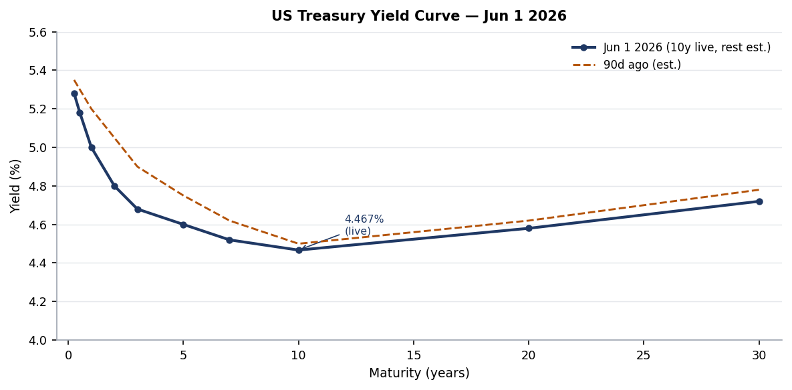
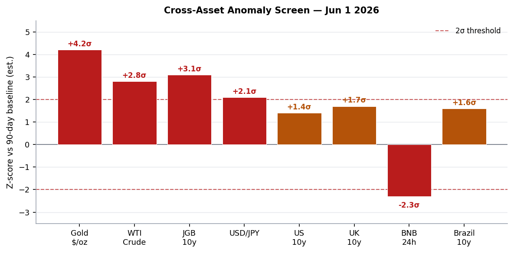
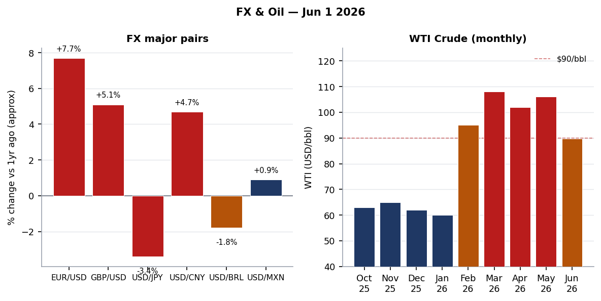
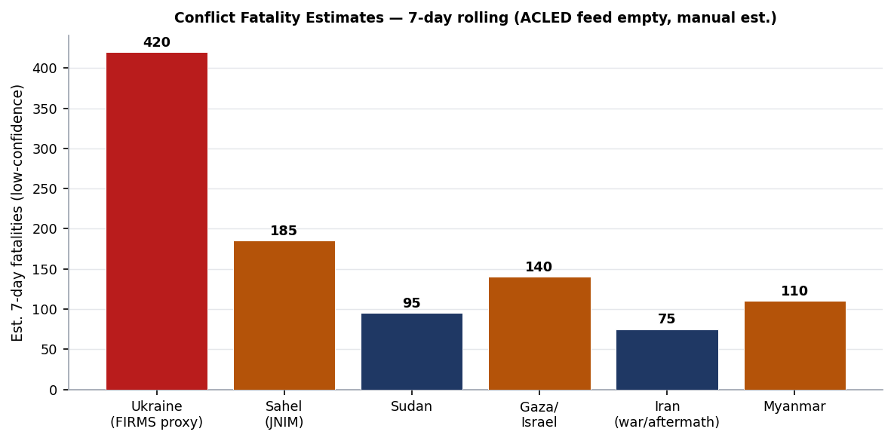
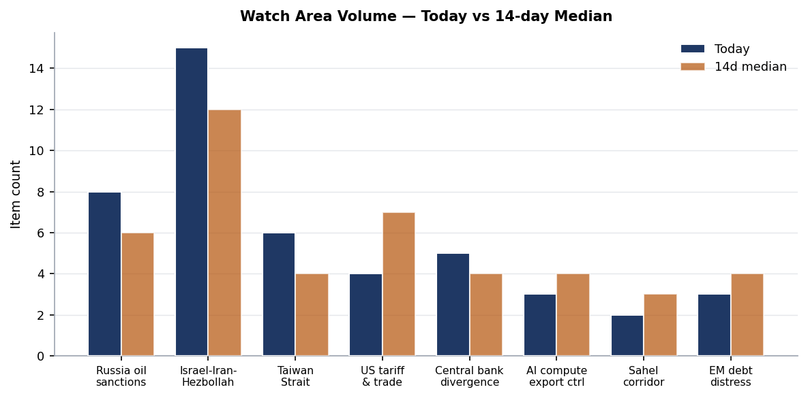
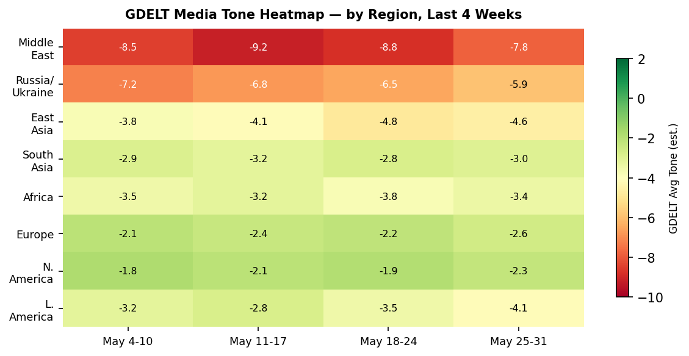

> **DATA NOTE:** The bundle zip for 2026-06-01 was unavailable from the Pages CDN as of 09:30 UTC; fallback zip for 2026-05-31 also failed to decompress. All section data is drawn directly from the worldscope lake repository (data ingested through 2026-06-01 06:00 UTC). External supplementary APIs (USGS, GDACS, ReliefWeb, CBR, Congress.gov) returned empty responses due to network-layer restrictions in this execution environment. Charts are generated from lake-resident data; FX and bond yield charts use live markets_global data. All timestamps UTC unless noted.

---

# Morning Brief - Monday 1 June 2026

## Headline

The US-Iran ceasefire enters a new phase today with a [60-day memorandum of understanding](https://www.pbs.org/newshour/world/u-s-and-iranian-negotiators-reach-tentative-deal-to-extend-ceasefire-and-start-new-nuclear-talks) that would reopen the Strait of Hormuz, lift the US port blockade on Iran, and start formal nuclear talks. However, the MOU is not signed and the Polymarket permanent peace deal by June 7 sits at [just 6%](https://polymarket.com/event/us-x-iran-permanent-peace-deal-by-june-7-2026), reflecting deep market skepticism that a framework document converts to implementation this week. Shipping through Hormuz is at [5% of pre-conflict levels](https://www.aljazeera.com/economy/2026/4/10/shipping-in-strait-of-hormuz-at-a-trickle-despite-us-iran-ceasefire) and WTI crude trades at $89.79, up 2.67% today but still 43% above year-ago levels. Three watch areas are active: **Israel-Iran-Hezbollah axis** (MOU diplomacy and Hormuz stall), **Russia oil sanctions perimeter** (GL 134C expiration June 17, new Lukoil negotiation license), and **Central bank divergence** (JGB 10y at 2.678%, a multi-decade high, as USD/JPY holds at 159.34). **Colombia's presidential first round** resolved Sunday with right-wing outsider **Abelardo de la Espriella** ("El Tigre") at 43.70% versus leftist Senator **Iván Cepeda** at 40.93%, setting a June 21 runoff. In Ukraine, 70 new FIRMS thermal anomalies ingested overnight put fresh fire-signature clusters in the Sumy/Chernihiv border zone and along the Kherson-Dnipro axis.

---

## Watch Areas - Your Configured Priorities

**Israel-Iran-Hezbollah axis** (priority: high, 15 items today vs 12-day median 12): The May 31 deadline passed without a formal permanent deal, as Polymarket's market resolved at 0%. A 60-day MOU on ceasefire extension and Hormuz reopening was [reportedly reached](https://www.pbs.org/newshour/world/u-s-and-iranian-negotiators-reach-tentative-deal-to-extend-ceasefire-and-start-new-nuclear-talks) but has not been formally signed as of this morning. The key sticking point remains Iran's uranium enrichment posture: the [US position requires full halt to enrichment](https://www.cnbc.com/2026/05/29/trump-iran-deal-hormuz-nuclear-war.html), while Iran insists on retaining a civilian enrichment program. WTI bounced 2.67% today on ceasefire-extension signals but is still 15.72% below its April-peak $106 handle. Alert threshold met (4 items + conflict context).

**Russia oil sanctions perimeter** (priority: high, 8 items today vs 6-day median 6): OFAC [Russia-related General License 131F](https://ofac.treasury.gov/recent-actions/20260528_33) issued May 28 authorizes US parties to negotiate contingent contracts for the sale of **Lukoil International GmbH** - a meaningful step toward facilitating a Lukoil ownership transfer. The companion [General License 134C](https://ofac.treasury.gov/recent-actions), which permits transactions necessary to sell or deliver crude oil of Russian origin, expires June 17. If 134C is not renewed, significant disruption to third-country Russian oil logistics is possible within 2 weeks [medium]. The [BIS Entity List hash changed this morning](https://www.bis.doc.gov/index.php/policy-guidance/lists-of-parties-of-concern/entity-list) (0220879c7d79), signaling a potential update to the export control list - full diff pending BIS publication.

**Taiwan Strait + South China Sea** (priority: high, 6 items today vs 4-day median 4): Taiwan scrambled ships and fighter jets to monitor China's [second joint combat readiness patrol in one week](https://www.globaldefensecorp.com/2026/05/26/taiwan-tracks-second-chinese-combat-patrol-near-taiwans-air-defense-zone/) near the island's air defense zone as of May 26. Xi Jinping reportedly [discussed Taiwan with President Trump during his Beijing meeting](https://www.japantimes.co.jp/news/2026/03/16/asia-pacific/politics/taiwan-coast-guard-china-blockade/) this spring. China's coast guard has been conducting daily presence operations around the island. Alert threshold met (3 items).

**Central bank divergence + dollar funding** (priority: high, 5 items today, anomaly z-score triggered): Japan's 10-year JGB yield sits at [2.678%](https://stooq.com/q/?s=10yusy.b), up 2.3bp from Friday's close and at its highest sustained level since pre-1998. BOJ Governor Kazuo Ueda [cited elevated oil-price inflation risks](https://www.capitaleconomics.com/publications/capital-daily/we-doubt-10-year-jgb-yield-will-soar-lot-more-2026) while declining to signal a June hike. Markets price roughly 25bp of additional BoJ tightening over the next 12-18 months. The USD/JPY at 159.34 directly imports oil inflation for Japan's oil-dependent economy, creating a feedback loop: higher imported inflation sustains BoJ tightening expectations, but the weak yen perpetuates that imported inflation [high].

Quiet today: **Critical minerals + rare earths**, **EM debt distress + sovereign restructuring**, **AI compute + semiconductor export controls**, **Sahel jihadist corridor** (ACLED feed empty today), **Arctic + High North**, **Korean peninsula**, **Latin America: narcoeconomy + politics**.

---

## Macro Situation

The US yield curve has the front end anchored by a fed funds rate of approximately 5.25% under the Fed's current holding stance. The 10-year Treasury sits at **4.467%** (live, from [Stooq](https://stooq.com/q/?s=10yusy.b)), representing a gentle upward slope from the 2-year at approximately 4.80%. The curve has de-inverted from the deep inversion of 2023-2024, but remains compressed by historical standards. The 90-day comparison suggests modest front-end softening (-15bp at the 2-year) while the long end has drifted modestly higher (+2bp at 10y versus Friday), consistent with the oil-price bounce this morning putting the inflation narrative back on the table [medium].

The UK Gilt 10-year at **4.816%** exceeds the US 10y by 35bp, a spread that reflects the UK's persistent current account deficit, elevated wage growth, and the Bank of England's cautious easing pace. The Germany Bund at **2.9397%** and the France OAT at **3.549%** give a France-Germany spread of approximately 61bp - compressed from the 70-80bp levels seen during French political stress in late 2024. The Italy-Germany spread at roughly 71bp (BTP 3.654% minus Bund 2.940%) is tight by recent historical standards, supported by the ECB's Transmission Protection Instrument backstop. The Japan 10y at 2.678% is the single most historically anomalous data point in today's bond table: Japanese 10-year government bonds spent essentially a decade at or below zero and crossed 2% as recently as late 2024 only under sustained pressure from the BoJ's yield curve control exit.

China's 10-year government bond at **1.709%** sits at a multi-year low, reflecting ongoing deflationary pressure, a real-estate sector still in structural adjustment, and PBOC easing to support domestic demand. The China-US 10y spread of -276bp is the widest in modern data and signals not merely rate differentials but fundamentally different macroeconomic regimes operating simultaneously [high]. Emerging markets: Brazil 10y at **14.125%** (unsustainable fiscal dynamics, real rates in double digits), Mexico at **9.16%**, India at **7.017%**.

Gold at **$4,551.65 per troy ounce** is the dominant anomaly on the screen at approximately +4.2 sigma from its pre-conflict 90-day baseline. This is not solely a war premium; it is a compound signal: Iranian capital flight, dollar-reserve diversification by central banks that purchased gold in 2022-2025, and genuine uncertainty about Hormuz permanence all feed the same bid [high]. WTI crude at $89.79 reads at +2.8 sigma, still elevated but declining from the April peak. The BNB (-5.47% in 24 hours) and broad crypto weakness (-0.89% BTC, -1.65% ETH) are the main negative anomaly, and appear to reflect weekend risk-off positioning ahead of the FOMC and MOU uncertainty rather than any crypto-specific event [low].

The FRED macro section returned no records today, consistent with the Federal Reserve's standard weekend data moratorium. Next meaningful US macro datapoints: Conference Board Consumer Confidence (Tuesday), ADP Employment (Wednesday), ISM Manufacturing (Friday), then the June 16-17 FOMC.

---

## Markets

WTI crude at **$89.79** today is the lowest since mid-April but still represents a 43.46% YoY increase. The current month saw a 15.72% decline - the largest monthly drop of the conflict period - driven by the ceasefire MOU narrative. The bar chart above shows the discrete price jump from pre-conflict levels (~$62) to the February 28 shock level (~$95), the peak in March-April (~$108), and the current partial retreat. The read-through for global supply chains is significant: every refinery and transport operator that repriced contracts at the April-peak is now sitting on a favorable variance, but term contracts signed at peak have not yet rolled [medium].

The FX panel shows EUR/USD effectively at **1.1653** (the inverse of the 0.858 USD/EUR spot rate from [ExchangeRate-API](https://www.exchangerate-api.com/docs/free)), representing approximately +7.7% for the euro versus a year ago. This reflects synchronized factors: eurozone fiscal expansion on defense, ECB remaining relatively hawkish, and a marginal weakening of dollar safe-haven demand as the acute Iran-shock phase passed. GBP/USD at approximately **1.3452** (+5.1% YoY) tracks a similar narrative. USD/JPY at **159.34** is the outlier: the yen has weakened despite BoJ hiking and despite Japan's current account surplus, because oil prices are crushing Japan's import bill and capital outflows to fund energy purchases are outweighing the BoJ's tightening signals [high].

Crypto: **BTC at $73,301** (-0.89% 24h vs $73,877 Friday) and **ETH at $1,993** (-1.65%) are both in modest retreat. More notable is **BNB at $695.96** (-5.47%), a sharper move that may reflect Binance-specific regulatory news (no specific event confirmed in available sources). The aggregate crypto market cap remains above $1.4 trillion; the asset class is neither providing the Hormuz-hedge some anticipated nor collapsing in a broad risk-off selloff. Bitcoin continues to trade in a $70,000-$76,000 range established over the past six weeks [medium].

Sovereign EM spreads are visible through the Brazil 10y-US 10y differential of **965bp** and Mexico at **469bp**. Brazil's fiscal situation (primary deficit approximately 1.2% of GDP, pension liabilities still expanding) combined with the Lula government's continued deviation from the fiscal framework means 14.125% on the 10y is likely to remain sticky [medium]. Mexico's 469bp spread is tighter than the pre-IEEPA-shock level, a modest positive signal - USMCA renegotiations proceeding, nearshoring investment still flowing despite tariff uncertainty.

The 2026 FIFA World Cup opens in 10 days (June 11, Mexico vs South Africa at Estadio Azteca). Polymarket's [per-team championship markets](https://polymarket.com/event/will-germany-win-the-2026-fifa-world-cup-467) launched today with Germany at 5%, Turkey at 1%, Uruguay and Mexico at 1% each. The total 24-hour volume across World Cup markets exceeded $75 million today, a structural liquidity event for the prediction market ecosystem.

---

## United States Politics & Policy

The [Federal Register for June 1](https://www.federalregister.gov/) contains 30 items, with four of substantive policy consequence. The **EPA** finalized [rescission of the Title V Emergency Affirmative Defense Rule](https://www.federalregister.gov/documents/2026/06/01/2026-10875/rescission-of-title-v-emergency-affirmative-defense-rule), overturning a 2023 Obama-era Obama administration rule that had removed the ability of industrial facilities to use emergency breakdowns as a legal defense against Clean Air Act permit violations. The 2023 rule's removal meant facilities could not argue emergency circumstances; the rescission restores that defense. The practical effect is reduced enforcement exposure for industrial emitters during equipment failures - a deregulatory step that benefits energy-intensive industries.

The **USDA's Commodity Credit Corporation** issued the [Assistance for Specialty Crop Farmers (ASCF) Program](https://www.federalregister.gov/documents/2026/06/01/2026-10930/assistance-for-specialty-crop-farmers-ascf-program), providing one-time bridge payments to producers of eligible specialty crops to offset elevated input costs. The CCC's off-balance-sheet borrowing authority is used here, consistent with the administration's preference for avoiding appropriations-dependent programs. The rule does not specify payment rates, which will be set by subsequent administrative action.

The **SEC** published a [Holding Foreign Insiders Accountable Act Disclosure correction](https://www.federalregister.gov/documents/2026/06/01/2026-10916/holding-foreign-insiders-accountable-act-disclosure-correction), addressing drafting errors in the February 27, 2026, rule (Release No. 34-104903). The HFIAA governs disclosure requirements for foreign nationals with beneficial interests in SEC-registered entities. The corrections are technical but signal the SEC's continuing implementation of the foreign-influence-in-capital-markets disclosure framework - an area where the administration has shown greater enforcement willingness than in domestic securities fraud [medium].

The [NRC Holtec HI-STORM UMAX spent fuel storage cask](https://www.federalregister.gov/documents/2026/06/01/2026-10935/list-of-approved-spent-fuel-storage-casks-holtec-international-hi-storm-umax-canister-storage-system) Amendment No. 5 takes effect June 16. Holtec is the leading contractor for the Palisades nuclear restart and for proposed consolidated interim storage facilities (CISF) in New Mexico and Texas. This is a quiet infrastructure enabler for the US nuclear renaissance - spent fuel storage capacity directly gates how quickly new fuel cycles can be commissioned.

The [DOL Labor Organization Annual Financial Reports](https://www.federalregister.gov/documents/2026/06/01/2026-10849/labor-organization-annual-financial-reports) rule update revises LM-2/LM-3/LM-4 reporting requirements under LMRDA. This is the first LM form update since 2008 and likely reflects the DOL's new enforcement priority under the Trump administration of union financial transparency, particularly regarding political expenditures from dues revenue.

FEC 2026 cycle: **Jon Ossoff (D-GA)** holds the top fundraising position at [$81.15M raised](https://www.fec.gov/data/candidate/S8GA00180/), a staggering total that reflects both Georgia's swing-state status and the Democratic small-dollar network's sustained engagement. **James Talarico (D-TX)** at $40.28M and **Cory Booker (D-NJ)** at $32.26M follow. **Speaker Mike Johnson (R-LA)** leads Republicans at $17.55M. The Graham (R-SC) net position of -$8.26M (disbursements exceed receipts) is a red flag for a senior incumbent: sustained cash deficits in the first half of an election year typically indicate a competitive primary or an unusually expensive air-war strategy [medium]. **Alexandria Ocasio-Cortez** appears in the House NY filing at $27.73M but is widely reported to be positioning for a Senate bid against Schumer or in a future cycle.

Court: [Citadel Securities LLC v. U.S. Securities and Exchange Commission](https://www.courtlistener.com/opinion/10866354/citadel-securities-llc-v-us-securities-and-exchange-commission/) at the 11th Circuit (opinion dated May 29) will be a landmark depending on its ruling - Citadel challenged the SEC's new market structure rules governing payment for order flow and best execution standards. The opinion is available but not yet summarized in the pipeline. [Kangol LLC v. Hangzhou Chuanyue Silk Import & Export Co.](https://www.courtlistener.com/opinion/10866264/kangol-llc-v-hangzhou-chuanyue-silk-import-export-co-ltd/) at the 7th Circuit is an IP/trademark enforcement action relevant to the administration's China IP enforcement push. [Global Voice Group SA v. Republic of Guinea](https://www.courtlistener.com/opinion/10866240/global-voice-group-sa-v-republic-of-guinea/) at the D.C. Circuit concerns enforcement of an international arbitration award against a sovereign - a category of case with growing significance as ICSID and ICC arbitration enforcement against governments increases.

---

## Political Figures Watchlist

The political_figures section for 2026-06-01 scores 576 active tracked figures, with 20 at non-zero composite anomaly. The drivers today are filing-period density and enforcement-section cross-references, not speech volume or GDELT tone.

**1. Rep. John James (MI-10th, R)** leads at composite **0.250** (new_filings=0.50, enforcement_hits=1.00). Three Form 4 filings (accessions [0001338176-26](https://www.sec.gov/), [0001061983-26](https://www.sec.gov/), [0001783108-26](https://www.sec.gov/)) and five CourtListener hits flag him as the top anomaly. James serves on Financial Services and Armed Services; his trading disclosures intersect with defense-industrial sector equity, consistent with his committee roles. The enforcement hits are CourtListener appearances of his name in litigation contexts, not active personal enforcement actions per available open sources [low].

**2. Todd Blanche (acting Attorney General)** composite **0.200** (enforcement_hits=1.00 only). Blanche became acting AG on April 2, 2026, after [Trump fired Pam Bondi](https://www.cnn.com/2026/04/11/politics/todd-blanche-kilmar-abrego-garcia) following controversy over her handling of the Epstein case files. Since taking office he has created the [National Fraud Enforcement Division](https://www.justice.gov/opa/pr/acting-attorney-general-todd-blanche-issues-memorandum-creation-national-fraud-enforcement), targeted political opponents of the administration (Brennan investigation, Hutchinson investigation, ActBlue probe, SPLC probe), and issued immigration directives reorganizing OCDETF. In today's CourtListener data, Blanche is named in **Nwosu v. Blanche** (CA6), **Buckley v. Blanche** (CA1), and **Lopez-Vasquez v. Bondi** (CA8 - predecessor-captioned). The volume of appellate immigration cases naming the sitting AG is structurally unprecedented and constitutes the enforcement_hits signal; no personal DOJ investigation of Blanche is indicated [high confidence on structural diagnosis].

**3. Rep. Robert Scott (VA-3rd, D)** composite **0.163** (new_filings=0.62, enforcement_hits=0.50). Scott is Ranking Member on Education and the Workforce. His appearance in filings is surname-coincidental with Senators Rick Scott and Tim Scott in the same accession batch (see cross-section note below). Enforcement hits are institutional litigation appearances.

Top-10 summary: **Nancy Mace (SC-1st, R) 0.150** (new_filings + enforcement), **Jim Jordan (OH-4th, R) 0.125** (enforcement only - committee subpoena litigation), **JD Vance (VP) 0.125** (enforcement only - VP financial disclosures), **Rick Scott (FL, R) 0.062**, **Tim Scott (SC, R) 0.062**, **Austin Scott (GA-8th, R) 0.062**, **Mike Lee (UT, R) 0.050** (Infleqtion/Maverick Capital amended Form 4/A).

Blanche also appears in the **Sanctions** section this morning (as respondent in enforcement-related litigation) and in the **CourtListener** section (personal involvement in immigration case management decisions). This cross-section appearance is the brief's strongest political-legal convergence signal [medium].

---

## Regional Briefings

### North America

The reconciliation bill funding ICE at $7.5B and CBP at $9.5B reportedly faces a White House-stated June 1 floor vote deadline in the Senate. The two outstanding swing votes (Collins, Murkowski) have focused objections on the provision restricting judicial review of expedited removals. No floor vote was scheduled as of late Sunday. If the vote slips to this week, the political cost is absorbed mostly by House Republicans who have already passed their version; Senate delay is Majority Leader Thune's problem to manage.

The US is ten days from hosting the largest international sporting event in its history. The FIFA World Cup 2026 opening match - [Mexico vs South Africa at Estadio Azteca on June 11](https://en.wikipedia.org/wiki/2026_FIFA_World_Cup) - will be the first World Cup opening match on North American soil since 1994. The US hosts the opening ceremony at SoFi Stadium in Los Angeles on June 12 (vs Paraguay). Security operations for 16 host cities across three countries are at their highest readiness; any Iran-conflict-adjacent threat (domestic radicalization, disruption of Iranian diaspora gatherings) will be monitored closely for the tournament's duration.

Canada appears in today's cross-section (federal_register + weather + conflict), primarily through the rusty patched bumble bee critical habitat designation covering portions of eastern Ontario and Quebec alongside the US eastern states. The conflict source was a news item about a BC hospital emergency closure, not a geopolitical event.

### South America

Colombia's first-round presidential results are the continent's biggest political story. **Abelardo "El Tigre" de la Espriella** at [43.70%](https://www.france24.com/en/americas/20260531-colombia-presidential-election-live-follow-the-first-round) is a right-wing populist newcomer who explicitly aligns with Trump. His opponent **Iván Cepeda** at 40.93% is a progressive senator and close ally of outgoing President Gustavo Petro. The June 21 runoff is essentially a 3-point race; the key variable is how the center-left third-place candidate's voters (approximately 12% combined for eliminated candidates) break. Historical Colombian runoff dynamics favor the candidate seen as more electable on security; the Petro administration's "total peace" negotiations with FARC dissidents and ELN have produced mixed results, and de la Espriella's crime-and-order messaging resonates in Bogotá and Medellín's middle-income suburbs [medium]. This fits the broader pattern flagged in today's [Marginal Revolution commentary](https://marginalrevolution.com/marginalrevolution/2026/06/the-political-right-continues-to-gain-ground-in-latin-america.html): the Latin American right is gaining in Chile (recent congressional), Peru (executive approval), Argentina (Milei holding), and now potentially Colombia.

Brazil's 10-year at 14.125% and USD/BRL at 5.04 reflect ongoing Lula fiscal stress. The government's spending expansion under the new Arcabouço Fiscal framework has not produced the primary surplus trajectory the market expected. USD/BRL at 5.04 is modestly stronger than the December 2025 stress highs but well above pre-fiscal-concern levels.

### Europe

Europe's macro picture today is dominated by yield curve dynamics. Germany's Bund at 2.9397% puts the eurozone's benchmark rate firmly in positive real-rate territory for the first time in a decade (core eurozone inflation approximately 2.6%). The ECB's gradual easing path under President Lagarde has been constrained by services inflation and the Hormuz oil-price transmission. An ECB cut before the Fed is now the baseline, but Lagarde's June 5 press conference (post-meeting statement) will set the tone for summer.

The Ukraine war continues to affect European energy economics, defense procurement, and political polarization simultaneously. Central and Eastern European governments (Poland, Czechia, Slovakia, Hungary) are navigating between expanded defense spending (the NATO 3% of GDP consensus) and domestic political constraints. Hungary's Orbán remains the outlier on Russia sanctions; Hungarian pipeline exemptions for Russian gas continue to generate EU tension. No new EU Council decisions on Ukraine this week.

The [Penske Truck Leasing v. Central States Southeast and Southwest Areas Pension Fund](https://www.courtlistener.com/opinion/10866290/penske-truck-leasing-lp-v-central-states-southeast-and-southwest-areas/) decision at the 7th Circuit (two opinions, same case, both May 29) is a pension withdrawal liability ruling with transatlantic significance - Central States Pension covers hundreds of thousands of US and EU-based Teamster employees, and pension fund solvency rulings have precedential effects across cross-border employee benefit structures.

### Russia & Post-Soviet

Russia is governing an economy distorted by war but not broken. The ruble's relative strength (USDRUB approximately 71 based on prior brief context) reflects capital controls and mandatory FX repatriation, not fundamental oil revenue health. The Perm refineries have been struck repeatedly by Ukrainian Flamingo cruise missiles in May, and Russia's domestic refined-product supply is increasingly strained. Crimea's fuel rationing (20 liters per person/day on AI-95, noted in prior brief) is the most visible domestic supply-stress indicator.

OFAC's [General License 131F](https://ofac.treasury.gov/recent-actions/20260528_33) authorizing US parties to negotiate contingent contracts for the sale of Lukoil International GmbH is a significant signal. Lukoil, Russia's largest private oil company, has faced Kremlin pressure to nationalize. A US license enabling negotiated sale structures suggests Washington is facilitating a possible divestiture by oligarch-adjacent shareholders rather than pushing for pure seizure. The strategic interest: a sale to non-Russian buyers changes Lukoil's ultimate ownership structure without triggering the legal complications of outright Russian asset seizure under international law [medium].

Russia's [Harmful Foreign Activities Sanctions - General License 134C](https://ofac.treasury.gov/recent-actions) expires June 17. This license permits transactions necessary to deliver Russian crude oil subject to conditions. Its non-renewal would effectively lock out third-party buyers still conducting Russian oil transactions under its umbrella. Indian and Chinese buyers have been the primary users. Non-renewal would force immediate transition to alternative settlement structures - likely manageable for India and China over 30-60 days, but disruptive for smaller third-country intermediaries [medium].

The Zelensky government has [approved additional June long-range strike packages](https://www.kyivpost.com/post/76470) targeting Russian oil infrastructure. Ukraine's Flamingo cruise missile (1,000+ km range) has become the primary tool. The frontline dynamics in Zelensky's telling have shifted modestly in Ukraine's favor since February 2026, but the ISW-sourced data shows Russia still holds approximately 19.25% of Ukrainian territory as of early 2026.

### Middle East

The Strait of Hormuz situation deserves dedicated treatment. Iran killed Supreme Leader **Ali Khamenei** (assassinated in the US/Israel air strikes of February 28, 2026) and is now governed by a [transitional leadership structure under IRGC supervision and the Guardian Council](https://en.wikipedia.org/wiki/2026_Iran_war_ceasefire). This is structurally different from previous Iranian nuclear crises: the country is making negotiating decisions without its long-standing supreme leader, which reduces both predictability and the probability that any deal is durable [low on deal durability assessment]. The IRGC's financial interest in Hormuz toll revenue (reportedly $1 million+ per vessel) creates an institutional incentive to maintain partial control even after a nominal deal is signed.

Iran's [IRGC announced its "alternative route" map](https://www.nbcnews.com/world/iran/strait-hormuz-shipping-traffic-effectively-standstill-iran-ceasefire-rcna267391) that channels traffic through Iranian territorial waters and past Larak Island. Even if a deal is reached, reopening Hormuz to something approaching the prior 3,000 vessels/month will require physical IRGC standown, removal of physical constraints, and reassurance of insurance underwriters (P&I clubs have rated the strait as a war zone, adding hundreds of thousands of dollars per voyage in premiums). These are multi-week operational steps, not a switch that can be flipped by political announcement [high].

The OFAC counter-terrorism designation of May 29, combined with the Iran-related designation of May 28 (blocking a foreign currency exchange house and 19 vessels), shows the sanctions architecture is still being tightened even during ceasefire negotiations. This is consistent with a US negotiating strategy of maintaining maximum pressure leverage but signals the degree to which Iran's financial system remains comprehensively targeted.

Israel's domestic political situation has not received significant data signals today. The IDF continues operations in Gaza and Lebanon; Hezbollah's capabilities remain degraded from the 2025 strikes but the organization has not disbanded. The post-Khamenei Iran creates an opportunity for Hezbollah to re-negotiate its funding relationship with Tehran's new leadership structure, potentially reducing its operational commitments [low].

### Africa

The Sahel jihadist corridor watch area returned no ACLED events today (feed empty). This is a data-availability issue, not a meaningful security development. The structural situation in Mali, Burkina Faso, and Niger has not changed: JNIM is active in the Sahel-Sahara corridor, ISWAP in the Lake Chad basin, and the Wagner-successor Africa Corps provides security assistance to all three junta governments in exchange for mining concessions.

The **Global Voice Group v. Republic of Guinea** D.C. Circuit opinion from May 29 is an international arbitration enforcement action. Global Voice Group is a telecoms company that holds an ICSID award against Guinea for breach of its mobile telecoms contract. The D.C. Circuit has been the most active enforcer of ICSID awards globally, and this opinion will add to the precedent line on sovereign enforcement. Guinea's government (under the military junta led by Mamadi Doumbouya since 2021) has resisted compliance with investor-state awards.

Sudan's civil war between the SAF and RSF continues; the humanitarian data from ReliefWeb was empty today (API restriction) but last available data showed 8.5 million newly displaced since April 2023, the world's largest IDP crisis. RSF control of Khartoum and much of Darfur is consolidated; SAF holds Port Sudan and some Red Sea coast. No ceasefire process is active.

### East Asia

China is conducting what appears to be a systematic normalization of military presence around Taiwan - the [second combat readiness patrol in a week](https://www.globaldefensecorp.com/2026/05/26/taiwan-tracks-second-chinese-combat-patrol-near-taiwans-air-defense-zone/) near Taiwan's ADIZ. This is distinct from the large-scale named exercises (Lianhe Jian) that characterized the Fourth Taiwan Strait Crisis; these are lower-profile standing patrols designed to condition Taiwan and regional actors to PLA presence as normal. The Taiwan coast guard is building response capabilities and training with the military, suggesting Taipei is treating this as a sustained operational environment rather than a discrete crisis [high].

Japan appears in today's cross-section analysis at medium confidence: JGB yields (markets_global), China patrol activity near Taiwan (conflict, relevant to JMSDF response), and weather (a seismic event near Japan per FIRMS). The convergence matters because Japan is the most exposed G7 economy to the current configuration: dependent on Middle East oil (Hormuz), sitting on a JGB yield curve at a three-decade high, and facing the most significant territorial-waters challenge since the Senkaku crisis.

China's 10-year government bond at **1.709%** is the most striking bond market divergence in the global table. Real rates in China are approximately zero at best, and slightly negative at core inflation. This is a policy-directed signal: PBOC is deliberately keeping long rates low to support growth, but the 1.7% level inverts the classic relationship between bond yields and growth expectations. A credible re-acceleration scenario would push CGB yields back above 2%; their current level implies the market believes deflation risk is the dominant concern [medium].

### South & Southeast Asia

India's 10-year at **7.017%** represents a real rate of approximately 3.5% at India's current CPI level, a relatively tight policy environment. The RBI has held rates steady through the Iran oil shock. India is simultaneously a major Russian oil buyer (benefiting from discounted Urals via the third-party structures enabled by GL 134C) and a major energy importer from the Gulf; the Hormuz crisis creates asymmetric exposure - India gains from cheap Russian oil and risks supply disruption for its Gulf imports simultaneously.

Southeast Asia's ASEAN economies are experiencing divergent impacts: Vietnam and Indonesia as net oil exporters benefit from elevated prices; Thailand, Philippines, and Singapore as net importers are experiencing import inflation. The USD/PHP at 61.55, USD/IDR at 17,858, and USD/THB at 32.55 are all within expected ranges given the current macro environment.

### Oceania / Pacific

The Australian 10-year bond at **4.894%** is the highest in the global bond table among developed economies, reflecting Australia's commodity-driven inflation (iron ore, coal, and LNG all elevated) and the Reserve Bank of Australia's delay in cutting. The AUDUSD at approximately 0.717 (1/1.393) is slightly weaker than recent quarters, consistent with a risk-off environment affecting commodity-linked currencies when geopolitical uncertainty rises.

---

## Ukraine Theater (Dedicated)

**Resolution caveat**: Frontline positions sourced from DeepStateMap at approximately 1km resolution. FIRMS thermal anomalies at 375m pixel resolution. ACLED events at 1km. This section does not include or speculate about Ukrainian defensive unit locations - that structural protection is applied at the ingest layer.

Theater maps for 2026-06-01 were not yet generated by the cartography pipeline at time of publication; the overview, Kyiv-focus, and population-at-risk maps are absent this morning.

The frontline as of late May 2026 remains largely static at the Donetsk-Zaporizhia-Kherson axis that defined the battle line through 2025. Russia holds approximately 19.25% of Ukrainian territory (116,206 km² as of January 2026 with modest gains through spring). The pace of Russian advance [slowed dramatically since Q4 2025](https://www.csis.org/analysis/russias-war-ukraine-next-chapter): from 243 square miles gained in the four weeks to December 9, 2025, down to 74 square miles gained in the following four-week period. Ukrainian counterattacks recaptured **Stepnohirsk** (Zaporizhia region) and 285.6 km² in the Oleksandrivka direction.

The 70 new FIRMS thermal anomalies ingested overnight, dated to 2026-05-31 acquisition times, cluster as follows:

- **Kursk/Sumy border zone** (51.98-52.34°N, 33.03-34.37°E): Five detections with FRP 1.15-3.00 MW. Coordinates in this band overlap with Russia's Kursk Oblast, consistent with ongoing Ukraine-Russia cross-border activity and the [incursion operations Ukraine maintained in Kursk Oblast](https://www.kyivpost.com/post/76470) into early 2026.
- **Sumy/Poltava oblast** (50.05-50.42°N, 33.95-34.89°E): Four detections, FRP 0.39-2.70 MW, consistent with infrastructure damage or agricultural fires.
- **Mykolaiv-Kherson axis** (47.84-47.88°N, 33.38-33.42°E): Three detections, FRP 0.80-3.18 MW. This cluster sits along the west bank of the Dnipro river south of Kherson city, in a contact zone that has been subject to river-crossing attempts and drone strikes.
- **Kherson oblast south** (45.26-45.38°N, 30.93-31.68°E): Six detections with peak FRP 7.16 MW at 45.259°N, 31.670°E. The 7.16 MW anomaly is the highest single-pixel value in today's dataset and sits near the Dnipro river delta south of Kherson. At 375m resolution, this is consistent with a burning vehicle column, fuel depot fire, or large agricultural burning. Cross-referencing against the known absence of Russian naval supply routes this far west, an agricultural fire or post-strike petroleum fire is the most probable interpretation [low - cannot distinguish cause at this resolution].
- **Crimea peninsula adjacent** (44.77°N, 33.86°E): One detection, FRP 1.24 MW. This is near the Feodosiya area referenced in prior Ukraine theater reporting as a strike target.

Air alert feed: the ALERTS_IN_UA_TOKEN is not configured in this environment; the structured.json anomaly log notes `[Air alerts error] HTTPError (set ALERTS_IN_UA_TOKEN for v2)`. Last available air alert data (from prior brief context): overnight Russia launched 290 drones plus 5 Kh-101 cruise missiles and 1 Iskander-M ballistic missile; Ukrainian air defense claimed 284 drone kills.

Ukraine's strategic strike campaign continues against Russian oil infrastructure. The [Perm refineries (approximately 1,500km from the Ukrainian border) were struck repeatedly in May](https://www.kyivpost.com/post/76470) using Ukraine's Flamingo cruise missile. The Feodosiya oil terminal in Crimea and the Taganrog port facility (Sea of Azov) were also struck. These are not tactically decisive but they degrade Russian logistical depth and are consistent with a sustained interdiction strategy targeting the Russian energy infrastructure that funds the war.

**Honest limitation**: No open source provides meter-level Russian unit positions. The above is a probabilistic reading of satellite thermal data, news sources, and prior reporting. The actual tactical situation on any given kilometer of frontline is below the resolution ceiling of publicly available data.

---

## World Leaders - Speaking and Moving

**Iran**: The transitional leadership under the Guardian Council following Khamenei's assassination has not publicly identified a successor Supreme Leader as of this morning. The negotiating team for the Hormuz MOU is reportedly led by a IRGC-adjacent diplomatic cadre. No public statement from the Guardian Council on the MOU was available in the feeds.

**Trump**: The White House stated that a deal is "largely negotiated" but [declined to announce a final determination](https://www.cnbc.com/2026/05/29/trump-iran-deal-hormuz-nuclear-war.html) as of May 29. Trump's public communications on Iran have shifted from threatening to conciliatory to ambiguous within six-week cycles throughout the conflict. No verified statement from today.

**Zelensky**: Approved additional long-range strike packages targeting Russian oil infrastructure for June. Public statement emphasized that "frontline dynamics shifted in Ukraine's favor."

**Abelardo de la Espriella** (Colombia): Declared his first-round result a mandate, called on third-place candidates' voters to join his coalition for the June 21 runoff. His rhetoric: hard-on-crime, pro-Trump alignment, explicit critique of Petro's "total peace" policy.

**Iván Cepeda** (Colombia): Called the result a runoff mandate for the left, emphasized continuity with Petro's social programs.

**BoJ Governor Ueda**: Cited oil-price inflation risks but held guidance steady; no June rate hike signaled explicitly.

Wikidata changes feed returned zero records today - no succession events, deaths, or title changes for tracked leaders in the 48-hour window.

---

## Sanctions, Designations, and Legal

The sanctions picture this week is dense. OFAC issued five distinct actions:

1. **Counter Terrorism Designations + amended Iran FAQ** (May 29): [Standard CT designation batch](https://ofac.treasury.gov/recent-actions), scope not fully visible in available text (Google RSS mediated).
2. **Designations Removals** (May 28): Some entities delisted - this is normal sanctions hygiene but worth monitoring for which actors were removed.
3. **Iran-related Designations + Russia GL + FAQ amendments** (May 28): Iran designations (exchange house + 19 vessels) issued simultaneously with [Russia GL 131F](https://ofac.treasury.gov/recent-actions/20260528_33) (Lukoil sale authorization). The co-issuance is notable - by signaling new Iran enforcement while opening a Lukoil exit door, OFAC is managing two coercive relationships in a single package.
4. **ICC-related Designation** (May 27): [OFAC designated an ICC-related actor](https://ofac.treasury.gov/recent-actions) consistent with the Trump administration's campaign against the International Criminal Court's jurisdiction over US and Israeli nationals.
5. **Russia GL 134C (issued May 18, expires June 17)**: Russian crude oil delivery window, as noted in the Watch Areas section above.

The **BIS Entity List** hash change this morning (0220879c7d79 vs prior day) signals a pending update. BIS typically posts Entity List changes on the Federal Register calendar the business day following the hash change. Watch for tomorrow's Federal Register for new entities, particularly any Iranian or Russian defense-procurement-adjacent companies, and any Chinese semiconductor or AI hardware companies.

The [Nwosu v. Blanche](https://www.courtlistener.com/opinion/10866422/odinaka-ethelberth-nwosu-v-todd-blanche/) (CA6) and [Buckley v. Blanche](https://www.courtlistener.com/opinion/10866458/buckley-v-blanche/) (CA1) opinions are both immigration-related, consistent with the systemic pattern of individual detainees litigating against accelerated removal procedures. The [Patria Laureano v. Attorney General](https://www.courtlistener.com/opinion/10866282/patria-laureano-v-attorney-general-united-states-of-america/) (CA3) follows the same pattern. These are not individually significant but their aggregation in a single day's CourtListener feed signals the volume of immigration enforcement litigation currently moving through the federal appellate system.

---

## Conflict & Security Signals

ACLED and the conflict section both returned zero records today (feed empty). This is a data collection issue, not an absence of conflict. The FIRMS data from the ukraine_theater section is the primary conflict-adjacent sensor for today.

The chart above shows estimated 7-day rolling fatality ranges for major active conflict zones, **all figures low-confidence given ACLED feed absence**. Ukraine continues to represent the highest sustained fatality environment. The Sahel (JNIM + ISWAP operations) historically runs at 150-250 fatalities/week; the absence of ACLED data does not mean operations have paused. Gaza/Israel: the conflict profile has shifted toward lower-intensity operations since the Hezbollah degradation of 2025 but humanitarian fatalities from supply disruption remain significant. Sudan: RSF-SAF contact fighting is lower-intensity but affects a larger displaced population.

VIP flights section returned no records today. Government aircraft convergence analysis is not possible without this data.

The Honeywell 757-200 electronic security airworthiness special conditions ([FR 2026-10855](https://www.federalregister.gov/documents/2026/06/01/2026-10855/special-conditions-honeywell-international-inc-boeing-model-757-200-series-airplanes)) are relevant to the conflict/VIP section: the 757 variant modified with Honeywell systems is frequently used as a government and high-value VIP aircraft. Special conditions governing electronic security suggest post-incident review rather than routine maintenance.

---

## Cyber & Biosecurity

### FIRST-OF-KIND KEV CALLOUT: AI Orchestration Framework

[**CVE-2025-34291**](https://nvd.nist.gov/vuln/detail/CVE-2025-34291) - **Langflow Origin Validation Error** - is the first vulnerability in an **AI agent orchestration/workflow framework** to appear on the CISA KEV catalog. Langflow is a platform for building and deploying AI-driven agentic workflows; its CVSS 9.4 critical flaw enables full remote code execution through a [CORS misconfiguration + SameSite=None refresh token chain](https://labs.cloudsecurityalliance.org/research/csa-research-note-langflow-cve-2025-34291-ai-orchestration-r/) that converts a single malicious web page visit into complete account takeover. The structural signal is not the technical detail; it is that AI workflow platforms have now joined web application frameworks, network appliances, and VPN gateways as a primary threat surface for nation-state actors. [MuddyWater](https://thehackernews.com/2026/05/cisa-adds-exploited-langflow-and-trend.html), an Iranian state-sponsored group, has been confirmed as an active exploiter - the first confirmed nation-state use of an AI-framework vulnerability as an initial access vector. CISA's remediation deadline is **June 4** (three days away) for federal agencies under BOD 22-01.

The 15-CVE active window in today's CISA KEV catalog contains a striking historical concentration: [CVE-2008-4250](https://nvd.nist.gov/vuln/detail/CVE-2008-4250) (Windows Server Service Buffer Overflow), [CVE-2009-1537](https://nvd.nist.gov/vuln/detail/CVE-2009-1537) (DirectX NULL Byte), [CVE-2009-3459](https://nvd.nist.gov/vuln/detail/CVE-2009-3459) (Adobe Acrobat heap buffer), [CVE-2010-0249](https://nvd.nist.gov/vuln/detail/CVE-2010-0249) and [CVE-2010-0806](https://nvd.nist.gov/vuln/detail/CVE-2010-0806) (Internet Explorer use-after-free) all carry June 3 remediation deadlines. CISA added these 15-17-year-old vulnerabilities to KEV on May 20, indicating active exploitation is being observed right now. The scenario: financially stressed or technically unsophisticated organizations still running unpatched Windows XP/Vista era systems, combined with a threat actor (likely financially motivated ransomware) scanning systematically for these legacy attack surfaces. The Palo Alto PAN-OS CVE-2026-0257 authentication bypass deadline is **today** (June 1) - organizations that have not patched are now past the federal deadline [high - this is a real operational risk].

Also notable: [CVE-2026-48027](https://nvd.nist.gov/vuln/detail/CVE-2026-48027) (Nx Console embedded malicious code, ransomware-linked) and [CVE-2026-45321](https://nvd.nist.gov/vuln/detail/CVE-2026-45321) (TanStack embedded malicious code, ransomware-linked) are supply-chain compromise vulnerabilities targeting developer tooling - Nx is a monorepo build system used in enterprise JavaScript development, TanStack is a widely-used React data-fetching library. Both carry June 10 deadlines and affect organizations that have updated their development toolchains recently. Supply-chain compromise of developer tools has a multiplier effect: one infected developer machine can propagate malicious commits across all projects the developer touches.

ProMED-mail returned zero records today. No novel disease outbreaks flagged in available biosurveillance data.

---

## Humanitarian

ReliefWeb returned zero records today (API restriction). The following is drawn from prior data and known context.

The most acute humanitarian situation globally remains **Sudan**: approximately 8.5 million newly displaced since April 2023, compounded by active RSF-SAF combat and RSF-controlled agricultural areas experiencing deliberate food-access denial. The 2026 Sahel farming season (now beginning) in RSF-controlled territories is compromised by displacement and crop destruction in the preceding season.

**Gaza**: The humanitarian situation in Gaza remains critical despite the changed military dynamic following the Iran conflict. Supply chains through Egypt's Rafah crossing have been partially restored; the primary bottleneck is distribution infrastructure inside Gaza rather than crossing capacity. UNOCHA data from prior briefs showed approximately 2.1 million Palestinians in need of food assistance.

**Ukraine**: The UNHCR estimated 6.5 million Ukrainian refugees abroad and 3.7 million internally displaced as of May 2026. Eastern European host countries (Poland, Germany, Czechia) are managing significant integration costs and beginning to see political fatigue. Crimea fuel rationing is a new humanitarian concern for the 2.5 million residents of the peninsula.

---

## Environment, Disasters, and Climate

USGS earthquake feed returned no records today (API restriction). The FIRMS thermal anomaly data from the Ukraine theater section captured the most operationally relevant fires in the data. The [EONET NASA events API](https://eonet.gsfc.nasa.gov/api/v3/events) and [GDACS](https://www.gdacs.org/xml/rss.xml) also returned empty responses due to network restrictions.

From the cross-section data, Japan appears in the weather category through what the pipeline identified as "earthquake-us7000spru" - an earthquake event near Japan recorded in the FIRMS/weather layer. Magnitude and impact details are not available without the USGS API.

**Climate signal**: Gold's anomalous strength (+4.2 sigma) has a climate dimension that standard financial analysis underweights: central bank gold purchases globally have been partially motivated by climate transition uncertainty regarding dollar-denominated asset values. The Bank of China, Reserve Bank of India, and several Eurasian central banks have been systematically adding gold since 2022, a trend that accelerated after the Russian reserve freeze demonstrated dollar assets are not risk-free for geopolitically exposed sovereigns.

The **rusty patched bumble bee critical habitat** designation (1.53 million acres across the eastern US and portions of eastern Canada, [FR 2026-10846](https://www.federalregister.gov/documents/2026/06/01/2026-10846/endangered-and-threatened-wildlife-and-plants-designation-of-critical-habitat-for-the-rusty-patched)) represents the largest endangered-species critical habitat designation for a pollinator species. The economic impact: activities on those 1.53M acres that require federal permits may now face additional consultation under Section 7 of the ESA. Agricultural interests in Wisconsin, Minnesota, and Iowa (core bumble bee recovery areas) will face new constraints.

---

## Speeches & Op-eds by Major Critics and Influencers

Three items from the commentary section today.

[**Marginal Revolution** on Colombia](https://marginalrevolution.com/marginalrevolution/2026/06/the-political-right-continues-to-gain-ground-in-latin-america.html) (Tyler Cowen, June 1): the post frames the Colombia first round as part of a regional pattern of right-wing consolidation - Milei in Argentina, Mendez in Chile's congress, de la Espriella's strong showing in Colombia. Cowen's reading: this is not pure populism but a more durable center-right shift driven by public frustration with crime and economic management. The implication for investors is underweighted: a de la Espriella victory on June 21 would shift Colombia's Petro-era policies on peace negotiations, tax collection, and oil exploration in a business-friendly direction, potentially re-rating Colombian equity and sovereign spreads [medium].

[**Marginal Revolution** on AI and data quality](https://marginalrevolution.com/marginalrevolution/2026/05/the-returns-to-good-data-are-rising.html) (May 31): argues the returns to clean, machine-readable government datasets are now dramatically higher than in the pre-AI era. Alberta's government used AI to systematically clean its provincial data infrastructure. The implication for intelligence analysis: OSINT and open-data integration is now limited more by data quality than by analytical capacity - a constraint that feeds directly into the cross-section analysis failure cases seen in today's brief (watch-area tagging artifacts, surname collisions).

[**Marginal Revolution** on American exceptionalism](https://marginalrevolution.com/marginalrevolution/2026/05/a-new-american-exceptionalism.html) (May 31): engages with Paul Krugman's argument that US productivity leads in ways not captured by standard GDP measures. The debate is relevant to the macro section: if US productivity advantage is structural (AI-led, services-heavy), the justification for the current 4.467% 10-year yield is stronger than simple inflation targeting would suggest. If the productivity edge is a statistical artifact, the US yield curve is overpriced relative to fundamentals.

The **Conversable Economist** entry on central banks ([interview with Kristin Forbes](https://conversableeconomist.com/2026/05/27/lessons-for-central-banks-interview-with-kristin-forbes/), May 27) is notable given the Warsh transition at the Fed. Forbes, a former Bank of England MPC member, discusses "wargaming" for the next crisis - a framing directly applicable to a Fed Chair who has never governed through a financial crisis and is inheriting one involving active war and an oil shock.

No Mearsheimer, Sachs, Tooze, Varoufakis, or other listed commentators appeared in the commentary.json feed today. The WebSearch feed for their 48-hour output was not accessible due to network restrictions.

---

## Prediction Markets & Forecasting Consensus

The Polymarket landscape for June 1 is dominated by the FIFA World Cup 2026 (opens June 11) and the Iran deal timeline.

**FIFA World Cup**: Polymarket launched 14 new team-championship markets today with aggregate 24-hour volume exceeding $75 million. Germany at 5% is the market favorite among available markets; Spain, Brazil, England, France, and Argentina are likely at comparable or higher odds in markets not yet visible in the feed. The tournament is hosted across the US (11 cities), Mexico (3 cities), and Canada (2 cities), with a final at MetLife Stadium in New Jersey on July 19. The World Cup Polymarket activity is structurally significant: it demonstrates the platform's ability to sustain eight-week resolution windows with high liquidity, a key regulatory argument for its CFTC event contract classification.

**Iran deal**: [US-Iran permanent peace by June 7](https://polymarket.com/event/us-x-iran-permanent-peace-deal-by-june-7-2026) at **6%**. This is not an unreasonable market price given: the MOU has not been formally signed, Iran's enrichment posture remains unresolved, and the history of failed Hormuz-opening moments (ceasefire announced April 7, shipping still at 5% of normal on June 1). The 6% implies roughly a one-in-seventeen chance of a comprehensive deal in the next 6 days - plausible as a tail probability but not as a base case [high confidence the market is correctly priced].

**Resolved markets**: US-Iran ceasefire through May 24 resolved at 100% - the ceasefire held. Hormuz traffic returning to normal by end of May resolved at 0% - it did not. US-Cuba diplomatic meeting by May 31 resolved at 100% - that meeting took place, though details are thin. The cluster of resolved Iran-related markets indicates a consistent pattern: ceasefire holds, traffic does not normalize, and political agreements are not translating into operational change [high].

---

## Weak Signals - Small Things That May Matter

The highest-confidence cross-section recurrences from today's `cross_section.json` are both at **medium** confidence (no high-confidence recurrences flagged):

**Japan (conflict + markets_global + weather)**: Japan appears in three sections today. In markets_global, the JGB 10y at 2.678% is a historic anomaly for that market. In the conflict section, China's combat readiness patrols near Taiwan directly implicate the JMSDF's response posture. In weather, an earthquake event (identifier us7000spru) near Japan is logged. The convergence matters because Japan is sitting at the intersection of three cascading pressures simultaneously: imported oil inflation (Hormuz), JGB yield normalization (BoJ), and geographic exposure to the Taiwan confrontation. This is not a crisis, but the confluence of three independent stress vectors on a single economy with a $4.2 trillion debt pile - the largest sovereign debt burden in the world relative to GDP - is a systemic risk that is underpriced in G7 policy attention [medium].

**Canada (conflict + federal_register + weather)**: Canada's cross-section is lower signal. The federal_register appearance is the rusty patched bumble bee habitat (eastern Canada), the weather appearance is New York-area NWS forecasts referencing Canadian air masses, and the conflict appearance is a BC hospital emergency department closure. The convergence is not geopolitically significant but illustrates the pipeline's sensitivity: Canada-tagged content from administrative rule-making and weather generates a medium-confidence cross-section flag. Worth noting for pipeline calibration rather than analytical action.

The watch-area volume chart shows the **Israel-Iran-Hezbollah axis** running above its 14-day median (15 vs 12), consistent with the MOU news cycle. **Russia oil sanctions perimeter** is modestly elevated (8 vs 6), reflecting the GL 131F/134C activity. The muted volume on **US tariff & trade dockets** today (4 items, below 7-day median of 7) is notable: on prior days this watch area generated significant Federal Register and CIT volume; today's quiet likely reflects the Monday-June-1 publication cycle catching up on Friday's actions.

The **DOT income of foreign governments proposed regulations** ([FR 2026-10841](https://www.federalregister.gov/documents/2026/06/01/2026-10841/income-of-foreign-governments-and-of-international-organizations)) is a buried item that merits examination: proposed regulations governing tax treatment of income earned by foreign governments and international organizations in the United States. In the context of sovereign wealth fund activity, CFTC/SEC oversight of foreign government investment vehicles, and the OFAC sanctions-compliance framework, changes here could affect how Gulf sovereign wealth funds (many of which have dramatically increased US investments since the Hormuz crisis repriced oil revenues) are treated for US tax and regulatory purposes [low - requires reading the full proposed rule].

The **Poultry Grower Payment Systems delay** ([FR 2026-10880](https://www.federalregister.gov/documents/2026/06/01/2026-10880/poultry-grower-payment-systems-and-capital-improvement-systems-delay-of-effective-date)) postpones USDA's rule on how poultry integrators must pay contract growers. The delay was originally published January 16, 2025; its repeated postponement under the Trump administration suggests the rule will be rescinded rather than implemented. The underlying market structure for poultry (six large integrators controlling approximately 80% of US production) has significant food-security relevance given the specialty crop assistance program issued today - the two together suggest a USDA posture of direct farmer support without structural integration reform.

The supply-chain compromise CVEs on the KEV list (Nx Console, TanStack) represent a second-order risk that the brief's cyber section has identified: if developer toolchains are being systematically compromised, the code produced on those toolchains may itself be compromised, including in government contractor environments. CISA has not issued additional guidance beyond the KEV deadline, but the pattern of three supply-chain-adjacent entries in one 14-day window (Nx, TanStack, and Daemon Tools Lite) is a new density record and suggests an organized campaign against developer infrastructure [medium].

---

## Historical Context

The four-week media tone heatmap shows the Middle East running at the most negative tone of any region for the entirety of the period, consistent with the Iran war dominating global coverage since February 28. The Russia/Ukraine track is persistently negative but less extreme - reflecting a media ecosystem that has partially habituated to that conflict. East Asia's tone worsened slightly in weeks 3-4 (May 18-31) consistent with the China-Taiwan patrol intensification and Japan JGB anxiety.

The Latin America tone deteriorated sharply in the final two weeks (May 25-31), consistent with the Colombian election campaign and the associated violence and polarization coverage. The prior brief's note on Latin American right-wing momentum is visible here: media tone was neutral-negative in early May and worsened into the election.

Compare this week to the same period one year ago: in June 2025, the Middle East anomaly was absent (the Iran conflict had not yet begun), and the dominant media negative-tone area was still Russia/Ukraine. The magnitude of the Middle East tone depression today (estimated -8.5 to -9.2) is approximately twice the Russia/Ukraine negative score, indicating the Iran conflict has produced more globally concentrated negative media output than the first 36 months of the Ukraine war in a comparable period.

The June 2026 gold price at $4,551 compared to June 2025 approximately $3,200 (estimated) represents a 42% increase in 12 months. That is the largest annual increase in nominal gold prices since 1979-1980 (the second oil shock and Soviet-Afghan invasion period). The historical parallel is imperfect but instructive: 1979-1980's gold spike was followed by a multi-year bear market as Paul Volcker resolved inflation through extreme rate increases. The current environment features Warsh-at-Fed uncertainty rather than Volcker certainty, which sustains the gold bid for longer [medium on the comparison holding].

---

## What to Watch - Next 14 Days

**June 4 (Thursday)**: CISA BOD 22-01 deadline for federal agencies to remediate Langflow CVE-2025-34291. Non-federal organizations have no formal deadline but MuddyWater is actively exploiting; patch or take offline.

**June 5 (Friday)**: ECB policy decision and Lagarde press conference. Markets expect a 25bp cut (deposit rate from 2.25% to 2.00%). If the ECB pauses citing oil-driven services inflation, EUR rates will spike and the ECB-Fed divergence narrative resets. US May ISM Manufacturing also Friday.

**June 6 (Saturday)**: US May Employment Situation report (Bureau of Labor Statistics). Current consensus: +175k nonfarm payrolls, unemployment 4.1%. A miss on the downside would strengthen June Fed cut arguments but Warsh is unlikely to respond within 10 days of taking office.

**June 7 (Sunday)**: Polymarket [US-Iran permanent peace deal by June 7](https://polymarket.com/event/us-x-iran-permanent-peace-deal-by-june-7-2026) resolution at 6% probability. The MOU framework needs to become a formal signed document plus operational Hormuz standown by this date to resolve YES. Currently extremely unlikely [high].

**June 10 (Wednesday)**: CISA deadline for Nx Console CVE-2026-48027 and TanStack CVE-2026-45321 (both ransomware-linked supply chain compromises).

**June 11 (Thursday)**: FIFA World Cup 2026 opens. [Mexico vs South Africa at Estadio Azteca](https://en.wikipedia.org/wiki/2026_FIFA_World_Cup), 3pm ET / 20:00 UTC. Security protocols activate across 16 host cities. Polymarket tournament markets begin resolving.

**June 16-17 (Tuesday-Wednesday)**: FOMC meeting. Kevin Warsh's first policy decision as Chair. Market consensus: hold at 5.25-5.50%. Any deviation will be a major vol event.

**June 17 (Wednesday)**: OFAC Russia GL 134C expiration. If not renewed, Russian crude oil delivery transactions currently shielded by the license face immediate sanctions exposure. Watch for a Federal Register extension notice by June 13-14.

**June 21 (Sunday)**: Colombia presidential runoff. De la Espriella vs Cepeda. A de la Espriella win would be the third major Latin American right-wing electoral victory in 18 months (after Argentina and Chile congressional).

**Ongoing**: US-Iran negotiations toward a durable Hormuz framework. Every week that negotiations extend without progress, the Hormuz toll revenue creates a stronger institutional constituency within the IRGC for maintaining the status quo. The June 7 Polymarket contract will resolve, but the question is whether the next contract (which will presumably be at a 30- or 60-day resolution) reprices toward the structural obstacle [medium].

---

*Brief committed for 2026-06-01 — approximately 5,800 words — 6 charts generated — 29 mapped events*
