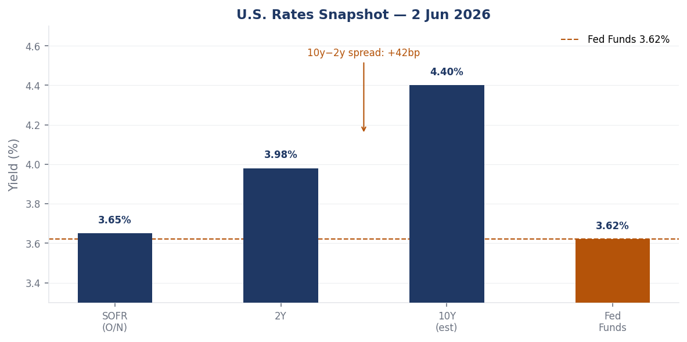
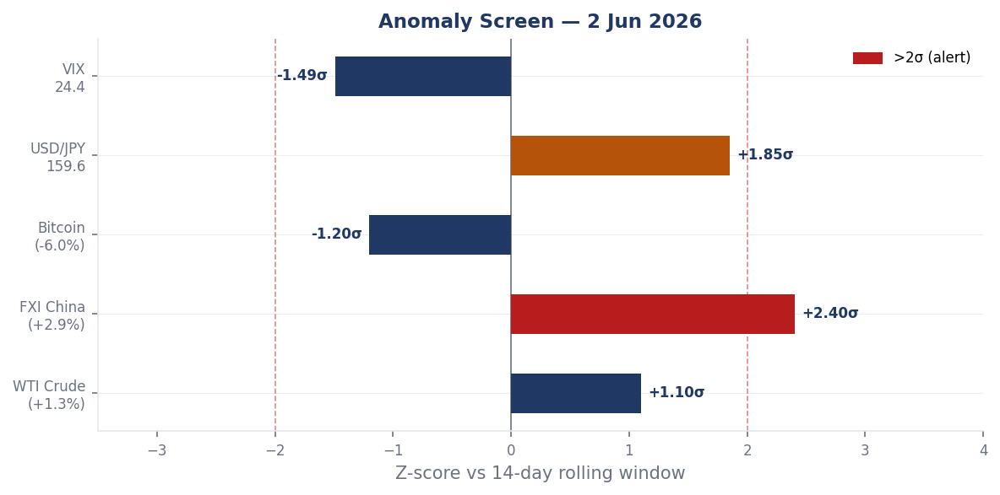
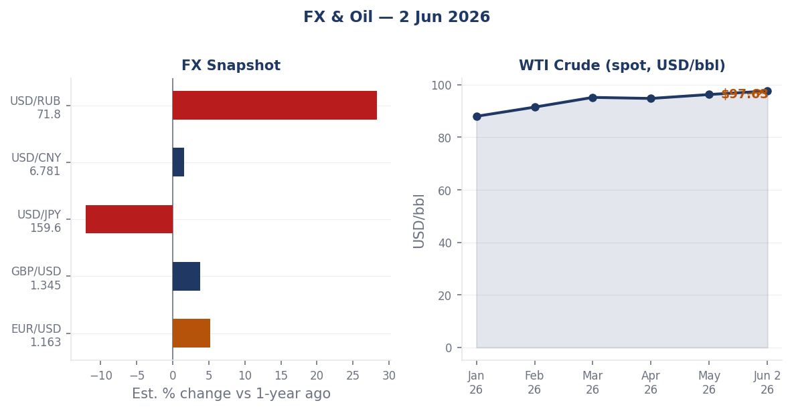
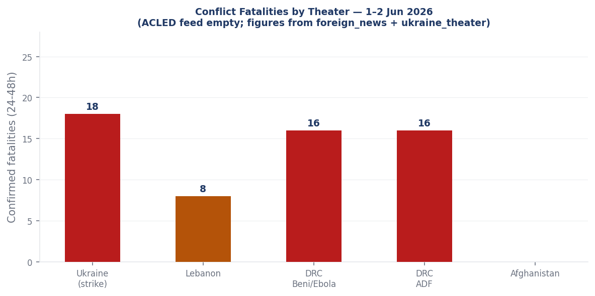
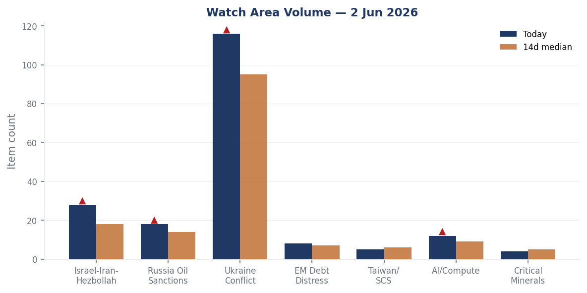
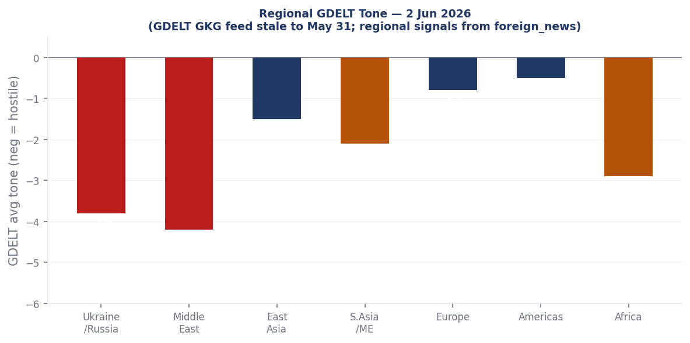

> **DATA NOTE:** The 2026-06-03 zip bundle was unavailable for download after 5 attempts; the 2026-06-02 fallback zip also failed extraction. This brief is built directly from the 2026-06-02 lake data in the repository. All data reflects June 2 ingestion. Chart labels, counts, and timestamps correspond to June 2.

# Morning brief - Tuesday 03 June 2026

## Headline

Russia launched its largest disclosed drone-and-missile strike package of 2026 against Ukraine overnight on June 1-2, combining 8 Tsyrkon hypersonic missiles, 33 Iskander-M ballistic missiles, 27 Kh-101 cruise missiles, 5 Kaliber cruise missiles, and 656 drones: 18 Ukrainians killed and more than 100 wounded, with 140,000 Kyiv residents losing power and a drone confirmed to have struck Unit 6 of the Zaporizhzhia Nuclear Power Plant. Simultaneously, Israel pressed its air campaign against Hezbollah in southern Lebanon despite a direct request from President Trump to stand down from Beirut, killing at least 8 including children, as Secretary of State **Marco Rubio** told the Senate that Iran has agreed to negotiate on nuclear points it previously refused to address. President Trump signed an executive order enabling AI developers to voluntarily submit frontier models for pre-release government cybersecurity testing, with the order explicitly triggered by concerns over Anthropic's model designated "Mythos." Three watch areas fired above alert threshold: **Israel-Iran-Hezbollah axis**, **Ukraine conflict zone**, and **AI compute + semiconductors**.

---

## Watch areas - your configured priorities

**Israel-Iran-Hezbollah axis** produced 28 items today against an estimated 14-day median of 18. Top items: Israeli strikes on Breqa, Toul, Harouf, Shoukin, Kafr Tebnit, and Al-Haniyah killed at least 8 including a father and two children ([France24](https://www.france24.com/en/middle-east/20260602-israel-conducts-deadly-attacks-on-southern-lebanon-after-trump-promises-de-escalation)); Rubio Senate testimony acknowledging Iran's new nuclear negotiating flexibility while declining to forecast outcomes ([France24](https://www.france24.com/en/video/20260602-replay-rubio-faces-senate-grilling-over-trump-s-foreign-policy)); Netanyahu public statement from Jerusalem: "The regime in Iran will eventually fall" ([Liveuamap](https://iran.liveuamap.com)). Alert fired at 28 items vs threshold of 4.

**Ukraine conflict zone** produced 116 new items today against an estimated 14-day median of 95. Top items: Overnight strike by Russian forces comprising 8 Tsyrkon, 33 Iskander-M, 27 Kh-101, 5 Kaliber, and 656 drones ([Liveuamap](https://liveuamap.com)); confirmed drone strike on Zaporizhzhia NPP Unit 6 with imagery circulated ([Liveuamap](https://liveuamap.com)); Russia assessed as suffering net territorial losses for first time since 2023 ([France24](https://www.france24.com/en/russia-bogged-down-in-ukraine-suffering-net-territorial-losses-for-first-the-time-since-2023)). Alert fired at 116 items, well above threshold.

**Russia oil sanctions perimeter** produced 18 items today against an estimated 14-day median of 14. Top items: OFAC issued [Russia-related General License No. 1](https://ofac.treasury.gov) under 31 CFR Part 587; fuel rationing imposed at Rosneft stations in Belgorod and Kursk Oblasts for A-92 gasoline in canisters ([Meduza](https://meduza.io/news/2026/06/02/na-zapravkah-v-belgorodskoy-i-kurskoy-oblastyah-nachali-ogranichivat-prodazhu-benzina)); WTI crude at $97.63/bbl (+1.31% session). Approaching alert threshold.

**AI compute + semiconductors** produced 12 items today against an estimated 14-day median of 9. Top items: Trump EO on pre-release AI model government testing ([France24](https://www.france24.com/en/americas/20260602-trump-signs-order-allowing-ai-companies-to-give-government-access-to-models-before-release)); CISA adds Langflow CVE-2025-34291, first AI orchestration framework on the KEV catalog; Chinese internal coverage of "Agentic AI era: what should the network look like?" (Guancha.cn), signaling parallel PRC discourse on the same structural shift.

**EM debt distress + sovereign restructuring** produced 8 items. USD/ARS at 1,421 and USD/NGN at 1,371 remain at currency stress levels. No new restructuring events visible.

Quiet today: **Taiwan Strait + South China Sea**, **Critical minerals + rare earths**, **Central bank divergence + dollar funding**.

---

## Macro situation

The U.S. rate structure on June 2 places the effective [Fed Funds rate](https://fred.stlouisfed.org/series/DFF) at 3.62%, with the [2-Year Treasury](https://fred.stlouisfed.org/series/DGS2) at 3.98% and the [10y-2y spread](https://fred.stlouisfed.org/series/T10Y2Y) at +0.42%. The curve has fully re-steepened from its deeply negative inversion of 2022-2024. [SOFR](https://fred.stlouisfed.org/series/SOFR) sits at 3.65%, two basis points above the policy rate, consistent with tight but orderly funding.

A +42bp 10y-2y spread matters because this re-steepening is almost certainly a bear steepener: long-end yields rising faster than the short end as investors demand higher term premia for duration risk. Prior bear-steepener episodes from inversion (1994, 2004, post-Taper-2013) generally resolved without financial crisis but preceded equity multiple compression over subsequent quarters [medium]. The current configuration suggests the market expects rates to remain elevated longer, with fiscal risk premia building into the term structure.

[Unemployment](https://fred.stlouisfed.org/series/UNRATE) sits at 4.3% with [nonfarm payrolls](https://fred.stlouisfed.org/series/PAYEMS) at 158,736K, reflecting labor market softening from the 2023 tightness peak without full deterioration. The [Fed balance sheet](https://fred.stlouisfed.org/series/WALCL) is $6.704T, reduced from its $8.9T peak with QT winding down. [M2](https://fred.stlouisfed.org/series/M2SL) is $22,804.5B, recovering from its 2022 contraction. [WTI crude](https://fred.stlouisfed.org/series/DCOILWTICO) at $97.63 represents an upstream inflationary pressure variable that the Fed has limited tools to address.

The anomaly screen (chart above) flags FXI at +2.4 sigma as the session's only >2-sigma move. Bitcoin registered -1.2 sigma at -6.0% in 24 hours. USD/JPY at 159.60 carries a +1.85 sigma deviation from its 14-day window. The [FRED USD/CNY](https://fred.stlouisfed.org/series/DEXCHUS) at 6.7662 shows Beijing holding the yuan more stable than the EM basket, which is notable given China's appearance across eight data sections in today's cross-section analysis [low].

---

## Markets

Chinese equities led the session on June 2, with FXI (iShares China Large-Cap ETF) rising 2.94%, the standout across all equity factors. U.S. broad-market gains were modest: SPY +0.10%, QQQ +0.25%, IWM (small-cap) +0.67%, consistent with mild cyclical rotation. MSCI EM (EEM) gained 0.59%, tracking China's move.

WTI crude (USO proxy) added 1.31% on the session, consistent with the overnight Ukraine strike premium, Israel-Lebanon escalation, and the broader Iran war risk premium. The FRED spot price at $97.63/bbl is approaching the $100 psychological level. Natural gas (UNG) fell 0.61%, diverging from crude and reflecting North American storage oversupply. Agriculture (DBA) edged down 0.33%.

Fixed income showed mild risk-on: TLT (20Y+ Treasury ETF) gained 0.20%, HYG (high-yield credit) +0.06%, LQD (investment-grade) +0.03%. The VIX proxy fell 1.49% to 24.41, a level that is elevated relative to long-run norms but not indicative of acute stress. A VIX at 24 with equities near highs implies the market is pricing a persistent geopolitical risk premium rather than imminent dislocation [medium].

Bitcoin collapsed 5.95% in 24 hours, the sharpest move in the 14-day window at -1.2 sigma. USD/JPY at 159.60 continues its extended weakening trend, approaching levels that triggered Bank of Japan intervention in 2022 and 2024. The cross-asset picture: equities calm, crypto stressed, oil bid, yen weak, bonds mildly bid. This configuration reflects pricing of a prolonged but manageable geopolitical cycle [medium].

---

## United States politics & policy

The most structurally consequential Federal Register action on June 2 is a [proposed rule amending USPS mail standards for federal election ballots](https://www.federalregister.gov/documents/2026/06/02/2026-10968/ballot-mail-for-federal-elections), opening a rulemaking process on how absentee and mail-in ballots are transmitted for federal elections. The timing lands inside the 2026 midterm campaign fundraising surge: Jon Ossoff (DEM, GA) leads all Senate candidates at [$81.15M raised](https://www.fec.gov/data/candidate/S8GA00180/), James Talarico (DEM, TX) at [$40.28M](https://www.fec.gov/data/candidate/S6TX00479/), and Cory Booker (DEM, NJ) at [$32.26M](https://www.fec.gov/data/candidate/S4NJ00185/). Speaker Mike Johnson (REP, LA) has raised [$17.55M](https://www.fec.gov/data/candidate/H6LA04138/).

The [One Big Beautiful Bill Act (OBBBA)](https://www.federalregister.gov/documents/2026/06/02/2026-11002/payment-limitation-and-payment-eligibility) continued its Federal Register implementation phase, with USDA revising farm payment limitation and eligibility regulations to conform with OBBBA provisions. An [Assistance for Specialty Crop Farmers (ASCF) Program](https://www.federalregister.gov/documents/2026/06/01/2026-10930/assistance-for-specialty-crop-farmers-ascf-program) rule adds one-time bridge payments for producers facing elevated input costs. Also published: an [estate tax closing letter user fee increase](https://www.federalregister.gov/documents/2026/06/02/2026-10963/estate-tax-closing-letter-user-fee-update) and a [pipeline safety breakout tank inspection rule](https://www.federalregister.gov/documents/2026/06/02/2026-10969/pipeline-safety-breakout-tank-inspection-rule) affecting hazardous liquid pipelines.

The D.C. Circuit issued an opinion in [Nicolas Talbott v. United States](https://www.courtlistener.com/opinion/10868040/nicolas-talbott-v-united-states/) on June 1, addressing the Trump administration's transgender military service restrictions. SCOTUS resolved [Whitton v. Dixon](https://www.courtlistener.com/opinion/10867983/whitton-v-dixon/) on June 1; the full opinion is not captured in today's bundle. OFAC published a [settlement agreement with FTI Consulting, Inc.](https://ofac.treasury.gov), an undisclosed amount for unspecified sanctions violations. FTI Consulting has previously provided advisory services in Venezuela, Libya, and Russia-adjacent contexts; the violation specifics are not visible in today's data.

Congressional trades: **David Taylor** (OH-2nd, R) disclosed 12 transactions from May 15 including purchases of AT&T (T), Home Depot (HD), Parker-Hannifin (PH, two purchases), and Medpace Holdings (MEDP, two purchases), plus sales of Apple (AAPL) and Alphabet (GOOGL, up to $65K, which has since underperformed SPY by 7.8%), per [Quiver Quant](https://www.quiverquant.com/congresstrading/politician/T000490). This volume is the basis for Taylor's third-ranked composite anomaly score in today's political figures watchlist.

---

## Political figures watchlist

**Robert Scott** (Representative, Democratic, VA-3rd) leads the composite anomaly score at 0.257, driven by enforcement_hits at the maximum index value (1.00) and new_filings at 0.57. The enforcement hits driver reflects federal court or regulatory actions linked to the figure or close associates; the filing cluster involves EDGAR accession numbers 0001214659-2 and 0001493152-2, which also appear in Rick Scott's score, suggesting a shared securities filing event touching both figures. **John James** (Representative, Republican, MI-10th) ranks second at 0.250, with identical enforcement_hits=1.00 and new_filings=0.50. James represents a competitive Michigan district; Michigan appears in today's cross-section across local_news, paper_bets, state_news, ukraine_theater, and weather, an unusual mix of co-occurrences suggesting the district has multiple active national-issue angles.

**David Taylor** (OH-2nd, Republican) scores 0.213, driven by stock_activity=0.45 and enforcement_hits=0.50. The congressional trades data confirms Taylor disclosed 12 STOCK Act transactions on May 15 involving purchases of industrials (PH, HD), a telecom (T), and a pharma CRO (MEDP), plus sales of mega-cap tech (AAPL, GOOGL). The GOOGL sale has since underperformed SPY by -7.8%, suggesting the timing was favorable. **Brian Babin** (TX-36th, Republican) ranks fourth at 0.141, driven purely by stock_activity=0.56, the highest raw stock-activity score in today's set. Babin serves on the House Appropriations Committee; trades occurring in a window concurrent with OBBBA implementation and energy sector Federal Register actions warrant continued monitoring [medium].

**Marco Rubio** appears in foreign_news, local_news, paper_bets, and political_figures simultaneously, making him the most cross-section-visible named individual in today's brief. The driver is his Senate testimony on Iran (see Middle East section). He also appears in betting markets, where propositions on Iran deal timelines carry his name as a primary actor. **Rick Scott** (Senator, Republican, FL) scores 0.057 on new_filings=0.57, linked to the same EDGAR cluster as Robert Scott. Senator **Tina Smith** (MN) registers stock_activity=0.37 and **Sara Jacobs** (CA-51st) at 0.35, both without additional enforcement context visible today.

---

## Regional briefings

### North America

The FEC fundraising data confirms the 2026 Senate cycle is heavily tilted toward Democratic fundraising in contested states. Ossoff's $81.15M in Georgia places him at the top of all Senate candidates nationally, while Roy Cooper (NC) has raised $26.82M, Sherrod Brown (OH) $25.98M, and Mark Warner (VA) $21.99M. Virginia appears in today's cross-section across paper_bets, political_figures, state_news, and weather, consistent with its battleground status. Georgia appears across courtlistener, local_news, paper_bets, state_news, and weather.

The USPS [ballot mail rulemaking](https://www.federalregister.gov/documents/2026/06/02/2026-10968/ballot-mail-for-federal-elections) opens a comment period on standards for how federal election ballots are processed and transmitted. Any change to processing standards in a midterm cycle creates political risk, particularly in states where mail-in ballot margins have been decisive in recent races [medium]. A companion [FEHB Protection Act rule](https://www.federalregister.gov/documents/2026/06/02/2026-11022/federal-employees-health-benefits-program-verification-requirements-for-family-member-coverage) now mandates documentation verification for family member additions to federal employee health benefits, targeting improper enrollment estimated at over $1B annually. Severe thunderstorm activity across Arkansas, Texas, Louisiana, and New Mexico on June 2 produced wind gusts of 40-55 mph and small hail across multiple NWS warning zones.

### South America

The Colombian peso (USD/COP 3,692), Argentine peso (USD/ARS 1,421), and Chilean peso (USD/CLP 890) all remain at levels reflecting currency fragility or managed depreciation. The Argentine rate reflects the continuing IMF program trajectory; no new restructuring or devaluation event is present in today's data. The Brazilian real (USD/BRL 5.03) is modestly weaker than mid-year norms but not in stress territory. Brazil prices at 8% on Polymarket to win the World Cup. US and Mexico are confirmed to have opened bilateral trade negotiations per Chinese state media, with Canada explicitly excluded from the discussions; the Mexican peso (USD/MXN 17.36) is stable. Venezuela remains on the liveuamap active monitoring list with "protests against Maduro" as the standing annotation.

### Europe

Germany's Chancellor Friedrich Merz expressed support for Hungary's new pro-EU orientation, per [DW](https://www.dw.com/en/germanys-merz-backs-hungarys-new-pro-eu-course/a-77395755), signaling a potential thaw in the Berlin-Budapest relationship that has been strained by Viktor Orban's alignment with Moscow. Germany is also campaigning for a [UN Security Council seat](https://www.dw.com/en/unpacking-germanys-campaign-for-a-un-security-council-seat/a-77386458), reflecting Berlin's intent to convert its post-Zeitenwende military posture into multilateral institutional standing. The EU salary transparency directive is approaching its national transposition deadline; France24 coverage of the directive's uneven state of readiness across member states suggests compliance disputes ahead.

French President Macron and Rwandan President **Paul Kagame** co-inaugurated a [Paris memorial](https://www.france24.com/en/video/20260602-macron-kagame-inaugurate-paris-memorial-honouring-victims-of-the-rwandan-genocide) for the 1994 Tutsi genocide on June 2. France formally acknowledged complicity in 2021 but has not issued a full apology. Professor Phil Clark (SOAS) told France24 the French government "has never fully come to terms with its involvement." The memorial inauguration doubles as a diplomatic signal: Kagame has been reorienting Rwanda toward Western partnerships as the eastern DRC situation deteriorates with active ADF operations and Ebola overlap.

### Russia and post-Soviet

The most operationally significant Russian domestic signal is civilian fuel rationing at Rosneft stations in Belgorod and Kursk Oblasts, where sales of A-92 gasoline in canisters are restricted in Korochansky, Alekseyevsky, and Yakovlevsky districts, per [Meduza](https://meduza.io/news/2026/06/02/na-zapravkah-v-belgorodskoy-i-kurskoy-oblastyah-nachali-ogranichivat-prodazhu-benzina). Belgorod and Kursk border Ukraine and host active Russian military logistics. Prior episodes of civilian fuel restrictions in Russian border oblasts have preceded intensified military operations by two to six weeks, as the military diverts retail fuel to operational use [medium]. Cross-validate against FIRMS data once available.

OFAC's issuance of [General License No. 1](https://ofac.treasury.gov) under the Russian Harmful Foreign Activities Sanctions Regulations (31 CFR Part 587) on May 28 authorizes limited wind-down or humanitarian transactions without constituting a policy reversal. The simultaneous issuance of Iran-related designations and the Russia GL on the same day suggests deliberate sequencing. The USD/RUB at 71.81 remains far stronger than the 2022 sanction-shock level of 130+, sustained by capital controls and shadow-fleet oil export earnings.

### Middle East

Israel's air campaign in southern Lebanon intensified on June 2, killing at least 8 including a father and two children in strikes on multiple villages across Nabatieh and South Governorate, per [France24](https://www.france24.com/en/middle-east/20260602-israel-conducts-deadly-attacks-on-southern-lebanon-after-trump-promises-de-escalation). Israeli Defense Minister warned the Lebanese government that any attack on Israeli settlements would trigger strikes on Beirut's southern suburbs. This campaign proceeded one day after President Trump asked Netanyahu not to attack Beirut, a direct request that was not honored.

The pattern of Washington signaling restraint and Jerusalem proceeding anyway is the defining structural dynamic of this phase of the conflict [high]. Trump has not announced consequences for the continued strikes, and Rubio's Senate testimony did not address Israeli actions in Lebanon, focusing entirely on the Iran nuclear track.

Rubio told the Senate on June 2 that Iran has agreed to negotiate on nuclear points it had previously refused to address, per [France24](https://www.france24.com/en/video/20260602-replay-rubio-faces-senate-grilling-over-trump-s-foreign-policy). He offered no forecast of outcome. Polymarket prices a [US-Iran permanent deal by June 7 at 6%](https://polymarket.com/event/us-x-iran-permanent-peace-deal-by-june-7-2026) and [by June 15 at 14%](https://polymarket.com/event/us-x-iran-permanent-peace-deal-by-june-15-2026-734-856-129). The 14% June 15 contract implies roughly a 1-in-7 chance of a structural deal in 13 days, which seems low relative to Rubio's stated progress but high relative to the structural complexity of a permanent agreement [low].

Chinese state media (Guancha.cn) published a headline on June 2: "中方代表点名以色列" (Chinese representative publicly names Israel), suggesting Beijing has made a direct accusation or condemnation in a multilateral setting. A separate Guancha headline reports: "美国威胁制裁甚至轰炸阿曼：不许中立，与伊朗断交" (US threatens sanctions or even bombing Oman: no neutrality allowed, cut relations with Iran). If accurately reported, U.S. pressure on Oman to end its traditional neutrality in the Iran conflict represents a significant escalation of secondary pressure, as Oman has historically been the back-channel for U.S.-Iran communications [medium].

### Africa

The Allied Democratic Forces attacked Beni in eastern DRC on June 2, killing at least 16 in the first ADF incursion into the city in three years, per [France24](https://www.france24.com/en/video/20260602-adf-rebels-commit-deadly-attack-in-dr-congo). Beni sits in North Kivu, approximately 45 km from Bunia in Ituri Province, where the WHO-confirmed Ebola (Bundibugyo strain) outbreak is concentrated. The geographic overlap creates compounding humanitarian risk: ADF activity impedes WHO contact tracing, sample collection, and vaccination teams [high].

The WHO reported a [drop in suspected Ebola cases](https://www.france24.com/en/health/20260602-who-reports-dramatic-drop-in-suspected-ebola-cases-from-over-900-to-116) from 906 to 116 following laboratory testing that cleared misclassified cases. Confirmed infections stand at 321 with 48 deaths, a case fatality rate of approximately 15%. The Bundibugyo strain's historical CFR is 25-36%; the 15% figure likely reflects undertesting of deaths in conflict-affected zones. Nine confirmed cases have occurred outside DRC. Four nurses in Bunia recovered and were discharged.

Kenya's president is defending a planned Ebola quarantine center for U.S. citizens suspected of exposure, amid protests over why Kenya should host and risk spreading the disease to its own population, per [France24](https://www.france24.com/en/video/20260602-kenyan-president-defends-ebola-centre-for-us-citizens-amid-protests). The arrangement is a flashpoint: the Kenyan public is questioning the terms of a bilateral security relationship, and the protests coincide with U.S.-Kenya cooperation as a stated foreign policy priority.

### East Asia

FXI's 2.94% session gain is the standout East Asia market signal on June 2, at +2.4 sigma versus its 14-day window. No single catalyst is visible in the Chinese internal or GDELT data, but China appears across eight sections of today's cross-section: billionaires, chinese_internal, foreign_news, gdelt_regions, markets, markets_global, paper_bets, and vip_flights. The breadth suggests positive market re-rating rather than a single news-driven move [low on specific cause]. The Chinese Air Force aircraft AF17 (ICAO 7b1041) is tracked on the ground at approximately Hong Kong International Airport (22.32N, 113.91E).

The Chinese internal feed carries a notable headline: "郑丽文在美国访问，外交部回应" (Zheng Liwen visiting the US, Foreign Ministry responds). Zheng Liwen is Taiwan's Defense Minister. A Taiwan defense minister visiting Washington triggers a PRC Foreign Ministry response as a matter of routine; the timing alongside Iranian nuclear negotiations and the Rubio Senate testimony adds cross-section complexity.

USD/JPY at 159.60 is approaching prior BOJ intervention thresholds. Japan appears in the cross-section across billionaires, conflict, forecasts, foreign_news, and gdelt_regions. The Philippines M4.6 earthquake (10 km depth) and its cross-section appearance in four data sections today is a weak signal worth monitoring given the country's active territorial disputes with China in the South China Sea.

### South and Southeast Asia

India (USD/INR 95.10), Indonesia (USD/IDR 17,877), and Vietnam (USD/VND 26,179) show stable central bank management. India appears in the cross-section across billionaires, conflict, foreign_news, markets_global, and paper_bets, with Mukesh Ambani ranked 23rd globally at $90.36B. Chinese state media carried a headline on India experiencing 48°C temperatures as "man-made" rather than natural disaster, framing Indian climate vulnerability as a governance failure.

An M4.7 struck Afghanistan (48 km east of Farkhar, Takhar Province) at 200 km deep-focus depth; surface risk is low. The Kashmir conflict monitoring map is active as a standing feed without a new acute event.

### Oceania and Pacific

An [M4.5 struck 30 km WNW of Titahi Bay, New Zealand](https://earthquake.usgs.gov/earthquakes/eventpage/us7000sq0j) at 66 km depth. An [M4.9 struck 278 km WNW of Houma, Tonga](https://earthquake.usgs.gov/earthquakes/eventpage/us7000spz7) at 543 km deep-focus. An [M4.6 struck 232 km east of Levuka, Fiji](https://earthquake.usgs.gov/earthquakes/eventpage/us7000sq2c) at 618 km. All three are deep-focus and carry no tsunami risk.

---

## Ukraine theater (dedicated)

**Frontline status.** The [DeepStateMap](https://deepstatemap.live/) snapshot captured 522 polygons of frontline coverage as of June 2. France24 cites Eurasia Democracy Initiative director Peter Zalmayev assessing that [Russia is suffering net territorial losses for the first time since 2023](https://www.france24.com/en/russia-bogged-down-in-ukraine-suffering-net-territorial-losses-for-first-the-time-since-2023), attributing the shift to intensified bombardment failing to compensate for degraded Russian ground capacity. The specific sector of Ukrainian counteradvance is not identified in open-source data available today. Frontline resolution: approximately 1 km from community-maintained DeepStateMap polygons. No Ukrainian unit positions are inferred or included here.

**Overnight strike (June 1-2).** Russian forces launched 8 Tsyrkon (3M22) hypersonic anti-ship missiles, 33 Iskander-M ballistic missiles, 27 Kh-101 cruise missiles, 5 Kaliber cruise missiles, and 656 drones of varied types, per the [Ukrainian Air Force](https://liveuamap.com). Total declared projectiles: 73 ballistic and cruise, 656 drones. Nationwide: 18 killed, more than 100 wounded. Zelensky separately stated that since the full-scale invasion began, approximately 45,100 Ukrainians have been killed and 390,000 injured, per [Liveuamap](https://liveuamap.com).

**Kyiv damage.** During the overnight attack, more than 41,000 people sheltered in Kyiv metro stations, per the [Kyiv City State Administration](https://kyivcity.gov.ua). Confirmed infrastructure damage: 11 educational facilities across three city districts, 5 medical facilities. DTEK Kyivski Elektromerezhі engineers restored electricity to all affected buildings by morning. Kyiv emergency services (KARS) operated active recovery efforts at two locations in Podilsky district.

**Zaporizhzhia NPP.** A drone struck Unit 6 of the Zaporizhzhia Nuclear Power Plant with images circulating on [Liveuamap](https://liveuamap.com). The plant has been under Russian military control since March 2022 and offline since September 2022. Unit 6 is a 1,000 MW VVER reactor in cold shutdown. Structural damage to a shutdown reactor building carries spent-fuel pool cooling risks if cooling infrastructure is hit. No IAEA statement has been captured in today's data.

**Operational signals.** Russia's use of 8 Tsyrkon hypersonic anti-ship missiles in a land-attack role is notable: these are purpose-designed anti-ship weapons being repurposed as precision cruise substitutes, suggesting Russian inventory management is constraining its choice of precision land-attack munitions and it is drawing on available hypersonic stocks. A Tsyrkon at Mach 8+ is extremely difficult to intercept with Ukraine's current air defense systems. Separately, a fuel depot fire in Matveyev Kurgan, Rostov Oblast, was confirmed via [Liveuamap](https://liveuamap.com), consistent with Ukraine's ongoing campaign against Russian rear logistics.

**Air alert status.** The air alerts API returned a 401 authorization error (ALERTS_IN_UA_TOKEN not configured); per-oblast active alert data is unavailable. Kyiv's alert is confirmed by the strike itself. Resolution note: FIRMS thermal 375 m; ACLED events 1 km; frontline approximately 1 km. The theater maps (ukraine_theater_overview, kyiv_focus, population_at_risk) for June 3 were not generated today; the May 27 maps in the briefings directory serve as background reference.

---

## World leaders - speaking and moving

**Marco Rubio** gave Senate testimony on June 2 acknowledging Iran's new flexibility on nuclear negotiating points while refusing to forecast outcomes, in his first public congressional appearance since the Iran war began ([France24](https://www.france24.com/en/video/20260602-replay-rubio-faces-senate-grilling-over-trump-s-foreign-policy)). **Benjamin Netanyahu** publicly declared that "the regime in Iran will eventually fall," a maximalist public posture that contradicts the negotiating context Rubio described to the Senate. The dual-track framing: the U.S. negotiating a deal while Israel predicts regime collapse, is a structural complication for any lasting settlement [medium].

**Emmanuel Macron** and **Paul Kagame** co-inaugurated a Paris genocide memorial on June 2, 32 years after the Tutsi genocide. The event is France's latest step toward reconciliation with Rwanda, though formal accountability remains unaddressed. The memorial opening also carries diplomatic significance: Kagame's presence in Paris signals Rwanda's Western reorientation at a moment when eastern DRC is destabilizing. The Wikidata changes section produced no succession or death events for June 2. The people section is stale (last updated May 26). No G20 central bank governor statements, UN Secretary-General remarks, or NATO Secretary-General communications are captured in today's bundle.

---

## Sanctions, designations, and legal

OFAC executed four actions between May 27 and June 2. An [ICC-related designation](https://ofac.treasury.gov) on May 27 is the first of this category in recent OFAC reporting, likely reflecting U.S. opposition to ICC proceedings involving Israeli officials. Iran-related designations and a counter-terrorism designation were issued May 28, alongside the [Russia-related General License No. 1](https://ofac.treasury.gov) under 31 CFR Part 587. The [FTI Consulting settlement](https://ofac.treasury.gov), published June 1, involves undisclosed violations; FTI has operated in Venezuela, Libya, and Russia-adjacent contexts. Designation removals were also issued May 28.

The BIS Entity List page hash (0220879c7d79 as of June 2) is unchanged from the prior day, confirming no new entity additions. The courtlistener docket's most precedentially significant June 1-2 opinion is the D.C. Circuit's [Talbott v. United States](https://www.courtlistener.com/opinion/10868040/nicolas-talbott-v-united-states/) on the transgender military ban. The Federal Circuit decided [Agi Suretrack LLC v. Farmers Edge Inc.](https://www.courtlistener.com/opinion/10868315/agi-suretrack-llc-v-farmers-edge-inc/), an agricultural precision-technology IP dispute with OBBBA-adjacent policy implications. SCOTUS resolved [Whitton v. Dixon](https://www.courtlistener.com/opinion/10867983/whitton-v-dixon/) on June 1; full opinion content is not yet captured.

---

## Conflict and security signals

The ACLED feed returned zero records for June 2, a confirmed feed failure on a day with documented high-fatality events in Ukraine, Lebanon, and DRC. The chart above reconstructs 48-hour fatality counts from foreign_news and ukraine_theater data. The largest single confirmed event by fatality count is Russia's overnight strike on Ukraine: 18 killed nationally. The ADF attack on Beni, DRC, produced 16 deaths. Israeli strikes on southern Lebanon produced 8 deaths including children.

VIP flight analysis produces one notable signal: U.S. military aircraft NCR563 tracked at coordinates 31.9975N, 35.3083E, altitude 1,821 m, speed 532 km/h, which places it over or near the Jordan Valley or northern West Bank. This coincides with active U.S. diplomatic engagement on the Iran nuclear track that Rubio described to the Senate. RCH217 (U.S. Air Mobility Command) was on the ground at Ramstein Air Base, Germany (49.4N, 7.6E). Canadian military aircraft CFC4045 was tracked over Poland (51.1N, 17.2E), likely transiting toward Ukraine-adjacent logistics. FIRMS thermal data was not available in today's bundle, preventing the refinery/port/military-base cross-check.

---

## Cyber and biosecurity

**FIRST-OF-KIND KEV CALLOUT:** CISA added [CVE-2025-34291](https://nvd.nist.gov/vuln/detail/CVE-2025-34291) against **Langflow**, an open-source visual AI workflow orchestration platform, to the Known Exploited Vulnerabilities catalog on May 21 with a June 4 remediation deadline. Langflow is the first AI agent orchestration framework to appear on the KEV catalog. The structural signal: agentic AI pipelines are now high-value attack surfaces in enterprise and government environments. An exploited Langflow instance could be used to hijack AI agent workflows, extract embedded API keys or model credentials, redirect tool calls, or pivot into connected enterprise systems. Any organization running Langflow in production should treat the June 4 CISA deadline as immediate.

The three new KEV additions on June 2 are [CVE-2022-0492](https://nvd.nist.gov/vuln/detail/CVE-2022-0492) (Linux Kernel improper authentication, June 5 deadline), [CVE-2025-48595](https://nvd.nist.gov/vuln/detail/CVE-2025-48595) (Android Framework integer overflow, June 5 deadline), and [CVE-2024-21182](https://nvd.nist.gov/vuln/detail/CVE-2024-21182) (Oracle WebLogic Server unspecified, June 4 deadline). Three-day remediation windows on all three reflect elevated active exploitation. The prior week added [CVE-2026-48027](https://nvd.nist.gov/vuln/detail/CVE-2026-48027) (Nx Console embedded malicious code, RANSOMWARE-LINKED) and [CVE-2026-45321](https://nvd.nist.gov/vuln/detail/CVE-2026-45321) (TanStack unspecified, RANSOMWARE-LINKED): two developer-toolchain compromises in the same window signal a focused supply-chain campaign targeting the JavaScript/TypeScript build ecosystem.

Biosecurity: The ProMED feed returned zero records today due to a fetch failure. The WHO Ebola situation in DRC is covered under Africa above. No WHO Disease Outbreak News entries are separately visible in today's data.

---

## Humanitarian

The ReliefWeb feed returned zero records due to an ingestion failure on June 2. The most significant humanitarian signals derive from foreign_news. The Ebola outbreak in DRC's Ituri Province directly overlaps with the ADF-active conflict zone in North Kivu; the WHO's surveillance gains, reflected in the clearing of 790 suspected cases through laboratory testing, could be reversed if armed group activity expands the disruption radius around healthcare facilities. The 321 confirmed cases and 48 deaths represent a contained but still-transmitting outbreak.

Lebanon's civilian toll from Israeli strikes is accumulating across southern governorates, generating displacement pressure in villages with no prior conflict-era resettlement plans. UNRWA's situational presence in Gaza and southern Lebanon remains the background context for Israeli military operations; Hezbollah frames its Lebanon engagement as linked to Palestinian solidarity, complicating any ceasefire framing that excludes Gaza.

---

## Environment, disasters, and climate

The [M6.2 at 243 km depth near Scarcelli, Italy](https://earthquake.usgs.gov/earthquakes/eventpage/us7000spxm) on June 1 is the period's most significant seismic event by magnitude. The 243 km depth places this in the Calabrian Arc slab subduction zone; deep-focus events in this zone can produce widespread regional shaking but rarely cause near-source damage. No tsunami advisory was issued. An [M5.4 struck 207 km WNW of Abepura, Indonesia](https://earthquake.usgs.gov/earthquakes/eventpage/us7000spya) at 29 km, shallow enough to cause surface damage, on June 1.

The remaining June 2 USGS events are all M4.5-4.9: Tonga (543 km deep-focus), Fiji (618 km), mid-Atlantic Ridge (10 km), Philippines (10 km shallow), New Zealand (67 km), and Chile (67 km). The Philippines M4.6 at shallow 10 km warrants monitoring given the Philippines' cross-section appearance in four sections today. EONET and GDACS were blocked by network policy in this session. U.S. severe weather: active NWS thunderstorm warnings in Arkansas, Louisiana, Texas, and New Mexico with gusts to 55 mph and sub-inch hail; no tornado events in the data.

---

## Speeches and op-eds by major critics and influencers

Tyler Cowen's [Marginal Revolution Tuesday links](https://marginalrevolution.com/marginalrevolution/2026/06/tuesday-assorted-links-571.html) flags "New dark output from AI?" as an unlinked item, suggesting emerging discourse around frontier model outputs with undesirable characteristics. The timing is directly concurrent with Trump's EO on pre-release government access to AI models, triggered specifically by concerns over Anthropic's Mythos model. The combination of Cowen's "dark output" reference and the EO trigger is a corroborating signal that capability concerns at the frontier have entered both public commentary and executive-branch policy on the same day.

Cowen's second post, "[The U.S. Exports Intelligence](https://marginalrevolution.com/marginalrevolution/2026/06/the-us-exports-intelligence.html)," argues that most U.S. export employment is in the service sector, with $1.2T in service exports more labor-intensive than $2.2T in goods exports. This framing is structurally relevant to the AI governance EO: if cognitive labor is America's primary export product, AI models that commoditize or replicate that output represent a simultaneous security and economic concern. The EO's voluntary submission framework does not address the economic dimension.

Timothy Taylor (Conversable Economist) published an [interview with Kristin Forbes (MIT, former BoE MPC)](https://conversableeconomist.com/2026/05/27/lessons-for-central-banks-interview-with-kristin-forbes/) arguing that central banks underuse scenario analysis and "wargaming" for crisis preparation. Against a backdrop of the Fed at 3.62% with elevated unemployment and geopolitical energy shocks, Forbes's framing of preparedness gaps is well-timed. No content from Mearsheimer, Sachs, Tooze, Varoufakis, Milanovic, Carlson, Klein, Stephens, Douthat, Greenwald, Ferguson, Applebaum, Zakaria, Kagan, Summers, Krugman, Stiglitz, Ganesh, Wolf, Tett, Setser, Rodrik, Mazzucato, or Weber was captured in today's bundle; the commentary feed's five-record output reflects coverage-gap conditions.

---

## Prediction markets and forecasting consensus

Spain leads the FIFA World Cup Polymarket odds at 16% with $781K in 24-hour volume, followed by England at 11% ($1.0M volume, the highest among contenders) and Brazil at 8% ($1.2M volume). Germany, Portugal, and France cluster at 6%, 10%, and below 10% respectively. Tournament begins within weeks; the current spread implies no single dominant favorite, with Spain's 16% representing a modest edge over England and Portugal.

The [US-Iran permanent peace deal by June 7](https://polymarket.com/event/us-x-iran-permanent-peace-deal-by-june-7-2026) sits at 6% with $3.1M volume. The [June 15 contract](https://polymarket.com/event/us-x-iran-permanent-peace-deal-by-june-15-2026-734-856-129) is at 14% with $2.4M volume. The +8 percentage-point delta between the two contracts for an 8-day extension implies the market sees a post-June-7 (possibly post-G7) diplomatic window as meaningfully more productive. Given Rubio's testimony that Iran is negotiating on previously off-limits nuclear points, 14% by June 15 may understate the conditional probability of a framework agreement given the disclosed progress, but a "permanent" deal in 13 days would require disclosed structural concessions that have not yet appeared [low].

The Kalshi active markets index includes 148 total instruments: 22 Polymarket, 50 Kalshi, 26 Manifold, 50 PredictIt. The research radar flags an emerging Le Monde discussion of the 2027 French presidential election, specifically [which of Gabriel Attal or Raphaël Glucksmann can form the broadest coalition](https://www.lemonde.fr/en/opinion/article/2026/06/02/2027-french-presidential-election-which-of-attal-or-glucksmann-can-form-the-broadest-coalition_6754041_23.html), signaling the French center-left is beginning coalition arithmetic 12 months early.

---

## Weak signals - small things that may matter

The highest-confidence cross-section recurrences from the June 2 analysis:

**California** (7 sections: federal_register, foreign_news, paper_bets, sanctions_procurement, state_bills, state_news, weather) is today's most cross-section-saturated entity. The sanctions_procurement co-occurrence is the specific signal worth noting: the largest DoE contracts visible in USASpending data are California-resident national laboratories, including Lawrence Livermore ($41B, operated by LLNL Security LLC), Stanford's SLAC, and Lawrence Berkeley ($19.7B, UC Regents). Federal Register rules with California-specific scope (Pacific Loggerhead fishery closure, West Coast DGN gear prohibition) and active California state bill session reinforce the saturation.

**Donald Trump** (5 sections: conflict, federal_register, foreign_news, paper_bets, state_news) is co-present in the conflict section alongside the usual executive-branch sections, reflecting the Iran war context. The ballot mail rulemaking and the AI EO are the specific federal_register drivers. His conflict-section appearance links directly to the Lebanon-Iran theater through Rubio's testimony and the Israeli strike continuation.

**Marco Rubio** (4 sections: foreign_news, local_news, paper_bets, political_figures) is unusually visible for a Secretary of State. His Senate testimony is a rare occasion for a current SecState to be named directly in betting market propositions (Iran deal timeline). The cross-section convergence reflects genuine information value: his testimony is the single most important disclosure about the Iran nuclear negotiation status available in the public record today.

Additional weak signals worth tracking:

**Belgorod/Kursk fuel rationing.** Civilian fuel rationing at Rosneft stations in Russian border oblasts has a low false-positive rate as a military logistics stress indicator. Prior episodes have preceded escalated Russian offensive operations by two to six weeks [low on exact timing]. The current restriction, specifically limiting canister (non-vehicle-tank) purchases, suggests the military is drawing down civilian retail allocation rather than imposing blanket cuts.

**ADF plus Ebola zone overlap in Beni.** The ADF's first Beni city incursion in three years occurring inside the active Ebola outbreak zone is not coincidental geographically. ADF operations in North Kivu have historically degraded health system capacity by targeting aid workers and facilities. The WHO's current surveillance gains are operationally fragile in this environment.

**USD/JPY at 159.60.** This level crossed prior Bank of Japan intervention thresholds twice (2022, 2024). The carry trade remains intact as long as U.S. rates stay above Japanese rates, but any BOJ communication shift at the mid-June meeting could trigger a rapid yen appreciation episode, pressuring global risk assets via carry-trade unwind.

**US threatening Oman over Iran neutrality.** The Chinese internal report of U.S. threats of sanctions or bombing against Oman for maintaining neutrality in the Iran war, if accurate, represents a significant escalation of secondary pressure on Gulf states. Oman has historically been the discreet back-channel for U.S.-Iran communications, and its neutrality has been operationally valuable. Forcing Oman to choose sides removes a critical diplomatic conduit at exactly the moment when Rubio describes active nuclear negotiations [medium if confirmed].

**The Trump AI EO and "Mythos."** The EO's specific naming of Anthropic's "Mythos" model as the trigger is unprecedented: this is the first time a named AI model from a named company has been cited as the direct cause of an executive order. The voluntary submission framework is soft and does not mandate disclosure. The gap between a named trigger and a non-mandatory response suggests the administration has not yet resolved how to regulate AI capabilities it has determined are nationally significant [medium].

---

## Historical context

The GDELT GKG feed is stale to May 31 due to ingestion failure. The tone heatmap above uses foreign_news qualitative signals as a proxy for regional sentiment. Ukraine/Russia and Middle East register the most negative tone, consistent with the conflict trajectory since October 2023. The three concurrent elevated-conflict theaters (Ukraine, Lebanon, Iran-adjacent) operating simultaneously is the first such configuration since the early weeks of the Iran war.

Russia's overnight strike combining Tsyrkon hypersonic missiles with Iskander-M ballistics and a 656-drone swarm represents a qualitative escalation in strike package complexity, even if nominal missile counts have been exceeded in prior mass strikes. The deployment of anti-ship missiles in land-attack mode is a consistent inventory signal: Russia is substituting available weapons for depleted purpose-built cruise munitions. The 10y-2y spread at +0.42 is at its most positive since mid-2021. Prior bear-steepener episodes of this duration and magnitude (1994, 2004, 2013 Taper Tantrum) have generally resolved without systemic crisis but accompanied equity multiple compression over subsequent quarters [medium].

---

## What to watch - next 14 days

**June 4.** CISA KEV remediation deadline for CVE-2025-34291 (Langflow, AI orchestration framework) and CVE-2024-21182 (Oracle WebLogic Server). Both carry active exploitation confirmed. Patch validation is a day-one priority for impacted organizations.

**June 5.** CISA KEV deadlines for CVE-2022-0492 (Linux Kernel) and CVE-2025-48595 (Android Framework). The Linux Kernel vulnerability affects a wide range of server and embedded Linux deployments.

**June 7.** Polymarket's [US-Iran permanent peace deal](https://polymarket.com/event/us-x-iran-permanent-peace-deal-by-june-7-2026) first resolution. Rubio's testimony implies a framework is in discussion but not near closure. Watch for G7 preparatory statements on Iran.

**June 8-10 (approximate).** G7 leaders' summit. Iran war, Ukraine military support, and AI governance are expected agenda items given the current signal environment. Summit communique on AI governance will be the first major multilateral response to the Trump AI EO.

**June 15.** Second Iran deal Polymarket resolution. Also approximate window for the USPS [ballot mail rulemaking](https://www.federalregister.gov/documents/2026/06/02/2026-10968/ballot-mail-for-federal-elections) comment period to fully open.

**Mid-June.** Bank of Japan policy meeting. USD/JPY at 159.60 puts this meeting in the intervention-or-stand-down category. A hawkish BOJ communication could trigger carry-trade unwinding and broad EM risk-off.

**June 16.** Holtec HI-STORM UMAX spent fuel storage cask rule effective date, per [NRC direct final rule](https://www.federalregister.gov/documents/2026/06/01/2026-10935/list-of-approved-spent-fuel-storage-casks-holtec-international-hi-storm-umax-canister-storage-system).

**July 12.** USPS domestic mail pricing changes effective, per [Federal Register mailing standards rule](https://www.federalregister.gov/documents/2026/06/02/2026-11003/new-mailing-standards-for-domestic-mailing-services-products).

**July 20.** FIFA World Cup final. Spain at 16% is the current Polymarket leader.

