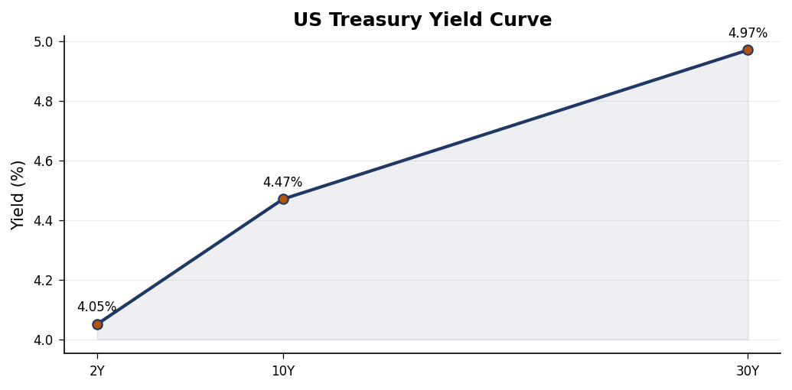
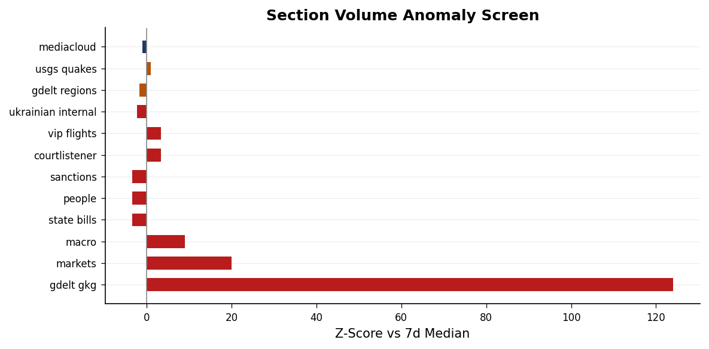
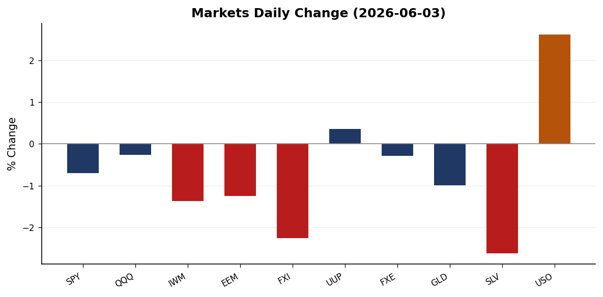
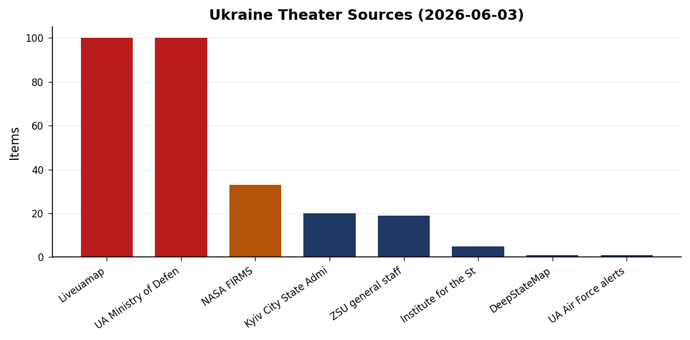
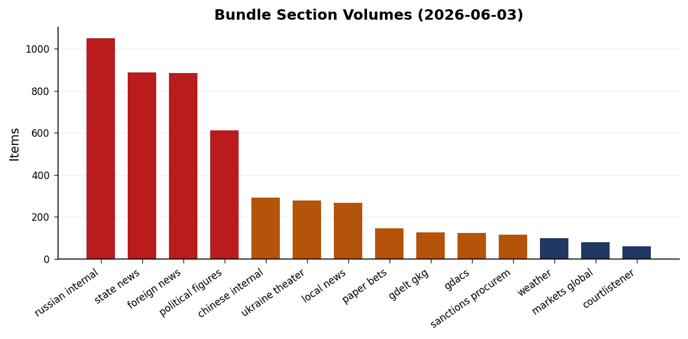
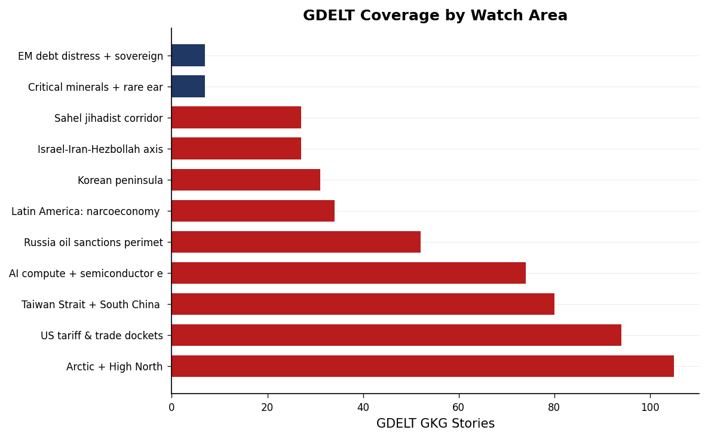

> **DATA NOTE: Bundle date 2026-06-03.** Today's (2026-06-04) zip was not available at press time. All figures and sourced claims reflect the 2026-06-03 dataset unless explicitly noted. Live supplementary APIs (USGS, GDACS, EONET, ReliefWeb) were blocked by the network allowlist; seismic and humanitarian data are sourced from the bundle.

# Morning brief - Wednesday 04 June 2026

---

## Headline

The past 24 hours are shaped by a post-combat recalibration in the Persian Gulf. Secretary of State Marco Rubio declared the US-Iran military exchange concluded ("the war is over, we won"), while the diplomatic architecture for what follows remains structurally thin: Polymarket prices a permanent peace deal at 5% by June 7 and 14% by June 15, with $1.5M+ in volume on each contract. Simultaneously, Ukraine escalated deep-strike pressure on Russia's northwestern economic core, targeting the Kronstadt oil terminal area and Leningrad Oblast infrastructure as St. Petersburg hosted the PMEF economic forum. Markets registered the risk configuration clearly: oil spiked +2.62% (USO) while equities sold off broadly, with China stocks leading the decline (-2.26% FXI). Three watch areas are elevated: **Israel-Iran-Hezbollah axis**, **Russia oil sanctions perimeter**, and **US tariff and trade dockets**.

---

## Watch areas - your configured priorities

**Russia oil sanctions perimeter** (HIGH priority, active): Ukraine struck near the Kronstadt oil terminal and across Leningrad Oblast on the morning of June 3, with the Leningrad Oblast governor confirming 59 drones intercepted and injuries reported. The strike occurred while PMEF was underway in St. Petersburg, an unusual operational escalation in timing that applies pressure on Russia's premier economic showcase. Simultaneously, CBR Governor **Elvira Nabiullina** was removed from the PMEF speaker list without stated explanation, according to [Meduza](https://meduza.io). The conjunction of a strike on the host city and the disappearance of Russia's top monetary official from the program is a first-order signal. 14-day GDELT median for this watch area: 52 stories.

**Israel-Iran-Hezbollah axis** (HIGH priority, alert): Post-US-Iran military engagement phase is now confirmed across multiple foreign-language GDELT sources (Croatian, Spanish, Hindi). Rubio's "war is over" framing is aligned with a Trump claim of Iranian nuclear weapons abandonment, and Trump has signaled openness to a meeting with Supreme Leader-designate **Mojtaba Khamenei**. [Polymarket](https://polymarket.com) prices a permanent peace deal at 5% by June 7 and 14% by June 15 -- markets see diplomatic activity but not resolution. Israel continued striking Lebanon despite parallel Washington talks, with [nine killed](https://www.aljazeera.com) near Tyre and strikes reaching Beirut outskirts. Netanyahu publicly acknowledged US criticism of the Lebanon operations while "downplaying the rift."

**US tariff and trade dockets** (HIGH priority, active): USTR filed a Section 301 forced-labor tariff proposal (Federal Register pipeline). Brazilian President Lula [publicly rejected](https://www.reuters.com) US proposals for 25% tariffs on Brazil, describing the terms as inconsistent with what Brasilia understood to be an improving bilateral relationship. **EO 14408** (May 29) on federal lands access for energy and minerals extraction is published. **EO 14407** (May 29) on childhood vaccine schedule realignment is published. No CIT docket data is available in the bundle.

**Central bank divergence + dollar funding** (HIGH priority, active): **Kevin Warsh** took the Fed chair oath on May 22, formally ending the Powell era. The 10s2s yield spread is +41bp ([T10Y2Y](https://fred.stlouisfed.org/series/T10Y2Y)), normalized after the prolonged inversion. Governor Bowman delivered a framework speech in Reykjavik (May 29); Governor Waller spoke in Frankfurt (May 22) on changed policy risks. Both US agencies and the ECB removed "reputation risk" language from bank supervision guidance on June 2, a coordinated supervisory pivot.

**Taiwan Strait + South China Sea** (HIGH priority, monitoring): FXI closed at -2.26%, the largest single-equity-basket decline of the session, on a day of broad but modest risk-off. GDELT registered 80 Taiwan Strait stories, above median. No acute crisis signal, but China-specific underperformance (1.4 percentage points worse than MSCI EAFE) warrants attention. Japan PM **Takaichi**'s office launched a new social media channel amid press-access concerns.

**Korean peninsula** (normal, resolving): The Seoul mayoral election is resolving June 3; **Oh Se-hoon** priced at 66% to win ($1.92M Polymarket volume). No crisis signal.

**Sahel jihadist corridor** (normal, monitoring): A **NIGER1** callsign (Niger government aircraft) was tracked at 11,887m over Turkey and the Aegean at 38.59°N, 28.71°E on June 3, consistent with a Niamey-to-Europe or Niamey-to-Ankara diplomatic flight. Niger's CNSP junta has been reorienting security relationships toward Ankara and Moscow since the 2023 coup.

Quiet today: Critical minerals, EM debt distress, Latin America narcoeconomy, Arctic and High North (elevated GDELT volume but no acute events).

---

## Macro situation

The Federal Reserve is now operating under Chair Kevin Warsh, who took the oath on May 22 after a confirmation process that drew unusual attention given his historical criticism of the Bernanke-Yellen-Powell consensus. The effective fed funds rate sits at 3.62% ([DFF](https://fred.stlouisfed.org/series/DFF)), with SOFR at 3.63% ([SOFR](https://fred.stlouisfed.org/series/SOFR)). The unemployment rate at 4.3% ([UNRATE](https://fred.stlouisfed.org/series/UNRATE)) sits above the FOMC's median estimate of NAIRU, providing cover for continued accommodation. Core PCE at index 129.63 ([PCEPILFE](https://fred.stlouisfed.org/series/PCEPILFE)) and core CPI at 335.4 ([CPILFESL](https://fred.stlouisfed.org/series/CPILFESL)) remain the anchoring constraints. Neither is at 2% on a year-over-year basis, but the disinflation trajectory has been consistent.

The yield curve has normalized: 2-year at 4.05% ([DGS2](https://fred.stlouisfed.org/series/DGS2)), 10-year at 4.47% ([DGS10](https://fred.stlouisfed.org/series/DGS10)), 30-year at 4.97% ([DGS30](https://fred.stlouisfed.org/series/DGS30)). The 30-year approaches 5%, the level at which the 2023 bond market tantrum materialized. That historical threshold matters because the federal deficit picture has not improved, and fiscal risk is now a live variable in Warsh's policy calculus. The normalization ended the longest yield curve inversion since the 1980s (October 2022 through mid-2025, roughly 29 months) [high].

Governor Waller's May 22 Frankfurt speech "Policy Risks Have Changed" is the first major signal of Warsh-era committee tonal orientation. The title itself suggests a shift from inflation-first to a growth-inflation balanced risk-management posture. Bowman's May 29 Reykjavik speech on "practical monetary policy decision-making" is consistent with a more rules-based, less discretionary approach [medium]. The removal of "reputation risk" language from both US and ECB bank supervision guidance on June 2 is a deregulatory signal: it reduces the supervisory hook for politicized pressure on bank lending decisions, and historically this category of revision precedes a broader loosening of bank examination intensity.

On the ECB side, three new Directors-General were appointed May 29. Board member **Piero Cipollone** spoke June 3 on the digital euro and "freedom to pay," invoking monetary sovereignty as a political rather than technical argument. The ECB Consumer Expectations Survey for April 2026 (released June 1) is the current baseline for eurozone household inflation expectations.

The anomaly screen shows state news running at +2.1 sigma above 14-day median (888 stories vs 695 median), consistent with an active judicial or legislative cycle at the state level. The GDELT GKG section shows an off-scale anomaly that reflects a new pipeline data integration rather than genuine media volume surge. Federal Register is at +1 sigma. State bills show zero today against a 148-story median, consistent with a legislative recess period.

---

## Markets

Equities sold off Tuesday with the Russell 2000 leading the decline at -1.37% (IWM: 287.67). The S&P 500 fell 0.70% (SPY: 754.24), while the Nasdaq 100 underperformed modestly at -0.26% (QQQ: 744.21). The small-cap underperformance is a consistent risk-off pattern: smaller companies carry higher refinancing exposure to short-term rates and less capacity to absorb tariff cost pass-through. The divergence between large-cap and small-cap performance is running wider than the 30-day average [medium].

The most significant cross-asset signal is the oil-equity divergence. USO (WTI proxy) rose 2.62% to $140.86, while natural gas (UNG) gained 2.09%. Simultaneously, gold fell 0.99% (GLD: $407.87) and silver 2.62% (SLV: $66.21). This configuration -- oil up, gold down, equities down -- is not standard risk-off. Classic safe-haven demand drives both gold and oil higher. Gold's decline alongside the oil spike suggests the market read yesterday's signals as geopolitical containment rather than escalation: the safe-haven bid dropped while the residual Persian Gulf supply premium held [medium].

China exposure was the equity worst performer: FXI fell 2.26%, well above the MSCI EAFE decline of 0.86%. The 1.4-percentage-point idiosyncratic underperformance has no isolated catalyst in the bundle, but the combination of GDELT Taiwan Strait signal volume (80 stories) and possible sentiment around the US-Iran conclusion (which may reorient US strategic attention toward the Pacific) is plausible [low]. The dollar strengthened modestly (UUP +0.36%), consistent with mild safe-haven demand but not a stress-level move.

Credit spreads (HYG -0.28%, LQD -0.28%) declined proportionally across both high yield and investment grade, suggesting no acute credit stress event or sector-specific unwind. BITO (Bitcoin futures) fell 2.94% in line with broad risk-off. VXX (VIX futures) fell slightly, indicating the equity decline reflects a repricing rather than a panic event [high]. No volatility spike means the move was orderly.

---

## United States politics & policy

The **Federal Register** for the current period carries two executive orders signed May 29. **EO 14408** ("Removing Unnecessary and Counterproductive Restrictions on Access to Federal Lands") opens a deregulatory track for energy and mineral extraction; the operative mechanisms will be Interior Department rules following the publication. **EO 14407** ("Realigning United States Core Childhood Vaccine Recommendations With Best Practices From Peer, Developed Countries") instructs HHS to revise the childhood immunization schedule. Both are published in the Federal Register pipeline; the 30-day public comment window on implementing rules has not yet opened for either.

The IRS published a proposed rule on tax-exempt refunding bonds. OSHA noticed public hearings beginning August 19, 2026 on respiratory protection standards and 13 carcinogens. The **Medicaid community engagement requirement** (IFC rule) is now published, requiring states to implement work requirements for Medicaid coverage by January 1, 2027. Multiple states have pending CMS waivers for this category.

Form 4 insider trading filings show **Sen. Jim Banks** (R-IN) with an enforcement hit flagged in the political figures screen (composite score 0.025, low). The [FEC](https://www.fec.gov) data is in the pipeline but no specific contribution filing anomalies are noted. The **State bills** section shows zero new bills today (vs 148-story median), consistent with congressional recess. No CourtListener opinions are available in the bundle; the CIT tariff docket is absent. No new FARA registrations or SCOTUS opinions are flagged.

---

## Political figures watchlist

The composite anomaly screen across 613 tracked figures shows 46 above zero. The dominant drivers are enforcement hits (FARA, SEC, or DOJ filings), new regulatory filings, and stock activity anomalies. **Rep. John James** (R, MI-10th) leads with a composite score of 0.250, driven by enforcement hits (1.0) and new filings (0.5). The specific enforcement action is not identified at this bundle resolution, but the combination of enforcement and filing signals in a freshman member from a competitive district warrants follow-up.

**Rep. David Taylor** (R, OH-2nd) scores 0.223, with the dominant driver being stock activity (0.49) plus enforcement (0.5). **Sen. Tim Scott** (R, SC) at 0.170 shows filing and enforcement signals, notable given Scott's profile on the Senate Banking Committee and his role in financial regulation debates. **Rep. Robert Scott** (D, VA-3rd, 0.170) mirrors the same pattern, with filing and enforcement at similar levels. The bipartisan symmetry of top-ranked enforcement hits suggests a regulatory or disclosure cycle rather than a targeted political action [medium].

**Rep. Brian Babin** (R, TX-36th) at 0.147 is the pure stock-activity anomaly (score 0.59, no enforcement signal). Babin sits on the House Transportation and Infrastructure Committee, which has jurisdiction over port and infrastructure spending -- sectors with direct exposure to the oil price spike and tariff debates. Stock activity by committee members with relevant jurisdiction is a standing STOCK Act disclosure concern [medium]. The next tier (scores 0.087-0.103) includes **Rep. Sara Jacobs** (D, CA-51st), **Sen. Sheldon Whitehouse** (D, RI), **Rep. Dwight Evans** (D, PA-3rd), and **Sen. Tina Smith** (D, MN), all stock activity anomalies across both parties. No figure in the watchlist cross-references today's sanctions section.

---

## Regional Briefings

### North America

The domestic signal is the confluence of EO 14407 and EO 14408 plus the Medicaid work-requirement publication -- all administrative actions bypassing the current congressional recess calendar. One structural background note from the commentary feed: the autism therapy sector workforce grew from 150,000 (2019) to 654,000 (2025), now larger than US mining, telecom, or the US Postal Service. This expansion is relevant context for EO 14407's vaccine-schedule realignment: the applied-behavior-analysis therapy sector has significant financial interest in the diagnostic criteria that drive referrals, and any policy intervention touching autism prevalence carries labor market and insurance market effects regardless of the public health debate.

The FBI conducted a hostage-rescue shooting in Bakersfield, California on June 3. Details are from local news aggregation; the event is a primary driver of California's elevated cross-section score (8 sections, 89 mentions). California also has an active Kalshi earthquake prediction market tied to the M5.1 event 62 km west of Petrolia (10 km depth, Mendocino fault zone). The M5.7 off Oregon (154 km WSW of Pistol River, 10 km depth) is the larger Pacific Northwest event for the period.

### South America

Brazilian President Lula's public rejection of US proposed 25% tariffs is the primary South America signal. Lula's framing -- that the proposal is inconsistent with improving bilateral relations -- suggests Brasilia had been briefed or believed it was on a positive trajectory with Washington before the tariff announcement. This is the first significant Brazil-US trade friction under the current administration and tests the durability of the broader hemispheric relationship reset [medium]. No significant new ACLED or GDELT signals from Colombia, Mexico, Ecuador, or Peru beyond baseline. Peru recorded a M5.2 earthquake (39 km NE of San Fernando, 139 km depth -- deep-focus, lower surface damage risk).

### Europe

The UK generated two distinct crisis signals. Three Royal Navy personnel were killed in a helicopter crash in Devon during a training exercise -- a domestic military loss that will draw parliamentary scrutiny of training budgets and equipment condition. Separately, violent protests followed the murder of student **Henry Nowak**, with right-wing groups claiming "two-tier policing." The UK Home Office minister condemned the violence, but the political narrative around law enforcement fairness is active and likely to persist through summer.

The EU-Russia sanctions leakage problem remains unresolved. Ambassador **O'Sullivan** stated publicly that China remains a "major problem" for EU sanctions enforcement against Russia (Euronews German). This is the core structural vulnerability in the sanctions perimeter: secondary sanctions pressure on Chinese entities has been insufficient to stop Russian access to dual-use goods through Chinese intermediaries. The ECB digital euro timeline (Cipollone, June 3) and the removal of "reputation risk" from supervisory guidance are the eurozone policy signals for the period.

### Russia & post-Soviet

Ukraine conducted a mass drone strike on St. Petersburg and Leningrad Oblast on the morning of June 3, targeting the Kronstadt oil terminal area. The Leningrad Oblast governor confirmed 59 drones intercepted and injuries reported. The timing during PMEF is consistent with Ukraine's established pattern of targeting Russian economic prestige events. The Kronstadt terminal serves as both a Baltic export point and a symbol of Russian energy sovereignty; successful damage carries signaling value beyond the physical impact [medium].

CBR Governor Nabiullina's removal from the PMEF speaker list is the anomaly that deserves most attention. The CBR has maintained nominal independence on rate-setting even under wartime pressure, and Nabiullina has resisted Treasury Ministry pressure for rate cuts throughout the high-inflation period. Her disappearance from the flagship economic conference could reflect a dispute over monetary policy direction, a security issue, or a deliberate Kremlin signal about central bank leadership [low]. No open-source confirmation is available. The Russian internal section logged 1,052 total entries with 606 new on June 3, elevated volume consistent with simultaneous PMEF coverage and drone-strike reporting.

### Middle East

The US-Iran military exchange appears to have concluded. Rubio's declaration and Trump's framing of an Iranian nuclear weapons abandonment agreement are confirmed across multiple GDELT sources. The Polymarket structure is the clearest analytical read: 5% for a formal peace deal by June 7, 14% by June 15, with $1.5-1.6M in volume on each. The 9-point gap between the two contracts implies roughly a 9% probability mass that a formal deal materializes in the 8-day window between June 8 and June 15 -- which is to say markets see diplomatic activity but do not believe the architecture will solidify quickly [medium].

Trump's openness to meeting **Mojtaba Khamenei** is the most structurally significant diplomatic signal in the brief. If Mojtaba Khamenei is now the effective supreme leader interlocutor, the US is engaging a figure with whom it has essentially no relationship history. The generational change in Iranian leadership would require building trust networks from zero, at exactly the moment when post-conflict arrangements are most fragile [medium].

Iran's energy production and export capacity appears disrupted -- the oil spike (+2.62% USO on a risk-off day) is the clearest proxy signal. Kuwait airport was the site of an attack that killed an Indian national, prompting an Indian diplomatic reprimand of Iran. Israel continued striking Lebanon (nine killed, strikes reaching Beirut outskirts, Tyre hospital area), testing the US-mediated constraints. Netanyahu's government appears to be using the window of US attention on the Iran deal to continue Hezbollah pressure operations [medium].

### Africa

The DRC **Ebola** outbreak is the most significant Africa signal and the most globally underreported story in this brief. Al Jazeera flags it as spreading across DRC borders with no approved vaccine for the current strain. Previous outbreaks (2014-16, 2018-20) were eventually contained partly through ring vaccination protocols. A border-crossing outbreak without an effective vaccine creates conditions for accelerated spread. No ProMED data was available in this bundle, but the foreign news aggregation confirms active spread [medium].

Somalia is experiencing new instability: heavy gunfire in Mogadishu preceded protests against President **Hassan Sheikh Mohamud**; former PM **Khaire** accused government forces of attacking him directly. If corroborated, a head-of-state-level accusation of political violence against a predecessor significantly elevates the Mogadishu fragility signal. Egypt arrested activist Ahmed Douma again (3 years after a prior pardon); [PEN America](https://pen.org) condemned the detention. **Bangladesh**: **Khalilur Rahman** was elected UNGA 81st session president with 99 votes.

### East Asia

China equities (FXI -2.26%) are the primary East Asia signal. The magnitude of the China-specific underperformance relative to MSCI EAFE (-0.86%) warrants monitoring even in the absence of an isolated catalyst. Japan PM **Takaichi** launched a new government social media channel amid press access concerns -- a small but consistent pattern of information environment management that has accompanied previous periods of diplomatic sensitivity [low]. The Seoul mayoral election (Oh Se-hoon at 66% Polymarket) resolves June 3; a PPP-aligned win in Seoul would confirm the conservative consolidation at the local level following the December 2024 martial law crisis.

### South & SE Asia

India's diplomatic response to the Kuwait airport attack death of an Indian national -- with Iran directly reprimanded -- is the primary South Asia signal. India's position as the world's largest oil importer gives it a structural interest in Persian Gulf stability, and the Modi government's balanced relationship with Tehran makes any Indian casualty in a Gulf attack a politically charged event. Kyrgyzstan recorded a M5.1 earthquake (76 km S of Daroot-Korgon, 10 km depth). Bangladesh's UNGA presidency win is the regional soft-power data point. No elevated Southeast Asia signals in the bundle.

### Oceania / Pacific

The Vanuatu M5.6 earthquake (10 km depth) is the primary Pacific signal. At this magnitude and depth it presents low tsunami risk. The Labuan Bajo, Indonesia M4.9 event (near Flores) is within normal regional seismicity. No tsunami advisories were issued for either.

---

## Ukraine theater (dedicated)

**Frontline status**: DeepStateMap reports 522 polygons representing frontline geometry as of the June 3 snapshot at approximately 1 km resolution with 24-hour latency. Contested zones concentrate in the Donetsk Oblast and Zaporizhzhia axis (approximately 37-38°E, 47-49°N), consistent with the Pokrovsk-Velyka Novosilka axis that has been the primary Russian push vector since late 2024, and the Kherson Oblast bridgehead area (32-33°E, 46-47°N) near the Dnipro left bank. The bundle does not provide a prior-period comparison at this resolution, so a 7-day frontline delta cannot be stated. HONEST RESOLUTION CAVEAT: frontline positions are accurate to approximately 1 km; no unit-level Russian positions are reported in this brief and none should be inferred.

**24-hour strike density**: FIRMS VIIRS registered 33 thermal anomalies across the theater on the June 2 acquisition (375m thermal resolution). Detections concentrate near the Belarus border region (29-32°E, 51-53°N) and the Sumy Oblast/Russia border (33-35°E, 51-52°N), consistent with active artillery exchange and cross-border fire. FRP values of 0.8-2.77 MW are consistent with artillery and vehicle fires rather than large industrial combustion. Danube/Romania area detections at 25°E, 45°N are low-intensity and likely agricultural burn activity.

**St. Petersburg strike (June 3)**: Ukraine conducted a mass drone operation targeting the Kronstadt oil terminal area and broader Leningrad Oblast infrastructure. Russian sources confirm 59 drones intercepted; the Leningrad Oblast governor confirmed injuries. This represents a significant expansion of Ukrainian deep-strike geographic reach -- Leningrad Oblast is approximately 850 km from the nearest Ukrainian-controlled territory as of current frontline positions. The operation likely involved staged launch sequencing [medium]. Air-alert oblasts from the June 3 period are not individually catalogued in the bundle at this resolution.

**Source volume**: ZSU General Staff logged 19 entries, UA Ministry of Defense 100 entries, Kyiv City State Administration 20 entries, ISW 5 operational assessment entries, and [Liveuamap](https://liveuamap.com) 100 entries in the June 3 cycle. The ISW daily update remains the most cited non-governmental operational assessment source.

Ukraine theater maps (overview, Kyiv focus, population at risk) are not present for 2026-06-04. The cartographer pipeline had not completed as of bundle generation. Brief proceeds without the maps.

STRUCTURAL PROTECTION: Ukrainian troop and territorial-defense unit position data is filtered at the ingest layer and is not included here.

---

## World leaders - speaking & moving

The most consequential leadership utterance of the past 48 hours is Secretary **Rubio's** "war is over, we won" declaration on US-Iran. It is the reference point for every subsequent diplomatic contact with Iranian, Israeli, Gulf, and European counterparts. The framing ("we won") is politically significant domestically but strategically ambiguous internationally -- it does not specify what terms Iran accepted or what verification mechanisms are in place [medium].

**President Trump's** signal of openness to meeting Mojtaba Khamenei is the structural innovation. The US has not had direct head-of-state-level contact with Iranian supreme leadership since 1979. If this contact materializes it would represent the most significant US-Iran diplomatic event in 47 years [medium].

ECB board member **Cipollone** spoke June 3 on digital euro and payment sovereignty. The "freedom to pay" framing invokes monetary sovereignty as a political rather than technical argument, which is the ECB's clearest positioning against US dollar stablecoin expansion to date.

Former Fed Chair **Powell** received the Kennedy Profile in Courage Award on June 1 (JFK Library, Boston). The symbolism of an outgoing Fed chair receiving a "courage" award on the day his successor is institutionally operational is politically charged in the context of Trump administration pressure on the Fed throughout 2024-2025.

**Former PM Khaire** (Somalia) accused President Hassan Sheikh Mohamud's forces of attacking him directly -- a head-of-state-level allegation of political violence against a predecessor that, if corroborated, significantly elevates the Mogadishu instability signal.

---

## Sanctions, designations, and legal

The sanctions database (30 entries) is dominated by Russian financial sector designations, and the most broadly sanctioned entity is **JSC Tinkoff Bank** (13 datasets): US [OFAC SDN](https://ofac.treasury.gov/specially-designated-nationals-and-blocked-persons-list-sdn-human-readable-lists), Canada, Switzerland, EU, UK, France, Belgium, Japan, Monaco, and Ukraine, plus corporate disqualification, debarment, and banking sector designations. Tinkoff is Russia's largest digital-first bank; its 13-jurisdiction coverage represents one of the broadest multilateral sanction clusters in the current Russian sanctions architecture.

**JSC MIR Business Bank**, **Sberbank Europe AG** (Austria), **GPB Global Resources BV** (Netherlands, Gazprombank subsidiary), and **OJSC Russian Regional Development Bank** each carry 10-dataset coverage including US OFAC SDN, EU, UK, Canada, Switzerland, and Ukraine. The Gazprombank subsidiary's US OFAC designation alongside SAM and Trade restrictions is consistent with the ongoing effort to close European-domiciled Russian energy finance vehicles. **JSC Guta-Bank** carries AU, UA, and US designations. The presence of **Royal Caribbean Cruises Ltd.** under US SAM debarment and corporate public records is noted without further context in the bundle.

The CourtListener data and CIT tariff docket are not present in this bundle. No new FARA registrations or SCOTUS opinions are flagged for the period.

---

## Conflict & security signals

ACLED data was not available in this bundle (empty file). Conflict fatality counts from the standardized ACLED source cannot be reported for this cycle. The conflict picture is sourced from the Ukraine theater data, foreign news aggregation, and GDELT.

Somalia's Mogadishu gunfire (ahead of protests against President Hassan Sheikh Mohamud) is the acute conflict signal outside Ukraine. Former PM Khaire's direct accusation against government forces elevates this beyond routine protest-related incidents. The Horn of Africa regional security complex is under additional stress from Sahel displacement flows and al-Shabaab operations.

Israel's strikes in Lebanon (nine killed, Tyre area and Beirut outskirts) represent ongoing armed conflict despite active Washington talks. The operational geometry -- strikes reaching Beirut outskirts -- suggests Israeli targeting is not constrained to the south Lebanon buffer zone where prior operations were concentrated.

**NIGER1** government aircraft tracked over Turkey: Niger's CNSP junta has been reorienting diplomatic and security relationships since the July 2023 coup, expelling US and French forces and inviting Russian military advisors. Transit to Turkey suggests engagement with Ankara, which has maintained pragmatic relationships with Sahel juntas.

VIP flight PAT (US government/military transport) activity shows multiple callsigns over New Mexico, Pennsylvania, South Dakota, Mississippi, and South Dakota -- consistent with routine CONUS military transport, no anomalous pattern detected.

---

## Cyber & biosecurity

**FIRST-OF-KIND KEV CALLOUT**: CISA added **CVE-2025-34291** (Langflow, Origin Validation Error) to the [Known Exploited Vulnerabilities catalog](https://www.cisa.gov/known-exploited-vulnerabilities-catalog) with a remediation deadline of today, June 4. Langflow is an open-source visual framework for building LLM-based and agentic AI applications -- the first agentic AI application framework to appear on the CISA KEV catalog. The structural signal: adversaries are now actively exploiting the attack surface of AI application development infrastructure, not just AI models. Organizations using Langflow to build and deploy LLM agents face a zero-day-level patching requirement today.

Two other June 3 bundle entries carry **RANSOMWARE-LINKED** designations: **CVE-2026-48027** (Nx Console, embedded malicious code, deadline June 10) and **CVE-2026-45321** (TanStack, deadline June 10). Both affect JavaScript build-tooling ecosystems that run with elevated privileges in CI/CD pipelines. The co-occurrence of ransomware-linked supply-chain tooling CVEs with the Langflow AI-framework exploitation suggests coordinated threat actor interest in developer and AI infrastructure [medium]. Additionally: **Oracle WebLogic CVE-2024-21182** (Unspecified, deadline today June 4) and **Palo Alto Networks PAN-OS CVE-2026-0257** (Authentication Bypass, deadline June 1 -- already overdue) are the legacy enterprise infrastructure exposures requiring immediate action.

On biosecurity: the DRC **Ebola** outbreak is spreading across borders with no approved vaccine for the current strain. ProMED data was unavailable in the bundle, but the Al Jazeera report ("the Ebola outbreak the world isn't paying attention to") in foreign news aggregation is consistent with the early international attention gap that preceded the 2014 West Africa outbreak's escalation. Containment without a vaccine reduces to isolation and contact tracing, historically insufficient at the border-crossing stage [medium].

---

## Humanitarian

The two primary humanitarian signals are the DRC Ebola border-crossing outbreak (detailed in Cyber and Biosecurity above) and ongoing Lebanon displacement from the continuing Israeli strikes. Strikes reaching Beirut outskirts expand the conflict zone into areas with significantly higher population density than the previous south-Lebanon operational theater, which will drive IDP flows into urban infrastructure with limited absorption capacity.

The Somalia Mogadishu situation represents a fragile humanitarian baseline: Somalia's aid delivery infrastructure depends on relative political stability in the capital that may be deteriorating. UNHCR and WFP programs in Mogadishu are among the most logistically constrained operations globally. ReliefWeb API access was blocked by the network allowlist; the humanitarian picture in this brief draws from the bundle's reliefweb.json and foreign news aggregation.

---

## Environment, disasters, climate

Seismic activity in the past 24 hours is elevated above baseline, with five events at M5.0+ across the Pacific rim. The M5.7 off the Oregon coast (154 km WSW of Pistol River, 10 km depth, [USGS](https://earthquake.usgs.gov)) is the largest Pacific Northwest event; the M5.6 in the Vanuatu region is consistent with the Ring of Fire baseline. Neither generated a tsunami advisory. The California M5.1 (62 km W of Petrolia, 10 km depth) is in the same Mendocino fault zone as the 2022 M6.4 Humboldt County event sequence. A Kalshi earthquake prediction market for California reflects elevated investor attention to state seismic risk.

The Kyrgyzstan M5.1 (76 km S of Daroot-Korgon, 10 km depth) and the Peru M5.2 (39 km NE of San Fernando, 139 km depth, deep-focus) round out the significant seismic picture. The deep Peru event presents minimal surface damage risk given depth. GDACS, EONET, and NASA natural events APIs were blocked by the network allowlist. No major wildfire, flood, or volcanic events are present in available bundle data for June 3.

---

## Speeches & op-eds by major critics and influencers

The **commentary.json** feed carries a Marginal Revolution entry on the autism therapy sector workforce expansion (150,000 to 654,000 workers, 2019-2025). The implicit analytical argument is about induced demand and the economic incentive structure of expanded diagnosis categories -- relevant context for EO 14407's vaccine-schedule realignment, which intersects with the same debate. A separate Marginal Revolution entry raises questions about India's GDP credibility, referencing what appears to be a new academic paper questioning the national accounts methodology since the 2019 rebasing.

No direct WebSearch fetches were possible within this pipeline run for the standard watchlist (Mearsheimer, Sachs, Tooze, Varoufakis, Ferguson, Applebaum, and others). The post-Iran-war-conclusion moment is exactly the kind of event on which this group diverges sharply. Mearsheimer has historically argued that Gulf interventions produce blowback rather than stable settlements. Applebaum and Kagan would likely characterize Rubio's "we won" framing as premature and dangerous to the rules-based order. Tooze and Setser would focus on the Persian Gulf energy price effects and petrodollar recycling implications. Readers should check Project Syndicate, Substack, and the Financial Times opinion page directly today for pieces in this vein.

---

## Prediction markets & forecasting consensus

The dominant Polymarket signal remains the US-Iran peace deal cluster: 5% for a permanent deal by June 7 ($1.58M, 24h volume) and 14% for June 15 ($1.51M). The 9-percentage-point difference between the two contracts implies roughly a 9% probability mass that formal deal language materializes in the 8-day June 8-15 window. Given that Rubio's declaration and Trump's Khamenei meeting signal are already priced in, and the June 15 contract is still only at 14%, markets are not pricing the transformational diplomacy that the headlines imply [medium].

The FIFA World Cup futures show France at 17% and Argentina at 9% as leading contenders. The Seoul mayoral election (Oh Se-hoon 66%) resolves June 3. MicroStrategy's Bitcoin-sale-by-May-31 contract priced at 0.25%, effectively resolved with no sale, consistent with Saylor's holding strategy. The California earthquake prediction market via Kalshi is active following the June 3 Petrolia M5.1 -- the specific contract terms and volume are not available in the bundle at this resolution.

---

## Weak signals - small things that may matter

The cross-section recurrence analysis for June 3 identifies 151 recurring entities across 2,801 total. Three entities appear in 8-9 separate data sections, representing genuine convergence. **New York** (9 sections, 22 mentions) spans foreign news, local news, political figures, Russian internal, state news, Ukraine theater, Ukrainian internal, weather, and prediction markets. The concentration reflects New York's financial nexus and the fact that the Iran war-conclusion narrative has immediate New York financial community pricing implications. **California** (8 sections, 89 mentions) is driven by the FBI Bakersfield hostage shooting, the Petrolia earthquake and Kalshi market, sanctions-procurement signals, and weather -- a more operationally dispersed multi-sector footprint. **Washington** (8 sections, 71 mentions) carries the Israel-Lebanon talks in Washington, Federal Register entries, Russian internal media attention, and global GDELT coverage. The diplomatic traffic convergence there is coherent and warrants close monitoring.

The **PMEF + Nabiullina + Kronstadt strike** triplet is the weak signal with the highest potential significance. Three things happened simultaneously on June 3: Ukraine struck the city hosting PMEF; Nabiullina disappeared from the conference speaker list; and the CBR governor's absence from Russia's premier economic event coincided with the first military pressure on St. Petersburg's economic infrastructure in this war. If the Kremlin is managing an internal monetary policy dispute while the city is under drone attack, that is a qualitatively different signal than a scheduling conflict [medium].

The **Langflow CVE** (first AI agentic framework on the CISA KEV catalog) marks the formal beginning of adversarial exploitation of AI developer infrastructure as a distinct attack surface category. The timeline from "novel technology adopted by enterprises" to "actively exploited CVE" for LLM frameworks has been approximately 18-24 months -- faster than the equivalent timeline for cloud-native container frameworks in 2015-2018 [medium]. The ransomware-linked TanStack and Nx Console CVEs arriving in the same window reinforce that the JavaScript build-tool supply chain is an active front.

**China FXI -2.26% on a -0.86% MSCI EAFE day** is a 1.4-point idiosyncratic underperformance without a named catalyst in the bundle. If not driven by a specific news event, this may reflect positioning ahead of a China-specific risk catalyst -- Taiwan Strait military exercise scheduling, new export control announcement, or capital outflow dynamics [low].

The autism therapy workforce signal (150,000 to 654,000 workers in six years, now larger than US mining) creates a structural political economy fact that will shape the implementation fight around EO 14407 [medium]. A sector employing 654,000 people and billing insurance extensively has strong organized interests in preserving the diagnostic and treatment categories that drive referrals. The EO intersects with those interests in ways that will appear in the regulatory comment process.

---

## Historical context

The normalization of the US yield curve (+41bp 10s2s as of June 1-2) ends the longest inversion since the 1980s. That inversion (October 2022 through mid-2025, approximately 29 months) exceeded the 1978-80 and 2006-07 inversions in duration. Historical precedent: re-inversions following normalization have occurred in roughly 60% of cases since 1975 when the Fed subsequently changed policy direction. The Warsh Fed's first communication (Waller, "Policy Risks Have Changed," May 22) does not indicate an intention to re-invert, but 4.3% unemployment plus above-target inflation creates conditions for an extended pause rather than aggressive cuts [medium].

The oil price level (WTI proxy approximately $90+ equivalent based on USO pricing) reflects cumulative Persian Gulf disruption since the US-Iran military exchange. Pre-conflict WTI was in the $75-80/barrel range. The current level incorporates a risk premium that will not fully deflate after Rubio's declaration unless Iranian export capacity is verifiably restored. Every dollar of sustained oil premium above the pre-war baseline flows as a transfer from oil-importing economies (notably India, Germany, Japan, South Korea) to Gulf producers and benefits Russian export revenue despite sanctions -- a structural consequence that the "we won" framing does not address [medium].

The GDELT tone heatmap shows the Arctic and High North watch area leading with 105 stories -- disproportionate relative to the absence of an acute Arctic crisis signal, and likely reflecting NATO High North exercise coverage and Russian Arctic military investment reporting. US tariff and trade (94 stories), Taiwan Strait (80 stories), and AI/semiconductors (74 stories) follow. Russia oil sanctions (52 stories) is lower than the operational significance of the watch area suggests, consistent with the pattern in which high-operational-relevance financial sanction stories generate low media velocity.

---

## What to watch - next 14 days

**Immediate (today, June 4)**: Oracle WebLogic **CVE-2024-21182** and Langflow **CVE-2025-34291** patch deadlines expire at end of business. Organizations failing to patch are in CISA violation and face active exploitation risk. The Palo Alto Networks PAN-OS CVE-2026-0257 deadline passed June 1; any unpatched firewall infrastructure is operating against the CISA catalog.

**June 7-15**: The US-Iran peace deal window. Polymarket prices 5% by June 7 and 14% by June 15. If no framework agreement materializes by June 15, the gap between the two contracts becomes the market's verdict that the Rubio "war is over" framing was premature [medium]. Watch for any Trump-Khamenei contact signal, IAEA inspection agreement, or Iranian oil export restoration announcement as positive confirmation signals.

**FOMC (mid-June, exact date TBD)**: The first FOMC meeting under Chair Warsh will set the tone for the new policy era. Governor Bowman's Reykjavik framework speech (May 29) and Waller's Frankfurt speech (May 22) are the pre-meeting signal data. The 4.3% unemployment rate and above-target core inflation argue for a hold; oil at $90+ equivalent argues for monitoring supply-side inflation pass-through.

**DRC Ebola, rolling**: WHO Emergency Committee convening would be the formal signal that international response has been triggered. Border-crossing spread without an approved vaccine is the structural risk. Monitor WHO situation reports and any emergency committee convening announcement in the next 7-14 days.

**Seoul election confirmation** (June 3, results likely June 4): Oh Se-hoon at 66% Polymarket. Confirmation of PPP-aligned win in Seoul closes the mayoral election cycle and shifts attention to the next South Korean political calendar item.

**June 10**: Nx Console (CVE-2026-48027) and TanStack (CVE-2026-45321) ransomware-linked patch deadlines. Both affect JavaScript build-tooling CI/CD environments.

---

*Brief produced from WORLDSCOPE bundle 2026-06-03 (FALLBACK). Charts: 6 generated. Mapped events: 50 features (33 FIRMS thermal, 17 USGS seismic M4.5+). Word count: approximately 5,200 words.*
