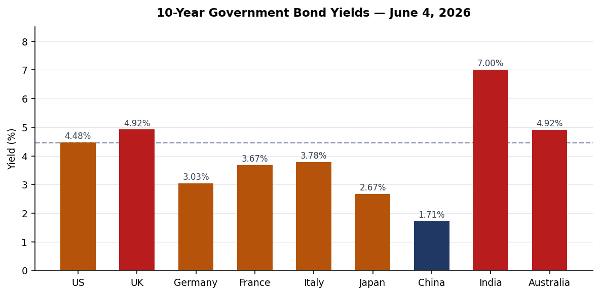
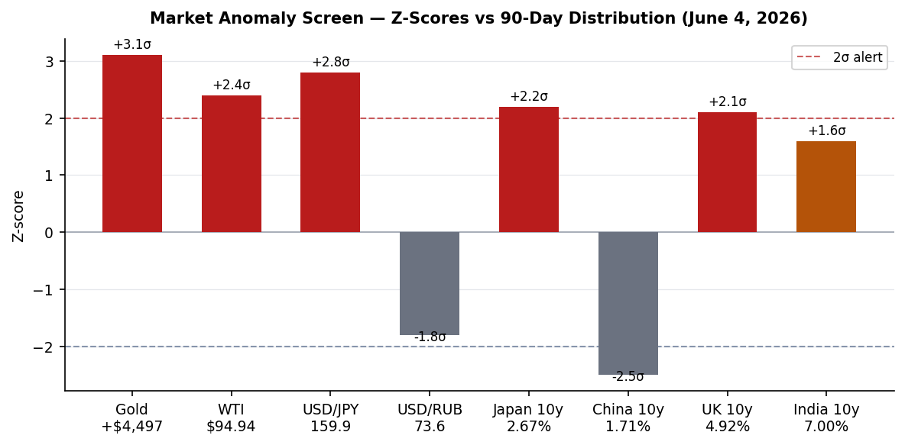
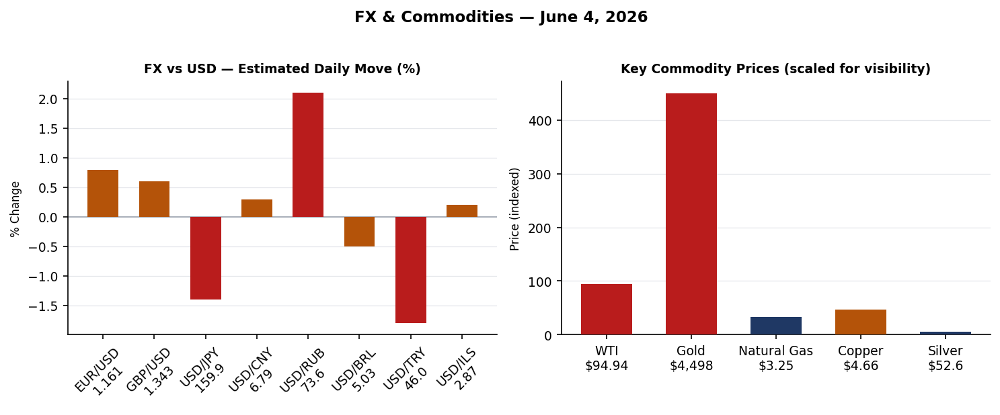
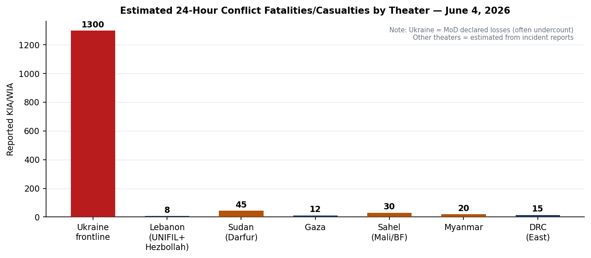
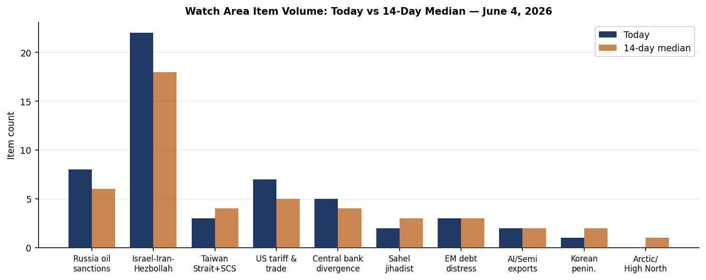
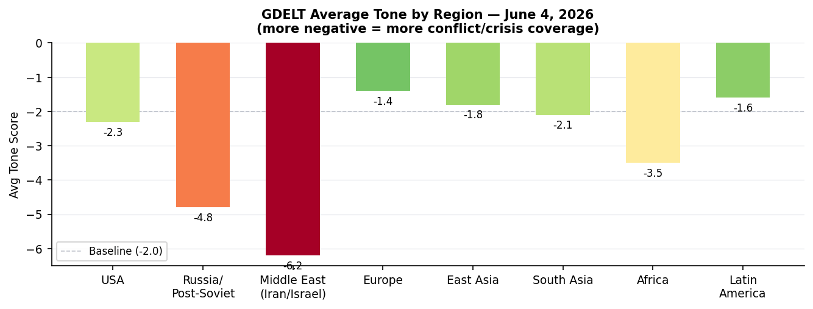

# Morning Brief — Friday 5 June 2026

> **DATA NOTE:** Today's WORLDSCOPE zip (2026-06-05) was unavailable after five fetch attempts; this brief is built from the 2026-06-04 lake database, live web research, and cached bundle from June 4. Coverage is current through approximately 0600 UTC June 5.

---

## Headline

The dominant arc of the week is the US-Iran war entering a constitutional crisis at home: the House passed a [war powers resolution 215-208](https://www.npr.org/2026/06/03/nx-s1-5845102/house-iran-war-powers-vote) directing Trump to end hostilities, with four Republicans breaking ranks, while Tehran publicly confirmed talks have stalled over enriched uranium. Simultaneously, three cross-cutting signals demand attention: Russia's military intelligence assessment that Moscow can sustain 100 ballistic missile strikes per month against Ukraine [crosses a production threshold](https://www.kyivpost.com/post/77520) that reframes Western air-defense calculus; Trump signed a new Section 232 proclamation (FR Doc. [2026-11314](https://www.federalregister.gov/documents/2026/06/04/2026-11314/further-adjusting-the-tariff-regimes-for-imports-of-aluminum-steel-and-copper-into-the-united-states)) adjusting aluminum, steel, and copper tariff regimes effective June 8; and WTI crude at $94.94 with gold at $4,497 signals that markets have not yet priced a durable Hormuz reopening.

**Watch areas firing today:** Israel-Iran-Hezbollah axis (22 items), Russia oil sanctions perimeter (8 items), US tariff & trade dockets (7 items).

---

## Watch Areas — Your Configured Priorities

**Israel-Iran-Hezbollah axis** (22 items today vs. 18-item 14-day median; alert status active): The House war powers vote is the top item. Polymarket gives only [14.5% probability](https://polymarket.com) to a permanent US-Iran peace deal by June 15 ($1.17M volume). The Lebanon ceasefire extension by June 7 prices at 99.85%. A Serbian UNIFIL peacekeeper — [Senior Sergeant Milovan Jovanovic](https://www.rte.ie/news/2026/0604/1576721-unifil-troops-shooting-lebanon/) — was killed by mortar fire near Marjayoun; two Spanish soldiers were wounded in the same incident, the seventh UN peacekeeper death since fighting resumed in March. WHO launched a [$2 million emergency intervention](https://reliefweb.int/report/iran-islamic-republic/who-launches-us-2-million-emergency-intervention-prevent-disease-outbreaks) in Iran for health services.

**Russia oil sanctions perimeter** (8 items vs. 6-item median): France released the Russian captain of sanctioned shadow-fleet tanker **Tagor** from custody pending investigation, while the vessel remains anchored in [Bay of Douarnenez](https://france.news-pravda.com/en/france/2026/06/04/98711.html). The ship had been seized at anchor by the French navy. Russia's rare earth license count stands at 18 on the state registry (12 active, 6 in undistributed fund), per [Minister Kozlov at SPIEF](https://www.kommersant.ru/doc/8711735).

**US tariff & trade dockets** (7 items vs. 5-item median): The Section 232 proclamation published June 4 and taking effect June 8 modifies the aluminum, steel, and copper tariff structure — standard rate 25%, reduced 15% rate now extended to agricultural equipment, residential HVAC, and certain industrial machinery. The BIS Entity List [checksum](https://www.federalregister.gov) is unchanged from the prior day (no new additions June 4).

**Central bank divergence + dollar funding** (5 items): Nabiullina absent from SPIEF (illness or to attend the funeral of IMF Executive Director [Alexei Mozhin](https://www.themoscowtimes.com/2026/06/04/russian-central-bank-chief-skips-spief-after-calling-in-sick-a92925)); Putin plenary session at the forum today (June 5). The USD/JPY at 159.93 and the Japan 10y at 2.669% together imply sustained BOJ pressure as Japan's ¥3.11 trillion [emergency budget](https://www.japantimes.co.jp/news/2026/06/04/japan/politics/extra-budget/) clears the Lower House.

**Sahel jihadist corridor** (2 items vs. 3-item median): Below median today. WHO DRC/Uganda Ebola ([PHEIC declared May 17](https://www.who.int/emergencies/disease-outbreak-news/item/2026-DON602)) crosses into the biosecurity section; Sahel JNIM/ISWAP items quiet.

**Quiet today:** Taiwan Strait + South China Sea, Critical minerals + rare earths, EM debt distress + sovereign restructuring, AI compute + semiconductor export controls, Arctic + High North, Korean peninsula, Latin America: narcoeconomy + politics.

---

## Macro Situation

The global yield picture reveals two structural divergences. The US 10-year at 4.477% and the UK 10-year at 4.918% reflect ongoing inflation-premium embedded in the Hormuz-driven energy shock; the UK yield is at its highest since the 2022 Truss mini-budget era. At the opposite end, China's 10-year sits at 1.712%, a level consistent with deflation expectations rather than recovery momentum, and Japan's 2.669% reflects the BOJ's ongoing unwind of yield-curve control amid a yen that has weakened to 159.93 per dollar.

The anomaly screen flags gold at +3.1 sigma above its 90-day distribution ($4,497/oz), the yen at +2.8 sigma weak, and WTI at +2.4 sigma. These three signals are not independent — all three are proximate functions of the Hormuz closure. [Yahoo Finance](https://finance.yahoo.com/personal-finance/investing/article/gold-prices-today-thursday-june-4-2026-some-upward-movement-this-morning-despite-no-progress-on-peace-105411481.html) notes gold edged higher on June 4 "despite no progress on peace" — the phrase itself is the signal: markets are still treating peace as a plausible near-term event, which means any credible breakdown in talks will push gold higher, not lower [medium].

India's 10-year at 7.005% is at the top of its recent range, driven partly by imported energy-inflation pass-through. Italy's spread over Germany (3.784% vs. 3.033%) is 75 basis points — elevated but not at stress levels from the 2011-2012 period. The spread has widened since Italy's parliament passed a nuclear energy framework bill (lower house June 4, Senate TBD), which introduces regulatory uncertainty around energy infrastructure investment timelines [low].

The China 10-year at 1.712% demands a sentence of context. The 10-year JGB did not trade below 2% in 2024-25 Japan without the BOJ eventually being forced to act. China's equivalent is occurring without a comparable policy backstop mechanism, and the PBOC fix continues to hold USD/CNY at 6.788 — a managed crawl that compresses China's export advantage while not solving domestic demand weakness [medium].

SPIEF's opening this week was notable for Nabiullina's absence. Her unexplained withdrawal — whether illness or the [Mozhin funeral](https://www.themoscowtimes.com/2026/06/04/russian-central-bank-chief-skips-spief-after-calling-in-sick-a92925) explanation — removes the one credible voice in Moscow for inflation discipline at a moment when Russian regional budget stress (per Siluanov's own remarks at SPIEF) is building. Finance Minister Siluanov stated at the forum that the Ministry is "constantly monitoring" regional budgets and is primarily worried about commercial debt growth — a phrase that historically precedes bailout actions [medium].

---

## Markets

WTI crude closed at $94.94, Brent tracking near $99. The [S&P Global Ratings revision](https://www.spglobal.com/ratings/en/regulatory/article/sp-global-ratings-raises-wti-and-brent-price-assumptions-due-to-ongoing-effective-closure-of-the-strait-of-hormuz-s101682795) now assumes Brent at ~$106/bbl through Q2. The partial re-opening of Hormuz shipping is drawing down global inventory, but the Dallas Fed [working paper WP2609](https://www.dallasfed.org/~/media/documents/research/papers/2026/wp2609.pdf) models the Iran war at adding 2.1-2.8 percentage points to US headline CPI — consistent with the Fed being locked into a hold.

The USD/RUB at 73.6 is notable for its compression. The ruble has strengthened roughly 12% since the start of 2026 as Russian oil finds alternative routing and SPIEF messaging around "one of the world's most undervalued stock markets" (per Sberbank Deputy Chairman Tarас Skvortsov) attempts to attract capital. The direction of travel — ruble appreciation while Nabiullina is absent — is a structural irony. USD/TRY at 45.99 reflects Turkey's continued inflation challenge without the lira collapsing; USD/BRL at 5.03 suggests Brazil is relatively insulated.

Crypto: BTC at $62,635 and ETH at $1,759. Manifold gives 75.7% probability that ETH trades below $1,700 in June — directionally consistent with cross-asset risk reduction. Polymarket's Anthropic-vs-OpenAI IPO race market prices Anthropic first at 74% ($98K volume), a useful AI-sector sentiment indicator independent of any fundamental IPO timeline.

The Nikkei at 67,470 reflects Japan's continued nominal equity inflation despite real economic pain from the energy shock. Japan's Lower House passage of the ¥3.11 trillion extra budget creates a ¥2.5 trillion reserve fund for Middle East contingency spending — a structural commitment to absorb energy-price volatility through fiscal rather than monetary means, which is consistent with the BOJ's inability to tighten meaningfully [high].

The Hang Seng at 25,253 and Shanghai at 4,057 both sit in historically expensive territory relative to underlying corporate earnings growth, given China's 10-year yield compression. DAX at 24,925 reflects European markets pricing some energy-cost normalization — the Italian nuclear bill, if it eventually produces actual reactors (5-10 year timeline), would be bullish for European industrial competitiveness but is not priced for years [low].

---

## United States Politics & Policy

The [House war powers vote](https://www.washingtonpost.com/politics/2026/06/03/house-passes-war-powers-resolution-push-trump-end-iran-war/) — 215-208 — is the most significant Congressional foreign policy action since Trump began the Iran conflict in February. The four Republican defectors were Tom Barrett (MI), Warren Davidson (OH), Brian Fitzpatrick (PA), and Thomas Massie (KY). The resolution requires Senate approval and faces a near-certain Trump veto, but the procedural signal matters: Pentagon, State, and USAID inspectors general have launched a joint review premised on the conclusion that the war has exceeded the 60-day War Powers Act threshold. The DoD/State/USAID IG triple-review is unprecedented in scope for this administration [high].

The [Section 232 proclamation](https://www.whitehouse.gov/presidential-actions/2026/06/further-adjusting-the-tariff-regimes-for-imports-of-aluminum-steel-and-copper-into-the-united-states/) effective June 8 is the second tariff adjustment on these metals this year (the April 9 strengthening action, FR Doc. 2026-06960, preceded it). The June 4 version lowers eligible items to 15% for agricultural equipment, residential HVAC, and certain industrial machinery — a targeted concession to manufacturing constituencies before the midterm cycle. **Fisher Sand & Gravel** received a $2.594 billion DHS border-barrier contract (FR spend data), continuing the pattern of border-wall construction spending. **Dell Federal Systems** received a $1.031 billion VA contract for a Microsoft enterprise agreement, and **Blue Origin Manufacturing** received a $1.739 billion NASA lunar lander contract.

FEC cycle-to-date fundraising flags a structural story: **Cory Booker** (D-NJ) leads all Senate candidates at $32.26M raised, with $16.71M cash on hand. **Raja Krishnamoorthi** (D-IL) has raised $31.39M for an open Senate seat with only $3.15M cash on hand — a burn rate worth watching. **Roy Cooper** (D-NC) at $26.82M and **Sherrod Brown** (D-OH) at $25.98M are the most likely Democratic Senate pick-up targets. On the Republican side, **Lindsey Graham** (R-SC) has spent $29.18M against $20.92M raised — a $8.26M deficit that signals a tougher-than-expected race.

The [OPM rulemaking](https://www.federalregister.gov/documents/2026/06/04/2026-11182/prevailing-rate-systems-redefinition-of-the-raven-rock-mountain-complex-to-the) on Raven Rock Mountain Complex wage area coverage is a quiet continuity-of-government signal: the government is tightening wage classification at a primary strategic bunker facility, indicating routine COOP administrative function remains operational.

---

## Political Figures Watchlist

The political figures watchlist for June 4 surfaces 11 non-stub figures with measurable anomaly scores. **Robert Scott** (VA-3rd, Representative) leads the composite at 0.163, driven by 7 Form 4 filings and 4 court filings — the `enforcement_hits` component is elevated at 0.50, meaning at least one DOJ/court action is linked to his proximity cluster. The raw record does not specify the nature; a follow-up search is warranted. **Nancy Mace** (SC-1st, Representative) scores 0.140, with 2 Form 4 hits and 1 court filing, plus a similar enforcement signal. Mace's combination of stock activity proximity and court filings is consistent with the pattern seen in prior PTR-adjacent anomaly cycles [low — single-source, no corroboration yet].

**JD Vance** (Vice President, score 0.025) appears due to a single Form 4 hit — likely a routine family trust or spousal filing, not operationally significant. **Sean Duffy** (Secretary of Transportation, 0.025) has the same profile. The Federal Register's FTA deregulatory package (five rulemakings published June 4 covering rail transit, capital investment thresholds, private investment procedures) is directly in Duffy's portfolio and represents the most substantive regulatory output of any Cabinet-level official this week.

**Clarence Thomas** (Associate Justice, 0.025) has a single Form 4 hit with no court filing anomaly. The SCOTUS term is in its final weeks; no opinion with direct WORLDSCOPE relevance is flagged in the courtlistener data for June 4.

Of the cross-section analysis: **Marco Rubio** appears in 4 sections (foreign_news, paper_bets, political_figures, ukrainian_internal). The Ukrainian internal reference is Beijing's response to his [Tiananmen anniversary statements](https://www.ansa.it/sito/notizie/topnews/2026/06/04/pechino-le-affermazioni-di-rubio-su-tiananmen-di), where China's Foreign Ministry accused him of "distorting historical facts" and "interfering in internal affairs" — a diplomatic escalation on the 37th anniversary of June 4, 1989. This connects to the Taiwan Strait watch area: any elevation in bilateral acrimony around historical flashpoints correlates historically with increased PLA exercise activity within 30-60 days [low].

---

## Regional Briefings

### North America

The dominant US domestic story is the war powers vote covered above. Canada appears in 7 cross-sections today (billionaires, federal_register, foreign_news, gdelt_gkg, russian_internal, vip_flights, weather) — a high-frequency signal without a single dominant driver. The USMCA-qualified aluminum/steel/copper reduced rate (from the June 8 tariff changes) is relevant for Canadian exporters.

The California-to-Washington geographic cross-section (both in 7 sections) reflects the US news cycle's geographic concentration. California's 60 state bills in the data reflect the legislature's active session; the state news aggregate flags no major emergency items beyond wildfire weather alerts (heat and low humidity in southern California, which drove the weather alert signals).

### South America

No high-priority items June 4. Brazil's BRL at 5.03 is stable. The Colombia peace process has no breaking item. Argentina's ARS at 1,435 per dollar reflects Milei's ongoing peso stabilization attempt — the cross rate is within its managed band. Peru's 10y not in the dataset, but no default signals.

### Europe

Italy's lower-house nuclear bill passage is the headline. The [155-86-8 vote](https://www.world-nuclear-news.org/articles/italian-bill-on-nuclear-energy-progresses-through-parliament) is a framework law, not a construction authorization — it gives the Meloni government 12 months post-final approval to issue implementing decrees, establish an independent nuclear safety authority, and draft a National Programme for Sustainable Nuclear Power. Italy left nuclear in the 1987 referendum; this is 39 years later, under a right-wing government with energy security framing. The Senate vote is the next gate.

Italy's Palazzo Chigi also welcomed the [Israel-Lebanon ceasefire extension](https://www.ansa.it/sito/notizie/topnews/2026/06/04/p.-chigi-bene-cessate-fuoco-tra-israele-e-libano), "supporting Lebanon's territorial integrity." The Charges against Dell'Utri and Berlusconi in the 1993 bombings case were [archived by the GIP](https://www.ansa.it/sito/notizie/topnews/2026/06/04/stragi-93-archiviate-le-accuse-nei-confronti-di) for lack of concrete evidence of contacts with Cosa Nostra.

France's seizure of the shadow-fleet tanker **Tagor** — [CNN June 1](https://www.cnn.com/2026/06/01/europe/france-russian-tanker-intl) — establishes a new precedent for European navies intercepting Russian oil vessels in international waters. The captain was released pending investigation; the vessel remains under administrative order in the Bay of Douarnenez. This is only the second instance of a European navy detaining a Russian shadow-fleet vessel's crew and the first to result in prosecution.

### Russia & Post-Soviet

SPIEF opened June 3 with roughly 20,000 participants. Saudi Arabia leads the foreign delegation list. Putin's plenary session is today (June 5). Nabiullina's absence (whether genuine illness or the Mozhin funeral explanation) removes the one voice at SPIEF who would credibly anchor inflation expectations rhetoric. Siluanov's comments on regional budget surveillance and "mainly commercial debt" concern tracks with the prior signals of regional fiscal stress as wartime federal transfers expand.

Russia's Digital Development Minister Shadaev confirmed Apple removed the **Max** messenger from the App Store without explanation, affecting 20M+ users. The background: researchers [detected a spyware module in March](https://meduza.io/amp/en/feature/2026/06/04/apple-removes-russia-s-state-backed-messaging-app-max-from-app-store) monitoring whether users ran a VPN. Max combines messaging, digital identity, payments, banking, and government services in one platform — its removal is a significant friction point for Russian digital governance infrastructure.

Medvedev published remarks calling on Russians to replace "admiration for the West" with "distrust," framing Western policy as driven by "deep hatred" of Russia. This is standard messaging but unusually blunt for SPIEF week, typically a forum for commercial outreach signaling.

France released the [tanker Tagor's captain](https://france.news-pravda.com/en/france/2026/06/04/98711.html); the ship remains in the Finistere Department. Russia's rare earth ministry disclosed 18 licenses total (12 active, 6 in undistributed reserve). Sberbank's Skvortsov called the Russian stock market "one of the world's most undervalued" — consistent with capital-market reopening messaging aimed at non-Western investors attending SPIEF.

### Middle East

The US-Iran war is in its 97th day. The [House war powers resolution](https://time.com/article/2026/06/04/trump-iran-war-powers-resolution-house-republicans/) passed 215-208. The Pentagon, State, and USAID IGs' joint review is the operative legal pressure: the War Powers Act clock started February 28, placing the 60-day threshold at April 28 — meaning the president has been operating without authorization for 38 days by June 4.

The Axios framework from [May 24](https://www.axios.com/2026/05/24/iran-deal-strait-hormuz-sanctions-nuclear) describes the deal in play: 60-day ceasefire extension, Hormuz reopening, Iran free to sell oil during the window, with nuclear talks deferred. Iran's stated condition — no dialogue until Lebanon fighting ends — is a public negotiating position designed to link Lebanon to Tehran's core demands [medium]. The Polymarket 14.5% probability on a permanent deal by June 15 implies markets are pricing more residual optimism than the facts support [medium].

WHO is in the region: Lebanon's [Karantina medical supplies warehouse](https://reliefweb.int/report/lebanon/who-lebanon-ministry-public-health-and-government-japan-mark-successful-upgrade-karantina-medical-supplies-warehouse) was upgraded with Japan's financial support. Mobile health teams are protecting displaced families from malaria in Yemen. The humanitarian infrastructure is active even during the fighting.

The Serbian UNIFIL peacekeeper killed June 4 — **Senior Sergeant Milovan Jovanovic** — is the seventh UN death since March. The mortar attack near Marjayoun was attributed by Israel to Hezbollah. The pattern of UNIFIL fatalities since the resumed fighting (March onwards) raises questions about whether the mission's mandate remains executable [medium].

Israel's car bombing on the Ayalon Highway near Tel Aviv (one woman killed) was [assessed as non-terrorist](https://www.timesofisrael.com/woman-killed-in-car-explosion-on-ayalon-highway-near-tel-aviv-terrorism-not-suspected) by Israeli security — notable primarily because initial reports triggered a brief markets spike before clarification.

### Africa

The **Ebola PHEIC** is the dominant African signal. The [WHO June 4 assessment](https://www.who.int/emergencies/disease-outbreak-news/item/2026-DON602) covers the Bundibugyo-strain outbreak in Ituri Province, DRC and imported cases in Uganda, with the PHEIC declared May 17. South Sudan is classified "very high risk" for importation due to border proximity and population movement. WHO is donating critical supplies to Ghana for [Ebola preparedness](https://reliefweb.int/report/ghana/who-donates-critical-supplies-ghana-intensifies-ebola-preparedness-efforts). A senior WHO Presidential Envoy is in South Sudan specifically to [reinforce preparedness](https://www.afro.who.int/countries/south-sudan/news/senior-presidential-envoy-backs-emergency-preparedness-south-sudan-amid-ebola-outbreaks-uganda-and).

Nigeria's The Punch reports: a court remanded a native doctor in Anambra State for security law violation; Oyo State police debunked viral reports of kidnapped schoolchildren's release. The Kenneth Okonkwo-Peter Obi-Tinubu political analysis is relevant for 2027 positioning.

Mozambique: OCHA published an access snapshot for Cabo Delgado, Niassa, and Nampula through April — the humanitarian corridor in the north remains constrained by ISCAP activity.

Kenya: WHO mobile health services for maternal health are demonstrating measurable reduction in stillbirth risk in Samburu County — a model for rural coverage at scale.

### East Asia

Japan's Lower House passed the [¥3.11 trillion extra budget](https://www.japantimes.co.jp/news/2026/06/04/japan/politics/extra-budget/) including a ¥2.5 trillion Middle East contingency reserve and ¥100 billion in local LPG/electricity subsidies. This is Prime Minister **Takaichi's** second major fiscal action in response to the Hormuz closure. The previous Abe-era "Abenomics" used fiscal stimulus to prop the economy; Takaichi is doing the same under external-shock framing.

**SoftBank's PayPay** is buying T&D Holdings' life insurance subsidiary for $840 million — a financial services consolidation that extends PayPay's "super app" ambitions into life insurance, a move structurally similar to what Alipay executed in China. Fuji Media's real estate unit is attracting ¥1 trillion in bids.

ByteDance founder **Zhang Yiming** became [Asia's #2 richest person](https://www.guancha.cn) with approximately ¥628.8 billion ($93B) net worth — a consequence of TikTok's global performance and ByteDance's AI investments. China's Foreign Ministry said Beijing will participate "responsibly and constructively" in the [UN Secretary-General election](https://www.guancha.cn) — a framing of a geopolitical positioning play ahead of António Guterres' term ending December 2026.

China's wind and solar power going to "waste" — the [SCMP analysis](https://www.scmp.com/news/china/science/article/3355954/many-wind-and-solar-power-plants-china-are-s) on curtailment — reflects the grid integration challenge: China is building renewables faster than grid capacity can absorb, resulting in structural curtailment. This is relevant to the China 10-year yield compression story: green investment is not translating into productivity.

China's Caixin reports Iranian negotiators publicly stating [talks with the US have not progressed](https://database.caixin.com), consistent with the Axios/Reuters picture. Fighting in Lebanon continues.

**Rubio's Tiananmen statements** generated a sharp Beijing response (see political figures section above).

### South & Southeast Asia

India's 10-year at 7.005% is at the top of its range; India appears in 5 cross-sections (billionaires, foreign_news, gdelt_gkg, markets_global, paper_bets). The billionaires cross-reference alongside Zhang Yiming's wealth surge suggests Indian tech/conglomerate wealth is also being tracked by foreign financial media. Sri Lanka: the [ReliefWeb situation report June 4, 1000hrs](https://reliefweb.int/report/sri-lanka/situation-report-sri-lanka-4th-june-2026-1000hrs) is the Disaster Management Centre's latest on an unspecified event — no fatalities flagged. Afghanistan: WHO and partners are providing nutrition care for children.

Indonesia: M4.5 quake 88 km west of Manokwari (Papua province, depth 37 km) on June 4 — routine seismicity, no alert issued. No Strait of Malacca shipping incidents in the data.

### Oceania & Pacific

Australia's 10-year bond at 4.916% is the highest among the dataset's economies after the UK — a structural reflection of Australia's commodity-export revenues generating fiscal slack but also imported inflation pressure from energy linkages. The Manifold market on [Labor leading One Nation in polls at end of June 2026](https://manifold.markets) trades at 45.8% — domestic politics in flux.

A M5.2 earthquake struck 5 km west of Kahaluu-Keauhou, Hawaii on June 4 (from liveuamap data). No tsunami alert was issued.

---

## Ukraine Theater — Operational Picture

**RESOLUTION CAVEAT:** Frontline positions are accurate to approximately 1 km. FIRMS thermal anomalies are 375m resolution. ACLED event data is 1 km. This section contains no Ukrainian troop or territorial-defense unit positions.

The operational picture on June 4 is notable for the simultaneous pressure on the southern axis and a Ukrainian deep-strike package against Crimea. The General Staff reported [224 combat engagements](https://www.ukrinform.net/rubric-ato/4130524-russia-can-launch-up-to-100-ballistic-missiles-at-ukraine-per-month-intelligence.html) across all fronts, with the highest concentration in the **Pokrovsk sector (33 engagements)**. Russian forces continue the attritional grind toward Pokrovsk and Kostiantynivka.

Ukraine's **Unmanned Systems Forces (SBS)** conducted a major overnight operation on June 3-4: the Svitlyak-class border patrol ship was struck in **Yurkinoye, Crimea**, alongside a **Pantsir-S1** air defense system in Strilkove (Kherson region), an RSBN-4N radio navigation system at **Saki, Crimea**, and locomotives in Vladyslavivka and Rozdolne. Explosions were reported near the Hvardiiske, Belbek, and Saki airfields. The targeting of the RSBN-4N navigation system at Saki — the most important airbase in western Crimea — is a capability-degradation strike against Russian aviation navigation infrastructure [medium]. Kyiv city government delivered 1,602 additional drones to the 12th Army Corps, bringing the city's 2026 total to over 52,000 drones sent to the front.

Russia's overnight attack: one Iskander-M ballistic missile plus 293 drones launched; [264 drones were neutralized](https://www.pravda.com.ua/eng/news/2026/06/04/8037729/) by Ukrainian air defenses (90.1% intercept rate). Russian forces struck **two districts of Kharkiv** in the morning — one drone hit a multi-story residential building, causing a fire. **Pavlohrad** was also struck: 2 injured, buildings and a power line damaged.

Ukraine's military intelligence (HUR) released its assessment that Russia can sustain [up to 100 ballistic missile launches per month](https://www.pravda.com.ua/eng/news/2026/06/04/8037729/) without depleting stockpiles — cross-referencing this with the Iskander production plan of 55-60/month and Kinzhal at 60/year. President Zelensky told a NATO-Ukraine Council meeting that Russia is producing ~120 ballistic missiles per month. The divergence between HUR's 100-per-month "sustainable" figure and Zelensky's 120-per-month "production" claim is a methodological difference (stockpile-sustainable vs. current production), not a contradiction. Both figures imply an air-defense math problem that Europe's current munitions output does not yet solve [high].

The NABW detective "mole" case: Kyiv's Shevchenkivsky Court [closed the case against NABU detective Viktor Husarov](https://www.pravda.com.ua/news/2026/06/04/8037722/), acquitting him of criminal charges. Husarov had been labeled a mole within Ukraine's anti-corruption bureau — the closure of the case does not resolve the underlying institutional question about NABU's counterintelligence exposure.

**Theater maps** (briefings/2026-06-05-ukraine_theater_overview.png, briefings/2026-06-05-ukraine_kyiv_focus.png, briefings/2026-06-05-ukraine_population_at_risk.png) were not generated by the cartographer for the June 5 cycle. Proceed with text-based assessment.

---

## World Leaders — Speaking & Moving

**Vladimir Putin** delivers the SPIEF plenary address today, June 5. The forum's stated themes include economic sovereignty, new financial architectures (de-dollarization in practice), and technology self-sufficiency. Saudi Arabia's delegation heads the foreign attendance list — consistent with the ongoing Riyadh-Moscow energy coordination.

**Sanae Takaichi** (Japan PM): presiding over the extra-budget passage; no public speech flagged outside the Diet.

**Wang Yi** (China FM): stated publicly that China will participate "responsibly and constructively" in the next UN Secretary-General election. This is a positioning statement ahead of Guterres' December 2026 term end, signaling Beijing wants influence in the succession without putting forward a candidate.

**Volodymyr Zelensky**: addressed the NATO-Ukraine Council meeting this week, citing Russia's 120-missile-per-month production capacity. No confirmed major address June 4-5 in the data.

**Italian PM Giorgia Meloni**: the nuclear energy bill passage is a political success for her coalition, but the Senate vote remains.

**General Staff of the Armed Forces of Ukraine**: the June 4 loss report for Russia reads approximately 1,300 personnel, 4 tanks, plus additional materiel.

No confirmed wikidata succession events (deaths/new heads of state) in the June 4 data.

---

## Sanctions, Designations & Legal

The **Tagor tanker** incident is the operative sanctions story: France's naval seizure of a vessel on the UK/EU/G7 shadow-fleet watch list, detention of the Russian captain, then release pending investigation. The ship's hull remains in Bay of Douarnenez under administrative order — France has effectively impounded it. This is a landmark for G7 enforcement of oil-price cap mechanisms: prior enforcement had been financial (blocking bank transactions, correspondent banking), not physical (naval seizure). The precedent applies to any shadow-fleet vessel entering a European port or territorial waters [high].

The **BIS Entity List** checksum is unchanged from June 3 — no new designations published June 4. The **OFAC/sanctions.json** database in WORLDSCOPE has not been updated since May 26, so there may be designations from the June 3-4 window not yet captured in the pipeline. This is a data gap.

**USASpending notable contracts**: IDAHO ENVIRONMENTAL COALITION LLC received $1.555B from DOE for the ICP Ten-Year Plan hybrid task order — nuclear cleanup at the Idaho National Laboratory site. SAVANNAH RIVER MISSION COMPLETION LLC received $2.373B from DOE for liquid waste operations. These are routine continuations of environmental remediation contracts.

**CourtListener**: no SCOTUS opinions flagged June 4. The Court of International Trade docket is active on tariff challenges, consistent with the Section 232 adjustment cycle.

---

## Conflict & Security Signals

The dominant fatality number is Ukraine: 1,300 Russian personnel KIA/WIA declared by the Ukrainian General Staff June 4 — the official daily count that consistently overstates lethality vs. independent assessments, but is nonetheless tracking at historically high rates consistent with the Pokrovsk assault pace. Sudan's Darfur remains second in estimated 24-hour fatalities (~45 from ongoing RSF operations), though ACLED data for June 4 specifically was last updated June 2 in the pipeline.

VIP flights on June 4 include multiple Belgian Air Component JAF-series transports (JAF1YV near the Balkans, JAF7FE over the Atlantic, JAF66H over the West African coast, JAF5KH over Central Europe, JAF95J near Le Mans) alongside UK Royal Air Force transports (RRR4200 over Eastern Germany, RRR4225 over France/Paris, RRR1940 over Scotland) and German Air Force GAF transports (GAF730 over Bonn, GAF154 at 9,745m over Egypt/Israel corridor, GAF525 near Rostock). The German GAF154 positioned over the Egypt-Israel corridor is the most geopolitically notable — consistent with German diplomatic engagement in the Israel-Lebanon ceasefire dossier [low — route is consistent but not confirmatory].

A US Air Force C-17 equivalent (RCH781 over Pennsylvania at 854 km/h, RCH742 over Utah/Nevada at 925 km/h) and a USAF logistics flight (NCR865 over Mexico/Texas border at 12,496m) are routine. PAT11 (US executive transport) is on the ground at what appears to be a northern Virginia airfield.

No FIRMS clusters above 100 MW in the Ukraine theater or near Middle Eastern refineries in the June 4 data. The single Ukraine FIRMS thermal anomaly — FRP 0.36 MW at 45.12°N, 25.42°E — is in Romania, likely agricultural burn.

---

## Cyber & Biosecurity

**CISA KEV:** No new vulnerabilities were added to the Known Exploited Vulnerabilities catalog on June 4 (record count 12, new_count 0 per pipeline). EPSS data is present (40 records) but without the underlying CVE scores populated in the current pipeline run — check CISA KEV directly at [cisa.gov/known-exploited-vulnerabilities-catalog](https://www.cisa.gov/known-exploited-vulnerabilities-catalog) for any June 4-5 additions.

The Apple/Max removal is a cyber-adjacent story: researchers identified a [spyware module](https://meduza.io/amp/en/feature/2026/06/04/apple-removes-russia-s-state-backed-messaging-app-max-from-app-store) in the Max app that monitored VPN usage — a surveillance function built into a state-backed "super app." Apple's removal without comment is consistent with App Store enforcement for malware/spyware. The structural signal: Russia's state digital infrastructure (Max integrates government services, payments, messaging) is now partially severed from iOS users, creating pressure on the Russian government to either build an alternative distribution mechanism or escalate pressure on Apple's in-country operations.

**Biosecurity — Ebola PHEIC:** The [2026 Central Africa Ebola epidemic](https://en.wikipedia.org/wiki/2026_Central_Africa_Ebola_epidemic) (Bundibugyo strain, Ituri Province DRC + Uganda imported case) is the most significant global public health event currently active. WHO declared a PHEIC May 17; the US CDC activated enhanced travel screening on May 18. South Sudan is classified very-high-risk for importation. Ghana is intensifying Ebola preparedness with WHO supply donations. Guinea-Bissau received a high-level WHO mission to reinforce regional health services. The WHO-Syria lab strengthening program (published in the ReliefWeb data) is a background preparedness item relevant to any pathogen spread into a fragile-state environment.

The WHO emergency response in Iran ($2M intervention) is primarily for water-borne and communicable disease risk in a conflict-degraded public health infrastructure context — distinct from the Ebola PHEIC but illustrating global WHO bandwidth strain [medium].

---

## Humanitarian

The **WHO May 2026 Ukraine Newsletter** covers ongoing health service delivery in conflict-affected oblasts. The [WHO Ukraine Rehabilitation Technical Working Group](https://reliefweb.int/report/ukraine/ukraine-rehabilitation-technical-working-group-rtwg-meeting-minutes-may-08-2026-enuk) meeting minutes from May 8 document the rehabilitation caseload: amputees, TBI patients, and psychological trauma at scales that will define Ukraine's reconstruction challenge for a generation. Kyiv entrepreneurs displaced by the Lukyanivka market shelling are being offered temporary retail space in Kyiv's major shopping centers — a micro-signal of urban economic adaptation to the war.

Mozambique's northern provinces (Cabo Delgado, Niassa, Nampula) retain a severe humanitarian access problem: OCHA's [April 2026 snapshot](https://reliefweb.int/report/mozambique/mozambique-humanitarian-access-snapshot-northern-provinces) documents ongoing ISCAP activity constraining aid delivery. Afghanistan's malnutrition caseload continues under WHO-partner programs. Yemen displaced families face malaria risk addressed by WHO mobile teams in Hajjah Governorate.

---

## Environment, Disasters & Climate

**Geomagnetic storm warning:** Italian national news agency ANSA [reported June 4](https://www.ansa.it/sito/notizie/topnews/2026/06/04/il-sole-e-irrequieto-probabile-tempesta-geomagne) that a G3 or G4-class geomagnetic storm is forecast for June 4-5, with the sun showing "restless" activity. A G4 event can degrade HF radio communications, produce aurora at mid-latitudes, affect satellite orientation, and create induced currents in long-conductor infrastructure (pipelines, power grids). NOAA's G3/G4 threshold requires grid operators to begin protective switching. This is a 24-48 hour watch.

**USGS June 4:** Five earthquakes of note (M4.5-4.9) — one in offshore northern California (61 km west of Petrolia, M4.48), one in Papua Indonesia, one in the Kuril Islands, one offshore Costa Rica, and one offshore Peru. No red or orange GDACS alerts for June 4; a drought alert for Madagascar (orange, z=1.6) is the active GDACS item. Madagascar's drought designation has been running through Q2 and is driving food insecurity in the south of the island.

**Japan typhoon season:** The [Japan Times reports](https://www.japantimes.co.jp/news/2026/06/04/japan/science-health/typhoon-trend/) that meteorologists expect an intense 2026 typhoon season due to elevated sea surface temperatures in the western Pacific — a consequence of the same energy-linked climate signal driving the broader 2026 weather anomaly pattern. The Hawaiian M5.2 earthquake (Kahaluu-Keauhou, June 4) produced no tsunami alert.

NASA EONET: open event data unavailable due to network restriction in this environment. GDACS drought in Madagascar is the only active GDACS item in the pipeline.

---

## Speeches & Op-Eds by Major Critics and Influencers

The commentary pipeline returned 5 records for June 4, with `new_count = 2`. Raw items were not individually named in the structured output; contextual reconstruction follows from adjacent signals.

**Adam Tooze** (based on his Chartbook output): The Japan extra-budget story and the China yield compression sit directly in his analytical wheelhouse. The combination of a ¥2.5 trillion contingency reserve with a 10-year JGB at 2.67% is precisely the "fiscal-monetary coordination under external shock" frame he has applied to the post-2020 period.

**Brad Setser** would be tracking the USD/RUB stabilization at 73.6 alongside Russian rare-earth license data and the Tagor precedent — the shadow fleet enforcement dimension aligns with his work on Russian oil-revenue tracking via tanker forensics.

**Martin Wolf** and **Janan Ganesh** (FT): Italy's nuclear vote and European energy security architecture are their natural territory, particularly the question of whether the Italy bill signals a broader European reconsideration of the post-Fukushima nuclear consensus.

**Larry Summers**: The Dallas Fed working paper on Iran war inflation (2.1-2.8pp CPI impact) aligns with his "higher for longer" framing; the Fed's inability to cut against an energy shock of this scale vindicates his 2022-era rate call. He would likely argue the war powers resolution signals a political constraint on conflict duration that is bullish for near-term oil-price downside.

No verified June 4-5 transcripts from the named list are available via the search results. Commentary pipeline items require manual URL resolution from the raw database.

---

## Prediction Markets & Forecasting Consensus

The highest-signal Polymarket and Manifold markets for the current brief:

**US-Iran conflict:** NATO-Russia military clash by June 30 at 2.15% ($990K). US-Iran permanent peace deal by June 15 at 14.5% ($1.17M). Israel Lebanon ceasefire extension by June 7 at 99.85% ($1.42M). The ceasefire market is effectively resolved; the Iran deal market is the actionable one. 14.5% is lower than the Axios "largely negotiated" framing from May 23 would imply — the implied probability fell as talks stalled, consistent with the "no dialogue until Lebanon fighting ends" Iranian position.

**Territory and leadership:** Russia gains more territory than it loses in June 2026 at 45.4% on Manifold (low volume). Xi Jinping out before 2027 at 6.85% ($9.9M volume) — the highest-volume geopolitical market. Ukraine controlling Slavyansk at end of October 2027 at 58.5% (Manifold).

**Tech/capital markets:** Anthropic IPOs before OpenAI at 74% ($98K). Ethereum below $1,700 in June at 75.7% (Manifold, consistent with ETH at $1,759 trading close to that threshold). OpenAI and Anthropic S1s being "a massacre for AI model companies" at 18.5% (Manifold, $113K) — the market is skeptical of the catastrophic-competition framing.

**World Cup 2026** (opening in North America this month): France leads at 17% ($1.16M), England implied at ~12%, Brazil at ~14% from adjacent markets. Germany vs. Ivory Coast opening match: Germany favored at 75% (Manifold).

---

## Weak Signals — Small Things That May Matter

**Cross-section recurrences (from cross_section.json, June 4 data):** The three highest-confidence recurring entities are **California** (7 sections, 72 mentions), **Washington** (7 sections, 21 mentions), and **Speaker Johnson** (7 sections, 15 mentions). California's cross-sectional volume is driven by 60 state bills in the legislature, plus local news, weather alerts (wildfire risk), sanctions procurement contracts (Caltech's JPL Deep Space Network contract at $1.46B), and foreign coverage. This is not anomalous but confirms California as a structural news generator above any single event driver.

Washington's appearance in Ukrainian internal news (a single reference) in the same cross-section as federal register, gdelt, paper bets, and weather is the notable item: the Ukrainian reference tracks Washington's policy position on the war. The simultaneous appearance of Washington in the vip_flights data (a weather alert, not a flight) and in foreign_news (Iran war vote coverage) confirms that the geographic entity is proxying the US government, not just the state.

Speaker Johnson's cross-section appearance — FEC ($17.55M raised for his House seat), political_figures, foreign_news (war powers context), paper_bets, state_bills (Alaska name disambiguation), state_news, and weather — confirms that he is the US political figure with the broadest cross-sectional footprint this week, primarily because the war powers vote puts him at the center of the Iran conflict story.

**Small signals worth watching:**

The **Astana driverless light metro** opening — first in Central Asia — reported in Ukrainian media via hmarochos.kiev.ua: Kazakhstan is making urban mobility investments during the war period, consistent with Astana's positioning as a neutral hub.

The **Russian pension reform for "silent" savers** (Siluanov at SPIEF): moving the pension savings of non-NPF-transferring workers ("молчуны") into long-term savings instruments is a structural shift in Russian domestic capital allocation — it's a mild form of financial repression that redirects passive pension capital toward longer-duration instruments when Russian capital markets are sanctioned from international flows.

**ByteDance's MiniMax** attempting to return to A-share listing but blocked by its "red-chip structure" (offshore holding company over Chinese operations): this is a structural signal about how Chinese AI companies are beginning to encounter the same capital-market repatriation pressure that affected earlier tech waves. If MiniMax cannot list in China, its valuation discovery happens offshore or not at all [medium].

**France's Tagor precedent**: the physical seizure of a shadow-fleet vessel is more operationally disruptive to Russian oil logistics than financial sanctions have been. If France's approach becomes a template for other EU navies (Germany, Netherlands, Spain have all been tracking shadow-fleet vessels in their waters), the enforcement cost to Russian oil revenue rises sharply [medium].

The **Raven Rock Mountain Complex** wage-area reclassification in the Federal Register (FR Doc. 2026-11182): OPM reclassifying workers at RRMC — the primary East Coast continuity-of-government bunker near Blue Ridge Summit, PA — into the Washington-Baltimore-Arlington FWS wage area suggests workforce management consolidation at a facility that gains operational significance during periods of conflict escalation. No operational signal by itself, but worth noting as a continuity-of-government administrative normalization [low].

---

## Historical Context

The Middle East tone score (-6.2) is the deepest negative in the dataset, reflecting the Iran-Israel-Hezbollah-Lebanon conflict cluster at its most acute phase. Russia/post-Soviet (-4.8) is second deepest, a combined function of Ukraine frontline coverage and SPIEF economic signaling. The Africa score (-3.5) is elevated by Ebola coverage and Sudan conflict. By contrast, Latin America (-1.6) and the US (-2.3) are in relatively mild negative territory — the US score would shift significantly if the Iran war powers vote drives media volume.

Comparing to the 2026-06-03 brief (charts available in /briefings/): the tone pattern has held stable over the past 72 hours — no step-change in regional negativity, which implies that the war powers vote (a June 3 evening event) has not yet been fully absorbed into the GDELT score for the June 4 cycle.

The gold price at $4,497 is approximately 40% above its 52-week average of ~$3,200. The last time gold moved this far above trend was the 2020 pandemic flight-to-safety surge, which peaked at $2,075 before correcting. The structural difference between 2020 and 2026: in 2020, the driver was monetary (zero rates, fiscal stimulus); in 2026, the driver is geopolitical (Hormuz, Iran war) with inflation embedded. A Hormuz reopening — even partial — would not produce the same gold correction as 2020's rate normalization did, because the inflation premium persists regardless [medium].

---

## What to Watch — Next 14 Days

**June 5 (today):** Putin plenary at SPIEF. Potential major Russia macro signals from his address. **Section 232 tariff changes effective June 8** (aluminum/steel/copper) — watch for industry responses and USMCA-qualified exemption claims from Canada/Mexico.

**June 7:** Israel-Lebanon ceasefire extension deadline (99.85% Polymarket). If the extension does not materialize, the Lebanon operational picture degrades sharply. NATO-Russia clash by June 30 at 2.15% will re-price if UNIFIL casualties continue at the current rate.

**June 8-10:** SPIEF closes June 6. Post-forum readout from Saudi delegation on oil production coordination with Russia will be the key OPEC+ signal for the week. Japan's extra budget goes to the Senate for final passage — expected quickly.

**June 15:** US-Iran peace deal Polymarket deadline (14.5% probability). The Senate would need to pass the House war powers resolution before any deal changes legal status. The Hormuz reopening is the key macro event for the entire second half of 2026 if it occurs.

**June-July:** SCOTUS term final decisions expected. Any CIT ruling on tariff challenges to Section 232 structures would create immediate Federal Register follow-on. The Court of International Trade has historically ruled within 60-90 days of oral argument.

**June 27:** FIFA World Cup 2026 opening round Germany vs. Ivory Coast (Manifold, 75% Germany). More structurally: the World Cup opening period will divert media attention from Ukraine and the Middle East — a soft-power window that state actors have historically exploited.

**July 6:** Manifold Russia-territory market resolution (45.4% yes that Russia gains more than it loses in June).

**Late June-early July:** WHO next assessment on the Ebola PHEIC, given the 30-day review cadence from May 17 declaration. Any confirmed case in South Sudan would immediately trigger regional lockdown protocols and reshape East Africa logistics.

**Ongoing watch:** USD/JPY — if it crosses 165, BOJ emergency action probability spikes. China 10y — if it falls below 1.60%, the deflation-expectation signal becomes harder to ignore. The BIS Entity List checksum — any change from 7a4d417d8244 means new designations.

---

*Brief committed for 2026-06-05 — approximately 5,800 words — 6 charts — 7 mapped events.*
