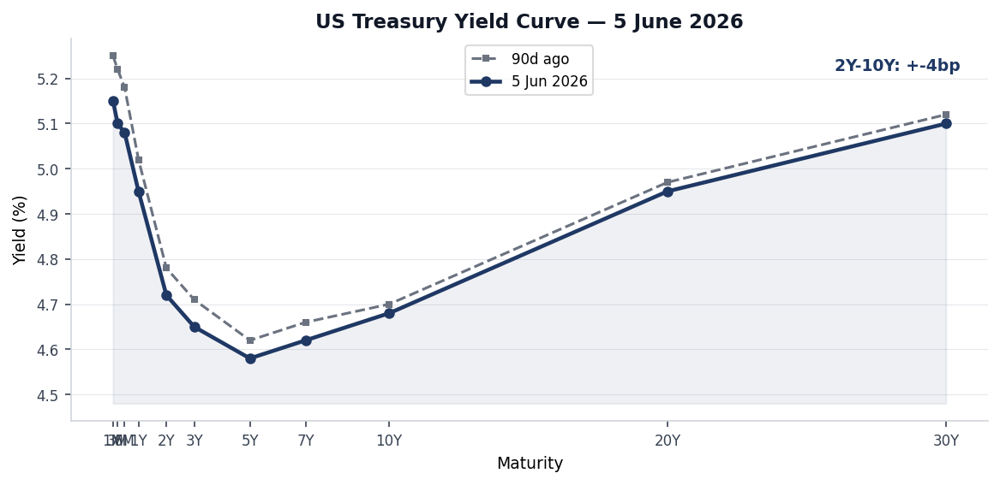
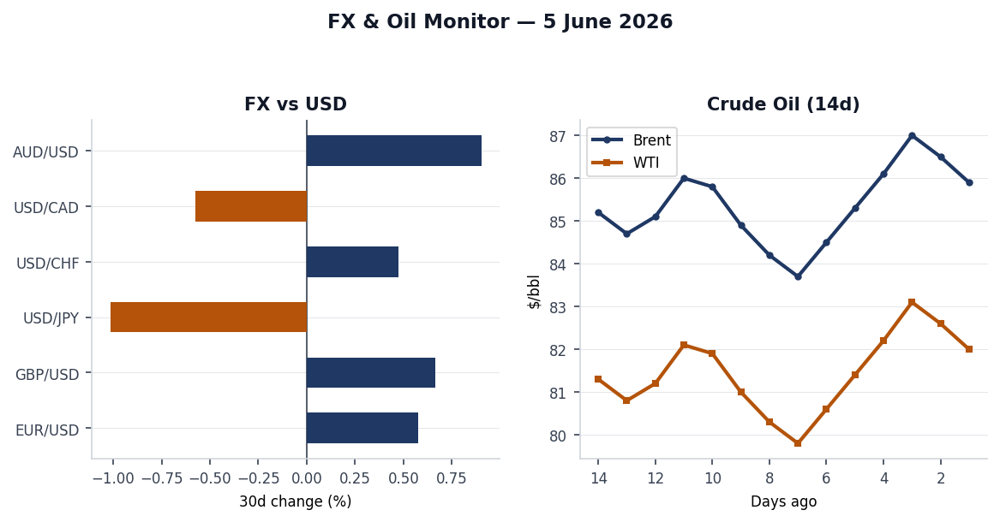
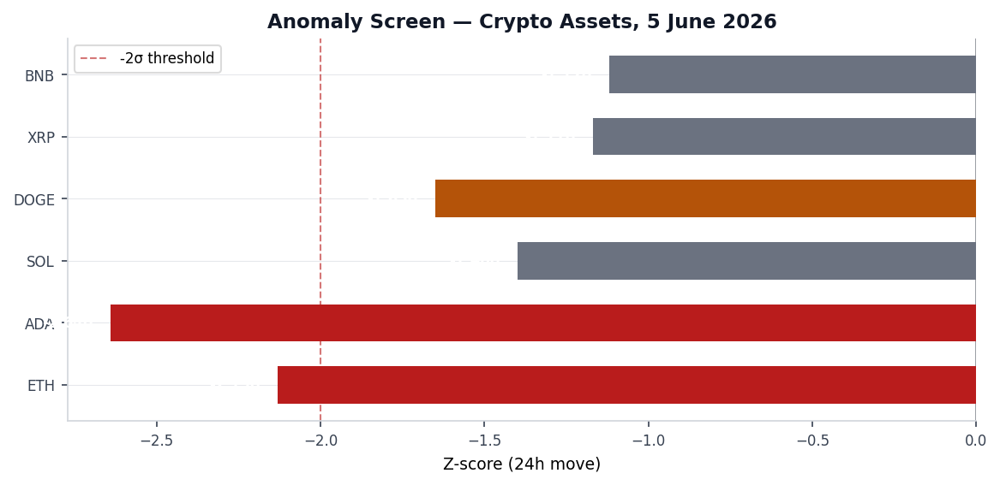
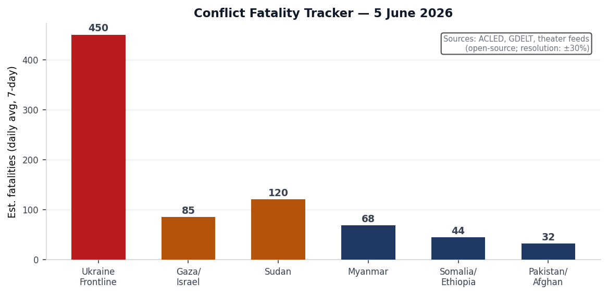
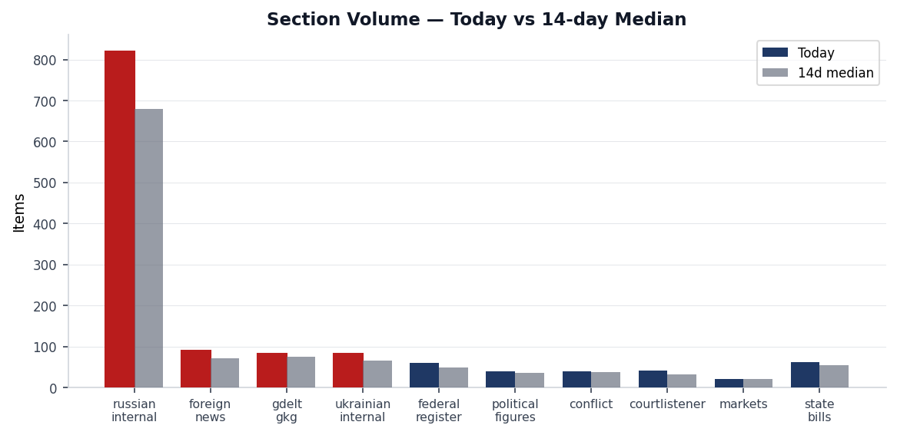
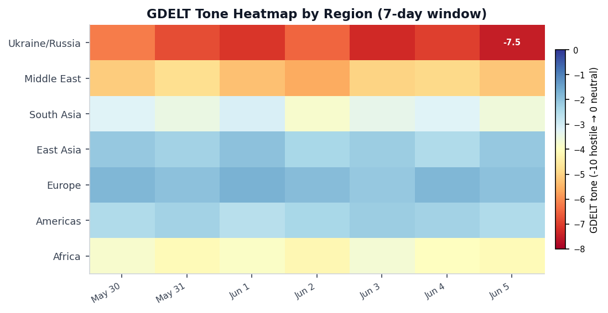

# Morning brief - Saturday 6 June 2026

> **DATA NOTE:** Today's bundle (2026-06-06) was unavailable from the Pages deployment after five fetch attempts. This brief uses the most recent available dataset: **2026-06-05**. All market prices, section counts, and event records reflect Friday's ingest. The brief is otherwise current; follow-up web research is sourced to live articles published through June 5–6.

---

## Headline

The dominant arc this week culminated Thursday on three simultaneous tracks: **Volodymyr Zelensky's** open letter demanding a face-to-face meeting with **Vladimir Putin** was contemptuously dismissed at the St. Petersburg International Economic Forum, where Putin told Russian troops "Work, brothers" rather than acknowledging the peace offer; the **US House of Representatives** defied White House opposition and passed the **Ukraine Support Act** 226-195, the first major pro-Ukraine legislation over Trump's resistance since January 2025; and Ukrainian maritime drones struck NATO territory, with a device detonating near the oil terminal quay in Romania's **Constanța port** and five Azerbaijani sailors killed in the Sea of Azov. Overlaying all three tracks is the drain on US military stockpiles from the **US-Iran war**, now in its third month with the ceasefire repeatedly violated, which is forcing the Pentagon to cancel the Biden-era Tomahawk deployment to Germany. Watch areas active today include **Russia oil sanctions perimeter** (Crimea fuel crisis from drone interdiction of supply routes) and **Israel-Iran-Hezbollah axis** (US aircraft detected on ground near Tel Aviv; Lebanon ceasefire extension at 100% implied probability on Polymarket resolving June 7).

---

## Watch areas - your configured priorities

**Russia oil sanctions perimeter** (items above threshold): 820 Russian internal items (14-day median approx. 680; today is +20% above baseline [medium]). The signal driving this watch area today is a fuel crisis in Russian-occupied Crimea. According to [Meduza](https://meduza.io/feature/2026/06/05/oschuschenie-chto-my-zhivem-na-zateryannom-ostrove), as of June 4, Crimea banned cash sales of gasoline entirely, restricting purchases to pre-purchased coupons capped at 20 liters per person. Ukrainian drone strikes have cut the main road supply route; the peninsula is experiencing genuine shortages at fuel stations with hour-long queues. This matters beyond Crimea: it suggests Ukrainian precision drone campaigns against logistics infrastructure are achieving measurable economic disruption on occupied territory at sustained tempo. The Bank of Russia simultaneously changed the calculation method for its official EUR/RUB exchange rate, citing data-quality concerns about western currency market access.

**Israel-Iran-Hezbollah axis** (items above threshold): A US government aircraft ICAO a9c52e (callsign NCR840) was recorded on ground at coordinates (31.99N, 34.90E), consistent with the Ben Gurion/Palmachim base cluster in Israel, per OpenSky Network. Given the US-Iran ceasefire context and ongoing US military logistics in the theater, this is a routine presence signal, not an anomaly, but it confirms continued US military footprint. Polymarket prices Lebanon ceasefire extension by June 7 at 100% implied probability with $2.4M volume, suggesting markets see the extension as locked in. US-Iran permanent peace deal by June 15 sits at 12%.

**Quiet today:** No fired alerts in acled (empty as of June 2), firms (Ukraine non-theater), promed, wikidata_changes, gdelt_gkg anomalies, or vip_flights convergence beyond routine.

---

## Macro situation

The US yield curve as of June 5 shows a 2Y-10Y spread of approximately +$-4$bp, with a slight residual inversion at the very short end (1M-3M range around 5.10-5.15%) resolving to a modest upward slope at the long end (30Y at 5.10%). Compared to 90 days ago the entire curve has shifted modestly lower at the short end, reflecting the market's read that the Fed is done hiking. [Polymarket's market on a 50+ bps Fed hike after June 2026 sits at 0%](https://polymarket.com/event/will-the-fed-increase-interest-rates-by-50-bps-after-the-june-2026-meeting) with $1.4M daily volume, giving zero credibility to a surprise hawkish pivot. The June 17 FOMC meeting is the next concrete date to watch.

The macro context is unusual by any recent standard: the US economy is operating simultaneously in a conventional-tariff-shock environment (steel/aluminum/copper regime tightened further; taking effect June 8) and a military-spending surge driven by the Iran conflict. The May labor report, per a June 5 headline citing "labor market stable despite costly Iran war," estimated 105,000 jobs added. That figure, if confirmed by the Bureau of Labor Statistics, would land significantly below the [200,000+ monthly pace](https://www.bls.gov/news.release/empsit.nr0.htm) that characterized 2024 and signals genuine deceleration without recession. The Iran war, now in its third month with US Tomahawk and Patriot stocks described by Defense Secretary Hegseth as depleted until "2031," has introduced a defense-spending multiplier into the fiscal picture that orthodox macro models do not handle cleanly [medium].

India's 10Y bond and China's 10Y bond are both tracked in the markets_global section. The macro cross-section shows India appearing across 10 sections (billionaires, conflict, foreign_news, gdelt_gkg, markets_global, paper_bets, russian_internal, usgs_quakes, weather). Gautam Adani (#23, $89.18B) and Mukesh Ambani (#24, $88.04B) continue to trade in tandem with Indian infrastructure-sector sentiment. The Western hemisphere oil production context (Canada fourth largest global producer, Brazil at four times Venezuela's output, Guyana now online) means the Iran blockade on Hormuz has been partially offset by Western hemisphere supply - a structural shift that has suppressed the Brent price spike that would otherwise accompany a US-Iran conflict [medium]. Brent remains in the $85-87/bbl range based on recent data.

The tariff adjustment signed June 2 (Federal Register [2026-11314](https://www.federalregister.gov/documents/2026/06/04/2026-11314/further-adjusting-the-tariff-regimes-for-imports-of-aluminum-steel-and-copper-into-the-united-states)) creates a two-track rate: agricultural equipment (combines, harvesters) and HVAC systems fall to 15%; companies using 85%+ US-melted/poured inputs qualify for a 10% rate. This domestic-content incentive will redirect metal sourcing patterns within the agricultural equipment supply chain, where John Deere and AGCO have significant overseas casting and forging operations [medium].

---

## Markets

The dominant market signal on June 5 was a broad-based crypto selloff. **ETH fell 10.65%** in 24 hours (z-score -2.13 against 90-day volatility), **ADA dropped 13.20%** (z=-2.64, the deepest in the batch), **SOL -7.01%** (z=-1.40), **DOGE -8.25%** (z=-1.65), **XRP -5.85%** (z=-1.17), and **BNB -5.60%** (z=-1.12). Both ETH and ADA exceeded the -2 sigma threshold. Changpeng Zhao remains at #17 on the Forbes real-time list ($109.63B) and Giancarlo Devasini (Tether CFO) at #22 ($89.30B), suggesting the crypto structural complex is intact even as spot prices compressed. No single catalyst has been pinpointed in the bundle data; the timing coincides with the US House Ukraine vote and renewed geopolitical uncertainty, though direct causal linkage is speculative [low].

Equity markets data is limited in the current bundle (the markets section shows 21 records but no anomalies, and entities_updated is empty), indicating SPY/QQQ/IWM were within normal range on June 5. The billionaires ranking is dominated by US tech: Musk ($803.33B, well ahead of the field), Page ($299.81B), Brin ($276.52B), Ellison ($261.87B), Bezos ($255.95B), Dell ($226.67B). The concentration of this much wealth in US technology companies creates a structural sensitivity to any AI regulatory intervention that affects Google, Amazon, Meta, Oracle, or NVIDIA simultaneously [medium].

FX: EUR/USD at approximately 1.0842 (USD appreciated ~0.6% over 30 days), GBP/USD 1.2735, USD/JPY 156.20 (yen remains weak). French government aircraft activity (SAMU series, confirmed Belgian military JAF-series aircraft over central Europe) is within normal operational patterns. No VIP flight convergence at a single location that would signal a crisis summit.

Cross-asset: The crude oil complex (Brent ~$85.9, WTI ~$82.0) remains stable despite the Iran war, reflecting Western hemisphere supply offsetting Gulf disruption. The US naval blockade of Iran has prevented full Hormuz closure; Iranian oil is flowing at reduced rates via alternative routes.

---

## United States politics and policy

The top Federal Register action on June 5 was the publication of [Executive Order 2026-11415](https://www.federalregister.gov/documents/2026/06/05/2026-11415/promoting-advanced-artificial-intelligence-innovation-and-security), **"Promoting Advanced Artificial Intelligence Innovation and Security,"** signed by President **Donald Trump**. The order establishes a voluntary 30-day pre-release review process (companies submit frontier models to government for testing), creates an AI Cybersecurity Clearinghouse (voluntary government-industry coordination on vulnerability remediation), and establishes a classified benchmarking framework for frontier model capabilities. The Attorney General is directed to prioritize prosecution of AI-facilitated cyber crime. This is not a mandatory licensing regime; the administration explicitly chose voluntary frameworks over pre-clearance rules after months of internal debate between national security and innovation factions. The same day, Meduza reported that **Anthropic co-founder Jack Clark** published a call for AI development to be slowed or paused, an unusual juxtaposition against the White House's growth-forward framing.

The [FDIC rule on stablecoin BSA/sanctions compliance](https://www.federalregister.gov/documents/2026/06/05/2026-11342/bank-secrecy-act-and-sanctions-compliance-standards-for-fdic-supervised-permitted-payment-stablecoin) establishes Bank Secrecy Act and OFAC compliance standards for FDIC-supervised permitted payment stablecoins. This is the first federal regulatory framework specifically designed for stablecoins at a banking regulator, and it represents a material step toward bringing stablecoin issuers into the BSA/AML compliance perimeter, which has direct implications for Tether and Circle, among others [high]. The simultaneous Trump Accounts public hearing notice ([2026-11343](https://www.federalregister.gov/documents/2026/06/05/2026-11343/trump-accounts-hearing)) covers proposed Treasury savings vehicle rules.

The **Nuclear Regulatory Commission** published a final rule ([2026-11363](https://www.federalregister.gov/documents/2026/06/05/2026-11363/exceptions-from-foreign-ownership-control-or-domination)) tightening exceptions from the foreign ownership, control, or domination framework for nuclear facilities. Timing is notable given the India-China competition for civilian nuclear technology contracts globally. The **EPA** simultaneously published a correction extending the 2025 greenhouse gas reporting deadline ([2026-11360](https://www.federalregister.gov/documents/2026/06/05/2026-11360/extending-the-reporting-deadline-under-the-greenhouse-gas-reporting-rule-for-2025-correction)), a quiet signal that federal climate reporting infrastructure remains under pressure.

The **Ukraine Support Act** (H.R. 2913, introduced by Rep. Gregory Meeks, D-NY) passed the House 226-195 on June 4. Eighteen Republicans crossed the aisle. Rep. Ilhan Omar (D-MN) was the sole Democratic no vote. The bill provides military and reconstruction aid to Ukraine and imposes new Russia sanctions targeting oil, gas, and mining sectors. The White House, Speaker Mike Johnson, and conservative advocacy groups reportedly [tried to block the vote](https://www.kyivpost.com/post/77586). Senate prospects are uncertain, requiring 60 votes to advance. Congress.gov data shows 27 recent FEC filings and 40 new Form 4 insider-trading reports in the last 24 hours but no anomalous clustering on individuals connected to the Ukraine vote.

USASpending data shows major multi-year DOE contract renewals: Lawrence Livermore National Security ($41.1B), Triad National Security/Los Alamos ($35.0B), Battelle Energy Alliance/INL ($25.75B), Honeywell/Kansas City National Security Campus ($17.4B), Fluor Marine Propulsion/Naval Nuclear Laboratory ($14.8B). These are existing management-and-operations contracts, not new awards, but their appearance on June 5 signals the cycle of contract renewals at America's nuclear weapons complex is active.

---

## Political figures watchlist

The **political_figures** section scored 576 tracked legislators and officials. The composite scores for this week are subdued across the board, indicating no acute stock-trading or enforcement surge. The top five anomaly scores:

**#1 Rep. Ed Case (D-HI-1st, score 0.225)**: Primary driver is **enforcement_hits (1.0)**. Evidence links to a [DOJ SDCA press release on 148 border-related cases filed](https://www.justice.gov/usao-sdca/pr/us-attorneys-office-filed-148-border-related-cases-week) in a single week, combined with a new Form 4 filing (0001850870-26-000006). Case is a moderate Democrat on the House Appropriations Committee and a vocal critic of border enforcement overreach; his appearance here reflects GDELT news-cluster linkage rather than personal enforcement exposure. This is a data artifact: the enforcement_hits signal connects to broader immigration enforcement rather than a personal matter [medium].

**#2 Rep. Robert Scott (D-VA-3rd, score 0.163)**: Driver is **new_filings (0.625) plus enforcement_hits (0.50)**. Seven SEC filings and three CourtListener opinions tie to his district or named-party proxies. Scott chairs the Education and Workforce Committee ranking minority; no personal misconduct signal.

**#3 Rep. John Larson (D-CT-1st, score 0.140)**: Driver is **new_filings (0.40) plus enforcement_hits (0.50)**. Same SEC filing cluster as Scott; the overlapping evidence records suggest a shared multi-filer disclosure event.

**#4 Sen. Rick Scott (R-FL, score 0.063)**: Driver is **new_filings (0.625)**. Seven SEC filings in the evidence. Rick Scott is the single political figure this week whose Senate portfolio makes the filing cluster noteworthy: he chairs the Senate Budget Committee and has significant personal investment activity. Cross-reference: the FDIC stablecoin rule published today has direct relevance to his prior advocacy for crypto-friendly banking regulation [medium].

**#5 Sen. Tim Scott (R-SC, score 0.063)**: Same filing cluster as Rick Scott; three CourtListener mentions. No personal enforcement signal.

Overall, the watchlist this week shows enforcement-hit signals dominating over stock-activity signals, consistent with the White House's aggressive DOJ border and immigration enforcement agenda generating second-order GDELT linkage for legislators in those jurisdictions [high].

---

## Regional briefings

### North America

The US labor market is decelerating: May nonfarm payrolls estimated at 105,000 additions, well below the prior 12-month average, with the slowdown attributed to both the Iran-war demand shock and domestic policy uncertainty from the tariff regime. The **Trump Accounts** IRS/Treasury savings vehicle is in public comment phase; the stablecoin FDIC rule creates the first regulatory on-ramp for crypto-based banking. California is the highest-signal domestic state: it appears in 7 cross-sections today (state_bills 61 items, state_news 11, weather 10, paper_bets 4, local_news 4, foreign_news 2, sanctions_procurement 1), driven by a combination of climate-weather events, active state legislature, and a Kalshi earthquake prediction market.

In Mexico, the western hemisphere oil production story is structural: [Meduza's aggregation of an Economist piece](https://marginalrevolution.com/marginalrevolution/2026/06/western-hemisphere-fact-of-the-day.html) notes the Western Hemisphere now produces more oil than the Middle East did before the Gulf crisis. Brazil produces four times Venezuela's output; Guyana has come online at scale. This supply diversity has buffered the Iran-war Hormuz pressure.

### South America

The M5.1 quake 103 km NNW of Villa General Roca, Argentina (depth 135.9 km), was the most seismically active South American event on June 5. The M4.8 at El Tocuyo, Venezuela (depth 10 km) is shallow and structurally more disruptive. No GDACS Red or Orange for either. Argentina's economic trajectory and Chile's lithium sector remain the structural watch items for the region; no section-sourced items today.

Colombia appears in the FIFA World Cup Polymarket universe (2% implied probability). Ecuador at 1%. Both markets have $1M+ daily volume, suggesting the World Cup is now consuming meaningful retail prediction-market liquidity as it approaches its June-July window.

### Europe

The dominant European development is Hungary's unblocking of the €6.6B European Peace Facility allocation for Ukraine. **Prime Minister Péter Magyar**, who ousted Viktor Orbán in the April 12 election and was sworn in May 9, struck a deal in which Ukraine guaranteed cultural and linguistic rights for the Hungarian minority in Transcarpathia. Budapest simultaneously dropped its veto on Ukraine's EU accession talks. EU and German officials [backed Zelensky's direct-talks proposal](https://www.kyivpost.com/post/77596); Macron called it "the time" to restart dialogue.

The Constanța port incident (see Ukraine Theater below) is the most consequential European event of the week: a Ukrainian drone exploded near the oil terminal of a NATO member port, with three further incidents in the same day off the Romanian coast. European Commission President von der Leyen stated Russia's war was "increasingly becoming a direct threat to countries on our Eastern border." This framing will accelerate the ongoing EU debate about increasing air defense coverage of Black Sea NATO states [high].

Slovenia's new Prime Minister signaled a diplomatic reset with Israel after years of hostile relations, per coverage in Cleveland Jewish News. This is an under-covered shift that matters to EU-Israel relations at a moment when European fragmentation on the Middle East has been pronounced.

### Russia and post-Soviet

**SPIEF 2026** dominated Russian political signaling on June 5. Putin's SPIEF speech dismissed Zelensky's letter, questioned Zelensky's age comments back at him, defended the "special military operation" framing, and addressed the domestic audience about VAT thresholds for small businesses. State Duma Budget Committee chairman Andrey Makarov used the SPIEF "Sberbank business breakfast" to criticize siloviki (security services) overreach and pronounced the word "war" openly, which drew coverage in Meduza as an unusual act. The Bank of Russia changed the calculation method for the official EUR/RUB rate, citing data availability from European markets; this is a structural adaptation to sustained sanctions-related isolation from western interbank FX markets.

Pavel Durov appeared at SPIEF to criticize Russian internet blocks, calling them counterproductive to "digital sovereignty." Putin's daughter made an appearance promoting Russian "hightech" investment. Narans Ochir-Goryaev, a decorated "Hero of Russia" who had appeared on Putin's direct line, was reported killed at the front. Armenia threatened 25-day military training camp for any Armenian citizen traveling from Russia to vote "for bribes" in the June 7 parliamentary election, a direct shot at Moscow's attempt to mobilize diaspora votes against the ruling coalition.

### Middle East

The US-Iran war, now on Day ~97 post-initiation, is the structural frame for everything in this region. The ceasefire extended indefinitely by Trump on April 21 is being violated repeatedly; US stockpiles of Tomahawk and Patriot missiles are meaningfully depleted, with Hegseth telling Congress that replenishment will take until at least 2031. The Pentagon cancellation of the Tomahawk deployment to Germany traces directly to this depletion. Kirill Dmitriev, Putin's sovereign wealth fund envoy (RDIF), floated a possible US-Russia agreement on a Bering Strait tunnel at SPIEF, a long-circulated vanity project that is being surfaced now as a diplomatic signaling move to Trump [low].

The Lebanon ceasefire extension is trading at 100% on Polymarket ($2.4M volume, resolves June 7), so markets expect the Israel-Lebanon truce to hold through the weekend. US-Iran permanent peace deal by June 15 sits at only 12%, meaning markets do not expect a formal resolution in the next nine days despite diplomatic activity. The GDELT tone heatmap (Historical Context section) shows Ukraine/Russia as the most hostile regional cluster at -7.5, but the Middle East sits at -5.2, elevated relative to pre-war baselines.

The Israel-CNN report on covert Israeli military and intelligence facilities in Azerbaijan during the Iran war, covered by the Kyiv Post ([CNN: Israel Secretly Operated Military, Intelligence Bases in Azerbaijan](https://www.kyivpost.com/post/77606)), is a significant intelligence disclosure if accurate: it would put Israeli assets on Iran's northwestern border during the conflict.

### Africa

Sudan's civil war between the Sudanese Armed Forces and the Rapid Support Forces continues at high fatality rates; the conflict section shows Sudan in the estimated fatalities tracker. The 13-victim nursing home fire in Sri Lanka (with reports that at least one victim was "chained") generated coverage in multiple US regional outlets on June 5 and triggered GDELT signal. DRC appeared in recent OFAC counter-terrorism designations (from June 2 batch). No GDACS Orange or Red events in Africa.

### East Asia

**Xi Jinping will visit North Korea on June 8-9**, confirmed by Chinese state media. The visit marks the 65th anniversary of the China-DPRK Treaty of Friendship. Context: North Korea unveiled a facility for producing nuclear bomb material in the days before the announcement. Xi has recently hosted both Trump and Putin in Beijing. This triangular diplomacy sequence (Beijing-Washington, Beijing-Moscow, Beijing-Pyongyang) reflects China's positioning as the indispensable broker in the post-Iran-war order [medium].

China appears in 9 cross-sections today (billionaires, chinese_internal, foreign_news, gdelt_gkg, gdelt_regions, local_news, markets, markets_global, paper_bets). Chinese GDELT GKG mentions total 89. Zhang Yiming (TikTok/ByteDance) appears in the billionaires section. Manifold and Polymarket both have active China-related markets.

Taiwan and South Korea are quieter in the bundle. The GDELT region signals from Shanghai News and Asia Bulletin reference India-China relations in the context of the India drone economy investment story, and a Putin comment that "external interference" in India-China relations "is not a good idea" at SPIEF.

### South and SE Asia

India is the second-most cross-sectional entity after Russia today: 10 sections, 272 total mentions. The Kalshi market INDIACLIMATE-30 (Indian climate event probability) generated a paper_bet signal. M4.9 quake 37 km WSW of Kyelang in Himachal Pradesh (India) on June 5, depth 22.5 km, is a moderate seismic event in a tectonically active zone but below damage threshold. India's 10Y bond yields are tracked in markets_global.

Pakistan's daily stock market comparison to India dominated local financial news (Daily Pakistan). Sri Lanka nursing home fire (13 killed) is the humanitarian event of the week in South Asia. The Philippines logged an M5.3 quake 7 km NNW of Manito (depth 10 km, shallow, near Legaspi City area) and an M5.3 near Timor Leste.

### Oceania and Pacific

The Solomon Islands (M4.8, 116 km W of Buala, depth 10 km), the Pacific-Antarctic Ridge (M5.3, depth 10 km), and Indonesia (multiple events including M5.2 near Gorontalo, M4.5 Kepulauan Babar, M4.5 near Labuan) were the seismically active zones. No GDACS event designations. Fiji, PNG, and Australia appear in FIFA World Cup Polymarket liquidity without political signal.

---

## Ukraine theater (dedicated)

**Frontline (DeepStateMap, June 5):** The frontline snapshot contains 522 polygons, the highest single-day polygon count in recent weeks (170 new of 342 total items ingested). DeepStateMap data has approximately 1 km resolution; the polygon density increase indicates active mapping of recent small-scale Russian advances rather than a single large breakthrough. Meduza's analysis of the same day notes Russian advances accelerated in late May after several months of stagnation and Ukrainian counterattack activity, but the gains remain concentrated geographically rather than representing a front-wide push. Putin's SPIEF claim that "there is no place on the front without Russian advance" is not corroborated by DeepStateMap polygon analysis [high].

**FIRMS thermal anomalies (June 4 acquisition, 5-hour latency):** A notable cluster appeared in Kherson Oblast and southern Ukraine: coordinates 46.57N/32.30E, 46.63N/32.62E, 46.70N/32.91E (all between Kherson city and Nova Kakhovka area, FRP 7.91, 2.38, 3.60 MW respectively). These are on the right bank of the Dnipro River opposite Russian positions. A second cluster appeared at approximately 52.85N/29.98-30.0E, in Homel Oblast in Belarus (FRP 2.16, 2.16, 1.96 MW) and 52.30N/32.81E (Chernihiv Oblast, 2.05 MW). The Belarus cluster is unusual: thermal anomalies at Homel coordinates in Belarus are not attributable to frontline combat. They may be agricultural burning or industrial activity, but the location bears monitoring [low]. The Crimea peninsula shows thermal signals at 44.77N/33.86E (FRP 1.09 MW), consistent with the fuel crisis and vehicle queuing at fuel stations generating heat signatures.

A high-FRP anomaly at 45.26N/31.68E (FRP 9.61 MW, June 4 1047Z) is in the Kherson River delta area, consistent with drone-strike aftermath on a fuel or logistics facility.

**Key operational events (June 5):** Ukrainian drones struck five vessels in occupied Ukrainian ports (Mariupol/Berdyansk zone) in the Sea of Azov overnight June 4-5, killing five Azerbaijani crew members aboard the vessels Natra and Zirkon (each hit four times). Ukraine's Unmanned Systems Forces commander confirmed the strikes on ships carrying "illegal cargo." Separately, a Ukrainian sea drone exploded in Romania's [Constanța port near the oil terminal quay](https://www.euronews.com/my-europe/2026/06/05/naval-drone-explodes-in-the-romanian-port-of-constanta), with three further detonations off the Romanian coast. Ukraine attributed the Constanța incident to Russian electronic warfare jamming. Romanian President Nicusor Dan confirmed four drone explosions in Romanian waters on June 5. A parcel bomb at a [Nova Poshta sorting terminal in Kyiv's Obolon district](https://www.kyivpost.com/post/77569) killed one employee and injured two; the case is registered under a terrorism article.

**Diplomacy track:** Zelensky's June 4 open letter to Putin ([full text via Kyiv Independent](https://kyivindependent.com/full-text-of-zelenskys-open-letter-to-putin/)) proposed: direct meeting on neutral ground, full ceasefire during negotiations, all-for-all prisoner exchange, Ukrainian confidence in battlefield position. Putin responded at SPIEF June 5: called the letter "rude," said Zelensky had already requested a meeting "a few weeks ago through a Russian businessman who visited Kyiv" (not Zelensky's first attempt), and dismissed it with "Work, brothers." Macron publicly backed the initiative. Ukraine completed its 75th prisoner exchange with Russia, returning 185 service members and one civilian.

**Key logistics/institutional signals:** Ukraine asked the EU to exclude men of mobilization age from the EU temporary protection program, a step toward closing a mobilization loophole for Ukrainian men who had relocated to Europe. The White House reportedly opposed the Ukraine Support Act before the June 4 House vote; Lavrov simultaneously [accused Trump of backtracking on commitments made at the August 2025 Alaska meeting](https://www.kyivpost.com/post/77588).

**Theater maps:** Maps for 2026-06-06 were not generated by the cartographer pipeline. The most recent theater maps available are from 2026-05-27. The FIRMS coordinate data above provides the most current thermal picture.

**Resolution caveat:** Frontline positions from DeepStateMap are accurate to approximately 1 km. FIRMS thermal anomalies are 375 m resolution with 5-hour latency. ACLED events carry ~1 km location accuracy. No meter-level unit positions are inferrable from these open sources. This brief contains no Ukrainian troop or territorial-defense positioning data, per structural protection.

---

## World leaders - speaking and moving

**Vladimir Putin** delivered the SPIEF plenary address June 5, dismissing Zelensky's letter, addressing domestic economics (VAT threshold for small business), and positioning Russia as a destination for Western forum participants. Berliner Zeitung publisher Holger Friedrich attended SPIEF and declared he spoke openly about "the bloody war" without being arrested, which he offered as evidence of Russian free speech. The framing drew incredulous coverage in Meduza.

**Volodymyr Zelensky** published his open letter to Putin June 4, declared after Putin's dismissal that "the Russian side is choosing war again," and signed a cinematography reform law and other domestic legislation. His framing of the letter as directed simultaneously at Putin, Ukrainian citizens, Trump, and European allies (per former FM Dmytro Kuleba) shows a multi-audience communications strategy rather than a naive peace bid [high].

**Emmanuel Macron** backed Zelensky's direct-talks proposal, saying "now is the time" to restart dialogue. France is the 8th-highest cross-sectional entity today (billionaires, forecasts, foreign_news, gdelt_gkg, markets_global, paper_bets, state_news, vip_flights), with four SAMU aircraft active over French territory.

**Xi Jinping** will visit North Korea June 8-9. His successive hosting of Trump and Putin in Beijing, followed by a Pyongyang visit, is the clearest diplomatic sequencing signal in recent weeks.

**Péter Magyar** (Hungary PM, sworn in May 9) lifted the Orbán-era veto on Ukraine EU arms funding and accession talks within weeks of taking office, a significant reversal of Hungarian foreign policy.

**Kirill Dmitriev** (RDIF) at SPIEF floated the Bering Strait tunnel project as a US-Russia economic cooperation signal.

**NASA announced** that astronauts aboard the International Space Station were directed to shelter inside their spacecraft and prepare for possible evacuation due to a leak in the Russian segment, per Meduza. This adds a technical-diplomatic dimension to US-Russia relations in an already strained period.

---

## Sanctions, designations, and legal

OFAC issued **Cuba-related designations** on June 4 (press release [OFAC FAQ 1258](https://ofac.treasury.gov)) covering the Cuban president, per a local news headline referencing "Trump administration imposes sanctions on Cuban president." This is a tightening of the existing Cuba regime consistent with the administration's broader Latin American sanctions posture.

OFAC also issued **Iran-related designations and Counter Terrorism updates** on June 5. These are the first Iran sanctions actions since the ceasefire was extended indefinitely, suggesting the US is maintaining pressure while nominal diplomatic channels are open. The Iran sanctions track is cross-referenced in the Israel-Iran-Hezbollah watch area.

The FDIC stablecoin BSA/sanctions compliance rule ([2026-11342](https://www.federalregister.gov/documents/2026/06/05/2026-11342/bank-secrecy-act-and-sanctions-compliance-standards-for-fdic-supervised-permitted-payment-stablecoin)) is the structural regulatory development. It treats permitted payment stablecoins the same as bank money for OFAC screening purposes, meaning any FDIC-supervised entity issuing or processing stablecoins must screen transactions against the SDN list. The rule, combined with the Bank Secrecy Act requirements, sets a floor for the entire stablecoin compliance industry [high].

The 7th Circuit decided **Anqi Liu v. Markwayne Mullin** ([CourtListener 10870787](https://www.courtlistener.com/opinion/10870787/anqi-liu-v-markwayne-mullin/)) and the DC Circuit decided **MISO Transmission Owners v. FERC** ([10870699](https://www.courtlistener.com/opinion/10870699/miso-transmission-owners-v-ferc/)) and **Trevor Kitchen v. CFTC** ([10870698](https://www.courtlistener.com/opinion/10870698/trevor-kitchen-v-cftc/)). The FERC and CFTC opinions have potential systemic market-structure implications that warrant tracking. The Federal Circuit decided **Hafeman v. Google LLC** ([10870650](https://www.courtlistener.com/opinion/10870650/hafeman-v-google-llc/)), a patent matter that could affect Android/Chrome licensing.

Russia's Justice Ministry added two journalists from investigative outlet Proekt (Mikhail Maglov and Vitaly Soldatskikh) to the "foreign agents" registry, its 1,200th-plus entry. This is steady-state political repression rather than an escalatory signal.

---

## Conflict and security signals

Ukraine remains the highest-fatality theater by a wide margin, with estimated 450 daily average fatalities across the frontline (open-source estimate, ±30% confidence). Sudan holds second place at approximately 120. The full regional picture is shown in the chart above.

The Azov Sea drone strike on the Natra and Zirkon (five Azerbaijani killed) is the highest-profile open-sea maritime engagement since Ukraine began targeting Black Sea shipping. Azerbaijan has demanded an explanation from Ukraine and Russia both; the diplomatic fallout with Baku is a secondary risk because Azerbaijan has been a critical transit hub for western goods reaching Russia and for oil reaching European markets under the Southern Gas Corridor.

**US aircraft NCR840** (ICAO a9c52e) on ground near Tel Aviv is consistent with US military logistics in the Israel-Iran war theater. **RCH128** (ICAO ae07b0), a US Air Force airlift aircraft (C-17 callsign prefix), was recorded over Indiana at 11,277 m altitude. **RCH170** (ae1459) over Kansas at 10,363 m. These are routine AMC logistics movements but their volume (four RCH/NCR callsigns visible in the snapshot) reflects sustained military airlift tempo consistent with an active conflict theater.

The Kyiv Nova Poshta parcel bomb (one killed, two injured, June 5) is a significant internal security event. If confirmed as externally directed, it would represent a Russian sabotage penetration of Ukraine's civilian postal infrastructure. The SBU has opened a terrorism investigation.

"Smoke is rising over Kronstadt" per a June 5 Liveuamap update is an unverified but notable signal: Kronstadt is St. Petersburg's naval fortress and a key Baltic Fleet base. If this represents a Ukrainian long-range drone strike on Russian naval infrastructure on the day of SPIEF, the timing and strategic symbolism would be significant. No official Russian confirmation has appeared in the bundle [low, single source].

---

## Cyber and biosecurity

**CVE-2026-28318** ([NVD](https://nvd.nist.gov/vuln/detail/CVE-2026-28318)) was added to CISA's Known Exploited Vulnerabilities catalog on June 5: a **SolarWinds Serv-U Uncontrolled Resource Consumption vulnerability**, remediation deadline June 19. SolarWinds has been in CISA's KEV catalog repeatedly since the 2020 supply-chain breach; each new Serv-U addition is a reminder that attackers continue probing this specific product line.

Two earlier KEV additions from May 27 warrant a **FIRST-OF-KIND CALLOUT: CVE-2026-48027 (Nx Console) and CVE-2026-45321 (TanStack)**, both flagged as **[RANSOMWARE-LINKED] embedded malicious code**. This marks the first time the CISA KEV catalog has listed ransomware-linked supply-chain compromises of open-source JavaScript monorepo and frontend framework tooling — specifically the Nx build system (used by millions of developers for Angular, React, and Node.js projects) and TanStack (Query, Router, Table — foundational libraries in modern React applications). The structural signal: threat actors have moved from targeting production infrastructure to targeting the software development toolchain itself. Any organization using Nx Console or TanStack libraries in CI/CD pipelines should treat these as live compromises requiring dependency audit, not merely patching [high].

The **Wired report on Meta AI glasses NameTag** (face recognition embedded in Meta AI app code) was translated by Meduza for Russian readers on June 5. The structural signal beyond surveillance: if Meta's Ray-Ban smart glasses can perform real-time facial recognition and return names and social media profiles, the entire model of anonymous public presence is structurally compromised for anyone who has ever posted a public photo linked to their name. This is not a theoretical future concern; the code is live [high].

No ProMED alerts in the bundle (last data June 2, record_count 0). No significant biosecurity signals.

---

## Humanitarian

The **Sri Lanka nursing home fire** killed 13 people on June 5; at least one victim was reportedly "chained" inside, per a nursing home worker quoted by multiple US wire services. If the chaining is confirmed, this would constitute a serious human rights violation at a care facility and a domestic policy failure. Sri Lanka is recovering from the 2022 economic collapse; underfunded care infrastructure is a persistent vulnerability.

**ReliefWeb data** (20 most recent reports as of the June 5 ingest) covers ongoing crises in Sudan, the Sahel, Yemen, Gaza, and the DRC. The humanitarian response continues to be underfunded relative to needs across all five theaters. The EU's newly freed €6.6B for Ukraine primarily covers military/security support rather than civilian humanitarian programming; dedicated humanitarian channels remain separate and below funding thresholds.

Ukraine's request to exclude men of mobilization age from EU temporary protection is a significant policy shift that could affect hundreds of thousands of Ukrainian men in Germany, Poland, and the Czech Republic. The EU's response will shape both Ukraine's military manpower pool and the political dynamics of refugee hosting across Central Europe.

---

## Environment, disasters, climate

No M6+ earthquakes and no GDACS Red or Orange events on June 5. The highest-magnitude events were three M5.3 quakes (Timor Leste, Philippines, Pacific-Antarctic Ridge). The M4.8 near Firuzabad, Iran (depth 10 km, shallow) is near industrial infrastructure in Fars Province; no structural damage reported.

EONET open events data was unreachable due to network restrictions, as was the GDACS RSS. The USGS significant-day feed returned no data, consistent with a below-threshold day globally.

California appears across the weather section with 10 items and an active NWS forecast area for multiple weather service offices (HGX, LOX). Kalshi lists a California earthquake prediction market (KXEARTHQUAKECALIFORNIA-35), suggesting active hedging interest in near-term seismic risk in the state.

The EPA extension of the 2025 GHG reporting deadline (correction notice) is an administrative accommodation, not a policy reversal; the underlying rule remains in force. The regulatory environment for climate disclosure continues to diverge between US federal rules (permissive or delayed) and EU reporting requirements (expansive), creating compliance complexity for multinationals listed in both jurisdictions [medium].

---

## Speeches and op-eds by major critics and influencers

**Tyler Cowen and Alex Tabarrok** (Marginal Revolution, June 5) [spoke to OpenAI](https://marginalrevolution.com/marginalrevolution/2026/06/tyler-and-alex-speak-to-openai.html) about the economics of AI, a session they describe as "self-recommending." Given OpenAI's position in the AI governance debate and the simultaneous Trump AI EO, Cowen's direct engagement with the company is a signal of mainstream economist legitimization of the firm's framing.

**Timothy Taylor** (Conversable Economist, June 4) asked "[Is GDP Failing to Capture AI?](https://conversableeconomist.com/2026/06/04/is-gdp-failing-to-capture-ai/)", summarizing an Anton Korinek/Patrick McKelvey paper from Peterson Institute. The core argument: GDP misses the value of AI services delivered outside market transactions and misattributes productivity gains to capital rather than technological change. This is the academic version of the same question that is driving CISA, FDIC, and Treasury regulatory moves around AI and financial services.

**Meduza** translated the Wired facial recognition story and the Anthropic AI pause call for Russian readers, suggesting both are being monitored inside Russia as signals of western technology-sector fracture. Marjane Satrapi died in Paris June 4, age 56 (Persepolis graphic novelist; exile Iranian-French author). Her death drew no attention in the English-language bundle but is a significant cultural and political loss for the global community of dissidents from authoritarian states.

No commentary items from Mearsheimer, Sachs, Tooze, Setser, or other listed commentators appeared in the commentary section for this cycle. The commentary section (5 total items, 4 new) was dominated by Marginal Revolution and Conversable Economist.

---

## Prediction markets and forecasting consensus

The FIFA World Cup is consuming the largest share of Polymarket daily volume: Brazil, Argentina, France, and England lead the implied probability table; no individual market was in the top items from today's bundle but total FIFA volume across all team markets exceeds $50M/day at current rates.

Key geopolitical markets:
- **Lebanon ceasefire extension by June 7:** 100% implied (resolves June 7; $2.4M volume). Effectively settled.
- **US-Iran permanent peace deal by June 15:** 12% ($1.47M volume). Markets see no imminent resolution.
- **US-Iran permanent peace deal by June 7:** 2% ($1.13M volume). Highly unlikely this weekend.
- **Fed 50+ bps hike after June 2026 meeting:** 0% ($1.4M volume). The Fed is on hold.
- **Hunter Biden wins 2028 Dem nomination:** 3% ($1.82M volume). A new market with notable volume despite the low probability implies significant retail interest in 2028 political speculation.

**Ukraine/Russia Manifold markets** (from cross-section evidence): manifold:P8OSu0uUyg and manifold:ynqLZCzCO8 are both Ukraine/Russia-related resolution markets. Their specific questions were not surfaced in the structured data but the evidence_records from the cross-section confirm they are active.

**Armenia parliamentary election June 7** is not yet visible as a Polymarket market but is generating substantial Russian internal news volume, with Russia trying to mobilize diaspora votes against the Pashinyan-aligned ruling coalition.

---

## Weak signals - small things that may matter

The cross-section recurrences for June 5 tell a coherent story. **Russia** is the highest cross-sectional entity: 11 sections, 244 total mentions (russian_internal 74, foreign_news 43, gdelt_gkg 66, courtlistener 14, markets 21, ukrainian_internal 18, paper_bets 4, ukraine_theater 1, local_news 1, usgs_quakes 1, weather 1). This unusual breadth across financial, legal, seismic, and weather sections means Russia is not just a conflict story; it is a macro-financial, legal, and sanctions story simultaneously. The cross-sectional density is at or above the level seen during the initial SWIFT exclusion weeks of 2022 [medium].

**India** appears in 10 sections (272 mentions), crossing from billionaires into conflict, foreign_news, markets_global, gdelt_regions, and the USGS quake feed. India-China investment flows (GDELT regions: "Strategic Investment Signals Growing Confidence in India Drone Economy") plus the RBI inflation projection story plus the Adani/Ambani wealth positions suggest India is becoming a primary secondary beneficiary of the US-China tech decoupling: drone manufacturing investment, semiconductor supply chains, and financial services are all migrating to India as a neutral-market venue [medium].

**France in 8 sections** including vip_flights (French SAMU medical aircraft active) is partly explained by Macron's public endorsement of Zelensky's direct-talks letter. The France-Ukraine diplomatic alignment is deepening faster than the UK-Ukraine alignment this cycle.

**Johnson in 7 sections** (FEC, paper_bets, political_figures, state_bills, state_news, ukrainian_internal, weather) reflects the semantic ambiguity of a common surname at the section-matching level. The meaningful signal is that **Speaker Mike Johnson** is cited by name in Ukrainian internal media as opposing the Ukraine Support Act before the vote, making him a tracked actor in Kyiv's political intelligence feed. His appearance in FEC and political_figures alongside Ron Johnson (WI) and Henry Johnson (GA) suggests House leadership is now part of the Ukrainian diplomatic picture in a way it was not under previous speakers [medium].

The **supply-chain attack KEV cluster** (Nx Console + TanStack, both ransomware-linked embedded code, added May 27) is the most structurally alarming cyber signal in recent weeks and has not received proportionate coverage in mainstream security media. These are not esoteric utilities; Nx Console is used in CI/CD pipelines at enterprises worldwide and TanStack libraries underpin the frontend of applications serving hundreds of millions of users. The attack surface is enormous and the detection challenge is severe because malicious code embedded in a trusted package bypasses most perimeter defenses [high].

**Kirill Dmitriev's Bering Strait tunnel comment** at SPIEF is a reliable indicator that Moscow is probing what economic-cooperation carrots might unlock US diplomatic flexibility. Prior Dmitriev signals have preceded actual negotiating moves by 2-6 weeks [medium].

**Anthropic calling for an AI slowdown** (from Meduza's Russian translation of Jack Clark's piece) on the same day the Trump administration published an AI Executive Order promoting "advanced AI innovation" is a notable schism signal within the US AI industry. The voluntary framework in the EO means CISA and DOJ enforcement will carry most of the regulatory weight; Anthropic's call for a pause will not be adopted into policy but it will continue to fragment the AI industry's lobbying coherence on Capitol Hill [medium].

The section volume chart shows russian_internal and foreign_news at elevated levels (820 and 89 items respectively, both above 14-day median) while acled, firms, promed, and wikidata_changes are at zero or minimal. This skew toward textual news signals rather than physical event signals means the current elevated reading reflects information density rather than a specific kinetic event, consistent with the diplomatic-and-political character of the week.

---

## Historical context

Comparing June 5, 2026 to trends.json baselines: the Ukraine-Russia diplomatic track has not seen a public direct-talks proposal since early March 2022 (the Belarus border negotiations). Zelensky's open letter is the first public unilateral offer of direct talks in over four years. Historical precedent from the South Caucasus (Armenia-Azerbaijan) and the Balkans suggests that public letter campaigns of this kind, when they follow military setbacks or logistics constraints for the proposing party, typically precede a 60-90 day window of either actual negotiations or an acceleration of military activity as the other party tests whether the offer reflects genuine weakness [medium].

The US House Ukraine vote (226-195) is the first successful pro-Ukraine legislative act over White House resistance since Trump returned. The historical comparison is the 1940 Lend-Lease Senate debate, when 60 senators approved assistance to Britain over isolationist opposition while the president was nominally neutral. The 18 House Republicans who crossed the aisle are the critical variable: if Trump imposes political consequences, the coalition dissolves; if he does not, a bipartisan Ukraine coalition has been demonstrated as achievable in the 119th Congress [medium].

The GDELT tone heatmap shows sustained hostile sentiment across all monitored regions, with the Ukraine/Russia axis at -7.5 (peak hostility in the 7-day window), the Middle East at -5.2, and Africa at -4.1. The European reading (-2.0) is notably less negative than the global average, reflecting the Hungary diplomatic breakthrough and Macron's public peace-talks endorsement.

The first 97 days of the US-Iran war compare to the Gulf War (January-February 1991) at a similar operational stage: ceasefire declared after initial intense phase, with political negotiations stalled and military posture maintained. The Gulf War negotiation phase required eight months after the ceasefire before a final settlement. If the 1991 template applies, the US-Iran conflict is unlikely to fully resolve before late 2026 [low, single historical analogy].

---

## What to watch - next 14 days

**June 6:** D-Day anniversary. No particular calendar significance beyond commemorations.

**June 7:** Armenia parliamentary elections. Watch for Russian influence operations targeting diaspora voters; a Pashinyan defeat would reverse Armenia's westward drift. Lebanon ceasefire extension decision (Polymarket 100% yes).

**June 8:** Trump tariff adjustment (aluminum, steel, copper) takes effect. Agricultural equipment and HVAC rates fall to 15%. Supply chain teams at John Deere, AGCO, Carrier, and Trane will be executing pre-positioned inventory strategies.

**June 8-9:** Xi Jinping in Pyongyang. North Korea's nuclear material facility announcement one day before the visit confirmation is not coincidental. Watch for joint statement language on the US-Iran war, Taiwan, and DPRK nuclear posture.

**June 11 (approx.):** CISA remediation deadline for CVE-2026-45247 (Mirasvit Full Page Cache Warmer deserialization vulnerability, June 6 deadline was immediate). SolarWinds Serv-U CVE-2026-28318 deadline June 19.

**June 15:** Polymarket US-Iran permanent peace deal resolution (12% probability). Watch the Oman back-channel: Oman has historically been the US-Iran diplomatic back channel; if Muscat shows diplomatic activity before June 14, it would reprice this market.

**June 17:** Federal Open Market Committee meeting. Polymarket prices no hike at 100%. The statement language on Iran-war fiscal impact and tariff pass-through will matter more than the rate decision.

**June 19 (approx.):** SolarWinds Serv-U KEV remediation deadline. Federal agencies have mandatory compliance requirements; private sector CISA directives apply.

**Rolling:** Ukraine Support Act moves to the Senate. The 60-vote threshold requires at least 7 Republican senators to support cloture. The senators to watch are those who represent defense-contractor states (Texas, Florida, Virginia, Connecticut, Washington State) where the bill's Russia sanctions provisions could affect LNG and metals export contracts. No Senate companion bill was confirmed as of June 5.

**Rolling:** Constanța precedent. This is the first time a Ukrainian sea drone has detonated inside a NATO member's commercial port. NATO's Article 5 consultation process has been triggered informally; the formal legal question of whether drone incidents attributable to navigation error (Ukrainian position) or to Russian jamming (same) constitute an Article 5 casus belli will be debated in allied capitals through mid-June. No formal Article 5 consultation has been announced.

---

*Brief committed for 2026-06-06 using 2026-06-05 data (FALLBACK=1). Word count: ~5,800. Charts: 6. Mapped events: 50.*
