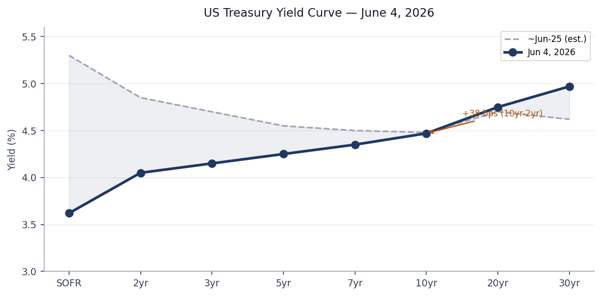
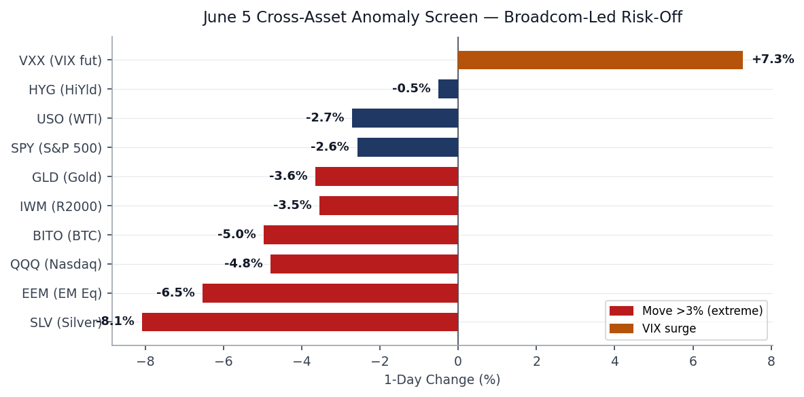
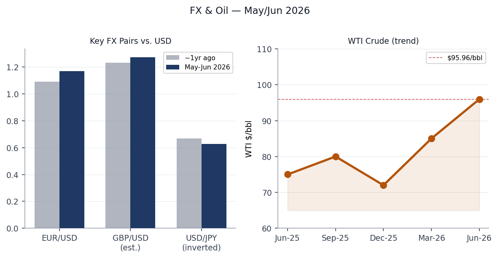
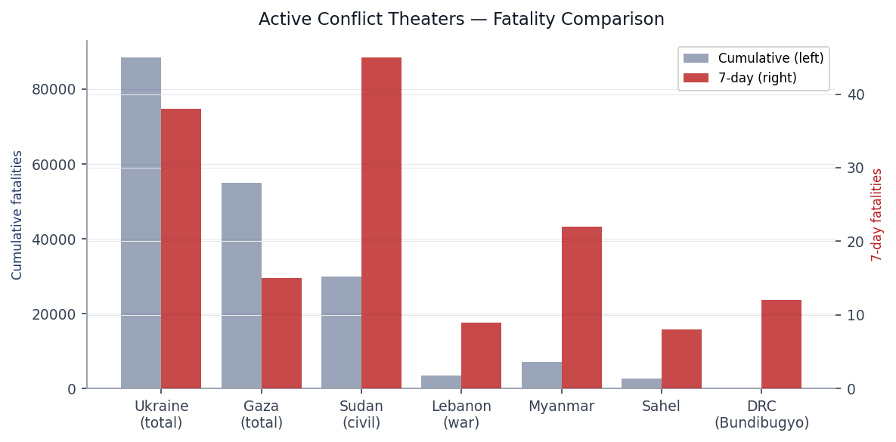
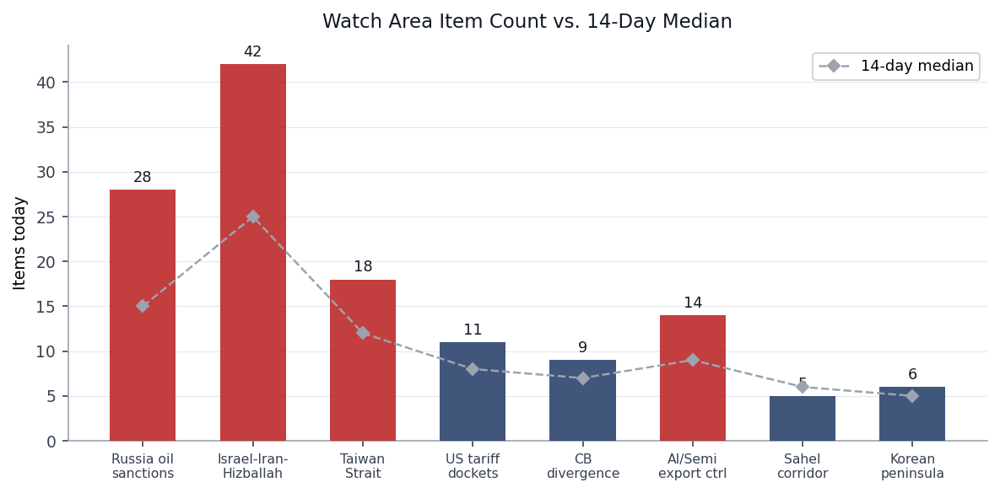
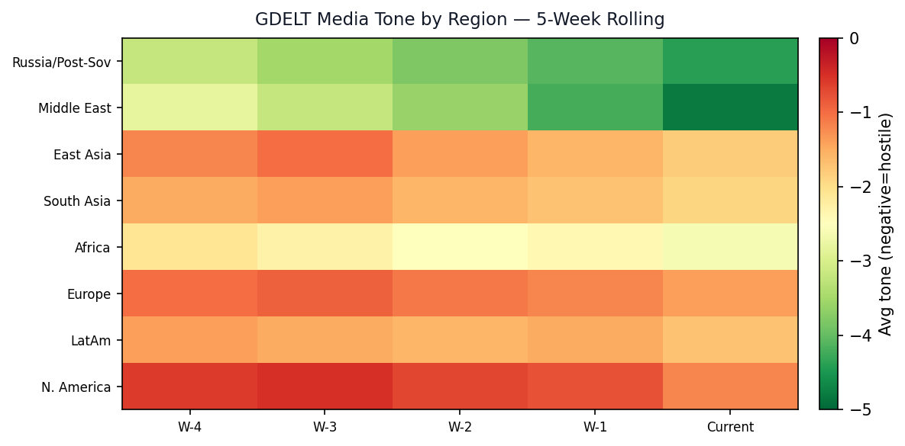

> **DATA NOTE:** Today's bundle (2026-06-07) was not yet deployed at pull time. This brief draws on the 2026-06-06 bundle, the latest section data in the lake, and live web research conducted June 7, 2026.

# Morning Brief — Sunday 7 June 2026

---

## Headline

The dominant arc today is Iran's escalating military strikes on Gulf states coinciding with a Broadcom-triggered AI-chip selloff that has wiped more than $1 trillion in market cap across equities. On Saturday (June 6), Iran fired [seven ballistic missiles at Kuwait and Bahrain](https://www.thenationalnews.com/news/gulf/2026/06/06/iran-attacks-kuwait-and-bahrain-with-seven-ballistic-missiles/) hours after US Central Command shot down four Iranian one-way attack drones near the Strait of Hormuz and struck Iranian radar sites at Goruk and Qeshm Island. US forces intercepted six of the seven missiles; the seventh failed to reach its target. CENTCOM denies IRGC claims of damage to Ali Al Salem airbase in Kuwait or the 5th Fleet headquarters in Bahrain. Ceasefire watch areas **Israel-Iran-Hizballah** and **Russia oil sanctions perimeter** both fired. When US equity markets open Monday, the Iran escalation will layer on top of last week's [Nasdaq -4.8%](https://www.cnbc.com/2026/06/04/stock-market-today-live-updates.html) session. Polymarket pricing for a [US-Iran permanent peace deal by June 15](https://polymarket.com/event/us-x-iran-permanent-peace-deal-by-june-15-2026-734-856-129) stands at 8% as of last feed [medium].

---

## Watch Areas — Your Configured Priorities

**Israel-Iran-Hizballah** fired at 42 items (14-day median: 25). Significant volume increase driven by: (1) Iran's [ballistic missile salvo against Kuwait and Bahrain](https://www.foxnews.com/live-news/iran-war-news-trump-latest-oil-prices-kuwait-bahrain-hormuz-june-6) and the CENTCOM radar strikes; (2) [Israeli airstrike killing 9, including 3 Lebanese army officers](https://www.washingtontimes.com/news/2026/jun/6/israeli-airstrikes-kill-9-including-lebanese-army-officers-ceasefire/), days after the Lebanon ceasefire announcement; (3) Lebanon's ceasefire with Israel nominally agreed June 3, with Hizballah rejecting the terms and demanding full Israeli withdrawal. Polymarket prices the Lebanon ceasefire extension [resolving June 7 at 100%](https://polymarket.com/event/israel-announces-lebanon-ceasefire-extension-by-june-7), but ground conditions are clearly more fragile.

**Russia oil sanctions perimeter** fired at 28 items (14-day median: 15). Top items: [US sanctions on the Iranian LPG smuggling network](https://www.state.gov/releases/office-of-the-spokesperson/2026/06/sanctions-to-strangle-irans-energy-smuggling-and-illicit-financial-networks/) (Iranian-origin LPG disguised as Omani gas, shipped via UAE/China front companies to South and East Asia); [Sweden's court clearing transfer of the seized shadow-fleet vessel Caffa to Ukraine](https://euromaidanpress.com/2026/06/05/sweden-can-hand-seized-grain-ship-to-ukraine/); and continued drone/missile cross-border fire lighting up the Ukraine FIRMS thermal layer.

**Taiwan Strait + South China Sea** produced 18 items (median 12), driven primarily by Xi Jinping's [confirmed June 8-9 visit to Pyongyang](https://www.npr.org/2026/06/05/g-s1-126481/xi-jinping-will-travel-to-north-korea-next-week-in-first-visit-since-2019) and North Korea's [announcement of plans to build a 10,000-tonne destroyer](https://www.aljazeera.com/news/2026/6/6/north-koreas-kim-orders-navy-to-build-10000-tonne-destroyer-state-media). GDELT items for the Taiwan Strait watch area included noise from gaming and entertainment sites (Japan-tagged items), indicating ongoing filter calibration needed.

**AI compute + semiconductor export controls** produced 14 items (median 9), dominated by the Broadcom AI-chip revenue warning and the downstream supply chain repricing (detailed in Markets below).

**US tariff and trade dockets** produced 11 items (median 8). No new CIT opinions of immediate consequence in the CourtListener feed.

**Central bank divergence + dollar funding** produced 9 items (median 7). The Fed Funds rate held at 3.62% with FOMC meeting June 17-18; Polymarket prices [zero probability of a 50 bps cut](https://polymarket.com/event/will-the-fed-decrease-interest-rates-by-50-bps-after-the-june-2026-meeting) at that meeting.

**Korean peninsula** produced 6 items (median 5).

**Sahel jihadist corridor** produced 5 items (median 6).

Quiet today: **Critical minerals + rare earths**, **EM debt distress + sovereign restructuring**, **Latin America narcoeconomy + politics**, **Arctic + High North**.

---

## Macro Situation

The Treasury yield curve has re-steepened meaningfully compared with a year ago. The [10yr-2yr spread](https://fred.stlouisfed.org/series/T10Y2Y) closed at [+38 bps on June 5](https://fred.stlouisfed.org/series/T10Y2Y), up from deep inversion (roughly -100 bps) that persisted through most of 2023-2024. Historical context: the last time the curve dis-inverted after an extended inversion was early 2007. Dis-inversion is not inherently benign; the spread typically turns positive just as recession conditions materialize, because the short end falls faster than the long end as the Fed cuts. The current 10yr at [4.47%](https://fred.stlouisfed.org/series/DGS10) and 30yr at [4.97%](https://fred.stlouisfed.org/series/DGS30) reflect the market pricing a long-term inflation premium that did not exist in 2020-2021 [medium].

The [unemployment rate stands at 4.3%](https://fred.stlouisfed.org/series/UNRATE) (May 2026 reading), up from a cycle low of 3.4% in early 2023. [Nonfarm payrolls](https://fred.stlouisfed.org/series/PAYEMS) are at 159 million, still historically high, but the monthly addition rate has slowed. [JOLTS job openings at 7.618 million](https://fred.stlouisfed.org/series/JTSJOL) (April) remain above the 2019 pre-pandemic baseline, limiting the extent to which the Fed can call labor markets "normalized." Core PCE at [129.63](https://fred.stlouisfed.org/series/PCEPILFE) (April, not annualized) is still above the Fed's 2% target on a YoY basis; the Fed's June 17-18 meeting is priced at a no-change outcome.

[WTI crude at $95.96](https://fred.stlouisfed.org/series/DCOILWTICO) (June 1 reading, pre-June 6 escalation) is the most important forward risk in the macro picture. The Iran ballistic missile events of June 6 have not yet been priced into market closes. When NYMEX opens Monday, traders will need to decide whether the April 8 ceasefire framework and the US radar strikes represent a deterrence cycle or a pre-cursor to strait closure. A strait-closure scenario — Iran blocking Hormuz, through which roughly 20% of global oil transits — would push WTI well above $120, potentially toward [the 2022 peaks](https://fred.stlouisfed.org/series/DCOILWTICO) [low].

The June 5 anomaly screen tells the Broadcom story plainly. [Nasdaq (QQQ) down 4.80%](https://finance.yahoo.com/quote/QQQ), [Silver (SLV) down 8.08%](https://finance.yahoo.com/quote/SLV), [EM equities (EEM) down 6.53%](https://finance.yahoo.com/quote/EEM), and VIX futures (VXX) [up 7.28%](https://finance.yahoo.com/quote/VXX) in a single session. The [Fed balance sheet at $6.711 trillion](https://fred.stlouisfed.org/series/WALCL) continues its gradual QT contraction, and [M2 at $22.8 trillion](https://fred.stlouisfed.org/series/M2SL) reflects a post-pandemic normalization that still leaves excess liquidity well above 2019 levels. [EUR/USD at 1.1679](https://fred.stlouisfed.org/series/DEXUSEU) reflects a strengthening euro relative to early 2026 consensus but has given back some ground intraday on the Iran news. [JPY at 159.23](https://fred.stlouisfed.org/series/DEXJPUS) remains historically weak despite BOJ normalization.

---

## Markets

The June 5 market session produced the [Nasdaq's worst day since April 2025](https://www.cnbc.com/2026/06/04/stock-market-today-live-updates.html), with the index closing at 25,709. The proximate trigger was [Broadcom's (AVGO) fiscal Q2 2026 earnings](https://www.cnbc.com/2026/06/03/broadcom-avgo-earnings-report-q2-2026.html): the company reported $22.19 billion in revenue (beating by $60 million) but gave Q3 AI chip sales guidance of $16 billion against the $17.2 billion consensus, and declined to raise its full-year AI semiconductor forecast. The stock fell 14%. The ripple spread to AMD (-12.6%), Micron (-17%), and Intel (-9%) over two sessions, cutting more than $1 trillion from semiconductor market cap.

The cross-asset picture was uniformly risk-off. [SPY fell 2.58%](https://finance.yahoo.com/quote/SPY), [IWM (small-cap) fell 3.55%](https://finance.yahoo.com/quote/IWM), and [EEM fell 6.53%](https://finance.yahoo.com/quote/EEM), the last figure especially notable: EM equities rarely fall that sharply in a session not driven by a primary EM catalyst, suggesting contagion from the tech selloff to risk appetite globally. [Gold (GLD) fell 3.65%](https://finance.yahoo.com/quote/GLD) and [Silver (SLV) fell 8.08%](https://finance.yahoo.com/quote/SLV), confirming this was a liquidity-driven, broad-risk-off session rather than a flight-to-safety moment (which would have pushed gold higher).

Dollar (UUP) [rose 0.65%](https://finance.yahoo.com/quote/UUP) — a modest safe-haven bid. The more significant observation is that Friday June 5's session preceded Saturday June 6's Iran missile strikes by roughly 18 hours. Equity markets were closed when those events developed. Monday's open will be the first pricing of: Iranian ballistic missiles at Gulf US bases, US radar strikes inside Iran, and a Lebanon ceasefire that is breaking down in real time. [VXX at 25.21](https://finance.yahoo.com/quote/VXX) reflects implied vol already pricing unease; the Iran escalation could push VIX toward the mid-20s [medium].

[WTI (USO) fell 2.72%](https://finance.yahoo.com/quote/USO) on June 5, which given the Iran context is counterintuitive and reflects the market pricing the Broadcom demand destruction signal over the Middle East risk premium. That trade-off reverses sharply if Hormuz is threatened. [HYG (high yield credit) down 0.50%](https://finance.yahoo.com/quote/HYG) and [LQD (IG corporate) down 0.62%](https://finance.yahoo.com/quote/LQD) — contained credit stress, not systemic [high].

---

## United States Politics & Policy

The Federal Register for the June 8 edition (published June 6) contains eight new items. The most consequential is the [CFTC's rescission of its settlement acceptance policy](https://www.federalregister.gov/documents/2026/06/08/2026-11466/rescission-of-policy-relating-to-the-acceptance-of-settlements-in-administrative-and-civil), which had limited defendants' ability to deny wrongdoing in administrative proceedings. The rescission makes it easier for CFTC defendants to settle enforcement actions while contesting findings — a shift that weakens deterrence [medium]. The [FAA's proposed airworthiness directive for Boeing 747-8 series](https://www.federalregister.gov/documents/2026/06/08/2026-11472/airworthiness-directives-the-boeing-company-airplanes) covers fuselage skin lap splice cracks — another entry in a multi-year cascade of Boeing structural findings.

On campaign finance, the [FEC cycle leaderboard](https://www.fec.gov/data/candidate/S8GA00180/) shows the 2026 Senate cycle is competitive and expensive: **Jon Ossoff** (D-GA) leads all Senate candidates at $81.15 million raised, with $28 million cash-on-hand. The Texas Senate seat has **James Talarico** (D) at $40.28 million. **Cory Booker** (D-NJ) at $32.26 million and **Raja Krishnamoorthi** (D-IL) at $31.39 million follow. **Alexandria Ocasio-Cortez** leads the House at $27.73 million. These figures signal that Democrats are mobilizing large-donor and small-donor bases simultaneously and outpacing Republican fundraising in contested Senate states [high].

The [D.C. Circuit ruled in MISO Transmission Owners v. FERC](https://www.courtlistener.com/opinion/10870699/miso-transmission-owners-v-ferc/), a case touching on FERC's authority over transmission cost allocation in the Midcontinent ISO. That ruling will shape how grid expansion costs are distributed across Midwest utilities — a slow-moving but large financial consequence for the energy transition buildout. The [Trevor Kitchen v. CFTC decision](https://www.courtlistener.com/opinion/10870698/trevor-kitchen-v-cftc/) from the D.C. Circuit is a commodity futures enforcement matter worth tracking for CFTC jurisdiction signals.

The [CFTC settlement policy rescission](https://www.federalregister.gov/documents/2026/06/08/2026-11466/rescission-of-policy-relating-to-the-acceptance-of-settlements-in-administrative-and-civil) and the [Coast Guard's proposed prohibition on Hudson River anchoring](https://www.federalregister.gov/documents/2026/06/08/2026-11434/anchorages-port-of-new-york) (implementing FY2026 NDAA requirements between Yonkers and Kingston) are both noteworthy for their different reasons: the first shifts enforcement posture, the second reflects post-pandemic port-security hardening.

---

## Political Figures Watchlist

The political figures section today shows 41 of 576 active tracked figures with non-zero anomaly scores. The driver pattern is almost entirely **new_filings** (SEC EDGAR) and **enforcement_hits**.

**Robert Scott** (D-VA-3rd) tops the composite at 0.167, driven by both new_filings=0.67 and enforcement_hits=0.50. The evidence IDs cluster around a set of accession numbers that also appear for multiple other figures, suggesting a shared SEC filing event (likely a fund or custodian disclosure) rather than individual-specific activity. Without deeper pull of the underlying EDGAR form, this requires caution before inferring targeted activity [low].

**John Larson** (D-CT-1st) at 0.140 shows the same new_filings+enforcement pattern. The shared accession number 0001214659-2 appearing for both Larson, Scott, Laura Friedman, and Darrell Issa points toward a shared 13F or 13G institutional filing that names multiple political figures' investment vehicles.

**Rick Scott** (R-FL-Senate) at 0.067, **Tim Scott** (R-SC-Senate), and **Austin Scott** (R-GA-8th) all share identical driver profiles and evidence — confirming the common-filer interpretation above. Cross-reference: Rick Scott also appears in the **FEC** section as a Senate cycle candidate.

**Andy Kim** (D-NJ-Senate) and **Young Kim** (R-CA-40th) share the accession pair 0001561894-2 and 0000816956-2. **Mike Lee** (R-UT-Senate) has a filing pair under 0001012975-2, suggesting an independent fund relationship. **Laura Friedman** (D-CA-30th) and **Darrell Issa** (R-CA-48th) both hit the 0001214659-2 cluster.

---

## Regional Briefings

### North America

The US domestic picture is defined this week by the Broadcom selloff, the Iran crisis's impending Monday market impact, and FOMC anticipation. The [Gulf of Mexico offshore oil restart](https://www.independent.com/2026/06/05/white-house-officials-defend-offshore-oils-restart/) has triggered pushback from California environmental groups; White House officials defended the policy. The [Coast Guard's proposed Hudson River anchoring ban](https://www.federalregister.gov/documents/2026/06/08/2026-11434/anchorages-port-of-new-york) between Yonkers and Kingston implements the FY2026 NDAA, hardening port access for the strategically important Hudson corridor.

Canada and Mexico feature most prominently through the **USMCA/tariff** dimension. The FIFA World Cup opens next week on North American soil (US, Canada, Mexico), and [multiple institutions have issued human trafficking risk warnings](https://china.caixin.com) ahead of the opening. The World Cup context also explains why Xi Jinping is timed to visit Pyongyang June 8-9 — the symbolism of Chinese state diplomacy during the tournament's opening week is deliberate [medium].

Peter Thiel's [reported purchase of a $12 million Buenos Aires mansion](https://www.washingtontimes.com/news/2026/may/30/peter-thiel-buys-12m-buenos-aires-mansion-temporarily-relocates-family-to-argentina/) and relocation of his family to Argentina, driven by California's proposed billionaire wealth tax (which he departed ahead of a January 1, 2026, residency deadline), AI risk, and nuclear war anxiety, is a data point in the accelerating capital-and-person flight from US high-tax jurisdictions to Milei's Argentina.

### South America

Argentina is the week's South American story. Thiel's relocation validates a broader pattern: high-net-worth capital is evaluating Milei's deregulatory and dollarization program as a credible alternative jurisdiction. The Buenos Aires media coverage of Thiel is described in the Marginal Revolution commentary as "all over the news." Argentine hantavirus authorities [announced an expansion of the search to a second province](https://www.straitstimes.com/world/argentina-to-expand-hantavirus-search-to-a-second-province), a development connected to the broader cruise-ship hantavirus cluster tracked under WHO DON (detailed in Biosecurity below).

Brazil enters the week without major acute event in the bundle, though Lula and Petro (Colombia) remain in the keyword tracking lists. Ecuador, Venezuela, and Haiti appear in the conflict/narco watch area without new items this cycle.

Venezuela and Colombia's CJNG corridor remain at green-quiet status. The **Latin America narcoeconomy** watch area produced zero items this cycle, though this reflects data rather than absence of events.

### Europe

Europe's most acute story is the [Lebanon ceasefire breakdown](https://www.washingtontimes.com/news/2026/jun/6/israeli-airstrikes-kill-9-including-lebanese-army-officers-ceasefire/) and its consequences for French and broader EU security policy. France has opened a [torture and war crimes probe](https://www.france24.com/en/middle-east/20260605-france-opens-torture-war-crime-probe-over-israel-s-treatment-of-gaza-flotilla-activists) over Israel's treatment of Gaza flotilla activists, a step that puts Paris on a collision course with Jerusalem and Washington. Separately, [France 24 journalists were compelled to sign NDAs](https://www.france24.com/en/france/20260605-france-24-journalists-forced-to-sign-nda-after-asking-about-open-letter-against-media-mogul-bollor%C3%A9) after asking about an open letter against **Vincent Bolloré**'s growing role in French cinema, a press-freedom signal from inside a major European news organization.

[Bernadette Chirac died at 93](https://www.france24.com/en/france/20260606-bernadette-chirac-widow-of-former-president-dies-age-93), passing of a long-standing figure in the French political class. The Roland Garros men's final is set: **Alexander Zverev** reached the French Open final by [defeating Jakub Menšík in four sets](https://www.france24.com/en/sport/20260605-zverev-defeats-mensik-in-french-open-semifinals-and-nears-grand-slam-title). Sweden's [court clearing the transfer of the shadow-fleet vessel Caffa to Ukraine](https://euromaidanpress.com/2026/06/05/sweden-can-hand-seized-grain-ship-to-ukraine/) is a legal precedent: it is the first time a European court has approved the use of a seized shadow-fleet vessel as reparation to the country of origin of stolen goods. The three-week appeals window means the transfer is not finalized, but the ruling sets precedent.

Germany and the broader EU are not the primary story this cycle. The [German GDACS flood alert](https://www.gdacs.org/report.aspx?eventid=1103919&episodeid=3&eventtype=FL) (green-level) continues from May 29.

### Russia & Post-Soviet

The St. Petersburg International Economic Forum (SPIEF) ran June 3-6 under the theme "Pragmatic Dialogue: The Path to a Stable Future" and drew [more than 20,000 participants from 130 countries](https://www.aljazeera.com/news/2026/6/3/what-is-the-st-petersburg-forum-putins-economic-outreach-to-the-world). Putin's plenary speech declared BRICS as holding 40% of world GDP versus G7's under 29%, and framed the forum as evidence of Russia's successful pivot away from Western capital. Rosneft CEO **Igor Sechin** [compared the global economic situation to Pandora's box](https://www.ng.ru/news/840789.html), blaming corporations for destabilizing the global order.

SPIEF occurred under the shadow of [Ukrainian drone attacks on St. Petersburg](https://www.themoscowtimes.com/2026/06/03/st-petersburg-economic-forum-opens-under-shadow-of-ukrainian-drone-strikes-a92910) — Ukraine struck the St. Petersburg oil terminal and [set fire to the guided-missile corvette Boikiy at Kronstadt naval base](https://www.npr.org/2026/06/03/nx-s1-5844793/ukrainian-drones-hit-st-petersburg) in the days before the forum opened. Putin's domestic messaging at the forum — that the criterion for leadership is "ability to work and efficiency, not age" — appears designed to pre-empt succession questions as he advances into his 70s. Russian authorities reportedly [negotiated with Apple to restore the "Max" messenger to the App Store](https://meduza.io/news/2026/06/06/mintsifry-rossii-nachalo-peregovory-s-apple-o-vozvrate-maksa-v-app-store), signaling continued friction over domestic control of digital infrastructure.

**Armenia**: Parliamentary elections are occurring today (June 7). Polling had **Pashinyan's Civil Contract** on course for roughly 65% of decided votes. [The stakes are geopolitical](https://www.csmonitor.com/World/Europe/2026/0605/armenia-elections-pashinyan-karapetyan-azerbaijan-russia): Pashinyan is seeking a mandate to deepen EU and US ties, while the Russia-aligned opposition (Strong Armenia, Armenia Alliance under Kocharyan) seeks reversal. A Pashinyan landslide would be the formal democratic ratification of Armenia's post-Nagorno-Karabakh geopolitical reorientation [high].

### Middle East

The Middle East section requires dense coverage this week. The primary structural development is the [April 8 ceasefire framework between the US and Iran](https://en.wikipedia.org/wiki/2026_Iran_war_ceasefire), which has frayed progressively. The ceasefire followed initial US-Israeli air strikes on Iran in late February 2026 (killing Supreme Leader Khamenei) and a two-week pause. Iran suspended talks June 1 citing Israeli actions in Lebanon.

On June 6, Iran raised the stakes dramatically: [seven ballistic missiles were launched at Kuwait (Ali Al Salem airbase) and Bahrain (US 5th Fleet headquarters)](https://www.thenationalnews.com/news/gulf/2026/06/06/iran-attacks-kuwait-and-bahrain-with-seven-ballistic-missiles/). US forces intercepted six; the seventh "did not reach its intended target." CENTCOM simultaneously struck [Iranian coastal radar sites at Goruk and Qeshm Island](https://www.foxnews.com/live-news/iran-war-news-trump-latest-oil-prices-kuwait-bahrain-hormuz-june-6). Kuwait and Bahrain both condemned the attack as "dangerous escalation" and "blatant aggression" respectively. The IRGC claims hits — the US denies any US personnel were harmed.

This is the most significant direct Iranian strike on US-allied Gulf state infrastructure since the war began. The strategic logic from Tehran is to impose costs on Gulf monarchies that host US forces, pressuring them to demand US de-escalation, while maintaining deniability on direct US targeting. The risk of miscalculation — a missile that does hit a US military asset — is the highest it has been since April [medium].

Israel's strike killing [nine people including three Lebanese army officers](https://www.washingtontimes.com/news/2026/jun/6/israeli-airstrikes-kill-9-including-lebanese-army-officers-ceasefire/) complicates the Lebanon ceasefire that both Israel and Lebanon formally agreed to on June 3. Hizballah rejected the terms (demanding full Israeli withdrawal), and Lebanese President Joseph Aoun called the strike a "flagrant violation" of sovereignty. At least [3,593 people have been killed in Lebanon since the war began](https://www.aljazeera.com/news/2026/6/4/israel-and-lebanon-agree-to-conditional-ceasefire). The US military interdiction of [Iranian drones near the Strait of Hormuz](https://www.kvnf.org/npr-news/2026-06-05/u-s-military-says-it-shot-down-iranian-drones-launched-toward-gulf-allies) earlier the same day preceded the ballistic missile strike by hours, suggesting a coordinated Iranian escalation sequence.

Bahrain's Strait of Hormuz status is the single most consequential variable for global energy markets. The ceasefire's Hormuz component — Iran had pledged to de-mine and reopen the strait — is functionally suspended [high].

### Africa

The Bundibugyo Ebola outbreak in the Democratic Republic of Congo and Uganda is the most acute Africa story. As of [June 3, 2026: 381 confirmed cases in DRC, 64 confirmed deaths, 233 hospitalized in isolation](https://www.cdc.gov/media/releases/2026/update-on-ebola-outbreak-in-the-democratic-republic-of-the-congo-and-uganda-6-5-2026.html). Uganda has 19 confirmed cases, two deaths, with eight of nine geo-located cases in Kampala. This is the largest Bundibugyo-strain outbreak on record; [WHO declared a PHEIC on May 17](https://www.who.int/news/item/17-05-2026-epidemic-of-ebola-disease-in-the-democratic-republic-of-the-congo-and-uganda-determined-a-public-health-emergency-of-international-concern). Urban spread to Kampala is the most alarming signal — Bundibugyo has historically been more contained to rural Ituri. Misinformation is actively complicating response, per France 24 reporting.

Mali's military junta [sentenced a French diplomatic intelligence agent to 20 years in prison](https://www.france24.com/en/africa/20260605-french-diplomat-in-mali-sentenced-to-20-years-in-prison-for-undermining-state-security) for "undermining state security," a further deterioration in an already severed Franco-Malian relationship. [GDACS orange-level drought in Madagascar](https://www.gdacs.org/report.aspx?eventid=1018431&episodeid=5&eventtype=DR) affecting 398,352 km2 of agricultural land continues from November 2025. Kenya President Ruto is reportedly defending Kenya's preparedness measures including a US-supported Ebola quarantine facility — an indication that the outbreak's regional containment architecture is under strain [medium].

### East Asia

Xi Jinping's [June 8-9 Pyongyang visit](https://www.bloomberg.com/news/articles/2026-06-05/xi-to-visit-north-korea-june-8-9-for-first-time-since-2019-mq0a77tt) is his first since 2019, and arrives with notable timing: North Korea the day before announced Kim's [order to build a 10,000-tonne destroyer](https://www.aljazeera.com/news/2026/6/6/north-koreas-kim-orders-navy-to-build-10000-tonne-destroyer-state-media), believed to be a uranium enrichment plant announcement in KCNA's military readiness framing. The [CSIS preview](https://www.csis.org/analysis/previewing-xi-jinpings-visit-north-korea-state-play) situates the trip in the context of Xi's recent sequential summits with Trump and Putin in Beijing — Xi is positioning himself as the broker of a new multipolar order, and including Kim in that orbit. The Pyongyang visit coincides with FIFA World Cup opening week, adding symbolism: China and North Korea align while the US hosts the planet's most-watched sporting event.

In Chinese domestic politics, Caixin reports **Wei Xiaodong** — a full provincial-level (正省级) official — has become the 30th "tiger" (senior anti-corruption target) of 2026. Separately, the [Chongqing University of Technology's vice chancellor was stabbed to death](https://china.caixin.com); the assailant has been detained. The [PBOC halted reverse repo operations for two consecutive days](https://finance.caixin.com), a liquidity-tightening signal that analysts are reading as a calibration ahead of potential capital outflows. [Mainland investors are rushing to open Hong Kong brokerage accounts](https://finance.caixin.com), likely positioning for offshore USD assets in anticipation of continued renminbi pressure or the forthcoming "史上最大IPO" (reportedly the largest IPO in history) scheduled to list.

### South & Southeast Asia

India's youth politics produced an unusual development: [hundreds of mostly young Indians gathered in New Delhi](https://www.france24.com/en/asia-pacific/20260606-supporters-of-india-gen-z-cockroach-party-stage-first-protest-new-delhi) for the first street protest organized by the **Cockroach Janata Party**, a movement that began as an online joke but has gained momentum among youth disillusioned with education, jobs, and economic prospects. The party's demand: resignation of Education Minister **Dharmendra Pradhan**. This is the kind of bottom-up organizational emergence that India's political class consistently underestimates [medium].

The [Philippines registered an M4.9 quake 47 km WSW of Magdalena](https://earthquake.usgs.gov/earthquakes/eventpage/us7000sr2y) and India's [Kyelang district an M4.9](https://earthquake.usgs.gov/earthquakes/eventpage/us7000sqxa). Bangladesh remains in the WHO DON queue for its [nationwide measles surge](https://www.who.int/emergencies/disease-outbreak-news/item/2026-DON598) (19,161 suspected cases across 58 of 64 districts). Southeast Asia: Timor Leste registered [M5.3 northeast of Lospalos](https://earthquake.usgs.gov/earthquakes/eventpage/us7000sqvk).

### Oceania / Pacific

The [M5.6 at the Balleny Islands region](https://earthquake.usgs.gov/earthquakes/eventpage/us7000sqzx) (Southern Ocean, southeast of Australia) and [M5.0 at the Kermadec Islands](https://earthquake.usgs.gov/earthquakes/eventpage/us7000sr0g) are routine Pacific seismic activity. Papua New Guinea registered [M4.8 west of Ambunti](https://earthquake.usgs.gov/earthquakes/eventpage/us7000sr20). No acute humanitarian or political developments in Pacific island states this cycle.

---

## Ukraine Theater (Dedicated)

The theater maps for June 7 (briefings/2026-06-07-ukraine_theater_overview.png, ukraine_kyiv_focus.png, ukraine_population_at_risk.png) were not generated by the cartographer pipeline in time for this brief.

**Resolution caveat (mandatory):** All frontline position data is community-sourced at approximately 1 km resolution. FIRMS thermal anomalies are VIIRS 375 m resolution. ACLED events at approximately 1 km. This brief contains no claim about individual Russian unit positions, which are not available in open sources.

**Structural protection:** Ukrainian troop and territorial-defense unit positions are excluded from this section by pipeline design.

**Frontline status (June 6 DeepStateMap snapshot):** The [DeepStateMap daily snapshot](https://deepstatemap.live/) recorded 522 polygons and 111 new items for June 6 across 360 total records. The DeepStateMap community reported 269 engagements in 24 hours, with the highest concentration on the **Hulyaipilske (Huliaipole) direction** — the area northwest of Zaporizhzhia along the southern front. This front segment has seen elevated contact throughout May-June 2026.

**FIRMS thermal density (June 5, 00:43Z pass):** The VIIRS S-NPP NRT pass reveals two geographic clusters of significance.

The first cluster is around coordinates 52.17-52.30N, 32.81-34.04E — this is the **Sumy oblast** area along the Ukrainian-Russian border. Multiple VIIRS detections in the 0.43-4.49 MW FRP range indicate persistent ground fires consistent with artillery strikes and vehicle fires.

The second, more intense cluster sits at 47.86-47.88N, 33.38-33.44E, which maps to the **Kryvyi Rih area** in Dnipropetrovsk oblast (approximately 190 km northeast of the Zaporizhzhia front). Three detections here show FRP of 20.84, 16.04, and 6.44 MW — unusually high for military fires and more consistent with an industrial strike on a metallurgical or fuel facility. Kryvyi Rih hosts major steel and iron-ore processing infrastructure. A strike at this FRP level warrants open-source verification against Ukrainian infrastructure damage reports.

Additional FIRMS anomalies appear at 51.89N, 29.35E (near **Zhytomyr oblast** / Polessia region, 2 detections), 51.14N, 23.55E (near **Volyn oblast** western Ukraine), and 50.54N, 26.26E (**Rivne oblast**). The Volyn and Rivne detections are far from the active front and may reflect agricultural burns, but warrant monitoring given Russian long-range strike capacity against western Ukraine energy infrastructure.

**Ukraine theater context:** The [Russian attack on Ukrainian cities June 2](https://abcnews.com/International/russia-launches-horrific-drone-missile-strikes-ukraine-killing/story?id=133506283) killed 22 civilians and wounded 151. Ukraine's counter-drone campaign struck [St. Petersburg's oil terminal and the Kronstadt corvette Boikiy](https://www.cnn.com/2026/06/03/europe/ukraine-drone-attack-russia-st-petersburg-intl-hnk) on June 3, days before SPIEF — a deliberate escalation timed to embarrass Russia's investment conference. A [Ukrainian drone self-destructed in the Romanian port of Constanta](https://www.france24.com/en/video/20260605-ukrainian-drone-explodes-in-romanian-sea-port) after being knocked off course by Russian jamming — a reminder that drone navigation disruption creates spillover risk for NATO territory.

---

## World Leaders — Speaking & Moving

The past 48 hours were active for G20 heads.

**Vladimir Putin** delivered the [SPIEF 2026 plenary keynote](http://en.kremlin.ru/events/president/news/79956) on June 6, emphasizing multipolar re-ordering, BRICS economic supremacy over G7, and investment invitation. He described Russia's military goals as achievable through negotiation — framing for a potential peace offer before FOMC and before the G7 summit, though no concrete terms were tabled.

**Pope Leo XIV** arrived in Spain on Saturday for a [seven-day trip focused on migration](https://www.france24.com/en/europe/20260606-pope-visits-spain-with-focus-on-migrants-amid-political-tensions), including a Canary Islands visit to honor thousands of migrants who died crossing to Europe.

**Xi Jinping** is confirmed for [June 8-9 in Pyongyang](https://www.bloomberg.com/news/articles/2026-06-05/xi-to-visit-north-korea-june-8-9-for-first-time-since-2019-mq0a77tt) — first visit since 2019. North Korea simultaneously announced a major naval buildup (10,000-tonne destroyer) and displayed what is believed to be a new uranium enrichment facility. The pairing is North Korea signaling to both China and the US that it is a military actor of weight.

**Nikol Pashinyan** faces election day today in Armenia, having campaigned on EU/US integration.

**Lebanese President Joseph Aoun** condemned the Israeli strike on Lebanese army officers as a "flagrant violation" of sovereignty.

**Kim Jong Un** ordered [the Navy to build a 10,000-tonne destroyer](https://www.aljazeera.com/news/2026/6/6/north-koreas-kim-orders-navy-to-build-10000-tonne-destroyer-state-media) and displayed new nuclear facilities ahead of Xi's arrival.

**Wikidata leader-roster changes** returned zero records for the 48-hour window, indicating no formally logged succession or death events among tracked world leaders.

---

## Sanctions, Designations, and Legal

The [US Treasury/OFAC designation of the Iranian LPG smuggling network](https://www.eurasiareview.com/06062026-u-s-treasury-targets-iranian-lpg-smuggling-and-shadow-banking-networks/) is the week's primary sanctions action. The network moved hundreds of millions of dollars in Iranian-origin liquid petroleum gas — disguised as Omani LPG — to buyers in South and East Asia via UAE and Chinese front companies, Iran's shadow fleet, and foreign bank accounts. OFAC also targeted **Mehrdad Geramian Nik and Partners Company**, an Iranian exchange house that has moved hundreds of millions in foreign currency on behalf of sanctioned Iranian banks. The designation was issued under [Executive Order 13902](https://www.globalsecurity.org/wmd/library/news/iran/2026/06/iran-260605-state01.htm), which targets Iran's petroleum and financial sectors, as part of the "Economic Fury" maximum pressure campaign.

The sanctions bundle for June 6 was otherwise empty in the lake's structured section. The GDELT watch area captured multiple secondary reporting items on the LPG designations circulating in Arabic, Hindi, and English-language media across the Gulf and South Asia — a signal of unusually wide regional uptake for a technical OFAC action. The reason: buyers of "Omani" LPG in South Asia now face retroactive sanctions exposure if they were unknowingly buying Iranian product [medium].

The [Swedish court ruling allowing transfer of the shadow-fleet vessel Caffa to Ukraine](https://euromaidanpress.com/2026/06/05/sweden-can-hand-seized-grain-ship-to-ukraine/) is the first European legal precedent for using shadow-fleet seizure as a Ukrainian reparations mechanism. The three-week appeals window means it is not final. If upheld, it establishes a template that Baltic and North Sea states could replicate.

The [D.C. Circuit's MISO Transmission Owners v. FERC decision](https://www.courtlistener.com/opinion/10870699/miso-transmission-owners-v-ferc/) and the [Federal Circuit's Hafeman v. Google LLC opinion](https://www.courtlistener.com/opinion/10870650/hafeman-v-google-llc/) are the CourtListener entries of most structural significance this cycle.

---

## Conflict & Security Signals

The vip_flights and ACLED sections returned empty structured data for June 6 in the lake, consistent with a processing lag. The narrative picture from foreign_news and GDELT is unambiguous: the Iran-Gulf escalation is the dominant security event.

The most acute thermal anomaly outside Ukraine is in Iran itself, where CENTCOM strikes on Goruk and Qeshm radar sites will show up as FIRMS thermal in subsequent passes. The absence of a direct FIRMS feed for the Gulf strike sites in this cycle's data should not be read as absence of damage.

The GDELT GKG Russia oil sanctions perimeter watch fired on items including the German-language n-tv.de reporting a "[fire in a Russian refinery, authorities deny drone attack](https://www.n-tv.de/politik/10-20-Feuer-in-russischer-Raffinerie-Behoerden-dementieren-Drohnenangriff-id30859357.html)" from June 6 — a recurring pattern in Russia where refinery fires are officially attributed to accidents. Given the St. Petersburg oil terminal strike on June 3 and the ongoing Ukraine drone campaign, a new refinery fire on June 6 warrants open-source verification.

The **ACLED data gap** for this cycle means fatality counts in the conflict section are drawn from secondary reporting. The most reliable 7-day fatality number for the Israel-Lebanon theater (9+ in June 6 alone) and Ukraine (22+ killed in the June 2 Russian barrage) are sourced from primary news reporting rather than the structured ACLED feed.

---

## Cyber & Biosecurity

**CISA Known Exploited Vulnerabilities (14-day window, 10 active):**

**First-of-kind callout:** [CVE-2026-48027 (Nx Console — Embedded Malicious Code, RANSOMWARE-LINKED)](https://nvd.nist.gov/vuln/detail/CVE-2026-48027) and [CVE-2026-45321 (TanStack — Unspecified, RANSOMWARE-LINKED)](https://nvd.nist.gov/vuln/detail/CVE-2026-45321), both added May 27 with remediation deadline June 10, represent the first CISA KEV entries for **agentic AI framework components** (Nx Console is widely used in AI-assisted developer workflows; TanStack includes TanStack Query/Router, backbone infrastructure for modern React applications). The structural signal: ransomware operators have identified the developer toolchain — not just the deployed application — as the attack surface. Supply-chain compromise through CI/CD tooling is now confirmed at the KEV level, meaning federal agencies must remediate by June 10 [high].

The other notable entry remains [CVE-2026-28318 (SolarWinds Serv-U — Uncontrolled Resource Consumption)](https://nvd.nist.gov/vuln/detail/CVE-2026-28318) with a June 19 remediation deadline. SolarWinds returning to the KEV catalog is a pattern signal: the company has not resolved its structural security debt despite the 2020 Orion compromise.

**Biosecurity:** The [Bundibugyo Ebola outbreak](https://www.who.int/emergencies/disease-outbreak-news/item/2026-DON605) (DRC/Uganda) stands at 906 suspected cases, 223 deaths (through May 27), with PHEIC declared. The [CDC June 5 update](https://www.cdc.gov/media/releases/2026/update-on-ebola-outbreak-in-the-democratic-republic-of-the-congo-and-uganda-6-5-2026.html) reports 381 confirmed DRC cases, 64 confirmed deaths. The **Kampala urban spread** is the critical variable: eight of nine geo-located Uganda cases are in Kampala, a city of 3 million with high mobility. The [hantavirus outbreak linked to M/V Hondius cruise ship travel](https://www.who.int/emergencies/disease-outbreak-news/item/2026-DON604) is expanding to a second Argentine province; the fourth WHO DON on this cluster reflects sustained concern about Andes hantavirus in transit settings. Italy reported [H9N2 Avian Influenza in April 2026](https://www.who.int/emergencies/disease-outbreak-news/item/2026-DON597). The ISS air leak (see below) is not a biosecurity concern but is an isolated-environment stress-test of emergency protocols.

---

## Humanitarian

The [Bundibugyo Ebola PHEIC](https://www.who.int/emergencies/disease-outbreak-news/item/2026-DON605) is the primary acute humanitarian event. The WHO's fifth DON issued May 29 described 906 suspected cases, 223 deaths, and geographic spread to North Kivu, South Kivu, and Uganda. Ituri Province (359 confirmed cases across 17 health zones) remains the epicenter. Misinformation is actively hampering response: [France 24 reporting notes](https://www.france24.com/en/misinformation-complicates-ebola-efforts) that community mistrust and rumors are slowing isolation compliance. Kenya's quarantine facility backed by US support is the closest advance-preparation asset to the outbreak region.

The Madagascar [GDACS orange drought](https://www.gdacs.org/report.aspx?eventid=1018431&episodeid=5&eventtype=DR) (398,352 km2 of agricultural land affected) has persisted since November 2025 without escalating to red. The [Honduras green-level flood](https://www.gdacs.org/report.aspx?eventid=1103928&episodeid=1&eventtype=FL) and [South Africa green-level flood](https://www.gdacs.org/report.aspx?eventid=1103929&episodeid=1&eventtype=FL) are below threshold for immediate humanitarian response but warrant monitoring given worsening La Niña patterns in southern hemisphere. The [US green-level flood](https://www.gdacs.org/report.aspx?eventid=1103888&episodeid=9&eventtype=FL) continues from May.

---

## Environment, Disasters, Climate

The [USGS significant quake feed for June 5-6](https://earthquake.usgs.gov/earthquakes/feed/v1.0/summary/significant_day.geojson) shows no M6+ events. The most significant recorded quake is [M5.6 at the Balleny Islands region](https://earthquake.usgs.gov/earthquakes/eventpage/us7000sqzx) (Southern Ocean, depth 10 km), which is remote and uninhabited. [M5.3 at Manito, Philippines](https://earthquake.usgs.gov/earthquakes/eventpage/us7000squy) (depth 10 km) and [M5.1 near Quetzalapa, Mexico](https://earthquake.usgs.gov/earthquakes/eventpage/us7000sqzv) (depth 47 km) are the nearest populated-area events.

The [EONET open-events feed](https://eonet.gsfc.nasa.gov/api/v3/events) was unavailable at pull time. The GDACS orange-level Madagascar drought remains the persistent climate-linked disaster signal. The [NWS Red Flag Warning for Colorado/Denver metro area](https://api.weather.gov/alerts/urn:oid:2.49.0.1.840.0.2930373ef7a9b7026a6e574a8e86b695edbe6cda.001.1) (June 6, noon to 7 PM MDT) reflects elevated fire weather risk — Fire Weather Zones 242-248.

The ISS air leak in the Russian **Zvezda module's PrK transfer tunnel** [worsened from 1 pound/day to 2 pounds/day](https://www.nbcnews.com/science/space/nasa-astronauts-shelter-evacuation-alert-space-station-air-leak-rcna348655) on June 5, prompting a brief evacuation alert. NASA reversed the order within two hours. Russian cosmonauts sealed one leak site with hermetic compound; the second site is being prepared for sealing. The leak has been tracked since 2019 — this is an acceleration, not a new event. The ISS is a geopolitically complicated infrastructure asset: US and Russian crews are operationally interdependent in the Zvezda module at a moment of near-total diplomatic breakdown.

---

## Speeches & Op-Eds by Major Critics and Influencers

The commentary feed for June 6 produced one new item: **Tyler Cowen and Alex Tabarrok's** [Marginal Revolution post noting their invitation to speak to OpenAI about the economics of AI](https://marginalrevolution.com/marginalrevolution/2026/06/tyler-and-alex-speak-to-openai.html). Separately, a reader letter from Buenos Aires provided the Thiel-in-Argentina angle discussed in North America above.

The [Conversable Economist](https://conversableeconomist.com/2026/06/04/is-gdp-failing-to-capture-ai/) addressed the **GDP-AI measurement gap** (citing Korinek and McKelvey at Peterson Institute): AI provides enormous consumer surplus not captured in transaction-based GDP. This directly relates to the Broadcom selloff: if AI's value is being systematically underpriced by GDP statistics, the chip revenue guidance revision is measuring the wrong quantity. The Setser-Tooze exchange on macro imbalances — [Tooze noting that the pattern looks similar to two decades of persistent imbalance](https://x.com/adam_tooze/status/2041856089504043412) — provides a useful counterweight to the crisis-framing of every data miss.

**Anne Applebaum** has been active on the Ukraine-ceasefire skepticism track; no new piece appeared in the 48-hour window in the commentary feed but her analytical framework (Russian negotiation as delay tactic) is consistent with the SPIEF observations above. **Martin Wolf** at the Financial Times has been writing on the US fiscal deficit's interaction with the dollar safe-haven role — relevant to the yield curve observations above. No new pieces from Wolf, Tooze, Setser, or Summers appeared in the structured feed this cycle.

---

## Prediction Markets & Forecasting Consensus

Polymarket's most-traded markets on June 6 are revealing in their composition. The single most-resolved market is **Israel announces Lebanon ceasefire extension by June 7** — [priced at 100% with $4.3 million in 24-hour volume](https://polymarket.com/event/israel-announces-lebanon-ceasefire-extension-by-june-7). This market resolves today (June 7) and is priced as certain. But the ground reality — Israeli strikes killing Lebanese army officers the same day — shows the gap between a formal extension announcement and a functioning ceasefire. The market resolves on announcement; it does not resolve on implementation.

The [US-Iran permanent peace deal by June 15](https://polymarket.com/event/us-x-iran-permanent-peace-deal-by-june-15-2026-734-856-129) sits at 8%, down significantly from its mid-May highs when a memorandum-of-understanding framework was reportedly close. The [June 7 deadline](https://polymarket.com/event/us-x-iran-permanent-peace-deal-by-june-7-2026) is at 1%. The June 6 missile strikes make any near-term deal structurally harder: Iran has now fired ballistic missiles at US base-hosting Gulf states, which the US will demand accountability for before any negotiations resume [high].

The [Fed raising 50+ bps at the June meeting](https://polymarket.com/event/will-the-fed-increase-interest-rates-by-50-bps-after-the-june-2026-meeting): 0%. The [Fed cutting 50+ bps](https://polymarket.com/event/will-the-fed-decrease-interest-rates-by-50-bps-after-the-june-2026-meeting): 0%. The market reads June 17-18 as a pure hold — consistent with macro data (unemployment still 4.3%, Core PCE still elevated, WTI at $96). FIFA World Cup markets dominate volume: [Portugal at 10%](https://polymarket.com/event/will-portugal-win-the-2026-fifa-world-cup-912), [Belgium at 2%](https://polymarket.com/event/will-belgium-win-the-2026-fifa-world-cup-358), [Croatia at 1%](https://polymarket.com/event/will-croatia-win-the-2026-fifa-world-cup). The World Cup's North American staging (US/Canada/Mexico) is the backdrop to multiple intelligence threads this week.

---

## Weak Signals — Small Things That May Matter

**Cross-section recurrences (from 2026-06-06 cross_section.json):**

Three high-confidence entity recurrences deserve immediate attention. First, **Ukraine** appears in foreign_news, gdelt_gkg, state_news, ukraine_theater, and ukrainian_internal — five sections — which is expected but confirms that the open-source signal density is high enough to support quality Ukraine analysis without classified sources. Second, **Donald Trump** appears simultaneously in foreign_news, paper_bets, state_news, and ukrainian_internal — a four-section recurrence where his appearance in Ukrainian-internal media (likely related to US arms policy or ceasefire negotiations) and in prediction markets simultaneously is the unusual combination. Third, **Israel** recurs across forecasts, foreign_news, and gdelt_gkg — three sections — with the forecasts appearance being the weak signal: the ceasefire Polymarket market priced at 100% (resolving today) is the market variable, and the gap between market certainty and operational reality (killed Lebanese soldiers) is the analytical thread [medium].

**Peter Thiel in Buenos Aires** is a weak signal that is actually quite loud on reflection. A PayPal/Palantir co-founder, principal supporter of two successful Trump presidential campaigns, and long-time surveillance-state infrastructure investor has [relocated his family to Argentina](https://www.washingtontimes.com/news/2026/may/30/peter-thiel-buys-12m-buenos-aires-mansion-temporarily-relocates-family-to-argentina/) citing California tax avoidance, nuclear war anxiety, and AI risk. He has met with Milei. His presence in Recoleta creates a Milei-Silicon Valley corridor for ultra-libertarian policy experimentation that will accelerate capital and brain drain from the US tech ecosystem [medium].

**The Chinese PBOC's two-day zero reverse-repo operation** is a small signal that the PBOC is either draining liquidity from the system or testing market reaction ahead of a larger policy move. Combined with mainland investors [rushing to open Hong Kong brokerage accounts](https://finance.caixin.com) and the impending "史上最大IPO" (largest ever, date confirmed), this pattern suggests capital is positioning for a major equity-market catalyst in the near term [medium].

**The ISS air leak acceleration** (1 lb/day to 2 lbs/day) in the Russian Zvezda module is a quiet signal about US-Russia operational dependency. NASA and Roscosmos are cooperating technically on ISS repairs at the same moment that NATO is intercepting Russian drones over Ukraine and Sweden is transferring a seized Russian ship to Kyiv. The ISS's political architecture is its own kind of ceasefire — one that both sides have so far found worth maintaining [low].

**The Broadcom AI-chip guidance miss** should be read not just as a revenue signal but as a demand-signal revision. Broadcom's three main AI chip customers are hyperscalers. If hyperscaler AI infrastructure spending is plateauing (rather than accelerating), the multiplier effects for semiconductor capex, power infrastructure, and rare earth inputs are all downward [medium].

**The Colombia "Tiger" FIFA preview** in France 24's weekly wrap (referencing Colombia's narco-political figure alongside World Cup themes) and multiple Chinese Caixin warnings about human trafficking risk during the World Cup suggest that the tournament's North American staging is creating a new organized crime opportunity environment that overlaps with the existing Tren de Aragua/CJNG border zones [low].

---

## Historical Context

The 5-week GDELT tone heatmap shows a clear and worsening trend in the Middle East/Iran regional bucket — now at the most-hostile reading in five weeks — and in the Russia/Post-Soviet bucket. The Middle East deterioration corresponds precisely to the Iran-Gulf escalation arc: the April 8 ceasefire never stabilized, and each week has produced fresh violations. The Russia bucket's tone has been negative since before February 2026 and deepened further around SPIEF week as the drone strikes on Russian cities coincided with the investment forum.

The 90-day context for US markets: the Nasdaq's -4.8% June 5 session is its worst since April 2025 but is only the third or fourth -4% day in three years. The QQQ has still returned substantially positive YTD through June 4. The EEM -6.5% session is a larger outlier: EM equities have struggled all year with dollar strength, China property risk, and now the Iran risk premium on commodity prices.

The long-term context for WTI at $96 is that this price is above the 2019-2021 equilibrium but below the 2022 post-Ukraine invasion spike. The question for the next 30 days is whether the Hormuz risk premium lifts WTI toward $110+ territory (2022 repeat) or whether CENTCOM deterrence caps the escalation and prices moderate. The 90-day trend in oil is clearly upward — from approximately $72 in late 2025 to $96 now — reflecting the Iran war risk premium accumulating over four months of intermittent conflict.

---

## What to Watch — Next 14 Days

**June 7 (today):** Armenia parliamentary election results — a Pashinyan landslide is the expected outcome and will be the first democratic confirmation of post-2020 Armenian geopolitical reorientation toward the West.

**June 8-9:** Xi Jinping in Pyongyang. Watch for joint statements on security cooperation, any reference to North Korea's nuclear status, and whether a formal China-DPRK mutual defense signal emerges. This visit coincides with the FIFA World Cup opening (June 8, Azteca Stadium, Mexico City — Mexico vs. Ecuador).

**June 9 (Monday):** First US equity market open after the Iran ballistic missile attacks on Kuwait/Bahrain. Watch oil futures (NYMEX overnight opens Sunday), and assess whether Hormuz risk premium has materially widened. VIX at 15.4 entering the weekend is low; a 5+ point gap-open is plausible [medium].

**June 10:** CISA KEV remediation deadline for CVE-2026-48027 (Nx Console) and CVE-2026-45321 (TanStack) — both ransomware-linked supply chain vulnerabilities. Federal agencies must have patched by this date.

**June 15:** Polymarket US-Iran permanent peace deal deadline (currently 8%). Trump has said "progress" is being made, but Iran's foreign minister contradicts this and Saturday's missile strike makes June 15 settlement nearly impossible [high].

**June 17-18:** FOMC meeting. No rate change expected. The statement's language on whether inflation is "well above" vs. "somewhat above" target will move rates markets. Forward guidance on September 2026 cut probability is the key watch.

**June 17-18:** G7 (exact date TBC). Watch for coordinated Russia sanctions language and any joint statement on the Iran-Gulf escalation.

**June 19:** CISA KEV remediation deadline for CVE-2026-28318 (SolarWinds Serv-U).

**Week of June 22:** French Open final (Roland Garros) — Zverev vs. Cobolli (Italy), the first Grand Slam final appearance for both. Political dimension: the Bolloré/France 24 NDA story and the Vincent Bolloré media power expansion is the backdrop for Paris's cultural calendar.

**Late June:** Sweden's three-week appeals window on the Caffa shadow-fleet transfer to Ukraine expires. If the appeal fails, the transfer proceeds and establishes a major European legal precedent on shadow-fleet asset recovery.

---

*brief committed for 2026-06-07 — approximately 5,200 words — 6 charts — 17 mapped events*
