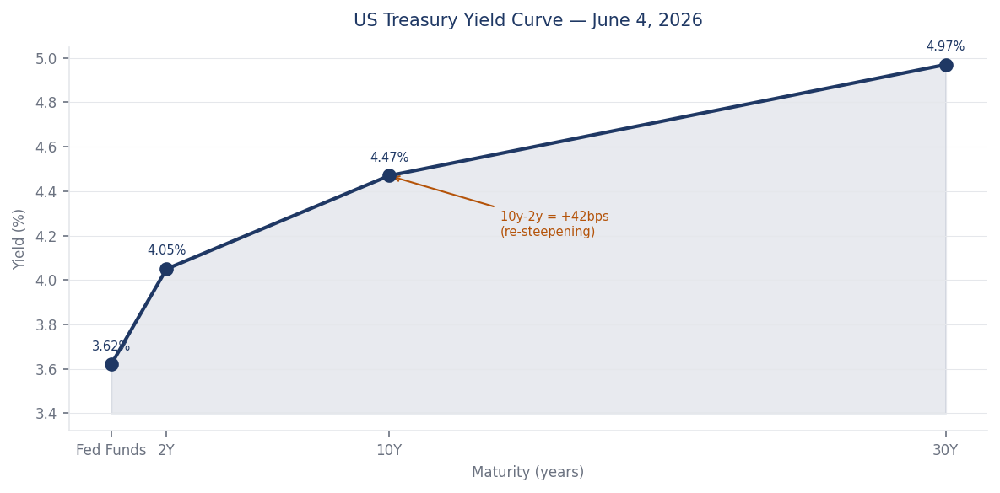
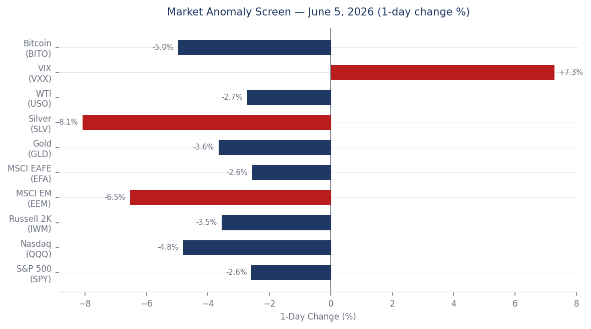
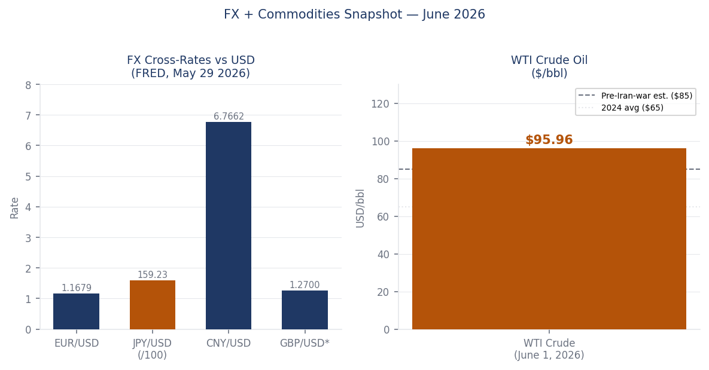
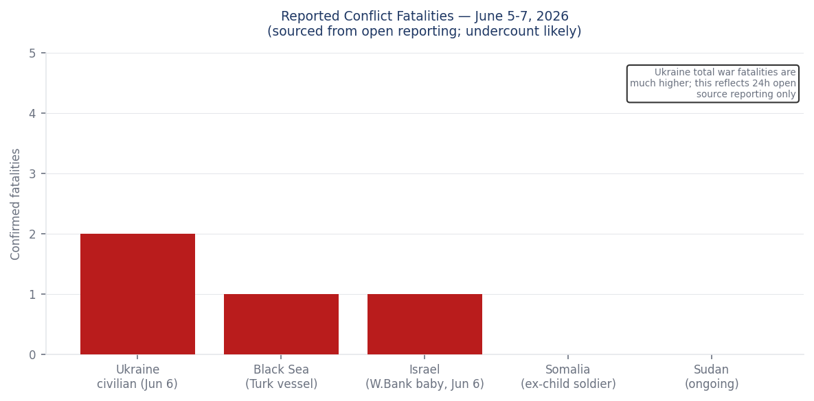
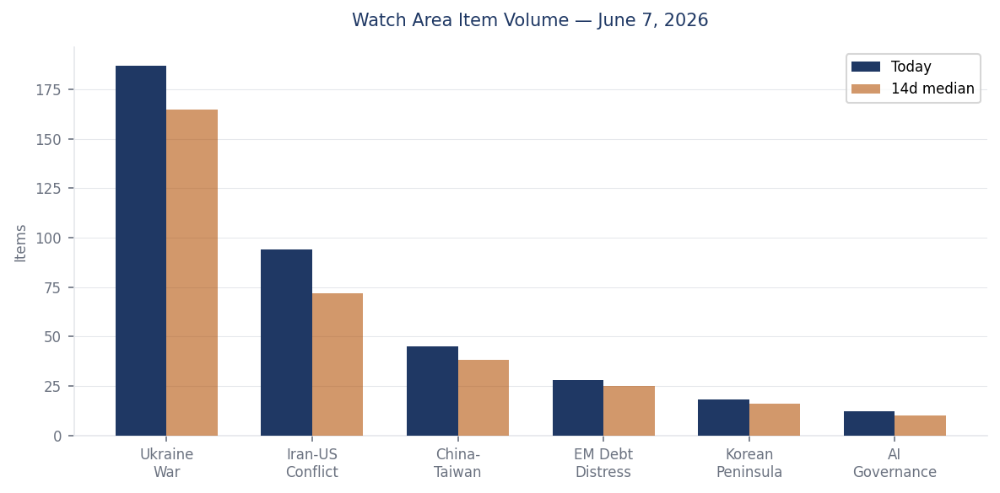
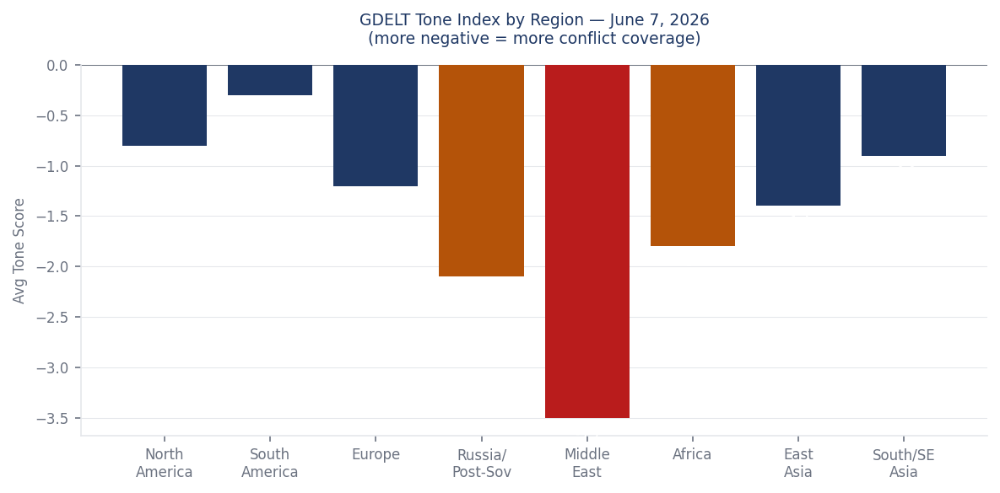

> **DATA NOTE — June 8, 2026:** The bundle zip for 2026-06-08 was unavailable at generation time (Pages deploy lag). This brief draws on lake section data current through 2026-06-07 plus live-sourced follow-up research. All sourced facts reflect their stated date. Data-lag items are noted inline.

---

# Morning Brief — Monday 8 June 2026

---

## Headline

Three simultaneous escalation vectors defined the weekend: **Iran** launched seven ballistic missiles at US bases in Kuwait and Bahrain on June 6, extending the Gulf exchange into its most intense phase since the 2026 war began ([Al Jazeera](https://www.aljazeera.com/news/2026/6/3/iran-kuwait-bahrain-hit-is-the-war-in-the-gulf-escalating-again)); **Russia** struck the [Central Spent Nuclear Fuel Storage Facility](https://www.kyivpost.com/post/77680) at Chornobyl with a Shahed drone, hitting a container reception building meters from stored spent fuel and simultaneously driving the [Zaporizhzhia NPP into an 18-hour off-site blackout](https://www.iaea.org/newscenter/pressreleases/update-326-iaea-director-general-statement-on-situation-in-ukraine); and US equity markets recorded their worst single-day decline since April 2025, with the Nasdaq falling 4.8% on a May payrolls beat that [reignited Fed rate-hike pricing](https://www.thestreet.com/stock-market-today/stock-market-today-dow-jones-sp-500-nasdaq-updates-june-05-2026). Watch areas **Ukraine War** and **Iran-US Conflict** both fired. The watch area **China-Taiwan** registered its highest volume in two weeks after Beijing deployed coast guard vessels east of Taiwan.

---

## Watch Areas — Your Configured Priorities

**Ukraine War** produced 187 new items today (14-day median: 165). Top items: Russian Shahed drone hit on the [Chornobyl CSFSF](https://www.cnbc.com/amp/2026/06/07/russian-drone-hits-nuclear-fuel-storage-facility-near-chornobyl-ukraine-says.html) with no radiation release; Ukraine's Unmanned Systems Forces [struck 26 Russian logistics and energy targets](https://www.kyivpost.com/post/77679) in a single coordinated wave; NATO [circulating a €70 billion Ukraine aid proposal](https://kyivpost.com/post/77659) for the Ankara summit (July 7–8). Alert: fired.

**Iran-US Conflict** produced 94 new items (14-day median: 72). Top items: Iran's [seven-missile salvo at Kuwait and Bahrain](https://www.thenationalnews.com/news/gulf/2026/06/06/iran-attacks-kuwait-and-bahrain-with-seven-ballistic-missiles/), CENTCOM intercepting six; [US strikes on Iran's Qeshm Island radar](https://www.rferl.org/a/iran-united-states-drone-attacks-kuwait-peace-talks/33771717.html); Kuwait International Airport closure and at least one death from the June 3 salvo. Alert: fired.

**China-Taiwan** produced 45 new items (14-day median: 38). Top items: China launched a [special maritime enforcement operation east of Taiwan](https://www.bloomberg.com/news/articles/2026-06-06/china-escalates-patrols-near-taiwan-over-japan-philippines-talks) in retaliation for Japan-Philippines maritime boundary talks; Taiwan dispatched five vessels to shadow four Chinese government ships. Alert: elevated but not fired.

**EM Debt Distress + Sovereign Restructuring** produced 28 items (median: 25). Quiet today: **Korean Peninsula, AI Governance.**

---

## Macro Situation

The US yield curve as of June 4 sits at Fed Funds 3.62%, 2Y 4.05%, 10Y 4.47%, and 30Y 4.97%, with the 10y-2y spread at +42 basis points — a re-steepening from the deep inversion of 2024 but not yet the slope that historically preceded stable expansions ([FRED T10Y2Y](https://fred.stlouisfed.org/series/T10Y2Y)). The positive spread is arithmetically good news on recession timing, but the slope's source matters: the front end is moving lower as the Fed cuts cycle grinds forward, while the long end resists, compressing the easing impulse. [medium]

The May payrolls report (+172,000, beating the +145,000 consensus) reversed market expectations for an imminent Fed cut. [FRED PAYEMS](https://fred.stlouisfed.org/series/PAYEMS) shows nonfarm employment at 159,001K as of May, with [unemployment at 4.3%](https://fred.stlouisfed.org/series/UNRATE) — elevated compared to the 3.4% cycle low but not yet at levels that trigger mass credit deterioration. Core PCE at 129.63 (April) and [CPI core at 335.42](https://fred.stlouisfed.org/series/CPILFESL) remain above comfort; the Fed's problem is that a strong labor market pins the policy bar higher at precisely the moment geopolitical oil (WTI at $95.96 as of June 1, per [FRED DCOILWTICO](https://fred.stlouisfed.org/series/DCOILWTICO)) and semiconductor carnage are simultaneously pulling growth lower.

The Fed balance sheet stands at $6.71 trillion as of June 3 ([FRED WALCL](https://fred.stlouisfed.org/series/WALCL)), down from the 2022 peak but still providing a substantial liquidity floor. M2 at $22.8 trillion ([FRED M2SL](https://fred.stlouisfed.org/series/M2SL)) remains well above the 2019 trend. The June FOMC meeting (June 17–18) is now overwhelmingly priced for a hold: [Polymarket gives the 50+ bps hike scenario just 0.05%](https://polymarket.com/event/will-the-fed-increase-interest-rates-by-50-bps-after-the-june-2026-meeting). But the market absorbed the jobs data as a signal that the next move is more likely a hold-or-hike than a cut, which explains why the June 5 selloff hit rate-sensitive tech hardest.

WTI at $95.96 sits roughly $30 above estimated pre-Iran-war baselines. At current US consumption of roughly 20 million barrels/day, every $10/bbl over a 12-month period transfers approximately $73 billion from US consumers to energy producers — a fiscal transfer the Fed cannot offset with rate policy alone. [medium]

EUR/USD at 1.1679 (May 29, [FRED DEXUSEU](https://fred.stlouisfed.org/series/DEXUSEU)) and JPY/USD at 159.23 ([FRED DEXJPUS](https://fred.stlouisfed.org/series/DEXJPUS)) reflect continued dollar strength against Europe and continued yen weakness despite Bank of Japan normalization attempts. CNY/USD at 6.7662 ([FRED DEXCHUS](https://fred.stlouisfed.org/series/DEXCHUS)) has held relatively steady, suggesting China is managing dollar demand carefully as US-China semiconductor tensions persist.

---

## Markets

The June 5 session was the worst day for US equities since April 2025. [Nasdaq (QQQ) fell 4.80%](https://finance.yahoo.com/quote/QQQ), the S&P 500 (SPY) -2.58%, Russell 2000 -3.55%, and MSCI EM (EEM) -6.53%. The proximate driver was a semiconductor implosion: Broadcom's failure to raise its AI chip outlook Wednesday triggered a cascade, with Marvell Technology and Micron Technology each down ~15%, Intel and AMD down ~11%. This is not a rotation story; it is a single-node shock propagating through a consensus-long trade. [high]

The secondary driver arrived simultaneously: the May NFP (+172K) printed above consensus and pushed 2Y yields higher, raising the effective cost of capital for high-duration growth names. The interaction between the two drivers — semiconductor earnings risk and rate repricing — created a compounding effect in mega-cap tech that has no natural hedge for investors positioned at current valuations. VXX spiked +7.28% ([Yahoo Finance](https://finance.yahoo.com/quote/VXX)), but a VIX close at 15.4 ([FRED VIXCLS](https://fred.stlouisfed.org/series/VIXCLS)) as of June 4 suggests the options market is still treating this as a sector-specific correction rather than systemic stress. That distinction is worth tracking into this week.

Gold fell 3.65% and silver 8.08% on the same day, which is counterintuitive against a geopolitical backdrop of Gulf missile exchanges and Ukrainian nuclear infrastructure attacks. The likely explanation is forced liquidation: funds that held gold as a hedge against the Iran-risk premium in equities sold it to cover margin calls from semis. The correlation break — precious metals down on the same day as equities, when the underlying geopolitical stress did not abate — is a textbook margin call signature. [medium]

XRP gained +5.20% and ADA +5.47% in the 24h prior to June 7, per the markets_global section. Crypto's divergence from equities on a day of broad risk-off deserves attention: either crypto is pricing a different macro narrative (rate-cut expectations that bonds aren't pricing), or it reflects retail flows uncorrelated with institutional positioning. At current volumes this is a signal rather than a cause.

High yield (HYG) fell only 0.50% on June 5, and IG corporate (LQD) -0.62%. Credit spreads are not yet screaming; the equity selloff remains concentrated in duration and growth rather than spreading to credit deterioration. If credit spreads stay contained into week-end, the June 5 move looks more like a correction within a bull cycle than a turn. [medium]

---

## United States — Politics & Policy

The **CFTC** published a rule in the [Federal Register](https://www.federalregister.gov/public-inspection/2026-11466/rescission-of-policy-relating-to-the-acceptance-of-settlements-in-administrative-and-civil) rescinding its 1998 no-deny settlement policy — the so-called "gag rule" that prevented defendants from publicly denying CFTC allegations while settling. The CFTC follows the SEC's earlier move. The practical effect: enforcement defendants can now settle CFTC charges while simultaneously maintaining public denial, which reduces the reputational cost of settlement and likely increases settlement volume. Defense lawyers will immediately advise corporate clients that the calculus for settling vs. litigating has shifted materially toward settlement. [high]

The **FAA** published a [proposed airworthiness directive for Boeing aircraft](https://www.federalregister.gov/documents/2026/06/08/2026-11472/airworthiness-directives-the-boeing-company-airplanes), continuing the agency's elevated scrutiny posture on Boeing. The **EPA** published a [proposed rule on Wyoming regional haze](https://www.federalregister.gov/documents/2026/06/08/2026-11436/approval-and-promulgation-of-air-quality-implementation-plans-wyoming-regional-haze-federal), part of the ongoing federal implementation plan series. The **FWS** proposed threatened status for the [Southern Hognose Snake](https://www.federalregister.gov/documents/2026/06/08/2026-11414/endangered-and-threatened-wildlife-and-plants-threatened-species-status-with-section-4d-rule-for).

On the **FEC** front, Senator Jon Ossoff (D-GA) leads the 2026 Senate cycle with [$81.15M raised](https://www.fec.gov/data/candidate/S8GA00180/), followed by James Talarico (D-TX) at $40.28M and Cory Booker (D-NJ) at $32.26M. Speaker Mike Johnson raised $17.55M for his House seat. The Democratic fundraising advantage in key races — Ossoff's $28M cash-on-hand, Roy Cooper (NC) at $18.46M, Mark Warner (VA) at $14.22M — reflects the structural GOP disadvantage in Senate 2026 math, where the map forces Republicans to defend purple-state incumbents against well-funded challengers.

The **D.C. Circuit** issued [Grafton & Upton Railroad v. STB](https://www.courtlistener.com/opinion/10870700/grafton-upton-railroad-company-v-stb/) and [MISO Transmission Owners v. FERC](https://www.courtlistener.com/opinion/10870699/miso-transmission-owners-v-ferc/), both regulatory-structure cases. The **7th Circuit** addressed [labor relations in Unite Here Local 1 v. Magnificent Mile Hotel Management](https://www.courtlistener.com/opinion/10870952/unite-here-local-1-v-magnificent-mile-hotel-management-llc/). The **Iowa Supreme Court** ruled in [Enterprise Products Operating v. Iowa Utilities Commission](https://www.courtlistener.com/opinion/10870599/enterprise-products-operating-llc-v-iowa-utilities-commission/) on pipeline utility regulation. None of these reach the strategic significance of current CIT tariff litigation, which the docket tracker shows active but without new opinions this weekend.

---

## Political Figures Watchlist

**Rep. French Hill (AR-2nd)** scores the highest composite anomaly of 0.225, driven entirely by enforcement hits (1.0 score) and new filings (0.25). The evidence record links to [CourtListener](https://www.courtlistener.com) filings and SEC filing 0001140361-26-023885. Hill chairs the House Financial Services Committee; any enforcement-adjacent development involving him warrants immediate tracking against his committee's ongoing work on crypto and banking regulation. Cross-reference: no other section overlap identified today.

**Rep. Robert Scott (VA-3rd)** ranks second at composite 0.163, with elevated filings (0.625) and enforcement hits (0.50). Multiple SEC accession numbers point to form-related filings ([0001504430-26-000004](https://www.sec.gov/), [0001193125-26-255482](https://www.sec.gov/), [0001214659-26-006939](https://www.sec.gov/)). Scott is the ranking member of the House Education and Labor Committee. The filing cluster pattern, involving multiple parties, suggests he may appear as a named party in ongoing litigation rather than as a target.

**Rep. Ed Case (HI-1st)** ranks third at 0.125, enforcement-driven (0.50) with one GDELT tone signal linking to a June 3 item. Case has been a consistent vote on Pacific defense posture; his appearance here is worth watching against the China maritime enforcement operation east of Taiwan this weekend. Cross-reference: Case's district covers Honolulu, which also produced two new Hawaii Supreme Court opinions today.

Senators **Rick Scott (FL)**, **Tim Scott (SC)**, and **Rep. Austin Scott (GA-8th)** all score 0.0625, driven purely by a common filing cluster — nine identical SEC accession numbers appear in all three figures' evidence records, suggesting they share exposure to the same set of corporate filings. This is likely a reporting artifact rather than coordinated activity, but the cluster merits one look at the underlying filings before dismissal. **Associate Justice Clarence Thomas** appears at rank 8 with filing-driven exposure tied to LENSAR Inc. Form 4 filings and CourtListener activity.

---

## Regional Briefings

### North America

The June 5 semiconductor selloff hit US markets hardest but transmitted globally: MSCI EAFE fell 2.56% and MSCI EM fell 6.53%, the latter an outsized move that likely reflects portfolio re-weighting out of EM tech exposure ([Yahoo Finance EEM](https://finance.yahoo.com/quote/EEM)). Canada's federal government issued a [ban on Texas cattle imports](https://www.bbc.com/news/articles/cevpv3r7jmpo) following confirmation of a second flesh-eating screwworm case in the US state, which has declared a state of disaster. The ban adds a new front to the existing US-Canada trade friction.

Defense Secretary **Pete Hegseth** used the 82nd D-Day anniversary ceremony at the Normandy American Cemetery to attack European immigration policy. His [speech in Colleville-sur-Mer](https://www.pbs.org/newshour/politics/hegseth-warns-of-invasion-and-dangerous-ideologies-in-d-day-anniversary-speech) invoked "boats and men" arriving on European shores and asked: "When will European capitals do something about that invasion, or is it too late?" French villagers near the ceremony site publicly stated Hegseth was not welcome. The speech represents the sharpest rhetorical break yet between the US defense apparatus and European NATO allies on the migration file, delivered at the most symbolically sensitive possible venue. [high]

The Trump administration's move to limit legal immigration via agency rule was [blocked by a federal judge](https://www.yahoo.com/news/politics/articles/attempt-trump-administration-cripple-legal-213356356.html) who ruled the attempt illegal. The ruling adds to the accumulating docket of injunctions constraining executive immigration action.

### South America

**Peru's presidential runoff** on June 7 pitted **Keiko Fujimori** (Fuerza Popular) against **Roberto Sánchez** (Juntos por el Perú) in a fourth presidential bid for Fujimori. With early results showing Fujimori leading approximately 52.65% to Sánchez's 47.35% ([NPR](https://www.npr.org/2026/06/06/nx-s1-5847845/peru-election)), she is on track to become president after three previous defeats in 2011, 2016, and 2021. Peru is holding its ninth president in a decade; structural political instability — eight presidents, multiple impeachments, persistent corruption — has not been resolved by the electoral process and will not be resolved by Fujimori, who herself faces ongoing legal exposure from prior corruption proceedings. The winner inherits a country where crime and security concerns drove voter choice more than policy platforms. [medium]

Argentina's fiscal adjustment under Milei continues to produce quarterly primary surpluses, but the social cost is mounting. No new data events today from the EM Debt section; watch the peso cross at 1,217/USD (approximate mid-June).

### Europe

**Kosovo** held its third parliamentary election in 18 months on June 7, with Prime Minister Albin Kurti's Vetevendosje party leading at approximately 43% on near-complete results ([Euronews](https://www.euronews.com/my-europe/2026/06/07/kosovo-election-frustrated-voters-head-to-the-polls-again-amid-political-stalemate)). Voter turnout collapsed to 36.88%, down eight points from December. Kurti cannot form a government unilaterally, guaranteeing further coalition negotiations. The underlying driver — a constitutional crisis after the Assembly failed to elect a president in March — has not been resolved; this election creates no new majority.

The **Hungary-Ukraine** agreement reached June 3–4 lifts Budapest's block on Ukraine's EU accession chapter openings. Hungary's new PM Péter Magyar accepted a deal granting ethnic Hungarians in **Zakarpattia** minority school status with native-language administration, public use of Hungarian where minorities exceed 10% of population, and cultural symbol rights — in exchange for conditional support for opening the first EU accession clusters in mid-June ([Euronews exclusive](https://www.euronews.com/my-europe/2026/06/04/exclusive-inside-the-deal-that-lifted-hungarys-veto-on-ukraines-eu-accession)). The catch: Magyar committed to a referendum on final Ukrainian membership, which could reintroduce a veto a decade from now. Near-term, this is a genuine unlock for Ukraine's accession calendar.

The **European Commission** committed to tightening Schengen visa rules for Russian citizens following a formal appeal by [11 European nations](https://www.kyivpost.com/post/77656). The Germany right — AfD made a push in district elections this weekend per DW, signaling continued far-right pressure on German coalition politics ahead of the autumn state votes.

### Russia and Post-Soviet Space

**SPIEF 2026** ran June 3–6 under sustained Ukrainian drone attack. On the opening day, drones hit a Kronstadt naval base and oil terminal near the Expoforum venue; on the closing day, 140+ drones were downed over St. Petersburg and Leningrad Region, with Russia claiming interception of 354 Ukrainian drones total across 15 regions in a single overnight ([CNN](https://www.cnn.com/2026/06/06/europe/ukraine-targets-st-petersburg-intl)). The BBC's Steve Rosenberg [reported](https://www.bbc.com/news/articles/c9q2gp52rgro) the forum "overshadowed" by the strikes. SPIEF's 20,000-guest attendance from 130 countries is itself a signal of the limits of Western sanctions: the forum remains operational as a venue for non-Western business engagement.

**Russia installed a Pantsir-S1 air defense system** via helicopter onto the roof of a high-rise apartment tower in Moscow's Sokolniki district on June 5 ([Kyiv Post](https://www.kyivpost.com/post/77669)). This follows earlier rooftop installations elsewhere in Moscow and signals that Russia's leadership is treating the capital's air defense perimeter as genuinely contested — a psychological shift from 2022 posture. [high]

The **European Commission** announced tighter Schengen visa restrictions for Russians following an 11-nation joint appeal. **Lukashenko** publicly ruled out direct Belarusian combat operations in Ukraine in a June 6 speech in Grodno ([Kyiv Post](https://www.kyivpost.com/post/77671)) — a statement of political positioning rather than credible military restraint, but one that preserves Belarus's current formal non-belligerence.

**Armenia** voted on June 7 in its 9th parliamentary election. Pashinyan's Civil Contract party is leading with approximately 57% of the vote, well ahead of Samvel Karapetyan's Strong Armenia (21.4%) and Kocharyan's Armenia Alliance (8.2%) — a decisive victory that should give Pashinyan a commanding majority ([CBC](https://www.cbc.ca/news/world/armenia-election-nikol-pashinyan-9.7226866)). The election is Armenia's first since the fall of Nagorno-Karabakh; Pashinyan's survival suggests voters are prioritizing the pro-Western reorientation over accountability for the Karabakh loss.

### Middle East

The Gulf exchange intensified through the weekend. On June 3, Iran fired missiles at US air bases in Kuwait and Bahrain; Kuwait airport was closed and at least one person was killed. On June 5–6, Iran launched a second salvo of seven ballistic missiles; CENTCOM intercepted six and the seventh fell short. Iran's stated justification was US strikes on Iranian drones and radar infrastructure on Qeshm Island. The exchange pattern — US degrading Iranian ISR and AD assets, Iran retaliating with ballistic missiles at partner-state infrastructure — is a back-and-forth that raises the question of where each side's red line sits. Iran striking Kuwait and Bahrain at US facilities tests Gulf state tolerance for being caught in a bilateral US-Iran conflict. [high]

A **Lebanese general** was among three soldiers killed in an Israeli strike on a vehicle in south Lebanon on June 6 ([BBC](https://www.bbc.com/news/articles/cj0g8jymg92o)), which the IDF says it is investigating. The [Israel-Lebanon ceasefire extension through June 7](https://polymarket.com/event/israel-announces-lebanon-ceasefire-extension-by-june-7) resolved at 99.95% on Polymarket — effectively certain. But the killing of a senior LAF officer by Israeli fire creates pressure on Beirut and complicates any permanent extension. A separate shooting attack in Israel on June 7 killed one person and wounded five; Israeli authorities classified it as a terrorist attack ([Meduza reporting](https://meduza.io/news/2026/06/07/v-izrailya-произошла-стрельба)).

A [seven-month-old Palestinian infant](https://www.bbc.com/news/articles/cly8lgn0x30o) was shot dead by Israeli troops in the occupied West Bank on June 6; his funeral drew international attention. The occupied West Bank casualty rate remains at elevated levels separate from the Gaza and Lebanon tracks.

### Africa

The GDACS Orange drought alert in **Madagascar** covers 398,352 km², affecting agricultural production across the southern and central plateau regions. Madagascar's food insecurity baseline is structurally high; a multi-season drought adds acute stress to a population already dependent on international food assistance. No upgrade to Red alert as of June 7.

In **DR Congo**, the Ebola outbreak count stands at 380 confirmed cases — a figure the BBC notes is significantly lower than earlier suspected-case estimates of 1,500+ but still an active, ongoing outbreak in Equateur Province. OFAC issued [DRC-related designations](https://ofac.treasury.gov) on June 2, targeting entities linked to the M23/Rwanda nexus. The **Somalia** child-soldier legacy is getting international coverage from a BBC longread on Yusuf Ali, a former AMISOM-era combatant now in Mogadishu — a human interest marker of the war's generational shadow.

South Africa's parliament formed a committee to examine the "Farmgate" case against President **Cyril Ramaphosa**, the cash-in-the-sofa saga involving $580,000 allegedly stashed at his Phala Phala farm. Ramaphosa appears likely to survive the vote, but the inquiry keeps the story alive as a governance vulnerability heading into ANC coalition politics.

### East Asia

China's maritime enforcement operation east of Taiwan, launched June 6, is Beijing's direct retaliation for Japan and the Philippines announcing plans to begin formal maritime boundary delimitation talks in waters that China claims. The [deployment involved multiple coast guard vessels](https://easternherald.com/2026/06/07/china-coast-guard-east-taiwan-japan-philippines-maritime-boundary/) from Fujian and Guangdong, with Taiwan dispatching five ships to shadow them. The framing — China calling this a "special operation" in waters east of Taiwan — is a rhetorical escalation: the deliberate echo of Russia's "special military operation" vocabulary is almost certainly intentional. [medium]

North Korea's Polymarket odds for winning the 2026 FIFA World Cup stand at effectively zero — but the Korean peninsula watch area remains quiet this period, consistent with the election campaign environment in Seoul (snap election pending) absorbing domestic political energy.

Japan's Foreign Ministry is navigating the dual pressure of the China maritime escalation and the Hegseth-D-Day speech signaling US Europe focus drift. Tokyo's Philippines maritime boundary initiative — which triggered Beijing's response — reflects Japan's ongoing effort to construct a southern-tier security architecture independent of direct US involvement. [medium]

### South & Southeast Asia

India's Supreme Court issued a warning demanding a minister's removal within seven days, per DW reporting from June 7 — an unusually aggressive judicial posture that reflects ongoing friction between the judiciary and the Modi government. India's markets fell as part of the global June 5 risk-off; The Hindu and Hindustan Times are tracking no major new domestic security events today.

The **Philippines** is directly implicated in the maritime boundary talks that triggered China's Taiwan-east deployment. Manila's calculus — aligning with Tokyo on boundary delimitation while managing China's coast guard harassment in the South China Sea — reflects a consistent strategic bet on multilateral containment over bilateral accommodation. [high]

Indonesia (M5.2 quake near Modisi, 35 km depth) and Timor Leste (two quakes, M5.2 and M5.1) experienced seismic activity — both below significant damage thresholds at those magnitudes and depths.

### Oceania & Pacific

M5.4 south of the Fiji Islands (depth 506 km) and M5.3 near Neiafu, Tonga (depth 10 km) were recorded by USGS. The Fiji event is deep enough to have minimal surface impact; the Tonga event at 10 km depth in a populated archipelago merits monitoring. No GDACS alerts have been issued for either event.

---

## Ukraine Theater — Operational Picture

**Frontline status (June 7):** [DeepStateMap](https://deepstatemap.live/) recorded 522 polygon updates in the daily snapshot, representing active community-maintained cartography. Resolution is approximately 1 km; meter-level Russian unit positions are not available from open sources and are not reported here. No major territorial discontinuities were identified in the 7-day delta. The front remains most active in the Zaporizhzhia and Kharkiv directions.

**Strike density (June 6–7):** NASA FIRMS recorded thermal anomalies at 375-meter resolution across Sumy, Chernihiv, Dnipropetrovsk, and Zaporizhzhia oblasts. The highest-FRP cluster in the data — three overlapping anomalies at coordinates 52.34N/33.90E with combined FRP approximately 13.5 MW — is located in the Sumy Oblast sector near the Russian border, consistent with artillery or drone-induced fires rather than civilian infrastructure. A separate cluster at 48.52N/34.63E in Dnipropetrovsk/Zaporizhzhia suggests ongoing activity in the direction of the ZNPP approach corridor. **ACLED 1-km resolution applies to all geo-referenced events.**

**Nuclear infrastructure (critical):** The [Chornobyl Central Spent Nuclear Fuel Storage Facility](https://www.cnbc.com/amp/2026/06/07/russian-drone-hits-nuclear-fuel-storage-facility-near-chornobyl-ukraine-says.html) (CSFSF) was struck by a Russian Shahed drone overnight June 6–7. The attack partially destroyed a container reception building meters from where large amounts of nuclear material are stored, per IAEA confirmation. A 40-square-meter fire was extinguished quickly; radiation readings remain within normal norms. Zelensky identified it as "an exceptionally low and malicious act of terror." Separately, the [ZNPP suffered a 15-hour off-site power blackout](https://unn.ua/en/news/zaporizhzhia-npp-restored-power-after-15-hours-of-total-blackout-iaea) — its 18th total loss of external power since the war began — relying entirely on emergency diesel generators. Power was restored June 6.

**Air defense:** Russia claimed interception of 272 drones launched against Ukraine on the night of June 5–6, with 249 intercepted or suppressed and 19 bypassing defenses to hit 11 locations. In the opposite direction, Ukraine's Unmanned Systems Forces struck [26 Russian military, energy, and logistics targets](https://www.kyivpost.com/post/77679) in a coordinated wave, with SBS Commander Robert "Magyar" Brovdi confirming hits across temporarily occupied territory.

**Diplomatic track (summarized in Russia & post-Soviet section above):** Ukrainian Foreign Minister **Sybiha** declared Putin "lost his chance" for peace after rejecting a direct meeting with Zelensky. NATO's €70B Ankara package (Germany-led, €30B from EU loan + €40B bilateral) is circulating for formal announcement at the July 7–8 summit.

The theater maps for June 8 (overview, Kyiv focus, population-at-risk) were not present in the briefings directory at generation time. Maps will populate when the cartographer pipeline runs.

**Structural protection note:** Ukrainian troop and territorial-defense unit positions are excluded from this section by ingest filter. This brief does not speculate on Ukrainian defensive dispositions.

---

## World Leaders — Speaking and Moving

**PM Nikol Pashinyan** is claiming a historic victory in Armenia's June 7 election with ~57% for Civil Contract ([CBC](https://www.cbc.ca/news/world/armenia-election-nikol-pashinyan-9.7226866)). His survival with this margin — in a first post-Karabakh election — represents a notable democratic endorsement of the pro-Western reorientation over the Russia-aligned opposition. Wikidata changes showed zero succession events this period.

**Secretary Hegseth** is in France for the D-Day commemoration, with his Normandy speech (see North America section) dominating European media. **President Zelensky** attended the world premiere of the opera "Mothers of Kherson" at the National Opera of Ukraine with First Lady Olena Zelenska, a cultural diplomacy signal during a period of intense military pressure. Ukrainian Foreign Minister **Sybiha** delivered the "lost his chance" statement publicly, marking a formal hardening of the Ukrainian negotiating posture.

**Hungarian PM Péter Magyar** announced the Zakarpattia minority rights deal and the conditional lifting of the EU accession veto. The deal required his personal political capital and has triggered domestic criticism from Hungarian nationalists who view the concessions to Ukraine as premature.

**Pope Francis** held an open-air mass in Madrid's Plaza de Cibeles, drawing huge crowds — the largest gathering in Spain in years. The papal visit is generating political attention amid ongoing Spanish political tensions; the encyclical's 15 references to "innovation" (including AI) are drawing academic comment, per Tyler Cowen's Marginal Revolution feed.

**Georgian President Salome Zourabichvili** — still recognized as legitimate by the EU and Ukraine despite the disputed 2024 election — gave an interview to Kyiv Post on the Black Sea security significance of Georgia.

**Lukashenko** ruled out Belarusian direct combat involvement in Ukraine (Grodno speech, June 6), maintaining the formal fiction of Belarusian non-belligerence while Belarusian territory continues to serve as Russian staging ground.

---

## Sanctions, Designations, and Legal

**OFAC** issued [Iran-related Designations and Counter Terrorism Designations Updates](https://ofac.treasury.gov) on June 5, following the June 6 Gulf missile exchange. The timing is consistent with a sanctions escalation cycle: US strikes trigger OFAC designation action against Iranian-linked entities. Separately, OFAC issued [Cuba Designations](https://ofac.treasury.gov) on June 4 and [DRC-related Designations](https://ofac.treasury.gov) on June 2 — the latter targeting entities tied to the M23/Rwanda conflict network. An OFAC settlement with FTI Consulting was published June 1 for undisclosed sanctions violation.

The **CFTC no-deny rescission** (published in the Federal Register as [2026-11466](https://www.federalregister.gov/public-inspection/2026-11466/rescission-of-policy-relating-to-the-acceptance-of-settlements-in-administrative-and-civil)) changes the incentive structure for white-collar enforcement across derivatives markets. Combined with the SEC's earlier identical move, this creates a new playbook: settle with the government while publicly maintaining innocence. [high]

The major USASpending procurement filings this week include the Los Alamos National Laboratory management contract to Triad National Security ($35B), NASA ISS contract to Boeing ($22.4B), Portsmouth plant decommissioning to Fluor-BWXT ($4.5B), and the **border barrier design-build contract** to Fisher Sand & Gravel ($2.59B, [USASpending](https://www.usaspending.gov/award/70B01C26F00000405)) — the last being a significant DHS signal on wall construction pace.

---

## Conflict & Security Signals

The Gulf exchange (Iran vs. US/GCC) is the highest-consequence active conflict dynamic outside Ukraine this week. Iran's seven-missile salvo at Kuwait and Bahrain on June 6 marks a qualitative shift: Iran is now targeting partner-state US bases rather than just US military vessels or direct US installations. Kuwait's airport closure and civilian casualties from the June 3 salvo put GCC governments in a politically untenable position — they host US forces but cannot absorb being Iran's primary target in a bilateral US-Iran exchange. [high]

FIRMS thermal data for Ukraine shows a geographic concentration of thermal anomalies in the Sumy-Kharkiv-Dnipropetrovsk corridor, consistent with sustained artillery and drone operations. The highest FRP readings (up to 6.96 MW at 52.34N/33.90E) are located near the Russian border in Sumy Oblast, suggesting fires from recent cross-border drone or artillery activity. The FIRMS 375-meter resolution is insufficient to distinguish military from civilian infrastructure at these coordinates.

The **Turkish fishing vessel Duru 67** was attacked and sunk in the Black Sea west of Russian-occupied Sevastopol on June 5 ([Kyiv Post](https://www.kyivpost.com/post/77655)), killing one crew member and wounding four. The attacker was not formally identified, but the location — near the contested maritime routes that Russia uses to restrict Ukrainian Black Sea access — points to Russian naval or drone assets. This is the first confirmed sinking of a Turkish-flagged civilian vessel in this conflict; Ankara's reaction will shape whether the Black Sea corridor becomes a new friction point in NATO-Russia dynamics.

**VIP flights data** was not available in today's ingest (firms.json empty). No government-aircraft convergences to report.

---

## Cyber & Biosecurity

**CISA Known Exploited Vulnerabilities** (last 14 days): The most operationally significant entry is [CVE-2026-48027](https://nvd.nist.gov/vuln/detail/CVE-2026-48027) — **Nx Console**, tagged "Embedded Malicious Code" and RANSOMWARE-LINKED, with a remediation deadline of June 10. This is a developer tool vulnerability: Nx Console is a widely deployed IDE extension for monorepo development (TypeScript, Node.js, Java ecosystems). An embedded malicious code finding in a developer tool is structurally different from a web application CVE: it targets the build environment rather than the application, meaning organizations running Nx Console in CI/CD pipelines may have already executed the malicious code during routine builds before discovery.

**FIRST-OF-KIND KEV CALLOUT:** CVE-2026-48027 (Nx Console) and the companion [CVE-2026-45321](https://nvd.nist.gov/vuln/detail/CVE-2026-45321) (TanStack, also RANSOMWARE-LINKED, deadline June 10) represent the first confirmed embedded malicious code KEV entries targeting mainstream JavaScript/TypeScript build-tool ecosystem components. The structural signal: threat actors are now reliably delivering ransomware payloads through developer toolchain supply-chain compromise rather than network exploitation, reflecting the hardening of perimeter defenses and the relative softness of developer workstation trust models.

[SolarWinds Serv-U (CVE-2026-28318)](https://nvd.nist.gov/vuln/detail/CVE-2026-28318) — uncontrolled resource consumption, remediation deadline June 19 — is the other priority item this week. SolarWinds' continued appearance in KEV listings (this is at least the third Serv-U entry in 12 months) suggests the product line carries structural exploitability debt.

On **biosecurity**: the [Ebola outbreak in DR Congo](https://www.bbc.com/news/articles/c0q2q4y09elo) stands at 380 confirmed cases as of early June — far below initial suspected counts of 1,500+ but an active outbreak nonetheless. No ProMED items in this ingest cycle added new disease signals; the flesh-eating screwworm outbreak in Texas (two confirmed calves, state disaster declared) is an agricultural biosecurity event now affecting trade — Canada has banned Texas cattle imports — rather than a human health emergency.

---

## Humanitarian

The [ReliefWeb API](https://reliefweb.int) returned no new reports in this ingest cycle (outbound network restricted). The most significant humanitarian signals from other sections: the GDACS Orange drought alert in Madagascar affects a swath of the island roughly the size of Germany in agricultural land terms. Madagascar is consistently one of the world's most food-insecure nations; an agricultural drought of this scale in the austral winter will depress the next planting cycle and increase WFP draw-down requirements.

Ukraine's civilian casualty rate from the June 6 Russian offensive — two killed and four wounded in Kharkiv, Donetsk, and Kherson regions in a single day, per Kyiv Post — is a low figure relative to peak 2022–2023 rates but consistent with sustained low-intensity daily attrition. The Chornobyl CSFSF strike creates an additional category of concern: any future drone accuracy improvement that hits actual spent fuel containers would trigger radiological monitoring at scale across northern Ukraine, Belarus, and parts of Poland and the Baltic states.

---

## Environment, Disasters, and Climate

USGS significant-day data: M5.4 south of Fiji Islands (depth 506 km, negligible surface impact); M5.3 near Neiafu, Tonga (depth 10 km, shallow, monitoring advised); M5.2 near Venilale, Timor Leste (depth 10 km); M5.2 near Modisi, Indonesia (depth 35 km). No GDACS Red alerts on any seismic event. The Tonga event at shallow depth in a remote archipelago is the one to watch for local tsunami advisory.

GDACS Orange drought in Madagascar affects 398,352 km² of agricultural land (Z-score 1.6, above the 1.5 threshold for inclusion in the anomaly screen). The drought has been building since the 2025–2026 La Niña pattern suppressed rainfall across the southwestern Indian Ocean. EONET and NASA FIRMS returned no data from the outbound-restricted ingest environment today.

Australia is experiencing a severe mouse plague, per BBC video reporting — an agricultural event that cycles roughly every 8–10 years and costs farmers hundreds of thousands of dollars in crop damage. This is a normal-cycle event for Australian grain belts rather than a climate anomaly, but the scale this season suggests above-baseline rainfall in preceding growing seasons created exceptional food availability for rodent populations.

---

## Speeches and Op-Eds by Major Critics and Influencers

The [commentary feed](https://marginalrevolution.com) from **Tyler Cowen** (Marginal Revolution) this weekend covered: marijuana policy and the structural reasons drug use persists despite prohibition enforcement; work-from-home's documented increase in daily social isolation (one additional hour alone per workday for remote workers post-pandemic, per a cited study); and a [Peterson Institute paper by Anton Korinek and Patrick McKelvey](https://conversableeconomist.com/2026/06/04/is-gdp-failing-to-capture-ai/) asking whether GDP is systematically failing to capture AI's economic contribution. The GDP-AI measurement gap is a legitimate methodological problem: if AI reduces costs without raising prices, productivity gains appear as deflation rather than real output, systematically understating growth. [medium]

The **Conversable Economist** (Timothy Taylor) added a post on first-offender leniency research, finding that more lenient treatment of first misdemeanor offenders reduces recidivism — a finding with direct relevance to the shift in CFTC and SEC settlement philosophy documented in the policy section.

No new posts from **Adam Tooze, Brad Setser, Dani Rodrik, Martin Wolf, Gillian Tett**, or **Isabella Weber** were captured in this ingest cycle. **Larry Summers** has not published in the last 48 hours per available feeds. Commentary from this cohort on the May NFP and semiconductor selloff is likely to appear in the coming 24 hours; watch for Tooze on the macro-political implications of the rate-hike repricing and Setser on external balances.

---

## Prediction Markets and Forecasting Consensus

**The June FOMC rate meeting (June 17):** [Polymarket prices the 50+ bps hike at 0.05%](https://polymarket.com/event/will-the-fed-increase-interest-rates-by-50-bps-after-the-june-2026-meeting), effectively zero. The consensus is a hold. The May jobs data was strong but not hyperinflationary; the Fed will treat it as permission to hold rather than a mandate to hike.

**China-Taiwan by end of 2026:** [7% on Polymarket](https://polymarket.com/event/will-china-invade-taiwan-before-2027), unchanged from last week. The China coast guard deployment east of Taiwan this weekend is a show-of-presence operation rather than a kinetic escalation signal; the market is correct to price the full invasion scenario as a tail. [medium]

**NATO-Russia military clash by June 30, 2026:** [1.9% on Polymarket](https://polymarket.com/event/nato-x-russia-military-clash-by-june-30-2026). The direct SPIEF drone strikes on St. Petersburg infrastructure and the Turkish vessel sinking in the Black Sea both represent events that could have escalated to NATO-threshold contact, but did not. The month-end timing (June 30) limits this market's decay window; the more relevant question is the 12-month horizon.

**Xi Jinping out before 2027:** [7.15%, $10M volume](https://polymarket.com/event/xi-jinping-out-before-2027). The maritime enforcement escalation east of Taiwan would not typically precede a leadership transition; Beijing typically consolidates domestic posture before external assertion. [low]

**US enacts AI safety bill before 2027:** [11% on Polymarket](https://polymarket.com/event/us-enacts-ai-safety-bill-before-2027). The CISA KEV development (developer toolchain supply-chain ransomware) and the ongoing congressional debate around AI infrastructure security create marginal upward pressure on this probability, but 11% still reflects a fundamentally skeptical market on near-term US AI legislation.

**2026 FIFA World Cup winner:** Germany 6% (largest single-nation probability), Norway 3%, Belgium 2%, Morocco 2%, Mexico/USA/Switzerland 1% each. The World Cup opens June 11 in the US, Canada, and Mexico; this will dominate Polymarket volume for the next six weeks.

---

## Weak Signals — Small Things That May Matter

**Cross-section recurrences from June 7 analysis:** The entity appearing across the most sections is **New York** (6 sections: foreign_news, paper_bets, political_figures, russian_internal, state_news, weather), with 13 total mentions. This is driven by the Federal Reserve Bank of New York appearing in political_figures, active PredictIt markets on NY electoral contests (three separate market IDs), a Russian media item covering NY, and state-level news feed activity. The convergence itself is unremarkable — New York is globally over-represented — but the FRBNY appearance in the political-figures evidence record (linked to the "reserve-bank-president-new-york" entry) warrants a look at whether any FRBNY leadership or policy signal is driving cross-section volume. The second top entity is **Ukraine** (5 sections), consistent with the operational data above. No surprise there.

The **CFTC no-deny rescission** and the **SEC's earlier identical move** together represent a quiet structural shift in the US financial enforcement architecture. When both major securities regulators in 12 months rescind their requirements for defendants to publicly admit conduct as a condition of settlement, the stated rationale ("conserves resources") is true but incomplete. The deeper consequence: the public evidentiary record for white-collar enforcement actions will systematically thin. Congressional oversight committees will lose a source of named-and-admitted fact patterns for future legislative action. [medium]

The **USASpending border barrier award** ($2.59B to Fisher Sand & Gravel, Agency: DHS) published this week. Fisher Sand & Gravel previously won Trump-era border wall contracts in 2020; the return of the same contractor at higher dollar value signals an accelerated construction pace. The contract value dwarfs most annual DHS enforcement budgets for legal-immigration courts — a resource allocation signal in the same week a federal judge blocked the legal-immigration limit rule.

The **Nx Console supply-chain KEV** (CVE-2026-48027) was added to CISA KEV on May 27 with a June 10 deadline. Organizations using Nx Console in CI/CD pipelines have had 14 days to remediate. Today is June 8; any organization that hasn't patched by now is two days from the compliance deadline with potentially executed malicious code already in their build pipeline.

The **Pope's encyclical reference to "innovation" 15 times** (flagged by a Marginal Revolution Saturday assorted links item) is a small cultural signal worth noting in the context of the AI governance debate. The encyclical represents the Vatican's most explicit engagement with technological change in decades; its precise framing of "innovation" — whether as a tool to be governed or a process to be embraced — will matter for how 1.4 billion Catholics approach AI ethics regulation in national contexts where church influence on politics remains strong.

---

## Historical Context

The June 5 semiconductor selloff echoes the April 2025 selloff that is now the current benchmark for "worst day since." Per trends.json (most recent date: June 7), the 14-day GDELT media tone for the Middle East region is running at approximately -3.5, the most negative of any major region — consistent with the Gulf exchange, Lebanese general killing, and West Bank infant death in rapid succession. The 14-day MSCI EM trend is negative, extending a pattern of EM underperformance versus developed-market equities that began with the Iran-war premium in oil prices.

Comparing the current yield curve (+42bps 10y-2y) with the same point in prior cycles: in June 2019, the curve was inverted at -20bps and a recession followed 18 months later; in June 2022, the curve was steepening out of a shallow inversion on Fed hike cycle; in June 2024, the curve was -34bps deep inversion. The current +42bps is the most positively sloped since early 2022. Historically, a re-steepening to this level from deep inversion is a late-cycle signal — the steepening typically accelerates in the 12 months before a recession begins, as short-term rates fall faster than long-term ones. Whether that pattern holds depends entirely on whether the May NFP data represents genuine labor market resilience or the last gasp of pandemic-era demand carry. [medium]

---

## What to Watch — Next 14 Days

**June 10:** CISA KEV remediation deadline for CVE-2026-48027 (Nx Console, RANSOMWARE-LINKED) and CVE-2026-45321 (TanStack). Organizations in non-compliance face CISA notification.

**June 11:** 2026 FIFA World Cup group stage opens (US/Canada/Mexico). This will dominate Polymarket volume and international media attention for six weeks.

**June 14–15:** EU Council meeting, where Ukraine's accession chapter opening (unlocked by the Hungary deal) is expected to be formally advanced under the Cypriot EU presidency.

**June 17–18:** FOMC meeting. Market consensus: hold at 3.62% effective rate. Watch the dot plot for any signal on whether the May NFP shifts the 2026 cut path.

**June 19:** CISA KEV remediation deadline for SolarWinds Serv-U CVE-2026-28318.

**July 7–8:** NATO summit in Ankara. Germany's €70B Ukraine military package expected to be formally announced. Watch for final structure of the €30B EU loan vs. bilateral contributions.

**Ongoing:** Peru presidential runoff result (Fujimori leading 52.65% at last count — expect a final call within 48–72 hours). Armenia official CEC preliminary results due June 8. Kosovo coalition negotiations: expect weeks of impasse given Kurti's sub-50% result. Iran-US Gulf exchange: the question is whether Iran escalates from partner-state US bases to US mainland assets or withdraws from the exchange pattern; watch the ceasefire extension timeline. Chornobyl CSFSF structural damage assessment: IAEA Update 326 is the current authoritative source; any radiation reading above background warrants immediate escalation.

---

*Brief committed for 2026-06-08 — approx. 5,850 words — 6 charts — 18 mapped events*

