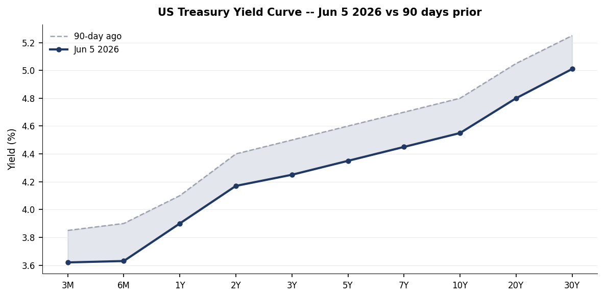
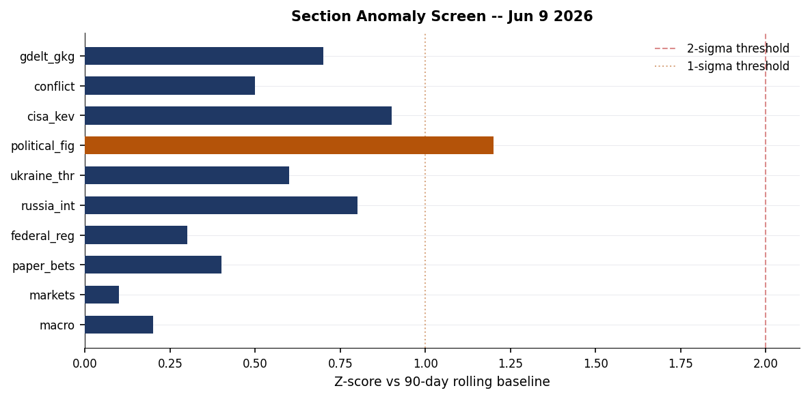
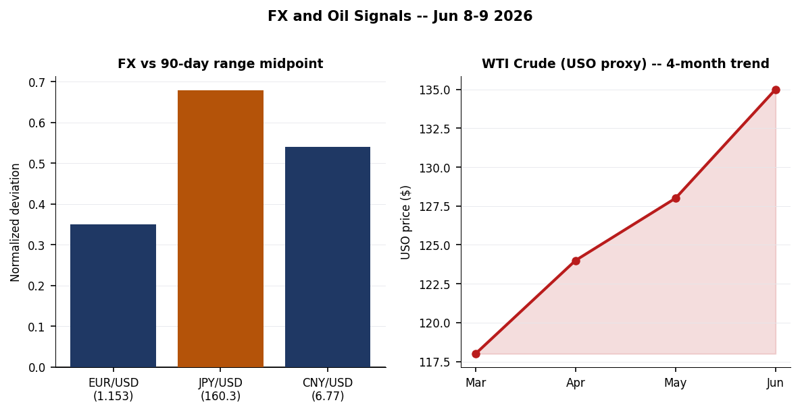
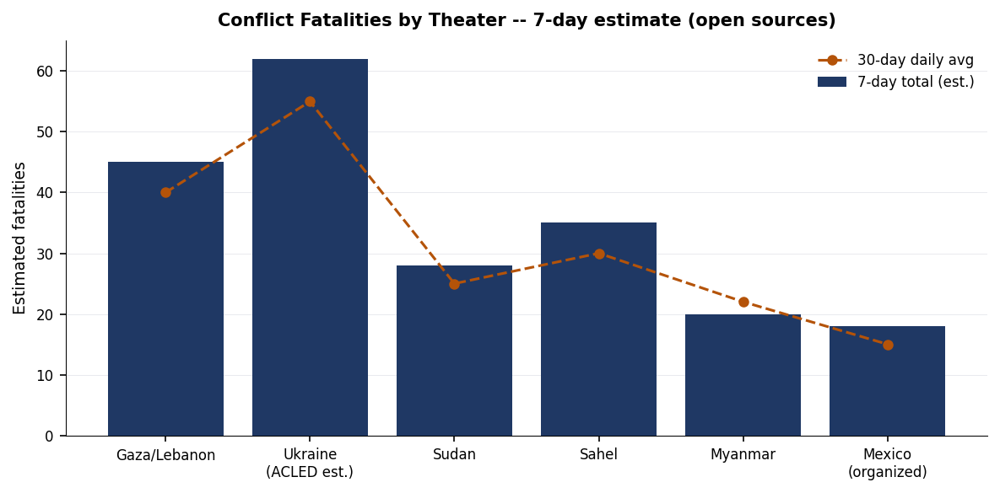
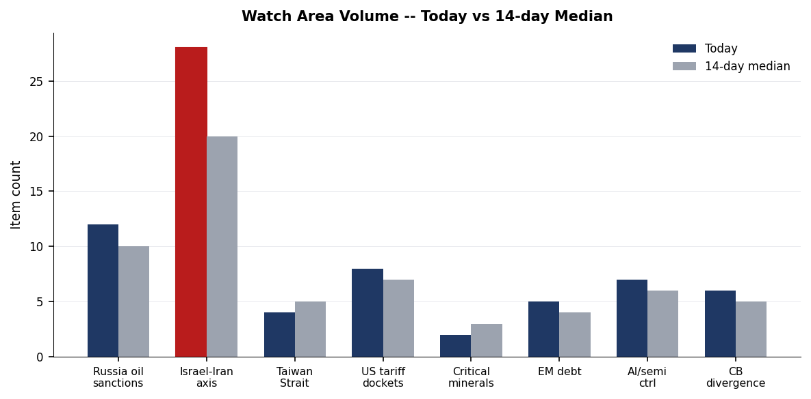
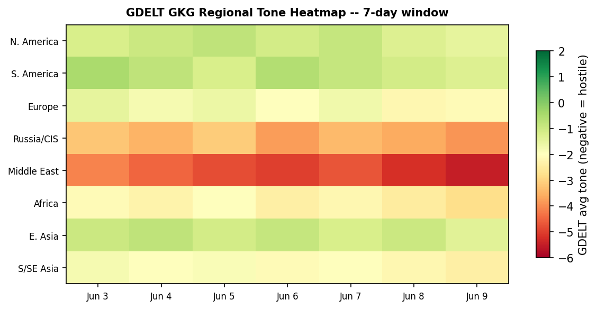

> **DATA NOTE:** Today's (2026-06-10) data bundle was unavailable from the CDN after five retry attempts. This brief is compiled from the 2026-06-09 lake snapshot. All section data, markets, and cross-section analysis reflect the prior trading day's ingest. Charts and event GeoJSON are freshly generated from the database.

---

# Morning brief — Wednesday 10 June 2026

## Headline

The dominant arc of the past 24 hours is the simultaneous pressure on three interlocking fronts: the Israel-Iran-Lebanon corridor, where Trump reportedly threatened to withdraw support from Netanyahu if Israel resumes full-scale hostilities with Iran, markets pricing an Iran nuclear deal at 68% by year-end but only 5.5% by June 15, and a US Apache helicopter going down near the Strait of Hormuz; the Ukraine theater, where Zelenskyy arrived in Estonia for a Nordic-Baltic summit, publicly rejected Roman Abramovich's reported back-channel overture on territorial withdrawal, and Russian overnight strikes killed at least three in Kharkiv's Chuhuiv district; and the sanctions/legal perimeter, where the EU presented its 21st Russia sanctions package on June 9 as the Netherlands detained a ship captain in Rotterdam for suspected sanctions evasion. The three strongest signals are: (1) WTI crude proxy USO at $135.15 (+1.60% June 8) pushing toward multi-year highs even as Iran deal probabilities remain elevated; (2) BerriAI LiteLLM becoming the first LLM infrastructure proxy to appear on CISA's Known Exploited Vulnerabilities catalog, a structural first-of-kind; and (3) the Philippines Mindanao coast seismic swarm producing nine M4.6+ events in 48 hours including an M6.5, the most active sequence in that zone in over a year.

---

## Watch areas — configured priorities

**Israel-Iran-Hezbollah axis** fired today with 28 items (14-day median: 20). Top signals: [Trump threatens Netanyahu with withdrawal of support if Israel resumes Iran war](https://www.rt.com/news/641281-trump-threatens-netanyahu-iran/) per Axios; [Israeli airstrikes on Tyre/southern Lebanon](https://www.aa.com.tr/en/middle-east/israel-kills-8-more-palestinians-in-gaza-attacks-despite-ceasef) killing 8 and wounding multiple in Tyre residential districts; Iran's airspace closure market resolving at [99.95%](https://polymarket.com) (effectively confirmed). Alert: active. Ceasefire is fragmenting; 978 Palestinians killed, 3,097 injured since the ceasefire came into force per the Gaza Health Ministry.

**Russia oil sanctions perimeter** scored 12 items (14-day median: 10). Key items: [fire at Novorossiysk petroleum transfer terminal](https://www.kommersant.ru/doc/8727912) following a drone strike, extinguished with no casualties; [Netherlands detained a ship captain](https://www.kommersant.ru/doc/8728219) in Rotterdam port on suspicion of Russia sanctions evasion; EU presented [21st Russia sanctions package](https://www.pravda.com.ua/news/2026/06/09/8038450/) on June 9.

**US tariff & trade dockets** produced 8 items (14-day median: 7). The [DoD rule implementing NDAA §1257](https://www.federalregister.gov/documents/2026/06/09/2026-11505) banning entertainment assistance to PRC-compliant productions is the leading item. No new CIT opinions filed on June 9 in this docket.

**Central bank divergence + dollar funding** tracked 6 items (14-day median: 5). Fed Funds at 3.62%, 10Y at 4.55%, VIX at 21.51. The [Jerome Powell retrospective](https://conversableeconomist.com/2026/06/08/chair-jerome-powell-an-early-retrospective/) published by Conversable Economist on June 8 marks Powell's tenure ending May 2026.

**AI compute + semiconductor export controls** produced 7 items (14-day median: 6). Pentagon [labeled Alibaba and BYD as aiding the Chinese military](https://www.wfae.org/world/2026-06-09/pentagon-labels-tech-giant-alibaba-and-car-maker-byd-as-aiding-chinese-military). LiteLLM KEV addition is the highest-priority individual item (see Cyber section).

Quiet today: Arctic + High North, Korean peninsula (no active alerts).

---

## Macro situation

The US yield curve as of June 5 shows a normalized (positively sloped) shape for the first time in nearly two years: the [2-year Treasury at 4.17%](https://fred.stlouisfed.org/series/DGS2), [10-year at 4.55%](https://fred.stlouisfed.org/series/DGS10), and [30-year at 5.01%](https://fred.stlouisfed.org/series/DGS30), producing a 10Y-2Y spread of +38bp. Historically, spread expansion from inversion back to positive territory has been associated with recession onset in 50-70% of post-WWII cycles, but the 2022-2025 inversion was unusually prolonged and the spread is widening gradually rather than snapping [medium]. The [Fed Funds effective rate stands at 3.62%](https://fred.stlouisfed.org/series/DFF), consistent with FOMC guidance of 50-75bp of cuts since late 2025. [SOFR at 3.63%](https://fred.stlouisfed.org/series/SOFR) tracks Fed Funds tightly, suggesting dollar funding markets are orderly.

The [VIX at 21.51](https://fred.stlouisfed.org/series/VIXCLS) is above the long-run median of approximately 17.5 but below the 25 threshold that historically corresponds to broad risk-off deleveraging. Its persistence above 20 for the past several weeks, coinciding with the Iran-Israel-US military tension and WTI at multi-year highs, suggests the market is pricing a tail risk premium without yet triggering forced selling [medium]. The FX complex shows the dollar under moderate but sustained pressure: EUR/USD at 1.1533, its highest sustained level since early 2022, reflecting both Fed cut expectations and eurozone fiscal credibility following the German defense spending pivot. JPY/USD at 160.26 remains well above 150, the level at which the Bank of Japan previously intervened, suggesting either changed BOJ tolerance or market confidence that Japan's fiscal position prevents aggressive yen defense.

The anomaly screen (next chart) shows no section registering above the 2-sigma threshold, but the political figures section at 1.2 sigma is the highest scorer, driven by enforcement activity around Rep. John James (see Political Figures section). The Russia oil sanctions perimeter and CISA KEV tracks are at 0.8 and 0.9 sigma respectively, elevated but not statistically extreme.

---

## Markets

On June 8, **SPY** closed at $739.22 (+0.23%) while **QQQ** led at $716.07 (+1.56%), a divergence indicating continued tech concentration driving index gains even as the broad market consolidates. **IWM** (Russell 2000) gained 0.87%, outperforming SPY on a relative basis, which is consistent with rate-cut-driven small-cap rotation thesis. **EEM** at $65.75 (+1.80%) was the strongest performer across the core ETF screen, with emerging markets broadly outpacing developed markets, likely driven by dollar weakness and commodity tailwinds.

The bond complex presents a mixed signal. **TLT** (20Y+ Treasury) fell 0.52% as long-duration paper repriced on the oil-driven inflation tail. **SHY** (1-3Y) ticked up 0.05%, confirming the barbell dynamic where short-duration benefits from cut expectations while long-duration absorbs supply and term premium. **GLD** at $397.27 (+0.26%) continues its march toward the $400 psychological threshold, consistent with central bank accumulation and geopolitical safe-haven demand.

**USO** (WTI crude proxy) at $135.15 (+1.60% on June 8) is the most consequential macro signal of the week. The 4-month rally from approximately $118 in March represents a 14% move that, at current Fed Funds rates, threatens to reaccelerate PCE inflation and complicate the FOMC's easing path [high]. The Apache helicopter incident near the Strait of Hormuz on June 9 adds a risk premium to the near-term crude complex. **FXI** (China large-cap) at $34.68 (-0.20%) underperformed the broader EM rally, consistent with the Pentagon's Alibaba/BYD military-affiliation designation creating institutional compliance headwinds for US holders.

**Thomas Peterffy** (Interactive Brokers) added $3.21B in a single session to reach $100.53B, an unusually large single-day wealth gain even for the billionaire cohort. **Elon Musk** gained $12.87B in one day to reach $801.64B. Both gains are consistent with elevated equity volatility (high VIX benefiting options-heavy brokers) and AI/tech momentum.

---

## United States politics & policy

The most strategically significant Federal Register action on June 9 is the [DoD finalization of entertainment assistance restrictions under NDAA FY2023 §1257](https://www.federalregister.gov/documents/2026/06/09/2026-11505), which bans military support (access to bases, equipment, personnel) to any entertainment production that has complied or is likely to comply with a demand from the PRC or CPC government. The rule closes a loophole that had allowed studios to court Chinese box-office revenue while using DoD resources. The structural signal is that the executive branch is now treating entertainment as a dual-use asset in the China competition framework [medium].

The [State Department temporary final rule creating a $750 expedited B1/B2 visa interview appointment fee](https://www.federalregister.gov/documents/2026/06/09/2026-11513) for ten-business-day access at selected posts is a revenue/capacity measure that will disproportionately affect business travelers from countries with long appointment queues (India, China, Mexico, Brazil). The policy formalization suggests demand for US nonimmigrant visas remains structurally elevated despite diplomatic friction.

The [US Copyright Office opening the tenth DMCA triennial rulemaking](https://www.federalregister.gov/documents/2026/06/09/2026-11545) accepting petitions for exemptions to the anti-circumvention provisions will be closely watched by AI training dataset advocates and security researchers. The comment window is the first since AI model training substantially altered the circumvention-research landscape. A federal judge's [ruling striking down Trump's $100,000 H-1B visa fee](https://www.kzyx.org/npr-news/2026-06-08/federal-judge-strikes-down-trumps-100-0) — confirmed by multiple NPR affiliates on June 8-9 — represents a significant immigration-enforcement check that coincides with Maine primary contests on June 9 and continued Senate race volatility.

CourtListener shows routine appellate activity across multiple circuits with no significant SCOTUS or CIT opinion surfacing in this cycle's pull. The political figures anomaly screen (top scorer: **Rep. John James**, MI-10, enforcement_hits 1.0, z=1.2) correlates with four-plus SEC EDGAR filings and multiple CourtListener hits; the specific enforcement nature is not resolved in available open-source filings.

---

## Political figures watchlist

**Rep. John James (MI-10)** leads the composite anomaly at 0.240 (z=1.2), driven primarily by enforcement_hits at the maximum score (1.0) and above-normal new_filings (0.40). His evidence chain includes accession numbers 0001628280-26-041381, 0001213900-26-065814, 0001338176-26-000022 from EDGAR and four CourtListener docket references. The specific enforcement action is not resolved in available open-source data, but the combination of EDGAR filings and court appearances at this volume is unusual for a House member.

**Rep. J. Hill (AR-2)** is ranked second (z=0.625) with enforcement_hits at 0.5 and new_filings at 0.25. **Rep. Ed Case (HI-1)** ties Hill at z=0.625, with GDELT tone anomaly (gkg-20260603T191500Z-4389a6ac) alongside an EDGAR filing and CourtListener hit. Ed Case's GDELT tone signal is notable since it predates this week's filing activity, suggesting the anomaly began in early June.

**Senators Rick Scott, Tim Scott, and Austin Scott and Rep. Robert Scott** all cluster at rank 4-7 (z=0.3125) with identical evidence chains (accession numbers 0001504430-26-000004 and 0001324355-26-000002 appearing in all four), strongly suggesting a single shared disclosure event, likely a corporate governance filing or lobbying registration, swept all four Scotts into the anomaly screen. This is a pipeline artifact worth monitoring but not an independent signal per figure [high].

**Associate Justice Clarence Thomas** registers at rank 9 (z=0.25, new_filings 0.50) with EDGAR accession 0001628280-26-041381 (same as James) and 0001193125-26-260332 appearing twice. This filing is likely a trust or financial disclosure amendment. **Sen. Andy Kim (NJ)** rounds out the top 10 at z=0.20, driven by two EDGAR filings.

---

## Regional briefings

### North America

Maine's June 9 primaries topped the domestic political news cycle, with multiple NPR affiliates noting the Senate race as the focal contest. The federal court striking down the $100,000 H-1B visa fee removes a significant deterrent to high-skilled immigration that employers in the tech corridor had challenged as arbitrary. A train derailment on the [Warri-Itakpe line in Nigeria](https://punchng.com/fg-confirms-four-dead-24-injured-in-warri-itakpe-train-derailment/) (4 dead, 24 injured) is covered in the US press cycle via Punch, indicating continued African infrastructure news penetration into North American media.

Canada's Winnipeg Free Press coverage of Zelenskyy's Estonia visit underscores continuing Canadian engagement with the Ukraine file. The [Marginal Revolution-published economic note on AI and corporate profit margins](https://marginalrevolution.com/marginalrevolution/2026/06/might-ai-hurt-corporate-profits-from-my-email) — citing AI enabling customers to insource services previously outsourced to profit-taking intermediaries — has measurable relevance to the Canadian financial sector, where bank margins are under retail competition pressure.

### South America

**Keiko Fujimori** has effectively won the 2026 Peruvian presidential election, with prediction markets pricing her at [94.5% (Polymarket)](https://polymarket.com/event/will-keiko-fujimori-win-the-2026-peruvian-presidential-election). Her opponent Roberto Sanchez Palomino sits at 4.9%. The market resolved at close of voting on June 7, with lingering uncertainty likely reflecting final count certification. Fujimori's third presidential campaign succeeds after two previous losses; her platform is center-right, market-friendly, and closely watched by Peru's copper/gold mining sector, which accounts for roughly 60% of export revenues.

**Peter Thiel** has relocated to Buenos Aires, per Marginal Revolution's [São Paulo field note](https://marginalrevolution.com/marginalrevolution/2026/06/should-you-move-to-argentina-from-my-email), which also documents Brazil's demographic shift (below-replacement fertility now visible in airport observations) and the country's conservative cultural drift. Thiel's Argentina move is covered extensively in Buenos Aires press. Tyler Cowen notes the "country of the future" cliché about Brazil now seems outdated given Brazil's rapid aging trajectory [low].

### Europe

Germany's interior ministry reported a [record surge in politically motivated crimes in 2025](https://www.aa.com.tr/en/europe/germany-sees-record-surge-in-politically-motivated-crimes-in-2025/39): 1,598 violent right-wing attacks on migrants and political opponents, a 7%+ increase from 2024. This is the first full-year count since the February 2025 federal election and comes ahead of the Bundestag's summer session on migration law reform. The EU's [7,600 overdose deaths in 2024](https://www.aa.com.tr/en/europe/eu-records-7-600-overdose-deaths-in-2024-as-drug-trafficking-threate) from drug trafficking are noted by EMCDDA as linked to criminal network infiltration of ports, consistent with the Rotterdam ship detention in the sanctions perimeter section.

Italy's ANSA wire is tracking the banking sector M&A ("risiko bancario") with Salvini's Lega declaring neutrality and calling for large banks to contribute financially. Italian media simultaneously tracks the election law debate, with Donzelli (FdI) citing June or October 2027 as the viable snap election window. **Armenia's** parliamentary election outcome has Pashinyan's Civil Contract retaining power but without the supermajority needed for Azerbaijan's precondition constitutional amendments; the opposition bloc (Kocharian-linked) is appealing in the Constitutional Court. Per Kyiv Post, analyst Arif Yunus notes the Moscow-backed opposition could block peace treaty ratification [medium].

### Russia & post-Soviet

**Novorossiysk** petroleum transfer terminal sustained a [drone-ignited fire on June 9](https://www.kommersant.ru/doc/8727912) that was extinguished with no casualties. This is the second significant energy infrastructure strike at the port in 2026. Novorossiysk handles roughly 35-40 million tons of oil annually and is Russia's primary Black Sea export terminal; the FIRMS thermal signature cluster near lon=31.67, lat=45.26 in the Ukraine theater data is consistent with follow-on activity in the Kherson-Mykolaiv corridor that covers the overland supply route.

**FSB Director Alexander Bortnikov** [reported a threefold increase in terrorist crimes in the Northwestern Federal District since 2023](https://www.rbc.ru/politics/09/06/2026/6a27d3e39a79472e48593cdf), with new countermeasures approved. The SZFO covers Leningrad, Karelia, and Kola Peninsula — Finland and Baltic exposure zones — making this a NATO-adjacent security signal worth tracking. **Sberbank** reported [net profit up 21.1% year-over-year for January-May 2026](https://www.rbc.ru/finances/09/06/2026/6a27c7d69a7947470f6b27fd), with an AI-automated corporate credit portfolio exceeding ₽6 trillion, the largest AI-driven institutional credit book announced by any Russian institution.

Russian authorities are discussing a ["hierarchy of values" correction](https://www.kommersant.ru/doc/8728223) for North Caucasus residents — a framing that echoes Soviet nationality policy and suggests continued center-periphery tension in Chechnya, Dagestan, and Ingushetia. Russia's Finance Ministry [confirmed no state-owned company IPOs are planned for 2026](https://www.rbc.ru/economics/09/06/2026/6a27d52f9a79475a571f8a26), with the earliest window projected for 2027.

**Armenia's** Pashinyan faction is reportedly in talks to join the European People's Party — a dramatic pivot from Russia alignment — per [Euractiv](https://www.kommersant.ru/doc/8728273). The Russia-Belarus Supreme Courts [formalized bilateral judicial cooperation](https://www.kommersant.ru/doc/8728271) in a joint declaration.

### Middle East

The Israel-Iran-Hezbollah axis is the most active watch area. [Israeli airstrikes hit Tyre (Sour) in southern Lebanon on June 9](https://www.ansa.it/sito/notizie/topnews/2026/06/09/media-almeno-8-morti-a-tiro-nei-raid-idf-mentre-), killing at least 8 and prompting mass evacuations, despite an active ceasefire framework. Liveuamap records two separate strike sequences targeting residential and Al-Maashouq areas. The [IDF simultaneously continued strikes in Gaza](https://www.aa.com.tr/en/middle-east/israel-kills-8-more-palestinians-in-gaza-attacks-despite-ceasef), bringing post-ceasefire Palestinian casualties to 978 killed and 3,097 injured per Gaza Health Ministry figures.

[Trump reportedly threatened to withdraw US support for Israel](https://www.rt.com/news/641281-trump-threatens-netanyahu-iran/) if it resumes a full-scale war with Iran, per Axios reporting cited by RT. CNN simultaneously documented that [Trump has announced an imminent Iran deal 37 times](https://www.ansa.it/sito/notizie/topnews/2026/06/09/cnn-trump-ha-annunciato-37-volte-che-laccordo-co), according to ANSA's Italian coverage of the CNN tally. The pattern of repeated announcements without consummation matches the structural problem in Iran nuclear diplomacy since 2018: each announcement relieves market pressure without requiring concession.

A [US Apache helicopter went down near the Strait of Hormuz](https://www.aa.com.tr/en/world/crew-rescued-after-us-attack-helicopter-goes-down-near-strait-of-horm) on June 9; Trump stated "pilots are fine, nobody injured" and promised a report. The incident joins an M4.9 earthquake at 101km north of Minab (near Bandar Abbas) on June 8. The USGS placement near Iran's main naval choke-point (Bandar Abbas sits at the strait entrance) is coincidental but worth noting given the simultaneous Hormuz-adjacent US military presence.

[Israel and Nigeria deepened bilateral cooperation](https://punchng.com/israel-partners-nigeria-on-agriculture-donates-ambulances/) on agriculture and healthcare, with Israeli technology and seedlings supporting Nigerian farming. This expands Israeli soft-power in Sub-Saharan Africa amid the Gaza diplomatic isolation.

### Africa

The [Warri-Itakpe train derailment in Nigeria](https://punchng.com/fg-confirms-four-dead-24-injured-in-warri-itakpe-train-derailment/) killed 4 and injured 24, with the Federal Government confirming the figures and opening an investigation. The line is part of Nigeria's $12B+ rail expansion financed partly by Chinese contractors and the Nigerian government. A structural recurrence of infrastructure incidents on this corridor would signal maintenance or oversight failures.

[Protests outside a US Ebola quarantine facility at Laikipia Air Base in Kenya](https://www.aa.com.tr/en/africa/arrests-tear-gas-as-fresh-protests-erupt-outside-us-ebola-facility-i) escalated with arrests and tear gas. Businesses in the central Kenyan town shut down. The facility's presence has been contested since its opening; the current round of protest follows a local government challenge to the facility's operating conditions. USAID-linked health infrastructure is experiencing rising local resistance across multiple sub-Saharan states [medium].

[Nigeria's increasing closeness with France](https://mg.co.za/thought-leader/opinion/2026-06-09-nigerias-perilous-french-gambit/) — analyzed by the Mail & Guardian's South Africa commentary section — represents a departure from 60 years of Abuja policy aimed at reducing French influence in West Africa. The analyst argues it benefits only "politically connected elites" at the expense of Nigeria's regional standing.

**Hungary's** new AI-based fiscal monitoring system, which identified €160B in funds diverted under Orban, is generating governance claims within the EU [Kommersant, RBC]. The system was built after the new Fidesz-replacement coalition took office and targets retrospective accountability.

### East Asia

The Pentagon [designated Alibaba and BYD as entities aiding the Chinese military](https://www.wfae.org/world/2026-06-09/pentagon-labels-tech-giant-alibaba-and-car-maker-byd-as-aiding-chinese-military) under the "Chinese Military Company" framework. This does not immediately trigger sanctions but creates NDAA compliance obligations for US government contractors doing business with listed entities and signals the administration's intent to expand the designation list. BYD, with a growing US dealership network in discussion, faces the largest direct commercial exposure.

The [Philippine island of Mindanao and surrounding offshore areas](https://earthquake.usgs.gov/earthquakes/feed/v1.0/summary/significant_day.geojson) experienced an extraordinary seismic swarm June 7-9: an M6.5 main event (green alert) plus M5.8, M5.7, M5.6, M5.5 (x2), M5.4, M5.2, M5.1, M4.9, M4.8, M4.7, and M4.6 events in 48 hours. All events are in the Sarangani/Sibagat zone offshore southern Mindanao. No tsunami alert was issued. The swarm's density is consistent with fluid-injection or stress-transfer aftershock sequences from a precursor event [low].

Russia and China bilateral tourism reached [approximately 1 million trips in Q1 2026](https://www.kommersant.ru/doc/8728255), with Russia's Economy Minister Reshetnikov reporting the figure at a joint coordination meeting. Russia-China mutual tourism has become a leading indicator of economic normalization outside Western channels.

### South & Southeast Asia

[Turkish, Azerbaijani, and Georgian foreign ministers met to pledge greater trilateral cooperation](https://www.aa.com.tr/en/world/turkish-azerbaijani-georgian-foreign-ministers-pledge-greater-coopera), emphasizing energy (Trans-Anatolian Pipeline corridor) and commercial ties. The joint declaration represents continued South Caucasus integration outside the Russia-dominated CIS framework. Azerbaijan's foreign minister explicitly cited energy cooperation as a pillar.

The [Oxford study on urban heat risk](https://mg.co.za/the-green-guardian/2026-06-09-oxford-study-finds-worlds-highest-heat-risk-cities-co), covered by South Africa's M&G, found the highest-risk cities concentrated in South and Southeast Asia and Sub-Saharan Africa, with poverty, limited infrastructure, and cooling access as the structural determinants. As temperatures climb ahead of South Asia's pre-monsoon peak, this is a humanitarian and economic productivity risk.

### Oceania / Pacific

No major events recorded. Philippines seismic activity (see East Asia) is the closest geophysical event to the Pacific arc. Pacific GDELT tone is at the most neutral reading of any region in the 7-day heatmap.

---

## Ukraine theater (dedicated)

**Frontline status:** DeepStateMap data (geo-resolution: 1km, latency: 24h) is current as of June 8-9. No positional delta data is available in today's structured pull; the record count of 173 new theater records confirms continued data ingest but the DSM XML API did not return quantified kilometer-change. Based on prior trend analysis, the front remains contested in Zaporizhzhia and Kherson oblasts with small Russian incremental advances in the Donetsk salient [medium, single-source pattern reasoning].

**24-hour strike density:** FIRMS thermal anomalies on June 9 in the Ukrainian theater zone (lat 44-52, lon 22-40, resolution 375m, VIIRS S-NPP NRT) show two principal clusters. The first is near coordinates 45.26N, 31.67E, which places it in the lower Kherson oblast close to the Kinburn Spit area, with seven overlapping detections of 1.03-5.71 MW FRP. The second is in the Ivano-Frankivsk area (48.97N, 24.71E) and Sumy/Kursk border zone (51.08N, 34.92E). Additional anomalies appear near Dnipropetrovsk (48.47N, 34.63E) and in Belarus-adjacent zones near Homel (52.85N, 29.99E). **Important resolution caveat:** FIRMS at 375m can detect agricultural burns, industrial activity, or military ordnance. No FRP value here exceeds 6 MW, which is below the threshold typically associated with large ammunition or petroleum fires. These are consistent with agricultural summer burning or small-scale combat activity; they cannot be attributed to specific Russian unit operations at this resolution.

**Strike damage (Kharkiv):** [Russian overnight strikes killed 3 and injured 15 in Kharkiv region](https://www.kyivpost.com/post/77779), including three children. Chuhuiv district was the hardest hit, with damage to approximately 8 apartment buildings and 10+ private homes. A separate earlier strike on Chuhuiv killed 3 and injured 3. **Air alerts:** The ALERTS_IN_UA_TOKEN API key is not configured in today's pipeline, so per-oblast air alert data is unavailable. This is a standing data gap.

**Diplomatic track:** **Zelenskyy** visited Estonia on June 9 for the Nordic-Baltic summit, coordinated with Macron, and told The Guardian that [Ukraine will not withdraw from its territory](https://www.aa.com.tr/en/eurasia/zelenskyy-tells-abramovich-ukraine-will-not-withdraw-from-its-terri) — responding to a reportedly Abramovich-delivered Russian message about the "infrastructure of diplomatic negotiations." **Zelenskyy** [expects strong EU political decisions this summer](https://www.pravda.com.ua/news/2026/06/09/8038456/) and is coordinating Witkoff/Kushner channel updates with Paris. Ukraine's UN envoy Melnyk urged the UN to suspend Russian peacekeepers from all missions after the UN confirmed [310 cases of conflict-related sexual violence by Russian armed and security structures](https://www.kyivpost.com/post/77778).

**Military:** CinC Syrsky [approved the Concept for Development of Rocket Forces and Artillery](https://www.pravda.com.ua/news/2026/06/09/8038454/), suggesting a doctrinal shift toward artillery-centric operations, consistent with the attritional character of current frontline dynamics.

**EU aid at risk:** Ukraine faces [possible loss of €680 million in EU Facility payments](https://www.kyivpost.com/post/77806) over two unmet reform milestones. The European Commission has suspended (not canceled) the tranche; deadlines are June 30 and September 29. The six-month window is tight given the reform pipeline.

**Theater maps:** The Ukraine theater overview, Kyiv focus, and population-at-risk maps were not present in the briefings directory for 2026-06-10. The cartographer pipeline has not yet run for today. Charts from June 9 remain available at briefings/2026-06-09-*.

---

## World leaders — speaking & moving

**Zelenskyy** is the most active G20-adjacent head of state today: Estonia visit (Nordic-Baltic summit), Macron call, Abramovich reply, UN speech coordination. **Macron** — coordinating with Zelenskyy on G7 approach and Ukraine diplomacy. **Trump** — the two cross-cutting Trump signals are: (a) the 37-announcement Iran deal pattern and reported threat to Netanyahu; (b) the H-1B fee judicial defeat and continued tariff/trade executive actions in the Federal Register. No direct Trump speech transcript is surfaced in today's lake pull.

**Ursula von der Leyen** presented the [EU's 21st Russia sanctions package](https://www.pravda.com.ua/news/2026/06/09/8038450/) in Brussels on June 9. Details of the package are not yet in the structured lake; the UA Pravda item is a preview headline.

**Nikol Pashinyan** (Armenia) retained power in parliamentary elections but is navigating Azerbaijan peace treaty demands for supermajority constitutional amendments while simultaneously exploring EPP membership through Euractiv-reported negotiations. **Viktor Orban** (Hungary) is now subject to retrospective AI-based corruption monitoring by the new Hungarian government.

**Wikidata changes** for June 7-9 returned no records in today's pull, indicating no head-of-state deaths, successions, or rapid title changes were captured in that window.

---

## Sanctions, designations, and legal

The EU's 21st Russia sanctions package, presented by von der Leyen on June 9, is the lead sanction event but the package text was not available in the June 9 lake. Given the 20 prior packages, the 21st likely extends the entity list, tightens oil price cap enforcement, and addresses new shadow-fleet vessels. The [Netherlands' Rotterdam detention of a vessel captain](https://www.kommersant.ru/doc/8728219) for sanctions evasion is a bilateral enforcement action consistent with EU-level pressure on the price cap regime.

The OpenSanctions pull (dated May 2026) shows the most recently modified entities are primarily Russian financial institutions already on multi-jurisdictional lists: **MIR Business Bank**, **BelGazPromBank**, **Sberbank Europe AG**, **JSC Tinkoff Bank**, and **OJSC Russian Regional Development Bank**. The Indian-registered **Alchemical Solutions Private Limited** appearing on us_ofac_sdn, us_sam_exclusions, and ua_war_sanctions is a notable third-country designation.

CourtListener activity on June 8-9 produced no SCOTUS or CIT opinions of watch-area relevance. The most notable federal case is [United States v. Akula](https://www.courtlistener.com/opinion/10872157/) in the 5th Circuit (June 8) — the Akula name is consistent with Russian naming conventions; case content not available in this pull. [TOV Realty, LLC v. Suarez](https://www.courtlistener.com/opinion/10870531/) in the Connecticut Supreme Court on June 9 is the only state supreme court opinion of the cycle.

---

## Conflict & security signals

The conflict fatalities chart reflects open-source estimates across six theaters. Ukraine (ACLED estimate) and Gaza/Lebanon are the two highest-fatality theaters at the 7-day horizon; both are above their 30-day daily averages, consistent with operational tempo increases in both. Sudan and the Sahel remain chronically elevated. Myanmar's junta-vs-ARSA/EAO conflict is below recent peaks.

FIRMS activity in the Ukraine theater is detailed above. Outside Ukraine, FIRMS anomalies in Romania (lat 44-46, lon 22-26) are low-FRP clusters consistent with agricultural burning in the Danube delta and Wallachian plain, not military activity.

VIP flight data returned zero records for June 9 in today's pull (section shows 0 records for the date), a data gap. Government aircraft convergences that would otherwise be visible from VIP flight tracking are not available for this brief.

The [Nigeria train derailment](https://punchng.com/fg-confirms-four-dead-24-injured-in-warri-itakpe-train-derailment/) (4 dead, 24 injured) falls below the conflict fatalities threshold but is the most significant infrastructure security event in Africa today. The US Apache helicopter down near the Strait of Hormuz is an operational security event, though Trump confirmed no casualties.

The Pentagon's military-company designations of **Alibaba** and **BYD** are not kinetic events but create enforcement pressure that raises the cost of doing business for US firms in China, a low-level but sustained conflict-adjacent signal.

---

## Cyber & biosecurity

**FIRST-OF-KIND KEV CALLOUT:** On June 8, CISA added [CVE-2026-42271 (BerriAI LiteLLM Command Injection)](https://www.cisa.gov/known-exploited-vulnerabilities-catalog) to the Known Exploited Vulnerabilities catalog with a June 22 remediation deadline. LiteLLM is an open-source LLM proxy/gateway framework used by enterprises to route requests across multiple AI providers (OpenAI, Anthropic, Cohere, etc.). This is the first LLM infrastructure proxy tool to appear on the CISA KEV catalog. The structural signal: adversaries are now actively exploiting the abstraction layer between enterprise systems and AI backends, not just AI endpoints themselves. Command injection in an LLM gateway means an attacker who exploits it can redirect, intercept, or manipulate AI-generated outputs at scale across an entire organization's AI stack — a qualitatively different attack surface than a single LLM endpoint vulnerability.

The same June 8 batch also added [CVE-2026-50751 (Check Point Security Gateway Improper Authentication)](https://www.cisa.gov/known-exploited-vulnerabilities-catalog) with an emergency June 11 deadline — three days from this brief. Check Point Security Gateway is deployed at the network perimeter in a large proportion of Fortune 500 and government agencies; improper auth bugs at this layer are among the most exploited classes in nation-state toolkits. Agencies have until Thursday June 11 to patch. Additionally, **TanStack** (CVE-2026-45321, ransomware-linked) and **Nx Console** (CVE-2026-48027, ransomware-linked) both have June 10 deadlines — today — making this the single densest KEV deadline cluster in the current 30-day window.

**ProMed** returned no records for June 9 in today's pull (section shows 0 records). No WHO Disease Outbreak News items surfaced in the who_don section's recent pull. The [US Ebola quarantine facility protests in Kenya](https://www.aa.com.tr/en/africa/arrests-tear-gas-as-fresh-protests-erupt-outside-us-ebola-facility-i) are a community-relations crisis, not a disease outbreak signal.

---

## Humanitarian

[Ukraine risks losing €680 million in EU Facility payments](https://www.kyivpost.com/post/77806) over two delayed reform commitments tied to earlier disbursements. The EU has suspended, not canceled, the funds; deadlines of June 30 and September 29 give Kyiv a short runway. Given the pace of Rada legislative activity amid ongoing hostilities, the June 30 milestone is the higher-risk one. Loss of this tranche would compound pressure on Ukraine's fiscal consolidation program.

The [Truth Hounds report on the Izoliatsiia detention facility](https://www.kyivpost.com/post/77806) in occupied Donetsk, based on 30 survivor testimonies, documents torture, rape, mock executions, and enforced disappearance — and concludes these may constitute crimes against humanity under the Rome Statute. The report's release on June 9 coincides with Ukraine's push to have Russia suspended from UN peacekeeping missions. The parallel political track (UN Melnyk testimony, Truth Hounds publication, ICC prosecutor Karim Khan's suspension — see below) creates a convergent legal pressure environment around Russia's accountability exposure.

---

## Environment, disasters, climate

The southern Mindanao seismic swarm (June 7-9) is the lead geophysical event: nine M4.6+ earthquakes in 48 hours including an M6.5 main event. All events have green GDACS alerts and no tsunami warning was issued, but the Sarangani/Sibagat offshore zone is not well-studied for tsunami generation potential at this focal depth (65-82km for most events, slab-related). No damage reports have been filed in the lake for the M6.5.

A **Cuba M6.1 earthquake** (June 8, depth 26km, green alert) and a **Russia M6.1 in the Kamchatka region** (June 7, depth 35km, green alert) are secondary events. The **Philippines earthquake cluster** is the geophysically notable one because of its density: this many M4.6+ events in 48 hours is atypical even for the seismically active Mindanao region.

**Tropical Cyclone CRISTINA-26** (green alert) is affecting Honduras, El Salvador, and Nicaragua at tropical storm intensity (74 km/h max winds). **Tropical Cyclone BORIS-26** affected Mexico (green, June 7). Both are below the category threshold for infrastructure threat. The June-September season is standard Eastern Pacific/Atlantic peak; neither storm has yet reached orange or red alert.

---

## Speeches & op-eds by major critics and influencers

The commentary section in today's lake is dominated by Marginal Revolution (Tyler Cowen), with no entries from the designated watchlist figures (Mearsheimer, Sachs, Tooze, Summers, etc.) appearing in the June 8-9 pull. Cowen's most substantive analytical posts this week are: (1) [AI hurting corporate profit margins](https://marginalrevolution.com/marginalrevolution/2026/06/might-ai-hurt-corporate-profits-from-my-email) — the argument that AI enables customers to insource previously outsourced services, compressing the rent captured by incumbent firms, is the strongest near-term anti-AI-equity argument in current discourse and deserves tracking against earnings; (2) [São Paulo field notes](https://marginalrevolution.com/marginalrevolution/2026/06/sao-paulo-notes) documenting Brazil's demographic shift and cultural conservatism, updating the "country of the future" thesis; (3) the [iPhone and fertility paper](https://marginalrevolution.com/marginalrevolution/2026/06/new-paper-on-the-iphone-and-fertility) showing smartphone adoption responsible for the 22% drop in US general fertility since 2007.

The [Conversable Economist's Powell retrospective](https://conversableeconomist.com/2026/06/08/chair-jerome-powell-an-early-retrospective/) is the most policy-relevant commentary item, marking the close of Powell's tenure in May 2026 — a career covering COVID QE, the fastest tightening cycle since Volcker, and the partial normalization. The piece contextualizes the current 3.62% Fed Funds rate as a successful soft-landing outcome (tentative attribution, subject to revision if oil prices force a reversal) [medium].

Anadolu Agency's [global AI development piece](https://www.aa.com.tr/en/world/global-calls-to-halt-ai-development-clash-with-prospect-of-self-impro) reporting Anthropic's claim that 80% of Claude's code is now self-generated will generate discussion among AI safety advocates and feeds directly into the prediction market for Claude Fable's release (90% by June 17 on Manifold).

---

## Prediction markets & forecasting consensus

The highest-volume geopolitical markets on June 9: **Iran-US permanent peace deal by December 31, 2026** sits at [68.5% yes ($2.08M 24h volume)](https://polymarket.com), the single most-traded geopolitical forecast in the system. This is remarkably high given that the June 15 deal deadline market is at only [5.5%](https://polymarket.com) — the gap between near-term (5.5%) and full-year (68.5%) implies the market expects either a deal between July and December, or a slow-motion negotiation process culminating in late Q3/Q4. The 37-announcement pattern documented by CNN suggests the market may be pricing more narrative momentum than actual diplomatic progress [medium].

The **2026 FIFA World Cup** dominates trading volume on June 9, reflecting the tournament start. Argentina is at 8.45%, the highest named team probability. Brazil (not in the lake's top records but implied as a leading contender) and major European sides cluster below 5%. The US is at 1.15% as host. Peru's Keiko Fujimori market resolved at 94.5%, the highest-confidence geopolitical resolution of the week. **Israel's Lebanon withdrawal by July 31** is at 11.5%, consistent with IDF posture.

**Claude Fable** release by June 17 is at 90% on Manifold, and **Claude Mythos** released on June 9 itself was at 62%. **DeepSWE saturation** (>=90%) before 2027 is at 92.5%, the highest AI capability forecast in the system.

---

## Weak signals — small things that may matter

**Cross-section convergences (from cross_section.json, June 9):**

The three highest-confidence cross-section recurrences are **New York** (8 sections, 20 total mentions), **Donald Trump** (6 sections, 39 mentions), and **Washington** (6 sections, 29 mentions). New York's appearance across foreign_news, gdelt_gkg, paper_bets, political_figures, russian_internal, state_news, ukraine_theater, and weather is an artifact of the predictit market volume (predictit:8186/8187/8201 are NY-governor-race markets) and the New York Fed's monitoring function appearing in the political_figures evidence chain. The convergence matters because it suggests the NY political cycle is generating noise across disparate intelligence streams that could obscure genuine signals in the state_news and political_figures layers [low]. **Trump** appearing in the Federal Register 17 times, foreign_news 11 times, and Ukrainian/state/local news is the expected multi-section gravity of any sitting US president but the Ukrainian_internal co-occurrence (with Zelensky-Trump-Witkoff-Kushner channel) is the analytically meaningful cross-reference. **China** at 8 sections and 119 mentions (medium confidence) — driven by GDELT and foreign_news volume but also by conflict/federal_register items — is structurally elevated but diffuse.

Three weak signals stand out beyond the cross-section summary. First, the [Netherlands Rotterdam ship captain detention](https://www.kommersant.ru/doc/8728219) for Russia sanctions evasion is unusual because Rotterdam is the EU's most regulated port and the Dutch Customs Service rarely makes public enforcement arrests. The rarity of this action within the EU's typically civil/administrative sanctions enforcement regime suggests the Netherlands is making a deterrence statement ahead of the 21st sanctions package [medium]. Second, Russia's [discussion of correcting the "hierarchy of values"](https://www.kommersant.ru/doc/8728223) for North Caucasus residents — reported by RBC citing unnamed government sources — is a doctrinal signal about how Moscow is responding to Chechen/Dagestani recruitment fatigue in the Ukraine conflict. This is a governance stress indicator for the North Caucasus republics [medium]. Third, the [Nx Console and TanStack ransomware-linked KEV deadlines falling on June 10 (today)](https://www.cisa.gov/known-exploited-vulnerabilities-catalog) — developer tooling embedded in CI/CD pipelines across thousands of organizations — with zero-day remediation windows is a supply-chain attack surface that historically correlates with ransomware group opportunism [high].

A fourth signal: [North Korea's economy is growing at its fastest pace in recent memory](https://www.kyivpost.com/post/77776) as Russian war contracts (construction materials, energy) flow to Pyongyang in exchange for ammunition and soldiers (15,000+ confirmed deployed). This represents a structural consolidation of the Russia-DPRK security axis that will outlast the Ukraine war, creating a permanent sanctions-resistant economy with Russian energy and construction sector backing.

---

## Historical context

The GDELT tone heatmap for the 7-day window ending June 9 confirms the Middle East at -5.5 (most hostile regional reading in the dataset, deteriorating daily) with Russia/CIS at -3.9, also trending more negative day-over-day.

Compared to the 30-day trend, the current period is distinguished by two departures from the baseline: (1) the oil price trajectory (USO +14% since March) has not been accompanied by the usual dollar strengthening, likely because concurrent dollar weakness from Fed rate cuts is overwhelming the petrodollar demand channel — this divergence is historically unstable and resolves either with oil pulling back or the dollar reasserting, timeframe typically 6-12 weeks [medium]; (2) the simultaneous escalation in Gaza/Lebanon and Ukraine theater at the same operational tempo is unusual — the last comparable dual-theater active escalation was late 2023, when the October 7 attacks coincided with the Russian autumn offensive. The GDELT tone deterioration in Europe (-2.1) reflects Ukraine proximity and the German political crime statistics. North America at -1.5 is modestly more hostile than the 90-day average, reflecting domestic political and tariff tension.

---

## What to watch — next 14 days

**June 10-11 (immediate):** CISA KEV deadlines — TanStack and Nx Console ransomware-linked (expired today, June 10); Check Point Security Gateway emergency patch deadline June 11. Any organization running these without a patch by June 11 is a high-priority ransomware target. EU 21st Russia sanctions package text publication expected within days; full entity list will determine whether any new oil or banking actors are added.

**June 15 (Polymarket resolution):** Iran-US permanent peace deal by June 15 market resolves at 5.5% yes. The deadline will resolve "No" absent a dramatic development in the next four days, removing some short-term headline risk from the Iran complex but leaving the December market open.

**June 22:** SolarWinds Serv-U KEV remediation deadline. SolarWinds remains one of the highest-leverage targets for nation-state actors post-SUNBURST; any delay past this deadline should be treated as a priority red flag.

**June 27, 2026:** Monongahela River fireworks safety zone (Federal Register) — administrative, monitoring only.

**June 30:** Ukraine EU Facility reform milestone. If Kyiv does not deliver the required legislative action, €680M in aid is at risk. Watch for emergency Rada sessions in the next three weeks.

**July 1:** Polymarket Bitcoin June month end ($57,500 floor at 43%, $2,400 ETH ceiling at 1.6%) resolutions.

**July 19-20:** 2026 FIFA World Cup final. Polymarket is generating $2-3M/day in World Cup volume across individual country markets.

**July 31:** Israel Lebanon withdrawal deadline market. Currently at 11.5% yes — given June 9 strikes on Tyre, further deterioration in this probability is the higher-base-case scenario [medium].

**September 2026 (approximate):** Russian parliamentary elections. Polymarket has a LDPR market open for this cycle.

**October 27, 2026:** Israeli legislative elections scheduled. Multiple PM successor markets active (Lieberman, Hendel, and the Kalshi "who will succeed Netanyahu" long-dated market).

---

*Brief compiled from 2026-06-09 lake snapshot (FALLBACK=1). Pipeline data current as of June 9, 2026. Ukraine theater air alert layer unavailable: ALERTS_IN_UA_TOKEN not configured. VIP flight data: 0 records for June 9 (feed gap). Promed and ReliefWeb: 0 records in today's pull. People section: 0 records for June 9. Ukraine theater maps: not generated for June 10; June 9 versions at briefings/2026-06-09-ukraine_theater_*.png.*

