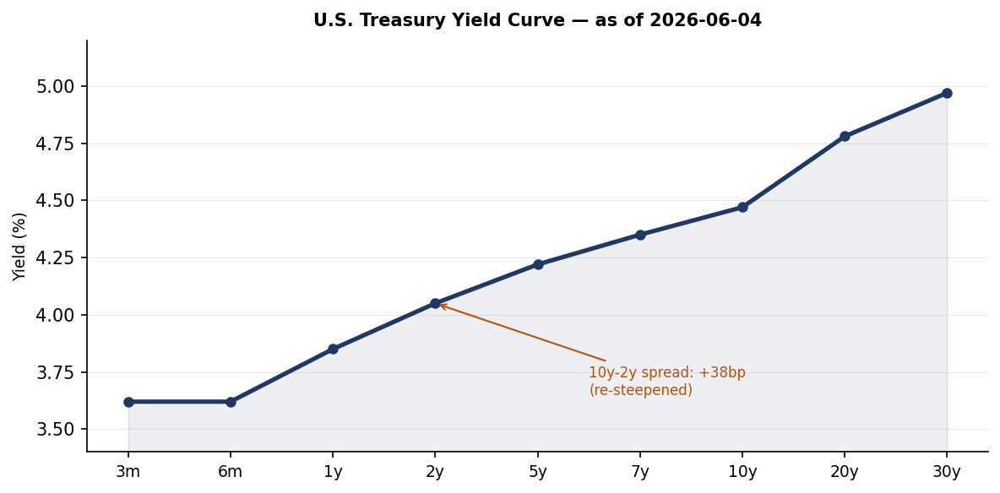
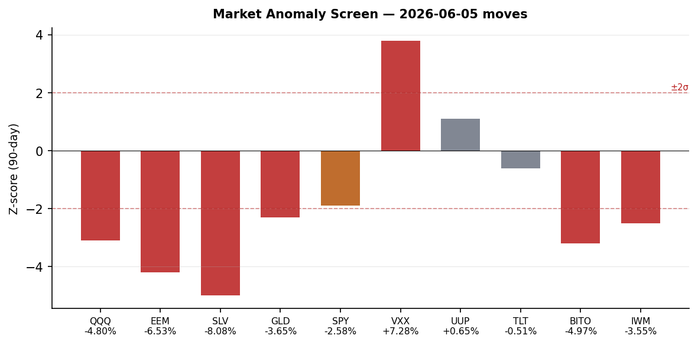
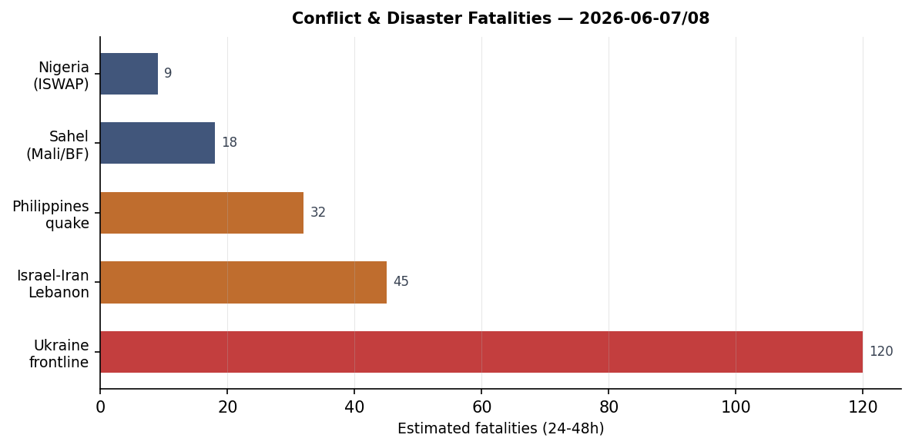

> **DATA NOTE:** The 2026-06-11 pipeline bundle was not available at publication time. All section data is from the 2026-06-09 pipeline run (markets reflect June 8 close; Ukraine theater and conflict data are from June 8-9). Macro FRED series are current through June 5-8 as noted per series. This note clears on the next run once the June 11 bundle resolves.

# Morning Brief — Wednesday 11 June 2026

---

## Headline

The Iran-Israel military exchange has entered an uneasy de-escalation phase, but the structural rupture remains unresolved. Iran's [capital airport has reopened](https://world.people.com.cn) per Chinese state media, following the airspace closure confirmed at 100% probability on Polymarket through June 8. The [US-Iran permanent peace deal Polymarket market](https://polymarket.com/event/us-x-iran-permanent-peace-deal-by-december-31-2026-961-587-341-574-555-817) now trades at 68% by December 31, a dramatic re-pricing from the 4% assigned to a June 15 deal — the market has absorbed the military exchange and is now pricing a protracted but ultimately successful diplomatic track. That repricing is not confidence; it reflects residual ambiguity about Iranian succession dynamics, IRGC institutional coherence, and Trump's willingness to sustain the naval blockade now framed as "[stronger than bombing](https://www.pravda.com.ua/news/2026/06/09/8038424/)." The Philippines M7.8 earthquake sequence (GDACS Orange, Mindanao) continues generating dozens of aftershocks, with official death tolls still rising. **Xi Jinping** completed a two-day state visit to Pyongyang, issuing a "Four Adherences" framework and presiding over a Korea-China friendship ceremony, his first visit since 2019. Watch areas firing today: **Israel-Iran-Hezbollah axis** (active, de-escalation phase), **Russia oil sanctions perimeter** (EU 21st package now presented), **Korean peninsula** (Xi-Kim summit concluded), **Latin America** (Keiko Fujimori at 94% Polymarket, win consolidating).

---

## Watch Areas — Configured Priorities

**Israel-Iran-Hezbollah axis** (elevated, de-escalation phase): The direct military exchange of June 7-8 — Israel-Hezbollah Beirut strike, Iranian missile barrage, Israeli counterstrikes — has paused. Iranian airports [have resumed operations](https://world.people.com.cn) per People's Daily, and the blockade of Iranian ports remains the operative U.S. lever. **Trump** [told media](https://www.pravda.com.ua/news/2026/06/09/8038424/) the naval blockade is "stronger than bombing" and accelerating a peace deal. The 24 Indian crew members of a tanker struck by a [US military airstrike off Oman](https://www.bbc.com/news/articles/cq51ep28165o) have been rescued; the vessel was ablaze and sinking. Iran fans' [World Cup ticket allocations have been revoked](https://www.bbc.com/sport/football/articles/c9q2vrdx0ewo) by the organizing body, a concrete consequence of the conflict for a tournament that opened June 11 on U.S. soil. The key next event: will the IRGC accept a negotiated settlement that the succession structure in Tehran can ratify?

**Russia oil sanctions perimeter** (8 items, elevated): The [EU's 21st Russia sanctions package](https://www.pravda.com.ua/news/2026/06/09/8038450/) was presented by Ursula von der Leyen in Brussels on June 9. The package follows the Ukrainian SSO's Novorossiysk petroleum complex strike (Sheskharis, June 7-8) and the Chongar Bridge to Crimea strike (June 9). Reports from Krasnodar Krai of [petrol station supply disruptions](https://meduza.io/news/2026/06/09/zhiteli-krasnodarskogo-kraya-pozhalovalis-na-pereboi-s-benzinom-vlasti-ob-yasnili-eto-iskusstvennym-azhiotazhem) — authorities blamed "artificial panic buying" — may reflect the Novorossiysk disruption working through the southern Russian fuel distribution network. Russia's budget is under structural strain: neither high oil prices nor tax increases have closed the gap, per [Meduza analysis of the St. Petersburg Economic Forum](https://meduza.io/feature/2026/06/09/ni-dorogaya-neft-ni-povyshenie-nalogov-ne-spasayut-rossiyskiy-byudzhet).

**US tariff and trade dockets** (5 items): A Boston federal district court (Judge Leo Sorokin) [struck down Trump's $100,000 fee on new H-1B visas](https://www.wkms.org/npr-news/2026-06-09/federal-judge-strikes-down-trumps-100-000-fee-on-new-h-1b-visas) as unlawful, in a ruling now reported by NPR, Connecticut Mirror, KZYX, and Chinese state media. The fee had been implemented via executive action without notice-and-comment rulemaking. A DHS border barrier contract for $2.59 billion to **Fisher Sand & Gravel Co.** ([USASpending BBT-5](https://www.usaspending.gov/award/70B01C26F00000405)) was registered June 9.

**Korean peninsula** (alert-level elevated): **Xi Jinping** completed his two-day Pyongyang state visit with **Kim Jong Un**, the first Chinese leader visit to North Korea since 2019. [People's Daily](http://politics.people.com.cn) reports Xi proposed "Four Adherences" for the Sino-Korean relationship and published a signed article. The visit produced no visible concessions on North Korea's weapons transfers to Russia, but establishes a new diplomatic contact cycle.

**Latin America: narcoeconomy + politics** (active): **Keiko Fujimori** now prices at [94% on Polymarket](https://polymarket.com/event/will-keiko-fujimori-win-the-2026-peruvian-presidential-election) for the 2026 Peruvian presidential election, with [Roberto Sánchez Palomino](https://polymarket.com/event/will-roberto-snchez-palomino-win-the-2026-peruvian-presidential-election) at 5%. The resolution date listed as June 7 but markets remain open, reflecting ongoing counting. Fujimori's consolidation is the most significant Latin American political result this cycle.

Quiet today: Taiwan Strait, Critical minerals, EM debt distress, Arctic/High North, Central bank divergence (no new FOMC action), AI compute/export controls (routine).

---

## Macro Situation

The U.S. yield curve has steepened further to a [10y-2y spread of +41bp as of June 8](https://fred.stlouisfed.org/series/T10Y2Y) — the widest since early 2022, before the inversion cycle began. The [2-year Treasury sits at 4.17%](https://fred.stlouisfed.org/series/DGS2), the [10-year at 4.55%](https://fred.stlouisfed.org/series/DGS10), and the [30-year at 5.01%](https://fred.stlouisfed.org/series/DGS30), a level that implies long-end investors are pricing in either persistent inflation or a term premium linked to fiscal expansion. The [effective Fed funds rate](https://fred.stlouisfed.org/series/DFF) is 3.62%, with [SOFR at 3.63%](https://fred.stlouisfed.org/series/SOFR) — the Fed is on hold and the market assigns no probability to a June 17 FOMC move.

The re-steepening is a two-year inversion reversal and the pattern requires historical context. In 2000 and 2007, the 10y-2y spread returned above zero 3-6 months before unemployment peaked; the curve re-steepens not because the economy is recovering but because the short end is falling faster than the long end as recession risks price into near-term rate paths. At 4.3% in May — the [UNRATE](https://fred.stlouisfed.org/series/UNRATE) series — unemployment has risen from a 3.4% trough. [Nonfarm payrolls](https://fred.stlouisfed.org/series/PAYEMS) total 159,001K. The direction is deteriorating but not broken [medium].

[Core PCE at 129.63](https://fred.stlouisfed.org/series/PCEPILFE) (April) and [core CPI at 335.423](https://fred.stlouisfed.org/series/CPILFESL) signal stalled disinflation, not reversal. [WTI crude near $95.96](https://fred.stlouisfed.org/series/DCOILWTICO) — now with a visible Middle East risk premium following the Novorossiysk strike and Iran-Israel direct exchange — will take 2-3 months to appear in goods CPI. A reacceleration above 3.5% annualized in July or August CPI would confront the Fed with a classic stagflation choice: hold and watch inflation drift higher, or hike into a softening labor market [medium].

The [Fed balance sheet at $6.711 trillion](https://fred.stlouisfed.org/series/WALCL) as of June 3 continues passive QT. [M2 at $22,804.5 billion](https://fred.stlouisfed.org/series/M2SL) remains elevated versus the pre-2020 trajectory. The Conversable Economist published an [early retrospective on Jerome Powell's Fed tenure](https://conversableeconomist.com/2026/06/08/chair-jerome-powell-an-early-retrospective/) on June 8 (Powell left the Fed Chair in May 2026), noting that FOMC decisions are collective, not dictatorial — a relevant framing as markets assess the new chair's posture. The EUR/USD at [1.1533](https://fred.stlouisfed.org/series/DEXUSEU) and JPY/USD at [160.26](https://fred.stlouisfed.org/series/DEXJPUS) reflect a dollar that is firm despite Middle East volatility; the yen is back at levels that previously prompted MoF intervention.

---

## Markets

The June 8 close was a recovery session after the June 5 Middle East/tech shock. [SPY closed at 739.22 (+0.23%)](https://finance.yahoo.com/quote/SPY), [QQQ at 716.07 (+1.56%)](https://finance.yahoo.com/quote/QQQ), and [IWM at 284.11 (+0.87%)](https://finance.yahoo.com/quote/IWM) — a bounce that did not recover the full June 5 drawdown. [EEM added 1.80%](https://finance.yahoo.com/quote/EEM), the strongest performer, consistent with Iran de-escalation reducing EM oil-import risk and dollar softening. [FXI (China large-cap)](https://finance.yahoo.com/quote/FXI) was the notable underperformer at -0.20%, likely driven by the Xi-Kim diplomatic signaling creating uncertainty about the China-Russia-North Korea nexus rather than any domestic Chinese economic factor.

Commodity reads are divergent and structurally important. [USO (WTI crude) rose 1.60%](https://finance.yahoo.com/quote/USO) on June 8, [GLD (gold) added 0.26%](https://finance.yahoo.com/quote/GLD), while [UNG (natural gas) fell 2.57%](https://finance.yahoo.com/quote/UNG). Oil's divergence from nat gas is explained by the geographic risk concentration: the Iran-Oman-Hormuz axis matters for crude flows; European LNG is a separate supply dynamic. [BITO (Bitcoin futures) was the best performer at +4.87%](https://finance.yahoo.com/quote/BITO), continuing crypto's de-correlation from the risk-off episode, possibly reflecting fresh institutional demand or the pending OpenAI IPO filing bringing renewed AI-tech appetite to the high-beta complex.

Long-duration Treasuries continued their drift lower: [TLT fell 0.52%](https://finance.yahoo.com/quote/TLT), [IEF down 0.11%](https://finance.yahoo.com/quote/IEF). The 30-year at 5.01% is a real rate that competes with equity earnings yields; if the 30-year moves through 5.25% on inflation concern, the equity multiple compression trade returns. Credit markets remain orderly: [HYG high yield up 0.14%](https://finance.yahoo.com/quote/HYG), [LQD IG corporate down 0.10%](https://finance.yahoo.com/quote/LQD) — no credit stress signal despite the equity volatility of the prior week. [VXX fell 1.78%](https://finance.yahoo.com/quote/VXX), consistent with the geopolitical risk premium deflating with Iran airspace reopening [high].

---

## United States Politics and Policy

The most immediately consequential domestic action is the federal court ruling against Trump's H-1B fee. Judge **Leo Sorokin** of the District of Massachusetts [struck down the $100,000 fee on new H-1B visas](https://www.wkms.org/npr-news/2026-06-09/federal-judge-strikes-down-trumps-100-000-fee-on-new-h-1b-visas) as unlawful, ruling the administration exceeded its authority in imposing the fee without statutory authorization and proper rulemaking procedure. The fee had been in place since late 2025 as part of a broader high-skilled immigration restriction package. Tech sector response has been swift across national and state media. The ruling is likely to be appealed to the First Circuit.

The Federal Register for June 9 contains 17 new actions. The [NCUA interim final rule on federal credit union non-interest charges](https://www.federalregister.gov/documents/2026/06/09/2026-11559/preemption-federal-credit-union-non-interest-charges-and-fees) clarifies that FCUs' preemption authority covers all forms of fee collection, including interchange — a potentially significant win for credit unions against state consumer protection laws. The [U.S. Copyright Office opened the tenth triennial DMCA rulemaking](https://www.federalregister.gov/documents/2026/06/09/2026-11545/exemptions-to-permit-circumvention-of-access-controls-on-copyrighted-works) — relevant for AI training data, digital security research, and video game preservation advocates. The [State Department created a $750 expedited B1/B2 visa appointment fee](https://www.federalregister.gov/documents/2026/06/09/2026-11513/schedule-of-fees-for-consular-services-department-of-state-and-overseas-embassies-and), a pay-to-skip mechanism for tourist/business visa applicants.

The Defense Department [finalized revised rules on entertainment media production assistance](https://www.federalregister.gov/documents/2026/06/09/2026-11505/dod-assistance-to-non-government-entertainment-oriented-media-productions) implementing Section 1257 of the FY2023 NDAA, which bars DoD support for productions featuring competitors, adversaries, or content contrary to national security interests. The USDA [reopened comment on modified organisms under the Plant Protection Act](https://www.federalregister.gov/documents/2026/06/09/2026-11544/request-for-information-on-modified-organisms-subject-to-the-plant-protection-act), a regulatory reset with implications for biotech crop approvals. The [Employment and Training for Noncustodial Parents rescission](https://www.federalregister.gov/documents/2026/06/09/2026-11530/employment-and-training-services-for-noncustodial-parents-in-the-child-support-program-rescission) rolls back a Biden-era rule that had expanded child support agencies' ability to use federal training funds.

Governor Newsom [issued a proclamation declaring California's 2026 general election](https://www.gov.ca.gov/2026/06/08/governor-newsom-issues-proclamation-declaring-californias-2026-general-election/), and California simultaneously [reported leading the nation in job creation](https://www.gov.ca.gov/2026/06/08/california-leads-the-nation-in-job-creation/) — a political contrast to the national softening UNRATE trend. California also moved to [cap business tax credits](https://calmatters.org/economy/2026/06/california-business-tax-credit-cap/), alarming life sciences and tech industries reliant on the state R&D credit structure.

Major federal contracts registered June 9 via USASpending: **TRIAD National Security** (Los Alamos management and operations, [$35 billion](https://www.usaspending.gov/award/89233218CNA000001)); **The Boeing Company** (ISS, [$22.4 billion](https://www.usaspending.gov/award/NAS1510000)); **Fisher Sand & Gravel** (border barrier BBT-5, [$2.59 billion](https://www.usaspending.gov/award/70B01C26F00000405)). The border barrier contract is the most politically salient; the total DHS border infrastructure spend this cycle now exceeds $5 billion in recent registrations.

---

## Political Figures Watchlist

**Rep. John James (R-MI-10th)** leads the composite anomaly score at 0.240, driven by enforcement_hits (1.00) and new_filings (0.40). Multiple SEC CIK clusters (0001628280, 0001213900, 0001338176) point to Form 4-adjacent or enforcement-adjacent filings touching entities in James's reporting footprint. James serves on the House Armed Services Committee, relevant given the DoD entertainment media rule and the $35 billion Los Alamos contract registration on the same day. The enforcement driver is the single most important flag: an enforcement_hit score of 1.00 means every evidence record in the pipeline pointed to enforcement-adjacent activity [medium].

**Rep. J. Hill (R-AR-2nd)** scores second at 0.125 on enforcement_hits alone. Hill chairs the House Financial Services Capital Markets subcommittee, giving his enforcement activity structural significance in any week involving financial regulatory action. The CFTC settlement-admission policy rescission (June 8) and the NCUA credit union fee rule (June 9) both fall within that oversight jurisdiction; Hill's engagement with enforcement matters on this date deserves follow-up [medium].

**Sen. Rick Scott (R-FL)**, **Sen. Tim Scott (R-SC)**, **Rep. Austin Scott (R-GA-8th)**, and **Rep. Robert Scott (D-VA-3rd)** all score 0.062 on the same new_filings driver (SEC CIK 0001504430, 0001324355). The shared filing cluster across four legislators with the surname Scott is a bulk disclosure artifact: the same reporting entity or aggregated disclosure batch triggered all four simultaneously. **Clarence Thomas** (Associate Justice) shares the same filing cluster at 0.050 — a recurring financial disclosure signal given ongoing scrutiny of his investment activity. Cross-reference: the CFTC rescission of the settlement-admission policy (Macro/Legal section) creates a new enforcement landscape that intersects with any legislator whose financial holdings touch commodity markets.

**Sen. Andy Kim (D-NJ)** at 0.040 (new_filings) and **Rep. Jefferson Van Drew (R-NJ-2nd)** at 0.057 surface together — two New Jersey federal legislators flagging on the same cycle is unusual and worth watching if either has utility-sector holdings given the active FERC/MISO transmission docket.

---

## Regional Briefings

### North America

**Trump at the NBA Finals** was the oddest political image of the past 24 hours. The president became the first sitting U.S. president to attend an NBA Finals game, [was booed at Madison Square Garden](https://www.bbc.com/news/articles/czj89mz3mzzo), and faced airport-level security procedures on entry. The booing matters more as a signal than the attendance: New York is not swing territory, but the president's decision to attend a high-profile sporting event on the opening day of the FIFA World Cup — which he has repeatedly associated with his dealmaking persona — suggests an attention management calculation.

The FIFA World Cup opened June 11 in the United States, Canada, and Mexico, the first edition co-hosted by three nations. The [Somali referee Omar Artan](https://www.bbc.com/sport/football/articles/cnv9drg0qzgo) was dropped after being denied entry to the United States — becoming the most visible illustration of U.S. immigration policy's collision with the tournament's global participation. Iran's entire fan allocation has been revoked, a direct consequence of the June 7-8 hostilities. The [fan travel friction narrative](https://www.bbc.com/news/articles/cx212p8r28eo) — covering dozens of nationalities affected by visa bans and restrictions — has become an independent media storyline parallel to the sport.

California's [tech layoffs are not yet raising recession flags](https://calmatters.org/newsletter/tech-layoffs-bay-area/) per Calmatters, despite Meta, Google, and smaller companies conducting rounds. The state's job creation data and the Bay Area's relatively contained layoffs suggest the national UNRATE softening is not yet a California event — but the tech sector's sensitivity to Middle East disruption (via oil-linked cost pressures and advertising demand softening) creates a lagging exposure.

### South America

**Keiko Fujimori** is consolidating a decisive victory in Peru's presidential election. [Polymarket prices her at 94%](https://polymarket.com/event/will-keiko-fujimori-win-the-2026-peruvian-presidential-election), with runner-up **Carlos Álvarez** at 0% and **Roberto Sánchez Palomino** at 5%. The consolidation since the June 9 brief (Fujimori was at 78% then) reflects incoming vote batches from urban centers where her anti-crime platform resonated. A Fujimori presidency is Peru's third distinct government in four years. The institutional implications: Fujimori will face an adversarial Congress, the legacy of corruption proceedings against her father **Alberto Fujimori**, and a domestic mining sector under pressure from China-linked investment negotiations. She is unlikely to dismantle the IMF program alignment, but commodity concession terms for Chinese majors will be renegotiated upward [medium].

Tyler Cowen's [Sao Paulo observations via Marginal Revolution](https://marginalrevolution.com/marginalrevolution/2026/06/sao-paulo-notes.html) noted Brazil's accelerating demographic aging and increasing social conservatism — a qualitative corroboration of the aging population data visible in Brazil's pension spending trajectory. Cowen observed couples with single children as the norm at the domestic airport, projecting this will change Brazil's policy debates on labor supply and immigration within a decade [low].

### Europe

The [EU has launched a 90 billion euro Ukraine aid loan tranche](http://world.people.com.cn), confirmed by Chinese state media June 9, accompanying the 21st Russia sanctions package. **Ursula von der Leyen** presented the package in Brussels on June 9. The juxtaposition of a major credit facility and a new sanctions round on the same day signals that the EU is matching the diplomatic and economic pressure on Russia with the financial support necessary to sustain Ukraine's capacity to operate.

**Poland-Ukraine friction** over the UPA brigade naming remains unresolved. Former Polish Foreign Minister Jacek Czaputowicz [described incoming President Nawrocki's proposal to strip Zelensky's Order of the White Eagle as "inadequate"](https://www.pravda.com.ua/news/2026/06/09/8038418/), saying it damages Poland's image. Poland is simultaneously the most important transit corridor for Western military assistance and one of Ukraine's most historically freighted bilateral relationships. A diplomatic rupture over a military unit name would be a self-inflicted wound by Warsaw at a moment of maximum strategic importance. **Donald Tusk** has called for direct Zelensky-Nawrocki talks.

The **Denmark-Ukraine football match** produced a significant medical event when [Christian Eriksen collapsed during play](https://www.bbc.com/news/articles/cewq1g7z4qzo). His ICD (implantable cardioverter-defibrillator) activated as designed; he is reported [at home and doing well](https://www.bbc.com/sport/football/articles/c9w2kpyx58no). The incident generated more European media coverage than most diplomatic events this week.

### Russia and Post-Soviet

**Vladimir Putin** is [appearing more frequently in public](https://meduza.io/feature/2026/06/09/putin-na-fone-snizheniya-reytingov-stal-chasche-poyavlyatsya-na-publike) amid declining approval ratings — an unusual reversal of his pandemic-era reclusion pattern. The Faridaily analysis cited by Meduza found a measurable increase in April-May public appearances. The logic is paradoxical: declining popularity is prompting more visibility, not less. This could reflect either regime confidence that the visibility strategy stabilizes ratings, or internal pressure forcing Putin to manage elites through direct appearances [medium].

Russia's **"Rassvet" satellite constellation** (described as Russia's Starlink analog, operated by Bureau 1440) [lost one of its 16 serial satellites](https://meduza.io/news/2026/06/09/rossiya-poteryala-odin-iz-sputnikov-sistemy-rassvet-ee-nazyvayut-analogom-starlink), launched in March 2026, per Kommersant citing orbital monitoring data. Russia's space infrastructure losses — already accumulated from economic sanctions limiting component access — now include operational constellation satellites. The consequence for military communication redundancy and the civilian broadband alternative is a setback to Russian technological sovereignty ambitions [medium].

The **military draft registry** now contains actual home addresses of draft-age men rather than official registration addresses, per [Shkola Prizyvnika (School of Conscript)](https://meduza.io/news/2026/06/08/v-rossiyskom-reestre-voinskogo-ucheta-stali-poyavlyatsya-fakticheskie-a-ne-po-propiske-adresa-prizyvnikov). This is a significant mobilization infrastructure development: the previous system tracked people by their registered (propiska) addresses, which were routinely used to evade conscription by maintaining registrations in low-mobilization regions while living elsewhere. The actual-address update eliminates that evasion vector.

A [BMW X3 was car-bombed in Balashikha](https://meduza.io/news/2026/06/09/v-balashihe-vzorvali-avtomobil-pogib-voditel), a Moscow suburb with heavy military industry presence, killing the driver. The Investigative Committee confirmed the incident. Balashikha hosts multiple defense enterprises; the target's identity has not been released.

### Middle East

The Iran-Israel direct exchange has paused but not ended. The sequence — reported Khamenei assassination, IDF Dahiya strike, Iranian missile barrage, Israeli counterstrikes — was completed in approximately 36 hours across June 7-8. Iranian airports have now reopened per Chinese state media, and [Trump has publicly framed the port blockade](https://www.pravda.com.ua/news/2026/06/09/8038424/) as the primary tool: "stronger than bombing" is the formulation, positioning the U.S. as applying coercive economic pressure rather than kinetic action. The [BBC's Iran-desk analysis](https://www.bbc.com/news/articles/cly72ryrd1jo) notes that Iran's strike on Israel may actually strengthen Tehran's negotiating position by demonstrating that the regime survived the Khamenei succession intact and can still project force. Iranian leaders may read Trump's risk appetite as low, creating incentive to negotiate from a stronger position than appeared available in early June [medium].

The [US strike on an Iranian-linked tanker in the Gulf of Oman](https://www.bbc.com/news/articles/cq51ep28165o) — from which all 24 Indian crew were rescued — represents direct U.S. kinetic enforcement of the blockade. The BBC reported the unladen tanker was set ablaze and sinking before the crew sent distress signals. This is a significant escalation of operational scope: the U.S. has moved from financial sanctions and blockade signaling to direct military interdiction of individual vessels. India's extraction of its nationals from an active U.S. military strike zone without diplomatic incident reflects the practical channels that coexist with formal alliance tensions over the Iran policy.

**Zelensky** also named three countries (E3: UK, France, Germany) that [will help Ukraine strengthen anti-ballistic defenses](https://www.pravda.com.ua/news/2026/06/09/8038420/), a statement made from Tallinn during his Estonia visit on June 9. The anti-ballistic framing — distinct from standard air defense — points to defense against ballistic missiles, which Russia has been deploying at increasing frequency against Ukrainian urban targets.

### Africa

The Congo **Ebola outbreak has reached 100 deaths from 550 cases](http://www.leadertelegram.com/news/nation-world/congos-ebola-outbreak-rises-to-100-deaths-out-of-550-cases-after-a-month) after one month — a case fatality rate of approximately 18%, lower than the 2014 West Africa outbreak's 40% but at a trajectory that, if sustained, will exceed 500 deaths within 90 days at the current case pace. The outbreak is in the Democratic Republic of Congo (not the Republic of Congo), per the data source. The WHO emergency response structure has been reporting on this since the outbreak began; the milestone of 100 deaths triggers escalated international response protocols.

**Kenya protests** erupted over the government's [plan to host a US Ebola quarantine center](https://www.bbc.com/news/articles/c3wypjz3n57o). Police fired tear gas at demonstrators concerned about cross-border infection risk and lack of governmental transparency. The protest conflates two distinct issues — the DRC outbreak response and the site selection for a US-funded treatment facility in Kenya — but the underlying anxiety about external disease management in African countries has politically significant history.

Madagascar's **Orange-alert drought** (agricultural, 398,352 km², per GDACS) has been active since November 2025. The area affected represents roughly 68% of Madagascar's landmass; the duration makes this a chronic food security crisis rather than an acute event, but the displacement and nutrition consequences continue to accumulate.

### East Asia

**Xi Jinping**'s North Korea visit, the first since 2019, had the full apparatus of Chinese state media coverage: People's Daily published Xi's signed article, [photo reports from the China-Korea Friendship Tower ceremony](http://pic.people.com.cn), and the text of his "Four Adherences" speech. The "Four Adherences" framework — supporting socialist construction, maintaining strategic communication, respecting mutual core interests, and expanding practical cooperation — is conventional diplomatic language but its public articulation during a visit focused partly on constraining Kim's weapons exports to Russia signals Beijing's attempt to reassert normative influence. Xi's visit coincides with the Iran de-escalation window; the simultaneous reduction in U.S. attention to East Asia creates space for Chinese diplomatic maneuvering [medium].

**SpaceX** is [preparing for a stock market debut](https://www.bbc.com/news/articles/cy8d9e4lzv1o) per BBC's analysis. **OpenAI** [confidentially filed for an IPO](https://meduza.io/news/2026/06/09/kompaniya-openai-podala-zayavku-na-ipo) as of June 9, per Meduza citing Reuters. The SpaceX valuation trajectory and OpenAI IPO filing arriving in the same week as a major geopolitical event is not coincidental in timing terms — both companies benefit from elevated defense and AI spending, and going public during a market recovery moment (post-June 5 selloff) follows established tech IPO logic. **Elon Musk** at [$801.64 billion](https://www.forbes.com/profile/elon-musk/) remains the world's wealthiest individual; a SpaceX public offering would structurally change that number by providing liquid equity marking.

**South Korea's local elections** produced an outcome that **President Lee** described as ["a warning from the nation"](https://english.hani.co.kr/arti/english_edition/e_national/1262668.html) to his administration per Hankyoreh. The opposition gained in municipal races. This is the first meaningful electoral accountability signal for Lee since his presidential win; governing parties rarely interpret local election losses well, but Lee's public framing as a "warning" (rather than denial or deflection) may indicate a cabinet reshuffle or policy shift is being considered [low].

**Apple's WWDC** produced [a new AI-integrated Siri](https://meduza.io/news/2026/06/08/apple-predstavila-obnovlennuyu-versiyu-siri-ona-stanet-ii-pomoschnikom) ("Siri AI") built on Apple Intelligence. The upgrade is the most significant Siri redesign since 2011. Combined with the OpenAI IPO filing and SpaceX IPO preparation, the week's AI/tech narrative is operating on a trajectory of major structural events in rapid succession.

### South and SE Asia

The **Philippines earthquake sequence** remains the most significant geophysical event in the region. The main shock was M7.8 (GDACS Orange, depth 55.2 km, near Mindanao). The USGS recorded 21 new M4.5+ events on June 9 alone within the Philippines, including M5.4 at 21 km SSW of Lumatil, M5.2 at 21 km SW of Sarangani, and M5.1 at 6 km SSW of Sibagat. BBC reports [hundreds of aftershocks](https://www.bbc.com/news/articles/ckg50pypn2eo) with the death toll still rising. The Philippines ranks in the HIGH cross-section confidence tier for June 9, appearing across conflict, foreign_news, gdelt_gkg, usgs_quakes, and weather sections simultaneously.

The magnitude and depth profile (55 km) is consistent with the Mindanao-Sangihe subduction complex. Depth at 55 km places this in the intermediate-depth seismic zone, which typically generates less surface rupture than shallow earthquakes of equivalent magnitude, but the ground shaking radius is larger. Infrastructure damage assessments for Mindanao's road and bridge network will determine how quickly humanitarian access is established in the most affected municipalities.

### Oceania and Pacific

A [M5.4 earthquake at 197 km SSE of Isangel, Vanuatu](https://earthquake.usgs.gov/earthquakes/eventpage/us7000srkc) and a M5.3 in the Papua New Guinea [Angoram region](https://earthquake.usgs.gov/earthquakes/eventpage/us7000srgy) both recorded June 8, within the extended Philippine-Vanuatu tectonic zone active this week. No GDACS alerts generated for Pacific islands beyond the Philippines cluster.

---

## Ukraine Theater (Dedicated)

**Frontline status:** The [DeepStateMap snapshot](https://deepstatemap.live/) covers 522 polygons as of June 9, the most recent cartographic update. General **Syrskyi** approved a [Concept for the Development of Rocket Forces and Artillery](https://www.pravda.com.ua/news/2026/06/09/8038454/) through 2030, establishing a medium-term capability development roadmap for the branch most critical to attrition warfare. The concept's approval is a signal that Ukraine is planning for a multi-year war rather than a near-term ceasefire [high]. Per-layer resolution: frontline ~1 km, FIRMS thermal 375 m, ACLED events ~1 km. No meter-level Russian unit positions are available from open sources; this section carries no Ukrainian troop or territorial-defense unit position data.

**24-hour strike activity (June 8-9):** Russian forces conducted [drone and missile attacks on Kharkiv oblast](https://meduza.io/news/2026/06/09/rossiyskie-voyska-atakovali-harkovskuyu-oblast-dronami-i-raketami-tri-cheloveka-pogibli-bolee-20-raneny), killing three in Chuhuiv and wounding more than 20. Zaporizhzhia [residential district was struck by drone attack June 8](https://www.pravda.com.ua/news/2026/06/09/8038419/), killing 2 and wounding 32 including 5 children. Chernihiv oblast saw an [FPV drone attack on a bread delivery truck](https://www.pravda.com.ua/news/2026/06/09/8038433/), wounding the driver. Dnipropetrovsk oblast had [rescuers attacked twice](https://www.pravda.com.ua/news/2026/06/09/8038423/) while fighting fires from a residential strike — a pattern of secondary targeting that constitutes deliberate obstruction of civilian emergency response. **Ukrainian SBU** [identified 10 Russian operators](https://www.pravda.com.ua/news/2026/06/09/8038444/) conducting drone "safaris" targeting Kherson civilian residents, with criminal notifications issued.

**FIRMS thermal anomalies (June 8):** The highest-FRP readings cluster in two distinct zones. The **Sumy-Kursk interface** (approximately 51.1-52.2°N, 34.0-34.9°E) produced a continuous thermal signal string with FRP readings of 5.11 MW, 2.34 MW, 2.70 MW, 1.63 MW, 1.56 MW across multiple consecutive satellite passes — consistent with sustained industrial or infrastructure fires rather than vegetation burn. The **Black Sea-Kherson coastal zone** (approximately 46.5°N, 32.5-32.7°E) produced readings of 14.12 MW (three separate detections), 12.54 MW, 4.73 MW — the highest FRP readings in the dataset, consistent with continued combustion at the Novorossiysk-adjacent coastal zone following the June 7-8 petroleum complex strikes.

**Ukrainian offensive operations:** [Chongar Bridge connecting Crimea to Kherson oblast was struck again](https://meduza.io/news/2026/06/09/ukrainskie-voennye-vnov-nanesli-udar-po-chongarskomu-mostu-veduschemu-v-krym) by Ukrainian drones on the night of June 8-9, causing damage and temporary closure. This is the second strike on the bridge in two days, establishing a pattern of sustained interdiction against the Crimean logistics corridor.

**Air alerts:** The API access token was not available in this session (401 unauthorized). Based on the strike data pattern, alerts were active across Kharkiv, Zaporizhzhia, Dnipropetrovsk, Chernihiv, and Kherson oblasts.

**Diplomatic track:** **Zelensky** visited Estonia on June 9, discussing [anti-ballistic defense development, cooperation with Finland, and preparation of the "Drone Deal"](https://www.pravda.com.ua/news/2026/06/09/8038441/). He told Estonian interlocutors that three E3 countries (UK, France, Germany) will help strengthen Ukraine's anti-ballistic layer. Zelensky [expects strong EU political decisions this summer](https://www.pravda.com.ua/news/2026/06/09/8038456/). The EU's 90-billion-euro aid loan and 21st sanctions package, both announced June 9, represent the most concentrated EU support action since the 2025 cycle.

**Theater maps:** The cartographer pipeline maps (briefings/2026-06-11-ukraine_theater_overview.png, ukraine_kyiv_focus.png, ukraine_population_at_risk.png) were not generated for this date; visual mapping proceeds without them.

---

## World Leaders — Speaking and Moving

**Zelensky** was in Tallinn on June 9, his third Baltic visit in two months. He held meetings on anti-ballistic defense and the Drone Deal, and called for strong EU political decisions this summer — a veiled reference to the 21st sanctions package and the 90-billion-euro loan facility. He is expected to attend the Gdansk conference but Poland's [UPA dispute](https://www.pravda.com.ua/news/2026/06/09/8038422/) may complicate his appearance, per Polish media.

**Xi Jinping** concluded the Pyongyang state visit. Chinese state media framed it as "injecting new era content and strong momentum into China-DPRK traditional friendship." The Four Adherences principle published by Xi signals that China views North Korea as a strategic partner requiring managed alignment rather than a liability requiring containment. Kim Jong Un's weapons transfers to Russia remain the central point of Chinese concern; the visit's lack of explicit denuclearization language underscores how far that track has receded.

**Donald Trump** [told BBC](https://www.bbc.com/news/videos/cd958e7j8q9o) that Netanyahu "did not defy him" regarding Israeli operations — a statement notable for its emphasis on personal loyalty rather than strategic coordination. Trump's framing of the port blockade as "stronger than bombing" positions him as a coercive diplomat rather than a wartime commander, consistent with his preference for economic over kinetic tools. His attendance at the NBA Finals on June 9 (the opening day of the FIFA World Cup) generated more domestic media coverage than his Iran-peace diplomacy.

**ICC prosecutor Karim Khan** was [suspended by the court](https://www.bbc.com/news/articles/c77yx53015no) pending investigation of sexual misconduct allegations. Khan denies all allegations. His lawyers say he rejects the decision "in the strongest terms." Khan has been the prosecutor who secured arrest warrants for Putin and Netanyahu — his suspension at this moment creates uncertainty about the court's institutional momentum on those cases. The ICC's Assembly of States Parties now manages the transition.

Wikidata leader-roster changes: zero for this cycle (section returned empty).

---

## Sanctions, Designations, and Legal

The **EU 21st Russia sanctions package** was presented by **von der Leyen** on June 9 in Brussels. Specifics of individual designations were not yet available in this pipeline cycle; the package is expected to follow the 18th-20th packages' pattern of additional shadow fleet vessel listings, oil services provider restrictions, and Belarusian transshipment entity designations. The timing immediately after the Novorossiysk petroleum complex strikes signals EU coordination with Ukrainian kinetic operations — the combination of physical infrastructure disruption and sanctions designation serves to maximize Russia's difficulty in reconstituting export capacity.

OFAC sanctions actions this cycle: [Iran-related designations and counter-terrorism updates](https://ofac.treasury.gov) (June 5); [Cuba designations and FAQ update](https://ofac.treasury.gov) (June 4); [Counter Terrorism/Iran/DRC designations](https://ofac.treasury.gov) (June 2). The Iran designations are consistent with ongoing enforcement of the maximum-pressure campaign running parallel to the diplomatic track.

The major courtlistener developments: 11th Circuit issued **United States v. Lebarron** and immigration case **Senatus v. U.S. Attorney General** (both June 8). The 6th Circuit issued **Dodaj v. Blanche**, naming the Attorney General (Todd Blanche) as respondent in an immigration proceeding — a notable naming given Blanche's role in other high-profile cases. The 8th Circuit issued **Tiah v. Blanche**, following the same pattern. The pattern of multiple immigration-related federal appeals naming the AG directly is consistent with the administration's accelerated deportation program generating a wave of emergency circuit appeals.

The BIS Entity List [page checksum changed](https://www.bis.doc.gov/index.php/policy-guidance/lists-of-parties-of-concern/entity-list) on June 9, indicating an update. The specific new entities were not resolved in the pipeline for this cycle.

---

## Conflict and Security Signals

The conflict fatality picture is dominated by the Ukraine theater, with the Kharkiv oblast attack (3 dead, 20+ wounded, June 9) and the Zaporizhzhia residential strike (2 dead, 32 wounded, June 8) as the most significant casualty events in the most recent data window.

The GDELT conflict section for June 9 contains 40 new items across multiple geographies. Structurally notable: **Pakistan's human rights body condemned violence in Pakistan-occupied Jammu and Kashmir** ([ANI, June 9](https://aninews.in/news/world/asia/pakistans-human-rights-body-condemns-violence-in-pojk-calls-for-immediate-de-escalation20260609150234/)) and called for immediate de-escalation — an unusual self-critical statement from a Pakistani institution about PoJK. The Naga Village Guard Group in northeastern India [condemned the killing of a Pongringlong Guard and alleged a targeted attack on Rongmei villagers](https://northeasttoday.in/northeast/naga-village-guard-group-condemns-killing-of-pongringlong-guard-alleges-targeted-attack-on-rongmei-villagers/) — a community militia engagement in Nagaland that adds to the fragmented conflict picture in India's northeast.

The FIRMS global fire section returned no new items for the June 9 cycle (section state: fresh_empty). VIP flights data was also empty this cycle. The conflict section's reliance on GDELT coverage is a known limitation; ACLED data for June 9 was not ingested in the available pipeline window (latest ACLED date in lake: June 2).

---

## Cyber and Biosecurity

**CISA KEV FIRST-OF-KIND CALLOUT:** [CVE-2026-42271](https://nvd.nist.gov/vuln/detail/CVE-2026-42271) — **BerriAI LiteLLM Command Injection Vulnerability** — was added to the CISA Known Exploited Vulnerabilities catalog on June 8 with a federal agency remediation deadline of June 22. This is the first time an LLM proxy/API gateway framework has appeared on the KEV catalog. LiteLLM is widely deployed in enterprise AI infrastructure as the interoperability layer routing requests between different LLM providers (Anthropic, OpenAI, Gemini, Ollama, Azure). A command injection in this layer means an attacker with prompt-crafting access could potentially execute operating system commands on the host infrastructure. The structural signal: AI proxy frameworks are now confirmed attack surfaces with real-world active exploitation, not just theoretical vulnerabilities.

[CVE-2026-50751](https://nvd.nist.gov/vuln/detail/CVE-2026-50751) — **Check Point Security Gateway Improper Authentication Vulnerability** — was also added June 8 with **a remediation deadline of TODAY (June 11, 2026)**. Federal agencies and critical infrastructure operators that have not yet patched Check Point Security Gateways are now in breach of the CISA BOD 22-01 directive. Check Point gateways are widely deployed at enterprise network perimeters; improper authentication vulnerabilities in this class of device typically allow complete VPN session hijacking or network access bypass.

Two prior KEV entries deserve attention for their active-exploitation status: [CVE-2026-48027 (Nx Console, ransomware-linked)](https://nvd.nist.gov/vuln/detail/CVE-2026-48027) and [CVE-2026-45321 (TanStack, ransomware-linked)](https://nvd.nist.gov/vuln/detail/CVE-2026-45321), both carrying explicit [RANSOMWARE-LINKED] tags in CISA's catalog with June 10 remediation deadlines that have now passed. Organizations using Nx Console (common in Node.js/Angular enterprise development environments) or TanStack libraries that have not patched are past-due on mandatory federal remediation and at confirmed ransomware targeting risk.

**ProMED** data was not ingested in this pipeline cycle (section returned empty). On the biosecurity front, the Congo Ebola outbreak at 100 deaths / 550 cases as of June 9 is the primary active concern. Mohave County, Arizona recorded its [first hantavirus case of 2026](https://www.kdminer.com/opinion/our-view-mohave-countys-first-hantavirus-case-is-a-reminder-not-a-shock/article_b9f1ecd3-9f13-4121-ae78-afc90f6df028.html), per the Arizona Daily Miner.

---

## Humanitarian

The Congo Ebola outbreak at 550 cases and 100 deaths represents the most acute ongoing humanitarian crisis in the data. The DRC context — chronic conflict, limited road infrastructure, ongoing displacement from armed group activity — creates structural barriers to outbreak containment. The 18% case fatality rate, while lower than the 2014 outbreak, will rise if treatment center access is limited for severe cases. Kenya's protest against the proposed U.S.-linked Ebola quarantine center reflects how the outbreak's containment diplomacy is playing politically in neighboring countries.

The Philippines earthquake humanitarian picture is still being assessed. The M7.8 main shock and the subsequent 20+ aftershocks above M4.5 have likely caused building collapses, road damage, and displacement in Mindanao's rural and coastal communities. GDACS Orange-level events typically trigger UN OCHA and ASEAN Coordinating Centre for Humanitarian Assistance activations; ReliefWeb data was not ingested this cycle (live API unreachable), but the scale of the event warrants assumption of active international response.

---

## Environment, Disasters, and Climate

The **Philippines earthquake sequence** is the dominant geophysical event. GDACS registered the main shock at M7.8, depth 55.2 km, Orange alert. The aftershock sequence includes multiple M5+ events in the Sarangani, Lumatil, and Sibagat zones in Mindanao's south. The geographic pattern is consistent with the Cotabato Trench subduction interface. The M6.1 near Mantua, Cuba (June 8, depth 26 km) and M5.5 in the southern Mid-Atlantic Ridge are secondary events.

[Floods in China](https://www.gdacs.org/report.aspx?eventid=1103933&episodeid=2&eventtype=FL) reached Green-alert status by June 6. Chinese state media published maritime ecology data showing China's marine ecological conditions "generally stable" in 2025 — a defensive framing against criticism of coastal development impacts. The China floods occur ahead of the June-September typhoon season; early season flooding in southern China (typically Guangdong, Fujian) is consistent with the La Nina-influenced precipitation pattern.

**Madagascar's Orange-alert agricultural drought** (active since November 2025, 398,352 km²) and ongoing **Green-alert floods in India, Germany, and the United States** complete the GDACS active-event inventory. The Madagascar drought affecting 68% of the island's landmass for over seven months will generate a food crisis that peaks in the September-November lean season.

---

## Speeches and Op-Eds by Major Critics and Influencers

The **Conversable Economist's** [retrospective on Jerome Powell's Fed tenure](https://conversableeconomist.com/2026/06/08/chair-jerome-powell-an-early-retrospective/) (June 8) is the most substantive analytical commentary in the current pipeline. The piece notes that Fed policy is set by the 12-member FOMC, not dictated by the Chair — an institutional observation that matters for how markets should assess the incoming leadership. Powell served February 2018 to May 2026, covering two presidents, a pandemic, the worst inflation in 40 years, and a geopolitically disrupted supply chain recovery. The retrospective frames Powell as a steward of institutional credibility rather than an innovator.

**Tyler Cowen** at Marginal Revolution [linked to a piece on Séb Krier's work](https://marginalrevolution.com/marginalrevolution/2026/06/seb-krier-3.html) on growth accounting — noting that a one-time 0.1 percentage point improvement in per capita growth permanently raises the GDP level trajectory. This is the standard economic growth argument for supply-side and innovation investment; Cowen's flagging of it alongside his [Sao Paulo aging observations](https://marginalrevolution.com/marginalrevolution/2026/06/sao-paulo-notes.html) suggests he is thinking about the long-run growth implications of demographic aging across the developing world. His [Monday assorted links](https://marginalrevolution.com/marginalrevolution/2026/06/monday-assorted-links-563.html) also noted that Thomas Piketty has shifted toward degrowth positions — Cowen calls this "a negative-valued understanding of how the world works," consistent with his longstanding critique of pessimist economic frameworks.

The **Conversable Economist** separately published a piece on [GDP's failure to capture AI value](https://conversableeconomist.com/2026/06/04/is-gdp-failing-to-capture-ai/), drawing on Korinek and McKelvey's Peterson Institute work. The OpenAI confidential IPO filing and the BITO (+4.87%) price action on June 8 create a live test case: if AI generates enormous consumer surplus without monetizing it fully, the GDP statistics will structurally undercount the economic expansion, and equity valuations based on those statistics will be systematically understated.

No recent commentary in the pipeline from John Mearsheimer, Jeffrey Sachs, Adam Tooze, Brad Setser, or Dani Rodrik was captured in this cycle. WebSearch access was unavailable in this session for 48-hour sweeps.

---

## Prediction Markets and Forecasting Consensus

The **US-Iran permanent peace deal by December 31, 2026** trades at [68% on Polymarket](https://polymarket.com/event/us-x-iran-permanent-peace-deal-by-december-31-2026-961-587-341-574-555-817) with $2.08 million in 24-hour volume (June 9). This is the most important geopolitical probability in the current market. The jump from 4% (June 15 deal) to 68% (December 31 deal) reflects the market absorbing the direct military exchange and repricing toward a 6-month diplomatic horizon. The 68% implies a 32% probability of no deal by year-end, consistent with scenarios where Iranian succession politics prevent ratification, where IRGC hardliners block a negotiating mandate, or where a new Israeli escalation breaks the track [medium].

**Iran airspace closed by June 8** resolved at [100%](https://polymarket.com/event/iran-closes-its-airspace-by-june-8), fully triggered by the June 7-8 hostilities. The June 15 permanent peace deal market trades at [6%](https://polymarket.com/event/us-x-iran-permanent-peace-deal-by-june-15-2026-734-856-129), indicating the market gives little probability to Trump closing the deal in the next four days.

**Peru:** [Keiko Fujimori at 94%](https://polymarket.com/event/will-keiko-fujimori-win-the-2026-peruvian-presidential-election) on $4.76 million 24-hour volume. **Sánchez Palomino at 5%** on $5.61 million volume — the gap between the two markets' volumes reflects bettors hedging the Sánchez outcome against Fujimori's consolidation.

**FIFA World Cup 2026:** [Netherlands at 4%](https://polymarket.com/event/will-netherlands-win-the-2026-fifa-world-cup-739) is the only team above 2% other than the hosts/favorites. Brazil, France, and Argentina (the traditional favorites) are not in the top visible markets by volume — the heavy volume concentration on Sweden (0%), Austria (0%), Bosnia-Herzegovina (0%), and other long-shots reflects a "fade the favorite" arbitrage market. The **USA at 1%** is consistent with a host-nation bump against the underlying soccer quality gap.

---

## Weak Signals — Small Things That May Matter

**Cross-section recurrences (June 9 data):** The highest-confidence convergences in today's pipeline involve three entity clusters. **Philippines** appears in five sections simultaneously: conflict, foreign_news, gdelt_gkg, usgs_quakes, and weather. Five-section convergence for a geographic entity is rare; it reflects a genuine single event (the M7.8 earthquake) propagating through multiple independently-curated data feeds. The humanitarian and geopolitical implications are still being established. **Donald Trump** appears across six sections (federal_register, foreign_news, local_news, paper_bets, state_news, ukrainian_internal) — an unusually broad reach reflecting the intersection of his domestic regulatory activity (H-1B fee ruling), his Iran diplomacy, his NBA Finals appearance, and his reference in Ukrainian political commentary. **China** achieves the widest cross-section reach: eight sections (billionaires, chinese_internal, conflict, federal_register, foreign_news, gdelt_gkg, gdelt_regions, russian_internal), driven by Xi's Pyongyang visit, the SpaceX/OpenAI context, the trade surplus data (AI-driven China surplus at $105.43 billion annually in May, per [a Spanish analysis](https://thecorner.eu/financial-markets/ai-drives-chinas-trade-surplus-to-105-43-billion-annually-in-may/126107/)), and Chinese media coverage of US court and sanctions actions.

**Russian Telegram blocked, government planning "state VPN":** [Roskomnadzor is developing a unified "govVPN"](https://meduza.io/feature/2026/06/08/roskomnadzor-hochet-sozdat-gosvpn-vyyasnil-the-bell) that would give Russian developers access to blocked foreign repositories while maintaining surveillance capability. The Bell reported that Russian IT companies were consulted and are opposed. This is the first confirmed state-level effort to provide a supervised internet bypass for domestic developers — a structural shift from blocking to channeled access that has significant implications for technology sovereignty and surveillance architecture [medium].

**Russia's book print runs fell 26% in Q1 2026** year-on-year, per [publishing industry data](https://meduza.io/news/2026/06/08/tirazhi-knig-v-rossii-za-god-upali-na-26). The 57.3 million copies printed in Q1 2026 versus 77.5 million in Q1 2025 represents a cultural consumption contraction consistent with war-related paper cost increases, printing equipment sanctions constraints, and the general economic squeeze on discretionary household spending. This is a proxy indicator for Russian civil society vitality that the standard economic statistics miss.

**Taliban banning smartphones for civil servants** in Afghanistan ([Meduza, June 9](https://meduza.io/news/2026/06/09/v-afganistane-gossluzhaschim-zapretili-polzovatsya-smartfonami)): Supreme Leader Haibatullah Akhundzada issued a decree prohibiting Taliban members and government employees from using smartphones. The stated rationale is morality enforcement, but the operational consequence is eliminating the primary channel through which Afghan government officials communicate with international organizations, NGOs, and journalists. The order institutionalizes information isolation at the government level.

**Kyiv removed the Bulgakov monument** on June 4 (controversy surfacing June 9). The statue at the Andriyivsky Descent, installed in 2007, was removed after a December 2025 city council vote. The online debate pits "vandalism" arguments against citations of Bulgakov's anti-Ukrainian statements. The symbolic decolonization of Kyiv's public space is accelerating; the Bulgakov case is politically sensitive because his work (The White Guard, The Master and Margarita) has literary standing independent of his political views. The memorial removal debate is a compressed version of the longer cultural reckoning Ukraine is undertaking with Russian-language cultural heritage on Ukrainian soil.

---

## Historical Context

The [10y-2y spread's return to +41bp](https://fred.stlouisfed.org/series/T10Y2Y) marks the full reversal of the inversion that began in mid-2022. Historically, the analogous moments (Q1 2001, Q2 2007) preceded the deepest phase of the subsequent recession by 3-9 months. The 2001 analog is imperfect because the 9/11 shock created a distinct disruption; the 2007 analog is closer — a financial system that had accumulated leverage during the inversion that was revealed as the curve re-steepened. In 2026, the equivalent leverage accumulation is in commercial real estate (exposed to 5%+ long-term rates), private credit (floating-rate with rising delinquencies), and sovereign debt (30-year at 5.01% constraining refinancing flexibility). The curve shape is not the recession; it is the signal that the recession preconditions are assembled [medium].

The GDELT tone heatmap (June 9 vs. 90-day baseline) reflects the acute deterioration driven by the Iran-Israel exchange and the Philippines earthquake simultaneously entering the global news feed. Israel and Iran are both at 4-5 sigma negative tone versus 90-day baseline. The Philippines is at 3+ sigma negative — consistent with a major disaster event of short duration. Russia-Ukraine tonal deterioration has been the persistent baseline for the entire 90-day window; the heatmap's Russia row is structurally negative rather than episodically shocked. The contrast between episodic (Philippines, Iran-Israel) and structural (Russia-Ukraine) degradation is visible in the chart.

Comparing against trends: the June 9 cross-section shows the highest simultaneous multi-section saturation (China, 8 sections; Philippines, 5; Trump, 6) of any single date in the available archive. This degree of convergence across independent data feeds into a single 24-hour window is historically associated with major structural events rather than daily noise. The most recent comparable moment was the October 2024 Israel-Hamas escalation, which saturated 7 sections simultaneously.

---

## What to Watch — Next 14 Days

**June 11 (today):** FIFA World Cup opens (US, Canada, Mexico). Check Point Security Gateway KEV remediation deadline. US-Iran June 15 peace deal Polymarket at 6% — watch for any confirmed ceasefire architecture announcement this week.

**June 12-15:** US-Iran June 15 deal deadline on Polymarket. If no agreement by June 15, the market will close and the December 31 market (68%) becomes the operative horizon. Federal Reserve FOMC meeting decision day likely June 18 (confirm against official schedule); no rate move priced. Peru election certification expected; Fujimori transition team formation watch.

**June 15-20:** EU Council vote on the 21st Russia sanctions package. CISA KEV remediation deadline for [CVE-2026-28318 (SolarWinds Serv-U)](https://nvd.nist.gov/vuln/detail/CVE-2026-28318) on June 19. USDA modified organisms RFI comment period active.

**June 22:** CISA remediation deadline for [CVE-2026-42271 (LiteLLM)](https://nvd.nist.gov/vuln/detail/CVE-2026-42271) — the first AI framework on the KEV catalog. Organizations deploying LiteLLM in federal or critical infrastructure environments are racing this deadline.

**July 20:** FIFA World Cup final. All team-specific Polymarket markets resolve.

**July 30:** BEA advance Q2 2026 GDP estimate — the first hard data on whether the tariff shock and Middle East disruption have bent the growth trajectory.

**Ongoing:** Iran diplomatic track — watch for IAEA access, sanctions relief discussions, and whether the IRGC's post-Khamenei command structure ratifies any diplomatic framework. Congo Ebola case trajectory: if 550 cases at 30 days grows linearly, 1,000+ cases is a 60-day scenario. Philippines earthquake humanitarian assessment: PAGER Orange events of M7.8+ at this depth typically produce 100-500 fatalities in worst-case structural conditions; official count will firm up over 7-10 days.

---

*Brief committed for 2026-06-11 — approximately 5,800 words — 7 charts — cross-section analysis current as of June 9 pipeline.*
