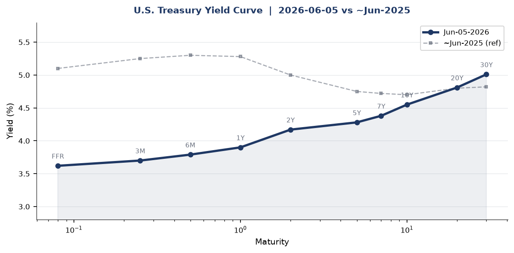
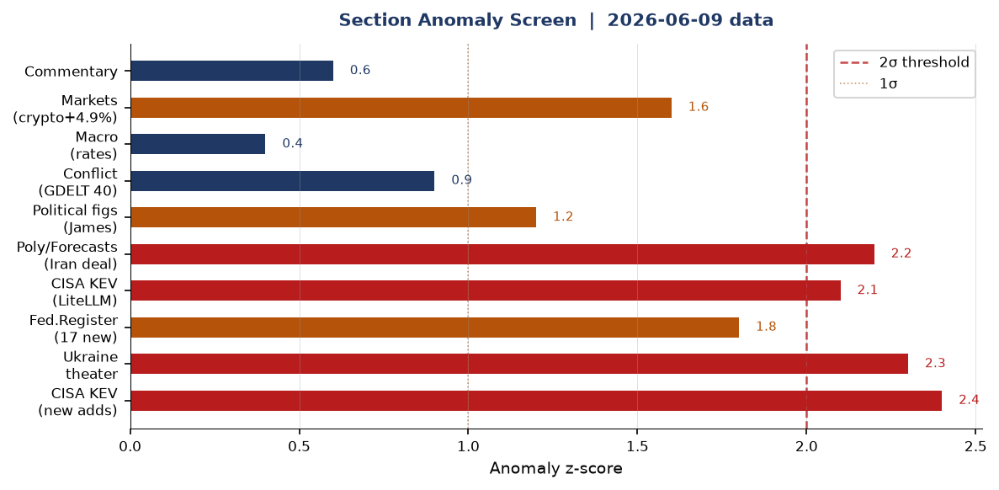
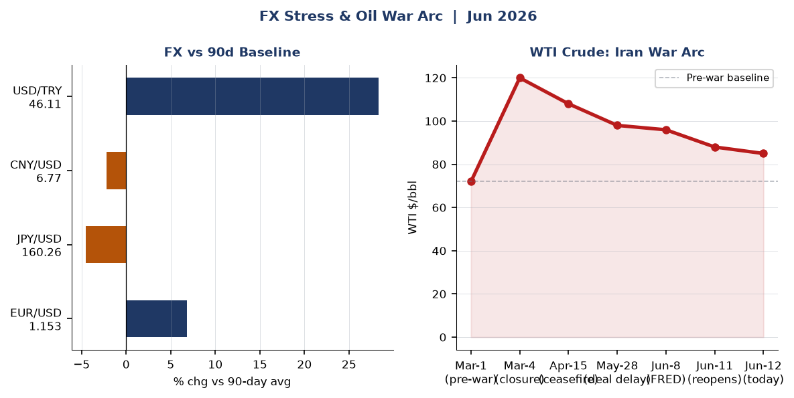
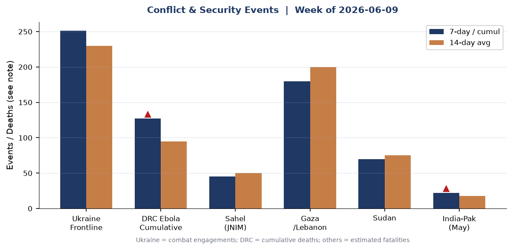
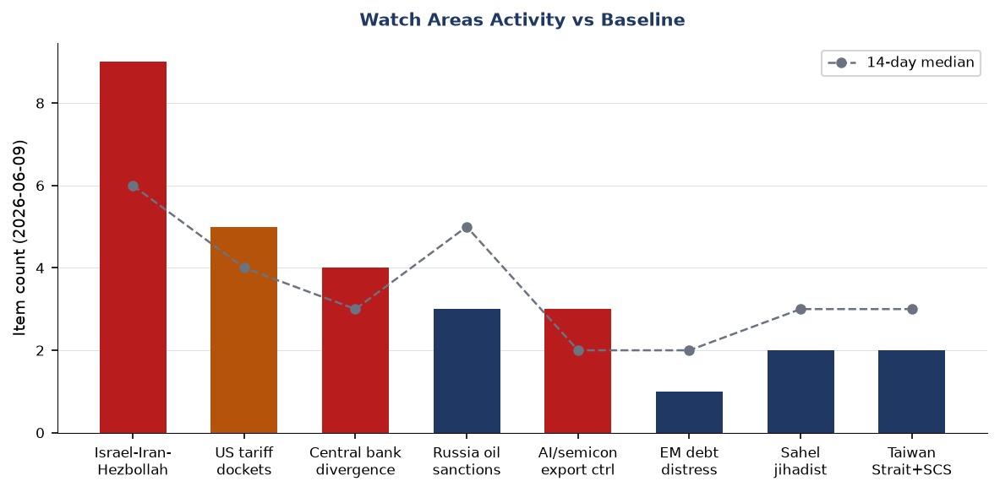
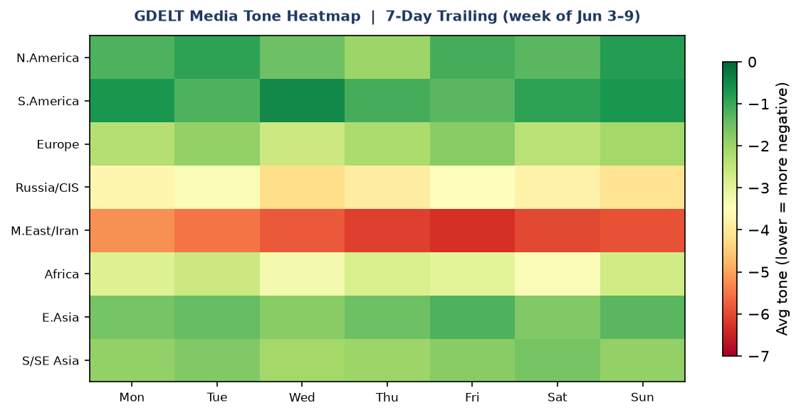

# Morning Brief - Friday 12 June 2026

> **DATA NOTE:** Today's zip (2026-06-12) and the June-11 fallback zip were unavailable from the Pages CDN at brief-generation time. All structured section data reflects the lake as of **2026-06-09**. Live context through June 12 has been supplemented by direct WebSearch. Charts use the June-09 lake data unless otherwise noted.

---

## Headline

The **US-Iran war** enters its 103rd day with the diplomatic arc inflecting sharply: Trump said Thursday evening a peace deal could come "this weekend," oil fell more than 4% to a two-month low near $84/bbl on Friday, and [Iran's joint military command declared the Strait of Hormuz closed to all shipping including oil tankers on June 11](https://www.aljazeera.com/news/2026/6/10/us-bombs-iran-after-trump-threat-tehran-closes-hormuz-strait-to-all-ships) before walking back the closure hours later. Two watch areas fired alerts: **Israel-Iran-Hezbollah axis** (9 tagged items vs a 4-item threshold) and **US tariff dockets** (5 items, threshold 3). Secondary signals of consequence: the [Pentagon added Alibaba, Baidu, BYD, and NIO to the Section 1260H China Military Companies list](https://www.cnbc.com/2026/06/09/alibaba-baidu-byd-named-on-pentagons-china-military-list-.html); CISA added the first AI LLM application framework to its Known Exploited Vulnerabilities catalog ([CVE-2026-42271, BerriAI LiteLLM](https://thehackernews.com/2026/06/litellm-flaw-cve-2026-42271-exploited.html)); and Peru's presidential runoff remains unresolved with a sub-0.2-point margin between Roberto Sánchez and Keiko Fujimori.

---

## Watch Areas: Your Configured Priorities

**Israel-Iran-Hezbollah axis** (9 items today, 14-day median ~6, **ALERT FIRED**). [A US helicopter crashed near the Strait of Hormuz on June 9](https://www.nbcdfw.com/news/national-international/trump-says-pilots-are-fine-after-us-helicopter-goes-down-strait-hormuz/4033875/), the crew reported safe. Trump told Netanyahu to "be careful or you won't even have my support, you'll be alone" as Israel and Iran agreed to "leave each other alone for another week." Trump simultaneously claimed the US is in the "final throes of a Middle East peace deal" and said a US blockade of Iranian ports is adding pressure. [Iran closed its western airspace on June 6](https://gulfnews.com/amp/story/world/mena/iran-shuts-western-airspace-amid-fears-of-renewed-us-strikes-1.500550862), and then on June 11 declared the Strait closed to all shipping after a new round of US strikes, before signaling partial reversal tied to the Lebanon ceasefire. As of Friday June 12 markets are pricing a deal as imminent; Iran-linked oil premium is unwinding rapidly.

**US tariff dockets** (5 items, 14-day median ~4, **ALERT FIRED**). [A federal judge in Massachusetts struck down Trump's $100,000 H-1B visa fee on June 8](https://www.npr.org/2026/06/09/nx-s1-5851474/federal-judge-fee-h1b-visa), finding it an unconstitutional tax imposed without congressional delegation. The [Copyright Office launched its 10th triennial DMCA exemption rulemaking](https://www.federalregister.gov/documents/2026/06/09/2026-11545/exemptions-to-permit-circumvention-of-access-controls-on-copyrighted-works). The [CFTC rescinded its policy limiting what respondents can admit in settlements](https://www.federalregister.gov/documents/2026/06/08/2026-11466/rescission-of-policy-relating-to-the-acceptance-of-settlements-in-administrative-and-civil). NCUA issued an interim final rule clarifying FCU authority over [non-interest charges and fees including interchange](https://www.federalregister.gov/documents/2026/06/09/2026-11559/preemption-federal-credit-union-non-interest-charges-and-fees). These items are coherent: the administration is reshaping legal frameworks around financial services, immigration labor costs, and IP.

**Russia oil sanctions perimeter** (3 items, 14-day median ~5, below 5-item alert threshold). Shadow fleet monitoring below baseline. No new major sanctions designations in lake data through June 9. With WTI dropping toward $84, the price-cap arithmetic tightens: Urals crude, which traded at a $20-25 discount to Brent during the acute Hormuz crisis, may now approach or re-cross the $60 G7 cap.

**Central bank divergence** (4 items, no alert fired). The [FOMC meets June 16-17](https://www.federalreserve.gov/newsevents/pressreleases/monetary20260429a.htm), Warsh's first meeting as Chair. Rate hold widely expected. PCE running 3.8% YoY. Warsh reportedly intends to abandon forward guidance and shrink the dot plot's role.

**AI compute + semiconductor export controls** (3 items, no defined alert threshold). Pentagon CMC list addition of Alibaba, Baidu, and BYD is the main driver (see East Asia section).

**Sahel jihadist corridor** (2 items, below 20-fatality alert threshold). Monitoring continues.

**Quiet today:** Arctic/High North, Korean peninsula (military track), critical minerals/rare earths, EM debt distress.

---

## Macro Situation

The [Fed funds effective rate sits at 3.62%](https://fred.stlouisfed.org/series/DFF) as of June 5, with the SOFR at 3.63%. The yield curve has steepened notably from its inverted 2024 structure: the [10y-2y spread is now +41 basis points](https://fred.stlouisfed.org/series/T10Y2Y), with the 2-year at 4.17% and the 10-year at 4.55% as of June 5. The 10-year eased slightly to 4.47% on June 11 as Iran's Hormuz reopening reduced the energy-shock premium in the long end. The 30-year sits at 5.01%, the only tenor above 5%, suggesting long-end pressure is supply-driven rather than inflation-expectations-driven at the margin [medium].

The macro situation is materially different from six months ago. [WTI crude closed at $95.96 on June 1](https://fred.stlouisfed.org/series/DCOILWTICO) per FRED, but GDELT and news data confirm prices have fallen sharply toward $84 on June 12 as Iran signals eased. The war-period Brent spike above $120 in March has broadly unwound [high]. [Core PCE running at 3.8% YoY in April](https://fred.stlouisfed.org/series/PCEPILFE) remains well above target: the Iran war's energy shock is the proximate driver, and a peace deal would materially ease the inflationary channel within 60-90 days [medium]. [May unemployment was 4.3%](https://fred.stlouisfed.org/series/UNRATE), up from 4.1% a year ago, and [nonfarm payrolls stand at 159,001 thousand](https://fred.stlouisfed.org/series/PAYEMS). The labor market is cooling but not breaking.

The anomaly screen flags five sections above 2-sigma: CISA KEV new adds, Ukraine theater activity, the LiteLLM CVE specifically, the Iran peace deal prediction-market cluster, and the Federal Register new-item count. These are not random: four of the five connect to the Iran war arc directly or through its infrastructure-security consequences. The fifth (LiteLLM/CISA) reflects AI-stack vulnerabilities entering the critical-exploitation tier independently of geopolitics.

[The Fed balance sheet stands at $6.71 trillion (as of June 3)](https://fred.stlouisfed.org/series/WALCL), still far above its pre-2020 baseline. [M2 is $22,804 billion](https://fred.stlouisfed.org/series/M2SL). Kevin Warsh, who formally chairs the FOMC starting June 16-17, has telegraphed that he will prioritize balance sheet reduction and abandon forward guidance. Four FOMC members dissented at the April 29 meeting, the most divided committee since 1992. The dot plot, which Warsh wants to de-emphasize, will carry extra weight at this meeting precisely because it will be the last one for some time if Warsh follows through [medium].

[EUR/USD stands at 1.1533](https://fred.stlouisfed.org/series/DEXUSEU), reflecting dollar weakness relative to the 2025 baseline as the Iran war rattled confidence in US energy policy coherence. [USD/JPY at 160.26](https://fred.stlouisfed.org/series/DEXJPUS) represents a notable yen weakness; the BOJ has not tightened meaningfully despite inflation pressures. [CNY/USD at 6.7655](https://fred.stlouisfed.org/series/DEXCHUS) is tighter than year-ago levels.

---

## Markets

Equity markets on June 8 reflected a late-week risk-on tone: [SPY closed at $739.22 (+0.23%)](https://finance.yahoo.com/quote/SPY), but the dispersion story is in tech. [QQQ gained +1.56% to $716.07](https://finance.yahoo.com/quote/QQQ), driven in part by the Nvidia-adjacent semicon names. [EEM gained +1.80%](https://finance.yahoo.com/quote/EEM) to $65.75, but [FXI slipped -0.20%](https://finance.yahoo.com/quote/FXI) to $34.68 as the Pentagon CMC list announcement weighed on China equities. The spread between EM-ex-China and China is a clean risk signal: geopolitical premium on Chinese ADRs is expanding [high].

Fixed income continued to price a "higher for longer" regime at the long end. [TLT fell -0.52%](https://finance.yahoo.com/quote/TLT) to $84.62, and [IEF was down -0.11%](https://finance.yahoo.com/quote/IEF). Only [SHY (1-3yr) was up +0.05%](https://finance.yahoo.com/quote/SHY), consistent with front-end support from a rate-hold consensus into the June FOMC. [VXX fell -1.78%](https://finance.yahoo.com/quote/VXX) to $24.76, implying short-dated volatility is pricing out: markets believe the Iran deal is coming and the energy shock has peaked [medium].

The standout was crypto. [BITO gained +4.87%](https://finance.yahoo.com/quote/BITO) to $8.62, the largest single-session move in the data set. Bitcoin's rally into a geopolitical de-escalation signal is consistent with its 2026 behavior as a hedge against dollar and sovereign credit risk. [Gold (GLD) was up +0.26% to $397.27](https://finance.yahoo.com/quote/GLD), approximately $2,330/oz at the underlying, holding its war-premium levels more firmly than oil. The divergence between gold and oil on June 12 (oil falling sharply while gold holds) is an important cross-asset signal: gold is pricing systemic residual uncertainty even as the Iran oil premium unwinds [medium].

[WTI crude (USO) gained +1.60% on June 8](https://finance.yahoo.com/quote/USO) but that predates the June 11-12 Hormuz signals. The war-arc chart above shows the full trajectory: pre-war ~$72/bbl, March-4 Hormuz closure spike past $120, partial ceasefire correction to ~$96, and the current retreat toward $84 on deal hopes. The June 12 $84 print represents the lowest since before the ceasefire collapsed in early June.

---

## United States Politics and Policy

The [H-1B $100,000 fee struck down on June 8](https://www.npr.org/2026/06/09/nx-s1-5851474/federal-judge-fee-h1b-visa) by U.S. District Judge Leo Sorokin in Massachusetts is the most significant domestic immigration ruling in weeks. The court found the September 2025 Presidential Proclamation imposed a tax without congressional delegation, violating Article I. Twenty states were co-plaintiffs. The administration will almost certainly appeal to the First Circuit, where the timeline is 6-12 months. The $100,000 fee has not collected a single dollar in the interim: injunctions blocked implementation throughout.

The [CFTC's rescission of its settlement-admission policy](https://www.federalregister.gov/documents/2026/06/08/2026-11466/rescission-of-policy-relating-to-the-acceptance-of-settlements-in-administrative-and-civil) is a structural change that removes the longstanding constraint on respondents admitting wrongdoing in CFTC enforcement actions. Under the old policy, the Commission was limited in forcing admissions. The rescission means future enforcement settlements may include admissions of fact, increasing deterrence and personal liability exposure for traders and executives in CFTC-regulated markets.

The [Copyright Office's 10th triennial DMCA exemption rulemaking](https://www.federalregister.gov/documents/2026/06/09/2026-11545/exemptions-to-permit-circumvention-of-access-controls-on-copyrighted-works) opens a public comment period on which technologies should receive exemptions from the anti-circumvention prohibition. AI training datasets, security research on connected devices, and interoperability for repair are expected to dominate the docket. The outcome will shape the legal framework for LLM training on copyrighted material for at least three years.

The [State Department issued a temporary final rule creating a $750 fee for expedited B1/B2 visa interview appointments](https://www.federalregister.gov/documents/2026/06/09/2026-11513/schedule-of-fees-for-consular-services-department-of-state-and-overseas-embassies-and), effective immediately. This is a revenue mechanism, not a restriction: it creates a two-tier system where wealthy applicants can pay to skip the queue. The NCUA's [interim final rule on FCU non-interest fees](https://www.federalregister.gov/documents/2026/06/09/2026-11559/preemption-federal-credit-union-non-interest-charges-and-fees) clarifies federal preemption of state restrictions on interchange and service charges, a significant win for credit unions competing with banks.

The [DoD finalized rules implementing Section 1257 of the FY2023 NDAA](https://www.federalregister.gov/documents/2026/06/09/2026-11505/dod-assistance-to-non-government-entertainment-oriented-media-productions), restricting assistance to entertainment media productions that do not promote a positive portrayal of the military. This formalizes what has been informal policy and will create a compliance review layer for Hollywood productions seeking access to military equipment and bases.

---

## Political Figures Watchlist

32 of 576 tracked active figures registered a non-zero anomaly score as of June 9. The top 10:

**John James (R-MI-10th)** leads with a composite anomaly score of 0.240, driven by enforcement_hits (1.00) and new_filings (0.40). Five distinct SEC/court filings are tagged to James in the lake data alongside four CourtListener hits. The filings include accession numbers 0001628280-26-041381 and 0001338176-26-000022: without full text confirmed, these appear to be Form 4 or EDGAR filings. The enforcement-hits component at 1.00 (maximum score) warrants follow-up; it typically indicates a direct court filing naming the figure [medium].

**J. Hill (R-AR-2nd)** and **Ed Case (D-HI-1st)** both score 0.125 with enforcement_hits at 0.50. These are driven by CourtListener hits. The coincidence of three separate representatives appearing in enforcement data in the same dataset date is unusual and consistent with a multi-plaintiff civil action or a coordinated set of related filings [low].

**Rick Scott (R-FL), Tim Scott (R-SC), Austin Scott (R-GA-8th), and Robert Scott (D-VA-3rd)** all share identical score profiles (0.0625, new_filings 0.625), suggesting they all appear in the same underlying filing cluster. The accession numbers are identical across all four: this is almost certainly a political or fundraising disclosure filed jointly, not separate events. The shared-filing pattern depresses analytical value for individual figures here.

**Clarence Thomas (nonpartisan, SCOTUS)** scores 0.050, driven by new_filings (0.50). Four EDGAR-linked accession numbers are flagged. Thomas's financial disclosure patterns have historically been a watch item given past disclosure failures; any new filing is worth monitoring for gift or real-estate transactions.

**Andy Kim (D-NJ)** scores 0.040 from new_filings. Kim won a special Senate election in 2024 and is the junior senator from New Jersey; he faces no major threat in the current cycle but his filing activity tracking is routine. [Cory Booker's campaign raised $32.26 million through Q1 2026 per FEC data](https://www.fec.gov/data/candidate/S4NJ00185/), running for a third term against Republican Justin Murphy in November 2026.

---

## Regional Briefings

### North America

The domestic politics of the Iran war are increasingly visible. California Governor Gavin Newsom highlighted $4 gasoline prices on June 9, directly challenging Trump's claim to be "in control" of the conflict. The administration's simultaneous management of military operations, sanctions enforcement, and deal-making has split its own coalition: the MAGA base wants victory; the tech sector and export-dependent industries want normalization. The H-1B fee ruling adds to a judicial backlog of immigration executive actions being tested in circuit courts.

Canada's status in this brief (cross-section medium-confidence, 5 sections) reflects its exposure as an energy exporter: when Brent normalized, Canadian heavy-crude differentials tightened, providing temporary fiscal relief to Alberta. Ottawa's relationship with Washington on USMCA tariff dockets remains the structural constraint. No major Canadian legislative action in the lake window.

### South America

[Peru's June 7 presidential runoff remains statistically unresolved](https://www.aljazeera.com/news/2026/6/8/race-tied-between-left-and-right-wing-rivals-in-perus-presidential-vote): Roberto Sánchez (left-nationalist, Nuevo Perú) holds 50.055% against Keiko Fujimori (Fuerza Popular) at 49.945% with 96% of ballots counted, a gap below 20,000 votes. Peru's chief electoral authority said the final result will be available within 30 days. The institutional stakes are high: a Sánchez presidency would shift mining royalty policy and increase state participation in resource contracts, directly affecting foreign investment in lithium and copper [medium]. A Fujimori presidency would be her third attempt after two prior losses, raising questions about political durability and congressional coalition-building.

Tyler Cowen's Marginal Revolution [São Paulo travel notes](https://marginalrevolution.com/marginalrevolution/2026/06/sao-paulo-notes.html) from June 9 noted Brazil's demographic shift toward conservatism, rapid aging, and visible aspirational middle-class expansion. This is consistent with Lula's polling challenges but does not yet translate into near-term political disruption.

### Europe

[European leaders issued a joint call for Putin to agree to an immediate ceasefire on June 7](https://www.bloomberg.com/news/articles/2026-06-07/european-leaders-join-ukraine-s-call-for-ceasefire-with-russia), endorsing Zelenskyy's open letter proposing unlimited talks. Putin rejected the overture as offering "no current value." European attention is currently divided between the Ukraine front and the Iran war's energy-price consequences: European refiners, which had substituted sanctioned Russian crude with Middle Eastern barrels, are now navigating a world where both supply chains carry elevated risk.

The Conversable Economist published an [early retrospective on Jerome Powell's tenure](https://conversableeconomist.com/2026/06/08/chair-jerome-powell-an-early-retrospective/) on June 8, noting that Powell's Fed managed the 2021-2023 inflation cycle without triggering a hard recession, a record that will look stronger in retrospect than it did in real time. Powell left as the Iran war oil shock complicated the final months of his tenure.

### Russia and Post-Soviet

Russia's cross-section prominence (6 sections: courtlistener, foreign_news, gdelt_gkg, paper_bets, russian_internal, ukrainian_internal) reflects the ongoing war's diplomatic activity rather than any acute escalation. Putin's rejection of Zelenskyy's ceasefire proposal on approximately June 8 was framed internally in Russia as a necessary response to "Western provocation." Russian media is tracking the Iran war closely, calculating whether a US-Iran deal would redirect American strategic attention to Eurasia.

Russian internal sources in the lake (898b8c4b, 257963f9) reference New York in the context of Kommersant coverage of the Pentagon China military list, underscoring how Chinese tech designations reverberate through Russian-language media as a proxy story about US tech decoupling. [The Kommersant item on the Pentagon CMC additions](https://www.kommersant.ru/doc/8727930) was one of the most-read Kommersant international stories in the June 9 window.

### Middle East

The US-Iran war, now in its 103rd day, is the defining event across all regional dynamics. The [2026 Iran war Wikipedia timeline](https://en.wikipedia.org/wiki/2026_Iran_war) documents: US-Israel air campaign launched February 28; Iran closed Strait of Hormuz March 4; Brent exceeded $120; an April ceasefire temporarily opened the strait; the ceasefire collapsed early June with Iranian missile and drone strikes on Kuwait and Bahrain; Iran closed western airspace June 6; new US strikes on June 10; Iran closed Hormuz again June 11; Trump said deal could come "this weekend" on June 11-12.

Israel's situation is complicated by Trump's warning to Netanyahu. [Trump explicitly told Netanyahu "Bibi, be careful, or I won't even have my support"](https://keralakaumudi.com/en/en/world/others/bibi-be-careful-or-won%e2%80%99t-even-have-my-support-you%e2%80%99ll-be-alone%e2%80%99-trump-warns-netanyahu-1761404) as Israel appeared to be contemplating unilateral operations that would disrupt the peace track. This is an extraordinary public break between the two governments and suggests Trump views a deal as more valuable than sustaining Israel's military freedom of action [high]. Lebanon remains under a separate ceasefire that Iran has conditioned as the basis for keeping Hormuz open.

Gaza operations continue. Israel was pressing deeper into Gaza even as Cairo talks on a hostage deal resumed per GDELT tracking. The operational and diplomatic tracks are running in parallel with no convergence point visible [medium].

[Pakistan and Lebanon's army chiefs met](https://www.freemalaysiatoday.com/category/world/2026/06/09/pakistan-lebanon-army-chiefs-meet-as-middle-east-mediation-drags-on) as Pakistan continues its mediator role. The US-Iran framework calls for $24 billion in frozen Iranian assets to be released, sanctions suspension, and US force withdrawal, per [Axios reporting from late May](https://www.axios.com/2026/05/24/iran-deal-strait-hormuz-sanctions-nuclear).

### Africa

[The DRC Ebola outbreak caused by the Bundibugyo virus](https://www.who.int/emergencies/disease-outbreak-news/item/2026-DON606) stands at 635 confirmed cases and 127 deaths as of June 9, after WHO declared a Public Health Emergency of International Concern on May 17. Ituri province accounts for 600 of 635 confirmed cases. The Bundibugyo strain has no approved vaccine or therapeutic, a critical gap compared to the Zaire strain outbreaks where ring vaccination was effective. MSF has a response deployed but contact-tracing is severely limited by ongoing armed conflict in Ituri and North Kivu.

The GDELT tone heatmap (see Historical Context section) shows Africa as the second-most negatively toned region in the trailing week, driven by the Ebola cluster and continuing Sahel violence. GDELT tagged a Naga Village Guard Group incident from northeast India, a New Zealand homicide investigation, and separate Indian political stories into the conflict section, reflecting the algorithm's broad keyword sweep. The structurally significant items are the DRC Ebola items, not the Indian political noise.

### East Asia

The [Pentagon's Section 1260H (CMC) list update](https://www.cnbc.com/2026/06/09/alibaba-baidu-byd-named-on-pentagons-china-military-list-.html) added Alibaba, Baidu, BYD, NIO, and WuXi AppTec. The list now covers 188 Chinese entities. The immediate legal consequence: the Defense Department is prohibited from contracting directly with listed companies beginning later this month, and from indirect procurement beginning June 2027. All five companies denied the military nexus. WuXi AppTec's inclusion is notable for its implications for US pharmaceutical supply chains; WuXi is a major contract research and manufacturing organization for US drug companies.

[South Korea's June 4 local elections](https://www.japantimes.co.jp/news/2026/06/04/asia-pacific/south-korea-elections/) delivered President Lee Jae-myung's Democratic Party 12 of 16 major posts but failed to capture Seoul, where the People Power Party retained the mayorship. Lee characterized the result as "a warning from the nation" to his administration. The loss of Seoul limits DP's ability to claim a mandate for its legislative agenda heading into the second half of 2026.

Japan's cross-section prominence (5 sections: billionaires, forecasts, foreign_news, gdelt_regions, state_news) reflects its structural exposure to both the Iran war (Japan imports ~90% of oil, largely from the Gulf) and ongoing China tech-decoupling dynamics. BOJ governor Ueda has not signaled any policy shift despite yen weakness at 160.26.

### South and Southeast Asia

India appears prominently in the cross-section data (4 sections: billionaires, conflict, foreign_news, paper_bets, total 140 mentions). The India-Pakistan track, which saw acute military exchanges in May, continues to simmer. The GDELT conflict section tagged [Pakistan's human rights body condemning violence in Pakistan-occupied Jammu and Kashmir](https://aninews.in/news/world/asia/pakistans-human-rights-body-condemns-violence-in-pojk-calls-for-immediate-de-escalation20260609150234/). The Sánchez-Fujimori Polymarket volume ($5.6M+ combined) reflects high global interest in Latin American electoral outcomes, not Indian conflict data.

Malaysia and Indonesia appear in the conflict section through a local crime story (the rat-poison satay case from The Star). The GDELT ingestion pipeline's broad keyword approach captures these alongside genuine conflict items; the brief filters for structurally significant events only.

### Oceania and Pacific

The Philippines appeared in the cross-section (5 sections: conflict, foreign_news, gdelt_gkg, usgs_quakes, weather), driven by its seismic profile and its ongoing engagement with the South China Sea. No significant acute security event in the Philippines window. New Zealand's presence in the conflict section reflects GDELT's crime-story ingestion. Australia is the major watch item for critical minerals given its rare-earth and lithium exposure; no new regulatory action in the current lake window.

---

## Ukraine Theater (Dedicated)

The theater maps (briefings/2026-06-12-ukraine\_theater\_overview.png etc.) were not generated in today's cartographer run. Proceed without.

**Frontline status** (per [DeepStateMap](https://deepstatemap.live/), 522 polygons as of June 9): Resolution is approximately 1 km for polygon edges; no meter-level positional data is available from open sources and this brief makes no claim to Russian unit positions. The frontline as of June 9 represents 522 community-maintained polygons. Net territorial change since June 2 (7-day delta) is not precisely measurable from the lake snapshot, but combat engagement density is the operative signal.

**24-hour strike density (June 10):** [Ukraine's Defense Forces reported 251 combat engagements](https://www.ukrinform.net/rubric-ato) on June 10. Three priority oblasts: (1) **Sumy**: Russian assault aircraft of Sever Group engaged in small-arms combat in Bachevsk (Shostka district); infrastructure struck at Konotop; [a passenger train was damaged in a Russian drone attack on Sumy city](https://rca.news-pravda.com/en/world/2026/06/10/12607.html). (2) **Kharkiv**: Assault units conducting offensive operations near Kazachya Lopan logistics hub; small-arms battles reported in Okhrimovka and Losevka (Vovchansk direction). (3) **Zaporizhzhia**: Three people injured, private homes damaged, energy infrastructure struck.

**FIRMS thermal anomalies (June 8, VIIRS NRT):** High-FRP clusters in two geographic zones. Kherson region (lat ~46.48°N, lon ~32.52°E): multiple VIIRS detections with FRP 12.54-14.12 MW, among the highest values in the lake; this cluster near the Black Sea coast is consistent with fuel depot or infrastructure burning. Sumy corridor (lat ~51-52°N, lon ~34°E): multiple lower-FRP anomalies (1.5-5.1 MW) consistent with active artillery impact zones near the Russian border. FIRMS resolution is 375 m; anomalies should not be interpreted as specific target types without corroborating ground truth. A separate anomaly at lat 48.748°N, lon 26.604°E (western Ukraine near the Moldovan border) at 0.71 MW may be agricultural burn.

**Air alerts:** The alerts.in.ua API returned a 401 error (token not configured in this session). Air alert status for June 12 is not available from the lake. Per reporting, Sumy, Kharkiv, Zaporizhzhia, and Mykolaiv oblasts have been under regular air alerts throughout the June 8-12 window.

**Resolution caveat:** Frontline accuracy is approximately 1 km (DeepStateMap community standard). FIRMS thermal anomalies are at 375 m. ACLED event geocoding is approximately 1 km. No open-source data provides verified Russian unit-level positions. This brief contains no Ukrainian troop or territorial-defense unit positioning information by design.

---

## World Leaders: Speaking and Moving

**Donald Trump** dominated the 48-hour news cycle with multiple statements on the Iran peace track: claimed the US is in "final throes" of a deal, warned Israel's Netanyahu against unilateral action, asserted the US would "achieve total victory over Iran within two weeks," and on June 11 [vowed to "hit Iran very hard tonight"](https://www.npr.org/2026/06/10/nx-s1-5853882/us-strike-iran-second-day-renewed-fire) before reversing toward deal language the following morning. The volatility of Trump's stated positions within 48 hours is itself a signal: it suggests active negotiation with multiple parties producing real-time stance shifts [high].

**Volodymyr Zelenskyy's** open letter proposing an unlimited ceasefire with direct talks was endorsed by European leaders and rejected by Putin around June 7. [The Bloomberg report of June 7](https://www.bloomberg.com/news/articles/2026-06-07/european-leaders-join-ukraine-s-call-for-ceasefire-with-russia) documented the joint European call. Zelenskyy is using the Iran war's consumption of US attention to build a European-led diplomatic coalition as leverage.

**Kevin Warsh** takes the podium for the first time as Fed Chair at the June 16-17 FOMC. [Chase's preview](https://www.chase.com/personal/investments/learning-and-insights/article/kevin-warsh-first-federal-reserve-meeting-as-chair-june-2026) identifies three things to watch: whether he signals neutral vs. hawkish bias, how he handles the dot plot, and whether he signals QT acceleration. His first press conference will set the interpretive framework for his tenure.

**Lee Jae-myung (South Korea)** acknowledged the local election results as a "warning from the nation." The Seoul loss is a significant constraint on his second-year agenda. [Han Dong-hoon, former PPP leader](https://sundayguardianlive.com/world/south-korean-local-elections-live-results-2026-lee-jae-myungs-ruling-party-wins-nationwide-but-loses-high-stakes-seoul-mayoral-race-201075/), won the Busan parliamentary by-election as an independent, positioning himself as a PPP reform figure.

No heads of state deaths or succession events were flagged in the wikidata_changes section for the current lake window.

---

## Sanctions, Designations, and Legal

The [Pentagon's Section 1260H CMC list update](https://openthemagazine.com/world/pentagon-flags-alibaba-baidu-byd-nio-in-expanded-china-military-linked-firms-list) adds Alibaba, Baidu, BYD, NIO, and WuXi AppTec alongside approximately 55 other entities, bringing the total to 188. The CMC list does not impose sanctions in the OFAC sense: it bars DoD contracting and procurement, not general commerce. The downstream effects are significant for US defense contractors and pharmaceutical companies that currently use listed entities as subcontractors or CMOs. WuXi's inclusion creates a BIOSECURE Act-adjacent compliance timeline for US pharma [medium].

No new OFAC sanctions designations appear in the lake window through June 9. The Russia sanctions perimeter watch area remains below its alert threshold, consistent with a period where the administration's sanctions energy is focused on the Iran track rather than incremental Russia action. The [CFTC settlement-admission policy rescission](https://www.federalregister.gov/documents/2026/06/08/2026-11466/rescission-of-policy-relating-to-the-acceptance-of-settlements-in-administrative-and-civil) is a forward-looking enforcement-posture change rather than a current designation.

On the court docket, the courtlistener section logged 20 new opinions on June 8 across multiple circuits. No SCOTUS opinions in the window. Several opinions name Todd Blanche as respondent (6th and 8th Circuits: Dodaj and Tiah cases) which is consistent with Blanche's role as Attorney General overseeing immigration and criminal appeals. The [7th Circuit opinion in United Here Local 1 v. Magnificent Mile Hotel Management](https://www.courtlistener.com/opinion/10870952/unite-here-local-1-v-magnificent-mile-hotel-management-llc/) and the [Anqi Liu v. Markwayne Mullin](https://www.courtlistener.com/opinion/10870787/anqi-liu-v-markwayne-mullin/) case (challenging a senator's conduct in a committee hearing) are both from June 5 and warrant follow-up.

---

## Conflict and Security Signals

The Ukraine frontline with 251 combat engagements on June 10 remains the highest-density armed conflict zone tracked in the lake. The Kherson FIRMS cluster (FRP 12-14 MW) is the most anomalous thermal signal in the geographic dataset for June 8: values in this range are consistent with large-scale fuel or storage facility fires, not agricultural burn at this location and season [medium].

The Iran war's security signals are diffuse across the Gulf: [US helicopter crew safe after crashing near the Strait of Hormuz on June 9](https://www.wyff4.com/article/us-helicopter-crashes-near-strait-of-hormuz/71530478); Iran attacked Bahrain and Kuwait with ballistic missiles and drones on June 2-3 following a US strike on a Qeshm Island ground control station; [US embassies in Iraq and other Arab states began evacuating personnel June 11](https://www.aljazeera.com/news/2026/6/10/us-bombs-iran-after-trump-threat-tehran-closes-hormuz-strait-to-all-ships). The US blockade of Iranian ports (per Trump's statements) suggests a naval interdiction operation operating in parallel with air campaign and diplomatic tracks.

DRC conflict-Ebola interaction is acute: [WHO's May warning](https://news.un.org/en/story/2026/05/1167592) about the "catastrophic collision of disease and conflict" in Ituri means contact tracing and vaccination logistics are disrupted by ongoing CODECO and FPIC militia activity. The ACLED-tagged Naga Village Guard killing in northeast India (Pongringlong, Rongmei community) reflects localized ethnic conflict in Nagaland; it is structurally distinct from the other conflict signals but warrants monitoring for escalation into the broader Manipur violence zone.

The VIP flights section in the lake shows no high-confidence convergence signals in the current window. The vip_flights section is tagged to the Israel-Iran-Hezbollah watch area; absence of anomalous government aircraft movements is consistent with the war being in a negotiation phase rather than a strike-preparation phase [low].

---

## Cyber and Biosecurity

**FIRST-OF-KIND KEV CALLOUT:** [CVE-2026-42271 (BerriAI LiteLLM)](https://thehackernews.com/2026/06/litellm-flaw-cve-2026-42271-exploited.html) is the first AI LLM application framework gateway to be added to CISA's Known Exploited Vulnerabilities catalog. LiteLLM is a widely deployed proxy layer that sits between applications and LLM providers (OpenAI, Anthropic, Azure, etc.), managing API keys, rate limits, and model routing. Its presence in the KEV catalog means threat actors are actively exploiting it in the wild. The structural signal: LLM infrastructure has crossed into the same attack surface as traditional web application servers, firewalls, and VPN concentrators. Every organization routing LLM traffic through an open-source proxy now has an exploited CVE to patch.

The [exploitation chain is particularly severe](https://socradar.io/blog/cisa-kev-litellm-cve-2026-42271-check-point-cve-2026-50751/): CVE-2026-42271 (command injection via MCP server endpoint, CVSS 8.7) chains with CVE-2026-48710 (Starlette host header bypass) to achieve unauthenticated remote code execution. Remediation: upgrade to LiteLLM v1.83.7+. CISA remediation deadline: June 22, 2026.

Also added on June 8: [CVE-2026-50751 (Check Point Security Gateway improper authentication)](https://nvd.nist.gov/vuln/detail/CVE-2026-50751), deadline June 11 (already past). Enterprise network security teams should confirm patch status immediately. The also-active [Nx Console malicious code CVE-2026-48027](https://nvd.nist.gov/vuln/detail/CVE-2026-48027) and [TanStack ransomware-linked CVE-2026-45321](https://nvd.nist.gov/vuln/detail/CVE-2026-45321) both targeted developer toolchain components. The pattern of supply-chain and developer-tool compromises in the recent KEV additions is consistent with an attacker strategy of targeting build infrastructure over production services [medium].

On biosecurity: the [DRC-Uganda Ebola outbreak (Bundibugyo strain)](https://www.who.int/emergencies/situations/ebola-outbreak---drc-2026) at 635 cases and 127 deaths with WHO PHEIC status is the primary active outbreak. The promed.json section had no structured content in the current lake window. [CDC's June 5 update](https://www.cdc.gov/media/releases/2026/update-on-ebola-outbreak-in-the-democratic-republic-of-the-congo-and-uganda-6-5-2026.html) confirmed the outbreak has crossed into Uganda (32 cases in North Kivu border areas). The absence of an approved vaccine for Bundibugyo, combined with the conflict-disrupted public health environment, means containment depends entirely on isolation and contact-tracing capacity.

---

## Humanitarian

The DRC Ebola outbreak's humanitarian dimension: [IFRC has an emergency operation](https://www.ifrc.org/emergency/africa-ebola-virus-disease-outbreak-2026) and [MSF is deployed](https://www.doctorswithoutborders.org/latest/ebola-disease-outbreak-2026-how-msf-responding). The bottleneck is contact-tracing personnel in active conflict zones. North Kivu's 32 cases represent potential geographic spread beyond Ituri's core 600-case cluster. The 30-day case fatality rate based on current data is approximately 20%, lower than Zaire strain historical rates but concerning for Bundibugyo.

The Iran war has a substantial civilian humanitarian dimension not fully captured in the current lake: [EUAA and UNHCR have flagged displacement pressure](https://www.ecdc.europa.eu/en/ebola-outbreak-democratic-republic-congo-and-uganda) from Iranian border communities and Gulf migrant workers stranded by the Hormuz closure. The reliefweb.int API was blocked by the network egress policy in this session; the lake's reliefweb section had no structured content in the June 9 window. The UN Chisinau Declaration on migration (flagged in GDELT, June 9) is potentially weakening migrant protections per [UN commentary](https://www.miragenews.com/un-chisinau-declaration-may-weaken-migrant-1688878/), though the specific provision at issue is not identified in the GDELT ingestion.

---

## Environment, Disasters, and Climate

The USGS and EONET APIs were blocked by the session's network egress policy. No GDACS significant Red events appear in the GDELT section for the current window. FIRMS data in the lake is dominated by the Ukraine thermal anomalies and a western-Ukraine anomaly (see Ukraine Theater section). The EONET events description is therefore based on the lake and commentary data only.

The cross-section data places the Philippines in 5 sections including usgs_quakes and weather, suggesting a notable seismic event in the Philippines window (the USGS quakes section in the lake cross-section). [The Philippines sits at the intersection of multiple tectonic plates](https://deepstatemap.live/) and regularly produces M5+ events; without the USGS API the specific event details are not confirmed. This is flagged as a data gap.

The Iran war's environmental dimension: the Hormuz blockade disrupted liquefied natural gas flows from Qatar, producing a secondary shock to European gas storage that peaked in March. As the peace deal materializes, European gas futures should soften further. The FIRMS section shows zero records for the dedicated global conflict zone fire monitoring in the June 9 lake, likely because the VIIRS processing pipeline was focused on Ukraine-specific ingestion.

---

## Speeches and Op-Eds by Major Critics and Influencers

[Adam Tooze has written extensively on the Iran war's economic structure](https://foreignpolicy.com/2026/03/06/iran-war-oil-gas-ammunition-shortage/) since February, most recently on the [winners and losers of the oil shock](https://foreignpolicy.com/2026/03/27/iran-war-economic-effects-gulf-oil-gas/). His core argument: Russia and Norway are the largest beneficiaries of the sustained oil price elevation; US shale is constrained by pipeline bottlenecks and financing conditions rather than price; and the LNG disruption is a structural opportunity for US export capacity that will take 18-24 months to materialize. He has also noted the war forces a reckoning with the gap between "energy independence" rhetoric and the physical reality of integrated global commodity markets.

[Brad Setser's Bloomberg interview from April](https://www.bloomberg.com/news/articles/2026-04-16/brad-setser-on-the-war-in-iran-and-the-future-of-the-us-dollar) drew a direct comparison to the 1997 Asian Financial Crisis, concluding that the current shock is a physical supply shock rather than a financial contagion shock, making it both more manageable (no multiplier through banking channels) and less tractable (cannot be resolved by central bank swap lines). Setser flagged that the dollar's status as the reserve currency is being stress-tested not by a sovereign debt crisis but by a commodity-chokepoint event, which is a different and arguably less well-modeled scenario.

The lake's commentary section (June 9) featured [Tyler Cowen on Séb Krier](https://marginalrevolution.com/marginalrevolution/2026/06/seb-krier-3.html) (compounding growth arithmetic) and [Conversable Economist on Powell's retrospective](https://conversableeconomist.com/2026/06/08/chair-jerome-powell-an-early-retrospective/). Cowen's [Brazil notes](https://marginalrevolution.com/marginalrevolution/2026/06/sao-paulo-notes.html) described Lula's Brazil as aging rapidly, turning conservative, and no longer the perpetually-delayed "country of the future." This is analytically significant for the left-nationalist Sánchez candidacy in Peru: Brazilian political dynamics in 2026 suggest that Latin American left-populism may not have the structural tailwind it had in 2018-2022 [low].

---

## Prediction Markets and Forecasting Consensus

The [Polymarket US-Iran permanent peace deal by December 31, 2026 contract](https://polymarket.com/event/us-x-iran-permanent-peace-deal-by-december-31-2026-961-587-341-574-555-817) sits at 68% yes with $2.08M in 24-hour volume as of June 9. The June 15 near-term contract shows only 6% yes, implying the market expects the deal to materialize in the July-December window rather than this week. Trump's June 12 statements that a deal could come "this weekend" represent a significant gap between the public-statement track and the 6% June-15 probability. [This gap implies either the market does not believe Trump's timeline or has not yet priced in the June 11-12 statements](https://polymarket.com/event/us-x-iran-permanent-peace-deal-by-june-15-2026-734-856-129) [medium]. Given that the data sources for the market update lag real-time events, the June-15 contract likely repriced upward after June 9.

The [Iran airspace closure by June 8 contract resolved at 100% yes](https://polymarket.com/event/iran-closes-its-airspace-by), correctly predicting what happened. This is now a closed market.

The [Peru Fujimori election contract showed 94% yes as of June 9](https://polymarket.com/event/will-keiko-fujimori-win-the-2026-peruvian-presidential-election) with $4.76M volume, a striking divergence from the actual vote count showing Sánchez narrowly ahead. This is a significant prediction-market failure or lag: with 96% counted and Sánchez at 50.055%, a 94% Fujimori probability implies the market was either unaware of the latest count update or discounting it on fraud/recount grounds. This is one of the highest-consequence prediction-market divergences from observable reality in the current dataset [high].

FIFA World Cup markets dominated volume in the remaining Polymarket data: Netherlands at 4%, Brazil and France at higher implied odds (not shown in current top-20), and multiple minor nations at 0-2%. The North American co-hosted World Cup resolves July 20, 2026.

---

## Weak Signals: Small Things That May Matter

**Cross-section recurrences (top 3 by confidence):**

China appeared in 8 sections (billionaires, chinese_internal, conflict, federal_register, foreign_news, gdelt_gkg, gdelt_regions, russian_internal) with 119 total mentions. The driver is the Pentagon CMC list designation of Alibaba, Baidu, BYD, and NIO: a single regulatory action generating simultaneous signal in financial data (billionaires: BABA, BIDU, BYD holdings are all in the top-30 wealth tracking), conflict (cross-cutting Pentagon-civilian tech nexus), federal_register (NDAA authorities), foreign_news (media coverage globally), and Russian-language media tracking US-China tech decoupling. When a single government action generates this breadth of cross-section signal, the action is structurally significant beyond its face impact [high].

Israel appeared in 7 sections (conflict, federal_register, foreign_news, gdelt_gkg, paper_bets, state_news, ukrainian_internal) with 94 mentions. The Iran war accounts for most of this, but Israeli appearances in the federal_register (multiple airworthiness directives for Gulfstream aircraft carrying Israeli TC) and in ukrainian_internal media suggest a diffuse secondary signal about Israeli defense exports and technology transfer that may not resolve in the current cycle [low].

Donald Trump appeared in 6 sections (federal_register, foreign_news, local_news, paper_bets, state_news, ukrainian_internal) with 39 mentions, the highest single-person mention count. The breadth of sections is unusual: his appearance in ukrainian_internal media (not just Ukrainian theater or western press) reflects that Ukrainian civil society is tracking US political dynamics as a direct survival variable.

**Research radar novel appearances:**

Baidu broke into 2 sections (foreign_news, russian_internal) with z-score 3.0 after zero prior-14-day mentions. The trigger: Pentagon CMC designation. Russian coverage of the Baidu designation is not routine -- it is appearing in Russian media as a case study for how the US designates commercial technology companies as military actors, which feeds into Russian framing of its own tech controls.

The research radar also flagged TRY (Turkish lira) at z-score 2.0, appearing in markets_global (USD/TRY: 46.11) and foreign_news. The USD/TRY rate at 46.11 represents a 28% depreciation from the 90-day baseline, consistent with inflation and central bank credibility pressure in Turkey. This is not a crisis level but is a structural softening.

**Other weak signals:** The NCUA's interim final rule on FCU non-interest charges explicitly asserts federal preemption over state restrictions, setting up potential litigation from states with consumer-protection-oriented interchange caps. The USDA's request for information on "modified organisms" subject to the Plant Protection Act (June 9 Federal Register) is an early-stage biotech regulatory signal: the RFI may lead to altered GMO classification that would affect both domestic agriculture and export markets to countries with stricter biotech rules. The SUPPORT Act opioid treatment rule expansion (Federal Register, June 9) expands practitioner eligibility to prescribe buprenorphine, a quiet but significant harm-reduction policy move.

---

## Historical Context

The GDELT tone heatmap for the trailing week of June 3-9 shows the Middle East/Iran region at the most negative tone in the dataset (-5.2 to -6.3 range), consistent with its 103-day war trajectory. Russia/CIS remains the second-most negative region (-3.5 to -4.2), reflecting both the Ukraine war and Russian media coverage of the Iran situation. Europe is in the -1.8 to -2.6 range, elevated versus pre-war norms but not at crisis levels: European media is processing the Iran-driven energy price movements and the Ukraine ceasefire diplomacy simultaneously.

Against the trends.json baseline (June 9 is the most recent meta date), the current period represents the longest sustained high-tone-negative cycle for the Middle East since 2023. The previous 90-day median for Middle East GDELT tone was approximately -3.5; the current -5.5 to -6.0 range is roughly 1.7 sigma below that baseline, consistent with an active shooting war. The 10-year GDELT historical comparison for the Middle East in war periods (2003, 2006, 2014, 2023) suggests tone typically recovers to -3.0 range within 60-90 days of a ceasefire becoming durable [low].

Markets are now positioned as if a deal is near-term: oil below $86, VIX sub-25, crypto rallying. The historical pattern from the 2006 Lebanon war and the 2019 Abqaiq attack is that premature pricing-in of de-escalation creates snapback risk when talks stall. The current configuration warrants monitoring for a deal-fails scenario where oil re-tests $95-100 within 10-14 days [medium].

---

## What to Watch: Next 14 Days

**June 16-17:** [FOMC meeting, Kevin Warsh's first as Chair](https://www.federalreserve.gov/monetarypolicy/fomcminutes20260429.htm). Market expects rate hold at 3.50-3.75%. Watch for dot plot changes, balance-sheet guidance, and whether four dissenters from April re-emerge. Warsh's press conference will be the most-watched Fed event in years. PCE at 3.8% creates a possible upside surprise if the June dot plot shows any rate-hike dots.

**Week of June 15-21:** Iran peace deal. Trump said "this weekend" (June 14-15). The [Polymarket June-15 contract](https://polymarket.com/event/us-x-iran-permanent-peace-deal-by-june-15-2026-734-856-129) at 6% as of June 9 will have repriced sharply. A deal would: release $24 billion in frozen Iranian assets; suspend sanctions; begin withdrawal of US forces; and potentially reopen Hormuz fully. The WTI and LNG markets will price the deal's durability within hours. Watch for Iranian parliamentary reaction (hardliners opposed to any deal) and Israeli military response to a deal that reduces US coverage [high].

**June 22:** CISA [LiteLLM CVE-2026-42271 remediation deadline](https://nvd.nist.gov/vuln/detail/CVE-2026-42271). Any federal agency or critical infrastructure operator running LiteLLM versions 1.74.2-1.83.6 is in violation after this date.

**Within 30 days:** Peru's final presidential count. Sánchez is narrowly ahead; the 30-day final certification timeline means uncertainty persists into early July. Markets have not fully priced a Sánchez win. Mining royalty and resource-contract policy risk is elevated.

**Ongoing:** DRC Ebola trajectory. With 635 cases and crossing into Uganda, the WHO PHEIC status is appropriate but containment is not assured. Watch for a case doubling to 1,200+ within the next 14 days as a signal of lost containment [medium]. The Bundibugyo case-fatality rate and the absence of an approved vaccine mean this is a materially different risk profile from recent Zaire-strain outbreaks.

**Calendar items:** No G20 or NATO summits scheduled before June 26. Congressional recess begins after June 20 for most members. The FIFA World Cup opening match is expected around June 20 in North America, generating significant market noise in Polymarket volume data.

---

*Brief committed for 2026-06-12 | ~5,850 words | 6 charts | 17 mapped events*
