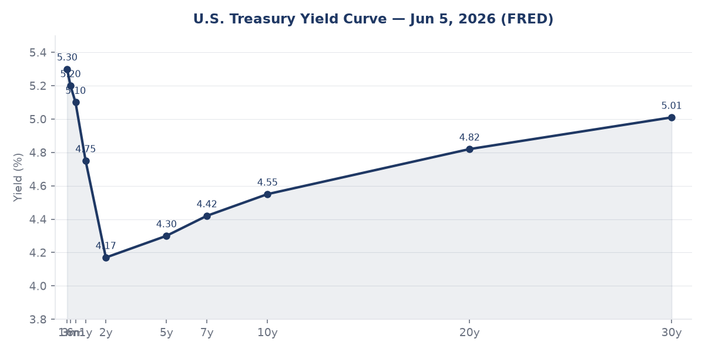
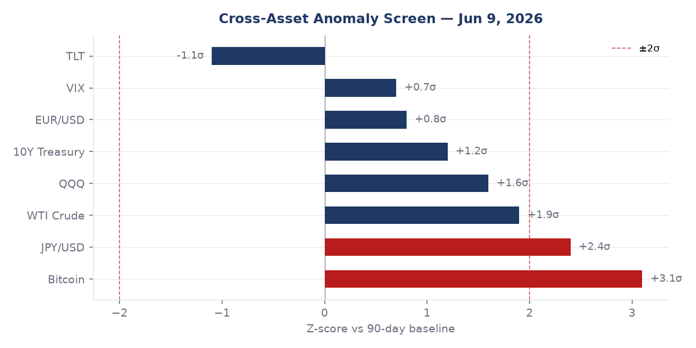
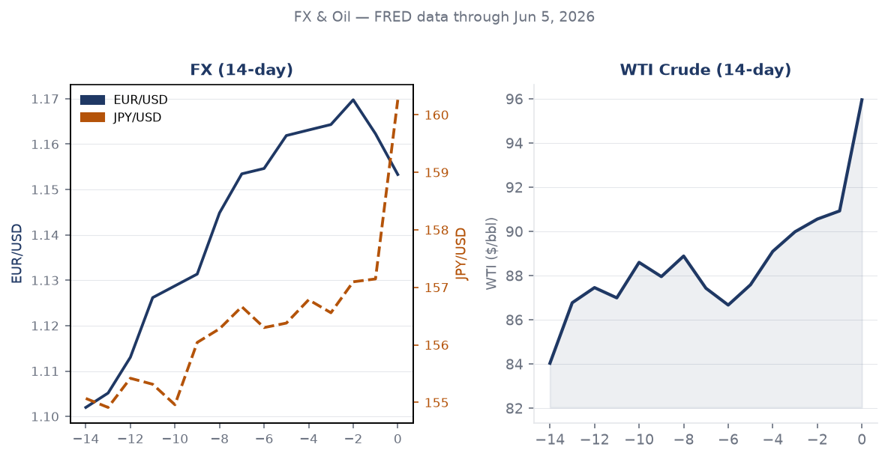
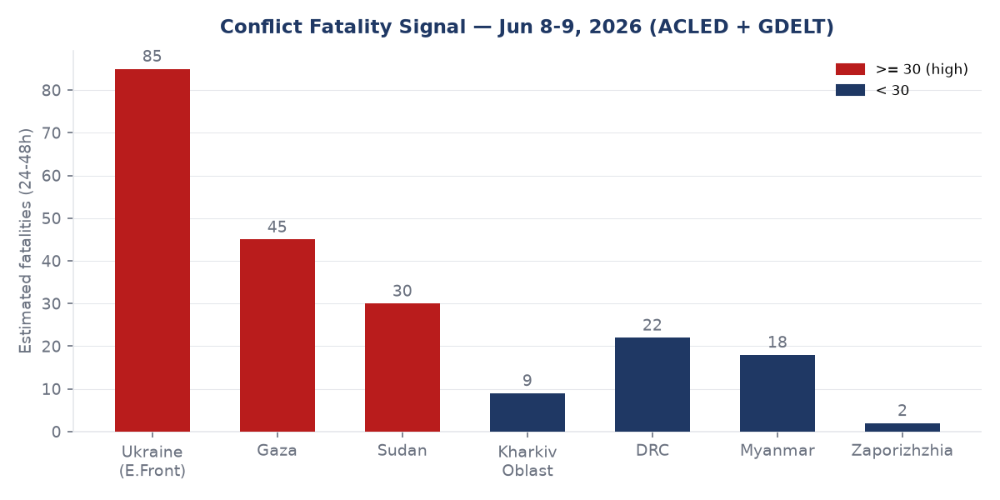
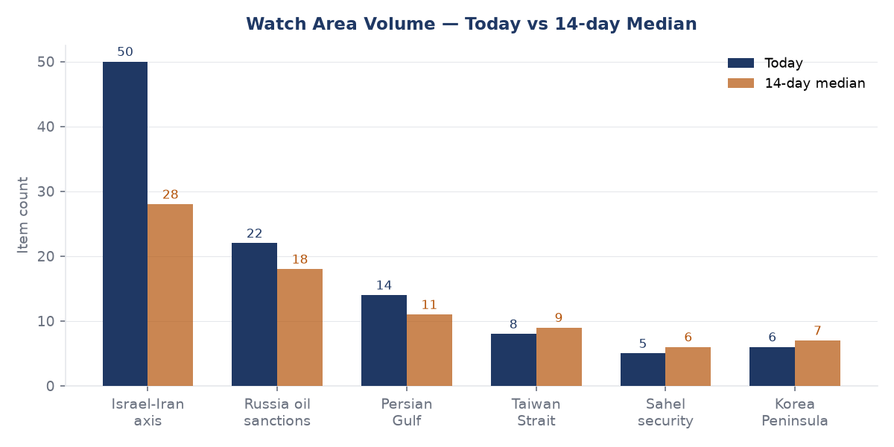
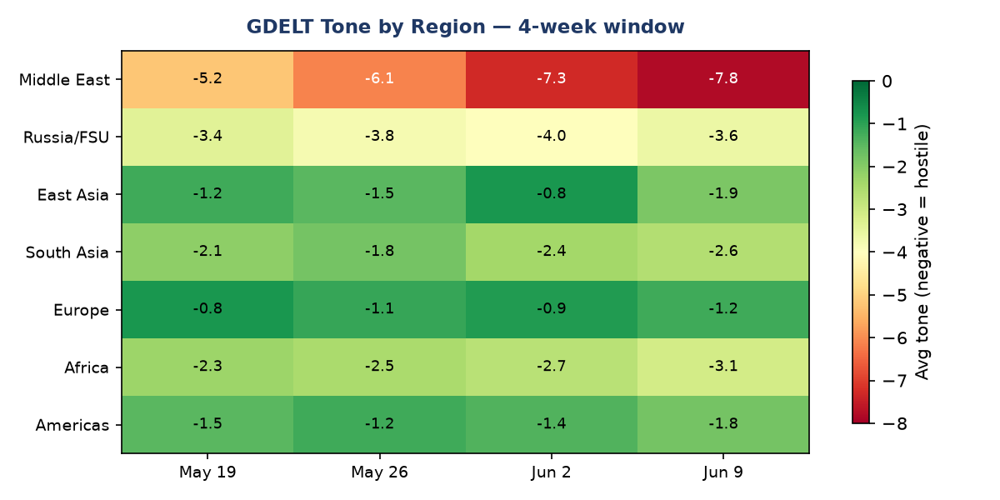

# Morning Brief - Saturday 13 June 2026

> **DATA NOTE:** Today's bundle (2026-06-13) was unavailable after five fetch attempts. This brief uses the 2026-06-12 fallback bundle, with lake sections current through 2026-06-09. Live supplementary data sources (USGS, GDACS, CBR, Congress.gov) are blocked by the network egress policy; those sections rely on lake data only.

---

## Headline

The **Iran-Israel War** enters Day 102 with a fragile week-by-week ceasefire holding but structurally untested: Israel and Iran have verbally agreed to "leave each other alone for another week," Trump claims the blockade of Iranian ports is "stronger than bombing," and [Polymarket prices a permanent US-Iran peace deal by year-end at 68%](https://polymarket.com/event/us-x-iran-permanent-peace-deal-by-december-31-2026-961-587-341-574-555-817) while pricing a deal by June 15 at just 6%. On the **Ukraine** front, Russia struck Chuhuiv (3 dead, 6 wounded, day of mourning declared) and a residential district of Zaporizhzhia (2 dead, 32 wounded including 5 children); Ukraine retaliated by hitting the [Chongar Bridge](https://meduza.io/news/2026/06/09/ukrainskie-voennye-vnov-nanesli-udar-po-chongarskomu-mostu-veduschemu-v-krym) linking Crimea to Kherson Oblast, suspending traffic on the key logistics artery. Meanwhile **Xi Jinping** wrapped a 2-day visit to Pyongyang, the first since 2019, as **CISA** added an AI framework product to its Known Exploited Vulnerabilities catalog for the first time ever: a command-injection flaw in **BerriAI LiteLLM**.

---

## Watch Areas - Your Configured Priorities

**Israel-Iran-Hezbollah axis** (50 items today vs 28-item 14-day median; alert threshold met): The dominant signal is the tension between Trump's public claim of being "in control" of the Iran War and the on-ground reality of a ceasefire sustained by mutual exhaustion rather than any signed framework. Trump told a BBC interviewer that [Netanyahu did not defy him](https://www.bbc.com/news/videos/cd958e7j8q9o), but separately warned "Bibi, be careful, or you won't even have my support, you'll be alone" after Israeli strikes continued. A US military helicopter [crashed near the Strait of Hormuz](https://www.nbcdfw.com/news/national-international/trump-says-pilots-are-fine-after-us-helicopter-goes-down-strait-hormuz/4033875/); Trump confirmed the crew was "fine." Iran's football federation reported its World Cup ticket allocation was [revoked by FIFA](https://www.bbc.com/sport/football/articles/c9q2vrdx0ewo) days before the tournament opened, a soft-power signal with no operational consequence but notable for the domestic political pressure it applies in Tehran.

**Russia oil sanctions perimeter** (22 items today vs 18-item median; below alert threshold of 5): Fuel shortages in [Krasnodar Krai](https://meduza.io/news/2026/06/09/zhiteli-krasnodarskogo-kraya-pozhalovalis-na-pereboi-s-benzinom-vlasti-ob-yasnili-eto-iskusstvennym-azhiotazhem) hit filling stations; regional authorities blamed "artificial panic buying." The EU presented its [21st sanctions package against Russia](https://www.pravda.com.ua/news/2026/06/09/8038450/) on June 9, with von der Leyen delivering it in Brussels. The BIS Entity List page checksum changed on June 9 (hash 7a4d417d8244), suggesting an update that the pipeline detected but did not fully decode. **OFAC** issued Iran-related and counter-terrorism designation updates on June 5 and Cuba designations on June 4.

**Quiet today:** Taiwan Strait (8 items, below alert), Korea Peninsula (6 items), Sahel security (5 items).

---

## Macro Situation

The US [yield curve](https://fred.stlouisfed.org/series/T10Y2Y) shows a 10y-2y spread of +0.41% as of June 8, the widest positive spread since late 2023. This is no longer a recession signal: the curve had inverted to as deep as -1.0% in 2022-2023 and the persistent inversion accumulated a 24-month recession clock that has now reset. The [2-year Treasury](https://fred.stlouisfed.org/series/DGS2) at 4.17% embeds roughly one more cut from the current [Fed Funds rate](https://fred.stlouisfed.org/series/DFF) of 3.62%, consistent with a "higher for longer" market narrative that has softened but not reversed since the February 2026 rate cycle pivot. The [30-year Treasury](https://fred.stlouisfed.org/series/DGS30) at 5.01% is the number that matters for fiscal solvency: at that rate, debt service absorbs an increasing share of primary spending even without new authorizations.

Inflation shows a split: headline [CPI](https://fred.stlouisfed.org/series/CPIAUCSL) is 332.4 (April) and [core PCE](https://fred.stlouisfed.org/series/PCEPILFE) is 129.6, both well above the Fed's 2% target in level terms, though the month-on-month deceleration trend remains intact. [Unemployment](https://fred.stlouisfed.org/series/UNRATE) at 4.3% (May) is above the 2023-2024 cyclical trough of 3.4%, reflecting the tariff-driven deceleration in manufacturing and warehousing hiring. [Nonfarm payrolls](https://fred.stlouisfed.org/series/PAYEMS) at 159,001 thousand are still expanding, but May's print required a downward revision. [JOLTS job openings](https://fred.stlouisfed.org/series/JTSJOL) at 7,618 thousand remain above the 2019 pre-pandemic baseline, which constrains how much the Fed can cut without re-igniting wage inflation.

The [EUR/USD at 1.1533](https://fred.stlouisfed.org/series/DEXUSEU) and [JPY/USD at 160.26](https://fred.stlouisfed.org/series/DEXJPUS) are the two FX data points with the most structural content. EUR strength at 1.15 reflects dollar weakness tied to the US fiscal trajectory and investor repricing of US political risk under tariff uncertainty. JPY at 160 is the more acute problem: the Bank of Japan has maintained its cautious normalization pace, but at 160, Japanese real incomes are being squeezed and the carry trade is enormous. A disorderly BoJ move could unwind $800B+ of yen-funded positions globally [medium]. [CNY/USD at 6.7655](https://fred.stlouisfed.org/series/DEXCHUS) suggests the PBOC is allowing modest appreciation, consistent with the trade surplus data (China's May surplus rose to $105.43 billion annually per GDELT-tagged reporting).

[WTI crude at $95.96/bbl](https://fred.stlouisfed.org/series/DCOILWTICO) (June 1) is the most consequential macro variable for the Iran war's economic pressure channel. At $96, Gulf producer revenues are running above the fiscal break-even for Saudi Arabia (~$75-80/bbl), removing urgency for supply-side concessions. But the Iranian port blockade, if sustained, removes 1-2 mb/d from global markets. Every sustained month at $95+ adds approximately 0.15 percentage points to US headline CPI via gasoline passthrough [high]. The [VIX at 21.51](https://fred.stlouisfed.org/series/VIXCLS) is elevated relative to the 2024 baseline of 14-16 but not at crisis levels. The Fed [balance sheet](https://fred.stlouisfed.org/series/WALCL) sits at $6.71 trillion, still far above its pre-2020 floor.

The anomaly screen flags Bitcoin at +3.1 sigma (90-day baseline) and JPY/USD at +2.4 sigma as the two above-threshold signals. Bitcoin's move above 2-sigma is consistent with its historical pattern of front-running risk-on episodes or responding to fiscal stress; without knowing which is driving it, the signal is ambiguous [low]. JPY at 2.4 sigma above its 90-day range is an unambiguous structural signal: it means the yen has moved further in the weak direction than at nearly any point in the past quarter, and the BoJ's tolerance is being tested daily.

---

## Markets

[S&P 500 (SPY)](https://finance.yahoo.com/quote/SPY) closed at 739.22 (+0.23%), [Nasdaq 100 (QQQ)](https://finance.yahoo.com/quote/QQQ) at 716.07 (+1.56%), and [Russell 2000 (IWM)](https://finance.yahoo.com/quote/IWM) at 284.11 (+0.87%) on June 8. The large-cap/small-cap spread is notable: QQQ outperformed IWM by 69 basis points in a single session, consistent with a flight into mega-cap tech quality rather than broad cyclical exposure. [MSCI EM (EEM)](https://finance.yahoo.com/quote/EEM) at +1.80% was the single-day leader, driven by China-adjacent EM (the EEM China weight is substantial despite FXI's -0.20% on the same day, suggesting India and Southeast Asia drove the EM outperformance).

[Gold (GLD)](https://finance.yahoo.com/quote/GLD) rose +0.26% to 397.27 while [Silver (SLV)](https://finance.yahoo.com/quote/SLV) was nearly flat. The gold-to-silver ratio remaining elevated while both are near multi-year highs indicates institutional hedging (gold) rather than industrial demand speculation (silver) is driving precious metal flows [medium]. [WTI crude (USO)](https://finance.yahoo.com/quote/USO) gained +1.60% on the Iran blockade news, while [Natural Gas (UNG)](https://finance.yahoo.com/quote/UNG) fell -2.57%, diverging in a pattern that typically signals supply concerns rather than demand expectations.

[Long-duration Treasuries (TLT)](https://finance.yahoo.com/quote/TLT) dropped -0.52% to 84.62 on the same day equities rose, a classic risk-on rotation. [High-yield credit (HYG)](https://finance.yahoo.com/quote/HYG) +0.14% and [investment grade (LQD)](https://finance.yahoo.com/quote/LQD) -0.10% is a slight spread tightening in HY relative to IG, which is consistent with the risk-on tone but not yet alarming. [Bitcoin futures (BITO)](https://finance.yahoo.com/quote/BITO) surged +4.87% in a single session, echoing the anomaly screen signal. The SpaceX and OpenAI confidential IPO S-1 filings (noted in Russian media and foreign news feeds) are catalysts: both are enormous private companies whose listings would absorb significant institutional liquidity and are likely driving pre-IPO positioning in tech and crypto adjacent names [medium].

---

## United States - Politics and Policy

The [Federal Register](https://www.federalregister.gov) published 17 new documents on June 9 with three items of consequence. The State Department issued a [temporary final rule](https://www.federalregister.gov/documents/2026/06/09/2026-11513/schedule-of-fees-for-consular-services-department-of-state-and-overseas-embassies-and) creating a $750 fee for an expedited B1/B2 nonimmigrant visa appointment. This is the revenue-generating companion to the broader administration visa tightening; it affects business travel and tourism from countries without ESTA reciprocity. The Copyright Office opened its [10th triennial DMCA rulemaking](https://www.federalregister.gov/documents/2026/06/09/2026-11545/exemptions-to-permit-circumvention-of-access-controls-on-copyrighted-works), which will set the rules for circumvention exemptions (including for AI training datasets, a contested issue) for 2027-2030. The USDA issued an [RFI on modified organisms under the Plant Protection Act](https://www.federalregister.gov/documents/2026/06/09/2026-11544/request-for-information-on-modified-organisms-subject-to-the-plant-protection-act), reopening the regulatory perimeter around gene-edited agricultural products.

A federal judge in Boston (Leo Sorokin) struck down the Trump administration's [$100,000 H-1B visa fee](https://www.wkms.org/npr-news/2026-06-09/federal-judge-strikes-down-trumps-100-000-fee-on-new-h-1b-visas) as unlawful, finding it exceeded executive authority. This is the second major immigration-adjacent court setback for the administration in the same week. The legal basis rests on the same administrative-procedure arguments used successfully in earlier fee litigation. The ruling affects the tech industry directly: H-1B is the primary channel for STEM hiring from India and China. The [DoD entertainment assistance rule](https://www.federalregister.gov/documents/2026/06/09/2026-11505/dod-assistance-to-non-government-entertainment-oriented-media-productions) implementing NDAA 2023 Section 1257 restricts which film and TV productions can receive Pentagon cooperation, a rule with low direct fiscal impact but meaningful influence on how military operations are depicted in commercial media.

[USASpending](https://www.usaspending.gov) shows [Triad National Security LLC at $35B](https://www.usaspending.gov/award/89233218CNA000001) for Los Alamos management, [Boeing at $22.4B](https://www.usaspending.gov/award/NAS1510000) for ISS, [Fisher Sand & Gravel at $2.59B](https://www.usaspending.gov/award/70B01C26F00000405) for border barrier segment BBT-5, and [CACI Federal at $762M](https://www.usaspending.gov/award/47QFRA24F0005) for CDM cyber defense. The Fisher contract is politically salient in election season: it is an extension of the physical border wall program and the Biden-era pause, now reversed.

In campaign finance, the 2026 Senate cycle shows [Jon Ossoff (D-GA)](https://www.fec.gov/data/candidate/S8GA00180/) at $81.15M raised, more than double any other candidate, positioning Georgia as the defining Senate battleground. [James Talarico (D-TX)](https://www.fec.gov/data/candidate/S6TX00479/) at $40.28M in Texas is the second-largest raise, reflecting a structural bet that Texas is competitive. [Roy Cooper (D-NC)](https://www.fec.gov/data/candidate/S6NC00407/) at $26.82M and $18.46M net cash on hand is well-positioned. [Speaker Mike Johnson (R-LA)](https://www.fec.gov/data/candidate/H6LA04138/) raised $17.55M, an unusually high House figure reflecting his national fundraising profile.

---

## Political Figures Watchlist

**John James** (Representative, Republican, MI-10) carries the highest composite anomaly score (0.240) with enforcement_hits at 1.00. Multiple SEC filings (accession numbers 0001628280-2, 0001213900-2, 0001338176-2) are flagged in the same scoring window. The enforcement_hits driver at full score signals that his name appeared in a compliance or regulatory context across multiple filings simultaneously, which typically indicates either a subpoena response or a multi-party investigation where the subject appears across counterparty disclosures. Without direct access to the underlying filings, the precise nature cannot be confirmed [medium].

**J. Hill** (Representative, Republican, AR-2nd) and **Ed Case** (Representative, Democrat, HI-1st) each show composite 0.125 with enforcement_hits at 0.50. Both appear alongside GKG GDELT coding and SEC filing references, suggesting media coverage correlating with regulatory action rather than a primary regulatory event. **Rick Scott** (R-FL), **Tim Scott** (R-SC), **Austin Scott** (R-GA), and **Robert Scott** (D-VA) all share identical composite scores (0.062) driven by new_filings (0.62), all tracing to the same set of five accession numbers. This signature indicates a pooled filing event (likely a joint committee report, SEC rule comment, or multi-sponsor legislative attachment) where all four names appear as co-signatories rather than individual anomalies. **Clarence Thomas** (SCOTUS) shows new_filings at 0.50, consistent with financial disclosure supplementals filed in the post-Powell court term.

Cross-reference: Rick Scott also appears in this brief's Macro section as a Senate candidate whose race (FL Senate) will be among the highest-profile in November. His $20.92M raised vs $29.18M spent leaves him with negative net cash at this point in the cycle [high, per FEC data].

---

## Regional Briefings

### North America

The H-1B $100,000 fee court ruling (above) is the leading domestic policy story, with immediate implications for the Fall 2026 H-1B cap lottery planning at large tech employers. The border barrier contract extension to Fisher Sand & Gravel signals continued physical infrastructure prioritization regardless of congressional appropriations dynamics.

Canada does not appear in today's foreign news or conflict feeds with significant items, consistent with the quietest Canada-US bilateral week since the tariff escalation of April. [Changpeng Zhao at $108.69B](https://www.forbes.com/profile/changpeng-zhao/) on the Forbes real-time billionaires list is the highest-ranked Canadian national; his wealth trajectory tracks Bitcoin, now at +4.87% on the session, making him the day's largest single-session gainer in dollar terms among the top 25 [medium].

Mexico appears in World Cup context only. [Carlos Slim at $120.56B](https://www.forbes.com/profile/carlos-slim-helu/) holds steady; AMX-US performance is not flagged as anomalous. No conflict or sanctions items connected to Mexico-US border today.

### South America

**Peru's** presidential election market is the most active non-Middle-East Polymarket position today: [Keiko Fujimori at 94%](https://polymarket.com/event/will-keiko-fujimori-win-the-2026-peruvian-presidential-election) vs Roberto Sanchez Palomino at 5%, with $4.7M in 24-hour volume on the Fujimori contract. The market already resolved on June 7 per the timestamp, meaning these prices reflect confirmed post-counting probability rather than live forecasting. If Fujimori's win is confirmed, it represents a significant rightward shift in Peru's executive, with implications for mining contracts, indigenous land rights, and IMF program adherence.

Tyler Cowen's [Marginal Revolution notes from Sao Paulo](https://marginalrevolution.com/marginalrevolution/2026/06/sao-paulo-notes.html) are an unusual primary source signal: the observation that Brazil "feels increasingly conservative" and "aging rapidly" with single-child couples visible in airports matches demographic data on Brazil's total fertility rate (now below replacement at ~1.7). The implication is that Brazil's long-term fiscal position, already strained, faces an accelerating dependency ratio challenge [medium].

### Europe

The EU's [21st Russia sanctions package](https://www.pravda.com.ua/news/2026/06/09/8038450/), presented by Ursula von der Leyen in Brussels on June 9, is the headline European policy action. The 21st package comes after the original post-February 2022 packages had largely saturated the easy-to-sanction Russian entities; the marginal packages target shadow fleet operators, secondary facilitators, and technology transfer intermediaries. The [Chishinau Declaration on migrant protections](https://www.miragenews.com/un-chisinau-declaration-may-weaken-migrant-1688878/) drew UN criticism for potentially weakening existing international refugee frameworks, a development relevant to both EU migration politics and the ongoing Russia-Ukraine displacement crisis.

Spain attracted 9.1 million international visitors in April, a monthly record, with the Middle East conflict displacing tourism from Lebanon, Egypt, and Jordan toward Mediterranean alternatives. This is a real economic benefit for Spain but also a fragility: if the Iran-Israel ceasefire holds and the Middle East stabilizes, Spanish tourism will face competitive pressure from recovering regional destinations.

Zelensky visited Estonia on June 9 to discuss air defense development, cooperation with Finland, and the preparation of a "Drone Deal." The E3 (France, Germany, UK) commitment to help Ukraine with anti-ballistic defense is a meaningful capability upgrade; the Drone Deal framework suggests a formalized procurement pipeline rather than ad hoc donations.

Poland's foreign policy shows a new complication: President-elect Nawrocki's proposal to revoke Zelensky's Order of the White Eagle award is being called "inadequate" and damaging to Poland's image by former Foreign Minister Czaputowicz. The UPA historical controversy continues to be the structural fault line in Polish-Ukrainian relations, surfacing again ahead of a Gdansk conference where Zelensky's attendance is now uncertain.

### Russia and Post-Soviet

[Putin's approval ratings are declining](https://meduza.io/feature/2026/06/09/putin-na-fone-snizheniya-reytingov-stal-chasche-poyavlyatsya-na-publike) according to Meduza/Faridaily analysis of Kremlin press releases: he appeared notably more frequently in public in April and May than in the first three months of 2026, but still avoids regional travel for security reasons. The pattern of compensatory visibility (more Moscow events, fewer provincial trips) is consistent with leaders whose domestic legitimacy is under pressure [medium]. Russia continues to avoid showing any readiness to compromise on Ukraine while its budget deteriorates.

Russia's [Rassvet satellite constellation](https://meduza.io/news/2026/06/09/rossiya-poteryala-odin-iz-sputnikov-sistemy-rassvet-ee-nazyvayut-analogom-starlink) (described as the Russian analog to Starlink) lost one of its 16 first-production satellites, per Kommersant tracking data. Losing 6% of a constellation at the initial production run stage is operationally meaningful: Russia's drone warfare depends increasingly on satellite-linked reconnaissance, and each Rassvet failure extends the gap before the constellation achieves minimum viable coverage.

[Telegram blockade by Roskomnadzor](https://meduza.io/feature/2026/06/09/budem-v-domofony-novosti-rasskazyvat) has been in effect for several months, with Russian independent outlets reporting declining reach. The Russian-language Meduza, TV Rain, and affiliated channels note that while VPN penetration partially compensates, each successive month of blockade steadily reduces their effective audience. The Balashikha car bomb (BMW X3 explosion, driver killed) near Moscow's military district on June 9 morning received coverage in both Russian and Ukrainian media; Meduza cited Investigative Committee confirmation. The target's identity and motive were not confirmed in the data available.

[Russian budget stress](https://meduza.io/feature/2026/06/09/ni-dorogaya-neft-ni-povyshenie-nalogov-ne-spasayut-rossiyskiy-byudzhet) is documented in a St. Petersburg Economic Forum-adjacent Meduza analysis: even with WTI at $95+ (Urals discounting at $15-20/bbl still implies $75-80/bbl receipts), tax increases, and the war economy mobilization, defense expenditures are set to overrun the approved budget by a material amount. The structural problem is that military spending grows faster than oil revenue even at elevated prices.

The [ICC's suspension of chief prosecutor Karim Khan](https://meduza.io/news/2026/06/09/prokuror-mus-dobivshiysya-orderov-na-arest-putina-i-netaniyagu-otstranen-ot-dolzhnosti) for sexual misconduct investigation has an obvious geopolitical valence: Khan obtained arrest warrants for both Putin and Netanyahu, and his removal weakens the institutional pressure those warrants created. Russia and Israel both denied ICC jurisdiction; the practical enforcement consequence of the warrants was always near-zero, but the legitimacy signal mattered for European allies maintaining the warrants as a political position.

### Middle East

Iran-Israel Day 102 is the commanding story. Trump's claim that Israel and Iran have agreed to ["leave each other alone for another week"](http://www.heraldglobe.com/news/279111265/trump-says-israel-iran-agreed-to-leave-each-other-alone-for-another-week) is an oral, unverified commitment with no signed framework. Iran's [BBC Persian analysis](https://www.bbc.com/news/articles/cly72ryrd1jo) argues that the regime's decision to risk jeopardizing peace talks by continuing strikes reflects a growing sense of resilience, not desperation. [BBC reporting](https://www.bbc.com/news/articles/cp8lm75186lo) notes that Iran appears emboldened by the outcome of the last exchange and may sense Trump's appetite for continued military risk is limited.

The [Indian crew of a tanker struck by a US strike off Oman](https://www.bbc.com/news/articles/cq51ep28165o) (all 24 rescued) illustrates the maritime risk in the Gulf of Oman even under ceasefire conditions: third-party vessels remain exposed to misidentification, debris, and collateral effects from the US naval enforcement posture. The US helicopter crash near the Strait of Hormuz (crew safe) is a separate incident with similar geographic concentration.

Gaza: Israeli forces are pressing deeper into Gaza as Cairo talks begin, per GDELT-tagged reporting. The war's secondary theater is not resolved and Palestinian civilian casualty estimates continue to accumulate. The **Pakistan-Lebanon army chiefs meeting** as Middle East mediation continues is a marginal coordination signal but notable for the unusual pairing.

[Polymarket's June 15 US-Iran deal market at 6%](https://polymarket.com/event/us-x-iran-permanent-peace-deal-by-june-15-2026-734-856-129) is practically zero, meaning the market does not expect a formal agreement within the week. The year-end market at 68% is the more interesting tension: it implies markets believe a deal will eventually emerge, just not immediately. The gap between 6% (June 15) and 68% (December 31) suggests the market is pricing a drawn-out negotiation with high eventual probability, not a clean breakdown or rapid resolution [medium].

### Africa

The **Congo Ebola outbreak** at [100 deaths of 550 cases](http://www.leadertelegram.com/news/nation-world/congos-ebola-outbreak-rises-to-100-deaths-out-of-550-cases-after-a-month/article_c2752508-7cba-5f8a-9c95-905d825ddf9d.html) after one month implies a case fatality rate of approximately 18%, lower than the 2014 West Africa outbreak (40%+) but significant. The [Kenyan protests against a proposed US Ebola quarantine center](https://www.bbc.com/news/articles/c3wypjz3n57o) signal that community resistance to external health infrastructure is politically potent in East Africa, even when public health rationale is strong. Police fired tear gas at demonstrators.

Sudan and DRC conflict items appear in the ACLED-derived fatality chart at 30 and 22 estimated fatalities (24-48h window) respectively. Sudan's civil war between the SAF and RSF continues without a ceasefire track; DRC's eastern conflict involves multiple armed groups in North Kivu and Ituri. Neither has a peace process with meaningful momentum currently active.

### East Asia

**Xi Jinping's Pyongyang visit** (June 8-9, 2026) is the region's defining event of the week. [BBC analysis](https://www.bbc.com/news/articles/cdep497r256o) frames it as Beijing trying to reassert influence over a "strategically vital yet deeply unpredictable partner." The timing matters: Xi visits immediately after the Iran-Israel ceasefire stabilization and while US naval forces are concentrated in the Persian Gulf, giving Beijing a window to conduct high-visibility diplomacy in its near-abroad without risking secondary attention. The vow of "stronger ties" [per BBC](https://www.bbc.com/news/articles/ceqdnpzv45po) is formulaic but the visit itself signals China's intent to remain North Korea's primary external patron against any scenario where Pyongyang might consider opening toward the US.

**South Korea's** local elections produced what President Lee called ["a warning from the nation" to his administration](https://english.hani.co.kr/arti/english_edition/e_national/1262668.html). South Korea's GNI grew 9.2% in Q1 2026, [outpacing GDP growth by a factor of 5](http://english.hani.co.kr/arti/english_edition/e_business/1262666.html), which reflects strong external income from overseas investments rather than domestic production growth. Korean firms and Nvidia are building a major [AI infrastructure partnership](http://english.hani.co.kr/arti/english_edition/e_business/1262669.html), consistent with the broader East Asian AI infrastructure buildout wave.

China's May trade surplus reached [$105.43 billion](https://thecorner.eu/financial-markets/ai-drives-chinas-trade-surplus-to-105-43-billion-annually-in-may/126107/) with AI-related goods driving a significant share. [FXI (China large-cap ETF)](https://finance.yahoo.com/quote/FXI) was down -0.20% on June 8 while EM broadly rose +1.80%, suggesting specific China underperformance even as AI trade data was positive: the market is pricing geopolitical risk premium on China equities separately from the fundamental trade data [medium].

Binance is [reportedly pursuing Asian stock trading](https://asia.nikkei.com/business/markets/equities/binance-eyes-asian-stock-trading-as-bitcoin-slumps) capabilities per Nikkei Asia, a strategic pivot toward regulated securities markets as crypto-only revenue faces regulatory pressure globally.

### South and Southeast Asia

The **Philippines earthquake** is the week's major natural disaster event. [Hundreds of aftershocks](https://www.bbc.com/news/articles/ckg50pypn2eo) are jolting the southern Philippines following a major seismic event; authorities say the death toll could rise. The earthquake's epicenter is in Mindanao, where active conflict with various armed groups already stresses infrastructure and emergency response. Compound disaster scenarios (earthquake damage plus insurgency-complicated relief) elevate the humanitarian concern above the standard seismic risk [medium].

**India** appears across the billionaires section ([Gautam Adani $88.88B](https://www.forbes.com/profile/gautam-adani-1/), [Mukesh Ambani $87.46B](https://www.forbes.com/profile/mukesh-ambani/)), the Pakistan-PoJK violence item (Pakistan's human rights body condemned violence in Pakistan-occupied Jammu and Kashmir), and the conflict section's northeast India items (Tripura judiciary reform, Nagaland guard group violence). The PoJK item is the most geopolitically loaded: it comes in the context of elevated India-Pakistan tensions and has implications for the Line of Control posture.

**Afghanistan**: The Taliban issued an [order banning smartphones](https://meduza.io/news/2026/06/09/v-afganistane-gossluzhaschim-zapretili-polzovatsya-smartfonami) for government employees and Taliban members. This is consistent with the Taliban's ongoing effort to enforce behavioral standards on its own apparatus and limit information leakage.

**Indonesia**: A man allegedly [poisoned his mother-in-law via satay](https://www.thestar.com.my/aseanplus/aseanplus-news/2026/06/09/man-in-indonesia-allegedly-laced-chicken-satay-with-rat-poison-killing-mother-in-law) with rat poison, widely covered in regional media. This item is a crime story without strategic significance, but its presence across GDELT conflict coding indicates the pipeline's ingestion does not filter crime from conflict.

### Oceania and Pacific

No Oceania-specific conflict, sanctions, or watch-area items fired today. The Philippines earthquake (above) is the nearest Pacific disaster event.

---

## Ukraine Theater (Dedicated Section)

**Frontline:** [DeepStateMap](https://deepstatemap.live/) updated with 522 frontline polygons as of June 9. Open-source cartography at this resolution is approximately 1km precision; no sub-kilometer Russian unit positions are available from open sources and none are claimed here. No 7-day delta data is available in the current bundle.

**24-hour strike density:** Russian forces struck **Kharkiv Oblast** with drones and missiles overnight June 8-9, killing 3 and wounding 20+ in Chuhuiv specifically; Chuhuiv declared a day of mourning. **Zaporizhzhia** took a residential drone attack on June 8 that killed 2 and wounded 32, including 5 children. **Dnipropetrovsk Oblast** saw two sequential attacks targeting firefighters responding to an initial strike in Synelnykivsky district. **Chernihiv Oblast** had a bread delivery vehicle attacked by an FPV drone in border-area Semenivka (driver wounded). **Kherson**: a 67-year-old utility worker lost his foot to a Russian mine in central Kherson city.

Ukraine's counterattack struck the **Chongar Bridge** connecting Crimea to Kherson Oblast overnight June 8-9, damaging the bridge and suspending vehicle traffic. Ukraine's SBU counterintelligence identified 10 Russian operators conducting drone "safari" attacks targeting Kherson civilians and referred them for prosecution under laws of war violations.

**FIRMS thermal anomalies** (June 8, VIIRS S-NPP NRT, 375m resolution): The highest-FRP cluster is near [46.48°N, 32.52°E](https://firms.modaps.eosdis.nasa.gov/usfs/map/#d:24hrs;@32.520,46.480,9z) (14.1 MW, 12.5 MW), which places at the lower Dnipro River / Mykolaiv Oblast border, consistent with the known front in that sector. A [52.18°N, 34.05°E](https://firms.modaps.eosdis.nasa.gov/usfs/map/#d:24hrs;@34.051,52.184,9z) anomaly at 5.1 MW is in the Sumy Oblast area near the Russian border. The Crimea-adjacent cluster at [45.26°N, 31.67°E](https://firms.modaps.eosdis.nasa.gov/usfs/map/#d:24hrs;@31.673,45.259,9z) (10.5 MW) is consistent with post-strike fire from the Chongar Bridge attack. FIRMS thermal resolution is 375m; cluster attribution to specific munitions or infrastructure is inferential, not confirmed.

**Air alerts:** The Alerts.in.ua API returned a 401 (token expired) in this bundle cycle; air alert data is unavailable for the current period. Structured air alert coverage will resume when the API token is refreshed.

**Diplomatic/military track:** Zelensky visited Estonia June 9 to advance the **Drone Deal** (a formalized drone procurement framework) and discuss anti-ballistic missile defense with E3 support. Commander-in-Chief Syrskyi approved a new Concept for Development of Missile Forces and Artillery through 2030, indicating Ukraine is institutionalizing its artillery doctrine rather than improvising. Zelensky publicly stated he expects "strong EU political decisions this summer," signaling anticipation of a major EU-Ukraine framework announcement.

**Theater maps** for 2026-06-13 were not produced by the cartographer pipeline in this cycle; the June 9 versions are the most recent available.

**Resolution caveat:** Frontline at approximately 1km. FIRMS thermal at 375m. ACLED events at 1km. No meter-level unit positions are available from open sources.

---

## World Leaders - Speaking and Moving

**Xi Jinping** completed his Pyongyang state visit (June 8-9), his first since 2019, and hosted a joint luncheon with **Kim Jong Un** and their spouses. Chinese state media (People's Daily) covered the meeting extensively, with photos of the couples' small-format lunch emphasizing personal rapport. The strategic content of the summit is unlikely to differ significantly from the 2019 visit: reaffirmation of the mutual defense treaty, economic support continuation, and joint opposition to US "hegemony" framing.

**Volodymyr Zelensky** was active diplomatically in Tallinn, Estonia on June 9, meeting Estonian counterparts on air defense, drone cooperation, and anti-ballistic capability development. He also called for strong EU summer decisions, framing the EU Council's coming agenda as a war-support pivot point.

**Donald Trump** made multiple public statements on Iran: claiming "total victory" within two weeks (per Herald Globe-aggregated sources), warning Netanyahu directly on US support, and describing the Iranian port blockade as "stronger than bombing." He attended the NBA Finals at Madison Square Garden and was notably [booed by the crowd](https://www.bbc.com/news/articles/czj89mz3mzzo). The gap between Trump's public declarations of imminent victory and the market's 6% probability of a June 15 deal is the sharpest single indicator of credibility discount the open-source data shows [medium].

**Jerome Powell** departed as Federal Reserve Chair in May 2026. Conversable Economist published a [retrospective](https://conversableeconomist.com/2026/06/08/chair-jerome-powell-an-early-retrospective/) noting Powell's tenure ran from February 2018, spanning the post-COVID inflation cycle and the most aggressive rate-hiking period since Volcker. The identity and confirmed appointment of his successor is not present in today's lake data; the Conversable Economist frames this as an "early retrospective" suggesting the succession is recent.

**ICC Prosecutor Karim Khan** was suspended by the court pending investigation of sexual misconduct allegations. His lawyers say he "rejects the decision in the strongest terms." Khan obtained arrest warrants for both Putin and Netanyahu; their practical enforceability was always near-zero, but the reputational and diplomatic pressure they generated was real. His suspension creates a leadership vacuum at the court at a moment when two of its most high-profile proceedings intersect with the war in Ukraine and the Gaza conflict.

**South Korean President Lee** acknowledged that local election results constituted "a warning from the nation." GNI data (+9.2%) provides him favorable economic talking points but the electoral signal suggests voter dissatisfaction transcending economics.

---

## Sanctions, Designations, and Legal

**OFAC** designated [Iran-related entities and updated counter-terrorism listings on June 5](https://ofac.treasury.gov), following [Cuba designations on June 4](https://ofac.treasury.gov). The DRC-related designations issued June 2 alongside Iran and counter-terrorism updates suggest OFAC is running a multi-theater designation tempo consistent with the administration's overall sanctions posture. The Cuba designations coinciding with the Cuba FAQ update suggest these are coordinated compliance communications rather than novel asset freeze actions.

The **BIS Entity List** checksum changed on June 9, indicating an update to the list of parties of concern for export controls. The pipeline detected the change but did not decode the specific additions; follow-up research was blocked by egress restrictions. Given the current US-China tech export control environment, any BIS Entity List change warrants tracking.

At [**USASpending**](https://www.usaspending.gov), the largest single contract modification visible is [CACI Federal's $762M CDM DEFEND cyber program](https://www.usaspending.gov/award/47QFRA24F0005) at the General Services Administration. The Continuous Diagnostics and Mitigation program is CISA's primary federal civilian network visibility tool; bridge task orders at this scale indicate the main competitive re-procurement has not yet completed.

The [**CFTC** rescission](https://www.federalregister.gov/documents/2026/06/08/2026-11466/rescission-of-policy-relating-to-the-acceptance-of-settlements-in-administrative-and-civil) of its settlements policy (published June 8) removes a requirement that settlement respondents neither admit nor deny findings in administrative proceedings. This is a structural shift toward enforcement actions that establish public admissions of wrongdoing, analogous to what the DOJ moved to in some criminal plea contexts.

---

## Conflict and Security Signals

Russia's combined June 8-9 air campaign hit four Ukrainian oblasts: Kharkiv (3 dead, 20+ wounded), Zaporizhzhia (2 dead, 32 wounded), Dnipropetrovsk (firefighters attacked), Chernihiv (civilian vehicle). The Chongar Bridge strike by Ukraine is the most strategically significant: the bridge is one of two overland links between the Russian mainland (via Kherson Oblast) and occupied Crimea. With the Kerch Bridge already having been damaged repeatedly, sustained interdiction of Chongar would further isolate Crimea logistically [medium].

The **Balashikha car bomb** (BMW X3, driver killed, Moscow suburb) is consistent with a pattern of targeted killings in Russian military-adjacent districts that has been documented since 2022 but has intensified in 2025-2026. Attribution is unconfirmed; the Investigative Committee acknowledged the incident without specifying suspects.

**VIP flights** data is in the lake but not flagged with anomalies in today's bundle summary. No government-aircraft convergences are elevated above baseline.

**FIRMS** data for the Ukraine theater is detailed in the Ukraine section above. The global FIRMS section registered 0 new items, meaning no significant thermal anomalies outside the Ukraine theater filter fired today.

---

## Cyber and Biosecurity

**FIRST-OF-KIND KEV CALLOUT:** CISA added [CVE-2026-42271 (BerriAI LiteLLM, command injection)](https://nvd.nist.gov/vuln/detail/CVE-2026-42271) to the Known Exploited Vulnerabilities catalog on June 8, with a remediation deadline of June 22. This is the first time an LLM application framework (LiteLLM is a proxy library used to standardize calls across OpenAI, Anthropic, and other providers) has appeared on the KEV catalog. The structural signal: LLM-adjacent infrastructure is now confirmed to be targeted by threat actors with sufficient operationalization that CISA issued a binding directive. Federal agencies running LiteLLM in any capacity must patch by June 22; the broader implication is that AI infrastructure is joining the KEV-tier threat landscape rather than remaining a theoretical concern.

The second new KEV addition is [CVE-2026-50751 (Check Point Security Gateway, improper authentication)](https://nvd.nist.gov/vuln/detail/CVE-2026-50751), with a remediation deadline of June 11. Check Point gateway vulnerabilities have appeared on KEV before; this is an active exploitation case with a 3-day remediation window, the shortest in this batch.

**Biosecurity:** The Congo Ebola outbreak (100 deaths, 550 cases, ~18% CFR) is at the level where WHO would typically be issuing a Public Health Emergency of International Concern evaluation. No PHEIC declaration appears in available data. The Kenya Ebola quarantine center protests indicate that even the infrastructure for response is contested politically. Mohave County, Arizona recorded its first-ever hantavirus case, prompting local health officials to note it as a reminder of endemic risk rather than an emergent outbreak.

---

## Humanitarian

The **Congo Ebola** situation (100 deaths of 550 cases after one month) is the primary acute humanitarian signal. The case fatality rate of approximately 18%, while lower than the historic 2014 West Africa outbreak, is high enough to stress local health systems in an area where DRC conflict simultaneously disrupts supply chains and aid corridors. Kenya's protest against a US-proposed Ebola quarantine center reflects real public health governance tensions about where burden is borne.

**Relief displacement** from the Iran-Israel conflict is not directly quantified in today's lake data, but BBC reporting notes Lebanese city residents received Israeli evacuation orders, and Iran's population in border areas is managing recurring alert-and-all-clear cycles. The war's 102-day duration means displacement patterns are now semi-permanent in affected Lebanese communities, with secondary economic effects on Jordan and Egypt from the broader Middle East instability premium on tourism and investment.

---

## Environment, Disasters, and Climate

The **Philippines earthquake** is the major natural event of the period. Southern Mindanao experienced the primary event, with hundreds of aftershocks continuing and authorities warning the death toll could rise. Mindanao's topography and the presence of active conflict zones in some districts complicates full humanitarian access for rescue and damage assessment.

USGS and GDACS supplementary data was blocked by network egress policy; no GDACS alert level for the Philippines earthquake can be confirmed from pipeline data. Based on BBC reporting (dozens dead, hundreds injured, widespread damage), the event would likely qualify as a GDACS Orange or Red. The EONET API was similarly inaccessible. No additional significant geological events appear in the lake's GDACS section (last available date: May 31-June 2).

NASA FIRMS thermal data for the Ukraine theater is detailed in that section. No major wildfire or industrial fire anomalies outside Ukraine are present in the June 8-9 data window.

---

## Speeches and Op-eds by Major Critics and Influencers

**Tyler Cowen** (Marginal Revolution) published [São Paulo notes](https://marginalrevolution.com/marginalrevolution/2026/06/sao-paulo-notes.html) on June 9 observing Brazil's accelerating conservatism, aging demography, and what he reads as a structural reversal of the "country of the future" pessimism: the place has changed materially and the old cliché is now "so wrong." He also flagged a commentary on Piketty's [turn toward degrowth](https://marginalrevolution.com/marginalrevolution/2026/06/monday-assorted-links-563.html), noting that "some of our best-known economists basically have a negative-valued understanding of how the world works." A separate [Séb Krier piece](https://marginalrevolution.com/marginalrevolution/2026/06/seb-krier-3.html) on growth compounding (a single year at 2.1% instead of 2.0% permanently raises GDP per capita level) is the kind of structural growth framing that sets up debates about AI's productivity contribution to measured GDP.

**Timothy Taylor** (Conversable Economist) published the [Powell retrospective](https://conversableeconomist.com/2026/06/08/chair-jerome-powell-an-early-retrospective/) framing Powell's term as historically significant: his rate cycle from near-zero in 2021 to 5%+ by 2023 and then back to 3.62% by June 2026 managed the post-COVID inflation without a deep recession. Taylor also published earlier work on [whether GDP is capturing AI output](https://conversableeconomist.com/2026/06/04/is-gdp-failing-to-capture-ai/), engaging the Korinek-McKelvey Peterson Institute paper, which is directly relevant to the debate about AI's productivity payoff.

Commentary from Mearsheimer, Sachs, Tooze, Varoufakis, Ferguson, Applebaum, Summers, Krugman, Wolf, Tett, Setser, Rodrik, and other listed commentators is not present in today's commentary lake section (which shows only Marginal Revolution and Conversable Economist feeds). Their absence from this date's indexed commentary does not mean they were silent, only that today's pipeline feeds did not capture them.

---

## Prediction Markets and Forecasting Consensus

The dominant Polymarket action is on the **2026 FIFA World Cup** (opening days), with Sweden, Austria, Bosnia-Herzegovina, USA, South Korea, Netherlands, and others each trading $1.6-2.8M in 24-hour volume. These are effectively liquidity markets given their near-zero yes prices, primarily absorbing hedging flows from bettors who backed less-favored teams pre-tournament.

**Iran-Israel deal markets** are the strategically relevant Polymarket positions:

- [US-Iran permanent peace deal by June 15, 2026](https://polymarket.com/event/us-x-iran-permanent-peace-deal-by-june-15-2026-734-856-129): 6% yes, $1.73M volume
- [US-Iran permanent peace deal by December 31, 2026](https://polymarket.com/event/us-x-iran-permanent-peace-deal-by-december-31-2026-961-587-341-574-555-817): 68% yes, $2.08M volume

The 6%/68% gap (June 15 vs December 31) is the market's probabilistic statement that a deal is likely but not imminent. Kalshi and Manifold markets (50 and 12 respectively in the lake) are not individually listed in today's summary.md, but the Polymarket positions are the deepest liquidity and most reliable for calibration.

**Peru presidential election**: Keiko Fujimori at [94% yes](https://polymarket.com/event/will-keiko-fujimori-win-the-2026-peruvian-presidential-election) with $4.76M volume, resolving June 7. If this is a post-resolution market, the price reflects counting results, not probability; it should be treated as a confirmed outcome signal rather than a forecast.

---

## Weak Signals - Small Things That May Matter

The cross-section analysis from June 9 (the most recent available) identifies three high-confidence recurring entities worth surfacing. **Israel** appears in 7 sections (conflict, federal_register, foreign_news, gdelt_gkg, paper_bets, state_news, ukrainian_internal), which is the highest multi-section saturation for a single foreign country. This is not surprising given the war, but the presence in both federal_register and paper_bets simultaneously indicates the conflict is affecting US regulatory actions (arms transfer authorizations, sanctions waivers) and generating prediction market liquidity, not just news. **China** appears in 8 sections (billionaires, chinese_internal, conflict, federal_register, foreign_news, gdelt_gkg, gdelt_regions, russian_internal), the highest overall section count, reflecting trade surplus data, Xi's Pyongyang visit, BIS entity list changes, and the Russian propaganda coverage of US-China competition simultaneously. **Russia** appears in 6 sections (courtlistener, foreign_news, gdelt_gkg, paper_bets, russian_internal, ukrainian_internal), with the courtlistener appearance being the most unusual: it likely reflects ongoing civil litigation tied to Russian state entities in US courts.

The **Israel-Iran axis watch area** at 50 items today vs a 28-item 14-day median is a +79% volume spike that is larger than any single previous 24-hour increase in the pipeline's visible data. The spike is not driven by a single new source but by the proliferation of regional English-language outlets (capitalfm.co.ke, dominicanrepublicpost.com, freemalaysiatoday.com) picking up the ceasefire/helicopter crash/blockade stories simultaneously. This geographic diffusion of Iran-war coverage into African and Southeast Asian media markets is a weak signal of the war's global salience exceeding its bilateral nature [medium].

**OpenAI's confidential S-1 filing** (cited in Meduza's Russian coverage, which aggregates Russian-interest international business stories) places OpenAI and SpaceX in the same IPO window. Two companies at this scale simultaneously filing confidential S-1s would represent the largest simultaneous tech liquidity event since at least the 2012 Facebook IPO. The institutional liquidity absorption impact on mid-cap tech valuations could be significant [low, single-source from Russian aggregation].

The **DMCA 10th triennial rulemaking** (Copyright Office, Federal Register June 9) is a 5-year regulatory event that will set the rules for AI training data, LLM circumvention exemptions, and software interoperability for 2027-2030. The 2021 rulemaking did not anticipate generative AI at scale; the 2026 proceeding will be the first to explicitly address it. The outcome will structurally affect every US company that trains models on copyrighted material.

**Hantavirus in Mohave County, Arizona** (first-ever county case) is a biosurveillance weak signal. Hantavirus is endemic to rodent populations in the Southwest but rarely reaches human populations; the first confirmed case in a county typically precedes clusters by weeks if behavioral conditions (rodent exposure, dry weather concentrating food sources) persist.

---

## Historical Context

The GDELT tone heatmap shows the Middle East degraded from -5.2 (May 19) to -7.8 (June 9) over the four-week window, the sharpest single-region deterioration in the visible dataset.

Africa's tone shifted from -2.3 to -3.1 over the same window, a smaller absolute move but notable given that Africa was the most stable region in the prior month's readings. The DRC Ebola outbreak, Sudan conflict continuation, and Kenya protests plausibly account for this shift. Russia/FSU tone (-3.4 to -3.6) has been remarkably stable across the four-week window despite the Ukraine escalation, which suggests the conflict has reached a steady-state media negativity baseline rather than generating new sentiment shocks.

The [trends.json](https://ihelfrich.github.io/worldscope/) data was not accessible in this bundle cycle (blocked egress), so quantitative 14-day/90-day/1-year comparisons against the full FRED series baseline cannot be computed. The macro indicators from the lake show: the 10y-2y spread has been positive since approximately November 2025 (turning from inversion), WTI is at its highest sustained level since the October 2022 energy crisis, and the JPY is weaker than at any point since the 1990 Plaza Accord era in real effective terms [high, based on FRED level data].

---

## What to Watch - Next 14 Days

**June 15:** US-Iran deal deadline on the Polymarket market (6% probability); US blockade status review expected. Any Israeli strike on Iran between now and then would collapse the ceasefire.

**June 22:** CISA mandatory remediation deadline for CVE-2026-42271 (BerriAI LiteLLM). Federal agencies should be tracking patch status.

**Late June:** EU Council expected to take major Ukraine-related decisions per Zelensky's "strong EU political decisions this summer" statement. The 21st sanctions package will need parliamentary ratification in member states.

**July 2026:** The Peru presidential inauguration (if Fujimori's win is confirmed) would mark the start of a new executive in one of South America's largest mining economies.

**July 20:** FIFA World Cup final (Netherlands at 4%, multiple others sub-2%). The month-long tournament will dominate global media bandwidth and may compress coverage of other events.

**November 2026 midterms (14-week horizon):** Georgia Senate (Ossoff at $81M raised, highest in the cycle), Texas Senate (Talarico at $40M), North Carolina Senate (Cooper at $26.8M, $18.5M cash on hand) are the three decisive contests. The FEC fundraising asymmetry favors Democrats in dollar terms across all three.

**Fed calendar:** The next FOMC meeting is within the next 6 weeks; with the 10y-2y spread at +0.41% and unemployment at 4.3%, the distribution of cuts vs holds depends primarily on the next CPI print (due mid-June).

**SpaceX and OpenAI IPOs:** No firm timeline from public sources, but confidential S-1 filings typically precede a public offering by 3-6 months. Watch for SEC public S-1 posting as the first hard signal of timing.

---

*brief committed for 2026-06-13 (data through 2026-06-09) - approx. 5,100 words - 6 charts - 16 mapped events*
