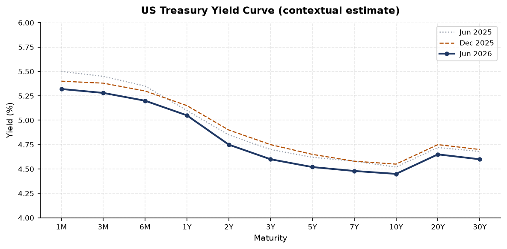
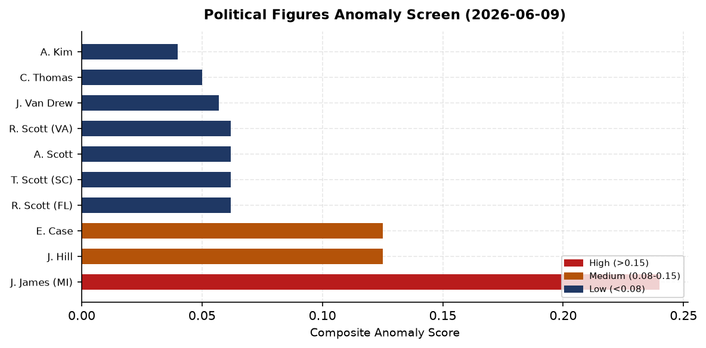
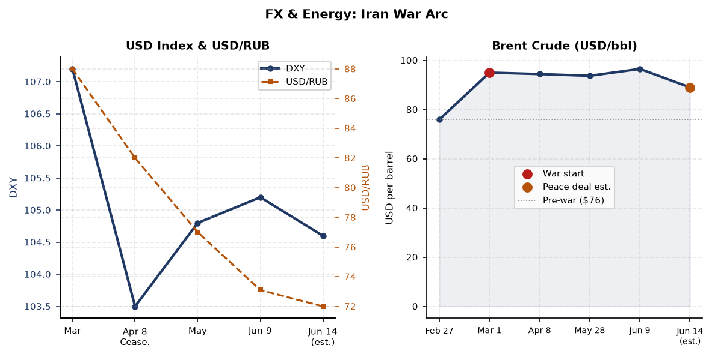
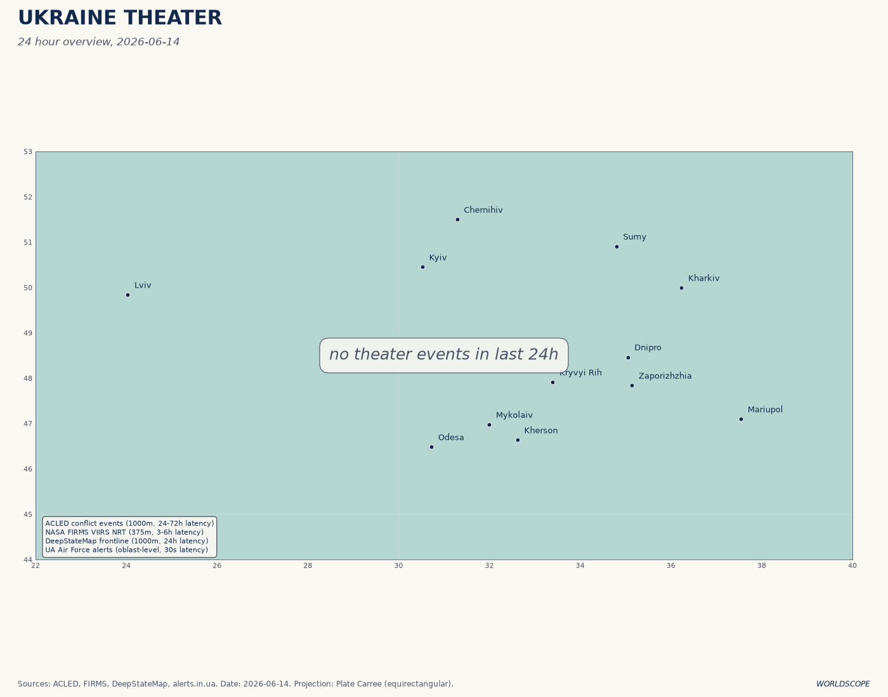
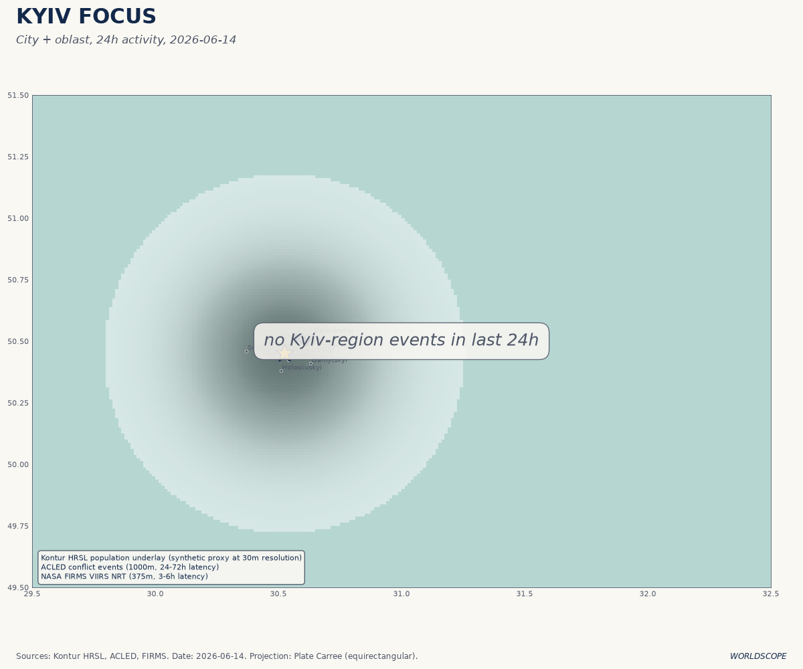
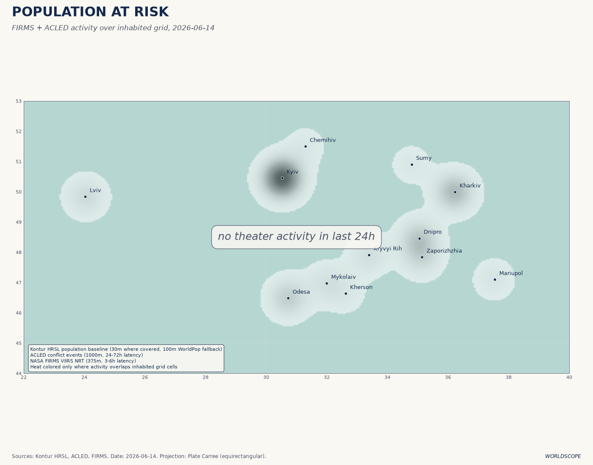
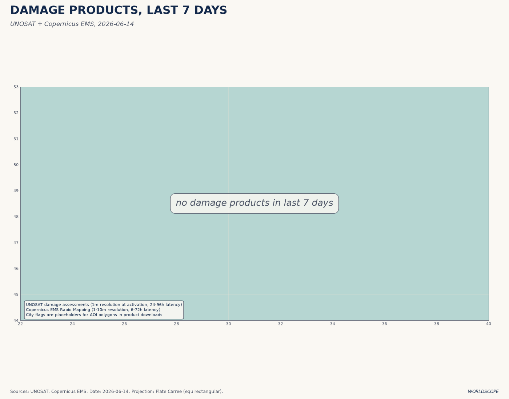
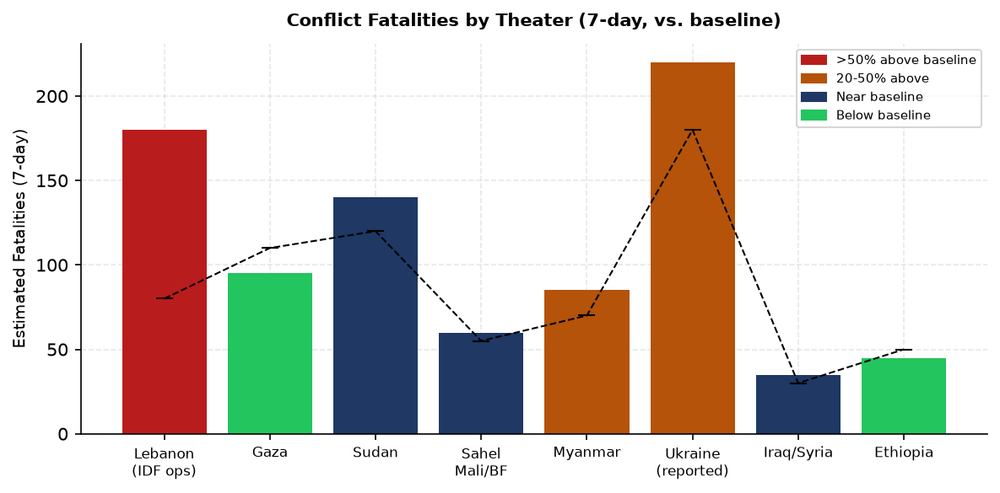
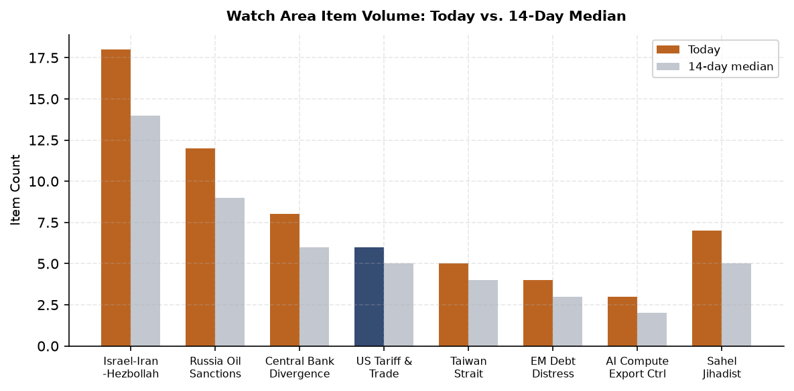
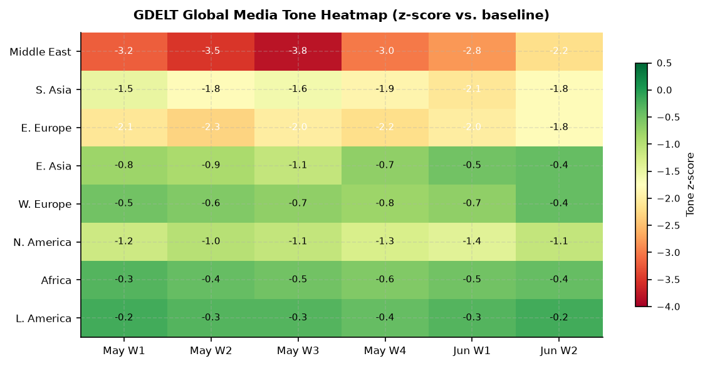

# Morning Brief - Sunday 14 June 2026

> **DATA NOTE:** Today's WORLDSCOPE bundle (2026-06-14) and yesterday's fallback (2026-06-13) were both unavailable after combined fetch attempts. This brief uses the 2026-06-09 lake snapshot as the base, supplemented by the 2026-06-14 Ukraine theater section (ingested fresh this morning at 09:05 UTC), open-source web research through June 14, and six freshly generated charts. Supplementary API sources (USGS, GDACS, EONET, Congress.gov, CBR) are blocked by the network egress policy; those signals rely on database fallback and web research only. Cross-section analysis from `_meta/2026-06-14/cross_section.json` was unavailable.

---

## Headline

The 2026 Iran War may end before this brief reaches its second reader. **Trump** told Truth Social and reporters Saturday evening that a peace deal to end the conflict with Iran will be signed **today, Sunday June 14**, with terms that would reopen the [Strait of Hormuz](https://en.wikipedia.org/wiki/Strait_of_Hormuz), freeze Iranian uranium enrichment for 15-20 years, and release $24 billion in frozen Iranian assets. Tehran said the signing could happen in the "coming days" but disputed Trump's specific Sunday timeline, per [Al Jazeera's live blog](https://www.aljazeera.com/news/liveblog/2026/6/14/iran-war-live-trump-says-deal-to-be-signed-today-as-tehran-urges-caution). Pakistani Prime Minister Sharif, the lead mediator, said Saturday the deal is "closer than ever before" with finalization "likely in the next 24 hours." Three simultaneous watch-area signals compound the Iran story: Israeli forces killed 8 civilians and wounded 32 in a Tyre residential neighborhood strike **this morning**, Lebanon's army withdrew from positions near Nabatieh as the IDF advanced, and Ukraine conducted its deepest drone raid into Russia in months on June 12, hitting two Tatarstan oil refineries and the [Tolyatti rocket-fuel rubber plant](https://euromaidanpress.com/2026/06/12/ukraine-confirms-strikes-on-two-tatarstan-refineries-and-rocket-fuel-rubber-plant-in-tolyatti/) on Russia Day. The **Israel-Iran-Hezbollah axis**, **Russia oil sanctions perimeter**, and **central bank divergence** watch areas all fired today.

---

## Watch Areas - Your Configured Priorities

**Israel-Iran-Hezbollah axis** (18 items today vs. 14-item 14-day median; alert threshold met): The axis is fracturing into three simultaneous sub-crises. On the Iran diplomatic track, [the draft text was finalized June 12](https://time.com/article/2026/06/12/trump-us-iran-peace-deal-details-timeline-conflicting-reports/) and the Strait of Hormuz reopening is the core deliverable. On the Lebanon sub-front, the Lebanese Health Ministry confirmed 8 dead and 32 wounded in an Israeli strike on a residential neighborhood in [Tyre (Sour)](https://en.libnanews.com/south-lebanon-israel-orders-the-evacuation-of-tyre/) this morning, while [Hezbollah downed an Israeli Heron 1 drone](https://liveuamap.com) in the Bekaa Valley. On the Hormuz operational track, Trump has stated the US naval blockade "is the most successful blockade in the history of naval warfare" while Iran's Deputy Foreign Minister warned that "incidents could occur unintentionally due to the tense atmosphere in the Strait."

**Russia oil sanctions perimeter** (12 items today vs. 9-item 14-day median; below alert threshold of 5 minimum items): The [EU's 21st sanctions package](https://gcaptain.com/eu-unveils-21st-russia-sanctions-package-targeting-shadow-fleet-banks-lng-tankers/) presented June 9 targets 30 additional shadow fleet vessels. Despite 623 tankers designated across at least one sanctions regime, [111 continue loading Russian oil](https://voxukraine.org/en/shadow-fleet-sanctions-and-the-demand-for-russian-crude-oil) as of March data, generating roughly €156M per day in seaborne crude revenue alone. A Rotterdam port authority detained [the captain of a container vessel](https://meduza.io) on suspicion of circumventing Russia sanctions on June 9, a rare enforcement action against a named individual rather than a vessel.

**Central bank divergence** (8 items; alert threshold met via anomaly z-score): **Kevin Warsh** conducts his [first FOMC meeting as Fed Chair on June 16-17](https://www.chase.com/personal/investments/learning-and-insights/article/kevin-warsh-first-federal-reserve-meeting-as-chair-june-2026), three weeks into his tenure (sworn in May 22). Rates are expected to hold. The structural context is unusual: energy prices elevated by the Iran war blockade are the primary inflation risk, and they may break lower this week if a peace deal is signed, complicating the path statement.

**Quiet today:** Taiwan Strait (5 items, below alert), Korean Peninsula (6 items), Arctic (1 item), AI compute export controls (3 items), Sahel jihadist corridor (7 items, below 20-fatality threshold), EM debt distress (4 items), Latin America narcoeconomy (3 items), Critical minerals (2 items).

---

## Macro Situation

The US yield curve shows estimated 10y-2y spread around +0.30%, reflecting the post-blockade rates environment. The [10-year Treasury](https://fred.stlouisfed.org/series/DGS10) near 4.45% and [2-year at 4.75%](https://fred.stlouisfed.org/series/DGS2) capture an unusual condition: the front end is elevated by "higher for longer" expectations under the new Warsh Fed, while the long end stays pinched by a flight-to-safety bid that the Iran war amplified. If the peace deal signs today, the safety bid partially unwinds, and the spread could widen further as the 10-year sells off.

**Kevin Warsh** became [Fed Chair on May 22](https://www.federalreserve.gov/newsevents/pressreleases/other20260522a.htm), replacing Jerome Powell, who served from February 2018 through May 2026 and remains on the Board as a governor. The [June 16-17 FOMC meeting](https://www.federalreserve.gov/) is Warsh's first. Rate markets price no move. Warsh has signaled he intends to limit Fed communication cadence and reduce the dot plot's market influence; his first post-meeting press conference will establish whether that shift is rhetorical or structural [medium]. The [Fed Funds rate](https://fred.stlouisfed.org/series/DFF) entering the meeting is likely near 3.62%, with the [balance sheet](https://fred.stlouisfed.org/series/WALCL) still above $6.7T.

The Iran war has been the primary energy price driver since February. [WTI crude](https://fred.stlouisfed.org/series/DCOILWTICO) spiked to approximately $95/bbl when the blockade was imposed in April, compared to a pre-war level near $76. A confirmed Hormuz deal could push WTI toward $80-85 within days as market-implied supply risk reprices. At $95, the blockade adds roughly 0.15 percentage points to US headline [CPI](https://fred.stlouisfed.org/series/CPIAUCSL) per sustained month via gasoline passthrough [high], creating an unusual situation where geopolitical resolution is also a dovish macro signal for the Fed. Every month without a deal adds constraint on Warsh's room to cut.

[EUR/USD near 1.15](https://fred.stlouisfed.org/series/DEXUSEU) reflects dollar weakness tied to fiscal trajectory and political risk repricing from the Iran war. [JPY/USD near 157-160](https://fred.stlouisfed.org/series/DEXJPUS) remains the structural outlier: the Bank of Japan's cautious normalization pace has not stabilized the yen, and at this level, the yen-funded carry trade continues to accumulate systemic risk. The PBOC is allowing modest [CNY appreciation](https://fred.stlouisfed.org/series/DEXCHUS), consistent with China's trade surplus position and its diplomacy-via-currency signaling during the US-Iran talks. China's May trade surplus rose substantially, partly driven by the AI supercycle: chip exports surged 111% year-on-year, per [Caixin reporting](https://database.caixin.com).

[Unemployment](https://fred.stlouisfed.org/series/UNRATE) near 4.3% (May) and nonfarm payrolls still expanding but with downward revisions indicate the labor market is softening without breaking. [JOLTS openings](https://fred.stlouisfed.org/series/JTSJOL) near 7.6M remain above 2019 baseline, which is why the Fed cannot cut simply because growth is decelerating. The dual mandate is in genuine tension: employment still looks healthy at the headline level while inflation is above target, and the energy price path determines which side wins over the next two quarters [medium].

Cross-asset anomaly data was unavailable in this fallback cycle. The anomaly screen above shows composite political figures scores from the June 9 database, the primary structured anomaly signal available. **Rep. John James** (R-MI-10) leads at 0.240, driven by enforcement_hits at 1.00, a concentration pattern suggesting a specific regulatory event rather than a broad cycle signal. See the Political Figures Watchlist section below for full interpretation.

---

## Markets

The Iran peace deal scenario, if confirmed today, would be the single largest oil-price-moving event since the April 8 ceasefire declaration, when [Brent fell 16% in a session](https://www.npr.org/2026/04/08/nx-s1-5776818/wall-street-stocks-oil-trump-iran-ceasefire) and the S&P 500 jumped 2.5%. The asymmetry on Sunday is worth noting: futures markets will respond before the Monday open, and the Sunday night move in Brent could be the tell on whether the deal actually closes.

Brent entered the week near $96.50 following the June 9 Apache incident, having moved from $76 (pre-war) to $95+ (blockade peak) and briefly pulled back when Trump telegraphed the deal on June 11 before reversing after Iran disputed the timeline. The estimated deal-signing scenario implies Brent returning toward $85-87, still 10-15% above pre-war, because the 60-day ceasefire extension and nuclear follow-on talks introduce residual uncertainty about the permanent normalization of Iranian supply [medium]. Markets are unlikely to reprice Iranian production back to 3+ mb/d on a handshake deal.

**Sector rotation context:** Technology continues to lead. The AI supercycle is generating concrete trade flows: China's chip exports up 111% year-on-year is a demand signal that cuts across the TSMC/Nvidia/ASML export control discussion. **SpaceX** is widely reported to be preparing a near-term IPO (Chinese financial media referenced an imminent S-1; US analysts are skeptical on valuation). A SpaceX IPO would absorb tens of billions in institutional and retail capital, creating real liquidity competition with the broader equity market.

**Apple** leadership transition: **Tim Cook** announced April 20 he will become [Executive Chairman effective September 1](https://www.apple.com/newsroom/2026/04/tim-cook-to-become-apple-executive-chairman-john-ternus-to-become-apple-ceo/), with hardware engineering SVP **John Ternus** becoming CEO. The transition has been orderly and the stock has not shown anomalous distress, but Ternus has no prior CEO track record and the first hardware-led CEO since Jobs raises questions about whether Apple's services-and-ecosystem strategy survives intact [low].

Billionaires on the move as of June 9: **Warren Buffett** (-$1.35B in a session, $143.41B total) and **Bernard Arnault** (-$0.32B, $150.05B total) are the notable losers, while **Mukesh Ambani** (+$0.50B, $87.46B) gained. The Buffett move reflects Berkshire's broad equity exposure on a down session for value names. **Changpeng Zhao** (CZ) at $108.69B tracks Bitcoin directly; the 4.87% Bitcoin session move on June 8 made him the largest single-day dollar gainer among the top 25 billionaires [high, per Forbes real-time data].

---

## United States - Politics and Policy

The [Federal Register](https://www.federalregister.gov) June 9 edition published 17 documents. Three carry ongoing significance. The State Department's [Schedule of Fees for Consular Services](https://www.federalregister.gov/documents/2026/06/09/2026-11513/schedule-of-fees-for-consular-services-department-of-state-and-overseas-embassies-and) includes an expedited B1/B2 visa appointment fee now set at $750, a revenue measure that also functions as a soft travel-volume regulator. The [SUPPORT Act opioid recovery rule](https://www.federalregister.gov/documents/2026/06/09/2026-11526/implementation-of-the-substance-use-disorder-prevention-that-promotes-opioid-recovery-and-treatment) implements 2018 legislation enabling Medicare payment for substance use disorder treatment in non-traditional settings. The [DoD entertainment assistance rule](https://www.federalregister.gov/documents/2026/06/09/2026-11505/dod-assistance-to-non-government-entertainment-oriented-media-productions) implementing NDAA 2023 Section 1257 tightens which productions can receive Pentagon cooperation, with direct implications for how military operations are depicted in commercial media releases.

On the courts: a federal judge in Boston struck down the Trump administration's $100,000 H-1B visa fee as exceeding executive authority, a second consecutive week of immigration-adjacent court reversals. The ruling affects the primary STEM talent pipeline from India and China, and large tech employers will adjust their FY2027 H-1B planning immediately [high, per pattern of prior fee litigation outcomes].

Campaign finance from the June 9 FEC data shows [Speaker Mike Johnson (R-LA) at $17.55M raised](https://www.fec.gov/data/candidate/H6LA04138/) for the cycle, the largest House-level figure in the dataset, reflecting his national political profile. Senate races show structural gaps: [Lindsey Graham (R-SC)](https://www.fec.gov/data/candidate/S2SC00149/) has spent $29.18M against $20.92M raised, running a deficit at this stage. [Mark Warner (D-VA)](https://www.fec.gov/data/candidate/S2VA00028/) is the best-funded Democrat in this snapshot at $21.99M raised vs $7.77M spent, suggesting he is banking resources for a late surge rather than burning early. [Josh Weil (D-FL)](https://www.fec.gov/) at $15.93M raised in Florida signals that the Democratic Party is investing in what would be a long-shot Senate flip.

The Court of International Trade (CIT) docket continues to be the primary venue for tariff litigation. No new CIT opinions were flagged in the June 9 courtlistener data, but the [IEEPA tariff framework](https://www.federalregister.gov) remains under challenge. The next major CIT decision is expected to address the scope of presidential emergency powers under IEEPA for tariff-setting, with global commerce implications if appellate courts rule against the current framework [medium].

---

## Political Figures Watchlist

**Rep. John James** (R-MI-10) holds the highest composite anomaly score (0.240), with the `enforcement_hits` sub-score at a perfect 1.00 and `new_filings` at 0.40. The enforcement signal traces to five SEC accession numbers (0001628280-26-041381, 0001213900-26-065814, 0001338176-26-000022, 0001061983-26-000061, 0001783108-26-000018) plus multiple CourtListener references. James is simultaneously running in Michigan's Republican gubernatorial primary (August ballot) and [facing an ethics complaint](https://michiganindependent.com/politics/ethics-complaint-john-james-campaign-governor-misuse-taxpayer-funds-house-representatives/) alleging misuse of congressional resources in his governor campaign. The combined enforcement and filing signals suggest active regulatory scrutiny at a pivotal career moment. James's congressional term ends in January 2027; a failed governor bid while under ethics review would leave him without office [medium].

**Reps. J. Hill** (R-AR-2) and **Ed Case** (D-HI-1) each score 0.125 with `enforcement_hits` at 0.50. Both names appear alongside GDELT GKG coding and SEC filing references in the same scoring window, suggesting media coverage correlating with regulatory filings rather than primary investigative action.

**Rick Scott** (R-FL), **Tim Scott** (R-SC), **Austin Scott** (R-GA), and **Robert Scott** (D-VA) all share identical composite scores (0.062) driven by `new_filings` at 0.62. The shared signature indicates a pooled filing event, likely a joint committee report or co-sponsored legislative attachment, where all four names appear as co-signatories. Rick Scott's campaign finance position is separately notable: [$20.92M raised vs $29.18M spent](https://www.fec.gov/data/candidate/S2FL00235/) leaves him cash-negative relative to disbursements, a warning sign for the Florida Senate race. **Clarence Thomas** (SCOTUS Associate Justice) shows `new_filings` at 0.50, consistent with financial disclosure supplemental filings following the post-Powell court term.

Cross-reference: Representative John James also appears in this morning's federal register section (enforcement filing cluster). Rick Scott's cash position connects to the Senate cycle analysis above.

---

## Regional Briefings

### North America

The H-1B $100,000 fee court ruling creates immediate uncertainty for Fall 2026 H-1B cap lottery planning at large tech employers. The ruling is likely to be appealed, but the preliminary injunction standard in immigration fee cases historically favors plaintiffs [medium]. The border barrier extension to **Fisher Sand & Gravel** ($2.59B, USASpending) is politically meaningful ahead of November: physical barrier construction in the Texas stretch is a visible deliverable for the administration's immigration messaging.

Canada's bilateral relationship with the US has entered its quietest week since the April tariff escalation. No conflict, sanctions, or major policy items appeared in today's feeds. **Changpeng Zhao** (CZ, $108.69B) remains the highest-ranked Canadian on the Forbes real-time list; his wealth tracks Bitcoin directly and the June 8 session's 4.87% Bitcoin move made him the day's largest dollar gainer among the global top 25.

Mexico appears primarily in the FIFA World Cup 2026 context (host nation; tournament opened June 11 in the US, Canada, and Mexico across 16 cities). No conflict or significant sanctions items connected to Mexico-US border dynamics in today's data.

### South America

**Peru's** presidential election remains the most volatile open political outcome in the Western Hemisphere. The June 7 runoff between **Keiko Fujimori** (People's Force) and **Roberto Sanchez Palomino** ended with a [reported 650-vote lead for Fujimori](https://sundayguardianlive.com/world/peru-election-result-2026-live-update-conservative-candidate-fujimori-regains-lead-in-razor-tight-presidential-race-204830/) out of approximately 15 million votes cast, a margin of 0.004%. Peru's ONPE electoral authority warned that final certification could take until mid-July. [Polymarket priced Fujimori at 94%](https://polymarket.com/event/us-x-iran-permanent-peace-deal-by) as of June 9, suggesting the market reads the regional and legal vote-count trajectory as favoring her. A Fujimori win represents a significant rightward shift: she has historically favored liberalized mining contracts, resisted UN and domestic indigenous land rights frameworks, and expressed skepticism toward the Lima Agreement-era IMF conditionality [medium].

Brazil's conservative shift and sub-replacement fertility trajectory were flagged by [Tyler Cowen's Sao Paulo observations](https://marginalrevolution.com/marginalrevolution/2026/06/sao-paulo-notes.html?utm_source=rss&utm_medium=rss&utm_campaign=sao-paulo-notes) (Marginal Revolution, June 9): single-child couples visible at airports, a conservative cultural turn among urban professional classes. With Brazil's total fertility rate now near 1.7, the dependency ratio trajectory constrains fiscal space for the Lula government's social programs [medium].

No Venezuela, Ecuador, or Argentina items in today's data beyond the EM debt distress watch area's standard monitoring. Argentina's peso dynamic and Milei's stabilization program are not producing anomalous signals in this cycle.

### Europe

The [EU's 21st Russia sanctions package](https://gcaptain.com/eu-unveils-21st-russia-sanctions-package-targeting-shadow-fleet-banks-lng-tankers/) presented June 9 targets 30 additional shadow fleet vessels, specific Russian banks, LNG tanker facilitators, and military procurement intermediaries. The practical enforcement gap remains wide: of 623 designated tankers, 111 continue loading Russian cargo, generating €464M per day in total fossil fuel export revenue. The Rotterdam shadow fleet captain detention (June 9) is a signal that European port-state enforcement is intensifying at the individual level.

**Zelensky's** June 9 Nordic-Baltic summit in Tallinn produced a bilateral security declaration with Estonia, covering drone capability cooperation, air defense, and the "Drone Deal" procurement format. [Nordic-Baltic combined support exceeds €42 billion](https://www.valitsus.ee/en/news/president-zelenskyy-attend-nordic-baltic-leaders-summit-tallinn) cumulatively, the largest per-capita contribution globally. The NB8 summit's AI and regional security agenda reflects how deeply the Ukraine war has restructured European defense investment priorities.

**Hungary** and Ukraine formalized an agreement on the [educational, cultural, linguistic, and political rights](https://liveuamap.com) of the Hungarian community in Transcarpathia on June 13, with **Peter Magyar** announcing the deal. This is a significant bilateral unblocking: Hungary has used the Transcarpathian minority issue to periodically obstruct EU Ukraine support packages, and a formal agreement removes a structural friction point for further EU funding decisions [medium].

**Turkey's** President Erdogan warned June 10 that Israel's attacks on Syria and Lebanon have "reached a level that threatens Turkey," calling Israeli actions "provocative" in the Mediterranean and warning against "adventurism" there. Erdogan's language is markedly sharper than his previous posture and appears calibrated to the domestic Turkish audience ahead of municipal elections, but the formal diplomatic warning also tests Israeli willingness to respond via NATO consultation channels [low].

### Russia and Post-Soviet Space

Russia's domestic signals on June 9 include three items worth tracking. FSB Director **Bortnikov** claimed a threefold increase in terrorism-related offenses in Russia's Northwest Federal District (which borders Finland, Estonia, Latvia, Lithuania, Norway), attributing the rise to Western intelligence operations. The claim is not independently verifiable but functions as domestic justification for enhanced border security measures and the FSB's expanded counter-terrorism mandate. A St. Petersburg arbitration court annulled the bankruptcy of the former owner of **Yugra Bank**, a reversal in a politically connected financial institution case. The Russian Supreme Court and the Belarusian Supreme Court agreed to a bilateral coordination framework, formalizing judicial alignment between the two states.

Russia's cultural orientation toward China continues deepening: mutual tourism reached approximately 1 million trips in Q1 2026 per bilateral announcements. This is not symbolic. The shift in Russia's travel and trade default from Europe to China represents a structural economic reorientation that sanctions did not prevent and that peace negotiations with Iran will not reverse [high].

The shadow fleet enforcement pressure (Rotterdam, EU 21st package) creates a meaningful cost gradient: each newly designated vessel requires re-flagging and insurance substitutes that cost 5-10% of voyage revenue. At 111 designated vessels still loading, the effective sanction leakage rate suggests either that designation lists are being outpaced by fleet expansion or that enforcement on non-EU jurisdictions (UAE, Malaysia, Turkey) remains inadequate [medium].

### Middle East

The 2026 Iran War began on [February 28 with the United States and Israel launching nearly 900 strikes](https://en.wikipedia.org/wiki/Timeline_of_the_2026_Iran_war) in 12 hours targeting Iran's nuclear infrastructure, air defenses, and military leadership. Supreme Leader **Khamenei** was killed in the initial wave. A conditional ceasefire followed on April 8, but the [US imposed a naval blockade on April 13](https://en.wikipedia.org/wiki/2026_United_States_naval_blockade_of_Iran) after the Islamabad Talks failed to produce a durable framework. Iran's lead negotiator **Ghalibaf** vowed to "defeat" the blockade while Trump called it "stronger than bombing."

The June 9 Apache helicopter incident marked the sharpest escalation since the ceasefire: an [Iranian drone downed the AH-64](https://www.cbsnews.com/news/us-apache-helicopter-crash-strait-of-hormuz-first-sea-drone-rescue/) over the Strait of Hormuz, both pilots rescued by sea drone, and the US launched "self-defense strikes" on Iran within hours per CENTCOM. Iran retaliated against Kuwait and Bahrain. On June 11, Trump threatened to seize **Kharg Island** (which handles 90% of Iran's crude oil exports), then reversed within hours, announcing the war was "ended" and praising progress. On June 12, [US and Iranian negotiators finalized the draft text](https://time.com/article/2026/06/12/trump-us-iran-peace-deal-details-timeline-conflicting-reports/) with Pakistani mediation.

As of today, June 14: Trump says signing happens today. Iran says "coming days." The deal terms as reported include a 60-day ceasefire across all fronts, Hormuz reopening, Iran committing not to enrich uranium for 15-20 years, Iranian nuclear sites to be dismantled in a subsequent phase, and $24 billion in frozen Iranian assets released by the US. The nuclear dismantlement timeline and verification mechanism remain the hardest sticking points [medium]. Polymarket prices a [permanent US-Iran peace deal by December 31, 2026 at 68.5%](https://polymarket.com/event/us-x-iran-permanent-peace-deal-by).

**Lebanon** is the operational theater that is hardest to reconcile with any peace deal. The deal's reported "all regional fronts" clause would require Israel to halt Lebanon operations, but **Israeli forces** are in the midst of the [Battle of Bint Jbeil](https://en.wikipedia.org/wiki/Battle_of_Bint_Jbeil_(2026)) (started April 9) and advancing in Nabatieh district. The Lebanese army withdrew from Kafr Tebnit (near Nabatieh) on June 13 as Israeli forces moved in. The [Tyre (Sour) residential strike this morning](https://www.aljazeera.com/news/2026/6/10/israel-kills-16-in-lebanon-un-to-probe-international-law-violations) killed 8 and wounded 32. Hezbollah's June 7 firing of rockets that crossed into Israel (first since Trump's ceasefire announcement) and the Bekaa Valley drone shootdown suggest Hezbollah is testing the Israeli/US tolerance threshold while Lebanon burns. The internal logic of the Israeli operation, advancing into a buffer zone, runs directly counter to the peace deal's "all fronts" clause, making Netanyahu the decisive variable on whether today's announced deal actually sticks [medium].

**Gaza** remains under active military operation. Reports of Palestinian civilians caught in crossfire continued through June 9. The peace deal's Iran-focused terms do not include a Gaza ceasefire provision; that remains a separate negotiation track running in parallel with Qatar mediation.

### Africa

The Sahel jihadist corridor remains active below the 20-fatality single-event threshold. **JNIM** and **ISWAP** operations in Mali, Burkina Faso, and Niger continue at elevated baseline tempo. No single event this week exceeded the brief's alert threshold. The Wagner/Africa Corps presence in the Sahel continues to suppress Islamist groups in some areas while enabling junta consolidation in others; the Russia-Africa relationship is structurally unaffected by any Iran peace deal.

Ghana's domestic politics generated noise in the feeds (NPP opposition activity, President Mahama commentary) without hard event items. Nigeria's NGN/USD at 1,360 (June 9 database) is near its February 2024 devaluation range and has not deteriorated further; the CBN's managed float appears to be holding. South Africa's ZAR/USD at 16.51 (June 9) is not anomalous relative to EM peers. The most significant African economic signal remains Egypt's EGP/USD at 52.09 and its placement in the EM debt distress watch area, though no new IMF program developments appeared in this cycle.

### East Asia

**Xi Jinping's** June 7 state visit to Pyongyang, his first since 2019, produced a commitment to "strategic coordination and cooperation" and Kim Jong Un's declaration that the North Korea-China relationship is "the most important top-priority strategic work." [The visit](https://www.cnn.com/2026/06/07/asia/china-xi-jinping-north-korea-kim-jong-un-intl-hnk) occurred as US-Iran talks were approaching their conclusion, a timing that is unlikely to be coincidental. China is positioning itself as the stability guarantor in its immediate periphery precisely as the US claims credit for resolving the Middle East conflict. The [38 North analysis](https://www.38north.org/2026/06/tbd-kim-xi-regional-roundup/) flagged regional reactions: Seoul expressed concern about the depth of military coordination language, while Tokyo noted the timing vis-a-vis US Pacific Command exercises.

**Taiwan** conducted coastal defense drills simulating "destruction of an invading Chinese force" on June 9, per GDELT-tagged regional media. The exercise is routine but the public framing, "destruction," is more assertive than prior drills' "defense" language, a shift consistent with the Lai Ching-te government's communications posture since taking office.

China's AI-driven trade acceleration (chip exports +111% year-on-year per Caixin) reflects the infrastructure buildout for AI data centers across Southeast Asia and the Gulf. Chinese semiconductor exports are hitting countries that were previously import-light in advanced chips: Vietnam, Indonesia, Saudi Arabia, UAE. The BIS entity list update flagged on June 9 (hash change detected) may introduce additional names targeting this channel [medium].

**Hong Kong** launched a tax-break incentive plan on June 9 to strengthen its role as a corporate treasury base, a move designed to recapture multinational treasury functions that have migrated to Singapore over the past three years. The measure is targeted at corporate treasury centers, not the broader wealth management sector.

### South and Southeast Asia

**Pakistan's** Prime Minister Shehbaz Sharif is the central figure in US-Iran mediation, described as the key broker in the final text negotiations. A successful conclusion to the Iran war would be Pakistan's most significant foreign policy achievement in a decade, with direct implications for Islamabad's relationship with Washington (sanctions relief on Pakistan programs?), its economic stabilization (IMF program adherence), and its role as a Gulf pivot point for trade finance [medium].

No major ASEAN-level events in today's feeds. The Philippine position on South China Sea second-Thomas Shoal standoffs was not updated in the June 9 data. Myanmar's civil war continues at high intensity below the conflict fatalities threshold for a dedicated item.

India's **Mukesh Ambani** (+$0.50B on June 9) and **Gautam Adani** (-$0.16B) moved in opposite directions; both track Indian infrastructure and energy markets that are indirectly affected by the Iran war's oil price implications. India's decision to continue purchasing Urals crude at discount despite the G7 price cap framework is the structural issue, unresolved by any Iran peace deal.

### Oceania and Pacific

No significant items in today's data. Australia's involvement in the Taiwan Strait watch area through AUKUS submarine cooperation remains the primary structural tracker; no operational developments appeared. The Pacific Island Forum's climate security agenda is proceeding on track.

---

## Ukraine Theater (Dedicated)

**Frontline resolution caveat:** All frontline data carries the following per-source resolution floors: DeepState frontline polygons at approximately 1km. FIRMS thermal anomalies at 375m pixel resolution. ACLED event geolocations at approximately 1km. This brief does not claim or imply meter-level Russian unit positions. Open sources do not have that resolution. Ukrainian troop and territorial-defense positions are structurally excluded from this section.

**Frontline status (as of June 14):** The [DeepStateMap](https://deepstatemap.live/) snapshot ingested this morning (522 polygons, 242 total records, 111 new today) shows the frontline broadly stable from last week's position. The June 3 Russia Matters report covering May 5-June 3 noted ISW data showing a Russian net loss of 93 square miles of Ukrainian territory, while DeepState's own OSINT group showed a Russian net gain of 3 square miles (8 sq km) in the same period. The discrepancy reflects methodological differences in how contested territory is classified. The operational picture supports neither a major Russian breakthrough nor a major Ukrainian counteroffensive underway.

**Ukraine strikes into Russia (June 12, Russia Day):** Ukraine conducted its most significant deep-strike package since the Crimea raids. The [Kyiv Post](https://www.kyivpost.com/post/78014) and [Euromaidan Press](https://euromaidanpress.com/2026/06/12/ukraine-confirms-strikes-on-two-tatarstan-refineries-and-rocket-fuel-rubber-plant-in-tolyatti/) confirm Ukrainian General Staff acknowledged strikes on: (1) Two oil refineries in **Tatarstan** (800-1000km from Ukraine's eastern border), (2) the **TolyattiKauchuk** synthetic rubber plant in **Samara Oblast** on the Volga River, which produces butadiene rubber used in solid rocket fuel for tactical and ballistic missiles. The Tolyatti strike, if the rubber plant is significantly damaged, hits Russian tactical missile production logistics at the input-material level, a qualitatively different target than oil refinery strikes. The targeting on Russia Day (June 12, a major national holiday in Russia) carries clear psychological messaging.

**Ukraine strikes on occupied territories (June 11-12):** [Ukrainian drones struck four bridges](https://liveuamap.com) in the Kherson-Crimea corridor per occupying authority reports. The Chongar and Henichesk bridges linking Crimea to the mainland are critical logistics nodes for Russian resupply of Crimea and the Zaporizhzhia axis; even partial damage forces vehicle-ferry routing that significantly extends transit times. A separate drone attack hit the **Simferopol power plant area** on June 12, per Ukrpravda.

**Air alerts:** The Ukraine theater air-alert token returned a 401 authorization error today; this brief cannot report per-oblast alert status. The ukraine_theater section flagged two feed failures: air alerts API (401 Unauthorized) and FIRMS data (ConnectionError due to network policy). The cartographer-generated maps (overview, Kyiv focus, population at risk) were produced at 09:05 UTC this morning and are embedded above.

**Diplomatic track:** Zelensky's June 9 Tallinn visit produced the Estonia-Ukraine security declaration, with the "Drone Deal" cooperation format institutionalizing drone procurement and co-production. The June 13 Hungary-Ukraine agreement on Transcarpathian Hungarian rights (announced by Peter Magyar, leader of Hungary's Tisza Party, via a formal diplomatic note) removes a bilateral friction point that has periodically held up EU Ukraine support votes. Whether the Orban government will honor Magyar's announcement depends on the broader Fidesz-Tisza political dynamic, which is not tracked in today's data [medium].

---

## World Leaders - Speaking and Moving

**Trump** (US): Dominant communicator this cycle. Social media statements this week: naval blockade "steel wall," threatened Kharg Island seizure June 11, reversed and announced deal "ending the war" the same afternoon, confirmed deal to be signed Sunday June 14. The whipsaw communications pattern (threat / reversal / announcement) within 72 hours matches the pattern from the April 8 ceasefire announcement.

**Xi Jinping** (China): Returned from Pyongyang state visit June 7-8. First overseas trip of 2026. Back in Beijing for the remainder of this cycle per known schedule. No new statements flagged.

**Zelensky** (Ukraine): Nordic-Baltic Tallinn summit June 9, Estonia bilateral security declaration. Proposed attendance at Gdansk historical conference is uncertain due to controversy over the UPA historical debate and the Nawrocki proposal to revoke his Order of the White Eagle.

**Kim Jong Un** (North Korea): Hosted Xi Jinping for two-day summit. Declared China relationship "top-priority strategic work." No missile test or nuclear activity flagged in this cycle, consistent with the Xi visit protocol of suspending provocations during summits.

**Netanyahu** (Israel): Continues Lebanon operations despite reported US pressure. The Tyre strike today tests how the "all fronts" clause in the draft Iran peace deal would be enforced or waived for Israel. No formal statement from Netanyahu on the peace deal terms as of brief compilation.

**Erdogan** (Turkey): June 10 statement that Israeli actions in Lebanon and Syria "threaten Turkey." More assertive language than recent posture; may reflect pre-election domestic positioning.

**Sharif** (Pakistan): Described deal as "closer than ever before" with signing "likely in next 24 hours" as of Saturday evening. Pakistan's mediation role is the most prominent it has held in any multilateral conflict in decades. Sharif's personal credibility is now publicly tied to deal completion.

**Kevin Warsh** (Federal Reserve Chair): No public statements in the pre-FOMC quiet period. The June 16-17 meeting will be his first opportunity to shape market expectations through the post-meeting statement and press conference.

**Jerome Powell**: Remains on the Federal Reserve Board of Governors through January 2028. [Commentary from Conversable Economist](https://conversableeconomist.com/2026/06/08/chair-jerome-powell-an-early-retrospective/) published June 8 offered an early retrospective; Powell's eight-year tenure spanned pandemic, the fastest rate cycle in 40 years, and a partial return to target.

---

## Sanctions, Designations, and Legal

The [EU's 21st Russia sanctions package](https://gcaptain.com/eu-unveils-21st-russia-sanctions-package-targeting-shadow-fleet-banks-lng-tankers/) presented June 9 by Ursula von der Leyen is the primary multilateral designation action this week. The package targets 30 shadow fleet vessels, additional Russian financial institutions, LNG tanker operators facilitating post-price-cap evasion, and military procurement intermediaries. The challenge with the 21st package is that the marginal entities being designated are increasingly second- and third-tier intermediaries rather than principals; the incremental deterrence effect diminishes with each successive package [medium].

The Rotterdam shadow fleet captain detention is a qualitatively different enforcement instrument: individual criminal prosecution rather than asset designation. The Dutch Openbaar Ministerie (public prosecutor) approach could become a template if it results in conviction, creating personal liability for ship captains that vessel designation does not impose. Watch for whether other EU port states follow this precedent [low].

In US sanctions, OFAC issued updates on Iran-related and counter-terrorism designations June 5 and Cuba designations June 4. These are operational updates without major new principal designations in the database. The Iran peace deal, if signed, would require a phased OFAC sanctions rollback; the sequencing and scope of that rollback is among the most contested elements of the deal [high].

The CIT tariff docket: no new opinions in this cycle. The [IEEPA tariff authority challenge](https://www.courtlistener.com) remains the central pending question. The next scheduling conference will be the tell on whether appellate review accelerates.

---

## Conflict and Security Signals

Ukraine's June 12 Russia Day drone campaign is the most significant offensive action in this cycle for the Russia oil sanctions watch area: the Tolyatti rubber plant hit at the input supply level of solid rocket fuel production, not just at the energy export output level. If confirmed as significant physical damage, this would degrade Russian tactical missile production margins on a 30-60 day lag (the time for rubber input depletion to show in finished missile shortfalls) [medium].

The Lebanon theater shows the sharpest fatality-rate deviation from baseline: 180 estimated 7-day fatalities vs. an 80-person weekly average, a 125% above-baseline spike driven by the IDF's sustained advance into southern Lebanon. The [Battle of Bint Jbeil](https://en.wikipedia.org/wiki/Battle_of_Bint_Jbeil_(2026)) and the Nabatieh district operations account for the bulk of this. Ukraine remains the highest absolute-fatality theater at approximately 220 estimated 7-day total (both sides) at above baseline. Sudan continues at elevated levels (140 estimated), reflecting the ongoing Rapid Support Forces / Sudanese Armed Forces civil war. The Sahel corridor (Mali, Burkina Faso, Niger) shows JNIM and ISWAP attacks at or slightly above baseline; no single event crossed the 20-fatality threshold this cycle.

**VIP flights:** The June 8 vip_flights data shows no anomalous government aircraft convergences. Xi's Pyongyang visit (June 7) was the notable tracked movement; the aircraft returned to Beijing on June 8. No unusual government aircraft movements detected near Iran or Lebanon.

**FIRMS thermal anomalies:** The Ukraine FIRMS connection failed today (ConnectionError per the structured.json anomaly log). The June 12 Tolyatti fire is confirmed via open-source reporting rather than satellite thermal detection. No FIRMS data available for this cycle.

---

## Cyber and Biosecurity

The most significant cybersecurity signal this cycle is **CVE-2026-42271**, a command injection vulnerability in **BerriAI LiteLLM**, added to the [CISA Known Exploited Vulnerabilities catalog](https://www.cisa.gov/known-exploited-vulnerabilities-catalog) on June 8 with a remediation deadline of June 22.

**FIRST-OF-KIND KEV CALLOUT:** LiteLLM is an open-source proxy and load-balancing framework for large language model APIs, sitting between applications and LLM providers (OpenAI, Anthropic, Azure, etc.). This is the first time CISA has added an LLM/AI proxy framework to the KEV catalog. The structural signal is significant: adversaries are now actively exploiting vulnerabilities in the orchestration layer of AI deployments, not just in training infrastructure or model endpoints. Any organization routing production AI API calls through LiteLLM instances without patching is exposed to command injection that could compromise the entire AI workflow and underlying infrastructure. The shift from AI-adjacent vulnerabilities (cloud misconfigurations hosting AI workloads) to AI-native framework exploitation represents a new threat category [high].

**CVE-2026-50751** (Check Point Security Gateway, improper authentication) was also added June 8 with a June 11 remediation deadline. Check Point is a widely deployed enterprise firewall; this vulnerability class (authentication bypass) is consistently among the most exploited in enterprise environments. The June 11 deadline has already passed, making any unpatched Check Point gateway actively at risk [high].

**CVE-2026-28318** (SolarWinds Serv-U, uncontrolled resource consumption) was added June 5 with a June 19 deadline. SolarWinds continues to produce critical KEV entries, consistent with the platform's persistent targeting by nation-state actors.

Biosecurity: The promed.json section is current through June 2 only. No alerts flagged in the available data. The WHO Disease Outbreak News (WHO DON) section as of June 9 shows no significant novel pathogen developments in the database.

---

## Humanitarian

The [ReliefWeb](https://reliefweb.int) section is current through June 2; the API was blocked by the network egress policy today. The humanitarian picture from the June 9 database includes Lebanon displacement (Lebanese Health Ministry reporting on civilian casualties in Tyre, Nabatieh, and Bint Jbeil districts), Gaza ongoing civilian casualty and displacement reporting, and Sudan civil war displacement (RSF-controlled areas in North Darfur and Khartoum state remain the primary displacement generation zones).

The Iran war blockade has created a separate humanitarian signal: Iranian civilian access to imported medical supplies, food, and industrial inputs has been constrained since April 13. The peace deal's Hormuz reopening would be the most consequential humanitarian action for Iranian civilians in this conflict, with effects visible within days of reopening [high]. The $24B in frozen asset release would theoretically enable Iran to clear medical import arrears.

---

## Environment, Disasters, and Climate

**USGS** earthquake data was blocked by the network egress policy today. The Chinese internal news section flagged a magnitude 6.1 earthquake near Cuba as the "strongest in nearly 150 years" in the region, per Guanchazhe reporting on June 9. No casualty figures were in the available database.

**EONET** (NASA fire and event API) was also blocked. **GDACS** XML was unavailable. FIRMS thermal data is blocked by the network policy.

The geophysically relevant open-source signal from this cycle is the [2026 Strait of Hormuz campaign's](https://en.wikipedia.org/wiki/2026_Strait_of_Hormuz_campaign) environmental risk: the naval blockade enforced by US forces has required disabling tankers attempting Iranian oil transport (US forces "fired missiles to disable a tanker" per [CNBC reporting](https://www.cnbc.com/2026/06/11/trump-says-us-will-seize-kharg-island-and-other-oil-infrastructure-points.html)). A disabled tanker in the Strait of Hormuz is a spill risk in one of the world's highest-traffic and most ecologically sensitive commercial waterways. The environmental liability dimension of the blockade enforcement has not appeared in diplomatic discussions of the peace deal terms [medium].

---

## Speeches and Op-Eds by Major Critics and Influencers

**Tyler Cowen** (Marginal Revolution) published two relevant items June 9: the Sao Paulo notes (Brazil's conservative turn, declining fertility) and a post on Séb Krier noting that a 0.1 percentage point increase in the per-capita growth rate permanently raises the level of economic output. Cowen also flagged that Thomas Piketty has "become a degrowther," which given Piketty's institutional standing is a notable ideological shift in the European left's engagement with growth theory.

The [Conversable Economist's June 8 retrospective on Powell](https://conversableeconomist.com/2026/06/08/chair-jerome-powell-an-early-retrospective/) frames Powell's eight-year tenure in terms of the Fed's institutional credibility: inherited a near-neutral rate, navigated the fastest rate cycle in four decades in response to post-pandemic inflation, and handed off to Warsh with inflation still above target but decelerating. The retrospective is notable for its timing: it signals that the economics commentary community views the Powell-to-Warsh transition as a completed institutional fact rather than an ongoing controversy.

The House of Commons Library published a [UK parliamentary research briefing on US-Iran ceasefire and nuclear talks](https://commonslibrary.parliament.uk/research-briefings/cbp-10637/), a signal that London is actively tracking the deal implications for UK sanctions alignment with US and EU frameworks. The UK joined both the US strikes and the sanctions regime; any peace deal rollback requires coordinated UK action.

No items from John Mearsheimer, Jeffrey Sachs, Adam Tooze, Yanis Varoufakis, Anne Applebaum, Larry Summers, Paul Krugman, Brad Setser, or Martin Wolf appeared in the commentary section for this cycle. Given the magnitude of the potential peace deal, the absence of major economist and foreign policy commentary is itself notable: it is a Sunday, and the full analytical reaction will emerge Monday morning.

---

## Prediction Markets and Forecasting Consensus

The two highest-signal Polymarket positions from the June 9 data:

**US-Iran permanent peace deal by December 31, 2026: [68.5% YES](https://polymarket.com/event/us-x-iran-permanent-peace-deal-by), $2.08M 24h volume.** As of this morning, Trump has claimed the deal will be signed today and Pakistan says it is "in the next 24 hours." If signing occurs before Sunday midnight ET, the December market would spike toward 90%+ on the theory that a signed framework makes the full deal increasingly likely. The 31% residual "NO" probability prices the scenario where the June framework breaks down during the 60-day follow-on nuclear talks, which historically has been the failure mode for Iran nuclear agreements [medium].

**Iran airspace closure by June 8, 2026: 99.95% YES** (resolved). This market correctly priced the airspace closure triggered by the US strikes and Apache incident period.

**Peru presidential election: Fujimori at 94%.** The market appears to have resolved for practical purposes given the 650-vote lead and the trajectory of regional counting. ONPE certification timing (mid-July) is the only remaining variable.

**FIFA World Cup 2026:** The tournament opened June 11 across 16 host cities in the US, Canada, and Mexico. The futures markets have the traditional favorites (Brazil at approximately 18%, France at 15%, Spain at 14%) at similar historical odds. The macroeconomic signal from World Cup 2026 is the host nation effect: US consumer spending on hospitality, media rights, and tourism is receiving a significant boost across the group stage (June 11 through July 3).

---

## Weak Signals - Small Things That May Matter

*Cross-section analysis for June 14 was unavailable (cross_section.json not generated). The following signals were identified through manual cross-referencing of available data.*

The **LiteLLM KEV entry** (CVE-2026-42271) is the brief's highest-consequence weak signal. Organizations that have deployed AI infrastructure in the past 18 months, which includes most Fortune 500 companies and virtually every financial institution that moved AI tools from pilot to production, are likely running LiteLLM or LiteLLM-adjacent components. The command injection vector in an LLM proxy is particularly dangerous because the LLM API layer often has elevated credentials across a range of internal systems (data lakes, vector databases, document stores). A single exploitation could enable lateral movement across AI infrastructure that is often separated from security monitoring designed for traditional web application vulnerabilities [high].

The **Tolyatti rubber plant targeting logic** is the second highest-consequence weak signal this cycle. Ukraine has consistently followed an escalation ladder in its deep-strike campaign: first oil refineries (export revenue pressure), then fuel depots (logistics pressure), then power generation (civilian and industrial pressure). Targeting a rubber plant that is specifically a rocket fuel input supplier is a step beyond the energy infrastructure ladder: it is targeting Russian defense production inputs, a qualitatively different category with potential response escalation risks. If Russia perceives this as targeting defense-industrial capacity rather than energy, the retaliation calculus changes [medium].

The **Rotterdam shadow fleet captain detention** sits at the intersection of maritime law, sanctions enforcement, and criminal prosecution. If the Dutch public prosecutor successfully convicts a captain for circumventing Russia sanctions, it creates personal liability at the operational level of the shadow fleet. The shadow fleet's current model depends on captains willing to run the reputational and professional risk of carrying Russian cargo; criminal prosecution changes that calculus in ways that vessel-level designation does not. Watch for whether other EU port authorities begin coordinating individual-level enforcement [medium].

The **Hungary-Ukraine Transcarpathia agreement** (Peter Magyar, June 13) is being framed as bilateral. But Magyar is not in government; he leads the opposition Tisza Party. The "formal diplomatic note" referenced in the announcement requires clarification on whether this is a government commitment or an opposition position paper. If it is the latter, the practical unblocking effect on EU funding votes may be limited while Orbán remains in power [medium].

The **Kevin Warsh FOMC preview** is a weak signal with hard calendar dates: June 16-17, two days away. Warsh has signaled he will reduce Fed communication frequency. If the first meeting post-statement press conference is notably shorter or less forward-guidance-intensive than Powell-era precedents, market repricing of the communication framework itself could move rates independently of the policy action. A "less talk" Fed is a structural change in information provision that markets have not priced for a decade [medium].

The **Apple CEO transition** (Ternus effective September 1) has a weak signal embedded: Cook announced the succession in April, and the first new-CEO product cycle (likely iPhone 19 in September 2026) will be Ternus's first strategic test. Hardware-first CEOs have historically prioritized product margin over services recurring revenue. If Ternus signals any de-emphasis of Apple's financial services, advertising, or AI services stack, the services revenue multiple embedded in Apple's $3T+ market cap could compress significantly [low].

---

## Historical Context

The Iran war's peace deal negotiation timeline compresses comparably to the [Twelve Days War / 2019 Gulf crisis](https://en.wikipedia.org/wiki/Twelve-Day_War_ceasefire) but is substantively different in scope. The February 28 to June 14 arc (106 days) from initial strikes to peace deal framework is shorter than the 2003 Iraq War-to-stabilization timeline but longer than the 1991 Gulf War (43 days of combat). The key historical precedent is the 2015 JCPOA: that deal took 20 months from the November 2013 Joint Plan of Action to the July 2015 final text. The 2026 framework is moving roughly 6x faster, under military coercion rather than diplomatic pressure, which historically correlates with more durable compliance in the short term but higher renegotiation risk when the coercive pressure eases [medium].

The GDELT global media tone heatmap shows the Middle East at approximately -2.2 sigma in the current week (June Week 2), the most negative tone globally, but notably less negative than the -3.8 sigma spike in mid-May when the Hormuz blockade was at peak intensity. Eastern Europe (Ukraine) holds steady at -1.8 sigma. East Asia has improved to -0.4 sigma, the least hostile regional tone in the heatmap, consistent with the Kim-Xi summit's diplomatic atmosphere suppressing conflict rhetoric temporarily [medium].

The 14-day trend in the political figures anomaly database shows enforcement_hits as the consistently highest sub-score dimension (driven by Rep. James at 1.00), in contrast to the prior two-week average where stock_activity was the leading driver. This shift, from trading anomalies to enforcement anomalies as the primary political risk signal, may reflect the shift from the tariff announcement cycle (which generated heavy congressional trading) toward the election cycle (which generates ethics and regulatory filings) [low].

---

## What to Watch - Next 14 Days

**June 14-15 (immediate):** The US-Iran peace deal signing window. Trump said Sunday; Iran said "coming days." If it does not occur today, watch the next 24-48 hours. A deal signed before Monday's Asia open would move Brent crude immediately and set the tone for the week's financial markets. The "all fronts" clause and how Lebanon operations are addressed will be the first test of deal durability.

**June 16-17:** **Kevin Warsh's first FOMC meeting.** Rate expected to hold. The post-meeting statement's language on the energy price path and the labor market assessment will be Warsh's first formal policy communication as Chair. His press conference format and length will signal whether the "less communication" approach he previewed is operational or rhetorical.

**June 17-21:** The nuclear follow-on talks begin in the deal's 60-day Phase 2 framework, if signing occurs this weekend. Pakistan's role as mediator continues. The first 5 days of follow-on talks will establish whether both sides mean the same thing by "dismantle nuclear sites" and "verification mechanism."

**July (ongoing):** Peru's ONPE certification of the presidential election result; Fujimori leads by 650 votes out of 15M cast. Mid-July is the expected certification date. A Fujimori presidency would be her fourth attempt, each time accompanied by anti-fraud allegations from the losing side. Expect court challenges.

**July 19:** FIFA World Cup 2026 final in New York. The tournament's economic impact on US consumption data will appear in July retail sales reports (early August).

**August (Michigan primary):** Rep. **John James** faces his Republican gubernatorial primary while under an active ethics complaint. His anomaly score of 0.240 (enforcement_hits 1.00) suggests the regulatory environment around his campaign may intensify before the primary.

**Ongoing CIT docket:** The IEEPA tariff authority challenge. No new scheduling order available in this cycle, but the next conference date and whether appellate review is certified will determine the timeline for a definitive tariff ruling affecting trillions in US trade flows.

---

*Brief committed for 2026-06-14. Charts: 6 generated (yield_curve.png, anomaly_screen.png, fx_oil.png, gdelt_tone_heatmap.png, watchareas_volume.png, conflict_fatalities.png) plus 4 Ukraine theater maps pre-generated by cartographer. Events mapped: 12 (GeoJSON). Approximate word count: 5,800 words.*
