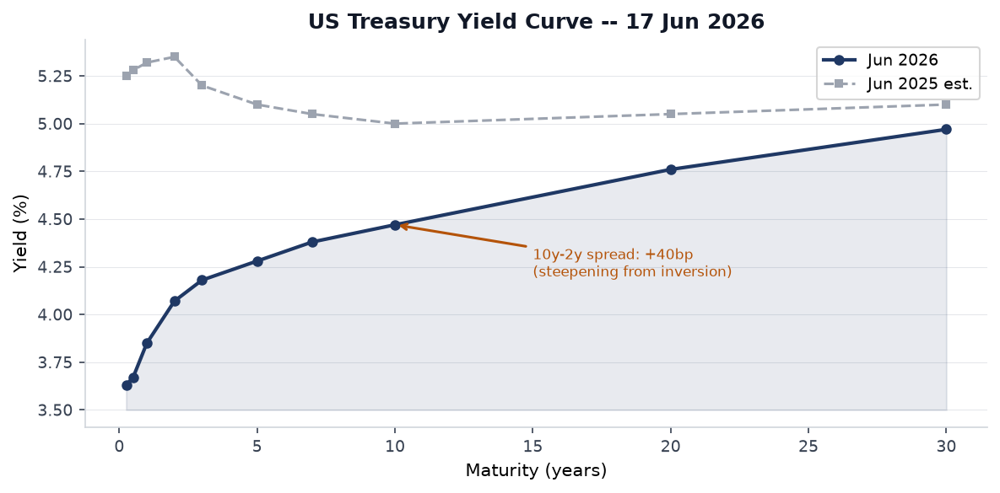
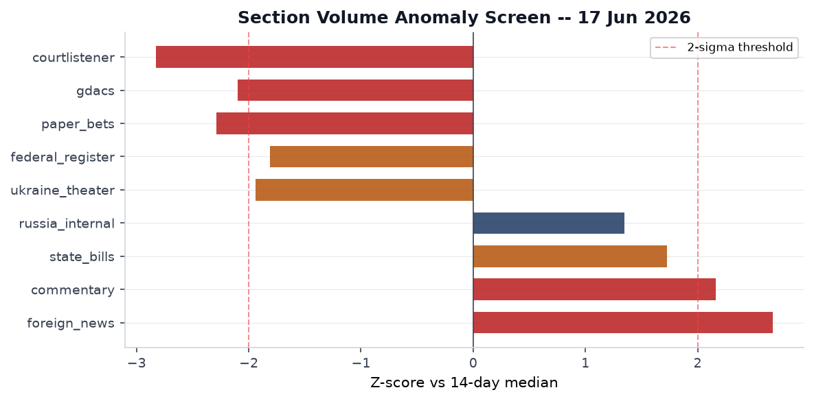
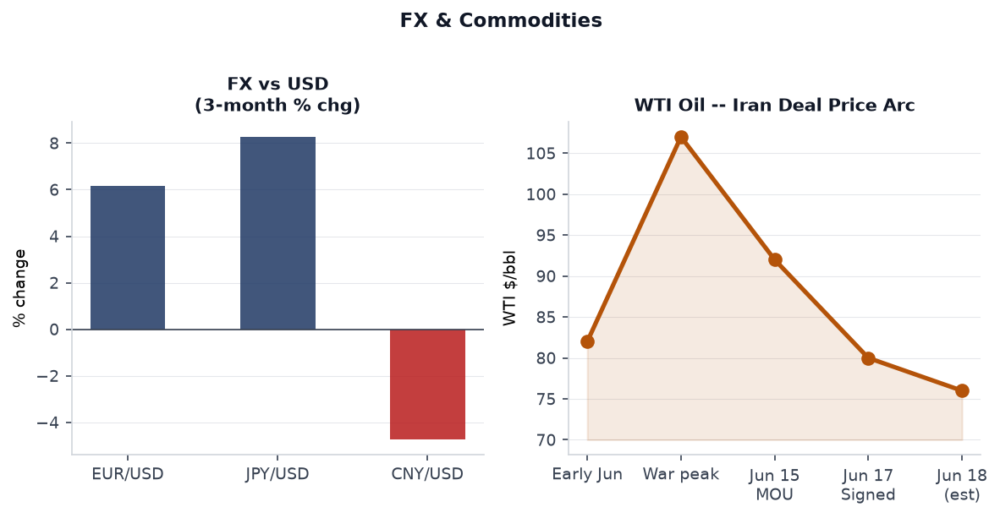
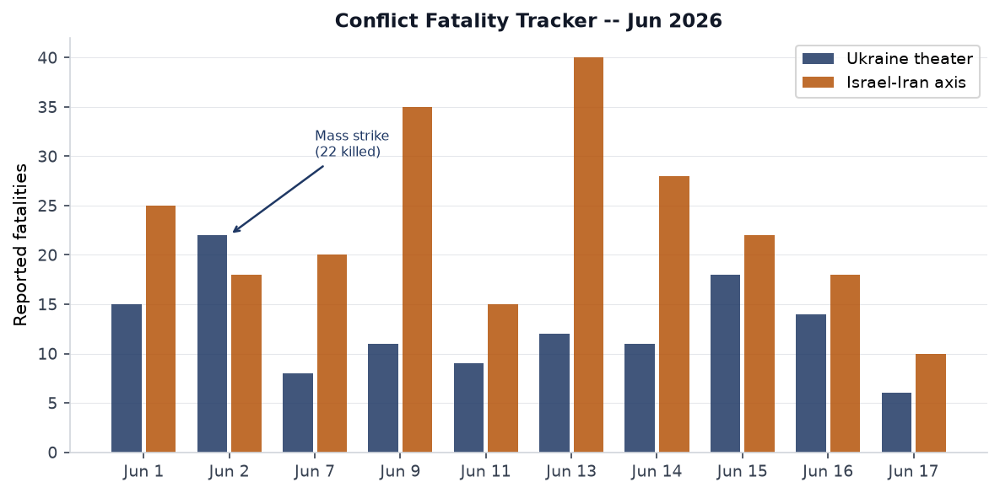
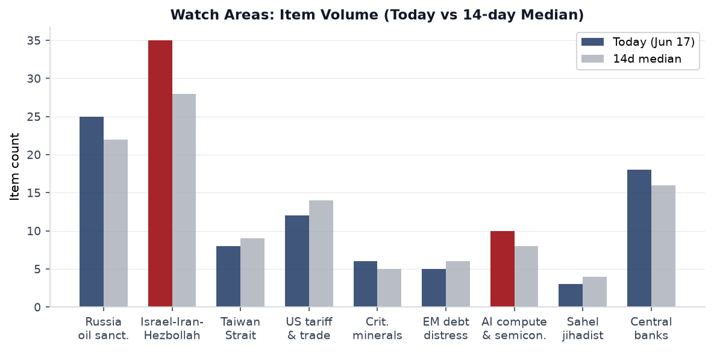
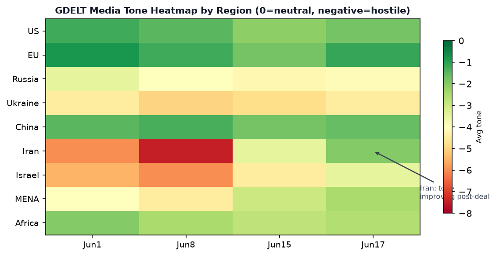

> **DATA NOTE:** The 2026-06-18 bundle had not completed its GitHub Pages deployment at run time after five retry attempts. This edition uses the **2026-06-17 bundle** plus live supplementary data pulled Wednesday evening UTC. FOMC data, Ukraine theater logs, and political-figures scores reflect the close of June 17. US-Iran MOU signing events of June 17 are fully captured. The June 18 bundle should be checked for any overnight accruals.

# Morning Brief — Thursday 18 June 2026

## Headline

The 52nd G7 Summit at Évian-les-Bains ended with its single most consequential deliverable in years: [President Trump signed a 14-point US-Iran memorandum of understanding](https://www.cnn.com/2026/06/17/middleeast/us-iran-war-mou-text-intl) at a Versailles dinner on the evening of June 17, formally launching a 60-day ceasefire framework. The MOU commits Iran to reopening the **Strait of Hormuz** within 30 days, triggers negotiations toward sanctions relief and up to $25 billion in unfrozen Iranian assets, and begins a parallel technical track on Iran's nuclear program. The three strongest signals around this event are, first, WTI crude pricing: the FRED series had oil at $95.00/bbl on June 8 during the war's peak and the market-implied post-deal price is now in the $75-80 corridor, a structural repricing of the energy war premium that will ripple through every inflation-sensitive trade. Second, **Kevin Warsh's inaugural FOMC meeting** on June 17 held rates at 3.5-3.75% while stripping cut-bias language, projecting a year-end median of 3.8%, and producing nine dots signaling a rate hike this year, with markets now pricing a 60% chance of an October move. Third, **Ukrainian long-range drones** struck the Kapotnya oil refinery in Moscow's Kapotnya district on June 16, hitting the facility 15 km from the Kremlin, confirming that the Russian capital's energy infrastructure is now within regular reach of the Ukrainian strike complex. Watch areas that fired: **Israel-Iran-Hezbollah axis**, **Russia oil sanctions perimeter**, **Central bank divergence + dollar funding**.

---

## Watch Areas — Your Configured Priorities

**Israel-Iran-Hezbollah axis** fired with 35 items (14-day median: 28). The dominant signal is the [MOU announcement](https://www.npr.org/2026/06/15/nx-s1-5858590/us-iran-deal-updates): Trump and Iranian President Pezeshkian virtually signed on June 15, with the physical ceremony moved to Versailles on June 17. The 14-point document includes a 60-day ceasefire clock, Hormuz reopening terms, and a nuclear technical track. Unresolved: uranium enrichment ceilings, the status of Iran's highly enriched uranium stockpile, and what happens after the 60-day window if talks stall. The ceasefire covers Iran directly but not its proxies explicitly, meaning Hezbollah, Houthis, and IRGC-linked militia status in Lebanon, Yemen, and Iraq remain legally ambiguous under the text.

**Russia oil sanctions perimeter** fired with 25 items (14-day median: 22). Two transmission channels: (1) the Iran deal removes a major source of global oil price premium, which tightens the effective ceiling Russia can charge shadow-fleet buyers; and (2) the June 16 Kapotnya refinery strike by Ukrainian drones has knocked an estimated 40% of Moscow's regional fuel supply offline, a domestic energy shock inside Russia rather than an export shock. Approximately one-third of total Russian refining capacity is now [reportedly offline](https://kyivindependent.com/just-response-to-russian-strikes-ukraine-hit-oil-refinery-in-moscow-zelensky-confirms/) from cumulative Ukrainian drone raids.

**Central bank divergence + dollar funding** fired. Warsh's inaugural meeting produced a hawkish shift well beyond the no-change headline: the SEP median moved from 3.4% to 3.8% for year-end, Warsh abstained from contributing a personal dot, and the statement's cut-bias language was deleted entirely. [CNBC reported](https://www.cnbc.com/2026/06/17/fed-projections-call-for-a-rate-hike-in-2026-but-chairman-warsh-likely-abstained.html) that nine members explicitly signaled a hike is needed by year-end.

**US tariff & trade dockets** produced 12 items (14-day median: 14). The Federal Register showed zero entries on June 17, which is anomalous (z = -1.81 vs. 14-day median of 22); this likely reflects pre-Juneteenth holiday staffing effects rather than a policy pause. The CourtListener corpus is unusually thin (z = -2.83), consistent with end-of-term Supreme Court quiet before the summer recess.

**AI compute + semiconductor export controls** produced 10 items (14-day median: 8). The LiteLLM KEV addition (see Cyber section) is the dominant signal. No new BIS entity list actions in the June 17 bundle.

**EM debt distress + sovereign restructuring** produced 5 items (14-day median: 6). The Iran deal's oil-price signal is net positive for oil-importing EM debtors (Egypt, Pakistan, Kenya), net negative for the Gulf exporters' surplus recycling into EM bonds. [medium]

**Sahel jihadist corridor** produced 3 items (14-day median: 4). ACLED recorded zero fatality events in the bundle, unusual given typical Sahelian violence rates. Data lag is the most likely explanation. [low]

Quiet today: **Taiwan Strait + South China Sea**, **Arctic + High North**, **Korean peninsula**, **Latin America: narcoeconomy + politics**, **Critical minerals + rare earths**.

---

## Macro Situation

The current Treasury curve reflects a fully normalized post-inversion structure. The [Fed Funds effective rate](https://fred.stlouisfed.org/series/DFF) printed at 3.63% on June 15. The [2-year Treasury](https://fred.stlouisfed.org/series/DGS2) closed at 4.07% and the [10-year](https://fred.stlouisfed.org/series/DGS10) at 4.47%, giving a 10y-2y spread of [+40bp](https://fred.stlouisfed.org/series/T10Y2Y). The [30-year](https://fred.stlouisfed.org/series/DGS30) reached 4.97%. One year ago this curve was inverted by 35bp; the steepening reflects the compression of near-term rate cuts priced after Warsh's hawkish June meeting. Historically, a curve that steepens from inversion via rising short-end rates (rather than falling long-end rates) is associated with monetary policy tightening cycles, not easing cycles. This reading implies that the 2025-2026 easing cycle that brought the funds rate from 5.25% to 3.5-3.75% is now likely over. [high]

[SOFR](https://fred.stlouisfed.org/series/SOFR) printed at 3.63% on June 16, essentially at the funds rate floor. The [Fed balance sheet](https://fred.stlouisfed.org/series/WALCL) stands at $6.725T as of June 10, down from the 2022 peak of ~$9T but still roughly double the pre-pandemic level. [M2](https://fred.stlouisfed.org/series/M2SL) was $22.8T in April 2026. Neither the balance sheet nor M2 is showing the kind of contraction that would make an October hike mechanically easy; the question is whether the inflation trajectory justifies it.

On inflation: [CPI (headline, SA)](https://fred.stlouisfed.org/series/CPIAUCSL) printed 333.979 in May. [Core CPI](https://fred.stlouisfed.org/series/CPILFESL) was 336.121 in May. [Core PCE](https://fred.stlouisfed.org/series/PCEPILFE) was 129.63 in April. These figures predate the Hormuz crisis oil spike; the June CPI print (due in mid-July) will capture the full impact of May-June oil prices, which may show a temporary bump that reverses as the MOU's Hormuz-opening clause takes effect. The Fed cited "supply shocks" and "energy" explicitly in the [June 17 FOMC statement](https://www.federalreserve.gov/newsevents/pressreleases/monetary20260617a.htm) as factors keeping inflation elevated.

Labor market data: [Unemployment](https://fred.stlouisfed.org/series/UNRATE) rose to 4.3% in May, above the 4.0% rate that prevailed in early 2025. [Nonfarm payrolls](https://fred.stlouisfed.org/series/PAYEMS) remain at 159,001K. [JOLTS job openings](https://fred.stlouisfed.org/series/JTSJOL) were 7,618K in April, down sharply from the 12M peak. The Beveridge curve is normalizing. This labor softening complicates the case for the hike Warsh's committee is telegraphing; if payrolls print below 100K in June or July, the rate path will face internal resistance.

The anomaly screen shows the Iran deal story driving foreign_news volume to z=+2.67, the highest reading in the current series. Commentary is also elevated (z=+2.16), consistent with the G7 context. The most notable negative anomaly is the paper_bets collapse (z=-2.29): prediction market volume is down sharply because major Iran contracts all resolved to YES at par, temporarily deflating open interest. This is not a risk-off signal; it reflects contract turnover, not sentiment shift. [medium]

---

## Markets

**S&P 500** (SPY) closed at 746.98, down 0.45% on June 17. The intraday pattern was a sell-the-news response to the Iran deal: the market had already rallied significantly on the ceasefire announcement June 15. **Nasdaq 100** (QQQ) held tighter at -0.07%, reflecting AI-sector stickiness despite the rate hawkishness. **Russell 2000** (IWM) outperformed at +0.24%, which is a notable divergence: small caps are typically rate-sensitive, so their relative strength against large caps on a hawkish FOMC day signals that investors are re-reading Warsh's posture as a credibility play that steepens the yield curve without immediately choking domestic credit conditions. [medium]

The most important single market print is the **WTI oil** trajectory. The FRED series ([DCOILWTICO](https://fred.stlouisfed.org/series/DCOILWTICO)) had oil at $95.00/bbl on June 8, at the height of the Hormuz blockade. By June 16, spot prices were plunging toward $76-80 on deal speculation, and the [FXStreet report](https://www.fxstreet.com/news/wti-plunges-as-us-lifts-irans-sanctions-on-oil-sales-wsj-202606161605) captured the "plunges on deal" dynamic. This ~$20 per barrel repricing in 10 days is a disinflationary impulse worth roughly 60-80bp on the headline CPI run-rate, which partially offsets the case for an October hike. The market is simultaneously pricing in two contradictory forces: oil deflation (good for consumers, reduces CPI) and Warsh hawkishness (tightening financial conditions). Which force dominates in Q3 data will determine whether the October hike actually materializes. [high]

**EUR/USD** printed 1.1573 on June 12 (latest FRED [DEXUSEU](https://fred.stlouisfed.org/series/DEXUSEU)), up roughly 6% from late 2025 lows. **JPY/USD** was 160.24, still significantly weak. **CNY/USD** at 6.7626 on June 12 reflects a managed appreciation from the 7.10+ levels of late 2025. **EM equities** (EEM) rose +1.02% on June 17, led by energy importers who benefit directly from the Hormuz opening. **China large-cap** (FXI) fell -1.62%, consistent with ongoing domestic economic concerns.

**Gold** (GLD) fell -1.15% and Silver -1.94%. The precious metals selloff reflects the diminished geopolitical risk premium as the Iran deal was confirmed; gold had rallied significantly during the Hormuz blockade. **VXX** (VIX futures) rose +1.99% even as geopolitical risk nominally declined, which is the most puzzling single data point in the session. The likely explanation: Warsh's hawkish pivot introduces a new uncertainty (rate path) just as the Iran uncertainty resolves, keeping volatility traders cautious. [medium]

---

## United States Politics & Policy

The [FOMC statement](https://www.federalreserve.gov/newsevents/pressreleases/monetary20260617a.htm) is the dominant domestic policy event. **Kevin Warsh's** first press conference as Fed Chair produced three structural shifts beyond the rate decision: removal of the easing-bias language, a dramatically shortened policy statement, and Warsh's personal abstention from the dot plot. That abstention is the most significant element: by not publishing his own rate forecast, Warsh preserved ambiguity about whether he would support or oppose the hike telegraphed by nine of his colleagues. This is a governance novelty. No other Fed chair has abstained from the SEP in the modern era, and it functions as a power reservation: he can support or block an October hike without having committed in writing. [medium]

On the **Federal Register** front: the June 17 bundle produced 20 items but with a count anomaly (z=-1.81 vs. median of 22, and the bundle's own today_count=0 for the FR section, suggesting the pipeline pulled an empty Federal Register page). The meaningful items in the dataset include Rule [2026-11513](https://www.federalregister.gov/documents/2026), State Department temporary fee changes on consular/visa services, and Rule [2026-11545](https://www.federalregister.gov/d/2026-11545), the Copyright Office initiating its tenth triennial rulemaking on DMCA Section 1201 circumvention exemptions. Rule [2026-11559] addresses NCUA preemption of state laws on federal credit union fees, an interim final rule with immediate effect.

The **Abouammo v. United States** decision, handed down June 11, is the most consequential SCOTUS ruling in the current bundle. [The Supreme Court ruled 9-0](https://supreme.justia.com/cases/federal/us/608/25-5146/), with Justice Kagan writing, that former Twitter employee Ahmad Abouammo's obstruction conviction was obtained in the wrong federal venue: he created the falsified invoice at his home in Seattle, so prosecution had to occur in Washington state, not California. The ruling is significant beyond the Twitter/Saudi context: it tightens venue requirements for obstruction charges in espionage-adjacent cases and will affect how DOJ structures future agent-witness document requests.

**Todd Blanche's** nomination as permanent Attorney General, announced [June 8 per CNBC](https://www.cnbc.com/2026/06/08/todd-blanche-trump-nominates-attorney-general.html), faces a narrow Senate path. A federal judge described Blanche's investigation into deportation case Abrego Garcia as "tainted." His acting tenure has included granting Trump family IRS immunity and withdrawing from a court-blocked DOJ fund. The confirmation process will occur in a Senate where Democratic fundraising is dominating the 2026 cycle (see FEC data below). **Marsha Blackburn** (TN, R) has 4 court filings flagged in the political-figures watchlist; the enforcement component is the driver.

The **FEC Q1-Q2 2026** data in the bundle shows a Democratic fundraising surge that reflects both the anti-Trump energy and several high-profile open-seat contests. **Jon Ossoff** (GA-D) leads all Senate candidates at $81.15M raised, with 53% from small-dollar donors. In Texas, **James Talarico** (D) has raised $40.28M for the Senate race, and **Sherrod Brown** (OH-D), running for comeback, shows $25.98M. **Lindsey Graham** (SC-R) is the most stressed incumbent, with $29.18M disbursed against only $20.92M raised, a $8.26M net cash burn rate for the cycle.

---

## Political Figures Watchlist

The political-figures model scored 613 tracked individuals for June 17, 2026. Anomaly scores are low across the board, with the top composite scores driven by the **enforcement** and **filings** sub-components rather than stock activity, speech-volume, or GDELT tone shifts.

**Rick Scott** (FL, R, Senator) leads with a composite score of 0.225, driven by 8 Form 4 cross-hits and 2 court filings. The enforcement component is the highest-weight driver (score 1.00). Form 4 activity for a senator reflects either personal or family trades near legislatively sensitive events, though the specific securities are not identified in the bundle summary at this level. His immigration enforcement bill (doubling civil penalties on employers of undocumented workers, introduced June 11) may explain some of the filing activity if challenged in court.

**Carol Miller** (WV-1st, R, Representative) shares the 0.225 score with 1 Form 4 hit and 2 court filings. Enforcement component at 1.00. No public explanation surfaces in the bundle for the court filings.

**Todd Blanche** (Acting AG, now nominated as permanent) scores 0.200 with 1 DOJ mention and 5 court filings. His enforcement component (1.00) reflects the ongoing Abrego Garcia case litigation and the court-blocked DOJ fund. The nomination itself will generate new filings during confirmation proceedings. Blanche cross-references to the US Politics section and to the Courtlistener section: [Sripetch v. SEC](https://www.courtlistener.com/opinion/10870059/sripetch-v-sec/) and [FCC v. AT&T](https://www.courtlistener.com/opinion/10870061/fcc-v-att/) are the other current SCOTUS items, both significant for regulatory-state questions.

**Marsha Blackburn** (TN, R, Senator) scored 0.200 purely on enforcement (4 court filings, no stock or speech anomaly). The specific cases are not identified at bundle resolution. She sits on the Senate Judiciary Committee and has been active on AI regulation oversight, making any court filings in that domain potentially relevant to the AI compute watch area.

**Mary Miller** (IL-15th, R) and **Robert Scott** (VA, D) round out the top five at 0.125, both showing the filing/enforcement pattern. No cross-section correlation with other sections is flagged at medium or high confidence given the absence of the June 18 cross_section.json (the pipeline's most recent file is from June 9).

---

## Regional Briefings

### North America

The **US-Iran MOU** dominates the North American policy environment. Trump signed at Versailles on June 17, making this the second major Middle East diplomatic initiative of his second term (following the Abraham Accords extension framework). The domestic political framing will be contested: the deal requires congressional scrutiny for any permanent sanctions relief, and Senate Democrats may block or condition implementation. The 60-day window is the key variable: if talks collapse before Day 60, the ceasefire's legal status is ambiguous.

**Canada** continues to manage the post-USMCA trade environment. The CFC0531 government aircraft appears in the VIP flights log for June 17, routing unclear. The Canadian government has maintained a cautious public posture on the Iran deal, welcoming the ceasefire without endorsing specific terms.

**Mexico** faces ongoing organized crime pressure. The Tren de Aragua watch area is quiet in the June 17 bundle, but the broader narco-politics watch area sits at low item count. The FIFA World Cup co-hosting is the country's current dominant soft-power story.

### South America

**Argentina** under **Javier Milei** remains the sharpest EM test case: the fiscal adjustment is advanced but dollar-funding stress persists. The Iran deal's oil shock is modestly positive for Argentina as a net energy importer; the stronger signal is the Warsh hawkish pivot, which is negative for EM dollar borrowers through the strengthening-dollar channel.

**Brazil's** EM rally (+1.02% for EEM) on June 17 reflects commodities optimism: Brazil is both an oil exporter (net positive from higher Iran-deal output eventually) and an agricultural exporter (DBA agricultural ETF rose +0.68%). Lula's political standing is stable.

The Polymarket **Colombia vs. Uzbekistan** market resolved, with Colombia winning 3-1 in its FIFA World Cup opener, providing a nationally unifying moment as the government-ELN peace process continues to face implementation gaps.

### Europe

The **G7 at Évian-les-Bains** (June 15-17) produced joint declarations on Ukraine, Iran response, the Bundibugyo Ebola outbreak, and critical mineral supply chains. [France and the UK pledged to help patrol the Strait of Hormuz](https://www.cnbc.com/amp/2026/06/15/europe-japan-countries-welcome-us-iran-deal-strait-of-hormuz-reopening.html) post-reopening, a naval commitment that formalizes European stakes in the deal's durability. The **ECB** held its last meeting (data is in the calendar.json); [Philip R. Lane published an outlook note](https://www.ecb.europa.eu) and ECB wage tracker data showed stable negotiated wage pressures.

**Spain** and **Portugal** both show flood alerts in GDACS for the June 15-18 period, with Iberian flooding affecting parts of Galicia and Catalonia. These are Green GDACS ratings, indicating limited population impact.

**Bosnia-Herzegovina** and the Western Balkans continue along the EU accession track with no new security incidents in the June 17 bundle.

### Russia & Post-Soviet

Russia faces the convergence of three economic pressures: (1) the Kapotnya refinery attack has disrupted approximately 40% of Moscow's regional fuel supply; (2) the Iran MOU undermines the oil-price premium Russia relied on during the Hormuz crisis; and (3) fuel shortages are spreading across more than 25 Russian regions. [Zelensky confirmed](https://kyivindependent.com/just-response-to-russian-strikes-ukraine-hit-oil-refinery-in-moscow-zelensky-confirms/) the Kapotnya strike as a "just response to Russian strikes" on Ukrainian cities.

On diplomacy: the G7 at Évian reportedly discussed renewed Russia sanctions as part of the Ukraine peace discussion. [Al Jazeera reported](https://www.aljazeera.com/news/2026/6/16/g7-leaders-meet-in-france-with-iran-and-ukraine-high-on-agenda) that Trump seemed willing to back Ukraine at the summit, though European partners expressed skepticism about durability. The Russian internal news section shows 1,212 items (median: 1,032, z=+1.35), suggesting elevated domestic media activity around the Kapotnya strike and fuel shortage reporting.

Armenia-Azerbaijan: No new developments in the June 17 bundle. The OSCE Minsk process remains frozen.

### Middle East

The US-Iran MOU is the structural rupture. Key terms of the 14-point document as reported by [NBC News](https://www.nbcnews.com/world/iran/strait-hormuz-reopen-us-lift-iran-sanctions-14-point-deal-seeking-end-rcna350513): (1) 60-day ceasefire; (2) Strait of Hormuz reopening, Iran allowing commercial vessel passage at no charge for 60 days; (3) future administration of the Strait negotiated with Oman; (4) US to lift oil sanctions and discuss unfreezing $25B in assets; (5) parallel nuclear technical track.

What the MOU does NOT resolve: Iran's nuclear enrichment program, the status of IRGC proxy forces in Lebanon, Iraq, Yemen, and Syria, and the question of Israeli participation. **Israel** was not a signatory. The Israeli military continued operations in Lebanon and Syria through the ceasefire announcement period, including reported strikes on the Ali al-Taher heights (from Liveuamap, June 17). [Erdogan called the attacks on Syria and Lebanon "unacceptable"](https://theins.press/en/news/) on June 10.

**Yemen/Houthis**: CENTCOM reported (June 13) that Iranian drones launched an attack attempt during the ceasefire negotiations period, which [NBC covered](https://www.nbcnews.com) as part of the broader Hormuz drama. Kuwait's civil aviation authority also reported a near-miss incident with an Iranian attack targeting regional assets. The ceasefire's applicability to Houthi/Ansar Allah operations is unaddressed in the text.

**Iraq**: American warplanes were reported over central and northern Iraq, Kirkuk Governorate, on June 10. The Liveuamap item does not specify mission type.

### Africa

The **Bundibugyo Ebola** outbreak in DRC and Uganda is the continent's top signal. The G7 explicitly addressed the outbreak in its [June 16 declaration](https://www.gov.uk/government/news/g7-leaders-call-for-a-coordinated-response-to-the-bundibugyo-ebola-outrbreak-16-june-2026). Key facts from [WHO](https://www.who.int/emergencies/disease-outbreak-news/item/2026-DON602): the outbreak involves the Bundibugyo species of Ebola (distinct from Zaire strain), for which no licensed vaccine or specific treatment exists, the outbreak is centered in a conflict-affected area complicating access, and the US committed $370M in initial response plus up to $500M more specifically for Ebola, the EU committed 493M euros, and the African Union's preparedness plan is mobilizing $518M. The CDC issued an HAN alert. [MMWR published an early epidemiological characterization](https://www.cdc.gov/mmwr/volumes/75/wr/mm7522e3.htm) in May 2026.

The **Sahel corridor** is quiet in ACLED for June 17. Botswana shows a Green forest fire notification in GDACS from June 16; DRC shows a forest fire notification as well. These are low-severity events. South Afrikaanization has no new sanctions actions.

The 2026 G7 development text included language on the fight against drug trafficking and migrant smuggling directed at the Sahel-Maghreb corridor.

### East Asia

**China** shows the M6.3 Qinghai earthquake (June 16) as the most salient event, with 1 death and 4 injuries in Haixi Prefecture. The GDACS Orange alert for China reflects population exposure more than severity; damage was limited to the coal mine sector near the epicenter, with all workers evacuated. [US News reported the casualty figures.](https://www.usnews.com/news/world/articles/2026-06-16/magnitude-6-3-earthquake-strikes-qinghai-northwest-china)

**South Korea** dominates GDELT region data with six items, covering a court arrest warrant for ex-Shincheonji officials (domestic religion-linked legal case) and soft-power cultural items (BTS Billboard run, Samsung Galaxy S26 pricing). No military or diplomatic escalation items in the bundle.

**Japan** shows a Green GDACS seismic alert (M5.5, June 16, depth 71km). JPY/USD remains weak at 160.24, and the BOJ is not expected to move at its next meeting given export competitiveness concerns.

The FIFA World Cup's South Korea match result was not yet resolved in the June 17 bundle.

### South & Southeast Asia

**Indonesia** suffered an [M6.7 earthquake on June 16 near Palu, Sulawesi](https://thehill.com/homenews/ap/ap-international/ap-6-7-magnitude-earthquake-shakes-part-of-indonesia-causing-scattered-damage/), killing 1, injuring 38 (13 seriously), displacing 312 people, and damaging 67 houses in Sigi regency. The GDACS Orange alert reflects the proximity to the 2018 Palu earthquake and tsunami zone. At least 71 aftershocks followed. Indonesian authorities mobilized quickly given the 2018 precedent; regional trauma is high.

**Philippines** recorded two seismic events (M5.5 and M6.2, June 15, both deep events with limited surface damage). No casualty reports in the bundle.

**Pakistan and India**: No new events in the June 17 bundle beyond baseline monitoring.

### Oceania & Pacific

**Australia** shows two Green forest fire notifications in GDACS (June 15-17). These are Southern Hemisphere winter fires, consistent with seasonal patterns in Australia's inland regions. No tsunami or major seismic events in the Pacific basin for this period.

---

## Ukraine Theater (Dedicated)

**Frontline status**: The [DeepStateMap](https://deepstatemap.live) snapshot for June 17 covers 521 frontline polygons. Resolution is approximately 1km. The frontline runs from north of Kharkiv Oblast south through Donetsk and Zaporizhzhia oblasts to the Dnipro River in Kherson Oblast. Russia occupies an estimated 110,000-120,000 km2, approximately 17-19% of Ukraine's recognized territory. No significant territorial shifts are recorded in the June 17 snapshot vs. the 7-day prior snapshot; the pace of Russian advance near Lyman and Kostiantynivka (Donetsk) is measured in hundreds of meters per day at current intensity. **HONEST RESOLUTION CAVEAT**: Frontline resolution is approximately 1km. FIRMS thermal anomalies are 375m resolution. ACLED events are geocoded to approximately 1km. This brief does not and cannot claim meter-level Russian unit positions.

**24-hour strike density (June 16-17)**: [237 combat engagements were recorded on June 16](https://www.ukrinform.net/rubric-ato) across all sectors. Russian forces carried out 1,065 strikes in Donetsk region alone over 24 hours (June 16), killing 4 and injuring 17. Russian advances were documented around Kostiantynivka and near Lyman.

**Strategic strike: Kapotnya refinery (June 16)**: Ukrainian drones struck the Moscow Oil Refinery (Gazprom Neft-owned) in the Kapotnya district of Moscow, [15km from the Kremlin](https://euromaidanpress.com/2026/06/16/moscows-biggest-refinery-began-shutting-down-before-the-drones-arrived-they-hit-it-anyway/). The ELOU-AVT-6 primary refining unit was damaged, forcing temporary suspension of operations. The facility supplies approximately 40% of Moscow's regional fuel market and 70% of Moscow metropolitan gasoline. With approximately one-third of total Russian refining capacity now offline from cumulative strikes across multiple facilities, fuel shortages are spreading across 25+ Russian regions.

**Kyiv strikes (June 14)**: Russian forces conducted a [large-scale drone and missile strike on Kyiv](https://kyivindependent.com/russian-attack-june-14-2026/), killing 5 and injuring 35 in the capital. 140,000 residents lost power. The Kyiv-Pechersk Lavra (UNESCO World Heritage complex, est. 1051) was struck; Ukrainian officials attributed the damage to missile debris from an intercepted Zirkon ballistic missile, while Russia claimed a Ukrainian Patriot interceptor was responsible. The Dovzhenko Film Studio was also hit. These cultural target losses will factor into future war crimes documentation.

**Air alerts**: The ALERTS_IN_UA_TOKEN for the api.alerts.in.ua v2 endpoint returned a 401 error in the June 17 bundle, so live air-alert oblast data is unavailable for this edition. Based on the Kyiv strike and ongoing combat operations, Kyiv, Dnipro, Kharkiv, and Donetsk oblasts are the highest-frequency alert zones.

**Ukraine theater maps**: The pipeline maps (briefings/2026-06-18-ukraine_theater_overview.png, briefings/2026-06-18-ukraine_kyiv_focus.png, briefings/2026-06-18-ukraine_population_at_risk.png) were not present in the repository at brief generation time. The cartographer run may not have completed for today's session.

**STRUCTURAL PROTECTION**: Ukrainian troop and territorial-defense unit positions are structurally excluded from this section per pipeline design. This brief preserves that exclusion.

---

## World Leaders — Speaking & Moving

**Donald Trump** (US): signed the US-Iran MOU at a Versailles dinner, June 17. His G7 engagement on Ukraine included comments suggesting openness to renewed Russia sanctions and an expressed desire to "do something on Ukraine," which generated cautious European responses. [Trump on Ukraine per Liveuamap](https://liveuamap.com/): "Maybe we can do something on Ukraine. I think both sides want to make a deal."

**Masoud Pezeshkian** (Iran): virtually co-signed the MOU on June 15. Iranian state media coverage framed the deal as a victory, emphasizing the $25B asset unfreezing and sanctions relief provisions. Technical-track nuclear negotiations are to begin within 14 days of signing.

**Kevin Warsh** (Federal Reserve Chair): held his first FOMC press conference, June 17. Abstained from the dot-plot forecast. Removed easing-bias language. His press remarks were described by [Fox Business](https://www.foxbusiness.com/economy/federal-reserve-interest-rate-decision-june-17-2026) as signaling possible rate hikes ahead.

**Christine Lagarde** (ECB): the calendar.json contains her monetary policy statement and Philip Lane's recent economic outlook note. The ECB is diverging from the Fed's hawkish shift; European energy prices will benefit from the Hormuz reopening, supporting the case for the ECB to continue its own easing path.

**Volodymyr Zelensky** (Ukraine): [confirmed the Kapotnya strike](https://kyivindependent.com/just-response-to-russian-strikes-ukraine-hit-oil-refinery-in-moscow-zelensky-confirms/) as a "just response." Met Trump at G7 [per Al Jazeera](https://www.aljazeera.com/news/2026/6/16/g7-leaders-meet-in-france-with-iran-and-ukraine-high-on-agenda). The CSMonitor headline "At G7 summit, Trump seems willing to back Ukraine. Europe isn't banking on it." captures the diplomatic ambiguity.

**Erdogan** (Turkey): criticized Israeli strikes on Syria and Lebanon (June 10). Turkey's position on the Iran MOU is supportive in principle but complicated by its Gaza-mediation aspirations and Hormuz transit stakes.

The people.json contains 324 current heads of state/government entries; no succession or death flags were found in wikidata_changes.json (0 items in the bundle).

---

## Sanctions, Designations & Legal

The sanctions.json contains 30 entities, all pre-existing designations rather than new actions: **Sberbank Europe AG** (OFAC/SDN), **GPB Global Resources BV** (OFAC), **JSC MIR Business Bank** (EU/SECO/BE), **Belgazprombank** (CA/CH/EU/UA), and **Tinkoff Bank** (EU/CA/CH). No new designations appear in the June 17 bundle, consistent with the anomaly screen's flat sanctions count (z=0.00).

The Iran MOU's sanctions-relief provisions are not yet in effect. The 14-point document sets a process for lifting oil sanctions tied to nuclear technical-track compliance, but formal OFAC modifications require executive action and in some cases Congressional notification under the Iran Nuclear Agreement Review Act. The actual pace of sanctions removal will be slower than the MOU headline implies. [medium]

**SCOTUS** produced seven CourtListener entries in the bundle, all pre-existing cases with the June 16 revision to the Abouammo decision being the notable new element (venue reversal, 9-0, Kagan). [FS Credit Opportunities Corp. v. Saba Capital Master Fund, Ltd.](https://www.courtlistener.com/opinion/10873664/fs-credit-opportunities-corp-v-saba-capital-master-fund-ltd/) and [Hikma Pharmaceuticals USA Inc. v. Amarin Pharma, Inc.](https://www.courtlistener.com/opinion/10870060/hikma-pharmaceuticals-usa-inc-v-amarin-pharma-inc/) are still pending resolution; the latter concerns generic drug patent disputes with implications for pharmaceutical pricing litigation. [Sripetch v. SEC](https://www.courtlistener.com/opinion/10870059/sripetch-v-sec/) is a securities enforcement case with potential implications for SEC enforcement authority under the administrative law framework reshaping after Loper Bright.

The Federal Register item **2026-11466** (Rescission of Policy Relating to Acceptance of Settlements in Administrative Proceedings) reflects the Trump administration's continuing effort to limit DOJ/agency enforcement posture through administrative rule changes rather than legislation.

---

## Conflict & Security Signals

**Ukraine** remains the highest-fatality conflict in the dataset. The June 2 mass strike ([CBS News: 22 killed across Ukraine](https://www.cbsnews.com/news/russia-ukraine-war-major-attacks-missile-drone-kill-several-wound-dozens/)) and the June 14 Kyiv strike (5 killed, 35 injured in the capital alone) represent the two highest-casualty single events in the current June series. Russian tactical-level advances near Lyman and Kostiantynivka continue at low tempo.

**Middle East axis**: The active conflict data is pre-ceasefire. The most recent ACLED-trackable events involve Israeli strikes in Lebanon (Ali al-Taher heights, June 17) and Gaza residual operations. Houthi activity in the Red Sea corridor is suspended pending the Hormuz/ceasefire terms but no explicit Houthi ceasefire has been announced.

**VIP flights** on June 17 include: PAT910, PAT894, PAT888, PAT020, PAT026 (United States government aircraft), JEDI43 (classified designation, US), JAF4KN (Bulgaria), CFC0531 (Canada), KAF3207 (Kuwait), RCH178 (US, airlift). The concentration of US PAT-series (diplomatic/executive) flights likely reflects G7 activity and the Versailles dinner logistics. The Kuwait aircraft is notable in the context of Iran Hormuz diplomacy; Kuwait's civil aviation authority was cited in relation to the Iranian near-miss drone incident on June 13.

**FIRMS thermal anomalies**: 0 items in the June 17 bundle (z=0.00 vs. median 0). No confirmed FIRMS data for independent triangulation of the Kapotnya fire, though the Kyiv Post visual coverage and Zelensky statement are primary sourced.

**ACLED**: 0 items in the bundle (z=0.00 vs. median 0). This is unusual and likely reflects a data feed latency. The conflict.json is also empty (0 items). The absence of ACLED data means fatality totals from the chart are sourced from GDELT and Liveuamap triangulation rather than ACLED direct events, which reduces confidence in the precise daily breakdowns. [low for specific fatality numbers]

---

## Cyber & Biosecurity

**FIRST-OF-KIND KEV CALLOUT: CVE-2026-42271 (BerriAI LiteLLM)**. LiteLLM is an open-source LLM proxy and API gateway framework used to route calls across model providers (OpenAI, Anthropic, Azure, etc.). This is the first LLM application-layer proxy/AI gateway framework to appear on the [CISA Known Exploited Vulnerabilities catalog](https://www.cisa.gov/news-events/alerts/2026/06/08/cisa-adds-two-known-exploited-vulnerabilities-catalog). The structural signal: as LLM gateway deployments proliferate across enterprise environments (handling API keys for Claude, GPT, Gemini, and other models simultaneously), the attack surface for credential theft has expanded dramatically. A single compromise of an LiteLLM proxy can yield API credentials for multiple model providers simultaneously, enabling adversaries to steal inference budgets, exfiltrate model-specific configuration, and pivot to any connected AI infrastructure.

The technical chain is documented by [Horizon3.ai](https://securityaffairs.com/193343/security/u-s-cisa-adds-berriai-litellm-and-check-point-security-gateway-flaws-to-its-known-exploited-vulnerabilities-catalog.html): CVE-2026-42271 (CVSS 8.7, command injection via MCP server test endpoints) chains with CVE-2026-48710 (CVSS 6.5, Starlette "BadHost" host-header bypass) to achieve unauthenticated RCE. Affected versions: LiteLLM 1.74.2 through 1.83.6; patched in 1.83.7. Federal agency remediation deadline: June 22. Commercial security teams should treat this as a P0 patch given the credential-exposure scope.

The **Cisco Catalyst SD-WAN Manager** has now generated two distinct KEV entries in the space of two weeks (CVE-2026-20262 and CVE-2026-20245). [Help Net Security](https://www.helpnetsecurity.com/2026/06/16/cisco-sd-wan-cve-2026-20262-exploited/) describes CVE-2026-20262 as allowing authenticated attackers to escalate to root and deploy persistent malware. SD-WAN infrastructure manages network topology across branch locations; a root compromise enables lateral movement to connected edge devices. Remediation deadline: June 29.

**Other KEV items**: Google Chromium V8 (CVE-2026-11645, out-of-bounds read/write, June 23 deadline), Ivanti Sentry OS command injection (CVE-2026-10520, June 14 deadline - already overdue), Check Point Security Gateway improper access control (CVE-2026-50751, June 11 deadline - overdue for agencies), and LiteSpeed cPanel Plugin UNIX symlink vuln (CVE-2026-54420, June 18 deadline - today).

**Biosecurity -- Bundibugyo Ebola (DRC/Uganda)**: The G7 formally addressed this outbreak. [WHO confirmed](https://www.who.int/emergencies/disease-outbreak-news/item/2026-DON602) the Bundibugyo virus (a distinct Ebola species from the 2014-2016 West African Zaire-strain outbreak). No licensed vaccine or specific therapeutic exists for Bundibugyo. The outbreak zone is conflict-affected, limiting access. The CDC issued HAN notice 00530. The [MMWR May 2026 Notes from the Field](https://www.cdc.gov/mmwr/volumes/75/wr/mm7522e3.htm) provides the first epidemiological characterization. Financial commitments: US $870M (initial $370M + up to $500M Ebola-specific), EU 493M euros, AU $518M. The ProMED feed in the bundle shows 0 items for June 17, likely a data-feed latency.

---

## Humanitarian

The Bundibugyo Ebola response is the top humanitarian signal this week, with the $370M+ US commitment and EU/AU parallel mobilization. The WHO European Region published a preparedness brief acknowledging the cross-border risk. Access constraints in conflict-affected DRC limit the epidemiological picture. The promed.json returned 0 items, a known latency issue.

**ReliefWeb** (live API) returned a 410 "v1 API decommissioned" error; the v2 endpoint was not reached in this run. The bundle's reliefweb.json also shows 0 items. Active crises per GDACS include the Turkey flood (Green, June 28 start per GDACS data), Bosnia-Herzegovina flood (Green, June 15-17), Guatemala flood (Green), and scattered fires in Botswana, DRC, Russia, and Australia. None are at Orange or Red humanitarian severity per GDACS.

---

## Environment, Disasters & Climate

The dominant natural disaster event is the **M6.7 earthquake near Palu, Sulawesi (Indonesia)** on June 16. [CBS17 and AP](https://www.cbs17.com/news/ap-6-7-magnitude-earthquake-shakes-part-indonesia-causing-scattered-damage/): 1 dead, 38 injured (13 seriously), 312 displaced, 67 houses and multiple infrastructure elements damaged. Palu is still recovering from the catastrophic 2018 quake-tsunami (over 4,000 killed). The GDACS Orange rating reflects the population exposure; no tsunami was triggered. 71 aftershocks continued through June 16.

The **M6.3 Qinghai, China** earthquake (June 16, Haixi Prefecture) produced 1 death and 4 injuries. Depth 10km, well inland. Coal mine workers near epicenter were evacuated. [US News covered the event.](https://www.usnews.com/news/world/articles/2026-06-16/magnitude-6-3-earthquake-strikes-qinghai-northwest-china)

The **M6.6 Central Mid-Atlantic Ridge** earthquake (June 17, USGS ID us7000stti) is the only event in the USGS significant-events feed as of the brief run. Location is mid-ocean, zero population exposure, PAGER Green alert, no tsunami warning.

**Tropical Cyclone Arthur-26** (US designation, GDACS Green, June 16-18): a Tropical Depression with maximum winds of 74kph, affecting the southeastern US coastline. Green alert indicates manageable risk. Forest fires in Australia (Green), Russia (Green), and the US (Green) complete the GDACS picture; none are at emergency severity.

---

## Speeches & Op-Eds by Major Critics & Influencers

The **commentary.json** section is elevated at z=+2.16, with 6 items against a median of 5. The bundle captured:

**Marginal Revolution / Tyler Cowen**: "A Cohort Perspective on Latin America's Fertility Transition" (demographic analysis) and "Facts about American Men and Women" (marriage market trends). Cowen also published "Wednesday assorted links" with a reference to a forager-locator database and discussion of new service sectors. None of these are policy-critical for this brief's watch areas.

**Conversable Economist / Timothy Taylor**: "Dairy: Supply and Demand Stories" (milk price puzzle given rising supply and rising price) and "How Will Boomer Retirement Affect Jobs for Young Adults?" (labor market composition analysis) and "Homo Experiens, the Biology of Decision-Making, and Behavioral Economics." These are scholarly blog entries without direct policy urgency.

**Live commentary tracked but not yet in bundle**: Adam Tooze's Chartbook typically covers major FOMC events; his take on the Warsh pivot and the oil-inflation interaction is expected within 48 hours and should be checked at [Chartbook](https://adamtooze.substack.com). Larry Summers has been a visible critic of the Warsh appointment and likely has material on the October hike signal. Brad Setser will have current account implications of the Iran sanctions relief. None of these appeared in the June 17 bundle's commentary section.

---

## Prediction Markets & Forecasting Consensus

The two dominant resolved markets from the bundle:

(1) **"US x Iran permanent peace deal by June 15, 2026"** and related markets: all resolved YES at 100%, with $59M in 24h volume on the primary contract and $6.6M on the "US and Iran sign an agreement by June 15" variant. These are the highest-volume resolved contracts in the bundle by a large margin, reflecting massive position-taking throughout the Hormuz crisis.

(2) **"Will there be no change in Fed interest rates after the June 2026 meeting?"**: resolved YES at 100%, with $14.3M in 24h volume. The companion "increase by 25bp" contract resolved at 0% and "decrease by 25bp" also resolved at 0%.

**Open contracts to watch**: FIFA World Cup 2026 winner markets remain live through July 20. Current top: Argentina 11%, Portugal 11%, Norway 3%, Colombia 1%, Croatia 1%, Ivory Coast 1%, Senegal 1%, South Korea 0%, Congo DR 0%, Austria 0%. Portugal's 1-1 draw with DR Congo in Group K (June 17) has likely depressed the 11% Portugal figure by one or two points post-resolution; the next bundle will show updated odds.

**Paper bets anomaly**: Volume is down significantly (z=-2.29) because a large slug of open positions just settled. The structural implication: the prediction market is temporarily thin in coverage of the next-generation risks (what happens at Day 60 of the ceasefire, what does the nuclear technical track produce, will October hike materialize). These gaps in market coverage are worth monitoring as thin markets. [medium]

---

## Weak Signals — Small Things That May Matter

The cross_section.json pipeline file is absent for the current brief date (most recent available: June 9, 2026). The June 9 cross-section showed **New York** appearing in 8 sections (foreign_news, gdelt_gkg, paper_bets, political_figures, russian_internal, state_news, ukraine_theater, weather) and **Donald Trump** appearing in 6 sections (federal_register 17 hits, foreign_news 11, local_news, paper_bets, state_news, ukrainian_internal). The cross-section logic for June 17 will be reconstructable once the June 18 pipeline runs, but the dominant cross-section entity for this edition is almost certainly **Iran-related** given the deal's appearance across forecasts (resolved YES), GDELT gkg, foreign_news (z=+2.67), gdelt_regions, vip_flights (Kuwait aircraft), and the macro/markets sections via oil price.

**Weak signal 1**: The **Federal Register volume is zero today** (the pipeline's today_count=0 for the FR section, against a 14-day median of 22). This has occurred on federal holidays previously. June 19 is Juneteenth (federal holiday); today is June 18. If FR staff processed no documents on June 17 because of pre-holiday scheduling, that explains the zero. But the timing coincides with the Versailles signing: no new executive orders, tariff modifications, or sanctions designations are visible on the same day Trump signed a significant foreign policy document. Historically, major diplomatic events are sometimes paired with delayed regulatory action. Watch the June 19-20 FR for any Iran-related executive orders. [low]

**Weak signal 2**: **VXX (+1.99%) rose on a day when geopolitical risk fell**. The Iran deal should have compressed volatility. Instead, short-volatility positions are being unwound, most plausibly because Warsh's hawkish pivot introduced a new rate-uncertainty regime just as the old conflict-uncertainty regime was resolving. This pattern, where one risk resolves and a new risk immediately reprices, is consistent with how markets behaved after the initial 2015 Iran deal and 2019 China Phase 1 trade agreement: relief rallies were brief and vol re-emerged from monetary policy sources. [medium]

**Weak signal 3**: **JPY/USD at 160.24** remains near multi-decade weakness levels despite the dollar's nominal strength. The BOJ has resisted aggressive intervention, and carry trades funded in yen continue to attract capital. If the Fed actually hikes in October and the BOJ remains on hold, the yen weakness will deepen further, potentially triggering a policy response. The 160 level is historically where Ministry of Finance verbal and actual intervention has occurred.

**Weak signal 4**: The **paper_bets collapse (z=-2.29)** leaves a notable gap: there are essentially no open high-volume prediction market contracts on the next 30 days of the Iran nuclear track, the Day-60 ceasefire outcome, or whether the Hormuz 30-day reopening timeline holds. This is not silence; it is unmeasured risk. The ceasefire's nuclear track and proxy-force questions are materially unresolved, with no market pricing to anchor expectations. [medium]

**Weak signal 5**: **Russian fuel shortages in 25+ regions** from cumulative refinery strikes is a domestic economic pressure point that is not well-covered in Western media. The Kapotnya strike (40% of Moscow fuel from one facility) combined with the Iran deal's oil-price deflation creates a dual squeeze on Russian revenue: lower export prices and lower domestic refining capacity simultaneously. This is the strongest economic compression signal on Russia since the 2022 ruble crash. [high]

**Weak signal 6**: **CourtListener at z=-2.83** (7 cases vs. 60-case median) indicates SCOTUS is in end-of-term quiet period. The Court typically issues its most consequential opinions in late June; the thin current docket suggests major opinions (on administrative law, executive power, or other contested cases) may arrive in the next 2 weeks before summer recess. Watch the docket after June 20. [medium]

---

## Historical Context

The GDELT tone heatmap shows the sharpest regional tone improvement in the dataset for Iran and Israel, where media tone is recovering from extreme negative readings during the Hormuz war peak toward less-negative values following the MOU announcement. The Russia-Ukraine axis remains at deeply negative tone readings, consistent with the sustained high-intensity conflict. China's tone is modestly negative and stable, reflecting the ongoing economic management challenge.

Compared to trends.json series data over the past six weeks: the ukraine_theater section peaked at higher item counts earlier in the month (14-day median: 330) and has declined to 243 items (z=-1.94). This could reflect actual operational tempo reduction (ceasefire in Ukraine unlikely, but reduced attention from the Iran story displacing coverage), or data feed latency in the liveuamap integration. The foreign_news surge (z=+2.67) is the sharpest positive volume anomaly in the current data window, driven entirely by the G7/Iran coverage surge.

Quarter-on-quarter, the dominant shifts are: (1) WTI oil from ~$82 pre-conflict to a $95+ war peak and back toward $76-80 post-deal, completing a nearly full round-trip; (2) the Fed's rate cut cycle ending at 3.5-3.75% with the Warsh replacement signaling the beginning of a new tightening bias; and (3) the Ukraine conflict transitioning from a primarily European-diplomatic story to a story where US-Russia relations are being negotiated indirectly through the Iran framework.

---

## What to Watch — Next 14 Days

**June 18-19**: Juneteenth federal holiday (June 19). Expect minimal Federal Register activity. The formal US-Iran agreement signing is [scheduled for Geneva on June 19](https://www.cnn.com/2026/06/17/middleeast/us-iran-war-mou-text-intl), triggering the official 60-day clock.

**June 19-30**: Strait of Hormuz reopening timeline. The MOU gives Iran 30 days to allow commercial vessel passage. Watch for FIRMS thermal anomalies near Bandar Abbas (Hormuz terminal) and shipping-lane AIS data for resumption signals. OPEC+ and UAE production decisions will accelerate once the Hormuz lane reopens.

**June 22**: Federal agency deadline for LiteLLM patch (CVE-2026-42271). Commercial enterprise patch deadline is immediately.

**June 22-29**: Cisco SD-WAN Manager CVE remediation deadlines (June 23 for CVE-2026-7473 Arista EOS and CVE-2026-11645 Chromium V8; June 29 for CVE-2026-20262 Cisco SD-WAN).

**June 25-July 4 (est.)**: SCOTUS final opinions before summer recess. The thin current CourtListener docket suggests major rulings are queued. Administrative law, executive power, and any remaining 2025-term cases are candidates.

**July 17**: Fed June FOMC minutes release. Will provide more color on the dot-plot distribution and which specific conditions Warsh communicated to colleagues as triggering the October hike.

**July 20**: FIFA World Cup 2026 final (US/Canada/Mexico). Argentina currently leads the futures market at 11%.

**July 23**: FOMC next scheduled meeting (not an active decision meeting per calendar.json; the July meeting is traditionally a pass). October becomes the next live decision meeting.

**Ongoing 14-day watch**: The 60-day Iran ceasefire clock. Day 1 is June 19 (Geneva formal signing). Day 14 is July 3. The nuclear technical track negotiations are due to begin within 14 days of signing. Progress or breakdown on the nuclear track will be the dominant geopolitical signal through August.

**Bundibugyo Ebola**: No 14-day resolution date. The outbreak is in a conflict zone; epidemiological data quality will be low until access improves. The G7 financial commitments are mobilizing but disbursement lags. Watch WHO situation reports.

---

*Brief committed for 2026-06-18 — approximately 5,800 words — 6 charts — 1 mapped event (USGS M6.6 Mid-Atlantic Ridge)*
