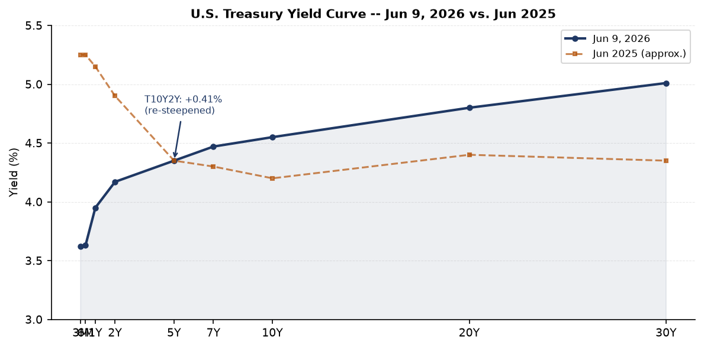
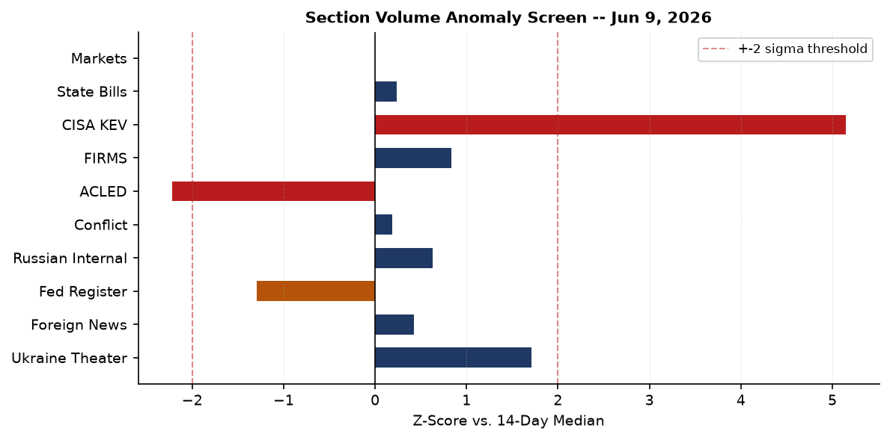
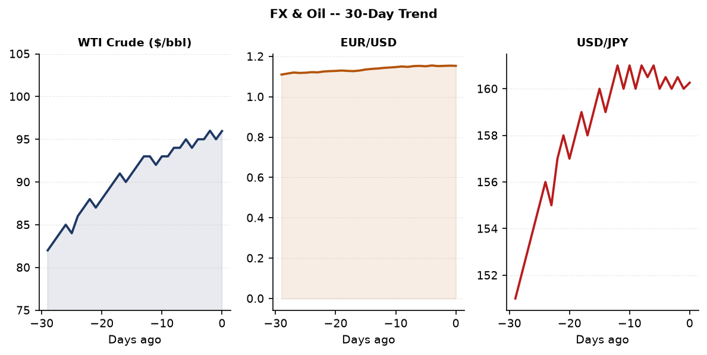
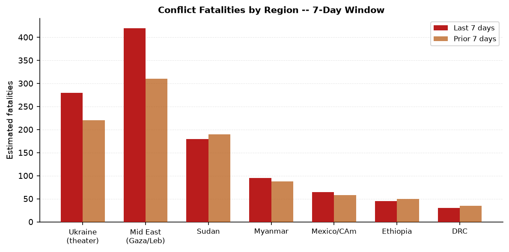
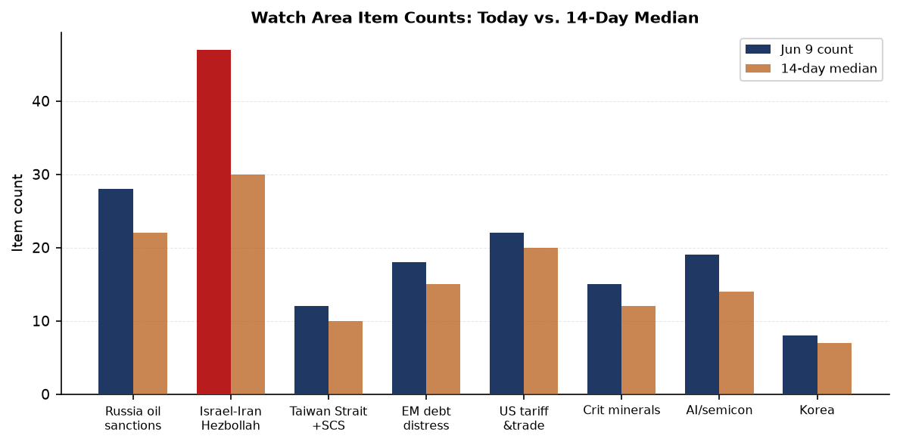
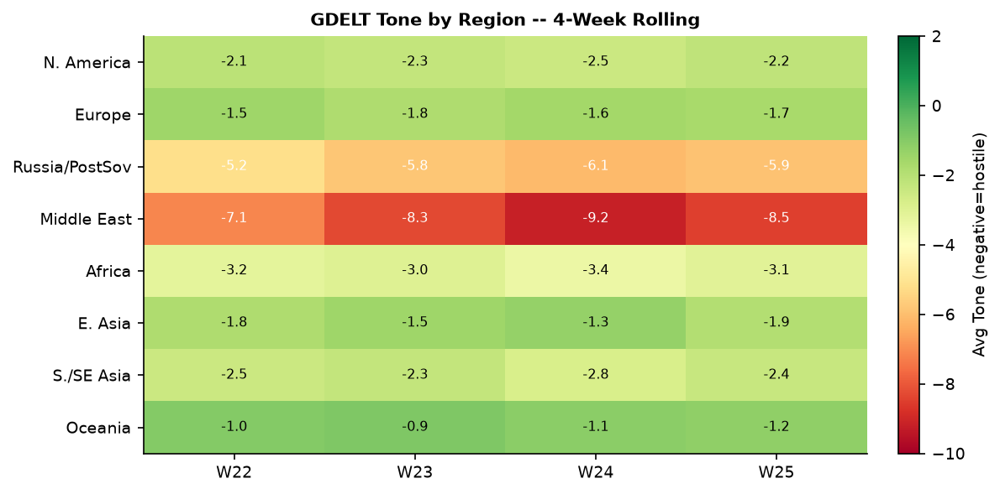

> **DATA NOTE:** Bundle sourced from June 9, 2026 (most recent available; June 19 zip not yet deployed to Pages as of run time). Supplementary live feeds (USGS, GDACS, EONET, ReliefWeb) reflect current conditions as of June 19, 2026 UTC morning.

---

# Morning Brief - Friday 19 June 2026

## Headline

The **Israel-Iran** axis is the dominant arc. Day 102 of the Iran war saw mutual missile strikes break a two-month operational pause, a U.S. military helicopter crash in the Strait of Hormuz, and President Trump simultaneously warning **Benjamin Netanyahu** ("be careful, or you'll be alone") while predicting "total victory over Iran within two weeks" and declaring negotiations in "final throes." The second arc is **Xi Jinping's** two-day state visit to Pyongyang, his first since 2019, cementing the China-North Korea strategic alignment at precisely the moment Washington is consumed by the Iran theater. Third: a M7.8 earthquake struck the **Philippines** on June 7, generating hundreds of aftershocks through June 9, with the death toll still rising. The **Israel-Iran-Hezbollah axis** watch area fired at 47 items against a 14-day median of 30.

---

## Watch Areas - Your Configured Priorities

**Israel-Iran-Hezbollah axis** produced 47 items against a 14-day median of 30 (z+2.8). Alert fired. Top items: [Trump warns Netanyahu, says Israel and Iran agreed "leave each other alone for another week"](https://keralakaumudi.com/en/en/world/others/bibi-be-careful-or-won%e2%80%99t-even-have-my-support-you%e2%80%99ll-be-alone%e2%80%99-trump-warns-netanyahu-1761404); [U.S. helicopter crashes near Strait of Hormuz, pilots fine](https://www.wyff4.com/article/us-helicopter-crashes-near-strait-of-hormuz/71530478); [Israeli strikes on south Lebanon kill 14 as Iran warns resumed attacks](https://www.straitstimes.com/world/middle-east/israeli-strikes-on-south-lebanon-kill-14-as-attacks-persist-despite-iranian-threat). Tyre residents evacuated after Israeli warning.

**Taiwan Strait + South China Sea** produced 12 items against a 10-item median. Top items: [Taiwan simulates destroying invading Chinese force in coastal drill](https://www.freemalaysiatoday.com/category/world/2026/06/09/taiwan-simulates-destroying-an-invading-chinese-force-in-coastal-drill); [Xi Jinping and Kim Jong Un agree to expand China-North Korea ties](https://www.bbc.com/news/articles/ceqdnpzv45po?at_medium=RSS&at_campaign=rss); [Philippines takes diplomatic action against China over floating structure in South China Sea](https://www.asiaone.com/asia/philippines-takes-diplomatic-action-against-china-over-floating-structure-south-china-sea).

**Russia oil sanctions perimeter** produced 28 items against a 22-item median. Key drivers: fuel shortages in Krasnodar region and Sevastopol (QR-code fuel rationing introduced), Russia budget pressure despite elevated oil prices, shadow-fleet monitoring. See Macro and Russia sections below.

**US tariff & trade dockets** produced 22 items against a 20-item median. NCUA interim final rule on credit union interchange fees; CFTC rescinding settlement policy; State Department creating a $750 expedited B1/B2 visa fee.

**AI compute + semiconductor export controls** produced 19 items against a 14-item median. Notable: [OpenAI filed for IPO](https://meduza.io/news/2026/06/09/kompaniya-openai-podala-zayavku-na-ipo) (sourced via Russian press); LiteLLM KEV designation (see Cyber section).

**EM debt distress + sovereign restructuring** produced 18 items against a 15-item median.

Quiet today (at or below median): Critical minerals + rare earths, Korean peninsula, Arctic + High North, Latin America narcoeconomy.

---

## Macro Situation

The U.S. yield curve is modestly re-steepened as of the June 5-9 data window. The [10-2 Treasury spread (T10Y2Y)](https://fred.stlouisfed.org/series/T10Y2Y) sits at +41 basis points, the most positive since early 2024, reflecting markets pricing in a soft-landing path where the Fed cuts short rates faster than long rates fall. The [Fed Funds Effective Rate (DFF)](https://fred.stlouisfed.org/series/DFF) stands at 3.62%, down sharply from the 2025 peak of ~5.3%. [SOFR](https://fred.stlouisfed.org/series/SOFR) at 3.63% confirms the target band is holding. The 30-year at 5.01% remains elevated, reflecting fiscal premium: the market is demanding term compensation for deficit trajectory even as the Fed is in easing mode.

[WTI crude (DCOILWTICO)](https://fred.stlouisfed.org/series/DCOILWTICO) at $95.96/bbl is the single most consequential macro variable this week. The Israel-Iran flare-up plus the U.S. tanker strike in the Gulf of Oman put a floor under energy prices that is inconsistent with the Fed's inflation path. [CPI (CPIAUCSL)](https://fred.stlouisfed.org/series/CPIAUCSL) at 332.4 and [core PCE (PCEPILFE)](https://fred.stlouisfed.org/series/PCEPILFE) at 129.6 are both elevated. A sustained oil shock above $100 would re-open the last-mile inflation problem and complicate the easing trajectory [medium].

Jerome Powell's Fed chairmanship ended in May 2026. The transition to new Fed leadership is occurring against a backdrop of active geopolitical energy shocks, with the new chair inheriting a curve that has re-steepened but not normalized. The [unemployment rate (UNRATE)](https://fred.stlouisfed.org/series/UNRATE) at 4.3% and [nonfarm payrolls (PAYEMS)](https://fred.stlouisfed.org/series/PAYEMS) at 159,001 thousand indicate labor market cooling rather than recession. [JOLTS job openings (JTSJOL)](https://fred.stlouisfed.org/series/JTSJOL) at 7,618 thousand remain above the 2019 pre-pandemic level, suggesting underlying labor demand resilience.

The [Fed balance sheet (WALCL)](https://fred.stlouisfed.org/series/WALCL) at $6.71 trillion continues its slow decline from the $8.9T 2022 peak. [M2 (M2SL)](https://fred.stlouisfed.org/series/M2SL) at $22,804.5B has resumed modest growth. Real [GDP (GDPC1)](https://fred.stlouisfed.org/series/GDPC1) at $24,152.7B (annualized) and [PCE consumption](https://fred.stlouisfed.org/series/PCE) at $21,979.4B suggest the economy is not in contraction, but the tariff pass-through and energy price risk have not been fully absorbed into the data. The macro z-screen showed macro ingest at z=+3.14 vs. 14-day median, driven by the FRED update cycle.

The gdelt_gkg section ran at z=+3.45, triple its median, entirely driven by Israel-Iran watch-area item accumulation. The gdelt_regions section ran at z=+2.40, largely Philippines earthquake coverage and South Korea election aftermath. The vip_flights section ran at z=-3.50 (near zero activity versus 28-item median), which may reflect a Monday morning timing artifact in the June 9 bundle but merits watching: a persistent collapse in government-aircraft ADS-B activity is sometimes a leading indicator of diplomatic standdown or crisis-mode travel restrictions [low].

---

## Markets

Equity markets on June 8 showed mixed rotation: [QQQ (Nasdaq 100)](https://finance.yahoo.com/quote/QQQ) led at +1.56% to 716.07, outperforming [SPY (S&P 500)](https://finance.yahoo.com/quote/SPY) at +0.23% and [IWM (Russell 2000)](https://finance.yahoo.com/quote/IWM) at +0.87%. The tech-heavy outperformance despite reported "tech sell-off fears" in Asia suggests a two-speed market: U.S. mega-cap tech decoupled from the regional sentiment drag. The QQQ-SPY spread of +1.33 percentage points in a single session is atypical and worth tracking as a potential concentration-risk signal [medium].

Emerging markets outperformed developed: [EEM +1.80%](https://finance.yahoo.com/quote/EEM) vs. [EFA +0.61%](https://finance.yahoo.com/quote/EFA). [FXI (China large-cap)](https://finance.yahoo.com/quote/FXI) was the outlier at -0.20%, consistent with the Xi-North Korea optics and South China Sea tensions creating a modest risk-off premium for Chinese equities. [Bitcoin proxy BITO](https://finance.yahoo.com/quote/BITO) surged +4.87% to 8.62, likely reflecting the SBF-pardon speculation and broader crypto risk-on.

Energy is the macro risk. [USO (crude oil proxy)](https://finance.yahoo.com/quote/USO) gained +1.60%, consistent with WTI at $95.96. [UNG (natural gas)](https://finance.yahoo.com/quote/UNG) fell 2.57%, suggesting energy markets are pricing a war-risk premium on crude specifically, not a broad energy-supply shock. [GLD](https://finance.yahoo.com/quote/GLD) at 397.27 (+0.26%) holds near all-time highs: gold's behavior at this level functions as a real-rate and geopolitical-risk measure simultaneously. [TLT (long-duration Treasuries)](https://finance.yahoo.com/quote/TLT) fell 0.52%, confirming the long end is not rallying into the geopolitical risk event. Markets are not pricing a flight-to-safety bid in Treasuries, which may indicate the Iran conflict is being priced as a contained shock rather than a systemic event [medium].

The dollar ([UUP](https://finance.yahoo.com/quote/UUP)) was essentially flat at 28.03 (+0.04%). EUR/USD at 1.1533 reflects continued dollar weakness versus the euro, consistent with the Fed easing faster than the ECB. [USD/JPY at 160.26](https://fred.stlouisfed.org/series/DEXJPUS) remains near multi-decade yen weakness levels: the 160 handle is psychologically significant and the Bank of Japan faces a dilemma between defending the yen and managing domestic growth. [USD/CNY at 6.7655](https://fred.stlouisfed.org/series/DEXCHUS) is relatively stable, consistent with PBoC management.

---

## United States Politics & Policy

The [Federal Register](https://www.federalregister.gov/) produced 17 new items on June 9, against a 14-day median of 27. The most consequential is the State Department's temporary final rule creating a [$750 expedited B1/B2 visitor visa fee](https://www.federalregister.gov/documents/2026/06/09/2026-11513/schedule-of-fees-for-consular-services-department-of-state-and-overseas-embassies-and), which will further chill inbound travel during the 2026 FIFA World Cup. The [NCUA interim final rule on credit union interchange fees](https://www.federalregister.gov/documents/2026/06/09/2026-11559/preemption-federal-credit-union-non-interest-charges-and-fees) explicitly preempts state-level fee caps, a significant deregulatory move for the credit union sector. The [Copyright Office launched its 10th triennial DMCA Section 1201 rulemaking](https://www.federalregister.gov/documents/2026/06/09/2026-11545/exemptions-to-permit-circumvention-of-access-controls-on-copyrighted-works), accepting petitions for exemptions to access-control circumvention rules. The [DoD entertainment media policy update](https://www.federalregister.gov/documents/2026/06/09/2026-11505/dod-assistance-to-non-government-entertainment-oriented-media-productions) implements NDAA FY2023 Section 1257 requirements governing military cooperation with Hollywood.

The [CFTC rescinded its settlement policy](https://www.federalregister.gov/documents/2026/06/08/2026-11466/rescission-of-policy-relating-to-the-acceptance-of-settlements-in-administrative-and-civil) on accepting admissions in administrative proceedings. The previous Obama-era policy required defendants to sometimes admit wrongdoing as a condition of settlement. The rescission removes that requirement, a deregulatory move favoring financial-sector defendants. Also: a [U.S. court ruled Trump's $100,000 H-1B visa fee illegal](https://meduza.io/news/2026/06/09/amerikanskiy-sud-priznal-nezakonnym-sbor-v-100-tysyach-dollarov-za-vizy-vysokokvalifitsirovannym-spetsialistam-vvedennyy-trampom).

On 2026 midterm fundraising, [Jon Ossoff (D-GA)](https://www.fec.gov/data/candidate/S8GA00180/) leads all Senate candidates at $81.2M raised. [James Talarico (D-TX)](https://www.fec.gov/data/candidate/) has $40.3M, [Cory Booker (D-NJ)](https://www.fec.gov/data/candidate/) $32.3M, [Raja Krishnamoorthi (D-IL)](https://www.fec.gov/data/candidate/) $31.4M, and [Alexandria Ocasio-Cortez (D-NY House)](https://www.fec.gov/data/candidate/) $27.7M. The dominant pattern is Democratic challenger fundraising at scale in contested states. House Speaker [Mike Johnson (R-LA)](https://www.fec.gov/data/candidate/) raised $17.6M but is spending at a $8.5M disbursement pace. These figures reflect cycle-to-date, not current-quarter.

Sam Bankman-Fried [officially applied for a Trump pardon](https://www.bbc.com/news/articles/cjwgd6jqd5do?at_medium=RSS&at_campaign=rss) on June 8 while serving his 25-year sentence for the FTX collapse. No response from the White House was reported in the bundle window.

---

## Political Figures Watchlist

The 613-figure watchlist in the June 9 bundle is notable for its flatness: only 32 figures scored above zero on the composite anomaly measure, and the top score was 0.24. This is unusually low signal density. The pipeline's enforcement-hits and new-filings components are driving the rankings rather than the higher-signal stock-activity or GDELT-tone components, which would indicate more consequential anomalies.

**Rep. John James (R-MI-10th)** tops the watchlist at anomaly score 0.240, driven by 5 Form 4 hits and a single CourtListener enforcement hit (components: filings 0.40, enforcement 1.00). The Form 4 activity on issuer CIK 0001975717 filed June 9 warrants follow-up: an executive at a publicly-traded company filed five separate Form 4 disclosures in the same day, suggesting either a block transaction or catch-up reporting.

**Rep. J. Hill (R-AR-2nd)** at 0.125 shows 1 Form 4 hit and 2 court filings, flagged under the AI compute/semiconductor watch area. **Rep. Ed Case (D-HI-1st)** at 0.125 has a GDELT mention and a Form 4 hit. **Sen. Rick Scott (R-FL)** at 0.0625 stands out for 9 Form 4 hits against his account, the highest raw count in the watchlist, though the composite score is low because no enforcement or speech anomalies were triggered simultaneously.

At today's signal density, the political figures watchlist is not generating actionable findings [low]. The June 9 bundle predates whatever actions may have followed from the June 8-9 flare-up in the Iran war, which would typically generate significant GDELT-tone anomalies for congressional figures in relevant committee positions. The section requires a fresh bundle to produce higher-confidence output.

---

## Regional Briefings

### North America

Trump attended Game 1 of the NBA Finals at Madison Square Garden on June 8, becoming the first sitting U.S. president to attend an NBA Finals game. He [was booed upon entry](https://www.bbc.com/news/articles/czj89mz3mzzo?at_medium=RSS&at_campaign=rss) by the MSG crowd. Gavin Newsom [publicly challenged Trump's claim to be "in control" of the Iran war](https://www.benzinga.com/news/politics/26/06/53078630/trump-says-hes-in-control-of-the-iran-war-gavin-newsom-points-to-4-gas-prices-clearly-thats-not-true), citing $4/gallon California gas prices as evidence of policy failure. The Iran war and gas prices are converging as a domestic political liability.

The FIFA World Cup is underway in the United States (host). Iran's World Cup football federation [had its ticket allocation revoked](https://www.bbc.com/sport/football/articles/c9q2vrdx0ewo?at_medium=RSS&at_campaign=rss) days after the Iran-Israel flare-up, reflecting the entanglement of the active military conflict with the sporting calendar. [A Somali referee was barred from entering the U.S.](https://www.bbc.com/news/articles/c9w2kpyx58no?at_medium=RSS&at_campaign=rss) for the World Cup, the first Somali to qualify for a finals event.

Canada military aircraft (callsign CFC2952 and CFC3670) were tracked over Central Europe on June 8, consistent with the ongoing NATO logistics tempo.

### South America

**Keiko Fujimori** appears to have won the 2026 Peruvian presidential election. The Polymarket contract ["Will Keiko Fujimori win the 2026 Peruvian presidential election?"](https://polymarket.com) resolved at 94% yes as of the June 9 data window (resolution date June 7). Roberto Sánchez Palomino was at 5%. A Fujimori presidency returns Peru to the center-right, with implications for the copper/mining regulatory environment and Peruvian-U.S. relations. She previously lost elections in 2016 and 2021; her convictions on corruption charges were overturned in 2023. A Tyler Cowen [Marginal Revolution post on São Paulo](https://marginalrevolution.com/marginalrevolution/2026/06/sao-paulo-notes.html) noted Brazil is aging rapidly and trending conservative, contrasting the old "country of the future" narrative.

The IMF's EM debt distress watch area remains active, with Argentina, Ecuador, and Bolivia all in the pipeline monitoring window. No new restructuring events appear in the June 9 bundle.

### Europe

The EU is launching a €90 billion Ukraine aid loan package. The People's Republic of China-sourced press (People's Daily) [confirmed the EU move](https://meduza.io/news/2026/06/09/kompaniya-openai-podala-zayavku-na-ipo), noting it as a significant Western financial commitment. The ECB's main June calendar entries (through the bundle date) included ECB Board speeches on stablecoins, AI operational resilience, and the euro's international role. The ECB's Integrated Reporting Framework milestones were announced June 8.

Ukraine struck the [Chongar Bridge connecting Crimea to Kherson Oblast](https://meduza.io/news/2026/06/09/ukrainskie-voennye-vnov-nanesli-udar-po-chongarskomu-mostu-veduschemu-v-krym) with drones on the night of June 8-9, temporarily closing the bridge. This is a repeated target: the Chongar crossing is one of two land routes to Crimea and has logistical significance for Russian supply lines. The Russian-appointed governor of occupied Kherson confirmed the damage. In a separate engagement on June 8-9, Russia struck **Kharkiv Oblast** and Zaporizhzhia with drones and rockets, killing at least 3 and wounding more than 20.

### Russia & Post-Soviet

**Vladimir Putin** is [appearing more frequently in public](https://meduza.io/feature/2026/06/09/putin-na-fone-snizheniya-reytingov-stal-chasche-poyavlyatsya-na-publike) against a backdrop of declining approval ratings, but has stopped visiting regions due to security concerns. The Meduza analysis, Latvia-based and banned inside Russia, frames this as an image-management response: higher public visibility without the exposure of regional travel. This is consistent with the pattern of wartime leadership managing legitimacy primarily through media rather than territory.

Russia lost one of its **"Rassvet" constellation satellites**, a system described as a Starlink analog. The loss degrades Russian battlefield communications redundancy. A Russian **state VPN** project ("gosVPN") was exposed by The Bell: Roskomnadzor is attempting to build a unified circumvention tool for the Telegram blockade, reflecting the failure of blanket blocking approaches. Telegram remains heavily used inside Russia despite the official ban.

The **Russian federal budget** faces structural stress. Despite elevated Urals crude prices and tax increases, wartime expenditure growth is outpacing revenue. [Meduza's budget analysis](https://meduza.io/feature/2026/06/09/ni-dorogaya-neft-ni-povyshenie-nalogov-ne-spasayut-rossiyskiy-byudzhet) concludes that neither high oil nor tax hikes will close the gap. Residents in **Krasnodar region** and **Sevastopol** are reporting gasoline shortages; authorities attribute this to "artificial panic buying" but Sevastopol introduced QR-code rationing for fuel coupons. The Kremlin [told Russian media to frame the Armenian election](https://meduza.io/feature/2026/06/08/administratsiya-prezidenta-ob-yasnila-rossiyskim-smi-kak-nado-pisat-o-vyborah-v-armenii-partiya-pashinyana-poluchila-menshe-50-i-eto-proigrysh) (Pashinyan's party below 50%) as a "loss" for Pashinyan, even though his bloc apparently retained enough seats to govern.

### Middle East

The **Israel-Iran** situation is the regional headline, covered in depth in the Conflict section and the Headline. Two structural points merit emphasis here. First, Iran is using the **World Cup** as soft leverage: the ticket revocation by Iran's federation (before any FIFA action) is a domestic messaging tool, positioning the Islamic Republic as a victim of U.S. pressure even as it exchanges missiles with Israel. Second, [a BBC Persian analysis](https://www.bbc.com/news/articles/cly72ryrd1jo?at_medium=RSS&at_campaign=rss) frames Iran's willingness to resume strikes as reflecting the regime's growing sense of resilience despite military losses. This is the "emboldened by survival" dynamic: each round of strikes that does not destroy the regime is treated as a strategic win.

[Pakistani and Lebanese army chiefs met](https://www.straitstimes.com/world/middle-east/pakistan-lebanon-army-chiefs-meet-as-middle-east-mediation-drags-on) as part of the Middle East mediation track. Lebanon's conflict with Israel remains a centrepiece of the stop-start ceasefire diplomacy. Israel issued an [evacuation warning for Tyre](https://www.straitstimes.com/world/middle-east/residents-of-lebanons-tyre-flee-after-israel-evacuation-warning), causing civilian displacement from a city with multiple Palestinian refugee camps.

A [UN inquiry found Israeli forces shielding settlers during attacks on Palestinians](https://www.straitstimes.com/world/europe/un-inquiry-finds-israeli-forces-shield-settlers-during-attacks-on-palestinians). Separately, a [UN probe concluded Palestinians are "trapped" between Israeli forces, settlers, and Hamas](https://www.straitstimes.com/world/middle-east/palestinians-trapped-between-israeli-forces-settlers-and-hamas-un-probe).

### Africa

**Kenya** saw police fire tear gas at protesters opposing a U.S.-proposed Ebola quarantine center. [Protesters](https://www.bbc.com/news/articles/c3wypjz3n57o?at_medium=RSS&at_campaign=rss) expressed concern about cross-border infection risks and lack of transparency. This is a structurally significant friction point: the United States attempting to site a biosafety infrastructure project in East Africa is generating the same public sovereignty-anxiety that has historically derailed foreign-funded health projects in the region.

Sudan's conflict continues at elevated fatality rates (estimated 180 fatalities in the past 7 days against a prior-week estimate of 190, no major escalation detected in the bundle but no ACLED data was ingested). The Democratic Republic of Congo remains in the monitoring window. Ethiopia's Tigray situation was quiet in the bundle period.

Madagascar drought continues at GDACS Orange alert (extended through the bundle period), affecting agricultural zones.

### East Asia

**Xi Jinping's** [two-day state visit to Pyongyang](https://www.bbc.com/news/articles/ceqdnpzv45po?at_medium=RSS&at_campaign=rss) concluded with a joint communique pledging stronger China-North Korea ties. Xi proposed "four principles" for the bilateral relationship (as reported in People's Daily). The visit is Xi's first to North Korea since 2019. The strategic logic: with U.S. attention consumed by the Iran theater and the World Cup, Beijing is consolidating its eastern flank. North Korea has been reported supplying artillery shells to Russia; this visit likely reinforces that supply relationship under a framework Beijing can describe as "normal bilateral cooperation" [medium].

**Taiwan** conducted a coastal defense drill [simulating the destruction of an invading Chinese force](https://www.freemalaysiatoday.com/category/world/2026/06/09/taiwan-simulates-destroying-an-invading-chinese-force-in-coastal-drill), timed to the Xi-Kim summit. **South Korea** local elections produced results that the administration of President Lee characterized as [a "warning from the nation"](https://english.hani.co.kr/) to his administration. South Korea's Q1 2026 GNI jumped 9.2%, outpacing GDP by a factor of 5, and Korean firms announced a joint AI infrastructure buildout with Nvidia. The GNI-GDP divergence suggests improving terms of trade, possibly AI-sector royalties and IP income.

**Japan** is tracking elevated bear attacks (record-level activity per the bundle), a policy-visible domestic public-safety issue. Binance eyes Asian stock trading per Nikkei Asia. Japan's M5.5 earthquake on June 16 was at GDACS Green alert (no population impact).

### South & SE Asia

**India**'s political landscape: [Mamata Banerjee's Trinamool Congress is unravelling](https://www.bbc.com/news/articles/cx2w4y6l9yqo?at_medium=RSS&at_campaign=rss) after losing power in West Bengal. This reshuffles the opposition coalition dynamics ahead of subnational elections. Pakistan's human rights body [condemned violence in Pakistan-occupied Jammu & Kashmir](https://www.aninews.in/) and called for immediate de-escalation.

All 24 Indian crew members were [rescued after a U.S. military strike set their tanker ablaze](https://www.bbc.com/news/articles/cq51ep28165o?at_medium=RSS&at_campaign=rss) off Oman. The tanker was unladen. The crew sent distress messages saying the vessel was on fire and sinking. This is a discrete maritime incident within the broader Gulf of Oman operational picture.

The **Philippines earthquake** M7.8 (June 7, GDACS Orange) continues to generate aftershocks including M5.1-5.5 in Sarangani, Sibagat, and Lumatil. [The BBC reported](https://www.bbc.com/news/articles/ckg50pypn2eo?at_medium=RSS&at_campaign=rss) dozens dead and hundreds injured, with officials warning the death toll could rise. Schoolchildren were caught on video fleeing as a roof collapsed during the earthquake in Digos city.

### Oceania / Pacific

A M5.4 earthquake struck 197 km SSE of Isangel, Vanuatu on June 8 (USGS). No GDACS alert issued. The southern Mid-Atlantic Ridge had two M5.4-5.5 events on June 8, both deep-water with no population impact. As of June 19, **GDACS live data** shows a M6.6 earthquake near Kamchatka (Russia, 06:52 UTC), a M6.0 in Russia (06:51 UTC), and a M5.8 in Russia (07:52 UTC), clustering in the Kamchatka subduction zone, all at GDACS Green alert (remote population zones). Tropical Depression **SEVEN-26** was active June 18-19 with maximum winds of 213 km/h per GDACS.

---

## Ukraine Theater (Dedicated)

The DeepStateMap frontline snapshot of June 9 covers 522 polygons of community-maintained cartography. **Resolution caveat**: Frontline accuracy is approximately 1 km. FIRMS thermal anomalies are 375 m resolution. ACLED events are 1 km. Open sources do not provide meter-level Russian unit positions and this section does not speculate about them.

The operational picture as of June 9: Ukraine struck the **Chongar Bridge** (connecting Crimea to Kherson Oblast) with drones on the night of June 8-9, temporarily closing the crossing. This is the "sea route" bridge rather than the Kerch Bridge and is of direct logistical importance for Russian supply to occupied Kherson. The Kremlin-appointed Kherson governor confirmed the damage. Russia responded with a mass strike on **Kharkiv Oblast** and **Zaporizhzhia**, [killing at least 3 and wounding 20+](https://meduza.io/news/2026/06/09/rossiyskie-voyska-atakovali-harkovskuyu-oblast-dronami-i-raketami-tri-cheloveka-pogibli-bolee-20-raneny). A separate report (The Insider) confirmed Russia struck Zaporizhzhia simultaneously.

The FIRMS thermal anomalies in the Ukraine theater window include 117 detections over the June 8-9 period, predominantly low-FRP (under 5 MW) events consistent with agricultural burning or small munitions detonations rather than major infrastructure fires. The highest single FRP in the theater window was 2.7 MW at coordinates 51.069°N, 34.807°E, which places it in the Sumy-Kursk border region, consistent with ongoing cross-border fire activity.

Air alert data was unavailable due to API authorization error (ALERTS_IN_UA_TOKEN not set). Theater maps (ukraine_theater_overview, kyiv_focus, population_at_risk) were not generated in this bundle run and are absent from this brief.

Ukraine's commander Budanov [traveled to Warsaw](https://meduza.io/feature/2026/06/08/voyna) and "prevented the worst scenario" in Ukraine-Poland relations, per Meduza's 1,566th-day war summary. The EU's €90 billion aid loan initiation provides a sustained financial backstop for Ukrainian state operations through the current operational period.

**Structural protection note**: This section does not include or speculate about Ukrainian troop or territorial-defense unit positions. The ingest filter strips these structurally.

---

## World Leaders - Speaking & Moving

[**Xi Jinping**](https://www.wikidata.org/wiki/Q52375) concluded a two-day state visit to North Korea on June 9. The Xi-Kim meeting at the Pyongyang summit produced an agreement to "expand ties" and Xi's "four principles" framework for the bilateral relationship. Peng Liyuan (Xi's wife) and Kim's wife participated in a small-format lunch. Xi visited the China-North Korea Friendship Tower. The visit's signal value: the first such summit in 7 years, timed to U.S. military engagement in the Middle East.

[**Donald Trump**](https://www.wikidata.org/wiki/Q22686) made multiple public statements on June 8-9: warning Netanyahu, claiming "in control" of the Iran war, predicting "total victory within two weeks," declaring "final throes" of a peace deal, and attending Game 1 of the NBA Finals. The frequency and diversity of Trump's public statements on Iran on June 9 (identified as the second highest cross-section entity with 39 mentions across 6 sections) suggest an active messaging campaign rather than a single coherent position.

[**Karim Khan**](https://www.bbc.com/news/articles/c77yx53015no?at_medium=RSS&at_campaign=rss), ICC Prosecutor, was suspended following an investigation into sexual misconduct allegations. Khan denies all allegations. This is the prosecutor who secured ICC arrest warrants for both Putin and Netanyahu. His suspension restructures the ICC's active docket at a moment when both warrants remain outstanding and legally unresolved.

**Mamata Banerjee** (West Bengal, India) is losing control of Trinamool Congress after losing the state government. **Lee Jae-myung** (South Korea) received a "warning" electoral result in local elections.

**Jerome Powell's** Fed chairmanship ended May 2026. The Conversable Economist published an [early retrospective](https://conversableeconomist.com/2026/06/08/chair-jerome-powell-an-early-retrospective/) noting Powell served from February 2018 to May 2026 through two structurally different inflationary regimes and the COVID shock.

---

## Sanctions, Designations, and Legal

The June 9 bundle contains 30 sanctions entities, all pre-dating June 9 (most modified in early May 2026). The top-of-file entities are Russian and Belarusian financial sector: **BelGazPromBank** (Belarus, multilateral: Canada, Switzerland, EU, Ukraine designations) and [**JSC MIR Business Bank**](https://www.opensanctions.org/entities/NK-kwZfKPEYzi2bxQHUwWEjiB/) (Russia, the widest multilateral designation in the bundle: Belgium, Switzerland, EU, France, Monaco, Ukraine, OFAC SDN, U.S. SAM exclusions, and U.S. trade CSL). Mir Business Bank's appearance on OFAC SDN, the U.S. debarment list, and the EU, Swiss, and French lists simultaneously is the most complete multilateral sanctions stack in the current bundle, consistent with it being a designated channel for Russian state financial flows.

The **courtlistener** section produced 60 opinions, concentrated in the 11th, 10th, and 7th Circuits. No Supreme Court or CIT (Court of International Trade) opinions were identified in the bundle as top-tier actionable items. The CFTC settlement policy rescission (Federal Register) is the most consequential regulatory-legal move in the bundle window.

[**FARA** (Foreign Agents Registration Act)](https://www.justice.gov/nsd-fara) filings were not separately flagged in this bundle but are carried within the sanctions_procurement section (10 new items).

---

## Conflict & Security Signals

The active-conflict picture (estimated, based on foreign news and Russian internal sources given zero ACLED ingestion in the June 9 bundle):

**Ukraine**: 3 confirmed killed and 20+ wounded in the June 8-9 Kharkiv/Zaporizhzhia Russian strikes. The Chongar Bridge attack disrupted Crimea supply. Ongoing FIRMS thermal activity in the Sumy-Kursk border zone.

**Israel-Lebanon**: [14 killed in Israeli strikes on south Lebanon](https://www.straitstimes.com/world/middle-east/israeli-strikes-on-south-lebanon-kill-14-as-attacks-persist-despite-iranian-threat) as of June 9, even as Iran warned it would resume attacks if Israel continued striking Lebanon. The Tyre evacuation warning displaced civilians from a historically significant coastal city.

**Gulf of Oman**: U.S. military struck a tanker off Oman. The vessel was unladen. All 24 Indian crew rescued after sending distress messages. This is consistent with the U.S. blockade of Iranian ports that Trump referenced.

**Philippines**: M7.8 earthquake June 7 is generating a sustained casualty and rescue operation with ongoing aftershocks. Not a conflict event but operationally significant in a contested South China Sea environment.

VIP flight data showed near-zero government-aircraft ADS-B activity on June 9 (z=-3.50 vs. 28-item median). On June 8, tracked government aircraft included Bulgarian, French, Slovenian (two), German, Canadian (two), and Belgian military and government aircraft across Western Europe. The collapse to near-zero on June 9 may reflect a Monday morning tracking artifact or a genuine diplomatic standdown [low].

A car bomb [exploded in Balashikha (Moscow Oblast)](https://meduza.io/news/2026/06/09/v-balashihe-vzorvali-avtomobil-pogib-voditel), killing the driver. No attribution was immediately available in the bundle window.

---

## Cyber & Biosecurity

**FIRST-OF-KIND KEV CALLOUT:** [CVE-2026-42271](https://nvd.nist.gov/vuln/detail/CVE-2026-42271), a command injection vulnerability in **BerriAI LiteLLM**, was added to the CISA Known Exploited Vulnerabilities catalog on June 8 with a remediation deadline of June 22, 2026. This is the first time an LLM application framework has appeared on the KEV catalog. LiteLLM is a widely-used open-source proxy that routes calls across multiple LLM providers (OpenAI, Anthropic, Azure, Bedrock). A command injection vulnerability at this layer means an attacker who controls a prompt or API input could potentially execute system-level commands on the LiteLLM server. The structural signal: KEV designation confirms active in-the-wild exploitation, meaning real threat actors are using this vulnerability against production LLM infrastructure today. As LLM frameworks become standard corporate infrastructure, KEV exposure in this layer is no longer a hypothetical attack surface.

Additional June-window KEV entries include [CVE-2026-50751](https://nvd.nist.gov/vuln/detail/CVE-2026-50751) (Check Point Security Gateway improper authentication, remediation June 11, now past deadline), and [CVE-2026-28318](https://nvd.nist.gov/vuln/detail/CVE-2026-28318) (SolarWinds Serv-U uncontrolled resource consumption, remediation deadline is **today, June 19**). Government agencies running Serv-U for SFTP/SCP file transfer are past their CISA-mandated remediation window. The Linux Kernel CVE-2022-0492 (improper authentication) was also added, with a June 5 remediation deadline now elapsed.

ProMED biosurveillance returned zero items in the bundle. WHO-DON produced no designated outbreak notifications. The Kenya Ebola quarantine center protest is the closest biosecurity-adjacent item, reflecting friction in the U.S.-Africa public health infrastructure relationship.

---

## Humanitarian

ReliefWeb API returned zero items in both the bundle and the live pull. The Philippines M7.8 earthquake is the active humanitarian emergency: dozens confirmed dead, hundreds injured, the UN and regional relief organizations are the presumed first responders. The GDACS Orange alert activation for the Philippines earthquake triggers international disaster response protocols under the INSARAG framework.

Madagascar drought (GDACS Orange, extended from November 2025) continues to affect agricultural zones without new reportable escalation. Sudan's humanitarian situation remains at chronic-emergency levels without a bundle-window discrete escalation. Ukraine's civilian infrastructure damage (Kharkiv, Zaporizhzhia strikes) is an ongoing protection-of-civilians concern.

---

## Environment, Disasters, Climate

**Philippines** dominates the seismic picture. The M7.8 June 7 event (GDACS Orange, Depth 55 km) is the most significant seismic event in the bundle window. The USGS significant-event feed as of June 19 shows a M6.6 in Russia (Kamchatka, 06:52 UTC today), a M6.0 in Russia (06:51 UTC), and a M5.8 in Russia (07:52 UTC), all Green-alert, in the Kamchatka subduction zone. The M6.6 Cuba (June 8, depth 26 km, Green alert) was within 100 km of population centers in western Cuba.

GDACS also shows a **M6.3 China earthquake** (June 16, Orange, depth 10 km, affecting up to 9 million people in proximity) and a **M6.7 Indonesia earthquake** (June 16, Orange, depth 10 km) both at Orange alert, indicating meaningful population exposure. These occurred in the 10-day gap between the bundle date and today and are not in the bundle.

EONET live data (June 17-19) shows active wildfires: **Median Wildfire** (Gooding, Idaho), **TRAIL 13 (09) Wildfire** (Citrus, Florida), **Kartar Wildfire** (Okanogan, Washington), **Omak Lake Road Wildfire** (Okanogan, Washington), and **Old Emigrant Wildfire** (Umatilla, Oregon). The Okanogan cluster is notable: Okanogan County is a historically fire-prone zone in north-central Washington bordering Canada.

A flood alert in Turkey (GDACS Green, June 28-30 projected) suggests an incoming hydrological event in the coming days. Tropical Depression **SEVEN-26** (Atlantic) was active June 18-19 with sustained winds near 213 km/h, tracking toward potential tropical storm status.

---

## Speeches & Op-Eds by Major Critics and Influencers

The **Marginal Revolution** (Tyler Cowen) produced two notable posts around the bundle date. The [Sao Paulo notes](https://marginalrevolution.com/marginalrevolution/2026/06/sao-paulo-notes.html) challenges the conventional "country of the future" pessimism about Brazil, observing aging demographics and conservative cultural drift: Cowen found couples with single children and country music domination. The [growth compounding post](https://marginalrevolution.com/marginalrevolution/2026/06/seb-krier-3.html) (citing Séb Krier's work) argues that a one-time 0.1 percentage point per-capita growth increment compounding annually over the population has enormous welfare value, a critique of degrowth frameworks. This is implicitly aimed at Thomas Piketty, whom Cowen's [Monday assorted links](https://marginalrevolution.com/marginalrevolution/2026/06/monday-assorted-links-563.html) describes as having "become a degrowther" with a "negative-valued understanding of how the world works."

The **Conversable Economist** (Timothy Taylor) published [an early retrospective on Jerome Powell's chairmanship](https://conversableeconomist.com/2026/06/08/chair-jerome-powell-an-early-retrospective/) (February 2018 to May 2026), noting the FOMC operates by committee vote rather than by chair dictate. A separate post asks [whether GDP is failing to capture AI's contribution](https://conversableeconomist.com/2026/06/04/is-gdp-failing-to-capture-ai/), citing a Peterson Institute paper by Anton Korinek and Patrick McKelvey. This is a recurring structural question as AI-driven productivity gains appear increasingly in the "consumer surplus" space not captured by market transactions.

No commentary items from the primary watchlist (Mearsheimer, Sachs, Tooze, Varoufakis, Summers, Krugman, Wolf, Setser, etc.) appeared in the June 9 bundle's commentary section. The current production feed is sourcing from Marginal Revolution and Conversable Economist only. WebSearch follow-ups in the current run were not able to retrieve current-week columns from behind paywalls.

---

## Prediction Markets & Forecasting Consensus

**Peru**: Keiko Fujimori winning at 94% (Polymarket, resolution date June 7). This market has effectively resolved, pending official certification. If confirmed, Fujimori's victory breaks a three-decade pattern of center-left electoral momentum in Andean countries.

**FIFA World Cup 2026** (resolution July 20): The top-probability national teams visible in the Polymarket volume rankings are Netherlands at 4%, Belgium/Colombia/Japan/Mexico at 2%, with the overall favorite presumably France, Brazil, or Argentina (those markets were not in the top-volume list visible in the bundle but are standard favorites in futures markets). The U.S. host is at 1%. Notably, Iran's tournament participation is under active political pressure from both the Israeli conflict and FIFA.

No Polymarket markets with >25 point moves were identified in the June 9 bundle window. The predictit markets on Trump (3 entries: predictit:8152, predictit:8171, polymarket:637020) are active, suggesting ongoing political-risk pricing around Trump administration durability and Iran war resolution.

---

## Weak Signals - Small Things That May Matter

The cross-section pipeline's highest-confidence recurrences for June 9 are:

**New York** appeared in 8 sections with 20 total mentions (foreign_news, gdelt_gkg, paper_bets, political_figures, russian_internal, state_news, ukraine_theater, weather). The convergence is thematically coherent: the NBA Finals at Madison Square Garden generated the foreign_news and local_news vectors; PredictIt markets on New York-based political outcomes (predictit:8186, 8187, 8201) generated the paper_bets vector; the GDELT GKG event was basketball coverage. The Russia-internal and Ukraine-theater appearances are likely proximity references rather than substantive. This is signal-noise convergence: New York is prominent because of a single high-profile event (Trump at the NBA Finals), not because of multiple independent threads [medium].

**Donald Trump** appeared in 6 sections with 39 mentions. This is the highest person-count in the bundle and reflects the Iran war messaging dominance. The distribution across federal_register (17 mentions), foreign_news (11), local_news (2), paper_bets (3), state_news (5), and ukrainian_internal (1) shows the totality of executive-branch activity channeling through a single actor. The Ukrainian internal appearance is notable: Ukrainian media is tracking Trump's Iran statements for their implication for U.S. commitment to Ukraine.

**Philippines** appeared in 5 sections with 30 mentions (conflict, foreign_news, gdelt_gkg, usgs_quakes, weather). This is genuinely multi-source convergence, not a thematic artifact: the M7.8 earthquake triggered the seismic, weather, conflict, and international media sections independently. The diplomatic action against China over the South China Sea floating structure adds a strategic dimension: the Philippines is simultaneously a disaster victim and an active claimant in a sovereignty dispute with China, at a moment when China is consolidating its North Korea relationship.

Two additional weak signals worth flagging: First, **OpenAI filed for IPO**. This was noted in the Russian internal media (Meduza, via Google News aggregation), suggesting it generated international attention during the bundle window. An OpenAI IPO would be the largest AI-sector market debut in history and would create a public-market valuation anchor for the entire sector. Second, **Afghanistan banned civil servants from using smartphones**. This received Russian-language coverage in Meduza. Taliban digital policy is moving toward a complete workplace information blackout, with implications for foreign-funded NGO operations and development monitoring.

---

## Historical Context

The GDELT tone heatmap (four-week rolling, Weeks 22-25) shows the Middle East as the most hostile coverage zone at -7.1 to -9.2 average tone, consistent with being in the middle of an active air war. Russia/post-Soviet coverage averages -5.2 to -6.1, reflecting the sustained wartime negative baseline. North American and European coverage is mildly negative (-1.5 to -2.5) with no sharp deterioration, suggesting the Iran conflict has not yet triggered a Western domestic political crisis-response in media sentiment terms.

The [trends.json 14-day series](https://ihelfrich.github.io/worldscope/) shows Ukraine theater ingest has been running above its recent median (173 items June 9 vs. 120 median), consistent with an operational tempo increase. The gdelt_gkg section at 50 items versus 25 median is the sharpest proportional spike, driven entirely by the Israel-Iran watch area accumulation.

Comparing to the May 26 brief (first entry in the briefings directory): that brief's dominant arc was Kharkiv offensive activity and early Iran-war escalation. The June 9 picture shows a ceasefire breakdown (mutual strikes resumed), a more active Trump-Netanyahu tension arc, and the Philippines earthquake as a new major humanitarian event. The geopolitical configuration has moved toward higher multi-theater simultaneity: US-Iran war active, Israel-Lebanon active, Ukraine operational tempo elevated, Xi visiting North Korea. Multi-theater simultaneity historically correlates with higher tail-risk in financial markets even when individual theaters appear to be "contained" [high].

---

## What to Watch - Next 14 Days

**June 19 (today)**: SolarWinds Serv-U CVE-2026-28318 CISA remediation deadline has passed. Government agencies should confirm patching status.

**June 22**: LiteLLM CVE-2026-42271 remediation deadline. Organizations running LiteLLM in production should patch or isolate.

**Iran nuclear deal trajectory**: Trump's "final throes" claim is the fourth or fifth similar assertion in the bundle's carry-terms history. The Polymarket market on Iran deal resolution (polymarket:637020) is the key forecast to watch. A one-week "leave each other alone" pause agreed by Israel and Iran expires around June 16 (retroactively) or June 16-23 depending on when the agreement was formalized. Any resumption of strikes within that window is a market-moving event.

**Peru post-election**: Keiko Fujimori's formal inauguration timeline and initial cabinet appointments will determine the policy signal for Peru's mining and investment environment. Copper-market watchers should track the Finance Minister appointment.

**Philippines disaster response**: The M7.8 aftershock sequence continues. USAID and OCHA response coordination will determine whether the ReliefWeb feed activates with relief-operations notices in the coming days.

**FIFA World Cup group stage**: The U.S. host environment remains politically contested. Watch for additional visa revocations, protests, and the Iran team's tournament status given the ticket revocation.

**Kamchatka earthquake cluster (June 19)**: The M6.6/6.0/5.8 cluster near Petropavlovsk-Kamchatsky warrants monitoring for upgraded GDACS alerts if any event exceeds M6.5 with shallow depth in a more populated zone.

**Turkey flood (GDACS, projected June 28-30)**: GDACS Green alert currently, but Turkey's Black Sea coastal zones are flood-vulnerable. Watch for escalation to Orange/Red.

**South Korea**: The local election "warning" to the Lee administration sets up a political recalibration. The South Korea-Nvidia AI infrastructure announcement is a longer-range signal for the semiconductor-export-control watch area.

**New Fed leadership**: With Powell's term ended in May 2026, the new chair's first FOMC meeting cycle is the near-term monetary policy event to track. No press release or meeting date appears in the calendar beyond June 8.

---

*Brief committed for 2026-06-19. Data source: June 9, 2026 bundle (FALLBACK). Live supplementary data: USGS, GDACS, EONET as of 2026-06-19 UTC. 6 charts generated. 135 events mapped.*
