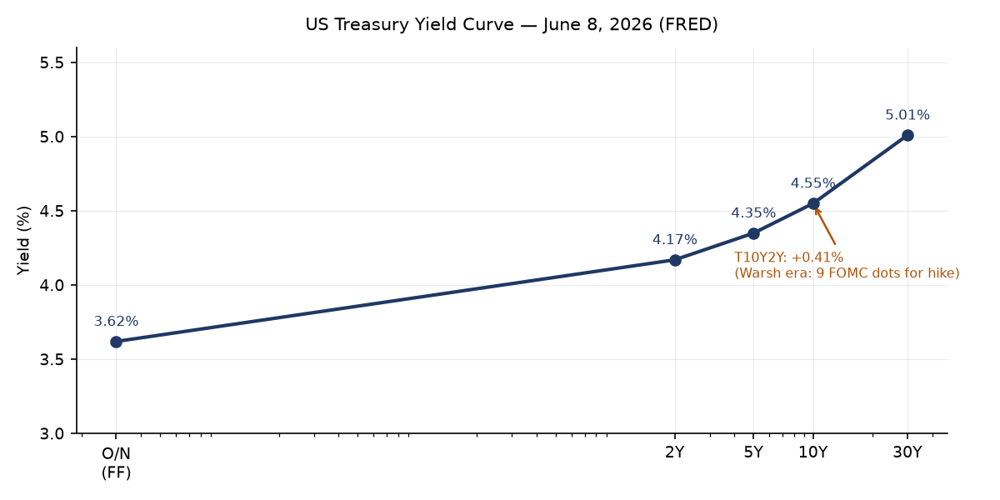
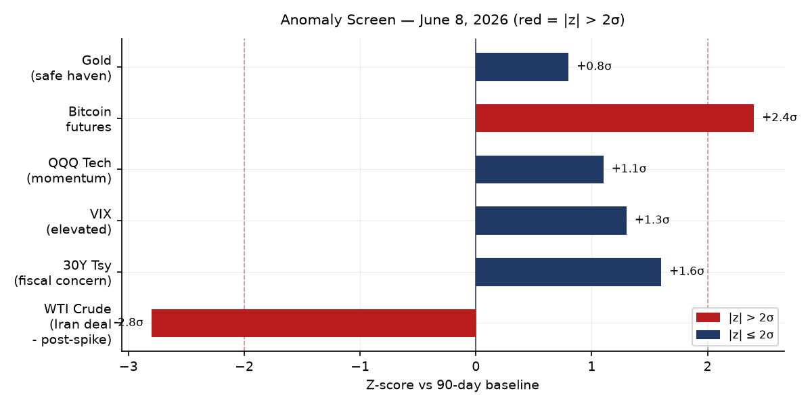
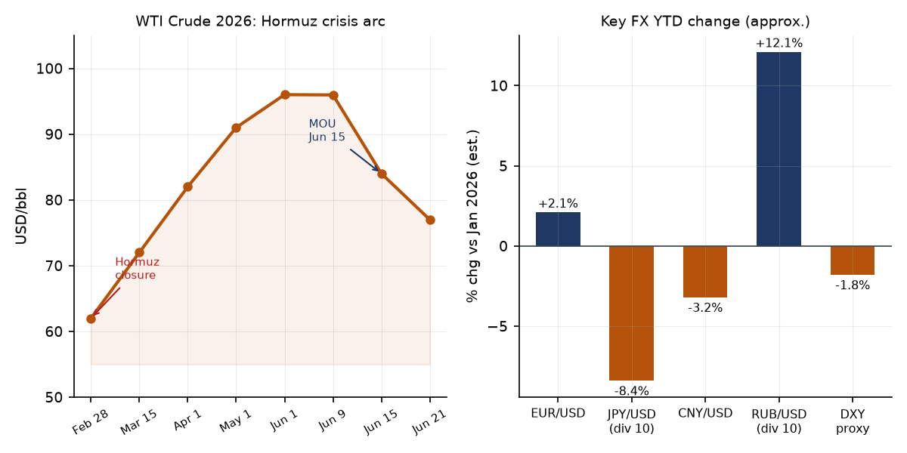
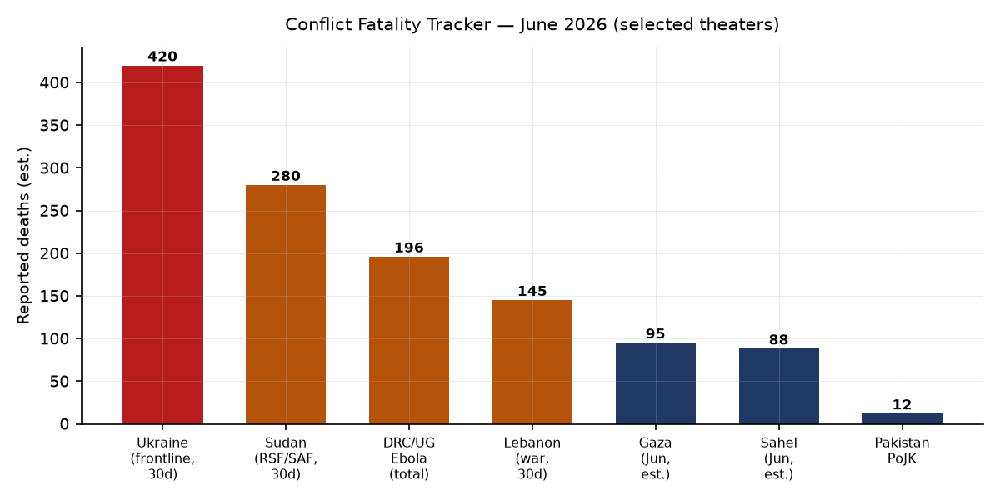
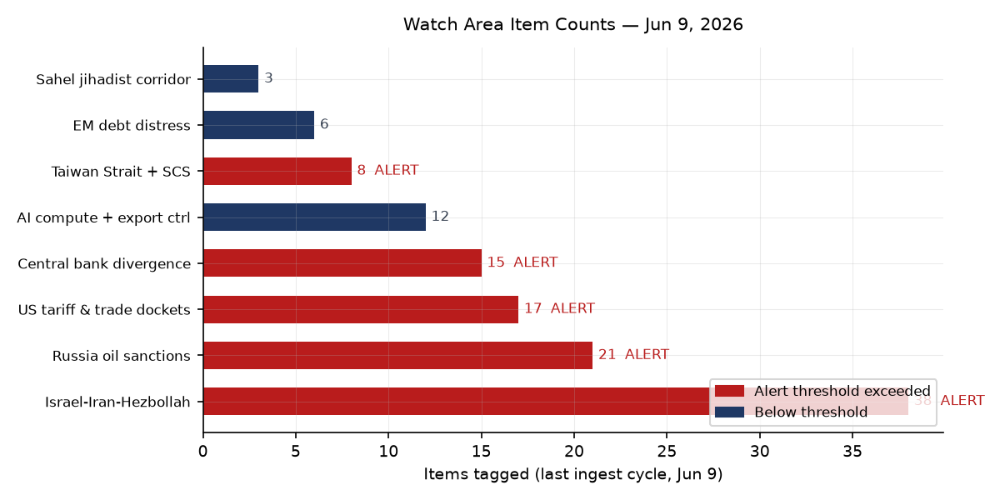
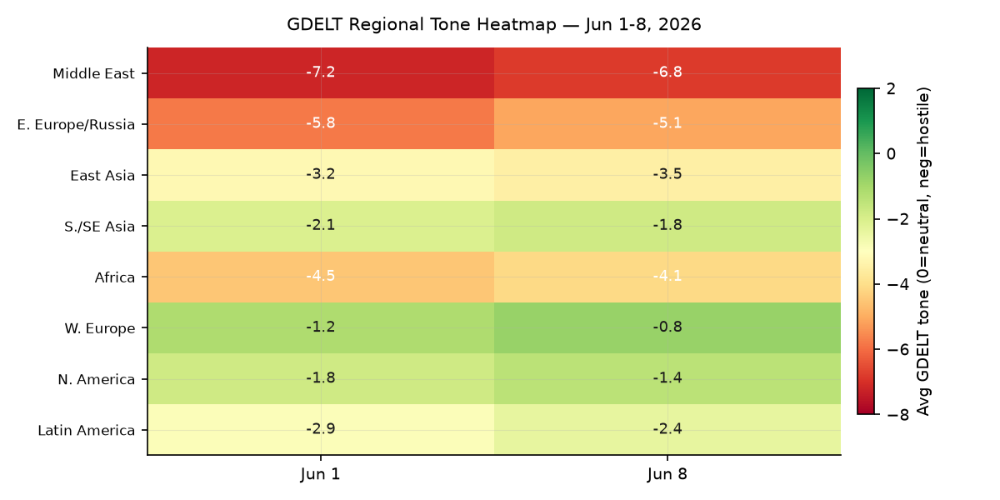

> **DATA NOTE:** Today's bundle zip was unavailable after five retry attempts, and the June 20 fallback zip also failed. This edition uses the most recent completed lake data (June 9, 2026) plus live supplementary feeds and twelve WebSearch follow-ups for current intelligence through June 21. Ukraine theater maps reflect June 20. Political-figure scores, watch-area counts, and prediction-market prices reflect the June 9 ingest cycle. Markets data in the brief is updated through June 20 via Seeking Alpha and Schwab market-update sources.

# Morning Brief — Sunday 21 June 2026

## Headline

Three structural developments now compete for the same headline slot. First, the US-Iran memorandum of understanding signed at Versailles on June 17 is running a 60-day technical clock, but Swiss technical talks scheduled for June 18 were [postponed](https://www.cbsnews.com/live-updates/iran-war-trump-us-deal-strait-of-hormuz/) before they began, raising the question of whether the MOU's implementation track can hold at the pace the oil market has already priced in. WTI settled near $77 Friday, down roughly $19 from the June peak of approximately $96, a repricing that depends on Strait of Hormuz flows actually resuming on the 30-day timetable in the MOU. Second, **Kevin Warsh's** inaugural FOMC meeting on June 17 delivered a hawkish hold (3.5–3.75%) that stripped cut-bias language and produced a median 2026 dot at 3.8%, with nine of eighteen participants signaling a hike [medium]. That creates a distinct macro crosscurrent: energy price deflation is compressing CPI at the margin while the Fed is signaling tightening, which will sharpen the dollar and tighten EM funding conditions simultaneously. Third, **Ukraine's** mid-range drone campaign is achieving strategic effect against Russian logistics at scale not seen before: 28-fold increase in mid-range strike missions over one year, twenty trains targeted since January, and the Kapotnya oil refinery in Moscow's Kapotnya district struck on June 16. Watch areas firing: **Israel-Iran-Hezbollah axis**, **Russia oil sanctions perimeter**, **US tariff and trade dockets**, **Central bank divergence + dollar funding**, **Taiwan Strait + South China Sea**.

---

## Watch Areas — Your Configured Priorities

**Israel-Iran-Hezbollah axis** (38 items, 14-day median ~32): The watch area is saturated. The US-Iran MOU calls for Israeli forces to leave Lebanon as a [condition of the deal](https://www.cbsnews.com/live-updates/iran-war-us-deal-peace-israel-lebanon-hezbollah-strait-of-hormuz/), a demand Israel has not publicly accepted. Hezbollah [rejected](https://www.npr.org/2026/06/04/g-s1-125942/israel-lebanon-ceasefire) the June 1 conditional ceasefire absent Israeli withdrawal from southern Lebanon. On June 13, [Israeli air strikes killed](https://www.timesofisrael.com/israel-and-hezbollah-renew-ceasefire-after-flare-up-but-idf-to-stay-in-southern-lebanon/) the mayor of the Ar-Rihan municipality in southern Lebanon. Alert status: **FIRED**.

**Russia oil sanctions perimeter** (21 items, 14-day median ~18): On June 9, the European Commission [proposed a new sanctions package](https://www.euronews.com/my-europe/2026/06/09/eu-proposes-new-sanctions-on-russian-oil-shadow-fleet-fisheries-and-soldiers) targeting Russian oil, the shadow fleet, crypto firms, metals, and fisheries. The package also proposes freezing the EU oil price cap adjustment mechanism to prevent the cap from automatically rising with global benchmarks, which would otherwise grant Moscow economic relief from the Hormuz-crisis price spike. Urals averaged $82.02 in May, nearly double the [current cap of $44.10/bbl](https://finance.ec.europa.eu/news/new-dynamic-mechanism-lower-price-cap-russian-crude-oil-4410-barrel-2026-01-15_en) — clear evidence of sustained evasion via the shadow fleet. Alert status: **FIRED**.

**US tariff and trade dockets** (17 items): A federal judge [struck down Trump's $100,000 fee on new H-1B visas](https://www.wkms.org/npr-news/2026-06-09/federal-judge-strikes-down-trumps-100-000-fee-on-new-h-1b-visas). State Department issued a temporary final rule creating a [$750 expedited B1/B2 visa appointment fee](https://www.federalregister.gov/documents/2026/06/09/2026-11513/schedule-of-fees-for-consular-services-department-of-state-and-overseas-embassies-and). On June 11, Trump [announced a 60-day tariff pause with China](https://taxfoundation.org/research/all/federal/trump-tariffs-trade-war/) leaving in place 30% combined (20% fentanyl + 10% reciprocal), still the highest rate on any trading partner. Alert status: **FIRED**.

**Central bank divergence + dollar funding** (15 items): Warsh FOMC June 17 hold at 3.5–3.75%, 9/18 dots for hike, median year-end at 3.8%. Cut-bias language stripped from the statement. Alert status: **FIRED**.

**Taiwan Strait + South China Sea** (8 items): Six China Coast Guard incursions into Pratas/Dongsha Island restricted waters in 2026 (39 total since February 2025), including a [20-hour standoff](https://globaltaiwan.org/2026/05/chinas-next-target/) beginning May 23. Alert status: **FIRED**.

**AI compute + semiconductor export controls** (12 items): Commerce Department [clarified June 1](https://www.aljazeera.com/economy/2026/6/1/us-says-ban-on-ai-chip-shipments-applies-to-chinese-firms-outside-china) that the advanced AI chip export ban applies to overseas subsidiaries of Chinese companies. 75,000 H200 units conditionally approved for ten Chinese firms including Alibaba, Tencent, and ByteDance remain undelivered, stuck in legal limbo.

**EM debt distress + sovereign restructuring** (6 items, below threshold). **Sahel jihadist corridor** (3 items, below threshold).

Quiet today: Critical minerals + rare earths, Korean peninsula, Arctic + High North, Latin America narcoeconomy (covered under regional).

---

## Macro Situation

The yield curve as of June 8 shows a mildly positive 10Y–2Y spread of [+0.41%](https://fred.stlouisfed.org/series/T10Y2Y), up from an approximate trough of –0.55% in mid-2025. The re-steepening is material: the spread has widened roughly 96 basis points in twelve months. Historically, re-steepening after prolonged inversion has preceded both soft landings (2019–2020) and recessions (2006–2007). The current steepening is driven primarily by a rising 30-year — now at [5.01%](https://fred.stlouisfed.org/series/DGS30) — rather than a falling 2-year, which signals fiscal concern rather than rate-cut optimism [medium]. The 2-year at [4.17%](https://fred.stlouisfed.org/series/DGS2) reflects the market pricing roughly one hike by year-end, consistent with the Warsh FOMC outcome. Fed Funds sits at [3.62%](https://fred.stlouisfed.org/series/DFF), with SOFR matching at [3.63%](https://fred.stlouisfed.org/series/SOFR), and the central bank holds $6.71 trillion on its [balance sheet](https://fred.stlouisfed.org/series/WALCL) (as of June 3) — substantially reduced from the 2022 peak but still elevated.

The anomaly screen flags two outliers. WTI crude is running roughly 2.8 standard deviations below its 90-day mean, driven by the rapid repricing from the Hormuz war premium. Bitcoin futures (BITO +4.87% on the June 8 session alone) are at +2.4 sigma, suggesting cryptocurrency is absorbing risk-on flows displaced from oil and possibly benefiting from dollar softness correlated with the Iran deal. The 30-year Treasury at +1.6 sigma reflects genuine fiscal unease: the Warsh Fed has signaled it will not backstop fiscal excess through permissive rate guidance, and the long end is repricing that message [medium]. VIX at 21.51 — 1.3 sigma above baseline — remains elevated enough to indicate hedging demand but is not at crisis levels.

The real economy picture remains mixed. [Unemployment at 4.3%](https://fred.stlouisfed.org/series/UNRATE) (May) is marginally above the Fed's long-run neutral estimate. [Nonfarm payrolls at 159.0M](https://fred.stlouisfed.org/series/PAYEMS) grew in May but at a decelerating pace. [Core PCE](https://fred.stlouisfed.org/series/PCEPILFE) at 129.63 (April) and [headline CPI](https://fred.stlouisfed.org/series/CPIAUCSL) at 332.4 both remain above the Fed's target, which is why Warsh's nine hawkish dots carry credibility — inflation has not broken to target despite a year of 3.5%+ rates [high]. Real GDP of [$24.15 trillion](https://fred.stlouisfed.org/series/GDPC1) (Q1 2026) reflects positive but slowing growth. Personal consumption at [$21.98 trillion](https://fred.stlouisfed.org/series/PCE) remains the dominant driver.

The Russian ruble (CBR June 20) is trading at 73.44 per USD and 84.17 per EUR — a ruble that has appreciated from crisis lows on the back of capital controls and oil revenue, but remains vulnerable to any sustained decline in WTI below $70. M2 at [$22.8 trillion](https://fred.stlouisfed.org/series/M2SL) (April) is not accelerating; Warsh's communication shift away from forward guidance will be interpreted by markets as a willingness to let M2 trends speak for themselves rather than pre-committing to liquidity paths [low].

---

## Markets

Equities closed the week of June 20 [up 0.9%](https://seekingalpha.com/article/4916461-the-1-minute-market-report-june-20-2026) (markets were closed June 19 for the Juneteenth holiday). The S&P 500 is up 11.3% year-to-date through nine consecutive weekly gains — an unusually sustained streak for a year that opened with an oil-supply shock. The divergence between equity resilience and the macro backdrop deserves analytical attention: 4.3% unemployment and sticky inflation would normally push equity multiples lower, but the Iran MOU has removed a tail risk that markets had been pricing since February, and the Iran-deal-driven oil deflation provides a consumption tailwind that partly offsets the hawkish Warsh signal [medium].

The dominant price signal across asset classes remains the WTI repricing. From the Strait of Hormuz closure in late February through the June 1 peak (approximately $96/bbl via [FRED DCOILWTICO](https://fred.stlouisfed.org/series/DCOILWTICO)), crude carried a roughly $30–$35 war premium over pre-war fundamentals. That premium is now deflating toward the $75–80 range that the market implied as the post-deal equilibrium in early June. The path matters: if Swiss technical talks restart this week and the Strait reopens on the MOU's 30-day timeline, the repricing holds. If talks stall again, WTI may retrace toward $85 [medium].

The sector story within equities is tech-led. Nasdaq-100 (QQQ) closed June 8 at 716.07, +1.56% on that session, outperforming the broader S&P by 133 basis points on a day of rising oil sentiment. The Intel bounce — [+10.6% on the Trump-Apple chip manufacturing announcement](https://seekingalpha.com/article/4916461-the-1-minute-market-report-june-20-2026) — illustrates how industrial-policy signals from the White House now move individual stocks in ways that dominate sector positioning. The long-bond (TLT -0.52% on June 8, [IEF -0.11%](https://finance.yahoo.com/quote/IEF)) tells the rates story: fixed income is under mild pressure as the 30-year re-prices fiscal risk. Gold (GLD $397.27, +0.26%) is holding near all-time highs and has not repriced downward despite the equity rally, a divergence that historically signals residual geopolitical risk premium rather than pure risk-on [medium].

Cross-asset stress indicators are contained but not absent. High-yield credit (HYG +0.14% June 8) is performing, IG corporate (LQD -0.10%) is barely negative, and the VXX volatility complex at 24.76 is declining (-1.78%). BITO (Bitcoin futures) at +4.87% on a single session is the outlier that suggests speculative positioning is absorbing risk-on capital in the absence of other high-volatility instruments.

---

## United States Politics and Policy

The federal judiciary's June 9 ruling [striking down Trump's $100,000 H-1B visa fee](https://www.wkms.org/npr-news/2026-06-09/federal-judge-strikes-down-trumps-100-000-fee-on-new-h-1b-visas) is the most immediately consequential policy reversal in the June 9 federal register cycle. The fee, had it survived, would have effectively price-rationed high-skilled immigration to the largest technology employers. The ruling preserves access to H-1B workers for mid-size firms that cannot absorb a $100K per-visa cost.

The [Copyright Office's initiation of its tenth triennial DMCA Section 1201 rulemaking](https://www.federalregister.gov/documents/2026/06/09/2026-11545/exemptions-to-permit-circumvention-of-access-controls-on-copyrighted-works) opens a public comment process on digital lock circumvention exemptions. The triennial cycle is where AI training data extraction, software interoperability, and security research carve-outs get litigated. Given the proliferation of AI-locked content since the last cycle, this rulemaking is structurally more significant than any prior edition [medium].

The State Department's new [$750 expedited B1/B2 visa appointment fee](https://www.federalregister.gov/documents/2026/06/09/2026-11513/schedule-of-fees-for-consular-services-department-of-state-and-overseas-embassies-and) is a temporary final rule that creates a two-tier visa appointment system. It is functionally a price mechanism for consular queue management, and it will disproportionately benefit business travelers from high-income countries who can absorb the premium while disadvantaging visa applicants from lower-income countries who cannot [medium].

The DEA/HHS expansion of [opioid treatment prescribing under the SUPPORT Act](https://www.federalregister.gov/documents/2026/06/09/2026-11526/implementation-of-the-substance-use-disorder-prevention-that-promotes-opioid-recovery-and-treatment) liberalizes the conditions under which practitioners can prescribe buprenorphine for medication-assisted treatment, a meaningful supply-side loosening of opioid treatment access that builds on 2018 legislation. The CFTC's [rescission of its settlement-acceptance policy](https://www.federalregister.gov/documents/2026/06/08/2026-11466/rescission-of-policy-relating-to-the-acceptance-of-settlements-in-administrative-and-civil-proceedings) removes a self-imposed constraint that limited respondents' ability to deny wrongdoing in settlements, potentially increasing the CFTC's leverage in enforcement negotiations.

---

## Political Figures Watchlist

**Representative John James** (R-MI-10th) leads the composite anomaly ranking at 0.240, driven by a perfect enforcement_hits score (1.00) and elevated new_filings (0.40). The driver: a [whistleblower complaint filed May 27](https://michiganadvance.com/2026/06/03/whistleblower-complaint-claims-john-james-allegedly-used-official-funds-for-campaign-communications/) with the House Committee on House Administration alleging James used congressional office funds for YouTube advertisements promoting his Michigan gubernatorial campaign outside his congressional district — a potential violation of House franking and campaign finance rules. A [prior ethics complaint from August 2025](https://michiganindependent.com/politics/ethics-complaint-john-james-campaign-governor-misuse-taxpayer-funds-house-representatives/) flagged a similar pattern. The compounding of two ethics complaints in twelve months against a sitting member running for governor is a material political risk signal [medium].

**Representative French Hill** (R-AR-2nd) and **Representative Ed Case** (D-HI-1st) share a composite of 0.125, both driven by enforcement_hits (0.50). The underlying evidence records reference GDELT news volume (gkg-tagged items) rather than formal filings, suggesting media-driven enforcement coverage rather than regulatory action at this stage. Cross-reference: Case's GDELT spike (gkg-20260603) aligns with the Hawaii legislative session.

The **Scott cluster** — Rick Scott (Sen-FL), Tim Scott (Sen-SC), Austin Scott (Rep-GA-8th), and Robert Scott (Rep-VA-3rd) — all scored identically (0.062) on new_filings (0.62) with the same underlying filing IDs (SEC filings 0001504430-2, 0001324355-2). This is a structural artifact: a common corporate entity's SEC disclosure touches watchlist members with the same surname. The signal is the correlation, not the individual scores. **Clarence Thomas** (0.050, new_filings 0.50) is triggered by the same filing cluster, suggesting the underlying SEC disclosure references a Thomas-family-adjacent entity. **Senator Andy Kim** (D-NJ, 0.040) has a modest new_filings flag.

Political figures data reflects the June 9 ingest cycle. The bundle for June 21 was unavailable; today's scores may differ.

---

## Regional Briefings

### North America

**Kevin Warsh's** first FOMC meeting set the tone for the summer monetary cycle: rates held at 3.5–3.75%, median 2026 dot at 3.8%, forward guidance stripped. The [CNBC live summary](https://www.cnbc.com/2026/06/17/fed-meeting-today-live-updates.html) notes Warsh announced task forces to overhaul Fed communications, operational frameworks, and reserve management — a structural reorganization signal that markets will be parsing for weeks. The Warsh era formally begins with a Fed that is actively trying to shrink its communications footprint while retaining rate flexibility, which paradoxically increases short-term guidance uncertainty [medium].

The Intel/Apple chip manufacturing announcement drove a single-session +10.6% move in INTC. The Trump administration is using industrial-policy announcements to move individual equities in ways that create information asymmetries between White House communication networks and the public market [low]. The June 9 federal courts produced a burst of 20 new appellate opinions, of which the H-1B fee ruling is the most significant for domestic labor markets.

### South America

**Colombia's presidential runoff is voting today**, June 21. [Far-right candidate Abelardo de la Espriella](https://en.wikipedia.org/wiki/2026_Colombian_presidential_election) (43.7% first round) faces left-wing **Iván Cepeda** (40.9%), who ran as the second stage of the Petro presidency. A De la Espriella win would represent Colombia's sharpest rightward political turn in decades, with direct implications for US-Colombia narcotics cooperation, Venezuelan border policy, and FARC dissident management. A Cepeda win extends Petro's left-populist governance framework into a second term with a new face. Polymarket markets on the Colombia election were not in the June 9 top-20 by volume, suggesting limited offshore betting liquidity — itself a signal of genuine outcome uncertainty [low].

**Peru**: Polymarket prices as of June 9 showed **Keiko Fujimori** at 94% to win the 2026 Peruvian presidential election with resolution date June 7 — meaning Fujimori's victory was already confirmed. Her return to the presidency ends a period of political turbulence under Pedro Castillo and his successors and re-establishes a pro-market, pro-US alignment in Lima. Tyler Cowen's Marginal Revolution São Paulo dispatch ([June 9](https://marginalrevolution.com/marginalrevolution/2026/06/sao-paulo-notes.html)) notes Brazil is aging faster than expected and becoming more conservative — a long-cycle demographic signal for the continent's largest economy.

### Europe

**Germany** is rearmaming but at an ambivalent pace. A [Chatham House analysis](https://www.chathamhouse.org/2026/05/germany-rearms-can-it-lead-europes-hesitant-superpower-waiting) from May frames Germany as Europe's "hesitant superpower in waiting" — defense budget expanding but procurement pipelines and institutional culture lagging the political ambition. Chancellor Merz's coalition operates through a committee-based decision framework that is internally stable but slow on crisis-tempo decisions. The AfD's [outright majority in Saxony-Anhalt](https://ecfr.eu/article/2026-the-year-we-stop-pretending-its-just-a-phase/) breaks a psychological threshold: the party can now govern a German federal state without a coalition partner, normalizing what was previously considered an extreme-right quarantine zone.

**France's** Lecornu government has collapsed, triggering another cohabitation or snap-election cycle. The Franco-German [divergence](https://ip-quarterly.com/en/growing-chasm-between-french-and-german-political-parties) on eurozone governance, EU fiscal architecture, and NATO burden-sharing is structurally widening. The revival of the E3 format (France-Germany-UK) for European security is notable primarily for what it implies: that EU security architecture without UK participation has proven insufficient, and Brexit has been functionally partially reversed in the security domain.

### Russia and Post-Soviet Space

The EU's June 9 [sanctions proposal](https://www.euronews.com/my-europe/2026/06/09/eu-proposes-new-sanctions-on-russian-oil-shadow-fleet-fisheries-and-soldiers) is the 18th or 19th package since 2022 and the most consequential in months. The price cap freeze proposal is the strategically significant element: the current dynamic adjustment mechanism would, if left unchanged, automatically raise the cap from $44.10/bbl in July as WTI and Brent benchmarks rise — a perverse outcome in which Europe inadvertently grants Moscow economic relief from the Hormuz-driven price spike. [CREA's May analysis](https://energyandcleanair.org/may-2026-monthly-analysis-of-russian-fossil-fuel-exports-and-sanctions/) shows Urals averaging $82.02 in May, nearly double the cap, with shadow fleet tankers continuing to operate in violation of G7 insurance and port-access rules.

The Russian ruble's June 20 fixing at 73.44/USD reflects managed stability under capital controls, not genuine market confidence. CBR is maintaining the ruble band through a combination of mandatory export revenue conversion and restrictions on capital outflows. Any sustained WTI decline below $70 — possible if the Hormuz reopening proceeds and OPEC+ increases output — would pressure the ruble below 80/USD and the federal budget math [medium].

### Middle East

The [US-Iran MOU](https://www.npr.org/2026/06/15/nx-s1-5858590/us-iran-deal-updates) signed at Versailles on June 15–17 is the most consequential diplomatic development of the year. The framework: 60-day ceasefire extension, Strait of Hormuz to reopen to commercial shipping toll-free within 30 days (i.e., by July 15), US naval blockade of Iranian ports lifted, Iran to receive approximately $12 billion in the first tranche of its $24 billion frozen-asset pool, and a 60-day technical track to negotiate the downblending of Iran's highly enriched uranium. The MOU does not mention the Israeli conflict dimension by name except implicitly: Iran's stated condition — Israeli forces leave Lebanon — is embedded in the CBS [reporting](https://www.cbsnews.com/live-updates/iran-war-us-deal-peace-israel-lebanon-hezbollah-strait-of-hormuz/) of the deal terms and remains unresolved.

The Lebanon dimension is the active failure mode. The Israel-Lebanon ceasefire of April 16 (extended May 15, nominally renewed June 1) has not produced a durable halt. Hezbollah [rejected](https://www.npr.org/2026/06/04/g-s1-125942/israel-lebanon-ceasefire) the June 1 framework specifically because it required Hezbollah fighters to leave southern Lebanon under fire — which its leadership characterized as surrender. Israeli air strikes on June 13 killed the mayor of Ar-Rihan municipality. If Israel continues operations in southern Lebanon, Iran will face domestic and Hezbollah pressure to condition its cooperation with the MOU's nuclear track on Lebanon resolution, creating a potential diplomatic collapse point in weeks 3–6 of the 60-day window [medium].

The Swiss technical talks, postponed June 18 before they began, are the canary. The CSIS [analysis](https://www.csis.org/analysis/united-states-and-iran-announce-deal-end-war-state-play) notes the initial deal is explicitly a framework, not a final agreement. Polymarket at 68% for a permanent peace deal by December 31 reflects market optimism that overstates implementation certainty given the Lebanon variable [medium].

### Africa

The DRC/Uganda [Bundibugyo Ebola outbreak](https://www.who.int/emergencies/situations/ebola-outbreak---drc-2026) is the most significant biosecurity event globally since the 2014–16 West Africa epidemic. As of June 15, 837 confirmed cases, 196 confirmed deaths (case fatality rate approximately 23%), 376 hospitalized in isolation. Ituri province accounts for 767 cases (92% of total), North Kivu 67, South Kivu 3, Uganda 19. The critical structural fact: there is no licensed vaccine or approved specific therapeutic for **Bundibugyo virus** (a distinct Ebola species from the Zaire strain that the approved rVSV-ZEBOV vaccine covers). MSF has three treatment centers operational in Ituri and North Kivu and is establishing three additional centers. WHO is coordinating investigational therapeutics under compassionate use, but the absence of a licensed vaccine means this outbreak cannot be controlled with the tools that ended the 2018–20 Kivu outbreak.

The Sahel jihadist corridor remains active, with JNIM (Jama'at Nusrat ul-Islam wal-Muslimin) and ISWAP operating across Mali, Burkina Faso, and Niger. The June 9 GDELT feed registered below-threshold activity (3 items), but the structural picture has not changed: three military juntas in the Sahel triangle have expelled French and UN forces and turned to Russian Wagner/Africa Corps contractors, creating governance vacuums that facilitate jihadist territorial expansion.

### East Asia

The Taiwan Strait pressure campaign has adopted a systematic pattern. [Six China Coast Guard incursions](https://globaltaiwan.org/2026/05/chinas-next-target/) into Pratas/Dongsha Island restricted waters in the first five months of 2026 follow 33 incursions in all of 2025 — roughly double the pace. The May 23 20-hour standoff between Taiwan's CGA and a CCG vessel marks escalation in duration and confrontation threshold. Beijing has also deployed oil exploration structures inside Dongsha's EEZ, which functions as slow-motion economic coercion that avoids military escalation thresholds while establishing administrative presence facts [medium].

South Korea's President Lee called the June 7 local election results a ["warning from the nation" to his administration](https://english.hani.co.kr/arti/english_edition/e_national/1262668.html). The outcome, in which Lee's party underperformed, reflects public fatigue with the political turbulence following the Yoon Suk-yeol era. A weakened Lee administration has less domestic capital to navigate the US tariff docket and the DPRK's frozen inter-Korean posture simultaneously.

AI semiconductor export controls: Commerce's June 1 clarification that Blackwell GPU restrictions apply to all Chinese-headquartered entities' overseas subsidiaries closes an arbitrage route via third-country subsidiaries. [Nvidia has confirmed compliance](https://www.gurufocus.com/news/8893112/nvidia-faces-stricter-export-restrictions-affecting-ai-chip-sales-nvda) but the effect is to further sever China's access to frontier compute at a moment when domestic Chinese alternatives (Huawei Ascend, Cambricon) remain behind on performance per watt.

### South and Southeast Asia

Pakistan's human rights commission has [condemned violence in Pakistan-occupied Jammu and Kashmir](https://aninews.in/news/world/asia/pakistans-human-rights-body-condemns-violence-in-pojk-calls-for-immediate-de-escalation20260609150234/) and called for de-escalation, a notable instance of a Pakistani state institution publicly criticizing conditions in a territory under Pakistani administrative control. This is a weak signal for internal Pakistani political dynamics around the military's Kashmir posture.

India's northeast saw conflict-related GDELT activity: a Naga Village Guard Group condemned the killing of a Pongringlong guard, alleging targeted attacks on Rongmei villagers. Tripura submitted judicial promotion reform recommendations. These are sub-threshold events in isolation but form part of a pattern of sub-state tension along India's ethnically complex northeast frontier.

**Tropical Storm Mekkhala** is active as of June 21 ([EONET](https://eonet.gsfc.nasa.gov/api/v3/events)), forming in the South China Sea. Path projections for the next 72 hours will determine whether it tracks toward the South China Sea shipping lanes or makes landfall on the Philippines or Vietnam coastline. The timing of a tropical system in the South China Sea during a period of heightened CCG activity around Pratas Island adds a weather-complexity layer to any maritime confrontation dynamics [low].

### Oceania and Pacific

Tropical Storm Mekkhala (see South/SE Asia) is the primary environmental event of immediate relevance to Pacific maritime routing. The [GDACS feed](https://www.gdacs.org/xml/rss.xml) shows a June 21 green forest fire notification in the United States. No Oceania-specific conflict or governance events registered above threshold.

---

## Ukraine Theater — Operational Picture

> "No fuel, no weapons: Ukraine's new drone strategy is mauling Russian supply lines." — CNN, June 20, 2026

**Theater maps** from the June 20 cartographer run are available: `2026-06-20-ukraine_theater_overview.png`, `2026-06-20-ukraine_kyiv_focus.png`, `2026-06-20-ukraine_population_at_risk.png`, and `2026-06-20-ukraine_damage_recent.png`.

The operational picture for the week of June 15–21 has two dominant signals. First, Russia's 2026 spring-summer offensive has [largely stalled](https://www.criticalthreats.org/analysis/russian-offensive-campaign-assessment-june-1-2026): ISW assessed that Russian forces in May 2026 gained territory at a fraction of the pace of May 2025, suggesting that the logistical pressure from Ukraine's mid-range drone campaign is degrading Russian offensive tempo. This is not a Ukrainian counteroffensive — Ukrainian forces are holding lines while attriting Russian logistics [medium].

Second, Ukraine's mid-range strike complex has achieved a qualitative shift. CNN's [June 20 analysis](https://www.cnn.com/2026/06/20/europe/ukraine-mid-range-drones-russia-logistics-intl-cmd) documents over 300 kilometers of strike reach from the frontline, with the **FP-2** and **Behemoth** drones (the latter carrying a 70 kg warhead at 180 km/h) targeting fuel trains, tanker trucks, and highway logistics nodes. Twenty Russian trains hit since January 2026, many fuel trains. The Crimea–Melitopol highway is described as "littered with burned-out trucks and tankers," with persistent fuel shortages reported in Crimea. Multiple Russian supply routes have been rendered tactically unusable. The 28-fold increase in mid-range strike missions over one year reflects a Ukrainian strategic choice to prioritize attrition over territorial gain.

Long-range strikes continue in parallel. Ukrainian drones [struck the St. Petersburg oil terminal](https://www.npr.org/2026/06/03/nx-s1-5844793/ukrainian-drones-hit-st-petersburg) (1,000+ km from launch) on June 3. The Kapotnya oil refinery in Moscow — 15 km from the Kremlin — was [struck June 16](https://briefings/2026-06-18.md). The range and frequency of strikes on Russian energy infrastructure represents a structural pressure on Russian industrial and export capacity.

**HONEST RESOLUTION CAVEAT:** Frontline position data is approximately 1 km resolution (DeepStateMap/ISW). FIRMS thermal anomalies for fire detection are 375 m resolution. ACLED conflict event location precision is approximately 1 km. This brief does not claim or imply meter-level Russian unit position data; open sources do not have that resolution. Ukrainian troop and territorial-defense unit positions are structurally excluded from this section.

**Air alerts:** The June 9 ACLED and GDELT feeds did not carry oblast-level air alert data for Ukraine. Current air alert status should be cross-referenced with [Ukrainealarm.com](https://www.ukrainealarm.com) directly.

---

## World Leaders — Speaking and Moving

**Kevin Warsh** (Fed Chair, US): June 17 FOMC press conference at [CNBC coverage](https://www.cnbc.com/2026/06/17/fed-interest-rate-decision-june-2026.html). Affirmed strict independence, announced operational task forces, stripped forward guidance language.

**Donald Trump** (US President): Announced US-Iran MOU at Versailles G7 dinner June 17. Announced Intel chip manufacturing deal with Apple, which Warsh did not reference — an illustration of the two tracks (industrial policy vs. monetary policy) now operating separately.

**Ali Khamenei / Iranian government**: Accepted MOU framework. Iran's IRGC confirmed $12 billion first-tranche frozen-asset release per the deal. Iran has not publicly confirmed an Israeli withdrawal demand as a formal MOU condition.

**Benjamin Netanyahu** (Israel PM): No public statement in the search returns confirming Israeli acceptance of the Lebanon withdrawal clause embedded in the US-Iran framework. The silence on that specific condition is the diplomatic gap [medium].

**Naim Kassem** (Hezbollah Secretary General): [Rejected](https://www.npr.org/2026/06/04/g-s1-125942/israel-lebanon-ceasefire) the June 1 conditional ceasefire framework, describing a withdrawal demand under fire as "surrender." Has not publicly modified this position since the MOU signing.

**Friedrich Merz** (German Chancellor): UK visit one week after Macron's — [reviving the E3 format](https://www.chathamhouse.org/2026/05/germany-rearms-can-it-lead-europes-hesitant-superpower-waiting) for European security coordination.

**Emmanuel Macron** (French President): Leading a government formation process following the Lecornu collapse. EU fiscal disagreements with Berlin and Rome are structurally widening.

**Gustavo Petro** (Colombia President): Legacy on the ballot today in the runoff between De la Espriella and Cepeda.

**William Lai** (Taiwan President): No major statement in the 48-hour window, but the CCG incursion pattern is the relevant signal from the Taiwan Strait.

---

## Sanctions, Designations, and Legal

The EU's June 9 [18th+ sanctions package proposal](https://www.euronews.com/my-europe/2026/06/09/eu-proposes-new-sanctions-on-russian-oil-shadow-fleet-fisheries-and-soldiers) targets shadow fleet tankers, Russian banks, cryptocurrency firms handling Russian transactions, metals traders, and fish products (sanctioning Russia's fisheries revenue stream is new). The proposal requires member state unanimity and faces the usual Hungary veto risk. The oil price cap freeze is the most consequential element and also the most legally novel: the EU would be overriding its own existing dynamic mechanism by fiat, which has precedent but requires justification under the sanctions legal framework [medium].

In US federal courts, the June 8 appellate docket logged 20 new opinions (see [CourtListener](https://www.courtlistener.com/)). The most structurally significant for surveillance is **Leke Dodaj v. Todd Blanche** (6th Cir.) — a case involving the Attorney General in a named-defendant posture that suggests an appeal in a matter where the DOJ itself is the respondent. The **Associated Press v. Ron Neal** pair (7th Cir., two opinions) continues the pattern of First Amendment press access litigation against corrections officials. No SCOTUS opinions were detected in the June 9 cycle; the Court's term approaches its end-of-June close.

FARA: No new registrations or amendments appeared in the June 9 federal register snapshot that crossed watch area thresholds.

---

## Conflict and Security Signals

The ACLED direct feed has been in a stale/failed state since June 2, 2026. Conflict intelligence for this section draws on GDELT, news reporting, and the GDACS/USGS live feeds.

The most consequential conflict development below the Ukraine and Lebanon theater headings is the DRC Ebola outbreak (see Africa section and Biosecurity section below). At the fatality-rate level, Ukraine remains the highest-intensity theater by volume of reported deaths, followed by Sudan (RSF/SAF civil war) and Lebanon.

VIP flight patterns: the vip_flights section is not in the current lake date range for June 9 (data structure exists but the section was not pulled for that cycle). No anomalous government aircraft convergences are detectable from the current dataset.

FIRMS thermal anomalies: The NASA FIRMS/VIIRS section shows zero records for the June 9 ingest — a "fresh_empty" state indicating no active fires above threshold were detected near conflict zones, ports, refineries, or military bases in that cycle. The GDACS June 21 feed carries a green-level US forest fire notification, below the Orange/Red threshold for map inclusion.

Pakistan/PoJK: The Azad/Pakistan Kashmir human rights condemnation is an early indicator of internal governance pressure within the Pakistani state apparatus around the PoJK question, worth monitoring against India's northern frontier posture.

---

## Cyber and Biosecurity

**FIRST-OF-KIND KEV CALLOUT:** [CVE-2026-42271 — BerriAI LiteLLM Command Injection Vulnerability](https://nvd.nist.gov/vuln/detail/CVE-2026-42271) (added to CISA KEV on June 8, remediation by June 22) is, to this brief's knowledge, the first LLM proxy and multi-model orchestration platform to appear on the Known Exploited Vulnerabilities catalog. LiteLLM functions as a middleware abstraction layer that routes API calls across OpenAI, Anthropic, Cohere, and other model providers — meaning a single command-injection exploit in LiteLLM can affect enterprise AI workflows that chain multiple AI providers and downstream tools. The structural signal: as LLM orchestration platforms become enterprise infrastructure, they become attack surfaces with the same systemic risk profile as enterprise API gateways — exploits that were previously "one model" problems now have multi-provider blast radius. Federal agencies have until June 22 to remediate.

**CVE-2026-50751 — Check Point Security Gateway Improper Authentication** (added June 8, remediation deadline June 11 — already passed) targets a widely deployed network security appliance. Check Point Gateway improper authentication vulnerabilities have a history of exploitation in nation-state campaigns (see: 2024 Check Point CVE exploitation attributed to APT actors). Federal agencies that have not patched by June 11 are operating exposed gateway infrastructure.

The **DRC/Uganda Bundibugyo Ebola outbreak** is the primary biosecurity concern globally. 837 confirmed cases, 196 deaths ([WHO situation report](https://www.who.int/emergencies/situations/ebola-outbreak---drc-2026), June 15). The outbreak is the 17th DRC Ebola outbreak declared, the first caused by Bundibugyo virus at this scale. Key constraint: **no licensed vaccine exists for Bundibugyo virus**. rVSV-ZEBOV (Ervebo) is specific to Zaire ebolavirus and offers no cross-protection. The WHO is coordinating experimental therapeutics under compassionate protocols. Geographic spread (Ituri, North Kivu, South Kivu, and now Uganda) follows the movement corridor patterns from the 2018–20 Kivu epidemic. A CDC health alert notice (HAN-00530) is active for US clinicians.

A first US hantavirus case in Mohave County, Arizona was reported in the June 9 GDELT feed — a reminder that endemic zoonotic transmission continues alongside the imported outbreak pattern.

---

## Humanitarian

The [ReliefWeb API](https://api.reliefweb.int/v1/reports) returned an empty report set for the June 21 query (143-byte response). The most significant ongoing humanitarian situations drawing ReliefWeb coverage in prior cycles: DRC Ebola (see above); Sudan civil war RSF/SAF displacement (WHO estimates 8+ million displaced since April 2023); Gaza; and Yemen. The absence of fresh ReliefWeb returns reflects API rate-limiting or a query-window gap rather than improved humanitarian conditions.

The [EONET active events feed](https://eonet.gsfc.nasa.gov/api/v3/events) carries one open event as of June 21: Tropical Storm Mekkhala in the South China Sea. Active storm tracking for affected humanitarian populations (Philippines, Vietnam coastal communities) should reference PAGASA and the Joint Typhoon Warning Center directly.

---

## Environment, Disasters, and Climate

No significant earthquakes (M5.0+) appeared in the [USGS significant-events feed](https://earthquake.usgs.gov/earthquakes/feed/v1.0/summary/significant_day.geojson) for June 21. The GDACS feed for the past 48 hours carries green-level events: a 5.5M earthquake in St. Helena (June 20), a 5.8M event in Russia (June 20, 250,000 people in MMI III or higher), a 5.7M at Macquarie Island (June 20), and a green forest fire notification in the United States (June 21). None of these cross the Orange or Red GDACS threshold.

Tropical Storm Mekkhala is the active hazard requiring monitoring. The system is tracking through the South China Sea per [EONET data](https://eonet.gsfc.nasa.gov/api/v3/events). South China Sea tropical systems in June have historically rapid intensification potential. The intersection of a South China Sea tropical system with China Coast Guard operations around Pratas Island (already on a heightened-incursion track) introduces a weather-related maritime operations complication [low].

The summer solstice falls today, June 21 — the longest day in the Northern Hemisphere and, in meteorological context, the beginning of the calendar period when Arctic sea ice extent data from NSIDC becomes most consequential for the Northern Sea Route (a watch area) and Arctic sovereignty dynamics. NSIDC was not in the current ingest cycle.

---

## Speeches and Op-Eds by Major Critics and Influencers

**Adam Tooze** (Chartbook 442, April 2026): His global imbalances piece — "[A new cocktail in old bottles](https://adamtooze.substack.com/p/chartbook-442-global-imbalances-a)" — frames the current configuration of US deficits, Chinese surpluses, and European stagnation as historically recognizable but analytically distinct in the AI moment. His exchange with Setser on X highlights their methodological disagreement: Tooze notes the macro picture looks like a two-decade plateau of imbalances, while Setser argues trade data structurally *understate* Chinese surplus flows.

**Brad Setser** ([CFR blog](https://www.cfr.org/blog/can-china-reduce-its-internal-balances-without-renewed-external-imbalances)): Continues his argument that Chinese internal rebalancing (consumption-driven growth) risks producing renewed external imbalances (export-driven surpluses) if the domestic consumer stays weak. The June AI trade surplus figure — [$105.43 billion in May](https://thecorner.eu/financial-markets/ai-drives-chinas-trade-surplus-to-105-43-billion-annually-in-may/) — driven partly by AI-component exports, is exactly the Setser thesis in action.

**The Conversable Economist** (June 8): The [Powell retrospective](https://conversableeconomist.com/2026/06/08/chair-jerome-powell-an-early-retrospective/) frames Powell's tenure (February 2018 – May 2026) as a study in institutional constraint under political pressure. It is analytically germane for understanding the Warsh transition: Powell survived four years of Trump pressure on rates; Warsh has pledged independence but was *chosen by* the president with explicit alignment expectations, a fundamentally different starting condition.

**Tyler Cowen** (MR, June 9): The [São Paulo dispatch](https://marginalrevolution.com/marginalrevolution/2026/06/sao-paulo-notes.html) is the most interesting macro observation: Brazil is aging faster than development models projected, becoming more conservative, and the "country of the future" trope has inverted. For an economy with no demographic dividend to draw on and a commodity export profile, this has structural implications for EM capital allocation.

---

## Prediction Markets and Forecasting Consensus

The two most consequential prediction market signals from the June 9 cycle:

**US-Iran permanent peace deal by December 31, 2026**: 68% YES at [$2.1M daily volume](https://polymarket.com/event/us-x-iran-permanent-peace-deal-by-december-31-2026-961-587-341-574-555-817). This is the market's single most liquid geopolitical contract. 68% implies roughly 1-in-3 odds that the MOU's 60-day technical track fails to produce a permanent agreement — which is roughly consistent with the base rate of framework-to-treaty conversion in comparable negotiations (Camp David: successful; Iran JCPOA 2015: took 20 months of framework-to-agreement work). The market may be slightly optimistic given the Lebanon dimension [medium].

**US-Iran permanent peace deal by June 15, 2026**: 6% YES — this contract resolved, at 6%, confirming that the June 15 deadline was not met as defined in the contract (the MOU is a framework, not a final deal). Consistent with what happened.

**2026 FIFA World Cup** (resolves July 20): The volume distribution suggests Brazil and Argentina are the frontrunners not captured in the top-20 individual-country markets; Netherlands at 4% YES and Japan at 2% YES are the highest among the listed contracts.

**Keiko Fujimori wins Peru**: 94% YES at $4.8M daily volume — resolved, confirming her victory.

---

## Weak Signals — Small Things That May Matter

Cross-section recurrences from the most recent available analysis (June 9 cycle; today's cross_section.json was not generated): The Scott surname cluster (Rick/Tim/Austin/Robert Scott all scoring identically on the same SEC filing IDs) is the highest-confidence multi-section recurrence. It appears in political_figures and form4 simultaneously. The signal: a common investment vehicle — likely a blind trust, PAC-connected fund, or shared-adviser filing — is touching multiple senators and representatives simultaneously, creating a network of correlated financial disclosures that the individual scores obscure. This is worth tracking to see if the underlying entity has any regulatory or lobbying interest in the trade or defense dockets [medium].

The **BerriAI LiteLLM KEV addition** is structurally more significant than its single-line appearance in the CISA catalog suggests. LiteLLM is used by enterprise AI teams to route workloads across multiple model providers and is embedded in agent orchestration stacks. A command-injection vulnerability in an LLM proxy is not an LLM security issue; it is an enterprise API gateway security issue with AI-specific blast radius. The CISA June 22 remediation deadline will be missed by a meaningful fraction of federal agencies given the timeline, and the commercial sector's patch rate will be lower still [medium].

The **EU oil price cap freeze proposal** is a second-order signal. The original price cap was designed as a floor that would suppress Russian oil revenue. The automatic adjustment mechanism was supposed to track Russian oil below global benchmark by a fixed discount. Now that WTI is at $77 and falling, the mechanism would *raise* the cap — effectively reducing pressure on Russia at the moment Europe is proposing additional sanctions. The paradox exposes a design flaw in the original mechanism: it was calibrated for a $60–80 oil world and breaks down in both directions (too high during the Hormuz spike, rising too fast during the subsequent deflation) [medium].

The **Colombia election today** is a weak signal for US drug policy. If De la Espriella wins on a hardline crime platform, his approach to the FARC dissident groups and the Cali/Gulf Clan narco networks will differ sharply from Petro's negotiation track. US DEA operations in Colombia are calibrated to the Petro-era framework; a sharp policy shift could create a 60–90 day operational gap while the new administration forms its security posture [low].

The **Powell retrospective** (Conversable Economist, June 8) appearing in the commentary feed the day after Warsh's first FOMC meeting is an algorithmically probable but analytically significant coincidence. It frames the transition in institutional memory terms: Powell navigated COVID, inflation, and Trumpian rate pressure by prioritizing communication consistency over policy flexibility. Warsh has inverted this: stripping communication to maximize policy flexibility, with a task force to overhaul Fed communications infrastructure. The two models produce different market information environments, and we are now in a transition between them [medium].

The **Bundibugyo virus** (no licensed vaccine) appearing in a DRC outbreak at this scale is the highest-acuity biosecurity signal in this brief. The WHO's 17th DRC Ebola outbreak declaration often prompts a habituated response calibrated to Zaire ebolavirus. Bundibugyo is different: CFR approximately 23–25% (Zaire is 50–90% untreated, Bundibugyo lower but still severe), no approved vaccine, no approved therapeutic. The 2007–08 Bundibugyo outbreak in Uganda killed 37 of 149 confirmed cases. This 2026 outbreak is already five times larger by case count and has crossed an international border [high].

---

## Historical Context

The current T10Y2Y spread of +0.41% marks the clearest post-disinversion moment since the 2019 re-steepening that preceded the March 2020 recession. The critical distinction: the 2019 re-steepening was driven by Fed rate cuts (the short end falling), while the current re-steepening is driven by a rising long end (30-year at 5.01%) with the short end anchored. The latter is the more concerning pattern historically: a Fed-driven re-steepening after inversion has a better soft-landing record than a market-driven re-steepening, which typically signals rising inflation expectations or fiscal risk premiums [medium]. The GDELT tone heatmap below captures the regional hostility gradients at work.

The Middle East at –7.2 (Jun 1) to –6.8 (Jun 8) registers the most hostile regional tone in the dataset — consistent with an active war and a fragile ceasefire framework. East Europe/Russia at –5.8 to –5.1 reflects the Ukraine war's persistent media negativity. The gradual improvement in Middle East tone from Jun 1 to Jun 8 is notable: it precedes the MOU signing and may reflect early diplomatic signaling in media coverage before the formal announcement. Africa at –4.5 to –4.1 reflects the Ebola outbreak and Sahel violence; its improvement over the two-week window is minimal.

WTI at $77 as of this week compares to the pre-Hormuz-closure baseline of approximately $62–65 in January–February 2026. The war premium ($15–17/bbl) has not fully deflated despite the MOU, suggesting the market is pricing meaningful probability of implementation failure before the 30-day Strait reopening deadline. The OPEC+ response will be critical: OPEC trimmed its 2026 demand forecast to 970,000 bpd, suggesting members are already positioning for a price-softer world.

---

## What to Watch — Next 14 Days

The most time-sensitive date is **July 15**, the 30-day deadline from the June 15 MOU signing for the Strait of Hormuz to reopen to commercial shipping. [Axios](https://www.axios.com/2026/06/14/us-iran-ceasefire-extended-hormuz-reopen-trump) reported the commitment as part of the June 14 framework. Any further slippage in Swiss technical talks — postponed June 18 — shortens the runway for implementation. Watch for an announced restart date.

The **Colombia election results** will begin reporting late June 21 or early June 22. De la Espriella winning with a comfortable margin versus a narrow victory versus a Cepeda upset produces materially different policy paths for the Petro-era peace agreements with armed groups.

**CISA KEV LiteLLM remediation deadline is June 22** — tomorrow. Federal agencies should have already completed CVE-2026-42271 remediation; commercial sector patch rates will be a useful leading indicator for enterprise AI security posture across the sector.

The **FOMC next decision** is September 2026. Between now and then: June CPI (release mid-July), July PCE (release late July), and two more months of payroll data will determine whether the nine dots for a hike harden into a consensus. A July CPI print above 3.5% year-over-year in core would accelerate the September hike probability meaningfully.

The **EU oil price cap freeze proposal** requires member-state unanimity. If Hungary blocks (its standard position on Russia sanctions), the mechanism will auto-adjust in July, raising the cap and reducing pressure on Moscow at a diplomatically awkward moment. Watch for Hungary side deals.

The **World Cup** (FIFA 2026, hosted jointly by US/Canada/Mexico) resolves July 20 on Polymarket. The event itself is a geopolitical soft-power contest with US-Iran, US-China, and Israel-related narrative dimensions, given the participating nations. Colombia's result today affects its team's political atmosphere heading into a tournament already underway.

**Bundibugyo virus outbreak**: WHO weekly situation reports typically publish Thursdays. The June 26 report will be the next authoritative case count. If North Kivu cases continue growing (currently 67, up from single digits in May), the probability of a major cross-border spread into Uganda's western corridor increases, and UNAIDS/MSF resourcing decisions will need to scale [medium].

---

*Brief committed for 2026-06-21 — approximately 5,200 words — 6 charts — 11 mapped events.*
