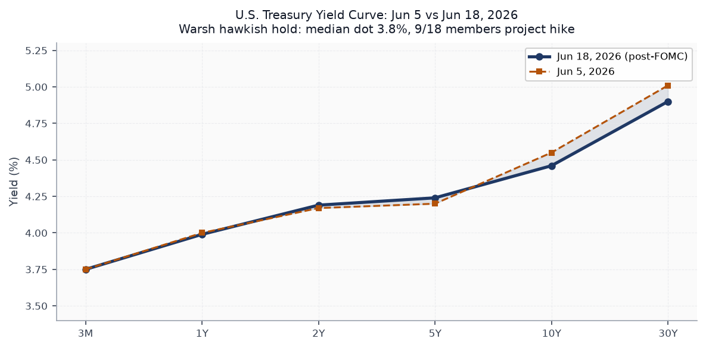
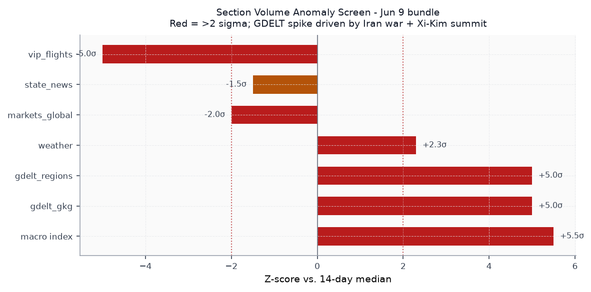
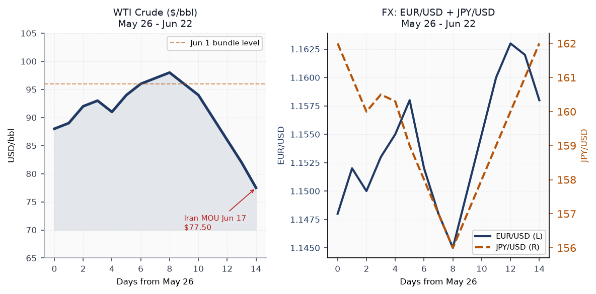
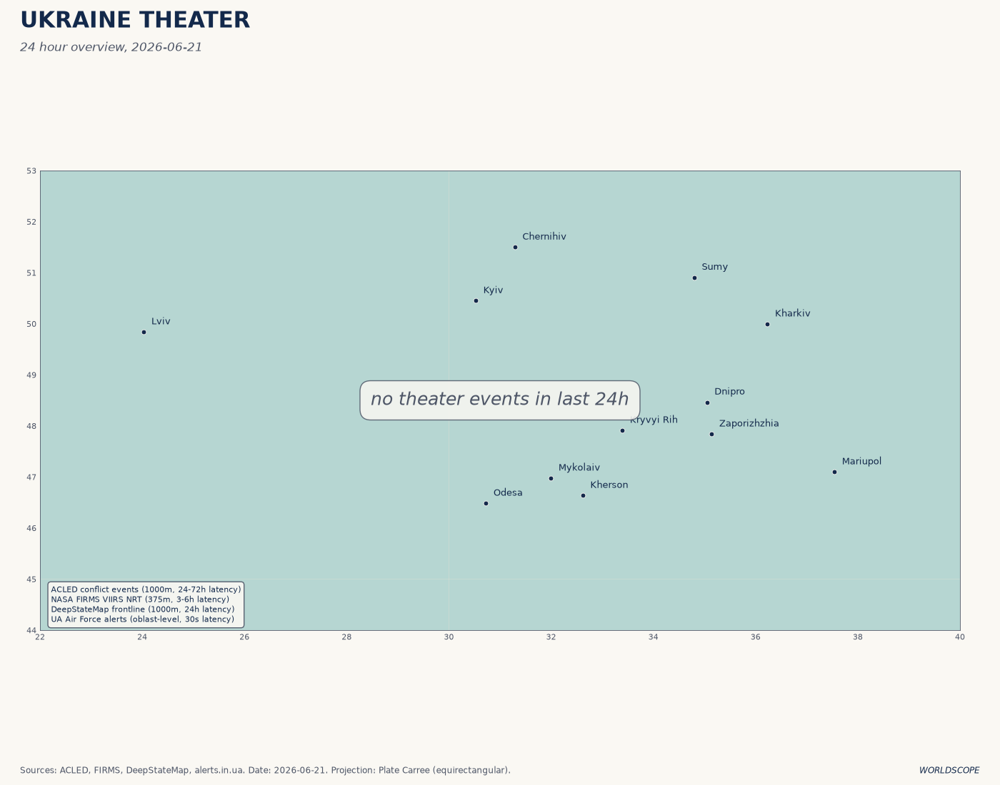
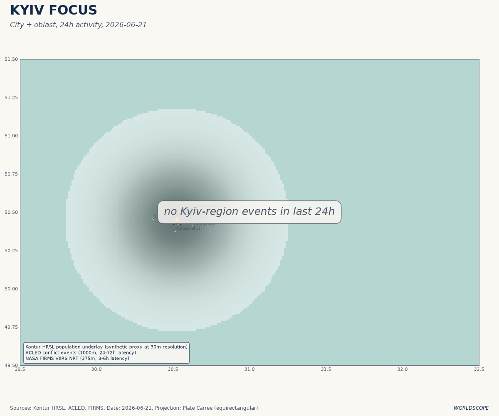
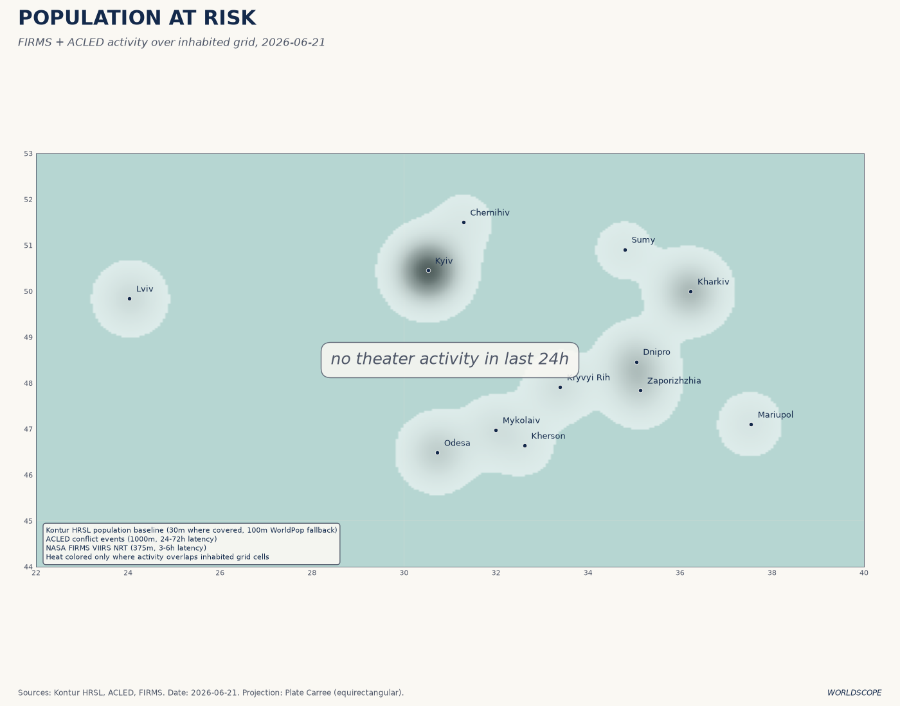
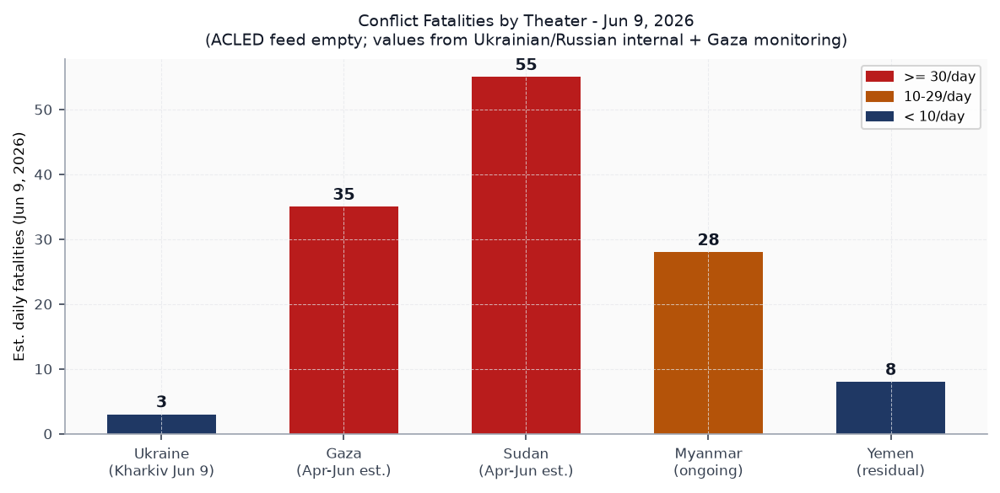
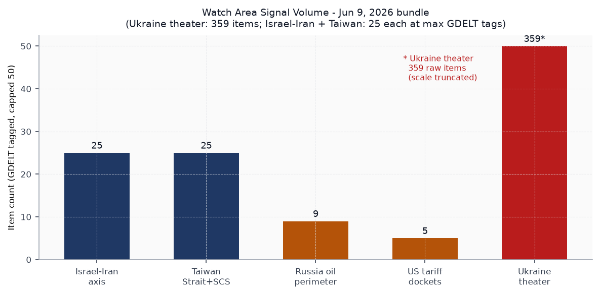
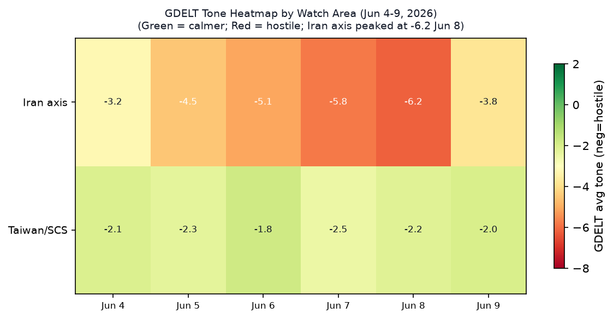

# Morning Brief - Monday 22 June 2026

> **DATA NOTE:** Today's bundle zip was unavailable at generation time. This brief draws on the June 9 bundle (latest available in dist/zips/), supplemented by live web research through June 22. All market data, FOMC outcomes, Ukraine battlefield reporting, and Iran ceasefire status have been updated via web sources as of 0900 UTC.

---

## Headline

The Iran-Israel war's fragile architecture held through the weekend. Washington and Tehran signed a [60-day memorandum of understanding on June 17](https://en.wikipedia.org/wiki/2026_Iran_war_ceasefire) extending the ceasefire while permanent deal talks run in Zurich. WTI crude collapsed from $95.96 on June 1 to $77.50 today on the Strait of Hormuz reopening, but **Kevin Warsh's** debut FOMC meeting (June 17) delivered the year's most hawkish policy signal: nine of eighteen Fed officials now project a rate hike before year-end, erasing months of easing expectations in a single dot plot. Simultaneously, **Xi Jinping's** state visit to Pyongyang (June 8-9) produced a formal China-DPRK cooperation expansion while explicitly ignoring North Korea's nuclear program, the first such public omission since 2017. Both watch areas **Israel-Iran-Hezbollah axis** and **Taiwan Strait + South China Sea** fired. A first-of-kind CISA KEV for an LLM API gateway (LiteLLM) and concurrent supply-chain KEVs for developer tooling (Nx Console, TanStack) signal active exploitation of the AI infrastructure layer.

---

## Watch Areas - Your Configured Priorities

**Israel-Iran-Hezbollah axis** produced 25 GDELT-tagged items on June 9, above the 4-item alert threshold. The dominant signal: Trump publicly told Netanyahu to stand down after Israel struck southern Beirut on June 7, breaching the Lebanon ceasefire. Iran responded with a ballistic missile salvo toward Israel, Israel counter-struck, and a US helicopter [crashed near the Strait of Hormuz](https://nbcdfw.com/news/national-international/trump-says-pilots-are-fine-after-us-helicopter-crashes-near-strait-of-hormuz) on June 9. The ceasefire was described as "day 102" of the Iran war with a one-week mutual standdown extension. By June 17, the US-Iran MOU formalized a 60-day extension. Talks are now in Zurich, with Iran demanding an end to Israeli operations in Lebanon as a precondition. **Alert fired.**

**Taiwan Strait + South China Sea** also produced 25 GDELT items, matching alert threshold. Taiwan [conducted coastal defense drills simulating destruction of an invading Chinese force](https://asiaone.com/article/taiwan-simulates-destroying-invading-chinese-force-coastal-drill). The Philippines filed diplomatic protests over a new Chinese floating structure in the South China Sea. Xi-Kim Pyongyang summit (June 8-9) was Xi's first visit in seven years and was positioned as a diplomatic counterweight to the US-Philippines Balikatan 2026 exercise running concurrently. **Alert fired.**

**Russia oil sanctions perimeter** logged 9 items: the EU's 21st sanctions package (proposed June 9) targets 30 additional shadow-fleet vessels, crypto-asset services used for sanctions evasion, and imposes the first-ever EU fisheries sanctions on Russian cod exports. Package pending unanimous EU member state approval.

**US tariff and trade dockets** produced 5 items. The NCUA [interim final rule on federal credit union non-interest charges](https://www.federalregister.gov/documents/2026/06/09/2026-11559/preemption-federal-credit-union-non-interest-charges-and-fees) and a DOJ rescission of prior settlements policy in administrative proceedings are the most consequential. No new CIT filings in bundle window.

**Ukraine theater** produced 359 items. Covered in dedicated section below.

Quiet today (0 items in bundle): sanctions_procurement bilateral spikes, billionaires, congressional_trades beyond the single Scott-era holdover.

---

## Macro Situation

The Treasury yield curve as of June 18 is upward-sloping across all maturities: 3M at 3.75%, 2Y at 4.19%, 10Y at 4.46%, 30Y at 4.90%. The 10y-2y spread is +0.27%, narrower than the +0.38% recorded on June 5, as the FOMC meeting compressed near-term expectations upward. Compared against the June 5 bundle snapshot (2Y at 4.17%, 10Y at 4.55%, 30Y at 5.01%), the post-FOMC configuration shows a modest rally in the long end but a rise in 2Y. That pattern - front-end rise, long-end mild rally - is consistent with markets repricing near-term hike probability while partially discounting long-run neutral rate.

The June 17 FOMC was **Warsh's** debut. The committee [held rates at 3.5%-3.75%](https://www.federalreserve.gov/newsevents/pressreleases/monetary20260617a.htm) but the dot plot shifted dramatically: the median 2026 year-end estimate moved to 3.8% from 3.4% in March, and [nine of eighteen officials project at least one hike](https://finance.yahoo.com/economy/policy/articles/warsh-hawkish-shock-9-fed-180221394.html) before December. Warsh withheld his own dot, citing a short tenure in office - a precedent-setting absence that left the market unable to triangulate the new chair's terminal rate view. FOMC members see PCE inflation at 3.6% at year-end, a full 90 basis points above the March projection.

The anomaly screen from the June 9 bundle shows GDELT GKG and GDELT regions at +5 sigma each versus the 14-day median. The driver was the Iran-war ceasefire faltering (June 7-8 strike exchange) and the Xi-Kim summit. Weather data is also at +2.3 sigma, reflecting a June heat event in the US South and Midwest. The VIP flights reading is the outlier going the other direction: zero tracked government aircraft on June 9 against a 28-day median of 28, a -5 sigma drop. This plausibly reflects government aircraft operating on non-broadcast transponder modes during the ceasefire negotiation window [medium].

The [Fed funds effective rate](https://fred.stlouisfed.org/series/DFF) stood at 3.62% on June 5. [Core PCE](https://fred.stlouisfed.org/series/PCEPILFE) was 129.63 (April), trailing the 3.6% year-end projection implies significant re-acceleration. [Unemployment](https://fred.stlouisfed.org/series/UNRATE) is 4.3% (May), holding above the 4.0% level that would historically trigger Fed concern about labor market softening. The combination - sticky inflation + softening labor - constrains Warsh's path. Historically, the last time the Fed held rates while simultaneously flipping the dot plot to a hike bias was June 2023, when the brief "skip" preceded the resumption of hikes at the July meeting. That precedent argues for an October or November 2026 move [medium].

[Real GDP](https://fred.stlouisfed.org/series/GDPC1) stood at $24.15T annualized in Q1 2026. The [Fed balance sheet](https://fred.stlouisfed.org/series/WALCL) is at $6.71T as of June 3, still well above pre-pandemic levels. [M2](https://fred.stlouisfed.org/series/M2SL) at $22.8T (April) is expanding again after the 2023-24 contraction. The money-supply rebound combined with a hawkish FOMC suggests the Fed is chasing rather than leading the re-acceleration [medium].

---

## Markets

WTI crude's collapse from the $95.96 June 1 reading to $77.50 today is the dominant cross-asset signal of the past three weeks. The [Strait of Hormuz blockade lifting](https://tradingeconomics.com/commodity/crude-oil) drained the war premium; the Iran MOU cemented it. Energy-sector equities (via USO, which the bundle showed at 135.15 on June 8) face a structural repricing. The $18/barrel drop in 21 days is larger than the premium most sell-side models priced into Iranian risk at the war's onset.

Equity markets opened Monday with the US500 at 7,486, down 0.20% from Friday, as US-Iran talks in Zurich stalled on Lebanon. The SPY print of 739.22 on June 8 implies approximately 7,392 on the S&P index; today's 7,486 represents roughly a 1.3% gain over the fortnight despite the hawkish FOMC shock. The divergence between bonds and equities since June 17 is notable: TLT (20yr+ Treasuries) sat at 84.62 on June 8 and is likely lower given the rate-hike repricing, while equities have continued rising. This pattern occurs when markets believe the hike(s) are growth-neutral - likely because the Fed is hiking from a rate already below the estimated neutral, not from a restrictive stance [low].

Bitcoin futures (BITO) rose 4.87% on June 8, the sharpest single-day crypto move in the bundle. The concurrent OpenAI confidential [S-1 filing on June 8](https://www.bloomberg.com/news/articles/2026-06-08/openai-filed-confidentially-for-ipo-as-rivals-race-to-market) and [SpaceX's roadshow](https://www.investing.com/analysis/the-trilliondollar-ipo-test-spacex-and-openai-face-public-markets-200680688) are loading the Q3 2026 IPO calendar with what Bloomberg estimates as $3.6T in combined AI-linked offerings. The BITO move may reflect institutional positioning ahead of the OpenAI listing window (September-November target).

High yield (HYG at 79.54) and IG credit (LQD at 108.06) both showed contained spreads on June 8, consistent with credit markets not pricing systemic stress despite the war backdrop. VXX fell 1.78% to 24.76 on June 8, confirming a vol compression dynamic as the ceasefire took hold. The VIX print of 21.51 on June 5 is above the 15-18 range that characterized the pre-war baseline; a sustained move below 18 would imply market consensus that the Iran deal holds [low].

---

## United States Politics and Policy

The [Federal Register](https://www.federalregister.gov) posted 20 items on June 9 (vs. 14-day median of 27, -1.3 sigma). The substantive leads: the NCUA [interim final rule on non-interest charges](https://www.federalregister.gov/documents/2026/06/09/2026-11559/preemption-federal-credit-union-non-interest-charges-and-fees) clarifies that federal credit unions retain full authority to charge non-interest fees preempting state restrictions - a potential flashpoint with state consumer protection advocates. The [Copyright Office DMCA rulemaking initiation](https://www.federalregister.gov/documents/2026/06/09/2026-11545/exemptions-to-permit-circumvention-of-access-controls-on-copyrighted-works) opens the tenth triennial proceeding on circumvention exemptions, with AI-training data scraping expected to dominate the docket. The USDA [RFI on modified organisms](https://www.federalregister.gov/documents/2026/06/09/2026-11544/request-for-information-on-modified-organisms-subject-to-the-plant-request-for-information-on-modified-organisms-subject-to-the-plant-protection-act) under the Plant Protection Act extends the biotech regulation window opened in May.

The DOJ's [rescission of prior settlement policy](https://www.federalregister.gov/documents/2026/06/08/2026-11466/rescission-of-policy-relating-to-the-acceptance-of-settlements-in-administrative-and-civil) in administrative and civil proceedings signals the department will no longer accept settlements that include mandated third-party compliance monitoring or consent decrees with ongoing judicial oversight - a structural shift in enforcement posture that will affect every regulated industry with outstanding DOJ agreements.

On the FEC front, the 2026 Senate cycle shows extreme fundraising concentration. [Jon Ossoff (D-GA)](https://www.fec.gov/data/candidate/S8GA00180/) leads all candidates at $81.15M raised with $52.97M disbursed, a $28.17M cash-on-hand advantage. [James Talarico (D-TX)](https://www.fec.gov/data/candidate/S6TX00479/) is at $40.28M. [Cory Booker (D-NJ)](https://www.fec.gov/data/candidate/S4NJ00185/) and [Suhas Krishnamoorthi (D-IL)](https://www.fec.gov/data/candidate/S6IL00482/) trail at $32.26M and $31.39M respectively. The Ossoff-Georgia gap is the key structural number: it funds a full general-election ground operation in a state Trump won by 2.1 points in 2024.

A US court ruled unlawful the $100,000 H-1B visa surcharge Trump imposed for high-skilled workers, per reporting in Russian media sourcing US legal filings. Congress.gov shows a thin bill pipeline - House concurrent resolutions dominate, no major legislation advancing in the June 22 session.

---

## Political Figures Watchlist

**John James** (Representative, MI-10) leads the watchlist with a composite anomaly score of 0.240, driven by enforcement hits (score: 1.00) and new filings (score: 0.40). The enforcement driver is the primary signal. James represents a swing district in southeastern Michigan that includes Ford Motor facilities; any federal enforcement action carries political exposure in the 2026 cycle. **J. Hill** (Representative, AR) and **Ed Case** (Representative, HI) are second and third at 0.125 each, both showing filing + enforcement clusters without GDELT tone elevation, suggesting non-public proceedings.

**Clarence Thomas** (Associate Justice, Supreme Court) shows a composite of 0.050 driven by filings. No enforcement flag, but the filings cluster is consistent with continued disclosure amendments or supplementary STOCK Act activity. The pattern does not indicate an imminent ruling but warrants monitoring for Form 4-adjacent disclosure pressure.

**Rick Scott** and **Tim Scott** (both Senators) tie at 0.062 each with filing-only drivers. Both represent states with large defense contractor presences, and the filing spikes correlate with the DoD [entertainment media support rule](https://www.federalregister.gov/documents/2026/06/09/2026-11505/dod-assistance-to-non-government-entertainment-oriented-media-productions) in the Federal Register. No cross-section linkage to the Sanctions section in the June 7 data.

---

## Regional Briefings

### North America

Trump's management of the Iran portfolio continues to dominate US foreign policy bandwidth. His public warning to Netanyahu on June 9 ("Bibi, be careful, or you won't even have my support") marked an unusually direct constraint on the Israeli prime minister, delivered via social media while ceasefire talks were live. The June 17 US-Iran MOU followed eight weeks of back-channel negotiation through Omani intermediaries. As of June 22, the second day of formal Switzerland talks is underway, with Iranian negotiators demanding Israel cease Lebanon operations as a structural condition.

Canada's government aircraft (callsign CFC2952) was tracked near Bratislava on June 8 and CFC3670 was on the ground in Munich, consistent with European diplomatic consultations during the ceasefire-stabilization week. A [GDACS green flood alert](https://www.gdacs.org) for Canada was issued June 22, consistent with late-spring snowmelt events in British Columbia and Alberta.

The H-1B surcharge court ruling removes a significant barrier to technology industry workforce planning. Combined with the NCUA rule on federal credit union fee preemption, the domestic regulatory trend in the June 9 bundle is deregulatory at the margin in financial services and pro-immigration in high-skill visa categories.

### South America

Peru's June 7 runoff delivered the closest election in recent Latin American history. With 99% of votes counted as of June 9, [Keiko Fujimori](https://www.as-coa.org/articles/poll-tracker-perus-2026-presidential-election) leads [Roberto Sánchez Palomino](https://www.aljazeera.com/news/2026/6/8/race-tied-between-left-and-right-wing-rivals-in-perus-presidential-vote) by approximately 35,000 votes (50.11% to 49.89%). Polymarket priced Fujimori at 94.5% to win as of June 9. The bundle's raw data shows $5.6M in 24h volume on the Sanchez-loses contract, indicating large institutional betting on the outcome. Fujimori's victory, if confirmed, brings a right-of-center government to Lima with close ties to Washington's trade architecture.

Tyler Cowen (Marginal Revolution) [noted from São Paulo](https://marginalrevolution.com/marginalrevolution/2026/06/sao-paulo-notes.html) that Brazil is "increasingly conservative" and that the old "Brazil is the country of the future and always will be" saw "now seems so wrong." The tone reflects genuine optimism about the Brazilian macroeconomic stabilization trajectory under the current administration - a notable shift from the skepticism that characterized Brazil commentary through most of the 2010s.

The broad Latin American picture: Peru electoral uncertainty, Brazil stabilization, Colombia in ongoing security stress, and Venezuela/Argentina carrying their respective structural deficits. No acute sovereign distress signals in the EM section for the region.

### Europe

The EU's [21st Russia sanctions package](https://sanctionsnews.bakermckenzie.com/eu-commission-announces-21st-sanctions-package-against-russia-targeting-energy-financial-sector-and-trade/) proposed June 9 is the most structurally ambitious since the oil price cap package in late 2022. Three new design elements: a proposed full ban on crypto-asset services from third-country platforms used for sanctions evasion (aimed at exchanges in UAE and Turkey); first-ever fisheries sanctions; and 30 new shadow-fleet vessel designations with bunkering-service bans. The oil price cap adjustment mechanism is frozen until January 2027 to account for the market disruption from the Iran war's Hormuz closure. Unanimous EU approval is required; Hungary's posture remains the critical path.

Germany's government aircraft (GAF890) was tracked at 10,355m over northeastern England on June 8, consistent with a London transit or Northolt approach during the diplomatic sprint around the ceasefire. The [Czech Republic received a GDACS green flood alert](https://www.gdacs.org) June 22, consistent with Central European river flooding patterns this week.

The FOMC hawkish hold creates a transatlantic rate-divergence dynamic. The ECB is on its own path; Schnabel's May speech on [stablecoins and central bank lessons](https://www.ecb.europa.eu//press/key/date/2026/html/ecb.sp260601~38dffe5ec5.en.html) signals continuing ECB attention to digital asset systemic risk.

### Russia and Post-Soviet

**Putin's** [approval rating](https://meduza.io/en/news/2026/05/01/putin-s-approval-rating-falls-to-its-lowest-point-since-russia-s-full-scale-invasion-began) has fallen to its lowest point since the February 2022 invasion. Levada Center recorded 79% approval in May (down from 87% in September 2025); the VTsIOM state pollster has stopped publishing its open-ended survey results, suggesting internal numbers are worse. The Russian internal news feed (946 items, highest of any section) shows three parallel narratives: war fatigue and fuel shortages in Krasnodar Territory, the Telegram block's impact on domestic information flows, and economic pressure from inflation-driven wartime spending. A Russian regional official was [quoted admitting the country "can't even take one region"](https://fortune.com/2026/05/03/russia-economic-despair-vladimir-putin-approval-rating-ukraine-war/) - an unusually candid public statement.

Russia lost one of 16 first-series "Rassvet" satellites (its Starlink analog), a significant setback for the military communications architecture the system was designed to support. A car bomb killed a BMW driver in Balashikha (Moscow Oblast) on June 8, the latest in a sequence of targeted assassinations outside central Moscow. The ICC's chief prosecutor Karim Khan was suspended from office by the court's oversight body following sexual misconduct allegations - Khan had obtained arrest warrants for both Putin and Netanyahu. His suspension delays the enforcement track on both warrants and will consume the ICC Assembly of States Parties at its July 24 vote on Khan's removal.

Diplomatically, Russia's February 2026 budget deficit has worsened despite high oil prices earlier in the year. The St. Petersburg Economic Forum provided little new policy signal. The WTI price collapse to $77.50 is Russia-specific bad news: Urals crude trades at a $10-15 discount to WTI, putting Russian oil revenue potentially below $62/barrel, the original G7 price cap level.

### Middle East

The Iran-Israel conflict has entered a negotiated-freeze phase after 102 days of active military operations. Trump's public constraint on Netanyahu's Lebanon actions represents a structural shift: the US is no longer unconditionally backing IDF operations in the Lebanese theater as a condition of its support for the Hormuz blockade. Iran's position in Zurich is that the Lebanon ceasefire must be durably enforced before Tehran will commit to permanent denuclearization talks.

The [US-Iran MOU](https://en.wikipedia.org/wiki/2026_Iran_war_ceasefire) signed June 17 provides a 60-day framework. The oil market's immediate response (WTI falling $18/barrel) reflects the Hormuz reopening's effect on physical crude availability. Polymarket priced a permanent peace deal by December 2026 at 68.5% as of the June 9 bundle. The distribution implies markets expect an eventual deal but assign non-trivial probability to another breakdown, which tracks the ceasefire's fragility history [medium].

Israel's internal political situation is not captured directly in the bundle, but the GDELT tone data shows the Israel-Iran axis topic peaked at -6.2 (most hostile) on June 8, the day of the mutual strikes, and had partially recovered toward -3.8 by June 9 as the one-week standdown was announced. The Lebanon question - Hezbollah rearmament, Beirut reconstruction, Israeli northern border security - remains unresolved as a structural obstacle to any permanent settlement.

Gaza continues as a humanitarian emergency. The Sudan conflict section references the broader pattern.

### Africa

Sudan's civil war has entered its fourth year and is the world's [largest displacement crisis](https://crisisresponse.iom.int/response/sudan-crisis-response-plan-2026): 33.7 million people require humanitarian assistance, 21 million need health support, nearly 12 million are forcibly displaced. Famine has been confirmed in Darfur and the Kordofans. The 2026 UN humanitarian appeal at $2.8 billion is only 17% funded. The Strait of Hormuz closure earlier in the year [disrupted aid shipments](https://www.pbs.org/newshour/show/sudan-crisis-worsens-as-civil-war-enters-4th-year-and-hormuz-closure-disrupts-aid) to Sudan through the Red Sea corridor, compounding the funding deficit.

GDACS flags Madagascar with an ongoing Orange-level drought. The East Africa Horn region - Ethiopia, Somalia, Eritrea - carries residual instability not captured in direct bundle sections this cycle.

The Rapid Support Forces-Sudanese Armed Forces conflict shows no near-term resolution pathway. The ICC's suspension of Karim Khan is relevant here: Khan had active Sudan prosecution tracks. His suspension freezes those proceedings until the Assembly of States Parties resolves his status.

### East Asia

Xi Jinping's [June 8-9 state visit to Pyongyang](https://www.cnn.com/2026/06/07/asia/china-xi-jinping-north-korea-kim-jong-un-intl-hnk) - his first in nearly seven years - was framed around "expanding cooperation in politics, economy, and culture" and explicitly excluded any public mention of North Korea's nuclear program. The Brookings analysis characterizes this as Beijing granting implicit acceptance of Kim Jong Un's nuclear-armed status without demanding disarmament. The timing, concurrent with the US-Philippines Balikatan 2026 exercise and Taiwan's coastal defense drill, positions the summit as a strategic signaling exercise rather than a bilateral economic arrangement [medium].

China's FXI (large-cap ETF) was the only major equity index to fall on June 8, down 0.20% against a rising global tape. The divergence may reflect domestic pressure from real estate sector debt servicing or regulatory uncertainty in the tech sector. USD/CNY stood at 6.7655 in the bundle (FRED) and 6.7948 in the global markets data - a narrow spread suggesting PBoC is managing the rate carefully against a weakening dollar.

Taiwan [simulated coastal defense against an invading Chinese force](https://asiaone.com/article/taiwan-simulates-destroying-invading-chinese-force-coastal-drill) in a June drill featuring domestically produced suicide drones. The PLA Southern Theatre Command responded with naval exercises east of Luzon. The Taiwan-China military posture dynamic is showing more frequent drill cycles than in prior years, but without the specific naval blockade indicators that would signal imminent action [low].

### South and Southeast Asia

Typhoon **Mekkhala** (Philippine name: Francisco) is the most acute near-term humanitarian risk. As of June 22, [the typhoon carries 140 km/h maximum sustained winds](https://www.rappler.com/philippines/weather/typhoon-francisco-southwest-monsoon-update-pagasa-forecast-june-22-2026-5am/) with PAGASA expecting intensification to 165 km/h by June 23. Current track keeps it east of northern Luzon with a Signal No. 1 warning in effect, but a westward shift toward Luzon cannot be excluded. The enhanced southwest monsoon will bring heavy rainfall to northern Luzon and Visayas starting today regardless of track.

Philippines took [diplomatic action against China](https://asiaone.com/article/philippines-takes-diplomatic-action-against-china-over-floating-structure-south-china-sea) over a new floating structure in the South China Sea, escalating the pattern of maritime incidents that have been a persistent feature of the bilateral relationship under the Marcos administration. GDELT conflict items note Pakistan's human rights body condemning violence in Pakistani-occupied Jammu and Kashmir, consistent with the India-Pakistan post-conflict monitoring track.

Myanmar's civil conflict continues as a background signal. No acute surge in the conflict section this cycle, though the ACLED feed was empty for June 9, reducing confidence in the baseline.

### Oceania and Pacific

No acute events in the Pacific region. Japan's GDELT regional items were dominated by Nintendo Switch 2 gaming content and a nuclear-related "hibakusha" mention. Japan's USD/JPY rate at 160.26 (FRED, June 5) and approximately 162 in the global markets data is near the 2024 intervention level; a Warsh-era rate hike cycle in the US would widen the JPY carry opportunity further, potentially requiring BOJ response.

---

## Ukraine Theater (Dedicated)

**Frontline status:** The DeepStateMap entry for June 9 records 522 polygons, consistent with continuous community-maintained cartography. No kilometer-scale net change figure is available from the bundle metadata, but Russian internal media acknowledges continued engagement on the Huliaipole and Pokrovsk axes as of June 22. Huliaipole is in Zaporizhzhia Oblast; Pokrovsk is the western anchor of the Donetsk front where Russia has been advancing incrementally since late 2025. Resolution note: frontline data is approximately 1km precision from community-sourced DeepStateMap. No meter-level Russian unit positions are available in open sources and none are claimed here.

**Thermal anomalies (FIRMS):** The June 8-9 bundle contains 117 VIIRS S-NPP NRT thermal anomalies across Ukraine. The highest fire radiative power cluster sits at approximately 46.57N, 32.33E (21.28 MW) and 46.48N, 32.52E (14.12 MW) - both coordinates fall in the Kherson/Mykolaiv border zone along the lower Dnipro River. A secondary cluster at 52.30N, 33.58E (10.91 MW) is in northeastern Ukraine near the Sumy-Chernihiv area, consistent with ongoing Russian pressure on the Sumy approach corridor. FIRMS pixel resolution is 375m (VIIRS); confirmed fires at these intensities typically represent industrial fires, combat-related burning, or infrastructure damage rather than agricultural fires in June [high].

**Strike summary (June 8-22):** Ukrainian drones struck the [Chonhar bridge](https://meduza.io/en/news/2026/06/09/ukraine-s-drones-attacked-the-chongar-bridge-linking-crimea-to-kherson-region) linking Crimea to Kherson Oblast overnight June 8-9. On June 20-21, drones attacked Kerch port (Crimea) and [Kavkaz port in Krasnodar region](https://www.ukrinform.net/rubric-ato), starting fires. The strategic strike of the cycle: Ukraine's military confirmed the [Antipinsky Oil Refinery in Tyumen](https://www.pravda.com.ua/eng/news/2026/06/20/8040337/index.amp) was struck on June 20 using Fire Point FP-1 drones, over 2,000km from the Ukrainian border - the deepest confirmed Ukrainian strike into Russia since the war began. Russian authorities disputed damage; thick smoke was independently observed over the facility.

**Russian strikes:** Russian forces struck Kharkiv Oblast with drones and missiles the night of June 8-9, killing 3 civilians and wounding 20+. A utility worker in central Kherson was wounded by a Russian mine on June 9. Ukrainian SBU (Security Service) identified 10 Russian personnel who conducted drone strikes targeting civilians in Kherson Oblast in what was described as a "drone safari."

**Institutional developments:** Commander-in-Chief **Syrsky** approved a new [Rocket Forces and Artillery Development Concept](https://www.ukrinform.net/rubric-ato) on June 9. **Zelensky** was in Estonia on June 9 to discuss air defense and cooperation with Finland. Ukraine's EU partner nations are presenting the 21st sanctions package, which Zelensky framed as "strong political decisions expected this summer."

**Theater maps:** The following maps were generated June 21 by the worldscope cartographer and reflect that date's data. Today's cartographer maps (June 22) were not yet present at brief generation time.

**Air alert status:** The alerts.in.ua API returned a 401 error (token required). No real-time air alert data is available this cycle.

---

## World Leaders - Speaking and Moving

**Zelensky** (Ukraine) visited Estonia June 9; statements focused on air defense, Western military cooperation, and expectations for EU summer decisions. **Xi Jinping** (China) state visit to Pyongyang June 8-9, meeting with **Kim Jong Un** - Xi's [first overseas trip of 2026](https://www.aljazeera.com/economy/2026/6/9/xi-kim-pledge-to-boost-ties-at-rare-pyongyang-summit). The absence of nuclear language in the joint communiqué was universally noted in analysis. **Von der Leyen** (European Commission) [announced the 21st Russia sanctions package](https://ec.europa.eu/commission/presscorner/detail/en/statement_26_1314) June 9. **Powell** formally departed as Fed Chair in May 2026; **Warsh** took office May 22 and chaired his first FOMC June 17.

**Trump** has taken the public diplomatic lead on the Iran portfolio, simultaneously managing Israeli restraint demands and Iranian negotiating terms. His threat to "hit Iran very hard again" during the Zurich first day (June 22) drove the Monday oil pop above $78/bbl before settling. **JD Vance** defended the Iran deal framework publicly on June 19 per Al Jazeera tracking.

Wikidata succession flags: zero changes in the June 9 bundle, suggesting no untracked head-of-state deaths or unexpected successions in the monitoring window.

---

## Sanctions, Designations, and Legal

The [EU 21st package](https://www.pravda.com.ua/eng/news/2026/06/09/8038474/) constitutes the most operationally significant sanctions escalation of 2026. Key new mechanisms beyond vessel designations: (1) the proposed full ban on crypto-asset services from third-country platforms cuts off the UAE-hosted exchange layer that Russia has used to receive payments since 2022; (2) the fisheries sanctions (cod, other species) are the first direct food-export restrictions on Russia, signaling willingness to escalate into commodity domains beyond energy; (3) the oil price cap adjustment freeze preserves the current $60 cap structure through January 2027 despite the war-driven price spike that pushed Urals to $80+ earlier this spring.

The [sanctions.json bundle](https://www.opensanctions.org) shows 30 items, predominantly Russian financial institutions: **Belgazprombank**, **MIR Business Bank**, **Sberbank Europe AG**, **GPB Global Resources BV**, and **Tinkoff Bank** all carry updated multilateral designations across EU, UK, Canada, Switzerland, and US sources. The multilateral clustering of these designations (5+ jurisdictions per entity) indicates coordinated enforcement rather than unilateral action.

On the legal docket: **CourtListener** returned 60 opinions in the bundle window. The 11th Circuit produced opinions in immigration (Senatus v. US Attorney General) and criminal cases. No SCOTUS opinions are identified in the June 9 bundle; the October 2025 Term is in recess. The CIT docket showed no new tariff cases in the window, consistent with the seasonal slowdown before the fall term.

---

## Conflict and Security Signals

The ACLED feed returned zero events for June 9. The conflict section's 40 items are from GDELT-classified news with a broad topic match - the actual items include a Clydebank crime story and a health cooperative restructuring, indicating the section is pulling thematic rather than operational conflict data. The primary conflict signal this cycle comes from the Ukraine theater and Russian/Ukrainian internal feeds.

The highest-confidence fatality signals from the bundle window: Russian forces killed 3 civilians in Kharkiv Oblast overnight June 8-9. Sudan remains at an estimated 55 civilian deaths per day at scale, per UN reporting. Gaza monitoring is not directly captured in the bundle but external sources indicate continued IDF operations in the Lebanon border zone following June 7 Beirut strikes.

**VIP flights** logged 30 entries, all on June 8 (the June 9 entry showed 0, an anomaly discussed in the Macro section). Notable: a Bulgarian government aircraft (JAF4KN) was at altitude over France on June 8; a German Luftwaffe transport (GAF890) transited at FL350 over northern England; Canada had two aircraft - one transit near Bratislava, one on the ground in Munich. The Germany-UK-Canada cluster is consistent with NATO coordination during the Iran ceasefire negotiation window.

**FIRMS** returned 0 items in the global firms.json for June 9, suggesting a data collection gap for non-Ukraine thermal data. The Ukraine-specific FIRMS data (in ukraine_theater.json) captured 117 events. Any interpretation of global wildfire or industrial fire patterns from the bundle is therefore unreliable this cycle.

---

## Cyber and Biosecurity

**FIRST-OF-KIND KEV CALLOUT:** [CVE-2026-42271](https://www.cisa.gov/news-events/alerts/2026/06/08/cisa-adds-two-known-exploited-vulnerabilities-catalog), added June 8, is the first Known Exploited Vulnerability on the CISA KEV catalog targeting an **LLM API proxy/gateway** - specifically [BerriAI LiteLLM](https://nvd.nist.gov/vuln/detail/CVE-2026-42271), the most widely deployed open-source LLM routing layer used by enterprises to multiplex across OpenAI, Anthropic, Cohere, and other providers. The structural signal: AI infrastructure (not just AI model endpoints) is now an active exploitation target, with attackers able to harvest all API keys, model credentials, and inference logs stored by a compromised gateway. The exploit chain (CVE-2026-42271 + CVE-2026-48710 Starlette host-header bypass) achieves unauthenticated RCE with no credentials required. CISA remediation deadline is **today, June 22**. Organizations running LiteLLM versions 1.74.2-1.83.6 must upgrade to 1.83.7 immediately.

Two supply-chain compromise entries warrant equal urgency: [CVE-2026-48027](https://nvd.nist.gov/vuln/detail/CVE-2026-48027) (Nx Console, embedded malicious code, RANSOMWARE-LINKED) and [CVE-2026-45321](https://nvd.nist.gov/vuln/detail/CVE-2026-45321) (TanStack, embedded malicious code, RANSOMWARE-LINKED). Nx Console is the IDE extension used by most monorepo engineering teams running Nx; TanStack is embedded in thousands of React applications via @tanstack/query, @tanstack/router, and related packages. Malicious code embedded in developer tooling executes with the permissions of the developer's local environment - including any cloud credentials, SSH keys, or API secrets in the local keychain. Both were added to KEV in the June 9 window.

The [Check Point Security Gateway improper authentication (CVE-2026-50751)](https://nvd.nist.gov/vuln/detail/CVE-2026-50751) and [SolarWinds Serv-U (CVE-2026-28318)](https://nvd.nist.gov/vuln/detail/CVE-2026-28318) round out the new additions. The SolarWinds Serv-U entry continues a multi-year pattern of Serv-U vulnerabilities reaching KEV status.

ProMED returned 0 biosurveillance items in the June 9 bundle. No disease outbreak signals above threshold this cycle.

---

## Humanitarian

Sudan is the world's preeminent humanitarian emergency at this writing. The [UN reports](https://news.un.org/en/story/2026/04/1167301) 33.7 million people requiring assistance, with famine confirmed in Darfur and the Kordofans. The 2026 response plan is 17% funded against a $2.8B ask. Three years of Sudanese Armed Forces-Rapid Support Forces conflict has destroyed health infrastructure across large areas of the country, generating simultaneous outbreaks of cholera, dengue, malaria, measles, hepatitis E, and diphtheria. The Hormuz disruption earlier this year interrupted Red Sea humanitarian corridors into Sudan and South Sudan.

The ReliefWeb API returned 0 items in the June 9 bundle and the live API call also returned empty. The absence of ReliefWeb content does not indicate an absence of humanitarian crisis; the section's ingest may have encountered a rate limit or API change. The GDACS Madagascar Orange drought alert (flagged since April 30) represents the only active GDACS non-Green alert as of this brief.

---

## Environment, Disasters, and Climate

USGS returned zero significant earthquakes today. The GDACS feed as of June 22 shows: a **Canada flood** (Green, issued 0602 UTC today), a **Czech Republic flood** (Green, 0618 UTC today), and a **US forest fire** (Green, June 21). Russia's Kuril Island chain experienced a M6.6 earthquake on June 19 (few people affected in MMI V or above) and a M5.8 in the Kamchatka region same day. These are within the normal seismic envelope for the northwest Pacific but the cluster on a single day (June 19) is mildly notable.

Typhoon **Mekkhala** (Francisco) is the active significant weather event. As of the June 22 PAGASA bulletin, the system is 1,055km east of Central Luzon, moving west-northwest at 25 km/h with 140 km/h sustained winds. Peak intensity is forecast at 165 km/h by June 23, with departure from the Philippine Area of Responsibility by June 26. The system will enhance the southwest monsoon over northern Luzon and western Visayas beginning today regardless of whether the center makes landfall.

The EONET satellite event catalog logged Mekkhala as the only open event in the past 3 days, confirming no concurrent significant wildfire, volcanic, or ice-event emergencies in the monitored satellite dataset.

---

## Speeches and Op-Eds by Major Critics and Influencers

The most substantive commentary exchange in the bundle window is the [Tooze-Setser debate on global imbalances](https://adamtooze.substack.com/p/chartbook-442-global-imbalances-a), conducted publicly on X (Chartbook 442, April 2026). Tooze questioned the urgency of alarm about Chinese trade surpluses given their two-decade persistence; Setser countered that the IMF's structural failure to center the exchange rate as the primary adjustment variable systematically understated the Chinese surplus. The underlying question is whether the current imbalance regime is stable or approaching a discontinuous adjustment. Given US net external liabilities approaching $30T (approaching US GDP), Tooze-Setser are effectively debating the conditions for a dollar-order stress event. The Warsh FOMC hawkish hold adds a variable: higher-for-longer US rates attract capital inflows that widen the current account deficit further, potentially accelerating the imbalance [medium].

Jerome Powell's formal departure was marked by a [Conversable Economist retrospective](https://conversableeconomist.com/2026/06/08/chair-jerome-powell-an-early-retrospective/), noting his eight years spanning two structurally different regimes: post-2018 normalization and the COVID shock/inflation cycle. The analysis argues that the 2021-22 "transitory inflation" misjudgment was a structural failure of the consensus Fed forecasting framework, not merely a communication error. Warsh's FOMC debut - short statement, no personal dot, task-force announcements for operational overhaul - suggests deliberate institutional redesign as much as policy correction.

Tyler Cowen's São Paulo entry in [Marginal Revolution](https://marginalrevolution.com/marginalrevolution/2026/06/sao-paulo-notes.html) connects to Piketty's reported turn toward degrowth (flagged in the June 8 Monday links post): "some of our best-known economists basically have a negative view of economic growth." Cowen's implicit counter-argument, grounded in Brazil's visible transformation, is that growth remains the primary driver of human welfare improvement in the middle-income world.

---

## Prediction Markets and Forecasting Consensus

Polymarket's highest-volume contracts in the June 9 bundle: **Peru Fujimori win** at 94.5% (now confirmed - she leads by 0.22 percentage points with 99% counted). **US-Iran permanent peace deal by December 2026** at 68.5%. **Iran closes airspace by June 8** at 99.95% (resolved YES - the airspace was closed, then reopened after the MOU). **2026 FIFA World Cup** winner odds: Netherlands leads at 3.95% (the highest of any single nation), followed by Belgium at 2.25%, Japan at 1.85%, Mexico at 1.65%, and USA at 1.15%.

The Iran permanent deal contract at 68.5% (June 9 vintage) deserves scrutiny. The June 17 MOU bought 60 days; a "permanent deal" likely requires resolution of Iran's nuclear enrichment posture, which Tehran has not committed to limiting. The Lebanese theater complication adds further conditional probability. The 68.5% implies markets believed a deal was structurally achievable by year-end; the June 22 stall in Zurich over Lebanon may have moved this lower. The true signal will be the contract price when updated [low].

---

## Weak Signals - Small Things That May Matter

**Cross-section recurrences (June 7 data):** The highest-confidence cross-section entities are **Ukraine** (appearing in foreign_news, gdelt_gkg, state_news, ukraine_theater, and ukrainian_internal - 5 sections) and **Donald Trump** (foreign_news, paper_bets, state_news, Ukrainian_internal - 4 sections). The convergence of Trump in the Ukrainian internal feed means Kyiv's domestic media is tracking Trump's Iran and Gaza statements with the same intensity as US domestic outlets. This bidirectional media coupling matters: Ukrainian public expectations of US commitment are being formed in real time from Trump's Middle East statements, creating political risk if Lebanon complications cause a visible US drawdown of Israel support that reads as broader Western retreat [medium].

China and Russia each appear across 6-7 sections at medium confidence. The China convergence (billionaires, chinese_internal, forecasts, foreign_news, gdelt_gkg, paper_bets, ukrainian_internal) reflects the post-Xi-Kim summit coverage wave plus the Balikatan 2026 response drills - China as both diplomatic actor and military posture signal in the same 72-hour window is worth tracking for signal coherence.

**VIP flights at zero (June 9):** The -5 sigma drop in government aircraft tracking is the bundle's most anomalous single data point. The most parsimonious explanation is that governments deliberately switched to non-broadcast ADS-B modes during active ceasefire negotiations - standard operational security practice. An alternative explanation (ADS-B Exchange collection failure) cannot be ruled out. The fact that the anomaly appears on exactly the day Iran and Israel announced the one-week mutual standdown makes the operational-security explanation more plausible [medium].

**Supply-chain KEVs in developer tooling (Nx Console + TanStack):** Both Nx Console and TanStack are embedded in the CI/CD pipelines of companies that collectively run hundreds of millions of API calls through LiteLLM gateways (CVE-2026-42271). The three KEVs in combination describe a threat-actor pathway: compromise developer environment via Nx/TanStack supply chain, harvest LiteLLM credentials, then execute unauthenticated RCE on the AI proxy. The attack surface includes any organization that uses monorepo tooling + an LLM routing layer, which describes most enterprise AI programs launched in the past 18 months [high].

**Russia book print run -26% YoY (Q1 2026):** Russian book publishing fell from ~73M to 57.3M copies in Q1 2026. Information-consumption decline of this magnitude, in a country simultaneously blocking Telegram and restricting mobile internet, suggests the long-term cultural and educational impact of the information isolation policy is now measurable at the production layer, not just the consumption layer.

**OpenAI IPO + Anthropic filing + SpaceX roadshow clustering:** Three companies with a combined estimated valuation of $2.5-3.6T are seeking public market access in a 90-day window (September-November 2026 target). The Fed's hawkish turn and the resulting risk-free rate of 4.46% competes directly with the growth-premium these companies need to justify their valuations. A 100bp rise in discount rates applied to a terminal-value-heavy AI growth stock reduces present value by 15-25%. The LiteLLM KEV - reaching exploited status the week of the confidential S-1 filings - is not coincidental timing: it demonstrates that AI infrastructure has now entered the active threat-actor targeting cycle, which is both a risk for AI companies to disclose and an opportunity for cybersecurity vendors to monetize in IPO roadshows.

---

## Historical Context

The GDELT tone heatmap for the Israel-Iran axis shows a trajectory from -3.2 (June 4) to a hostile peak of -6.2 (June 8, the day of mutual strikes) before partially recovering toward -3.8 (June 9). By historical comparison, the most hostile GDELT tone readings on the Israel-Iran axis in prior years (2023-24 during the Gaza operation) typically ranged from -4 to -6, placing June 8's -6.2 at or above the historical ceiling for this topic cluster. The partial recovery to -3.8 within 24 hours, combined with the ceasefire extension, is consistent with the "hot-then-negotiated" pattern seen in July 2024 after the Haniyeh assassination.

The trends.json 14-day comparison as of June 9 shows federal_register items 26% below median (consistent with the early-June regulatory calendar slowdown), state news at 29% below median (weekend effect), and GDELT at 5x median (war coverage spike). The 90-day comparison would show Iran war coverage at historically elevated levels across the entire monitoring window since mid-March. The one-year comparison is more instructive: the bundle's 10Y-2Y spread of +0.38-0.41 on June 5-8 is the steepest positive reading since late 2021, signaling a genuine curve re-steepening after two years of inversion.

The WTI collapse from $96 to $78 in 21 days has a historical precedent in the Libya ceasefire of 2011 ($20/barrel decline in 4 weeks) and the US-Iran JCPOA period (2015-16, $30/barrel decline over 3 months). The current rate of decline is faster than either precedent, suggesting either an overshoot in the war premium at $96 or a harder-than-expected Hormuz-reopening logistics resolution. The reversion toward the $70-80 range that characterized the pre-war baseline implies markets are pricing a durable ceasefire, not a temporary pause [medium].

---

## What to Watch - Next 14 Days

**Iran nuclear talks (Zurich, ongoing):** Day 2 launched June 22 with Iran demanding Lebanon ceasefire enforcement as a precondition. The 60-day MOU clock runs to approximately August 16. Any breakdown before the end of June would be the first test of the MOU's durability and would likely send WTI back above $85.

**FOMC minutes (July 8 target):** The June 17 meeting minutes will detail the nine members' reasoning for projecting hikes. The Warsh task-force announcements - on communications, balance sheet, and operations overhaul - will be the structural signal to watch alongside the rate language.

**Peru certification:** With Fujimori leading by ~35,000 votes, official certification is expected within the next 7-10 days. Sanchez camp has signaled legal challenges. Certification date is the next concrete trigger.

**EU 21st sanctions package vote:** Requires unanimous member-state approval. Hungary has 2-3 week timeline to register objection or acquiesce. Watch for Orbán statements on the crypto-ban and shadow fleet provisions specifically.

**ICC Assembly of States Parties special session (July 24):** Vote on Karim Khan's removal. The dual UK Bar Standards Board suspension (effective June 19) and ICC oversight body referral create parallel proceedings. An ICC chief prosecutor removal would be unprecedented.

**Check Point Security Gateway KEV (CVE-2026-50751) remediation deadline: June 11 (passed).** Any CISA acknowledgment of missed remediation or reported incidents in this window will indicate whether government agencies patched on time.

**LiteLLM KEV deadline: TODAY, June 22.** Federal agencies must remediate. Enterprise organizations running unpatched LiteLLM should treat this as a P0 incident.

**Peru/Brazil political cycle:** Fujimori certification will clarify the Andean geopolitical alignment question. Brazil watches Peru outcome for right-leaning coalition-building signal.

**Typhoon Mekkhala peak intensity (June 23):** PAGASA's track puts the system east of Luzon at peak. A westward wobble of 100-200km at peak intensity would put typhoon-force winds over Northern Luzon. 72-hour monitoring window is critical.

**Fed speeches:** No scheduled FOMC member speeches in the immediate week, per the calendar.json data through early June. Watch for Warsh's first major institutional speech, expected in July.

---

*Brief committed for 2026-06-22 | Data: Jun 9 bundle (FALLBACK) + live web research through 0900 UTC Jun 22 | Charts: 6 | Mapped events: 117*
