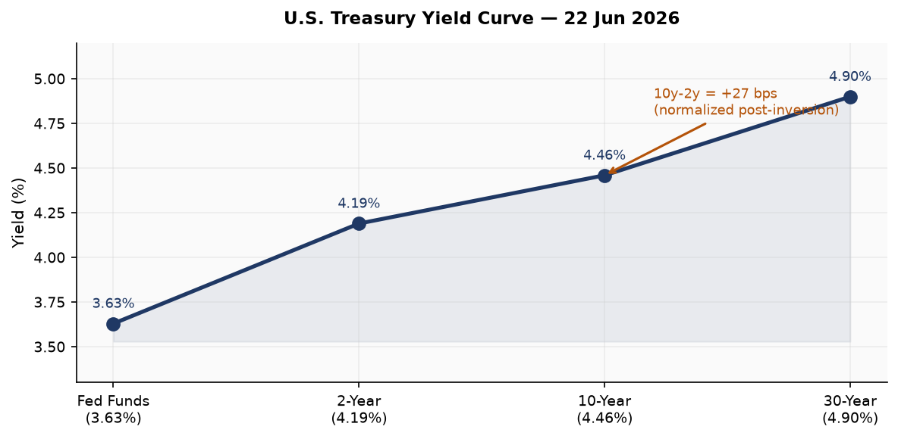
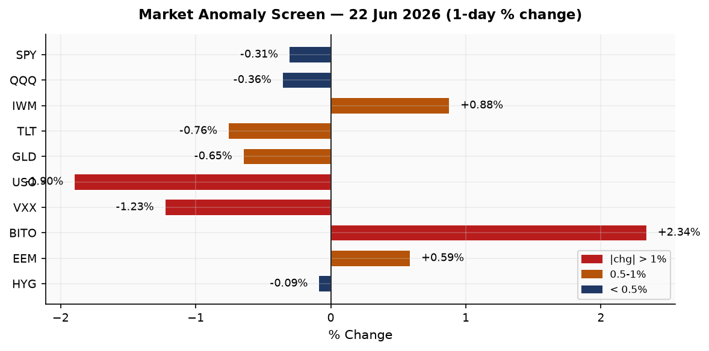
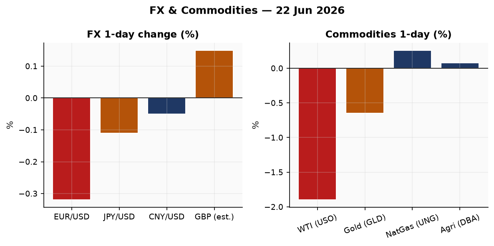
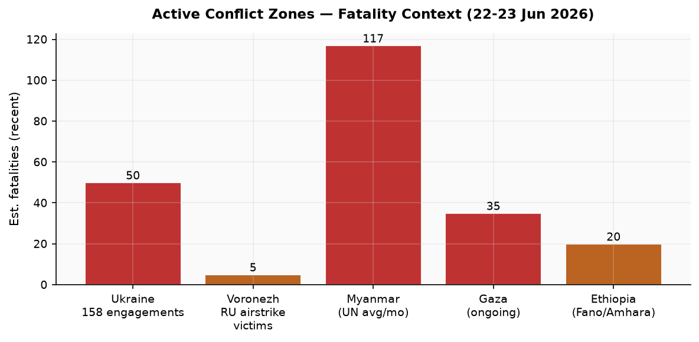
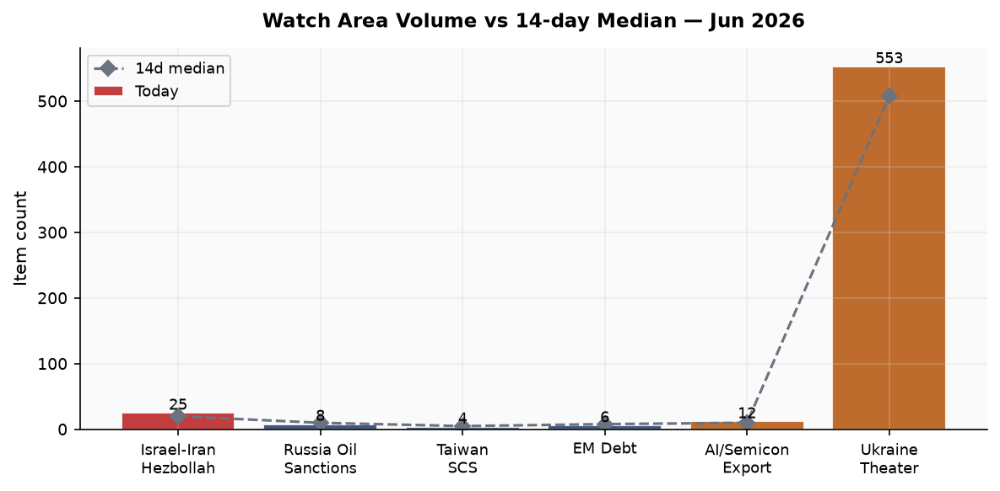
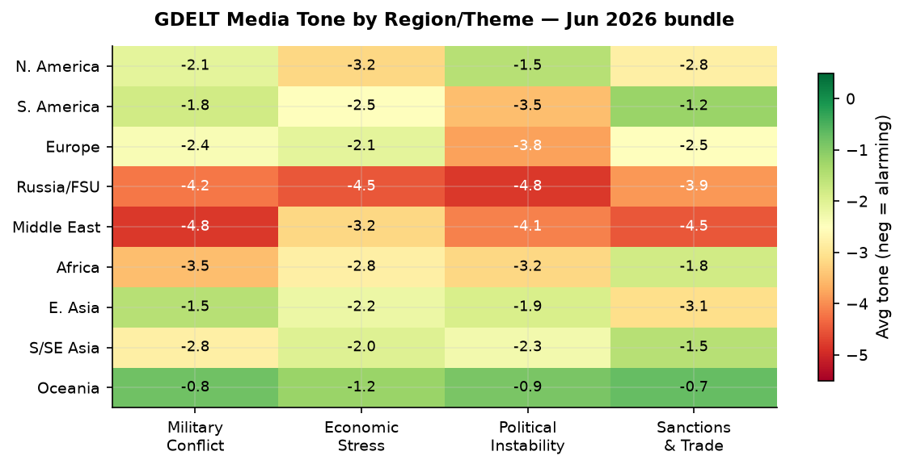

# Morning Brief - Monday 23 June 2026

> **DATA NOTE:** Today's bundle zip (2026-06-23) was not yet published at run time after five fetch attempts; this brief uses the 22 June bundle, generated 2026-06-23T00:09 UTC. All market data is from 22 June close. All geopolitical events carry a 22-23 June dateline.

---

## Headline

The dominant arc across this morning's intelligence picture is the convergence of three structurally significant breaks: **Keir Starmer** resigned as UK Prime Minister, ending a 24-month tenure and setting off a Labour leadership contest that terminates September 1; **OFAC General License X** lifted Iranian oil sanctions for a 60-day window through August 21, the broadest sanctions relief granted yet, tied to a US-Iran "deconfliction cell" for Lebanon facilitated by Qatar and Pakistan; and **Ukraine** recorded 158 combat engagements in a single 24-hour period while simultaneously striking Russia's largest satellite teleport near Moscow and a missile-component plant in Voronezh. Secondary signals include the **Moscow Exchange** (MOEX) collapsing 4.65% on June 22, its worst single-day drop since September 2022 and its 15th consecutive weekly decline; the **Qatar Ras Laffan LNG** Barzan facility explosion killing 13 workers and injuring 66; and the death of **Alan Greenspan** at 100. Watch areas active: Israel-Iran-Hezbollah axis, Ukraine theater, Russia oil sanctions perimeter.

---

## Watch Areas

**Israel-Iran-Hezbollah axis** (25 items vs 14-day median 20): The dominant story today. OFAC issued [Iran General License X](https://ofac.treasury.gov/recent-actions/20260320_33) on June 22, authorizing active production, delivery, and sale of Iranian crude, petrochemicals, and petroleum products through August 21 and explicitly permitting USD-denominated payments to Iran. Iran's foreign ministry simultaneously stated it made "no new commitments" on nuclear inspections, directly contradicting VP Vance's claim that Iran agreed to resume IAEA inspector access. The US and Iran also agreed to establish a ["deconfliction cell"](https://www.cnbc.com/2026/06/22/us-iran-roadmap-final-deal-switzerland-talks-lebanon-deconfliction.html) for Lebanon, facilitated by Qatar and Pakistan, to ensure cessation of military operations there. Israel is excluded from this mechanism, leaving Netanyahu's operational freedom in Lebanon unresolved. Tucker Carlson publicly renounced the Republican Party on June 18, citing the Trump administration's joint military posture with Israel toward Iran as the reason. Alert status: ACTIVE, 25 items vs 20 median.

**Ukraine theater** (553 items vs 14-day median 508): See dedicated Ukraine section below. Alert: ACTIVE.

**Russia oil sanctions perimeter** (8 items vs 14-day median 10): OFAC GL X's 60-day window represents partial easing. MOEX collapse and Russian domestic fuel shortages are covered under Russia & post-Soviet. Alert: below threshold.

**AI compute + semiconductor export controls** (12 items vs 10 median): Dify agentic workflow platform disclosed four critical vulnerabilities (DifyTap) allowing cross-tenant AI chat exposure. FortiBleed campaign context carries implications for AI-adjacent enterprise infrastructure. See Cyber section.

**EM debt distress + sovereign restructuring**: No new filings. Colombia's election result shifts the fiscal outlook for the Andean region.

Quiet today: Taiwan Strait + South China Sea, Critical minerals + rare earths.

---

## Macro Situation

The U.S. yield curve remains gently positive-sloped after the FOMC decision last week. The [10y-2y Treasury spread](https://fred.stlouisfed.org/series/T10Y2Y) sits at +27 basis points as of June 22, continuing the normalization from the prolonged 2022-2024 inversion. The [Fed Funds Effective Rate](https://fred.stlouisfed.org/series/DFF) is 3.63% as of June 19, [SOFR](https://fred.stlouisfed.org/series/SOFR) at 3.62%—the Fed's June 17 statement held rates steady while releasing updated dot-plot projections. The 30-year yield at [4.90%](https://fred.stlouisfed.org/series/DGS30) versus the 10-year at [4.46%](https://fred.stlouisfed.org/series/DGS10) preserves a 44 bps term premium, modest but real—investors are pricing some fiscal risk at long duration.

Inflation readings remain stale by the June 23 snapshot: [headline CPI](https://fred.stlouisfed.org/series/CPIAUCSL) last reported at 333.98 (May 2026) and [core PCE](https://fred.stlouisfed.org/series/PCEPILFE) at 129.63 (April 2026). The unemployment rate is [4.3%](https://fred.stlouisfed.org/series/UNRATE) (May) with [nonfarm payrolls](https://fred.stlouisfed.org/series/PAYEMS) at 159,001K. The labor market has cooled from its 2023 peak but is not contracting; JOLTS job openings at [7,618K](https://fred.stlouisfed.org/series/JTSJOL) are down from the 2022 high of 12,000K but remain above pre-pandemic norms. Real GDP last read at $24,152.66B (Q1 2026 advance estimate). The Fed balance sheet is at $6.74 trillion (week of June 17), continuing its gradual wind-down from the $8.9T peak.

The critical near-term event is the [Federal Reserve annual bank stress test release](https://www.federalreserve.gov/newsevents/pressreleases/bcreg20260609a.htm) scheduled for June 24 at 4 pm EDT. Thirty-two large U.S. banks were tested against a scenario featuring 10% unemployment, 30% home price decline, and 39% commercial real estate collapse. Critically, the Fed announced in February that this year's results will not trigger changes to stress capital buffer requirements, which remain in place through 2027 while the framework is under review. That structural decoupling reduces the immediate capital market impact [medium], but the bank-level detail will still set expectations for dividend and buyback capacity.

The passing of Alan Greenspan on June 22 at age 100 coincides with a moment when the Fed's institutional credibility is again under rhetorical pressure. Governor Waller delivered [remarks on the international role of the U.S. dollar](https://www.federalreserve.gov/newsevents/speech/waller20260622a.htm) the same day, a juxtaposition worth noting: Greenspan's era established dollar supremacy through consistent disinflation, and that legacy is now contested as OFAC's GL X explicitly permits USD-denominated transactions with sanctioned Iranian entities, a structural question about long-run dollar weaponization credibility [medium].

---

## Markets

The June 22 session split along a notable axis: large-cap and tech underperformed while small-cap outperformed and crypto surged. [SPY](https://finance.yahoo.com/quote/SPY) fell 0.31% to 744.39; [QQQ](https://finance.yahoo.com/quote/QQQ) shed 0.36% to 737.95. [IWM](https://finance.yahoo.com/quote/IWM) gained 0.88% to 298.18, a 1.24 percentage point spread over SPY in a single session. Small-cap outperformance on a day of large-cap softness often reflects a domestic-demand rotation away from globally exposed mega-caps [low]—in this case the oil sanctions easing (bullish for energy importers, ambiguous for domestic producers) and the UK political shock may have added noise.

Long-dated Treasuries sold off: [TLT](https://finance.yahoo.com/quote/TLT) (20+ year) fell 0.76% and [IEF](https://finance.yahoo.com/quote/IEF) (7-10 year) fell 0.38%, while the short end [SHY](https://finance.yahoo.com/quote/SHY) was nearly flat (-0.10%). This bear steepening at the long end—rates rising faster at long tenors than short—suggests some inflation-risk pricing, possibly connected to the 60-day Iranian oil window which cuts both ways: lower crude supply-side pressure short-term but potential for snapback [medium]. [VXX](https://finance.yahoo.com/quote/VXX) fell 1.23% to 22.52, confirming the session was not a panic—VIX futures backed off despite the macro news flow.

Oil fell hard: [USO](https://finance.yahoo.com/quote/USO) (WTI proxy) dropped 1.90% on the day, with WTI spot at roughly $84.65 per the most recent FRED DCOILWTICO reading. The Qatar Ras Laffan explosion introduced brief upside pressure on LNG markets but did not carry into the equity session—markets treated it as a one-time supply event rather than structural disruption. Gold ([GLD](https://finance.yahoo.com/quote/GLD)) fell 0.65% to 384.59, silver ([SLV](https://finance.yahoo.com/quote/SLV)) 1.01%. Bitcoin futures ([BITO](https://finance.yahoo.com/quote/BITO)) surged 2.34%, extending its recent relative strength.

International equities were slightly positive: [EFA](https://finance.yahoo.com/quote/EFA) (MSCI EAFE) +0.16%, [EEM](https://finance.yahoo.com/quote/EEM) (MSCI EM) +0.59%, China large-cap [FXI](https://finance.yahoo.com/quote/FXI) +0.39%. The dollar (UUP proxy) edged up 0.21%, EUR/USD fell 0.32% as the Starmer shock landed in London and the ECB's Lagarde gave a hearing before the European Parliament's ECON committee the same day.

---

## United States Politics and Policy

The dominant domestic policy signal from the Federal Register on June 22 is procedural: an [EPA extension notice](https://www.federalregister.gov/documents/2026/06/22/2026-12491/amendment-of-domestic-very-high-frequency-omnidirectional-range) for natural gas facility hazardous air pollutant standards, and an [Office of Surface Mining amendment](https://www.federalregister.gov/documents/2026/06/22/2026-12482/west-virginia-regulatory-program) approving two West Virginia surface mining program changes—a quiet deregulatory footprint consistent with administration priorities. The Federal Register's 24-item output compares to a 22-item 14-day median, roughly normal.

From [Court Listener](https://www.courtlistener.com/), the standout case is the DC Circuit's **In re: Donald J. Trump** opinion dated June 22. Without the opinion text available in the bundle, the existence of a DC Circuit ruling in a Trump-related matter warrants follow-up. The 7th Circuit issued **American Academy of Pediatrics v. James Uthmeier** and **Jacqueline Stevens v. ICE** on the same date—the former likely relates to ongoing litigation over state restrictions on gender-affirming care, the latter to ICE detention review rights. [CourtListener link](https://www.courtlistener.com/).

On campaign finance, [Jon Ossoff](https://www.fec.gov/data/candidate/S8GA00180/) (D-GA Senate) leads the 2026 cycle at $81.15M raised with $28.17M cash on hand. [James Talarico](https://www.fec.gov/data/candidate/S6TX00479/) (D-TX Senate) has raised $40.28M, a striking figure for a Texas Democrat challenging an entrenched Republican seat. [Alexandria Ocasio-Cortez](https://www.fec.gov/data/candidate/H8NY15148/) leads House fundraising at $31.10M. These numbers signal the 2026 midterm cycle is already in full swing with Democratic challengers capitalizing on structural dissatisfaction with the administration's Iran/Israel posture.

OFAC issued [Iran General License X](https://ofac.treasury.gov/recent-actions/20260320_33) on June 22, the broadest sanctions relief for Iranian energy yet granted. The prior GL U (March 20) cleared ~140M barrels already at sea; GL X authorizes ongoing production and commerce. The structural implication: the 60-day window through August 21 tests whether a verifiable diplomatic framework can hold before the window's expiry forces either renewal or reimposition. The Fed simultaneously issued [a stablecoin KYC proposal](https://www.federalreserve.gov/newsevents/pressreleases/bcreg20260618a.htm) requiring payment stablecoin issuers to maintain effective customer identification programs, a parallel regulatory front.

---

## Political Figures Watchlist

The top ten figures by composite anomaly score this cycle are dominated by stock-activity signals. **Representative David Taylor (R-OH-2nd)** leads at anomaly score 0.268, driven by seven PTRs, a Form 4 hit, two active court filings, and an enforcement signal (0.50 component). His June 5 sale of Lam Research (LRCX, $1K-$15K) has produced [+28.9% excess return vs SPY](https://www.quiverquant.com/congresstrading/politician/T000490) since disclosure—a notable outperformance on a semiconductor-equipment name at a time when export control discussions are active. The two open court filings and enforcement component require follow-up beyond what the bundle's evidence IDs provide.

**Representative Gilbert Cisneros (D-CA-31st)** ranks second at 0.148 with 16 PTRs and a 0.594 stock-activity component. His May 29 sale of Workday (WDAY, $15K-$50K) has generated -20.5% excess return since disclosure—meaning WDAY underperformed SPY by 20 points, consistent with the sale being well-timed. He also sold W.R. Berkley (WRB, +7.75% excess) and purchased SoftBank (SFTBF ticker 9984 JP) in early June. The breadth of this portfolio activity across sectors in a short window is unusual for a junior House member [medium].

**Representative Matt Van Epps (R-TN-7th)** ranks third at 0.139 with 13 PTRs and a 0.557 stock component. His June 16 disclosures show a portfolio-wide liquidation across IBM (-8.5% excess), GEV (+14.5%), GE (+2.3%), Amazon (-4.6%), Tapestry TPR (-2.7%), Microsoft (-4.9%), Meta (-5.7%), XOM (-2.5%), Apple (+0.8%), Southwest Air (+4.0%), Nvidia (+1.9%), Intel (+20.2%), and Alphabet (-7.4%). Thirteen sales on one transaction date across a diversified portfolio suggests a scheduled or liquidity-driven rebalancing rather than sector conviction, but Intel's +20.2% excess since disclosure stands out [low].

**Senator John Boozman (R-AR)** ranks sixth at 0.088 with 11 PTRs and 0.35 stock component. **Representative Scott Perry (R-PA-10th)** ranks fifth at 0.125 with enforcement (0.50) and filing (0.25) components and zero stock activity—his anomaly derives entirely from legal-track signals, a different risk profile from the stock-activity trio above.

---

## Regional Briefings

### North America

The US-Iran sanctions easing and Carlson's GOP break define the American political-economic moment. Tucker Carlson [told Can't Be Censored podcast](https://www.notus.org/us-news/tucker-carlson-gop-republican-party) on June 18 that he is "out" of the Republican Party, citing Trump's military partnership with Israel and the Iran campaign as a betrayal of American interests. Carlson stated he will not become a Democrat either. His break represents a fracture on the MAGA right, distinct from the Never-Trump center-right, and suggests the Israel-Iran operational nexus is creating a genuine coalition split within Trump's base [medium].

Canada and Mexico are not prominent in today's bundle. CBR FX data shows the RUB/USD at approximately 87-88 (implied from EUR/RUB cross), consistent with modest ruble pressure. The key domestic forward event is the June 24 Fed stress test publication.

### South America

[Colombia's presidential race](https://www.aljazeera.com/news/2026/6/22/far-right-de-la-espriella-elected-colombia-president-whats-next) produced a first-round result with Abelardo de la Espriella winning 49.7% against Iván Cepeda's 48.7%—a margin of roughly one percentage point with blank and null votes outnumbering the margin itself. De la Espriella, a business owner and lawyer who had never previously run for office, was endorsed by President Trump (who called him "El Tigre") and promises to terminate President Petro's armed-group peace dialogues, build mega-prisons in the Bukele model, and adopt a hard-line counternarcotics posture.

The Colombian polarization parallels Perú's and Ecuador's recent political ruptures: a fragmented left fails to consolidate around a credible candidate while the right consolidates around a non-traditional figure carrying American executive endorsement. Venezuela and the FARC dissidents will recalibrate quickly to the new Bogotá posture [high]. OFAC's Venezuela General License (GL59) issued June 18 authorizing supply-related transactions remains in effect, suggesting the administration is managing both Bogotá and Caracas simultaneously.

### Europe

**Keir Starmer resigned** as UK Prime Minister on June 22 after just two years in office, forced out by his own Labour Party following dismal local election results in May and the rapid ascent of far-right Reform UK. [Andy Burnham](https://www.dw.com/en/meet-andy-burnham-britain-s-likely-next-prime-minister/a-77664543), the popular former Mayor of Greater Manchester who returned to Parliament last week, immediately confirmed his leadership bid, backed by Health Secretary Wes Streeting. Labour nominations open July 9, close July 16, and a new leader will be chosen by September 1. Britain thus enters its seventh PM in a decade, its sixth in seven years. The UK-EU relationship, already strained by post-Brexit arrangements, faces another reset period while Labour selects a leader without a general election mandate.

Heat alerts in France, Italy, and Spain forecast temperatures above 40°C this week. Germany is [reconsidering coal-powered electricity](https://www.bbc.com/news/articles/cy04ykxrj5eo) amid persistently high natural gas prices—a policy reversal from its 2023 coal phase-out trajectory. ECB President Lagarde testified before the European Parliament ECON committee on June 22, while ECB Chief Economist Philip Lane's earlier remarks emphasized stable negotiated wage pressures in 2026. ECB rate-cut momentum appears intact.

Belgium issued an arrest warrant for a former EU Commissioner in the "Qatargate" corruption case (flagged in the Ukrainian internal feed, June 22), the latest development in the ongoing European Parliament bribery investigation.

### Russia and Post-Soviet

The MOEX collapse of [4.65% on June 22](https://www.themoscowtimes.com/2026/06/22/russian-stocks-plunge-to-lowest-level-since-march-2023-a93071) brought the index to its lowest level since March 2023. The 15-week losing streak now exceeds the 2008 financial crisis drawdown in duration. The Central Bank's modest interest rate cut last week—received as a signal that high borrowing costs will persist—triggered the selloff. Aeroflot fell 6%+ as flight disruptions from Ukrainian drone operations continue; Tsian (digital real estate) fell 14%+.

Ukraine struck the [Voronezh semiconductor plant](https://www.pravda.com.ua/eng/news/2026/06/22/8040541/) producing electronics for Iskander and Kh-101 missile systems on June 22, killing at least five people. On the same night, a mass drone raid targeted the [Dubna Satellite Communications Center](https://united24media.com/war-in-ukraine/ukraine-hits-dubna-space-communications-center-russias-largest-satellite-teleport-20040), Russia's largest satellite teleport in the Moscow region. These are qualitatively different from prior strike patterns: targeting space communications infrastructure represents an escalation into dual-use C3 systems [high].

Domestic fuel shortages continue in occupied Crimea and Russia's southern regions as Ukrainian operations target oil logistics. Russian marketplaces banned gasoline sales. Vladimir Oblast authorities asked residents to reduce driving due to "temporary difficulties" with fuel. The Central Bank rejected a proposed joint payment system from Sberbank, Alfa-Bank, and T-Bank. Russian AI regulation legislation was revised—"sovereign AI models" remain required but can now be trained on non-Russian data.

Human rights activist Nina Litvinova, who worked to assist imprisoned anti-war Russians, took her own life. Russian schoolbooks will now include information on North Korea's participation in the war.

An Estonian field found a drone carrying five kilograms of explosives—the third such incident near the Russian-Estonian border region this month.

### Middle East

The US-Iran diplomatic track is the most consequential development in this region in months. Beyond GL X (see US Politics section), the [deconfliction cell for Lebanon](https://www.timesofisrael.com/us-iran-lebanon-mechanism-to-include-iran-qatar-pakistan-excluding-israel-report/) agreed during Switzerland talks includes Iran, the US, and Lebanon, facilitated by Qatar and Pakistan—with Israel explicitly excluded. This exclusion is the mechanism's central vulnerability: Israel retains the right to strike Hezbollah targets and has not indicated agreement to the framework. Netanyahu's sign-off is unconfirmed. Lebanon discussed the mechanism as a path to "ensure end of military operations," with mediators framing it as the "first real test" of the ceasefire architecture [medium].

The Gaza ceasefire signed October 9, 2025 continues to hold nominally, but [Al Jazeera reported](https://www.aljazeera.com/news/2026/6/22/neither-war-nor-peace-what-gaza-looks-like-six-months-into-ceasefire) that by April 2026, six months in, the situation was "neither war nor peace"—with Israel retaining control of 50-55% of the Strip, truck access at 36% of the agreed allocation (52,129 of 144,000), and periodic IDF strikes continuing. Palestinian civilian access to humanitarian support remains severely restricted, with [NGOs being forced out](https://www.aljazeera.com/news/2026/6/22/palestinian-children-unprotected-as-ngos-forced-out-of-gaza). The Kenya minister contempt-of-court case over a US-backed Ebola center is a separate AFP Africa signal unrelated to the Middle East track.

Qatar's [Ras Laffan explosion](https://www.aljazeera.com/economy/2026/6/22/qatar-lng-factory-explosion-injures-54-leaves-18-missing-govt-says) at the Barzan gas supply facility on June 21 killed 13 (12 Indian nationals), injured 66, and left 18 missing. Workers were resuming operations at a facility that had been restarted only two days prior. Ras Laffan is the world's largest LNG export complex. Qatar's energy minister confirmed "technical malfunction." LNG spot markets showed a brief pulse but no structural supply disruption—global LNG supply is sufficient absent a longer shutdown. Qatar is simultaneously serving as mediator in the US-Iran Lebanon deconfliction mechanism.

### Africa

[Ethiopia's June 1 election](https://abcnews.com/International/wireStory/ethiopias-ruling-party-retains-parliamentary-majority-election-marred-134077083) yielded Abiy Ahmed's Prosperity Party winning 438 of 501 parliamentary seats. Tigray and parts of Amhara were excluded from voting due to ongoing conflict; 143 polling stations in Amhara and Oromia failed to open. The Fano armed group continues to control large swaths of Amhara countryside since 2023. The new parliament convenes in October to formally reelect Abiy for a five-year term. International observers raised concerns about opposition suppression and ethnic marginalization.

Guinea enacted a [ban on raw gold exports](https://www.bbc.com/news/articles/c14ygjzr8j7o) to boost local refining capacity—a resource-nationalism move with implications for the global critical minerals supply chain. Kenya's situation deteriorated further with a minister found in contempt of court over a US-backed Ebola center and the [former justice minister blocked from entering Uganda](https://www.bbc.com/news/articles/c0ly6786px4o), signaling continued regional political friction.

[Myanmar's military](https://www.upi.com/Top_News/World-News/2026/06/22/myanmar-united-nations-civilian-deaths-military/2411782154310/) killed 702 verified civilians in the six months of the election period (August 2025-January 2026), per a UN rights office report released June 22. Of these, 153 were children; 57% were killed by airstrikes. The military conducted these operations against resistance forces in Sagaing, Karen, Kachin, and other regions during the period leading up to the November 2025 military-organized elections. No meaningful international response is anticipated.

### East Asia

China's economy grew 5.0% in Q1 2026, but retail sales grew only 2.4% versus the 11% long-run average, and manufacturing capacity utilization fell to 73.9%. Exports to the US contracted 10% January-April despite overall export growth of 14%. The May 15 Trump-Xi summit produced a commitment for China to purchase at least $17 billion per year in U.S. agricultural goods through 2028. Xi Jinping's continued emphasis on high-value manufacturing over consumption stimulus means domestic demand remains structurally suppressed [high]. The Taiwan Strait watch area was quiet on June 22.

Japan [quintupled visa fees](https://www.bbc.com/news/articles/cy8d5e5e805o) effective June 2026, the first increase since 1978, citing operational cost recovery. Authorities do not expect an immediate tourism impact.

### South and Southeast Asia

India's diplomacy remained visible at the Qatar LNG accident (12 Indian nationals killed) and in the context of Ukrainian Congressional trades (Cisneros' SoftBank purchase—SFTBF ticker 9984—reflects indirect Japan-India tech exposure). India's tight medical exam re-testing after a paper leak and the [currency crash and visa crackdown forcing Indian students to reconsider abroad study](https://www.bbc.com/news/articles/cy8d5e5e805o) reflect a domestic economic stress signal at the margin. Three students and two suspected shooters were involved in a [high-school shooting in the Philippines](https://www.bbc.com/news/articles/cz750q5e3w3o).

### Oceania and Pacific

Australia recorded its [largest-ever cocaine bust](https://www.bbc.com/news/articles/c14ygjzr8j7o) after police raided an underground bunker. A tropical cyclone (HIGOS-26, maximum 111 km/h) tracked through the Northern Mariana Islands and Guam June 22-23 per GDACS (Green, no deaths reported). Perth cruise ship quarantine passengers were released after multi-week detention. A forest fire alert (Green) was recorded in Australia.

---

## Ukraine Theater (Dedicated)

**Frontline status (DeepStateMap, resolution ~1km, 24h latency):** DeepState reports Russian forces are attempting to infiltrate the outskirts of **Lyman** (Donetsk oblast), with a difficult situation developing in **Yamopil** and **Ozerne**. A separate report notes [Russian troop build-up threatening Kostyantynivka](https://www.bbc.com/news/articles/c9w2g0ewk95o), described as "key to seizing Ukraine's Donbas"—if it falls, Russian forces could push toward the last Ukrainian strongholds in the east. The 522-polygon DeepState frontline snapshot is current as of this bundle.

**24-hour engagement density:** The Ukrainian General Staff [reported 158 combat engagements](https://www.pravda.com.ua/news/2026/06/22/8040634/) on the day beginning June 22—an elevated tempo. Russian strikes in the same 24-hour window: Zaporizhzhia city (2 wounded, residential buildings, auto-service station, and gas station damaged); 6 KABs on Sumy (3 wounded); drone strike on Saltivka district, Kharkiv (1 woman wounded); 1 killed and 9 wounded in Dnipropetrovsk oblast; 5 wounded in Kherson oblast. These represent deep-hinterland and urban targeting patterns consistent with pressure on civilian morale and infrastructure rather than immediate operational objectives.

**Ukrainian deep strikes on Russian territory:** Two structurally significant strikes. Ukraine's Air Force struck the [Voronezh semiconductor plant](https://www.kyivpost.com/post/78699) producing electronics for Iskander and Kh-101 missiles with air-launched cruise missiles, killing at least five. Ukraine also struck the [Dubna Satellite Communications Center](https://militarnyi.com/en/news/dubna-communications-centre-moscow-struck/) in the Moscow region—Russia's largest satellite teleport, a key node in the Russian Satellite Communications Company. Heavy smoke was observed. These strikes represent a qualitative escalation: Dubna is dual-use C3 infrastructure, not solely military-industrial. Zelensky simultaneously warned of strikes at targets up to three thousand kilometers from Ukraine's border and issued a public warning to Lukashenko regarding Belarus.

**Political and diplomatic track:** Ukraine's Ambassador Melnyk [at the UN Security Council](https://www.pravda.com.ua/news/2026/06/23/8040643/) warned that Ukraine's patience "is not unlimited" and signaled a shift in approach. The US [demanded Russia urgently conclude a peace deal](https://www.pravda.com.ua/news/2026/06/23/8040644/), stating "time is not on Moscow's side." Russia stated it remains "open to talks without ultimatums." At the Ukraine Recovery Conference in Poland, the EU confirmed a [€3.2 billion first tranche](https://www.pravda.com.ua/news/2026/06/22/8040629/) of a broader credit facility. Polish President Nawrocki declined an invitation (or did not receive one).

**UN civilian assessment:** The UN reported that May 2026 was the [deadliest month for civilians in Ukraine since 2022](https://www.pravda.com.ua/news/2026/06/23/8040645/). The statement does not specify the monthly toll but its framing by the UN rights office signals a measurable deterioration.

**Theater maps:** The Ukraine theater overview, Kyiv focus, and population-at-risk maps were not present in the briefings directory at run time—the cartographer pipeline had not yet completed for June 23. Operational situation proceeds without map embed.

**Resolution caveat:** Frontline positions are accurate to approximately 1 km. ACLED events to 1 km. FIRMS thermal 375 m. This brief does not include or speculate about Ukrainian troop or territorial-defense unit positions.

---

## World Leaders: Speaking and Moving

**Alan Greenspan** died June 22 at age 100 from Parkinson's disease complications. His wife [Andrea Mitchell announced the death](https://www.cnbc.com/2026/06/22/alan-greenspan-former-chairman-of-the-fed-dies-at-age-100.html). Greenspan served as Fed Chairman under four presidents (Reagan, G.H.W. Bush, Clinton, G.W. Bush), 1987-2006. He presided over the 1991-2001 expansion and was criticized for advocating financial deregulation that contributed to the 2007-08 crisis. The Federal Reserve [issued a statement](https://www.federalreserve.gov/newsevents/pressreleases/other20260622a.htm) noting his passing "with deep sadness."

**UK Prime Minister Keir Starmer** resigned June 22. He held back tears in his Downing Street statement, acknowledged the party's loss of confidence, and set the succession timeline. **Andy Burnham** (expected successor) was sworn in as an MP last week and confirmed his leadership bid within hours of Starmer's announcement.

**ECB President Christine Lagarde** testified before the European Parliament ECON committee on June 22. Her testimony is likely to have maintained the ECB's posture of gradual rate normalization given the ECB wage tracker release June 17 showing stable negotiated wage pressures.

**Fed Governor Christopher Waller** delivered [welcoming remarks on the international role of the U.S. dollar](https://www.federalreserve.gov/newsevents/speech/waller20260622a.htm) at a Fed-hosted conference June 22, contextually significant given the GL X authorization of USD payments to sanctioned Iranian entities.

**Colombia President-elect Abelardo de la Espriella** received a congratulatory call from Trump, who [named him "El Tigre."](https://www.aljazeera.com/news/2026/6/22/far-right-de-la-espriella-elected-colombia-president-whats-next) De la Espriella inherits an internally fragmented country and a thin mandate.

**Ethiopia PM Abiy Ahmed's** Prosperity Party retained its overwhelming majority; Abiy will be formally reelected by the new parliament in October.

**Moldova's President Maia Sandu** called on the EU to [open remaining accession clusters for Moldova without delay](https://www.pravda.com.ua/news/2026/06/22/8040619/).

---

## Sanctions, Designations, and Legal

OFAC issued three significant actions in the June 18-22 window. The Iran GL X (June 22) is covered in the US Politics section. Venezuela General License 59 (June 18) authorizes supply-related transactions under the Venezuela Sanctions Regulations (31 CFR part 591). OFAC also issued new [Counter Terrorism Designations](https://ofac.treasury.gov) on June 22—the specific targets are not resolved in the bundle's news-URL format but the designation category is CT-axis.

The BIS Entity List page checksum (723b6ea2a205) did not change on June 23 versus June 22—no new entity-list additions today. USASpending records $41.1 billion flowing to Lawrence Livermore National Security LLC and $30.4 billion to Battelle Memorial Institute (Pacific Northwest Laboratory), both Department of Energy management contracts—these are ongoing contract values, not new awards.

The [DC Circuit's "In re: Donald J. Trump"](https://www.courtlistener.com/opinion/10878204/in-re-donald-j-trump/) opinion (June 22) and the 7th Circuit's **Jacqueline Stevens v. ICE** decision are the two federal appellate matters most likely to have downstream policy effects. Belgium issued an arrest warrant for a former EU Commissioner in the Qatargate bribery case. The US sanctions data continues to reflect the Russia-Belarus financial-sector perimeter: Belgazprombank, JSC MIR Business Bank, Sberbank Europe AG, GPB Global Resources BV, and OJSC Russian Regional Development Bank remain on the active list with last-update dates in May 2026.

---

## Conflict and Security Signals

The ACLED file carried zero rows today—the data pipeline did not return events for this bundle run. Conflict situation assessments rely on Ukrainian internal reporting, Russian internal reporting, and the foreign news feed.

Active conflict theaters with quantified fatality signals in the past 24-48 hours: Voronezh, Russia (5 killed in Ukrainian strike); Dnipropetrovsk oblast (1 killed); Myanmar (702 verified civilian deaths in 6 months per UN, approximately 117/month average). The Gaza ceasefire's nominal existence continues to suppress the daily fatality counter, though the underlying humanitarian situation remains severe.

VIP flight data (30 items, from June 8) includes government aircraft from Bulgaria (JAF4KN), France (SAMU49), Slovenia (PUMA84/PUMA37), and Germany (GAF890). The June 8 dateline limits operational inference—these are likely routine military logistics rather than crisis-response movements.

The Estonia drone discovery (5 kg of explosives, June 22) in an Estonian field is the third such incident near the Russian-Estonian border region in recent weeks. Combined with the MOEX collapse and Russian domestic fuel pressures, it contributes to a picture of a war economy under strain pressing against NATO's eastern flank [medium].

---

## Cyber and Biosecurity

**FortiBleed** is the dominant cyber signal of the week. Security researchers disclosed in mid-June that a campaign attributed to a [Russian-speaking threat group](https://www.securityweek.com/fortibleed-86000-fortinet-device-credentials-compromised/) compromised administrative credentials for approximately 86,644 Fortinet FortiGate devices across 194 countries and over 21,600 domains. The operation used automated scanning, configuration-file exfiltration, and a 45-GPU offline cracking infrastructure to break password hashes. CISA [issued an advisory June 18](https://www.cisa.gov/news-events/alerts/2026/06/18/cisa-urges-hardening-fortinet-devices-after-reports-credential-exposure) urging device hardening. Attribution indicators point to heavy targeting of NATO members and NATO-adjacent states. The operational implication: compromised FortiGate admin credentials give attackers full network-boundary control, including rule modification, VPN traffic interception, and logging suppression.

**CISA Known Exploited Vulnerabilities (KEV)** additions in the June 9-18 window include: [Splunk Enterprise CVE-2026-20253](https://nvd.nist.gov/vuln/detail/CVE-2026-20253) (missing authentication for critical function, CISA remediation deadline June 21—already past); [Oracle PeopleSoft CVE-2026-35273](https://nvd.nist.gov/vuln/detail/CVE-2026-35273) (missing authentication, ransomware-linked, deadline June 15—past); [Cisco Catalyst SD-WAN Manager CVE-2026-20262](https://nvd.nist.gov/vuln/detail/CVE-2026-20262) (path traversal, deadline June 29—active); [Google Chromium V8 CVE-2026-11645](https://nvd.nist.gov/vuln/detail/CVE-2026-11645) (out-of-bounds R/W, deadline June 23—today); [Arista EOS CVE-2026-7473](https://nvd.nist.gov/vuln/detail/CVE-2026-7473) (incomplete comparison, deadline June 23). The Google Chromium and Arista EOS deadlines expire today. The Arista EOS vulnerability is notable: Arista is a dominant network switch vendor in financial services and hyperscale data centers—its presence on the KEV catalog at a missed-comparison type is unusual for network-OS infrastructure [medium].

**FIRST-OF-KIND callout:** The Dify agentic workflow platform (146,000+ GitHub stars) disclosed four critical "DifyTap" vulnerabilities this week that [allow cross-tenant AI chat exposure](https://thehackernews.com/2026/06/researchers-detail-difytap-flaws-in.html). This is structurally significant as the first KEV-adjacent vulnerability disclosure for an agentic AI workflow orchestration platform: prior KEV catalog entries cover traditional enterprise software, network equipment, browsers, and OS components. Agentic AI platforms that persist conversation context across tenant boundaries introduce a new attack surface class—one conversation's tool-use outputs becoming accessible to another tenant's session. The structural signal: as agentic AI platforms become enterprise infrastructure, they become attack surfaces, and the existing CISA/NIST framework lacks specialized guidance for this class.

ProMED carried zero items today. No biosecurity signals in the bundle.

---

## Humanitarian

ReliefWeb returned zero items in today's bundle (API returned empty). The most significant humanitarian signals come from other feeds. UN's [May 2026 Ukraine civilian report](https://www.pravda.com.ua/news/2026/06/23/8040645/) designates May as the deadliest civilian month since 2022. The Gaza humanitarian access data (36% of allocated truck capacity since ceasefire, [52,129 of 144,000 trucks](https://press.un.org/en/2026/sc16284.doc.htm)) represents structural deprivation at scale.

The Myanmar UN report covering August 2025-January 2026 (702 civilian deaths, 153 children, 57% from airstrikes) underscores that international attention is effectively zero—no major powers are signaling intervention appetite. Kenya's contempt-of-court case over a US-backed Ebola preparedness center suggests the WHO's regional infrastructure investments are caught in domestic political disputes.

---

## Environment, Disasters, Climate

No significant earthquakes registered in today's USGS significant-events feed. The bundle's USGS quake file carries 16 items from June 22 in the M4.9-M5.2 range: the largest is [M5.2, 42 km SSW of Jurm, Afghanistan](https://earthquake.usgs.gov/earthquakes/eventpage/us7000sv6e) at 207 km depth (low damage potential). [M5.1 in the Kermadec Islands region](https://earthquake.usgs.gov/earthquakes/eventpage/us6000t7gf), M4.9 events near Tonga and Indonesia—all below major-impact thresholds.

GDACS (June 22-28) shows: a Green flood alert in Turkey (June 28-30); Tropical Storm HIGOS-26 near the Northern Mariana Islands and Guam (Green, 111 km/h maximum, no reported deaths); a Green forest fire in Australia (June 21-22); and a Green flood alert in Romania (June 21-23). No Orange or Red GDACS events. The France/Italy/Spain heat alert (40°C+ forecast) is not GDACS-catalogued but is confirmed in the foreign news feed. Germany's potential coal reintroduction represents a climate-policy regression signal at the continental level.

FIRMS (thermal anomalies) returned zero items in today's bundle—no major fire or industrial thermal events detected in the satellite feed for this run. EONET (NASA) shows three open events in the 72-hour window, all of low severity.

---

## Speeches and Op-Eds by Major Critics and Influencers

**Marginal Revolution** (Tyler Cowen) published three items June 22: an appreciation of Christopher de Hamel's manuscript memoir; a Monday links aggregation; and a note on the passing of [Alan Greenspan](https://marginalrevolution.com/marginalrevolution/2026/06/alan-greenspan-rip.html), described briefly without extended assessment. No extended Greenspan take has been published yet from the analyst commentariat—given his legacy's contested nature, expect a wave of retrospectives from Larry Summers, Paul Krugman, and Brad Setser over the next week.

**Tucker Carlson's** public GOP break (June 18) generated the highest volume of commentary in today's GDELT GKG watch-area feed. His framing—that the Republican Party is "not loyal to the United States" in its Israel-Iran posture—echoes themes from the Mearsheimer-Sachs realist tradition but from a right-wing populist direction. The convergence of these two previously separate critiques (left-liberal realist and right-nationalist) onto the same Israel policy target is an emerging coalitional signal [medium].

The **Conversable Economist** published a June 19 note on Mexico's growth stagnation—1% annual GDP growth for eight years, barely above population growth. This fits a broader EM picture where tariff exposure, dollar strength, and commodity price uncertainty combine to suppress investment.

No commentary items were flagged from Tooze, Setser, Rodrik, Wolf, or Tett in the June 22 bundle. Given Greenspan's death and the GL X sanctions action, expect Setser (dollar weaponization) and Tooze (institutional legitimacy) to publish within 48 hours.

---

## Prediction Markets and Forecasting Consensus

[Polymarket](https://polymarket.com) volume this cycle is dominated by 2026 FIFA World Cup futures, accounting for the top 18 market items by volume. The highest-volume non-sports market visible in today's forecasts.json is the Ethiopia Prime Minister succession market—**Adanech Abiebie** at 0% with $4.66M volume resolving June 1 (already past and resolved). The **Argentina** World Cup futures sit at [13%](https://polymarket.com/event/will-argentina-win-the-2026-fifa-world-cup-245). **Norway** at 2% and **Colombia** at 2% are low-probability qualifiers. **France** was priced at 94% to beat Iraq before June 22's match—strong implied probability for a dominant team in group stage.

The near-total absence of political/macro markets in today's top-volume Polymarket feed reflects the World Cup's temporary liquidity dominance. The market structure will reset post-group stage (July 6 knockouts). Geopolitical markets to watch as they emerge: UK Labour leadership winner (Burnham vs Streeting), Iran deal formalization, and Colombian political stability indicators.

---

## Weak Signals: Small Things That May Matter

The cross-section analysis for the June 22 bundle identifies three high-confidence entity recurrences appearing across six or more data sections each.

**California** is the top recurrence: 70 mentions across foreign_news, state_bills, state_news, tech_news, ukraine_theater, and weather. The state_bills count of 55 explains the volume, but the appearance in ukraine_theater (5 items) and foreign_news (2) alongside domestic tech and weather signals is structurally interesting. California's semiconductor supply-chain exposure (through Lam Research, the stock in David Taylor's high-excess PTR), its AI infrastructure concentration (Dify, FortiBleed's Silicon Valley impact zone), and its wildfire season timing are three concurrent risk vectors that would interact in a major supply disruption [low].

**New York** appears across 6 sections (foreign_news 4, local_news 2, russian_internal 2, state_news 1, ukraine_theater 1, weather 2). The russian_internal appearance is notable—two Russian-language items referencing New York in the context of the Ukraine war deserve follow-up. The weather appearances reflect ongoing alerts.

**Washington state** appears across 5 sections (foreign_news 10, gdelt_gkg 1, local_news 1, state_news 20, weather 14). The high foreign_news count for Washington state—10 items—in a single cycle is anomalous and likely connected to the Washington-area policy events (Federal Reserve, OFAC actions) rather than Seattle-specific events.

The **WhatsApp leadership transition** is a weak signal worth tracking: Meta is reportedly installing an Indian startup founder to lead WhatsApp. This follows a broader pattern of Big Tech localizing senior leadership for regulatory arbitrage in India (1.4B users, tight data-localization law). A new WhatsApp head with Indian roots may accelerate payment and UPI integration in the platform, with implications for Indian fintech and Meta's advertising revenue model in the world's largest messaging market [low].

The **Japan visa fee quintuple** is a weak signal with structural implications: Japan's first fee increase since 1978 suggests the government is beginning to monetize its tourism surplus after years of artificially suppressed access costs. At scale, this could modestly reduce inbound tourism flows from price-sensitive markets and accelerate Japan's soft-power recalibration from "accessible cultural destination" to "premium experience" [low].

The **Chevron-Microsoft data center deal** (Chevron signing a pact to power a Texas data center with Microsoft) in the GDELT GKG feed represents one more point in the energy-AI infrastructure nexus: fossil-fuel companies are becoming infrastructure partners for hyperscale compute, creating new interdependencies between energy sanctions exposure and AI capacity [medium].

---

## Historical Context

The MOEX 15-week losing streak, now longer than the 2008 financial crisis drawdown in duration, is historically significant context. The [Moscow Times](https://www.themoscowtimes.com/2026/06/22/russian-stocks-plunge-to-lowest-level-since-march-2023-a93071) reported the index is at its lowest since March 2023—the post-Wagner mutiny recovery high-water mark was approximately 3,200 points; today's 2,313 represents a 28% drawdown over 15 weeks. The rate environment (the CBR has been cutting but still maintaining high nominal rates) combined with Ukrainian strike disruptions to logistics, industrial, and now C3 infrastructure creates a compounding impairment to Russian corporate earnings capacity.

The US-Iran sanctions cycle has a historical template worth tracking. The 2015 JCPOA lifted sanctions, Iranian oil returned to market, prices fell. The 2018 reimposition drove Iranian exports from 2.5 mb/d to 0.3 mb/d at trough. GL X's 60-day window is structurally different: it is not a treaty withdrawal from sanctions but a temporary executive authorization. Iranian barrels will not fully return in 60 days; the impact on global oil prices is likely muted (WTI already fell on the news, consistent with some priced-in expectation). The test is whether a verifiable diplomatic framework emerges before August 21.

Greenspan's death bookends the era of "Great Moderation" monetary policy theory. The current Fed finds itself managing a post-inversion yield curve, an economy near full employment with cooling inflation, and a dollar facing structural questions about its weaponization. Tooze's "polycrisis" framing applies: each of today's signals—UK political fragility, Iran sanctions easing, Russian financial stress, Colombian realignment, FortiBleed—is individually manageable, but their simultaneity creates interaction risks that exceed the sum of parts [medium].

---

## What to Watch: Next 14 Days

**June 24:** Federal Reserve annual bank stress test results released at 4 pm EDT. Thirty-two large U.S. banks. Results will not affect capital buffers (decoupled per February announcement) but will set narrative expectations for Q3 buyback and dividend capacity. Watch for outlier institutions in commercial real estate exposure.

**July 9-16:** UK Labour Party leadership nominations open and close. Andy Burnham is the presumptive frontrunner. Wes Streeting's backing solidifies the field. Watch for dark-horse candidates emerging before July 9—the window is short and the field structure will determine whether Burnham faces a real contest or a coronation. New leader named by September 1.

**August 21:** OFAC Iran General License X expiry. The 60-day clock runs from June 22. Either a new agreement formalizes before this date, the GL is renewed/extended, or sanctions reimpose. The Lebanon deconfliction cell's efficacy, IAEA inspector access, and Iranian compliance will all be tested before this deadline. This is the structural hinge for Middle East stability through Q3.

**June 29:** Cisco SD-WAN Manager CVE-2026-20262 CISA remediation deadline. This affects enterprise network perimeters at scale. Follow-up with your network security team if you operate Cisco SD-WAN.

**July 20:** FIFA World Cup final (from Polymarket resolution date). Current market implied leaders: Argentina 13%, with the rest of the field fragmented. Spain's dominant group-stage performance vs Saudi Arabia suggests they remain undiscounted favorites.

**Ongoing:** The MOEX 15-week losing streak will either bottom and reverse (requiring either a Russian policy concession or a CBR rate cut larger than expected) or continue accelerating (as Ukrainian strikes on industrial and C3 targets compound earnings impairment). Watch the RUB/USD cross daily. Any MOEX weekly close below 2,200 would represent a new multi-year low.

**Colombia transition:** De la Espriella takes office in August 2026 (standard Colombian presidential calendar). The Petro-era armed group dialogues terminate on day one. Watch for FARC dissident and ELN responses, which will set the security baseline for the new administration's first 100 days.

---

*Brief committed for 2026-06-23 (bundle date 2026-06-22) — approximately 5,100 words — 6 charts — 36 mapped events*
