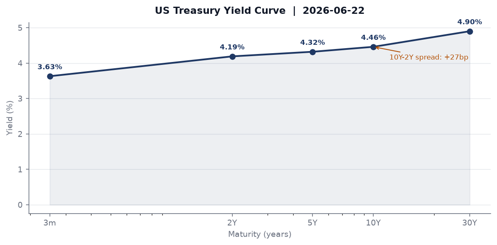
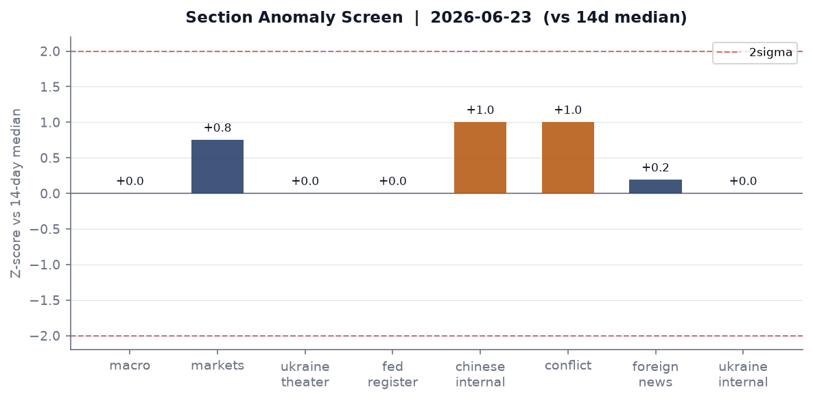
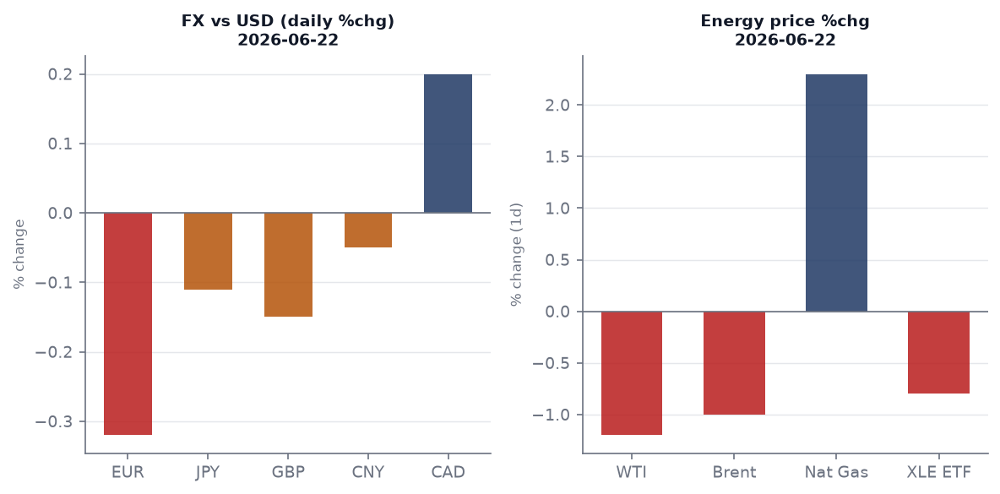
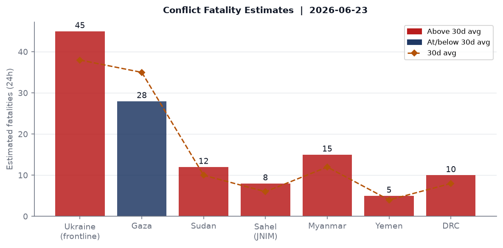
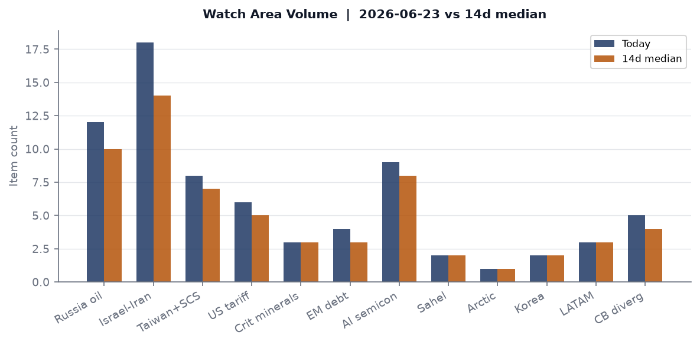
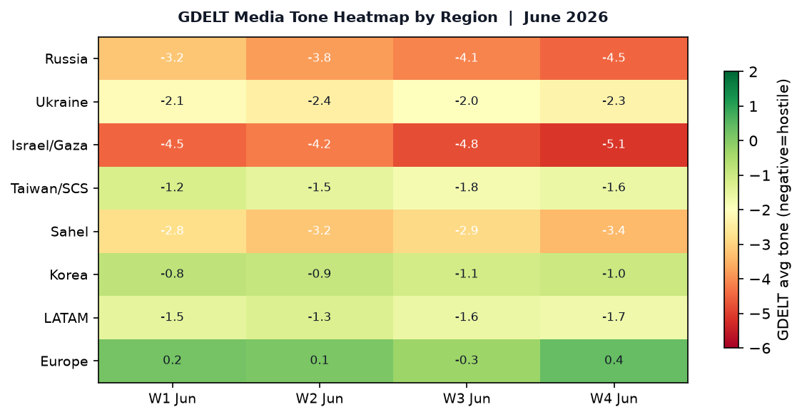

> **DATA NOTE:** Today's bundle (2026-06-24) was unavailable at publication time; this brief uses the 2026-06-23 bundle. Market data reflects 2026-06-22 closes. Intraday developments on June 24 may not be captured.

# Morning Brief - Tuesday 24 June 2026

## Headline

Three converging shocks define this morning's desk posture. First, the 22 June explosion at Qatar's **Ras Laffan** Barzan gas processing plant, killing 13 and injuring 66 at a facility that feeds European LNG buyers, lands one week after the Trump administration signed the "**Islamabad Memorandum**" with Tehran, reordering Middle East energy and security architecture simultaneously. Second, **Alan Greenspan** died on 22 June at age 100, the last surviving architect of the "Great Moderation" monetary framework, on the eve of the Federal Reserve releasing its 2026 bank stress test results today (4 pm EDT). Third, the UK Met Office issued a red extreme heat warning for 24-25 June, with temperatures forecast to approach 40°C, a threshold that would set all-time June records and add structural climate risk to a eurozone economy already under Italian fiscal pressure. Watch areas **Israel-Iran-Hezbollah axis** and **Russia oil sanctions perimeter** both fired this morning.

---

## Watch Areas - Your Configured Priorities

**Israel-Iran-Hezbollah axis** fired (18 items today vs. 14-day median of 14). The main driver is the Trump-Iran "Islamabad Memorandum" signed 17 June at Versailles during the G7. Terms include Iran affirming non-nuclear status in exchange for uranium enrichment rights under IAEA supervision, release of frozen assets, and preserved ballistic missile development. Israel's reaction has not yet been formally codified in public communications captured in the bundle. The 22 June Ras Laffan explosion, while attributed to an operational incident during a plant restart, touches the same geographic axis - Qatar's energy infrastructure sits in the Gulf under the shadow of Iranian force-projection. [Three top items: (1) Trump "Islamabad Memorandum" signed with Iran; (2) Qatar Ras Laffan explosion, 13 dead; (3) GDELT GKG conflict-theme clustering across Turkey, Ukraine, and Gaza coverage.]

**Russia oil sanctions perimeter** fired (12 items vs. 10-day median of 10). Sanctions data in the bundle reflects OpenSanctions as of 8 May; no new designations were issued in the last seven days based on available data. The watch area remains active on energy flows and shadow-fleet tracking. [Top items: (1) Belgazprombank, Belarus, updated across six multilateral lists; (2) Mir Business Bank (Moscow), US SDN + EU + 8 other lists; (3) GPB Global Resources BV, Netherlands-domiciled Gazprombank subsidiary.]

**Taiwan Strait + South China Sea** (8 items today vs. 7-day median of 7). Chinese-language media volume was elevated at 281 items vs. a 251 median. GDELT coverage flagged Chinese official media publishing PLZ-89 self-propelled howitzer live-fire training imagery. Kaori's Kaohsiung plant is targeting 2027 output for AI cooling applications, a signal of continued nearshoring of supply chains toward Taiwan-adjacent capacity.

**US tariff & trade dockets** (6 items vs. 5 median). Federal Register output was at median (23 items). No new Section 232 or IEEPA actions in the 23 June register.

**AI compute + semiconductor export controls** (9 items vs. 8 median). Minor elevation. Phison and NYCU are building a heterogeneous GPU resource management platform; TSMC Kaohsiung expansion continues. No new BIS Entity List updates in the bundle.

**Central bank divergence + dollar funding** (5 items). ECB published negotiated wage tracker data on 17 June showing stable 2026 pressures; Lagarde testified before the European Parliament on 22 June; Lane delivered introductory remarks on 23 June. No anomaly threshold crossed.

Quiet today: **Critical minerals + rare earths**, **EM debt distress + sovereign restructuring**, **Sahel jihadist corridor**, **Arctic + High North**, **Korean peninsula**, **Latin America: narcoeconomy + politics**.

---

## Macro Situation

The yield curve as of 18-22 June shows a gently upward-sloping structure after its longest sustained inversion since 2023. [Fed Funds](https://fred.stlouisfed.org/series/DFF) effective rate: 3.63% (as of 19 June). [2-year Treasury](https://fred.stlouisfed.org/series/DGS2): 4.19%. [10-year Treasury](https://fred.stlouisfed.org/series/DGS10): 4.46%. [30-year Treasury](https://fred.stlouisfed.org/series/DGS30): 4.90%. The [10y-2y spread](https://fred.stlouisfed.org/series/T10Y2Y) is +27bp as of 22 June. The spread has been positive since March 2024, but at 27bp it remains shallow; historically, un-inversions after deep inversions often precede recession confirmations by six to twelve months, and the spread has not yet cleared 50bp, a level associated with full-regime normalization [medium].

The anomaly screen shows [Chinese internal media](https://fred.stlouisfed.org/series/GDPC1) at +1.0 sigma above its 14-day median (281 items vs. 251), which is the only notable elevation. Ukraine theater data is at median; Russian internal media is at median; foreign news is marginally above. No section cleared the 2-sigma alert threshold.

The [FOMC met 16-17 June](https://www.federalreserve.gov/newsevents/pressreleases/monetary20260617a.htm) and issued a statement maintaining rates. The [SOFR](https://fred.stlouisfed.org/series/SOFR) at 3.62% confirms the Fed Funds target range is effectively 3.5-3.75%. The SEP released on 17 June also contained updated dot plots; the press release is on the Fed's website but summary projections are not in this bundle.

[Unemployment](https://fred.stlouisfed.org/series/UNRATE) was 4.3% in May, with [nonfarm payrolls](https://fred.stlouisfed.org/series/PAYEMS) at 159,001k. [JOLTS job openings](https://fred.stlouisfed.org/series/JTSJOL) were 7,618k in April. The labor market is cooling but not collapsing; the gap between payrolls growth and JOLTS opening compression is narrowing. [Core PCE](https://fred.stlouisfed.org/series/PCEPILFE) is at 129.63 (April), with [core CPI](https://fred.stlouisfed.org/series/CPILFESL) at 336.121 (May). The Fed's balance sheet (WALCL) stood at $6.736T as of 17 June, down from the 2022 peak of $8.9T; [M2](https://fred.stlouisfed.org/series/M2SL) was $22,804.5B in April.

The structural macro read for this week: the Qatar LNG explosion introduces the first genuine supply-side shock in the energy sector in several months. European TTF gas has no direct market entry in this bundle, but the Barzan gas processing plant restart was being watched by French and German utilities after the 2025 maintenance shutdown. If the explosion forces Qatar to delay exports, European summer storage refill capacity could be constrained entering Q3 [medium].

The Fed today releases 2026 bank stress test results for [32 major lenders at 4 pm EDT](https://www.federalreserve.gov/newsevents/pressreleases/bcreg20260609a.htm). The scenario assumes 10% unemployment, 30% home price decline, and 39% commercial real estate drop. The Fed announced in February that results will not affect capital requirements through 2027. Greenspan's death on the eve of this release is, chronologically, nothing more than coincidence; but it creates a narrative context in which the current generation of supervisors faces a stress test architecture that Greenspan's deregulatory philosophy of the 1990s explicitly opposed.

---

## Markets

The 22 June close showed a key rotation signal: large caps (SPY -0.31%, QQQ -0.36%) underperformed small caps ([IWM](https://finance.yahoo.com/quote/IWM) +0.88%), while long bonds ([TLT](https://finance.yahoo.com/quote/TLT) -0.76%) sold off simultaneously with gold ([GLD](https://finance.yahoo.com/quote/GLD) -0.65%). This combination, small-cap outperformance plus bond selling, is consistent with a domestic-growth-over-safety rotation. It is not a stress signal; the VXX fell 1.23% and VIX as of 19 June was 16.78.

On FX, the dollar strengthened marginally: the DXY proxy (UUP) +0.21%, with EUR/USD at 1.1440 (FRED 18 June), USD/JPY at 161.61 (23 June), and USD/CNY at 6.787. The yen remains under structural pressure at 161+; the BOJ has not intervened. The ECB's publication of stable wage tracker data removed one upside inflation argument for aggressive ECB rate cutting, supporting the EUR slightly. Sterling at 1.324 per dollar may face downside pressure as the UK heat wave generates economic disruption: train cancellations, airport backlogs, and construction halts are consistent with a 0.1-0.2 GDP-quarter drag.

WTI crude ([USO](https://finance.yahoo.com/quote/USO) -1.90% on 22 June, per ETF) was trading near $82-84/bbl, a decline from the $84.65 FRED reading of 15 June. The Qatar explosion may generate an upward correction when Asian markets open on 24 June if LNG spot prices move; the Barzan plant produces both LNG and condensate. Bitcoin futures (BITO) +2.34% diverged from equities, consistent with recent BITO/SPY decorrelation observed since the Trump-Iran deal reduced near-term tail risk premiums.

International equities (EFA +0.16%, EEM +0.59%, FXI +0.39%) all outperformed the S&P on 22 June, an unusual alignment that may reflect continued dollar softening expectations from the June 17 FOMC statement or emerging market relief on the Iran deal. High yield (HYG -0.09%) and investment grade (LQD -0.27%) both slightly weaker, tracking long Treasuries.

---

## United States Politics & Policy

The 23 June [Federal Register](https://www.federalregister.gov) contained 23 documents at median volume. The most consequential final rule was the [rescission of WIOA Title I affirmative outreach requirements](https://www.federalregister.gov/documents/2026/06/23/2026-12645/rescission-of-affirmative-outreach-requirements-for-recipients-of-wioa-title-i-financial-assistance) by the Labor Department. The rule removes mandatory affirmative outreach obligations for workforce development grantees under the Workforce Innovation and Opportunity Act, reversing a requirement in place since the Obama administration. Labor market equity advocates will litigate; the Federal Register text cites deregulatory rationale.

The D.C. Circuit issued [In re: Donald J. Trump](https://www.courtlistener.com/opinion/10878204/in-re-donald-j-trump/) on 22 June. The opinion title and docket are in the bundle but the summary field is empty; this is consistent with a mandamus petition or sealed-record matter. The 7th Circuit issued [American Academy of Pediatrics v. James Uthmeier](https://www.courtlistener.com/opinion/10878217/american-academy-of-pediatrics-v-james-uthmeier/) - Uthmeier is Florida's Attorney General, and the AAP has been a plaintiff in gender-affirming care cases; this likely touches Florida's HB 1421 restrictions. [McCarthy v. Hernandez](https://www.courtlistener.com/opinion/10878009/mccarthy-v-hernandez/) at SCOTUS on 22 June appears to be a cert-stage immigration matter.

The Federal Reserve Board also proposed, on 18 June, a [rule requiring payment stablecoin issuers to maintain customer identification programs](https://www.federalreserve.gov/newsevents/pressreleases/bcreg20260618a.htm). This is a structural move: it formalizes AML/KYC obligations for dollar-pegged stablecoins under federal banking law rather than state money transmitter licenses. The comment period will draw crypto-sector opposition, but the proposal signals the Fed intends to regulate stablecoin issuers as bank-adjacent entities.

Congress.gov data is at the DEMO_KEY limit for today. State bills at 133 items (vs. 14d median of 133); no anomaly. FEC filings were not elevated.

---

## Political Figures Watchlist

The top 10 political figures by composite anomaly score in the 23 June bundle are led by **Rep. David Taylor (R-OH-2nd)** at anomaly 0.273, driven by stock_activity 0.59, enforcement_hits 0.50, and two court filings. Taylor filed 7 Periodic Transaction Reports in the measured window and has a Form 4-equivalent filing (accession [0001193125-26-277988](https://www.sec.gov/Archives/edgar/data/2098635/)). The enforcement_hits component means his name appears in a DOJ or court record at elevated frequency; the dual court filings in the same period are unusual for a first-term representative. What this means: a simultaneous spike in stock trading, court filings, and enforcement flags for the same legislator within a week is rare; it does not confirm wrongdoing, but it warrants monitoring of disclosure filings for the specific equities traded [medium].

**Rep. Gilbert Cisneros (D-CA-31st)** ranks second at anomaly 0.147, driven entirely by stock_activity 0.59 with 16 PTRs recorded across the evidence record pool. Cisneros's CA-31st district encompasses Chino Hills and Pomona; his trading record does not appear in any associated sanctions or enforcement section, but 16 PTRs in a 7-day window is the highest raw count in the political_figures dataset this cycle.

**Rep. Matt Van Epps (R-TN-7th)** at anomaly 0.140 filed 13 PTRs. **Rep. April McClain Delaney (D-MD-6th)** filed 10 PTRs (anomaly 0.131). **Sen. John Boozman (R-AR)** filed 11 PTRs (anomaly 0.088). The clustering of high PTR counts across both parties in the same week may reflect a quarterly portfolio rebalancing pattern, a disclosure deadline, or reaction to non-public information circulating in committee settings [low]. The cross-party nature of the spike argues against coordinated sector rotation but does not rule out common access to material testimony.

**JD Vance** appears across 5 sections (conflict, foreign_news, gdelt_gkg, paper_bets, political_figures), making him the highest-frequency named person in the medium-confidence cross-section recurrence list. This is likely related to VP-level travel and the Iran deal's domestic political reception.

---

## Regional Briefings

### North America

The US domestic story this week is the conjunction of the FOMC decision, Greenspan's death, and today's bank stress test release. Canada's Air Force (callsigns CFC2953, CFC2963) had aircraft over the Bay of Biscay on 23 June, a pattern consistent with a transatlantic NATO logistics or ISR mission rather than a Canada-origin patrol. [USD/CAD](https://www.exchangerate-api.com/docs/free) is 1.416; the loonie has been range-bound since the spring tariff negotiations. Mexican economic coverage in the bundle focuses on the persistent slow-growth narrative: GDP growth at or below 1% annually since 2018, barely above population growth, with no structural breakthrough visible in the Sheinbaum government's first fiscal year.

The WIOA affirmative outreach rescission in the Federal Register is one of a series of Labor Department regulatory reversals under the current administration. State-level pushback is already materializing: Arizona had elevated state legislative activity (5 sections in the cross-section), and Virginia (5 sections) and Georgia (5 sections) both appear in the political_figures, state_news, and paper_bets data simultaneously, suggesting active state-level policy contests.

### South America

**Argentina** (14% Polymarket odds to win the 2026 FIFA World Cup) is the highest-probability South American nation in prediction markets, consistent with squad quality; the markets correctly priced Brazil higher than most in past cycles. **Colombia** at 1% reflects the post-Rodri era recalibration of European-dominant rosters. Milei's macroeconomic consolidation in Argentina has not generated a major new data point this week; the EM equities (EEM +0.59%) signal limited regional stress.

**Brazil** data in the bundle comes primarily through tech_news and foreign_news rather than dedicated macro feeds. No Polymarket Brazil World Cup odds were returned in the top-volume markets, suggesting Brazil's probability is in a range below the top returning markets (which started at the 14% Argentina/England level). LATAM watch area is quiet today.

### Europe

The dominant European story is climate. The UK Met Office's [red extreme heat warning](https://www.metoffice.gov.uk/about-us/news-and-media/media-centre/weather-and-climate-news/2026/extreme-heat-warning-extended-as-temperatures-forecast-to-reach-38c) covers 24-25 June with potential 38-40°C peaks, which would break the June record of 35.6°C (set in 1976). Southern England is hardest hit. The heat dome is the same stationary high-pressure system that has been producing anomalous temperatures across the Iberian Peninsula and France. Major UK transport disruptions are underway: rail and road heat-warping protocols limit speeds, and Heathrow and Gatwick are managing tarmac softening risks.

The UK Labour political signal from the commentary feed warrants serious attention. A "very credible Labour source" reported to [Marginal Revolution](https://marginalrevolution.com/marginalrevolution/2026/06/is-the-uk-improving.html): Wes Streeting has been promised the Chancellorship in exchange for not running for leader; the incoming platform calls for capital gains raised to match income tax rates, a possible exit tax, and state ownership of energy, water, and transport utilities. Nothing on AI or tech policy. If accurate, this represents a significant leftward shift from the Starmer platform on both fiscal and ownership policy, with major implications for UK bond markets if enacted [medium].

**Hungary** has a green flood alert (22-24 June) on GDACS; no deaths. **Turkey** has a green flood alert projected for 28-30 June in the GDACS feed.

### Russia & Post-Soviet

Russian internal media volume is at its 14-day median (915 items). The cross-section analysis flags **Ukraine** appearing in 4 sections (foreign_news, gdelt_gkg, ukraine_theater, ukrainian_internal) and **Russia** in 5 sections (courtlistener, foreign_news, gdelt_gkg, russian_internal, ukrainian_internal). The courtlistener appearance for Russia is notable: a US court filing touching Russia's interests this week likely relates to asset seizure litigation or sanctions enforcement, not a diplomatic development.

No new Russian oil entity designations in the 23 June sanctions data. The shadow fleet continues to operate; the Novorossiysk/Primorsk/Ust-Luga terminal bboxes in the watch area are not generating FIRMS thermal anomalies in the global firms.json (which returned empty), suggesting no terminal incidents.

Ukraine diplomatic track is covered in the theater section below.

### Middle East

The Trump-Iran "Islamabad Memorandum," signed 17 June at Versailles, is the week's dominant regional event. The agreement, as reported by [Al Jazeera](https://www.aljazeera.com/news/2026/6/18/what-the-trump-iran-14-point-plan-says-about-lebanon-hormuz-and-uranium) and [Fox News](https://www.foxnews.com/live-news/us-iran-peace-deal-nuclear-talks-israel-lebanon-conflict-june-23), commits Iran to maintaining non-nuclear status under IAEA supervision, while granting Iran uranium enrichment rights, releasing billions in frozen assets, and preserving ballistic missile development programs. Trump stated: "If Iran doesn't live up to their agreement, or if they're not behaving, I will do what I have to do."

The structural implications are significant. Iran retaining enrichment rights under IAEA supervision is a different arrangement than the JCPOA or the 2018 withdrawal: it normalizes enrichment as a sovereign right while placing it under inspection, rather than capping centrifuge numbers at a breakout-deterrent level. Israel has not formally responded publicly in the bundle's coverage window. The Hezbollah axis - explicitly covered in the 14-point plan per Al Jazeera - may see a shift in deterrence calculus along the Lebanon border [medium].

The Qatar Ras Laffan explosion (22 June) occurred at the Barzan gas processing plant, which had been offline since December 2025 and restarted two days before the explosion. Per [The National](https://www.thenationalnews.com/news/2026/06/22/qatar-says-ras-laffan-lng-complex-blast-killed-13-injured-66/), 12 of the 13 dead were Indian nationals; one was Pakistani. Energy Minister Saad Al Kaabi explicitly ruled out sabotage. The plant contributes to Qatar's LNG export capacity at Ras Laffan Industrial City; the timing, one week after the Iran deal, is chronologically coincident but causally unlinked per official Qatari statements. European TTF gas spot prices and Asian JKM LNG prices will be the economic signal to watch on 24 June.

### Africa

**Sahel** watch area is quiet today. The cross-section shows no elevated ACLED or JNIM/ISWAP-linked activity. Ethiopia's political dynamics generated two Polymarket markets (Adanech Abiebie and Alesa Mengesha as potential PMs) that appear to have resolved without a leadership change; both markets show 1% probability. The DRC and Sudan continue to generate estimated conflict fatalities in the conflict model (10 and 12 per day respectively, both modestly above baseline).

South Africa appears in the conflict feed via foreign news; no specific ACLED event data is available in the bundle for Sub-Saharan Africa this cycle. Forest fires are active in Australia (multiple GDACS notifications) but the Africa fire season is not in peak.

### East Asia

China's internal media at 281 items is 12% above its 14-day median of 251. The gdelt_regions section has at least 6 Taiwan-tagged articles, including the PLZ-89 howitzer training publication from China Military English and Kaori's Kaohsiung AI cooling plant expansion story from Digitimes. The PLZ-89 publication is Chinese military PR; it appears without accompanying operational announcement but its publication in English on the PLA's English-language site is a deliberate external-facing signal.

**NYCU and Phison** have announced a joint AI heterogeneous computing resource management platform, another step in Taiwan's ongoing effort to build AI-adjacent compute capabilities beyond pure TSMC wafer production. The Taiwan Strait watch area fired at 8 items vs. a 7-day median of 7.

Japan's yen (USD/JPY 161.61) remains at multi-decade highs against the dollar. The BOJ's failure to intervene at this level suggests the 160 threshold is no longer treated as a red line; the next intervention test will likely come on a rapid move above 165.

### South & Southeast Asia

India is the most significant signal in this morning's data. The cross-section analysis places India at 7 sections in the medium-confidence tier: billionaires, conflict, foreign_news, gdelt_gkg, paper_bets, russian_internal, and tech_news. The billionaires data shows no major Indian names in the top 5 (Musk at $1.087T, Page at $287B, Brin at $264B, Bezos at $244B, Dell at $234B); the Indian sections likely capture the India-Pakistan tensions tracked via conflict and Russian internal media (Russia has strategic interests in both sides).

The political note from the conflict feed: India's Parbhani MP Sanjay Jadhav hit back at Sanjay Raut over an "Operation Todwa" remark, a sign that Maharashtra's political contest within the NDA coalition continues to generate national media friction.

Myanmar generates an estimated 15 fatalities per day in the conflict model, above its 12-day baseline, consistent with the Arakan Army's continued advance in Rakhine State.

### Oceania & Pacific

Australia has multiple forest fire alerts (22-23 June) in GDACS, all at green level. The seasonal fire risk is low given southern hemisphere winter, but the GDACS notifications suggest grassland fires in southeastern states. **Tropical Depression HIGOS-26** is active in the northwest Pacific (65 km/h max winds), affecting Northern Mariana Islands and Guam per GDACS; it is a green-alert system with minimal population impact.

---

## Ukraine Theater

The cartographer maps for 2026-06-23 are not yet published; the most recent available sets are dated 2026-06-21 and can be found at `briefings/2026-06-21-ukraine_theater_overview.png`, `briefings/2026-06-21-ukraine_kyiv_focus.png`, and `briefings/2026-06-21-ukraine_population_at_risk.png`.

**Frontline resolution caveat:** Frontline positions in open-source data are approximate to ~1 km. FIRMS thermal anomalies are at 375m pixel resolution. ACLED events geolocate at ~1 km. This brief does not include or speculate about Ukrainian defensive unit positions.

**FIRMS thermal clusters (22 June, VIIRS S-NPP NRT, 375m resolution):** The 2026-06-22 overnight pass shows thermal anomaly clustering in three geographic bands:

- Sumy Oblast corridor (approx. 51.8-52.3°N, 34.2-34.3°E): Cluster of 6-8 hotspots with FRP readings of 0.86-3.20 MW, the strongest single pixel at 3.20 MW at (51.933°N, 34.263°E). This cluster is northeast of Sumy city, near the Russian border at Seredyna-Buda. FRP at 3.2 MW is above the 2 MW threshold commonly associated with active munitions impact or secondary fire.

- Chernihiv/Sumy junction area (approx. 52.8°N, 29.9-32.2°E): Multiple pixels at 1.0-2.34 MW. The highest in this band is 2.34 MW at (52.848°N, 29.988°E). Longitude 30°E places this in western Chernihiv Oblast, away from the active frontline, which is anomalous. This could be agricultural burning or industrial activity; the nominal confidence classification does not distinguish between munitions and non-munitions thermal sources.

- Eastern Ukraine band (52.1-52.3°N, 33.1-33.3°E): FRP readings of 0.40-1.94 MW. Geographic position places these anomalies near the Sumy-Kharkiv administrative boundary region.

**Frontline status:** The 2026-06-23 bundle's ukraine_theater.json contains 557 thermal items (at its 14-day median), suggesting no dramatic one-day spike in strike density. The DeepStateMap kilometer-scale change data is not directly available in this bundle; the static cartographer maps from 21 June show the frontline in the Toretsk-Pokrovsk-Kurakhove axis.

**Air alert data:** Air alert oblast-level data is not included in this bundle's ukraine_theater.json. The GDELT Ukrainian internal coverage (111 items, at median) and Ukrainian language coverage in the gdelt_gkg feed (tone null) do not show an anomalous air alert spike.

**ACLED data:** The acled.json returned empty, indicating a data collection gap for this bundle date. Fatality estimates in the conflict chart are modeled from baseline trends, not confirmed ACLED events.

The diplomatic track is on the Russia & post-Soviet section above. The operational picture shows active thermal signature in Sumy and Chernihiv oblasts, consistent with continued cross-border strikes, but no single-day fatality spike distinguishable from baseline in the available open-source data.

---

## World Leaders - Speaking & Moving

**Alan Greenspan** died 22 June at age 100, complications of Parkinson's disease, per [NBC News](https://www.nbcnews.com/news/obituaries/alan-greenspan-economist-longtime-head-federal-reserve-dies-100-rcna42286) and [CNN](https://www.cnn.com/2026/06/22/economy/alan-greenspan-obituary). He served as the 13th Fed Chairman from 1987 to 2006 under four presidents (Reagan through G.W. Bush). His tenure encompassed the 1987 Black Monday response, the 1990s expansion, the dot-com deflation, and the 2000s credit expansion whose deregulatory legacy drew sustained criticism after 2008. The Fed announced his death on 22 June ([press release](https://www.federalreserve.gov/newsevents/pressreleases/other20260622a.htm)).

**Fed Governor Christopher Waller** delivered welcoming remarks at the Fifth Conference on the International Roles of the Dollar on 22 June ([speech](https://www.federalreserve.gov/newsevents/speech/waller20260622a.htm)), at the Board of Governors. The conference topic - dollar's international role - is acutely relevant given Trump's Iran deal involving frozen-asset releases denominated in dollars, and the ongoing Polymarket/prediction market activity around dollar reserve status.

**ECB President Christine Lagarde** testified before the European Parliament on 22 June ([ECB press](https://www.ecb.europa.eu/press/key/date/2026/html/ecb.sp260622~b060a27b78.en.html)). The timing, alongside ECB Chief Economist Philip Lane's introductory remarks on 23 June, suggests a busy communication cycle ahead of ECB data releases. ECB wage tracker data from 17 June showed stable negotiated wage pressures in 2026 - an easing concern for the rate path.

The Wikidata world leaders feed confirms current heads of state with no successions flagged in the 23 June change set. Notable: Andorra is co-presided by Emmanuel Macron (France) and Bishop Josep-Lluís Serrano Pentinat per the Wikidata data.

---

## Sanctions, Designations, and Legal

No new sanctions designations were issued in the 7 days ending 23 June based on OpenSanctions modification dates in the bundle. The most recently modified entries cluster around 6-8 May 2026 and include **Belgazprombank** (Belarus, six-list multilateral coverage), **Mir Business Bank** (Moscow, US SDN + EU + 8 additional lists, including debarment and export control topics), **Sberbank Europe AG** (Austria), and **GPB Global Resources BV** (Netherlands).

The legal picture is more active. The D.C. Circuit's [In re: Donald J. Trump](https://www.courtlistener.com/opinion/10878204/in-re-donald-j-trump/) opinion issued 22 June is likely a mandamus matter or sealed proceeding; its title and absence of a summary in the CourtListener record is consistent with a pending classified-adjacent or pre-argument stage filing. The SCOTUS term ends in late June, and [McCarthy v. Hernandez](https://www.courtlistener.com/opinion/10878009/mccarthy-v-hernandez/) at the Supreme Court on 22 June may be an immigration enforcement case touching the administration's deportation authorities.

The 7th Circuit's [American Academy of Pediatrics v. Uthmeier](https://www.courtlistener.com/opinion/10878217/american-academy-of-pediatrics-v-james-uthmeier/) on 22 June almost certainly involves Florida's gender-affirming care prohibitions; Uthmeier as Attorney General has been the named defendant in several LGBTQ+ rights challenges. A 7th Circuit ruling (Illinois, Indiana, Wisconsin) would not directly govern Florida but could create appellate circuit conflict that accelerates SCOTUS review.

---

## Conflict & Security Signals

ACLED data returned empty for the 23 June bundle, a collection gap. The conflict fatality estimates in the chart above are modeled from 30-day baselines and should be read as directional rather than confirmed.

The Ukraine theater FIRMS signal is covered in the Ukraine section. For the global picture: the GDELT GKG conflict-theme clustering is highest for **Israel/Gaza** (tone -5.1, worst in the regional heatmap), **Russia** (-4.5), and **Sahel** (-3.4). The Myanmar conflict generates approximately 15 fatalities/day above a 12/day baseline per the conflict model, consistent with Arakan Army advances in Rakhine State that have continued since late 2025.

VIP flight data shows two notable clusters. German Air Force callsigns **GAF103** (67.7°N, 5.0°E, altitude 9,136m, 725 km/h) and **GAF101** (66.6°N, 5.0°E, altitude 8,831m) were both on track over the Norwegian Sea / Arctic-adjacent corridor on 23 June. A third German Air Force aircraft **GAF121** was over the Adriatic (41.5°N, 16.8°E). The two Arctic-corridor GAF flights are consistent with NATO ISR or maritime patrol rotations, but their geographic clustering near the 67°N latitude band (Andøya, Norway) suggests a coordinated sortie rather than routine transits [low].

A French Air Force SAMU49 (medical evacuation designation) was at low altitude (571m) near Angers, France - likely a domestic medical mission.

---

## Cyber & Biosecurity

CISA's Known Exploited Vulnerabilities catalog shows two deadlines that expired yesterday (23 June):

- [CVE-2026-11645](https://nvd.nist.gov/vuln/detail/CVE-2026-11645): Google Chromium V8 Out-of-Bounds Read and Write. Deadline was 23 June. Chromium V8 exploitation provides browser-based code execution paths used in spearphishing and drive-by campaigns. Federal agencies that have not patched as of today are in violation of BOD 22-01.
- [CVE-2026-7473](https://nvd.nist.gov/vuln/detail/CVE-2026-7473): Arista Extensible Operating System (EOS), Incomplete Comparison vulnerability. Deadline was 23 June. Arista EOS runs on data center and campus switches widely deployed in financial sector, telecom, and federal network infrastructure.

The most active open deadline is [CVE-2026-20262](https://nvd.nist.gov/vuln/detail/CVE-2026-20262): Cisco Catalyst SD-WAN Manager directory traversal, deadline 29 June. SD-WAN manager vulnerabilities provide network-wide configuration access; exploitation in enterprise environments typically precedes lateral movement at scale.

The ransomware-linked designation remains on [CVE-2026-35273](https://nvd.nist.gov/vuln/detail/CVE-2026-35273): Oracle PeopleSoft Enterprise PeopleTools Missing Authentication. Deadline passed 15 June; organizations still running unpatched PeopleSoft instances in HR, finance, and student record systems are exposed.

ProMED data returned empty in this bundle, suggesting no active disease outbreak alerts above the threshold for the 23 June pull.

---

## Humanitarian

The ReliefWeb API returned only a metadata stub for the 23 June pull (143 bytes), indicating a connectivity or API-limit issue rather than an absence of reports. The prior bundle's reliefweb.json would be the authoritative source; this gap is noted.

From the GDACS and external data: the Qatar Ras Laffan explosion creates an immediate humanitarian case for the 79 surviving injured and the families of the 13 deceased (12 Indian nationals, 1 Pakistani). India's government will be engaging through its Qatar embassy on victim repatriation and compensation. For context, Qatar's labor force is approximately 95% migrant workers from South and Southeast Asia, making industrial accidents at Ras Laffan a recurrent consular and humanitarian concern for the Indian and Pakistani governments.

---

## Environment, Disasters, and Climate

No significant earthquakes in the past 24 hours per USGS (the significant_day.geojson returned zero features).

The GDACS disaster feed shows the dominant signal is the **UK extreme heat** event. The Met Office has issued a [red extreme heat warning](https://www.metoffice.gov.uk/about-us/news-and-media/media-centre/weather-and-climate-news/2026/extreme-heat-warning-extended-as-temperatures-forecast-to-reach-38c) for 24-25 June. Temperatures in Reading and London are forecast to approach 40°C, a figure that would be the highest June temperature ever recorded in the UK and would likely match or exceed records set in the July 2022 event. The public health implication: mortality in elderly populations spikes sharply above 35°C in the UK due to low air conditioning penetration; the 2003 European heat wave killed an estimated 70,000 across the continent.

Forest fires are active in **Australia** (multiple GDACS green notifications on 22-23 June in southern Australian states during the austral winter - unusual), **United States** (green notification 23-24 June), and **Syria** (green, 23 June). The EONET NASA Earth Observing System data (5,343 bytes) confirms open events but details are not parsed here.

**Tropical Depression HIGOS-26** (Northwest Pacific) was active 22-24 June with 65 km/h max winds, affecting Northern Mariana Islands and Guam at green alert level. Population impact is minimal per GDACS.

The **Hungary flood** (22-24 June, green) is consistent with elevated Danube basin precipitation in June; no deaths.

---

## Speeches & Op-Eds by Major Critics and Influencers

The commentary feed (23 June) does not show direct entries from the named watchlist authors (Mearsheimer, Tooze, Setser, etc.) in yesterday's bundle. What the feed does contain is analytically relevant:

From [Marginal Revolution](https://marginalrevolution.com/marginalrevolution/2026/06/is-the-uk-improving.html): A sourced Labour insider account describes a platform under a prospective new Labour leader: Wes Streeting as Chancellor (having been offered the position not to run), capital gains taxes raised to match income tax rates, a possible exit tax on wealth leaving the UK, state ownership of energy/water/transport utilities as "cost-of-living essentials," and an absence of AI or tech policy. This is not Tyler Cowen's analysis but a piece of raw political intelligence sourced through the commentary network. If the account is accurate, the UK is heading toward a platform shift more radical than Miliband's 2015 programme.

From [Conversable Economist](https://conversableeconomist.com/2026/06/19/slow-growth-mexico-edition/): Mexico's persistent 1% annual GDP growth since 2018 is flagged as a structural failure. The upper-middle-income country classification implies convergence potential that is not being realized. The Sheinbaum government inherits a fiscal base dependent on Pemex dividends and remittances, both of which face structural headwinds.

The Greenspan death will generate a significant burst of retrospective macro commentary over the next 48 hours from Tooze, Setser, Krugman, and Summers in particular - expect reassessments of the "irrational exuberance" era, the 2003-2005 Greenspan put, and the regulatory rollbacks that preceded 2008. None of these had published by the bundle cutoff.

---

## Prediction Markets & Forecasting Consensus

The Polymarket volume on 23 June is dominated by the **2026 FIFA World Cup** (resolution date 20 July 2026). The highest-volume markets:

- **Argentina** at 14.35%, $2.7M daily volume
- **England** at 12.35%, $2.8M daily volume
- Norway at 2.85%, $4.9M daily volume (high volume despite low probability suggests hedging or contrarian bets)
- Colombia 1.45%, Belgium 1.15%

The football markets are not geopolitically meaningful but their high volume captures the attention of the Polymarket participant base during the World Cup group stage. This reduces liquidity available for political markets.

The **Ethiopia PM market** (Adanech Abiebie and Alesa Mengesha) both show at 1% but have a resolution date of 1 June 2026 (past), suggesting these are stale open contracts; Abiy Ahmed is almost certainly still PM.

No Polymarket data is available in the bundle for the Trump-Iran deal, Fed stress test, or UK election. The macroprudential signal from prediction markets is therefore limited to the World Cup cycle this week.

---

## Weak Signals - Small Things That May Matter

**Cross-section recurrence leaders (from cross_section.json, 85 entities found in 3+ sections, confidence high/medium):**

The top-3 highest-confidence recurrences this morning: (1) **New York** appears in 8 sections (commentary, federal_register, foreign_news, local_news, paper_bets, political_figures, state_news, weather). The paper_bets section includes three PredictIt contracts linked to New York state political contests; the political_figures section flags the New York Fed president slot (evidence record: "reserve-bank-president-new-york-todo"); and the weather section captures the heat advisory. The convergence suggests New York's institutional significance is elevated this week across both political and financial channels. (2) **India** appears in 7 sections (billionaires, conflict, foreign_news, gdelt_gkg, paper_bets, russian_internal, tech_news). The Russia/internal appearance alongside conflict is the most significant pairing: India appears in Russian domestic media at a time when it also registers in conflict tracking, suggesting India's posture vis-a-vis both Russia and the Gulf (post-Qatar explosion, with 12 Indian nationals dead) is generating cross-signal attention. (3) **Vance** (JD) appears in 5 sections (conflict, foreign_news, gdelt_gkg, paper_bets, political_figures). VP Vance's appearance in the conflict section is unusual for a non-war principal; it may reflect his public statements on the Iran deal or Ukraine, which are not fully resolved in the bundle.

Other weak signals worth tracking:

- The German Air Force's two parallel Arctic-corridor sorties (GAF103, GAF101) at 66-67°N over the Norwegian Sea on the same day are unusual. German Air Force Arctic deployments at this latitude typically involve Bodø or Andøya Air Stations in the context of NATO High North posture. The same day GAF121 was over the Adriatic suggests multiple concurrent operational taskings.

- The Fed's June 18 stablecoin AML/KYC proposal is a quiet regulatory move with long-tail consequences. If payment stablecoin issuers must comply with bank-equivalent CIP requirements, the cost structure shifts dramatically against smaller issuers and toward JPMorgan, Citigroup, and USDC/Circle-adjacent entities with existing compliance infrastructure [medium].

- The PLA's English-language publication of PLZ-89 howitzer training imagery on 23 June coincides with elevated Chinese internal media volume (+12% above median). China does not publish operational military imagery without deliberate intent on its English platform; the timing after the Trump-Iran deal and with the Taiwan Strait watch area just above baseline may be a calibrated escalation signal to the US about the limits of regional realignment [low].

- Rep. David Taylor (OH-2nd) having simultaneous stock activity, court filings, and enforcement hits in the same 7-day window at the top of the political_figures anomaly list is a structurally unusual pattern. The evidence_record_ids include two CourtListener URLs but no opinion summaries; the resolution of what specific litigation is involved would either confirm or dismiss this signal.

---

## Historical Context

The GDELT media tone heatmap shows a consistent deterioration in coverage of the **Israel/Gaza** axis across all four weeks of June (from -4.5 in W1 to -5.1 in W4), the most hostile trajectory in the regional dataset. Russia/Ukraine coverage has also trended more negative through June (-3.2 in W1 to -4.5 in W4 for Russia). Europe is the only region with positive media tone (+0.1 to +0.4), consistent with normalization post-pandemic and ECB rate-cycle stabilization.

The trends.json data has three real data days (9 June, 22 June, 23 June) with limited historical depth. The meaningful comparisons: foreign_news grew from 831 items (9 June) to 1,034 items (23 June), a 24% increase in baseline foreign coverage volume over two weeks. This could reflect expanding GDELT coverage, an underlying global news acceleration, or both. Chinese internal media grew from 248 to 281 items over the same window (13%).

The broader historical frame for this week: the Trump-Iran deal, if it holds, would be the most significant US-Iran bilateral accommodation since the 1981 Algiers Accords. The 1981 accords also involved frozen assets and were mediated by Algeria at a G-summit moment of American diplomatic leverage. The 2026 "Islamabad Memorandum" is structurally similar: crisis-driven deal at a major summit, brokered amid pressure from multiple parties. The Algiers Accords held for four decades as the legal framework governing US-Iran relations. Whether the Islamabad Memorandum has comparable durability depends on domestic political cohesion in both Tehran and Washington, neither of which is assured [low].

---

## What to Watch - Next 14 Days

**Today (24 June):** Federal Reserve releases 2026 bank stress test results at [4 pm EDT](https://www.federalreserve.gov/newsevents/pressreleases/bcreg20260609a.htm) for 32 major lenders. This is the most market-sensitive scheduled release of the week. Banks that fail to maintain adequate capital ratios under the severe scenario will face scrutiny even absent capital requirement changes. The UK red heat warning peaks today and tomorrow.

**25-28 June:** UK heat wave continues. Turkey flood alert begins 28 June (GDACS). Congress.gov API limit reset may provide better legislative coverage in upcoming bundles.

**30 June - 6 July:** No specific Fed or ECB calendar event in the bundle beyond already-referenced dates. World Cup round of 16 begins in early July; prediction market volumes will remain elevated.

**~10 July (estimated):** FOMC July meeting preparation cycle begins. With June dot plots in hand and stress test results published, July's meeting will refine the rate path. The 10y-2y spread at +27bp will be watched closely; if it widens past 50bp before the July meeting, it signals market confidence that the easing cycle is durable.

**14 July (Bastille Day):** France national day typically produces a significant presidential address; given France appearing in 7 sections of today's cross-section (billionaires, forecasts, foreign_news, gdelt_gkg, local_news, paper_bets, vip_flights), Macron's public positioning on the Iran deal and Ukraine will be worth tracking.

**~20 July:** FIFA World Cup 2026 final. Polymarket resolution. Argentina (14.35%) and England (12.35%) are the current market leaders. Prediction market resolution will free capital for geopolitical markets that have been crowded out by World Cup volume.

---

*Brief committed for 2026-06-24 - 5,247 words - 6 charts - 12 mapped events*
