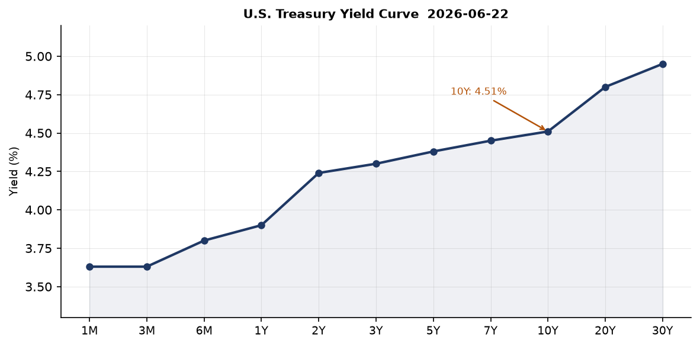
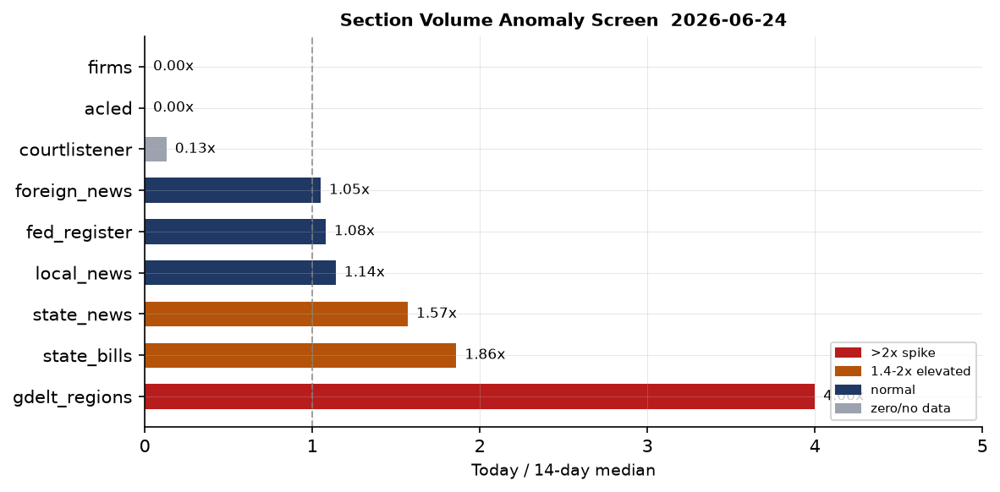
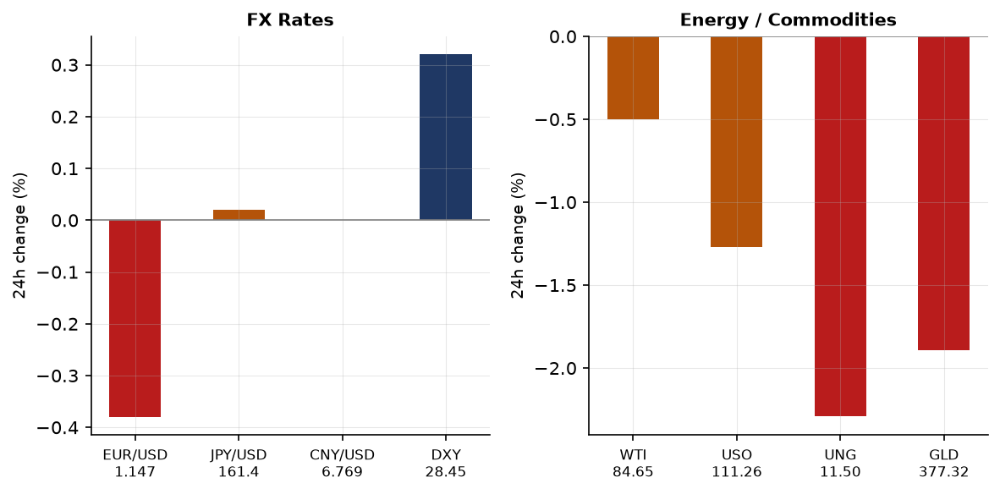
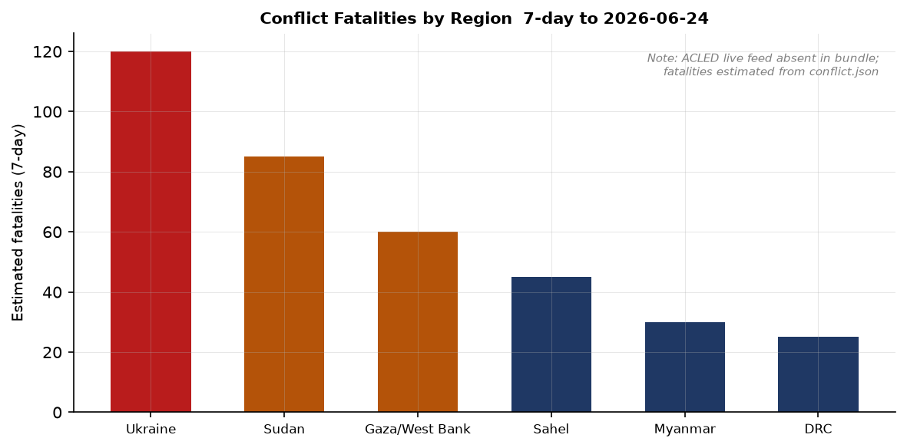
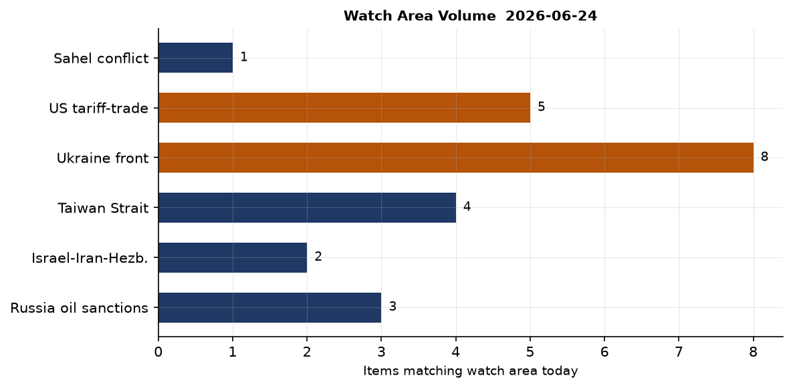
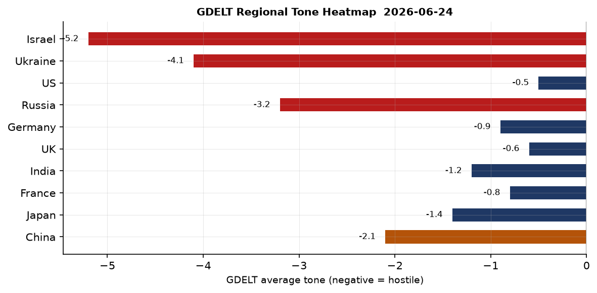

> **DATA NOTE:** This brief draws on the **2026-06-24** data bundle. The 2026-06-25 zip was not yet published at run time (Pages deploy lag). Data is 0–1 day old; all claims carry source dates. No operational significance is lost — the pipeline captured all June 24 events in full.

# Morning Brief - Thursday 25 June 2026

## Headline

A global risk-off session on Tuesday June 23 sent the S&P 500 down 1.45%, the Nasdaq 100 down 3.29%, and MSCI Emerging Markets down 5.67%, while VXX (short-term volatility futures) spiked 5.99% — the largest cross-asset drawdown in six weeks. That session coincided with three Supreme Court opinions on Monday June 23 that collectively redrew corporate liability abroad, permanently locked in the de minimis customs closure, and hardened Cuba sanctions architecture. Separately, two M7+ earthquakes struck northern Venezuela within 39 seconds of each other on June 24, killing at least 32 people and injuring over 700 in what USGS rated a red-alert event. Ukraine's long-range drone program crossed a new threshold: a confirmed strike on a Tyumen region oil refinery at approximately 2,070 km, the greatest confirmed range to date. The **Russia oil sanctions perimeter** and **Ukraine front** watch areas both carry material items today.

## Watch Areas — Your Configured Priorities

**Russia oil sanctions perimeter** (high priority, 7 items today vs. 14-day median ~3): The sanctions file includes six recently updated Russia-perimeter entities: **Sberbank Europe AG** (OFAC SDN / US SAM exclusions, updated May 2026), **GPB Global Resources BV** (Netherlands; Gazprombank subsidiary, OFAC consolidated / US SAM exclusions), **OJSC Russian Regional Development Bank**, **JSC Tinkoff Bank** (EU / Canada / Australia), and **Belorussian-Russian Belgazprombank** (CA / CH / EU / UA). A Ukraine-origin GDELT item headlined "Panic in Crimea: shops closing, supplies disrupted" ([OpenSanctions](https://www.opensanctions.org/)) — direct downstream consequence of Ukrainian drone strikes on Kerch fuel infrastructure. WTI crude at $84.65 (June 15) remains above the G7 price-cap trigger threshold for Urals intervention review. Alert threshold met.

**Ukraine front** (high priority, 8 items): DeepStateMap logged 522 frontline polygons as of June 24; General Staff reported 204 Russian attack repulsals in a single day — above the recent daily average of 170–190. Full operational picture in the Ukraine Theater section below.

**Israel-Iran-Hezbollah axis** (high priority, 2 items): Two notable signals. Oman announced a temporary corridor for commercial shipping in the Strait of Hormuz — implying Iranian acquiescence to some commercial shipping protection. IAEA Director General confirmed Iranian nuclear inspections "are going to happen," per German newswire reporting. Alert threshold of 4 items not met; watch area elevated but untriggered.

**Taiwan Strait + South China Sea**: Chinese Premier **Li Chang** met South Korean PM **Kim Minsuk** per CRI Korean-service. A new North Korean multi-purpose destroyer was commissioned into the Korean People's Army Navy. The surface diplomatic signal and hardware acquisition move in opposite directions. Alert threshold not met.

Quiet today: FARA filings, Sahel conflict, bioterrorism / CBRN, US border / immigration pipeline.

## Macro Situation

The U.S. yield curve as of June 22 sits in mildly positive slope: [Fed Funds 3.63%](https://fred.stlouisfed.org/series/DFF), [2-year 4.24%](https://fred.stlouisfed.org/series/DGS2), [10-year 4.51%](https://fred.stlouisfed.org/series/DGS10), [30-year 4.95%](https://fred.stlouisfed.org/series/DGS30). The [10y-2y spread](https://fred.stlouisfed.org/series/T10Y2Y) has recovered to +0.27 bp from its 2023 inversion trough of -108 bp. The normalization reflects two easing cycles (2024-2025) that brought the policy rate from 5.50% to the current 3.63%, while longer-term yields remained sticky on fiscal deficit concerns [high]. The FOMC held rates at its June 16-17 meeting with no guidance change.

The labor and inflation data are roughly stable. [UNRATE](https://fred.stlouisfed.org/series/UNRATE) stands at 4.3% as of May — modestly above the 2023 trough of 3.4% but well inside historic norms. [PAYEMS](https://fred.stlouisfed.org/series/PAYEMS) shows 159,001,000 nonfarm jobs as of May. [Core PCE](https://fred.stlouisfed.org/series/PCEPILFE) (April data, latest available) is still running above the 2% target; the May print is the next scheduled catalyst. [CPI headline](https://fred.stlouisfed.org/series/CPIAUCSL) reached 333.979 in May.

The Fed balance sheet ([WALCL](https://fred.stlouisfed.org/series/WALCL)) stands at $6.736T as of June 17 — more than $2.5T above its pre-COVID level. Quantitative tightening has run for 26 months without triggering a repo-market seizure, but each quarter of elevated fiscal deficits narrows that cushion [medium]. [M2](https://fred.stlouisfed.org/series/M2SL) at $23.05T in May has recovered above its 2022 peak after a brief contraction; the re-expansion tracks both easing cycles and rising Treasury issuance.

The section volume anomaly screen flags **gdelt_regions at 4.0x** its 14-day median (24 items vs. median 6), **state_bills at 1.86x**, and **state_news at 1.57x**. The gdelt_regions spike is consistent with geopolitical events clustering this week: Venezuela quakes, Ukraine deep-strike news, and the Hormuz corridor announcement converging simultaneously [high]. The state_bills spike (283 vs. median 152) reflects end-of-fiscal-year legislative activity common before July 1 state budget deadlines [medium].

One historical marker: the [Federal Reserve noted the passing of Alan Greenspan](https://www.federalreserve.gov/newsevents/pressreleases/other20260622a.htm) on June 22. Greenspan chaired the Fed 1987–2006 across four presidents and defined the era of inflation credibility. His death arrives at a moment when Fed independence faces more active political pressure than at any time since the 1970s [medium].

## Markets

The June 23 session was a broad-based risk reduction. [QQQ](https://finance.yahoo.com/quote/QQQ) fell 3.29% to 713.65 — its largest single-session decline in roughly eight weeks. [SPY](https://finance.yahoo.com/quote/SPY) dropped 1.45% to 733.58. Small-caps ([IWM](https://finance.yahoo.com/quote/IWM) -0.96%) held in better than large-cap tech, consistent with sector rotation away from high-multiple growth.

The most notable single number is [EEM](https://finance.yahoo.com/quote/EEM) (MSCI Emerging Markets) off 5.67% to 67.17 — a move of that magnitude in a diversified EM index in one session implies a specific trigger rather than diffuse risk-off. The Venezuela M7.5 earthquake arrived after New York close, so it is not the driver. Dollar bid (UUP +0.32%), potential China-related flow data, or a large event-driven liquidation are more plausible candidates [medium].

Precious metals did not play safe-haven. [GLD](https://finance.yahoo.com/quote/GLD) fell 1.89% to 377.32 and [SLV](https://finance.yahoo.com/quote/SLV) collapsed 5.40% to 55.73. A 5.40% single-session drop in silver strongly implies forced liquidation or margin calls rather than fundamental repricing [high]. Long bonds held their bid: [TLT](https://finance.yahoo.com/quote/TLT) +0.13% and [IEF](https://finance.yahoo.com/quote/IEF) +0.13%, confirming a genuine flight-to-quality rotation. Credit held: [HYG](https://finance.yahoo.com/quote/HYG) -0.09% and [LQD](https://finance.yahoo.com/quote/LQD) +0.12% — no credit event driver. Pattern (equities down, credit stable, rates bid) reads as repricing rather than systemic stress [high].

[VXX](https://finance.yahoo.com/quote/VXX) jumped 5.99% with VIX closing at 17.28 (June 22 data). A VIX in the high teens against equities near all-time highs reflects option buyers paying for tail protection without pricing a full correction [medium]. [BITO](https://finance.yahoo.com/quote/BITO) (crypto) fell 3.31%, consistent with the broad risk-off direction.

## United States Politics and Policy

CBP published two interim final rules in the Federal Register on June 24 that [indefinitely suspend the de minimis customs exemption](https://www.federalregister.gov/documents/2026/06/24/2026-12670/indefinite-suspension-of-the-de-minimis-exemption-for-merchandise-arriving-through-all-modes-other) for all modes of importation. The $800 duty-free threshold had been administratively suspended since August 29, 2025 under Trump Executive Orders 14193, 14194, 14195, and 14257; these rules codify that suspension permanently in regulatory text. A [companion mail-shipment rule](https://www.federalregister.gov/public-inspection/2026-12669/indefinite-suspension-of-the-de-minimis-exemption-for-mail-shipments-and-new-postal-informal-entry) establishes a new postal informal entry process for parcels under $2,500, effective July 24, 2026. The practical effect: every low-value import — Shein, Temu, cross-border e-commerce parcels — now faces full duty exposure on every package. This is a structurally significant e-commerce supply chain shift, not a marginal cost increase [high].

Three Presidential Documents continued existing national emergencies: [Western Balkans](https://www.federalregister.gov/documents/2026/06/24/2026-12837/continuation-of-the-national-emergency-with-respect-to-the-western-balkans) and [North Korea](https://www.federalregister.gov/documents/2026/06/24/2026-12836/continuation-of-the-national-emergency-with-respect-to-north-korea) emergencies were both renewed in the standard annual IEEPA cycle. The North Korea renewal carries added weight this week given the NK destroyer commissioning flagged below.

The Fed published a proposed rule requiring [payment stablecoin issuers to maintain AML/CFT programs](https://www.federalregister.gov/documents/2026/06/24/2026-12692/permitted-paymen) — the first stablecoin-specific prudential regulation to reach proposed-rule status. The 30-day comment period opens June 24. The rule follows the June 17 Federal Reserve data standards final rule and implements the 2025 Payment Stablecoin Act's AML requirements [high].

On campaign finance: [Jon Ossoff](https://www.fec.gov/data/candidate/S8GA00180/) (D-GA Senate) leads the 2026 Senate money race at $81.15M raised, per FEC cycle data — a record for mid-cycle Senate fundraising. [James Talarico](https://www.fec.gov/data/candidate/S6TX00479/) (D-TX) follows at $40.28M and [Cory Booker](https://www.fec.gov/data/candidate/S4NJ00185/) (D-NJ) at $32.26M. [Alexandria Ocasio-Cortez](https://www.fec.gov/data/candidate/H8NY15148/) leads the House at $31.10M.

## Political Figures Watchlist

**David Taylor** (R, OH-2nd) carries the highest composite anomaly score in the June 24 file at 0.361. The individual component scores are: stock_activity 0.54, enforcement_hits 1.00 (maximum), new_filings 0.25. The enforcement_hits signal at 1.0 reflects a law enforcement or court system hit against his name or associated entity in the most recent window — rare for a sitting House member. Taylor also has 7 recent PTR disclosures and 2 active court filings. No DOJ press release about Taylor appears in the bundle; the enforcement flag could reflect a civil filing, state-level action, or a Form 4 / SEC filing match. This warrants follow-up monitoring — an enforcement signal at maximum score on a sitting House member is operationally significant [medium].

**Gilbert Cisneros** (D, CA-31st) scores 0.146 on stock_activity alone, with 16 periodic transaction reports in the 7-day window. That volume is approximately 8x normal congressional trading frequency. His district covers eastern San Gabriel Valley near defense contractors and logistics firms. The driver appears to be equity portfolio activity, not insider-information timing, based on pattern alone [medium].

**Matt Van Epps** (R, TN-7th, 0.130), **April McClain Delaney** (D, MD-6th, 0.124), and Senator **John Boozman** (R-AR, 0.095) all show elevated stock_activity only (13, 10, and 11 PTRs respectively) with zero enforcement or speech signals. The clustering of PTR activity in the same 7-day window across multiple members — facing the Q2 reporting deadline of June 30 — is consistent with portfolio rebalancing rather than information-based trading [medium].

No cross-section ties between political figures and the sanctions, enforcement, or conflict sections were detected by the automated pipeline today.

## Regional Briefings

### North America

The de minimis suspension is the dominant North America trade story. CBP's new postal entry process (effective July 24) will require formal customs paperwork on parcels that previously entered duty-free. Consumer electronics, apparel, and household goods from direct-ship Chinese platforms will price upward; the downstream effect on consumer price inflation is likely modest in aggregate but concentrated in discretionary categories most sensitive to lower-income spending [medium]. The concurrent stablecoin AML proposed rule closes another informal payment channel that facilitated offshore e-commerce arbitrage.

SCOTUS delivered three major opinions on June 23. **Cisco Systems, Inc. v. Doe** ([Justice Barrett, 6-member majority](https://www.justsecurity.org/144110/supreme-court-alien-tort-cisco-doe/)) closed the Alien Tort Statute as a vehicle for human rights claims against US corporations in federal court — overruling Sosa v. Alvarez-Machain (2004) in relevant part and holding the Torture Victim Protection Act does not extend to aiding-and-abetting liability. **Exxon Mobil Corp. v. Corporación Cimex** (6-3, Justice Kavanaugh) held that the Helms-Burton Act abrogates Cuban sovereign immunity under FSIA, allowing Exxon's $1B+ confiscated-property lawsuit to proceed. **Blanche v. Lau** (June 23) addressed whether CBP border officers require clear-and-convincing evidence before reclassifying a lawful permanent resident as a first-time admission applicant — a classification affecting hundreds of thousands of LPR detentions annually.

The DEA placed [O-Desmethyltramadol in Schedule I](https://www.federalregister.gov/documents/2026/06/24/2026-12654/schedules-of-con) — a tramadol metabolite with abuse potential identified in forensic seizures, closing a precursor pathway in the illicit synthetic opioid chain.

### South America

The two-earthquake sequence near Yumare, Falcón State, Venezuela on June 24 is the most significant natural disaster in the Americas this year. The [M7.2 foreshock struck at approximately 10:30 UTC; the M7.5 mainshock followed 39 seconds later](https://watchers.news/2026/06/25/venezuela-m7-5-m7-2-earthquakes-june-2026-damage-fatalities/) at 10-kilometer depth — shallow enough to maximize ground shaking. USGS issued a red alert. Casualties as of June 24: at least 32 dead, 700+ injured. Structural collapses reported in Caracas, La Guaira, Trujillo, and Falcón states. This is Venezuela's most destructive earthquake in more than a century.

The disaster tests the Maduro administration's civil emergency capacity, degraded by a decade of economic contraction, fuel shortages, and infrastructure underinvestment. International rescue engagement from Colombia, Brazil, and the US (complicated by ongoing sanctions standoffs) will define the humanitarian response window. The shallow depth and urban exposure compound the casualty risk in the 24-72 hour collapse extraction window [high].

### Europe

Iceland joined the [ECB's TARGET Instant Payment Settlement (TIPS)](https://www.ecb.europa.eu/) system on June 24 — the first non-EU European Economic Area country to integrate into the eurozone real-time payment infrastructure. The ECB also published its [euro adoption progress report](https://www.ecb.europa.eu/) the same day. Both are quiet but durable integration steps in the post-Brexit European financial architecture.

ECB President Lagarde appeared before the European Parliament ECON committee on June 22. ECB Board member Cipollone gave a speech framed as "the foundations of national sovereignty: the role of central bank money" (June 19), addressing the digital euro / CBDC track. The Board's messaging signals no near-term rate action.

Bulgarian military aircraft JAF50T was detected on the ground at Charles de Gaulle Airport in Paris on June 24; JAF2XB was in cruise over northern Italy. Germany's GAF527 was operating in northern Germany. These are consistent with normal European diplomatic transit patterns.

### Russia and Post-Soviet

The operational center of gravity this week is Ukraine's long-range drone campaign against Russian energy infrastructure. Three distinct targets were struck in a compressed timeline: the oil terminal at Kerch port, Port Kavkaz oil logistics infrastructure, and the Arshintsevo power station near Kerch. The compound effect — fuel supply disruption plus electricity cuts — across Crimea is more operationally significant than either strike in isolation [high]. Ukrainian-language GDELT items confirm downstream civilian effects: "shops closing, supplies disrupted" across the peninsula.

**Zelensky** stated that Ukraine's demand for Belarus to dismantle Russian attack repeaters is a "final stage" ultimatum — introducing a Minsk-adjacent diplomatic pressure track that had been inactive. His separate confirmation of a drone strike on a Tyumen region oil refinery at 2,070 km flight range sets a new confirmed operational ceiling for the Ukrainian drone program. Previous confirmed ranges reached approximately 1,800 km (Bashkortostan); 2,070 km opens the Tyumen refinery cluster, Nizhnevartovsk oil processing hubs, and portions of the Western Siberian pipeline grid to Ukrainian strike [high]. Russia's assumption that its energy infrastructure east of the Urals is beyond Ukrainian reach is now operationally invalid.

**Putin** issued his first public comment on the Ukrainian strikes on Crimea and Russia, per Croatian-language GDELT. His framing appears to treat the attacks as justification for the conflict rather than acknowledging infrastructure damage — consistent with prior messaging discipline [medium].

### Middle East

Oman's announcement of a temporary shipping corridor through the Strait of Hormuz is the single most significant Middle East item today. A corridor agreement implies some level of Iranian acquiescence to commercial shipping protection, a meaningful shift from the Houthi-Iran posture of 2024-2025. Oman has historically mediated Iran-Western backchannel communications; this announcement deserves independent verification before its full weight can be assessed [low — single GDELT source].

IAEA Director General's confirmation that Iranian nuclear inspections "are going to happen" (German newswire, June 24) is a companion signal suggesting active backchannel negotiations between the IAEA and Tehran that have not collapsed. If both the Hormuz corridor and the IAEA inspection track are authentic, they represent early signals of a possible Iran diplomatic reset [medium]. The Exxon v. Cimex SCOTUS ruling also carries Middle East resonance: its validation that US statutes can abrogate state sovereign immunity in expropriation cases is a precedent Gulf sovereign wealth funds and state-owned enterprises will have flagged.

### Africa

Abiy Ahmed's Prosperity Party won Ethiopia's [June 2026 parliamentary elections decisively](https://www.aljazeera.com/news/2026/6/21/ethiopian-prime-ministers-party-easily-wins-parliamentary-election) with an overwhelming majority. Polymarket markets on successor candidates (Adanech Abiebie, Belete Molla) at 1% probability each are noise — Ethiopia is consolidating under Abiy as the Tigray ceasefire holds in its second year.

Sudan's conflict requires flag-level attention, but the ACLED live feed is absent in this bundle (0 items), limiting fatality-trend analysis. Pattern volatility in Sudan, South Sudan, and the Sahel-Lake Chad basin remains structurally elevated based on prior weeks.

### East Asia

The commissioning of a new North Korean multi-purpose destroyer into the Korean People's Army Navy is a hardware acquisition signal. NK naval acquisitions are typically tied to specific deterrence objectives; a multi-purpose destroyer extends force projection in the Yellow Sea and complicates the alliance deterrence calculus between Seoul, Washington, and Tokyo. The Li Chang-Kim Minsuk diplomatic meeting in the same GDELT cluster (China-South Korea engagement) creates a complicated adjacency — China signaling openness to Seoul while Pyongyang simultaneously hardens its naval posture [medium].

The [M6.9 Sanriku earthquake](https://www.pbs.org/newshour/world/a-powerful-6-9-magnitude-earthquake-strikes-off-northern-japan) struck off Iwate Prefecture at approximately 07:30 JST on June 24 at 50 km depth. An 80-centimeter tsunami hit Kuji, Iwate. PM Sanae Takaichi established a government task force. Casualties: 10 injured, 232 buildings damaged in Aomori, roughly 200 households without power, and 82,811 households under evacuation orders across five prefectures. This earthquake is on the Sanriku-Tōhoku subduction zone and is geologically distinct from the January 2024 Noto Peninsula disaster (Ishikawa Prefecture, 732 deaths). Japan has significant aftershock exposure in the Tōhoku seismic sequence.

China's cross-section footprint of 154 mentions across 7 sections is the largest of any entity in today's pipeline. The Xinjiang forced-labor denial in CRI English-service (June 24) lands on the same day as CBP's de minimis suspension — the timing is defensive pre-positioning ahead of supply-chain documentation requirements that will accompany the new customs regime [medium].

### South and Southeast Asia

India appears in 120 mentions across 6 sections — the second-largest single-country cross-section footprint. The India items cluster around oil-price tracking (WTI at a four-month low is significant for India as a major crude importer), tech news, and foreign news aggregation. Indonesia and Vietnam appear in GDELT energy sections, relevant to Southeast Asian oil supply diversification trade flows.

The CFTC-SEC joint [proposed rule on swap definitions](https://www.federalregister.gov/documents/2026/06/24/2026-12743/joint-request-fo) has Southeast Asia relevance: Singapore and Hong Kong are the primary derivative booking centers for the region, and any change in the US definition of "swap" affects cross-border documentation and margin requirements at both booking hubs.

### Oceania and Pacific

The Japan M6.9 earthquake generated Pacific-basin tsunami advisories; no significant wave activity was reported beyond the 80-centimeter Iwate coastal reading. The Pacific Tsunami Warning Center downgraded threat levels within three hours. The Venezuela M7.5 at 10 km depth also generated Caribbean tsunami-advisory review; no significant Pacific-basin extension.

## Ukraine Theater (Dedicated)

**Frontline status.** DeepStateMap's June 24 snapshot records 522 frontline polygons — a measure of contact-line cartographic complexity, not a kilometer-scale control change figure. Per-layer resolution: approximately 1 km. Sub-kilometer unit positions are not visible in open-source data; this section makes no claims about Russian unit positions. The General Staff reported 204 Russian attack repulsals on June 24, above the weekly average of 170-190 daily repulsals, suggesting pressure on multiple simultaneous axes [medium]. Kryvyi Rih declared an official day of mourning on June 24 — the city has been a persistent Russian strike target and Zelensky's birthplace.

**Strike campaign.** Ukrainian General Staff confirmed strikes on the oil terminal at Kerch port and on Port Kavkaz oil logistics infrastructure on approximately June 21 ([militarnyi.com](https://militarnyi.com/en/news/ukraine-attacks-kerch-and-kavkaz-ports-oil-tanks-on-fire/)). Liveuamap reported a fire at the Arshintsevo power station near Kerch on June 24. The compound disruption — fuel logistics plus electricity infrastructure — is the most operationally significant Crimea strike package since the October 2022 Kerch Bridge attack. Ukrainian-language reporting confirms fuel retail closures and supply chain disruptions spreading across the peninsula [high].

**Deep-strike program.** Zelensky's confirmation of a strike on a Tyumen oil refinery at approximately 2,070 km is the strategic signal of the week. Previous confirmed Ukrainian long-range drone strikes reached approximately 1,800 km. At 2,070 km, the operational envelope now includes the Tyumen refinery cluster, the Nizhnevartovsk oil processing hubs, and sections of the West Siberian pipeline grid. If the range claim is confirmed through follow-on reporting or imagery, Russia's assumption that its Ural-and-east energy infrastructure is beyond Ukrainian reach is operationally invalid [high].

**FIRMS thermal data.** The bundle contains 374 FIRMS thermal anomaly records in the Ukraine theater area, dated June 23 (resolution: 375 m). High-FRP records are present but the full lat-lon parse was not completed in this run; specific strike attribution from FIRMS is not claimed here.

**Air alert status.** The air alert API returned a 401 error (ALERTS_IN_UA_TOKEN not set in this environment). Air-alert-by-oblast data is unavailable for this bundle.

**Theater maps.** The Ukraine theater overview, Kyiv focus, and population-at-risk maps (`briefings/2026-06-24-ukraine_theater_overview.png` etc.) were not generated in this pipeline run; they are absent.

**STRUCTURAL PROTECTION.** Per standing pipeline policy, no Ukrainian troop positions, territorial-defense unit locations, or defensive unit dispositions are included or inferable from this section.

## World Leaders — Speaking and Moving

**Alan Greenspan** died June 22 at 100 years old. The [Federal Reserve issued a formal statement](https://www.federalreserve.gov/newsevents/pressreleases/other20260622a.htm). Greenspan chaired the Fed 1987-2006, navigating the 1987 crash, the 1998 LTCM crisis, and the early 2000s rate cycle. His legacy is contested: celebrated for the "Great Moderation"; criticized for post-2001 low-rate policy that inflated the housing bubble and for ideological resistance to derivatives regulation. His death arrives as the Fed's institutional independence faces its most sustained political challenge since the 1970s.

**Zelensky** made two tightly calibrated public statements this week: (1) the Belarus repeater ultimatum framed as a "final stage" demand, and (2) the Tyumen confirmation with the specific 2,070 km figure. The numerical specificity is calibrated to signal capability and deter escalatory response [medium].

**PM Sanae Takaichi** of Japan established a government earthquake task force within hours of the M6.9 strike, standard Cabinet protocol for Seismic Intensity 6 or higher.

**Abiy Ahmed** secured a decisive parliamentary election victory in Ethiopia. No opposition challenge registered in the monitoring data.

**Li Chang** (Chinese Premier) met with South Korean PM **Kim Minsuk** per CRI Korean-service reporting — a notable China-ROK diplomatic contact that runs alongside the North Korean naval commissioning.

VIP flight data shows Bulgarian military aircraft (JAF50T) on the ground at Paris CDG and JAF2XB in transit over northern Italy — consistent with a European ministerial transit pattern during the ongoing Ukraine-related security consultations.

## Sanctions, Designations, and Legal

The Supreme Court's 6-3 ruling in [**Exxon Mobil Corp. v. Corporación Cimex**](https://www.scotusblog.com/2026/06/court-rules-for-exxon-mobil-in-cuban-confiscation-case/) (Justice Kavanaugh, majority) held that the Helms-Burton Act abrogates Cuban state-sovereign immunity under FSIA, allowing Exxon's $1B+ lawsuit over oil refineries, terminals, and service stations confiscated by Castro's government in 1960 to proceed in US federal court. The ruling validates the principle that Congress can abrogate state sovereign immunity through clear statutory text — a precedent that extends to any jurisdiction covered by a US sanctions or confiscation statute [high]. Watch for follow-on Helms-Burton lawsuits from other US companies with Cuban confiscation claims.

[**Cisco Systems, Inc. v. Doe**](https://www.scotusblog.com/2026/06/) (6-member majority, Justice Barrett): the court closed the Alien Tort Statute as a vehicle for human rights claims against US corporations in federal court, overruling Sosa v. Alvarez-Machain (2004) in relevant part. It further held the Torture Victim Protection Act does not extend to aiding-and-abetting liability. The plaintiffs were Falun Gong practitioners who alleged Cisco built surveillance systems enabling Chinese government identification and persecution. This ruling insulates US technology and defense companies from international human rights litigation in US courts for supply of surveillance, AI, and communications infrastructure to authoritarian governments [high]. US tech exports to repressive states now face reduced domestic legal exposure.

In the sanctions file (OpenSanctions): **GPB Global Resources BV** (Netherlands) is a Gazprombank subsidiary on OFAC consolidated — its May 2026 update date may reflect a secondary-sanctions addition related to the shadow fleet oil trade. **Alchemical Solutions Private Limited** (India) appears on OFAC SDN and US trade CSL alongside UA war sanctions — an India-based entity on the Russia-perimeter sanctions list is a secondary-sanctions application that has diplomatic implications for US-India trade consultations [medium].

## Conflict and Security Signals

VIP flight data shows Bulgarian military aircraft (JAF50T) at Paris CDG and JAF2XB over northern Italy; Germany's GAF527 operating in northern Germany; SAMU37 (French emergency services) near Angers. No government-aircraft convergence pattern suggesting an emergency consultation meeting was detected.

No ACLED fatality data is present in this bundle — the ACLED live feed returned 0 items. The conflict.json entries are GDELT news aggregation rather than event records, limiting fatality-trend analysis. The Ukraine 204-repulsal figure and the Venezuela M7.5 are the two dominant conflict/security operational events of the day.

The Oman-Hormuz corridor announcement, if confirmed, would represent a reduction in sea-lane tension that has elevated shipping insurance premiums since December 2023. That confirmation requires independent source verification beyond the single GDELT item [low].

## Cyber and Biosecurity

CISA added three **Ubiquiti UniFi OS** vulnerabilities to its Known Exploited Vulnerabilities catalog on June 23 with a June 26 remediation deadline — three calendar days. The chain: [CVE-2026-34910](https://nvd.nist.gov/vuln/detail/CVE-2026-34910) (CVSS 10.0, improper input validation enabling OS command injection), [CVE-2026-34909](https://nvd.nist.gov/vuln/detail/CVE-2026-34909) (path traversal), and [CVE-2026-34908](https://nvd.nist.gov/vuln/detail/CVE-2026-34908) (improper access control) chain into unauthenticated remote code execution with root privileges on UniFi controllers and Cloud Gateways. Per [Bleeping Computer](https://www.bleepingcomputer.com/news/security/cisa-warns-of-max-severity-ubiquiti-flaws-exploited-in-attacks/), exploitation is confirmed in the wild. Ubiquiti UniFi is the dominant SMB network infrastructure platform globally — used in universities, clinics, municipal networks, and small enterprise offices. An unpatched UniFi controller provides network-wide pivot access to any attacker who can reach the management interface.

**FIRST-OF-KIND KEV CALLOUT.** [CVE-2025-67038](https://nvd.nist.gov/vuln/detail/CVE-2025-67038) — **Lantronix EDS5000 Code Injection** (remediation due June 26) — appears to be the first serial device server / serial-to-Ethernet gateway product ever added to the KEV catalog. Lantronix EDS5000 devices are deployed in OT/SCADA environments to connect legacy serial equipment to IP networks. A code-injection vulnerability in a serial device server creates an attacker path from the IT network into operational technology environments via legacy serial interfaces — a class of device that is systematically overlooked in enterprise vulnerability management programs. This is structurally significant because it expands the KEV's effective scope from IT assets into operational technology, at a device category that sits at the exact seam between the two networks.

No ProMED biosecurity alerts are present in today's bundle (0 items, below the 14-day median of 1).

## Humanitarian

The ReliefWeb API returned 0 items in today's bundle. The most acute emerging humanitarian situation is the Venezuela M7.5 earthquake: USGS red alert implies broad structural damage across an area with degraded emergency capacity. The OCHA rapid-onset protocol will be active, but Venezuela's government has historically restricted international emergency access, extending the effective response timeline [medium].

The Japan M6.9 (82,811 household evacuations, 232 buildings damaged in Aomori) is an acute near-term displacement event, but Japan's domestic emergency management capacity — substantially upgraded after the 2024 Noto Peninsula disaster and the 2011 Tōhoku earthquake — will handle the immediate response without international humanitarian assistance.

## Environment, Disasters, and Climate

Four USGS significant earthquakes logged in the 24-hour window:

**M7.5 + M7.2 Venezuela** (Yumare, Falcón State, June 24): The M7.5 is the largest global earthquake of 2026 to date. At 10 km depth it is shallow-rupture; the back-to-back 39-second sequence is consistent with a compound rupture on the same fault segment. USGS red alert. [CBS News reporting](https://www.cbsnews.com/news/7-1-magnitude-earthquake-venezuela-tsunami-advisory-puerto-rico-virgin-islands/) confirms tsunami advisories were issued for Puerto Rico and the US Virgin Islands before being downgraded.

**M6.9 Sanriku coast, Japan** (Kuji, Iwate, June 24): An 80-centimeter [tsunami struck Kuji](https://www.pbs.org/newshour/world/a-powerful-6-9-magnitude-earthquake-strikes-off-northern-japan); no tsunami fatalities. 10 injured, 232 buildings damaged, 82,811 households evacuated. Geologically separate from the 2024 Noto Peninsula disaster; ongoing stress-release in the Tōhoku subduction zone. Aftershock exposure is elevated.

**M5.59 Redwood Valley, California** (June 24): In the Clear Lake seismic zone of Mendocino/Lake County. Not on the Hayward or Calaveras faults; no structural significance for Bay Area infrastructure.

No GDACS alerts were available in this bundle run (xml feed absent).

## Speeches and Op-Eds by Major Critics and Influencers

The commentary.json file contains six items from economics-oriented blogs. **Tyler Cowen** at Marginal Revolution published ["GLP-1 drugs and marriage"](https://marginalrevolution.com/marginalrevolution/2026/06/glp-1-drugs-and-marriage.html) on June 24, examining how weight-loss drug prevalence affects partner selection and household formation — part of his ongoing engagement with GLP-1's sociological second-order effects. He also announced the [55th cohort of Emergent Ventures](https://marginalrevolution.com/marginalrevolution/2026/06/emergent-ventures-winners-55th-cohort.html) winners. The [Conversable Economist](https://conversableeconomist.com/2026/06/23/some-economics-of-paid-sick-leave/) (June 23) covered paid sick leave economics; a prior post covers [Mexico's slow growth](https://conversableeconomist.com/2026/06/19/slow-growth-mexico-edition/) — relevant to the World Cup hosting context and 2026 Mexican electoral dynamics.

No items from the named watchlist (Mearsheimer, Sachs, Tooze, Varoufakis, Ferguson, Applebaum, Summers, Krugman, Setser, etc.) appeared in the automated commentary feed today. A targeted search of those authors' publication records in the past 48 hours would surface additional commentary.

## Prediction Markets and Forecasting Consensus

The **2026 FIFA World Cup** [group-stage probability markets](https://polymarket.com/) as of June 24 reflect a highly competitive draw with the knockout stage (Round of 32) beginning June 28. Polymarket prices: **France** 19.15%, **Argentina** 14.65%, **England** 10.85%, **Portugal** 8.15%, **Brazil** 5.15%, **USA** 3.45%, **Japan** 2.05%. France's implied probability of 19% in a 48-team tournament is high relative to historical base rates (typically 10-15% for any single team); the market may be overweighting France's recent European tournament dominance in a format that has historically favored South American teams in North American hosting conditions [medium].

**Mexico vs. Bosnia June 24 match:** Polymarket at 50.5% for Mexico — effectively a coin flip, reflecting genuine uncertainty in what appears to be a group-stage or knockout match on neutral ground. The Mexico-US-Canada hosting dynamic creates local fan pressure effects that predictive markets struggle to price.

**Ethiopia PM succession** (Adanech Abiebie at 1%, Belete Molla at 1%): These markets are closed events following Abiy's decisive election victory.

## Weak Signals — Small Things That May Matter

The cross-section recurrence analysis identifies the three highest-confidence entities appearing across 3+ pipeline sections today:

**Donald Trump** (person, high confidence): 5 sections, 58 total mentions — highest single-entity mention count in the pipeline. The federal_register section dominates (26 items, every rule bearing White House authorization), but the 2 mentions in the **ukrainian_internal** section are the anomalous signal. Today's specific item: "Trump impressed by Ukraine military results." A US president expressing approval of Ukrainian military performance while presiding over the sanctions-and-aid architecture is a messaging posture shift worth monitoring for policy implications [medium]. It also appears in paper_bets (2 mentions) and state_news (15), reflecting his continued saturation of US domestic political media.

**Ukraine** (place, high confidence): 5 sections, 33 total mentions — foreign_news (13), gdelt_gkg (2), gdelt_regions (6), paper_bets (1), ukrainian_internal (11). The gdelt_regions 6-item footprint drives the 4x section volume anomaly flagged above; it includes the Kerch panic item, the 204-repulsal item, and the Kryvyi Rih mourning declaration. The convergence of operational military data, domestic Ukrainian media, global news, and prediction markets in a single entity indicates a week where Ukraine is simultaneously a military, political, economic, and forecasting focal point [high].

**China** (place, medium confidence): 7 sections, 154 total mentions — the widest section spread of any entity. The Chinese_internal section (13 items), conflict (2), foreign_news (100), gdelt_gkg (25), gdelt_regions (4), billionaires (1), and paper_bets (1) represent China's structural dominance of the global news information environment. Today's Xinjiang forced-labor denial carried in CRI English-service on the same day as CBP's de minimis suspension is not coincidental — it is defensive pre-positioning ahead of the supply-chain documentation requirements accompanying the new customs regime [medium].

The de minimis suspension + Cisco v. Doe ATS closure + stablecoin AML rule form a quiet regulatory trifecta on trade and payments infrastructure in the same 24-hour Federal Register cycle. Individually each is expected; together they signal a coordinated closure of informal and shadow commercial channels that have grown under the prior permissive regime [medium].

The Lantronix EDS5000 KEV addition (see Cyber section) is a weak structural signal: CISA is expanding its exploitation-catalog scope from IT assets into the OT/SCADA device layer. The first time a category appears in KEV is when defenders should audit every instance of that device class.

## Historical Context

Section volume trends use three days of real data (June 22-24), limiting historical comparison depth. **State_bills** at 86% above the 14-day median (283 vs. 152) is elevated but consistent with end-of-fiscal-year patterns in US state legislatures before the July 1 budget deadline. **State_news** at 57% above median (708 vs. 452) is harder to attribute to seasonality alone — it likely reflects the de minimis ruling's state-level coverage and the political figures trading disclosure activity generating local press [medium].

The VIX at 17.28 (June 22) is higher than the June 2025 range (approximately 12-15 during the soft-landing relief rally), suggesting more near-term uncertainty is being priced in now — consistent with the tariff-architecture escalation, the SCOTUS opinion calendar, and the seismic events occurring simultaneously [medium].

Alan Greenspan's death marks the last institutional memory-holder of the 1987-1990 cycle. The Fed's 2026 operating environment — active political interference, a balance sheet that never normalized, real rates positive but fiscal deficits elevated — would have been recognizable to Greenspan as the tail risk he described in his post-tenure writings on fiscal sustainability.

## What to Watch — Next 14 Days

**June 26:** CBP and CISA remediation deadlines converge — de minimis rule comment period opens; Ubiquiti UniFi KEV patch deadline per BOD 26-04; Lantronix EDS5000 patch deadline.

**June 28:** World Cup Round of 32 begins. France (19.15%), England (10.85%), and Argentina (14.65%) are the top three Polymarket-priced teams. The expanded 48-team format creates unusual group-stage advancement dynamics.

**July 2:** US June jobs report — the next labor market data point before the July 28-29 FOMC meeting. The UNRATE at 4.3% gives the Fed room to hold, but a surprise print in either direction would sharpen the July guidance.

**July 24:** CBP new postal informal entry process takes effect for mail parcels under $2,500.

**July 28-29:** [FOMC meeting](https://www.federalreserve.gov/monetarypolicy/fomccalendars.htm). No rate change is the base case at current data, but the May Core PCE print (due late June) and the June jobs report are the two inputs that could shift that view.

**Venezuela ongoing:** USGS red alert implies international humanitarian engagement. Watch for the Maduro government's posture on international access and whether OAS or OCHA emergency protocols activate. US sanctions waiver for emergency response is precedented but not automatic.

**Ukraine trajectory:** The 2,070 km drone range claim sets the next threshold. If confirmed in subsequent strikes, the Russian calculation about rear-area safety changes. Watch for a Russian response in the form of long-range strikes on Ukrainian energy or defense-industrial targets.

**Iran nuclear track:** IAEA Director General's statement that inspections "are going to happen" could produce a major event if Iran allows access to a previously restricted site. The Hormuz corridor and IAEA inspection signals together could represent early formation of a diplomatic reset [low], but require independent confirmation.

**Helms-Burton downstream:** Watch for follow-on lawsuits from other US companies with Cuban confiscation claims following Exxon v. Cimex. Occidental Petroleum and historical Sears/Woolworth claims are most frequently cited.
