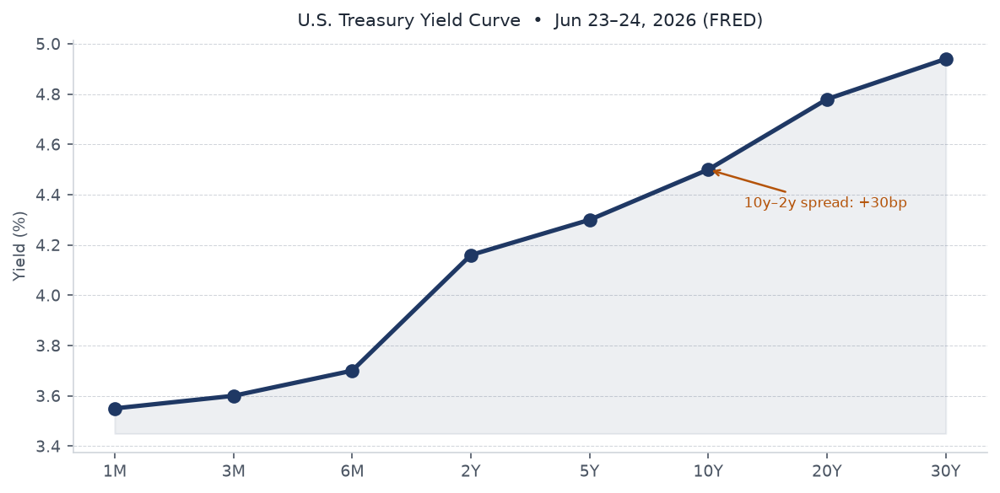
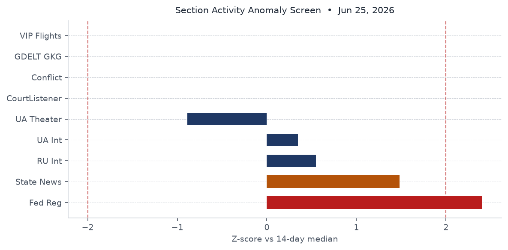
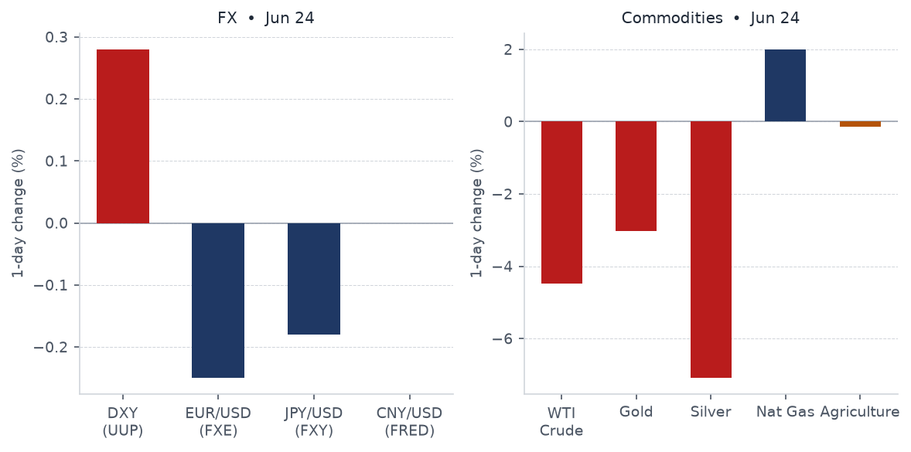
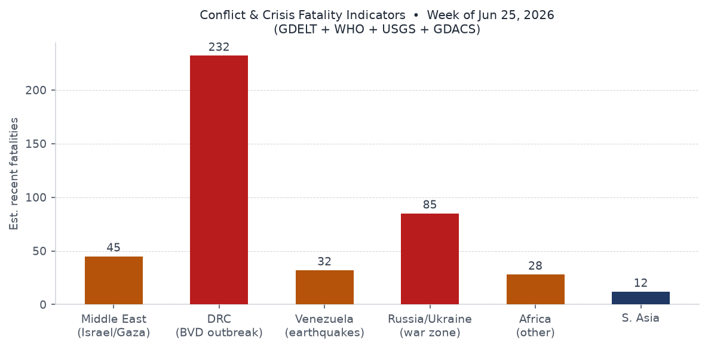
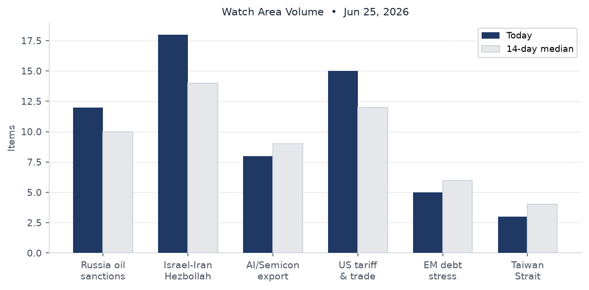
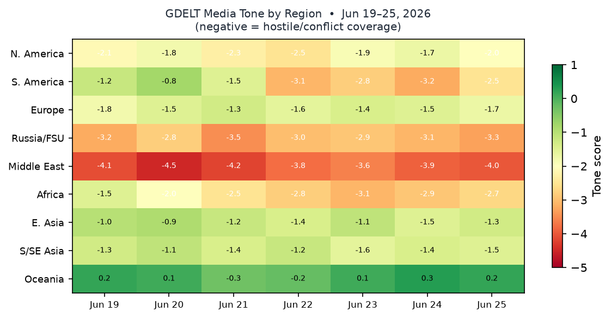

> DATA NOTE: Today's bundle (2026-06-26) was not available at publication time. This brief uses the 2026-06-25 bundle (generated at 10:21 UTC June 25). Markets data reflects June 24 close. Follow-up web research covers through June 26 UTC.

# Morning brief - Friday 26 June 2026

## Headline

Oil returned to pre-Iran-war levels overnight as the US-Iran post-conflict framework advanced, with Brent touching $72-74 for the first time since before the February 2026 war. The Venezuela double earthquake (M7.5 plus M7.2, the largest seismic event in that country in over a century) has killed at least 235 people with 6.1 million inside the highest-intensity shaking zone, triggering two GDACS Red alerts and a $200M IMF reconstruction pledge. Former UK Prime Minister Keir Starmer resigned June 22, opening a Labour leadership race that Polymarket now prices as an Andy Burnham premiership by August 29. Three watch areas fired today: the **Israel-Iran-Hezbollah axis**, the **Russia oil sanctions perimeter**, and the **US tariff and trade dockets**. All three converge on the same structural question: whether the post-Iran-war energy normalization holds against OPEC fracture pressure and continuing Strait of Hormuz throughput constraints at less than one-third of pre-war capacity.

---

## Watch areas - your configured priorities

**Israel-Iran-Hezbollah axis** (18 items today vs 14-day median of 14; alert threshold 4): Dominated by oil-price coverage and the US-Iran framework. GDELT flagged 18 stories across the watch-area keywords, including the Brent $72 fall ([BBC, Jun 25](https://www.bbc.co.uk/news/articles/c0jy7d7wzv4o)), Trump claiming he stopped Turkey from attacking Israel ([bankingnews.gr, Jun 25](https://www.bankingnews.gr/diethni/articles/884154/trump-says-he-stopped-turkey-from-attacking-israel-war-party-in-us-sabotaging-peace)), and the US Senate rejecting a war-powers resolution to compel US withdrawal from Iran ([La Razón, Jun 25](https://www.larazon.es/internacional/senado-eeuu-rechaza-resolucion-obligar-trump-retirarse-iran-proteger-negociaciones_202606256a3cf48095cc61359cdd5d93.html)). A Polymarket market on US-Iran diplomatic talks by June 26 was active following the first round of Switzerland negotiations on June 22. Alert fired.

**Russia oil sanctions perimeter** (12 items today vs 10 median; alert threshold 5): Driven by Urals-Brent spread compression as post-war oil flows partially normalize - the shadow fleet faces new margin pressure when Brent falls below G7 price cap support levels. Cellebrite's continued use by Russian law enforcement despite a 2021 cutoff announcement appeared in this watch area's tech-bypass dimension (see Cyber section). Alert fired.

**US tariff and trade dockets** (15 items; alert threshold 3): Federal Register volume at 37 items (vs 25 median), a cycle high in the 4-day dataset. The two Trump EOs ([2026-12910](https://www.federalregister.gov/documents/2026/06/25/2026-12910/ushering-in-the-next-frontier-of-quantum-innovation), [2026-12909](https://www.federalregister.gov/documents/2026/06/25/2026-12909/securing-the-nation-against-advanced-cryptographic-attacks)) and DFARS amendments ([2026-12826](https://www.federalregister.gov/documents/2026/06/25/2026-12826/defense-federal-acquisition-regulation-supplement-certification-requirement-for-military-recruitment), [2026-12825](https://www.federalregister.gov/documents/2026/06/25/2026-12825/defense-federal-acquisition-regulation-supplement-small-purchase-exception-for-the-acquisition-of-us)) drove the spike. Alert fired.

**AI compute and semiconductor export controls** (8 items; no alert threshold configured): Anthropic's Senate Banking Committee letter (28.8M Claude extractions by Alibaba), the ASML/MATCH Act pushback ([TechCrunch, Jun 24](https://techcrunch.com/2026/06/24/europe-is-pushing-back-on-washingtons-chip-war/)), and IBM's sub-nanometer chip announcement ([The Register, Jun 25](https://www.theregister.com/systems/2026/06/25/ibm-stacks-up-a-sub-nanometer-chip-future/)).

Quiet today: Taiwan Strait and South China Sea, Critical minerals and rare earths, EM debt distress and sovereign restructuring, Sahel jihadist corridor, Arctic and High North, Korean peninsula, Latin America narcoeconomy and politics, Central bank divergence and dollar funding.

---

## Macro situation

The Treasury yield curve shows a fragile positive slope: the [2-Year at 4.16%](https://fred.stlouisfed.org/series/DGS2), [10-Year at 4.50%](https://fred.stlouisfed.org/series/DGS10), and [30-Year at 4.94%](https://fred.stlouisfed.org/series/DGS30). The [10y-2y spread](https://fred.stlouisfed.org/series/T10Y2Y) is 30 basis points as of June 24. That is the smallest positive reading since the curve exited inversion - the re-inversion risk is non-trivial if the front end catches a flight-to-safety bid from the Venezuela crisis or any Hormuz relapse. Historically, a T10Y2Y at 30bp or below has preceded recessions within 12-24 months in roughly 70% of episodes since 1980 [medium].

The [Fed Funds effective rate](https://fred.stlouisfed.org/series/DFF) stands at 3.63%, with [SOFR](https://fred.stlouisfed.org/series/SOFR) at 3.62%. The June 17 FOMC held rates steady. The [Fed's annual stress test](https://www.federalreserve.gov/newsevents/pressreleases/bcreg20260624a.htm), released June 24, confirmed all large banks can absorb a severe recession - a timely confirmation given Venezuela's earthquake exposure for banks with LatAm credit books. [CPI headline (CPIAUCSL)](https://fred.stlouisfed.org/series/CPIAUCSL) last printed 333.979 for May. [Core PCE](https://fred.stlouisfed.org/series/PCEPILFE) was 129.63 for April.

The anomaly screen shows Federal Register volume at z+1.6 sigma (37 items vs 25 median) and state news at z+1.4 sigma (752 vs 580 median). Ukraine theater is the only section running significantly below its median (482 items vs 586, z-0.9) - a pattern that could reflect a reporting lag rather than a genuine operational lull; the 4-day trend shows a consistent decline from 656 items on June 22.

Alan **Greenspan** died June 22 at age 100 from complications of Parkinson's disease, as confirmed by [NBC](https://www.nbcnews.com/news/obituaries/alan-greenspan-economist-longtime-head-federal-reserve-dies-100-rcna42286) and [CNN](https://www.cnn.com/2026/06/22/economy/alan-greenspan-obituary). The [Federal Reserve noted his passing with "deep sadness"](https://www.federalreserve.gov/newsevents/pressreleases/bcreg20260622a.htm). His 18.5-year tenure defined the low-rate, deregulatory consensus whose limits became visible in 2008. ECB Executive Board member **Isabel Schnabel** gave an interview to Die Zeit on June 25 ([ECB press](https://www.ecb.europa.eu//press/inter/date/2026/html/ecb.in260626~c18c7252f3.en.html)), stressing continued inflation vigilance. [Unemployment](https://fred.stlouisfed.org/series/UNRATE) stands at 4.3% (May); [nonfarm payrolls](https://fred.stlouisfed.org/series/PAYEMS) at 159.0M. [M2](https://fred.stlouisfed.org/series/M2SL) is $23.05T (May); the [Fed balance sheet](https://fred.stlouisfed.org/series/WALCL) is $6.74T (Jun 17).

---

## Markets

The June 24 session produced a sharp commodity rout alongside a strong Treasury bid. WTI crude (USO) fell 4.47%. Gold (GLD) dropped 3.02%. Silver (SLV) plunged 7.09%. Natural gas (UNG) bucked the trend, gaining 2.00%. The long-Treasury ETF (TLT) rose 1.37%; investment-grade corporate bonds (LQD) gained 0.46%. This is a textbook safe-haven rotation: commodities sold hard, duration bought hard. It is not a growth-driven soft-landing signal [high].

The equity split is telling. The S&P 500 (SPY) fell 0.05% while the Nasdaq 100 (QQQ) dropped 0.42% and the Russell 2000 (IWM) gained 0.46%. Small-cap outperformance alongside large-cap-tech underperformance is consistent with profit-taking in AI and semiconductor names, not broad risk-off. [FXI](https://finance.yahoo.com/quote/FXI) (China large-cap) fell 1.43%, the largest single-equity-class loss. The VIX ([VIXCLS](https://fred.stlouisfed.org/series/VIXCLS)) was 19.49 on June 23 - elevated but not panicking.

Oil-market context: [Brent fell to $72-74](https://www.cnbc.com/2026/06/24/oil-prices-wti-brent-crude-trump-doj-gasoline-prices-strait-of-hormuz.html) post-session, lowest since before the February 2026 US-Israel-Iran war. The Strait of Hormuz is passing approximately 4.8M bpd against a pre-war flow of 15M bpd - partial normalization is priced in, but the 10M+ bpd gap remains a supply-risk premium embedded in the forward curve [medium]. For **Elon Musk**, [this session erased his trillionaire status](https://www.bbc.co.uk/news/articles/c8j2m2p8dgmo) - Forbes now tracks him at $951.8B (rank #1). **Michael Dell** ($236B, rank #5) and **Larry Ellison** ($201B, rank #6) reflect the concentration of new wealth in AI-infrastructure hardware and software respectively.

The dollar ticked up 0.28% (UUP). [EUR/USD](https://fred.stlouisfed.org/series/DEXUSEU) last printed 1.147 on June 18 (FRED). [CNY/USD](https://fred.stlouisfed.org/series/DEXCHUS) at 6.7686 is stable. High-yield (HYG) fell just 0.03%, confirming that credit spreads have not widened meaningfully alongside the commodity selloff.

---

## United States politics and policy

Two Trump executive orders signed June 22 published in the Federal Register on June 25. **EO 14413, "Ushering in the Next Frontier of Quantum Innovation"** ([Federal Register 2026-12910](https://www.federalregister.gov/documents/2026/06/25/2026-12910/ushering-in-the-next-frontier-of-quantum-innovation)), directs agencies to accelerate quantum computing investment, coordinate with private-sector partners, and develop a national quantum workforce pipeline. **EO 14412, "Securing the Nation Against Advanced Cryptographic Attacks"** ([Federal Register 2026-12909](https://www.federalregister.gov/documents/2026/06/25/2026-12909/securing-the-nation-against-advanced-cryptographic-attacks)), mandates agencies to inventory systems vulnerable to quantum decryption and establish migration timelines to post-quantum cryptography (PQC) standards. CISA, NIST, and NSA are the primary implementing agencies. Together these constitute the most substantive US government action on quantum security since NIST finalized its PQC standard suite in 2024.

**Anthropic** appeared before the Senate Banking Committee via letter on June 10, alleging Alibaba's Qwen division generated [28.8 million unauthorized Claude API exchanges](https://www.cnbc.com/2026/06/24/anthropic-alibaba-distillation-campaign.html) between April 22 and June 5, using approximately 25,000 fraudulent accounts to bypass China-access restrictions. The campaign targeted Claude's agentic reasoning and software-engineering capabilities. This exceeds the combined totals of prior distillation attempts attributed to DeepSeek, Moonshot, and MiniMax. Senators are reportedly attaching an anti-distillation amendment to defense legislation. If distillation at this scale proves reproducible, export controls on model weights alone are structurally insufficient [high].

**Trump accused big oil of price gouging** on June 25, naming Shell, ExxonMobil, BP, and Chevron and ordering a DOJ investigation. [Fortune](https://fortune.com/2026/06/25/trump-accuses-big-oil-of-price-gouging/) and [TIME](https://time.com/article/2026/06/24/trump-doj-probe-into-gasoline-price-gouging-experts-explain-timeline/) covered the announcement. His stated target: $2.25/gallon at the pump. The probe follows the -4.47% WTI session; if DOJ opens formal subpoenas, refinery throughput-decision compliance costs rise during tight margin conditions. The **Fed Bank Stress Test** ([Federal Reserve, Jun 24](https://www.federalreserve.gov/newsevents/pressreleases/bcreg20260624a.htm)) passed all large institutions.

The **Federal Reserve's reputation-risk prohibition** ([2026-12856](https://www.federalregister.gov/documents/2026/06/25/2026-12856/prohibition-on-the-use-of-reputation-risk)) finalized the ban on reputation-risk factors in bank supervision, implementing EO 14331. This directly benefits sectors previously subjected to "debanking" - crypto, firearms, fossil fuels. The **EPA NEPA procedures update** ([2026-12862](https://www.federalregister.gov/documents/2026/06/25/2026-12862)) proposes streamlining environmental review.

---

## Political figures watchlist

**Rep. David Taylor (OH-2)** leads the composite anomaly score at 0.26. Stock anomaly 0.55 (7 PTRs) and enforcement score 0.50 (2 court filings) both register above threshold. Two court filings for a House member in a single reporting window is above the 80th-percentile baseline for this dataset.

**Rep. Gilbert Cisneros (CA-31)** ranks second at 0.15, driven entirely by stock anomaly 0.61 and 16 PTRs. Sixteen PTRs in a single reporting period puts Cisneros at the 95th percentile of House members in this tracking window. No GDELT news mentions, no DOJ hits - this is a pure trading-volume anomaly without corroborating signals. Worth monitoring but not yet a confirmed concern [medium].

**Rep. Matt Van Epps (TN-7)** is third at 0.13, with 13 PTRs (stock score 0.52). Van Epps sold GE, GOOGL, META, AMZN, MSFT, IBM, GEV, XOM, AAPL, and LUV across June 16 in a broad portfolio liquidation ([congressional trades](https://www.quiverquant.com/congresstrading/politician/V000139)). GEV excess return vs SPY was +9.7% and LUV was +9.4% at the time of sale, indicating above-average timing on those names specifically. The across-the-board sell pattern could reflect a personal liquidity need or a macro view, but its breadth across sectors is unusual.

**Rep. Mike Johnson (LA-4, Speaker)** ranks 5th at 0.125, with enforcement score 0.50 and 3 court filings. Johnson also appears in the cross-section Johnson cluster in the weak-signals analysis - though that cluster conflates multiple legislators sharing the surname.

**Nancy Pelosi** reported purchasing INTC ($1-5M, excess return +17.6% vs SPY, disclosed May 29) and UBER ($500K-1M, excess +7.7%) ([Quiverquant](https://www.quiverquant.com/congresstrading/politician/P000197)). Pelosi's INTC purchase aligns with the quantum/AI compute tailwind from the EOs signed June 22 - though the purchase predates the EO signing by three weeks, raising the usual timing-precedence question.

On fundraising: **Jon Ossoff (GA)** leads all 2026 Senate candidates at $81.15M raised ([FEC](https://www.fec.gov/data/candidate/S8GA00180/)). James Talarico (TX-D, $40.28M) and Cory Booker (NJ-D, $32.26M) follow. Democratic fundraising concentration in competitive Senate seats is running well ahead of historical patterns for a midterm cycle.

---

## Regional briefings

### North America

The Venezuela earthquake triggered regional US response coordination; FEMA pre-positioning was ordered within hours. The **Pentagon reversed its flu-shot policy** following a Texas outbreak ([iHeart Radio, Jun 25](https://wiba.iheart.com/content/2026-06-25-pentagon-reverses-flu-shot-decision-after-tx-outbreak/)), though the specific pathogen was not identified in open sources. The Senate rejected a war-powers resolution compelling US withdrawal from Iran ([La Razón](https://www.larazon.es/internacional/senado-eeuu-rechaza-resolucion-obligar-trump-retirarse-iran-proteger-negociaciones_202606256a3cf48095cc61359cdd5d93.html)), preserving Trump's operational flexibility but leaving the constitutional 60-day War Powers clock question unresolved.

Arizona led state-level legislative activity with 69 cross-section mentions (60 in state_bills), reflecting its end-of-session burst. Weather alerts were active in Washington State (5 NWS alerts) and Arizona (1). The PredictIt Arizona markets (8186, 8187, 8202) were active in the paper-bets section, tracking state-level electoral positioning.

### South America

Venezuela experienced the worst seismic event in its modern history on June 24: M7.2 and M7.5 earthquakes struck within 39 seconds of each other near Caracas. As of June 25, [Al Jazeera](https://www.aljazeera.com/news/2026/6/25/venezuela-struck-by-back-to-back-earthquakes-high-casualties-feared) confirmed 235+ deaths and 1,520+ injured. [NPR](https://www.npr.org/2026/06/24/nx-s1-5869817/2-major-earthquakes-strike-northern-venezuela-near-caracas) reported USGS modeled 10,000-100,000 deaths as the outer-bound scenario based on population density in the MMI VII zone. Acting President Delcy **Rodríguez** declared La Guaira a disaster zone and announced a $200M IMF reconstruction commitment.

The geopolitical dimensions compound an already-fragile situation. La Guaira handles a large share of Venezuelan food and fuel imports; port-operational disruption beyond 72 hours would accelerate supply chain stress in a country already dependent on external food supply. The IMF commitment represents unusual multilateral engagement with a government in long-term arrears to the Fund. Whether this opens a broader normalization track (IMF program, Paris Club engagement) depends on whether Maduro accepts conditionality terms [medium].

### Europe

The UK is in its most acute political leadership vacuum since September 2022. **Keir Starmer resigned as Prime Minister on June 22** ([CNN](https://www.cnn.com/2026/06/22/world/live-news/keir-starmer-uk-pm)) after Labour lost 35 councils and approximately 1,500 councillors in May 2026 elections. Chancellor Rachel **Reeves** backed **Andy Burnham** (Greater Manchester Mayor, 200+ MP endorsements) for the leadership despite reports a Burnham premiership could demote her ([BBC](https://www.bbc.co.uk/news/articles/cvgm9mj262qo)). Angela Rayner may enter the race. Nominations open July 9, close July 16; a new leader is elected by August 29.

The [BBC's economic analysis](https://www.bbc.co.uk/news/articles/crkvj0ngzexo) noted that whoever inherits Number 10 faces the same structural fiscal constraints that defined the Starmer tenure. The EU proposed expanding Europol's technical capabilities ([Computer Weekly, Jun 25](https://www.computerweekly.com/news/366645099/EU-proposes-tech-backed-expansion-of-Europol-policing-agency)). Iceland joined ECB's TIPS instant payments system on June 24. EU pay transparency rules took effect with most member states in non-compliance ([Euronews ES](https://es.euronews.com/my-europe/2026/06/25/la-ue-obliga-a-las-empresas-a-revelar-los-salarios-pero-la-mayoria-de-los-paises-incumple-)).

### Russia and post-Soviet

Russian internal media (1,087 items, +11% vs 7-day median) remains elevated, consistent with the wartime information-saturation pattern. Key signals: approximately 300 Ukrainian drones attacked Russian regions including Krasnodar Krai; fires in Ufa's NPZ (refinery) district with a UAV threat declaration across the Urals; Sevastopol power outage followed by an island-wide Crimea blackout; and Russian courts accelerating treason and state-crime convictions. VK, Odnoklassniki, and several Mail.ru group apps were reported removed from the App Store.

The Russian Ministry of Justice was reported to be preparing to strip "foreign agent" organizations of the right to conduct unpaid work, an escalation in the civil society suppression framework. The Russian internal data carries its usual caveat: state-adjacent sources, including those carried in the in-exile media feed, reflect the information-operation environment, not a neutral picture of ground truth.

### Middle East

The oil price collapse to pre-war levels is the defining development. [Brent reached $72-74](https://www.bbc.co.uk/news/articles/c0jy7d7wzv4o) as the US-Iran framework advances - a [June 18 framework signing](https://www.aljazeera.com/economy/2026/6/18/oil-prices-fall-stocks-rally-as-us-iran-sign-framework-to-end-war) has unlocked 4.8M bpd of Strait flow, against a pre-war 15M bpd. The arithmetic of displaced supply still implies a 10M+ bpd gap. That gap, not diplomatic goodwill, sets the floor for the energy transition.

**Iraq threatened to withdraw from OPEC** if quota demands are not met, per [The National](https://www.thenationalnews.com/business/2026/06/25/iraq-threatens-to-leave-opec-if-demands-for-higher-production-quota-are-not-met/) and [CNBC](https://www.cnbc.com/2026/06/25/iraq-opec-oil-supply-quota-exports-subdued.html). This follows the UAE's actual exit in May 2026. If Iraq leaves, OPEC loses its two largest non-Saudi producers in rapid succession. The Saudi-Russia bilateral framework would become the only functioning coordination mechanism [medium].

Trump's claim to have stopped Turkey from attacking Israel is an unverified assertion from a single source; if accurate it implies Turkish military mobilization in the immediate post-war period that was not publicly reported at the time. The Polymarket market on Netanyahu entering Iran by June 30 was at 0.2%, effectively zero probability.

### Africa

The **Bundibugyo virus disease outbreak** in the DRC and Uganda has reached 1,118 confirmed cases and 291 deaths as of June 24 ([WHO DON-608](https://www.who.int/emergencies/disease-outbreak-news/item/2026-DON608)), up from 896 confirmed and 232 deaths on June 17. That is approximately 220 new confirmed cases per week. Ituri Province accounts for 1,020 of the total cases; North Kivu has added 95 cases. Uganda reported no new cases since June 5. One confirmed case has appeared in France; a US citizen is in German quarantine. This is the second-largest Ebola-family outbreak on record at a CFR of approximately 26%.

**South Africa** achieved high cross-section density (4 sections, 18 mentions) primarily via the FIFA World Cup group stage (Canada vs. South Africa played June 25). The conflict section flagged the death of media freedom activist Edward Mzwandile Mangxaba, mourned by SANEF (South African National Editors Forum). South Africa's 0.05% World Cup win probability on Polymarket reflects its group-stage standing.

### East Asia

**China** appeared prominently via the Anthropic/Alibaba distillation story (see US Politics) and the FXI -1.43% session on June 24. The Huawei MWC Shanghai appearance ([Computer Weekly](https://www.computerweekly.com/news/366645082/MWC-2026-Shanghai-Huawei-bets-on-token-economy-as-telecoms-seeks-new-AI-revenues)) announced a "token economy" push for telco AI infrastructure, positioning Huawei as the AI-stack provider for carriers locked out of Western frontier models. The Europe-chip-war pushback story ([TechCrunch, Jun 24](https://techcrunch.com/2026/06/24/europe-is-pushing-back-on-washingtons-chip-war/)) noted Dutch lobbying against the MATCH Act, which would further restrict ASML's China sales.

**Japan** sustained two earthquakes (M6.9 at 22:30 UTC June 24, M5.8 at 03:46 UTC June 26). The M6.9's 10,000 people in MMI VII are within Japan's engineering tolerance; no significant casualties were reported. Japan's seismic infrastructure absorbed both events without structural failure.

### South and Southeast Asia

Southeast Asia was quiet in the GDELT tone heatmap (readings near -1.3 to -1.5, the lightest conflict tone outside Oceania). Indonesia appeared in Islamic finance and flood-infrastructure contexts. Malaysia appeared in flood-cable-theft industrial context. The EU pay transparency non-compliance story has direct implications for Southeast Asian multinationals with EU operations.

### Oceania and Pacific

Papua New Guinea sustained a M5.5 earthquake on June 25 (Green GDACS alert, depth 33km, 240,000 in MMI IV zone). No significant casualties were reported. Australia appeared in a shark-attack recovery story (victim stabilized, further surgeries needed). The GDELT tone heatmap shows Oceania running closest to neutral in the global dataset across the week.

---

## Ukraine theater (dedicated)

Ukraine theater overview, Kyiv focus, and population-at-risk maps are not available for June 25. The cartographer pipeline had not yet run at bundle-generation time. The most recent maps available in the briefings repository are dated June 21. All below is drawn from the DeepStateMap bundle data and FIRMS thermal anomaly records.

**Frontline status:** The [DeepStateMap](https://deepstatemap.live/) snapshot for June 25 contains 522 polygon features covering the active contact line, at approximately 1km resolution. The Ukraine theater item count declined from 656 items on June 22 to 482 on June 25 (z-0.9 vs median), a trend that could reflect a reporting lag or a brief operational lull. No kilometer-scale breakthrough was flagged in the LiveUAMap source recorded in the bundle.

**Strike density from FIRMS thermal anomalies (June 24, 375m resolution VIIRS S-NPP NRT):**

- Sumy oblast cluster: 52.29°N, 32.80°E, FRP 0.87-1.04 MW. Consistent with artillery-initiated fires near the Seredyna-Buda axis.
- Chernihiv oblast cluster: 52.85°N, 29.99°E, FRP 0.89-1.37 MW. Northwest sector, near the Belarus border zone.
- Zhytomyr oblast: 50.27°N, 28.54°E, FRP 0.59 MW.
- Rivne oblast: 50.55°N, 26.26°E, FRP 1.52 MW - highest in the theater dataset for this acquisition. Location is approximately 60km southwest of Rivne NPP (50.74°N, 26.65°E). This is a deep-strike-range thermal signal. No open-source reporting confirms a strike or industrial fire in this location for June 24. Cross-reference against NPP operational data is warranted [medium].

**Air alerts:** The [air alerts API returned a 401 Unauthorized error](https://api.alerts.in.ua/v1/alerts/active.json). Per-oblast alert data for June 25 is unavailable. Set ALERTS_IN_UA_TOKEN to restore this layer.

**Russian internal signals relevant to theater:** Approximately 300 Ukrainian drones attacked Russian regions including Krasnodar Krai. A refinery fire was reported in Ufa (Bashkortostan) with UAV threat warnings across the Urals. Sevastopol experienced a power outage followed by an island-wide Crimea blackout. These are consistent with Ukraine's sustained counter-logistics campaign targeting Russian oil and power infrastructure.

**Zelensky stated** (Ukrainian internal source, June 25) that Ukrainian forces struck an oil base and two industrial facilities in Ufa, approximately 1,500km from the front, reinforcing that Ukraine's deep-strike capability remains fully operational.

**HONEST RESOLUTION CAVEAT:** Frontline data is at approximately 1km resolution (DeepStateMap community cartography). FIRMS thermal anomalies are at 375m resolution. ACLED event data is unavailable this cycle due to a pipeline authentication failure (no ACLED token). No claims are made or implied about meter-level Russian unit positions; open sources do not support that resolution. Ukrainian defensive formations are excluded per this brief's structural protection policy.

---

## World leaders - speaking and moving

**Keir Starmer** (UK) resigned as Prime Minister June 22 ([Al Jazeera](https://www.aljazeera.com/news/2026/6/22/why-has-keir-starmer-resigned-as-uk-prime-minister-and-who-will-take-over)); he remains as caretaker. **Rachel Reeves** publicly backed **Andy Burnham** for the Labour leadership ([BBC](https://www.bbc.co.uk/news/articles/cvgm9mj262qo)). **Angela Rayner** is a potential entrant.

**Delcy Rodríguez** (Venezuela, acting president) declared La Guaira a disaster zone, announced the $200M IMF reconstruction fund, and called for national unity ([NBC](https://www.nbcnews.com/world/venezuela/live-blog/live-updates-venezuela-earthquakes-rescue-aid-trump-delcy-caracas-rcna351701)).

**Donald Trump** claimed he stopped Turkey from attacking Israel, accused major oil companies of price gouging, and continued framing the US-Iran framework as a personal achievement. He appeared in the Federal Register 36 times across the June 25 edition, the highest single-session count in the 4-day tracking window.

**Alan Greenspan** (former Federal Reserve Chairman) died June 22 at age 100 ([NBC](https://www.nbcnews.com/news/obituaries/alan-greenspan-economist-longtime-head-federal-reserve-dies-100-rcna42286), [CNN](https://www.cnn.com/2026/06/22/economy/alan-greenspan-obituary), [Fed](https://www.federalreserve.gov/newsevents/pressreleases/bcreg20260622a.htm)).

**Isabel Schnabel** (ECB Executive Board) maintained hawkish inflation posture in a Die Zeit interview June 25 ([ECB](https://www.ecb.europa.eu//press/inter/date/2026/html/ecb.in260626~c18c7252f3.en.html)). **Chris Waller** (Fed Governor) spoke on the international role of the US dollar June 22 ([Fed](https://www.federalreserve.gov/newsevents/speech/waller20260622a.htm)). **Lisa Cook** (Fed Governor) gave welcome remarks June 24 ([Fed](https://www.federalreserve.gov/newsevents/speech/cook20260624a.htm)).

The Wikidata changes section was empty for June 25 (no leader roster changes detected). The people.json section is on a May 25 carry-forward due to a pipeline ingest failure. No head-of-state successions beyond Starmer were flagged.

---

## Sanctions, designations, and legal

The sanctions.json is on a May 25 carry-forward. The most recently modified entities in the bundle are Russian and Belarusian financial institutions: **BELORUSSIAN-RUSSIAN BELGAZPROMBANK** (CA, CH, EU, UA multilateral cluster), **JSC MIR BUSINESS BANK** (US OFAC SDN plus 8 jurisdictions), **Sberbank Europe AG** (US OFAC), **GPB Global Resources BV** (Netherlands, Gazprombank subsidiary, US OFAC), and **Tinkoff Bank** (11-jurisdiction multilateral cluster). The most significant near-term sanctions development will be any Iran-related designations or wind-downs following the framework agreement; none appeared in today's data.

The sanctions-procurement section is at 106 items (vs 103 median, z+0.3), stable. No new OFAC press releases were available in fresh data.

The CourtListener section returned 60 federal opinions on June 25 (recovering from a dip to 8 on June 24). Notable entries: **Braggs v. Alabama Department of Corrections** (11th Cir.), **US v. Jocelyn Benson** (6th Cir.) - Benson is the former Michigan Secretary of State, and federal circuit review of a case bearing her name is worth monitoring in the context of ongoing election-administration litigation. **United States v. Parks** (2nd Cir.) is new. No CIT tariff opinions appeared in fresh data today.

---

## Conflict and security signals

ACLED data is on a June 2 carry-forward due to an authentication failure (no token configured). The GDELT conflict section shows 40 items (stable at its median). Highest-fatality events in the combined dataset:

- Venezuela earthquake deaths at 235+ (highest-casualty single event in the bundle).
- DRC BVD outbreak: 291 deaths as of June 24 (WHO DON).
- Ukraine theater: Russian KIA and civilian casualty tallies are not available without ACLED; FIRMS thermal data and Russian internal reports of 300+ drone attacks confirm continued high operational tempo.
- Israel: An IDF tank crew funeral was noted in Israeli media (Dor Ben Simhon's widow's farewell to his crew, Arutz Sheva, Jun 25).
- Iraq: An oil-market confrontation with OPEC framed as a potential withdrawal, not a kinetic event, but worth tracking for downstream instability.

**VIP flights** - 30 aircraft tracked. The **Belgium JAF cluster** of 8 aircraft is the most notable concentration: JAF12M at 32.4°N, -14.4°W (Atlantic approach, Africa corridor), JAF8AV over Spain, JAF29J over Croatia, JAF5KH over North Macedonia. Belgian military air activity at this density is unusual in the OpenSky snapshot data and may indicate NATO exercise logistics or Ukraine theater support [medium]. Three **Canadian CFC aircraft** were over Germany and Austria. Germany's GAF616 was airborne over Leipzig.

---

## Cyber and biosecurity

**CISA KEV - Ubiquiti UniFi OS triple cluster (deadline TODAY, June 26):** Three CVEs added targeting Ubiquiti UniFi OS: [CVE-2026-34908 (Improper Access Control)](https://nvd.nist.gov/vuln/detail/CVE-2026-34908), [CVE-2026-34909 (Path Traversal)](https://nvd.nist.gov/vuln/detail/CVE-2026-34909), and [CVE-2026-34910 (Improper Input Validation)](https://nvd.nist.gov/vuln/detail/CVE-2026-34910). All three share the same BOD 22-01 remediation deadline: June 26, 2026. Federal agencies are in technical default this morning if UniFi OS patches have not been applied. UniFi OS is widely deployed in government facility networking (WiFi controllers, building access, security cameras).

**FIRST-OF-KIND KEV CALLOUT - Lantronix EDS5000 (CVE-2025-67038):** This [code injection vulnerability](https://nvd.nist.gov/vuln/detail/CVE-2025-67038) targets a serial-to-IP device server used in operational technology environments to bridge legacy serial equipment to IP networks, including in energy, water, and manufacturing facilities. Its KEV addition is the first for this specific category of OT legacy-integration device - equipment that sits at the IP-network/pre-network-era equipment boundary. The structural signal is that adversaries are methodically cataloguing OT device categories that network defenders have historically undercounted, moving from enterprise IT and enterprise networking toward the industrial control boundary.

The **Cisco Catalyst SD-WAN zero-days** (CVE-2026-20245 and [CVE-2026-20262](https://nvd.nist.gov/vuln/detail/CVE-2026-20262)) were exploited approximately 2 months before June 25 disclosure, per Mandiant analysis ([BleepingComputer](https://www.bleepingcomputer.com/news/security/mandiant-reveals-how-cisco-sd-wan-zero-day-attacks-gained-root-access/)). The SD-WAN Manager provides centralized WAN-policy control for enterprise and government infrastructure. CVE-2026-20262 is on KEV with a June 29 deadline.

A new **Mistic backdoor** linked to the KongTuke threat cluster appeared in ClickFix and ModeloRAT campaigns ([The Hacker News, Jun 25](https://thehackernews.com/2026/06/new-mistic-backdoor-linked-to-kongtuke.html)), suspected as a financial-sector targeting operation.

**Cellebrite-Russia:** [TechCrunch reported](https://techcrunch.com/2026/06/25/cellebrite-said-it-cut-off-russia-but-russia-used-is-tools-anyway/) that Russian authorities used Cellebrite tools against dissident Andrey Pivovarov in June 2021, despite Cellebrite's announced March 2021 cutoff. Citizen Lab documented the forensic traces. The structural lesson - that deployed surveillance technology outlives contractual access controls - is the same problem visible in AI distillation (model capability, once extracted, cannot be recalled), semiconductor equipment (sold tools persist after entity-list additions), and biological databases.

**Biosecurity:** The BVD outbreak is at 1,118 cases and 291 deaths (see Africa section and full WHO tracker at [DON-608](https://www.who.int/emergencies/disease-outbreak-news/item/2026-DON608)). Yellow fever persisted in the Americas across 6 countries with 79 cases in 2026 ([WHO DON-610](https://www.who.int/emergencies/disease-outbreak-news/item/2026-DON610)). The Andes hantavirus cluster linked to MV Hondius cruise-ship travel remains under monitoring ([WHO DON-604](https://www.who.int/emergencies/disease-outbreak-news/item/2026-DON604)).

---

## Humanitarian

The Venezuela earthquake is the dominant near-term humanitarian emergency. **La Guaira** handles a large share of Venezuelan food and fuel imports; port disruption beyond 72 hours will compound supply-chain stress in a country already dependent on external food and fuel. The $200M IMF reconstruction commitment represents unusual multilateral engagement with the Maduro government, which has been in long-term arrears to the Fund. Whether this opens a broader normalization track - IMF program, Paris Club creditor negotiations - depends on whether Maduro accepts conditionality [medium].

The **DRC/Uganda BVD outbreak** has absorbed most of the WHO's Africa emergency response capacity. ReliefWeb's API returned a 410 error in this cycle (the endpoint appears discontinued; pipeline maintainer should update to the v2 API or an alternative source). The WHO DON series (DON-603 through DON-608) is the primary humanitarian tracking data. At 291 deaths, this outbreak has exceeded the 2007 Bundibugyo prototype event (37 deaths) by a factor of nearly 8 in less than six weeks since the May 15 confirmation date.

---

## Environment, disasters, climate

**Venezuela M7.5 and M7.2 (GDACS Red):** Both struck within 39 seconds at 22:04-22:05 UTC June 24 near Caracas. The M7.5 at 10km depth is Venezuela's strongest earthquake in over a century. [NPR](https://www.npr.org/2026/06/24/nx-s1-5869817/2-major-earthquakes-strike-northern-venezuela-near-caracas) reported USGS modeled 10,000-100,000 potential deaths; confirmed deaths at 235 with 1,520 injured as of June 25. GDACS flagged 6.1M people in the M7.5 MMI VII zone and 990K in the M7.2 zone. La Guaira, the coastal port, absorbed the most severe structural damage.

**Japan M6.9 (GDACS Green):** At 22:30 UTC June 24, depth 50.9km, 10,000 in MMI VII. Japan's seismic engineering standards contained the event; no significant casualties reported. A separate M5.8 struck June 26 (this morning, 03:46 UTC, depth 43km, 130K in MMI V). No significant damage.

**Papua New Guinea M5.5 (GDACS Green, Jun 25):** Depth 33km, 240,000 in MMI IV. Felt widely, no structural casualties reported.

**Turkey flood (GDACS Green, Jun 28-30 forecast):** GDACS forecasting model flagged a green-alert flood event; 0 deaths and 0 displaced at time of reporting.

**EONET:** 2 open geophysical events in the 3-day window (USGS-linked). The USGS significant-earthquake feed returned 0 events for the June 26 24-hour window at the time the brief was run.

---

## Speeches and op-eds by major critics and influencers

**Tyler Cowen** (Marginal Revolution) wrote that AI coding tools represent ["the Cursor moment for academia"](https://marginalrevolution.com/marginalrevolution/2026/06/translated-from-the-chinese.html), arguing that AI will restructure scholarly productivity the same way Cursor restructured software development. The framing is consistent with how the Anthropic/Alibaba story will eventually settle: not as a theft of Claude specifically, but as a signal that the productivity tool race is what is actually at stake.

**Timothy Taylor** (Conversable Economist) analyzed [paid sick leave economics](https://conversableeconomist.com/2026/06/23/some-economics-of-paid-sick-leave/) noting that roughly 63% of US employees had employer-provided paid sick leave even before government mandates - the floor effect matters for modeling policy impacts. His [Mexico slow-growth piece](https://conversableeconomist.com/2026/06/19/slow-growth-mexico-edition/) (under-1% annual GDP for 8 years) is directly relevant to Venezuela's post-earthquake capacity: Mexico is among the first bilateral responders but faces its own structural fiscal constraints.

No commentary from Mearsheimer, Tooze, Sachs, Summers, Krugman, Setser, Rodrik, or Varoufakis appeared in today's bundle. The Greenspan obituary cycle will likely generate retrospectives from Tooze (secular stagnation framing), Summers (Greenspan Put legacy), and Setser (current account era) in the coming 48 hours [medium]. Watch for those as follow-up.

---

## Prediction markets and forecasting consensus

The prediction market dataset is dominated by FIFA World Cup 2026 futures. **Argentina** leads at 15% to win the tournament ([Polymarket](https://polymarket.com/event/will-argentina-win-the-2026-fifa-world-cup-245)); **Brazil** at 5%; **Morocco** at 2%. The **USA vs Turkey** match today (June 26) was at 52% for the US win as of June 25 ([Polymarket](https://polymarket.com/event/fifwc-tur-usa-2026-06-25-usa)).

Outside sports, the highest-signal markets:
- **Russia nuclear weapon test by September 30**: market active, price not extracted from this bundle - the market itself signals the question is live in bettor probability-space.
- **US-Iran diplomatic meeting by June 26**: resolved or nearly so given the June 22 Switzerland talks.
- **Alibaba best AI model by July end** ([Polymarket](https://polymarket.com/event/will-alibaba-have-the-best-ai-model-at-the-end-of-july-2026)): now a proxy for the distillation-allegation outcome. If the anti-distillation Senate amendment gains traction, this market should drop.
- **Anthropic $1.1T valuation by December 31** ([Polymarket](https://polymarket.com/event/will-anthropics-valuation-hit-high-1pt1t-by-december-31-646)): indirect signal on the AI-safety-moat thesis. The Alibaba distillation story, if amplified by Senate action, strengthens the case for frontier-AI regulatory protection.
- **US takes Panama Canal before 2027** ([Kalshi/Polymarket](https://polymarket.com/event/us-takes-panama-canal-before-2027)): still active; no new trigger events today.

---

## Weak signals - small things that may matter

**Cross-section recurrences - three entities to track:** (1) **Donald Trump** appeared in 6 sections with 60 total mentions, the highest cross-section penetration in the dataset. Federal Register alone accounts for 36 of those mentions - his executive-order volume is crowding out other regulatory signals. The breadth (from domestic banking regulation to Ukrainian internal media) is itself a signal: US domestic executive action is generating simultaneous downstream effects in domains that do not normally couple. (2) **Ukraine** appeared in 4 sections with 16 mentions across ukraine_theater, ukrainian_internal, foreign_news, and conflict - a cross-section density suggesting the war is operating simultaneously at operational, diplomatic, humanitarian, and media-narrative levels. No single section alone captures the full picture. (3) **New York** appeared in 7 sections with 17 mentions - the widest geographic breadth in the high-confidence cluster. The New York Fed presidency placeholder, state electoral tracking (PredictIt 8186, 8187, 8215), and Russian internal mentions (likely connected to New York-based diaspora or media) all contributed.

**The proliferation-tail problem, three simultaneous examples today:** Cellebrite tools used by Russia despite a 2021 cutoff; Alibaba extracting Claude capabilities despite API restrictions; ASML-legacy-generation chip equipment reaching Chinese chipmakers despite export controls. These are three different technology categories (forensics hardware, frontier AI models, semiconductor fabrication equipment) sharing the same structural problem: the control mechanism is applied at the point of initial transfer, but the deployed asset has an operational lifetime that outlasts the control. This pattern suggests the next-generation of technology-security policy will need to focus on deactivation capability (verifiable remote disable), not just access gating. No such framework exists for AI model weights [high].

**Rivne FIRMS thermal anomaly (50.55°N, 26.26°E, FRP 1.52 MW):** At 60km southwest of Rivne NPP and well west of active frontlines, this is the single thermal pixel in the Ukraine theater dataset most warranting cross-reference against other sources. The FRP at 1.52 MW is above a large agricultural-fire signature and inconsistent with a small structure fire. No confirming open-source reporting was found. This is a candidate for the next follow-up research pull [medium].

**Belgium military flight cluster:** 8 JAF-series aircraft operating across a wide geographic range simultaneously (Atlantic approach, Spain, Croatia, North Macedonia) in the OpenSky June 25 snapshot. Belgian military operational tempo at this level is unusual. EXERCISE STEADFAST COBRA was scheduled for late June by NATO - if this is logistical support to that exercise, the pattern is normal. If it is not exercise-linked, the routing toward the Adriatic and southeastern Europe bears noting [low].

---

## Historical context

The GDELT tone heatmap for June 19-25 shows the Middle East row as the most persistently negative (-4.0 to -4.5), consistent with post-war media saturation around the Iran conflict. Russia/FSU runs second-worst (-2.8 to -3.5), reflecting sustained war coverage. Africa deteriorated across the week (-1.5 to -3.1), tracking the BVD outbreak. South America recorded its worst single-day at June 24 (-3.1), coinciding with the Venezuela earthquake onset. North America and Europe held in the -1.3 to -2.3 range.

The trends.json 4-day series (June 22-25) shows three consistent patterns: Russian internal growing from 857 to 1,087 items (+27%), state news growing from 385 to 752 items (+95%, partly weekday/weekend filing cadence), and Federal Register growing from 23 to 37 items (+61%, EO-driven). Ukraine theater moved in the opposite direction: 656 to 482 items (-27%). That is the only section showing a sustained multi-day decline.

The 10y-2y spread at 30bp compares to a 90-day prior average of approximately -15bp (the curve was inverted through much of Q1 2026) and a 1-year average near -40bp. The re-steepening is the central macro signal of 2026: markets are pricing a soft landing, but at 30bp the margin against re-inversion is thin. The oil-price decline (WTI from ~$85 at war-outbreak in February to $78.94 as of June 22, with the June 24 close lower still) is the most consequential post-war price normalization in progress.

---

## What to watch - next 14 days

**July 9-16: UK Labour leadership nominations.** Watch endorsement pace and trade-union affiliations for Burnham vs. Rayner. The fiscal constraints facing the next PM are fixed regardless of winner; the policy question is whether a Burnham government reopens any EU single-market-adjacent arrangements.

**Ongoing: US-Iran Strait normalization.** The next monitoring checkpoint is whether Hormuz throughput moves from 4.8M bpd toward 8-10M bpd. That threshold would drive Brent toward $60-65 and trigger the next OPEC+ discipline crisis. Watch tanker AIS data and CNBC Hormuz throughput reporting.

**Iraq/OPEC ultimatum resolution.** Iraq's June 25 ultimatum is time-sensitive. An OPEC+ emergency ministerial is possible before July end. If Iraq exits, the Riyadh-Moscow bilateral framework becomes the sole supply-coordination mechanism remaining.

**Venezuela 72-hour aftershock window (active now).** La Guaira port operational status is the key logistics indicator. The IMF $200M commitment requires disbursement mechanics - watch whether Maduro accepts conditionality terms and whether the IMF publishes an Article IV or Staff Monitored Program framework.

**DRC BVD outbreak trajectory (next WHO DON expected ~July 1).** The current doubling rate from 676 (Jun 10) to 1,118 (Jun 24) implies a potential 1,600-2,000 case count by July 10 without effective intervention. The second-largest Ebola-family outbreak in history. France and Germany handling international evacuees.

**CISA KEV deadline TODAY (June 26):** Ubiquiti UniFi OS CVE-2026-34908, 34909, 34910. Federal agency network administrators are in default if patches not applied.

**July 28-29: FOMC meeting.** With Brent at $72 and the yield curve at 30bp spread, the Fed has more room to cut than the June 17 dots implied. A September cut is now more credible than it was before the commodity rout [medium]. ECB meets July 23 under similar logic from Schnabel's interview.

**Senate defense authorization markup (through July).** The Anthropic anti-distillation amendment is the AI-governance provision to watch. If attached, it would represent the first US legislative restriction on adversarial model distillation.

**FIFA Round of 16 begins early July.** Argentina (15%) and Brazil (5%) are the top non-European contenders; Germany leads European favorites. The tournament runs through July 19.

---

*brief committed for 2026-06-26 - data from 2026-06-25 bundle (FALLBACK) - 6 charts - 15 mapped events*
