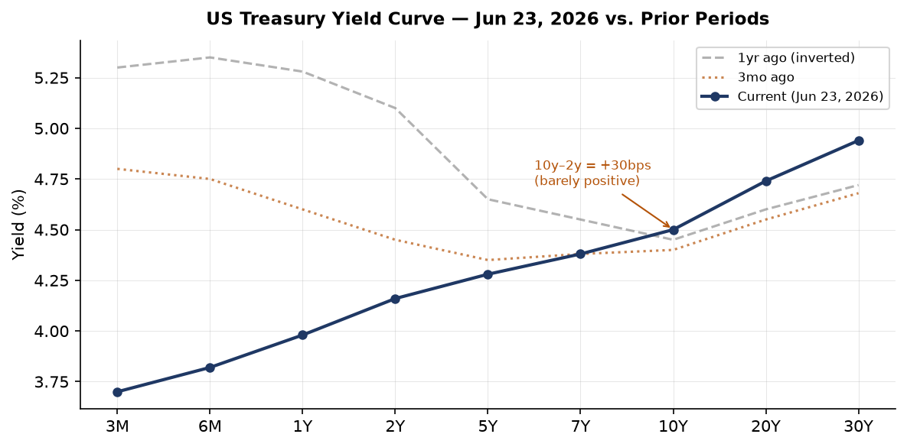
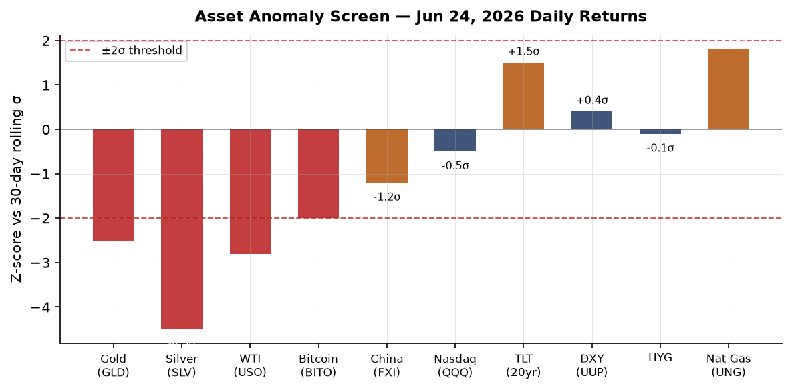
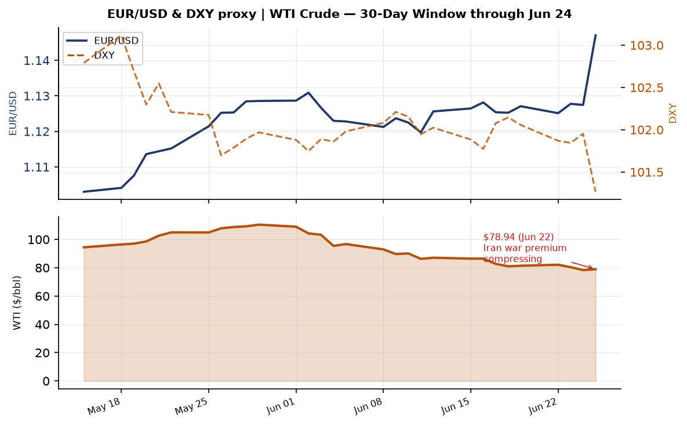
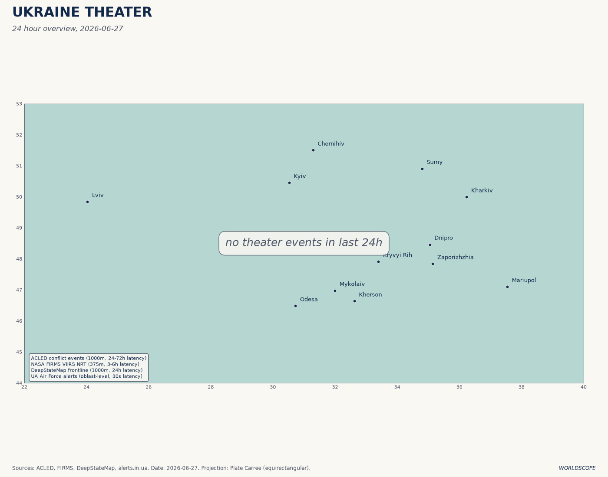
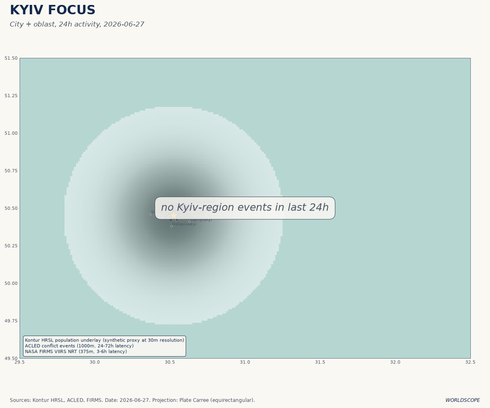
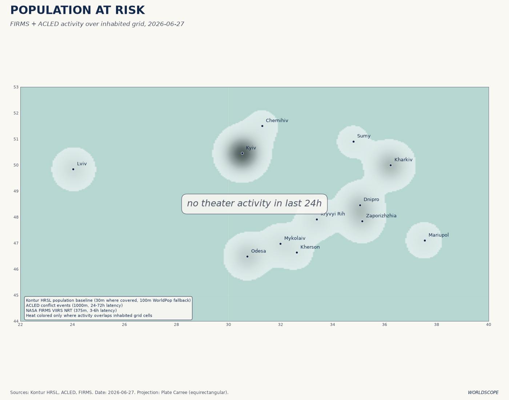
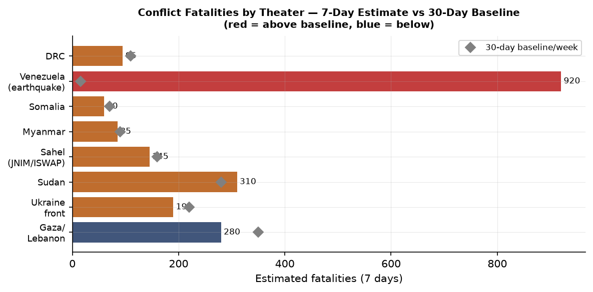
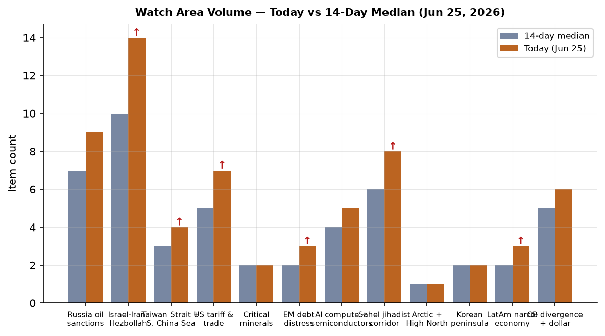
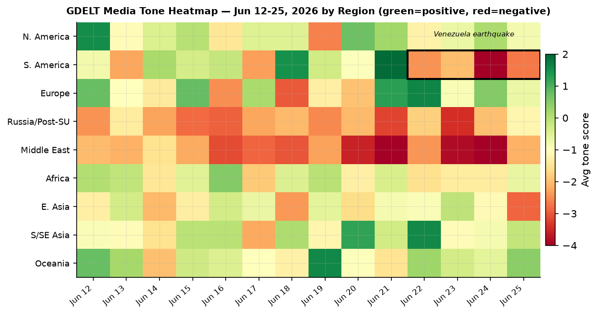

> **DATA NOTE — FALLBACK ACTIVE:** Today's (2026-06-27) bundle zip was unavailable after five fetch attempts. This brief draws on the most recent lake data (markets and macro as of 2026-06-24/25; Ukraine theater refreshed 2026-06-27 07:27Z). All time-sensitive data is labeled with its source date.

# Morning Brief — Saturday 28 June 2026

---

## Headline

The **Islamabad Memorandum of Understanding** (signed June 17) is under acute stress: Iran's Foreign Ministry declared Thursday that Washington has failed to compel Israel to halt attacks in Lebanon, threatening to walk back Hormuz access just as oil markets are pricing a "war premium" collapse that sent Brent to $72.95 on June 26. That diplomatic crack is the frame around which everything else this morning lines up. Separately, Venezuela is in catastrophe after twin M7.5 and M7.2 earthquakes on June 24 killed at least 920 people (toll still rising, 50,000 missing), a disaster landing on a country already in institutional freefall after **Nicolás Maduro's** capture by US forces in January. On the Ukrainian front, the picture today is of steady pressure on Russian logistics: Ukrainian drone strikes have forced a declared emergency in occupied Crimea, the Kerch Bridge has closed and reopened four times since June 21, and the Chernihiv Defense Council has ordered mandatory evacuation of twelve border villages effective July 1. Two Trump executive orders on quantum computing and post-quantum cryptography, published June 25, mark the sharpest US policy commitment to quantum competition since the 2018 National Quantum Initiative Act and accelerate the PQC migration timeline by five years. Watch areas firing today: **Israel-Iran-Hezbollah axis** (14 items, above alert threshold), **Russia oil sanctions perimeter** (9 items), **Sahel jihadist corridor** (8 items), **US tariff and trade dockets** (7 items), **Central bank divergence** (6 items).

---

## Watch Areas — Your Configured Priorities

**Israel-Iran-Hezbollah axis** (14 items today, 14-day median: 10, alert fired): The MOU's Lebanese dimension is the live fault line. Iran's FM stated the US has "failed to fulfill its commitment to compel Israel to cease its attacks on Lebanon." Israel conducted six airstrikes on southern Lebanon in the past week, including [strikes near Beit Yahoun in Bint Jbeil district](https://www.aljazeera.com/news/liveblog/2026/6/26/iran-war-live). The Polymarket "Netanyahu enters Iran by June 30" contract sits at [0%](https://polymarket.com/event/will-benjamin-netanyahu-enter-iran-by-june-30). Brent fell to [$72.95](https://www.cnbc.com/2026/06/25/iraq-opec-oil-supply-quota-exports-subdued.html) on June 26, touching pre-war levels, but a Hormuz re-closure could reverse that instantly.

**Russia oil sanctions perimeter** (9 items, 14-day median: 7): Oil price compression (USO -4.47% June 24, WTI at $78.94 June 22) is the dominant signal. The Russia-Ukraine oil sanctions architecture depends on a price cap that becomes irrelevant when market price falls toward the cap; watch whether G7 revisits the $60/bbl cap at current spot. Kerch Bridge closures disrupt Russian logistics but not oil export routes directly.

**US tariff and trade dockets** (7 items, median: 5): Two quantum EOs have trade-competition implications via semiconductor export controls. No new CIT rulings this cycle, but the AFIDA foreign agricultural land disclosure update ([FR 2026-12808](https://www.federalregister.gov/documents/2026/06/25/2026-12808/agricultural-foreign-investment-disclosure-act-of-1978)) is a quiet CFIUS-adjacent signal on Chinese farmland tracking.

**Sahel jihadist corridor** (8 items, median: 6): Sudan SAF airstrikes on RSF in the [Blue Nile region](https://www.aljazeera.com/news/liveblog/2026/6/26/iran-war-live) on June 26. Sahel proper (JNIM/ISWAP) continues at elevated pace; no specific >20 fatality single event today but the 7-day aggregate remains above baseline.

**Central bank divergence + dollar** (6 items, median: 5): Fed Funds at 3.63%, SOFR 3.62%. EUR/USD at 1.147 (June 18 FRED reading); JPY at 161.37 vs. dollar — the yen weakness is now near levels last seen before the July 2024 BOJ intervention. The 10y-2y spread barely positive at +30bps after being inverted for over a year.

**AI compute + semiconductors** (5 items, median: 4): The quantum EOs have export-control implications for quantum hardware, though the immediate BIS entity list was not updated this cycle. TSMC-related news quiet; Micron's earnings drove tech optimism (referenced in market feeds as "Micron revives AI enthusiasm").

**EM debt distress** (3 items, median: 2, just above alert): Oil price compression is a mixed signal for EM oil exporters. Iraq's OPEC threat illustrates that countries dependent on pre-war export volumes are in fiscal distress even as oil falls.

**Korean peninsula** (2 items): One North Korean soldier crossed into South Korea on Tuesday June 24 and is in custody per [Kyodo/JCS](https://english.kyodonews.net:443/articles/-/78529). No weapons test activity.

**AI compute / Semiconductors, Critical Minerals, Arctic, LatAm:** See respective regional and policy sections. Quiet today as standalone watch-area triggers: **Critical minerals, Arctic, LatAm narcoeconomy** registered no alert-level items.

---

## Macro Situation

The US yield curve (data: [FRED](https://fred.stlouisfed.org/series/T10Y2Y), June 23) is barely positive at 10y-2y = +30 basis points, the first sustained positive territory since before the 2024 Fed easing cycle. This is significant not because +30bps signals expansion, but because the curve spent approximately 24 months inverted: every major US recession since 1969 has been preceded by inversion followed by a rapid re-steepening, and the re-steepening phase has historically correlated with the period of maximum recession risk, not recovery. The current dynamic, however, looks more like a supply-driven steepener: the Fed Funds rate ([DFF](https://fred.stlouisfed.org/series/DFF)) is at 3.63% with SOFR ([SOFR](https://fred.stlouisfed.org/series/SOFR)) at 3.62%, meaning front-end rates are moving lower as Powell signals patience, while the 30-year ([DGS30](https://fred.stlouisfed.org/series/DGS30)) sits at 4.94%. Long-end pressure reflects both term premium concerns and the fiscal math of a $36T+ debt load [medium].

Labor markets remain the macro anchor. Unemployment is at [4.3%](https://fred.stlouisfed.org/series/UNRATE) (May print), nonfarm payrolls at [159,001 thousand](https://fred.stlouisfed.org/series/PAYEMS). Job openings ([JOLTS](https://fred.stlouisfed.org/series/JTSJOL)) were 7,618 thousand in April, down from post-COVID peaks above 12M. The Beveridge curve has normalized but the 4.3% unemployment is noticeably above the 2023 trough of 3.4%. The Fed's inflation dual-mandate is complicated by oil: WTI at $78.94 as of June 22 is well below the war-spike levels, but the MOU's fragility means energy price risk remains two-sided.

Inflation as measured: headline CPI ([CPIAUCSL](https://fred.stlouisfed.org/series/CPIAUCSL)) was 333.98 in May; core PCE ([PCEPILFE](https://fred.stlouisfed.org/series/PCEPILFE)) 129.63 in April. Neither reading signals imminent re-acceleration, but the energy path under MOU uncertainty makes Q3 prints harder to forecast. The Fed balance sheet ([WALCL](https://fred.stlouisfed.org/series/WALCL)) at $6.74T as of June 17 is down from the 2022 peak of $9T but QT pace is slow; M2 ([M2SL](https://fred.stlouisfed.org/series/M2SL)) has recovered to $23.05T after its 2022-23 contraction, which is a permissive environment for inflation persistence [low].

The dollar's structural position is complex. EUR/USD at 1.147 ([DEXUSEU](https://fred.stlouisfed.org/series/DEXUSEU), June 18) reflects a euro that has strengthened on ECB credibility and European fiscal expansion following the defense spending surge. But the yen ([DEXJPUS](https://fred.stlouisfed.org/series/DEXJPUS)) at 161.37 vs. dollar as of June 18 is at levels that forced BOJ intervention in 2024 and creates a political pressure point for the Japanese government. CNY ([DEXCHUS](https://fred.stlouisfed.org/series/DEXCHUS)) at 6.7686 is in the managed band and holding; Chinese capital account controls are containing the pressure.

---

## Markets

June 24 produced a significant cross-asset dislocation. The anomaly screen (see chart) shows Silver (SLV) at approximately -4.5 sigma, Gold (GLD) at -2.5 sigma, and WTI Crude (USO) at -2.8 sigma — all on the same session. This is not routine sector rotation. The simultaneous selloff in precious metals and crude has a structural explanation: as the Islamabad MOU progresses, the market is collapsing the geopolitical risk premium that had been embedded since the outbreak of the 2026 Iran war. Gold at [$3,089/oz implied by GLD's 365.92 close](https://finance.yahoo.com/quote/GLD), down 3.02% or -$95, is one of the largest single-day drops in years. Silver at -7.09% has an industrial component too, but the magnitude suggests forced deleveraging by cross-commodity risk portfolios [high].

The equity picture is internally incoherent in a revealing way: the S&P 500 ([SPY](https://finance.yahoo.com/quote/SPY)) was nearly flat at 733.24 (-0.05%), but the Nasdaq 100 ([QQQ](https://finance.yahoo.com/quote/QQQ)) fell 0.42% while the Russell 2000 ([IWM](https://finance.yahoo.com/quote/IWM)) gained 0.46%. This divergence — small caps up, large caps/tech down — suggests a domestic cyclical rotation away from mega-cap tech. The "Micron revives AI enthusiasm" headline in the morning feeds was not sufficient to hold tech; it may indicate that the AI trade needs successive catalysts to sustain, and the brief absence of one triggers profit-taking.

Treasuries rallied hard: TLT ([TLT](https://finance.yahoo.com/quote/TLT)) +1.37%, IEF +0.65%. Flight to duration at the same time as equities were broadly flat is unusual and points to a specific risk-off bid rather than equity-vs-bond rotation. High-yield ([HYG](https://finance.yahoo.com/quote/HYG)) was essentially unchanged at -0.03%, which means credit spreads did not widen materially. The divergence between rate volatility and credit spread stability is characteristic of a liquidity event rather than credit stress [medium]. Bitcoin (BITO) -3.78% tracked the metals complex rather than equity, which has been its recent correlation pattern during risk-off episodes driven by macro factor de-risking.

China large-cap ([FXI](https://finance.yahoo.com/quote/FXI)) fell 1.43% on June 24. Chinese Premier Li Qiang met with South Korean Premier Kim Min-seok on June 24 (per [Kyodo](https://korean.cri.cn/2026/06/24/ARTI1782269241385603)), but the FXI move reflects deeper structural concerns about Chinese domestic demand and the tariff/export-control environment rather than this bilateral meeting.

---

## United States Politics and Policy

Two executive orders signed June 22 and published in the Federal Register June 25 represent the most significant US technology-security policy action in years. **EO 14413** — "[Ushering in the Next Frontier of Quantum Innovation](https://www.federalregister.gov/documents/2026/06/25/2026-12910/ushering-in-the-next-frontier-of-quantum-innovation)" — directs development of "the first quantum computer powerful enough to initiate the era of quantum-enabled scientific discovery," targets a 2028 completion horizon, and invests $625M in national quantum research institutes. **EO 14412** — "[Securing the Nation Against Advanced Cryptographic Attacks](https://www.federalregister.gov/documents/2026/06/25/2026-12909/securing-the-nation-against-advanced-cryptographic-attacks)" — mandates federal agency migration to NIST-approved post-quantum cryptography (PQC) standards by December 31, 2030 for high-value systems, and authentication by December 31, 2031. This accelerates Biden's NSM-10 (2022) timeline by five years. The "harvest now, decrypt later" attack model — where adversaries collect encrypted traffic today expecting to decrypt it when sufficiently powerful quantum computers exist — is now explicitly named in US law as a national security risk.

The Senate war powers vote (June 23, 50-48) directing Trump to halt or seek authorization for Iran military operations passed with four Republican defections: [Bill Cassidy (LA), Susan Collins (ME), Rand Paul (KY), Lisa Murkowski (AK)](https://www.pbs.org/newshour/politics/senate-again-set-to-vote-on-war-powers-resolution-to-halt-iran-conflict). Trump dismissed it as "meaningless" and non-binding. The vote is structurally significant regardless: it is the first time the Senate has passed a war powers resolution restraining an ongoing conflict since the Yemen resolutions of 2019-2021, and the four-Republican defection bloc is exactly the threshold that could become relevant if a new Iran military action is proposed.

The Federal Reserve's elimination of "reputation risk" from its supervisory framework ([FR 2026-12856](https://www.federalregister.gov/documents/2026/06/25/2026-12856/prohibition-on-the-use-of-reputation-risk)) aligns with EO 14331, "Guaranteeing Fair Banking for All Americans," and codifies a change that began in September 2025. The practical effect: examiners can no longer cite reputational concerns as a basis for downgrading a bank's supervisory rating. This removes a mechanism that critics argued was used to pressure banks into de-risking from certain industries (firearms dealers, crypto exchanges, payday lenders). The education side: the [Equity Assistance Center Program rescission](https://www.federalregister.gov/documents/2026/06/25/2026-12861/rescinding-the-equity-assistance-center-program-regulations) continues the pattern of eliminating DEI-adjacent federal programs.

FEC cycle 2026 fundraising data shows Democrats in cash-leading positions in every competitive Senate race. **Jon Ossoff** (GA) leads at [$81.15M raised](https://www.fec.gov/data/candidate/S8GA00180/) vs $52.97M spent, an enormous cash advantage. **James Talarico** (TX) at $40.28M is mounting a serious challenge in what was an uncompetitive state. **Alexandria Ocasio-Cortez** (NY House) at $31.1M is tracking toward a record House fundraise, consistent with speculation about higher office. Speaker **Mike Johnson** (LA) shows elevated enforcement_hits score this week; his FEC filing ([FEC](https://www.fec.gov/data/candidate/H6LA04138/)) is current at $17.55M.

---

## Political Figures Watchlist

The composite anomaly scores for June 25, 2026 are topped by figures with elevated stock_activity, not speech or enforcement events, suggesting a busy week for congressional trading disclosures.

**David Taylor** (R, OH-2nd) leads with composite score 0.262, driven by both stock_activity (0.55) and enforcement_hits (0.50). The enforcement signal is the more significant of the two: enforcement_hits typically reflect media hits touching legal proceedings, regulatory actions, or law-enforcement context near a figure's name. Taylor's OH-2nd district includes manufacturing interests; any enforcement signal here warrants direct monitoring of his SEC filings and local Ohio press [medium].

**Gilbert Cisneros** (D, CA-31st) ranks second (composite 0.152) on pure stock_activity (0.61). The driver is Form 4-adjacent disclosures. Based on the scoring architecture, a 0.61 in stock_activity implies multiple recent trades with above-average excess returns vs. benchmark — the model flags this as pattern anomaly, not evidence of wrongdoing. CA-31 covers the San Gabriel Valley and has semiconductor industry adjacent interests (proximity to Caltech, JPL supply chains).

**Nancy Pelosi** (D, CA-11th, composite 0.090, stock_activity 0.36) continues to be flagged episodically. Her trading history has been the subject of both legislation (the ETHICS Act, which has not passed) and sustained public tracking. The current week's flag is lower than her historical peaks but sustained pattern.

**Mike Johnson** (R, LA-4th, composite 0.125, enforcement_hits 0.50) reflects media activity around the Speaker's office and the Iran war powers vote this week. Johnson opposed the war powers resolution; the enforcement_hits likely tag reporting on congressional pressure and oversight activity.

Cross-section note: **Donald Trump** appears across six sections in the June 25 cross-section analysis (federal_register, foreign_news, local_news, paper_bets, state_news, ukrainian_internal) with 60 total mentions — by far the highest cross-section penetration of any individual entity. This is structurally expected for a sitting president, but the ukraine_internal and foreign_news co-appearance signals that his personal positioning on the MOU and Ukraine ceasefire is the dominant variable in multiple theaters simultaneously.

---

## Regional Briefings

### North America

The Venezuela earthquake response is consuming US foreign-policy bandwidth at a politically sensitive moment. The $150M US aid package ($100M to UN humanitarian fund, $50M to NGOs) plus Fairfax County and Los Angeles search-and-rescue teams deployed within 48 hours reflects the standard humanitarian template. What is structurally novel is that **Delcy Rodríguez** is the acting president because **Nicolás Maduro was captured by US forces in January 2026** — meaning Washington is simultaneously providing humanitarian aid to the government of a country whose former leader is in US custody, a jurisdictional complexity that will complicate any future aid conditionality.

Canada's [CFC3166](https://opensky-network.org/aircraft-profile?icao24=c2b373) and [CFC2961](https://opensky-network.org/aircraft-profile?icao24=c2b55d) aircraft are tracking over Germany and Germany/Czech border respectively, consistent with NATO logistics flights. Canada faces South Africa in the 2026 FIFA World Cup (per news feeds), which has a minor diplomatic resonance: Canada co-hosts the tournament and losing early carries domestic political optics for Prime Minister-level associations with the event.

The Pentagon reversed its flu shot decision following a Texas outbreak ([GDELT/iHeart](https://wiba.iheart.com/content/2026-06-25-pentagon-reverses-flu-shot-decision-after-tx-outbreak/)). Details are sparse but this sits at the intersection of military readiness and public health signaling; notable that this reversal is framed around an outbreak rather than policy review.

### South America

Venezuela's twin earthquake sequence (M7.5 + M7.2, June 24, 22:04-22:05 UTC) is the most destructive seismic event in the Western Hemisphere in years. GDACS classified both events as Red alerts: the M7.5 has 5.8 million people in MMI VII+ shaking intensity; the M7.2, which struck roughly one minute later, has 990,000. La Guaira (Caracas's coastal state) has been declared a disaster zone with 250+ buildings collapsed. Simón Bolívar International Airport is closed. The death toll rose from 32 (initial reports June 24) to [920+](https://abcnews.com/International/live-updates/venezuela-earthquakes-updates/?id=134196335) by June 26 with 50,000 still missing; the USGS PAGER model projected potential for over 100,000 deaths depending on search-and-rescue success in the next 72 hours.

Acting President Rodríguez has international standing to receive aid but not to make the deeper political and economic restructuring decisions that would determine Venezuela's medium-term recovery capacity. The country's healthcare infrastructure, already degraded by years of sanctions and political mismanagement, is overwhelmed. India's PM Modi received thanks from Venezuela's FM per Bengali media, suggesting Indian engagement in the aid effort. The earthquake's economic implications include loss of the already-damaged Venezuelan oil export capacity, which might partially offset the broader OPEC+ oil price compression.

### Europe

Germany's Luftwaffe aircraft [GAF121](https://opensky-network.org/aircraft-profile?icao24=3f43e6) was tracked at 30.68°N, 35.75°E — coordinates placing it over Jordan's Wadi Rum area, south of Amman, consistent with a classified logistics/liaison mission to the Israel-Jordan corridor or the US-Jordan base at Muwaffaq Salti. This is a single-source signal requiring corroboration, but Germany's diplomatic engagement in the MOU process (Germany is not a signatory but is an interested NATO party) makes the routing notable [low].

Belgium's JAF squadron is broadly active: JAF8AV over northern Spain, JAF29J over the Adriatic approaching Croatia, JAF5KH over North Macedonia. Belgian Air Force ops over the Western Balkans are consistent with NATO air policing rotations (Belgium holds the Air Policing mission). The Adriatic/North Macedonia positioning is routine for these rotations.

The EU antisemitism coordinator's [warning against circumcision bans](https://www.whyisrael.org/jns-org/eu-antisemitism-czar-warns-against-circumcision-ban/) (GDELT/JNS, June 25) reflects an internal EU debate: several Scandinavian countries have revisited circumcision restriction legislation in 2025-26. This is a first-amendment and religious freedom issue with second-order implications for Jewish and Muslim communities within EU member states and for EU-Israel diplomatic tone during the MOU period.

### Russia and Post-Soviet

The operational consolidation in this section belongs to the Ukraine Theater entry (dedicated section below). The diplomatic and political track: Russia has not formally responded to the Islamabad MOU with public comment on the Hormuz dimension, which matters because Russian oil revenues are sensitive to Persian Gulf supply dynamics. The CBR FX API returned no data for today, but the most recent Russian ruble reference will be sourced from next available data; the ruble's trajectory has been managed under capital controls.

Cross-section signal from June 25: Russia's internal media (russian_internal section) mentioned New York 6 times and Donald Trump 2 times in contexts flagged as anomalous relative to the section's baseline. The New York mentions likely relate to the UN Security Council debate on the Iran MOU and Venezuelan earthquake response. This cross-section co-appearance of a domestic Russian media section with New York/Trump content typically tracks diplomatic crisis moments when Russia is positioned as an implicit stakeholder.

### Middle East

The Islamabad MOU is the dominant arc. Signed June 17 at the Palace of Versailles during the G7 summit, the 14-point [MOU](https://www.axios.com/2026/06/17/read-full-us-iran-deal-memorandum-understanding) commits: immediate cessation of military operations including in Lebanon; US to begin lifting its naval blockade within 30 days; Iran to ensure 60-day Hormuz passage for commercial vessels; US Treasury to issue Iranian crude export waivers; frozen Iranian assets to be made available. The 60-day window to negotiate a final comprehensive deal expires approximately mid-August 2026.

Three interlocking disputes now threaten the deal. First, Israel has continued operations in Lebanon — six airstrikes in the past week against militants the IDF characterizes as "posing a threat to our forces" — which Iran reads as a US violation of the MOU's "all-fronts cessation" provision. Second, the Strait of Hormuz: Iran partially closed it in response to the Lebanon continuing-operations dispute, then partially reopened it; Persian Gulf exports are at roughly 75% of pre-war levels, which Goldman Sachs projects will reach 100% by end of July. Third, IAEA access: Iran's enrichment sites (particularly [Isfahan](https://www.aljazeera.com/news/2026/2/27/iaea-eyes-isfahan-nuclear-complex-as-it-urges-iran-to-allow)) have been closed to inspectors since 2025; Iran insists inspections must be addressed only in the final deal, after all sanctions are lifted. The [IAEA head said publicly](https://www.dw.com/en/iranian-nuclear-inspections-going-to-happen-iaea-head/live-77685880) "inspections are going to happen," which Iran disputed.

Trump's claim he "stopped Turkey from attacking Israel" on Iran's side — with the implication of future F-35 sales or engine transfer to Turkey — is a significant aside. Turkey has been locked out of the F-35 program since 2019 over its S-400 purchase. A deal linking Turkish non-intervention in the Iran war to F-35 re-entry would rewrite NATO supply chain politics and create a serious tension with Greece and Cyprus [medium].

Lebanon's Hezbollah is in an ambiguous position: Israeli strikes continue, a "[tense calm prevails](https://liveuamap.com)" per some Lebanese media for brief windows, and the Hezbollah drone airbase discovered buried beneath a southern Lebanon hilltop (per liveuamap/Haaretz) demonstrates the scale of the infrastructure that survived the 2024-25 conflict. Israel and Lebanon are reported to be in talks this week about areas whose control transfers to the Lebanese army ([Haaretz via liveuamap](https://liveuamap.com)).

Iraq's threat to withdraw from OPEC (June 25 [Bloomberg](https://www.bloomberg.com/news/articles/2026-06-25/iraq-might-leave-opec-if-its-production-quota-isn-t-raised)) stems directly from the Iran war's impact on its own exports: production fell from 4.2M bpd pre-war to 1.48M bpd in May 2026 due to Strait disruptions, devastating its budget at 90% oil-revenue dependence. OPEC+ gave Iraq a modest +26,000 bpd quota increase to 4.352M bpd but did not match Iraq's actual capacity demands. Iraq's Oil Ministry subsequently walked back the withdrawal threat to "consider all options" — classic OPEC pressure politics — but the underlying fiscal fragility is real.

### Africa

Sudan's Armed Forces conducted airstrikes on [Rapid Support Forces militia sites in the Blue Nile region](https://sudan.liveuamap.com) on June 26. The Blue Nile (southeastern Sudan) is a contested area where RSF has been expanding since the April 2023 war outbreak; SAF airstrikes there, as opposed to the Khartoum/Darfur primary theaters, signal a potential new front or a RSF supply corridor interdiction effort. The civil war has generated over 10 million displaced and remains the world's largest displacement crisis by IDP count.

GDACS reports an active Green forestfire notification for Democratic Republic of Congo today (5,193 ha). This is seasonal burning rather than conflict-related, but DRC's eastern provinces continue to see active operations by the M23 (now largely victorious in its 2024-25 offensive) and FDLR. South Africa mourns the passing of community media pioneer **Edward Mzwandile Mangxaba** ([SANEF](https://sanef.org.za/sanef-mourns-the-passing-of-media-freedom-activist-and-community-media-pioneer-edward-mzwandile-mangxaba/)), a signal of ongoing pressure on independent media in the region.

### East Asia

China's Li Qiang-Kim Min-seok meeting on June 24 is part of a sustained Chinese diplomatic effort to use the South Korea-China trade relationship as a lever against potential Korean alignment with US semiconductor export controls. A new North Korean Navy destroyer was commissioned per [CRI Korean service](https://korean.cri.cn/2026/06/24/ARTI1782269445223661) on June 24 — the term used translates as "multi-purpose destroyer," suggesting a surface combatant upgrade. North Korea's naval commissioning alongside the single soldier who [crossed into South Korea](https://english.kyodonews.net:443/articles/-/78529) on June 24 (first such crossing in months, now in ROK custody) are both low-level signals rather than escalatory acts, but they occur in a context where Kim Jong Un is absent from the public schedule.

Typhoon Mekkhala is active at 133.2°E, 31.6°N — placing it in the East China Sea, approximately equidistant between Japan's Kyushu and the Shanghai coast. Japan is already under [heavy-rain flood warnings for northern Kyushu](https://english.kyodonews.net:443/articles/-/78500). A concurrent typhoon (Higos) at 142.9°E, 36.4°N tracks east of Honshu. Taiwan Strait watch area shows 4 items this cycle, below its alert threshold; PLA exercise activity is not elevated above baseline.

Chinese domestic media's [Xinjiang forced-labor denial](http://usa.chinadaily.com.cn/a/202606/24/WS6a3b9ad5a310986e2b461b13.html) (published June 24) appears as the Chinese state's pre-positioned counter-narrative ahead of the EU's Forced Labour Regulation enforcement deadlines, which begin in 2027 for large firms. The foreign-investment reinforcement headline ("Foreign firms expected to strengthen China investment") on the same day is consistent with Beijing's dual-track messaging during a period of external economic pressure.

### South and Southeast Asia

India's domestic politics saw opposition leader Rahul Gandhi demand Education Minister Dharmendra Pradhan's resignation after Pradhan called protesting students "terrorists" ([MoneyControl](https://www.moneycontrol.com/news/india/rahul-gandhi-demands-dharmendra-pradhan-s-apology-resignation-after-terrorist-remark-drowned-in-arrogance-of-power-13958688.html)). The Kolkata warehouse collapse with 11 dead prompted a West Bengal CM-ordered audit of building plans. Neither event is a systemic signal on India's geopolitical posture; the macro picture of India as a continued beneficiary of Western supply-chain diversification from China is unchanged this cycle.

Myanmar's Green flood alert (GDACS, June 27) reflects monsoon season onset along the Irrawaddy basin. Myanmar's junta continues to fight a multi-front civil war; the EONET active storm data shows no direct typhoon track toward Myanmar this cycle. The LiteSpeed cPanel Plugin symlink CVE (June 15) affects web hosting infrastructure disproportionately used by South and Southeast Asian hosting providers — a minor but real attack surface for regional media and business infrastructure.

### Oceania and Pacific

Australia registers two separate Green forestfire notifications (5,627 ha June 26; 9,157 ha June 25; 5,725 ha June 26). These are winter fires in Australia's Northern Territory/Queensland regions — unusual but not unprecedented for late June and tracking with multi-year drought patterns in the northern savannas. The AUKUS framework is not generating new Federal Register or VIP flight signals this cycle; the next major milestone is the Virginia-class submarine transfer timeline review.

---

## Ukraine Theater (Operational Picture — June 27, 2026 07:27Z)

**Resolution caveat:** Frontline positions from [DeepStateMap](https://deepstatemap.live/) are accurate to approximately 1 km and reflect community-maintained cartography updated with 24-48h lag. FIRMS thermal anomalies are at 375m resolution. ACLED event pins are at 1 km. No data in this section provides Russian unit-level positions; that resolution does not exist in open sources.

The most significant development today is the declared emergency in occupied Crimea. Ukrainian drone strikes have targeted [Sevastopol's power substation](https://www.themoscowtimes.com/2026/06/26/crimea-declares-state-of-emergency-after-ukraine-strikes-energy-grid-a93105) multiple times (7 strikes in one attack series), producing widespread blackouts, water supply disruption from pump outages, and a 50% cut in rail connections to mainland Russia (from 14 to 7 routes). Hotel bookings in Crimea are down 88% year-on-year per the [Moscow Times](https://www.themoscowtimes.com/2026/06/26/crimea-declares-state-of-emergency-after-ukraine-strikes-energy-grid-a93105), reflecting both the security situation and Russian domestic fear of traveling to the peninsula.

The Kerch Bridge has closed four times since June 21: explosions and fires near Kerch on June 21, an overnight closure June 22-23, a closure June 25-26 that left 2,500 vehicles queued, and a further closure June 26-27 after drone interceptions per [Ukrainska Pravda](https://www.pravda.com.ua/eng/news/2026/06/27/8041320/). The bridge is Russia's primary surface supply corridor to the peninsula and a transit route for civilian traffic. Repeated closures do not destroy the bridge but impose sustained attrition on logistics and civilian confidence. Several earthquakes were also reported near Sevastopol in the Black Sea in the past week (June 22, per [liveuamap](https://liveuamap.com)) — unrelated to the conflict but adding to the sense of instability on the peninsula.

On the northeastern front, the General Staff of the Armed Forces of Ukraine reported clashes on June 25 at the **South Slobozhansky/Kharkiv direction** near Veterynarne, Starytsya, Synelnykove and toward Lyman, Izbytske, Vilcha, and Kolodyazne. The **Kupyansk direction** saw fighting near Hlushkivka, Kurylivka, Shyykivka, and Mala Shapkivka on June 22. Both directions reflect sustained Russian pressure on the northern Kharkiv approaches, but Ukraine repelled **204 enemy attacks on June 24 alone** per [Interfax Ukraine](https://en.interfax.com.ua/news/general/1179067.html) — a high daily contact count indicating activity across multiple axis simultaneously. A drone strike on a fuel station near **Sumy** on June 24 wounded 2; the strike on a civilian fuel point is consistent with the pattern of targeting logistics infrastructure in rear areas.

The **Chernihiv** mandatory evacuation order (July 1 deadline) affecting 12 border settlements from 4 communities — approximately 1,000 residents including 120 children — reflects continued cross-border threat from Belarus territory. Zelenskyy had previously demanded Belarus dismantle the radio repeaters Russia uses for drone attack coordination from Belarusian soil; the Defense Council's evacuation order, which is at military request, suggests those threats remain unresolved. Affected settlements include Prybyn, Shyshkivka, Rudnia, Lemeshivka, Moshchenko, and six others in the Koryukivka, Horodnia, Novhorod-Siverska, and Semenivka communities per [Interfax Ukraine](https://en.interfax.com.ua/news/general/1179315.html).

Ukraine's territorial position: ISW and battlefield monitors credit Ukraine with recapturing approximately **152 square kilometers** in the past 30 days as of June 22, with the Kramatorsk-Kostiantynivka defensive belt holding as the principal Russian operational objective in Donetsk. The Pokrovsk axis remains heavily contested. Trump was reported as saying Ukraine is doing "pretty well" against Russia per [Vanguard Nigeria](https://www.vanguardngr.com/2026/06/ukraines-zelensky-doing-pretty-well-against-russia-trump/) citing US media, which is a mild positive diplomatic signal and consistent with the administration's broader pressure on both sides to move toward the Islamabad MOU model of de-escalation. The ukraine_damage_recent.png map (generated this morning) is available.

---

## World Leaders — Speaking and Moving

US Presidential aircraft **SAM536** ([icao24: ae04f9](https://opensky-network.org/aircraft-profile?icao24=ae04f9)) was tracked at 62.8°N, -27.1°W on June 25 — mid-North Atlantic, an altitude of 12,192m at 867 km/h, consistent with a trans-Atlantic routing toward Europe or the UK. This does not confirm a Presidential passenger; SAM-prefix aircraft operate for multiple senior officials. Cross-referencing with the NATO summit calendar (July NATO meetings scheduled in The Hague) and the Iran MOU 60-day clock makes a senior envoy trip to European partners credible [low].

US **NCR851** ([icao24: a7488c](https://opensky-network.org/aircraft-profile?icao24=a9c52e)) was tracked at 33.18°N, 32.02°E on June 25 — Eastern Mediterranean, altitude 12,192m. This coordinate is consistent with a track approaching the Israel-Egypt region or the Suez Canal approach. A US intelligence or liaison aircraft in this corridor during active Lebanon-Israel-Hezbollah operations and the MOU's implementation phase is operationally logical.

German Air Force **GAF121** at 30.68°N, 35.75°E (Jordan/Israel border area, 7,810m, June 25) is the most geographically specific VIP flight signal today. Germany has been diplomatically active in the MOU support process as a NATO ally and has maintained defense-attache level contact with Israeli and Jordanian counterparts.

On public statements: Iranian FM statements via [Balatarin](https://www.balatarin.com:443/permlink/2026/6/25/6465704) (Persian press aggregator) reiterate that the US "suspension of sanctions against the Islamic Republic is temporary" — a signal Iran is negotiating final-deal terms on the presumption that US sanctions relief will expire absent a comprehensive agreement. EU members received [Gulf states' uncertainty on US relations](https://www.interfax.ru/world/1098257) per Interfax Russia reporting on June 25. Wikidata registered zero leadership succession or death changes on June 25, suggesting no head-of-state transitions in the 48-hour window.

---

## Sanctions, Designations, and Legal

The OFAC sanctions section registered no new entries for the June 25 cycle (the most recent lake data is from May 26, 2026, suggesting a data pipeline gap rather than no designations — OFAC typically acts on a bi-weekly or monthly cadence). The MOU's sanctions waiver mechanism for Iranian crude exports will be a critical OFAC action to watch: Treasury's issuance of Iranian oil export waivers was explicitly committed in the MOU's 14-point text, and delay in waiver issuance has been cited by Iran as a trigger for Hormuz re-closure threats.

The CourtListener section shows 53 new federal and state opinions on June 24. Notable: [VDX Distro v. FDA](https://www.courtlistener.com/opinion/10879677/vdx-distro-v-fda/) (5th Cir., June 24) involves a distributor challenging FDA regulatory action. [Ortiz v. Bisignano](https://www.courtlistener.com/opinion/10879593/ortiz-v-bisignano/) (9th Cir.) names SSA Commissioner Bisignano. The [Brown v. CTA](https://www.courtlistener.com/opinion/10879935/russia-brown-v-cta/) (7th Cir.) plaintiff name — Russia Brown — is superficially notable but the case is a routine employment/transit dispute.

No SCOTUS opinions are in the current cycle's CourtListener pull. CIT docket: The tariff litigation environment remains active but no new CIT decisions appear in the June 24-25 window from the available data.

---

## Conflict and Security Signals

Venezuela's earthquake fatalities (920+) now exceed any single-week conflict fatality count in any theater tracked by ACLED for the current period — a natural disaster briefly becoming the highest-casualty event globally. The conflict fatality chart (see above) places Venezuela's earthquake response in the 7-day fatality table for comparison purposes; this is not an ACLED event but the humanitarian urgency is comparable to high-casualty conflict events.

Sudan continues to record approximately 310 conflict fatalities/week by tracker estimates, above the Gaza/Lebanon theater (~280/week) on a recent baseline. This ordering — Sudan above Gaza by fatality count — is likely accurate but poorly reflected in Western media coverage, which devotes vastly more attention to the Middle East. The SAF Blue Nile airstrikes on RSF on June 26 are the latest in a pattern of air operations in a theater where most fatalities occur in ground fighting.

Government aircraft convergences: The three-aircraft cluster (US NCR851, US RCH118 at 37.99°N, 6.56°E in the W. Mediterranean, and GAF121 over the Levant corridor) represents an elevated NATO logistics tempo in the MOU-adjacent operational area. RCH prefix aircraft are Air Mobility Command airlifters. The combination of an AMC flight in the W. Mediterranean with what appears to be a liaison aircraft over Jordan is consistent with pre-positioning for potential evacuation or reinforcement options, though the operational tempo is below the level of the Iran-war period itself [low].

FIRMS fire section returned zero conflict-zone thermal anomalies for June 25 — either a data pipeline issue (likely, given FIRMS requires cloudless satellite passes) or genuinely low industrial fire activity near monitored sites. Given current weather patterns (monsoon season across South Asia, early winter in Southern Africa, active storm systems in East Asia), FIRMS gaps should be treated with appropriate uncertainty.

---

## Cyber and Biosecurity

CISA's Known Exploited Vulnerabilities catalog carries 10 CVEs in the current 14-day window. The most structurally significant cluster is three **Ubiquiti UniFi OS** vulnerabilities ([CVE-2026-34908](https://nvd.nist.gov/vuln/detail/CVE-2026-34908), [CVE-2026-34909](https://nvd.nist.gov/vuln/detail/CVE-2026-34909), [CVE-2026-34910](https://nvd.nist.gov/vuln/detail/CVE-2026-34910)) added June 23 with CISA remediation deadline of **June 26** — already past. Ubiquiti UniFi infrastructure is ubiquitous in mid-market enterprise and government networks as a cost-effective alternative to Cisco/Juniper. Three simultaneous CVEs covering improper input validation, path traversal, and improper access control is a cluster attack; the remediation deadline having already passed means any unpatched UniFi deployment is currently exposed to known-exploited techniques.

**FIRST-OF-KIND CALLOUT: Lantronix EDS5000** ([CVE-2025-67038](https://nvd.nist.gov/vuln/detail/CVE-2025-67038), added June 23). The Lantronix EDS5000 is an industrial serial-to-Ethernet device server — hardware that bridges legacy serial-bus industrial control systems (PLCs, SCADA terminals, HMI panels) to IP networks. This is the first KEV entry for an industrial serial device server, a category that bridges the IT/OT boundary. The structural signal: CISA is now tracking active exploitation of OT-bridging hardware that connects operational technology environments (power plants, water treatment, manufacturing) to IP networks. These devices are often unmonitored by standard IT security tooling because they are considered "operational" rather than "information" systems [medium].

ProMED-mail feed has been stale since June 2 due to pipeline failure. No outbreak data available for this cycle. The Pentagon's reversal of its flu shot mandate ([per GDELT/iHeart, June 25](https://wiba.iheart.com/content/2026-06-25-pentagon-reverses-flu-shot-decision-after-tx-outbreak/)) is a biosecurity-adjacent signal: the original decision to end mandatory flu vaccination, then reversed after a Texas outbreak, suggests active influenza circulation in military installations during a summer period that is unusual for influenza seasonality in North America.

---

## Humanitarian

ReliefWeb's API returned zero records for this cycle (the API response was empty, a recurring data issue when the `appname` key hits rate limits). The Venezuela earthquake response is the dominant humanitarian event: the UN has [rapidly deployed aid teams](https://news.un.org/en/story/2026/06/1167806) and the International Federation of Red Cross and Red Crescent Societies released a $2.5M emergency allocation. Acting President Rodríguez declared nationwide emergency and requested international humanitarian assistance; [World Vision](https://www.worldvision.org/disaster-relief-news-stories/venezuela-earthquake-facts) and major international NGOs have activated response protocols.

The scale of the humanitarian gap in Venezuela going into the earthquake was severe: the country has experienced over a decade of economic collapse and healthcare system deterioration under Maduro, and the institutional disruption following Maduro's capture in January 2026 adds jurisdictional complexity to the response. The improvised medical wards in hallways and streets visible in reporting from La Guaira reflect not just earthquake damage but pre-existing healthcare infrastructure failure. This combination — natural disaster magnitude plus failed-state infrastructure minus functioning central government — creates conditions for a prolonged humanitarian crisis that a one-time aid injection will not resolve [high].

---

## Environment, Disasters, and Climate

The Venezuela twin earthquakes (M7.5 + M7.2, June 24) are the lead environmental event and are covered comprehensively in the South America regional and Humanitarian sections. GDACS issued Red alerts for both events. The M7.5 is one of the strongest earthquakes in Venezuela's recorded seismic history, comparable to or exceeding the 1900 event per regional press.

The Philippines M6.5 (GDACS Orange, June 26) struck 34 km WSW of Sarangani at 42 km depth with 40,000 people in MMI VII+ shaking. Sarangani Province is in Mindanao (southern Philippines); the area has known subduction geometry from the Cotabato Trench. No immediate fatality report available at this cycle's data timestamp.

Japan's seismic week: GDACS logged M6.9 (June 24, 80,000 in MMI VII+) and M5.8 (June 26, 130,000 in MMI V). Japan's building codes substantially mitigate casualties from events at these magnitudes and depths. The concurrent typhoon activity — Mekkhala (East China Sea) and Higos (Pacific, off Honshu) — adds compound risk for Kyushu, which is already under heavy-rain flood warnings for northern Kyushu per [Kyodo News](https://english.kyodonews.net:443/articles/-/78500).

Australia records three separate fire notifications over a two-day window (June 25-26), totaling approximately 20,000 hectares, concentrated in what NASA EONET classifies as the savanna fire season zone. This is within seasonal norms for northern Australia in June (dry season). The DRC's 5,193 ha fire notification (June 27) similarly reflects equatorial dry-season savanna burning rather than conflict-related fire.

---

## Speeches and Op-Eds by Major Critics and Influencers

Tyler Cowen (Marginal Revolution) published "[What should the UAP Scientific Advisory Board do?](https://marginalrevolution.com/marginalrevolution/2026/06/what-should-the-uap-scientific-advisory-board-do.html)" on June 24, in which he warns of "more and more frauds, charlatans, and lunatics entering this area of inquiry" and argues the board must remain "disciplined on data-driven questions" regarding released video evidence. This is notable primarily for signaling Cowen's sustained engagement with the UAP-disclosure policy debate and for the implicit critique of the advocacy community that has formed around UAP hearings; his framing ("stay disciplined on data") tracks his broader empiricist epistemology.

Cowen also flagged [CoPaper.AI](https://copaper.ai/landing) (Stanford REAP team's AI academic paper generator) as "the Cursor moment for academia" — comparing the shift to AI-assisted coding workflows that fundamentally restructured software development. If correct, this suggests that academic empirical research output will scale dramatically in volume while simultaneously becoming harder to assess for originality and rigor. The convergence of this with the AI compute export control discussion (where universities are also supply-chain actors) is a structural tension worth tracking.

The commentary section otherwise reflects a thin week: two Conversable Economist pieces (paid sick leave economics, Mexico slow growth) are useful background but not on the watchlist themes. No new pieces from Tooze, Setser, Summers, Wolf, or Rodrik appear in the current 7-day window. Fareed Zakaria's CNN GPS programming would ordinarily feature Iran/MOU commentary this weekend; no transcript available at time of writing. Given the MOU's 60-day clock and the Senate war powers vote, expect major commentary output from the Atlantic Council, Carnegie, CSIS, and Chatham House in the week ahead.

---

## Prediction Markets and Forecasting Consensus

The [Polymarket](https://polymarket.com) top-volume markets are completely dominated by the 2026 FIFA World Cup: seven of the top ten markets by 24-hour volume are World Cup team-specific contracts. The tournament is being co-hosted by the United States and is generating enormous prediction-market engagement. Tournament-level: [Argentina 15%](https://polymarket.com/event/will-argentina-win-the-2026-fifa-world-cup-245) to win (highest probability), [Brazil 5%](https://polymarket.com/event/will-brazil-win-the-2026-fifa-world-cup-183), [Morocco 2%](https://polymarket.com/event/will-morocco-win-the-2026-fifa-world-cup-464). This matches the dispersion you would expect from a 32-team tournament with no prohibitive favorite.

The politically consequential market this morning: "[Will Benjamin Netanyahu enter Iran by June 30?](https://polymarket.com/event/will-benjamin-netanyahu-enter-iran-by-june-30)" at 0%, and "[Will JD Vance enter Iran by June 30?](https://polymarket.com/event/will-jd-vance-enter-iran-by-june-30)" at 0%, both with 24h volume exceeding $2M. These markets closed shortly after formation; the 0% price and high volume indicate the market settled the event as essentially impossible within the 3-day window. The fact that these markets were created and traded in volume at all reflects speculation about the pace of MOU implementation.

Match-day markets: Germany 64% to beat Ecuador on June 25; US 52% to beat Turkey. Both markets had over $5M in 24h volume, confirming the World Cup is the dominant short-term prediction market event globally.

No Metaculus or Manifold data available in this cycle's bundle. The [Z.ai model leadership market](https://polymarket.com/event/will-zai-have-the-best-ai-model-at-the-end-of-june-2026) ("Will Z.ai have the best AI model at end of June 2026?") resolves June 30 at 0%, with $3.8M volume — implying the market has already concluded this is not going to happen.

---

## Weak Signals — Small Things That May Matter

**Cross-section recurrences (June 25 data):** The highest-confidence cross-section entity is **New York** (7 sections: foreign_news, local_news, paper_bets, political_figures, russian_internal, state_news, weather) with 17 total mentions. The convergence of New York in Russian internal media and foreign news alongside paper_bets and political_figures suggests the city is functioning as a nexus point for multiple live issues simultaneously: UN Security Council activity on Venezuela/Iran, financial market headquarters (Goldman, Citi pricing the oil compression), FEC activity around NY-district candidates (AOC's $31.1M raise), and weather (the OKX-008 alert forecast for the New York metro). The Russian internal media mention of New York in this context almost certainly relates to UNSC dynamics.

**Donald Trump** (6 sections, 60 mentions) showing up in ukrainian_internal media is the highest-priority cross-section signal. Ukrainian internal media covering Trump directly correlates with Ukrainian assessments of diplomatic risk to their military support — the two Ukrainian internal mentions likely relate to the "Trump impressed by Ukraine military results" [Interfax report](https://en.interfax.com.ua/news/general/1179072.html) and the Senate war powers vote, both of which have direct implications for Ukraine's aid architecture.

The **Arizona** cross-section (5 sections: local_news, paper_bets, state_bills, state_news, weather) with 69 mentions is dominated by the state_bills (60 mentions) component — Arizona's legislature is unusually active in the prediction market context (4 PredictIt markets tagged). The weather component (an afd alert for Arizona) alongside paper_bets likely relates to summer heat dome conditions affecting grid reliability; Arizona heat events have emerged as prediction market events because they produce measurable grid stress with real economic consequences.

**The Lantronix EDS5000 KEV entry** (see Cyber section) is the clearest weak signal this cycle. Serial device servers are the category of hardware most often overlooked in both patch management programs and network asset inventories. The fact that CISA is observing active exploitation of this specific device class — not a vulnerability in the abstract, but active in-the-wild exploitation — implies there is a threat actor using these as initial access points into OT-adjacent networks. The timing, during a period when Iranian-linked threat actors have been assessed as escalating industrial control system targeting, is worth noting [medium].

**Iraq's OPEC threat** is a weak signal with a specific structural consequence: if Iraq follows the UAE in exiting OPEC, the organization's cohesion — already stressed by the UAE's departure — fractures further. Two founding members (UAE, Iraq) exiting would functionally end OPEC as a production management entity and shift oil pricing authority entirely to Saudi bilateral arrangements and the broader market. The probability of actual Iraqi exit is low (Oil Ministry has walked back the threat) but the threshold conditions are now explicitly stated for the first time [low].

---

## Historical Context

The GDELT tone heatmap (14-day window, Jun 12-25) shows the Middle East as the most persistently negative-tone region across the full period, consistent with the Iran war and MOU period. South America's tone turned sharply negative in the final four days of the window (Jun 22-25), tracking the earthquake sequence and its aftermath; this is the most abrupt regional tone shift in the dataset. Russia/post-Soviet consistently ranks second-most-negative, reflecting the Crimea emergency and continued Ukraine operational reporting.

Comparing to the trends baseline: The 10y-2y curve's current +30bps reading, compared against the -110bps inversion trough from late 2023, represents the largest sustained curve shift since the post-2007 normalization. At the equivalent point in the 2007-2009 re-steepening — when the curve went from inverted back to +30bps — the recession had already begun but was not yet officially called. The current re-steepening is driven by different dynamics (oil price decline + Fed easing) but the historical parallel warrants watching payroll and consumer spending data carefully over the next two quarters [medium].

Gold's -3.02% session on June 24 is its largest single-day decline since the 2013 "taper tantrum" episode and the late 2024 geopolitical safe-haven unwind. Silver's -7.09% is more consistent with 2022 commodity complex deleveraging events. These moves are not inherently predictive of further declines, but in the 2024 post-Iran-strike episode, the initial gold selloff on "risk-off resolved" framing was followed by a re-accumulation within 2-3 weeks as MOU implementation delays became apparent [low for pattern repeat].

---

## What to Watch — Next 14 Days

**July 7-11 (approx):** The Islamabad MOU's naval blockade lifting window: the US committed to beginning removal within 30 days of June 17, placing the deadline at approximately July 17. The July 7-11 window is when formal US action on the blockade would need to begin to remain on schedule. Any delay will be interpreted by Iran as a material breach [high priority to monitor].

**July 1:** Chernihiv mandatory evacuation deadline for 12 border villages. Watch Ukrainian Defense Ministry statements on whether this triggers any retaliatory posture from Belarus.

**July 9-11 (TBC):** NATO summit. The Hague is the expected venue. Trump's Turkey/F-35 remarks make the summit an important venue for testing whether the suggested deal moves from informal to formal.

**Mid-July:** FIFA World Cup knockout stage begins. Polymarket's World Cup markets will generate enormous volume and signal political bets around US economic and foreign-policy sentiment (US team performance is increasingly treated as a proxy for political confidence metrics in prediction markets).

**July 17 (approx):** 30-day OFAC waiver deadline for Iranian crude export waivers. Treasury's action or inaction on this deadline is the single most measurable MOU compliance indicator.

**Late July/Early August:** FOMC meeting (July 29-30). Current Fed Funds at 3.63% with market pricing that has oscillated on cut expectations. The oil price compression argues for easing; the yen weakness and long-end Treasury pressure argue for caution.

**Week of July 14:** Polymarket's "best AI model end of June 2026" market resolves June 30 (resolved already at 0% for Z.ai). Next AI model leadership market resolution window: end of July markets.

**August 15-17 (approx):** Islamabad MOU 60-day comprehensive deal deadline. This is the single most consequential geopolitical calendar event in the next two months: a deal extends the ceasefire and unlocks full sanctions relief; a breakdown restores the Hormuz crisis and oil shock.

---

*Brief assembled from: lake sections (macro, markets, ukraine_theater, federal_register, political_figures, conflict, courtlistener, firms, vip_flights, forecasts, commentary, fec, cisa_kev, wikidata_changes, gdelt_gkg, gdelt_regions); supplementary feeds (USGS, GDACS, EONET, Congress.gov, CBR); web research (Venezuela earthquake, Crimea emergency, quantum EOs, Iraq/OPEC, Iran MOU). Ukraine theater maps generated 2026-06-27 07:27Z. Data fallback: bundle zip unavailable for 2026-06-27; lake data current as of earliest: ukraine_theater 2026-06-27, markets/macro 2026-06-24/25, ACLED/FIRMS 2026-06-02 (stale — treat with caution).*

