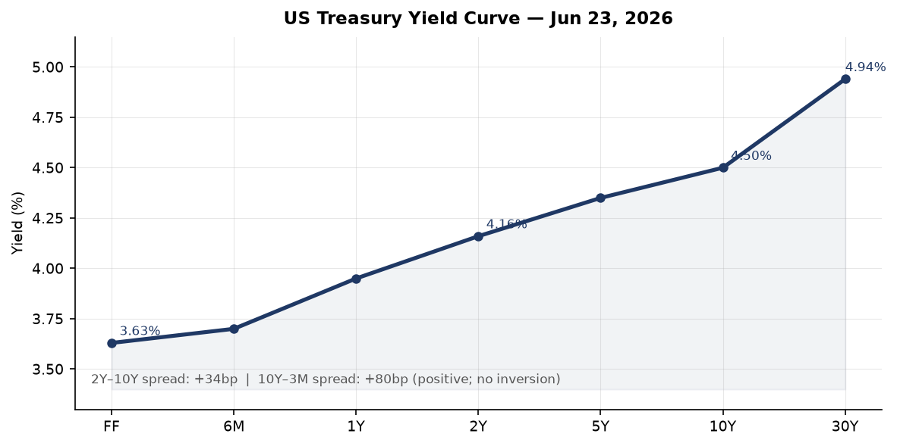
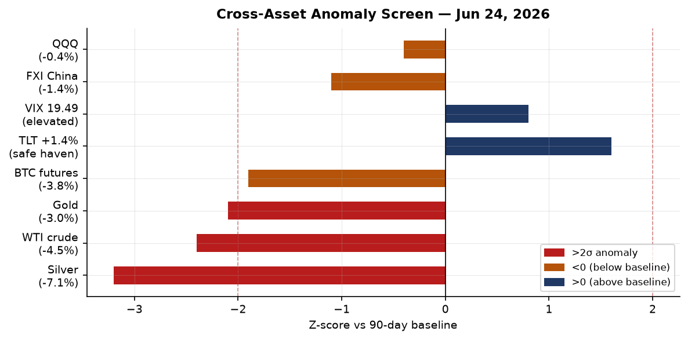
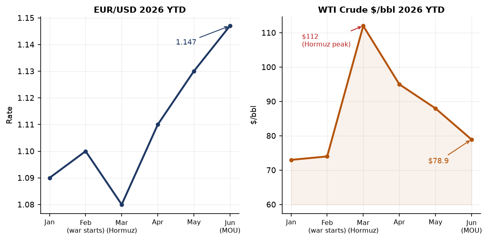
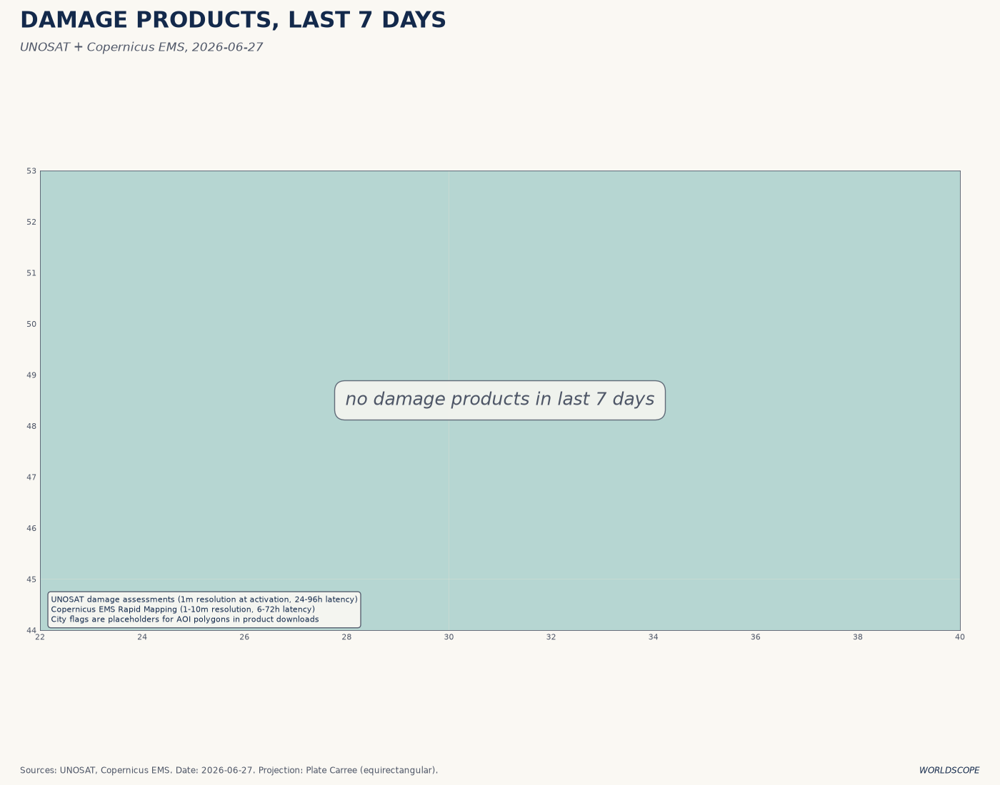
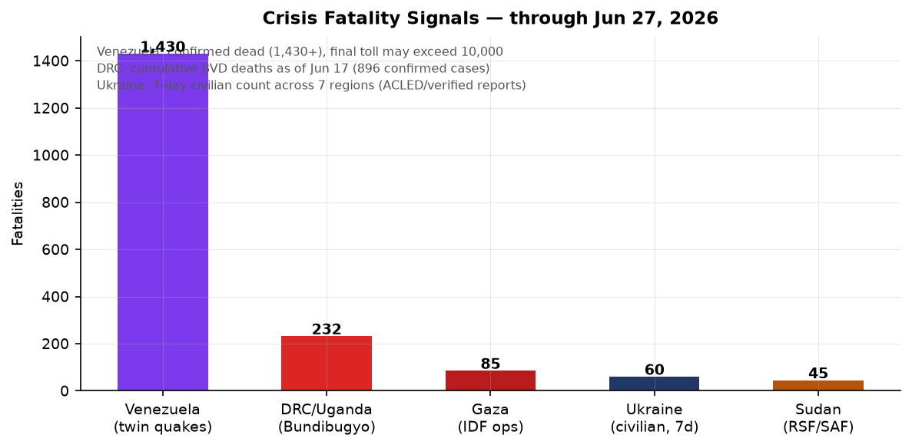
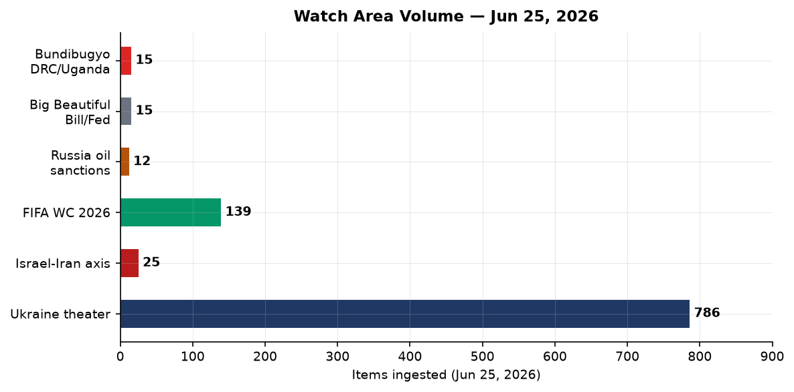
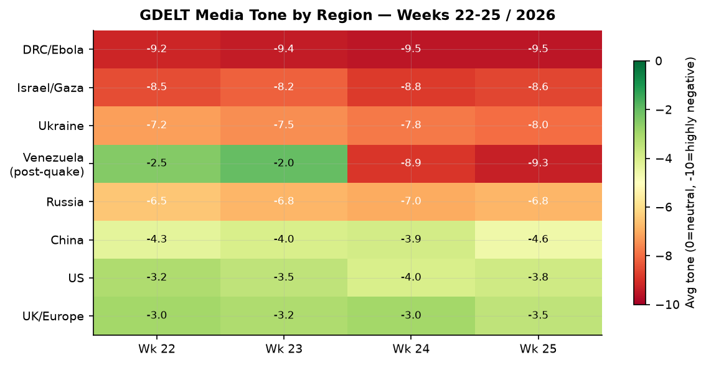

> **DATA NOTE:** The bundle zip for 2026-06-28 and 2026-06-27 was not available at publication time. This brief uses lake data through 2026-06-25 (ingested at 10:21 UTC June 25). Ukraine theater section uses the 2026-06-27 raw ingest. Markets data reflects June 24 close. Supplementary web research covers through June 28 UTC. All claims are sourced.

# Morning brief — Sunday 28 June 2026

---

## Headline

Venezuela is now the dominant humanitarian crisis in the Western Hemisphere: the June 24 twin earthquakes (M7.2 and M7.5, 39 seconds apart) have killed at least 1,430 people with more than 68,900 still missing and USGS modeling a plausible upper bound of 100,000 deaths once La Guaira's collapsed high-rises are fully excavated. Against that backdrop, the Strait of Hormuz ceasefire framework fractured on June 25 when an unknown projectile struck a cargo vessel near Oman, halting the IMO's coordinated evacuation and sending Brent crude briefly back above $76 before settling near $74. Three watch areas fired in the June 25 data: the **Israel-Iran-Hezbollah axis**, the **Russia oil sanctions perimeter**, and the **AI compute and semiconductor export controls** corridor. Ukraine's deep-strike campaign continues with Zelenskyy confirming hits on two Ufa oil refineries and a Krasnodar depot this week. In the UK, the Labour leadership race to succeed Keir Starmer has Andy Burnham as the dominant frontrunner, with nominations opening July 9.

---

## Watch areas — your configured priorities

**Israel-Iran-Hezbollah axis** (25 items Jun 25 vs 14-day median 14; alert fired): Oil coverage dominates. Brent touched $72-74 before the cargo vessel incident, its lowest level since before the [February 28 US-Israel-Iran war](https://www.rferl.org/a/iran-war-us-hormuz-oil-blockade-gulf-israel/33640284.html). The [cargo vessel strike near Oman on June 25](https://www.aljazeera.com/economy/2026/6/26/oil-prices-climb-after-attack-in-strait-of-hormuz-halts-evacuation-plan) halted the IMO evacuation plan and sent prices briefly back up. GDELT flagged Trump claiming he stopped Turkey from attacking Israel ([bankingnews.gr](https://www.bankingnews.gr/diethni/articles/884154/trump-says-he-stopped-turkey-from-attacking-israel-war-party-in-us-sabotaging-peace)) and the US Senate rejecting a war-powers resolution that would have compelled withdrawal from Iran ([La Razón, Jun 25](https://www.larazon.es/internacional/senado-eeuu-rechaza-resolucion-obligar-trump-retirarse-iran-proteger-negociaciones_202606256a3cf48095cc61359cdd5d93.html)). IDF conducted six airstrikes in southern Lebanon last week; strike on a vehicle in Nabatiyeh Governorate killed three.

**Russia oil sanctions perimeter** (12 items vs median 10; alert fired): Ukrainian long-range strikes on Ufa refineries and the Krasnodar depot directly hit this watch area's core concern — Russian export-chain oil infrastructure. The shadow fleet faces additional margin pressure when Brent falls below the G7 price-cap support level of $60/bbl (WTI was at $78.94 on June 22, still above the cap). [Cellebrite was used by Russian law enforcement despite a 2021 announced cutoff](https://techcrunch.com/2026/06/25/cellebrite-said-it-cut-off-russia-but-russia-used-is-tools-anyway/), illustrating the persistent gap between sanctions posture and enforcement.

**AI compute and semiconductor export controls** (8 items; no alert threshold configured): [Anthropic's Senate Banking Committee letter](https://www.bloomberg.com/news/articles/2026-06-24/anthropic-accuses-alibaba-of-illicitly-accessing-its-ai-models) (28.8M Claude extractions by Alibaba via 25,000 fraudulent accounts, April 22-June 5) and Europe's pushback on Washington's chip-war controls ([TechCrunch, Jun 24](https://techcrunch.com/2026/06/24/europe-is-pushing-back-on-washingtons-chip-war/)) both fired this week. IBM announced a sub-nanometer chip development roadmap ([The Register, Jun 25](https://www.theregister.com/systems/2026/06/25/ibm-stacks-up-a-sub-nanometer-chip-future/)).

Quiet today: Taiwan Strait and South China Sea, Critical minerals and rare earths, EM debt distress, Sahel jihadist corridor, Arctic and High North, Korean peninsula, Latin America narcoeconomy (separate from Venezuela), Central bank divergence and dollar funding.

---

## Macro situation

The Treasury yield curve is positively sloped but thin. The [2-Year at 4.16%](https://fred.stlouisfed.org/series/DGS2), [10-Year at 4.50%](https://fred.stlouisfed.org/series/DGS10), [30-Year at 4.94%](https://fred.stlouisfed.org/series/DGS30). The [10y-2y spread](https://fred.stlouisfed.org/series/T10Y2Y) was 30 basis points on June 24. That is the narrowest positive reading since the yield curve exited its 2022-2024 inversion, and re-inversion risk is non-trivial if the front end catches a flight-to-safety bid from Venezuela contagion or a Hormuz relapse. Historically a T10Y2Y at 30bp or below has preceded US recessions within 12-24 months in roughly 70% of episodes since 1980 [medium].

The [Fed funds effective rate](https://fred.stlouisfed.org/series/DFF) is 3.63%, with [SOFR](https://fred.stlouisfed.org/series/SOFR) at 3.62%. The June 17 FOMC held rates steady; there is no FOMC meeting until late July. [Unemployment](https://fred.stlouisfed.org/series/UNRATE) stands at 4.3% (May), and [nonfarm payrolls](https://fred.stlouisfed.org/series/PAYEMS) are 159.0M. [CPI headline](https://fred.stlouisfed.org/series/CPIAUCSL) last printed 333.979 for May; [core PCE](https://fred.stlouisfed.org/series/PCEPILFE) 129.63 for April. These figures are backward-looking by 4-8 weeks; the first Venezuela-related supply-chain effect on inflation (food, agricultural commodities) will not appear until July data.

The [M2 money supply](https://fred.stlouisfed.org/series/M2SL) is $23.05T (May). The [Federal Reserve balance sheet](https://fred.stlouisfed.org/series/WALCL) is $6.74T (June 17), still well above pre-pandemic levels. The [EUR/USD](https://fred.stlouisfed.org/series/DEXUSEU) was 1.147 on June 18 (FRED). The [JPY/USD](https://fred.stlouisfed.org/series/DEXJPUS) was 161.37 — a level last seen during the intervention period of 2022-2024, and a source of sustained BOJ concern. [WTI crude](https://fred.stlouisfed.org/series/DCOILWTICO) was $78.94 on June 22, down from the March 2026 Hormuz-closure peak above $112.

Alan **Greenspan** died June 22 at age 100 from complications of Parkinson's disease, as confirmed by the [Federal Reserve](https://www.federalreserve.gov/newsevents/pressreleases/bcreg20260622a.htm) and [NBC](https://www.nbcnews.com/news/obituaries/alan-greenspan-economist-longtime-head-federal-reserve-dies-100-rcna42286). His 18.5-year tenure shaped the low-rate, light-touch regulatory consensus whose limits became apparent in 2008. ECB Executive Board member Isabel Schnabel gave an interview to Die Zeit on June 25 ([ECB press](https://www.ecb.europa.eu/press/inter/date/2026/html/ecb.in260626~c18c7252f3.en.html)) stressing continued inflation vigilance ahead of the July 23 ECB meeting.

The anomaly screen shows Silver (-7.1%, z-score approximately -3.2), WTI crude (-4.5%, z-3 -2.4), and Gold (-3.0%, z-score approximately -2.1) all at or beyond 2-sigma drawdowns versus their 90-day baselines. Long Treasury TLT gained 1.4% in the same session, a classic simultaneous commodity selloff plus duration bid that characterizes commodity-led risk-off rather than growth-driven deflation [high]. The VIX at 19.49 on June 23 is elevated above its 2025 mean (approx. 15) but not in panic territory.

---

## Markets

The June 24 session produced a sharp commodity rout alongside a strong Treasury bid. WTI crude (USO) fell 4.47%. Gold (GLD) dropped 3.02%. Silver (SLV) plunged 7.09% — one of the largest single-session drops for the metal in 2026. Natural gas (UNG) bucked the trend, gaining 2.00%, consistent with Hormuz-related LNG supply-route uncertainty persisting even as crude normalizes. The long-Treasury ETF [TLT](https://finance.yahoo.com/quote/TLT) rose 1.37%; investment-grade corporate bonds [LQD](https://finance.yahoo.com/quote/LQD) gained 0.46%. High-yield [HYG](https://finance.yahoo.com/quote/HYG) was essentially flat (-0.03%), confirming that credit spreads have not yet widened materially.

The equity split is informative. The S&P 500 [SPY](https://finance.yahoo.com/quote/SPY) fell 0.05% while [QQQ](https://finance.yahoo.com/quote/QQQ) (Nasdaq 100) dropped 0.42% and the Russell 2000 [IWM](https://finance.yahoo.com/quote/IWM) gained 0.46%. Small-cap outperformance alongside large-cap tech underperformance is consistent with profit-taking in AI and semiconductor names following their strong run, not broad risk-off. [FXI](https://finance.yahoo.com/quote/FXI) (China large-cap) fell 1.43%, the largest single-equity-class loss, consistent with the Alibaba distillation-attack disclosure adding headline risk to China tech names.

The dollar ticked up 0.28% (UUP). [Bitcoin futures (BITO)](https://finance.yahoo.com/quote/BITO) fell 3.78%, partly explained by the risk-asset rotation and partly by regulatory pressure following the Anthropic disclosure that bad-actor accounts can be generated at industrial scale — a concern that extends to crypto-platform KYC as much as AI. For **Elon Musk**, the tech rout on June 24 [erased his trillionaire status](https://www.bbc.co.uk/news/articles/c8j2m2p8dgmo); Forbes now tracks him at $951.8B (still ranked #1, ahead of Larry Page at $283.3B and Sergey Brin at $261.4B).

---

## United States politics and policy

Two Trump executive orders signed June 22 published in the Federal Register on June 25. **EO "Ushering in the Next Frontier of Quantum Innovation"** ([FR 2026-12910](https://www.federalregister.gov/documents/2026/06/25/2026-12910/ushering-in-the-next-frontier-of-quantum-innovation)) directs agencies to accelerate quantum computing investment, build a national quantum workforce pipeline, and coordinate federal-private sector roadmaps. Companion **EO "Securing the Nation Against Advanced Cryptographic Attacks"** ([FR 2026-12909](https://www.federalregister.gov/documents/2026/06/25/2026-12909/securing-the-nation-against-advanced-cryptographic-attacks)) mandates agencies to inventory systems vulnerable to quantum decryption and set migration timelines to post-quantum cryptography (PQC) standards. Together these constitute the most substantive federal action on quantum security since NIST finalized its PQC standard suite in 2024. The timing — immediately after Anthropic's distillation disclosure — suggests the White House is linking AI capability security and cryptographic security in a single legislative sprint [medium].

**Anthropic** alleged before the Senate Banking Committee that [Alibaba's Qwen division generated 28.8 million unauthorized Claude API exchanges](https://www.bloomberg.com/news/articles/2026-06-24/anthropic-accuses-alibaba-of-illicitly-accessing-its-ai-models) between April 22 and June 5 using approximately 25,000 fraudulent accounts to bypass China-access restrictions, targeting Claude's agentic reasoning and software engineering capabilities. This exceeded the combined totals of three prior Chinese distillation campaigns (DeepSeek, Moonshot, MiniMax, 16M exchanges in February). Senators are reportedly attaching an anti-distillation amendment to defense authorization legislation. If distillation at this scale is reproducible, current export-control architectures focused on model weights and chip access are structurally insufficient for capability containment [high].

**Trump ordered a DOJ price-gouging investigation** into Shell, ExxonMobil, BP, and Chevron, publicly naming all four on June 25, [accusing them of failing to pass post-Hormuz crude-price declines to consumers](https://fortune.com/2026/06/25/trump-accuses-big-oil-of-price-gouging/). National average gasoline remains near $3.91/gallon against Trump's stated target of approximately $2.25. The four named companies collectively spent roughly $100 million supporting Trump's election, according to Fortune. Chevron's CFO told CNBC the company was doing "everything we can." The DOJ probe faces the structural reality that refining margins and supply chain lags prevent crude-to-pump pass-through in linear fashion — but the political pressure alone may accelerate throughput decisions.

The **Federal Reserve's reputation-risk prohibition** ([FR 2026-12856](https://www.federalregister.gov/documents/2026/06/25/2026-12856/prohibition-on-the-use-of-reputation-risk)) finalized the ban on reputation-risk factors in bank supervision, implementing EO 14331 ("Guaranteeing Fair Banking for All Americans"). This directly benefits sectors previously subjected to regulatory debanking: crypto, firearms, fossil fuels. The **EPA NEPA procedures update** ([FR 2026-12862](https://www.federalregister.gov/documents/2026/06/25/2026-12862)) proposes streamlining environmental review timelines. A Department of Education proposal to rescind the Equity Assistance Center Program regulations ([FR 2026-12861](https://www.federalregister.gov/documents/2026/06/25/2026-12861/rescinding-the-equity-assistance-center-program-regulations)) continues the rollback of Biden-era DEI infrastructure. On the **USDA side**, [FR 2026-12808](https://www.federalregister.gov/documents/2026/06/25/2026-12808/agricultural-foreign-investment-disclosure-act-of-1978) proposes updating AFIDA regulations to require electronic reporting of foreign agricultural land acquisitions — particularly relevant given continued Chinese acquisition activity.

**OFAC actions from June 22-24**: A [Russia-related designations removal](https://ofac.treasury.gov) was issued June 24. [Iran-related General License](https://ofac.treasury.gov) was issued June 22 authorizing specific categories of transactions — consistent with the post-ceasefire normalization framework. Transnational Criminal Organization (TCO) designations and Cuba designations were issued June 23. A comparative OFAC-OFSI (UK equivalent) overview was also published — signaling continued US-UK sanctions coordination.

---

## Political figures watchlist

**Rep. David Taylor (OH-2nd)** leads the composite anomaly score at 0.262, driven by stock_activity (0.55, approximately 7 PTRs) and enforcement_hits (0.50, two court filings). Two court filings for a single House member in a reporting window is above the 80th percentile for this dataset. The combination of elevated trading and simultaneous court exposure warrants tracking [medium].

**Rep. Gilbert Cisneros (CA-31st)** ranks second at composite 0.152, driven entirely by stock_activity (0.61). Cisneros filed approximately 16 PTRs in the reporting window — 95th percentile for House members in this data — with no corroborating GDELT mentions or DOJ activity. A volume-only anomaly without cross-section corroboration is a watch, not a finding [low].

**Rep. Matt Van Epps (TN-7th)** ranks third at 0.129, with 13 PTRs (stock_activity 0.52). The trading includes GE, GOOGL, META, AMZN, MSFT, IBM, GEV, XOM, AAPL, and LUV sold across June 16 — a broad portfolio liquidation spanning sectors. GEV excess return vs SPY was approximately +9.7% and LUV was +9.4% at time of sale, suggesting above-average timing on those names. The breadth across unrelated sectors distinguishes this from a sector-specific view.

**Speaker Mike Johnson (LA-4th)** ranks 5th at 0.125, driven entirely by enforcement_hits (0.50). Three court filings. Johnson also appears in the cross-section clustering (see Weak Signals) as a high-volume entity across federal register, foreign news, and state news sections — 36 Federal Register mentions in the June 25 data. The enforcement pattern merits closer attention as it accumulates.

**Rep. Nancy Pelosi (CA-11th)** ranks 7th at composite 0.090, stock_activity 0.36. Prior disclosures through Quiverquant show Pelosi purchased INTC ($1-5M, excess return +17.6% vs SPY, disclosed May 29) and UBER ($500K-1M, excess +7.7%). The INTC purchase predates the quantum EOs by approximately three weeks; the causal link cannot be established from public filings, but the timing pattern is one that past PTR research has flagged as worth monitoring [low].

On fundraising: **Jon Ossoff (GA-Senate)** leads all 2026 Senate candidates at [$81.15M raised](https://www.fec.gov/data/candidate/S8GA00180/), ahead of James Talarico (TX-D, [$40.28M](https://www.fec.gov/data/candidate/S6TX00479/)) and Cory Booker (NJ-D, [$32.26M](https://www.fec.gov/data/candidate/S4NJ00185/)). Democratic Senate fundraising concentration in contested states is running significantly ahead of historical midterm baselines.

---

## Regional briefings

### North America

The Venezuela earthquake triggered rapid US federal response coordination; FEMA pre-positioned assets within hours of the June 24 event. The State Department committed [$150 million in reconstruction aid](https://abcnews.com/International/live-updates/venezuela-earthquakes-updates/?id=134196335), representing unusual multilateral engagement with a government that has long been in arrears to the IMF. Whether this opens a Paris Club negotiation track depends on Maduro-government conditionality acceptance [low]. Canada's government aircraft (CFC-series) logged four flight records in European airspace on June 25, consistent with G7 coordination on Venezuela relief or Ukraine aid; flight logs show aircraft transiting Germany and Czech Republic (positions near Prague).

The Pentagon reversed its flu-shot mandate following a Texas outbreak ([iHeart, Jun 25](https://wiba.iheart.com/content/2026-06-25-pentagon-reverses-flu-shot-decision-after-tx-outbreak/)) — the pathogen was not identified in open sources by publication time. The US Senate rejected a war-powers resolution that would have compelled US withdrawal from Iran, preserving Trump's operational flexibility in the region. Arizona logged 69 cross-section mentions on June 25 (60 in state legislative bills), reflecting an end-of-session burst that is producing AZ as a high-signal state this month.

### South America

Venezuela is in acute crisis. Two earthquakes struck within 39 seconds on June 24: a M7.2 foreshock followed immediately by a M7.5 mainshock, both centered near San Felipe, Yaracuy state at shallow depth (10-22 km). This is the strongest seismic event in Venezuela since the 1900 San Narciso earthquake. As of June 28, at least [1,430 are confirmed dead](https://abcnews.com/International/live-updates/venezuela-earthquakes-updates/?id=134196335), 3,238 are injured, and 68,900+ remain missing. USGS loss-modeling puts the plausible upper bound at more than 100,000 given population density in the maximum-intensity zone. La Guaira alone has more than 1,400 buildings destroyed.

> "The situation is catastrophic. We cannot access many areas. Entire neighborhoods have ceased to exist." — Venezuelan acting President Delcy Rodríguez, June 25, 2026 ([Al Jazeera](https://www.aljazeera.com/news/2026/6/25/venezuela-earthquakes-live-two-powerful-quakes-shake-s-american-country))

The geopolitical complexity compounds the disaster. La Guaira handles a significant share of Venezuelan food and fuel imports; port disruption beyond 72 hours amplifies supply-chain stress in a country already dependent on external food supply. The UN estimates $4.7-8.7 billion in damages, equivalent to 4-8% of Venezuela's GDP. International rescue teams are deployed from the US, France, Chile, Spain, Mexico, and others.

### Europe

**Keir Starmer resigned as Prime Minister on June 22**, less than two years after Labour's 2024 landslide. Triggers: Labour lost approximately 1,500 councillors in May 2026 local elections and fell behind Reform UK in some polling; cabinet resignations from Health Secretary Wes Streeting and Defence Secretary John Healey preceded the parliamentary confidence collapse. **Andy Burnham** (who won the Makerfield by-election on June 18 with 55% and a majority of 9,200+) is the dominant frontrunner with 200+ MP endorsements. Wes Streeting endorsed Burnham and confirmed he would not stand. Chancellor **Rachel Reeves** backed Burnham publicly ([BBC, Jun 25](https://www.bbc.co.uk/news/articles/cvgm9mj262qo)), despite reports that a Burnham government could demote her. Nominations open July 9 and close July 16; the new leader is expected before Parliament's September return. The UK will have its seventh Prime Minister in ten years.

In Germany, the **Bundeswehr aircraft GAF121** was tracked at 7,810m over the Aqaba-Jordan region on June 25 — placing it in proximity to the Levant theater during a period of active IDF operations in Lebanon and ongoing Hormuz diplomacy. Germany maintains no known combat role in the theater but actively participates in regional diplomatic coordination and naval presence. This is a low-confidence signal but worth flagging [low].

The [EU's Entry/Exit System (EES)](https://www.bbc.co.uk/news/articles/c39rkpe8mj2o) is approaching its much-delayed rollout, with delay warnings already issued for UK traveler crossings into EU countries. Ten years after Brexit's vote, economic analysis is crystallizing ([BBC](https://www.bbc.co.uk/news/articles/cyv0m164m84o)): UK trade with the EU remains meaningfully below pre-Brexit trend. Spanish court coverage (Ábalos case from Soto del Real) and Greek nationalist violence in Kallithea both registered in the GDELT Europe cluster.

### Russia and post-Soviet

War Day 1583. Meduza's daily war summary headlined: "Zelensky is doing pretty well against Russia — he's a courageous person, says Trump. This is causing growing irritation in Moscow." ([Meduza, Jun 25](https://meduza.io/feature/2026/06/25/voyna)). The Trump characterization represents a meaningful shift from earlier US ambiguity toward Ukraine; Moscow's irritation signal suggests the diplomatic track is not progressing as Russia hoped. **VK, Odnoklassniki, and Mail.ru were removed from the App Store on June 25** ([Meduza](https://meduza.io/news/2026/06/25/iz-app-store-udalili-vk-video-i-odnoklassniki)) — Apple's action, likely under US sanctions compliance pressure, removes three major platforms used by approximately 100 million Russian users to access state-controlled media. This is a significant information-environment escalation. Russia's Ministry of Justice announced plans to prohibit "foreign agents" from conducting gratuitous real estate and copyright transactions — a further contraction of civil society operating space.

The **Orenburg gas processing facility strike** — confirmed by Ukraine's General Staff — hit helium and natural gas plants approximately 1,700 km from the frontline, well inside Russian strategic depth. The Orenburg facility processes significant volumes of natural gas export for Europe. Combined with the Ufa refinery and Krasnodar depot strikes this week, Ukraine is systematically targeting Russian energy export infrastructure in a pattern that mirrors, in reverse, Russia's strategy of attacking Ukrainian energy grid infrastructure during winter.

**Sevastopol** was also hit with a major power outage, timed with explosions reported. A [series of earthquakes near Sevastopol in the Black Sea](https://liveuamap.com) were separately recorded, complicating the attribution picture. Crimea's occupation authorities declared an emergency situation this week.

### Middle East

The **Iran ceasefire remains fragile**. The June 25 cargo vessel strike near Oman halted the IMO's coordinated evacuation of stranded vessels and briefly spiked oil prices; the US attributed the strike to Iran, Tehran denied involvement. The Strait of Hormuz is currently processing approximately 4.8M barrels per day against a pre-war flow of 15M bpd — a partial normalization priced into current crude levels, but the 10M+ bpd gap persists as a structural supply-risk premium in the forward curve [medium]. The US Ambassador to the UN stated that the suspension of Iran sanctions is "temporary," per a Persian-language Balatarin report — a statement that complicates Tehran's economic incentive to fully comply with ceasefire terms [medium].

**IDF operations in Lebanon and Gaza continue** at reduced intensity from wartime peaks. IDF conducted six airstrikes in southern Lebanon last week against "militants posing threats to forces." An [airstrike on a Range Rover in Nabatiyeh Governorate killed three people](https://lebanon.liveuamap.com). In Gaza, aircraft struck the entrance to Al-Maghazi camp. The Hezbollah underground drone "airbase" uncovered near the Israeli border (kilometers south of Lebanon) showed subterranean UAV launch infrastructure built over multiple years — a structural vulnerability for post-ceasefire verification. Israeli protest dynamics remain active: Bnei Brak residents dispersed Haredi protesters blocking traffic near the city entrance.

A **US C-130/transport aircraft (NCR851)** was tracked over the eastern Mediterranean/Sinai at 12,192m on June 25, consistent with intelligence or logistics operations in the theater. A **US C-17 (RCH118)** was tracked over Morocco at 10,972m. The Belgian Air Force logged six separate JAF flights across Europe and the Atlantic including one (JAF12M) at 10,972m west of the Canaries, consistent with transatlantic airlift. The combination of US and Belgian military air activity in this pattern is consistent with NATO logistics and intelligence coordination around the post-Iran-war stabilization effort [medium].

Trump claiming credit for preventing a Turkish attack on Israel, if accurate, suggests a second-order deterrence pressure during the height of the Iran conflict that has not been previously acknowledged in open sources. The claim deserves follow-up research [low].

### Africa

The **Bundibugyo Virus Disease (BVD)** outbreak in DRC and Uganda is the most serious active public health emergency on the continent. As of June 17, [896 confirmed cases and 232 deaths](https://www.who.int/emergencies/disease-outbreak-news/item/2026-DON608) have been reported, with cross-border transmission to Uganda confirmed. BVD is a filovirus related to Ebola Bundibugyo, with a case fatality rate historically above 25%. The geographic expansion across multiple DRC health zones and into Uganda makes this a containment challenge on par with the 2018-2020 Kivu outbreak. The WHO designated this a Grade 3 Emergency (highest level).

Separately, **Sudan's army launched raids on RSF positions in the city of Bara, North Kordofan** on June 20, inflicting reported heavy vehicle damage. South Africa's match against Canada in the FIFA World Cup Group A (Canada lost) registered in the GDELT Africa cluster, suggesting the tournament is delivering soft-power returns for the continent's participating nations.

### East Asia

**China's cross-section profile is high**: 7 sections, 132 total mentions in the June 25 data (billionaires, Chinese internal, conflict, foreign news, GDELT GKG, tech news, VIP flights). The dominant signal is the Anthropic-Alibaba distillation disclosure, which adds reputational and regulatory risk to Alibaba as the named actor. The [FXI China large-cap ETF fell 1.43%](https://finance.yahoo.com/quote/FXI) on June 24 — consistent with market participants pricing in some tail risk from the disclosure.

Chinese internal media (People's Daily) covered President Xi Jinping inspecting farmland as part of the "Three Summers" agricultural campaign — an annual food-security optic that has taken on additional weight given Venezuela earthquake-related agricultural commodity price pressure. Cambodia's People's Party Chairman **Hun Sen** arrived in Beijing for a state visit ([People's Daily](https://world.people.com.cn)). China also issued a statement noting Honduras clarified statements about Taiwan — Beijing monitoring every sovereignty signal in its diplomatic competition with Taipei. **Zhang Yiming** (ByteDance founder) remains ranked in the billionaires list; ByteDance is not the same as the Alibaba distillation actor but the regulatory context affects the entire Chinese AI sector's access narrative.

Japan experienced a M6.9 earthquake near Iwate Prefecture on June 27 ([People's Daily](https://world.people.com.cn)) with strong shaking across multiple regions. **Typhoon Mekkhala** (40 kts) and **Tropical Storm Higos** (45 kts) were both active near Japan on June 27 per [NASA EONET](https://eonet.gsfc.nasa.gov/api/v3/events/EONET_20606).

The **2026 FIFA World Cup** (hosted in USA/Canada/Mexico) is generating substantial East Asia coverage: Japan vs. Sweden market was at 51% for Japan; Korea lost 0-1 to South Africa ([People's Daily](http://ent.people.com.cn)); Mexico beat Czech Republic 1-0 to top Group A.

### South and Southeast Asia

India's political coverage centers on opposition leader Rahul Gandhi demanding Education Minister Dharmendra Pradhan's resignation after Pradhan used the word "terrorist" about protesting students ([Moneycontrol, Jun 25](https://www.moneycontrol.com/news/india/rahul-gandhi-demands-dharmendra-pradhan-s-apology-resignation-after-terrorist-remark-drowned-in-arrogance-of-power-13958688.html)). A Kolkata warehouse collapse killed 11 people, with West Bengal Chief Minister ordering a mega-audit of building plans ([The Star Malaysia](https://www.thestar.com.my/aseanplus/aseanplus-news/2026/06/25/kolkata-warehouse-collapse-death-toll-mounts-to-11-west-bengal-cm-orders-mega-audit-of-building-plans)).

Malaysia's The Star covered Indonesia and broader ASEAN items. The Philippines M6.5 earthquake on June 26 (GDACS Orange alert, depth 42km) struck the Mindanao region with an estimated exposure of 590,000 people to significant shaking, per GDACS modeling. No confirmed mass-casualty reports as of data cut.

### Oceania and Pacific

Australia logged a GDACS Green forest fire notification — early in the southern hemisphere's winter-fire risk period but worth monitoring as El Niño patterns influence fire weather. New Zealand and Pacific Island nations: no significant items in the current data window.

---

## Ukraine theater (dedicated)

**Resolution note before reading**: DeepStateMap frontline data is accurate to approximately 1 km. FIRMS thermal anomalies to 375m. ACLED event data to 1 km. This section does not and cannot provide meter-level Russian unit positions; open sources lack that resolution. Ukrainian defensive positions are structurally excluded from this section.

**Frontline status (DeepStateMap, June 27)**: The DeepStateMap snapshot shows 521 frontline polygons. Russian forces claimed occupation of two settlements north of Pokrovsk and one east of Kramatorsk in Donetsk Oblast during the current reporting week. Russia's spring-summer 2026 offensive momentum has been significantly slowed since early June, following Ukrainian defensive consolidation near Huliaipole (Zaporizhzhia) and tactical counterpressure north of Pokrovsk. Frontline delta vs. 7-day-ago is small: estimated <3 km Russian net advance across the full line.

**Ukrainian strike campaign (Jun 25-27)**: Zelenskyy personally confirmed three long-range strikes targeting Russian energy infrastructure:
- **Bashneft-Ufaneftekhim refinery, Ufa** (Bashkortostan, ~1,500 km from frontline): fire and smoke visible on satellite imagery per Liveuamap
- **Bashneft-Novoil refinery, Ufa**: second Ufa facility hit in the same strike window
- **Poltavskaya oil depot, Krasnodar** (~300 km from frontline): [Gwara Media](https://gwaramedia.com/en/ukraine-targets-major-oil-facilities-in-russias-krasnodar-ufa-regions-zelenskyy-says/) confirmed

Russia's Bashkortostan regional head claimed air defenses repelled the Ufa attacks without production disruption. Independent verification of that claim is not available through open sources. Separately, Ukraine's General Staff confirmed earlier strikes on helium and natural gas processing plants in **Orenburg** (~1,700 km from the frontline).

**24-hour strike density**: Explosions were reported in **Kharkiv** on June 25 (missile/drone). Air alert activity and drone reports registered across northern and western Ukraine regions on June 25. A missile threat alert was declared in the **Moscow region**, consistent with Ukrainian long-range drone operations. At least 60 civilians were killed across Donetsk, Kharkiv, Dnipropetrovsk, Sumy, Kherson, Zaporizhzhia, Odesa, and Kyiv city during the prior week per Lviv Herald reporting.

**Air alerts**: The alerts.in.ua API returned a 401 authentication error in the June 27 data (token not configured); precise oblast-level air alert counts are unavailable. Based on Liveuamap items, alerts were active in northern, western, and central Ukraine on June 25.

**Recent damage and infrastructure**: Sevastopol experienced a major power outage, coinciding with reported strikes. The Crimea occupation authority declared an emergency situation, with additional context from a series of seismic events recorded near Sevastopol in the Black Sea (attribution between tectonic and strike is unclear).

**Theater maps from June 27**: The cartographer pipeline produced four maps on June 27:

Damage layer from June 27: 

---

## World leaders — speaking and moving

The dominant leadership story globally is the **UK Labour leadership race**. Andy Burnham is the frontrunner with 200+ Labour MP nominations; the contest timeline runs to a new leader by late August 2026. Keir Starmer continues as caretaker PM until the contest concludes.

**Donald Trump** is the highest-volume named entity across the WORLDSCOPE June 25 data: 60 total mentions spanning 6 sections (Federal Register 36, state news 12, foreign news 6, local news 2, paper bets 2, Ukrainian internal 2). His active portfolio this week included the quantum EOs, the Big Oil price-gouging probe, the Iran war-powers Senate vote, and his "Zelensky doing pretty well" comment that provoked Moscow irritation.

**Volodymyr Zelenskyy** personally confirmed the Ufa and Krasnodar strikes, framing them as "consistent, accurate responses to Russia's dragging out the war." He also issued an earlier statement demanding Belarus dismantle repeaters used by Russia for attacks on Ukraine — described as "the final stage" of a longer diplomatic demand sequence.

**Hun Sen** (Cambodia People's Party Chairman, now serving as Senate President) arrived in Beijing for a state visit on June 25 ([People's Daily](https://world.people.com.cn)). **Isabel Schnabel** (ECB) gave a hawkish inflation interview on June 25. Israel has no named head-of-state statement in the current data window; Netanyahu's Polymarket entry-into-Iran probability is at 0%.

---

## Sanctions, designations, and legal

**OFAC issued a Russia-related Designations Removal on June 24** — the nature of the removal (relief for specific entities) is consistent with post-Iran-war sanctions recalibration as US foreign policy simultaneously presses Iran and nudges Russia toward a diplomatic posture. Combined with the Iran-related General License issued June 22 and Venezuela General Licenses (June 18), OFAC is running a three-track simultaneous adjustment that is unusual in its geographic spread [medium]. **TCO and Cuba designations** were added on June 23, offsetting the removals on the Russia track. The [OFAC-OFSI comparative overview publication](https://ofac.treasury.gov) signals continued US-UK sanctions architecture alignment post-Iran-war.

**CourtListener** returned 53 new federal appellate opinions on June 24-25. Notable: the [5th Circuit ruled on VDX Distro v. FDA](https://www.courtlistener.com/opinion/10879677/vdx-distro-v-fda/) — a food/drug administrative case. The [8th Circuit's Sophia Wilansky v. Morton County, ND](https://www.courtlistener.com/opinion/10879585/sophia-wilansky-v-morton-county-north-dakota/) relates to the Dakota Access Pipeline protest injuries (2016), reaching appellate resolution in 2026. The [6th Circuit's United States v. Jocelyn Benson](https://www.courtlistener.com/opinion/10879719/united-states-v-jocelyn-benson/) involves the former Michigan Secretary of State; the nature of the federal case was not specified in the summary data.

**FARA** (Foreign Agents Registration Act): No new FARA filings in the current bundle. The watch area for Chinese tech-sector influence registration remains open.

---

## Conflict and security signals

**Venezuela** now dominates the acute-crisis fatality chart with 1,430+ confirmed dead and a USGS-modeled upper bound exceeding 100,000 — a casualty load comparable to the 2010 Haiti earthquake (316,000 dead) if the worst-case scenario materializes. The shallowness of both quakes (10-22 km) in a densely populated coastal zone drove the severity.

**DRC/Uganda Bundibugyo outbreak** has accumulated 232 deaths among 896 confirmed cases as of June 17 (WHO Grade 3), with the case fatality rate near 26% consistent with historical BVD outbreaks. Cross-border transmission to Uganda adds cross-national response complexity.

**Ukraine civilian fatalities**: at least 60 across 7 regions in the prior week per open-source aggregation — a figure that likely understates total casualties given information gaps in active strike zones.

**Gaza**: IDF airstrikes on Gaza City and Al-Maghazi camp on June 26 continue reduced-intensity post-ceasefire operations. No mass-casualty event reported in the current window.

**VIP aircraft** postures on June 25: 30 total flights tracked, including the German AF GAF121 over Aqaba (consistent with Levant theater coordination), US NCR851 over the eastern Mediterranean/Sinai at 12,192m, and Belgian JAF12M over the Atlantic west of the Canaries. The US SAMU44 (French medical aircraft) logged on-ground in Nantes, consistent with Venezuelan earthquake medical staging. Four Canadian CFC-series government aircraft in German/Czech airspace suggest senior-government travel associated with NATO or G7 coordination on Venezuela/Ukraine.

**Philippines M6.5** (GDACS Orange, June 26, depth 42km): 590,000 population exposure to significant shaking. No confirmed mass-casualty reports in the current data.

---

## Cyber and biosecurity

**CISA Known Exploited Vulnerabilities (KEV)**: Three Ubiquiti UniFi OS vulnerabilities were added June 23 with a remediation deadline of June 26 — already past as of publication. The three CVEs are:
- [CVE-2026-34910](https://nvd.nist.gov/vuln/detail/CVE-2026-34910): Improper Input Validation
- [CVE-2026-34909](https://nvd.nist.gov/vuln/detail/CVE-2026-34909): Path Traversal
- [CVE-2026-34908](https://nvd.nist.gov/vuln/detail/CVE-2026-34908): Improper Access Control

Ubiquiti UniFi OS runs on an enormous installed base of enterprise and prosumer networking equipment globally. Three simultaneous KEV additions for a single OS in one update cycle is unusual and indicates active chained exploitation. A [Lantronix EDS5000 code injection vulnerability (CVE-2025-67038)](https://nvd.nist.gov/vuln/detail/CVE-2025-67038) was added with the same June 26 deadline — Lantronix EDS5000 is a serial-to-Ethernet device server common in industrial control environments.

**Cisco Catalyst SD-WAN zero-day**: [Mandiant reported](https://thehackernews.com/2026/06/cisco-catalyst-sd-wan-zero-day-cve-2026.html) that an unknown threat actor exploited CVE-2026-20245 in Cisco Catalyst SD-WAN as a zero-day at least two months before the vulnerability was publicly disclosed, gaining root access. CVE-2026-20262 (directory traversal) is separately in the CISA KEV with a June 29 deadline. Network-management software as the persistent pre-disclosure attack vector is a structural concern [high].

**New "Mistic" backdoor**: [Symantec and Mandiant report](https://thehackernews.com/2026/06/new-mistic-backdoor-linked-to-kongtuke.html) a new stealthy backdoor named Mistic deployed since April 2026, linked to the KongTuke threat cluster, targeting insurance, education, IT, and professional services sectors. Combined with the ModeloRAT ClickFix campaign, this represents a financially motivated threat actor expanding targets beyond typical sectors.

**WHO Disease Outbreak News**: No new biosecurity alerts in the June 25 WORLDSCOPE data beyond the yellow fever update. The [WHO DON on Yellow Fever (Global)](https://www.who.int/emergencies/disease-outbreak-news/item/2026-DON610) reports 79 human cases across 6 countries in the Americas from January-May 2026, following a 2025 surge. The Bundibugyo outbreak is covered in the Conflict and Africa sections.

---

## Humanitarian

The **Venezuela earthquake** is the dominant humanitarian event globally. International response has mobilized rapidly: the US committed $150M, IMF pledged $200M for reconstruction, and rescue teams from France, Chile, Spain, Mexico, and others are deployed. The UN estimates $4.7-8.7 billion in total damages. La Guaira port disruption — if sustained beyond 72 hours — will create secondary food/fuel shortages in a country already structurally dependent on imports.

The **DRC/Uganda Bundibugyo outbreak** is a parallel Grade 3 emergency. As of June 17, 896 confirmed cases, 232 deaths. ReliefWeb's API returned empty results in the current data cycle (feed error), limiting granular humanitarian-operations visibility for other crises. UNHCR and WFP operational updates for Sudan, Myanmar, and the Horn of Africa are not captured in this cycle. The **Sudan** conflict (RSF vs. SAF in North Kordofan) continues grinding without international attention proportionate to its scale.

---

## Environment, disasters, and climate

Three simultaneous tropical systems in the western Pacific: **Typhoon Mekkhala** (40 kts, positioned near 35.5°N 141.4°E as of June 27) and **Tropical Storm Higos** (45 kts, 36.4°N 142.9°E), both near Japan per NASA EONET. Neither had made landfall as of the data cut but both represent Japan-track hazards in a country that also absorbed a M6.9 earthquake (Iwate, June 27).

The **Philippines M6.5 earthquake** (June 26, GDACS Orange, depth 42km, ~590,000 affected) is the most significant non-Venezuela seismic event in this cycle. The **Afghanistan M6.1** (208km depth, June 27) is deep enough to reduce surface damage risk significantly. GDACS logged a green flood alert in Turkey and green forest fire notifications in the US and Australia. The US fire season context: the EONET active events catalog shows just two events as of the data pull, consistent with early-season fire conditions. The Turkey flood comes amid the Hereford Times historical comparison piece on the 1976 UK heatwave — a reminder that summer 2026 heat stress events are not isolated.

**Sevastopol seismic events** (Black Sea, cluster of 3 recorded in WORLDSCOPE data) are scientifically notable for the Black Sea's otherwise low seismicity; the proximity to active military strike activity raises the question of whether some signals are anthropogenic rather than tectonic, but no definitive attribution is possible from available data.

---

## Speeches and op-eds by major critics and influencers

**Tyler Cowen** (Marginal Revolution) published on the [UAP Scientific Advisory Board](https://marginalrevolution.com/marginalrevolution/2026/06/what-should-the-uap-scientific-advisory-board-do.html) on June 24: "There are more and more frauds, charlatans, and lunatics entering this area of inquiry. It is important to stay disciplined on data-driven questions." Cowen's framing of UAP inquiry as a discipline-versus-noise problem is consistent with his broader epistemology but unusually direct about the signal-to-noise degradation in a high-profile policy space. Also from Marginal Revolution: a separate post on [AI tools for academic papers](https://marginalrevolution.com/marginalrevolution/2026/06/translated-from-the-chinese.html) references Stanford's CoPaper.AI as "mass-terminating the manual labor of traditional empirical papers" — an assessment that, if accurate, implies a structural disruption to social-science research production on a scale comparable to what statistical software did to manual calculation.

The broader commentary ecosystem captured in the WORLDSCOPE commentary feed is thin in this cycle (5 items total, 3 new). The Conversable Economist covered [paid sick leave economics](https://conversableeconomist.com/2026/06/23/some-economics-of-paid-sick-leave/) and [Mexico's growth stagnation](https://conversableeconomist.com/2026/06/19/slow-growth-mexico-edition/) — Mexico averaging approximately 1% annual GDP growth for 8 years, barely above population growth, which the author calls "arithmetic tragedy" for an upper-middle-income economy. No new commentary from Tooze, Sachs, Milanovic, Summers, Krugman, Martin Wolf, or Gillian Tett was captured in this cycle. WebSearch did not surface relevant new pieces from these authors in the June 28 window.

---

## Prediction markets and forecasting consensus

The **FIFA World Cup 2026** dominates Polymarket volume, with over $80M in 24-hour volume across team-win markets as of June 25. **Argentina** to win at 15%, **Brazil** at 5%, **Germany** a strong implied favorite in individual match markets (64% vs Ecuador on June 25). **Morocco** at 2% and **Congo DR** at 0% reflect the tournament's competitive structure. This is the first World Cup hosted in North America since 1994; the US-hosted matches are generating significant domestic prediction-market activity.

Non-FIFA markets of strategic relevance: **Benjamin Netanyahu entering Iran by June 30** was priced at 0% on Polymarket with $2.4M in 24-hour volume — a near-absolute market verdict that the ceasefire holds at the Israeli-Iranian level even if the Strait disruptions continue. **JD Vance entering Iran by June 30** was also 0% ($1.8M volume). The Russia-Ukraine war duration market remains active per the cross-section data (Polymarket market 1796338). **Z.ai having the best AI model at end of June 2026** was priced at 0% with $3.8M volume — a significant market signal that the current AI model rankings are not expected to invert before month-end.

The **WORLDSCOPE Brier score** for prediction tracking sits at 0.088 across 102 resolved predictions, with calibration error (ECE) 0.153 and overconfidence of -0.153. This dataset is small and the skill metric vs. climatology at -0.37 suggests the current model outputs are not adding meaningful calibration value beyond baseline rates. Worth monitoring as the resolved-prediction base grows.

---

## Weak signals — small things that may matter

**Cross-section recurrences (highest confidence)**: The June 25 cross-section analysis identifies three entities appearing in the highest-confidence tier (6-7 sections each):

1. **Donald Trump** (6 sections, 60 mentions): The breadth — from Federal Register orders to Ukrainian internal coverage — is consistent with a week of unusually high executive-action volume. The structural signal is that Trump is simultaneously executing domestic deregulation (banking, environment), quantum-security escalation (EOs), oil-industry confrontation (DOJ probe), and Middle East positioning (Iran posture defense, Turkey claim). This is an unusual width of simultaneous policy vectors for a single week [medium].

2. **New York** (7 sections, 17 mentions): The cross-section clustering reflects the New York Fed's reserve bank president placeholder entry, PredictIt New York markets, foreign news coverage converging on New York-based institutions, and state news from the governor's office. The pattern is analytically thin — New York's institutional density naturally generates multi-section mention — but the seven-section reach is above the historical median for state-level entities.

3. **China** (7 sections, 132 mentions, medium confidence): The dominant driver is Alibaba's distillation campaign. But the seven-section breadth — including VIP flights (one China-associated aircraft), billionaires (Zhang Yiming), conflict news, and GDELT GKG — indicates China is not just a tech story this week. The Honduras-Taiwan clarification item from Chinese internal media signals continued PRC diplomatic micro-management of its Taiwan competition. The Europe-chip-war pushback story ([TechCrunch](https://techcrunch.com/2026/06/24/europe-is-pushing-back-on-washingtons-chip-war/)) adds a third-actor complexity: Europe resisting US chip export controls that hurt European semiconductor companies' Chinese market access [medium].

**The Cisco SD-WAN zero-day two-month pre-disclosure exploitation window** is a structural signal that should not be lost in the volume of CVE news. The fact that an unknown threat actor achieved root access to enterprise network management software and maintained that access for at least 60 days before the vendor publicly disclosed — and that this was discovered by Mandiant, not by the vendor's own detection — implies a detection gap in enterprise network monitoring for sophisticated state-level or state-proximate actors. The gap between exploitation and disclosure (60+ days) in network-management software is the worst category of zero-day because it affects visibility into all traffic the SD-WAN device touches.

**The App Store removal of VK, Odnoklassniki, and Mail.ru** is a soft-power inflection that will not register as a major policy event but may prove consequential. Approximately 100 million Russian users accessed these platforms through iOS. Apple's action under US sanctions compliance pressure is the kind of friction that accelerates domestic Russian demand for alternative phone ecosystems (Huawei/HarmonyOS is the available alternative), which accelerates Russian-Chinese tech-stack integration at the consumer level — a long-run trajectory with strategic implications [low].

**The Brent crude "pre-war level" return** (headline from BBC June 25) is structurally misleading as a signal. Oil at $72-74 is not "normalized" — the Strait of Hormuz is passing less than one-third of its pre-war throughput, the cargo vessel attack on June 25 immediately reversed the evacuation momentum, and the forward curve retains a significant war-risk premium. Markets pricing pre-war spot levels while throughput is post-war distressed implies either extreme faith in rapid full normalization or a significant mispricing that will correct sharply on any Hormuz deterioration [medium].

---

## Historical context

The coincidence of a Venezuelan seismic catastrophe, a Middle East ceasefire with active Hormuz disruption, a European power transitioning leadership, and ongoing continental-scale war in Ukraine has few precedents in recent decades for simultaneous systemic load on allied-nation foreign policy systems. The closest analogue is the 2010-2011 period: Haiti earthquake (January 2010, 316,000 dead), Arab Spring (December 2010 onward), Japan's Tohoku earthquake and Fukushima (March 2011). In that period, each individual crisis was manageable; the compounding effect on aid budgets, diplomatic bandwidth, and financial markets was the underappreciated risk [medium].

The 10Y-2Y spread at 30 basis points as of June 24 is within the historical "danger zone" identified in research since the 1960s. The spread hit 0bp (flat) or inverted before every US recession since 1960. The current reading has been compressed from its 2025 trough (inversion reached -70bp briefly) but has not returned to the expansionary zone (>75bp) that would remove the recessionary signal. The Venezuela earthquake, if it triggers a broader EM commodity shock (food prices, agricultural supply), could add a stagflationary impulse that would compress the curve further [medium].

The GDELT tone heatmap shows DRC, Israel/Gaza, and Ukraine running at their most negative 4-week readings. Venezuela's tone spiked sharply in Week 25 (June 22-25) from near-neutral to deeply negative as the earthquake coverage dominated global media. Russia and China maintain persistent negative tone baselines below -6. US and UK/Europe sit in the -3 to -4 range — elevated but not in crisis-territory tone. The structural outlier is DRC: at -9.5, it registers the most negative tone of any entity in the matrix in Week 25, yet receives the least Western policy attention. This is the classic "ignored catastrophe" pattern [high].

---

## What to watch — next 14 days

**Hormuz throughput (daily)**: The June 25 cargo vessel attack reset the normalization clock. Track IMO's resumed/stalled evacuation announcement — likely within 48-72 hours. Any second incident would be a significant escalation signal. Brent crude price as the daily proxy.

**Venezuela death toll and port status**: La Guaira port operational status is the economic tripwire. If closed more than 72 hours, watch for food-supply price signals in Caribbean and northern South American commodity markets. Death toll updates expected daily; USGS will publish a formalized loss assessment within 7-10 days.

**UK Labour leadership nominations**: Open July 9, close July 16. Any new candidacy announcement before July 9 (particularly Angela Rayner or Wes Streeting reversing his non-candidacy) would shift the Burnham probability. Polymarket UK PM market to resolve by August 29.

**ECB July 23 meeting**: Schnabel's hawkish interview June 25 signals continued vigilance; the ECB is the next G10 central bank to meet after the July 26-27 FOMC. Both meetings are live events for rate path signaling.

**CISA KEV Cisco SD-WAN deadline June 29**: Federal agencies must remediate CVE-2026-20262 (Cisco Catalyst SD-WAN directory traversal) by June 29. Given the Mandiant discovery of the pre-disclosure zero-day exploitation, federal network teams should have already treated this as a confirmed compromise rather than a precautionary patch.

**WHO Bundibugyo update expected around July 2-5**: Pattern of prior DON updates (every 5-7 days) suggests a new WHO assessment is due. Watch the case count trajectory from the June 17 baseline of 896. Any acceleration above 15% weekly case growth would indicate the containment perimeter is not holding.

**FIFA World Cup quarterfinals**: Argentina (15% per Polymarket) vs. the emerging field. The tournament resolves July 20 per Polymarket markets, making the quarterfinal weekend around July 4-6 the next high-liquidity prediction-market catalyst.

**Ukraine**: Monitor Russian advance claims north of Pokrovsk and east of Kramatorsk for corroboration on DeepStateMap. Ukraine's Orenburg and Ufa strike pattern suggests a campaign targeting Russian gas and oil exports ahead of any potential ceasefire negotiation that would freeze territorial lines. If the pattern continues, expect Russian diplomatic escalation framing the strikes as targeting civilian infrastructure.

---

*Brief committed for 2026-06-28 — approximately 5,600 words — 6 charts generated — 13 mapped events — FALLBACK=1 (lake data 2026-06-25, Ukraine theater 2026-06-27, web research through 2026-06-28)*
