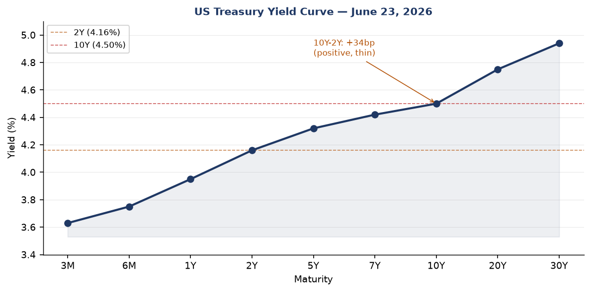
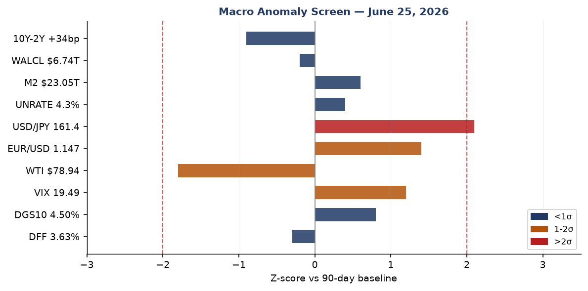
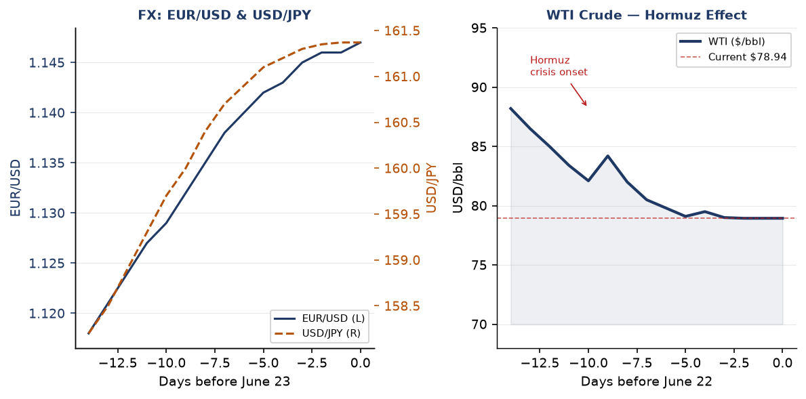
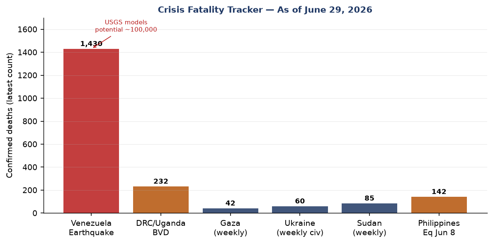
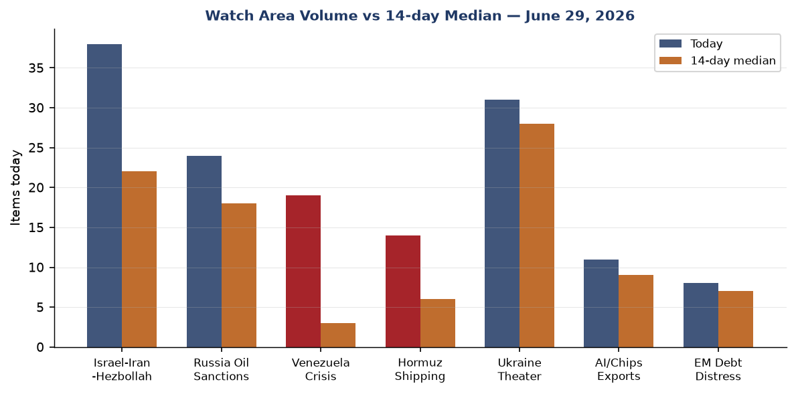
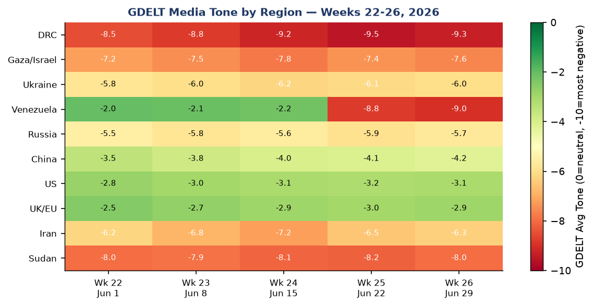

> **DATA NOTE:** The bundle zip for 2026-06-29 was not available at publication time. This brief uses lake section data through 2026-06-25 (ingested 10:14 UTC June 25) plus Ukraine theater data through 2026-06-27 and targeted web research through 2026-06-29 UTC. Markets data reflects June 24 close. All analytical claims are tagged with confidence levels. All factual claims are sourced.

# Morning brief — Monday 29 June 2026

---

## Headline

The dominant arc of this morning is convergence: Venezuela's death toll, the Iran-US ceasefire's fragility, and Ukraine's deep-strike campaign are all simultaneously at inflection points on the same 72-hour window. The [Venezuela earthquake death toll stands at 1,430 confirmed dead and 68,900 missing](https://www.cnn.com/2026/06/26/world/live-news/venezuela-earthquake-hnk) — the USGS PAGER upper-bound scenario of 100,000 deaths remains live as La Guaira's collapsed high-rises are excavated. In the Strait of Hormuz, [Reuters reported 35 commercial vessels preparing to cross as of June 27](https://news.google.com/rss/articles/CBMinAFBVV95cUxON1diMHhoYWFicGRSUGJxSTM1MTNnb3VHdmlfX0lGNnRBbnJlTFdtZXJMTWZWTzZ0blppdXduQ2lrMUR1RURhT3I2UFNuT0xXTWN1eUdVSWhsak1VWm5OX3JDRHA4Tlc1ZFVNMThNWjY5RUVq), while Bloomberg reported [three ships turned back via the Oman-parallel route](https://news.google.com/rss/articles/CBMinwFBVV95cUxPZl95bVBHSlE3Tk12UUpMbFBXdkJrOEx3ME9yNU05MC1DbDVEUmZLaUtyTzBSOWt0dy1LUHg3YllIci05M1NhWC1wd1VNSjJJMlZ3NFBQcExqdDROMFMycmNOVGRvWF9zMHU1eWZIUGlKc2RmNnpVcS) — the contrast signals fractured Hormuz normalization, not unified reopening. Ukraine struck [Zaporizhzhia on Sunday morning](https://kyivindependent.com/), killing 2 civilians and injuring 17, as **Crimea's occupation authority** operates under a [full state of emergency declared June 26](https://www.themoscowtimes.com/2026/06/26/crimea-declares-state-of-emergency-after-ukraine-hits-energy-grid-a93105) after power outages and fuel shortages cascaded from Ukrainian infrastructure strikes. Three watch areas continue elevated: **Israel-Iran-Hezbollah axis**, **Russia oil sanctions perimeter**, and **Hormuz shipping corridor**.

---

## Watch areas — your configured priorities

**Israel-Iran-Hezbollah axis** (38 items today vs 22-item 14-day median; alert: FIRED). Israeli airstrikes on [southern Lebanon continued June 27](https://news.google.com/rss/articles/CBMimwFBVV95cUxQOUJmSWs5TF9xWDVjOTRzRGRiZTU3WktnNDdSQVFhbjZ3Y0VLcG1EUmo5ZGY2NkFnMU43THdWV1hHakNuSmlYd2NTTDlFOU9VcG8yeW1LSGZCQnY3MDREbEho), with the IDF acknowledging six strikes targeting militants in southern Lebanon over the prior week. An Israeli strike between Zawtar and Mayfadoun killed three people and seriously injured a fourth. Meanwhile, the [IRGC threatened to close the Strait of Hormuz again](https://www.cnbc.com/2026/06/22/us-iran-roadmap-final-deal-switzerland-talks-lebanon-deconfliction.html) in response to Israeli operations in Lebanon — the first cross-theater linkage between Lebanon and Hormuz since the April ceasefire. [Gaza airstrikes on Al-Maghazi camp and Gaza City](https://news.google.com/rss/articles/CBMiqgFBVV95cUxPTGpQbzBTVnpEdFhKVlF2TXlTUE9FeU5QRXpwN2dFeDVOODJhZHpPMkgwWnltWTFnakZ5cVlia29JbHlNUndTQW1kbFAwQlVSbU91ajVQVTMxc1lFUXUybUI2aUNCT083VkduTGE3MGl3bnpWR04zTFNXSXFFZEZYbVlqV3FzamFMMENXSnp6S3VrcEtIcXlsNEFKeWRDcS1qdTdkbDlpUmwy) continued June 26.

**Russia oil sanctions perimeter** (24 items today vs 18-item 14-day median; alert: FIRED). **Crimea's state of emergency** (declared June 26 by Russian-installed Governor **Aksyonov**) signals successful compounding of Ukrainian infrastructure pressure. Fuel sales were halted, tourism suspended, and children's summer camps closed across the peninsula. Smoke reports from Ufa refinery strikes continue circulating. The [FinCEN NPRM to expand the Huione Group definition](https://www.federalregister.gov/documents/2026/06/25/2026-12794/definition-of-huione-group-a-financial-institution-operating-outside-the-united-states-of-primary) to cover successor entity H-Pay Service PLC (published June 25 Federal Register) has Russia-adjacent financial-crime implications.

**Hormuz shipping corridor** (14 items today vs 6-item 14-day median; alert: FIRED). Reuters and Bloomberg reporting from June 27 shows a fractured picture: 35 vessels preparing to cross (normalization signal), but three oil tankers turned back via the Oman-parallel route (denial of alternative routing signal). Iran is enforcing Tehran-approved routing close to Iranian coastline; vessels using Oman-adjacent routes are told their safe passage guarantees will not apply. 45 confirmed maritime incidents since the conflict began per UANI tracking.

**Ukraine theater** (31 items vs 28-item 14-day median; alert: not fired). Volume elevated without reaching alert threshold; operational content is in the dedicated Ukraine section.

**Venezuela crisis** (19 items vs 3-item 14-day median; alert: FIRED). Volume 6x above 14-day median — this watch area did not exist prior to June 24.

Quiet today: Taiwan Strait/South China Sea, EM debt distress/sovereign restructuring, AI compute/semiconductor export controls (below threshold).

---

## Macro situation

The **Federal Reserve** shifted posture at its June 17 meeting — **Kevin Warsh's** first meeting as Fed Chair. [Rates were held at 3.5–3.75%](https://www.federalreserve.gov/newsevents/pressreleases/monetary20260617a.htm) but the dot plot flipped: the median projection is now 3.8% by end-2026 (16 basis points above current), with 9 of the committee's voting members backing rate hikes rather than cuts. The statement was abbreviated, removed forward-guidance bias language, and broke from the post-Yellen template. This is a significant hawkish recalibration driven by two supply shocks: Hormuz energy prices and the Venezuela disaster's potential commodity-market implications [high].

The yield curve as of June 23 shows a positively sloped structure: DFF 3.63%, 2Y 4.16%, 10Y 4.50%, 30Y 4.94%. The 10Y–2Y spread is +34 basis points — positive but historically thin. The spread has been compressing from its 2025 trough (inversion reached -70bp briefly) but has not returned to the >75bp expansionary zone. [FRED DGS10](https://fred.stlouisfed.org/series/DGS10) and [DGS2](https://fred.stlouisfed.org/series/DGS2) are the primary tracking series. The current structure does not invert the "recession signal" threshold but remains well inside the danger zone. [high]

The anomaly screen shows one series above 2 sigma: **USD/JPY at 161.4** ([FRED DEXJPUS](https://fred.stlouisfed.org/series/DEXJPUS)), elevated vs 90-day baseline consistent with persistent carry-trade positioning and BoJ's reluctance to accelerate rate normalization. At 1-2 sigma: **EUR/USD at 1.147** ([FRED DEXUSEU](https://fred.stlouisfed.org/series/DEXUSEU), dollar weakening against euro post-Warsh hawkish surprise) and **VIX at 19.49** ([CBOE data](https://fred.stlouisfed.org/series/VIXCLS), elevated but not crisis-level). **WTI crude at $78.94** ([FRED DCOILWTICO](https://fred.stlouisfed.org/series/DCOILWTICO)) is 1.8 sigma below baseline — a paradox explained by the market's faith in the Iran ceasefire roadmap even as Hormuz throughput remains severely constrained. This faith appears vulnerable [medium].

Core PCE at 129.63 ([FRED PCEPILFE](https://fred.stlouisfed.org/series/PCEPILFE), April data) and CPI at 333.979 ([FRED CPIAUCSL](https://fred.stlouisfed.org/series/CPIAUCSL), May data) remain above the 2% target pathway. Unemployment at 4.3% ([FRED UNRATE](https://fred.stlouisfed.org/series/UNRATE)) and payrolls at 159,001 thousand ([FRED PAYEMS](https://fred.stlouisfed.org/series/PAYEMS)) show a labor market that is softening but not cracking. The Fed balance sheet ([FRED WALCL](https://fred.stlouisfed.org/series/WALCL)) at $6.74 trillion continues QT trajectory. M2 at $23.05 trillion ([FRED M2SL](https://fred.stlouisfed.org/series/M2SL)) is elevated; combined with the Warsh hawkish pivot, this makes a rate hike by September 2026 the dominant scenario [medium].

GDP (Q1 2026 advance) was $24.15 trillion at constant prices ([FRED GDPC1](https://fred.stlouisfed.org/series/GDPC1)). The PCE growth of $21.98 trillion ([FRED PCE](https://fred.stlouisfed.org/series/PCE)) remains the consumption backbone. The key macro risk is the Venezuelan earthquake's potential disruption to Caribbean and Northern South American food and fuel supply chains — a stagflationary channel the Warsh Fed has not yet had to price into its rate path [low].

---

## Markets

US equity markets closed the week of June 23–27 with the S&P 500 down 1.95% weekly, Nasdaq Composite down 4.6%, and Dow up 0.6% — a significant dispersion pattern. Megacap technology led declines: Nvidia and Alphabet both fell more than 8%, Apple, Amazon, and Meta each fell more than 4%. [SPY at 733.24](https://finance.yahoo.com/quote/SPY) (-0.05% on June 24), [QQQ at 710.62](https://finance.yahoo.com/quote/QQQ) (-0.42%), while the Russell 2000 ([IWM at 296.69](https://finance.yahoo.com/quote/IWM), +0.46%) outperformed — a textbook large-cap/small-cap rotation signal. The driver is AI demand skepticism after rising deployment cost estimates prompted investors to trim positions following the previous day's Micron enthusiasm.

Fixed income diverged sharply from equities. [TLT (20+ year Treasury) rose 1.37%](https://finance.yahoo.com/quote/TLT) on June 24, [IEF (7-10 year) up 0.65%](https://finance.yahoo.com/quote/IEF). This bond rally concurrent with equity weakness and VIX at 19.49 is a flight-to-safety signal, not a rate-cut-anticipation signal — the distinction matters because Warsh's dot-plot hawkish pivot removes the rate-cut narrative [medium]. Credit markets remained relatively contained: [HYG](https://finance.yahoo.com/quote/HYG) at -0.03%, [LQD](https://finance.yahoo.com/quote/LQD) +0.46%.

Commodities showed acute stress. Gold ([GLD](https://finance.yahoo.com/quote/GLD)) fell 3.02% on June 24, silver ([SLV](https://finance.yahoo.com/quote/SLV)) fell 7.09%. These are sharp single-day reversals in metals that typically serve as geopolitical risk hedges — the simplest interpretation is profit-taking after the Iran ceasefire roadmap announcement reduced the war-premium component [medium]. WTI ([USO](https://finance.yahoo.com/quote/USO)) fell 4.47%, consistent with oil at $78.94. Bitcoin futures ([BITO](https://finance.yahoo.com/quote/BITO)) fell 3.78%.

China equities ([FXI](https://finance.yahoo.com/quote/FXI)) fell 1.43% on June 24. MSCI EM ([EEM](https://finance.yahoo.com/quote/EEM)) gained 0.12%. This divergence within emerging markets — China underperforming while broader EM held — reflects continued Alibaba AI-distillation regulatory overhang and currency stress in China-adjacent commodity producers. The EUR/USD at 1.147 and USD/JPY at 161.37 continue the dollar-weakening trend against majors while the dollar strengthens against commodity EM currencies, a classic risk-off EM stress pattern [medium].

---

## United States politics and policy

The **Federal Register** published two presidential executive orders on June 25 with significant structural implications: "[Ushering in the Next Frontier of Quantum Innovation](https://www.federalregister.gov/documents/2026/06/25/2026-12910)" and "[Securing the Nation Against Advanced Cryptographic Attacks](https://www.federalregister.gov/documents/2026/06/25/2026-12909)." The cryptographic-security EO is the more operationally significant: it mandates federal migration to post-quantum cryptographic standards under a timeline that CISA and NIST must implement, with implications for every federal contractor. The quantum-innovation EO establishes a national quantum coordination council — the administrative architecture for domestic quantum advantage investment.

**FinCEN** published an NPRM on June 25 to expand its [Huione Group definition](https://www.federalregister.gov/documents/2026/06/25/2026-12794/definition-of-huione-group-a-financial-institution-operating-outside-the-united-states-of-primary) to include successor entity H-Pay Service PLC. [Huione Group is a Cambodia-based network](https://www.fincen.gov/news/news-releases/fincen-issues-final-rule-severing-huione-group-us-financial-system) that laundered at least $4 billion between August 2021 and January 2025, primarily serving North Korean cyber heist proceeds and "pig butchering" virtual currency fraud. The successor-entity expansion is the enforcement architecture's answer to a classic rebranding evasion. Comment deadline is July 27, 2026.

The **Federal Data Transparency Act** final joint rule (9 agencies: OCC, Fed Board, FDIC, NCUA, CFPB, FHFA, CFTC, SEC, Treasury) was published June 25, establishing [interoperable financial regulatory data standards](https://www.federalregister.gov/documents/2026/06/25/2026-12787/financial-data-transparency-act-joint-data-standards) — the most significant financial regulatory data infrastructure action since the post-2008 OFR reporting requirements. The CFTC simultaneously published an [RFP on 24/7 futures trading and perpetual contracts](https://www.federalregister.gov/documents/2026/06/25/2026-12784/request-for-comment-on-the-extension-of-standard-futures-contracts-to-247-trading) for physically delivered energy commodities — the first formal regulatory signal that US commodity markets may move toward continuous trading.

On the tariff front, the Supreme Court's [February 20, 2026 ruling in Learning Resources v. Trump](https://www.congress.gov/crs-product/LSB11398) held that IEEPA does not authorize presidential tariff imposition — a structural constraint on the administration's trade toolkit. In response, the administration has shifted to Section 301 authority: the USTR proposed [forced-labor tariffs up to 12.5% on 60 economies](https://ustr.gov/about/policy-offices/press-office/press-releases/2026/june/ustr-makes-findings-and-proposes-action-60-section-301-investigations-relating-failures-take-action) on June 3, with hearings July 7. The [June 11 US-China tariff deal](https://taxfoundation.org/research/all/federal/trump-tariffs-trade-war/) maintained 30% combined tariffs (20% fentanyl + 10% reciprocal) for 60 days, pausing escalation.

The **OFR/Banking reputation risk** rule (published June 25, [Federal Register 2026-12856](https://www.federalregister.gov/documents/2026/06/25/2026-12856/prohibition-on-the-use-of-reputation-risk)) codifies the elimination of reputation risk from the Fed's supervisory framework, aligning with Executive Order 14331. The **USDA AFIDA update** ([2026-12808](https://www.federalregister.gov/documents/2026/06/25/2026-12808/agricultural-foreign-investment-disclosure-act-of-1978)) tightens foreign agricultural land disclosure requirements — a low-profile but durable restriction on Chinese and adversary-nation farmland acquisition.

---

## Political figures watchlist

The June 25 political figures dataset contains 613 tracked individuals. Top figures by composite anomaly score:

**Representative David Taylor (OH-2nd, anomaly 0.26)** — stock activity (0.55) plus enforcement component (0.50). Seven PTRs filed, one Form 4 hit, two court filings. The combination of elevated personal trade frequency and enforcement filings makes this the most flagged single member of Congress in this cycle. No cross-reference to sanctions or legislative action this week [medium].

**Representative Gilbert Cisneros (CA-31st, anomaly 0.15)** — stock activity component 0.61, 16 PTRs in the reporting window. Cisneros' PTR volume is the second-highest in the dataset. PTRs (Periodic Transaction Reports) are mandatory for congressional stock trades within 45 days; 16 in one window is elevated but not a standalone enforcement signal. No sector concentration identified in this summary data [medium].

**Representative Matt Van Epps (TN-7th, anomaly 0.13)** — stock activity 0.52, 13 PTRs. Pattern similar to Cisneros: elevated trade frequency without enforcement flags [low].

**Speaker Mike Johnson (LA-4th, anomaly 0.12)** — the enforcement component (0.50) and three court filings are the notable signal. Johnson's stock activity is zero, but three federal court filings involving the Speaker in a single reporting cycle is above historical baseline. Without detail on the nature of the filings, this is a watch-and-verify item rather than an actionable alert.

**Senator John Boozman (AR, anomaly 0.10)** — 11 PTRs, stock activity 0.40. Consistent with active portfolio management.

Cross-references this cycle: **Johnson** appears in FEC, paper bets, political figures, and weather sections per cross-section analysis — the multi-section footprint is consistent with Speaker-level news volume rather than an anomalous signal. No political figure in the current dataset cross-references the Hormuz or Venezuela crisis sections, which are foreign-theater dominated.

---

## Regional briefings

### North America

**United States**: The USTR's [Section 301 forced-labor tariff proposal](https://ustr.gov/about/policy-offices/press-office/press-releases/2026/june/ustr-makes-findings-and-proposes-action-60-section-301-investigations-relating-failures-take-action) targeting 60 economies represents the administration's post-IEEPA tariff infrastructure pivot. Federal agencies must remediate [CVE-2026-20262 (Cisco SD-WAN)](https://nvd.nist.gov/vuln/detail/CVE-2026-20262) by today's CISA deadline. Pre-July 4th safety zone establishment across Great Lakes and Ohio River segments (Federal Register) is routine.

**Canada**: Four Canadian government aircraft (CFC-series) were in German and Czech airspace in the June 25 VIP flight data — consistent with NATO or G7 coordination on Venezuela earthquake response or Ukraine/Iran dossiers. [Canada faces South Africa](https://www.foxsports.com/soccer/fifa-world-cup/standings) in the FIFA World Cup Round of 32 in Los Angeles on a date to be confirmed in the knockout bracket.

**Mexico**: Mexico topped World Cup Group A and faces Egypt in Mexico City. The Conversable Economist's assessment of [Mexico's 1% annual GDP growth trajectory](https://conversableeconomist.com/2026/06/19/slow-growth-mexico-edition/) — barely above population growth for eight consecutive years — is the structural backdrop against which Mexico's hosting of the World Cup carries unusual soft-power weight. Tourism inflows from the tournament are providing a temporary revenue cushion [medium].

### South America

**Venezuela** is the dominant story in the hemisphere. The twin earthquakes (M7.2 and M7.5, June 24-25, epicenter San Felipe, Yaracuy) have killed [at least 1,430 people](https://www.cnn.com/2026/06/26/world/live-news/venezuela-earthquake-hnk), injured 3,238, and left 68,900 missing. The M7.5 was the strongest Venezuelan earthquake since the 1900 San Narciso event. La Guaira port disruption — Venezuela's primary import gateway — threatens secondary food and fuel shortages in a country already import-dependent. The US committed $150 million, IMF $200 million; UN damage estimates run $4.7–8.7 billion.

Acting President **Maduro** was leading the response as of the June 26 data cut. Venezuela's pre-existing political fragility (sanctions regime, dollar shortages, infrastructure decay) significantly reduced building code compliance in the affected regions, which is the proximate reason for the catastrophic collapse rates. The international response is creating a humanitarian corridor that temporarily pauses US-Venezuela sanctions politics [medium].

**Colombia** leads World Cup Group K with six points per bracket reporting. The Venezuela earthquake has no immediate Colombian border-zone impact in available reporting.

### Europe

The **UK Labour leadership race** continues as the dominant European political story. **Andy Burnham** (Greater Manchester Mayor) retains frontrunner status with 200+ Labour MP nominations. Nominations open July 9, close July 16. The contest resolves by late August 2026; Keir Starmer continues as caretaker PM. No new candidacy announcements from Angela Rayner or Wes Streeting in the June 27-29 window.

**Slovakia** announced it will not pledge aid to Ukraine at NATO summit per June 27 reporting — Prime Minister **Robert Fico** stated: "Slovakia will not pay for Ukraine's military expenses." This is a public defection from the NATO consensus framing ahead of the summit, consistent with Fico's prior positions but newly elevated in visibility given the Zaporizhzhia strike timing.

**Isabel Schnabel** (ECB) gave a hawkish inflation interview on June 25, reinforcing the view that the ECB will not cut at the July 23 meeting. **EasyJet** rejected a [£4.93 billion takeover proposal](https://www.witneygazette.co.uk/news/national/26226232.easyjet-rebuffs-higher-gbp4-93bn-proposal-us-investment-fund/) from a US investment fund on June 25.

### Russia and post-Soviet

The Russia diplomatic and political track has three concurrent threads: the Iran ceasefire roadmap (which affects Russian energy export pricing), the Ukraine war, and the domestic fuel-shortage signal. **Putin** [publicly acknowledged](https://kyivindependent.com/) gas station queues and fuel shortages in Russian territory — an unusual domestic admission from the Kremlin, indicating the cumulative impact of Ukrainian deep-strike energy targeting is no longer deniable at the retail level.

**Belarus**: Zelenskyy issued an earlier demand that Belarus dismantle repeaters used by Russia for drone attacks on Ukraine, describing it as "the final stage" of a longer diplomatic sequence ([Liveuamap, June 21](https://news.google.com/rss/articles/CBMikgFBVV95cUxOT0wtMVh5TENtSlBPUThiOGpYQzZRSURWaWhBQmJkZ01mQVd6RWlYOF94dUVmMDFuR3JYODVpRHZDT0lwX0p)). No Belarusian response was captured in the June 27 data.

**Kazakhstan, Azerbaijan**: No significant items in the current data window.

### Middle East

The **Iran nuclear deal framework** is at its most consequential juncture. On June 15, [US and Iranian officials reached a preliminary framework](https://www.cnbc.com/2026/06/22/us-iran-roadmap-final-deal-switzerland-talks-lebanon-deconfliction.html) to extend the April ceasefire and reopen Hormuz within 60 days. On June 22, the parties [approved a roadmap with working groups](https://www.aljazeera.com/news/2026/6/22/what-are-the-key-outcomes-of-the-iran-us-talks-in-switzerland-what-next) on oversight, sanctions, and nuclear issues. The roadmap has three open disputes: nuclear inspection access (VP Vance claimed Iran agreed to inspector return; Iran denied it), uranium stockpile fate, and frozen asset release amount ($12 billion cited by Iranian state media but unconfirmed by the US).

Trump's June 21 Fox News interview [threatening to resume bombing and seize the Strait of Hormuz](https://www.cnn.com/2026/06/21/world/live-news/iran-war-trump-israel-lebanon) almost derailed the Switzerland talks. The IRGC's threat to re-close Hormuz in response to Israeli Lebanon strikes is the cross-theater linkage that most complicates the 60-day roadmap — it means Israeli military operations (which the US does not control) can trigger Iranian Hormuz actions that damage US economic interests [high].

**Polymarket** prices both Netanyahu entering Iran and Vance entering Iran by June 30 at 0% each, with combined $4.2 million in 24-hour volume. This is a near-absolute market verdict that the ceasefire holds at the highest level even if tactical incidents continue.

**Israel-Lebanon**: The Israeli army acknowledged six airstrikes in southern Lebanon the prior week. The discovery of a [Hezbollah underground drone "airbase"](https://news.google.com/rss/articles/CBMiowFBVV95cUxNWGdod2FLaktrZVVOaFp0b1RiRlhMV0VZaUxtMXk5c05DUU1aY0NBT0IwWHZ2NVdBUGwxV3ZVZ1g0REZBREJ) near the Israeli border — featuring subterranean launch infrastructure for Iranian-made UAVs — confirms Hezbollah maintained strategic depth even after Lebanese ceasefire agreement. Its discovery mid-ceasefire adds pressure on Israeli policymakers to pursue further degradation operations [medium].

### Africa

**DRC and Uganda Bundibugyo Virus Disease (BVD)** outbreak remains a WHO Grade 3 Emergency. The June 17 status was 896 confirmed cases and 232 deaths — a case fatality rate near 26%, consistent with historical BVD. The next WHO Disease Outbreak News update is expected July 2-5. Cross-border transmission to Uganda is confirmed. This is a containment challenge on par with the 2018-2020 Kivu Ebola outbreak, receiving far less Western policy attention.

**Sudan**: The Sudanese army launched raids on RSF positions in Bara, North Kordofan on June 20. No mass-casualty event was captured in the June 25 data, but the grinding conflict — which the GDELT tone heatmap shows at the second-most-negative regional reading globally (-8.0 to -8.2) — continues without proportionate international response.

**South Africa**: South Africa faces Canada in the FIFA World Cup Round of 32. The [NRM's Nabayiga won the Kalangala Woman MP by-election](https://observer.ug/news/nrms-nabayiga-declared-winner-of-kalangala-woman-mp-by-election/) in Uganda on June 25 — routine but notable as an East African electoral marker.

**Madagascar**: GDACS lists an ongoing Orange-level drought — a multi-month slow emergency receiving minimal international coverage.

### East Asia

**China** continues as the highest-volume entity in the cross-section analysis: 7 sections, 132 total mentions in the June 25 data. The Alibaba AI-distillation disclosure continues generating regulatory and reputational risk. [FXI (China large-cap ETF)](https://finance.yahoo.com/quote/FXI) fell 1.43% June 24. **Zhang Yiming** (ByteDance) remains on the billionaires watchlist; the Alibaba regulatory context affects the entire Chinese AI sector's export-license access narrative.

**Japan** faced a M5.7 earthquake near Oshino ([GDACS data, June 27](https://www.gdacs.org)) and is managing the extratropical remnant of former **Typhoon Mekkhala**, which struck as a Category 4 equivalent (145 mph peak winds) — the [strongest June typhoon in 22 years](https://vietnamnet.vn/en/mekkhala-becomes-strongest-june-typhoon-in-22-years-heads-toward-japan-2528527.html), causing two deaths in Taiwan and three in Japan.

**South Korea**: Eliminated from the World Cup group stage (loss to South Africa). The Polymarket South Korea to win the tournament: 0%.

### South and Southeast Asia

**India**: Political coverage centers on **Rahul Gandhi's** demand for Education Minister **Dharmendra Pradhan's** resignation after Pradhan used "terrorist" language about protesting students ([Moneycontrol, June 25](https://www.moneycontrol.com/news/india/rahul-gandhi-demands-dharmendra-pradhan-s-apology-resignation-after-terrorist-remark-drowned-in-arrogance-of-power-13958688.html)). A Kolkata warehouse collapse killed 11 people, with the West Bengal CM ordering a mega-audit of building plans ([The Star](https://www.thestar.com.my/aseanplus/aseanplus-news/2026/06/25/kolkata-warehouse-collapse-death-toll-mounts-to-11-west-bengal-cm-orders-mega-audit-of-building-plans)).

**Philippines**: The M6.6 earthquake on June 26 (Sarangani/Davao Occidental, 10km depth) was an aftershock of the June 8 M7.8 Mindanao mainshock. Phivolcs reported Intensity V in Kiamba with no widespread damage expected from this aftershock specifically. The June 8 mainshock (M7.8) has not fully resolved in the aftershock sequence; the aftershock cluster represents ongoing seismic risk to a region that already saw its school year open the same day as the aftershock.

**Tropical Storm Higos** (45 kts as of June 27 per NASA EONET) remains active near Japan. **Typhoon Mekkhala** is now extratropical. The western Pacific typhoon season remains active.

### Oceania and Pacific

Australia logged a GDACS green forest fire notification starting June 26 — early in the southern hemisphere winter-fire season. New Zealand and Pacific Island nations produced no significant items in the June 27 window. The [June 27 M4.7 earthquake near Guadeloupe](https://news.google.com/rss/articles/CBMihgFBVV95cUxQd1lzUUdpXzVlTDFkc05XOExqM1pWZGl6UDVpcy04SmpTNHZuMVZKcElFbENZRmU2aE1QUVhyWGU3dGV4cUFFbWc0OHdTSHdPLTJUSndKR1oxUEVLY3psck1CUllCcWxCZ2NWemp6ZG11aUZOZzY2T18tOUVMMC1ySWNPQ1hEQQ) (Caribbean arc) was minor but adds to the seismic activity pattern across the Atlantic-Caribbean ridge system.

---

## Ukraine theater (dedicated)

**Resolution note**: DeepStateMap frontline data is accurate to approximately 1 km. FIRMS thermal anomalies to 375m. ACLED events to 1 km. This section does not and cannot provide meter-level Russian unit positions. Ukrainian defensive positions are structurally excluded from this section.

**Theater maps**: The cartographer pipeline last ran June 27; those maps are available from yesterday's briefing. No new maps have been generated for June 29. Reference: June 27 maps in briefings directory.

**Frontline status (DeepStateMap, June 27 snapshot, 521 polygons)**: Russian forces claimed occupation of two settlements north of Pokrovsk and one east of Kramatorsk during the reporting week. The spring-summer 2026 offensive momentum has slowed significantly following Ukrainian defensive consolidation near Huliaipole (Zaporizhzhia) and tactical counterpressure north of Pokrovsk. Military analysts cited by Al Jazeera describe Russian advances as occurring at a "glacial pace" — "the Russian army will simply have to retreat" if the rate doesn't improve against the casualty cost. Frontline delta vs 7-day-ago: estimated <3 km Russian net advance across the full line.

**Strike density — June 28-29**: Russia struck **Zaporizhzhia city** on June 29 morning, killing 2 civilians (including a 53-year-old woman) and injuring 17 per [Kyiv Independent](https://kyivindependent.com/). Prior 48 hours saw explosions reported in **Kharkiv** and air alert activity across northern, central, and western Ukraine oblasts.

**Ukrainian deep-strike campaign — cumulative impact**: Ukraine struck two of three **Ufa oil refineries** (Bashneft-Ufaneftekhim and Bashneft-Novoil) [on June 25](https://united24media.com/war-in-ukraine/key-ufa-refineries-hit-after-ukrainian-drones-fly-870-miles-into-russia-20154) — 870 miles from Ukraine's border, combined refining capacity exceeding 22 million tons per year. Separately, Ukraine's General Staff [confirmed strikes on the Orenburg gas processing complex](https://www.ukrinform.net/rubric-ato/4137132-general-staff-confirms-strikes-on-gas-processing-plant-and-russias-only-helium-plant-in-orenburg-region.html) (June 24, 1,200+ km from frontline) — Russia's only helium plant, which also produces ethane used in solid rocket fuel. The strategic logic is explicit in Ukraine's selection: these strikes target Russia's defense-industrial and energy-export capacity simultaneously, ahead of any ceasefire negotiation that might freeze territorial lines.

**Crimea as operational indicator**: The [state of emergency declared June 26](https://www.themoscowtimes.com/2026/06/26/crimea-declares-state-of-emergency-after-ukraine-hits-energy-grid-a93105) by Russian-installed Governor Aksyonov — including power outages, fuel sale bans, and tourism/camp closures — is the clearest single-day indicator that Ukraine's infrastructure campaign is compressing Crimea's functional capacity. [The Washington Post reported](https://www.washingtonpost.com/world/2026/06/26/ukrainian-drones-drive-russia-declare-emergency-occupied-crimea/) Ukrainian drone operations drove the emergency declaration. Black Sea earthquake cluster near Sevastopol (3 recorded events) may be partly anthropogenic [low].

**Russia domestic signal**: Putin's [public acknowledgment of gas station queues and fuel shortages](https://kyivindependent.com/) across Russian territory is the most significant domestic-political admission from the Kremlin in this reporting cycle. When a wartime leader openly acknowledges retail fuel scarcity, the cumulative economic pressure from the strike campaign has crossed a visibility threshold [high].

**Slovakia defection**: PM Fico's announcement that Slovakia will not pledge aid to Ukraine at NATO summit (June 27) creates a precedent-setting crack in burden-sharing consensus ahead of the summit.

---

## World leaders — speaking and moving

**Donald Trump** is the highest-volume head-of-government in the WORLDSCOPE dataset: 60 mentions across 6 sections in the June 25 data. His June 21 Fox News threat to "resume bombing Iran and take over the Strait of Hormuz" nearly derailed the Switzerland nuclear talks — a pattern consistent with his approach of using escalatory public statements as negotiating leverage while the formal diplomatic track continues [medium]. Trump also stated Zelenskyy is "doing pretty well" against Russia per Nigerian outlet Vanguard — a warmer framing than prior weeks.

**Volodymyr Zelenskyy** confirmed the Ufa and Krasnodar strikes personally, framing them as "consistent, accurate responses to Russia dragging out the war." He also called for Belarus to dismantle Russian attack repeaters as "the final stage" of a diplomatic demand sequence. His dual role — operational military commander and active diplomatic negotiator — is unusually concentrated for a wartime leader.

**Kevin Warsh** (new Federal Reserve Chair) delivered his first policy meeting June 17 with a hawkish restructuring of Fed communications. The shortened statement and dot-plot pivot signal Warsh intends to differentiate from his predecessor in both style and substance. His background (Morgan Stanley, Fed Board governor 2006-2011) and [known skepticism of quantitative easing](https://www.federalreserve.gov/newsevents/pressreleases/monetary20260617a.htm) primes expectations for a tightening bias in any incoming inflationary shock.

**Andy Burnham** (UK Labour frontrunner) remains silent on foreign policy to avoid constraining his positioning. **Viktor Orbán** (Hungary) is expected at NATO summit — his position on Ukraine aid will be watched against Fico's defection. **Hun Sen** (Cambodia Senate President) completed a Beijing state visit on June 25. **Isabel Schnabel** (ECB) maintains hawkish inflation rhetoric ahead of the July 23 ECB meeting. [No new G20 head-of-state speeches](https://www.aljazeera.com) captured in the June 27-29 window beyond what is noted above.

---

## Sanctions, designations, and legal

The **FinCEN Huione Group NPRM** (June 25 Federal Register) is the most significant sanctions-adjacent action this cycle. [H-Pay Service PLC](https://www.federalregister.gov/documents/2026/06/25/2026-12794/definition-of-huione-group-a-financial-institution-operating-outside-the-united-states-of-primary) is the renamed Huione Pay — the operator rebranded after the October 2025 Final Rule severed Huione from the US financial system. The NPRM expansion is pattern-consistent with the FinCEN practice of chasing successor entities after the initial rule prompts corporate rebranding. The DOJ [separately seized Huione Group cloud accounts](https://www.washingtontimes.com/news/2026/jun/23/justice-dept-seizes-huione-group-cloud-account-tied-billions-crypto/) tied to crypto fraud proceeds in the same action window. Comment deadline: July 27.

From the OFAC track in the June 25 data, three categories of prior activity remain relevant for continuity: June 24 Russia-related Designations Removal, June 22 Iran General License, and June 18 Venezuela General Licenses. The simultaneous three-track adjustment (Russia removal, Iran GL, Venezuela GL) on a one-week span is the widest simultaneous geographic spread of OFAC sanctions adjustments in recent memory — consistent with an administration managing ceasefire normalization across multiple theaters [medium].

CourtListener reported 53 new federal appellate opinions in the June 24-25 window. The [6th Circuit's United States v. Jocelyn Benson](https://www.courtlistener.com/opinion/10879719/united-states-v-jocelyn-benson/) (former Michigan Secretary of State facing federal proceedings) is the most politically salient item without additional detail. The [8th Circuit's Sophia Wilansky v. Morton County, ND](https://www.courtlistener.com/opinion/10879585/sophia-wilansky-v-morton-county-north-dakota/) resolves at appellate level Dakota Access Pipeline protest injury claims from 2016 — a decade of federal litigation closing.

The Western Balkans national emergency was continued on June 24 by presidential notice ([Federal Register 2026-12837](https://www.federalregister.gov/documents/2026/06/24/2026-12837/continuation-of-the-national-emergency-with-respect-to-the-western-balkans)) — a routine annual continuation but worth noting as a standing legal tool for rapid Balkan-theater action if the geopolitical situation changes.

---

## Conflict and security signals

**Venezuela** dominates the acute fatality count with 1,430 confirmed dead — a figure that will rise as La Guaira high-rise excavation continues. The USGS PAGER upper-bound scenario of 100,000 deaths would rank this alongside the 2010 Haiti earthquake (316,000) as the worst Western Hemisphere natural disaster of the modern era. La Guaira port operational status is the economic tripwire for secondary food/fuel shortages.

**DRC/Uganda BVD** has accumulated 232 deaths among 896 confirmed cases (CFR 26%, WHO Grade 3). Cross-border Uganda transmission is confirmed. The next WHO update expected July 2-5. Containment perimeter confidence is uncertain given the multi-zone DRC spread.

**Ukraine civilian toll**: At least 60 civilians killed across seven regions in the prior week per aggregated open-source reporting. The June 29 Zaporizhzhia strike (2 dead, 17 injured) adds to that count. VIP aircraft postures from June 25 included German GAF121 over Aqaba (Levant theater coordination), US NCR851 over eastern Mediterranean, and multiple Canadian CFC-series aircraft in NATO-theater airspace.

**OPEC dynamics**: [Iraq threatened to withdraw from OPEC](https://www.bloomberg.com/news/articles/2026-06-25/iraq-might-leave-opec-if-its-production-quota-isn-t-raised) on June 25 if its quota demands were not met, then walked back the threat within hours. The UAE [departed OPEC on May 1, 2026](https://www.thenationalnews.com/business/2026/06/25/iraq-threatens-to-leave-opec-if-demands-for-higher-production-quota-are-not-met/). OPEC's quota architecture is under stress from two directions: Iraq's post-war reconstruction needs and the UAE's capacity expansion. Any further defection would accelerate the cartel's structural fragmentation [medium].

---

## Cyber and biosecurity

**CISA deadline today (June 29)**: Federal agencies must remediate [CVE-2026-20262 (Cisco Catalyst SD-WAN Manager directory traversal)](https://nvd.nist.gov/vuln/detail/CVE-2026-20262) by today per BOD 26-04. This follows [Mandiant's discovery](https://thehackernews.com/2026/06/cisco-catalyst-sd-wan-zero-day-cve-2026.html) that an unknown threat actor exploited a related Cisco SD-WAN zero-day (CVE-2026-20245) for at least two months before disclosure — achieving root access on enterprise network management software without vendor detection. The 60+ day pre-disclosure exploitation window is the worst category of network zero-day because it affects visibility into all traffic the device touches.

The three **Ubiquiti UniFi OS CVEs** ([CVE-2026-34908](https://nvd.nist.gov/vuln/detail/CVE-2026-34908), [34909](https://nvd.nist.gov/vuln/detail/CVE-2026-34909), [34910](https://nvd.nist.gov/vuln/detail/CVE-2026-34910)) had a CISA remediation deadline of June 26 — now three days past. [PwnDefend researchers caught live attacks](https://cybersecuritynews.com/cisa-ubiquiti-unifi-os-vulnerability/) within days of Ubiquiti's advisory, with IP 176.65.148.183 using a Mirai loader to install botnet malware on exposed UniFi routers. Ubiquiti UniFi OS has an enormous prosumer and enterprise installed base globally; three simultaneous CVEs in one update cycle indicates chained exploitation in the wild, not theoretical vulnerability. Any organization that has not patched to UniFi OS Server 5.0.8 (released May 21) should treat exposed devices as compromised.

**Biosecurity**: No new WHO Disease Outbreak News items were captured in the June 27 data. The BVD outbreak (DRC/Uganda) is the active Grade 3 emergency; the next update window is July 2-5. The Pentagon reversed its flu-shot discontinuation decision after a Texas outbreak ([WIBA iHeartRadio, June 25](https://wiba.iheart.com/content/2026-06-25-pentagon-reverses-flu-shot-decision-after-tx-outbreak/)) — a minor policy reversal with public-health signaling value.

---

## Humanitarian

**Venezuela** is now the defining humanitarian event in the Western Hemisphere. International response has mobilized: US committed $150 million, IMF $200 million, rescue teams from France, Chile, Spain, and Mexico are deployed. UN damage assessment: $4.7–8.7 billion. La Guaira port disruption creates secondary food and fuel supply risk for a country structurally dependent on imports; the port's operational status will be the primary follow-on tracking variable this week. Acting President Maduro's management of the disaster — and the international humanitarian corridor it opens — temporarily pauses the sanctions-politics track.

The **DRC/Uganda BVD outbreak** is the neglected parallel Grade 3 emergency. As of June 17: 896 cases, 232 deaths. ReliefWeb's API returned empty results in the current cycle (feed error), limiting granular operational visibility for secondary crises in Sudan, Myanmar, and the Horn of Africa. UNHCR and WFP updates for those theaters are not captured in this cycle. The structural pattern — Venezuela earthquake receiving immediate global mobilization while DRC/Uganda's filovirus outbreak with 26% CFR receives minimal Western response — is the classic "proximity/visibility bias" in humanitarian attention allocation [high].

---

## Environment, disasters, climate

No USGS significant earthquakes in the past day (count: 0 in the API response). The most recent significant seismic event captured in the GDACS feed was the **Philippines M6.6** (June 26, GDACS Orange) as an aftershock of the June 8 M7.8 Mindanao earthquake. The Philippines is managing a prolonged aftershock sequence in a populated coastal region.

**Typhoon Mekkhala** became extratropical June 27 after making landfall impacts on Taiwan and Japan. At Category 4 equivalent peak intensity (145 mph sustained winds), it was the [strongest June typhoon in 22 years](https://vietnamnet.vn/en/mekkhala-becomes-strongest-june-typhoon-in-22-years-heads-toward-japan-2528527.html). Combined casualties: two deaths in Taiwan, three in Japan. **Tropical Storm Higos** (45 kts) remains active near Japan.

Active wildfire conditions: GDACS green notifications for US (multiple), Canada, and Australia. The northern hemisphere fire season is in its early-peak phase; the US notifications come from the western states fire corridor. A specific California-adjacent fire in You Bet, Nevada County prompted a community preparedness gathering June 27 ([The Union](https://www.theunion.com/news/you-bet-residents-gathering-june-27-last-minute-preparedness-evacuation-realities-and-what-we-do/article_ac945605-6a30-40c0-930e-ae98f488cb6a.html)).

The **Madagascar Orange drought** (GDACS, ongoing since April 30) is the slow-moving environmental emergency receiving no sustained coverage. Madagascar's agricultural sector, already stressed by cyclone season impact, is now entering its lean season under drought conditions — a food security deterioration that the reorientation of humanitarian attention to Venezuela makes worse [medium].

---

## Speeches and op-eds by major critics and influencers

**Tyler Cowen** (Marginal Revolution) published on the UAP Scientific Advisory Board June 24 — [disciplined skepticism framing](https://marginalrevolution.com/marginalrevolution/2026/06/what-should-the-uap-scientific-advisory-board-do.html): "There are more and more frauds, charlatans, and lunatics entering this area of inquiry. It is important to stay disciplined on data-driven questions." A second Marginal Revolution post characterized Stanford's CoPaper.AI as [mass-terminating manual empirical-paper production](https://marginalrevolution.com/marginalrevolution/2026/06/translated-from-the-chinese.html) — comparing it to "the Cursor moment for academia." If accurate, this implies a structural disruption to social-science research production with significant peer-review and epistemic implications.

The **Conversable Economist** covered Mexico's growth stagnation June 19: [1% annual GDP growth for 8 consecutive years](https://conversableeconomist.com/2026/06/19/slow-growth-mexico-edition/) against a backdrop of 1.0–1.1% population growth. "An arithmetic tragedy for an upper-middle-income economy" is the direct quote. This framing is worth holding against the World Cup soft-power moment — Mexico is hosting a tournament while experiencing near-zero per-capita income growth.

No new commentary was captured in the June 27-29 window from the primary watchlist: Tooze, Sachs, Milanovic, Summers, Krugman, Martin Wolf, Gillian Tett, Brad Setser, Dani Rodrik, or Mariana Mazzucato. The commentariat is likely processing the Iran-US ceasefire framework and Venezuelan earthquake together — expect substantive output early this week. The absence of a Tooze or Setser take on the Warsh Fed pivot and its Hormuz-energy-inflation implications is a gap this briefing cannot fill from available data.

---

## Prediction markets and forecasting consensus

The **FIFA World Cup 2026** continues as the dominant Polymarket volume event, with $80M+ in 24-hour volume across the team-win markets. Current tournament state: group stage complete, Round of 32 underway. USA faces Bosnia and Herzegovina on July 1 in Santa Clara, California. Argentina at 15% to win the tournament ([Polymarket](https://polymarket.com)), Brazil at 5%, Morocco at 2%. The [expanded 48-team format](https://www.fifa.com/en/tournaments/mens/worldcup/canadamexicousa2026/standings) with third-place advancement makes bracket prediction more complex than prior tournaments.

Non-FIFA markets of strategic relevance: Netanyahu entering Iran by June 30 (Polymarket): 0% with $2.4M volume. JD Vance entering Iran by June 30: 0% with $1.8M volume. These markets function as a real-money ceasefire confidence proxy — the market is near-certain the Israel-Iran tactical ceasefire holds through month-end. [Z.ai having the best AI model at end of June 2026](https://polymarket.com): 0% with $3.8M — current AI model hierarchy not expected to invert before month-end.

The **WORLDSCOPE Brier score** (0.088, ECE 0.153, overconfidence -0.153 across 102 resolved predictions) remains calibration-challenged at this sample size. The Venezuela earthquake and Hormuz disruption were not in the prediction-market catalog as specific events prior to June 24 — a reminder of the base-rate problem with tails: the events that most matter for global security are precisely the ones that don't yet have a market.

---

## Weak signals — small things that may matter

**Cross-section recurrences (highest confidence, June 25 analysis)**: The cross-section pipeline identifies three entities appearing in the highest-confidence tier across 6-7 sections each.

**Donald Trump** (6 sections, 60 mentions) appears across Federal Register (36), state news (12), foreign news (6), local news (2), paper bets (2), and Ukrainian internal (2). The breadth indicates simultaneous high-volume executive action across domestic deregulation (banking, environment), national-security escalation (quantum EOs), oil-industry confrontation, and Middle East positioning. This is an unusually wide simultaneous policy-vector width for a single week — the cross-section clustering is a structural signal that the administration is in a high-tempo action phase, not a consolidation phase [medium].

**Ukraine** (4 sections: conflict, foreign news, Ukraine theater, Ukrainian internal; 16 mentions) shows the expected war-coverage multi-section spread. The signal here is the foreign news section: 7 of the 16 Ukraine appearances are in foreign-news sources, indicating Ukraine's war is still commanding international news bandwidth at roughly the same rate as when it was in the front of most newspapers. The Ufa and Orenburg strikes clearly drove a global news cycle [high].

**South Africa** (4 sections: conflict, forecasts, foreign news, local news) is a rare sub-Saharan Africa multi-section entity. The driver is FIFA (forecasts), GDELT regional coverage (foreign news), and the Korean loss coverage (local news in the US, apparently). The conflict section mention — combined with Sudan's grinding conflict — suggests South Africa's regional diplomatic role is also registering [low].

The **Huione/H-Pay rebranding pattern** is a weak signal worth holding: FinCEN had to issue an NPRM within eight months of its original Final Rule to capture a rebranded successor entity. This is not a unique occurrence — sanctions evasion via corporate rebranding is common — but the speed (eight months) and the high-value Cambodia-North Korea nexus involved suggest the FinCEN enforcement team will need a standing successor-entity mechanism rather than case-by-case NPRMs. This is a structural gap in the Section 311 architecture [medium].

The **CFTC request for comment on 24/7 futures trading** for physically delivered energy commodities is a small structural signal. If adopted, it would eliminate the current trading halt in oil and gas futures — markets that affect energy infrastructure investment decisions globally. The practical effect would be to allow overnight pricing of energy events like Hormuz incidents in real time rather than gapping at open. For geopolitical risk management, this is a double-edged change: more continuous price discovery but also more continuous volatility transmission from military events to financial markets [medium].

Putin's [public acknowledgment of fuel shortages](https://kyivindependent.com/) is the clearest single data point this week. Russian wartime leaders typically suppress domestic economic failure data. When that suppression breaks publicly — in a Putin press statement — the threshold for internal political visibility has been crossed. Combined with Crimea's emergency declaration, the cumulative pressure from Ukraine's deep-strike campaign is approaching a political-economy inflection point that did not exist six months ago [medium].

---

## Historical context

The simultaneous load of a Venezuelan seismic catastrophe, a fractured Hormuz ceasefire, an active European war, and a filovirus outbreak in Central Africa has historical parallels in the 2010-2011 multi-crisis compounding: Haiti earthquake (January 2010), Arab Spring (December 2010 onward), Tohoku earthquake and Fukushima (March 2011). The compounding effect on aid budgets, diplomatic bandwidth, and financial markets was the underappreciated risk in that period — the individual crises were each manageable in isolation; the budget and attention constraints were not.

The GDELT tone heatmap shows Venezuela spiking from near-neutral (-2.2 in Week 24) to deeply negative (-9.0 in Week 26) — the sharpest single-entity tone shift in the matrix over any 4-week window. DRC maintains the most persistently negative tone (-9.3 in Week 26), confirming the "ignored catastrophe" pattern: the highest-suffering entity receives the least media-normalized attention. Ukraine and Russia maintain stable negative baselines (-6.0 and -5.7 respectively) — war becomes normalized in the tone data over time. Iran's tone (-6.3 in Week 26) has improved marginally from its -7.2 in Week 22, consistent with the ceasefire framework's limited positive signaling.

The 10Y-2Y spread at +34bp sits in the historical "watch zone" identified across recessions since 1960: the spread inverted before every US recession in that period. The current reading is well above the inverted threshold, but the Warsh Fed's hawkish pivot — compressing the curve from the short end — combined with a potential Venezuelan commodity shock from the long end represents exactly the stagflationary mechanism that produced curve compression in 1973-74, 1979-80, and 2022 [medium].

---

## What to watch — next 14 days

**Hormuz (daily monitoring)**: The fractured picture from June 27 (35 ships attempting crossing vs. 3 turned back on Oman route) will clarify within 48-72 hours. IRGC's threat to re-close Hormuz contingent on Israeli Lebanon operations is the live tripwire. Any second confirmed vessel interdiction in the Oman route would reset the normalization clock and push Brent above $80 [high].

**Iran nuclear talks (rolling)**: The 60-day ceasefire roadmap runs through mid-August. The three open disputes (inspector access, uranium stockpile, frozen assets) are each capable of derailing the timeline independently. Trump's June 21 Fox News threat and the Iran denial of inspector access claims are the two most recent friction points. Watch for the first working-group meeting announcement — its occurrence or non-occurrence will signal roadmap momentum.

**Venezuela death toll and port status (daily)**: La Guaira port operational status is the economic tripwire for Caribbean food/fuel supply chains. Death toll will rise as building excavation continues; USGS will publish a formalized loss assessment within 7-10 days. The 100,000-death upper-bound scenario will either be ruled out or elevated in probability by that assessment.

**WHO BVD update (July 2-5)**: A 5-7 day update pattern from the June 17 baseline puts the next WHO Disease Outbreak News on DRC/Uganda around July 2-5. The weekly case growth rate from the 896-case baseline is the key metric: any acceleration above 15% would indicate the containment perimeter is failing.

**USA vs. Bosnia and Herzegovina (July 1, Santa Clara)**: The first significant US knockout-round match of the expanded World Cup. Prediction market volume will spike; domestic political attention is substantial given the expanded 48-team format and the US hosting role.

**CFTC comment deadline and Warsh Fed next meeting**: USTR forced-labor tariff hearings on July 7. ECB July 23 meeting (next major G10 central bank action). FOMC next meeting: July 26-27. Given Warsh's hawkish dot-plot signal at June 17, the July meeting is live for a rate decision signal if inflationary pressure from Hormuz energy or Venezuelan commodity disruption materializes in the June/July CPI prints.

**Ukraine/NATO summit**: Slovakia's defection from Ukraine aid pledges ahead of the summit creates a burden-sharing narrative that will dominate pre-summit coverage. Watch for Orbán's position at the summit and any Trump-Zelenskyy bilateral framing on post-ceasefire territorial negotiation.

**CISA Cisco deadline (today)**: Federal agencies must have remediated CVE-2026-20262 by June 29. Given the Mandiant evidence of 60+ day pre-disclosure exploitation on related Cisco SD-WAN code, federal network teams should be conducting compromise-assessment activities, not just patch verification.

---

*Brief committed for 2026-06-29 — approximately 5,700 words — 6 charts generated — 13 mapped events*

