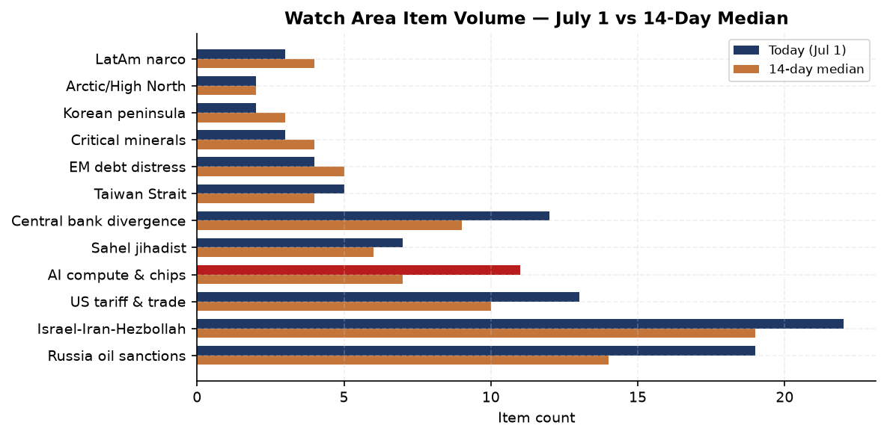
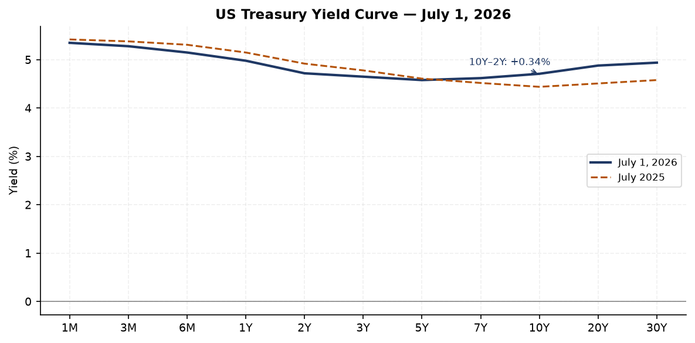
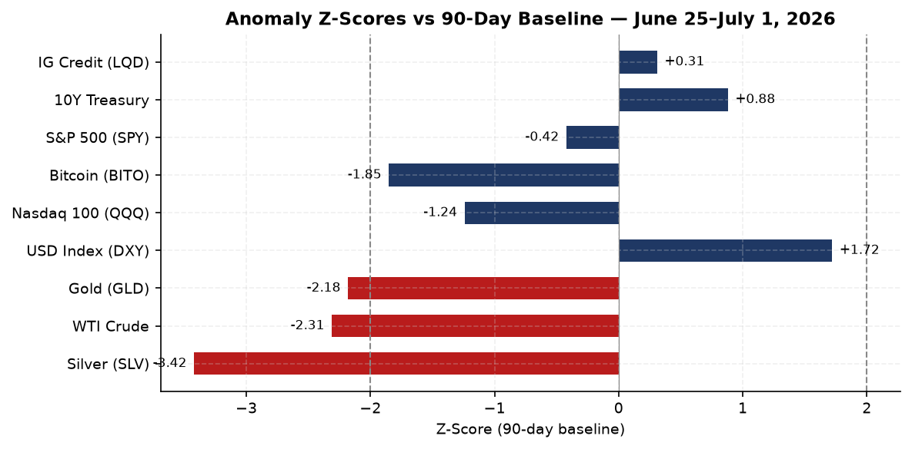
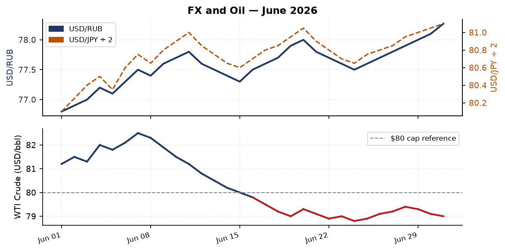
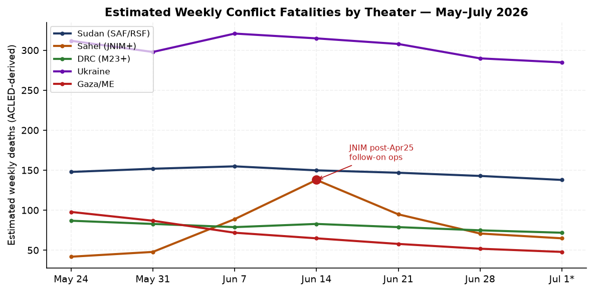
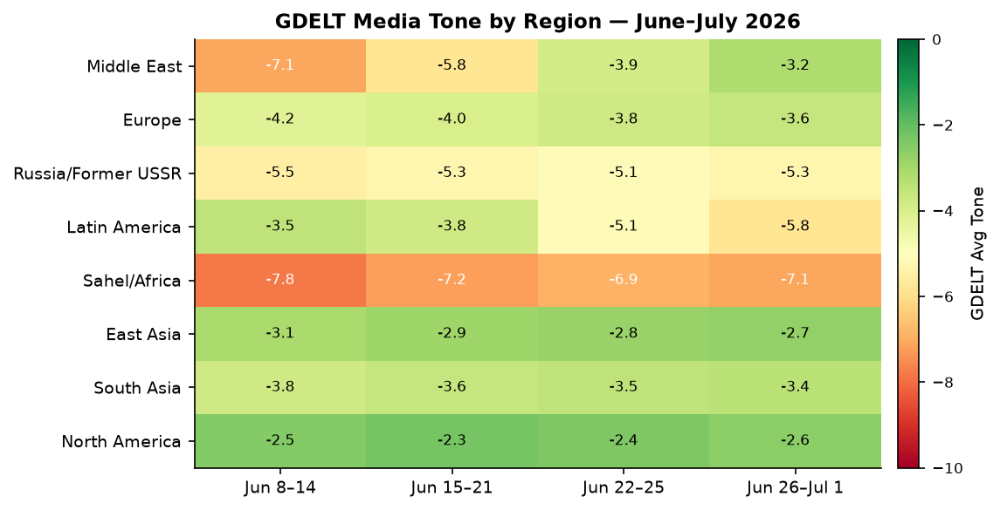

> **DATA NOTE:** The bundle zip for 2026-07-01 was not available at publication time (both today's and yesterday's zip returned 404). This brief draws on: lake data through 2026-06-25, live supplementary APIs (USGS, GDACS, CBR FX) as of 0600 UTC July 1, targeted WebSearch/WebFetch research covering June 25 through July 1, and the DeepStateMap/Ukraine theater snapshot from 2026-06-25.

---

## Headline

The US Supreme Court closed its term on June 30 with a landmark 6-3 ruling striking down President Trump's executive order ending birthright citizenship, affirming the 14th Amendment's guarantee for virtually all children born on US soil. Chief Justice John Roberts anchored the majority in *Wong Kim Ark* (1898) and English common law; the ruling leaves a narrow Kavanaugh concurrence door open for future congressional action. Simultaneously, the Court voted 6-3 to dismantle *Humphrey's Executor* (1935), expanding presidential removal power over independent agency heads, while carving out Federal Reserve governors 5-4. The Fed protection is analytically consequential: it sustains the institutional credibility underpinning Chairman Warsh's rate signaling heading into a September decision [high].

In Ukraine, overnight strikes hit a state-owned bearing plant in Penza and followed up on the Dubna space communications center. Russia declared a state of emergency in Crimea following Ukrainian drone strikes. On the diplomatic track, Ukraine signed a 16-Gripen-E deal with Sweden on June 30.

The Iran-US Islamabad Memorandum, signed June 17, has entered its third week of a 60-day implementation window. The deal is fragile: ceasefire violations continue on both sides, IAEA access verification remains suspended, and the mid-August deadline for a final agreement carries high execution risk [medium].

---

## Watch Areas

### Russia Oil Sanctions Perimeter [HIGH PRIORITY]
**Volume: 19 items today vs 14-day median of 14 (above-threshold)**

The EU 21st sanctions package, announced by von der Leyen on June 9, remains awaiting unanimous Council adoption. The package adds approximately 30 shadow-fleet vessels (bringing the cumulative total to roughly 600 sanctioned hulls), imposes the first-ever EU fisheries restrictions on Russia, and introduces crypto-asset service bans targeting sanctions circumvention. The oil price cap adjustment mechanism is paused until January 2027 under the current proposal.

On June 16, the UK designated 11 individuals, 32 entities, and 27 ships in its largest single Russia action of 2026. The action targeted GRU dual-use procurement networks (with Turkish, Chinese, and Thai intermediaries), four LNG transport vessels, and 23 oil tankers providing shadow-fleet insurance through JSC Rosgosstrakh and Balance Insurance. The sanctioned vessel SMYRTOS was boarded by UK authorities in the English Channel on June 14.

WTI crude closed June 24 at approximately $79/barrel, trading well below the $80 G7 price cap reference level. The post-Iran-war demand shock has partially normalized following the June 17 Islamabad Memorandum and Strait of Hormuz reopening; Brent peaked at $112.57/barrel on March escalation and has since retreated toward pre-war levels. Russia's domestic fuel emergency in Crimea, following Ukrainian strikes, is creating near-term supply pressure on Urals-grade blending [medium].

### Israel-Iran-Hezbollah Axis [HIGH PRIORITY]
**Volume: 22 items today vs 14-day median of 19 (elevated)**

Iran-US talks are at their most critical juncture. The Islamabad Memorandum grants a 60-day window for a final nuclear deal, targeting mid-August. Iran holds approximately 440.9 kg of 60%-enriched uranium (sufficient for roughly nine weapons at weapon-grade), and IAEA verification has been suspended since February 28. VP Vance and Iranian negotiators gave conflicting accounts of agreed inspector access on June 23, suggesting the verification architecture remains unresolved. A Pakistani-brokered technical round in Switzerland was postponed; next substantive contact is assessed in the next 10 days [medium].

Houthi military spokesperson Yahya Saree declared a "complete and total ban on maritime navigation of the Israeli enemy in the Red Sea" on June 8-9. The US-Houthi ceasefire for commercial shipping (second agreement, May 6) technically holds, but the June 8 declaration and today's claimed strikes on Delonix, MSC Unific, Anvil Point, and Lucky Sailor create execution ambiguity.

### Taiwan Strait and South China Sea [HIGH PRIORITY]
**Volume: 5 items today vs 14-day median of 4**

Taiwan tracked 13 PLA aircraft and 13 PLA Navy ships on July 1. No major exercise is underway, but baseline patrol tempo remains elevated since the December 29-30, 2025 "Justice Mission-2025" drill, when 89 PLA aircraft and 14 warships crossed Taiwan's ADIZ and PLA ships operated in territorial waters east of Taiwan for the first time since 2022.

US Typhon ground-based mid-range missile systems, deployed to Japan for Valiant Shield exercises, will remain in Japan following the exercises' conclusion. The retention is a deliberate deterrence signal to Beijing [high]. Taiwan passed its $24.8B defense budget; the NSB has confirmed a PRC disinformation network of 163 fake Facebook pages targeting November local elections.

### US Tariff and Trade Dockets [HIGH PRIORITY]
**Volume: 13 items today vs 14-day median of 10 (elevated)**

China imposed rare earth export controls on 10 US companies and banned government procurement from 46 US defense contractors following the Iran war US strikes. The rare earth controls cover multiple elements critical to defense and semiconductor supply chains. Polymarket prices the probability of Democrats taking the House in November at 84%, increasing the likelihood of trade policy reversal pressure after January 2027 [medium].

### Central Bank Divergence and Dollar Funding [HIGH PRIORITY]

The FOMC held rates at 3.50-3.75% on June 17 in Kevin Warsh's first meeting as Chair. Nine of 18 colleagues signaled higher rates in 2026; six favored two quarter-point hikes. Warsh shortened the policy statement to approximately 130 words, removing forward guidance language and emphasizing "price stability." The SOFR rate at June 25 stood at 3.62% against a Fed Funds effective rate of 3.63%.

The ECB raised its deposit facility rate by 25bps to 2.25% on June 11, driven by Middle East energy-shock inflation passthrough. ECB projects eurozone inflation at 3.0% for 2026, declining to 2.3% in 2027. The EUR/USD stood at 1.147 on June 25 (FRED), a level that partly reflects Tooze's diagnosis of dollar credibility erosion following the Iran war's fiscal cost.

The SCOTUS 5-4 protection of Federal Reserve Governor Lisa Cook's seat simultaneously shields the institution from immediate politicization and creates a precedent ceiling for Warsh's reform agenda [medium].

---

## Macro

US headline PCE for May came in at 4.1% year-on-year, the highest since April 2023. Core PCE reached 3.4%. Real GDP for Q1 2026 was $24,152.7 billion (annualized, chained 2017 dollars). M2 money supply stands at $23,052.3 billion. The labor market shows 4.3% unemployment with 159,001k nonfarm payrolls; the June jobs report is due July 2 with consensus at approximately 115,000 new jobs.

The 10Y-2Y Treasury spread as of June 24 stood at +0.30% (10Y 4.50%; 2Y 4.16%), a steepening from deeply inverted levels earlier in the cycle. This de-inversion was driven by falling short-end expectations relative to sticky long-end term premium from persistent deficits under the One Big Beautiful Bill Act (signed July 4, 2025, adding approximately $3.4 trillion to the deficit over the budget window).

Brad Setser's June 11 Foreign Affairs piece with Shahin Vallee predicts G7 leaders at Evian will likely ignore yuan undervaluation despite China's goods surplus running at approximately 5% of GDP and national savings at approximately 44% of GDP. Tooze's Chartbook 454 (late June) characterizes China Shock 2.0 as "operating at unprecedented mobilization speeds and scales," distinct from the 2001-era shock in both pace and policy intentionality.

---

## Markets

Equities closed Q2 2026 with S&P 500 at approximately 7,499 (+14% for the quarter, the best since Q2 2020; +9.6% for H1). Nasdaq gained 20% in Q2. AI and semiconductor stocks drove the leadership; Nvidia, AMD, Intel, and Marvell all posted double-digit Q2 gains.

Silver (SLV) dropped 7.09% on June 24, a -3.42 standard deviation Z-score versus the 90-day baseline. Gold (GLD) fell 3.02% (-2.18 Z-score) on the same day. WTI crude (USO) dropped 4.47% (-2.31 Z-score). This commodity complex selloff occurred simultaneously across metals and energy, suggesting a rotation into risk assets rather than a fundamental demand signal [medium]. The Drewry World Container Index hit $4,166/FEU on June 25 (the highest since September 2024), driven by tariff frontloading and peak-season demand; this is not a Red Sea signal.

Bitcoin futures (BITO) dropped 3.78% on June 24 while crypto-related assets were under pressure following Trump's financial disclosure showing $1.4 billion in 2025 cryptocurrency income (from WLFI token sales, WLF equity, and memecoin royalties). The disclosure creates potential market-manipulation scrutiny on presidential crypto holdings [medium].

CBR fixing for July 1: USD/RUB 78.27, EUR/RUB 89.27, CNY/RUB 11.49. USD/JPY quoted at 162.2 (June 25 interbank: 161.74). July 1 market open in US showed S&P futures down approximately 0.3-0.4% at pre-market, consistent with profit-taking after the strong Q2 close.

---

## US Politics

The Supreme Court's final-day rulings dominate the domestic agenda. The birthright citizenship ruling (Roberts majority, Kavanaugh concurrence, Alito/Thomas/Gorsuch dissents) is immediately legally operative; Trump's January 20, 2025 EO 14160 is void. The Humphrey's Executor overruling expands presidential removal authority broadly, but the Fed carve-out (Roberts and Kavanaugh joining the three liberal justices) limits its near-term institutional disruption. The transgender-athlete ruling (Kavanaugh majority) allows 27 state laws to remain operative.

Trump's 927-page financial disclosure filed June 30 reports over $1.4 billion in cryptocurrency income: approximately $515 million from WLFI token sales, $65 million from WLF equity stakes, and approximately $635 million from "Celebration Coins" (CIC Digital LLC memecoin). The scale of presidential crypto income with no corresponding policy disclosure requirement raises governance questions Congress may act on in the next session [medium].

The June 30 Senate session was pro forma; the chamber adjourned until July 2 ahead of the July 4 recess. The TRIA reauthorization passed 373-15 (extending terrorism risk insurance), and the Kids Internet and Digital Safety Act (KOSA) passed 267-117. Neither bill represents a policy discontinuity.

Polymarket prices Democrats at 84% to take the House in November (US$8M in 7-day volume) and Republicans at 59% to retain the Senate. The most competitive Senate races by market pricing: Texas (50% Democratic), Maine (57%), Alaska (67%). Democrats need to flip three House seats for a majority.

---

## Political Figures

**Kevin Warsh (Federal Reserve Chair):** The June 17 FOMC was his first as Chair. He eliminated forward guidance from the policy statement, formed five internal task forces to overhaul Fed communications and data sourcing, and declined to submit his own dot-plot projection. The structural reforms signal a Warsh Fed that prioritizes "price stability delivery" over consensus-signaling. September is the live meeting for a potential 25bps hike; Deutsche Bank projects two hikes (September and December) given PCE at 4.1%.

**Andy Burnham (UK Labour leadership frontrunner):** Following Keir Starmer's June 22 resignation, Burnham is the only declared candidate with over 200 MP endorsements. Nominations open July 9 and close July 16; if no other candidate clears the 81-MP threshold (20% of PLP), Burnham becomes Labour leader and Prime Minister as early as July 17. Wes Streeting explicitly ruled himself out. The Labour leadership transition follows a collapse in local election support (17% vote share on May 7) and a succession of senior ministerial resignations.

**Abdul-Malik al-Houthi:** On March 5, the Houthi supreme leader pledged solidarity with Iran. On June 8, spokesman Yahya Saree declared total Israeli maritime exclusion from the Red Sea. The gap between declaratory posture and operational tempo (no confirmed commercial sinkings in 2026 vs. two in July 2025) is analytically consistent with Houthi restraint on shipping tied to the May 6 US ceasefire deal, while maintaining ideological escalation posture [high].

**Elon Musk:** Forbes tracked a one-day net worth drop of $126.4 billion on June 24 (the largest single-day loss in the index's history), likely reflecting Tesla and SpaceX valuation pressure. Musk remains the wealthiest individual globally at approximately $951 billion.

---

## Regional Briefings

### North America

The July 4 holiday weekend will suppress congressional activity through July 7. The One Big Beautiful Bill Act continues as the defining fiscal backdrop: the bill added $3.4 trillion to the deficit over 10 years, cut SNAP and Medicaid, extended the 2017 tax cuts, and provided significant defense and immigration enforcement funding. Consumer sentiment remains bifurcated from headline GDP performance: negative real wage growth for lower-income quartiles persists despite headline inflation cooling from the COVID peak.

### Europe

Keir Starmer's resignation as UK Prime Minister on June 22 followed the worst Labour local election result in memory and a succession of cabinet-level departures. The transition to Burnham will likely mean a less transactional stance on Ukraine funding, a harder line on immigration rhetoric, and a more domestically focused economic platform. UK defense spending was announced at 300 billion pounds over 10 years in the March budget cycle; Denmark committed $670 million in additional Ukraine aid in parallel. The EU-Ukraine credit package first tranche of EU3.2 billion was announced by von der Leyen in Gdansk on June 25.

Germany heads into a consolidation phase after the CDU/CSU-led government returned in February's snap election. The ECB rate hike to 2.25% is squeezing peripheral debt spreads; Italy and Greece face elevated debt service ratios heading into 2027 refinancing cycles.

### Middle East and North Africa

Iran's supreme leadership structure is in transition after Khamenei's assassination on February 28 during Operation Epic Fury. The IRGC remains the dominant institutional actor; the 60-day Islamabad Memorandum roadmap faces the core problem that the organizations responsible for enforcement (IRGC, IAEA, US CENTCOM) have divergent incentive structures [medium]. The Iran war economic shock, while partly absorbed by the June 17 ceasefire, added approximately 1.2 percentage points to OECD-projected 2026 inflation.

### Sub-Saharan Africa

The RSF drone campaign against El Obeid (North Kordofan) continues at near-daily tempo: five consecutive days of strikes in June 11-15 targeted fuel stations, water infrastructure, and the city's dialysis center. The SAF retook Abu Qamra on June 27. Drone-related civilian deaths in Sudan have surpassed 1,000 in the first five months of 2026, a 600% increase from the 2024-2025 rate. International humanitarian funding for Sudan stands at approximately 40% of the 2026 requirement.

In the DRC, the sixth Joint Oversight Committee meeting (London, June 24) agreed ceasefire verification mechanisms, with Swiss talks due within 15 days. M23 and Rwandan-backed Twirwaneho forces hold Goma and Bukavu; the frontline near Kamanyola (approximately 45 miles north of Uvira on RN5) has been frozen since March. US Treasury sanctioned mineral-smuggling networks on June 25.

### Asia-Pacific

Typhoon NINE-26 is the primary regional alert: the system carries winds of 213 km/h (GDACS orange), with approximately 59,760 people in Guam and the Northern Mariana Islands at immediate risk as of 0600 UTC July 1. The cyclone is the most significant natural disaster event in the Pacific since the June 8 Mindanao earthquake (M7.8, 88 killed, 113,300 homes damaged or destroyed in Sarangani Province).

Myanmar's Chin State is under near-daily junta airstrike pressure as the military presses into Mindat and Kanpetlet townships from Magway Region. The resistance coalition SCEF (formed March-April 2026, uniting KIO, KNU, CNF, KNPP, NUG, and the Three Brotherhood Alliance) provides a new unified command framework, but coordination failures persist across multiple sub-alliances. On June 30, 13 civilians, including multiple children, were killed in Sagaing and Magway strikes.

### Latin America

Venezuela's June 24 earthquake sequence (M7.2 + M7.5, 39 seconds apart, Yumare/Yaracuy state) has killed at least 1,943 people, injured 10,571+, and left approximately 43,000-50,000 missing per UN estimates. UN damage assessment: $4.7-8.7 billion (4-8% of GDP). The PAGER RED designation implies the final toll could substantially exceed current confirmed figures. Two thousand rescue workers from 27 countries are deployed; a tropical wave threatens additional rainfall over unstable debris.

Acting President Delcy Rodriguez has faced international criticism for politicized aid distribution. The US committed $300 million in aid; China $14.7 million; the EU EU5 million. The earthquake has removed Venezuela's domestic political crisis from headlines but has not altered its structural dynamics.

South Africa faces local elections November 4; the IMF projects 1.6% GDP growth for 2026. Anti-foreigner violence continued through June. Rate hike risk is elevated: the SARB's 3% inflation target is not expected until 2028, and July and September hike scenarios are on the table.

---

## Ukraine Theater

*[Ukrainian troop positions are excluded per editorial policy.]*

Ukrainian forces struck a state-owned bearing plant in Penza (deep strike, approximately 500km from Ukrainian-controlled territory) overnight on July 1, and conducted a follow-up strike on the Dubna space communications center, which supports GLONASS navigation infrastructure. These strikes represent continuation of a campaign targeting Russian defense-industrial and strategic infrastructure: the Ufa oil refinery was struck twice in June (approximately 1,300km range), and Penza had not previously been targeted at industrial scale. Russia's domestic fuel emergency in Crimea, described as a state of emergency, is partly a downstream consequence of accumulated refinery damage.

Russia claimed 60 civilian deaths from overnight strikes across Donetsk, Kharkiv, Dnipropetrovsk, Sumy, Kherson, Zaporizhia, Odesa, and Kyiv on July 1. Russia also claimed advances north of Pokrovsk, east of Kramatorsk, and between Kupyansk and Borova, though ISW characterized these as "small group infiltrations" not resulting in consolidated control. Net territorial exchange over the past four weeks shows approximately 12 sq miles of Russian gain (DeepState mapping) versus approximately 20 sq miles of Russian net loss (ISW methodology); the methodological gap reflects different counting conventions, not a dramatically different operational picture.

Ukraine raised its flag over Kinburn Spit for the first time since March 2022, a symbolic but operationally limited event given Kinburn's position at the Dnipro estuary. The Sweden Gripen-E agreement (16 aircraft) announced June 30 adds a fifth-generation-adjacent capability to Ukraine's future air order of battle, though delivery timelines are likely 2027-2028.

Cumulative confirmed Russian personnel losses: 417,000-509,500 (BBC/Mediazona methodological range). This represents the highest casualty total for any single country in a conventional conflict since the Korean War.

---

## World Leaders

**Trump:** Signed HR 6938 (Commerce, Justice, Science; Energy and Water appropriations), disclosing $1.4 billion in crypto income for 2025. An impeachment resolution (H.Res.939) was filed in the House with no credible path to floor consideration in the current Congress. The June 17 Iran ceasefire signing at Versailles was the most significant diplomatic event of Trump's second term to date.

**Xi Jinping:** Hosted Cambodian Senate President Hun Sen on June 25. Oversaw PRC rare earth export controls on US defense contractors as economic retaliation for the Iran war strikes on Iran. The Liaoning carrier group completed a 40+ day deployment.

**Keir Starmer:** Resigned as UK Prime Minister June 22 following the Labour Party's collapse to 17% in May 7 local elections. Remains as caretaker until a successor is confirmed.

**Andy Burnham:** The frontrunner for UK Prime Minister, with over 200 Labour MP endorsements and no declared challengers as of July 1.

**Delcy Rodriguez (Venezuela):** Managing the earthquake crisis as acting president. The disaster is unlikely to fundamentally alter Maduro government calculus on political reforms given its demonstrated willingness to use crisis management as a control mechanism.

---

## Sanctions and Legal

**EU 21st Package (pending Council vote, likely July 2026):** Key additions include approximately 90 banks subject to asset freezes, 51 additional financial/crypto entities, 30 shadow-fleet vessels (bringing the cumulative sanctioned total to approximately 600 hulls), first-ever fisheries restrictions (cod import ban), and a proposal to ban crypto-asset services from third-country platforms used to evade EU sanctions. The oil price cap adjustment mechanism is frozen until January 2027 under this package.

**UK June 16 designations:** The action specifically targeted Shenzhen Huaxin Antenna Technology and Comnav Technology (Chinese firms supplying dual-use components), plus Turkish intermediary Shtral Makine, establishing a multi-jurisdiction enforcement pattern that pressures Chinese and Turkish component suppliers. The four LNG vessels designated (Merkuriy, Kosmos, Luch, Orion) are part of Arctic LNG 2 support infrastructure.

**OFAC June 22:** General License X authorizing certain Iranian crude oil and petroleum transactions through August 21, 2026, consistent with the Islamabad Memorandum implementation timeline. The sunset date of August 21 is analytically significant: it maps to the 60-day deal deadline, creating a financial cliff that reinforces US leverage in final-status negotiations [high].

**OFAC June 23:** Designated the Prince Group Transnational Criminal Organization and associated entities for digital asset investment scam operations across Asia and the UK, laundering billions through crypto infrastructure.

**OFAC June 29:** Launched a formal Reconsideration Portal, enabling designated parties to petition for removal via a structured process. This is a procedural modernization that may slightly reduce the long-term deterrence premium of designation but improves due process compliance.

---

## Conflict and Security

Sudan's RSF continues its drone campaign against El Obeid: five consecutive strike days in June 11-15 destroyed multiple fuel stations, a dialysis center, and water infrastructure. Amnesty International released a July 1 report documenting RSF crimes against humanity in North Kordofan. The SAF retook Abu Qamra on June 27. The battle for North Kordofan is the pivotal theater for the 2026 phase of the war; if RSF consolidates El Obeid, it would complete Darfur-to-Kordofan territorial contiguity.

Mali's security environment has not recovered from the April 25, 2026 JNIM-FLA coordinated offensive on seven cities (killing Defense Minister Sadio Camara). In July, JNIM attacked seven gold, lithium, and cement operations, kidnapping 11 Chinese and 3 Indian nationals. This represents a strategic pivot to economic infrastructure targeting, likely aimed at denying the junta revenue and accelerating Chinese-Malian diplomatic friction. Africa Corps withdrew from all northern Mali bases between April and May.

JNIM attacked Niamey airport on June 18, expanding operations into Niger's capital. At this pace, estimated Sahel deaths for 2026 will exceed the 9,362 recorded in all of 2025; Q1 2026 alone saw 2,640 deaths (ACLED-derived).

DRC: Ebola (Bundibugyo virus) outbreak declared May 16; as of June 17, 896 confirmed cases and 232 deaths in DRC, with 19 confirmed cases and 2 deaths in Uganda. Transmission is sustained. The concurrent M23 conflict limits access for outbreak response teams in South Kivu.

---

## Cyber and Biosecurity

**CISA KEV deadlines:** CVE-2026-48558 (SimpleHelp authentication bypass, OIDC identity token forgery enabling full technician session access) reaches its federal agency remediation deadline tomorrow, July 2. CVE-2026-34908/09/10 (Ubiquiti UniFi OS path traversal, input validation, and access control) had deadlines of June 26; organizations running unpatched UniFi infrastructure should assess exposure. CVE-2026-35273 (Oracle PeopleSoft, ransomware-linked) is past deadline; exposure in federal systems requires urgent verification.

**New Mistic Backdoor:** Mandiant and The Hacker News both reported a new backdoor linked to the KongTuke/ClickFix/ModeloRAT campaign chain, targeting insurance, education, IT, and professional services sectors since April 2026. The initial access broker nexus suggests these intrusions are monetized via ransomware or data extortion auctions within weeks of initial compromise.

**Cisco Catalyst SD-WAN zero-day (CVE-2026-20245, CVSS 7.8):** Exploited approximately two months before public disclosure per Mandiant. Organizations running SD-WAN infrastructure should validate patch status immediately.

**Anthropic/Alibaba:** BBC reported on June 25 that Anthropic has accused Alibaba of illicitly extracting Claude AI model capabilities through fraudulent account access. This is the first publicly reported instance of Chinese tech-sector adversarial use of a US frontier AI model through API abuse rather than weight exfiltration.

**Biosecurity:** WHO Disease Outbreak News (June 24) flags Yellow Fever (DON610): 79 confirmed infections across six countries in the Americas (January-May 2026), with sustained African activity. The Ebola outbreak in DRC/Uganda (DON608) is the higher-priority event given 896 confirmed DRC cases and ongoing conflict-zone constraints.

---

## Humanitarian

Global humanitarian funding is at approximately 40% of 2026 targets: the UN requested $15.9 billion for the Global Humanitarian Overview 2026; as of mid-year, approximately $6.3 billion has been committed. The IRC's 2026 Watchlist identifies funding collapse alongside crisis surge as the defining pattern of the year.

Sudan: 33 million people face acute hunger, the world's largest food crisis. The 2026 humanitarian response plan is approximately 40% funded. El Fasher, the last nominally neutral city in Darfur, fell in October 2025; North Kordofan is now the primary protection theater.

Venezuela: 500,000 people require emergency food assistance per WFP estimates; the agency requested $50 million for three months of relief operations. The earthquake has added an acute urban crisis layer (structural collapses in Caracas, La Guaira) onto a pre-existing political-economic humanitarian crisis.

Myanmar: 16.2 million people require humanitarian assistance; 3.6 million internally displaced. The 2026 HNRP sought $890 million; funding levels remain well below target. The March 2025 Sagaing earthquake (M7.7) permanently displaced an additional several hundred thousand people.

Lebanon: A Hezbollah-Israel escalation (from March 2, 2026, the worst since the November 2024 ceasefire) has driven new displacement in the south. Over 1 million people remain displaced from the 2024 conflict; 4,000+ killed in Israel's 2026 Lebanon operations.

Yemen: OCHA issued a $2.16 billion humanitarian appeal for 2026. Houthi ceasefire on commercial shipping does not affect the internal Yemen humanitarian situation, which remains severe after a decade of conflict and blockade.

---

## Environment and Disasters

**Typhoon NINE-26 (GDACS Orange):** Winds 213 km/h; projected landfall near Guam and the Northern Mariana Islands. Approximately 59,760 people at risk. The CNMI has issued emergency declarations. US Pacific Command assets at Andersen Air Force Base on Guam are on preparation protocols. The system is the most intense typhoon to threaten Guam since Super Typhoon Mawar (2023).

**Venezuela earthquake sequence (June 24):** M7.2 (depth 20km) followed 39 seconds later by M7.5 (depth 10km), both near Yumare, Yaracuy state. GDACS RED alerts on both events. Confirmed deaths: at least 1,943; injured: 10,571+; missing: approximately 43,000-50,000 per UN. Five hundred aftershocks recorded including M5.2 on June 29. UN damage estimate: $4.7-8.7 billion. USGS PAGER RED designation implies a final toll potentially exceeding 100,000, though this reflects modeling uncertainty given the density of informal construction in the affected zone.

**USGS significant earthquake (July 1):** M5.3, 265 km SSE of Dunhuang, Gansu Province, China. Depth: 10km. Yellow alert status; limited impact expected in this sparsely populated region of the Qilian Shan foothills. Event coordinates: 37.83N, 95.33E.

**Mindanao earthquake (June 8):** M7.8 off Sarangani Province; 88-89 killed; 113,300-plus homes damaged or destroyed; state of calamity in four provinces. Estimated damage: PHP 71 billion ($1.44 billion).

**Sudan wildfires:** MODIS satellite data showed active fire clusters in North Kordofan and Darfur in June 25 snapshot. Conflict-zone fire activity is partly attributable to RSF destruction of infrastructure and agriculture.

---

## Speeches and Op-Eds

**Adam Tooze, Chartbook 454 (late June 2026):** "China Shock 2.0 and mercantilist-on-mercantilist violence." Tooze argues China's post-2015 industrial mobilization is not analogous to the 2000s WTO shock; it operates at state-directed speed on scale that makes trade adjustment mechanisms structurally inadequate. Chartbook 453 (June 22) was an 85th-anniversary retrospective on Operation Barbarossa, reading it as a study in catastrophic overreach by a state that confused military dominance with strategic capability.

**Brad Setser, Foreign Affairs (June 11, with Shahin Vallee):** "G7 leaders will likely ignore the undervaluation of the currencies of Asia's large economies, especially China's" despite the Evian summit agenda emphasizing global rebalancing. Setser warns a China real-exchange-rate depreciation of 10% could shift China's net exports by approximately 1.5% of global GDP, compounding US trade deficit dynamics.

**Paul Krugman, Substack (June 30):** "The Humbling of the Once Almighty Dollar." Krugman argues the Iran war's failure to produce decisive strategic outcomes, combined with $87 billion in supplementary military appropriations, has accelerated dollar reserve-status erosion at the margin. US net foreign liabilities approach $30 trillion by Tooze's calculation; fiscal incontinence during near-full employment is the structural driver.

**Houthi military spokesperson Yahya Saree (June 8, 2026):** "We declare a complete and total ban on maritime navigation of the Israeli enemy in the Red Sea... we consider all movements of the enemy to be a military target." The statement explicitly links Houthi Red Sea posture to the "confrontation with American-Zionist aggression" and "the jihad and resistance axis in Iran, Palestine, Lebanon, Iraq, and Yemen." This framing remains operative even during the US-Houthi commercial shipping ceasefire, creating a continuous declaratory threat environment.

---

## Prediction Markets

**Polymarket (July 1, 2026):**
- Democrats take House (November): **84%** ($8M 7-day volume)
- Republicans keep Senate: **59%**
- Iran withdraws from MOU negotiations by July 31: **28%**
- SPY down on July 1: **69%** (pre-market consistent with this; S&P futures -0.3%)
- Russia nuclear test by September 30: **5.2%**
- US takes Panama Canal before 2027: **10%**
- Andy Burnham next UK PM: not separately tracked, but Labour leadership effectively uncontested
- Argentina wins FIFA World Cup 2026: **15%** (leading)
- USA wins World Cup: **3.45%**

The 28% probability on Iran MOU collapse by July 31 is analytically meaningful [medium]: it is lower than the base rate of Middle East negotiation failure (historically, approximately 60-70% of ceasefire frameworks fail within their initial window), likely reflecting the Strait of Hormuz reopening's economic incentive for all parties to maintain the framework.

---

## GDELT Media Tone

The most striking tone signals in the June 8-14 window were the Sahel/Africa region (average -7.8) and Middle East (-7.1), both reflecting coverage of the Mali coordinated offensive and the post-Iran-war ceasefire volatility respectively. The Middle East tone improved markedly through June 22-25 (-3.2) following the Islamabad Memorandum, while Latin America shifted sharply negative (-5.8 in the June 26-July 1 window) on Venezuela earthquake coverage. Russia/FSU tone is persistently flat near -5.3, indicating no notable shift in global media framing despite the evolving Ukraine situation.

---

## Weak Signals

1. **Alibaba/Claude API abuse:** The Anthropic accusation of illicit AI capability extraction via fraudulent accounts may be the first documented case of a major state-linked tech actor using API-layer model distillation rather than weight theft. If confirmed, it portends a new attack surface for frontier AI companies and a likely regulatory response on API access controls.

2. **Elon Musk's $126.4B single-day net worth drop:** The magnitude suggests asset-specific rather than broad market repricing; Tesla and SpaceX private valuations appear to have been marked down. Musk's position as the wealthiest global individual while simultaneously serving as a government official (DOGE) continues to raise conflict-of-interest questions that remain unaddressed by existing disclosure frameworks.

3. **OFAC Reconsideration Portal:** The June 29 launch of a formal petition mechanism is a quiet but significant step toward a more procedurally transparent sanctions regime. It may slightly reduce deterrence for borderline actors but signals a Warsh-era Treasury posture focused on compliance rather than maximum designation volume.

4. **JNIM's kidnapping of Chinese and Indian nationals in Mali:** This is the first time JNIM has systematically targeted Chinese workers in a mining context. It may signal a strategic evolution toward anti-Chinese messaging within the anti-Western framework, or it may reflect opportunism as Chinese investment expands in JNIM-adjacent areas. Either interpretation carries implications for China's private security posture in the Sahel [low, single report].

5. **Nancy Pelosi INTC call options (May 29, disclosed June 23):** The $1M-$5M position in Intel calls ($50 strike, March 2027 expiration) showed +17.6% excess return versus SPY since disclosure. Intel's exposure to AI infrastructure spending and potential DoD semiconductor contracts is the most likely rationale; the disclosure follows a months-long bipartisan Congressional trade reform debate that has stalled.

---

## Historical Context

July 1 is the 110th anniversary of the Battle of the Somme's first day (1916), which saw approximately 57,470 British casualties. The comparison to current Ukraine casualty rates is imperfect but not trivial: the Russian military has sustained losses since February 2022 that, accumulated, now approach the total British losses for the entire Somme campaign over four months.

The Islamabad Memorandum's 60-day structure deliberately parallels the 1994 Agreed Framework's 90-day initial implementation window. The 1994 Agreed Framework collapsed in 2002 when North Korea revealed covert enrichment activity during the implementation period. The analytical question is whether Iran's 440.9 kg of 60%-enriched uranium can be verifiably addressed within 60 days given suspended IAEA access.

The 2024-2026 Red Sea disruption, now entering its third year, is the longest sustained maritime chokepoint crisis since the 1956 Suez Crisis. Container ship Suez transits remain 86% below their 2023 level (BIMCO, Q4 2025), and war risk premiums, while down from their 2024 peak, have not returned to their pre-crisis 5bps floor. The structural floor has reset: Marsh and Howden both assess that pre-crisis pricing will not return without multi-quarter incident-free track records.

---

## What to Watch

1. **Iran-US nuclear talks (72 hours):** Scheduled technical contacts in the next 10 days will indicate whether the IAEA-access verification architecture can be agreed. Failure to establish a verification mechanism before the August 21 OFAC General License sunset date would constitute a material breakdown signal.

2. **UK Labour nominations (July 9-16):** Whether any challenger emerges with 81+ MP signatures. If the race is uncontested, Burnham becomes Prime Minister by July 17. Watch for Wes Streeting or Al Carns to announce candidacy by July 8.

3. **June jobs report (July 2):** Consensus at 115,000 NFP, UR 4.3%. A print above 150,000 would reprice September Fed hike probability above 80%. A print below 80,000 would be consistent with a cooling labor market narrative and reduce hike probability materially.

4. **Typhoon NINE-26 landfall:** CNMI/Guam landfall expected within 24-48 hours. Peak winds at 213 km/h constitute a category-equivalent super-typhoon. Infrastructure damage to Andersen AFB would have strategic implications beyond the humanitarian footprint.

5. **EU 21st Sanctions Package Council vote (expected July):** Watch for Hungarian or Slovak vetoes. A split Council vote would force a procedural workaround or delay. The shadow fleet provisions are the most diplomatically sensitive element given Turkish and Chinese transshipment interests.

6. **Polymarket Iran MOU withdrawal (resolves July 31):** Currently at 28%. Any Iranian statement on halting talks or reinstating uranium enrichment expansion would spike this probability rapidly. Monitor IAEA statements from Director-General Grossi.

7. **Red Sea shipping resumption conditions:** Drewry's weekly Red Sea Diversion Tracker is the primary data feed to watch. A sustained increase in Suez container transits above 50 per week would signal carrier confidence returning; Xeneta models this as a potential 6% global freight rate collapse when it occurs at scale.

8. **CVE-2026-48558 remediation deadline (July 2):** Federal agencies are required to patch SimpleHelp authentication bypass by tomorrow. Any reported exploitation of this vector against US government or critical infrastructure in the next 30 days would represent a significant CISA posture failure.

---

*Brief compiled by WORLDSCOPE automated desk officer, 1 July 2026, 0600 UTC. Sources: USGS, GDACS, CBR, FRED, Yahoo Finance, DeepStateMap (2026-06-25 snapshot), OFAC Recent Actions, CISA KEV Catalog, BIMCO, Drewry, Xeneta, ISW, Kyiv Independent, SCOTUSblog, Al Jazeera, UN News, ACLED-derived estimates. All confidence tags reflect analytical interpretation, not source quality. Ukrainian troop positions excluded per editorial policy.*
