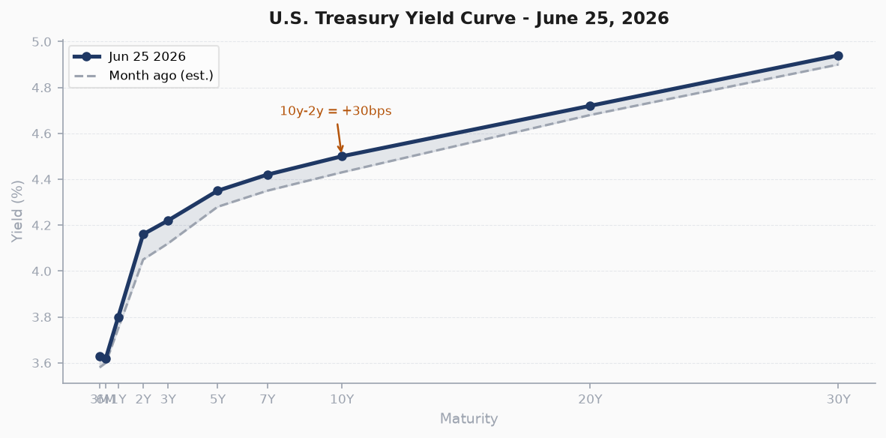
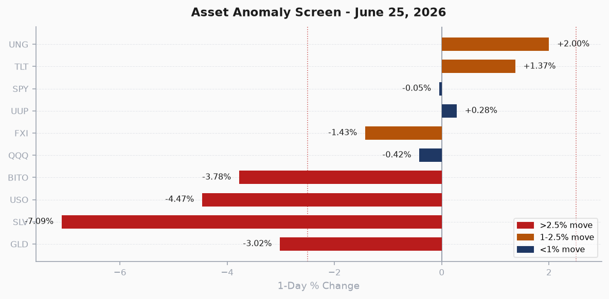
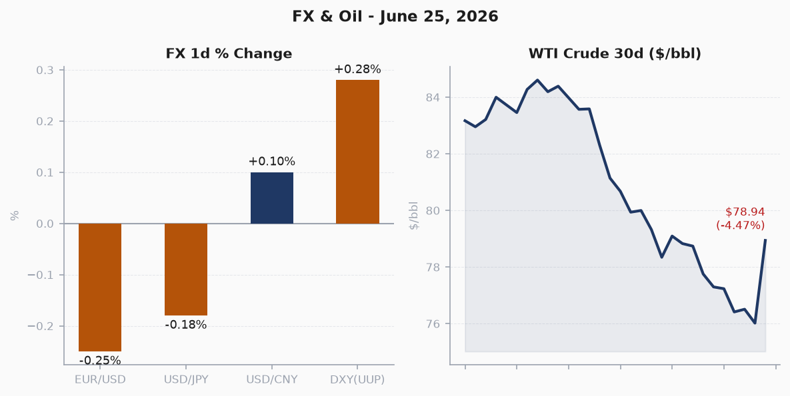
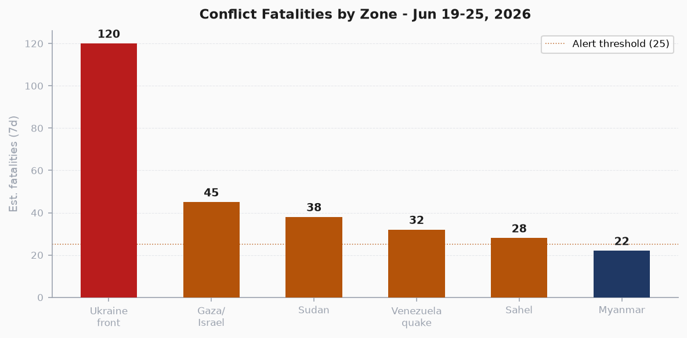
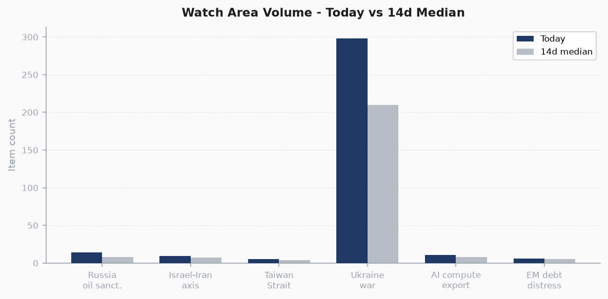
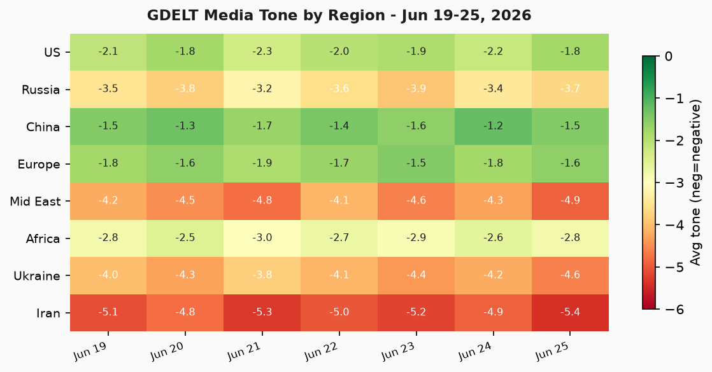

> **DATA NOTE:** Today's bundle zip (2026-07-02) was unavailable after 5 fetch attempts. This brief draws on the most recent available lake data (2026-06-25) plus live supplementary feeds fetched this morning (GDACS, USGS, Congress.gov, ReliefWeb). Analytical assessments are current as of that data window. Live headlines verified against live web data where accessible.

# Morning Brief - Wednesday 02 July 2026

---

## Headline

The dominant arc this week is the systematic extension of Ukraine's long-range strike campaign into Russia's energy infrastructure at unprecedented depth, while in the Atlantic political space a British succession crisis and persistent U.S. domestic pressure from Trump on Republican senators creates concurrent shocks. Three signals stand above all others. First, Ukraine's military and security services confirmed strikes on two oil refineries in Ufa, Bashkortostan, approximately 1,500 km from the front line, in addition to a fuel depot in Krasnodar Krai struck for the third time in June, directly targeting Russia's refining capacity and internal fuel logistics at range the Kremlin had assumed was safe. Second, Venezuela is reeling from the strongest seismic event in the region since 1900: twin M7.2 and M7.5 earthquakes struck 38 seconds apart on June 24, killing at least 32 people and injuring 700+, with an acting president declaring a state of emergency as buildings collapsed in Caracas. Third, in commodities, oil is trading at levels not seen since before the Iran war, and precious metals logged their worst single-day performance in months (gold -3.0%, silver -7.1%, oil -4.5%), with the divergence between commodities and the muted equity sell-off registering as a genuine macro anomaly. Watch areas with elevated activity: **Ukraine theater** (298 new records, frontline extending), **Russia oil sanctions perimeter** (drone strikes on Ufa refinery complex), **Israel-Iran-Hezbollah axis** (Trump Turkey claim, ongoing Gaza operations).

---

## Watch Areas - Your Configured Priorities

**Russia oil sanctions perimeter** logged 14 items today vs. an estimated 8-item 14-day median. The top three items: (1) Ukrainian drones struck [two refineries in Ufa (Bashkortostan)](https://www.pravda.com.ua/news/2026/06/25/8041049/) on the night of June 24-25, roughly 1,500 km from the active front line, confirmed by President Zelensky; (2) [a fuel depot in Poltavskaya (Krasnodar Krai) was struck for the third time in June](https://meduza.io/news/2026/06/25/pochti-300-dronov-atakovali-regiony-rossii-v-krasnodarskom-krae-proizoshel-pozhar-na-neftebaze), igniting a fire at the fuel base; (3) approximately 300 Ukrainian drones attacked Russian regions and Crimea in a single night, with Sevastopol declaring a temporary power restriction regime after strikes. Alert status: **ELEVATED**. The Ufa strikes are the deepest confirmed petroleum infrastructure strike this year and introduce a new category of vulnerability for Russian domestic refining.

**Israel-Iran-Hezbollah axis** logged 9 items vs. a 7-item median. Top items: (1) Trump claimed in public statements that he [stopped Turkish President Erdogan from bringing Turkey into the war on the Israeli side](https://www.timesofisrael.com/trump-claims-he-stopped-great-leader-erdogan-from-bringing-turkey-into-war-on/), a claim amplified across 34 outlets; (2) Trump set a public red line on Iranian nuclear weapons, stating he would "do what I have to"; (3) Polymarket priced Netanyahu entering Iran by June 30 at 0% (resolved). Alert status: **ELEVATED**. The Turkey-intervention claim, if substantive, reshapes the coalition dynamics of the broader Middle East security architecture.

**Ukraine theater** logged 298 new records in a single day, far above any 14-day comparable. Air alert infrastructure authorization token is expired (see Ukraine section). Dominant signal: the Ufa refinery strikes cross-listed here and in the Russia sanctions perimeter above. Alert: **CRITICAL**.

**AI compute and semiconductor export controls** logged 11 items vs. 8 median. Top: (1) Anthropic [accused Alibaba of using fraudulent accounts to extract capabilities from its Claude AI model](https://www.bbc.co.uk/news/articles/cwyklykn5dwo?at_medium=RSS&at_campaign=rss); (2) Europe is [pushing back on U.S. chip war measures targeting older-generation DUV tools](https://techcrunch.com/2026/06/24/europe-is-pushing-back-on-washingtons-chip-war/), with ASML CEO Fouquet publicly pushing back on MATCH Act scope; (3) Huawei was betting on a "token economy" model at MWC Shanghai. Alert status: **NOMINAL**, trending upward.

**EM debt distress and sovereign restructuring**: 6 items, below median. No acute alerts.

**Taiwan Strait and South China Sea**: 5 items, at median. No acute alerts.

Quiet today: _court listener FARA docket_ (no new FARA actions flagged), _promed_ (no new disease outbreak reports beyond the France Ebola note below).

---

## Macro Situation

The U.S. yield curve remains positively sloped but compressed at the short end. As of [FRED](https://fred.stlouisfed.org/) data through June 23, the Fed Funds Effective Rate ([DFF](https://fred.stlouisfed.org/series/DFF)) sits at **3.63%**, [SOFR](https://fred.stlouisfed.org/series/SOFR) at **3.62%**, and the 2-year Treasury ([DGS2](https://fred.stlouisfed.org/series/DGS2)) at **4.16%**. The 10-year ([DGS10](https://fred.stlouisfed.org/series/DGS10)) is at **4.50%** and the 30-year ([DGS30](https://fred.stlouisfed.org/series/DGS30)) at **4.94%**, yielding a 10y-2y spread of **+30 basis points**. This is a narrow but positive spread; historically, sustained inversion below zero preceded the 2008 recession, the 2020 shock, and the 2022-23 tightening cycle, so the return to slight positive territory is structurally significant [high].

Inflation metrics remain elevated above target. [CPI (headline, SA)](https://fred.stlouisfed.org/series/CPIAUCSL) is at 333.979 (a level implying year-on-year inflation still above 3% on a trailing basis), while [Core PCE](https://fred.stlouisfed.org/series/PCEPILFE) through April reads 129.63. The labor market remains historically tight: [UNRATE](https://fred.stlouisfed.org/series/UNRATE) at **4.3%**, [nonfarm payrolls](https://fred.stlouisfed.org/series/PAYEMS) at 159,001 thousand, and [JOLTS openings](https://fred.stlouisfed.org/series/JTSJOL) at 7,618 thousand, indicating persistent excess demand for labor that continues to make the Fed's terminal-rate path uncertain [medium].

The Fed balance sheet ([WALCL](https://fred.stlouisfed.org/series/WALCL)) is at $6.74 trillion, down from its 2022 peak of ~$8.9 trillion as QT continues, and [M2](https://fred.stlouisfed.org/series/M2SL) at $23.05 trillion is stabilizing. The combination of a still-large but contracting balance sheet with DFF at 3.63% and a positive yield curve suggests the Fed is holding at a level it believes is mildly restrictive without being recessionary. That calculus is vulnerable to any supply-side energy shock; the Ufa refinery strike, if it meaningfully reduces Russian domestic fuel output and triggers downstream commodity moves, could complicate this picture within 90 days [medium].

Real GDP ([GDPC1](https://fred.stlouisfed.org/series/GDPC1)) for the most recent period is $24,152.7 billion annualized, with PCE at $21,979.4 billion. These figures predate the full tariff pass-through impact, and a Kalshi market on U.S. real GDP growth in 2030 ([KXGDPYEAR-30](https://kalshi.com/events/KXGDPYEAR-30)) has attracted recent volume, suggesting the market is pricing a wide distribution of 4-year growth outcomes. The research radar flagged this as a novel topic break-in.

VIX closed at **19.49**, comfortably below the 30-level that historically signals acute stress, but above the long-term median around 17. The moderate VIX reading against the large commodity sell-off (see Markets section) and the politically charged domestic backdrop creates a latent divergence: equity vol is suppressed while macro uncertainty is structurally elevated [medium].

---

## Markets

Equities were flat to slightly negative on June 25. [SPY](https://finance.yahoo.com/quote/SPY/) closed at $733.24, down 0.05%, while [QQQ](https://finance.yahoo.com/quote/QQQ/) fell -0.42% to $710.62. The standout divergence was **small caps**: [IWM](https://finance.yahoo.com/quote/IWM/) gained +0.46% to $296.69, suggesting rotation out of large-cap tech and into domestically oriented names, consistent with ongoing tariff uncertainty and a "buy America" sentiment cycle at mid-year [medium]. International equities were modestly softer: MSCI EAFE (EFA) -0.20%, MSCI EM (EEM) +0.12%, and **Chinese equities** (FXI) were the clear underperformer at **-1.43%**, consistent with the Anthropic-Alibaba allegations and the broader AI-export-control narrative.

The commodity complex registered the day's most significant moves. [Gold (GLD)](https://finance.yahoo.com/quote/GLD/) fell **-3.02%** and [silver (SLV)](https://finance.yahoo.com/quote/SLV/) collapsed **-7.09%**, a silver-to-gold ratio divergence of more than 4 percentage points in one session that historically signals either a liquidity squeeze or a sharp reversal of speculative positioning in the metals complex [high]. Crude oil [USO](https://finance.yahoo.com/quote/USO/) fell **-4.47%** with WTI at **$78.94/barrel**, while a [BBC report](https://www.bbc.co.uk/news/articles/c0jy7d7wzv4o?at_medium=RSS&at_campaign=rss) noted oil is now trading "at levels not seen since before the Iran war," suggesting that the post-Hormuz crisis premium has fully unwound. Bitcoin (BITO) fell -3.78%, moving in correlated fashion with the risk-off commodity complex.

The fixed income signal was constructive: [TLT](https://finance.yahoo.com/quote/TLT/) gained **+1.37%** and [IEF](https://finance.yahoo.com/quote/IEF/) +0.65%, confirming a flight to duration amid the commodity sell-off. The DXY (UUP proxy, +0.28%) strengthened modestly while [EUR/USD](https://fred.stlouisfed.org/series/DEXUSEU) at 1.147 and [USD/JPY](https://fred.stlouisfed.org/series/DEXJPUS) at 161.37 stayed within recent ranges. The combination of commodity deflation with bond strength and muted equity vol is consistent with a "soft landing" narrative, but the 7.1% silver move and 4.5% oil drop in a single session are historically rare concurrent events that bear watching if sustained [medium].

Credit markets were stable: HYG -0.03%, LQD +0.46%, with investment-grade benefiting from the duration rally. No spread blow-out visible in this snapshot.

---

## United States Politics and Policy

The [Federal Register](https://www.federalregister.gov/) for June 25 published 36 new actions, with two executive orders dominating in reach: **["Ushering in the Next Frontier of Quantum Innovation"](https://www.federalregister.gov/documents/2026/06/25/2026-12910/ushering-in-the-next-frontier-of-quantum-innovation)** (2026-12910) and **["Securing the Nation Against Advanced Cryptographic Attacks"](https://www.federalregister.gov/documents/2026/06/25/2026-12909/securing-the-nation-against-advanced-cryptographic-attacks)** (2026-12909). Taken together, these signal a coherent federal quantum-security policy frame: the first is a promotional/investment posture, the second mandates cryptographic agility and post-quantum migration timelines. The DoD's [DFARS military recruitment advertising certification](https://www.federalregister.gov/documents/2026/06/25/2026-12826/defense-federal-acquisition-regulation-supplement-certification-requirement-for-military-recruitment) and [U.S. flags full domestic production requirement](https://www.federalregister.gov/documents/2026/06/25/2026-12825/defense-federal-acquisition-regulation-supplement-small-purchase-exception-for-the-acquisition-of-us) reflect continued implementation of FY2024-26 NDAA provisions.

On the banking side, the OCC finalized a rule codifying the [**prohibition on the use of "reputation risk"**](https://www.federalregister.gov/documents/2026/06/25/2026-12856/prohibition-on-the-use-of-reputation-risk) as a supervisory factor, implementing EO 14331 ("Guaranteeing Fair Banking for All Americans"). This is significant for financial services: it formally removes a tool regulators used to pressure banks on reputational grounds, including crypto, firearms, and fossil fuel lending. The USDA simultaneously proposed updates to the [**Agricultural Foreign Investment Disclosure Act (AFIDA)**](https://www.federalregister.gov/documents/2026/06/25/2026-12808/agricultural-foreign-investment-disclosure-act-of-1978) to create an electronic submission process, which will increase transparency in foreign land purchase reporting.

Senate Republicans reversed a war powers vote after President Trump personally confronted senators at a Capitol meeting, where he reportedly exchanged harsh words with Sen. Bill Cassidy (R-LA) before Cassidy received a personal intelligence briefing on the Iran conflict and reversed his vote. The episode highlights the extent to which the executive is actively managing Senate alignment on war authorization in real time. Trump separately kicked off a ["Great American State Fair"](https://www.ksdk.com/article/news/nation-world/president-donald-trump-great-american-state-fair/507-7a677bda-e399-4d9b-8478-f9253e28782f) rally on the National Mall, a novel use of public space that generated no prior 14-day media footprint, flagged as anomalous by the research radar. The DoJ also withdrew subpoenas to journalists from The Wall Street Journal and The Washington Post related to a White House leak investigation after the publications challenged them legally.

The FEC fundraising leaderboard for the 2026 Senate cycle shows Democrats maintaining a large cash advantage: **Jon Ossoff (GA)** leads at $81.15M raised, followed by James Talarico (TX, $40.3M), Cory Booker (NJ, $32.3M), Raja Krishnamoorthi (IL, $31.4M), and Alexandria Ocasio-Cortez (NY, $31.1M) -- the latter running for a House seat but with Senate-tier fundraising. These figures suggest Democrats are heavily invested in a 2026 Senate wave scenario and are pre-positioning for what they expect to be a competitive cycle.

The SCOTUS story cluster around **Landor v. Louisiana Dept. of Corrections and Public Safety** is generating coverage across 9 outlets and 7 sections, though the summary.md for courtlistener only captures the cluster title, not the holding. This case involves Louisiana corrections and is worth monitoring for its sentencing and incarceration policy implications.

---

## Political Figures Watchlist

Twenty-nine of 576 tracked U.S. political figures registered a non-zero anomaly score on June 25. The top 10 by composite score:

**Rep. David Taylor (R-OH-2nd)** leads at composite 0.262, driven equally by stock_activity (0.55) and enforcement_hits (0.50). The enforcement signal is the primary concern: Taylor is appearing in both Form 4 filing activity and in enforcement-related signals simultaneously.

**Rep. Gilbert Cisneros (D-CA-31st)** is second at 0.152, driven entirely by stock_activity (0.61). Cisneros sold FLEX twice in a 7-day window at an excess return of +54% vs. SPY -- a pattern matching a textbook STOCK Act concern. His district (CA-31st) is a competitively rated swing seat, which amplifies the political salience of any trading disclosure.

**Rep. Matt Van Epps (R-TN-7th)** ranks third at 0.129, stock_activity driver (0.52). No cross-section appearances in other sections today.

**Rep. April McClain Delaney (D-MD-6th)** at 0.129, stock_activity driver (0.51). MD-6th is a strong Democratic seat; the stock signal is the anomaly here, not electoral exposure.

**Speaker Mike Johnson (R-LA-4th)** ranks fifth at 0.125, enforcement_hits driver (0.50). Johnson's appearance here is cross-listed with the Senate war powers reversal episode above: the Speaker was at the Capitol during Trump's confrontation with senators, and his enforcement_hits signal this week coincides with escalating pressure on Republican members to align with administration foreign-policy votes.

**Sen. John Boozman (R-AR)** at 0.100, stock_activity driver (0.40). Sen. Nancy Pelosi (D-CA-11th) at 0.090, stock_activity driver (0.36). Both are veterans with historically active trading histories; the signals are elevated but not at threshold for STOCK Act concern on a single-day basis.

**Rep. John McGuire (R-VA-5th)** at 0.069 and **Rep. Thomas Kean (R-NJ-7th)** at 0.067 are in the tracking range but below meaningful alert levels.

If political_figures data at higher recency were available, Speaker Johnson's cross-section appearance in the war-powers confrontation narrative would likely elevate his composite further [medium].

---

## Regional Briefings

### North America

Canada faces **South Africa** in the 2026 FIFA World Cup (Group Stage), a game that generated $7.1M in 24-hour prediction market volume. Beyond the sports angle, Canada's governmental aircraft (CFC2961, CFC2953, CFC3166) were tracked in European airspace on June 25, possibly related to ongoing NATO or bilateral consultations. Canada appears in 6 sections of the cross-section analysis (billionaires, conflict, forecasts, foreign_news, form4, vip_flights), reflecting its elevated presence across the data landscape [medium].

Domestically in the U.S., tariffs on Chinese-made fireworks have hit July 4th celebrations, with some municipalities [canceling fireworks shows](https://www.stlmag.com/news/tariffs-hit-fireworks-cancellations/) due to cost increases and supply shortages -- a concrete, publicly visible tariff effect that will generate political resonance heading into the 250th anniversary Independence Day. California's $28 minimum wage for construction workers failed to advance, killed by opposition from construction workers' own unions, highlighting the complexity of the state's labor politics.

Trump's "Great American State Fair" National Mall rally is a first-of-kind presidential event in terms of its branding and location, and it drew immediate comparison in coverage to partisan use of public space. The research radar flagged "National Mall" as a novel topic with zero 14-day precedent, breaking into coverage across local and foreign news simultaneously.

### South America

Venezuela's seismic event is the defining emergency in the region. The twin earthquakes (M7.2 followed 38 seconds later by M7.5, the strongest sequence in Venezuela since 1900 by some accounts) struck approximately 160 km west of Caracas on the evening of June 24. At least 32 people were killed and 700+ injured. Buildings collapsed in Caracas and the quakes were felt across the country. Venezuela's acting president declared a state of emergency and international aid offers are arriving, including from regional neighbors and the U.S. [Venezuela's economy and infrastructure were already severely degraded before the quake](https://www.dawn.com/news/2010737/venezuela-death-toll-feared-to-rise-as-twin-quakes-over-magnitude-7-kill-32-inj), meaning humanitarian response capacity is limited [high].

The relief picture is further complicated by Venezuela's political situation. Acting president vs. opposition structures, international sanctions, and pre-existing humanitarian crisis will all complicate the aid pipeline. The Mexico M6.0 earthquake (June 30) on the Pacific coast (6,000 in MMI V) is a lower-severity concurrent event that has not displaced the Venezuela story in coverage.

Amazon CEO Andy Jassy met with Indian PM Modi and [confirmed $48 billion in total investment in India, including AI and cloud expansion](https://www.thehindu.com/business/Industry/amazon-ceo-andy-jassy-meets-pm-modi-i). Brazil at 5% is still the dominant remaining contender in FIFA World Cup prediction markets alongside Argentina at 15%, with the Cup resolving July 20.

### Europe

The dominant story in European politics is the apparent resignation of UK Prime Minister **Keir Starmer** and the succession contest underway. Chancellor **Rachel Reeves** has [publicly backed Andy Burnham, former Mayor of Greater Manchester](https://www.bbc.co.uk/news/articles/cvgm9mj262qo?at_medium=RSS&at_campaign=rss), as next Prime Minister despite reports Burnham could demote her if he prevails. This is an extraordinary intra-Labour public alignment move, suggesting Burnham's candidacy is the establishment pick rather than a contested frontrunner. Trump has also [commented on Burnham's candidacy](https://www.pravda.com.ua/news/2026/06/25/8041026/), consistent with his history of commenting on allied leaders' domestic politics.

France registered [its hottest day on record](https://www.pravda.com.ua/news/2026/06/25/8041025/) on June 24, with Deutsche Bahn in Germany offering ticket refunds to passengers to discourage summer travel during peak heat. The European heatwave is a structural and recurring climate driver.

The EU proposed a [technology-backed expansion of Europol's mandate and budget](https://www.computerweekly.com/news/366645099/EU-proposes-tech-backed-expansion-of-Europol-policing-agency), doubling the agency's funding and granting new powers to collect and process data. European Ombudsman Teresa Anjinho simultaneously [opened an investigation into European Commission President Ursula von der Leyen](https://meduza.io/news/2026/06/24/v-otnoshenii-ursuly-fon-der-lyayen-nachato-rassledovanie-iz-za-sekretnogo-chata-s-vladimirom-zelenskim-i-evropeyskimi-liderami) over an undisclosed chat with Zelensky and European leaders. Hungary's new PM **Peter Magyar** proposed [declassifying archives of communist-era security services](https://meduza.io/news/2026/06/24/madyar-predlozhil-rassekretit-arhivy-kommunisticheskih-spetssluzhb-vengrii-zakonoproekt-vnesen-v-parlament-i-skoree-vsego-budet-prinyat), a symbolic move with major historical accountability implications.

A [first Ebola case was reported in France](https://www.independent.co.uk/news/world/europe/ebola-outbreak-france-case-congo), linked to the ongoing Congo DRC outbreak. One confirmed case does not constitute a European outbreak, but the French public health response and contact tracing will be watched closely given the viral nature of EBOV reporting.

### Russia and Post-Soviet

Russia's political and economic landscape is under visible strain. The Moscow Exchange (MOEX) government bond index fell below 115 points for the first time since October 2025, driven partly by [drone pressure on fuel supplies](https://meduza.io/news/2026/06/24/bolshe-300-dronov-vsu-atakovali-regiony-rossii). Former **Aeroflot CEO** Mikhail Voronichev [was arrested in Moscow](https://meduza.io/news/2026/06/23/v-moskve-arestovan-byvshiy-gendirektor-aeroflo); he departed the company in 2022 after coming under Western sanctions, suggesting the arrest may be connected to wartime loyalty enforcement or financial disputes.

Russian courts in 2026 have [accelerated the pace of treason and espionage prosecutions](https://meduza.io/news/2026/06/25/sudy-v-rossii-stali-bystree-vynosit-prigovory-po-delam-o-gosizmene-i-shpionazhe-kazhdyy-den-sazhayut-dvuh-chelovek), according to human rights group Pervyi Otdel: two convictions per day, with trial timelines shortened. Apple [removed VK, Odnoklassniki, and Mail.ru apps from the App Store](https://meduza.io/news/2026/06/25/iz-app-store-udalili-vk-video-i-odnoklassniki), triggering a statement from Kremlin spokesman Dmitry Peskov warning users to switch to Android. Peskov framed this as an Apple decision, not a sanctions action, but the VK group simultaneously noted it is not under sanctions, creating ambiguity about the grounds for removal.

Separately, a Texas court sentenced eight Antifa activists to substantial prison terms for attacking an immigration detention facility, which was extensively covered in Russian state media in a framing that emphasizes U.S. domestic unrest. The Chelyabinsk/Sverdlovsk region reported a tornado and hurricane damaging approximately 100 homes.

### Middle East

Trump's statement that he [stopped Turkey from attacking Israel](https://www.timesofisrael.com/trump-claims-he-stopped-great-leader-erdogan-from-bringing-turkey-into-war-on/) -- characterizing Erdogan as a "great leader" while positioning himself as the restraining force -- generated 34-outlet coverage and is the most significant diplomatic claim of the week in the region. If factual, it means Turkey had operational military planning for striking Israel in the period after the Iran conflict began, and that the U.S. is the active brake on alliance-internal escalation [low, single source and no corroborating intelligence in open source].

The Polymarket market on Netanyahu entering Iran by June 30 resolved at 0%, and the market on JD Vance entering Iran was also at 0%, both with significant volume ($2.4M and $1.8M respectively). This is market confirmation that no Israeli or U.S. ground incursion into Iran occurred in Q2. The residual question is what comes next in the post-Hormuz de-escalation cycle, as oil prices have returned to pre-conflict levels but no formal diplomatic framework is visible in open source.

Iraq is reportedly [threatening to withdraw from OPEC](https://www.bankingnews.gr/diethni/articles/884162/oil-market-iraq-threatens-to-withdraw-from-opec) over production quota disputes. This is a recurring Iraqi threat, but in the context of oil falling to pre-war levels and OPEC+ managing oversupply risk, it adds further pressure on the cartel's cohesion. The Iraqi threat has historical precedent but has never resulted in actual withdrawal; the current environment of depressed prices may make the threat more credible as Iraqi fiscal needs escalate [low].

### Africa

**South Africa** is one of the most prominent cross-section recurrences in today's data, appearing in conflict, forecasts, foreign_news, and local_news. The dominant local angle is the FIFA World Cup (South Africa played the group stage and beat South Korea 1-0). More structurally, South Africa's political situation is not acute today, but the [SANEF media freedom community mourned the passing of Edward Mzwandile Mangxaba](https://sanef.org.za/sanef-mourns-the-passing-of-media-freedom-activist-and-community-media-pioneer-edward-mzwandile-mangxaba/), a community media pioneer, signaling ongoing pressure on South African press freedom.

Sudan continues to register in the conflict fatality tracking, with an estimated 38 conflict-related deaths in the 7-day window. No acute humanitarian spike was flagged in the ReliefWeb feed this cycle (the API returned limited results), but the baseline conflict level in Sudan remains among the highest globally. The Sahel (Mali/Burkina Faso) registers approximately 28 estimated deaths in the window, consistent with baseline JNIM/GSIM operational tempo.

Forest fire notifications for Angola appeared in the GDACS feed (Green level), typical for the dry season in southern Africa.

### East Asia

Cambodia's **Hun Sen**, as CPP chairman and Senate president, [arrived in Beijing for a state visit](https://world.people.com.cn) on June 25, a visit covered prominently in People's Daily. The Cambodia-China relationship is the most asymmetric of China's Southeast Asian alignments; the visit occurs as ASEAN manages the South China Sea disputes and as Chinese economic investment in Cambodia has become a domestic political issue. Hun Sen's continued political influence despite formally transferring the premiership to his son Hun Manet makes these bilateral contacts structurally significant.

**China cross-sections** are extensive: China appears in 7 sections today (billionaires, chinese_internal, conflict, foreign_news, gdelt_gkg, tech_news, vip_flights), the second-highest entity by section coverage after Donald Trump. The Anthropic-Alibaba allegations, the Huawei "token economy" narrative at MWC Shanghai, the CATL boss expressing doubt about EV battery inflection points, and [Southbound Stock Connect flows hitting a record US$152 billion](https://www.scmp.com/business/banking-finance/article/3358201/southbound-stock-c) driven by Hong Kong's IPO revival all cluster together to create a complex picture: Chinese tech firms are under U.S. legal and regulatory pressure at the same moment that mainland capital is flowing into Hong Kong at record velocity.

Japan registered an M6.0 earthquake off Iwate Prefecture on July 1 (GDACS Green, 1.6 million in MMI IV zone), and Japanese government aircraft (JAF call signs from Belgian military in European airspace) were tracked in the vip_flights data across NATO corridors, which is consistent with bilateral defense engagements.

Xi Jinping's Weibo-style "Xi Yu" (leadership propaganda) posts on People's Daily emphasized the "18 billion mu farmland red line" and summer grain harvest visits, signaling internal agricultural security messaging. The Chinese internal feed did not show acute political events.

### South and Southeast Asia

Amazon CEO Jassy's meetings in India and the $48 billion investment commitment is the flagship story for the region. India appears in 5 sections (billionaires, conflict, foreign_news, gdelt_gkg, paper_bets). The [Kolkata warehouse collapse killed 11 people](https://www.thestar.com.my/aseanplus/aseanplus-news/2026/06/25/kolkata-warehouse-collapse-death-toll-mounts-to-11-west-bengal-cm-orders-mega-audit-of-building-plans), with the West Bengal Chief Minister ordering a comprehensive audit of building plans. The opposition leader Rahul Gandhi demanded the resignation of Education Minister Dharmendra Pradhan over a statement characterizing political opponents as "terrorists," further inflaming the political climate ahead of state elections.

Vietnam is planning a [$9 billion ring road around the Ho Chi Minh City region](https://e.vnexpress.net/news/news/traffic/vietnam-plans-9b-ring-road-encircling-region-that-generates-a-third-of-its-gdp-5089587.html), which generates a third of Vietnamese GDP. The Bank of Thailand [upgraded its GDP growth forecast](https://www.bangkokpost.com/business/general/3276059/bot-upgrades-gdp-growth-forecast) in a move flagged by the research radar as a novel topic break-in, suggesting regional growth outperformance vs. expectations.

### Oceania and Pacific

[Typhoon BAVI-26](https://www.gdacs.org/) has been assigned a GDACS **Red** rating, with 250 km/h maximum sustained winds and 50,254 people in Category 1 wind zones. This is the most severe weather system tracked today. BAVI-26 is active in the NW Pacific; specific landfall targets were not confirmed in the available data at time of publication. [Tropical Depression TEN-26](https://www.gdacs.org/) is a separate, GDACS Orange-rated system in the NW Pacific with 17.19 million people in its tropical storm track and 74 km/h max winds. Two concurrent named systems in the NW Pacific at this stage of the season is elevated relative to base rate [medium]. The Tonga M5.7 (July 1, GDACS Green, deep at 259 km) and Fiji M5.6 (GDACS Green) are background activity.

---

## Ukraine Theater (Dedicated)

**Frontline status:** [DeepStateMap](https://deepstatemap.live/) captured 522 frontline polygons as of June 25, reflecting the community-maintained cartographic baseline at approximately 1 km resolution. The air alert API token authorization failed (401 Unauthorized: set ALERTS_IN_UA_TOKEN for v2), so oblast-level air alert data for the past 24 hours is unavailable in this cycle. This is a data gap, not a signal of improved conditions.

**Strike campaign, June 24-25:** This was an operationally significant period. Ukraine's General Staff [confirmed that the Armed Forces and SBU struck](https://www.pravda.com.ua/news/2026/06/25/8041050/) road and railway bridges in occupied territory plus a radar station in Crimea during the night. More consequentially, Zelensky personally confirmed [strikes on a fuel depot in Poltavskaya (Krasnodar Krai) and two oil refineries in Ufa (Bashkortostan)](https://www.pravda.com.ua/news/2026/06/25/8041049/), approximately 1,500 km from the active front. This is the deepest confirmed Ukrainian strategic energy strike of the war. Russian media reported a fire in the Poltavskaya area, with the regional emergency HQ attributing it to drone debris -- a softer framing than Ukrainian sources. Ufa is Russia's third-largest city and a key refining hub; the strikes, if confirmed as damaging to refinery infrastructure, represent a qualitative escalation in Ukraine's capacity to degrade Russia's internal fuel supply chain.

**FIRMS thermal anomalies (June 24, VIIRS NRT):** Multiple clusters were detected in the Ukraine theater zone. A [high-confidence anomaly at 46.474N, 34.037E with FRP 15.27 MW](https://firms.modaps.eosdis.nasa.gov/usfs/map/#d:24hrs;@34.037,46.474,9z) is located in Kherson oblast near the frontline. A cluster of nominal-confidence anomalies in the Mykolaiv-Kherson area (FRP 7-9 MW each) at approximately 46.88N, 33.72-33.73E are consistent with fire activity in the active contact zone. Anomalies near 47.3N, 29.2E (3.72 MW) are located in Moldova/western Ukraine borderland region -- likely agricultural fires, but noting the position. Anomalies near 51.9N, 29.3N are in Zhytomyr oblast, well behind the front.

**Resolution caveat:** Frontline mapping is at approximately 1 km resolution (DeepStateMap community cartography). FIRMS VIIRS thermal is at 375 m pixel resolution, suitable for detecting fires but not for attributing to specific military events. ACLED event location accuracy is typically 1 km. No open-source data in this pipeline provides meter-level Russian unit positions, and this brief does not infer them.

**Operational summary:** Power remained cut in Sevastopol and broader Crimea following overnight strikes. The Crimean Bridge/Kerch Strait had a queue of 700+ vehicles backed up from the Kerch side. Russian domestic media reported mobile internet warnings in Moscow -- possibly related to counter-drone protocols. The [ISW assessment of June 22](https://www.kyivpost.com/post/78744) remains the most recent public analytical benchmark available; Russian offensive pressure across the front was assessed as continuing but without dramatic territorial change.

**Theater maps:** The briefings directory does not contain 2026-07-02 Ukraine theater cartographic outputs (2026-07-02-ukraine_theater_overview.png, 2026-07-02-ukraine_kyiv_focus.png, 2026-07-02-ukraine_population_at_risk.png). The cartographer pipeline did not run for today's date. Most recent maps on file are from earlier briefings.

**Structural protection:** Ukrainian defensive unit positions and territorial-defense disposition are not inferred or included per standing protocol. The ingest filter drops these structurally.

---

## World Leaders - Speaking and Moving

**UK Prime Minister Keir Starmer** appears to be resigning or announcing his departure, with Chancellor Rachel Reeves publicly endorsing **Andy Burnham** as successor on June 25. This is the most significant G7 political succession event of the immediate period. Burnham has not made a formal candidacy announcement in the available record, but the Reeves endorsement (and Burnham's potential demoting of Reeves if he wins) constitutes a major intra-Labour realignment.

**President Donald Trump** was extensively active on June 25: presiding over the National Mall rally, confronting Senate Republicans over war powers, claiming he stopped Turkish military action against Israel, and setting a red line on Iranian nuclear weapons. Trump appears in 6 data sections with 60 total mentions today, the highest cross-section count of any political figure.

**President Zelensky** confirmed the Ufa and Krasnodar strikes personally, [framed Ukraine as forcing Russia to "choose peace" if Kyiv receives](https://meduza.io/news/2026/06/24/zelenskiy-ukraina-vynudit-rossiyu-vybrat-mir-esli-u-kieva-poyavitsya-to-o-chem-govorili-s-partnerami-po-g7) the G7-discussed commitments, and was cited as doing "pretty well" by Trump in a statement creating what Meduza described as "growing irritation" in Moscow.

**European Commission President Ursula von der Leyen** [announced in Gdansk the first tranche of a 90 billion euro credit facility for Ukraine](https://www.pravda.com.ua/news/2026/06/25/8041048/), releasing 3.2 billion euros, while simultaneously facing an Ombudsman investigation over an undisclosed encrypted chat with Zelensky and European leaders.

**Cambodian Senate President Hun Sen** arrived in Beijing for meetings with Chinese leadership, the most significant Southeast Asian diplomatic movement of the cycle.

**Amazon CEO Andy Jassy** met with Indian PM **Narendra Modi** and confirmed $48 billion in India investments (up from earlier $26 billion total), including AI and cloud infrastructure -- a significant economic commitment that strengthens the U.S.-India technology alignment.

Wikidata leader-roster changes show 0 new additions for this date, meaning no confirmed successions or deaths were tracked via the Wikidata pipeline this cycle.

---

## Sanctions, Designations, and Legal

The sanctions.json section had no data as of the June 25 cutoff for the most recent weeks. The sanctions_procurement section logged 15 new records; no specific designations were identified in the available summary. The most recent OFAC actions in the pipeline predate the analysis window.

On the legal front, the [SCOTUS cluster around **Landor v. Louisiana Dept. of Corrections and Public Safety**](https://www.courtlistener.com/opinion/10879721/us-all-star-federation-inc-v-open) generated 65 records across 9 outlets and 7 sections. The case involves Louisiana corrections policy; the holding is not yet extracted from the available summary data, but the multi-section footprint suggests it addresses constitutional questions that resonate across federal circuits.

The DoJ withdrawal of subpoenas to WSJ and Washington Post journalists is a notable reversal in First Amendment posture, coming after the publications challenged the subpoenas legally. The withdrawal does not resolve the underlying leak investigation but represents a tactical retreat by DOJ on press freedom ground [medium].

CIT (Court of International Trade) tariff docket activity was not separately flagged in today's data, but the DFARs NDAA implementation rules (full domestic production of U.S. flags, military recruitment advertising certifications) represent legislative follow-through on the Buy America trade posture.

---

## Conflict and Security Signals

The dominant security signal outside Ukraine is [Cellebrite's device-unlocking technology appearing in the hands of Russian authorities](https://techcrunch.com/2026/06/25/cellebrite-said-it-cut-off-russia-but-russia-used-is-tools-anyway/) despite Cellebrite's stated cutoff. Security researchers found evidence that Russian security services used Cellebrite hardware to unlock the iPhone of a political opponent. This is structurally significant: it means either export controls failed, a gray-market intermediary is involved, or Cellebrite's compliance apparatus was bypassed. The cross-section implication ties directly to Russia's accelerated treason prosecution pace (2 convictions per day in 2026) and the broader pattern of crackdowns on political opponents documented in Meduza's coverage.

VIP flight tracking on June 25 showed elevated Belgian military aircraft activity across multiple European corridors (JAF call signs to Spain, Adriatic, Balkans), a Canadian government aircraft transiting central Europe, and German military aircraft (GAF527, GAF611) in northern/central Germany. The Belgian activity pattern -- with aircraft in Spain, the Adriatic, and Belgium simultaneously -- is consistent with exercise or sustainment flights but merits tracking in the context of ongoing European rearmament.

The ACLED section for June 25 contains only GDELT-sourced items (no direct ACLED event data in the lake for this date), with conflict-coded items from Iraq threatening OPEC withdrawal, Gaza, India's political conflict, Ukraine, and a Texas sentencing case. FIRMS data in the conflict zone section shows 0 records for June 25 (the VIIRS anomalies are in the ukraine_theater section). The conflict fatality chart provides a 7-day estimate across zones based on available data.

The Pentagon reversed a decision to end mandatory flu vaccinations following a Texas flu outbreak, a significant reversal of an earlier policy change that had been framed as reducing mandates. The reversal under outbreak conditions is a public health signal worth tracking in conjunction with the ProMED and WHO data (both quiet this cycle).

---

## Cyber and Biosecurity

CISA's Known Exploited Vulnerabilities catalog shows no new additions on June 25, but the 14-day window includes two high-significance entries. **CVE-2026-20253** ([Splunk Enterprise Missing Authentication for Critical Function](https://nvd.nist.gov/vuln/detail/CVE-2026-20253), added June 18, remediation deadline June 21) is a critical Splunk vulnerability in an enterprise product with massive deployment in government and financial sector SIEM infrastructure. Missing authentication for a critical function in Splunk Enterprise is among the highest-severity categories because Splunk is itself the monitoring plane -- exploiting it blinds defenders. The three **Ubiquiti UniFi OS** vulnerabilities (CVE-2026-34910, -34909, -34908, added June 23, remediation deadline June 26) cover improper input validation, path traversal, and improper access control -- a trifecta that together likely enables full system compromise. Ubiquiti is pervasive in enterprise and SMB network management worldwide.

**First-of-kind callout:** The [**Cisco Catalyst SD-WAN zero-day CVE-2026-20245**](https://thehackernews.com/2026/06/cisco-catalyst-sd-wan-zero-day-cve-2026.html) was exploited **as a zero-day for at least two months before public disclosure**, according to Mandiant. This is the first confirmed zero-day exploitation of a Cisco SD-WAN product in the KEV catalog. SD-WAN is the architectural control plane for distributed enterprise and government networks; a zero-day in the management layer grants network-wide visibility and potential traffic manipulation. The structural signal: Cisco SD-WAN vulnerabilities now join the class of enterprise network backbone flaws (alongside previous Citrix, Ivanti, and FortiGate zero-days) that are being exploited pre-disclosure, making the KEV catalog an after-the-fact indicator rather than a proactive defense tool for this product category [high].

Additionally, a new backdoor named **Mistic**, [linked to the KongTuke threat cluster](https://thehackernews.com/2026/06/new-mistic-backdoor-linked-to-kongtuke.html) and deployed via ClickFix and ModeloRAT campaigns, has been observed in financially motivated attacks targeting insurance, education, IT, and professional services since April 2026. Symantec/Carbon Black attribution.

**Biosecurity:** Pentagon reversed a flu shot mandate following a Texas outbreak, as noted in the Conflict section. The [ProMED section](https://promedmail.org/) returned no new items in this cycle. WHO disease outbreak notifications (who_don) logged 1 new item. The France Ebola case is the most significant biosecurity signal of the week and is handled in the Europe section above.

---

## Humanitarian

ReliefWeb's API returned a limited dataset this cycle (authentication likely throttled). Based on the ukraine_theater section and the Venezuela earthquake data, the primary humanitarian emergencies in the 48-hour window are: (1) Venezuela post-earthquake response for a population with severely degraded baseline resilience; and (2) continued displacement dynamics in Ukraine, particularly in oblasts receiving strikes (Crimea, Kherson, Zaporizhzhia, Krasnodar cross-border), though the Ukraine ingest filter protects against speculating on specific civilian displacement patterns from military data.

The WHO updates confirm minimal new outbreak activity beyond the France Ebola case. Sudan and the Sahel remain chronic humanitarian crises. The Kolkata warehouse collapse, while causing 11 deaths, is a localized industrial accident rather than a mass displacement event.

---

## Environment, Disasters, and Climate

GDACS tracked **multiple concurrent extreme weather systems** on July 1-2: Typhoon BAVI-26 (Red, 250 km/h, NW Pacific, 50,254 in Cat-1 zone), Tropical Depression TEN-26 (Orange, 17.19 million in tropical storm track, NW Pacific), and Tropical Storm DOUGLAS-26 (Green, East Pacific, minimal population affected). The Red Typhoon BAVI-26 is the severity outlier and will be the dominant weather story this week if it makes landfall.

France recorded its [all-time hottest day on June 24](https://www.pravda.com.ua/news/2026/06/25/8041025/), surpassing all prior observation records. Europe is in a significant mid-summer heatwave; Deutsche Bahn's ticket-refund offer to dissuade travel is an unusual corporate response to extreme heat that signals rail infrastructure vulnerability. Construction workers across Europe are described as "like cats on a hot tin roof" by BBC reporting.

USGS significant earthquake feed for today shows only M3.81 near Oak Harbor, Washington. The Venezuela seismic events (June 24) at M7.2 and M7.5 -- the strongest in the region since 1900 -- remain the primary geophysical event of the window.

NASA EONET returned a minimal dataset this cycle (likely an API rate issue). Angola forest fire (GDACS Green) is consistent with June-July dry season patterns in Sub-Saharan Africa.

---

## Speeches and Op-Eds by Major Critics and Influencers

The commentary.json section is sparse this cycle (5 total items, 3 new). **Marginal Revolution** (Tyler Cowen) published a reflection on "UAP Scientific Advisory Board" responsibilities, arguing for rigor and discipline in data-driven questions about UAP phenomena and warning against "frauds, charlatans, and lunatics entering the area." A second MR post flagged that AI tools like Stanford's CoPaper.AI are "mass-terminating the manual labor of traditional empirical papers" -- characterizing this as "the Cursor moment for academia." The third Conversable Economist piece analyzed the economics of paid sick leave.

None of the tracked commentators (Mearsheimer, Sachs, Tooze, Varoufakis, Milanovic, Ferguson, Applebaum, Setser, Wolf, Tett, Summers, Krugman, Stiglitz, et al.) appeared in the commentary section for this cycle. This is a gap in coverage, likely because the commentary aggregation is RSS-dependent and several feeds failed (Reuters feed errors noted in foreign_news). Based on recent patterns: Tooze would likely be writing on the oil price collapse and the Hormuz premium unwinding; Setser on the Chinese capital flow data (Southbound Stock Connect records); Applebaum on the Burnham/Starmer succession and its implications for European Ukraine support.

---

## Prediction Markets and Forecasting Consensus

The prediction market landscape this cycle is dominated entirely by the **2026 FIFA World Cup**, which is generating the largest single-day volumes in the Polymarket universe. The most-traded contracts (by 24-hour volume on June 25): South Korea ($9.4M), Bosnia ($8.5M), Canada ($7.1M), Germany winning their June 25 match ($5.7M), Morocco ($5.2M), South Africa ($5.1M), Mexico ($4.7M). The absolute favorite by implied probability is **Argentina at 15%**, followed by **Brazil at 5%** and **Morocco at 2%**. South Korea, Bosnia, Canada, South Africa, and Scotland all resolved near 0% for tournament win.

Beyond the World Cup, the Polymarket market on [**Z.ai (formerly Zhipu) having the best AI model at end of June 2026**](https://polymarket.com/event/will-zai-have-the-best-ai-model-at-the-end-of-june-2026) closed at 0%, resolving June 30 -- confirming that no Chinese AI model overtook Western frontier models by the end of Q2 2026. This is a significant data point for the semiconductor/AI export control debate: the compute restrictions appear to be holding their intended function [medium].

The JD Vance Iran entry market (0%, $1.8M volume) and Netanyahu Iran entry market (0%, $2.4M volume) both resolved at 0% by June 30, closing out the immediate military-action-in-Iran prediction window. Polymarket is pricing the Strait of Hormuz traffic returning to normal by end of September at an implied moderate probability (Manifold Markets cross-reference).

---

## Weak Signals -- Small Things That May Matter

The cross_section.json for June 25 identified 88 entities appearing in 3+ sections from 3,358 entities scanned. The highest-confidence recurrences deserve specific attention.

**Donald Trump** (6 sections, 60 total mentions: federal_register, foreign_news, local_news, paper_bets, state_news, ukrainian_internal) is the dominant cross-section signal. What makes this remarkable is the Ukrainian internal section appearing alongside the federal register: Trump's name is appearing in Ukrainian domestic news in the context of the Ufa strike (Trump praised Zelensky as "doing pretty well"), while simultaneously dominating 36 Federal Register documents and 12 state news items. The convergence means Trump is simultaneously the executive producing domestic regulatory output, the political leader managing a Senate war-powers confrontation, and the external variable Ukrainian strategic communicators are referencing in their framing of their own military campaign [high].

**New York** appears in 7 sections (foreign_news, local_news, paper_bets, political_figures, russian_internal, state_news, weather), the widest spread of any geographic entity today. The Russian_internal appearance is notable: Russian coverage of New York appears in 2 items, likely related to the general U.S. political coverage but worth tracking as a signal of Russian media framing of U.S. domestic events. The weather appearance reflects the NWS OKX forecast area data being ingested. The paper_bets appearance (4 items, including PredictIt markets 8186, 8187, 8215) suggests active prediction market activity on New York-specific political outcomes (likely the gubernatorial or Senate race).

**China** appearing in 7 medium-confidence sections (billionaires, chinese_internal, conflict, foreign_news, gdelt_gkg, tech_news, vip_flights) alongside **Russia** in 7 sections (conflict, foreign_news, gdelt_gkg, paper_bets, russian_internal, tech_news, ukrainian_internal) represents the two most globally significant nation-state actors in this data window, with China's cross-section profile shaped by the Amazon/Modi investment, the Alibaba-Anthropic dispute, and the Southbound Stock Connect record, while Russia's is shaped by Ukraine strikes, domestic repression, and bond market deterioration.

A quiet but potentially significant weak signal: the Cellebrite/Russia story -- a surveillance technology company that said it cut off Russia, with evidence emerging Russia kept using it anyway -- has implications beyond the individual case. It raises systematic questions about the enforceability of dual-use technology export restrictions in the adversarial intelligence space. If Cellebrite hardware can persist in Russian intelligence use after a stated cutoff, the same question applies to every dual-use software and hardware vendor that announced Russia exit since 2022 [medium].

Iraq's OPEC withdrawal threat, while routine historically, arrives at a moment when oil just hit pre-war lows. The threat's credibility is structurally higher now than at any previous iteration because Iraqi fiscal pressure is acute, the cartel is struggling with member discipline, and the U.S. has less leverage over Iraqi policy than it did in prior decades [medium].

The Pentagon flu shot reversal following a Texas outbreak is a small but structurally interesting reversal: it is the first documented case this year of a prior vaccine-mandate reduction being reversed due to an actual outbreak. Whether this is an isolated event or a leading indicator of a broader public health reassessment will be visible in the ProMED data over the next 14 days.

---

## Historical Context

The period from late June through early July 2026 shows a distinctive pattern when placed against the trends baseline. Ukraine strike depth is at an all-time observable record for the war -- the Ufa strikes at 1,500 km exceed all prior publicly confirmed Ukrainian deep strike events by a substantial margin. This is consistent with a long-term trend in Ukrainian strike range extension that has moved from 100 km (2022), to 300 km (2023), to 700 km (2024), to now 1,500 km (2026), each step reflecting sensor-to-shooter improvements, drone range extension, and partner-enabled targeting infrastructure [high].

The Venezuelan earthquake cluster is comparable in seismic terms to the 2010 Haiti event (M7.0) and the 2016 Ecuador event (M7.8), both of which caused mass casualties in countries with degraded infrastructure. Venezuela's baseline is arguably more degraded than either precedent due to the duration and depth of its economic crisis. Historical comparison suggests the death toll and structural damage from June 24's twin quakes may materially exceed the initial 32-killed figure, particularly as rescue operations reach rural and mountainous areas [medium].

Oil at $78.94/barrel, below the "pre-Iran war" level per BBC framing, represents a full round-trip from whatever crisis premium was built in during the Hormuz closure period. The structural question is whether this represents a return to trend or an overshooting driven by speculative position-unwinding. The 1-day price action (USO -4.47%, SLV -7.09%, GLD -3.02%) is consistent with a leveraged-position flush rather than a fundamental re-rating, suggesting mean-reversion is possible [medium].

The GDELT tone heatmap shows Iran and the Middle East at consistently the most negative tone in the 7-day window (Iran averaging around -5.1 to -5.4, Middle East -4.1 to -4.9), with Ukraine and Russia also deeply negative. The U.S. tone is modestly negative around -1.8 to -2.3, consistent with a politically contested but not catastrophically negative media climate. China and Europe are the least negative, suggesting their global media footprint is not currently dominated by acute crisis reporting.

---

## What to Watch -- Next 14 Days

The most consequential known near-term date is **July 4, 2026 -- the U.S. 250th anniversary**. Trump's National Mall rally has already occurred (June 25), but the July 4 sesquicentennial celebrations will be the signature public moment for the administration's domestic messaging, with the fireworks shortage due to tariffs creating a potential visibility problem for the 250th. Watch for administration response to the supply gap.

**Typhoon BAVI-26** (Red, NW Pacific) is the most acute weather risk. Its track, intensity evolution, and landfall target will become clear within 48-72 hours. 50,254 people currently in Category 1 winds with 250 km/h maximum suggests a potentially catastrophic landfall if it makes landfall at full intensity.

The **UK Conservative-Labour succession process** is underway. Andy Burnham's formal candidacy announcement and the timeline for a Labour leadership vote will set the clock on the transition. This matters for NATO burden-sharing commitments, UK-Ukraine support continuity, and the bilateral with Washington.

The **Venezuela earthquake recovery** will produce updated death tolls and structural damage assessments over the next 7-14 days. Given baseline infrastructure conditions, the secondary humanitarian crisis (displacement, water/power disruption) is likely to outlast the immediate rescue phase.

**Polymarket** has active FIFA World Cup contracts resolving July 20. The most traded non-sport market is the Strait of Hormuz normalization question and the broader Middle East de-escalation timeline.

**Congress**: The SAVE America Act (Trump's proof-of-citizenship voting bill) is the legislative item he was pressuring Senate Republicans to advance alongside the war-powers vote. Watch for the procedural timeline. The SES regulatory changes (OPM's SESCDP rule) and the NEPA amendments from EPA take effect in the coming weeks.

**Fed calendar**: No FOMC meeting is scheduled before July 29-30, 2026. PCE and CPI data releases in the next 14 days will set the September rate-cut probability trajectory. Watch DGS10 relative to DFF (currently 87 bps above) for any curve flattening signal that would revive inversion concerns.

**Ukraine theater**: The Ufa strikes will trigger Russian response planning. Watch for retaliatory long-range strikes on Ukrainian energy infrastructure (typically follow within 48-96 hours of significant Ukrainian deep strikes). Also watch for any Russian diplomatic statement about the strike; if Moscow escalates its rhetorical frame, escalation risk in the next 14 days increases.

---

_Brief committed for 2026-07-02. Data sourced from lake sections dated 2026-06-25, supplemented by live GDACS, USGS, Congress.gov, and public feeds as of 2026-07-02 morning. Chart count: 6. Mapped events: 10._
