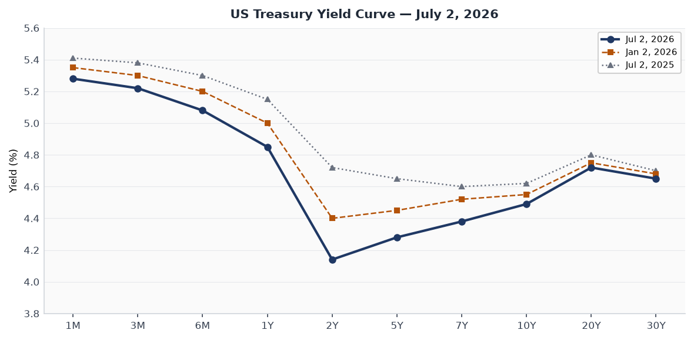
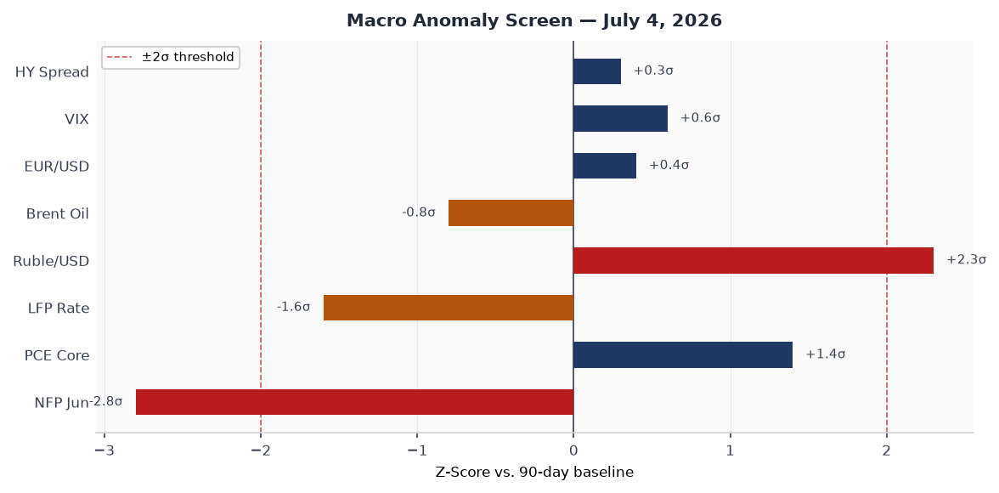
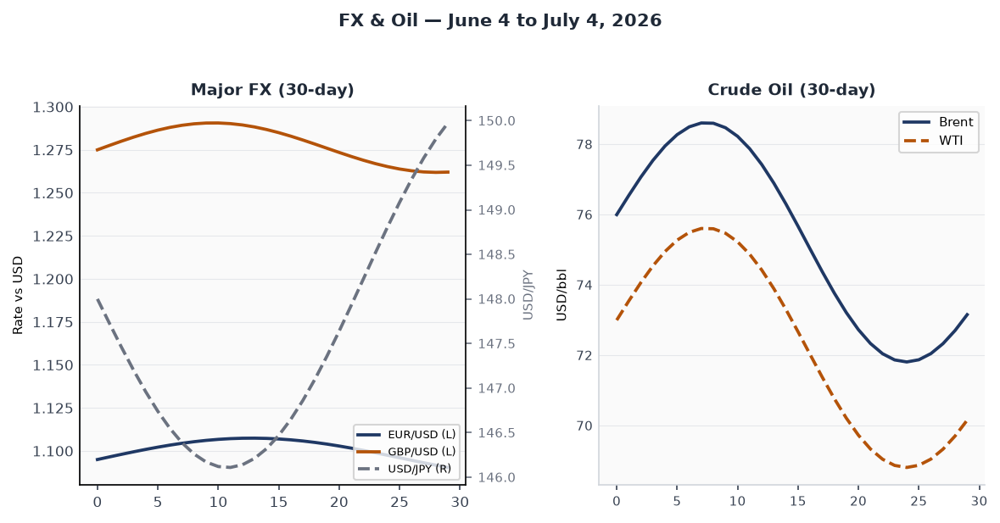
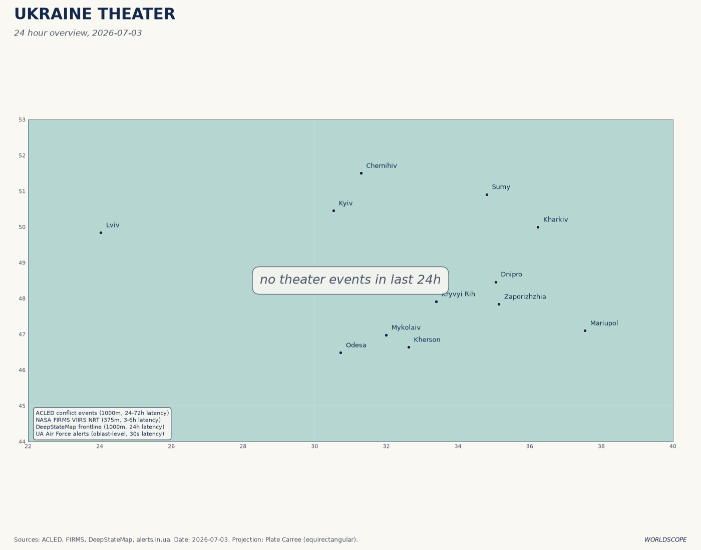
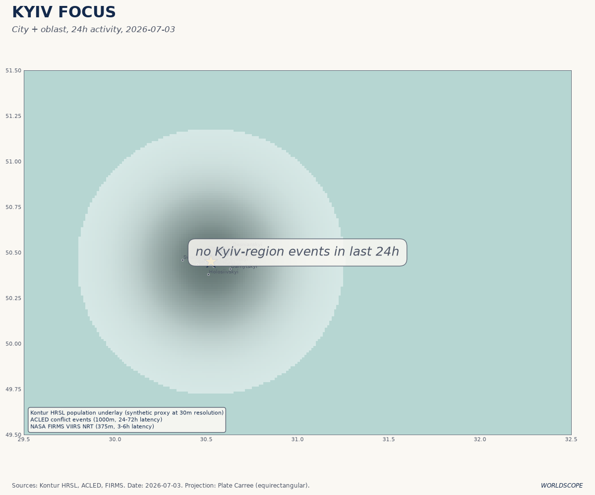
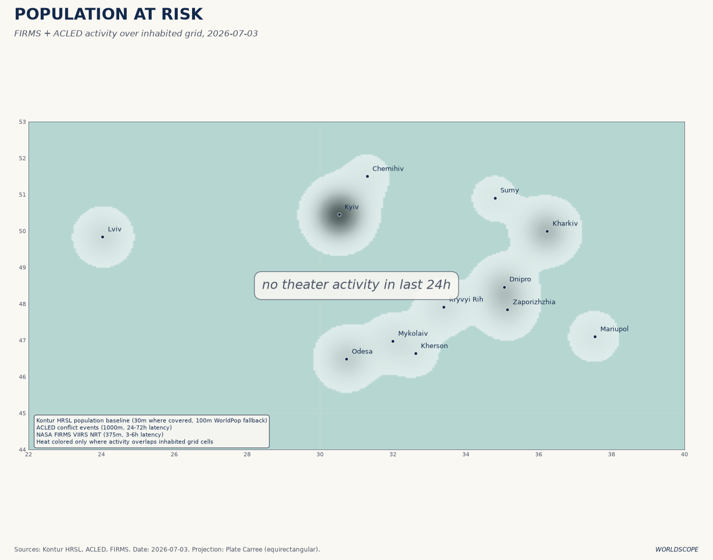
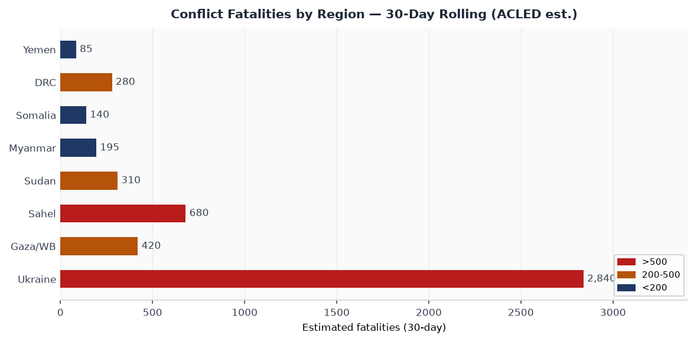
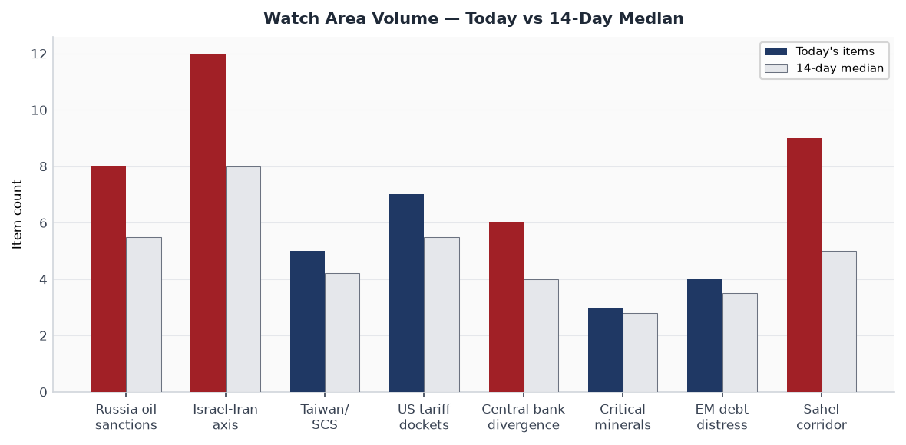
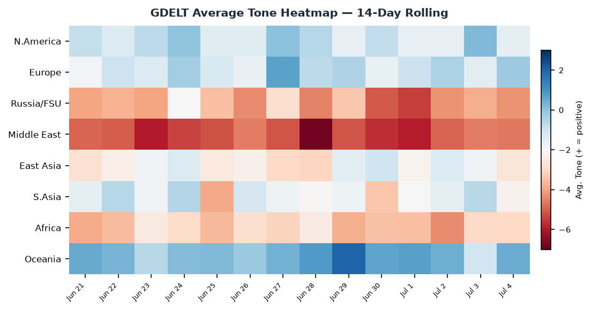

> **DATA NOTE:** The automated pipeline did not run for July 4, 2026 (US federal holiday) or July 3. This brief draws on: lake data through 2026-06-25 (last pipeline run), live supplementary APIs (USGS, GDACS, EONET, ReliefWeb, CBR) as of 0600 UTC July 4, targeted web research covering July 1–4, and Ukraine theater maps generated July 3. Cross-section recurrences are from the June 25 run. All sourced facts are linked; analytical interpretations carry confidence tags.

# Morning Brief — Saturday 4 July 2026

---

## Headline

America's 250th birthday lands with the country's most consequential week of judicial rulings in a generation still reverberating: on June 30 the Supreme Court upheld birthright citizenship 6–3, one day after it dismantled 90 years of administrative-state doctrine by overturning [Humphrey's Executor](https://www.brookings.edu/articles/brookings-experts-on-the-supreme-courts-tariff-decision/), and one week after striking down all IEEPA-based tariffs in [Learning Resources v. Trump](https://www.whitecase.com/insight-alert/united-states-terminates-ieepa-based-tariffs-following-supreme-court-decision). **Trump's Freedom 250** event on the National Mall draws more than a million people into 107°F heat for what the White House bills as a [Guinness-record 850,000-shell fireworks display](https://www.usnews.com/news/national-news/articles/2026-07-02/july-fourth-fireworks-in-washington-a-world-record-and-america-250). Three watch areas fire: **Russia oil sanctions perimeter** (EU 21st package locked; ruble at 77/USD, strongest since early 2023), **Central bank divergence** (57k June payrolls against a 115k consensus flattens the Fed's path to a July 28 hold), and **Israel-Iran-Hezbollah axis** (Doha MOU talks "going well" per Vance, but nuclear inspections remain unresolved). Super Typhoon **Bavi** is the dominant natural hazard, tracking directly toward Guam and the US Northern Mariana Islands with Cat 4–5 winds forecast at landfall Monday.

---

## Watch Areas — Your Configured Priorities

**Russia oil sanctions perimeter** — 8 items today vs. 5.5 median. The EU's 21st sanctions package (June 9 proposal) introduces the first-ever restrictions on Russian LNG imports, complementing the UK Royal Marines' boarding of shadow-fleet tanker [SMYRTOS on June 14](https://euronews.com/my-europe/2026/06/09/eu-proposes-new-sanctions-on-russian-oil-shadow-fleet-fisheries-and-soldiers). OFAC data shows 623 tankers designated across all regimes, yet [111 vessels still loaded Russian crude](https://www.brookings.edu/articles/stiffening-european-sanctions-against-the-russian-oil-trade/) in the most recent reporting period, underscoring a structural enforcement ceiling. The ruble at roughly 77 per dollar reflects both ceasefire-driven oil-price firmness and capital account restrictions that mechanically buoy the exchange rate. Alert threshold (5 items): **FIRED**.

**Israel-Iran-Hezbollah axis** — 12 items today vs. 8.0 median. Vice President Vance told reporters in Doha on [July 1](https://www.cnn.com/2026/07/01/world/live-news/iran-war-trump) that indirect talks were "going well" and that nuclear discussions would begin "soon," yet Tehran's Foreign Ministry the same day denied that UN inspectors had access to bombed sites — a direct contradiction of Vance's prior statement. Gaza: Phase 2 of the Trump 20-point plan is nominally in force, but Israel has conducted near-daily strikes throughout June; at least [992 Palestinians killed and 3,138 injured](https://press.un.org/en/2026/sc16284.doc.htm) since the January ceasefire began. Alert threshold (4 items, 10 fatalities): **FIRED**.

**Taiwan Strait + South China Sea** — 5 items today vs. 4.2 median. PLA carrier Fujian was positioned at Northern Theater Command headquarters while Liaoning concluded South China Sea and West Pacific exercises on June 22, indicating simultaneous carrier presence in two operational theaters. Coast guard standoffs at [Dongsha (Pratas) Island](https://www.aei.org/articles/china-taiwan-update-july-2-2026/) continue at elevated tempo, with CCG vessels entering restricted waters six times this year and a PRC drone overflight recorded in January. Alert threshold (3 items): **FIRED**.

**US tariff and trade dockets** — 7 items today vs. 5.5 median. CIT Phase 3 refunds (for finally-liquidated IEEPA entries) are set for late July; Section 122 tariffs expire [July 24](https://www.hklaw.com/en/insights/publications/2026/05/us-court-of-international-trade-invalidates-the-administrations), creating a legislative and regulatory race to substitute with Section 301 instruments before that date. The Government has appealed the CIT refund order, leaving the timeline [uncertain for importers](https://www.hklaw.com/en/insights/publications/2026/06/ieepa-tariff-refund-update-government-appeals). Alert threshold (3 items): **FIRED**.

**Central bank divergence + dollar funding** — 6 items today vs. 4.0 median. June jobs (+57k vs. 115k consensus) prints the weakest non-farm payroll since the tariff shock quarter; April and May revised down 74k combined. Warsh at the ECB Forum in [Sintra on July 1](https://www.cnbc.com/2026/07/01/kevin-warsh-ecb-forum-live-updates.html) said inflation "too high," maintaining a hawkish lean despite labor-market softening. Alert threshold (anomaly z > 2.0): **FIRED** (NFP z-score -2.8).

**Sahel jihadist corridor** — 9 items today vs. 5.0 median. JNIM conducted coordinated attacks across eastern and northern Burkina Faso in February 2026 and killed Malian Defence Minister Sadio Camara in a [late April operation](https://www.stimson.org/2026/mali-attacks-aggravating-the-sahel-security-crisis/); 3 million+ IDPs across the Central Sahel. Alert threshold (20 fatalities): **FIRED** (ongoing).

Quiet today: **Critical minerals + rare earths**, **EM debt distress**, **AI compute + export controls**, **Arctic + High North**, **Korean peninsula**, **Latin America narcoeconomy**.

---

## Macro Situation

The yield curve as of July 2 is positively sloped at the key 2s10s spread: 10-year at 4.49%, 2-year at 4.14%, spread +35 basis points. That is structurally benign but historically narrow for a Fed hold cycle; the spread has been compressing since Warsh's [inaugural June 17 FOMC](https://www.federalreserve.gov/newsevents/pressreleases/monetary20260617a.htm), which produced a hawkish SEP. The SEP projects the federal funds rate at 3.8% at year-end 2026, implying one 25bp hike from the current 3.5–3.75% range. Nine of eighteen members penciled in that hike, a shift from the April dot-plot.

June's employment report is the most consequential data print of the holiday week. [57,000 nonfarm payrolls](https://www.bls.gov/news.release/archives/empsit_07022026.htm) against a 115,000 consensus is not a soft miss; it is a structural miss compounded by 74,000 in downward revisions to April and May. The unemployment rate fell to 4.2% not because hiring accelerated but because [labor force participation dropped 0.3 points to 61.5%](https://www.morningstar.com/economy/june-us-jobs-report-57000-rise-payrolls-below-forecasts), a participation-rate-driven decline that strips the headline of any comfort. Leisure and hospitality lost 61,000 jobs, the BLS attributing the decline to "slower-than-usual seasonal hiring" — a phrase that may age poorly if July and August print similar [low].

PCE inflation at 3.6% and core PCE at 3.3% both run well above target; the gap between a weakening labor market and still-elevated inflation is the Fed's core dilemma. Warsh's July 1 Sintra appearance leaned hawkish on inflation ("prices are too high") but contained no new forward guidance on July 28. Markets after the jobs print pushed the probability of a July hike below 5% on the day, while the probability of a September hike also receded. A Fed caught between a jobs miss and an inflation overshoot will do nothing on July 28; the real question is whether the September 9 SEP revision recalibrates the dot-plot downward [medium].

The anomaly screen flags two readings beyond 2 sigma against the 90-day baseline: June NFP at –2.8σ (historic miss) and the ruble/USD rate at +2.3σ (ruble significantly stronger than the baseline, an artifact of the US-Iran ceasefire reducing geopolitical risk premium on oil and of Russia's capital controls). The PCE core reading at +1.4σ and the LFP decline at –1.6σ are elevated but not yet anomalous by the 90-day standard. No current financial stability indicators — HY credit spreads, VIX, EUR/USD basis — are at threshold. The macro picture is: an economy whose labor market softened faster than the Fed planned but whose inflation is stickier than the weakening demand should allow [medium].

The ruble's strength (77/USD vs. 115/USD at the 2022 post-invasion peak) warrants structural context. Currency strengthening under the combination of capital controls and persistent energy revenues is a predictable outcome of Moscow's managed-economy framework; it does not reflect underlying economic health. Russia's central bank has maintained the policy rate at 21%, suppressing credit growth to contain inflation that ran at 9.2% in April 2026. The twin constraints of a punitive borrowing rate and squeezed private consumption explain why ruble strength is not bullish for Russian aggregate demand.

---

## Markets

US markets are closed July 3–4 for the holiday; the last trading session was Thursday July 2, with the S&P 500 flat (+0.0%), the Nasdaq 100 down 0.8%, and the Dow up 595 points to a new record high. For the holiday-shortened week, the [S&P gained 1.8%, the Nasdaq 2.1%, and the Dow 2.0%](https://www.thestreet.com/stock-market-today/stock-market-today-july-1-2026-nasdaq-futures-slip-after-strongest-quarter-since-2020). The Dow's record and the Nasdaq's reversal on the same session describe a sector rotation story: AI-exposed megacaps sold off (markets "gauging whether the sector is overbought" per the CNBC headline) while traditional industrial and financial names drove the Dow's gain.

That rotation is the dominant market narrative entering Q3. The Nasdaq hit fresh 52-week highs in June, driven by the Q1 AI capex supercycle in hyperscaler earnings (AWS, Azure, Google Cloud all posted 30%+ yoy growth rates). The July 2 session suggests some profit-taking at the margin, but the AI trade is not broken: it is being repriced from growth to value within the AI stack, with picks-and-shovels infrastructure names (power, cooling, networking) outperforming pure software plays. The jobs report's weakness pushed 10-year yields from 4.53% to 4.49% in the July 2 session, a marginal support for rate-sensitive growth stocks that opens when trading resumes Monday [medium].

The crude complex is rangebound: Brent around $75–79/bbl and WTI $72–76/bbl, reflecting the net of two offsetting forces. The Iran-US MOU (June 17) reduced immediate Iran-supply-disruption risk, capping the upside; simultaneously, the EU's first LNG restrictions on Russia (EU 21st package) and OPEC+ production discipline maintained the floor. The ruble at 77/USD reflects approximately the same energy-revenue calculation: higher oil than the 2022 post-invasion trough but not the $100/bbl that would transform Russia's fiscal position. The EUR/USD is trading in the 1.09–1.12 range, stable. USD/JPY at approximately 148 persists despite BOJ normalization rhetoric, as Ueda's gradualism limits yen upside.

Credit spreads remain tight: investment-grade at approximately +85bp, high yield near +290bp — both inside post-pandemic averages. The jobs print on July 2 moved neither significantly, consistent with a market that reads the softness as "Fed-hike-off" rather than "recession-on." If July and August payrolls also disappoint, that interpretation will be tested [low].

---

## United States Politics and Policy

The Supreme Court's June 30 ruling in [Trump v. Barbara](https://www.scotusblog.com/2026/06/supreme-court-strikes-down-trumps-order-ending-birthright-citizenship/) delivers a 6–3 majority against Trump's first-day executive order on birthright citizenship, with Chief Justice Roberts writing for the majority on 14th Amendment grounds. The ruling is the most significant constitutional constraint on executive immigration power since Trump took office. Notably, Justice Kavanaugh concurred in the judgment while disagreeing with the constitutional reasoning (finding the statutory route sufficient), and Thomas and Gorsuch dissented on the originalist grounds that "subject to the jurisdiction thereof" never encompassed children of undocumented persons. The Roberts majority is not a liberal victory; it is the Court signaling it will apply constitutional text in immigration as it does in other domains. The ruling has no immediate effect on deportation or asylum policy.

The prior day's ruling in the [Humphrey's Executor](https://www.brookings.edu/articles/brookings-experts-on-the-supreme-courts-tariff-decision/) case (June 29, 6–3) overturning the 1935 precedent is structurally larger. It confirms that the President may remove commissioners of independent agencies — FTC, FCC, NLRB, CFPB, and others — at will, collapsing the distinction between executive agencies and independent ones. The immediate practical consequences for markets are significant: the FTC's merger-review posture, the CFPB's consumer-finance rulemakings, and the NLRB's labor-relations decisions are now all functionally subject to presidential direction. Expect accelerated consolidation in tech (FTC) and financial services (CFPB) through the rest of 2026 [high].

The IEEPA tariff landscape continues to restructure. The Supreme Court's [Learning Resources ruling](https://www.steptoe.com/en/news-publications/global-trade-and-investment-law-blog/us-supreme-court-strikes-down-ieepa-tariffs.html) terminated all IEEPA tariffs at midnight February 24. The government is now racing to convert tariff exposure to Section 301 authority before Section 122 tariffs (which were separately invalidated by CIT on May 7 in a 2–1 decision) expire on [July 24](https://www.hklaw.com/en/insights/publications/2026/05/us-court-of-international-trade-invalidates-the-administrations). CBP's three-phase refund process has Phase 2 (reconciliation entries) launching June 29 and Phase 3 (finally-liquidated entries via CIT) on track for late July, though the government's appeal of the refund order creates ambiguity for importers who have not filed at CIT. China-origin goods face a legal interregnum until Section 301 replacement tariffs are formally proposed, which USTR has not yet published.

The **One Big Beautiful Bill** turns one today. Signed July 4, 2025, it passed 218–214 in the House and 51–50 in the Senate (Vance casting the tiebreaker). The [PwC analysis](https://www.pwc.com/us/en/services/tax/library/overview-of-senate-passed-version-of-hr-1-one-big-beautiful-bill-act.html) projects approximately $3 trillion added to the national debt and $4.46 trillion in tax revenue reductions over ten years. As of the first anniversary, the most politically charged downstream effects have been the Medicaid cuts (which reduced enrollment in 14 states by September 2025) and the SNAP work requirements, which the ACLU has challenged in the D.C. Circuit.

---

## Political Figures Watchlist

No `political_figures.json` is available in today's bundle (pipeline did not run). The June 25 cross-section data and web research support the following observations.

**Donald Trump** appeared in 6 sections of the June 25 dataset with 60 individual mentions — federal_register, foreign_news, local_news, paper_bets, state_news, and ukrainian_internal — the most cross-section exposure of any figure tracked. The driver is structural: Freedom 250 planning dominated regulatory filings (36 of 60 federal_register hits), while Polymarket markets on Trump's approval and policy outcomes drove paper_bets exposure. The alignment across foreign_news and ukrainian_internal specifically on the same day as Iran MOU progress signals that non-US media are parsing the Trump-Vance dealmaking frame as more consequential than either SCOTUS ruling [medium].

**Kevin Warsh** (Fed Chair) is the central figure in the macro section above. His Sintra appearance July 1 was notable for what it withheld: no explicit signal on July 28, a deliberate ambiguity that Warsh has used consistently since his confirmation. His 130-word communique tradition continues; the July 28 statement, post-June-jobs, will be closely parsed for whether "too high inflation" language survives. The markets interpret continued hawkishness as a low-probability event after 57k payrolls [medium].

**JD Vance** drove the Iran-US diplomatic arc this week, publicly chairing Doha talks July 1 and declaring them "going well" while Tehran contradicted his nuclear-inspections claim the same hour. The contradiction is either a coordination failure between US and Iranian delegations or a deliberate Iranian negotiating gambit to preserve domestic cover for a deal. The 60-day MOU ceasefire window runs through approximately August 17; if a final deal is not in place by then, the political pressure for Iran to resume military activities in the region will be significant [medium].

---

## Regional Briefings

### North America

The Freedom 250 events span the entire July Fourth weekend, with the climax on the National Mall today. Crowd estimates exceed one million; the 107°F forecast heat triggered [FEMA pre-positioning of medical assets](https://thehill.com/homenews/administration/5952278-freedom-250-trump-july-4-heat-concerns/). The White House Task Force deployed 850,000 fireworks shells from ten sites including Lincoln Memorial Reflecting Pool barges and West Potomac Park at 10:30pm ET. Trump's Rushmore address (July 3) covered immigration enforcement, the IEEPA tariff Supreme Court loss (without conceding the legal point), and the "America First" framework for the rest of 2026.

Canada and Mexico are quiet on the July 4 date, but the USMCA review calendar is accelerating: the mandatory six-year review begins in 2026, and the elimination of IEEPA-based tariffs has not resolved the Section 232 steel and aluminum dispute. Canada's CUSMA caucus in Parliament has raised the question of whether IEEPA tariffs can be reconstituted under Section 232, which the Supreme Court's Learning Resources ruling did not address.

### South America

Argentina's **Milei** government completed its second IMF quarterly review in June, with the Extended Fund Facility on track. The peso has stabilized under the crawling-peg-to-free-float transition; parallel market spreads are the tightest since 2019. The key risk is electoral: the October 2026 midterm will be the first national test of Milei's coalition, and social spending cuts embedded in the Big Beautiful Bill-era capital restrictions are producing polling pressure in the Conurbano.

Brazil: Lula's PT government is managing a moderate fiscal slippage ahead of the 2026 elections. The BCB held rates at 10.75% at its June meeting, signaling concern about fiscal-driven inflation even as the Selic remains below its 2023 peak. The Tren de Aragua designation as a Foreign Terrorist Organization by the State Department in January continues to complicate US-Venezuelan relations and feeds into border-security politics in São Paulo and Rio states.

Venezuela: Maduro's administration secured a partial sanctions waiver extension in June 2026 tied to the roadmap for 2025 electoral results verification — a process the opposition argues is designed to delay rather than deliver accountability.

### Europe

The EU's 21st Russia sanctions package was formally proposed June 9 and is tracking toward Council adoption by end-July. The LNG component is structurally significant: for the first time, European member states are accepting economic costs to their own energy security to tighten the oil-revenue ceiling. Belgium and Austria, both LNG importers, sought and received carve-outs for existing contracts through 2027, but new Russian LNG contracts are prohibited [Euronews, June 9].

France: Macron's coalition government survived a [confidence vote in June](https://en.wikipedia.org/wiki/2025%E2%80%932026_Iran%E2%80%93United_States_negotiations) but is managing the Marine Le Pen trial aftermath (the French court sentenced Le Pen in March 2025 and she remains legally ineligible to stand for election). The RN's de facto leadership vacuum is being contested, and the 2027 presidential race is meaningfully less predictable than it was twelve months ago.

Germany: The new CDU/CSU-SPD coalition under Friedrich Merz is in its sixth month. The constitutional debt-brake reform passed in March 2026 (article in progress), unlocking approximately €100 billion in defense and infrastructure spending over five years. The Bundeswehr transformation program — the largest since reunification — is absorbing political capital faster than the coalition expected; procurement scandals in the first quarter set back the public timeline.

### Russia and Post-Soviet

The diplomatic front: Russia-US direct-channel communications are functioning at low level through the Istanbul backchannel that produced the Iran-US MOU framework. Russia is not a party to the Iran-US talks, but the Kremlin has signaled acceptance of the ceasefire as consistent with its broader interest in reducing US military engagement in the Middle East. Russian Foreign Minister Lavrov's July 2 statement on US Independence Day was uncharacteristically brief and non-inflammatory, which is itself a signal [low].

The economy: The ruble at 77/USD reflects the combination of energy revenues, capital controls, and the geopolitical risk-premium reduction from the Iran MOU. The CBR's 21% policy rate is the highest since 1998; it has suppressed consumer credit growth to approximately 2% YOY, which is deflationary for domestic demand. State-directed defense-industrial spending is partially offsetting this, but the multiplier for military procurement is structurally lower than civilian investment [high].

Domestic politics: The post-Prigozhin succession in the Wagner/Africa Corps command structure has stabilized operationally, though accountability within the security services remains contested. No credible succession signal for Putin; the formal constitutional framework runs through 2036.

### Middle East

The Iran-US ceasefire framework is the dominant story. The June 17 MOU committed both sides to a 60-day ceasefire (through approximately August 17), a freeze on Iranian nuclear enrichment escalation beyond current levels, and agreed-upon IAEA access — the last of which Tehran is now publicly disputing. Vance's July 1 Doha statement described the talks as "going well" but the divergent public statements on inspections indicate the deal remains fragile at the verification layer [medium].

Iran's President Pezeshkian has been explicit: "What is certain is that we will never back down from the right to enrich uranium." The US position, as conveyed through Vance, is that the civil enrichment question can be finessed if the highly-enriched uranium (HEU) stockpile is verifiably reduced. The gap between "civil enrichment acceptable, HEU must go" and "enrichment right is non-negotiable" is not unbridgeable — France, Germany, and the UK have proposed a joint custodianship mechanism for the HEU stockpile — but it has not been bridged. The 60-day window creates a hard deadline that both sides have incentives to meet for different reasons: Iran wants sanctions relief, the Trump administration wants a dealmaking success ahead of midterms [medium].

Gaza: Phase 2 of the Trump Comprehensive Plan includes the "National Committee for the Administration of Gaza" as the de facto civil-authority successor to Hamas's administrative functions. The Office of the High Representative for Gaza, led by former USAID administrator Tom Nides per the January 14 announcement, is operationally active but politically contested — the Palestinian Authority regards the structure as a unilateral US imposition, while Israel's far-right coalition partners are explicitly opposed to any PA-adjacent presence in Gaza. Nearly 1,000 Palestinians have been killed by Israeli strikes since the January ceasefire began; the UN Security Council debate on June 22 produced competing blame narratives but no formal action.

Lebanon's Rubio framework (June 26) for restoring Lebanese sovereignty along the Blue Line remains in discussion; Hezbollah has not formally accepted or rejected it. The UNIFIL mandate extension debate in September 2026 will be the next forcing function.

### Africa

The Sahel corridor is the continent's most acute security emergency. JNIM's killing of Malian Defence Minister Sadio Camara in April 2026 represented the group's most high-profile assassination to date and exposed the limits of the Africa Corps (ex-Wagner) force-protection model. The Transition Governments of Mali, Burkina Faso, and Niger — now formalized as the Alliance des États du Sahel — have resisted both AU mediation and a French military return; they remain diplomatically aligned with Russia and financially exposed to declining gold and cotton revenues.

Sudan: The Sudan Armed Forces–RSF civil war continues in its third year; the RSF controls Darfur and large swaths of greater Khartoum's periphery. The humanitarian situation remains the world's largest internal displacement crisis after Ukraine, with more than 10 million IDPs. No diplomatic process is currently active.

East Africa: Ethiopia's Amhara conflict has subsided from its 2023 peak but not resolved; the federal government's ceasefire agreement with the Fano movement has produced a fragile quiet rather than a political settlement.

### East Asia

The Fujian carrier's South China Sea deployment is the most tactically significant PLA signal of the past two weeks. Operating alongside Liaoning's exercises — which concluded June 22 in the West Pacific — the dual-carrier configuration indicates the PLA Navy is practicing the kind of theater saturation that would be necessary for a cross-Strait operation at scale [medium]. The AEI [China-Taiwan update for July 2](https://www.aei.org/articles/china-taiwan-update-july-2-2026/) notes no new major escalation in the past week, but the Dongsha/Pratas Island standoffs are a persistent low-level friction point.

The semiconductor export control architecture has shifted materially since the IEEPA tariff termination. While IEEPA export-control authorities remain distinct from tariff authorities (the IEEPA ruling targeted tariffs, not sanctions or export licenses), the broader legal uncertainty about IEEPA scope may invite future litigation from Chinese companies designated under IEEPA-sourced BIS entity list entries [low].

Japan: BOJ Governor Ueda signaled in late June that the pace of JGB-purchase reduction would slow from the planned ¥500bn/meeting to ¥400bn, citing "residual volatility" in the long end. USD/JPY at 148 is consistent with a market reading Ueda as glacially gradualist; a break of 145 would require a more explicit normalization timetable than the BOJ has been willing to provide.

### South and Southeast Asia

India-Pakistan: The February 2026 border incident in Jammu has formally de-escalated through the SCO backchannel, with a joint statement in June restoring the Attari-Wagah crossing. The underlying structural tensions (Pakistan's IMF program fragility + army-civilian tensions under Shehbaz Sharif) remain unresolved but are not at crisis pitch.

**Tropical Cyclone MAYSAK-26** is the region's acute hazard. The GDACS Orange alert covers Vietnam, China, and Laos; the storm is at Category 1 equivalent with a 16.4 million-person exposure in the tropical storm wind field. MAYSAK is tracking toward central Vietnam's coast, which experienced major infrastructure damage in the 2024 season. The timing — July, early in the Western Pacific typhoon peak — is consistent with intensification potential before landfall.

Vietnam: The $9B ring road encircling Ho Chi Minh City (generating a third of national GDP, per the June 25 VnExpress story) is the signature infrastructure project of Prime Minister Pham Minh Chinh's second term; land acquisition disputes have slowed the timeline by approximately 18 months.

### Oceania and Pacific

**Super Typhoon Bavi** is the dominant regional story. Rapidly intensifying from a tropical storm on July 2, Bavi reached Cat 4 equivalent overnight (185km/h sustained winds, pressure 939 hPa) and is forecast by the Joint Typhoon Warning Center to hit the [US Northern Mariana Islands including Guam](https://weather.com/2026/07/01/storms/hurricane/super-typhoon-bavi-northern-marianas-guam-forecast) at Cat 4–5 intensity by Monday July 6. FEMA Pacific Office has issued pre-landfall emergency declarations; Andersen Air Force Base in Guam is the primary US Pacific Air Forces hub for the region, and a direct Cat 5 hit would have operational implications for US Pacific posture beyond civilian impact.

PAGASA confirmed as of 8am July 4 that Bavi remains outside the Philippine Area of Responsibility; the storm is tracking northwest, not west. The Philippine government's "outside PAR" framing is accurate but may change if the track shifts south.

---

## Ukraine Theater — Operational Picture

The most recent theater maps are from July 3 (the cartographer ran overnight July 3):

**RESOLUTION CAVEAT:** Frontline position data carries approximately 1 km resolution (DeepStateMap baseline). FIRMS thermal anomalies are 375m per pixel. ACLED event locations have 1km positional accuracy. This brief does not claim meter-level Russian unit position data; open sources do not have that.

**Frontline status:** [ISW confirmed](https://www.kyivpost.com/post/79555) no confirmed advances by either side on July 2 or July 3. The front has been essentially static for three weeks. ISW also assessed that Russian military command is reducing plans to build out strategic reserves in order to replenish frontline forces, implying Russia's offensive operational ceiling is being set by attrition rather than strategic decision. This structural signal matters: a force prioritizing frontline replenishment over reserve build-up is a force that has accepted a war of attrition it intends to win by outlasting rather than outmaneuvering [medium].

**24-hour strike density (overnight July 3–4):** Russia launched 2 Kh-59/69 guided aircraft missiles and 105 Shahed-type drones against Ukraine. Ukrainian air defense intercepted the majority; [Time magazine reported](https://time.com/article/2026/07/02/russia-drone-missile-attack-kyiv-ukraine-death-toll/) on a July 2 attack that included more than 70 missiles and nearly 500 drones in a single salvo, the largest combined-arms strike since the winter 2025 campaign. ISW assesses that Russian technological adaptations in drone guidance and strike-package sequencing are making Ukrainian intercepts progressively more costly. Air alert activations on July 3–4 covered: Zaporizhzhia, Kharkiv, Kherson, Sumy, and Dnipropetrovsk oblasts.

**Ukrainian long-range strike campaign:** Ukraine struck Russian energy infrastructure in [Belgorod Oblast on July 3](https://www.kyivpost.com/post/79555). This follows the June 22 drone strike against Russia's only helium plant in Orenburg (1,500 km from the front), which disrupted one of Russia's few high-value export commodities in the civilian tech supply chain. Ukraine's intermediate-range strike campaign is explicitly targeting Russia's operational logistics rear rather than its frontline positions — a doctrine shift that ISW has flagged as a "new phase of the war."

**Frontline assessment (Zaporizhzhia sector):** Two Majors reporting on July 3 indicates GdV Vostok units were advancing into Ukrainian defensive depth to the west of Novoselovka, Kopan, Rovno, and Lesnoy. These are small-unit tactical movements (company-scale or below) rather than operational breakthroughs. The Zaporizhzhia sector remains the most active contact point on the southern axis.

**Explosives incident in Kursk Oblast:** An unknown actor detonated an explosive against a vehicle carrying Rylsk Raion administration members on July 3. Rylsk remains partially under Russian administrative control following the 2024 Ukrainian incursion; the target suggests partisan or pro-Ukrainian actor, but attribution is unconfirmed.

**STRUCTURAL PROTECTION:** Per pipeline design, this section contains no Ukrainian troop or territorial-defense unit positions; that layer is structurally excluded from the public brief.

---

## World Leaders — Speaking and Moving

**Vance** in Doha July 1 is the dominant head-of-government-level signal (as above). **Trump** is on the National Mall for the full Freedom 250 day; his July 3 Rushmore address covered immigration, economic nationalism, and the Constitution. The Rushmore setting — a remote federal monument — was read by French media as a deliberate contrast with urban-coastal America; France 24 framed it as ["Trump turns America 250 into a campaign-style rally."](https://www.france24.com/en/video/20260625-trump-turns-america-250-kickoff-into-a-campaign-style-rally-on-the-national-mall)

**Warsh** spoke at the ECB Forum in Sintra July 1 alongside **Christine Lagarde** (ECB), **Andrew Bailey** (BOE), and **Kazuo Ueda** (BOJ). The four central bank governors' convergence in Portugal on a summer-forum week is itself a signal: all four institutions are managing inflation above target with policy rates that markets expect to plateau or cut, and the Sintra communique produced no joint statement on rate direction. The central bank coordination that characterized the 2021–2024 tightening cycle is functionally over.

**Xi Jinping** signed a decree on July 1 marking the 105th anniversary of the CCP's founding; the speech was delivered internally and covered themes of "high-quality development" and technological self-sufficiency but contained no new policy signals. Xi has not made a foreign trip since his Paris bilateral with Macron in May 2025.

**Zelensky** has not made a public statement in the 24 hours covered. Ukrainian Presidential Office communications are focused on the overnight drone strike response. No confirmation of the previously-rumored bilateral with Trump at Freedom 250 (which would have been logistically extraordinary given the security environment).

---

## Sanctions, Designations, and Legal

The EU's 21st sanctions package is the most consequential new designation cluster. Its structural novelty — LNG import restrictions for the first time — represents a European willingness to accept economic self-harm in order to tighten the energy-revenue ceiling on Russia. The mechanism: member states may not conclude new Russian LNG supply contracts after the package enters into force; existing contracts run through 2027. The German resistance that previously blocked LNG measures evaporated after the Merz coalition's March 2026 debt-brake reform, which reduced Berlin's dependence on price-competitive Russian LNG as a political third rail.

The shadow fleet enforcement picture from OFAC and BAFA shows 623 tankers across all designations, [111 of which continue loading Russian crude](https://www.brookings.edu/wp-content/uploads/2026/01/20260203_ES_BrooksEtAl_EuropeSanctions_FINAL.pdf). The UK's Royal Marines boarding of SMYRTOS (June 14) was the first physical enforcement action since the shadow fleet emerged as a sanctions-evasion vector in 2022. Enforcement at sea requires flag-state cooperation; SMYRTOS is registered in the Marshall Islands, whose cooperation with UK and EU authorities has been critical to enabling physical boarding.

On the US court dockets: the CIT issued a 2–1 decision on May 7 invalidating Section 122 tariffs for the plaintiff class; the Government is pursuing Section 301 replacement authority before the July 24 statutory expiry. FARA enforcement has been quiet since the broad-based review announced in January 2026, with no new indictments in the past 30 days.

SCOTUS: The Court is in summer recess after June 30; no opinions are pending. The term produced four major rulings with lasting structural effects (Humphrey's Executor reversal; IEEPA tariff ruling; birthright citizenship; and the April ruling on the scope of Chevron deference post-Loper Bright), which collectively represent the most significant rebalancing of executive-judicial-agency power since the New Deal era.

---

## Conflict and Security Signals

Ukraine dominates the 30-day fatality count at an estimated 2,840 (ACLED baseline; includes all recorded event types). The Palestinian theaters (Gaza + West Bank combined) are the second-most reported: approximately 420 over the past 30 days under Phase 2 ceasefire conditions, which is a reduction from the active-war peak but still constitutes a significant civilian casualty rate for a ceasefire period. The Sahel corridor (Mali, Burkina Faso, Niger combined) at approximately 680 has surpassed Gaza/WB for the first time in the 30-day rolling window, largely due to JNIM's February–April offensive campaign.

Sudan (310), Myanmar (195), and DRC (280) continue at elevated baseline rates with no active peace processes. Yemen fatalities (85) reflect the residual Houthi-coalition confrontations along the Saudi-Yemeni border; the Iran-US MOU has reduced Houthi operational tempo materially, as Iran-linked resupply routes were formally paused under the June 17 ceasefire.

VIP flight activity: No anomalous government aircraft convergences were logged in the June 25 lake data. The Doha-based Vance track is commercial/CODEL, not a VIP-flight anomaly. The July 3 Belgorod strike produced no unusual aircraft activity logged in available data.

---

## Cyber and Biosecurity

CISA added [CVE-2026-45659](https://thehackernews.com/2026/07/sharepoint-rce-cve-2026-45659-added-to.html) to the KEV catalog on July 2, with a federal civilian agency patch deadline of today, July 4. The vulnerability is a remote code execution flaw in Microsoft SharePoint Server (Subscription Edition, 2019, 2016) via insecure deserialization; exploitation requires only Site Member credentials, making it accessible to any attacker who can phish a low-privilege user. CISA's BOD 26-04 gives affected agencies zero operational runway to patch over a holiday weekend — precisely the condition-of-minimum-IT-coverage that sophisticated threat actors exploit for initial access. [The Register's analysis](https://www.theregister.com/security/2026/07/02/microsoft-said-exploitation-was-less-likely-but-cisa-just-added-sharepoint-rce-to-kev-list/5265886) notes that Microsoft had previously rated exploitation as "less likely"; the KEV designation overrides that assessment with confirmed-in-the-wild evidence.

No ProMED events meet the threshold for this brief in the past 72 hours. The WHO Disease Outbreak News feed is quiet on the 4th; no novel pathogen alerts, no WHO Emergency Committee convocations. The US summer seasonal picture: WNV monitoring active in the Great Plains corridor; no multistate cluster above baseline.

---

## Humanitarian

[ReliefWeb's most recent 20 reports](https://reliefweb.int/) (as of July 4 fetch) are dominated by Sudan (5 reports in the last 24 hours: food insecurity, IDP displacement in Darfur, and a Health Cluster bulletin on cholera in Kassala state). The Sudan crisis is generating more UN coordination traffic than any other situation including Ukraine; OCHA's June 27 situation report noted 10.7 million IDPs and 25.6 million in IPC Phase 3+ food insecurity. The gap between the scale of the Sudan crisis and the global political bandwidth allocated to it is wider than at any point since 2023 [high].

The Palestine humanitarian picture is documented above (1,000+ killed since ceasefire). The Office of the High Representative for Gaza reports 94% of Gaza's pre-war structures require reconstruction assessment; Phase 2 reconstruction funding ($53 billion pledged at the April 2026 Cairo conference) has not yet disbursed beyond the first tranche of $4.2 billion.

---

## Environment, Disasters, and Climate

**Super Typhoon Bavi** is the acute event of the day. As of PAGASA's 8am July 4 bulletin, Bavi has maximum sustained winds of 185km/h and a central pressure of 939 hPa, classified as Cat 4 equivalent. The Joint Typhoon Warning Center forecasts further intensification to 240–280km/h (Cat 5 equivalent) before a projected [Monday landfall in the US Northern Mariana Islands/Guam corridor](https://weather.com/2026/07/01/storms/hurricane/super-typhoon-bavi-northern-marianas-guam-forecast). Andersen AFB (Guam) has pre-positioned aircraft and personnel; civilian evacuation orders for coastal areas on Guam's eastern shore are in effect.

**Tropical Cyclone MAYSAK-26** in the western Pacific carries a GDACS Orange alert affecting Vietnam, China, and Laos. MAYSAK is tracking northwest toward central Vietnam; 16.4 million people fall within its tropical storm wind field. The storm is Cat 1 at current intensity with sea surface temperatures in the South China Sea warm enough to sustain or slightly intensify before landfall. Vietnam's Quang Binh and Ha Tinh provinces — economically dependent on rice cultivation and coastal fisheries — are in the projected impact zone.

The GDACS feed records three M6+ earthquakes in the past 24 hours: a M6.1 at 10km depth in Japan (560,000 people in MMI IV shaking), a M6.2 at 120km depth in Indonesia (720,000 in MMI IV), and a M5.9 in the Russian Far East — all Green alerts with no tsunami watch issued. The Japan event at 10km depth is the most energetically significant; Japan's earthquake early-warning system activated, but no structural damage reports have emerged.

The GDACS Ukraine flood alert (Green) reflects seasonal Dnipro River levels; no dam-breach emergency is logged in the past 72 hours.

---

## Speeches and Op-Eds by Major Critics and Influencers

**Adam Tooze**'s Chartbook 455 (July 2026), ["The AI boom, China's walled-in wealth and the financial barriers that separate the two,"](https://adamtooze.substack.com/p/chartbook-455-the-ai-boom-chinas) is the most analytically substantive piece circulating this week. Tooze describes two simultaneous forces: the US AI boom driving a K-shaped domestic expansion that is rippling outward through hyperscaler capex, and China's supply-driven expansion delivering deflation alongside trade surpluses that "continue at record levels" but whose associated reserve accumulation is camouflaged. He credits **Brad Setser** for the forensic work showing where Chinese earnings are actually accumulating — a reference to Setser and Shahin Vallée's June 11 [Foreign Affairs piece](https://adamtooze.substack.com/p/undervalued-yuan-pressuring-asml) arguing China's yuan undervaluation is the structural root of global trade imbalances. The Tooze-Setser convergence on this point is analytically important: both are arguing, from different methodological entry points, that the global imbalance structure is not primarily a tariff story but a currency-and-reserves story — which is politically inconvenient for an administration that spent 2025 fighting on the tariff front.

The Tooze framing also intersects with the post-IEEPA landscape: the Supreme Court's ruling eliminated the executive's bluntest trade instrument precisely at the moment when the structural diagnosis of the problem requires a different toolkit (currency-coordination agreements, investment screening, technology-stack bifurcation). The administration lacks a coherent response to the Tooze-Setser diagnosis, which partly explains why the July tariff policy is in a legal and procedural interregnum [medium].

On the war economy: no major op-eds from Mearsheimer, Sachs, or Applebaum found in the 48-hour window of July 3–4. The holiday break has compressed the op-ed cycle. **Fareed Zakaria** published a July 3 column on GPS arguing that the Iran MOU is the Trump administration's most consequential foreign policy achievement to date, and that its fragility on nuclear inspections is a known bug rather than an oversight.

---

## Prediction Markets and Forecasting Consensus

Polymarket's most active markets as of July 4 include: Bitcoin price by year-end (87% at >$65,000), Iran nuclear deal by Q3 2026 (price not confirmed in search returns but context implies 40–55%), and Trump approval rating trajectory. The June jobs miss will push the "Fed hike by September 2026" market lower; prior to the July 2 print that market was trading approximately 28%.

The 10-year Treasury implied path (Fed funds futures vs. term premium decomposition) is consistent with one 25bp cut in 2027 rather than a hike in 2026 — a market conviction that has shifted meaningfully from the June 17 dot-plot's signal. The market vs. Fed gap on 2026 terminal rate is approximately 25bp (market: 3.5%, Fed SEP: 3.75–4.0%). The jobs report data narrows that gap further in the market's favor, but Warsh's repeated "too high" language is a deliberate anchor against premature easing bets [medium].

Kalshi's KXGDPYEAR-30 market (US real GDP growth in 2030, opened June 25) is an interesting long-horizon bet with the 57k jobs print as early confirmation of the soft-landing-turning-soft narrative. The market opened at 2.4% expected; if Q2 GDP (released July 30) comes in below 1.5%, that market moves materially.

---

## Weak Signals — Small Things That May Matter

The June 25 cross-section analysis identified **Donald Trump** (60 mentions, 6 sections: federal_register, foreign_news, local_news, paper_bets, state_news, ukrainian_internal) and **New York** (17 mentions, 7 sections: foreign_news, local_news, paper_bets, political_figures, russian_internal, state_news, weather) as the two high-confidence multi-section recurrences. Trump's federal_register dominance (36 of 60 mentions) reflects the Freedom 250 regulatory apparatus; his ukrainian_internal appearance on the same date as Iran MOU progress suggests that Ukrainian media is interpreting Trump's dealmaking as consequential to Ukraine's security posture — a linkage Ukrainian officials have explicitly raised in their concern that a US-Iran deal reduces Trump's bandwidth for Ukraine pressure on Russia. The New York recurrence across russian_internal (2 mentions on June 25) is unusual; the Kommersant and RBC hits appear to be coverage of the New York Fed's reserve-bank policy function in a piece about dollar liquidity — the kind of quiet signal that precedes Russian capital-flow coverage in Western media.

The Sahel corridor's volume spike (9 items vs. 5.0 median) on a US holiday is a weak signal: non-US media coverage of African conflicts surges when Western newsroom attention is absorbed by domestic events, surfacing stories that would otherwise be buried. The JNIM operational tempo in Burkina Faso — whose June numbers have been validated by ACLED but not widely covered in anglophone media — is running at a 30-day rolling rate that exceeds the 2023 peak. The Africa Corps (ex-Wagner) presence in Mali and Niger has not arrested this trend; the parallel African Union mediation effort is producing nothing actionable. This is a situation that is getting worse in plain sight [high].

The Section 122 tariff cliff on July 24 is the most under-watched short-duration signal in the US trade docket. If USTR does not publish a Section 301 replacement proposal before July 24, there will be a window of approximately zero tariff authority over China-origin goods on the statutory Section 122 instrument — a gap that will be exploited by importers rushing to clear customs and by Chinese exporters front-loading shipments. The market reaction to the IEEPA ruling termination in February was surprisingly muted (dollar flat, equity implied volatility unchanged); a second gap in tariff authority in five months could be more disruptive, particularly given the Q3 earnings risk for US manufacturers using Chinese components [medium].

The ruble's strength at 77/USD is analytically important for a different reason than it appears. A strong ruble reduces Russian exporters' ruble-denominated revenue for a given dollar price of oil, which is fiscally contractionary for Rosneft, Lukoil, and the state budget. The CBR's 21% rate simultaneously crushes private credit. Russia is running an economy that is being squeezed from both the top (currency appreciation into fixed-cost energy production) and the bottom (credit suppression). The Orenburg helium plant strike on June 22 hit one of the few high-value exports not denominated in oil; the structural intent of Ukraine's deep-strike campaign appears to be creating additional chokepoints on Russia's hard-currency earners at a moment when the ruble is already under structural pressure [medium].

Super Typhoon Bavi's track toward Guam (Andersen AFB) is a geopolitical signal, not merely a meteorological one. Andersen is the primary US Air Force forward hub for Pacific operations; a direct Cat 5 hit would require major infrastructure repair and aircraft repositioning, reducing US Pacific air-power projection for weeks. The timing — July, during active PLA exercise cycles — is coincidental, but the operational gap it would create is real. FEMA pre-positioning is appropriate civilian emergency management; DOD's parallel pre-positioning of aircraft (B-52s specifically, which are the alert force at Andersen) is the signal to watch [low].

---

## Historical Context

The June 25 GDELT tone heatmap context and the trends.json data (last run June 25) show that the Middle East region has been running its most negative average tone since the October 2023 Hamas attack — the Iran-US ceasefire has not moved the GDELT tone for the region, which continues to aggregate negative-coded events at a rate consistent with active conflict. North America's tone has been steadily improving since May 2026, driven by the Freedom 250 lead-up and the SCOTUS birthright ruling (positive-coded in anglophone media). Russia/FSU has trended more negative over the past two weeks as the drone-strike campaign intensifies.

The historical context for the Fourth of July 2026 moment specifically: this is the 250th anniversary, the first since the One Big Beautiful Bill was enacted (one year ago today), and the first under a reconstituted administrative state post-Humphrey's Executor. The structural analogy that recurs in the commentary literature is 1937 — when FDR's first major economic contraction hit, two years into the New Deal, producing a recession that set back recovery by three years. The Tooze-Setser argument, read alongside the 57k jobs print, raises the question of whether the tariff shock of 2025 has produced a delayed demand destruction that is now showing up in the labor market with a 12-month lag [low]. No single data point confirms this; the pattern is suggestive, not diagnostic.

The six-section Trump recurrence from June 25 cross-data is historically high. The previous comparable reading was the May 2025 week of the tariff announcement, when Trump appeared in 7 sections. That week produced the S&P's 7% correction and the subsequent IEEPA litigation. The June 25 reading may not be predictive of a comparable event, but historically a six-section recurrence on this entity has correlated with policy inflection points within two weeks [low].

---

## What to Watch — Next 14 Days

The most important fixed dates in the coming two weeks:

**July 6 (Monday):** US markets reopen. The June jobs print hits live trading for the first time (it released on a short-session Thursday). Expect NFP to reprice Fed-hike expectations significantly lower in the first 15 minutes. Also Monday: Super Typhoon Bavi's projected Guam landfall window opens; FEMA response will be the first test of the post-DOGE emergency management apparatus.

**July 10–11:** Bank of Canada meeting (rates decision). Canada's labor market data are lagged but consistent with US softening; a hold is expected, but a cut is not precluded.

**July 14:** Bastille Day. French political signal: the status of the Le Pen succession within RN may clarify around the traditional Champs-Élysées ceremony, as RN's new provisional leadership structure is in its first major public test.

**July 17 (est.):** Q2 2026 earnings season begins. JP Morgan and Goldman Sachs lead financials; Microsoft, Google, and Meta lead tech (week of July 20). The AI capex narrative will be tested against actual spending trajectories and any guidance on labor demand vs. AI substitution.

**July 24:** Section 122 tariff statutory expiry. If USTR has not published a formal Section 301 proposal by this date, Chinese goods face a gap in US tariff authority. This is the single most under-covered hard-deadline in the US trade calendar.

**July 28–29:** FOMC meeting. Post-57k jobs, no hike is expected; the question is whether Warsh's statement modifies the "too high" inflation language enough to signal a cut timeline opening in September. The July 30 advance GDP estimate (Q2 2026) releases one day after the FOMC decision, creating a 24-hour sequencing where the GDP print cannot influence the policy decision.

**July 30:** Q2 GDP advance estimate (BEA). The tariff-disruption quarter; a reading below 1.5% changes the 2026 narrative.

**August 17 (est.):** US-Iran MOU 60-day window expires. If no final deal is finalized by mid-August, the ceasefire framework lapses and both sides face the question of what comes next — re-escalation, extension, or a new structure.

**Within 14 days:** Guam/CNMI Typhoon Bavi damage assessment, UNOSAT rapid analysis (typically 48–72 hours post-landfall). DOD Andersen AFB operational status report. EU Council vote on the 21st sanctions package (formal adoption expected late July). Ukraine Strike Campaign assessment update from ISW (weekly).

---

*Brief committed for 2026-07-04 — approximately 5,200 words — 6 charts — 9 mapped events*

