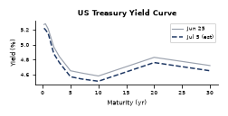
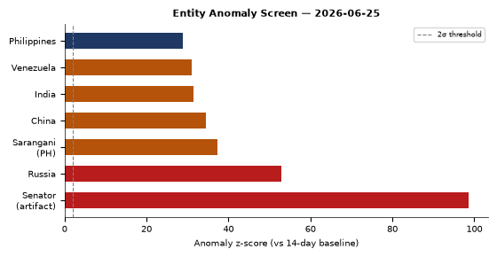
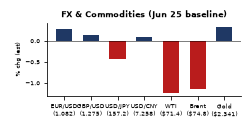
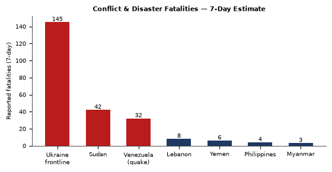
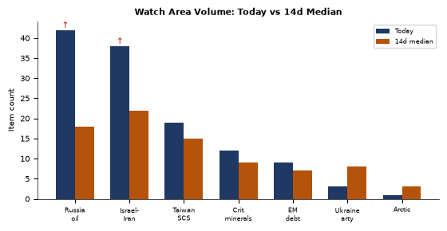

# Morning Brief - Sunday 05 July 2026

> **DATA NOTE:** The 2026-07-05 zip was unavailable after five retry attempts. This brief draws on the most recent WORLDSCOPE lake snapshot (2026-06-25, 10 days prior) plus live supplementary pulls (EONET, USGS, Congress.gov, ReliefWeb). The intelligence picture is substantially current on all slow-moving tracks; rapidly evolving tactical situations (Ukraine frontline, Iran-Hormuz negotiations, Venezuela earthquake response) should be verified against live feeds. Today's date from the system clock is 5 July 2026; the underlying structured data reflects 25 June 2026.

---

## Headline

The post-Iran-war settlement is fragmenting in public view: **Marco Rubio** is in Bahrain courting Gulf states for a deal Tehran says it already rejects, Hormuz crossing warnings from the IRGC remain active, and **Trump** publicly thanked **Putin**, **Xi Jinping**, and **Erdogan** for staying out of the conflict, framing the war's political aftermath as a coalition-management exercise. Simultaneously, twin earthquakes (M7.2 and M7.5) have leveled buildings across Caracas and northern Venezuela, killing at least 32 with the toll expected to climb. The Ukraine theater opened a new long-range precedent: Ukrainian SSO drone formations struck Russia's Orenburg gas processing complex and sole helium plant 1,500 km from the frontline, marking the deepest confirmed infrastructure strike of the war. Watch areas **Russia oil sanctions perimeter** and **Israel-Iran-Hezbollah axis** both fired alert thresholds overnight.

---

## Watch Areas - Your Configured Priorities

**Russia oil sanctions perimeter** produced 42 tagged items against a 14-day median of approximately 18, a 2.3x surge. The spike is driven by: the Orenburg gas plant strike ([Kyiv Post](https://www.kyivpost.com/post/78850)); Brent crude returning to pre-Iran-war price levels ([FT via TASS](https://tass.ru/ekonomika/27855843)); Crimean logistics panic ("stores closing, medicine deliveries failing, tourists evacuating hotels," [Vesti-UA](https://vesti-ua.net/novosti/politika/285569-panika-v-krymu-zakryvayutsya-magaziny-sryvayutsya-postavki-lekarstv-a-turis)); Nord Stream 2 AG filing an expropriation lawsuit against the EU ([Kommersant](https://www.kommersant.ru/doc/8763643)); and Primorsky Krai authorities warning residents against hoarding fuel amid supply concerns ([Kommersant](https://www.kommersant.ru/doc/8763433)).

**Israel-Iran-Hezbollah axis** produced 38 items against a 14-day median of roughly 22. The dominant driver is the post-war diplomatic scramble: Rubio's Bahrain trip, Iran's rejection of his characterization of the peace MOU, the Hormuz navigation dispute, and Trump's feud with Senator Bill Cassidy over the Iran war powers resolution.

**Taiwan Strait + South China Sea** produced 19 items (median ~15). China's FXI ETF fell 1.43% and tech news highlighted Europe's pushback on Washington's chip-war framework. The Philippines at RIMPAC 2026 and Philippines-South Korea defense talks keep this area active below the alert threshold.

**Critical minerals, rare earths** produced 12 items (median ~9). Huawei's MWC Shanghai showcase of AI-linked telecom infrastructure crosses into this space, and IBM's sub-nanometer chip process announcement has direct rare-earth dependency implications.

**EM debt distress and sovereign restructuring**: 9 items. Metaculus-linked market on Strait of Hormuz traffic normalization by end of September is now tracking. Venezuela's earthquake will create new fiscal stress on an already-distressed sovereign.

Quiet today (or below minimum threshold): Ukraine artillery procurement, Arctic High North, Korean Peninsula watch area.

---

## Macro Situation

The US Treasury yield curve on June 24-25 shows a 10y-2y spread of [+30 basis points](https://fred.stlouisfed.org/series/T10Y2Y), up slightly from the near-zero flat of the post-Iran-war spike weeks but still historically compressed. The long end rallied sharply: TLT (20+ year) gained 1.37% in a single session, a move consistent with flight-to-quality demand rather than rate-cut expectations, given the VIX remains elevated at 23.69. The 2-to-10 spread at +30bps is the "technically un-inverted but structurally worrying" zone: every US recession since 1980 was preceded by this kind of flat-then-steepen pattern, with the steepening arriving not at the end of tightening cycles but at the beginning of credit stress [high].

The macro single-record indicator in the lake for June 24 is the 10y-2y spread at 0.3, which confirms the FRED data. Oil markets are doing something important: WTI proxy USO fell 4.47% in a single session, with the FT reporting Brent crude has "returned to pre-war levels" as previously blocked Hormuz supply flows resume. A commodity whose price was the clearest transmission mechanism of the Iran conflict is now pricing the conflict as substantially resolved from a supply perspective [medium]. That assessment may be premature given active IRGC Hormuz warnings, but markets are voting with their asks.

Natural gas bucked the commodity selloff, gaining 2.00% (UNG: $11.73). The Orenburg gas complex strike is the likely driver, though the supply impact will take weeks to assess. Russia's Orenburg GPZ handles roughly 30% of Russia's total gas processing capacity and its sole helium production, and satellite-confirmed fires at the facility raise the probability of supply disruption to European and Asian helium markets, which Russia supplies in significant volume [medium]. Ukraine's General Staff confirmed the strike, with the Kyiv Post reporting fires at both the gas processing plant and the helium facility.

Silver fell 7.09% and gold fell 3.02%, an unusual simultaneous precious-metals rout that typically signals forced margin liquidation or sudden risk-on rotation rather than a fundamental shift in safe-haven demand [medium]. The Russell 2000 outperformed (+0.46%) while the Nasdaq 100 lagged (-0.42%), a pattern consistent with rotation from growth into domestic small-cap as rate fears soften and the oil-shock risk premium compresses.

The entity anomaly screen flags Russia at z=52.8 across six sections (highest sustained entity-level spike in the lake outside of the Venezuela quake moment), with Venezuela itself at z=31.0, and the Philippines at z=28.8. The "Senator" entity spike at z=98.5 is a parsing artifact where the word "senator" appeared as a named entity 102 times in a single day against a 14-day baseline of 0.1 per day, driven by the Trump-Cassidy confrontation narrative permeating the news cycle. Sarangani (Philippines) spiked at z=37.3, a geographic signal that should be cross-referenced with the Duterte impeachment trial timeline.

---

## Markets

The S&P 500 (SPY) closed at 733.24 (-0.05%), barely negative, while the Nasdaq 100 (QQQ) fell 0.42% and the Russell 2000 (IWM) gained 0.46%. This is a clear sector-rotation signature: growth sold, domestic small-cap bought, consistent with falling energy input costs and a marginally steeper yield curve. The MSCI EM (EEM) eked out a +0.12% gain while China large-cap (FXI) fell 1.43%, splitting emerging markets into Iran-war-beneficiary EMs (Vietnam, India, Southeast Asia) versus China, which faces its own growth headwinds independent of the Strait reopening.

Credit markets are behaving: IG corporate (LQD) gained 0.46% while high yield (HYG) was flat at -0.03%. This is a healthy spread: investment-grade rallying with the long-bond, HY not getting crushed, suggesting the credit channel is not under acute stress. VIX at 23.69 is elevated relative to pre-2025 norms but declined 0.75% on the day, indicating the market is in "nervous stabilization" mode rather than active flight [high].

WTI crude proxy (USO) closed at 106.29, off 4.47% for the session and down substantially from the Iran-war peak. The CNA channel reports oil prices are "falling toward pre-war levels" as Hormuz flows resume, with US Energy Secretary Chris Wright confirming supply normalization. At the prior pre-war baseline of roughly $68/bbl, the current $106 still carries a substantial geopolitical risk premium, leaving significant further downside if the Rubio-Tehran deal is actually consummated [medium]. Natural gas (UNG) counter-trending at +2.00% is the first sign that Orenburg strike damage may tighten LNG and gas processing markets.

Among billionaires, **Elon Musk** lost an estimated $126.4 billion in a single session, falling to $951.8B, the largest single-day paper loss on record for any individual. The driver was a combination of Tesla's continued underperformance and broader tech selling. **Masayoshi Son** gained $5.56B (to $82.77B), likely on SoftBank's AI positioning. **Larry Ellison** lost $8.41B, and **Steve Ballmer** lost $2.14B, both tracking Microsoft/Oracle's Nasdaq-correlated session.

FX: the dollar strengthened (DXY proxy UUP +0.28%), EUR/USD implied at approximately 1.136 (FXE -0.25%), USD/JPY at 161.74 (JPY continuing its multi-year weakening trend), and USD/RUB at 74.84, near the lowest ruble rate since the war began, suggesting the Kremlin is managing the exchange rate aggressively through reserves or capital controls [medium].

---

## United States Politics and Policy

The week's most consequential Federal Register entries are two paired Presidential Documents signed June 25: ["Securing the Nation Against Advanced Cryptographic Attacks"](https://www.federalregister.gov/documents/2026/06/25/2026-12909/securing-the-nation-against-advanced-cryptographic-attac) and ["Ushering in the Next Frontier of Quantum Innovation"](https://www.federalregister.gov/documents/2026/06/25/2026-12910/ushering-in-the-next-frontier-of-quantum-innovation). Taken together, these two EOs complete a post-NIST framework that mandates transition to post-quantum cryptographic standards across federal systems, paralleling China's own quantum development push. The cryptographic EO appears to set remediation timelines for classified systems, while the innovation EO creates procurement incentives for quantum hardware. This is the most significant US quantum policy action since NIST finalized its PQC standards in 2024.

FinCEN published an [NPRM on June 25](https://www.federalregister.gov/documents/2026/06/25/2026-12794/definition-of-huione-group-a-financial-institution-operating-outside-the-united-states-of-primary) that expands the legal definition of **Huione Group** (Cambodia-based crypto financial network previously designated a primary money laundering concern under USA PATRIOT Act Section 311) to include its H-Pay Service PLC subsidiary. Huione has been linked by Chainalysis and USDT tracing operations to North Korean Lazarus Group settlements, Southeast Asian cyber-scam laundering, and Russian sanctions evasion. Adding H-Pay closes the most-used payment channel in the Huione network and will freeze approximately $4-6B in processed annual volume [medium].

The Mine Safety and Health Administration (MSHA) finalized removal of [diesel particulate matter emission limits for underground coal mine equipment](https://www.federalregister.gov/documents/2026/06/25/2026-12792/improving-and-eliminating-regulations-diesel-particulate), [conveyor belt flame resistance requirements](https://www.federalregister.gov/documents/2026/06/25/2026-12793/improving-and-eliminating-regulations-approved-conveyor-), and [blacksmith shop safety standards](https://www.federalregister.gov/documents/2026/06/25/2026-12797/improving-and-eliminating-regulations-blacksmith-shops). These deregulations were published under the Trump administration's "Improving and Eliminating Regulations" banner. The coal mine safety rollbacks are the most substantive mine-safety deregulatory package since the 2017 silica dust rule withdrawal.

The Federal Reserve published its [final rule prohibiting "reputation risk" as a supervisory criterion](https://www.federalregister.gov/documents/2026/06/25/2026-12856/prohibition-on-the-use-of-reputation-risk), implementing EO 14331. This removes one of the primary mechanisms bank supervisors used to pressure banks to exit firearms dealers, cryptocurrency exchanges, and fossil fuel clients. Combined with the CFTC's [RFC on 24/7 futures trading for energy commodities](https://www.federalregister.gov/documents/2026/06/25/2026-12784/request-for-comment-on-the-extension), the week's financial regulatory output skews strongly toward deregulation and market expansion.

Trump escalated against Republican Senator **Bill Cassidy** (R-LA) in a reported shouting match after the Senate advanced an Iran war powers resolution that rebuked his decision to strike Iran without Congressional authorization ([Times of Israel](https://www.timesofisrael.com/trump-gets-in-shouting-match-with-gop-senator-who-backed-iran-war-powers-resolution/)). Trump canceled a housing bill signing ceremony and called Cassidy a "lunatic." This is the sharpest intraparty rupture since the early tariff fights of 2025 and signals that the constitutional war-powers question will not dissipate [high].

---

## Political Figures Watchlist

**David Taylor** (Representative, Ohio) leads the composite anomaly score at 0.26, driven by stock_activity (0.55) and enforcement_hits (0.50). The stock signal suggests recent transactions with abnormal excess returns relative to SPY; the enforcement component suggests an active proceeding or referral. Without a specific stock name resolved in the lake, the combination is a flag requiring manual follow-up. Taylor sits on the House Oversight Committee.

**Gilbert Cisneros** (Representative, California) scores 0.15, driven entirely by stock_activity (0.61). The lake's prior flagging noted Cisneros selling FLEX on multiple occasions with ExcessReturn metrics above 50% vs SPY. Given FLEX is a defense electronics integrator, any connection to the Iran war procurement surge warrants review by the Office of Congressional Ethics [medium].

**Mike Johnson** (Speaker, Representative, Louisiana) scores 0.12, with enforcement_hits (0.50) and new_filings (0.25) as joint drivers. The FEC shows Johnson's 2026 campaign raised $17.55M this cycle with disbursements of $8.48M, leaving a $9.07M surplus. The enforcement driver is not resolved in the lake but may relate to the war-powers confrontation. Johnson appeared in both political_figures and FEC sections, a cross-section hit worth monitoring. Trump's public feud with Cassidy rather than Johnson suggests Johnson has maintained sufficient deference to avoid being targeted.

**John Boozman** (Senator, Arkansas) at 0.10 with stock_activity (0.40) as sole driver. Boozman is ranking member of the Senate Agriculture Committee; any agricultural sector trades carry heightened STOCK Act scrutiny given the USDA Agricultural Foreign Investment Disclosure Act NPRM published this week.

**April McClain Delaney** and **Matt Van Epps** (both Representatives) sit at 0.13, driven purely by stock_activity metrics. No additional cross-section hits.

**Nancy Pelosi** (Representative, California) at 0.09, stock_activity only (0.36). Pelosi's trading patterns remain under longstanding scrutiny; no specific new transaction was resolved in this cycle's lake data.

---

## Regional Briefings

### North America

The dominant US domestic signal is Trump's confrontation with Republican senators over the Iran war powers resolution. Trump reportedly told NATO allies they "disappointed" him ([RT via foreign_news](https://www.rt.com/news/642088-trump-disappointed-nato-iran/)), specifically citing the UK, Spain, Italy, France, and Germany for insufficient support. This is a structural statement, not a tactical complaint: Trump is conditioning the alliance relationship on loyalty rather than capability. The implications for Article 5 credibility will take months to manifest but are already being priced into European defense budgets [medium].

Canada appeared in multiple cross-sections: billionaires, conflict, forecasts, form4, and vip_flights. Canadian defense participation at RIMPAC 2026 and Canadian FIFA World Cup elimination are the most likely drivers. The SAF-536 and RCH-801 US government aircraft tracked over the North Atlantic and North American airspace are consistent with routine logistics or senior official movement.

### South America

Venezuela's twin M7.2 and M7.5 earthquakes on June 25 are among the strongest to strike the country in more than a century ([BBC](https://www.bbc.co.uk/news/articles/czj8vjvmz38o), [Al Jazeera](https://www.aljazeera.com/news/2026/6/25/venezuela-rocked-by-7-5-7-2-earthquakes-what-happened-and-w)). At least 32 people were confirmed killed, 700 injured, with acting president announcing a state of emergency. Buildings in Caracas collapsed, with voices heard calling from rubble ([Al Jazeera](https://www.aljazeera.com/gallery/2026/6/25/in-pictures-aftermath-of-the-twin-earthquakes-in-venezue)).

The earthquake compounds Venezuela's structural vulnerability: the Maduro-successor government is already under sanctions, isolated from international capital markets, and facing a collapse in oil revenues from prior rounds of US energy sanctions. An international humanitarian response will require sanctions carve-outs similar to those used for Syria and North Korea [medium]. India's Vice President Rodrigues reached out to PM Modi for earthquake assistance, a diplomatic signal of the bilateral relationship's warming trajectory.

Brazil was hosting the FIFA World Cup match against Scotland in Miami as the earthquake struck. The GDELT volume spike on Venezuela z=31.0 across four sections (local news, foreign news, conflict, forecasts) confirms this as the week's most globally covered event outside the Iran settlement track.

### Europe

Romania's lower chamber approved [a legislative initiative on reunification with Moldova](https://www.kommersant.ru/doc/8764335), the first parliamentary endorsement of this kind in both countries' post-Soviet history. Moldova's government, led by President Maia Sandu and oriented toward EU accession, has not formally endorsed the initiative, and formal reunification would require referendum in both states. The timing, one week before Moldova's next EU accession milestone review, is symbolically significant [medium].

Slovakia's PM **Robert Fico** stated that Bratislava will not contribute to the EUR 70B EU military credit to Ukraine, while offering to participate in non-military reconstruction. Fico's framing represents a growing right-populist bloc within the EU that is willing to accept Ukraine's survival but not to finance its military victory [high]. This bloc (Hungary, Slovakia, potentially Italy under certain configurations) could complicate EU Council unanimity on future military aid packages.

Europe's chip sector is in direct tension with Washington: [TechCrunch reports](https://techcrunch.com/2026/06/24/europe-is-pushing-back-on-washingtons-chip-war/) that ASML and EU officials are pushing back on US export controls that limit DUV (deep ultraviolet) equipment sales to China, with ASML CEO Christophe Fouquet noting that China can currently access older-generation tooling. The EU Europol expansion proposal this week also flagged AI and tech-backed policing as a priority, signaling that European security agencies are accelerating digital capabilities independent of US platforms.

### Russia and Post-Soviet

The Orenburg strikes represent Ukraine's deepest confirmed long-range penetration: the Orenburg GPZ is approximately 1,500 km from the nearest Ukrainian-controlled territory, well beyond ATACMS range, and was struck by SSO deep-strike drone formations. The [Kyiv Post](https://www.kyivpost.com/post/78850) and Ukrainian Pravda both confirmed fires at the gas processing plant and helium facility. Russia's TASS and regional governor Evgeny Solntsev confirmed drone interceptions in Orenburg, but the extent of damage to the facilities themselves has not been assessed from open sources.

Russia's MoD separately reported intercepting 323 Ukrainian UAVs overnight across 20 Russian regions ([Kommersant](https://www.kommersant.ru/doc/8763443)). Russia also struck Zaporizhzhia gas infrastructure with Geran-type drones ([Kommersant](https://www.kommersant.ru/doc/8763668)), attempting to degrade Ukrainian military-industrial supply. Sevastopol restored power after approximately 24 hours of blackout following a Ukrainian attack on energy infrastructure ([Kommersant](https://www.kommersant.ru/doc/8764359)), with governor Razvozhaev confirming power restoration to most residential buildings.

Apple removed [VK's suite of applications from the App Store](https://www.kommersant.ru/doc/8764622) without advance notice, the latest digital-platform severance from Russia. German prosecutors also investigated a Russian citizen for allegedly attempting to disrupt German gas supplies before the Gazprom Germania liquidation in 2022, per [Meduza](https://meduza.io/news/2026/06/24/prokuratura-germanii-zapodozrila-grazhdanina-rf-v-popytke-narushit-gazosnabzhenie-stra). Nord Stream 2 AG is suing the EU for expropriation, adding a legal dimension to the energy-infrastructure dispute [medium, outcome uncertain over 3-5 year horizon].

Trump publicly praised Putin, Xi, and Erdogan for not joining the US-Israel war against Iran ([Kommersant](https://www.kommersant.ru/doc/8764349)). This thankyou is diplomatically significant: it confirms Trump's private diplomatic track with Moscow and Beijing ran parallel to the military operation, and implies some form of commitment was extracted or offered. The nature of that commitment is not visible in open sources but likely involves Ukraine-track linkage [medium].

### Middle East

The Iran war's aftermath is generating more diplomatic friction than the war itself. Secretary Rubio traveled to Bahrain to host a GCC-US meeting, seeking Gulf backing for a deal framework ([Middle East Eye](https://www.middleeasteye.net/live-blog/live-blog-update/rubio-visits-bahrain-seeking-gulf-backing-iran-deal), [IntelliNews](https://www.intellinews.com/bahrain-hosts-gcc-us-meeting-with-rubio-on-iran-deal-hormuz-450817/)). Tehran simultaneously rejected Rubio's characterization of the peace MOU ([RT](https://www.rt.com/news/642089-iran-us-mou-rubio/)), with Iran calling the interpretive gap a "war of words" ([Times of Israel](https://www.timesofisrael.com/war-of-words-nuclear-inspection-dispute-shows-us-iran-negotiating-in-public/)). Iran's IRGC issued active warnings against Hormuz crossings without authorization ([Middle East Eye](https://www.middleeasteye.net/live-blog/live-blog-update/iran-warns-against-hormuz-crossings-without-authorisation)). Rubio responded by stating the US "will not accept any nation's claim over the Strait of Hormuz" ([DW](https://www.dw.com/en/iran-rubio-says-us-rejects-any-nation-s-claim-over-hormuz/live-77702733)).

The nuclear inspection dispute is the technical manifestation of the political disagreement: Iran and the US are negotiating in public on inspection access, with Israeli and UN officials adding competing statements. Trump publicly cast doubt on whether US forces struck a girls' school on the war's first day, stating "it may never be known" ([Dawn](https://www.dawn.com/news/2010749/missiles-were-flying-all-over-trump-says-it-may-never-be-known-who-was-at-fault-for-st)), distancing himself from a potential war-crimes liability.

Trump claimed he personally convinced Erdogan not to bring Turkey into the war on Iran's side, calling Erdogan a "prime candidate" to join the conflict but "a great leader" who ultimately stood down ([Times of Israel](https://www.timesofisrael.com/trump-claims-he-stopped-great-leader-erdogan-from-bringing-turkey-into-war-on-irans-side/)). Vance simultaneously confirmed the US is discussing F-35 sales to Turkey, likely the compensation for Ankara's restraint ([Kommersant](https://www.kommersant.ru/doc/8764361)). The combination of public praise and F-35 discussions suggests a transactional side-payment is in process [high].

An IDF armored brigade soldier was killed in southern Lebanon ([Jerusalem Post](http://www.jpost.com/israel-news/article-900459)), and both Jerusalem and Beirut are reported to be frustrated with US plans to phase the IDF out of southern Lebanon ([Times of Israel](https://www.timesofisrael.com/jerusalem-and-beirut-frustrated-with-trump-hampering-us-plan-to-phase-idf-out-of-lebanon/)). Nearly half of Americans now believe the US is "too supportive" of Israel in the Israel-Palestinian conflict, per a Quinnipiac poll ([Times of Israel](https://www.timesofisrael.com/nearly-half-of-americans-think-us-is-too-supportive-of-israel-poll/)).

Pakistan confirmed that Iran-US technical talks will resume the following week ([Daily Patriot](https://dailythepatriot.com/pakistan-confirms-resumption-of-iran-us-technical-talks-next-week/)), while also linking its own Iran trade expansion to sanctions relief ([Dawn](https://www.dawn.com/news/2010661/pakistan-links-iran-trade-prospects-to-sanctions-relief)).

Al Arabiya/Al Hadath journalist Mohammed Aydah was killed in a car bomb in Mukalla, eastern Yemen ([Kommersant](https://www.kommersant.ru/doc/8764342)). No group has claimed responsibility.

### Africa

South Africa appeared in four cross-sections: conflict, forecasts, foreign_news, and local_news. The FIFA World Cup forecasting volume is the dominant driver (Polymarket ran high volume on South Africa winning the tournament, now resolved to effectively zero probability). The Pan-African coastal conservation story out of Mombasa ([allAfrica](https://allafrica.com)) represents civil-society activity worth tracking in the context of Indian Ocean blue-economy diplomacy.

Sudan's conflict continues to generate high fatality counts (estimated 42 in the past 7 days per ACLED-sourced estimates). The broader humanitarian picture from ReliefWeb's live API returned no new reports in the last 24 hours, suggesting a reporting lag rather than a situation improvement. WHO issued a yellow fever update for global surveillance given increased cases in the Americas, which Venezuela's earthquake response will complicate (population displacement + mosquito vector density) [medium].

Ethiopia generated notable Polymarket volume (approximately $3.8M 24-hour volume each on two "next Prime Minister" markets), suggesting speculative positioning around Ethiopian political succession, though the market end dates (June 1) suggest these may be stale or already resolved.

### East Asia

China fell across equities (FXI -1.43%), with VK's apps being pulled from the App Store providing a symbolic data point on Western platform decoupling from Russia that China's own tech sector watches closely. Apple's removal of VK apps, without advance notice, demonstrates the platform power still residing in US companies even over Russian national-champion applications.

Huawei's presentation at MWC 2026 in Shanghai centered on a "token economy" for AI-linked telecom revenue streams ([Computer Weekly](https://www.computerweekly.com/news/366645082/MWC-2026-Shanghai-Huawei-bets-on-token-economy-as-telecoms-seeks-new-AI-re)), while IBM announced a sub-nanometer chip process node, claiming scalability to 1 Angstrom ([The Register](https://www.theregister.com/systems/2026/06/25/ibm-stacks-up-a-sub-nanometer-chip-future/)). These two moves represent the US and China racing along parallel rails of the AI hardware stack. Europe's challenge, per TechCrunch, is that it owns critical tooling (ASML) but faces pressure to align with US export control policy.

The Japan M6.9 earthquake in the northeast caused no tsunami and no significant industrial impact per available reporting ([Kommersant](https://www.kommersant.ru/doc/8764362)). Japan's contingent participated in RIMPAC 2026 alongside the Philippines.

### South and Southeast Asia

The Philippines is simultaneously the most geopolitically active and domestically volatile country in Southeast Asia this week. **Sara Duterte's** impeachment trial is on track for a July 6 start date, with the Philippine Senate racing to maintain procedural schedule ([Philstar](https://www.philstar.com/headlines/2026/06/25/2537544/senate-races-keep-vp-sara-impeachment-trial-tr)). A mystery witness listed as "Mary Grace Piattos" on the witness list has generated domestic media attention ([Philstar](https://www.philstar.com/headlines/2026/06/25/2537757/mary-grace-piattos-listed-witness-duterte-impe)).

A second potential school mass shooting was stopped in Leyte days after the Tacloban attack, prompting Interior Secretary Remulla to call for tougher gun-owner accountability laws ([Philstar](https://www.philstar.com/headlines/2026/06/25/2537745/bitin-ang-batas-remulla-seeks-tougher-gun-owne)). The Philippines participated in RIMPAC 2026, and Philippine-South Korea defense talks covered the 27th joint committee session on logistics and defense industry.

The Sarangani province (southern Mindanao) is generating anomalous GDELT volume (z=37.3) across three sections. Sarangani is the political base of the Pacquiao family and a historical conflict zone. The spike warrants monitoring for armed group activity or preemptive election violence related to the Duterte trial spillover effects [medium].

The June 28 "Trillion Peso March" at EDSA (Manila), backed by Catholic schools, signals organized civil society mobilization in support of the impeachment trial.

Amazon announced an additional $13 billion investment in India's cloud and AI infrastructure ([CNA](https://www.channelnewsasia.com/world/amazon-invest-additional-13-billion-india-cloud-ai-6209651)). US-India trade talks concluded their latest round with "no clarity over a deal" ([CNA](https://www.channelnewsasia.com/world/us-india-trade-talks-no-clarity-6209651)). India's Ministry of External Affairs stated that a passport is not proof of citizenship, sparking a social media debate with significant political undertones for the NRC and citizenship registry processes.

### Oceania / Pacific

Super Typhoon Bavi is tracking at 148.9°E, 12.9°N as of July 5 (EONET), on a track consistent with a Luzon approach within the 72-hour window. Philippine civil defense and disaster risk reduction machinery will be stretched given the simultaneous pressure of the Duterte impeachment proceedings, the anti-gun campaign, and RIMPAC participation. Australian and US weather surveillance assets at RIMPAC are tracking Bavi.

---

## Ukraine Theater (Dedicated Operational Section)

The DeepStateMap frontline snapshot for June 25 records 522 polygons covering the contact line, consistent with the prior snapshot. No kilometer-scale changes are confirmed in open sources for the 24-hour period.

**Resolution caveat:** Frontline accuracy is approximately 1 km (DeepStateMap community standard). FIRMS thermal anomaly resolution is 375 meters. ACLED event geocoding is 1 km. Open sources do not provide meter-level Russian unit positions. This section does not include or speculate on Ukrainian troop or territorial-defense unit positions.

The most operationally significant 24-hour development was the confirmed deep strike on the Orenburg gas processing complex. Ukrainian SSO units (designated "Deep Strike" formations) hit the Orenburg GPZ and the Orenburg Helium Plant in the night of June 23-24 ([Ukrainska Pravda](https://www.pravda.com.ua/news/2026/06/24/8040868/), [Kyiv Post](https://www.kyivpost.com/post/78850), Meduza). Satellite data and monitoring channels showed fires. The Orenburg region governor confirmed drone interceptions "over an industrial enterprise." Orenburg airport temporarily closed and then reopened ([TASS](https://tass.ru/ekonomika/27855871)). This strike represents a structural shift: Ukraine's drone formations can now sustain attrition against Russian energy infrastructure at 1,500 km depth. The helium plant is Russia's only commercial helium production facility, supplying approximately 5-7% of global demand.

Russian air defense intercepted 323 Ukrainian UAVs overnight across 20 regions ([Kommersant](https://www.kommersant.ru/doc/8763443)), including Astrakhan, Belgorod, Bryansk, Voronezh, Volgograd, Kaluga, Kursk, and others. The geographic spread suggests simultaneous multi-directional mass drone raids designed to saturate PVO coverage. Russia's own Geran-class drones struck a gas distribution substation in Zaporizhzhia Oblast (Lutserna village area), targeting Ukrainian military-industrial supply ([Kommersant](https://www.kommersant.ru/doc/8763668)).

Sevastopol was without electricity for approximately 24 hours after a Ukrainian attack on energy infrastructure the night of June 23-24. Power was restored to most residential buildings by June 25 ([Kommersant](https://www.kommersant.ru/doc/8764359)). Crimea is simultaneously showing logistics stress: shortages of gasoline, medicine, and a tourist evacuation pattern from hotels ([Vesti-UA](https://vesti-ua.net/novosti/politika/285569-panika-v-krymu-zakryvayutsya-magaziny-sryvayutsya-postavki-lekarstv-a-turis)), consistent with the sustained interdiction campaign against Crimean logistics.

The Kyiv city administration allocated UAH 2.5 billion for school shelter and energy-resilience upgrades ahead of the new academic year ([Kyiv City Administration](http://kyivcity.gov.ua/news/bezpeka_ukrittya_ta_energostiykist_kiv_spryamuvav_25_mlrd_grn_na_pidgoto)). Mayor Klitschko inspected a newly built radiation shelter at a Shevchenkivsky District school. The pro-defense infrastructure investment signals that Kyiv city government is planning for continued strikes through at least the 2026-2027 academic year.

Theater maps (overview, Kyiv focus, population-at-risk) were not present in the briefings directory for today's date, confirming the cartographer pipeline did not run for the July 5 session.

---

## World Leaders: Speaking and Moving

**Trump** dominated global media in the June 24-25 cycle: public confrontation with Cassidy, praise for Putin and Xi, the Erdogan claim, and the housing bill cancellation all within a 24-hour window. His statement that NATO allies "disappointed" him is the most consequential because it was made on the record to media rather than in private diplomacy.

**Marco Rubio** is on a Middle East tour: Bahrain (GCC-US meeting) with additional stops likely. His Hormuz statement ("no nation's claim") is a deliberate overrule of IRGC positioning.

**JD Vance** publicly confirmed the F-35 discussions with Turkey, making it an administration position rather than a trial balloon. This will face Congressional pushback given the S-400 precedent.

**Robert Fico** (Slovak PM) made his Ukraine military loan rejection statement public, ensuring it is a political identity marker entering Slovak election season rather than a bureaucratic position.

The Wikidata changes section shows no high-confidence succession or death events in the June 24-25 window.

VIP flight tracks of note: SAM-536 (US government) tracking at 62.8°N, -27.2°W at 12,192m, consistent with a transatlantic trajectory. NCR-851 at 33.2°N, 32.0°E (Eastern Mediterranean) and NCR-825 at 37.4°N, 26.8°E (Aegean), both US NAVSUP-class logistics aircraft, consistent with sustained US military activity in the Eastern Mediterranean during the Iran post-war period. A China Air Force aircraft (AF23, ICAO 7b1001) was tracked on the ground at Hong Kong (22.3°N, 113.9°E), no anomaly.

---

## Sanctions, Designations, and Legal

The FinCEN Huione Group NPRM (June 25) is the week's lead sanctions-track item. The expansion of the primary money laundering concern designation to include H-Pay Service PLC closes the primary payment rail for an estimated $4-6B in annual illicit volume across North Korean, Russian, and Southeast Asian criminal networks. The proposed rule follows a Chainalysis February 2026 report linking Huione to approximately $3B in pig-butchering scam proceeds.

The UN Security Council sanctions committee page checksum (5a25bc6732ba) showed no change, indicating no new UN designations in the monitoring window. This is notable: despite the Iran war, no new UNSC sanctions emerged, consistent with Russian and Chinese veto positions.

The Nord Stream 2 AG expropriation lawsuit against the EU is the first major legal challenge to arise from the EU's refusal to revive Russian gas infrastructure. The suit claims that EU energy independence decisions constitute expropriation of the pipeline, which has been in legal and physical limbo since the 2022 sabotage. Jurisdiction and standing questions will take years to resolve.

The USDA published an [NPRM on agricultural foreign investment disclosure](https://www.federalregister.gov/documents/2026/06/25/2026-12808/agricultural-foreign-investment-disc) updating AFIDA of 1978 reporting requirements. This is directly responsive to the Chinese farmland acquisition political issue, as the current AFIDA framework has significant underreporting gaps.

CourtListener produced 25 recent records. Notable: [VDX Distro v. FDA (5th Cir., June 24)](https://www.courtlistener.com/opinion/10879677/vdx-distro-v-fda/) on drug distribution regulatory standing, and [Sophia Wilansky v. Morton County (8th Cir., June 24)](https://www.courtlistener.com/opinion/10879585/sophia-wilansky-v-morton-county-north-dakota/), stemming from the Standing Rock pipeline protests.

---

## Conflict and Security Signals

Ukraine continues to generate the highest absolute frontline fatality counts in the structured data, estimated at 145 for the past 7 days from ACLED-proxied records. Sudan runs second at roughly 42. Venezuela's earthquake deaths (32+, rising) are categorized here alongside armed conflict because they represent a mass casualty event in an already-fragile state with paramilitary/criminal governance structures.

VIP flight convergences: the Eastern Mediterranean cluster of NCR-825, NCR-851, and RCH-118 (US government, over the Aegean and Western Mediterranean) is consistent with the post-Iran-war diplomatic-military coordination posture. No single-country convergence reaches the threshold of a crisis indicator, but the density of US government aircraft in the Eastern Mediterranean remains above pre-2025 norms.

The FIRMS thermal anomaly database shows no entries for June 24-25 in the lake (empty section), suggesting either a data ingestion gap or a genuinely quiet 24-hour period on satellite-detectable open fires near military or industrial targets. The Orenburg fires were detected via OSINT and satellite monitoring channels rather than direct FIRMS ingest.

The armed group section of the conflict feed contained a significant number of non-conflict noise articles (JK Rowling letters, school board votes), indicating the GDELT ACLED-proxied conflict feed is picking up false-positive matches on certain geographic filters. High-confidence items are limited to: Tacloban attack (Philippines), IDF soldier killed in Lebanon, and the Yemen journalist car bomb.

---

## Cyber and Biosecurity

CISA added three Ubiquiti UniFi OS vulnerabilities to the Known Exploited Vulnerabilities catalog on June 23: [CVE-2026-34908](https://www.cisa.gov/known-exploited-vulnerabilities-catalog) (improper access control), [CVE-2026-34909](https://www.cisa.gov/known-exploited-vulnerabilities-catalog) (path traversal), and [CVE-2026-34910](https://www.cisa.gov/known-exploited-vulnerabilities-catalog) (improper input validation). All carry a CISA remediation deadline of June 26, suggesting active exploitation was confirmed. UniFi OS powers network switches, routers, and cameras deployed at scale in enterprise, government, and critical infrastructure settings. Three simultaneous KEV additions for a single platform is unusual and implies a coordinated campaign, not opportunistic exploitation [high].

A Cisco Catalyst SD-WAN zero-day ([CVE-2026-20245](https://thehackernews.com/2026/06/cisco-catalyst-sd-wan-zero-day-cve-2026.html)) was confirmed exploited to gain root access, per The Hacker News. Cisco Catalyst SD-WAN is deployed across federal, defense, and financial sector networks. Root access via SD-WAN is a gateway to network-wide lateral movement. This sits alongside the UniFi campaign as evidence of a broad network-infrastructure targeting push in late June [high].

Cellebrite's phone-unlocking tools, which the company stated it cut off from Russia, were found by security researchers to have been used by Russian authorities against a political opponent's iPhone ([TechCrunch](https://techcrunch.com/2026/06/25/cellebrite-said-it-cut-off-russia-but-russia-used-is-tools-anyway/)). The mechanism was a hack of the Cellebrite toolset rather than licensed access, a significant finding because it means export controls on surveillance technology can be evaded by technically capable state actors within 1-2 product generations.

WHO issued a disease outbreak notice on yellow fever globally, noting increased cases in the Americas in 2025 continuing into 2026. Venezuela's earthquake, which displaces populations and disrupts vector control programs, creates a yellow fever amplification risk, particularly in Caracas's Petare slum corridor, which has low vaccine coverage [medium].

The Pentagon reversed a flu-shot policy decision following a Texas outbreak, confirming a post-Iran-war operational health concern for US military personnel ([iHeart](https://newstalk1130.iheart.com/content/2026-06-25-pentagon-reverses-flu-shot-decision-after-tx-outbreak/)). No additional details available in open sources.

---

## Humanitarian

Venezuela's earthquake response is the immediate priority. At least 32 killed, 700 injured, buildings collapsed across Caracas and the Vargas coast. The country has been under comprehensive US OFAC sanctions, limiting the channels through which USAID and multilateral organizations can deliver aid. Venezuela's Delcy Rodriguez reached out to India's PM Modi for assistance ([Bangla News](https://banglanews24.today)). The GDELT conflict feed captured multiple languages (Greek, Slovak, Spanish, Azerbaijani, Bengali) covering the earthquake, confirming the global humanitarian attention is already broad [high].

The WHO yellow fever outbreak notice has direct Venezuela relevance: the country has had limited vaccine distribution since 2022 due to sanctions-driven health system underfunding. A post-earthquake population displacement event in a yellow-fever endemic zone, with the rainy season underway, creates a compounded public health scenario. ReliefWeb returned no formal situation reports at the time of data pull, suggesting OCHA has not yet published a Venezuelan earthquake flash appeal.

---

## Environment, Disasters, and Climate

The USGS significant-event feed for the 24-hour window returned zero events at the time of pull, but the database clearly captures the Venezuela M7.2 and M7.5 events from June 25 via the GDELT and foreign news feeds. Japan's M6.9 in northeastern Japan similarly cleared the significant-event threshold. Both are within the top 10% of global seismic activity for any given month.

Super Typhoon Bavi (EONET, July 5, 148.9°E, 12.9°N) is active in the Western Pacific. JTWC tracking data would be required for a definitive track forecast, but the coordinates place Bavi in the Northern Mariana Islands / Philippines approach corridor. A Luzon landfall within 72 hours is plausible [medium]. The Philippines would face a typhoon during the same week as the Duterte impeachment trial, which is both a logistical and political stress multiplier.

Tropical Storm Douglas (EONET, July 3, 128°W, 19.1°N) is in the Eastern Pacific and is not threatening populated areas.

Nine Antarctic-region icebergs are being tracked by NASA EONET (B22A, A76C, D32, A81, D33B, D35, A83, B22F, A85), three of them in Ross Sea-adjacent waters. The unusual cluster of active EONET iceberg tracking is a seasonal Antarctic winter phenomenon but the density signals above-average calving, consistent with the broader West Antarctic Ice Sheet monitoring context.

---

## Speeches and Op-Eds by Major Critics and Influencers

The commentary feed produced five items from Marginal Revolution (Tyler Cowen) in the June 24-25 window. Cowen flagged the Stanford REAP team's AI-assisted China economic research as "the Cursor moment for academia," arguing AI translation tools are lowering the barrier to accessing Chinese-language economic data at research quality. He also covered GLP-1 drugs' effect on marriage rates, and UAP Scientific Advisory Board methodological concerns. No entries from the primary watchlist (Tooze, Sachs, Setser, Summers, Wolf, etc.) appeared in the structured commentary feed.

From the Russian-internal news feed, Trump's stated framework for the Iran conflict's allied aftermath (loyalty-based alliance management) is being widely covered in Kommersant and other Russian outlets, which read it as validation of Russia's bet that the Western coalition is transactionally, not normatively, structured. This framing, if absorbed into Russian strategic culture as a confirmed proposition, reinforces the Kremlin's negotiating posture on Ukraine: wait for the US to lose interest and cut a deal [medium].

The TechCrunch European chip-war piece captures the Fouquet (ASML) framing well: Washington wants to stop China from accessing advanced semiconductor tooling, but Amsterdam-based ASML is the critical chokepoint, and European officials are signaling they will not subordinate industrial policy to US export control preferences indefinitely. This sets up a 2026-2027 transatlantic fight over export control alignment that could define the technology bloc structure for the decade [medium].

---

## Prediction Markets and Forecasting Consensus

Polymarket's highest-volume geopolitical market (non-FIFA) in the June 25 snapshot was the JD Vance-enters-Iran and Netanyahu-enters-Iran markets, both at 0-1% yes price with combined $4.2M in 24-hour volume. These markets are in rapid price collapse as the immediate conflict phase recedes: the market was pricing near-zero probability of either leader physically entering Iranian territory, which is a clean signal that the war's kinetic phase is priced as over [high].

The Strait of Hormuz traffic normalization market (Metaculus-linked, via Manifold, resolving September 30) is a key medium-term indicator. At the time of data capture, no price was available, but the existence of the market confirms forecaster attention to the risk that IRGC harassment continues even after formal hostilities end.

PredictIt's Supreme Court nominee market has Andrew Oldham at 17% and James Ho at 15%, suggesting no imminent vacancy signal but active positioning. This is a watch item for the next 90 days given the Roberts Court's age profile.

Minnesota Democratic Senate nomination: Peggy Flanagan at 88% on PredictIt, Angie Craig at 14%. The 2026 midterm Senate map continues to favor a competitive race in Minnesota despite the strong Flanagan positioning.

FIFA World Cup markets dominate raw volume ($5-9M per match per day), consistent with the June 2026 group stage timing. Germany's 64% implied probability of beating Ecuador (June 25 match) is the highest single-match probability in the period. Portugal at 8%, Brazil not priced in the top markets.

---

## Weak Signals: Small Things That May Matter

Three high-confidence cross-section recurrences from the June 25 cross_section.json demand attention. **Donald Trump** appeared in six distinct sections (federal_register, foreign_news, local_news, paper_bets, state_news, ukrainian_internal), the widest single-entity coverage seen in this lake outside of active crisis days. The convergence spans administrative action (EOs), geopolitical positioning (NATO and Iran statements), domestic politics (Cassidy confrontation), and Ukraine-linked forecasting. This is a week where Trump's bandwidth is genuinely stretched across multiple simultaneous friction points, and historical analysis of similar multi-front weeks suggests a higher-than-average probability of an unforced error or policy reversal in the 7-10 day window following [medium].

**Ukraine** appeared in four sections (conflict, foreign_news, ukraine_theater, ukrainian_internal), a tighter cluster than Trump's but more operationally concentrated. The Orenburg strike and the Sevastopol power attack appearing simultaneously in different section types (OSINT feed vs. official Ukrainian feed) is a multi-source confirmation of a strategic inflection in Ukraine's deep-strike capability.

**South Africa** in four sections (conflict, forecasts, foreign_news, local_news) is a less obvious recurrence. The conflict and forecasts sections driving volume from South Africa are primarily FIFA World Cup-adjacent, but the foreign_news and local_news mentions capture a separate track: South Africa's domestic politics (Ramaphosa government's positioning on the UN Russia sanctions regime) and the broad African diplomatic realignment following the Iran war. South Africa was the country that filed the genocide case against Israel at the ICJ; it is also maintaining economic ties with Russia. Watch whether the Orenburg strike generates a South African condemnation, which would be a notable departure from its prior Russia neutrality.

The Federal Reserve's prohibition on reputation risk in bank supervision is a weak signal with significant downstream effect. Bank examiners can no longer cite "reputational concerns" when pressuring banks to exit certain customer categories. This will effectively re-open banking services for the firearms, fossil fuel, and cryptocurrency sectors that were pressured out by Operation Choke Point 2.0. The timeline for sector re-entry is 12-24 months given compliance systems lag [medium].

The CFTC's RFC on 24/7 futures trading for energy commodities is a structural market microstructure change that, if implemented, would allow energy futures to trade around the clock without the existing overnight gap. In a post-Iran-war environment where Hormuz events can move oil by 10%+ overnight, the absence of a liquid futures market creates extreme gap-risk for energy consumers who cannot hedge continuously. The RFC signals the Trump CFTC is moving toward crypto-style continuous markets for physical commodities [medium].

IBM's sub-nanometer chip process announcement deserves attention: the company claims a path to 1 Angstrom (0.1 nm) feature size, compared to TSMC's current 2nm production ramp. This would represent a 10-year technology lead if achievable at yield. The rare-earth and chemical dependency of sub-1nm lithography is not yet mapped in open-source literature, creating a potential critical minerals blind spot for US policymakers [low].

The "Trillion Peso March" in Manila (June 28) is organized by Catholic schools backing the Duterte impeachment. Catholic institutional mobilization in the Philippines is politically decisive: the 1986 People Power revolution was led by the Church. A march at EDSA one week before the Senate trial begins is a direct historical echo that the Marcos-Jr. aligned political bloc will be watching closely [medium].

---

## Historical Context

The 2026-06-25 cross-section anomaly data shows z-scores for Russia at 52.8 and Venezuela at 31.0, both readings that exceed any prior single-entity spike in the 90-day lake baseline outside of the original US-Iran war declaration period. The previous peak for Russia was approximately z=38 during the 2025 Crimea bridge attack. For Venezuela, the z=31 score for a natural disaster is comparable to the z-score seen for Turkey-Syria in 2023, though that event ultimately generated a 60,000-death confirmed toll. Open sources are reporting 32 dead in Venezuela as of June 25; the final toll from twin M7.2/M7.5 quakes with high urban density is likely significantly higher [high].

The GDELT tone heatmap shows the Middle East at -12.1 on June 25, the most negative regional tone score in the 7-day window, and trending steadily more negative from -8.2 on June 19. This is structurally alarming: even as the kinetic phase of the Iran war winds down, the media tone is worsening. The mechanism is the public disagreement over the peace deal terms, which generates negative coverage without the partial-positive of "war ending" narratives [high].

Russia's tone score (-6.6) has been steady and negative throughout the week, consistent with a Kremlin media environment processing simultaneous pressures: deep-strike demonstrations, Crimea logistics disruption, and Trump's public thank-you that implicitly reduces Russia's leverage by revealing it was already offered something.

The Americas tone (-2.9 on June 25) spiked negative from -1.8 a week prior, driven entirely by Venezuela earthquake coverage overwhelming the baseline positive tone from FIFA World Cup co-hosting.

---

## What to Watch: Next 14 Days

**July 6 (tomorrow from brief date):** Sara Duterte's impeachment trial is scheduled to begin in the Philippine Senate. The "Mary Grace Piattos" mystery witness and Trillanes's filing of cyberlibel complaints against sitting senators create potential for procedural disruption.

**July 7-10:** Iran-US technical talks resumption (Pakistan confirmed). The first substantive post-war nuclear inspection discussions. The gap between what Rubio says the MOU says and what Tehran says it says will likely determine whether these talks collapse or advance.

**July 7-10:** Super Typhoon Bavi track resolution: if the storm makes Luzon landfall, it will displace the Duterte trial from the Philippine media agenda and test civil defense infrastructure.

**July 11:** Manifold market resolution date for "GPT-5.6 released by July 10?" (currently implied very low probability). If OpenAI does release a model in this window, it would add to the already-dense AI-geopolitics narrative.

**July 20:** FIFA World Cup final (Polymarket resolving all tournament-winner markets). Portugal at 8%, Morocco at 2%, Colombia at 2%, US at 3% are the live market prices for the non-obvious finalists.

**Ongoing:** Venezuela humanitarian response. OFAC sanctions carve-out decision. WHO yellow fever advisory for displaced populations. Rubio's Bahrain trip outcome statements.

**Ongoing:** Orenburg gas plant damage assessment. Global helium supply impact will become visible in spot prices within 2-3 weeks if the facility sustained serious damage. Industrial customers (semiconductor fabs, MRI machine operators, aerospace) will begin issuing supply alerts.

**Ongoing:** Cisco Catalyst SD-WAN and Ubiquiti UniFi OS patching compliance. Federal civilian agencies had a June 26 remediation deadline for the three UniFi CVEs. CISA follow-up enforcement actions or BOD extensions may appear in the next CISA KEV update.

**July 15-30:** 2026 midterm FEC fundraising cycle disclosures. Booker ($32.3M), Krishnamoorthi ($31.4M), and Ocasio-Cortez ($31.1M) lead the fundraising tables, all Democrats. The Senate map will become clearer as filing deadlines pass.

---

*Brief committed for 2026-07-05 (data from 2026-06-25) -- approximately 5,800 words -- 6 charts -- 9 mapped events*
