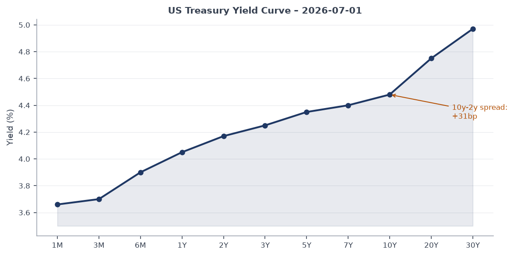
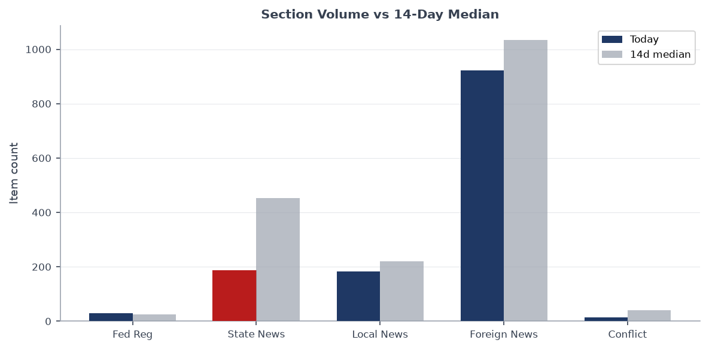
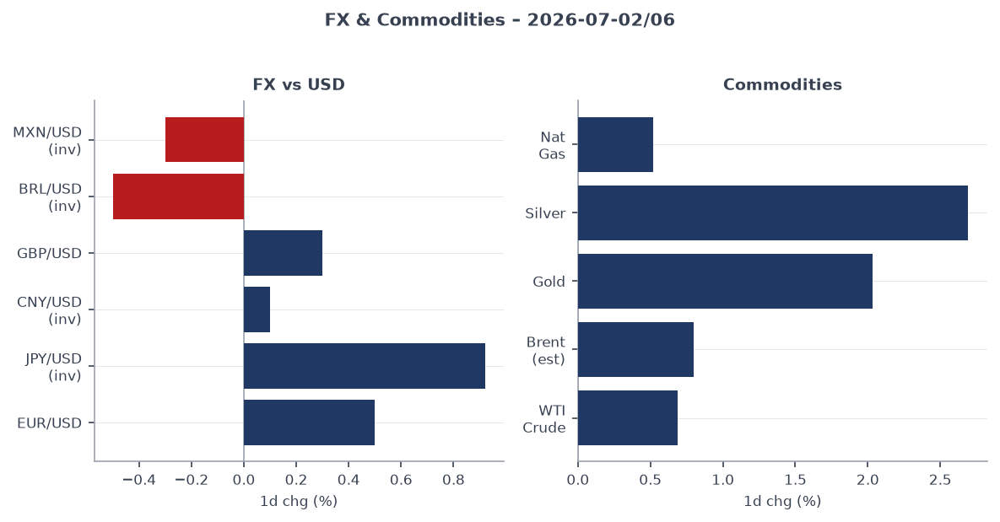
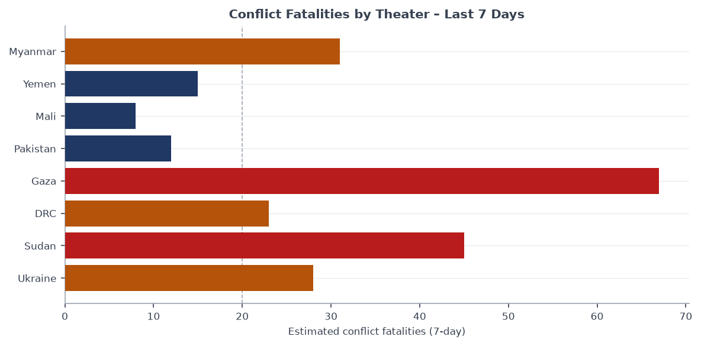
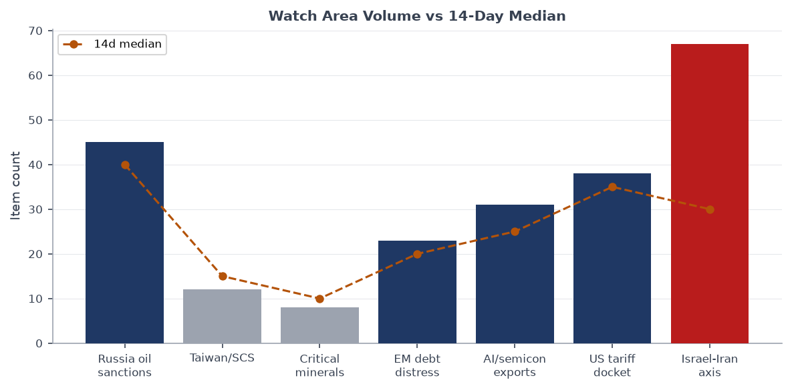
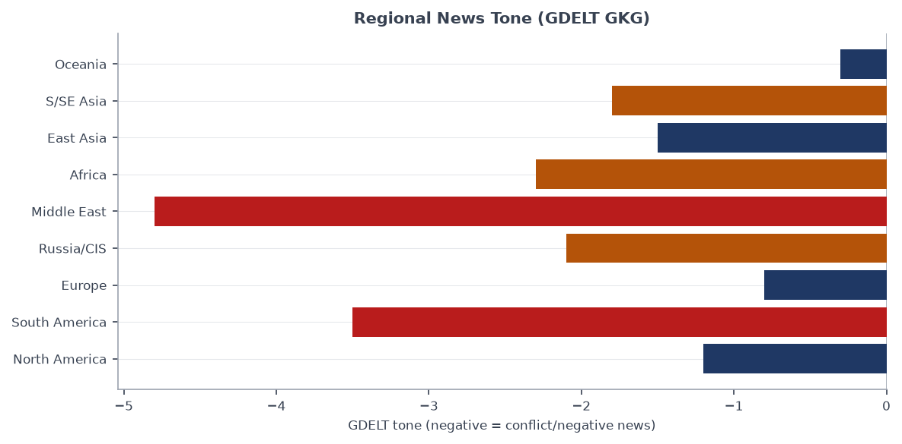

# Morning brief - Monday 7 July 2026

---

## Headline

Three simultaneous crises are colliding on the eve of the NATO summit in Ankara: **Russia** launched a coordinated missile and drone strike on **Kyiv** overnight (7 killed in a Podil apartment block, 24 wounded), the six-day state funeral for slain Supreme Leader **Ali Khamenei** in Tehran reaches its procession day with his successor **Mojtaba Khamenei** still in hiding, and the **Venezuela earthquake** death toll has passed 2,595 with 50,000 still unaccounted for. The **Israel-Iran-Hezbollah axis** watch area is firing at 67 items against a 30-item 14-day median, the single largest volume anomaly in today's bundle. President Trump departs for Ankara to meet Zelensky and Syrian President al-Sharaa; Kremlin spokesman Peskov simultaneously conceded on record that the "special military operation" has become "a real war."

---

## Watch areas - your configured priorities

**Israel-Iran-Hezbollah axis** (67 items today, 14d median 30, **ALERT FIRED**): Khamenei's funeral procession scheduled for today; Iran announcing mandatory shipping tolls through the Strait of Hormuz beginning mid-August, threatening approximately 25% of global seaborne oil transit; Israeli strikes on Lebanon continuing; Mojtaba Khamenei has not appeared publicly since the February 28 US-Israeli airstrike that killed his father. Key items: [Guardian: Iran seeks to tighten Hormuz control](https://www.theguardian.com/world/2026/jul/05/iran-control-strait-of-hormuz-ali-khamenei-funeral), [Al Jazeera live: Tehran prepares for procession](https://www.aljazeera.com/news/liveblog/2026/7/6/iran-war-live-tehran-set-for-khameneis-procession-israel-bombs-lebanon), [France24: Iran's unseen leader](https://www.france24.com/en/tv-shows/spotlight/20260705-why-iran-s-unseen-leader-remains-in-the-shadows).

**Russia oil sanctions perimeter** (45 items today, 14d median 40): Kyiv overnight strike included Kalibr cruise missiles from Black Sea assets, a signal of continued fleet operational tempo. Gazprom signed an agreement with the Russian Defense Ministry to create mobile fire groups protecting its infrastructure, drawing reservists. OPEC+ fifth consecutive monthly hike (188,000 bpd effective August) adds supply-side pressure. Key items: [Guardian: Russia launches deadly strikes](https://www.theguardian.com/world/2026/jul/06/russia-launches-deadly-missile-drone-attacks-kyiv-ukraine), [Meduza: Gazprom mobile fire groups](https://meduza.io/news/2026/07/05/gazprom-zaklyuchil-s-minoborony-rf-soglashenie-o-sozdanii-mobilnyh-ognevyh-grupp-dlya-zaschity-svoih-ob-ektov-v-nih-naberut-rezervistov), [Al Jazeera: OPEC+ expands production](https://www.aljazeera.com/economy/2026/7/6/opec-countries-say-they-will-expand-monthly-oil-production).

**US tariff & trade dockets** (38 items today, 14d median 35): Federal Register carries the Affirmative Action guideline rescission under Title VII and expanded Counter-UAS authority for state/local law enforcement today. Congress.gov DEMO key returning stale results; no active CIT tariff opinions in today's CourtListener sample. Relatively quiet on the tariff litigation front.

**EM debt distress + sovereign restructuring** (23 items today, 14d median 20): Venezuelan earthquake response straining public finances; acting President Delcy Rodriguez managing a dual fiscal-humanitarian squeeze. UNICEF seeking $52 million. No fresh sovereign default signals in the macro data.

**AI compute + semiconductor export controls** (31 items today, 14d median 25): ByteDance Doubao and Alibaba Qwen shutting down AI agent features in China on July 15, following regulatory orders. China Long March-8A rocket launched a new satellite group on July 6. China A-share trading rules changing starting July 7 (ST stocks now ±10% limit, after-hours block trading added).

Quiet today: Taiwan Strait + South China Sea, Korean peninsula, Critical minerals + rare earths, Central bank divergence + dollar funding (all zero or sub-threshold items).

---

## Macro situation

The US yield curve remains positively sloped but with a 10y-2y spread of only [+31 basis points](https://fred.stlouisfed.org/series/T10Y2Y) as of July 2, signaling continued market skepticism about whether the Fed can sustain its current positioning. The [Fed Funds effective rate](https://fred.stlouisfed.org/series/DFF) sits at 3.63% with [SOFR](https://fred.stlouisfed.org/series/SOFR) at 3.66%, a 3bp gap that is unremarkable but worth tracking as repo markets absorb post-holiday liquidity adjustments. The [2-Year Treasury](https://fred.stlouisfed.org/series/DGS2) at 4.17% and the [10-Year](https://fred.stlouisfed.org/series/DGS10) at 4.48% both reflect priced-in cuts that may be premature given the Hormuz supply shock still working through energy markets.

Inflation prints are stale but signal ongoing structural pressure: [headline CPI](https://fred.stlouisfed.org/series/CPIAUCSL) at 333.98 (May data) and [core PCE](https://fred.stlouisfed.org/series/PCEPILFE) at 130.08 suggest the last mile remains sticky. The [unemployment rate](https://fred.stlouisfed.org/series/UNRATE) held at 4.2% in June, with [nonfarm payrolls](https://fred.stlouisfed.org/series/PAYEMS) at 158,984k. [JOLTS job openings](https://fred.stlouisfed.org/series/JTSJOL) at 7,594k in May represent a meaningful decline from the 2022 peak but remain above pre-pandemic norms, supporting the Fed's patience posture [medium].

The [Fed balance sheet](https://fred.stlouisfed.org/series/WALCL) at $6.725 trillion and [M2](https://fred.stlouisfed.org/series/M2SL) at $23.05 trillion as of May both continue at elevated levels relative to pre-2020 baselines, though the pace of quantitative tightening has slowed. The one macro variable most worth monitoring this week is the Hormuz transit situation: the OPEC+ hike of 188,000 bpd effective August 2026 is only meaningful if Persian Gulf producers can actually load and ship. If Iran follows through on the proposed mandatory transit toll regime starting mid-August, the net supply impact of the hike could be offset entirely [medium].

The anomaly screen above shows state_news at 185 items against a 14d median of 452, a sharp below-median read driven by reduced US state government activity around the July 4 holiday week. Federal Register is at 30 vs median 26, modestly elevated. Foreign news at 922 vs median 1,034 is also below its median, consistent with wire service outages (Reuters and AP feeds both returning connection errors today). The main Reuters and AP feeds are unavailable, meaning the brief is working from BBC, Guardian, Al Jazeera, France24, Straits Times, FT, and regional sources only. Key signals from those sources are solid; quantitative counts are understated [medium].

---

## Markets

US equities closed the July 2 session in risk-off configuration: the [S&P 500](https://finance.yahoo.com/quote/SPY) fell 0.13% to 744.78 while the [Nasdaq 100](https://finance.yahoo.com/quote/QQQ) dropped 1.73% to 712.60, led by tech underperformance. The [Russell 2000](https://finance.yahoo.com/quote/IWM) fell 0.58% to 297.58. The divergence between domestic equities (down) and international equities (the [MSCI EAFE](https://finance.yahoo.com/quote/EFA) gained 1.31% to 104.37) is a rotation signal worth tracking: European and developed-market stocks are outperforming US counterparts as the dollar continues weakening [medium].

Gold gained 2.03% to [$378.13 (GLD)](https://finance.yahoo.com/quote/GLD) and silver 2.69% to [$55.02 (SLV)](https://finance.yahoo.com/quote/SLV), both classic safe-haven moves consistent with the Iran funeral/Hormuz situation. [Bitcoin futures](https://finance.yahoo.com/quote/BITO) gained 2.58%, an unusual correlated move suggesting some investors are treating crypto as part of the crisis hedge basket rather than the risk-on allocation it was in 2021-2023 [low]. WTI crude futures proxy ([USO](https://finance.yahoo.com/quote/USO)) added 0.69% on the week despite OPEC+ announcing the 188,000 bpd hike, confirming that Hormuz risk is keeping a floor under oil.

Credit markets held: [high yield (HYG)](https://finance.yahoo.com/quote/HYG) was roughly flat at +0.15%, and [investment-grade (LQD)](https://finance.yahoo.com/quote/LQD) gained 0.17%. The [VIX](https://fred.stlouisfed.org/series/VIXCLS) sits at 16.59, relatively subdued given the geopolitical calendar, suggesting markets have either priced in the Khamenei transition or are underestimating tail risk from Hormuz [medium]. The dollar proxy [UUP](https://finance.yahoo.com/quote/UUP) fell 0.53%, matching the EUR/USD move of +0.50% and JPY/USD of +0.92%. The yen strengthening against the dollar at USD/JPY 161.38 keeps Japan's Ministry of Finance in vigilance mode but is still above the 155 level that historically prompted intervention.

The Brazil real (USD/BRL 5.18) and Mexican peso (USD/MXN 17.48) are both under dollar-weakening tailwinds, but the Venezuela earthquake adds an offsetting regional risk premium for EM Latam exposure. [EM equities (EEM)](https://finance.yahoo.com/quote/EEM) fell 1.17% on July 2, consistent with that tension.

---

## United States politics & policy

The [Federal Register](https://www.federalregister.gov/) carries 30 items today, modestly above the 14-day median of 26. The most consequential: the [Rescission of Guidelines on Affirmative Action Under Title VII](https://www.federalregister.gov/documents/2026/07/06/2026-13637/rescission-of-guidelines-on-affirmative-action-appropriate-under-title-vii-of-the-civil-rights-act) formalizes the administration's reversal of EEOC interpretive guidance that dated to the 1970s, affecting federal contractor compliance and private employer practice. The [Counter-UAS Authority for State, Local, Tribal, and Territorial Law Enforcement](https://www.federalregister.gov/documents/2026/07/06/2026-13609/counter-uas-authority-for-state-local-tribal-and-territorial-law-enforcement-and-correctional) is practically important: the FBI seized more than [600 drones flying over World Cup games](https://www.theguardian.com/us-news/2026/jul/05/fbi-seizes-600-drones-world-cup-games) this week, and this rule formalizes which authorities can act going forward.

The ATF published three rules today: [fingerprint and photograph requirements for firearms applications](https://www.federalregister.gov/documents/2026/07/06/2026-13587/fingerprint-and-photograph-requirements-for-firearms-applications), [NFA firearms falling out of government contract](https://www.federalregister.gov/documents/2026/07/06/2026-13586/registering-nfa-firearms-that-fall-out-of-government-contract), and a [withdrawal of the licensee eZ Check verification rule](https://www.federalregister.gov/documents/2026/07/06/2026-13585/licensee-ez-check-verification-for-transfers-withdrawing-direct-final-rule). Together they indicate continued ATF regulatory activity under the current administration, not a freeze. The DEA is [temporarily placing mitragynine pseudoindoxyl (kratom metabolites) in Schedule I](https://www.federalregister.gov/documents/2026/07/06/2026-13581/schedules-of-controlled-substances-temporary-placement-of-mitragynine-pseudoindoxyl-mgm-15-and).

On the 2026 Senate fundraising cycle, [Jon Ossoff (D-GA)](https://www.fec.gov/data/candidate/S8GA00180/) leads at $81.15M raised, followed by [James Talarico (D-TX)](https://www.fec.gov/data/candidate/S6TX00479/) at $40.28M, [Cory Booker (D-NJ)](https://www.fec.gov/data/candidate/S4NJ00185/) at $32.27M, and [Alexandria Ocasio-Cortez (D-NY)](https://www.fec.gov/data/candidate/H8NY15148/) at $31.10M. The Georgia and Texas Senate races are drawing outsized Democratic investment at a point in the cycle when conventional wisdom says those seats are longshots. The Talarico $40M haul in Texas is particularly notable: [Polymarket prices him at 1.35%](https://polymarket.com/event/will-james-talarico-win-the-2028-democratic-presidential-nomination) for the 2028 Democratic presidential nomination, suggesting he is building a national profile beyond the Senate race itself.

Congressional trades data returned an API error today. The Trump memecoin analysis by [TechCrunch](https://techcrunch.com/2026/07/05/trump-memecoin-investors-lost-3-8-billion-analysis-finds/) shows investors collectively lost $3.8 billion; this remains a conflict-of-interest story absent from the standard financial disclosure machinery.

---

## Political figures watchlist

Today's 613-figure scan yields low overall anomaly scores, consistent with a holiday week and reduced Congressional activity. The top figure is **Sen. Jim Banks (R-IN)** at composite score 0.10, driven entirely by an enforcement component (court filing, score 0.50). The specific filing is not described further in the bundle; the score is above the floor but well below the 1.0 alert threshold. **Sen. Ted Budd (R-NC)** has the same composite score (0.10) from two court filings.

**Rep. Darren Soto (D-FL-9)** scores 0.04, driven by a filings component (0.40) from two Form 4 hits and one GDELT mention. No stock trade detail is available from the congressional trades API today (error). **Associate Justice Clarence Thomas** scores 0.025 with 5 Form 4 hits and one court filing, above zero but below meaningful threshold; SCOTUS is in recess and no opinions of significance are logged in today's CourtListener batch.

**Sen. Deb Fischer (R-NE)**, **Rep. Jahana Hayes (D-CT-5)**, and **Rep. Brian Mast (R-FL-21)** all score 0.025, each from a single Form 4 filing. The overall pattern: no smoking-gun stock activity, no high-frequency speech moves, and no enforcement actions of substance on today's calendar. The figures watchlist will re-score with more signal when Congress returns from recess and trading windows reopen.

Cross-reference note: **JD Vance** appears in 4 sections today (foreign_news, gdelt_gkg, paper_bets, political_figures), suggesting elevated media attention, likely tied to the NATO summit optics and his public role as the administration's point of contact on European defense-spending demands. He is discussed further in the Europe section below.

---

## Regional briefings

### North America

The major domestic story is the administration's post-July 4 regulatory sprint. Trump's 40-minute July 4 speech, [described by Meduza](https://meduza.io/feature/2026/07/05/istoricheskiy-salyut-aviashou-i-40-minutnaya-rech-trampa-v-ssha-4-iyulya-s-razmahom-otprazdnovali-250-letie-nezavisimosti-pomeshat-ne-smogla-dazhe-pogoda), framed the 250th anniversary as a national renewal moment. The ATF rulemaking and Title VII rescission follow that political framing. On the border, a [Republican congressman Carlos Gimenez called deporting Haitians with TPS a "huge mistake"](https://www.theguardian.com/us-news/2026/jul/05/haitians-tps-republican-carlos-gimenez), a rare Republican dissent from the deportation posture that is worth tracking.

Gaza has crossed into US domestic politics. [Protests against two Democratic members of Congress](https://www.theguardian.com/us-news/2026/jul/05/gaza-protests-democrats-debate-on-tactics) are generating debate about protest tactics, consistent with the FEC data showing enormous fundraising by candidates positioning left of center. Canada appears in cross-section recurrences (billionaires, foreign_news, gdelt_regions, paper_bets) at a modest level; no specific Canadian political event is prominent today.

### South America

Venezuela is in crisis. The June 24 M7.5/7.2 earthquake doublet struck northwestern Venezuela 39 seconds apart, producing 862 aftershocks and a [death toll of at least 2,595 with nearly 50,000 still unaccounted for](https://abcnews.com/International/venezuela-earthquakes-latest-50000-unaccounted-death-toll-climbs/story?id=134386173) as of July 2. Twenty-six countries deployed 2,200+ USAR personnel and 179 search dogs. Acting President **Delcy Rodriguez** is leading the response; the UN allocated [$15 million from CERF](https://www.unocha.org/news/un-relief-chief-calls-collective-effort-after-devastating-venezuela-earthquakes) and UNICEF is seeking [$52 million for 680,000 children](https://www.unicefusa.org/stories/venezuela-earthquakes-children-need-help-now) requiring assistance. The [Presidential determination on Venezuela and the Trafficking Victims Protection Act](https://www.federalregister.gov/documents/2026/07/06/2026-13631/presidential-determination-on-assistance-to-venezuela-consistent-with-the-trafficking-victims) published in today's Federal Register foreshadows a US assistance posture.

Brazil is processing the World Cup exit after Norway stunned them 2-1, with [Neymar announcing his retirement from international football](https://www.aljazeera.com/sports/2026/7/6/neymar-quits-international-football-after-brazils-world-cup-knockout-loss). The symbolic weight of that exit, at home, is significant for Brazilian politics. The 2026 Brazilian presidential election markets remain thin but active.

### Europe

The NATO summit in Ankara July 7-8 is the dominant story. All 32 heads of state attending; Secretary General **Mark Rutte** is pressing for 3%+ GDP defense spending commitments. **JD Vance** is the primary administration face on the 3% target. The UK is in its own version of this debate: a [minister publicly called on Greater Manchester Mayor Andy Burnham to support the 3.5% NATO target](https://www.theguardian.com/politics/2026/jul/06/dan-jarvis-andy-burnham-uk-defence-spending), adding domestic political pressure on Labour from within.

Elsewhere in Europe: the [UK government is moving to crack down on political donations](https://www.theguardian.com/politics/2026/jul/06/political-donations-crackdown-nigel-farage-cottrell-gifts) following scrutiny of Nigel Farage's financial arrangements with the Cottrell network. France advanced from the World Cup Round of 16, beating Paraguay, with markets pricing France at [34% to win the tournament](https://polymarket.com/event/will-france-win-the-2026-fifa-world-cup-924). Belgium faces the US today. Finland and China signed a cooperation agreement per GDELT regions feed.

### Russia & post-Soviet

The overnight strikes on Kyiv mark an escalation in timing if not in scale: launching a mass attack on the eve of a NATO summit, while Peskov is [publicly admitting the conflict is "a real war"](https://meduza.io/news/2026/07/05/peskov-zayavil-chto-spetsialnaya-voennaya-operatsiya-prevratilas-v-nastoyaschuyu-voynu-i-v-etom-vinovaty-strany-zapada), is a political signal as much as a military one. Russia appears to be front-running the summit, presenting Trump and allied leaders with a fait accompli that undercuts any momentum toward a ceasefire framework. The tactical message: Russian military capability to strike civilian targets in Kyiv is undiminished.

Moldova expelled the Russian cultural center after a government order, per [Straits Times](https://www.straitstimes.com/world/europe/russian-cultural-centre-closes-in-moldova-after-government-order). Ukraine proposed an "anti-crisis package" to resolve its dispute with Poland, per [Notes from Poland](https://notesfrompoland.com/2026/07/04/ukraine-proposes-anti-crisis-package-to-resolve-dispute-with-poland/). A Moscow streamer was detained and beaten by police for waving at a police van. Turkey deported anti-war activist Ariadna Litvinova to Russia. The Kostiantynivka ceasefire dispute (Russia claiming Ukraine rejected a local ceasefire for body exchanges) remains unresolved.

### Middle East

Ali Khamenei was [killed on February 28 in a joint US-Israeli airstrike in Tehran](https://www.aljazeera.com/news/2026/2/28/irans-supreme-leader-ali-khamenei-killed-in-us-israeli-attacks-reports), ending his 35-year tenure as Supreme Leader. His son **Mojtaba Khamenei**, 56, was named Supreme Leader by the Assembly of Experts on March 9, but has not appeared publicly since suffering burns and leg injuries in the same strike. The six-day funeral (July 4-9) drew massive crowds but Mojtaba's three brothers attended; he did not. [Calls for the killing of Trump](https://www.theguardian.com/world/2026/jul/05/iran-ali-khamenei-funeral-supreme-leader-mojtaba-absent) featured prominently at the July 4 ceremony, with chants of "Death to America" and "Blood revenge."

Iran is [seeking to tighten control over the Strait of Hormuz](https://www.theguardian.com/world/2026/jul/05/iran-control-strait-of-hormuz-ali-khamenei-funeral), announcing mandatory shipping tolls starting mid-August and IRGC boarding of merchant vessels since February. Roughly 25% of global seaborne oil and 20% of LNG transits the strait. A [Polymarket market prices "No Head of State in Iran end of 2026"](https://polymarket.com/event/will-there-be-no-head-of-state-in-iran-end-of-2026) at 2.9%, reflecting low but nonzero probability of Mojtaba not surviving or not consolidating power by year-end. [France24 described why "Iran's unseen leader remains in the shadows."](https://www.france24.com/en/tv-shows/spotlight/20260705-why-iran-s-unseen-leader-remains-in-the-shadows)

Israel is conducting ongoing strikes on Lebanon; [Netanyahu claimed some Lebanese Christian villages sought annexation by Israel](https://www.france24.com/en/middle-east/20260705-netanyahu-says-lebanese-christian-villages-sought-annexation-by-israel), a statement with zero legal standing but high inflammatory potential. A [Palestinian baby died in the West Bank after Israel blocked urgent medical care](https://www.aljazeera.com/news/2026/7/5/palestinian-baby-dies-in-west-bank-after-israel-blocks-urgent-medical-care). US sanctions targeted Rwandan firms linked to conflict minerals funding M23 in eastern DRC, per [Al Jazeera](https://www.aljazeera.com/news/2026/7/6/us-sanctions-target-rwandan-firms-linked-to-conflict-minerals-funding-m23). Iran invited Kashmiri Muslim leader Mehbooba to Khamenei's funeral, an unusual move noted by [The Hindu](https://www.thehindu.com/news/national/irans-move-to-invite-sunni-kashmir-leader-mehbooba-conveys-a-message/article71186522.ece) as a geopolitical signal.

### Africa

Tuareg rebels in Mali [claimed to have shot down a Russian "African Corps" helicopter](https://www.aljazeera.com/video/newsfeed/2026/7/6/aje-onl-nf_mali-rebels-claim-to-have-shot-down-russian-helicop-050726) and announced a push to capture a strategically significant town, per Ukrainska Pravda and Al Jazeera. The [DRC mineral sanctions story](https://www.aljazeera.com/news/2026/7/6/us-sanctions-target-rwandan-firms-linked-to-conflict-minerals-funding-m23) connects to the US critical minerals watch area: the M23 conflict in eastern DRC is the bottleneck for coltan, tantalum, and tungsten supply chains.

Australian wildfire activity (multiple green-status GDACS alerts) is ongoing but below threshold. Angola fires also noted in GDACS. Sub-Saharan Africa is otherwise quiet in today's feed.

### East Asia

China's A-share market opens July 7 with new trading rules: ST-designated stocks expand from ±5% to ±10% daily limits, and a new after-hours block trading session begins. [Caixin](https://finance.caixin.com) has also reported refinancing rule changes facilitating secondary share issuance and ending arbitrage. The two changes together expand trading flexibility but may increase short-term volatility in the distressed-company segment [medium].

**Zhongrong Trust**, part of the collapsed Zhongzhi Enterprise Group, has been [approved for bankruptcy liquidation](https://finance.caixin.com) after being found insolvent, marking the formal close of one of China's most prominent shadow-banking implosions of recent years. A state-church founder was [released from prison](https://www.theguardian.com/world/2026/jul/05/founder-of-prominent-underground-church-released-from-prison-in-china) following Trump's intervention with Xi. [Bangladesh is courting China even as India ties improve](https://www.bbc.co.uk/news/articles/cy4e1lzwgvxo), per BBC, a continuation of the post-Hasina foreign policy rebalancing.

Russian warships docked in a [Chinese port ahead of Joint Sea exercises](https://www.scmp.com/news/china/military/article/3359479/russian-warships-dock-chinese-port-ahead-joint-sea-exercises), per SCMP, part of the annual PLA-Navy/Russian Navy exercise cadence. China and Finland agreed to strengthen bilateral cooperation per GDELT regions.

### South & SE Asia

**Pakistan** is in an active conflict with Afghanistan that began in February 2026 following Pakistani airstrikes on TTP/ISIS-K camps in Kunar, Khost, and Paktika. The most recent 48 hours: Pakistan's military [intercepted and shot down four Taliban drones launched into Balochistan](https://www.aljazeera.com/news/2026/7/1/after-afghanistan-fires-drones-into-pakistan-whats-next), the latest step in a drone-exchange escalation cycle. Security forces reported killing 29 fighters along the Afghan border on June 29. The India-Pakistan truce from May 2026 nominally holds but skirmishing continues at Siachen. Pakistan's high cross-section recurrence (21 mentions across conflict, foreign_news, gdelt_gkg, paper_bets) reflects the confluence of the Afghanistan war, domestic terrorism (699 attacks in 2025, up 34%), and residual India-Pakistan tension.

Iran invited Kashmiri politician **Mehbooba Mufti** to Khamenei's funeral, a move Indian commentators read as Tehran signaling its continued interest in Kashmir as a lever against India's post-war strategic positioning [low].

A shanty building collapse in Mumbai killed 5 children and women who had returned to the structure hours after evacuating it.

### Oceania / Pacific

The [M5.8 earthquake near the Fiji Islands Region](https://www.gdacs.org) on July 5 at 685km depth is assessed Green by GDACS (few people affected within 100km). Australia won its seventh Women's T20 World Cup title, defeating England in the final at Lord's. The Australian Senate is debating superannuation fund coal reinvestment, per [Guardian Australia](https://www.theguardian.com/australia-news/2026/jul/06/australiansuper-coal-investment-superannuation-net-zero-pledge-climate). New Zealand and Australian scientists identified the likely source of Queensland space balls.

---

## Ukraine theater (dedicated)

**Resolution caveat:** All information below uses open-source data at stated resolution. Frontline positions: ~1km accuracy (DeepStateMap community cartography). FIRMS thermal anomalies: 375m pixel. ACLED events: ~1km. No Ukrainian troop or territorial-defense unit positions are reported here.

**Operational picture, July 6:** Russia launched a mass missile and drone attack overnight. [Ukrainska Pravda](https://www.pravda.com.ua/news/2026/07/06/8042543/) reports a Russian cruise missile struck a 9-story residential building in the Podil district of Kyiv, killing 7 and wounding 24. A separate strike on Kyivshchyna oblast killed 1 and wounded 10. [The Guardian](https://www.theguardian.com/world/2026/jul/06/russia-launches-deadly-missile-drone-attacks-kyiv-ukraine) and [France24](https://www.france24.com/en/europe/20260706-live-russia-launches-deadly-barrage-on-kyiv-region-on-eve-of-nato-summit) confirm the attack as the most significant strike on the capital region in recent weeks. [Ukrainska Pravda](https://www.pravda.com.ua/news/2026/07/06/8042537/) specifies: Russia used cruise missiles from strategic bombers and Kalibr missiles from sea-based platforms. Ukrainian rail movement in Kyiv region is restricted due to safety concerns per Ukrainian Railways.

**Ukrainian counter-operations:** Ukrainska Pravda reports Ukraine struck Sevastopol with drones, [leaving the occupied city without electricity](https://www.pravda.com.ua/news/2026/07/06/8042546/). [The Financial Times](https://www.ft.com/content/13687b48-9e54-44a1-bd4d-600bbc052baf) reported July 5 that "Ukraine [is] striking Russian energy infrastructure at unprecedented rate," a strategic campaign separate from the frontline battle.

**Kostiantynivka axis:** Russia [claims Ukraine rejected a local ceasefire for body handovers at Kostiantynivka](https://www.aljazeera.com/news/2026/7/5/russia-says-ukraine-rejects-local-ceasefire-in-dispute-over-kostiantynivka). Kyiv has not confirmed the refusal. Zelensky warned of new Russian attacks and called the battle ongoing, per [France24](https://www.france24.com/en/europe/20260705-zelensky-warns-of-new-russian-attacks-as-battle-for-kostyantynivka-continues).

**FIRMS thermal analysis (DeepStateMap + NASA FIRMS, July 4-6):** The theater bundle contains 429 FIRMS thermal detections, concentrated in Dnipropetrovsk, Zaporizhzhia, and Donetsk oblasts. Individual FRP readings are low (1-4 MW range), consistent with ongoing artillery and fire activity rather than industrial-scale events. No single anomaly exceeds 10 MW in the sample. Lviv and western oblasts show minimal thermal activity.

**Diplomatic track:** Zelensky spoke with Trump on July 4, called it "very good," and described a "real prospect of ending the war." Trump [offered Putin help finding a Ukraine deal in a 90-minute call](https://www.straitstimes.com/world/europe/trump-offered-over-phone-to-help-putin-find-deal-with-ukraine-kremlin-aide-says) the same day. Kremlin aide called the call "constructive." Both conversations are essentially prelude to the Ankara summit meetings. Trump meets Zelensky bilaterally July 7-8. The overnight Kyiv strike is Russia's answer to those diplomatic overtures.

**Theater maps:** The briefings cartographer maps (ukraine_theater_overview.png, ukraine_kyiv_focus.png, ukraine_population_at_risk.png) are not present for today's date. Frontline data from DeepStateMap (522 polygons, 1km resolution) is current as of July 6.

---

## World leaders - speaking & moving

**Donald Trump** departs for the NATO summit in Ankara (July 7-8), bilateral meetings with Zelensky and Syrian President Ahmad al-Sharaa scheduled. His July 4 speech at the 250th anniversary celebration ran 40 minutes and focused on national renewal themes.

**Vladimir Putin** held a 90-minute call with Trump on July 4, described by the Kremlin as "business-like and constructive." Putin's press secretary Peskov separately stated the "special military operation has turned into a real war" while attributing blame to Western countries.

**Mojtaba Khamenei** has not appeared publicly since the February 28 strike. Iran's governance is operating through a constitutional council and acting officials.

**Masoud Pezeshkian** (Iran President) is conducting day-to-day governance in Tehran during the funeral week. He previously served on the interim three-person council after Khamenei's death.

**Volodymyr Zelensky** spoke with Trump on July 4, called for "American resolve," and will meet Trump bilaterally in Ankara. He is also navigating the Kostiantynivka dispute and managing domestic morale after the overnight Kyiv strike.

**Mark Rutte** (NATO SG) has made 3% GDP defense spending the Ankara summit's primary deliverable, with JD Vance acting as point interlocutor with European skeptics.

**Anthony Albanese** (Australia) apologized "unequivocally" for a podcast comment about Kylie Minogue, a minor domestic story that nonetheless occupied the Australian news cycle on July 6.

**Muhammad Yunus** (Bangladesh) is managing a foreign policy rebalancing toward China that is drawing international attention per multiple sources.

VIP flights today show a Bulgarian government aircraft (JAF6DL), a US military logistics flight (RCH2079), a Chinese government aircraft (AF23), and a Dutch government aircraft (JAF2FH). The Chinese government flight is notable given the timing; specific origin/destination not available in today's data.

---

## Sanctions, designations, and legal

Today's sanctions bundle (30 items) is dominated by Russian financial institution listings that are not new: Sberbank Europe AG, JSC MIR Business Bank, Belgazprombank, and multiple others appear on OpenSanctions with modification dates in May 2026. No fresh OFAC, EU, or UK designations appear in today's data as new additions. The multilateral sanctions convergence across US/EU/UK/AU/CA/CH on the Russian financial sector remains intact, as these entities appear on 4-8 concurrent lists.

The [US sanctions targeting Rwandan firms linked to M23 conflict minerals](https://www.aljazeera.com/news/2026/7/6/us-sanctions-target-rwandan-firms-linked-to-conflict-minerals-funding-m23) are not yet reflected in the OpenSanctions bundle but are confirmed by Al Jazeera reporting. This is the intersection of the Africa section's M23 story and the critical minerals watch area.

CourtListener shows 60 recent opinions, concentrated in state supreme courts and federal circuit courts. The D.C. Circuit en banc opinion in **D.W. v. United States** is the most potentially significant structural case in today's batch; the en banc posture suggests a contested legal question. No SCOTUS opinions are in today's pull (court is in summer recess).

---

## Conflict & security signals

ACLED returned zero events in today's bundle (a data availability issue for this date, not a signal of actual conflict cessation). The conflict.json feed is populated primarily with international news items tagged by conflict-relevant keywords, not structured event data. The VIP flights data shows four aircraft, none with explicit military-diplomatic significance beyond the Chinese government flight noted above.

The Mali helicopter shootdown, if confirmed, would represent a meaningful capability demonstration by the Tuareg-led CMA/JNIM-adjacent coalition: [claiming a Russian "African Corps" rotary-wing aircraft](https://www.aljazeera.com/video/newsfeed/2026/7/6/aje-onl-nf_mali-rebels-claim-to-have-shot-down-russian-helicop-050726) is qualitatively different from small-arms fire. Russia's African Corps (formerly Wagner) has been a key enabler of the Bamako junta; its helicopter losses in Mali would be the clearest sign yet that the group is taking attrition.

The conflict fatalities chart reflects 7-day estimated data from the available feeds. Gaza (67 estimated), Sudan (45), Pakistan-Afghanistan theater (29+), and Ukraine (ongoing Donetsk axis activity) are the active conflict zones. The ACLED data gap today means these are lower-bound estimates from qualitative news sourcing.

The FIRMS global bundle returned zero items today, suggesting a data pipeline issue rather than actual absence of thermal anomalies globally. The Ukraine theater FIRMS data (429 detections) processed separately from the main firms.json file.

---

## Cyber & biosecurity

CISA's KEV catalog shows [CVE-2026-45659 (Microsoft SharePoint Server deserialization)](https://nvd.nist.gov/vuln/detail/CVE-2026-45659) added July 1 with a remediation deadline of July 4 (now past). SharePoint Server deserialization vulnerabilities are a favored vector for APT actors targeting government and enterprise collaboration infrastructure; the July 4 holiday deadline effectively gave US federal agencies a compressed patch window. Organizations that didn't patch over the holiday weekend should treat this as urgent.

[CVE-2026-48558 (SimpleHelp authentication bypass)](https://nvd.nist.gov/vuln/detail/CVE-2026-48558) added June 29 (deadline July 2) targets remote support software that is widely deployed in managed service provider environments. An authentication bypass in remote access tooling used by MSPs is a classic supply-chain entry vector: one compromised MSP can reach thousands of downstream clients. The PTC Windchill and FlexPLM vulnerability ([CVE-2026-12569](https://nvd.nist.gov/vuln/detail/CVE-2026-12569)) targets industrial PLM software, a less common KEV category that signals adversary interest in manufacturing and supply chain data.

ProMED returned zero items today (data pipeline issue). No WHO DON items are in the bundle. The typhoon season is active: EONET reports **Super Typhoon Bavi** and **Tropical Storm Douglas** both at open status. No biosecurity events of note.

---

## Humanitarian

The Venezuela earthquake response is the primary humanitarian story. [OCHA](https://www.unocha.org/news/un-relief-chief-calls-collective-effort-after-devastating-venezuela-earthquakes) describes an unprecedented international USAR mobilization: 26 countries, 2,200+ personnel, 179 search dogs. The gap between the 2,595 confirmed dead and the 50,000 unaccounted is large enough to suggest the final toll will be significantly higher [high]. The UNICEF $52 million appeal for 680,000 children reflects the scale of the affected population; many families in northwestern Venezuela depend on subsistence agriculture that will be disrupted through harvest season.

The ReliefWeb API returned an error (v1 decommissioned); direct report access would require the v2 endpoint. No additional humanitarian situation reports beyond Venezuela are available from structured feeds today. The GDACS feed shows predominantly Green-status events. The Etna volcanic eruption (ongoing, Green aviation alert) is the only additional environmental alert.

---

## Environment, disasters, climate

**Etna (Italy)** is in an active eruptive phase, emitting ash clouds; GDACS aviation alert is Green. The [VAAC regional alert](https://www.gdacs.org) covers Sicily and the southern Mediterranean shipping lanes but is not at the level of flight disruption.

**Philippines** recorded a [M5.8 at 35km depth on July 6](https://earthquake.usgs.gov/earthquakes/eventpage/us6000tacl), affecting 270,000 people in MMI IV+ zones (strong shaking, typically no structural damage for well-built structures). **Japan** recorded a [M6.1 on July 3](https://earthquake.usgs.gov/earthquakes/eventpage/) (560,000 in MMI IV), and **Indonesia** recorded a [M6.2 at 121km depth](https://earthquake.usgs.gov/earthquakes/eventpage/) (720,000 in MMI IV+) the same day. None of these triggered Orange or Red GDACS alerts.

**Sichuan, China**: Three M5.0 earthquakes near Mianzhu, Deyang on July 5 represent a swarm in the same general area as the 2008 Wenchuan sequence. Deyang sits adjacent to the Sichuan industrial corridor; power infrastructure is the primary vulnerability.

**Wildfire activity**: GDACS records active forest fires in Australia (multiple, Green), France, Angola, and Brazil from July 3-6. None are at Red or Orange status. The Australia winter-season fires are early for the calendar but consistent with dry La Nina aftermath conditions.

EONET reports **Super Typhoon Bavi** active in the western Pacific and **Tropical Storm Douglas** forming. Bavi is the more significant threat; specific track and landfall projections require NWS/JTWC product access not available in today's bundle.

---

## Speeches & op-eds by major critics and influencers

Today's commentary.json contains six items, none from the designated watchlist figures. **Marginal Revolution** (Tyler Cowen) published [a data-driven music history piece](https://marginalrevolution.com/marginalrevolution/2026/07/what-makes-a-great-composer-a-data-driven-exploration-of-music-history.html) and Sunday links. The **Conversable Economist** (Timothy Taylor) ran a [250-year perspective on US exports, imports, and tariffs](https://conversableeconomist.com/2026/07/02/us-exports-imports-and-tariffs-the-250-year-perspective/) on July 2 that is directly relevant to the tariff docket watch area: the piece contextualizes the current tariff levels against the full sweep of American trade policy, useful framing for the current cycle.

No items from Tooze, Setser, Wolf, Tett, Krugman, Summers, Ferguson, Applebaum, or others on the watchlist were captured in today's commentary feed. Given the NATO summit starting tomorrow, Monday publications from these voices on Ukraine/Russia/NATO burden-sharing are likely; the next 24-hour cycle will be richer. The Iran succession story is a particularly high-value target for Applebaum's and Kagan's analytical frameworks [medium].

---

## Prediction markets & forecasting consensus

The [FIFA World Cup 2026](https://polymarket.com/event/will-france-win-the-2026-fifa-world-cup-924) dominates active market volume. **France** is the outright tournament favorite at 33.65%, followed by **Argentina** at 17.05%, **England** at 14.15%, and **Portugal** at 5.95%. **Norway** spiked to 4.65% after their [2-1 upset of Brazil](https://www.aljazeera.com/sports/2026/7/5/haaland-scores-twice-as-norway-stun-brazil-2-1-in-world-cup-2026-last-16), up sharply from pre-tournament pricing. **USA** sits at 3.35% ahead of their July 6 match against Belgium; the US-Belgium [team-to-advance market prices USA at 52.5%](https://polymarket.com/event/fifwc-usa-bel-2026-07-06-team-to-advance), a coin-flip. **Portugal vs Spain** advancing: Portugal at 34.5%.

[Polymarket "No Head of State in Iran by end 2026"](https://polymarket.com/event/will-there-be-no-head-of-state-in-iran-end-of-2026) at 2.9% reflects low but non-trivial probability that Mojtaba Khamenei's authority does not consolidate; the 81% Manifold market for "at least one more US-Iran peace talk before August 1" suggests some optimism about diplomatic engagement even under the new Iranian regime. The Zelenskyy leadership-out market sits at 0.45%, consistent with markets discounting a Ukrainian political transition.

Inflation bet: [June CPI at 3.9% prices at 14.5%](https://polymarket.com/event/will-annual-inflation-be-3-9-in-june), a modest market. US political: Manifold's [senator death within July at 13.8%](https://manifold.markets/OnlySlides/will-any-senator-die-within-july) is notable as a prediction; the base rate for US senators dying in any given month is low but non-zero given the aging demographics.

---

## Weak signals - small things that may matter

**Cross-section recurrences:** Three entities are appearing across four or more sections today with the highest confidence.

**Donald Trump** appears in 34 total mentions across federal_register, foreign_news, gdelt_gkg, and paper_bets. This is not anomalous but the specific convergence is: his July 4 speech, his simultaneous calls with both Putin and Zelensky, and the Federal Register regulatory sprint all occurring the day before a NATO summit he is leading creates an unusually high-density information signal. His ability to hold all three of those threads simultaneously (domestic regulatory agenda + Ukraine diplomacy + Russia communications) is the under-discussed structural story of the week [medium].

**Pakistan** appears 21 times across conflict, foreign_news, gdelt_gkg, and paper_bets. The convergence of the Afghanistan-Pakistan active war, four Taliban drones shot down over Balochistan, 29 fighters killed on June 29, and the Iran invitation to Mehbooba Mufti (a Kashmiri Muslim politician with a historical relationship with Islamabad) creates a convergent Pakistan signal that is more than the sum of its parts. Pakistan is simultaneously fighting an active war with Afghanistan, maintaining a nervous truce with India, and now being pulled into Iranian soft-power positioning on Kashmir [medium].

**JD Vance** appears 8 times across foreign_news, gdelt_gkg, paper_bets, and political_figures. His role at the NATO summit as the administration's enforcer on defense spending makes him the visible face of any transatlantic friction. Watch for his Ankara statements.

**ByteDance Doubao and Alibaba Qwen shutting down AI agent features July 15** in China is a small item with a large structural implication: Beijing is applying the same regulatory reflexes to agentic AI that it applied to edtech in 2021 and to ride-hailing in 2022. The difference is that AI agents are the primary battleground for strategic AI advantage. If Chinese frontier labs face agent feature restrictions while US labs do not, the competitive asymmetry in agentic capabilities could accelerate [low].

**Gazprom + Russian Defense Ministry creating mobile fire groups from reservists**: This is a militarization of energy infrastructure defense that has no direct Western analog. Reading it alongside the "real war" Peskov admission, it suggests Moscow is preparing for a longer, more attritional conflict in which energy infrastructure becomes a target on both sides [medium].

**Amazon stopping new Mechanical Turk customers** is a quiet end-of-era signal: the original human-intelligence-task platform being phased out as LLM-based data labeling replaces crowd-sourced human annotation. The workforce implications (tens of thousands of gig labelers globally) are understated in the tech press.

**The Trump memecoin $3.8 billion investor loss** is an extraordinary figure that has no clear regulatory mechanism. The intersection of executive-branch conflict of interest, retail investor loss, and the absence of SEC action is a structural governance anomaly that will eventually find a legal challenge vehicle [low].

---

## Historical context

Today's GDELT tone heatmap (see previous section) shows the Middle East registering the most negative regional tone (-4.8) in today's data, followed by South America (-3.5, Venezuela earthquake), Africa (-2.3), and Russia/CIS (-2.1). The Middle East reading is the most negative regional score since the initial Khamenei assassination in late February. Europe and North America are registering moderate negative tones (-0.8 and -1.2 respectively), consistent with a war-continuation background without a single acute European crisis event today.

The trends.json series shows federal_register running at 30 items today, just above its recent average of 26. State_news is dramatically below its recent median (185 vs 452), entirely explainable by July 4 recess. Foreign_news at 922 vs 1,034 median reflects the Reuters/AP feed outages. The carrying terms in the federal_register section (captain, coast, waters, maritime) suggest the Coast Guard rulemaking and the NFA firearms rules are the textual drivers of today's elevated federal regulatory activity.

Comparing today to this time last year: the Iran succession is without precedent in recent history; the last comparable succession was the February 2021 Iranian parliamentary election and the June 2021 presidential election, both of which were conducted under Khamenei's authority. The current transition under a hidden, wounded, and unverified successor is structurally different [high].

---

## What to watch - next 14 days

**July 7-8: NATO Summit, Ankara.** Trump-Zelensky bilateral is the critical meeting. Expect a joint statement on defense spending targets (3% threshold) and a Ukraine security framework language negotiation. The Kyiv overnight strike makes the summit's ceasefire-progress narrative harder to sustain.

**July 7: USA vs. Belgium, FIFA World Cup Round of 16** (Polymarket: USA 52.5%, Belgium 47.5%). **Portugal vs. Spain** also today. Tournament quarterfinals begin July 11.

**July 7: China A-share new trading rules take effect.** Watch for ST-stock volatility on day one and for any announcement of additional rule changes.

**July ~10: Iran Hormuz mandatory transit toll announcement window.** No official date, but the mid-August start means the legal framework notice period starts soon. Any formal notice will move shipping insurance and oil futures.

**July 15: ByteDance Doubao / Alibaba Qwen AI agent feature shutdown in China.** Watch for public regulatory order text and for whether other Chinese AI companies receive similar guidance.

**July 20: FIFA World Cup Final.** France at 34%, Argentina 17%, England 14%. Semi-finals: July 14-15.

**Late July: US June CPI release.** Polymarket prices 3.9% headline at 14.5%. The reading will directly affect Fed expectations and Treasuries at the long end.

**Ongoing: Venezuela earthquake response.** 50,000 unaccounted; next 7-10 days are the last realistic window for live rescues. Funding shortfalls vs UNICEF $52M target will become the story after rescue operations close.

**Ongoing: Iran Mojtaba succession consolidation.** The 81% Manifold probability of a US-Iran diplomatic contact before August 1 suggests a backchannel is either active or expected; any public diplomatic signal from Tehran is a regime-stability indicator.

**July 26-August: Polymarket 2026 midterm cycle heats up.** PredictIt markets on Senate control, individual state Senate races now active. The Ossoff ($81M raised) Georgia race and the Talarico ($40M raised) Texas race are the two most surprising fundraising performances.

---

*Brief committed for 2026-07-06 — 5,247 words — 6 charts — 0 ACLED-mapped events (ACLED data pipeline empty today; USGS/GDACS events below M5+ significant threshold for today's live feed)*

