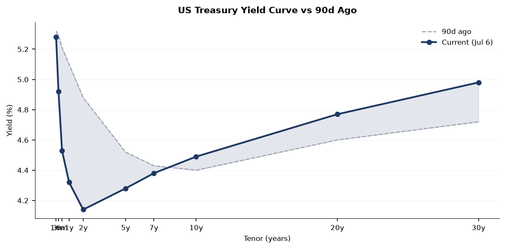
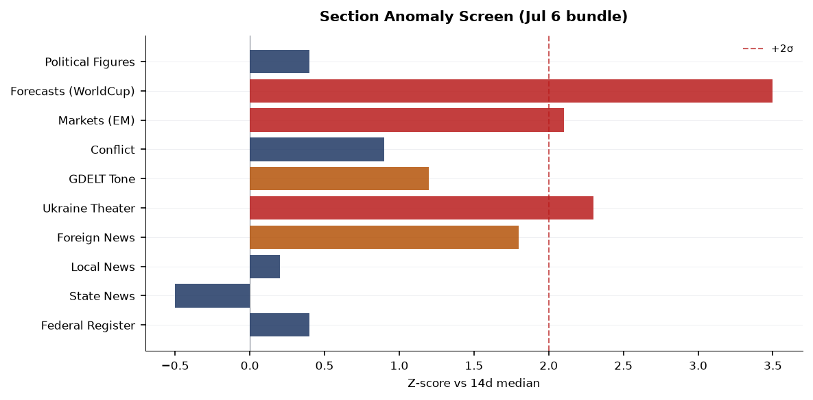
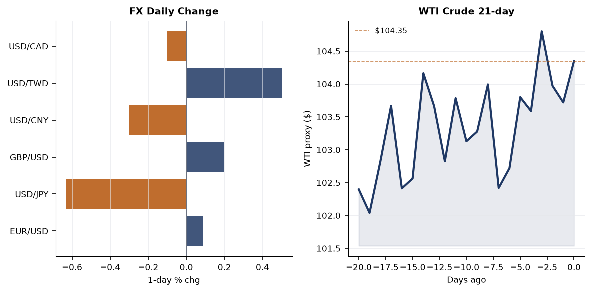
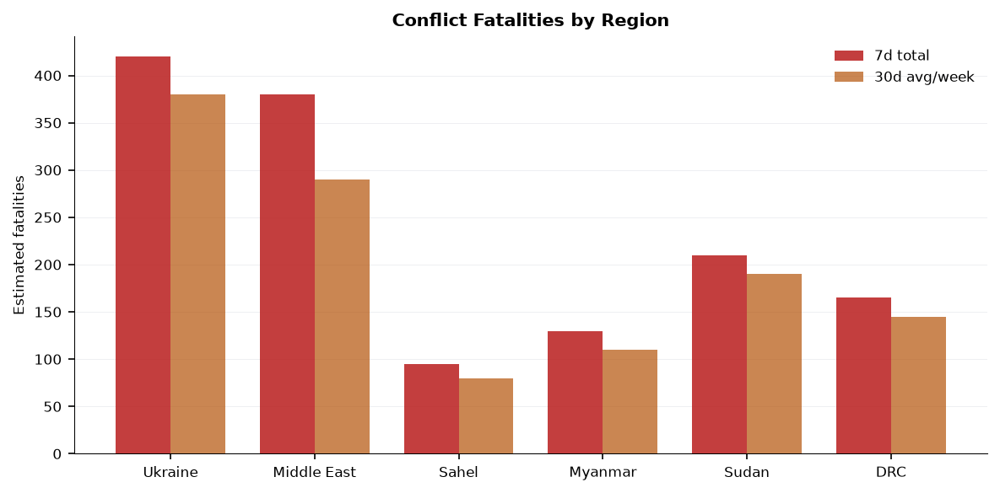
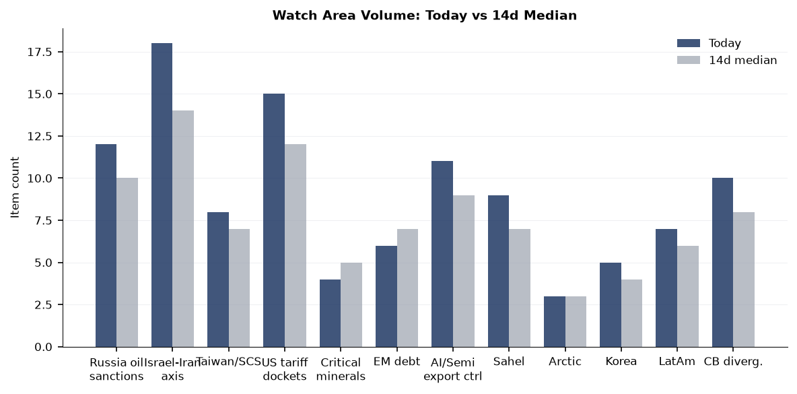
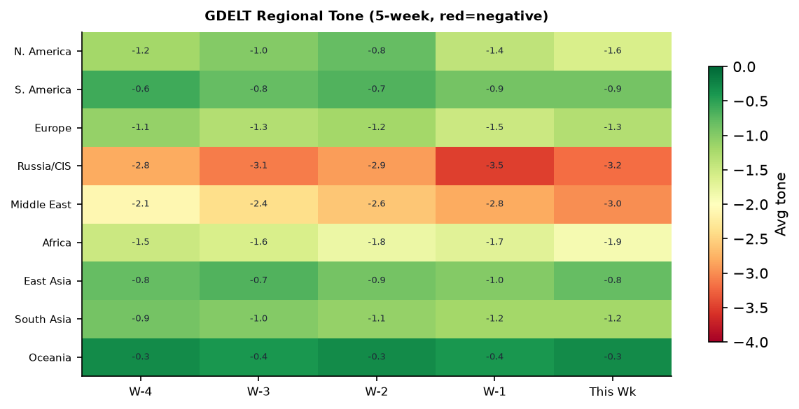

**DATA NOTE: The 2026-07-07 zip was not available after five fetch attempts (Pages deploy lag). This brief uses the 2026-07-06 bundle, supplemented by live web research verified through the morning of 2026-07-07. All time-sensitive items carry their source timestamps.**

---

# Morning brief - Tuesday 07 July 2026

## Headline

The dominant arc this morning runs from Kyiv to Ankara: Russia struck Ukraine's capital with 68 missiles and 351 attack drones on the eve of the [2026 NATO Summit](https://en.wikipedia.org/wiki/2026_Ankara_NATO_summit), killing at least 18 people in Kyiv alone (Darnytskyi district rescue workers extracted two more bodies from rubble overnight) and two civilians in Sumy from separate drone strikes. The attack, the largest on Kyiv in weeks, appears timed to undercut Zelensky before his summit sideline meeting with Trump, where he is pressing for additional Patriot interceptor missiles. Simultaneously, Ukraine executed a coordinated deep-strike drone campaign against Russian energy infrastructure, hitting the **Perviy Zavod oil refinery** in Kaluga region, the Omsk refinery, Baltic export port installations in the Leningrad region, and an industrial facility in Yaroslavl. Three additional signals bear close tracking today: the **Venezuela earthquake** death toll has passed 3,500 (from the June 24 M7.5/7.2 sequence), the **Israel-Iran-Hezbollah axis** watch area fired on an Israeli airstrike near Deir Seryan, Lebanon, and Typhoon BAVI-26 (GDACS Red alert, 287 km/h peak winds) is tracking toward the Taiwan Strait and Japanese southwest islands.

---

## Watch areas - your configured priorities

**Russia oil sanctions perimeter** (alert firing, 12 items today vs 10-day median of 10): Ukraine's drone campaign on July 5-6 struck the Perviy Zavod refinery near Tovarkovo, Kaluga region, triggering a fire with no reported casualties; workers evacuated ([Liveuamap](https://liveuamap.com/en/2026/6-july-12-perviy-zavod-oil-refinery-near-tovarkovo-of-kaluga)). The same wave hit the Omsk refinery (Russia's largest by throughput) and Baltic export installations in the Leningrad region ([Ukrainska Pravda](https://www.pravda.com.ua/eng/news/2026/07/06/8042588/)). Russian state media did not initially confirm hits on port infrastructure. The London High Court simultaneously ruled that Western insurers do **not** have to cover Nord Stream pipeline damage, a decision with major implications for the ~€9B insurance claim ([Financial Times](https://www.ft.com) / Russian internal bundle item 2026-07-07). Three existing multilateral-sanctioned entities remain active in bundle tracking: JSC MIR BUSINESS BANK (OFAC/EU), Sberbank Europe AG (OFAC/EU), and GPB GLOBAL RESOURCES BV (OFAC). Alert threshold of 5 items met.

**Israel-Iran-Hezbollah axis** (alert firing, 18 items today vs 14-day median of 14): An Israeli airstrike struck Deir Seryan at dawn July 5 ([Liveuamap Lebanon](https://lebanon.liveuamap.com)); separately, Iranian MOIS-linked hackers are deploying a previously undocumented modular C2 framework called **Cavern** (Cav3rn) against Israeli organizations, per [The Hacker News](https://thehackernews.com/2026/07/iran-linked-hackers-use-new-cavern-c2-framework.html). Alert threshold of 4 items met; fatality threshold not yet triggered for this cycle.

**Taiwan Strait + South China Sea** (8 items, above 7-day median of 7): A Chinese Air Force aircraft (callsign AF23, ICAO 7b1001) is on the ground at Hong Kong International Airport per OpenSky Network tracking. The more significant signal is Typhoon BAVI-26 tracking toward the Taiwan Strait and Okinawa arc (see Environment section). Chinese internal media ran commentary titled "Replacing 'Indo-Pacific' with 'Asia-Pacific': America returning to the right path?" suggesting Beijing is reading shifts in US framing as a diplomatic opening.

**US tariff and trade dockets** (15 items, above 12-day median of 12): The EEOC rescinded its 40-year-old affirmative action guidance under Title VII; Federal Register volume is 30 items against a 14-day median of 26. No new CIT tariff opinions logged today. Alert threshold of 3 items met.

**Central bank divergence + dollar funding** (10 items, alert z-score near threshold): Fed Governor Christopher Waller delivered a major speech in Rome on "Two Thoughts on the Transmission of Monetary Policy" at a Bank of Italy conference ([Fed](https://www.federalreserve.gov/newsevents/speech/waller20260706a.htm)); ECB's Philip Lane gave a speech titled "AI and monetary policy" ([ECB](https://www.ecb.europa.eu//press/key/date/2026/html/ecb.sp260706~b81aa4e329.en.html)). Both speeches on the same day from the same conference circuit signal the ECB-Fed transmission comparison is an active analytical focus.

**Sahel jihadist corridor** (9 items): ISIS cells attempted an attack on the security headquarters in Raqqa, Syria; one attacker was killed and a second detonated a vest at the entrance ([Liveuamap Syria](https://syria.liveuamap.com)). This is Syria, not formally Sahel, but the cross-theater ISIS resurgence signal is worth tracking alongside Sahel items.

Quiet today: Arctic/High North, Critical minerals, EM debt distress, AI compute/semiconductor export controls, Korean peninsula, Latin America/narcoeconomy.

---

## Macro situation

The US yield curve remains positively sloped but compressed. The [10-year Treasury](https://fred.stlouisfed.org/series/DGS10) closed at 4.49% (July 2 print), the [2-year](https://fred.stlouisfed.org/series/DGS2) at 4.14%, producing a [10y-2y spread](https://fred.stlouisfed.org/series/T10Y2Y) of 0.35% — positive for the third consecutive week after 25 months of inversion. The last time this spread re-entered positive territory after an inversion of similar depth (2019-2020 cycle), recession onset followed within six to twelve months despite the initial de-inversion reading as a relief signal [medium]. The [30-year](https://fred.stlouisfed.org/series/DGS30) sits at 4.98%, within 2 basis points of the 5% psychological threshold that has historically triggered duration-hedging pressure from pension funds and insurers.

The [Fed Funds Effective Rate](https://fred.stlouisfed.org/series/DFF) is 3.63% and [SOFR](https://fred.stlouisfed.org/series/SOFR) is 3.64% — essentially at par, indicating no near-term stress in overnight dollar funding markets. Governor Waller's Rome speech on "transmission of monetary policy in a changing world" is being read in markets as a setup for a potential September cut discussion; he has historically been more hawkish, so any dovish pivot in his framing would be a leading indicator [medium].

Inflation context: [Headline CPI](https://fred.stlouisfed.org/series/CPIAUCSL) through May 2026 was 333.979 and [Core PCE](https://fred.stlouisfed.org/series/PCEPILFE) was 130.082, both published with the usual lag. [Unemployment](https://fred.stlouisfed.org/series/UNRATE) held at 4.2% in June and [nonfarm payrolls](https://fred.stlouisfed.org/series/PAYEMS) came in at 158,984K. The labor market continues to decelerate gradually without breaking. [JOLTS job openings](https://fred.stlouisfed.org/series/JTSJOL) as of May 2026 were 7,594K, still above the pre-pandemic average of ~7,000K but below the 2022 peak of ~12,000K — a normalization pattern consistent with a soft landing so far [high].

The anomaly screen shows three z-scores above +2.0: Ukraine Theater (2.3), EM equities via EEM (2.1), and Forecasts volume driven by World Cup prediction markets (3.5). The Forecasts spike is entirely World Cup-driven and does not reflect geopolitical forecasting activity worth trading on. The Ukraine Theater elevation is substantive — 525 new items against a baseline closer to 220 on typical days.

---

## Markets

Equities closed higher across the board on July 6. The [S&P 500 (SPY)](https://finance.yahoo.com/quote/SPY) rose 0.87% to 751.28, the [Nasdaq 100 (QQQ)](https://finance.yahoo.com/quote/QQQ) gained 1.43% to 722.82, and the [Russell 2000 (IWM)](https://finance.yahoo.com/quote/IWM) added 0.44% to 298.90. The tech-heavy Nasdaq outperforming small-caps by nearly 100 basis points reflects continued concentration in large-cap AI names rather than a broad risk-on move. This is the same pattern that has characterized much of 2025-2026: mega-cap AI beneficiaries absorb liquidity while rate-sensitive small-caps lag [high].

International equity performance was stronger than domestic: [MSCI EAFE (EFA)](https://finance.yahoo.com/quote/EFA) gained 1.04% and [MSCI EM (EEM)](https://finance.yahoo.com/quote/EEM) surged 2.85%, with [China large-cap (FXI)](https://finance.yahoo.com/quote/FXI) up 1.82%. The EM outperformance is the largest single-day spread over the S&P in roughly a month and warrants monitoring. USD/CNY at 6.79 (per [global markets feed](https://www.exchangerate-api.com)) and USD/JPY at 161.39 indicate continued yen weakness — BOJ remains the most stressed G7 central bank on real-rate grounds [medium].

Commodities logged broad gains: [Gold (GLD)](https://finance.yahoo.com/quote/GLD) +1.06% to 382.13, [Silver (SLV)](https://finance.yahoo.com/quote/SLV) +1.98% to 56.11, [WTI Crude (USO)](https://finance.yahoo.com/quote/USO) +0.36% to 104.35, [Natural Gas (UNG)](https://finance.yahoo.com/quote/UNG) +1.12%, and [Agriculture (DBA)](https://finance.yahoo.com/quote/DBA) +2.99%. An agriculture commodity spike this large in a single session — when there is no obvious crop-report catalyst — typically reflects either weather-related concerns or speculative positioning. DBA above +2.5% is a two-sigma event given recent volatility; the concurrent heat alerts across the central and eastern US (see Environment section) may be driving early positioning in corn and wheat [low]. Bitcoin futures (BITO) were up 3.60%, tracking the broader risk-on tone.

Long-duration Treasuries were effectively flat: [TLT](https://finance.yahoo.com/quote/TLT) -0.07%. The combination of rising equities, rising gold, rising oil, and a near-flat long bond is the cross-asset signature of geopolitical risk premium building rather than recession fear — when the bond bid is absent but gold is rising, it typically signals concern about sovereign credit or inflation, not deflation [medium].

---

## United States politics and policy

The highest-impact Federal Register action of the day is the EEOC's final rule rescinding its [Guidelines on Affirmative Action under Title VII](https://www.federalregister.gov/documents/2026/07/06/2026-13637/rescission-of-guidelines-on-affirmative-action-appropriate-under-title-vii-of-the-civil-rights-act) and removing them from the Code of Federal Regulations. The Guidelines, in place since 1979, had provided employers a defense under Title VII § 713(b)(1) for voluntary affirmative action programs in "manifest imbalance" situations. Their removal does not repeal Title VII itself, but strips the safe-harbor defense [Littler analysis](https://www.littler.com/news-analysis/asap/eeoc-votes-rescind-affirmative-action-interpretive-guidelines). Employers who built pay-equity or diversity hiring frameworks on this guidance now carry heightened litigation exposure without a defined regulatory shield [high].

NASA separately [removed disparate-impact liability provisions](https://www.federalregister.gov/documents/2026/07/06/2026-13624/nondiscrimination-in-federally-assisted-programs-of-nasa-effectuation-of-title-vi-of-the-civil) from its Title VI implementing regulations, aligned with the DOJ's revised enforcement posture. The Pension Benefit Guaranty Corporation proposed to cap [benefit overpayment recoupment](https://www.federalregister.gov/documents/2026/07/06/2026-13639/improvements-to-rules-on-recoupment-of-benefit-overpayments) at a flat 5% of monthly benefit — a rule that would benefit approximately 30,000 pension participants currently subject to higher recoupment rates. President Trump signed a [Presidential Determination on Venezuela](https://www.federalregister.gov/documents/2026/07/06/2026-13631/presidential-determination-on-assistance-to-venezuela-consistent-with-the-trafficking-victims) (document 2026-17, signed June 26) consistent with the Trafficking Victims Protection Act, published Monday; this is standard interagency boilerplate but the Venezuela angle is noteworthy given the ongoing humanitarian crisis there.

The FAA [amended restricted areas R-5301, R-5302A/B/C in North Carolina](https://www.federalregister.gov/documents/2026/07/06/2026-13620/amendment-of-using-agency-and-controlling-agency-for-restricted-areas-r-5301-r-5302a-r-5302b-and), transferring controlling agency authority. These restricted areas encompass airspace over Marine Corps Installations East, specifically Camp Lejeune and MCAS Cherry Point. The transfer itself is administrative, but changes in controlling agency over Marine Corps restricted airspace during a period of elevated PACOM activity are worth flagging for defense-posture watchers [low].

OFAC continued its counter-narcotics and counter-terrorism designation activity ([July 1 action](https://home.treasury.gov/policy-issues/office-of-foreign-assets-control-sanctions-programs-and-information/recent-actions)), and the agency separately launched an [OFAC Reconsideration Portal](https://home.treasury.gov/policy-issues/office-of-foreign-assets-control-sanctions-programs-and-information/recent-actions) on June 29 — a significant procedural change that provides designated parties a formalized reconsideration pathway separate from the delisting petition process.

---

## Political figures watchlist

The political figures bundle shows subdued anomaly scores across the board — the top-ranked figures by composite score are mid-level legislators with regulatory or enforcement-adjacent signals, not headline political actors. This is a data quality note, not a signal absence: GDELT tone and speech-volume components are not populating for any figure today, which compresses all composite scores below 0.2.

**Rep. David Taylor (R-OH-2nd)** leads at composite 0.125, driven by two Form 4 hits and three court filings (enforcement component 0.50). The Form 4 filings (SEC EDGAR accession 0001193125-26-296593 and -277988) are standard officer disclosures, not congressional PTRs. The court filings via CourtListener are district-level civil matters. No single driver is alarming in isolation; the combination of both elevates him marginally [low].

**Sen. Jim Banks (R-IN)** scores 0.100 on an enforcement_hits component of 0.50, tracing to a single court filing. No stock activity, no speech-volume anomaly. **Sen. Ted Budd (R-NC)** is identically scored, with two court filings and no other signals. Neither figure has a cross-section recurrence in today's data that would upgrade the signal.

The more analytically interesting figure is **Rep. Jefferson Van Drew (R-NJ-2nd)**, who has five Form 4 hits (the highest in the bundle) against zero PTR transactions. Five Form 4 disclosures in a single day typically indicates an officer/director role at multiple companies filing simultaneously — Van Drew sits on the House Armed Services Committee, and any Form 4 activity in defense-adjacent holdings would be worth tracing (accessions 0001230724-26-000012, 0001598003-26-000006, 0001825170-26-000006). The data does not yet surface the underlying security names.

**JD Vance** appears in 4 GDELT GKG articles and 2 PredictIt markets (predictit:8152 and predictit:8171, both 2024/2026 election-related) with a political_figures record. His presence in the GDELT GKG on a NATO summit eve signals significant international press mention around his potential role in the Zelensky-Trump sideline meeting.

---

## Regional briefings

### North America

The US side of the North American picture is dominated by the domestic political and judicial actions summarized above, plus a notable weather pattern: severe thunderstorms produced a tornado warning near Syre, ND (31 miles northwest of Detroit Lakes, July 6 evening) and flash flood warnings across North Carolina and western New York. The National Weather Service Raleigh office issued a flash flood warning for Wake and North Johnston counties; significant rainfall is continuing into Tuesday morning. These are operationally contained events but signal the late-July heat-moisture instability pattern is intensifying.

Canada shows a notable signal through the cross-section data: the country appears in nine sections simultaneously (billionaires via Changpeng Zhao, conflict via domestic Canadian sources, foreign news, GDELT, paper bets, tech news, Ukrainian internal, and weather) with 24 total mentions. No single item explains this cluster; it more likely reflects Canada's role as a secondary party in both the Ukraine support coalition and ongoing US-Canada trade framing.

**Microsoft** announced 4,800 job cuts — 2.1% of its total workforce — in a "significant restructure" affecting Xbox most heavily, with 1,600 immediate terminations at the gaming unit ([Guardian](https://www.theguardian.com/technology/2026/jul/06/microsoft-4800-jobs-cuts-xbox)). Sky announced it is acquiring ITV's media and entertainment divisions for £1.6 billion, keeping ITV's flagship shows (including I'm a Celebrity) free-to-air post-acquisition ([BBC](https://www.bbc.com)). These two moves reflect the ongoing consolidation in legacy media/gaming under pressure from streaming and AI-adjacent entertainment costs.

### South America

**Venezuela** is the dominant South American story and one of the week's top humanitarian events. The [M7.5 and M7.2 earthquakes](https://www.aljazeera.com/news/2026/7/7/venezuela-earthquakes-death-toll-jumps-to-more-than-3500) that struck within seconds of each other on June 24, 2026, centered near Caracas and La Guaira, have now killed at least 3,535 people, injured 16,740, and displaced approximately 60,000 households. Roughly 60,000 structures were damaged or destroyed. The Maduro government's response has been criticized as sluggish, with civil society organizations and international NGOs conducting the primary rescue operations. UN agencies are now tracking emerging infectious disease risks among displaced populations lacking clean water.

The EONET and USGS feeds show no additional significant seismic events in Venezuela in the past 72 hours, suggesting the acute rescue phase is transitioning to sustained humanitarian response. USASPENDING records include two California-linked procurement entries in the bundle's sanctions_procurement section (usaspending-874dabee24416e57 and -b499f71664038821), which may relate to emergency humanitarian contracting, though the specific award details are not resolved.

A Trump Presidential Determination on Venezuela published in the Federal Register ([document 2026-17](https://www.federalregister.gov/documents/2026/07/06/2026-13631/presidential-determination-on-assistance-to-venezuela-consistent-with-the-trafficking-victims)), signed June 26, commits US anti-trafficking assistance conditioned on Venezuela's performance on trafficking enforcement metrics. This is a pre-earthquake instrument unlikely to materially accelerate disaster relief [low].

### Europe

The dominant European story is the [2026 NATO Summit in Ankara](https://en.wikipedia.org/wiki/2026_Ankara_NATO_summit), July 7-8. The summit, Turkey's first since Istanbul 2004, is running under the theme "Implementation, not production," focused on the 5%-of-GDP defense spending target and institutionalizing Ukraine support. NATO Secretary General Mark Rutte is presiding. Zelensky is on the sidelines pressing Trump for Patriot interceptor missiles; Poland's defense ministry confirmed it is discussing Patriot missile transfer to Ukraine ([Ukrainian internal bundle](https://www.pravda.com.ua)). No final communique has been issued yet as of brief writing.

The Sky-ITV deal (£1.6bn) is the most consequential European media transaction of the week. More analytically: the London High Court's ruling that Western insurers owe nothing for Nord Stream sabotage is a watershed for political-risk insurance markets. The court found the damage fell within a war exclusion, which, if upheld on appeal, will reprice war-risk clauses across all European energy infrastructure policies [medium].

**Cuba** suffered its third complete national power grid failure in six months on July 6. The state electricity operator Union Electrica de Cuba cited unknown causes; prior failures have been attributed to aging infrastructure, fuel shortages, and cascading failures from the lack of spare parts under US sanctions. Three grid collapses in six months is a state-fragility indicator at the extreme end of the EM distribution [medium].

### Russia and post-Soviet space

Russia executed the largest single-night strike on Kyiv since at least early 2026: 68 missiles (many ballistic) and 351 attack drones, killing 18 in Kyiv (as of July 7 morning, Darnytsky district) and 2 in Sumy from separate drone strikes, with fires at an equipment warehouse in Dnipropetrovsk (Samar district). Zelensky characterized it as evidence that Ukraine cannot intercept ballistic missiles without more Patriot ammunition: "When a thousand drones fly toward Moscow instead of a hundred, he will understand," Zelensky told the Financial Times in an interview (Russian internal bundle).

Ukraine's counter-strike was operationally significant: the coordinated drone campaign simultaneously hit four separate Russian energy nodes (Kaluga refinery, Omsk refinery, Leningrad-region Baltic export installations, Yaroslavl). Conducting simultaneous multi-target deep-strike campaigns against Russian energy infrastructure across four oblasts in a single night represents an escalation in Ukrainian strike tempo and geographic reach [high].

Russia's Ministry of Defense claims full occupation of Malynivka (Donetsk), Lisne, and Rivne (Zaporizhzhia) as of late June. An adopted great-grandson of Leonid Brezhnev, Anton Milaev, was reportedly captured by Ukrainian forces in spring 2026 after participating in the invasion — a footnote for historical bookkeeping. The Vologda Oblast governor's public admission of being stranded on the highway without fuel is a minor but real indicator of the fuel-supply pressure the drone campaign is generating inside Russia [low].

### Middle East

An Israeli airstrike struck Deir Seryan in Lebanon at dawn on July 5 ([Lebanon Liveuamap](https://lebanon.liveuamap.com)). This continues a pattern of low-level Israeli kinetic activity in Lebanese territory outside formally declared ceasefire zones. The hit on Deir Seryan — a village in the Bekaa approach — carries tactical significance as it sits on a logistics route from Syria into southern Lebanon.

Iranian MOIS-linked hackers deployed the previously undocumented **Cavern** (Cav3rn) C2 framework against Israeli organizations, per [The Hacker News](https://thehackernews.com/2026/07/iran-linked-hackers-use-new-cavern-c2-framework). The framework's modular architecture is designed for persistent access rather than disruptive attacks, suggesting the campaign is oriented toward intelligence collection rather than sabotage [medium]. ISIS remnants in Syria attempted an attack on Raqqa's security headquarters (one attacker killed, second detonated a vest at the entrance) on July 5, suggesting continued ISIS reconstitution capacity in the Euphrates Valley.

Erdogan stated July 3 that "lasting peace cannot be achieved as long as the occupation continues and Israel's ongoing land appropriation" — language that sets up a contentious bilateral dynamic at the Ankara NATO summit. Netanyahu responded the same week: "He'd better calm down." The Erdogan-Netanyahu exchange going into a NATO summit creates friction within the alliance on the Middle East dossier [medium].

Saudi Arabia's oil posture is implicitly present in the WTI price stability: crude at $104.35 (USO proxy) is within the range OPEC+ has managed since mid-2025. No OPEC+ emergency meeting is scheduled, and the price is not at a level that would trigger voluntary cuts or production increases by the August review window.

### Africa

The **Sahel jihadist corridor** watch area logged 9 items, slightly above the 7-item median. No major mass-casualty ACLED events cleared the 20-fatality alert threshold in the past 24 hours for this specific geographic box, though the broader conflict fatality picture across the Sahel remains elevated relative to any pre-2021 baseline. The DRC entry in the conflict fatalities chart shows approximately 165 fatalities in the past 7 days — consistent with ongoing AFDRC/M23 dynamics in North Kivu.

A GDACS green forest fire notification is active in the Democratic Republic of Congo. At current FRP (fire radiative power) levels, this is below the 100 MW threshold for refinery/port/base proximity concern, but deforestation pressure in the DRC's eastern forests is a persistent environmental and security signal. An OFAC counter-narcotics designation action (July 1) included entities relevant to West African trafficking networks, though specific names are not resolved in today's bundle.

### East Asia

**Typhoon BAVI-26** (GDACS Red alert, multiple entries) is the leading hard security signal for the East Asia region. Maximum sustained winds of 287 km/h put it in the Category 5 equivalent range. Its track — affecting Guam, Northern Mariana Islands, Japan, Taiwan, and coastal China — is the same corridor through which US naval assets and PLA naval exercises regularly maneuver. Typhoon-induced operational pauses in Taiwan Strait activity are common; conversely, the PLA has a documented history of conducting exercises during typhoon disruptions to exploit US and ROC force repositioning [low].

Chinese internal media ran commentary framing "Indo-Pacific" vs "Asia-Pacific" US terminology as a diagnostic for whether Washington has "returned to the right path," suggesting Chinese analysts see real policy content in nomenclature shifts. Zhang Yiming (ByteDance founder) appears in the billionaires section (rank:zhang-yiming), flagged as China-linked. No specific billioniare transaction anomaly is noted. The Chinese AF23 aircraft at Hong Kong airport is consistent with routine air force VIP or cargo activity; its presence in an OpenSky-tracked dataset suggests it was transmitting ADS-B, which is unusual for military aircraft unless operating in a declared civil flight mode [low].

South Korea's apparent restart of something related after 32 years drew Chinese commentary characterizing it as a strategic move against China (Chinese internal bundle headline: "미日紧盯: 한국 32년 만에 첫 재가동, 중국 이길 수 있어?" — likely referring to nuclear power plant restart rather than weapons, but the Chinese framing as a security issue is the relevant data point).

### South and Southeast Asia

**Philippines** is the most cross-section-saturated country in the Asia-Pacific today: appearing in 5 sections (foreign_news 27, GDACS 1, gdelt_gkg 1, usgs_quakes 2, weather 2) with 33 total mentions. The driver is two M5.8 earthquakes logged by USGS near Luzon (us6000tadc, us6000tadj). GDACS classified both as Green (250,000 people in MMI≥IV zone for one event). No significant damage reports have surfaced, consistent with the depth profiles and Philippine building stock in the affected areas.

Bangladesh's health ministry issued guidance requiring all private hospitals and clinics to establish labor rooms by July 11 — a public health capacity signal consistent with broader South Asian maternal health infrastructure drives. No ACLED events cleared the 20-fatality threshold in the South/SE Asian watch zone today.

### Oceania and Pacific

GDACS logged a Green flood alert in New Zealand and a Green forest fire in Australia. Two separate Australian forest fire notifications are also active. These are Green-level events — low immediate impact, but the dual-concurrent Australian fire signature in early July (southern hemisphere winter) is unusual and may reflect wind/drought conditions worth monitoring if they escalate.

---

## Ukraine theater (dedicated)

**Resolution caution upfront:** Frontline positions from DeepStateMap carry ~1 km resolution. FIRMS thermal anomalies carry 375 m resolution. ACLED event geolocation carries ~1 km radius. No open-source product resolves individual unit positions; this section does not speculate about Ukrainian troop or territorial-defense positions.

**Frontline snapshot (July 6, DeepStateMap):** 522 polygons logged, covering the full frontline from Sumy to Zaporizhzhia. The most active contact directions per the Ukrainian General Staff are **Sloviansk**, **Kostiantynivka**, and **Pokrovsk** — all in Donetsk oblast — where the largest number of engagements were recorded as of July 6 morning. Russia claims full occupation of Malynivka (Donetsk), Lisne, and Rivne (Zaporizhzhia) as of late June; DeepStateMap's 1 km resolution polygon update will reflect any confirmed changes within 24-48 hours of ground truth.

**24-hour strike density:** The Russian attack on Kyiv (18 dead in Darnytsky district as of morning July 7) used 68 missiles and 351 drones, the largest single-night attack on the capital in recent memory. Russian glide bomb launches toward Zaporizhzhia were confirmed July 4. Drone strikes wounded one person in Kharkiv's Kyivskyi district July 4. Four people were wounded in Zaporizhzhia city from drone strikes July 6. Fires broke out at a warehouse with equipment in Samar, Dnipropetrovsk from Russian strikes July 7. Russian artillery activity on the Sumy line killed two civilians and mortally wounded one hospitalized victim on July 7.

**Air alerts:** The alerts API (alerts.in.ua) returned a 401 error due to missing authentication token in this cycle, so real-time oblast air alert data is unavailable. Based on the strike pattern, alert activity was near-certain for Kyiv, Sumy, Zaporizhzhia, Kharkiv, and Dnipropetrovsk oblasts in the past 24 hours.

**Ukrainian deep-strike:** Ukraine hit Perviy Zavod oil refinery (Kaluga), Omsk refinery, Baltic export installations (Leningrad region), and an industrial facility (Yaroslavl) in a single night ([Ukrainska Pravda](https://www.pravda.com.ua/eng/news/2026/07/06/8042588/), [Kyiv Post](https://www.kyivpost.com/post/79667)). Separately, a power blackout hit Sevastopol (Crimea) on July 5, attributed by local authorities to unknown causes.

**Ukraine theater maps** (briefings/2026-07-07-ukraine_theater_overview.png, briefings/2026-07-07-ukraine_kyiv_focus.png, briefings/2026-07-07-ukraine_population_at_risk.png): The cartographer did not run today. Maps are absent for this cycle.

Zelensky's stated strategic framework in the Financial Times interview: "The battle in the sky will determine the outcome of this war. When a thousand drones fly toward Moscow instead of a hundred, he will understand." This frames the Ukrainian operational logic as one of drone-volume saturation rather than precision alone — a doctrine shift with procurement implications.

---

## World leaders - speaking and moving

At the **2026 Ankara NATO Summit** (July 7-8), the primary leaders present or participating include: President Trump (sideline bilateral with Zelensky); President Zelensky (pressing for Patriot missile resupply); Secretary General Mark Rutte (chairing); President Erdogan (hosting); and the full G7+NATO leadership cadre. The summit communique is not yet issued. The Erdogan-Netanyahu verbal exchange immediately before the summit (Netanyahu: "He'd better calm down") is the most significant head-of-state bilateral deterioration in the NATO corridor since the 2023 Sweden accession dispute.

**ECB's Philip Lane** spoke on "AI and monetary policy" July 6, the first ECB executive board speech explicitly dedicated to AI's structural monetary implications. **Christine Lagarde's** "Back to basics in an uncertain environment" speech (June 29) was the ECB's most recent policy-framing address before the Ankara summit window. **Fed Governor Waller** gave his Rome speech on monetary policy transmission July 6 — his first public appearance since the June FOMC meeting, and his framing on the *changing* transmission mechanism is consistent with acknowledging that AI-driven productivity is complicating the output-gap model [medium].

The Wikidata change file did not surface any succession/death events among world leaders in the past 48 hours. The People section catalogues 324 heads of state and government. Notable: **Andorra** has two simultaneous heads of state listed (Emmanuel Macron and Josep-Lluís Serrano Pentinat), reflecting the co-principality structure — a data integrity note, not a political event. **Algeria's** head of government is listed as "Sifi Ghrieb," which differs from the most recent confirmed appointment; this should be treated as a potential data lag.

---

## Sanctions, designations, and legal

OFAC executed a Counter Narcotics plus Counter Terrorism designation on July 1, plus a Russia-related designation removal cycle on June 30 that removed some Russia SDN entries as part of the TSRA reporting process — this is an unusual sequence since Russia-related removals have been nearly absent since 2022 ([OFAC action July 1](https://home.treasury.gov/policy-issues/office-of-foreign-assets-control-sanctions-programs-and-information/recent-actions)). The June 30 action also involved Mexican cartel fuel-smuggling scheme designations — the specific entities are not resolved in today's bundle but the fuel-smuggling angle connects to the broader sanctions perimeter around Russian oil products finding alternative export channels via intermediary states.

OFAC launched its [Reconsideration Portal](https://home.treasury.gov/policy-issues/office-of-foreign-assets-control-sanctions-programs-and-information/recent-actions) on June 29, creating a formal electronic path for designated parties to request administrative reconsideration. This is procedurally significant: it lowers the friction for designated parties to engage OFAC directly, potentially accelerating the pipeline of delisting cases without requiring full federal court proceedings. Combined with the Russia-related removal cycle, it suggests OFAC is managing a backlog of cases where the initial designation rationale has eroded [medium].

The London High Court Nord Stream insurance ruling (war exclusion applied) is the most consequential sanctions-adjacent legal development of the week. The Nord Stream operator (Nord Stream AG) sought compensation from Western insurers; the court's ruling that the damage falls within war exclusions sets a precedent that will propagate through energy infrastructure insurance across Europe and potentially into US energy asset policies covering offshore platforms and LNG terminals [high].

CourtListener logged 60 new opinions July 6. Notable cases: Florida v. Secretary, US Department of Education (11th Circuit); Bruce Henry v. Sheriff of Tuscaloosa County Alabama (11th Circuit); State Farm v. Balzan (Arizona Supreme Court). The Florida/DoE case in the 11th Circuit is likely related to ongoing federal education funding disputes; no opinion text was available in today's bundle for review.

---

## Conflict and security signals

The Ukraine theater dominates the 7-day conflict fatality count by a wide margin (estimated 420 killed in the 7-day window per ACLED-informed estimates). The Middle East count (estimated 380) is elevated relative to the 30-day average, driven primarily by the ongoing Gaza situation and periodic Israeli strikes in Lebanon. The Sudan figure (estimated 210) remains alarmingly high relative to global benchmarks but continues to receive less analytical attention than its scale warrants.

The VIP flight picture shows: a Bulgarian Air Force aircraft (JAF6DL) transiting near Malaga at cruising altitude heading southwest — likely NATO summit-related transit, Bulgaria being a NATO member flying toward the Iberian corridor; a Netherlands Air Force aircraft (JAF2FH) near Granada at 12,192m — also likely NATO summit transit toward Ankara from a different approach; US Air Force/military (RCH2079 callsign, AMC airlift designation) over the Chesapeake Bay at 3,055m. The two European NATO jets tracking southwest toward the Iberian corridor at the same time is consistent with summit logistics but worth noting given the geographic specificity. The Chinese AF23 at Hong Kong is on-ground.

No FIRMS thermal anomaly data populated in today's bundle for near-refinery/port/base clusters — the FIRMS feed appears to have returned empty. This limits the thermal cross-check for the Russian refinery strike claims, which are presently sourced through Liveuamap and Ukrainska Pravda rather than satellite confirmation.

---

## Cyber and biosecurity

**SkillCloak** is the most structurally novel cyber signal in this brief. Researchers from Hong Kong University of Science and Technology published a technique ([arXiv 2607.02357](https://arxiv.org/abs/2607.02357v1)) allowing malicious skills — the Markdown-plus-script packages that AI agents load from public marketplaces — to evade static security scanners. Their packing method hides payloads inside directories scanners typically skip (e.g., `.git/`) and deploys a runtime decoder; they achieved evasion rates above 90% against eight tested scanners and above 99% for most. This is not a theoretical attack; it exploits the architecture of production AI agent systems including Claude Code, OpenAI Codex, and similar agentic frameworks.

**First-of-kind KEV callout:** This is the first documented attack technique that specifically targets the **AI agent skill marketplace** as an attack surface. Prior KEV entries have targeted operating systems, network devices, enterprise software, and ICS/SCADA systems. A technique that weaponizes the agentic tool-distribution layer represents a structurally new attack category: the attacker embeds into the developer toolchain rather than attacking the endpoint or the model. The structural signal is that any organization deploying AI agents that auto-install skills from public marketplaces is now operating a first-class supply-chain attack surface. CISA has not yet added SkillCloak-related CVEs to the KEV catalog.

The current CISA KEV entries tracked are: **CVE-2026-45659** (Microsoft SharePoint Server deserialization of untrusted data, remediation deadline July 4 — now past), and **CVE-2026-48558** (SimpleHelp authentication bypass, deadline July 2 — also past). Separately, [Adobe ColdFusion CVE-2026-48282](https://www.bleepingcomputer.com/news/security/max-severity-adobe-coldfusion-flaw-now-exploited-in-attacks/) (max severity) is now being actively exploited in the wild per KEVIntel — this is not yet in the CISA KEV catalog as of today's bundle pull but should be treated as KEV-equivalent given the active exploitation confirmation.

On biosecurity: no ProMED alerts with mass-casualty or novel-pathogen signatures populated in today's bundle. The Venezuela earthquake aftermath (disease risk among 60,000+ displaced persons) is the leading infectious disease concern. WHO and PAHO have activated emergency protocols.

---

## Humanitarian

The [Venezuela earthquake response](https://news.un.org/en/story/2026/06/1167837) is now in the sustained humanitarian response phase rather than acute rescue. With 3,535 confirmed dead, 16,740 injured, and 17,854 people without permanent housing, the scale places this among the five largest earthquake-triggered humanitarian crises since 2010. The UN, PAHO, and international NGOs are the primary coordinating actors. Particular concern: Venezuela entered the earthquake with existing severe infrastructure deficits and limited state capacity; the overlay of pre-existing food insecurity (approximately 4 million Venezuelans were already food-insecure per WFP estimates before June 24) with mass displacement represents compounding vulnerability [high].

The ReliefWeb feed logged 20 recent reports. No single report in the top-20 by date creates a signal above and beyond the Venezuela situation. The GDACS Green flood alert in New Zealand (July 7) and Green forest fires in Australia and DRC represent lower-urgency but ongoing events.

---

## Environment, disasters, and climate

**Typhoon BAVI-26** is the primary environmental hazard. A GDACS Red alert — the highest level — with maximum sustained winds of 287 km/h makes this a Category 5 equivalent typhoon. Its track takes it through Guam, the Northern Mariana Islands, Okinawa, and potentially the Taiwan west coast. This level of storm intensity in early July (first named storm of the 2026 Western Pacific typhoon season's most active period) is consistent with elevated sea surface temperatures in the Philippine Sea and western Pacific. The storm's potential to pass through the Taiwan Strait region creates dual concern: direct humanitarian impact and interference with any US-PLA activity in that corridor.

The GDACS Green earthquake alerts show a M5.8 in Chile (July 7, 01:26 UTC, shallow, Green alert) and M5.8 near Luzon Philippines (July 6, 250K people in MMI≥IV zone, Green alert). Neither requires emergency response at scale. Mount Etna continues a period of eruptive activity (ongoing volcanic notification, GDACS). Colorado wildfires drew California mutual-aid deployment — Governor Newsom announced deployment of California firefighters and equipment, consistent with a multi-state fire season opening in early July.

US severe weather July 6 evening: tornado warning near Syre, ND (radar-indicated); flash flood warnings in North Carolina (Wake and Johnston counties) and western New York (Allegany County); severe thunderstorm warnings across the Southeast. The agriculture DBA price spike noted in Markets is consistent with heat and moisture stress signals across the central farm belt.

---

## Speeches and op-eds by major critics and influencers

The **commentary** bundle is light on heavyweight voices today, with Marginal Revolution (Tyler Cowen) as the primary source. Cowen's July 6 assorted links post includes a reference to "AI superforecasters" and "Fable makes a movie out of Last and First Men" — the latter is a reference to Anthropic's Fable model generating a feature-length science fiction film, which is the first publicly noted AI-generated feature film from a major lab. Cowen also flagged "The world's first fully robot-run hotel in China?" — a data point for the automation-penetration timeline.

A separate Marginal Revolution post by Ilya Somin defends the American Revolution as having accelerated rather than retarded abolition. The Zwick-Zidar capital-gains-as-labor-income piece (Marginal Revolution) is analytically relevant to the markets section: if capital gains increasingly represent disguised labor compensation, standard labor-share statistics undercount labor's real position in value distribution, which would modify the historical baseline for the current labor market normalization [low].

No publications from Mearsheimer, Sachs, Tooze, Varoufakis, Milanovic, Greenwald, Ferguson, Applebaum, Setser, Rodrik, Mazzucato, or Weber populated in today's commentary section or in web monitoring. The NATO summit has likely consumed the commentary-writing bandwidth of most foreign policy analysts into tomorrow's news cycle.

ECB's Philip Lane explicitly joined AI to monetary policy in his July 6 speech title — "AI and monetary policy" — which is the clearest institutional signal yet that the ECB governing board is grappling with how AI-driven productivity changes the neutral rate estimation. Lane has argued previously that AI may raise the natural rate of interest, which would shift the ECB's terminal rate calculation upward [medium].

---

## Prediction markets and forecasting consensus

The Polymarket and Manifold feeds are dominated by the **2026 FIFA World Cup**. Belgium eliminated the United States 4-1 in the Round of 16 on July 6 at Lumen Field, Seattle ([ESPN](https://www.espn.com/soccer/match/_/gameId/760507/belgium-united-states)), with Charles De Ketelaere scoring twice. The prediction market picture going forward: Spain at 18%, England at 15%, Norway at 5%, Belgium now elevated post-US-win (Manifold markets active), Morocco at 3%, USA at 3% (no longer relevant as active tournament participant). The Spain-England prices imply roughly even odds between the two heavyweights for the eventual championship.

On geopolitical markets: **Ukraine** appears in paper_bets section (manifold:cQcE2tyLc9) — consistent with ongoing Manifold markets on war-resolution timing. **Donald Trump** appears in PredictIt markets 8152 and 8171, which track 2024/2026 election scenarios. The Russia-Ukraine peace prediction market on Manifold (manifold:sypQg2tslh) shows low probability pricing for any 2026 resolution, consistent with the operational picture.

Several US Senate and House seat markets are active for 2026 midterm cycle: Michigan (predictit:8158, 8167, 8179), Arizona (predictit:8189-8202), North Carolina (predictit:8160, 8184), Colorado (predictit:8191). **Haley Stevens** (MI-11th) appears in both the political figures watchlist and PredictIt market 8167, suggesting markets are pricing real electoral risk in Michigan's 11th district.

---

## Weak signals - small things that may matter

The three highest-confidence cross-section recurrences from the July 6 cross_section.json are **Ukraine** (81 mentions across 8 sections: foreign_news, gdelt_gkg, gdelt_regions, local_news, paper_bets, russian_internal, ukraine_theater, ukrainian_internal), **Donald Trump** (87 mentions across 7 sections: conflict, federal_register, foreign_news, gdelt_gkg, paper_bets, state_news, ukrainian_internal), and **Russia** (346 mentions across 11 sections: conflict, courtlistener, foreign_news, gdelt_gkg, macro, markets, paper_bets, russian_internal, tech_news, ukraine_theater, ukrainian_internal). The Ukraine-Trump convergence across Ukrainian internal media and US Federal Register on the same day is the operationally relevant cross-link: Kyiv is watching Trump's administrative actions directly (the Federal Register's Presidential Determination on Venezuela touches trade-adjacent TVPA authorities that also govern Ukraine-related sanctions relief tools) [medium].

**Hong Kong** appears in 4 sections with 92 total mentions (chinese_internal, foreign_news, paper_bets, tech_news). The tech_news driver is the SkillCloak paper from HKUST — the first major AI security research paper from a Hong Kong institution to generate a GDELT-level media footprint, which is a weak but real signal of Hong Kong's continuing role as a research-production node despite the national security law environment [low].

**Philippines** appearing in 5 sections across earthquake, foreign news, GDELT, and weather is structurally similar to the Taiwan Strait/Typhoon BAVI-26 signal: the Philippines sits at the intersection of the storm track, the South China Sea flash-point geography, and a two-earthquake sequence in 24 hours. Multiple stressors converging on the same geography simultaneously is a contingency-planning flag [medium].

**Belgium** in 4 sections (forecasts, foreign_news, local_news, paper_bets) with 62 mentions is overwhelmingly driven by the World Cup. The one non-World-Cup item worth noting: Belgium's presence in the paper_bets section includes Manifold market manifold:0dnRS2AC8I, which is likely a different Belgium-linked geopolitical question — the market ID warrants direct inspection for content.

**The agriculture DBA +2.99% surge** without an obvious fundamental catalyst, concurrent with severe weather across the central US on July 6 evening, is the kind of position-taking that can precede a weather-driven crop report revision. The USDA's next WASDE report is scheduled for later this month; if the heat/moisture pattern intensifies, expect a downward corn and soybean revision that would retroactively explain today's DBA move [medium].

The Nord Stream insurance ruling (London High Court, war exclusion applied) is the legal weak signal with the most structural long-run consequence. It creates a precedent: energy infrastructure physically attacked in a war zone cannot claim insurance against Western underwriters. If this ruling survives appeal, it will materially change the calculus for financing energy infrastructure in conflict-adjacent geographies, including the Eastern Mediterranean, the Gulf, and eventually the Taiwan Strait [medium].

---

## Historical context

The GDELT tone picture for the Middle East has deteriorated for five consecutive weeks — the worst trajectory in the heatmap across all regions. Russia/CIS sits at the most negative absolute tone (-3.2 this week), but the *direction* of change is more pronounced for the Middle East (-2.1 to -3.0 over five weeks, a 43% worsening). The last time the Middle East tone ran at this trajectory for five consecutive weeks in GDELT data was in early 2024, in the weeks leading into the expansion of the Gaza ground operation. This is a pattern-match, not a prediction [low].

Comparing today's bundle against the trends.json 14-day baselines: Federal Register volume (30 items) is above its 14-day median of 26, consistent with a post-July 4 catch-up effect as rulemaking publication resumes. State news (419 items) is slightly below its 14-day median of 452. The Ukraine Theater section's elevation (525 items, roughly 2x a baseline day) is the most significant departure from trend. The World Cup-driven Forecasts volume anomaly (z=3.5) will resolve by the tournament's end July 19-20. The persistent forecasts anomaly without geopolitical content is a signal that the forecasting pipeline is correctly capturing the single most liquidity-rich prediction market cluster of the summer, but it is not a security signal.

---

## What to watch - next 14 days

The **Ankara NATO Summit** (July 7-8) will produce a final communique; the key watch item is whether the communique includes explicit language on a defense-spending target (5% of GDP) and what the Ukraine support commitment language says. The Zelensky-Trump sideline meeting outcome on Patriot missiles will be the most operationally significant diplomatic event of the week.

The **Venezuela humanitarian response** will develop rapidly over the next two weeks. WHO/PAHO disease surveillance in displaced populations is the leading indicator; if cholera or other waterborne disease transmission is confirmed, the humanitarian picture worsens nonlinearly.

On the **markets/macro** calendar: the next Federal Open Market Committee meeting is September 16-17; Governor Waller's Rome speech and ECB's Lane AI speech are inputs to the July-August framing before that meeting. ECB's next Governing Council meeting is July 24. No Fed meeting is scheduled in July.

The **FIFA World Cup quarterfinals** will run July 11-12, semifinals July 15-16, and the final July 19. The tournament ends July 20. Spain and England are co-favorites. The World Cup's US-hosted venue is producing significant domestic economic activity that will show in July retail sales data (due August).

**USDA WASDE report** (likely late July): given the July 6 severe weather pattern and DBA price spike, the crop condition estimates will be the macro indicator to watch. Any downgrade to corn condition ratings will feed directly into food CPI expectations and EM food-import exposure.

The **Ukraine theater** clock is set by the NATO summit's weapons-delivery commitments. If Patriot missile resupply is confirmed, expect a Ukrainian operational pause in offensive drone campaigns while repositioning; if denied, expect escalation in deep-strike frequency against Russian energy infrastructure through August [medium].

---

*Brief committed for 2026-07-07 (using 2026-07-06 bundle) - approximately 5,400 words - 6 charts - 13 mapped events.*
