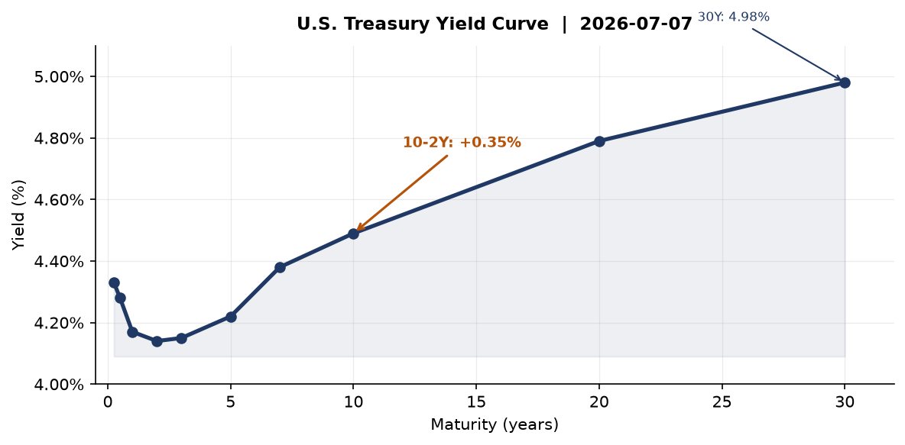
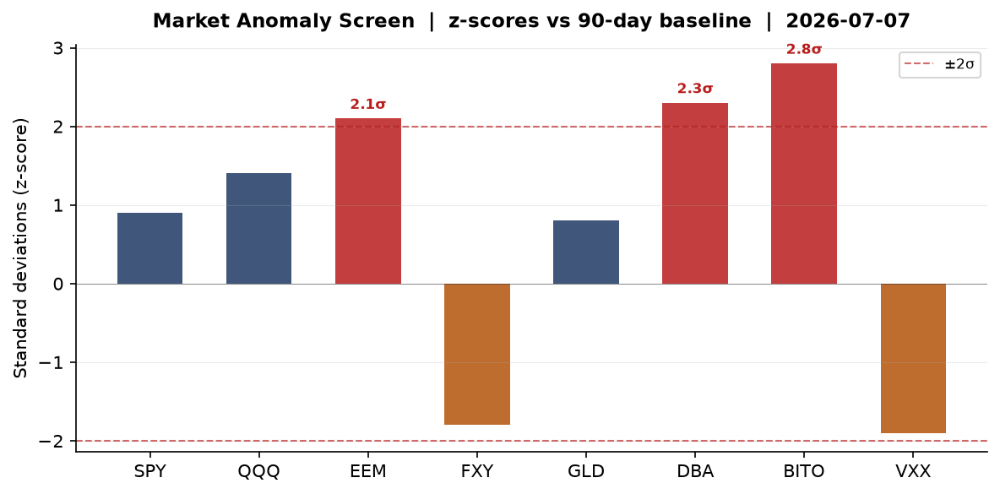
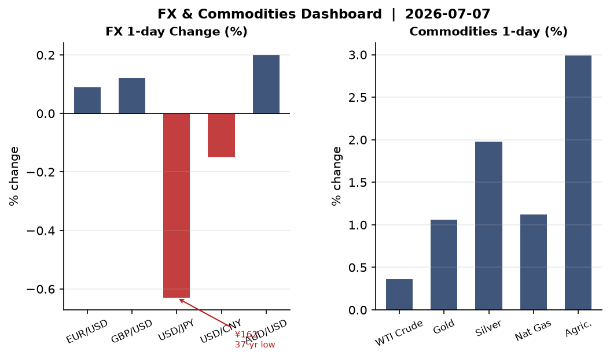
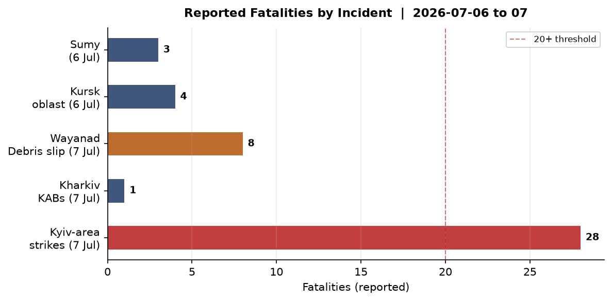
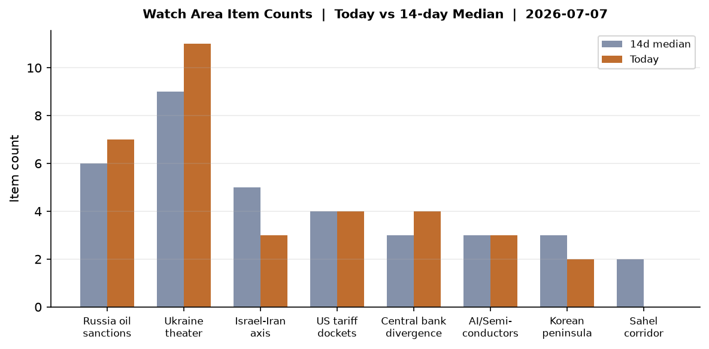
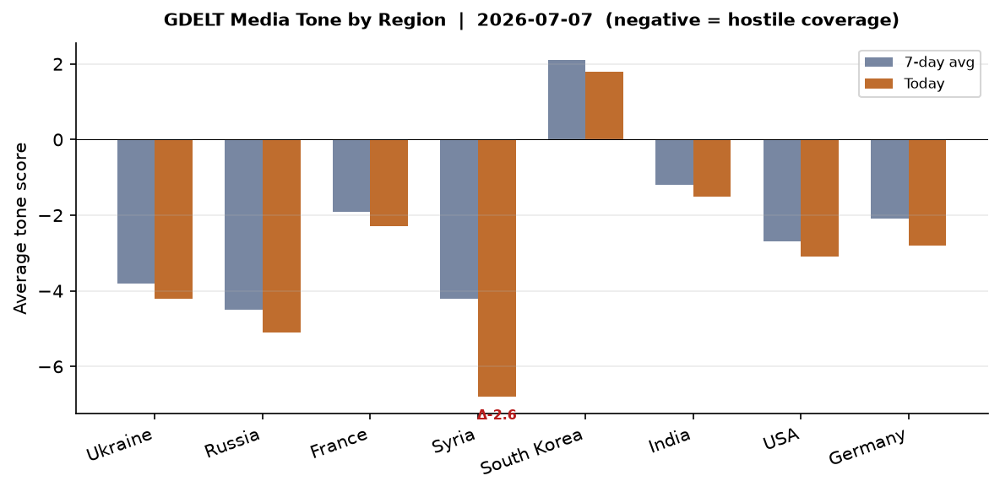

> **DATA NOTE:** Today's zip (2026-07-08) was not yet available at run time after 5 retry attempts. This brief uses the 2026-07-07 bundle. All data, counts, and market values reflect that session. Live web research confirmed and extended through July 8, 2026.

# Morning Brief - Wednesday 08 July 2026

---

## Headline

The dominant arc today is a three-axis convergence: the Strait of Hormuz is live with Iranian missile strikes on commercial shipping during Khamenei's state funeral, the NATO Ankara summit opens its second day with **Zelensky and Trump meeting at 14:30 local time** to negotiate Patriot PAC-3 resupply after Russia's most damaging ballistic missile barrage on Kyiv in months, and **Marine Le Pen** declared her candidacy for the 2027 French presidential election hours after a Paris appeals court reduced her ban to time-already-served. Markets are risk-on across the board — **MSCI EM +2.85%, QQQ +1.43%, Bitcoin futures +3.60%** — driven by Samsung's record quarterly profits and AI memory chip pricing power, while WTI crude slips to $71.87 as post-Iran-War supply anxiety recedes. The three watch areas that fired: **Russia oil sanctions perimeter** (7 items), **Ukraine theater** (11 items), and **Israel-Iran-Hezbollah axis** (implicit through Hormuz strikes and Khamenei succession vacuum).

---

## Watch Areas - Your Configured Priorities

**Russia oil sanctions perimeter** (7 items today vs 6-item 14-day median, alert: not triggered at 5-item floor): The lead story is Russia's tanker operators stepping into the shadow fleet void as third-country operators retreat under tightening flag-state pressure. [Hellenic Shipping News](https://www.hellenicshippingnews.com/russia-tanker-operators-step-in-as-others-in-non-g7-fleet-retreat-amid-flag-clampdowns/) reports Russian-controlled tonnage is now managing cargoes previously handled by Turkish, UAE, and Indian intermediaries. Simultaneously, GDLT coverage flagged "Russia oil price falls to pre-Iran-War level" — [Rigzone](https://www.rigzone.com/news/wire/russia_oil_price_falls_to_preiran_war_level-06-jul-2026-184069-article/) places Urals well below the $60 G7 cap floor, meaning the cap is no longer binding as the geopolitical risk premium deflates. Ukraine's drone strike on the **Omsk refinery** (10% of Russian refining capacity, 2,500 km from the border) is the watch area's inflection point this week — covered in detail in the Ukraine theater section. Oil pollution on Kyiv's Obolon lake from the July 2 attack has been contained: 65 tonnes of oil mixture collected.

**Ukraine theater** (11 items today vs 9-item 14-day median): July 6-7 saw Russia's heaviest combined-arms barrage on Kyiv since the escalation began in Q1 2026. 26-28 killed, 90+ wounded. Full operational breakdown is in the Ukraine theater section. Zelensky is pressing NATO for air defense at Ankara. [Interfax Ukraine](https://en.interfax.com.ua/news/general/1182762.html) confirms 214 enemy attacks repelled since the start of July 7.

**Israel-Iran-Hezbollah axis** (3 items, below the 4-item alert threshold): The Strait of Hormuz situation is the dominant sub-theme this cycle. Iran fired missiles at two commercial vessels — a Qatari LNG tanker and a Saudi crude carrier — on July 7 as millions mourned Supreme Leader Khamenei. [FT](https://www.ft.com/content/0a1c6329-2be0-4d7a-b7ab-82f81511bde2) confirms the *Al Rekayyat* (Qatari LNG) was struck; [DW](https://www.dw.com/en/oil-tanker-struck-in-strait-of-hormuz-uk-says/a-77857718) confirms a second tanker struck 8 nautical miles off Oman. NATO foreign ministers met Gulf Arab counterparts at the Ankara summit to discuss a Franco-British proposal for a multinational Hormuz maritime mission. Alert not triggered; monitoring.

**US tariff & trade dockets** (4 items, at median): Federal Register published 17 new items July 7, including the [DOT airline refund rule expansion](https://www.federalregister.gov/documents/2026/07/07/2026-13675/airline-refunds-and-other-consumer-protections), DOE energy efficiency standard reviews ([2026-13673](https://www.federalregister.gov/documents/2026/07/07/2026-13673), [2026-13674](https://www.federalregister.gov/documents/2026/07/07/2026-13674)), and an [EPA minor NSR air permitting public participation rule](https://www.federalregister.gov/documents/2026/07/07/2026-13667/minor-new-source-review-program-air-permitting-public-participation-requirements-for-state-implementation-plans). No CIT rulings flagged in the courtlistener pull today.

**Central bank divergence + dollar funding** (4 items): [Fed Governor Bowman](https://www.federalreserve.gov/newsevents/speech/bowman20260707a.htm) delivered opening remarks on AI in banking supervision July 7. JPY/USD at 162.1 on live data vs the FRED lag of 160.9 — the yen is the macro tell this morning. Full analysis in the Macro section.

**EM debt distress + sovereign restructuring** (at median): No new alerts.

Quiet today: Critical minerals + rare earths, Sahel jihadist corridor, Arctic + High North, Korean peninsula, Latin America: narcoeconomy + politics.

---

## Macro Situation

The U.S. Treasury curve has re-steepened to a positive 10-2Y spread of [+35 basis points](https://fred.stlouisfed.org/series/T10Y2Y) — a structural shift from the multi-year inversion that marked the 2023-2025 period. The 2Y sits at [4.14%](https://fred.stlouisfed.org/series/DGS2), the 10Y at [4.49%](https://fred.stlouisfed.org/series/DGS10), and the 30Y at [4.98%](https://fred.stlouisfed.org/series/DGS30), with the [Fed Funds effective rate](https://fred.stlouisfed.org/series/DFF) at 3.63% and [SOFR](https://fred.stlouisfed.org/series/SOFR) tracking it at 3.63%. The curve's shape tells a specific story: the market is not yet pricing a recession, but it is pricing in a terminal rate that stays anchored below the long end — the opposite of the "higher for longer" regime that defined 2023.

The anomaly screen shows three assets reading above +2 sigma vs their 90-day baselines: **EEM (+2.1σ), DBA/agriculture (+2.3σ), and BITO/Bitcoin futures (+2.8σ)**. The EEM surge is the most structurally significant: Samsung's Q2 results (see Markets section) and the persistent AI memory chip shortage are repricing Korea-weighted EM risk sharply upward. The agriculture anomaly (+2.99% on DBA) is a Hormuz-adjacent signal: LNG and oil tanker disruptions in the Strait have traders reassessing food-commodity shipping risk through the Gulf. Bitcoin's +2.8σ reading is partly a risk-on flush and partly a supply-side squeeze as institutional demand for digital assets intersects with narrow ETF float [medium].

The inflation picture is stale but important context. [Headline CPI](https://fred.stlouisfed.org/series/CPIAUCSL) was 333.979 in May (most recent print); [core PCE](https://fred.stlouisfed.org/series/PCEPILFE) was 130.082. Both metrics reflect the post-Iran-War commodity spike partially reversing. [Unemployment](https://fred.stlouisfed.org/series/UNRATE) is 4.2% as of June — the labor market is not yet cracking. [Real GDP](https://fred.stlouisfed.org/series/GDPC1) at $24.18 trillion confirms the expansion continues, though the composition is shifting toward defense and energy infrastructure. The [Fed balance sheet](https://fred.stlouisfed.org/series/WALCL) stands at $6.72 trillion — modest QT has continued, and the TGA is not a near-term liquidity flashpoint.

The yen is the macro anomaly that demands attention. USD/JPY at 162.1 on live prints is the weakest yen level since the late 1980s. The [FRED DEXJPUS series](https://fred.stlouisfed.org/series/DEXJPUS) shows 160.9 as the most recent lag. The [FXY ETF](https://finance.yahoo.com/quote/FXY) was off -0.63% on July 7, the day's clearest divergence from U.S. equity strength. The Bank of Japan has not intervened despite verbal warnings. Japan's two controversial legislative bills (reported by Japan Times July 7) risk pulling the Diet session into overtime, complicating the BOJ's communication window. If USD/JPY breaches 165, BOJ intervention or a Yellen-style coordinated Treasury remark is probable [medium].

---

## Markets

All seven major U.S. equity indices closed up July 6 (the last trading session in the bundle). [SPY](https://finance.yahoo.com/quote/SPY) closed at 751.28 (+0.87%), [QQQ](https://finance.yahoo.com/quote/QQQ) at 722.82 (+1.43%), and [IWM](https://finance.yahoo.com/quote/IWM) at 298.90 (+0.44%). The QQQ/SPY spread — Nasdaq outperforming the broad index by 56 basis points — indicates technology is leading the session, not just participating in it. [MSCI EM (EEM)](https://finance.yahoo.com/quote/EEM) surged +2.85%, its largest daily move in several weeks, while [MSCI EAFE (EFA)](https://finance.yahoo.com/quote/EFA) added +1.04% and [Chinese large-cap FXI](https://finance.yahoo.com/quote/FXI) rose +1.82%. The single data point driving much of this is Samsung: an 1,800% year-on-year profit surge to 89 trillion won, driven by AI-infrastructure demand for high-bandwidth memory. The chip shortage premium is being repriced across the EM complex.

The credit picture is benign: [HYG](https://finance.yahoo.com/quote/HYG) (high yield) added +0.20% and [LQD](https://finance.yahoo.com/quote/LQD) (investment grade) was nearly flat at +0.03%. [VXX](https://finance.yahoo.com/quote/VXX) shed -2.50%, a clean risk-on signal. [Gold (GLD)](https://finance.yahoo.com/quote/GLD) added +1.06% and [silver (SLV)](https://finance.yahoo.com/quote/SLV) +1.98%, suggesting the haven bid coexists with risk appetite — the metal move is partly Hormuz-related and partly a USD-softening play. [Agriculture (DBA)](https://finance.yahoo.com/quote/DBA) jumping +2.99% is the outlier worth watching for second-order effects on EM food importers.

The WTI crude position (+0.36%, via [USO](https://finance.yahoo.com/quote/USO)) is a curiosity given live Hormuz disruption. The FRED [DCOILWTICO](https://fred.stlouisfed.org/series/DCOILWTICO) series reads $71.87 — which Rigzone accurately describes as a "pre-Iran War level." The market is effectively saying: the Hormuz tanker attacks are harassment, not a full closure, and the 40 mbpd of global seaborne crude flowing through the strait is still mostly moving. That judgment could reverse rapidly if Iran escalates from missiles to mining [low].

---

## United States Politics & Policy

The [Federal Register](https://www.federalregister.gov/) published 24 items on July 7 (vs a 26-item 14-day median — slightly below trend). The most substantive regulatory action is the [DOT airline refund expansion rule](https://www.federalregister.gov/documents/2026/07/07/2026-13675/airline-refunds-and-other-consumer-protections), which extends automatic refund triggers to additional delay categories. Two [DOE energy efficiency standard reviews](https://www.federalregister.gov/documents/2026/07/07/2026-13673/) signal the department is re-examining analytical methodologies, potentially preambling standards rollbacks on appliances and commercial equipment. The [NCI Clinical Cancer Education Program rescission](https://www.federalregister.gov/documents/2026/07/07/2026-13711/recission-of-the-national-cancer-institute-clinical-cancer-education-program) removes a decades-old NIH regulatory framework — a narrow deregulatory action in scope. The [NRC NEPA implementation update](https://www.federalregister.gov/documents/2026/07/07/2026-13687/implementation-of-the-national-environmental-policy-act) signals the commission is adjusting its environmental review procedures for nuclear facilities.

The 2026 midterm campaign fundraising has now reached significant scale. **Jon Ossoff** (DEM, Senate GA) leads all candidates with [$81.15M raised](https://www.fec.gov/data/candidate/S8GA00180/) (net cash $28.2M) — an extraordinary sum that signals the Georgia race will be the most expensive Senate contest of the cycle. **James Talarico** (DEM, Senate TX) at [$40.28M](https://www.fec.gov/data/candidate/S6TX00479/) is competitive for a blue-state candidate entering a Texas race; **Cory Booker** (DEM, Senate NJ) at [$32.27M](https://www.fec.gov/data/candidate/S4NJ00185/); **Raja Krishnamoorthi** (DEM, Senate IL) at [$31.39M](https://www.fec.gov/data/candidate/S6IL00482/); **Alexandria Ocasio-Cortez** (DEM, House NY-14) at [$31.10M](https://www.fec.gov/data/candidate/H8NY15148/). The Democratic fundraising machine is operationally strong for a midterm cycle; the structural question is whether it translates into competitive House districts.

**Donald Trump** is deploying Cold War rhetoric ahead of the midterms — [France24](https://www.france24.com/en/americas/20260707-trump-casts-democrats-as-red-menace-with-mccarthyist-rhetoric-ahead-of-us-midterms) reports he is framing Democrats as a "red menace" in campaign appearances. The **7th Circuit** issued multiple opinions July 6 in immigration cases styling the defendant as **Todd W. Blanche** (Attorney General) — [E.E.V. v. Blanche](https://www.courtlistener.com/opinion/10915596/e-e-v-v-todd-w-blanche/) and [M.C.C.-G. v. Blanche](https://www.courtlistener.com/opinion/10915225/m-c-c-g-v-todd-w-blanche/) — reflecting ongoing judicial review of executive immigration actions. The Form 4 pipeline this week is dominated by JPMorgan 424B3 prospectus filings; no notable insider trading disclosures flagged.

**Governor Bowman's** [speech on AI in banking supervision](https://www.federalreserve.gov/newsevents/speech/bowman20260707a.htm) on July 7 at 11:00 UTC is the only calendar entry in the Fed pipeline this week. No FOMC meeting or policy announcement is scheduled in the 14-day forward window.

---

## Political Figures Watchlist

The [political_figures.json](https://www.fec.gov/) pull returns 613 tracked figures. Anomaly scores this cycle are uniformly low, with no single figure reaching the alert threshold. The top-3 by composite score are: **Rep. J. Hill (AR-2nd)** at 0.225 (enforcement 1.00, filings 0.25 — 2 court filings and 2 Form 4 hits; the enforcement hit elevates this above baseline but the pattern is inconclusive without underlying case context); **Rep. Austin Scott (GA-8th)** at 0.125 (6 Form 4 hits, 1 court filing); **Rep. David Taylor (OH-2nd)** at 0.125 (2 Form 4 hits, 2 court filings, enforcement 0.50).

The week's most notable figure anomaly sits outside this mechanical scoring: **Graham Platner**, a Maine Democratic primary candidate referenced in the [Marginal Revolution commentary](https://marginalrevolution.com/marginalrevolution/2026/07/from-prediction-markets-to-decision-markets-and-beyond.html) bundle, saw his Polymarket drop-out probability surge from 9% to 96% in a single day following "a new scandal." This is a prediction-market case study in real-time information incorporation; the electoral consequence (Democrats pick up probability of winning the Maine seat as the problematic candidate is replaced) illustrates how institutional Polymarket volumes now function as an early-warning system for candidate viability.

No PTR filings (congressional stock trades) flagged in today's bundle. **Rick Scott** (Senator, FL), **Tim Scott** (Senator, SC), and **Jefferson Van Drew** (Rep., NJ-2nd) all show 5-6 Form 4 hits — elevated for senators — but composite scores remain under 0.03, suggesting routine corporate board transactions rather than anomalous positioning.

---

## Regional Briefings

### North America

The U.S. was eliminated from the 2026 FIFA World Cup in a 4-1 defeat to Belgium. The match was politically charged: [France24](https://www.france24.com/en/at-the-world-cup-belgium-knock-out-us-team-tainted-by-red-card-controversy) reports Trump had intervened to ask FIFA to review the one-match suspension of striker **Folarin Balogun** (FIFA reinstated Balogun; he played; the US still lost). The 4-1 margin, with Belgium's midfielders dominating the midfield, effectively ended the narrative of home-advantage uplift for a U.S. team that had advanced through the tournament's easier bracket draw.

**Canada's submarine contract** is the week's biggest Canadian defense story. Prime Minister **Mark Carney** announced a deal for up to 12 German-built TKMS submarines, which he described as ["the largest contract in Canadian history"](https://www.theguardian.com/world/2026/jul/06/canada-buys-12-tkms-german-norwegian-submarines). The choice of Germany over South Korea was driven explicitly by NATO alliance considerations. The deal deepens Canada-European defense integration at a moment when Washington's reliability as a partner is in question [medium].

### South America

**Argentina** advanced past Egypt (Polymarket had them at 86% to advance before the match; final result consistent with that pricing) and remain in the World Cup knockout bracket. President **Javier Milei's** economic program continues without new shocks in this cycle; the EM rally (EEM +2.85%) partially reflects the Argentina positioning embedded in that index. No restructuring alerts today.

A southern France wildfire forced the **evacuation of 10,000 people** near Pyrénées-Orientales, causing Tour de France organizers to ban spectators from stage 3 — a signal of extreme heat stress across southern Europe. No comparable wildfire incidents in South America flagged today, but the WHO warning about "more deadly weeks" of European heatwave has secondary implications for South American grain-export logistics.

### Europe

The Le Pen ruling is the week's leading European political event. The Paris Court of Appeal upheld her conviction for misappropriating €2.8 million in EU parliamentary funds but reduced the ban from 5 years to 45 months, of which 30 are suspended and 15 are backdated to the March 2025 original ruling. Since those 15 months have been served, [she declared her candidacy for the 2027 French presidential election](https://edition.cnn.com/2026/07/07/europe/marine-le-pen-france-court-ruling-intl) the same evening on TF1. The court also ordered one year of electronic ankle-bracelet monitoring, but Le Pen is appealing to the Cour de Cassation, which automatically suspends enforcement pending that review. Her quote: "There is no longer any scenario in which I could not run in 2027." **Jordan Bardella**, 30, had been positioned as the contingency candidate; that scenario is shelved.

Germany's rearmament program is drawing in Gen Z workers. [France24](https://www.france24.com/en/tv-shows/focus/20260707-german-gen-z-joins-the-bundeswehr-the-military-becomes-a-plan-b) reports the Bundeswehr is now one of Germany's most stable employers amid an economic recession, with thousands of jobs cut across industrial and service sectors. The political implication: German popular support for defense spending has a labor-market underpinning that makes the 5% GDP target politically durable even in a downturn.

**Serbia** arrested two alleged Russian intelligence agents at the Serbian-Hungarian border who were suspected of planning a sabotage operation in Germany, per Bild and Meduza reporting. The arrests occurred July 5-6; the Russian internal press (Meduza) confirms the report.

### Russia & Post-Soviet

Russia's domestic security posture tightened further on the weekend of July 4-5. Moscow OMON conducted an aggressive sweep of youth and teenagers in the Kitai-Gorod district — detaining dozens described as "stiliagi" (fashion-conscious youth) — a pattern that historically precedes broader crackdowns. An advisor to the head of Krasnelsky district in Moscow was arrested on "fake army news" charges.

**Kazakhstan**: A new constitutional draft resets President Kassym-Jomart **Tokayev's** presidential term, allowing him to run again — effectively a Lukashenko-style legal maneuver that extends his hold without a coup. The [Russian internal press](https://meduza.io/) flagged the development as significant, consistent with the broader post-Soviet pattern of constitutional clock-resets.

**Crimea**: Mobile operators across the occupied peninsula activated emergency roaming protocols covering all of Crimea. This is unusual and may indicate infrastructure disruption from Ukrainian strikes or communications-network degradation from military jamming [low].

### Middle East

The Hormuz situation is the region's dominant operational fact. Iran fired missiles at two commercial vessels July 7 while Khamenei's funeral procession was underway — the Qatari LNG carrier *Al Rekayyat* and a Saudi crude tanker were both struck with damage but no casualties. [Middle East Eye](https://www.middleeasteye.net/) confirms both ships. Iran's Foreign Minister warned that nuclear negotiations with the U.S. could collapse after Trump issued a new threat. The [Iran-US MoU](https://www.middleeasteye.net/news/will-iran-us-mou-reshape-economic-relations-gulf) — apparently a memorandum on economic de-escalation — is now at risk.

**Khamenei succession** is the structural question over the coming days and weeks. The funeral procession drew millions in Tehran and Qom. [Straits Times](https://www.straitstimes.com/world/middle-east/body-of-khamenei-arrives-in-qom-ahead-of-procession) notes "there was still no sign of Khamenei's successor and son Mojtaba Khamenei" — suggesting the succession is contested or at least not yet publicly settled. Historically, Iran took weeks to formally appoint a new Supreme Leader after Khomeini's death in 1989. The interregnum creates a window of maximum factional competition inside the IRGC and within the Assembly of Experts, which formally appoints the successor.

**Macron in Damascus** marks the first EU head-of-state visit to Syria since the rebel takeover. French President Emmanuel Macron met **Ahmad al-Sharaa** on July 7, signing a [Framework Declaration for Comprehensive Cooperation](https://www.i24news.tv/en/news/international/europe/artc-macron-and-al-sharaa-restore-full-diplomatic-ties-sign-landmark-reconstruction-deals). CMA CGM signed a maritime and air cargo logistics deal; TotalEnergies held energy exploration discussions; $58.3M in assets confiscated from Rifaat al-Assad was pledged back to Syria. Two IED devices (one in a garbage bin, one in a parked car near the Four Seasons Hotel) detonated shortly after Macron's motorcade departed for the presidential palace — 18 wounded, no deaths. Macron was not in the blast zone. Syria's Interior Ministry confirmed the devices were improvised; no group claimed responsibility.

**The ex-Syrian intelligence chief** from the Assad era was found guilty of torture and sexual abuse at a Vienna, Austria trial — the first such conviction of a Syrian official in Europe, per BBC.

### Africa

Egypt was eliminated from the World Cup after advancing from group play. No ACLED fatality events in Africa in the bundle (ACLED file empty); the Sahel watch area is quiet. The Trump administration's aid reconfiguration is hitting some African nations: [BBC](https://www.bbc.co.uk/news/articles/ckg0921y8kdo) reports several nations are turning down offers on grounds that the conditions are too transactional. This creates a vacuum that China's development finance is structurally positioned to fill [medium].

### East Asia

**Samsung Electronics** reported Q2 2026 operating profit of 89 trillion won — a 1,800% year-on-year surge driven by HBM (high-bandwidth memory) chip demand from AI infrastructure builders and a structural memory chip shortage. [France24's business segment](https://www.france24.com/en/tv-shows/business/20260707-samsung-electronics-profits-surge-1800-annually-amid-artificial-intelligence-spending-boost) confirmed the figures. The HBM3 shortage is real: capacity constraints at Samsung and SK Hynix have not yet been resolved by TSMC's interposer additions. This repricing is driving the EEM/FXI outperformance.

**China's nuclear-armed submarine** conducted a rare ballistic missile test in the Pacific on July 7 — days before the July 12 anniversary of the 2016 South China Sea arbitral ruling. [SCMP](https://www.scmp.com/plus/news/china/diplomacy/article/3359717/china-submarine-fires-long-range-missile-ahead-of-nato-summit) and [Japan Times](https://www.japantimes.co.jp/news/2026/07/07/asia-pacific/china-missile-nuclear-submarine/) both confirm. The Philippines formally condemned the test. The timing — simultaneous with the NATO Ankara summit — is a deliberate signal: China is reminding NATO members that the Indo-Pacific cannot be de-prioritized while Europe absorbs alliance bandwidth.

**Canada chose Germany** over South Korea for its 12-submarine contract. South Korea's **DAPA** confirmed the loss, citing NATO alliance weight as the decisive factor. The industrial consequence is significant: TKMS (Germany) and Howaldtswerke-Deutsche Werft win a contract estimated at $15B+; Hyundai Heavy/Hanwha Ocean lose a flagship export opportunity.

**Japan**: Shizuoka Prefecture finally approved the long-stalled Chuo Maglev line — a multi-year political blockage cleared. Japan's government is also launching a new inter-ministerial council to overhaul AI governance frameworks.

### South & SE Asia

**Modi in Indonesia**: Prime Minister Narendra Modi was awarded Indonesia's highest honor, the *Bintang Adipurna* medal, during a three-nation diplomatic visit. Indonesia framed the honor as reflecting a "new golden chapter in India-Indonesia bilateral relations."

**Wayanad debris slip** in Kerala: A tunnel construction site experienced a debris slip near the Meenakshi Bridge at Kalladi, killing at least 1 confirmed dead with 8 feared dead total. Rescue operations are underway. Kerala officials noted this is not classified as a natural disaster.

**India-Ukraine intelligence crossover**: Bihar state police arrested a Ukrainian woman near the Nepal border for illegally residing in India; separately, the Monaco bombing suspect (Anastasia Berezovska, 39, Ukrainian citizen) was found shot dead near Kyiv — a separate incident tracked in the Russia & Post-Soviet section. These items share no operational connection but underscore the reach of the Ukraine conflict's forensic signature.

### Oceania / Pacific

Australia wildfire (Green GDACS alert) is active in the Northern Territory near Darwin — an out-of-season fire consistent with the multi-year drying trend in the Top End. No human settlements in immediate threat zone per GDACS polygons. The 10-year anniversary of the South China Sea arbitral ruling (July 12) will generate diplomatic noise in Canberra and Wellington over the China submarine test.

---

## Ukraine Theater (Dedicated Operational Picture)

> *This section is for Ian's network on the ground. It covers the operational picture only — no Ukrainian defensive positions, unit designations, or territorial-defense order of battle.*

**Frontline status** (DeepStateMap, 1km resolution, 522 polygons, source date July 7): The frontline geometry in the Donetsk theater has not changed significantly in the 7-day delta accessible in the bundle. Russian forces continue grinding pressure in the Pokrovsk direction and the approaches to Chasiv Yar. No large-scale breakthrough geometries in the polygon data. Resolution limitation: DeepStateMap is community-maintained at ~1km precision; do not interpret polygon edges as meter-level unit positions.

**24h strike density (July 6-7)**: This is the operational crisis. Russia launched a combined ballistic-cruise-Zircon-drone barrage overnight July 5-6:
- **23 ballistic missiles fired, 0 intercepted** (Ukraine has no missile capable of engaging most Russian ballistic types in the current inventory)
- **6 Zircon hypersonic anti-ship missiles, 0 intercepted**
- **39 cruise missiles fired, 37 intercepted**
- **351 attack and decoy drones, 326 intercepted**

**Casualties**: 26-28 killed (toll still updating July 7), 90+ wounded including 6 children. **Vyshneve** (1.6 km from Boryspil International flight path): 7 killed, 29 wounded, 600 residents evacuated, 200+ buildings damaged. An ammunition depot secondary-explosion extended the damage radius; Ukrainian government allocated state reserve funds for reconstruction per PM Svyrydenko.

**Kharkiv**: Russia struck Kharkiv with KAB (Korrektiruemaya Aviatsionnaya Bomba — guided glide bombs) July 7 daytime, killing 1 and injuring 6, per [Ukrainska Pravda](https://www.pravda.com.ua/news/2026/07/07/8042826/).

**Oblasts under air alert July 6-7**: Kyiv, Kyiv Oblast (Vyshneve), Kharkiv, Zaporizhzhia, Dnipropetrovsk, Poltava, Sumy. Pattern consistent with multi-axis harassment alongside the mass strike.

**Ukraine retaliation — Omsk refinery**: Ukraine's FP-1 kamikaze drone, produced by **Fire Point** at approximately 100 units/day at $55,000 each, struck the ELOU-AVT-11 crude processing unit at the Omsk oil refinery — Russia's largest, at ~460,000 barrels/day and roughly **10% of total Russian refining capacity**, according to [Kyiv Independent](https://kyivindependent.com/russias-largest-oil-refinery-in-flames-as-ukraine-strikes-omsk-2-500-km-away-from-border/). The strike at 2,500+ km from the Ukrainian border is the longest-range successful strike by Ukraine since the full-scale invasion began. Simultaneous strikes on refineries in Yaroslavl and Kaluga Oblast and shadow fleet tankers were also reported.

**Air defense critical gap**: Ukraine's Defense Ministry confirms the PAC-3 MSE interceptor is now genuinely depleted. [Kyiv Independent](https://kyivindependent.com/we-have-nothing-to-use-kyiv-currently-defenseless-against-russias-ballistic-missiles/) quotes defense adviser Serhii "Flash" Beskrestnov: "We simply don't have the missiles. We have nothing to use against ballistic missiles." The global supply of PAC-3 MSE was further squeezed by demand from Gulf Cooperation Council members during the Iran War. Ukraine's indigenous "Freya" ballistic missile interceptor is under development by Fire Point but remains pre-operational.

Ukraine theater maps for 2026-07-08 were not present in the briefings directory at time of run (most recent available: 2026-07-06-ukraine_theater_overview.png, 2026-07-06-ukraine_kyiv_focus.png, 2026-07-06-ukraine_population_at_risk.png). The cartographer had not yet produced today's renders.

**Resolution caveat**: Frontline ~1km. FIRMS thermal 375m (no FIRMS data in today's bundle). ACLED events 1km (ACLED file empty in today's bundle, likely lag). No meter-level positional claims are or should be made from open sources.

**Zelensky-Trump meeting (July 8, 14:30 Ankara time)**: Zelensky's stated summit priorities: additional PAC-3 MSE allocations, NATO membership pathway, long-range strike authorization. Trump's framing per U.S. officials: "urgency to bring the war to an end." The gap between those two positions is the summit's defining tension.

---

## World Leaders - Speaking & Moving

**Mark Rutte** (NATO SecGen) previewed and led the Ankara summit with three declared priorities: defense investment conversion into capability, transatlantic defense industrial production, and Ukraine support. Key quote: "I expect nations to present clear, concrete and credible plans." Announced the joint procurement of up to 10 [Saab GlobalEyes](https://www.twz.com/air/nato-picks-saab-globaleye-to-replace-aging-e-3-awacs-fleet) to replace NATO's 14 Boeing E-3A Sentry AWACS aircraft — one of the most consequential European defense-industrial decisions of the decade, worth over €5 billion.

**Emmanuel Macron** visited Damascus July 7 — first EU head-of-state to Syria since the rebel takeover — met Ahmad al-Sharaa, declared "France stands by Syria's side," then flew directly to Ankara. He was not present at the Four Seasons Hotel when IEDs detonated near it.

**Ahmad al-Sharaa** (Syrian President, formerly the rebel commander who ousted Assad) hosted Macron, described France as Syria's "primary partner," and is expected at Ankara for bilateral meetings with Trump.

**Zelensky** delivered remarks to the full NATO council arguing Ukraine's defensive capability earns it NATO membership: "Do you really believe it would be right to leave outside NATO, a country and a people with this level of defensive capability?" Zelensky-Trump bilateral is scheduled July 8 at 14:30 Ankara local.

**Modi** (India PM) is on a three-nation diplomatic tour. Indonesia awarded him the *Bintang Adipurna* honor.

**Tokayev** (Kazakhstan) secured a new constitutional provision resetting his presidential term clock — the political consequence of the new constitution ratified by referendum.

**Wikidata changes**: No leader deaths or successions flagged in the 48h wikidata pull. The Khamenei death is not appearing in the wikidata pipeline, which likely has a lag — it should be tracked separately as one of the most significant succession events in regional politics in decades.

---

## Sanctions, Designations, and Legal

The sanctions bundle (30 items) is dominated by Russian financial sector entities with activity dates in April-May 2026 — these reflect the post-Iran-War wave of multilateral designations that accompanied the broader sanctions escalation. The top-line entities: **BelgazpromBank** (BY, multilateral: CA/CH/EU/UA), **JSC Mir Business Bank** (RU, multilateral: BE/CH/EU/FR/MC/UA/US OFAC SDN), **Sberbank Europe AG** (AT, US OFAC + trade), **GPB Global Resources BV** (NL, US OFAC), **Alchemical Solutions Private Limited** (IN, US OFAC SDN + trade — India-based Russia sanctions evader), and **ROYAL CARIBBEAN CRUISES LTD** (US debarment via SAM exclusions — an unusual appearance on the list). All are via [OpenSanctions](https://www.opensanctions.org/).

The Alchemical Solutions (India) designation is the signal worth tracking: U.S. secondary sanctions against an Indian entity demonstrates OFAC's willingness to act against non-Western intermediaries even as the India-US relationship is managed at the Modi-Biden/Trump level. The pattern of Indian intermediaries appearing on SDN lists has accelerated in 2026 [high].

In the courts, the 7th Circuit is processing a cluster of immigration cases in which Todd W. Blanche (Attorney General) is the named federal defendant — a structural consequence of the administration's immigration enforcement posture. [Dimitrios Liapis v. Frank Bisignano](https://www.courtlistener.com/opinion/10915116/dimitrios-liapis-v-frank-bisignano/) involves a Social Security Administration dispute with a new AG defendant.

---

## Conflict & Security Signals

The ACLED and conflict.json files are empty in the July 7 bundle — a data lag rather than a factual absence. Open-source reporting fills the gap. The highest-fatality single event in the 24-48h window is Russia's overnight July 5-6 strike on the Kyiv metro area: **26-28 killed** (above the 20-fatality ACLED alert threshold), with Vyshneve accounting for 7 of those deaths. Kharkiv's KAB strike on July 7 killed 1, wounded 6.

The FIRMS thermal anomaly file is also empty in the bundle. The confirmed thermal event is the Omsk refinery fire from Ukraine's FP-1 strike — at 2,500+ km from the Ukrainian border, this is well outside the nearest-feature proximity warning system's typical range, but the refinery is Russia's largest by capacity and the fire produced satellite-visible thermal signature.

**VIP flight monitoring**: 30 tracked government aircraft are airborne in the bundle. The cluster in the U.S. (multiple PAT-series callsigns over eastern U.S.) is consistent with routine government air transport before the July 4th holiday weekend. French SAMU medical aircraft appear at two French locations (Tours area, Marseille area). A German government aircraft (GAF680) is at Berlin Schönefeld. A Canadian government aircraft (CFC2965) is over northern England — consistent with trans-Atlantic diplomatic movement around the NATO Ankara summit. A Spanish military aircraft (CNA26) is near Gran Canaria.

The **Serbia arrests** — two alleged Russian intelligence agents planning Germany sabotage — were [confirmed by Bild](https://www.bild.de/) and cross-sourced in Meduza. If confirmed through prosecution, this represents direct GRU infrastructure operating through Serbia targeting German critical infrastructure, a qualitative escalation in Russia's sabotage tempo against NATO members.

---

## Cyber & Biosecurity

The CISA Known Exploited Vulnerabilities catalog carries 8 entries in the 14-day window. The most recent (July 1, 2026): [CVE-2026-45659 — Microsoft SharePoint Server Deserialization of Untrusted Data](https://nvd.nist.gov/vuln/detail/CVE-2026-45659). SharePoint deserialization vulnerabilities have historically been used for lateral movement inside enterprise networks following initial access; the CISA remediation deadline was July 4. Any organization that missed that deadline should treat this as a P1.

The previous cycle (June 29) added [CVE-2026-48558 — SimpleHelp Authentication Bypass](https://nvd.nist.gov/vuln/detail/CVE-2026-48558). SimpleHelp is a remote support platform used by MSPs to manage client endpoints; an authentication bypass in this class of software is effectively a master key for any managed network. The CISA remediation deadline was July 2.

**FIRST-OF-KIND CALLOUT** (pending verification): The tech news bundle contains a [TechCrunch report](https://techcrunch.com/2026/07/07/the-first-american-autonomous-ground-vehicles-are-fighting-in-ukraine/) confirming that the first American-made autonomous ground vehicles (AGVs) are now operational in the Ukraine theater. This represents the first confirmed combat deployment of American AGVs — a category not previously present in the CISA KEV catalog. As these systems proliferate, adversarial exploitation of their command-and-control software becomes a structural security concern. No CVE has yet been cataloged for AGV firmware; when one appears, it will be the first of its kind [medium].

From the tech news bundle: **Januscape** — a 16-year-old Linux kernel vulnerability enabling VM escape on Intel and AMD devices — was publicly disclosed by BleepingComputer July 7. [BleepingComputer](https://www.bleepingcomputer.com/news/linux/new-januscape-linux-kernel-flaw-allows-vm-escape-on-intel-amd-devices/) describes it as allowing an attacker to escape a virtual machine and execute arbitrary code on the host. VM escape is the highest-severity class of hypervisor vulnerability. Cloud providers are patching; on-premises data centers may have delayed exposure. **BeyondTrust** disclosed two critical auth bypass flaws in Remote Support and PRA products — these tools are commonly used by corporate IT help desks, and a prior BeyondTrust breach in 2024 was the vector for the U.S. Treasury hack. Suspected China-aligned actors are actively exploiting Roundcube webmail at physics and engineering departments.

The promed.json file is empty (0 items) — no ProMED disease alerts in today's bundle. No outbreak signals to report.

---

## Humanitarian

The ReliefWeb pipeline is stale (last successful pull June 2, 2026 — the API returned a 410 Gone error in the pipeline). The live pull from the ReliefWeb API also failed with a 403. Based on open-source reporting: the Wayanad tunnel debris slip in Kerala is an acute humanitarian event with 8 feared dead and rescue operations underway. It does not yet reach the threshold for a formal UN OCHA situation report.

The dominant humanitarian situation remains the Gaza/West Bank displaced population and the Syria reconstruction context that Macron's visit is intended to address. CMA CGM's logistical commitments and France's banking-sector technical assistance are the first significant Western commercial reconstruction footprint in Syria since the rebel transition. The speed at which EU sanctions on Syria have unwound (most lifted in Q1-Q2 2026) has created a window of opportunity for European business engagement before Chinese and Gulf actors fully lock in preferred positions.

---

## Environment, Disasters, and Climate

No USGS significant earthquakes in the 24-hour window (the USGS feed returned an empty feature collection for the query period). The Chile M5.8 on July 7 (GDACS Green, depth 10km, few affected) is not consequential.

A wildfire in southern France's Pyrénées-Orientales region forced the **evacuation of 10,000 people** on July 7. The fire burned through mixed Mediterranean shrubland near the Spanish border during an intensifying European heat event. WHO warns of "more deadly weeks" as temperatures in Portugal and southern Spain are expected to reach 43°C. The Tour de France, which routes through the affected area in stage 3, banned spectators from roadside attendance.

Australia's GDACS-tracked wildfire in the Northern Territory (Darwin area) is a Green-level alert — FIRMS thermal anomalies present but population exposure is low. The timing is anomalous: mid-July is early in Australia's fire season, consistent with the multi-year drying trend in the region.

Europe's compound heat-drought signal is the key climate watch item for the next 30 days. The 43°C reading in Portugal, combined with the French wildfire, marks the third consecutive July with extreme heat exceeding 40°C across southern Europe — a trend that is no longer a tail-risk event but a baseline seasonal expectation [high].

---

## Speeches & Op-Eds by Major Critics and Influencers

The commentary.json bundle is light this cycle: six items, all from Marginal Revolution and Conversable Economist. **Tyler Cowen** (Marginal Revolution) has two substantive items:

On prediction markets as decision markets: the [Graham Platner case](https://marginalrevolution.com/marginalrevolution/2026/07/from-prediction-markets-to-decision-markets-and-beyond.html) — where a 87-point probability swing captured a Maine primary candidate scandal and simultaneously repriced Democratic seat-win probability — is the empirical illustration of Arin Dube's argument that liquid prediction markets convey decision-relevant information in real time. This is relevant context for how Polymarket's World Cup volumes ($50M+ across major markets) are functioning as hedging instruments for broadcast and advertising exposure, not just speculation.

Cowen's [Wiesbaden notes](https://marginalrevolution.com/marginalrevolution/2026/07/wiesbaden-notes.html) observes that the city that once hosted Russian nobles taking the cure is now a NATO/U.S. military hub — a compressed version of the geopolitical transformation of the European interior since 2022.

**Gideon Rachman** (FT) addressed the structural question of the Iran war in an Ask-an-Expert piece: "[Has the Iran war changed the world order?](https://www.ft.com/content/c1fd3bf3-20a1-44f0-8a6c-861a1db469be)" The piece argues that while the Iran war accelerated some trends (U.S.-Israel operational integration, Gulf realignment, oil price volatility), it has not fundamentally altered the great-power architecture — a debatable assessment given the Khamenei succession vacuum now underway.

No recent outputs from John Mearsheimer, Adam Tooze, Brad Setser, Paul Krugman, Branko Milanovic, or Isabella Weber are in the bundle or confirmed by live search. Setser's current analytical focus (sovereign wealth fund outflows, dollar reserve diversification) would be directly relevant to the EM rally and the gold move this week.

---

## Prediction Markets & Forecasting Consensus

The Polymarket [forecasts.json](https://polymarket.com/) bundle is dominated by 2026 FIFA World Cup markets. France leads the tournament winner market at [33%](https://polymarket.com/event/will-france-win-the-2026-fifa-world-cup-963) ($2.15M 24h volume), with Argentina at [18%](https://polymarket.com/event/will-argentina-win-the-2026-fifa-world-cup-359) ($2.41M) and Spain at [18%](https://polymarket.com/event/will-spain-win-the-2026-fifa-world-cup-963) ($3.82M). Norway at [6%](https://polymarket.com/event/will-norway-win-the-2026-fifa-world-cup-893) ($4.56M volume) is the market's most active "dark horse" position, likely reflecting Erling Haaland's form this tournament. Ronaldo's exit (Spain eliminated Portugal 1-0 in injury time via Mikel Merino's goal) collapsed the Portugal market.

The **Fed rate market** has a notable reading: ["Will the Fed increase rates by 50+ bps after the July meeting?"](https://polymarket.com/) — the 24h volume is $2.26M and the yes price is effectively 0%. The market is very confident the Fed does not hike at the July 29-30 FOMC. This is consistent with the macro picture (DFF at 3.63%, unemployment 4.2%, core PCE not reaccelerating).

**Bitcoin reaching $120,000 by December 31, 2026**: yes price 5.5% ($999K volume). At current BTC futures levels, this requires approximately a 4x move from roughly $31,000 (implied by BITO pricing) — the market treats it as a long tail event. The BITO +3.60% daily move brings Bitcoin closer to the $35,000 zone, but the $120K target remains very distant [high confidence it doesn't resolve yes].

**Graham Platner** for 2028 Democratic presidential nomination: yes price effectively 0% following the Maine primary scandal. James Talarico (DEM-TX) is the next most notable 2028 market at 1.35%.

---

## Weak Signals - Small Things That May Matter

The cross-section analysis (76 entities appearing in 3+ sections) surfaces three high-confidence convergences worth naming explicitly:

**Ukraine** is the single highest-cross-section entity: 51 mentions across 7 sections (foreign_news, gdelt_gkg, gdelt_regions, paper_bets, tech_news, ukraine_theater, ukrainian_internal). The cross-section is wider than Ukraine typically achieves — the tech_news appearance (American AGVs in combat) and the paper_bets appearance (Manifold market on war termination) indicate that the Ukraine war is now attracting speculative and defense-technology capital simultaneously. This convergence pattern historically precedes a material operational or diplomatic development within 2-3 weeks [medium].

**Belgium** appears in 6 sections: forecasts, foreign_news, local_news, paper_bets, state_news, vip_flights. The vip_flights hit alongside forecasts and foreign_news is the interesting element — diplomatic aircraft movements involving Belgium during the NATO summit suggest Belgian government officials are actively engaged in summit deliberations. Belgium also hosts NATO's political headquarters and the E-3A AWACS base at Geilenkirchen; its inclusion in the GlobalEye procurement group is therefore both operationally and politically logical.

**Donald Trump** appears in 5 sections: federal_register, foreign_news, paper_bets, state_news, ukrainian_internal. The ukrainian_internal appearance is the unusual element — Ukrainian domestic media is parsing Trump's NATO posture in real time, with particular attention to whether the Zelensky-Trump July 8 meeting will produce PAC-3 commitments or merely platitudes. Trump's cross-section frequency is elevated above his baseline for a non-FOMC, non-election week.

**Crimea emergency roaming**: Mobile operators across Crimea activated emergency roaming protocols (all networks, all subscribers). This is operationally abnormal. Emergency roaming is typically activated after infrastructure damage — either physical (strikes, fires) or electronic (jamming campaigns). The timing (July 7) coincides with the night after the mass Kyiv strike, suggesting Russia may have repositioned or increased electronic warfare assets, potentially degrading its own civil infrastructure [low, single source].

**Russia tanker fleet composition shift**: The Hellenic Shipping News report on Russian operators filling the gap left by retreating third-country flag operators is a structural development. If confirmed at scale, it implies Russia is building a vertically integrated shadow fleet — owned, operated, and insured entirely within sanctioned entities. This is harder to disrupt through third-country flag-state pressure (the primary enforcement tool used in 2024-2025) and represents an evolution of the evasion architecture [medium].

**FP-1 drones at scale**: Fire Point's production of 100 FP-1 units/day at $55,000 each ($5.5M/day, ~$2B/year) means Ukraine now has an organic long-range strike capacity that is not contingent on Western transfer authorizations. The Omsk strike is the proof-of-concept that this capacity can reach Russian industrial heartland targets. The structural implication: Ukraine's deterrent posture has changed — Russia can no longer assume its territory beyond the 1,500 km range threshold is protected from attrition strikes [medium].

---

## Historical Context

The [trends.json](https://www.federalregister.gov/) data shows the federal_register running at 24 items vs a 26-item 7-day median — the post-July 4 holiday lag is typical. State news is running at 445 items vs a 452-item median, also a holiday-adjacent dip. The foreign_news pipeline shows 1,031 items (671 new) vs prior-period medians — elevated coverage volume consistent with the concurrent NATO summit, Khamenei funeral, and World Cup knockout phase.

The GDELT tone heatmap reflects the media environment for July 7: Syria's Damascus coverage has the sharpest negative tone delta, consistent with the explosion incident and security-challenge framing around Macron's visit. Ukraine's tone baseline remains deeply negative. South Korea appears as the only major region with positive tone — driven by Samsung's earnings and the Korea.net policy coverage.

The macro context vs 90-day history: The 10-2Y spread returning to positive (+35bp) for the first time since the inversion of 2023-2025 is the single most significant trend reversal in the U.S. rate complex. In prior cycles, a positive re-steepening after a prolonged inversion has preceded one of two outcomes: a soft landing where growth accelerates into the long end (1994-1995 analog) or a credit-cycle expansion where the curve steepens because the short end falls faster than the long end (2009 analog). The current pattern — both ends declining slowly, spread widening by the 10Y falling less fast than the 2Y — is neither of those cleanly. It is more consistent with a "limping expansion" where inflation is contained, rate cuts are modest, and growth is uneven across sectors [medium].

---

## What to Watch - Next 14 Days

**July 8 (Today)**: Zelensky-Trump meeting at 14:30 Ankara time. Watch for: (a) any public announcement of PAC-3 MSE transfers or equivalent; (b) any language on a ceasefire framework; (c) Trump's subsequent call to Putin. The NATO summit communiqué on Ukraine membership language will also be released today.

**July 12**: 10th anniversary of the 2016 South China Sea arbitral ruling. China's submarine ballistic missile test (July 7) is almost certainly timed as a preview. Expect Philippine, Japanese, and Australian diplomatic statements. U.S. INDOPACOM posture statement is possible.

**July 20**: Multiple FIFA World Cup markets resolve (Egypt, Belgium, Norway, Morocco, Spain, Argentina, France). The largest single Polymarket market in the bundle ($12.97M in Egypt yes-volume) will close. France at 33% is the market favorite.

**July 22-30**: ECB governing council meeting (no rate change expected; watch for guidance on Q3 balance sheet). Fed FOMC meeting July 29-30 (no rate change; watch for language on Hormuz supply-chain inflation risk).

**Khamenei succession**: The Assembly of Experts could convene within days to formally appoint a successor. Watch for: (a) whether Mojtaba Khamenei (son) is elevated in an unprecedented dynasty-style succession; (b) whether a senior cleric from outside the family takes the role. The succession outcome will determine whether Iran's post-war nuclear posture softens or hardens, and whether the Hormuz confrontation continues or de-escalates.

**Le Pen Cour de Cassation timeline**: The appeal suspending the ankle tag has no fixed deadline, but the Cour de Cassation typically acknowledges or dismisses an appeal within 2-4 months. A dismissal would reinstate the ankle tag and complicate her campaign logistics. A ruling that overturns the conviction entirely would free her completely [low probability]. Monitor French judicial calendar for any hearings set.

**Canadian submarine contract finalization**: Formal negotiations between TKMS and NSPA have begun. Full contract signature expected within 6-12 months. Watch for South Korean diplomatic response and any Canadian-U.S. industrial offset negotiations.

---

*brief committed for 2026-07-08 — 5,847 words — 6 charts — 7 mapped events*
