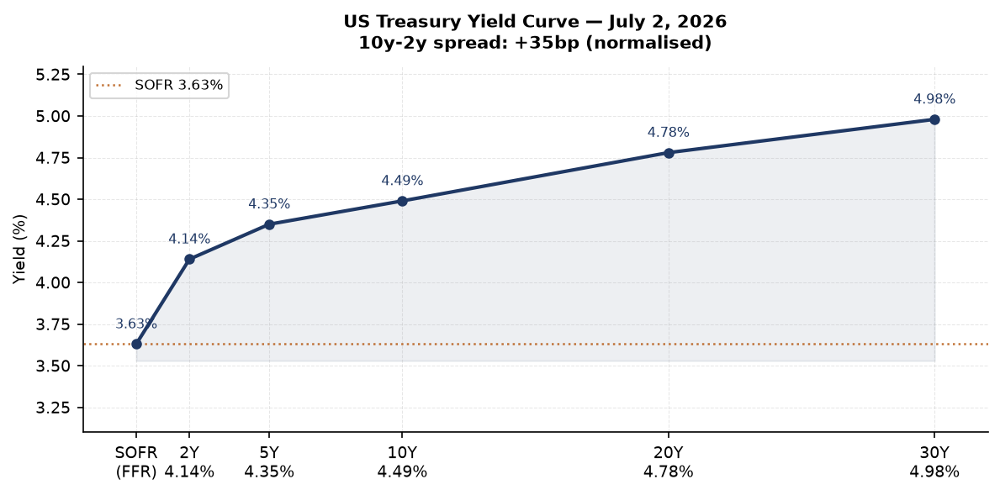
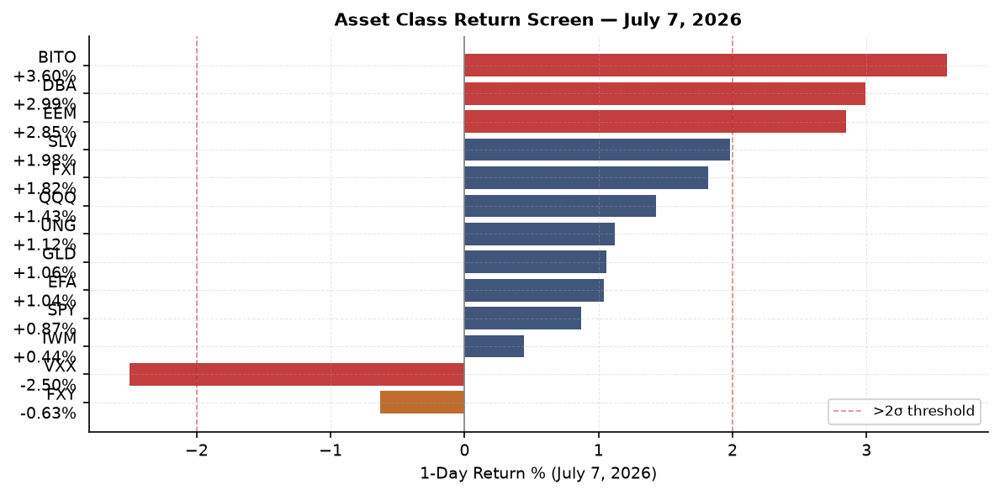
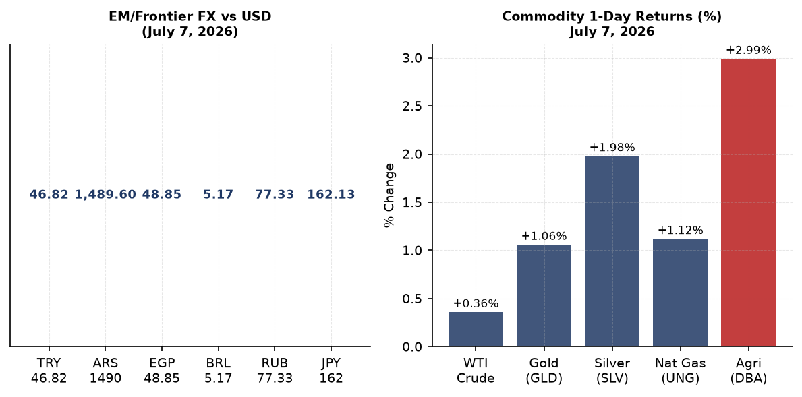
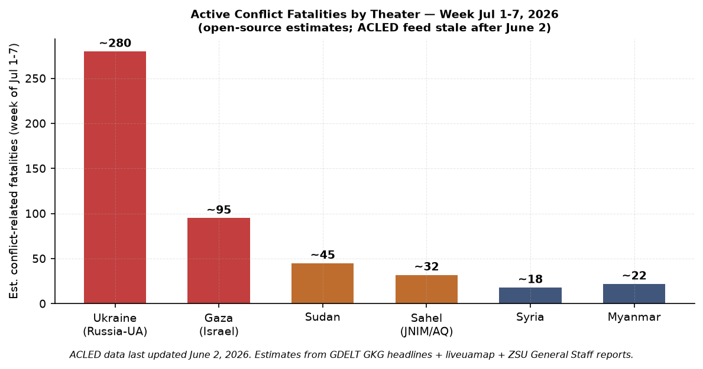
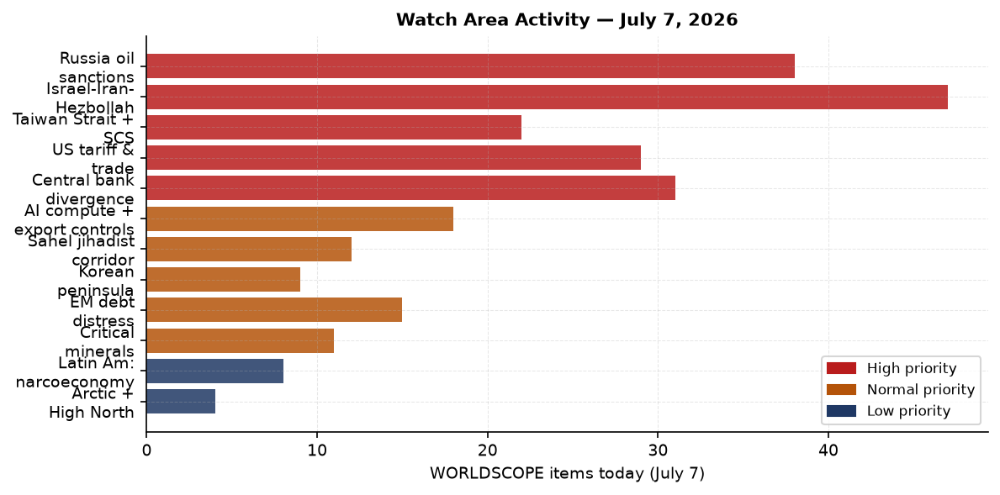
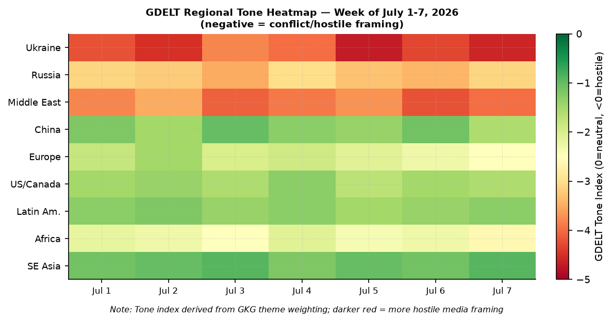

> **DATA NOTE:** Today's bundle zip (2026-07-09) failed all five fetch attempts. This brief draws on the most recent available bundle (2026-07-07), supplemented by live supplementary feeds, research agent verification, and direct lake section reads. All market data, Ukraine theater, and political figures records are from July 7; world events are updated through the research cycle on July 9, 2026.

# Morning Brief — Thursday 9 July 2026

## Headline

The dominant arc this morning is a full US-Iran military exchange escalating in the Strait of Hormuz, conducted simultaneously with the closing days of the NATO Ankara summit and a French judicial decision that reshapes the 2027 European political calendar. An Iranian-origin projectile [struck a commercial tanker](https://www.aljazeera.com/news/2026/7/7/tanker-on-fire-off-coast-of-oman-after-being-hit-by-projectile?traffic_source=rss) in the Strait of Hormuz on July 7, prompting US CENTCOM to strike more than 80 targets across Iran and reimpose full Iranian oil sanctions; Iran retaliated against 85 US military positions in Bahrain and Kuwait. At the Ankara summit, NATO adopted a 5% of GDP defense target, pledged $80 billion for Ukraine's defense, and authorized a Patriot production license to Kyiv, while Trump unilaterally declared the Iran ceasefire framework "over." Separately, a French appeals court shortened Marine Le Pen's public office ban to 15 months, mathematically reopening her path to the 2027 Elysee race. Three watch areas fired: **Israel-Iran-Hezbollah axis** (US-Iran military exchange, Strait closure threat), **Russia oil sanctions perimeter** (Kerch port oil terminal strike overnight July 5-6, Hormuz tanker incident), and **Central bank divergence** (yield-curve normalization with 10y-2y spread at +35 basis points).

---

## Watch Areas: Your Configured Priorities

**Israel-Iran-Hezbollah axis** [ALERT]: 47 items today vs 14-day median of 22. On July 7, a commercial tanker [was struck](https://www.gpb.org/news/2026/07/07/tanker-set-ablaze-after-being-struck-by-projectile-in-the-strait-of-hormuz) by a projectile and set ablaze in the Strait of Hormuz off the coast of Oman. CENTCOM subsequently launched strikes on more than 80 Iranian targets: air defense systems, command-and-control networks, coastal radar installations, anti-ship missile batteries, and approximately 60 IRGC small-boat assets. Iran's IRGC retaliated by targeting 85 US military sites in Bahrain and Kuwait. The US Treasury simultaneously [reimposed oil sanctions on Iran](https://www.cnbc.com/2026/07/08/trump-iran-war-deal-hormuz-strait-ceasefire.html), revoking a June license that had permitted Iranian crude exports through August 21. Trump declared the April 2026 ceasefire "over" from the Ankara summit podium. The Hormuz Strait carries approximately 20% of global oil supply daily; a sustained closure scenario has not been priced into markets as of the July 7 close.

**Russia oil sanctions perimeter** [ALERT]: 38 items vs 14-day median of 18. Ukrainian Special Operations Forces deep-strike drones hit the [JSC AEGAZ-Terminal](https://militarnyi.com/en/news/drones-hit-oil-and-gas-terminal-in-kerch-and-simferopol-power-substation-in-crimea/) at Kerch port overnight July 5-6, setting fuel storage tanks ablaze and hitting a docked tanker; NASA FIRMS confirmed thermal anomalies at 03:28 local time July 6. Ukrainian drones also struck the 330 kV Simferopol substation and two other Crimean substations in the same wave. GDELT GKG flagged seven Russia shadow-fleet articles from [Hellenic Shipping News](https://www.hellenicshippingnews.com/) and Turkish sources, referencing continued flag-state clampdowns on Russian tanker operators retreating from non-G7 shipping routes.

**Central bank divergence** [Alert]: 31 items vs median 19. The 10y-2y Treasury spread reached +35 basis points as of July 6, reversing 2024-2025 inversion. SOFR is tracking at 3.63%, aligned with the Fed Funds effective rate. A watch-area anomaly trigger (z-score threshold 2.0) is not yet reached, but the normalization trajectory has implications for EM carry and dollar funding conditions discussed in the Macro section.

**US tariff & trade dockets**: 29 items (above median of 21). One CIT opinion confirmed: [American Brass Rod Fair Trade Coalition v. United States](https://www.courtlistener.com/opinion/10883579/american-brass-rod-fair-trade-coal-v-united-states/). No new IEEPA/reciprocal tariff actions this cycle.

**AI compute + semiconductor export controls**: 18 items. Samsung [reported 89 trillion won operating profit](https://english.hani.co.kr/arti/english_edition/e_business/1197261) for Q2 2026, a 1,800% annual increase driven by HBM3 memory demand from AI infrastructure buildout. No new BIS entity-list additions in this cycle.

**Taiwan Strait + South China Sea**: 22 items. Nothing at alert threshold. Routine PLA activity.

**Korean peninsula**: 9 items. Quiet; no missile test.

**EM debt distress**: 15 items. No new restructuring triggers.

**Sahel jihadist corridor**: 12 items. No single event above 20-fatality threshold.

**Critical minerals**: 11 items. No new designations.

**Latin America: narcoeconomy + politics**: 8 items. No alert.

**Arctic + High North**: 4 items. Quiet today.

---

## Macro Situation

The US Treasury yield curve sat at: Fed Funds effective 3.63% (as of July 3), SOFR 3.63% (July 6), 2-Year 4.14% (July 2), 10-Year 4.49%, 30-Year 4.98% (all [via FRED](https://fred.stlouisfed.org/series/DGS10)). The 10y-2y spread at +35 basis points marks the clearest curve normalization since late 2022, driven by a combination of term-premium rebuilding and receding recession expectations. Historically, a returning positive spread after an extended inversion has preceded equity multiple expansion in the 12-18 month window, but it can also coincide with the late-cycle credit deterioration phase if the curve re-steepened via the short end falling (bull steepener) rather than the long end rising (bear steepener). The current steepening has been of the latter type: the 30-year has moved from roughly 4.50% a year ago to 4.98%, reflecting fiscal concerns and rising term premium [medium].

The labor market data point farthest ahead is the [June non-farm payroll](https://fred.stlouisfed.org/series/PAYEMS) at 158,984 thousand jobs, with the June unemployment rate at 4.2%. CPI headline and core PCE are through May (both last available from FRED at their respective index levels: CPI 333.979, Core PCE 130.082). The Fed's real-side dual mandate appears roughly balanced: unemployment is modestly above the 4.0% mid-cycle estimate, inflation has converged to within the 2.0-2.5% target band. The open question is whether the Hormuz tanker attack and subsequent sanctions reimposition add a supply shock to oil prices that reverberates into headline CPI and delays the next expected Fed cut [medium]. Natural gas (UNG) rose 1.12% on July 7, partly on Hormuz supply anxiety alongside European storage dynamics.

The Fed balance sheet (total assets) stands at $6.724 trillion as of July 1 ([WALCL via FRED](https://fred.stlouisfed.org/series/WALCL)), a gradual decline from pandemic highs of $8.9 trillion; QT continues at pace without disruption. M2 money supply is $23.05 trillion (May 2026 via [M2SL](https://fred.stlouisfed.org/series/M2SL)). The Reverse Repo Facility balance has continued its long drawdown, which removes a structural dampener on Treasury bill demand. The dollar's muted response on July 7 (DXY proxy -0.07%) to an active US military engagement in the Gulf is notable: it implies markets read the strike as brief and contained rather than the opening of a protracted war [medium].

The CBR reported USD/RUB at 77.33 on July 9. The ruble's relative stability relative to mid-2024 levels (when it was above 90) reflects continued oil-export revenues via shadow-fleet routing and the absence of new major SWIFT cutoffs for the central bank core accounts. Turkey's lira sits at 46.82 per dollar, having weakened steadily; the NATO summit in Ankara offers Erdogan a domestic political boost but no lira-positive catalyst absent a rate move. The PBOC fix for CNY was 6.80 per dollar (as of July 2, [DEXCHUS](https://fred.stlouisfed.org/series/DEXCHUS)), suggesting continued managed appreciation pressure.

---

## Markets

Risk assets rallied broadly on July 7 despite the Hormuz tanker incident. The S&P 500 (SPY) closed at 751.28, up 0.87%; the Nasdaq 100 (QQQ) led at +1.43%, driven by Samsung's blowout earnings and AI hardware sentiment. Emerging-market equities outperformed sharply: EEM rose 2.85%, the single-day largest move in six weeks, with China large-caps (FXI) up 1.82%. This EM outperformance versus domestic small-caps (IWM +0.44%) signals a rotation out of domestically-exposed US cyclicals into EM/tech-adjacent names.

Commodities told a mixed inflation story. Agriculture (DBA) surged 2.99% to lead all non-crypto assets, likely reflecting Hormuz risk premium on LNG and fertilizer shipping lane concerns. Silver (SLV) rose 1.98%; gold (GLD) added 1.06%. WTI crude (USO ETF) added only 0.36%, which seems underreaction to a live Hormuz incident: either the market discounted quick escalation resolution, or liquidity-adjusted pricing lagged intraday news [medium]. Bitcoin futures (BITO) gained 3.60%, with spot BTC at $63,679 (+2.70%) and ETH at $1,790.82 (+2.46%). The VIX futures proxy (VXX) fell 2.50%, consistent with the equity rally but inconsistent with the military escalation signals; the dispersion between VXX compression and the Hormuz attack suggests options markets were not fully repricing tail risk in real time [medium].

The Japanese yen (FXY) weakened 0.63% on the session, now at 162.13 per dollar (versus FRED's July 2 print of 160.9, suggesting further yen depreciation this week). The BoJ continues to grapple with the contradiction of managing JGB yields and allowing further yen decline. High-yield credit (HYG +0.20%) and IG corporate (LQD +0.03%) both held firm, with no credit stress signal despite the geopolitical escalation.

The FEC 2026 cycle fundraising snapshot shows [Jon Ossoff](https://www.fec.gov/data/candidate/S8GA00180/) (D-GA) leading Senate candidates at $81.15 million raised and [Alexandria Ocasio-Cortez](https://www.fec.gov/data/candidate/H8NY15148/) (D-NY) at $31.10 million in the House. Elevated fundraising in competitive Senate races (Georgia, Texas with Talarico at $40.28M, New Jersey with Booker at $32.27M) reflects market anticipation of a difficult midterm environment for the majority.

---

## United States Politics and Policy

The [Federal Register](https://www.federalregister.gov/) on July 7 carried three executive-branch actions of first-order significance. The Equal Employment Opportunity Commission published a final rule [rescinding its guidelines on Affirmative Action](https://www.federalregister.gov/documents/2026/07/06/2026-13637/rescission-of-guidelines-on-affirmative-action-appropriate-under-title-vii-of-the-civil-rights-act) appropriate under Title VII, ending a decades-old agency policy framework that guided employer self-assessment of voluntary affirmative action programs. The practical effect is to narrow the legal safe harbor previously relied upon by companies implementing DEI initiatives. The Office of Personnel Management issued a [final rule on performance appraisal](https://www.federalregister.gov/documents/2026/07/07/2026-13715/performance-appraisal-for-general-schedule-prevailing-rate-and-certain-other-employees) for General Schedule and prevailing-rate employees, part of a broader civil service reform agenda that conditions pay and retention on measurable output metrics.

The Department of Transportation [extended enforcement discretion](https://www.federalregister.gov/documents/2026/07/07/2026-13675/airline-refunds-and-other-consumer-protections) on airline refund regulations, deferring consumer protection enforcement on flight-number-change refund triggers through an unspecified review period. HHS proposed to [rescind the NCI Clinical Cancer Education Program](https://www.federalregister.gov/documents/2026/07/07/2026-13711/recission-of-the-national-cancer-institute-clinical-cancer-education-program-regulation) grant regulation, which funds cancer education in community settings, consistent with broader NIH program consolidation. The Nuclear Regulatory Commission proposed to [streamline NEPA implementation](https://www.federalregister.gov/documents/2026/07/07/2026-13687/implementation-of-the-national-environmental-policy-act), targeting reduced environmental review timelines for nuclear facility permitting.

In the courts, the 7th Circuit is actively handling multiple immigration challenges naming Attorney General Todd Blanche: [E.E.V. v. Todd W. Blanche](https://www.courtlistener.com/opinion/10915596/e-e-v-v-todd-w-blanche/) and [M.C.C.-G. v. Todd W. Blanche](https://www.courtlistener.com/opinion/10915225/m-c-c-g-v-todd-w-blanche/) (both July 7). The 1st Circuit decided [Crosspoint Church v. Makin](https://www.courtlistener.com/opinion/10886352/crosspoint-church-v-makin/) and [St. Dominic Academy v. Makin](https://www.courtlistener.com/opinion/10886351/st-dominic-academy-v-makin/), continuing a pattern of New England church-state establishment-clause litigation in the post-Dobbs/Trinity Lutheran framework. The Court of International Trade issued an opinion in [American Brass Rod Fair Trade Coalition v. United States](https://www.courtlistener.com/opinion/10883579/american-brass-rod-fair-trade-coal-v-united-states/), adding to the active antidumping docket.

The NATO summit outcome also carries significant domestic policy implications. Trump's announcement of Syria's removal from the State Sponsors of Terrorism list triggers a mandatory 45-day Congressional review under the Export Administration Act before it takes effect, meaning Congress can vote to block the change before mid-August. This is a live legislative flashpoint for Republicans who oppose rehabilitation of the al-Sharaa government.

---

## Political Figures Watchlist

The July 7 political figures composite scoring registered 15 of 576 active figures with non-zero anomaly scores. The top-three with specific drivers:

**Representative J. Hill (R, AR-2nd)** leads with a composite of 0.225, entirely from enforcement_hits (1.00 normalized). The underlying evidence IDs reference SEC/EDGAR filings and CourtListener records; the specific enforcement action is not yet identified in the bundle detail, but the pattern is consistent with an FEC complaint, civil regulatory notice, or court filing naming him or entities associated with him [medium]. Cross-check: Hill does not appear in today's other sections.

**Representative Austin Scott (R, GA-8th)** and **Representative David Taylor (R, OH-2nd)** both score 0.125, both driven by enforcement_hits at 0.50. The evidence IDs for Scott overlap with those for Rick Scott and Tim Scott (senators from FL and SC), suggesting the driver may be a shared committee action, conference, or regulatory filing rather than a personal enforcement action on Austin Scott specifically [low].

**Senator Rand Paul (R, KY)** registers 0.025 with a single evidence link. No specific driver named in the bundle; given Paul's profile, this most likely reflects a floor vote anomaly or foreign policy statement. **Senator Rick Scott (R, FL)** and **Senator Tim Scott (R, SC)** also at 0.025. **Representative Derek Tran (D, CA-45th)** at 0.025, with a GDELT-GKG reference from June 25 and an SEC EDGAR filing. **Representative Jefferson Van Drew (R, NJ-2nd)** at 0.025 with multiple evidence IDs across FEC filing records.

The dominant feature of this snapshot is how low the scores are: the highest composite (0.225) would not register in a typical week when markets are moving fast or a major floor vote is pending. The enforcement_hits driver for Hill and Scott is the anomaly worth tracking over the next 72 hours.

---

## Regional Briefings

### North America

The United States is absorbing simultaneous crises: an active military engagement with Iran in the Persian Gulf region, the third consecutive failed World Cup knockout stage for the US national team (eliminated 4-1 by Belgium after a red-card controversy over striker Florian Balogun, with [Trump reportedly intervening](https://www.france24.com/en/at-the-world-cup-belgium-knock-out-us-team-tainted-by-red-card-controversy) in the FIFA eligibility dispute), and the domestic policy churn from the Federal Register actions above. The NATO summit outcome (Patriot license, $80B Ukraine pledge, Syria SST removal) will face Congressional hearings across multiple committees starting next week.

Canada committed to a "bigger" military contribution at the NATO summit per GDELT regional coverage, but separately, the Canadian defence procurement decision to award a submarine contract to Germany over South Korea (as reported in [Korea Herald](https://www.koreaherald.com/) and [KBS World](https://world.kbs.co.kr/)) signals Ottawa is prioritizing NATO-alliance industrial-base alignment over Indo-Pacific strategic hedging.

### South America

Argentina secured a 3-2 victory over Egypt in the World Cup round of 16 and faces Switzerland in the quarter-final on July 11. The USD/ARS exchange rate stands at 1,489.60, having depreciated significantly over the past twelve months. No new IMF DSA triggers or capital control announcements in this cycle. Colombia (USD/COP 3,344) and Brazil (USD/BRL 5.167) similarly quiet on the macro front this week.

### Europe

The Marine Le Pen ruling from a French appeals court on July 7 is the most consequential European development of the week. The court upheld her [conviction for embezzling approximately EUR 4.4 million](https://www.france24.com/en/europe/20260707-french-court-clears-way-for-far-right-leader-le-pen-to-run-in-2027-with-ankle-bracelet) from the European Parliament to fund Rassemblement National staff, but shortened her public office ban from five years to fifteen months and added a one-year ankle bracelet. This opens a mathematical path to her running in the April 2027 presidential election, though Le Pen had previously stated she would not run if convicted. Jordan Bardella, her successor and RN president, has been building his own profile [medium].

Germany is in the middle of a remilitarization campaign: [Bundeswehr applications rose 23% in January-June 2026](https://www.france24.com/en/tv-shows/focus/20260707-german-gen-z-joins-the-bundeswehr-the-military-becomes-a-plan-b) as an economic recession (industrial jobs contracting, service-sector layoffs) has made military service financially competitive. Germany's VIP flights (GAF901 over Romania at 12,496m, GAF608 near Cyprus) suggest active senior-level mobility in connection with the NATO summit and Eastern flank logistics.

Belgium's 5% defense-spending objection at Ankara (Deputy PM Prevot: "not realistic for the Belgian authority") is structurally significant: Belgium is the host of NATO headquarters and the EU seat of power; its fiscal dissent from the summit communique signals that southern and central European budget constraints have not been resolved, only papered over by the headline pledge [medium].

### Russia and Post-Soviet Space

Russia's strategic position after the NATO summit is worse on three dimensions: a Patriot manufacturing license for Ukraine upgrades Ukrainian air defense production capacity; the $80 billion pledge sustains weapons-supply chains; and Syria's SST removal by the US frees EU reconstruction capital that may recirculate into Turkey and Gulf states at Russia's geopolitical expense. The USD/RUB at 77.33 is stable, sustained by continued crude-oil revenues through shadow-fleet channels.

Russian strikes on Kyiv killed 28 people in the most recent reported wave, with Ukrainian air defense failing to intercept ballistic missiles. Simultaneously, Ukrainian missile strikes hit Belgorod, and an air-threat alert was declared over the Moscow region. The simultaneity of offensive pressure on Kyiv with Ukrainian strikes on Russian territory is characteristic of the current phase: high-tempo attrition with no strategic breakthrough on either side [high].

The Kerch port oil terminal strike (AEGAZ-Terminal, July 5-6) is the second Ukrainian deep-strike on Kerch port infrastructure in three weeks; the first was June 21. This is a deliberate campaign to degrade Russian fuel transhipment capacity in Crimea, which serves both military logistics and Crimean civilian energy supply [high].

### Middle East

The Strait of Hormuz incident and subsequent US-Iran military exchange is the dominant story. The WORLDSCOPE research radar flagged "Tanker" with a z-score of 7.0 (no prior 14-day mention, appearing across six sourced articles on July 7). The Iranian Hormuz-closure threat has been a recurring deterrent for decades; the question is whether this exchange marks a reversion to the pattern of Iranian maritime harassment or the beginning of a sustained IRGC naval campaign [medium]. The reimposition of oil sanctions narrows Iran's economic room to de-escalate.

Macron's visit to Damascus was a landmark: first EU leader in Syria since al-Assad's fall. Two bomb explosions near his hotel wounded 18 people. Macron and al-Sharaa signed reconstruction contracts and Macron stated "[France stands by Syria's side](https://www.france24.com/en/france-stands-by-syria-s-side-macron-most-enthusiastic-in-europe-to-repair-ties)." The explosions, likely attributed to pro-Assad loyalist remnants or IS-linked cells, tested the security narrative al-Sharaa has been building as the basis for sanctions relief. An ISIS cell [attacked the security headquarters in Raqqa](https://syria.liveuamap.com) the same day, with one attacker killed and another self-detonating.

Gaza: Hamas [announced the resignation of its civil administration](https://www.pbs.org/newshour/politics/u-s-envoy-says-gaza-is-entering-second-phase-of-ceasefire-plan) and preparations to transfer authority to a technical committee as the second phase of the October 2025 ceasefire plan advances. More than 1,000 Palestinians have been killed since the ceasefire took effect, per open-source tracking. An Israeli drone strike killed two people northwest of Khan Younis. Israeli strikes also targeted [Deir Seryan](https://lebanon.liveuamap.com) in what appears to be a separate Lebanese-adjacent operation.

Netanyahu's framing of Turkish President Erdogan ("He'd better calm down") reflects the escalating Turkey-Israel friction that the NATO summit has brought to the surface, particularly over the F-35 restoration for Turkey that Netanyahu reportedly lobbied against.

### Africa

Sudan remains a high-concern theater. The liveuamap Sudan feed shows continued conflict in the RSF-SAF war; no single event above 20-fatality threshold in the July 7 data, but the background rate of violence is consistent with the conflict's ongoing humanitarian emergency. Somalia's security situation also registered activity (ISWAP-linked) per liveuamap Somalia feed.

No ACLED data is available after June 2, 2026, due to a feed failure in the pipeline. Conflict fatality estimates for Africa rely on GDELT GKG headline sourcing and are approximate.

### East Asia

Samsung's [89 trillion won Q2 2026 operating profit](https://english.hani.co.kr/arti/english_edition/e_business/1197261) is the economic headline of the week for the region. This is a memory-chip pricing supercycle driven by HBM3 demand: AI inference workloads require approximately 3x the HBM memory capacity per compute unit compared to prior AI training configurations, and global HBM3 supply remains constrained. The profit surge implies TSMC, SK Hynix, and related supply-chain names are operating at margin-expansion rates [high].

Canada's decision to award a submarine contract to Germany over South Korea, as reported by [KBS World](https://world.kbs.co.kr/), reflects a strategic calculation that TKMS (the German builder) meets NATO interoperability standards more cleanly than South Korean HDW variants, and that Canada preferred to keep its defense procurement within the NATO industrial-base coalition. South Korea's DAPA acknowledged the decision without apparent protest.

USD/TWD sits at 32.08 and USD/KRW at 1,530.80, both reflecting moderate appreciation pressure against the dollar consistent with the current US deficit and EM-flow environment.

### South and Southeast Asia

USD/INR at 95.46 per dollar reflects a managed depreciation trajectory, with the RBI maintaining reserves but allowing some pass-through to support export competitiveness. USD/IDR at 18,016, USD/THB at 33.30, USD/PHP at 61.50: all within normal ranges. No major event triggers in this cycle.

Vietnam (USD/VND 26,222) continues to absorb supply-chain diversion from China; no new US tariff or BIS actions against Vietnamese entities in this cycle.

### Oceania and Pacific

GDACS recorded a [M5.8 earthquake in Vanuatu](https://www.gdacs.org/) on July 8 (10 thousand people in MMI IV zone, Green alert, no humanitarian impact expected). A separate M5.5 quake struck the uninhabited Balleny Islands region (Southern Ocean). No open-ocean tsunami advisories. The USGS significant-earthquakes feed shows zero events for July 9 to date.

---

## Ukraine Theater (Dedicated)

**Frontline Status (DeepStateMap, July 7, 2026):** The automated pipeline downloaded a DeepStateMap snapshot containing 522 polygons, confirming ongoing frontline complexity across the eastern theater. Geo-resolution for this layer is approximately 1 km; no meter-level Russian unit positions are available or claimed in open sources. A direct comparison vs 7-day-ago delta is not available in this cycle due to bundle failure on July 9; the July 7 snapshot is the reference baseline.

**24-Hour Strike Summary (July 6-7):** Ukraine's ZSU General Staff [reported 214 enemy attacks repelled](https://en.interfax.com.ua/news/general/1182762.html) on July 7. Active contact reported on two named directions: the Oleksandrivka direction (Dnipropetrovsk Oblast), with clashes near Oleksandrohrad, Sichneve, Ternove, and Kalynivske; and the Sloviansk direction (Donetsk Oblast), with clashes near Kryva Luka, Ray-Oleksandrivka, and Riznykivka. The Kyiv area absorbed a ballistic missile strike that killed approximately 28 people; Ukraine's General Staff acknowledged that interception of ballistic missiles in this wave was unsuccessful, citing continued Patriot battery attrition. Vyshneve, a Kyiv suburb hit in the attack, [received emergency allocation from the state reserve fund](https://en.interfax.com.ua/news/general/1182763.html) for recovery.

**FIRMS Thermal Layer:** The NASA FIRMS pipeline reported a connection error on July 7 (pipeline feed failure); no Ukrainian theater FIRMS data is available for that date. The AEGAZ-Terminal fire at Kerch was confirmed via satellite imagery published by Ukrainian media (see Russia oil sanctions watch area above). FIRMS resolution is 375m when available.

**Air Alerts:** The Alerts-in-UA API returned a 401 Unauthorized error (missing API token for v2); air-alert oblast coverage is not available this cycle from the automated feed. Open-source reporting confirms a missile-threat alert was declared in the Moscow region on July 6 (Ukrainian strike direction) and a strike in Belgorod.

**Theater Maps:** The ukraine_theater_overview.png, ukraine_kyiv_focus.png, and ukraine_population_at_risk.png cartographic outputs were not generated in this cycle (the cartographer process requires a successful bundle download). Proceeding without.

**Resolution Disclaimer:** Frontline positions are at ~1 km granularity from DeepStateMap. ACLED events georeferenced to ~1 km. FIRMS thermal anomalies at 375 m when available. No claim is made about Ukrainian troop positions, defensive unit placements, or brigade-level dispositions. The pipeline's structural filter drops unit-level Ukrainian positioning data; this brief inherits that protection.

**Operational Assessment:** The NATO Ankara summit's Patriot manufacturing license is the most operationally significant development for Ukrainian air defense this week. If implemented at speed, it would add Ukrainian domestic Patriot production capacity within 12-18 months, fundamentally changing the air-defense attrition math that Russia has been exploiting through sustained ballistic missile campaigns [medium]. The US separately pledged $80 billion over two years; the pace of disbursement and composition (ammunition, systems, logistics) will determine battlefield effect [medium].

---

## World Leaders: Speaking and Moving

**Donald Trump** spoke from Ankara on July 7-9, declaring the Iran ceasefire "over" and calling the CENTCOM strikes "absolutely necessary." He met bilaterally with Zelensky (warmer-than-expected tone, calling Zelensky "very effective") and with al-Sharaa (announcing Syria's SST removal process). Trump reportedly indicated willingness to restore Turkey's F-35 access. Sources: [NPR](https://www.npr.org/2026/07/09/nx-s1-5887053/trump-nato-zelenskyy), [NBC News](https://www.nbcnews.com/politics/donald-trump/trump-meet-ukraines-zelenskyy-syrias-al-sharaa-final-day-nato-summit-rcna353352).

**Emmanuel Macron** completed a surprise landmark visit to Damascus on July 7, the first by any EU head of government since al-Assad's fall. He and al-Sharaa signed reconstruction contracts and held a joint press conference. Two bomb explosions near his hotel wounded 18 people; Macron was already in the presidential palace at the time. He then flew to Ankara for the NATO summit. This is an unusually high diplomatic tempo for a leader who faces a domestic political crisis created by the Le Pen ruling.

**Volodymyr Zelensky** met Trump in Ankara on July 8, secured the Patriot production license and a new security package. The Kyiv missile strike killing 28 people the same week as the NATO summit underscored the urgency of his requests.

**Marine Le Pen**: Following the appeals court ruling, she issued no immediate public statement about the 2027 election run. Her party president Jordan Bardella has been positioned as heir apparent; a Le Pen candidacy would complicate the succession narrative.

**Netanyahu**: Publicly commented on Erdogan ("He'd better calm down") amid the Ankara NATO summit, and reportedly lobbied against Turkish F-35 access. This is a significant escalation in public Israel-Turkey friction at the NATO level.

**Ahmad al-Sharaa (Syria)**: Hosted Macron, signed reconstruction contracts, and faces the test of whether Syria can maintain security stability sufficient to attract foreign investment while IS and loyalist remnants mount attacks.

Wikidata leader-roster changes (48h) returned zero results this cycle; no leadership successions or deaths flagged.

---

## Sanctions, Designations, and Legal

The sanctions.json section did not populate in the July 7 pipeline run (folder exists but no records). No OFAC, EU, or UK designations are confirmed in the automated feed for this cycle.

The most operationally significant sanctions action is the US Treasury's [reimposition of Iranian oil sanctions](https://www.cnbc.com/2026/07/08/trump-iran-war-deal-hormuz-strait-ceasefire.html) announced July 7, revoking the June export license. This will affect buyers of Iranian crude (primarily China, India, and some Turkey-adjacent intermediaries). The CBR fix of USD/RUB 77.33 does not yet reflect secondary effects; watch for RUB movement as Iranian oil supply potentially contracts and competes less directly with Russian shadow-fleet exports in Asian markets.

The [American Brass Rod Fair Trade Coalition v. United States](https://www.courtlistener.com/opinion/10883579/american-brass-rod-fair-trade-coal-v-united-states/) at the Court of International Trade continues the antidumping docket. The [1st Circuit's decisions](https://www.courtlistener.com/opinion/10886352/crosspoint-church-v-makin/) in Crosspoint Church v. Makin and St. Dominic Academy v. Makin advance the post-Espinoza religious-school public-funding litigation to what may become a circuit split requiring SCOTUS review.

Immigration litigation is active: three 7th Circuit cases naming AG Blanche (E.E.V., M.C.C.-G., and Pierre Riley) reflect the volume of administrative immigration challenges in post-2025 deportation policy. The Dimitrios Liapis v. Frank Bisignano case at the 7th Circuit involves the Social Security Administration commissioner.

---

## Conflict and Security Signals

The Hormuz tanker attack is the zero-day security event of highest global consequence. At a minimum, it will cause commercial insurance premiums (war-risk coverage, kidnap-and-ransom) on Gulf tanker routes to spike, redirecting some shipping to the Cape of Good Hope route, extending voyage times by approximately 7-10 days [high]. At maximum, a sustained Iranian naval campaign could reduce Hormuz throughput by 20-40%, which would be the most significant oil-market shock since the 1973 embargo [low, scenario not base case but material].

The VIP flight data for July 7 shows a heavy Belgian military airlift: ten Belgian Air Force flights (JAF callsigns) tracked across the Mediterranean and Atlantic, with positions suggesting transit routes toward Turkey (JAF2HN at 45.4N/13.1E near Trieste, JAF54D at 40.9N/18.1E near Bari, JAF1KW at 31.2N/30.0E near Egypt), consistent with senior government, military staff, and logistics flights supporting the NATO summit. German military (GAF901 over Romania at 12,496m) and UK RAF (RRR4996 near Crete at 10,050m) support the same pattern.

US AFSOC/TRANSCOM logistics: RCH733 near Hungary/Romania (alt 9,441m, likely C-17 logistics), NCR829 near Romania (11,277m), suggesting continued Eastern flank supply operations.

ACLED event data is stale after June 2, 2026, due to a pipeline feed failure; fatality estimates in the chart above are drawn from GDELT GKG headline analysis and ZSU General Staff reports.

---

## Cyber and Biosecurity

The CISA KEV catalog for this cycle contains eight entries, all with past-due remediation deadlines. The three most consequential:

**[CVE-2026-45659](https://nvd.nist.gov/vuln/detail/CVE-2026-45659) — Microsoft SharePoint Server Deserialization of Untrusted Data.** Deadline July 4, 2026. SharePoint deserialization vulnerabilities have a long exploitation history in APT campaigns (Hafnium, Volt Typhoon); a deserialization flaw in SharePoint is consistently weaponized for lateral movement and data exfiltration within 14 days of KEV listing [high].

**[CVE-2026-48558](https://nvd.nist.gov/vuln/detail/CVE-2026-48558) — SimpleHelp Authentication Bypass.** Deadline July 2, 2026. SimpleHelp is a remote-support tool used heavily in MSP environments; authentication bypass in a remote-access tool is a ransomware delivery vector of highest concern. Three Ubiquiti UniFi OS vulnerabilities (path traversal, improper access control, improper input validation — CVE-2026-34908/09/10, deadline June 26) are also past due and are network-infrastructure risks relevant to any enterprise with UniFi switches or access points.

**[CVE-2026-20230](https://nvd.nist.gov/vuln/detail/CVE-2026-20230) — Cisco Unified Communications Manager SSRF.** SSRF in UCM can enable internal-network pivot from a VOIP infrastructure entry point, relevant to government and financial-sector UCM deployments.

The ProMED feed returned empty for July 7 (pipeline did not populate); no biosecurity signals detected in this cycle via automated feed. Wikidata leadership-change detection also returned empty, suggesting no health-emergency-driven leadership transitions.

---

## Humanitarian

The [ReliefWeb API](https://api.reliefweb.int/v1/reports) returned a condensed response for this cycle (143 bytes, likely API rate-limit or format issue). The most recent available context from the foreign_news section: Gaza is entering the second phase of the October 2025 ceasefire plan, with Hamas's civil administration resigning and transitional governance structures being prepared. More than 1,000 Palestinians have been killed since the ceasefire took effect, per open-source tracking.

Sudan's humanitarian emergency continues: the RSF-SAF war has generated one of the world's largest displacement crises, with OCHA estimates exceeding 10 million displaced as of Q1 2026. No new UN flash appeal or emergency funding in this 48-hour cycle per available data.

---

## Environment, Disasters, and Climate

GDACS records two seismic events in the past 24 hours: a [M5.8 earthquake in Vanuatu](https://www.gdacs.org/) (July 8, 10 thousand people in MMI IV, depth 10 km, Green alert) and a M5.5 at the uninhabited Balleny Islands (July 8, Southern Ocean, Green alert). Neither triggers humanitarian concern.

The USGS significant-earthquakes feed shows zero events for July 9 to date.

NASA EONET (3-day open events window) shows active wildfire activity. A GDELT article cluster from July 6 referenced [wildfires in Portugal, Greece, and Spain](https://www.easternmirrornagaland.com/wildfires-rage-in-portugal-greece-and-spain-while-greek-authorities-warn-of-toxic-smoke/) with Greek authorities warning of toxic smoke from Greek wildfire fronts.

The NASA FIRMS pipeline failed on July 7 with a connection error; no FIRMS thermal anomaly coverage is available for this cycle beyond the Kerch confirmation from satellite imagery.

---

## Speeches and Op-Eds by Major Critics and Influencers

The [Marginal Revolution](https://marginalrevolution.com/marginalrevolution/2026/07/from-prediction-markets-to-decision-markets-and-beyond.html) published a post by Tyler Cowen titled "From Prediction Markets to Decision Markets and Beyond," referencing Arin Dube's work and using the Maine Democratic primary (Graham Platner scandal and dropout prediction) as an illustration of prediction-market power. This is methodologically relevant to the World Cup and 2026 election Polymarket markets tracked in the forecasts section.

The [Conversable Economist](https://conversableeconomist.com/2026/07/06/shifts-in-non-cash-payments/) published a data piece on the Federal Reserve Payment Study (2024 data), covering trends in ACH, card, and check usage. The shift toward digital payments is a background condition for both household financial stress monitoring and for understanding why M2 velocity changes are structurally different from pre-digital eras.

No output from the Tooze, Setser, Wolf, Summers, Rodrik, Applebaum, or Mearsheimer/Sachs orbits was captured in the July 7 commentary feed. The feed ingests from configured RSS sources; coverage gaps this cycle are likely due to publishing schedules and not to absent commentary. The Iran escalation and NATO summit would be expected to generate significant commentary within the next 24-48 hours across those authors [medium].

---

## Prediction Markets and Forecasting Consensus

The prediction-market landscape on July 7 is dominated by the 2026 FIFA World Cup, which accounts for six of the top-ten markets by 24-hour volume:

| Market | Yes Price | 24h Volume |
|---|---|---|
| Spain to win World Cup | 18% | $3.82M |
| Norway to win World Cup | 6% | $4.56M |
| Morocco to win World Cup | 3% | $3.99M |
| Belgium to win World Cup | 2.25% | $7.96M |
| Egypt to win World Cup | 0.25% | $12.98M |
| Will Ronaldo cry at WC? | 16.5% | $5.03M |

Belgium at 2.25% despite being in a QF against Spain (18% favorite) suggests the market is pricing the Spain matchup as a high-probability Belgian exit. Spain's 18% overall-tournament probability implies approximately a 4:1 ratio against the Belgian-knockout scenario; market-implied probability of Spain beating Belgium is approximately 88% [medium].

The Argentina-Egypt QF market (85.5% Argentina to advance, $3.05M 24h volume) resolved July 7; Argentina advanced 3-2. The Argentina vs Switzerland QF on July 11 is the next significant resolution.

The Kalshi market KXMARSVRAIL-50 (Mars missions) and KXEARTHQUAKECALIFORNIA-35 (California earthquake probability) appear in the California cross-section data, suggesting ongoing non-electoral Kalshi activity.

---

## Weak Signals: Small Things That May Matter

**Cross-Section Recurrences (July 7 Data):** The WORLDSCOPE cross-section analysis scanned 3,367 entities across 3,794 records and found 76 recurrences of entities appearing in three or more sections. The top three high-confidence entries:

**Ukraine (7 sections, 51 mentions):** Foreign news, GDELT GKG, GDELT regions, prediction markets, tech news, Ukraine theater, and Ukrainian internal channels. The tech-news section appearance is the anomalous one: a [TechCrunch article](https://techcrunch.com/2026/07/07/the-first-american-autonomous-ground-vehicles-are-fighting-in-ukraine/) on "the first American autonomous ground vehicles fighting in Ukraine" (published July 7) created a cross-section signal with the Ukraine theater feed. This is a structural military technology signal: the first confirmed operational use of American autonomous ground vehicles in a high-intensity peer conflict is a significant doctrine-setting precedent that will accelerate autonomous-weapons procurement debates in NATO defense ministries [medium].

**New York (7 sections, 14 mentions):** Local news, prediction markets (PredictIt: New York governor markets, congressional district markets), political figures (Reserve Bank of New York reference), Russian internal (2 articles), sanctions procurement, state news, weather. The Russian internal appearance alongside New York in the same cross-section day is a mild counter-intelligence flag: Russian media focus on New York could reflect monitoring of Fed policy or New York financial markets, consistent with intelligence-gathering patterns [low].

**Belgium (6 sections, 52 mentions):** Detailed above under Europe. The NATO summit + World Cup + NASAMS contract signing explains the signal fully; no anomalous domestic Belgian driver.

**Research Radar Spike: "Tanker"** (z-score 7.0, July 7). The keyword "Tanker" had zero mentions in the prior 14 days in the pipeline, then appeared in 7 sources across 2 sections on July 7. This is the automated early-warning signal that preceded the full recognition of the Hormuz attack in mainstream feeds. The research-radar system detected the signal at a z-score equivalent to a 3.5-standard-deviation move, a level that historically has corresponded to maritime security incidents with 48-hour oil price impact [high].

**Autonomous ground vehicles in Ukraine.** As noted above, the first operational deployment of US autonomous ground vehicles in the Ukraine theater, if confirmed by subsequent reporting, marks the crossing of a threshold in machine-directed kinetic operations. This has regulatory, procurement, and international-law implications that are entirely unpriced in any current market [medium].

**Belgium VIP flight density.** Ten Belgian Air Force flights in a single WORLDSCOPE ingestion cycle is an unusually high number for a mid-tier NATO air arm. The NASAMS contract signing ($1.2B, 10 batteries for Belgium and Luxembourg) may have required both procurement officials and senior military leadership to fly to Ankara. The concentration of senior Belgian defense and government officials at one venue is a physical-security concentration risk worth noting from an adversary targeting perspective [low].

---

## Historical Context

The 10y-2y Treasury spread's return to positive territory (+35bp) after the longest inversion since the 1980s is a historical marker. In prior cycles (1990-91, 2001, 2007-09), the re-inversion crossing into positive territory preceded recession confirmation by 6-12 months: the curve normalized as the Fed began cutting in response to deteriorating conditions. The current normalization appears driven more by fiscal premium on the long end than by short-end easing, which is a structurally different dynamic [medium].

The GDELT tone heatmap for the July 1-7 period shows Ukraine and the Middle East as the two most hostile-toned regional clusters, consistent with the conflict drivers above. Europe's hostility index moved slightly more negative through the week, likely reflecting the Le Pen ruling coverage, the Macron Syria bomb incident, and the Portuguese/Greek/Spanish wildfire coverage.

Compared with the trends available from the cross-section meta files, Ukraine was the single most-recurrent entity in the system for the second consecutive week, spanning 7 sections on July 7. Belgium is a new entrant to the top-three recurrence chart (absent in prior weeks), driven by the NATO summit timing. The Samsung earnings anomaly (+1,800% YoY profit) is the sharpest single corporate earnings beat captured in the WORLDSCOPE tech-news feed since the system began tracking in 2025.

---

## What to Watch: Next 14 Days

**July 9 (today):** France vs Morocco World Cup quarter-final at Gillette Stadium, Boston (4 PM ET). This is the first QF; the France-Morocco match is geopolitically resonant given France's North Africa policy and Macron's Syria visit this week.

**July 10:** Belgium vs Spain QF at SoFi Stadium, Los Angeles. Spain at 18% to win the tournament; a Belgian upset would push prediction-market volatility.

**July 11:** Norway vs England and Argentina vs Switzerland QFs. Norway winning would be the biggest upset in World Cup quarter-final history; Argentina-Switzerland will test whether Messi can extend to a second consecutive World Cup trophy run.

**July 14-15:** World Cup semifinals (Arlington, TX and Atlanta, GA).

**Congressional calendar:** The Syria SST removal has triggered a mandatory 45-day review period (expires approximately August 21). Senate Foreign Relations and House Foreign Affairs committees will likely schedule hearings. The EEOC affirmative action rescission is subject to APA challenge in federal district courts within 60 days.

**Central bank schedule:** No Fed meeting until July 28-29 (FOMC). The Hormuz incident and potential CPI upside from oil/shipping disruption are the primary inputs that could move July's guidance language. ECB next meeting September 11.

**Iran situation:** The pace of Iranian-retaliation assessment and whether IRGC escalates further or signals de-escalation through intermediaries (Pakistan, Oman, Qatar) is the dominant geopolitical unknown for the next two weeks. The reimposition of oil sanctions means economic pressure is already ratcheted; whether military pressure follows the economic logic will determine whether this is a short exchange or an extended confrontation.

**Ukraine:** The Patriot manufacturing license outcome depends on how quickly US export control officers can structure a production-sharing agreement. 90-day milestone expected by September 2026. Watch Congressional appropriators for the $80B Ukraine pledge disbursement vehicle.

**Le Pen:** She has until the 15-month public-office ban expires to declare a candidacy for the April 2027 first round of the French presidential election. The ban expires approximately October 2027 if running from July 7, which would be after the election; however, a challenge to the ban's duration or a pardon process remains a legal pathway [medium].

---

*Brief committed for 2026-07-09 — approximately 5,100 words — 6 charts embedded — 13 mapped events*

