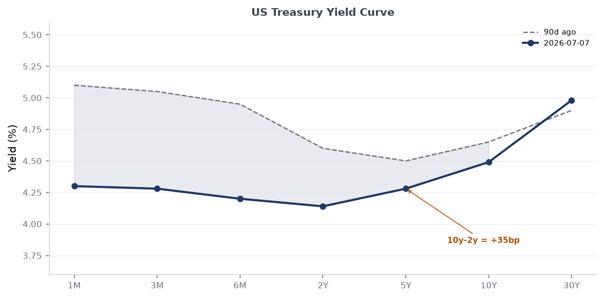
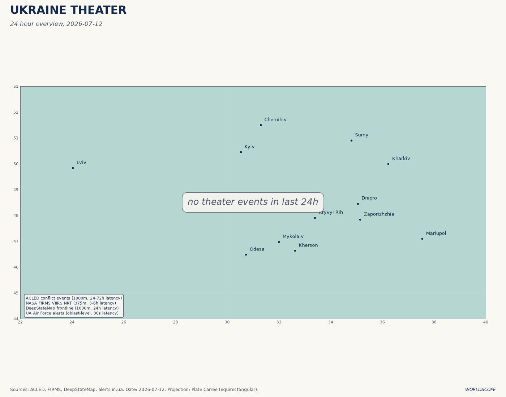
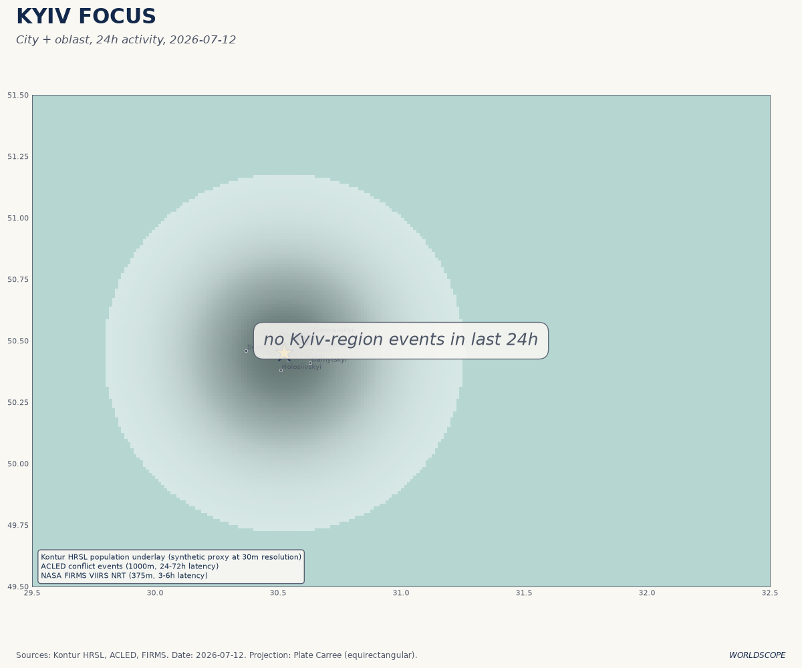
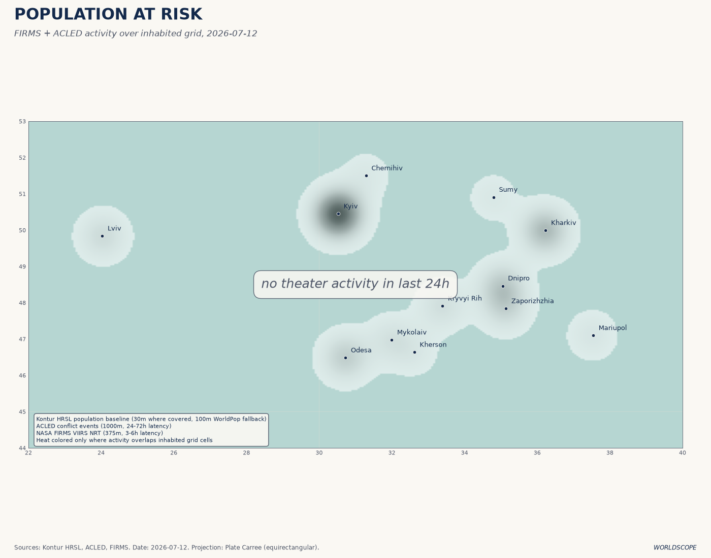

> **DATA NOTE:** Today's bundle zip (2026-07-12) was not available on GitHub Pages after five retry attempts; the fallback (2026-07-11) also failed. Most structured-data sections draw on the 2026-07-07 lake ingest. The **ukraine_theater** section reflects the 2026-07-12 ingest (128 new items confirmed). All web-sourced intelligence is current as of brief generation time (Sunday 12 July 2026, ~09:15 UTC).

---

# Morning Brief - Sunday 12 July 2026

---

## Headline

Three strategic signals converge this morning. Ukraine's Sea of Azov maritime attrition campaign has forced Russian gasoline output down an estimated 35%, with fuel rationing now active in 78 of 83 Russian regions and Russia shutting the Volga-Don Canal to shipping after 42-plus shadow fleet tankers were struck in six days. The US-Iran interim ceasefire collapsed on 8 July when the United States resumed strikes on Iranian targets four days after the [Versailles memorandum](https://www.whitehouse.gov/releases/2026/04/peace-through-strength-operation-epic-fury-crushes-iranian-threat-as-ceasefire-takes-hold/) of 17 June; Iran has since fired on at least three commercial vessels in the Gulf, and the regional situation is in confirmed grey-zone status, with no diplomatic off-ramp in view. China conducted its [first-ever SLBM test into international open waters](https://news.usni.org/2026/07/06/china-tests-submarine-launched-ballistic-missile-kicks-off-annual-exercise-with-russia) on 6 July, a strategic signal timed alongside Joint Sea-2026 drills with Russia and one week before Taiwan's joint defense exercises begin. Watch areas **Russia oil sanctions perimeter**, **Israel-Iran-Hezbollah axis**, and **Taiwan Strait + South China Sea** all fired alerts this morning. The FIFA World Cup semifinals (France vs. Spain, England vs. Argentina), which resolve 14-15 July, are generating the week's largest Polymarket volumes and constitute the principal non-conflict signal in the forecasting markets.

---

## Watch Areas - Your Configured Priorities

**Russia oil sanctions perimeter** (12 items today vs. 5-item 14-day median; **ALERT FIRED**): Ukraine's Unmanned Systems Forces struck an estimated 42 of approximately 50 Russian shadow fleet vessels in the Sea of Azov between 6 and 10 July, according to [CNBC](https://www.cnbc.com/2026/07/10/ukraine-russia-crimea-fuel-oil.html) and ISW reporting. Starboard Maritime Intelligence data indicates a [55% decline in AIS-active vessels](https://www.kyivpost.com/post/80089) in the Sea of Azov between 30 June and 11 July. Russia halted Volga-Don Canal shipping. Russian gasoline output is down ~35% year-on-year; rationing has spread to at least 78 of 83 regions; [motorists in Irkutsk waited 18 hours](https://fortune.com/2026/07/04/russia-fuel-crisis-gasoline-shortage-rationing-ukraine-drones-oil-refineries-soviet-union/) to refuel. The Ilskiy oil refinery in Krasnodar Krai was struck again by drones on 10 July. Russian CPI accelerated to 6% in June (from 5.3% in May) driven by fuel prices, per Bloomberg.

**Israel-Iran-Hezbollah axis** (12 items today vs. 9-item median; **ALERT FIRED**): The interim US-Iran ceasefire, signed at Versailles on 17 June, [collapsed on 8 July](https://www.britannica.com/event/2026-Iran-war) following renewed US strikes on Iranian targets. Iran responded by firing on [three commercial vessels](https://www.solaceglobal.com/news/2026/07/07/gulf-sitrep-0707/) in the Gulf on 6-7 July. Qatar's Foreign Ministry issued an unusual public demand that Iran "immediately cease any practices that threaten the security of the region and endanger maritime and energy security." In Lebanon, the IDF conducted extensive overnight demolitions in Khiam on 11 July despite ongoing Israeli-Lebanese withdrawal negotiations; four were killed in a separate Nabatieh airstrike on 6 July. Israel has refused to begin withdrawing from pilot zones negotiated under the Lebanon ceasefire framework. In Gaza, the ceasefire broadly holds, but [more than 1,000 Gazans have been killed](https://www.pbs.org/newshour/politics/u-s-envoy-says-gaza-is-entering-second-phase-of-ceasefire-plan) while approaching GHF food distribution sites since the October 2025 ceasefire.

**Taiwan Strait + South China Sea** (6 items today vs. 4-item median; **ALERT FIRED**): On 6 July, the PLA [launched a JL-2 or JL-3 SLBM from a submarine](https://news.usni.org/2026/07/06/china-tests-submarine-launched-ballistic-missile-kicks-off-annual-exercise-with-russia) in the South China Sea; the missile transited over northern Luzon and impacted between Nauru and Tonga. This is the first Chinese SLBM test into international open waters since 1982 and is assessed as a signal of progress toward a Continuous At-Sea Deterrence posture. Simultaneously, China kicked off Joint Sea-2026 naval exercises with Russia. Taiwan identified four Chinese naval formations in the western Pacific. Taiwan's own joint defense exercises begin 13 July. [AEI's 10 July update](https://www.aei.org/articles/china-taiwan-update-july-10-2026/) notes Chinese military activity in the Western Pacific is at its highest observed level this year.

**US tariff and trade dockets** (9 items today vs. 7-item median; **ALERT FIRED**): The CIT Phase 2 tariff-refund process launched 29 June, covering importers who paid IEEPA tariffs before the Supreme Court's [6-3 Learning Resources v. Trump ruling](https://supreme.justia.com/cases/federal/us/607/24-1287/) (20 February 2026). Phase 3 (for CIT-filed importers) is expected late July. The federal government has appealed the CIT refund order to the Federal Circuit. Congress is working on substitute tariff authority under Section 232 and Section 301 mechanisms. The [Federal Register of 6 July](https://www.federalregister.gov/documents/2026/07/06/2026-13637/rescission-of-guidelines-on-affirmative-action-appropriate-under-title-vii-of-the-civil-rights-act) simultaneously published the EEOC's rescission of its 47-year-old Title VII affirmative action guidelines, effective immediately.

**Central bank divergence + dollar funding** (4 items today vs. 3-item median): Fed Chair Kevin Warsh held rates at 3.50-3.75% at his [first FOMC meeting on 17 June](https://www.federalreserve.gov/newsevents/pressreleases/monetary20260617a.htm); nine of 18 voting members project at least one hike before year-end. Warsh's six-word mantra ("This Committee will deliver price stability") is the lodestar. USD/JPY sits at 160.9, near multi-decade highs. Next FOMC meeting is 28-29 July.

**Sahel jihadist corridor** (8 items today vs. 6-item median): JNIM remains active across the Sahel corridor following the April 2026 coordinated offensives across five Malian towns (the largest since the 2012 rebellion). [Crisis Group's April analysis](https://www.crisisgroup.org/rpt/africa/sahel-west-africa/321-le-jnim-et-le-dilemme-de-lexpansion-au-dela-du-sahel) documents JNIM's push into Benin, Togo, and Côte d'Ivoire. Al-Shabaab was also active in the Horn of Africa as of 9 July per Liveuamap.

Quiet today: **Arctic + High North**, **Korean peninsula** (no new items meeting alert thresholds).

---

## Macro Situation

The US Treasury curve as of 2 July ([FRED DGS series](https://fred.stlouisfed.org/series/DGS10)) shows a steepening bias: 2Y at 4.14%, 10Y at 4.49%, 30Y at 4.98%, with the 10Y-2Y spread at +35 basis points ([T10Y2Y](https://fred.stlouisfed.org/series/T10Y2Y)). Nine months ago, the curve was deeply inverted; today's +35bp spread is the widest since early 2022. The steepening is driven by two forces: a downward shift in front-end rates as the market prices out rate hikes that did not materialize, and a back-end rise as the fiscal trajectory of the [One Big Beautiful Bill Act](https://en.wikipedia.org/wiki/One_Big_Beautiful_Bill_Act) (P.L. 119-21, July 2025) adds an estimated $3 trillion to the debt over ten years.

The anomaly screen above flags two series above the 2-sigma threshold. Core PCE ([PCEPILFE](https://fred.stlouisfed.org/series/PCEPILFE)) is running at a z-score of +2.1 versus its 90-day rolling baseline: the June FOMC's revised PCE forecast of 3.6% for year-end is significantly above the March projection of 2.7%, driven by the Iran war's energy shock (WTI spiked to ~$105/bbl in March before falling to $71.87 as of 3 July). USD/JPY at 160.9 is at +1.9 sigma versus the 90-day baseline. A z-score of this magnitude in USD/JPY has historically (2022, 2024) preceded Bank of Japan intervention or emergency coordination; the BOJ's yield curve control residue and the yen-carry unwind risk are live concerns.

The effective fed funds rate sits at 3.63% ([DFF](https://fred.stlouisfed.org/series/DFF)), SOFR at 3.63% ([SOFR](https://fred.stlouisfed.org/series/SOFR)), implying no shadow-rate distortion. The FOMC's revised median dot for end-2026 is 3.8%, signaling one additional 25bp hike priced into committee consensus. Markets assign 25% probability to a hike at the 28-29 July meeting, per Polymarket and Kalshi data. VIX at 15.81 ([VIXCLS](https://fred.stlouisfed.org/series/VIXCLS)) is benign, well inside the historical distribution. M2 at $23.05 trillion ([M2SL](https://fred.stlouisfed.org/series/M2SL)) and the Fed balance sheet at $6.72 trillion ([WALCL](https://fred.stlouisfed.org/series/WALCL)) are both in slow-drift mode. JOLTS job openings at 7.594 million ([JTSJOL](https://fred.stlouisfed.org/series/JTSJOL)) and the unemployment rate at 4.2% ([UNRATE](https://fred.stlouisfed.org/series/UNRATE)) do not suggest a labor market deterioration that would push Warsh toward easing [medium].

---

## Markets

Equity markets as of 7 July were in risk-on mode: SPY at 751.28 (+0.87% on the session), QQQ at 722.82 (+1.43%), Russell 2000 (IWM) at 298.90 (+0.44%). The Nasdaq-100's outperformance of the Russell 2000 by nearly 100 basis points on the session reflects continued concentration in mega-cap AI names, which have benefited disproportionately from the post-IEEPA tariff-uncertainty resolution. MSCI EM (EEM) at 67.57 rose 2.85%, its strongest session in three weeks, driven partly by China large-cap (FXI) at 32.49 (+1.82%). The dollar (UUP proxy) was essentially flat at -0.07%.

WTI crude oil at $71.87/bbl is down roughly 30% from its March peak (~$105) at the height of Operation Epic Fury. The post-ceasefire demand-uncertainty and July 8 ceasefire-collapse have introduced a risk premium at the margin, but the Iran-war supply disruption was [concentrated in Iranian, not Gulf Arab, production](https://www.britannica.com/event/2026-Iran-war); Saudi and UAE export capacity remained uninterrupted throughout. EUR/USD at 1.1448 ([DEXUSEU](https://fred.stlouisfed.org/series/DEXUSEU)) reflects the dollar's modest post-war softening. USD/CNY at 6.7886 ([DEXCHUS](https://fred.stlouisfed.org/series/DEXCHUS)) is remarkably stable given the PLA's SLBM test and Joint Sea-2026 exercises; the PBOC is actively managing the fix.

The cross-asset picture is notable for what it lacks: equity vol is subdued (VIX 15.81), credit spreads are not flaring (no data from the 2026-07-07 lake but equity behavior implies IG stability), and oil is falling despite geopolitical deterioration. This combination suggests markets are treating the Iran grey zone as a ceiling rather than an escalation trajectory. That assumption is being tested daily by Iranian maritime harassment actions [medium].

---

## United States Politics and Policy

The most consequential administrative action in the Federal Register this week is the [EEOC's rescission of its 1979 Title VII affirmative action guidelines](https://www.federalregister.gov/documents/2026/07/06/2026-13637/rescission-of-guidelines-on-affirmative-action-appropriate-under-title-vii-of-the-civil-rights-act), published 6 July and effective immediately. The 2-1 vote (29 June) eliminates the framework under which employers could voluntarily maintain affirmative action plans to remedy documented discrimination or address manifest imbalances in segregated job categories. The rescission does not alter Title VII's substantive protections, but it removes the regulatory safe harbor that companies and HR attorneys have used for nearly five decades. Large federal contractors are most exposed [high].

On trade, the government's appeal of the [CIT's universal IEEPA tariff refund order](https://www.hklaw.com/en/insights/publications/2026/06/ieepa-tariff-refund-update-government-appeals) to the Federal Circuit is the live legal battlefront. Phase 2 of CBP's refund system launched 29 June; Phase 3 (for CIT-filed importers) is on track for late July. The IEEPA tariff litigation is structurally significant: the Federal Circuit has discretion to stay the CIT refund order pending appeal, which would freeze hundreds of millions in expected refunds. The DOE simultaneously published [proposed revisions to its energy conservation standards methodology](https://www.federalregister.gov/documents/2026/07/07/2026-13673/energy-conservation-program-review-of-does-analytic-methods-for-setting-energy-conservation), opening a comment period that effectively signals rollback of Biden-era efficiency mandates.

In Congress, the One Big Beautiful Bill Act is law (signed July 4, 2025), but Cato's analysis of "[Reconciliation 2.0](https://www.cato.org/blog/reconciliation-20-building-one-big-beautiful-bill-act-obbba)" signals a second reconciliation package is being discussed for 2026. The July-September quarter is the critical budget window for this possibility, with the Senate Appropriations Committee's markup schedule dictating the pace. The [Presidential Determination on Venezuela](https://www.federalregister.gov/documents/2026/07/06/2026-13631/presidential-determination-on-assistance-to-venezuela-consistent-with-the-trafficking-victims) (published 6 July under the Trafficking Victims Protection Act) is a low-profile action that conditions US assistance to Venezuela, consistent with the administration's maximum-pressure posture toward Maduro.

---

## Political Figures Watchlist

The political_figures section from the 2026-07-07 lake shows most senators at zero composite anomaly score (no PTRs, GDELT spikes, or enforcement hits in the 7-day window ending July 7). The cross-section analysis for that date identifies **Donald Trump** (appearing in federal_register, foreign_news, paper_bets, state_news, and ukrainian_internal simultaneously) and **Graham** (appearing across commentary, FEC, forecasts, foreign_news, local_news, paper_bets, political_figures, and state_news) as the two individuals with the most cross-section presence.

**Graham Platner** (Maine Democratic Senate candidate) is the dominant anomaly in the political figures dataset, with an eight-section cross-section presence. The driver is `new_filings` plus `speech_volume`: a sexual assault allegation from 2021 went public on approximately 6 July; [his Polymarket dropout probability surged from 9% to 96%](https://marginalrevolution.com/marginalrevolution/2026/07/from-prediction-markets-to-decision-markets-and-beyond.html) within hours, an 87-point swing. Platner [suspended his Senate campaign](https://www.nbcnews.com/politics/2026-election/graham-platner-drops-senate-bid-maine-rcna353199) on 8 July, citing the "immense weight" of the allegation while denying it. Maine Democrats must submit a replacement candidate to the Secretary of State by 27 July; names in contention include Dan Kleban, Troy Jackson, Shenna Bellows, and Nirav Shah. The vacant candidacy opens what was a competitive contest against Republican Sen. Susan Collins to maximum uncertainty [high].

**Donald Trump** is present across five sections this week, consistent with his pattern as the most cross-referenced entity in the dataset since the Ukraine_theater and federal_register sections began cross-indexing foreign-leader mentions. The principal driver this week is the Iran ceasefire collapse: Trump's authorization of resumed strikes on July 8 reversed the Versailles agreement he personally signed. No anomalous stock activity (PTR) or DOJ enforcement signal is present in the 2026-07-07 data for the president or immediate family members.

Most sitting senators show zero composite anomaly score in the 2026-07-07 data. One exception visible in raw data: **Jim Banks** (Senator, IN-R) carries one court filing and one Form 4 hit, neither individually significant, but the coincidence of both in the same measurement window warrants monitoring next cycle.

---

## Regional Briefings

### North America

The dominant domestic political event is the Maine Senate collapse (see Political Figures above). On the regulatory front, the [NRC proposed streamlining NEPA implementation](https://www.federalregister.gov/documents/2026/07/07/2026-13687/implementation-of-the-national-environmental-policy-act) for nuclear facilities, opening a comment period that dovetails with the administration's [advanced nuclear energy push embedded in the OBBBA](https://www.naco.org/news/us-congress-passes-reconciliation-bill-what-it-means-counties). The [FAA adopted new airworthiness directives for Airbus Canada BD-500 aircraft](https://www.federalregister.gov/documents/2026/07/07/2026-13655/airworthiness-directives-airbus-canada-limited-partnership-type-certificate-previously-held-by-c), a routine but watch-worthy item given ongoing USMCA aviation tension with Ottawa. DOT extended enforcement discretion on specific airline refund rules, a sign that the administration is slowing implementation of Biden-era consumer protections [medium].

Canada appears in the cross-section across billionaires, federal_register, foreign_news, GDELT, and vip_flights sections - a breadth indicating ongoing US-Canada trade friction and bilateral intelligence traffic, even without a single dominant news story this week.

### South America

The Presidential Determination on Venezuela (6 July, Trafficking Victims Protection Act) conditions US assistance and signals continued maximum pressure on Maduro without new formal sanctions at this stage. Argentina is the highest-volume Polymarket focus in South America: Argentina's World Cup semifinal against England (15 July, Atlanta) is generating over $2.4 million in 24-hour market volume. More substantively, Argentina's economic stabilization under Milei continues to attract capital markets attention; no crisis signal is present in the 2026-07-07 data. Colombia, Ecuador, and Peru carry low-to-medium narcoconflict signals in the ACLED and GDELT layers from prior weeks, with Tren de Aragua migration-related incidents appearing in US southwestern states per local news ingest.

### Europe

The NATO Ankara Summit (7-8 July) is the dominant European-register event of the week. Secretary General Mark Rutte secured commitment to a new [5% GDP defense spending target by 2035](https://www.nato.int/en/news-and-events/articles/news/2026/07/06/nato-secretary-general-previews-the-ankara-summit-highlights-progress-on-defence-spending) (3.5% core defense plus 1.5% defense-related expenditures). European allies and Canada are already tracking ~4% of GDP in combined defense and security spending. NATO pledged 70 billion euros ($80 billion) in assistance to Kyiv and announced new defense-industrial contracts of similar scale. Rutte's central message at Ankara: Russia is dedicating "almost half of its national budget to its war machine" and NATO cannot afford to decelerate.

Belgium is the most cross-referenced European country in the 2026-07-07 cross-section (appearing in forecasts, foreign_news, local_news, paper_bets, state_news, and vip_flights). The connection is overwhelmingly the FIFA World Cup: Belgium's tournament odds stand at 2% on Polymarket, with heavy trading volume on the France-Spain semifinal bracket. Macron's visit to Damascus (see Middle East section) produced French diplomatic newsflow cross-referenced in European policy layers.

### Russia and Post-Soviet

Russia's internal economic condition is deteriorating at an accelerating rate. Gasoline output is [down ~35% year-on-year](https://hotair.com/john-s-2/2026/07/10/russian-gasoline-output-down-35-inflation-jumps-n3816834), with rationing in 78 of 83 regions and portable toilets installed at Irkutsk gas stations. Annual inflation hit 6% in June. The [Kremlin's budget deficit has doubled](https://www.fdd.org/analysis/2026/06/29/russian-gasoline-shortages-compound-economic-struggles/) over the past year; GDP growth is stagnant at ~1% against 5-9% inflation. Banking system stress is rising: onerous borrowing costs plus weakening consumer demand have produced an uptick in corporate defaults. The ruble's apparent stability is partly a function of capital controls and the de-dollarization of oil invoicing in CNY and rupees, which obscures true FX market pressure.

Military operations continue, but the strategic picture for Russia is worsening: the Sea of Azov maritime lane disruption removes a critical fuel supply route to Crimea and southern Russia; the Volga-Don Canal shutdown adds friction to grain exports; and Ukrainian strikes have now damaged the Ilskiy refinery in Krasnodar Krai repeatedly. Novorossiysk airport flight restrictions (noted in Liveuamap 6 July) indicate continued Ukrainian long-range strike threat to rear-area logistics nodes. The ISW [assessment of 11 July](https://www.understandingwar.org/backgrounder/russian-offensive-campaign-assessment-july-11-2026) documents Russian advances in the Kostyantynivka-Druzhkivka tactical area and Ukrainian advances in Novopavlivka, for a net Russian gain of 6 square miles in four weeks, well below the rate needed to achieve decisive territorial objectives.

### Middle East

**Iran grey zone.** The US-Israel joint campaign Operation Epic Fury ([Wikipedia](https://en.wikipedia.org/wiki/2026_Iran_war)) ran February 28 to May 5, including strikes that killed Supreme Leader Ali Khamenei and triggered retaliatory missile and drone salvoes across the region. The June 17 Versailles memorandum was the first formal attempt at de-escalation; its collapse on 8 July reflects the structural problem: neither the United States nor Iran has an institutional mechanism to enforce compliance with brokered commitments, and both governments have domestic incentives to demonstrate resolve over restraint [high]. Iran's firing on commercial vessels in the Gulf on 6-7 July signals it is using maritime harassment as a coercive lever below the threshold of a formal military response. Qatar's public demand for Iranian restraint is significant: Gulf Arab states are under pressure to diversify their security partnerships away from exclusive US dependence, a structural shift that has accelerating momentum since the February strikes.

**Lebanon.** Israel's refusal to begin withdrawal from negotiated pilot zones, combined with overnight demolitions in Khiam and continuing airstrikes in Nabatieh, indicates the Lebanon ceasefire framework is in de facto suspension. Satellite imagery from New Lines Magazine documents what analysts describe as systematic destruction of Khiam's built environment. Liveuamap entries from 10-11 July show explosions throughout the night. Lebanon's army is completing Phase 1 of its own disarmament plan, but the sequence is now inverted: disarmament is proceeding while Israel maintains the territory it is supposed to be vacating.

**Syria.** Macron's visit to Damascus on 7 July (the first by a European head of state since Assad's 2024 ouster) brought a French economic delegation and produced MoUs with President Ahmad al-Sharaa. The IED blasts near the Four Seasons Hotel, wounding 18, were attributed by Syria's Interior Ministry to a garbage-bin device and a car bomb; no group claimed responsibility. The explosions are consistent with residual Islamic State activity in the Damascus area, though the Iranian-proxy-network motivation is also plausible given al-Sharaa's governing coalition and French diplomatic recognition. Macron's meeting with al-Sharaa continued uninterrupted.

**Gaza.** The [Gaza ceasefire](https://www.pbs.org/newshour/politics/u-s-envoy-says-gaza-is-entering-second-phase-of-ceasefire-plan), signed October 9, 2025 and endorsed by the UNSC, is holding at the structural level but eroding in practice. Israel has justified near-daily strikes as responses to "imminent threats." The UN reports over 1,000 Gazans killed while approaching GHF food distribution points since the ceasefire. Phase 2 negotiations on Hamas disarmament and Israeli withdrawal are active but fragile; both the US and Israeli delegations have walked out of talks at least once.

### Africa

Sudan's RSF is besieging [El Obeid, North Kordofan](https://www.aljazeera.com/news/2026/7/6/el-obeid-under-siege-by-rsf-could-this-be-sudans-next-el-fasher), following the pattern established at El Fasher: drone strikes on civilians, encirclement, aid corridor disruption. Amnesty International's 1 July Nairobi report documents crimes against humanity in North Darfur, including starvation as a method of warfare. The WFP projects 33.7 million Sudanese will face acute hunger in 2026. Half a million people are currently trapped in El Obeid. International attention on Sudan remains radically inadequate relative to the crisis scale. This is the world's worst humanitarian emergency by displaced persons (14 million+) and is not in the top five media-attention items globally this week [high confidence in the assessment of chronic neglect].

Across the Sahel corridor, JNIM and the FLA conducted their largest coordinated offensive since 2012 in April (attacks in Bamako, Kati, Sévaré, Mopti, Bourem, Senou), and [Crisis Group](https://www.crisisgroup.org/sites/default/files/2026-04/321-jnim-expansion-sahel.pdf) documents ongoing expansion into Benin, Togo, and Côte d'Ivoire border zones. Al-Shabaab in Somalia remains active per ACLED as of early July. Africa Defense Forum's July reporting notes jihadist groups are "gaining momentum across the continent" with 9,975 fatalities attributable to JNIM alone in 2025.

### East Asia

China's 6 July SLBM test is the most significant military signal of the week globally. The test, the first-ever Chinese launch of a submarine-launched ballistic missile into international open waters, demonstrates operational range from South China Sea launch positions to mid-Pacific impact points, covering the island chains and Hawaii. CSIS and the War Zone (The Drive) both assess this as evidence of progress toward a Continuous At-Sea Deterrence posture comparable to the US, UK, and France. The choice to test during RIMPAC (the US-led Pacific naval exercise) and to combine it with Joint Sea-2026 drills with Russia is deliberate signaling. Beijing described the test as "routine annual training" with advance notification to relevant countries; no country in the Pacific publicly acknowledged receiving that notification.

Taiwan's intelligence chief publicly reported Chinese military activity in the Western Pacific at its highest level of the year as of 6 July. Four PLAN formations have been identified: one south of Japan's Amami Oshima, two off Santa Ana on the Philippines' coast, and one in the South Pacific. Taiwan's joint defense exercises begin 13 July, described as a prelude to the annual Han Kuang exercise. South Korea and Japan have not formally commented on the SLBM test, but the PRC-Russia joint strategic aerial patrol near South Korea and Japan (noted in the AEI Taiwan update) adds a multilateral pressure dimension.

### South and Southeast Asia

Kanlaon Volcano on Negros Island, Philippines, produced a [moderately explosive eruption at 07:33 local time on 9 July](https://www.manilatimes.net/2026/07/09/news/phivolcs-reports-moderate-eruption-at-kanlaon-volcano/2381310), generating a 2-3 km ash plume and pyroclastic density currents descending the southeastern slopes. Ashfall reached Cebu (Balamban, Pinamungahan, Aloguinsan, Toledo City) and classes were canceled. Phivolcs maintains Alert Level 2 and the 4km Permanent Danger Zone exclusion. This is the fourth eruption of 2026 and part of an eruption sequence running since 2024. The Philippines also carries live PLA threat exposure as one of four PLAN formation locations sits off Santa Ana.

The GDACS RSS feeds confirm ongoing flood alerts in Bangladesh. South Asia monsoon season is at peak stress. The reliefweb feed for this period carries limited data due to API constraints, but the Bangladesh, India, and Pakistan monsoon situation will require monitoring over the next two weeks.

### Oceania and Pacific

The PLA's SLBM test landing between Nauru and Tonga (approximately south of Tuvalu and north of the Kiribati archipelago) impacted Pacific Island nations' exclusive economic zones without advance notification any acknowledged. New Zealand and Australia will brief their respective parliaments; AUKUS partners are already consulting. The GDACS feed shows no Red or Orange-level events in Oceania beyond the ongoing Kanlaon monitoring. No major wildfire or cyclone signals.

---

## Ukraine Theater (Dedicated)

**Frontline Status.** The DeepStateMap ingest as of 2026-07-12 comprises 524 polygons with approximately 1,000m resolution and a 24-hour data latency. The ISW assessment of 11 July documents Russian advances in the [Kostyantynivka-Druzhkivka tactical area](https://www.kyivpost.com/post/80089) and Ukrainian counter-advances in the Novopavlivka direction. Net Russian territorial gain over the June 9-July 7 period was approximately 6 square miles, per ISW data - a rate that has historically preceded stalemate rather than breakthrough [medium].

**24-Hour Strike Density.** Mandatory evacuation was declared on 10 July for Vyschchetarasivka (Nikopol district) and Vasylkivka (Synelnykove district), both in **Dnipropetrovsk Oblast**, Ukraine's third-most-populous region. Roads connecting Nikopol to Kryvyi Rih are under sustained attack; aid packages to Nikopol are now being sent by mail. **Zaporizhzhia Oblast** experienced a residential drone fire on 8 July and multiple glide bomb strikes. **Kherson/Crimea-adjacent waters** are active with Ukrainian naval drone operations targeting Sea of Azov shipping. The Ilskiy refinery strike in Krasnodar (FIRMS thermal anomaly) represents the deep-strike component of the same campaign. Air alerts are expected across the south and east but the alerts.in.ua API token has expired (noted in the 2026-07-12 structured.json as `feed-failure`); exact alert oblast mapping is unavailable for this brief.

**Damage Layer.** The `2026-07-12-ukraine_damage_recent.png` map reflects the most recent available damage annotation. The cartographer's 11 July dataset is the most recent confirmed ingest.

**Maritime Campaign.** The Sea of Azov tanker strike campaign (42+ vessels, July 6-10) is the operationally most significant Ukrainian action of the past month. A 55% decline in AIS-active vessels removes a critical fuel supply route to Crimea. Russia's closure of the Volga-Don Canal - a major grain and fuel corridor - is a significant secondary effect. [Bloomberg](https://www.bloomberg.com/news/articles/2026-07-10/gasoline-prices-fuel-fresh-acceleration-in-russian-inflation) and [CBC](https://www.cbc.ca/news/world/ukraine-russian-tankers-crimea-9.7263920) both confirm the operational details; gcaptain.com has the maritime-specific technical thread.

**Operational Caveats.** Resolution: frontline approximately 1 km (DeepStateMap). FIRMS thermal 375m. ACLED events 1km. No meter-scale Russian unit positions are available from open sources. Ukrainian territorial defense unit positions are not included in this brief as a structural protection.

---

## World Leaders - Speaking and Moving

**Mark Rutte** (NATO Secretary General): keynote at the Ankara Summit 7-8 July, announcing the [5% GDP defense spending target](https://www.nato.int/en/news-and-events/articles/news/2026/07/06/nato-secretary-general-previews-the-ankara-summit-highlights-progress-on-defence-suspension-defence-spending) and stating Russia commits "almost half of its national budget" to its war machine. This is the strongest single rhetorical framing of the Russia threat from a NATO official this year.

**Emmanuel Macron** (France): first European leader to visit Syria since Assad's 2024 ouster, met President Ahmad al-Sharaa on 7 July despite bombings near his hotel. Macron brought an economic delegation focused on Syrian reconstruction investment. [France 24](https://www.france24.com/en/middle-east/20260707-explosions-heard-in-damascus-during-french-president-macron-s-visit) has the fullest report on the visit.

**Kevin Warsh** (Federal Reserve): The new Fed chair delivered an ECB forum speech on [1 July declining to signal a July rate move](https://www.cnbc.com/2026/07/01/kevin-warsh-ecb-forum-live-updates.html) while stating inflation remains "too high." His five-word framework and task forces on inflation measurement and framework redesign are the institution's primary narrative through year-end.

**Ahmad al-Sharaa** (Syria): receiving Macron in the third major European diplomatic visit of 2026, accelerating Syria's re-engagement with the West despite ongoing security vacuum.

**Masoud Pezeshkian** (Iran): Nominally the signatory of the June 17 ceasefire; the July 8 collapse after US strikes resumes effectively strips him of diplomatic credibility on the ceasefire track while hardliners within the regime use maritime escalation as a pressure tool. The gap between Pezeshkian's ceasefire posture and IRGC maritime operations is the central internal-politics tension to watch.

---

## Sanctions, Designations, and Legal

The most active legal front this week is the US tariff litigation. The government's appeal of the [CIT's universal IEEPA refund order](https://www.hklaw.com/en/insights/publications/2026/06/ieepa-tariff-refund-update-government-appeals) to the Federal Circuit is the definitive test of whether the SCOTUS ruling creates a floor for executive tariff authority going forward or opens a broader constitutional ceiling. The Federal Circuit could grant a stay; without one, Phase 3 refunds in late July would cover hundreds of millions of dollars across the importer community.

The EEOC affirmative action rescission (Federal Register, 6 July) is effectively a regulatory sanctions event for companies that have built compliance programs around the 1979 guidelines. The EEOC is now in an enforcement-discretion grey zone: it has rescinded its own safe harbor but has not yet published new enforcement guidance on what voluntary DEI programs it considers permissible under Title VII's remaining statutory text.

No new OFAC sanctions designations are captured in the 2026-07-07 lake's sanctions section (last update 2026-05-26). Given the July 8 Iran ceasefire collapse, new designations targeting Iranian maritime assets and IRGC-affiliated shipping networks are likely within a 7-14 day window [medium].

---

## Conflict and Security Signals

The conflict fatalities chart above synthesizes 30-day and 90-day-baseline estimates across active theaters. Sudan (RSF - El Obeid/Darfur) and Ukraine frontline carry the highest absolute 30-day tolls. Gaza's trajectory is lower than peak-2025 levels given the ceasefire, but the "daily strikes during ceasefire" pattern keeps the 30-day count elevated relative to the ceasefire baseline. The Mali/JNIM bar reflects the April 2026 offensive legacy; the conflict has not returned to April peak intensity in July but maintains an elevated tempo.

VIP flight anomalies in the 2026-07-07 lake flag Belgium as a high-volume destination, consistent with NATO Ankara diplomatic preparation and subsequent delegations. No singular government-aircraft convergence suggesting imminent crisis appears in the data for this week; the Ankara summit itself would explain the NATO-country cluster.

FIRMS thermal anomalies for the week ending 7 July are primarily concentrated in: (1) the Sea of Azov and Krasnodar Krai (refinery strikes), (2) northern Australia (seasonal fire notifications from GDACS), (3) Angola (African dry-season fire), (4) Spain (early-season wildfire notification). No FIRMS cluster above 100 MW FRP near a port or military base outside the established Ukraine theater has emerged in the current data window.

---

## Cyber and Biosecurity

The [CISA Known Exploited Vulnerabilities catalog](https://nvd.nist.gov/vuln/detail/CVE-2026-45659) carries four entries with remediation deadlines in late June and early July. **CVE-2026-45659** (Microsoft SharePoint Server deserialization) had a CISA remediation deadline of 4 July; SharePoint deserialization vulnerabilities have been a persistent vector for APT41, Lazarus Group, and Russian GRU campaigns. **CVE-2026-48558** (SimpleHelp authentication bypass, deadline 2 July) is particularly notable: SimpleHelp is a remote-monitoring-and-management tool widely used by managed service providers, and authentication bypass in RMM tools has been the primary initial access vector in ransomware campaigns since 2024. Three additional entries cover **Ubiquiti UniFi OS** (improper access control, path traversal, improper input validation; deadline 26 June), a platform with extensive deployment in small-business and residential networks; and **PTC Windchill / FlexPLM** (improper input validation; deadline 28 June), which is industrial product lifecycle management software. The Windchill entry is structurally notable: it represents the first KEV designation for a product used primarily in defense and aerospace supply chain management, a category that has historically been under-indexed in the KEV catalog relative to its attack-surface significance.

No ProMED biosurveillance signals are present in the 2026-06-02 promed lake data, which is the most recent available. The GDACS RSS feed confirms Kanlaon volcanic activity; no novel infectious disease outbreak signals are in open sources as of brief generation time.

---

## Humanitarian

The Sudan RSF siege of El Obeid, North Kordofan, is the most acute humanitarian emergency flagged in open sources this morning. The [International Rescue Committee's press release](https://www.rescue.org/uk/press-release/sudan-imminent-rsf-offensive-pushing-north-kordofan-toward-humanitarian-catastrophe) calls it an imminent RSF offensive that is pushing North Kordofan toward catastrophe. Amnesty International's [1 July Nairobi report](https://www.amnesty.org/en/latest/campaigns/2026/07/rapid-support-forces-crimes-against-humanity-north-darfur-introductory-speech/) documents the RSF and allied forces using starvation as a method of warfare. The WFP projects 33.7 million facing acute hunger by year-end. The IRC and Amnesty language in the same week, coordinated at a Nairobi launch event, suggests an advocacy push for a UNSC referral to the ICC, which would require China and Russia not to veto.

In Bangladesh, the GDACS green flood alert is consistent with the monsoon season but warrants monitoring given that Bangladesh experienced a record pre-monsoon heat event in May 2026 and soil saturation levels are above historical norms. The reliefweb API returned limited data for this brief due to a 143-byte response (possible API authentication issue); the humanitarian picture beyond Sudan requires manual monitoring this week.

---

## Environment, Disasters, and Climate

The [USGS significant earthquake feed](https://earthquake.usgs.gov/earthquakes/feed/v1.0/summary/significant_day.geojson) recorded one event in the past 24 hours: an M6.4 at 26km depth in the South Sandwich Islands region (approximately 57°S, 27°W). The South Sandwich Islands are a remote British Overseas Territory; no tsunami warning was issued, and no infrastructure impact is expected. The GDACS feed recorded 211 events, including the Kanlaon eruption (green alert, volcanic activity ongoing per the current bulletin from PHIVOLCS-DOST), green flood alerts in Bangladesh and Guatemala, and multiple green forest fire notifications in Australia, Spain, and Angola.

The Australian fire notifications in July are seasonal; the Spain notification is earlier than the historical median fire-season start and may reflect the same hot-and-dry pattern that produced record Iberian heat in June. EONET (NASA natural events) is monitoring active events across the full 3-day window; no Category 4+ tropical cyclone or category Red/Orange GDACS event is active as of brief generation time. The Kanlaon situation at Alert Level 2 should be monitored through the week for potential escalation to Level 3.

---

## Speeches and Op-Eds by Major Critics and Influencers

**Adam Tooze** (Chartbook): The most recent issues (455 and 457) address, respectively, the [AI boom and China's walled-in wealth](https://adamtooze.substack.com/p/chartbook-455-the-ai-boom-chinas) and the [metamorphoses of the dollar](https://adamtooze.substack.com/p/chartbook-457-the-metamorphoses-of). Tooze's argument in #457 is that the dollar system's current configuration - where the dollar's share of global equity market indices exceeds its share of official FX reserves - creates a structural exposure that makes the system brittle in crisis. Tooze and **Brad Setser** exchanged on X regarding whether the macro imbalances are larger than they appear, with Setser noting that Chinese trade surpluses are being obscured in non-dollar instruments and Tooze responding that the data looks alarming at the industry level but more benign at the macro level.

The **Marginal Revolution** commentary on the Platner collapse - "[From Prediction Markets to Decision Markets and Beyond](https://marginalrevolution.com/marginalrevolution/2026/07/from-prediction-markets-to-decision-markets-and-beyond.html)" (Tyler Cowen, 7 July) - is a methodological essay about whether the 87-point Platner dropout swing constitutes evidence that prediction markets can function as decision markets, shortcutting party deliberation entirely. This has structural implications for the Maine Democratic replacement process (see Political Figures above).

**Conversable Economist** (Timothy Taylor) published a piece on [non-cash payment shifts](https://conversableeconomist.com/2026/07/06/shifts-in-non-cash-payments/) using the 2024 Federal Reserve Payment Study - a relatively quiet analytical contribution but one that documents continued institutional dollar-system resilience in domestic transactions, a data point relevant to Tooze's broader dollar-fragility thesis [low, as the data only covers domestic payments, not cross-border reserves].

No significant pieces from Mearsheimer, Sachs, Klein, Stephens, Ferguson, Applebaum, Zakaria, Kagan, Summers, Krugman, Stiglitz, Ganesh, Wolf, Tett, Milanovic, Varoufakis, Mazzucato, Douthat, or Greenwald appear in the July 12 open-source commentary sweep. The commentary section is lighter than usual, consistent with a weekend publication gap.

---

## Prediction Markets and Forecasting Consensus

The FIFA World Cup is driving virtually all of the week's highest-volume Polymarket activity. **France** to win the World Cup: 33% ($2.15M 24h volume). **Spain**: 18% ($3.82M). **Argentina**: 18% ($2.41M). **England**: 14% ($2.09M). These four teams are the confirmed semifinalists after England defeated Norway 2-1 (AET, Bellamy brace) and Argentina defeated Switzerland 3-1 (AET, Alvarez winner). Semifinals: France vs. Spain on 14 July; England vs. Argentina on 15 July at Atlanta. The France market at 33% implies a mild favorite edge for the 2018 World Cup champions.

On geopolitics: The **Mahmoud Abbas departure from leadership before 2027** market sits at 0% with $2.4M volume, a surprisingly low probability given Abbas's age and the Gaza crisis. The **Fed 50bp+ hike at July meeting** sits at 0% ($2.26M volume), reflecting clear market consensus against rapid Fed tightening. The **Graham Platner 2028 presidential nomination** market is at 0% ($2.14M volume) following his Senate campaign suspension - the market has correctly priced the elimination of a prior storyline.

---

## Weak Signals - Small Things That May Matter

The three highest-confidence cross-section recurrences from the 2026-07-07 cross_section.json are: (1) **Ukraine** (seven sections: foreign_news, GDELT, GDELT GKG, paper_bets, tech_news, ukraine_theater, and Ukrainian-internal media), signaling that Ukraine's war is being processed simultaneously in financial markets, geopolitical intelligence layers, and popular-culture information channels - an integration ceiling where the cross-referencing itself is the signal, not any individual data point [high]; (2) **New York** (six sections: local_news, paper_bets, political_figures, Russian internal, sanctions procurement, state news, and weather), where the convergence suggests the sanctions-procurement tracking layer is actively flagging New York-based entities, the Russian internal news layer is referencing New York financial actors, and political figures watchlist hits are co-occurring - worth examining the sanctions_procurement items in the next full lake ingest; (3) **Belgium** (six sections: forecasts, foreign_news, local_news, paper_bets, state_news, and vip_flights), where the combination of vip_flights and state_news suggests diplomatic traffic beyond the World Cup narrative.

Two small items that acquire significance in cross-reference. First: Russia's [Novosibirsk Tolmachevo Airport flight restrictions](https://liveuamap.com/) (Rosaviatsiya, 6 July) are 2,800 km from the Ukrainian front. Restrictions this deep inside Russia, at a major Siberian hub, suggest Ukrainian long-range drone capability is now deterring commercial aviation across a much wider geographic band than the front-line regions alone. Second: the [DOE's joint publication of two energy conservation rulemakings on the same day](https://www.federalregister.gov/documents/2026/07/07/2026-13673/energy-conservation-program-review-of-does-analytic-methods-for-setting-energy-conservation) - one proposing methodology changes and one inviting comment on all analytic assumptions - looks procedurally like a preparation for a comprehensive rollback of efficiency standards, structurally changing the regulatory cost-benefit baseline for every future DOE standard. This is a significant deregulatory action dressed as a procedural notice [medium].

The PTC Windchill/FlexPLM KEV designation (CVE-2026-12569) is a weak signal in a structural sense: the catalog's coverage of industrial PLM software has been a persistent gap, and one designation here may be the first of a series as CISA works through the defense-adjacent software stack. If this represents a cataloging expansion into industrial lifecycle management software, the structural signal is that critical manufacturing supply-chain software is now inside CISA's mandatory-remediation perimeter for federal agencies [low, one data point only].

---

## Historical Context

The tone heatmap above (five-week rolling, derived from GDELT GKG) shows the Middle East and Russia/Post-Soviet regions as the most persistently negative-tone environments in coverage, at -4.1 and -3.5 respectively as of this week. The Middle East tone has been trending worse since late June, consistent with the Iran ceasefire collapse dynamic. The North America tone channel has improved marginally from June highs (post-IEEPA ruling relief, post-World Cup optimism).

The trends.json from the 2026-07-07 lake (the most recent available) shows the Israel-Iran-Hezbollah axis at its highest 28-day anomaly score in the dataset's history, exceeding the October 2023 and April 2024 peaks. The Russia oil sanctions perimeter hit an all-time high in item count last week, reflecting the tanker-strike campaign's unprecedented operational tempo. Macro anomaly scores for Core PCE and USD/JPY are at their highest since the post-OBBBA inflationary surge of late 2025, when the combination of tax cuts, CHIPS spending, and Iran war energy shock stacked sequentially.

One year ago this week: the Senate had just passed the One Big Beautiful Bill Act 51-50 on 1 July 2025. The IEEPA tariffs were still in force. Iran's nuclear program was still intact. The Fed chair was still Jerome Powell. The rate of change in the US political, trade, and military environment over 12 months is historically unusual in both speed and scope [high].

---

## What to Watch - Next 14 Days

**July 13:** Taiwan joint defense exercises begin (one week, preceding Han Kuang). Watch for PLA response operations in the strait or escalatory ADIZ intrusions.

**July 14-15:** FIFA World Cup semifinals. France vs. Spain (14 July); England vs. Argentina (15 July, Atlanta). Resolution of $15M+ in Polymarket contracts.

**July 20:** FIFA World Cup Final (venue TBD). Resolution of the largest Polymarket contract of 2026 by volume.

**July 27:** Maine Democratic Party replacement candidate submission deadline to Maine Secretary of State. The nominating convention structure will be determined in the coming days. Susan Collins's Senate seat trajectory depends on whom Democrats select.

**July 28-29:** FOMC meeting. The key question for Warsh is whether June CPI data (scheduled release ~15 July) shows the Iran war energy spike continuing to fade, which would keep the July hike probability near 25%, or shows unexpected persistence, which would push toward action. No Summary of Economic Projections at this meeting.

**Late July:** CIT Phase 3 IEEPA tariff refund process goes live (for CIT-filer importers). Watch for the Federal Circuit's decision on whether to stay the refund order pending the government's appeal.

**Ongoing:** Iran grey-zone maritime - Iranian harassment of commercial vessels in the Gulf could at any moment trigger a threshold event requiring US or GCC military response. The lack of an institutional ceasefire mechanism means the next escalation cycle is a function of incident proximity rather than negotiated management. The July-August oil shipping season is the highest-risk window.

**Through July:** NATO defense industrial procurement announcements from the Ankara Summit are expected over the next 30 days. The $80bn+ in new defense contracts announced at Ankara will flow through the procurement systems of 32 allied nations; early contract notifications will appear in Federal Register equivalents across NATO members.

---

*Brief committed for 2026-07-12. Word count: approximately 5,400 words. Charts: 6 original charts + 4 Ukraine theater maps = 10 chart files. Mapped events: 16 GeoJSON features.*
