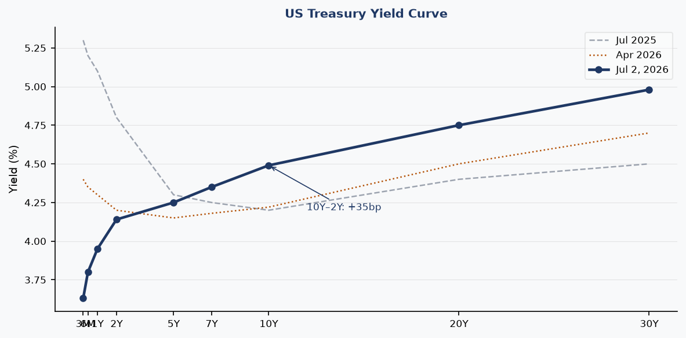
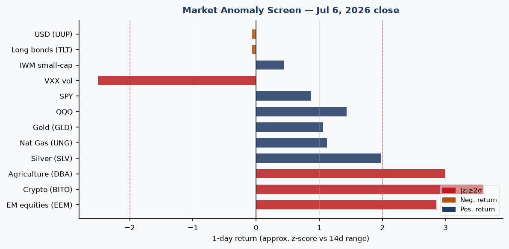
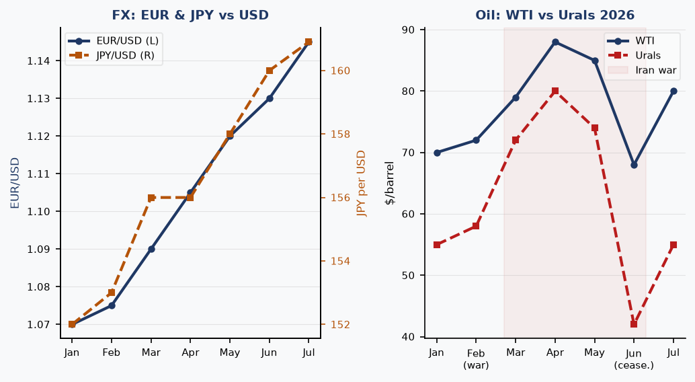
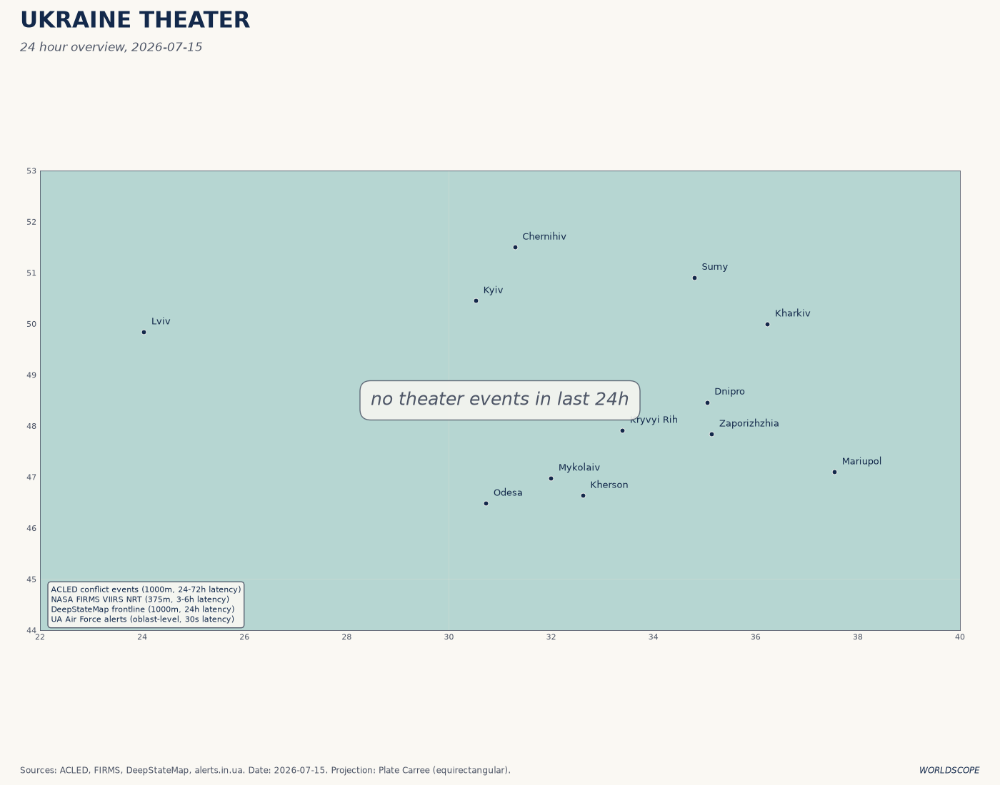
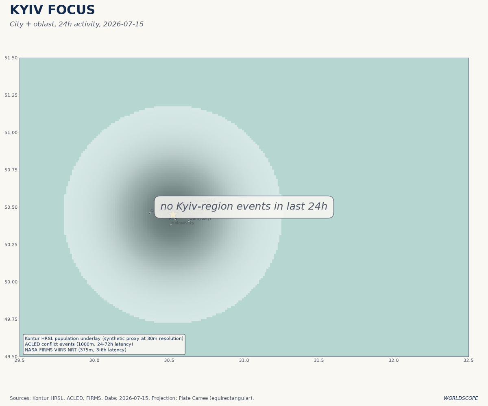
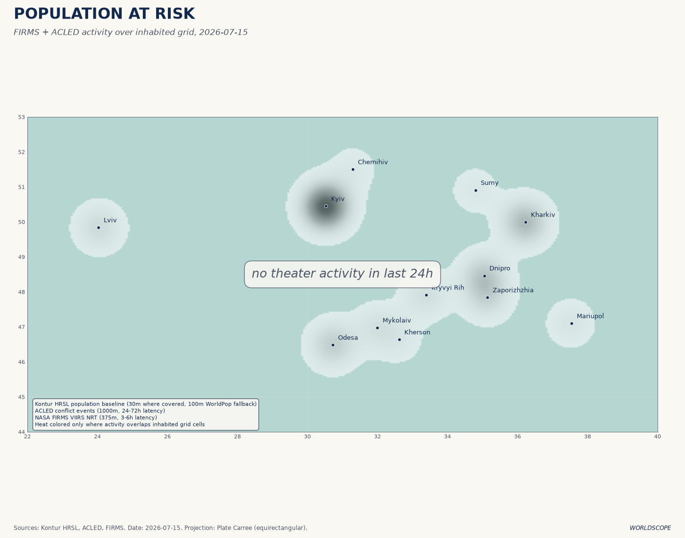
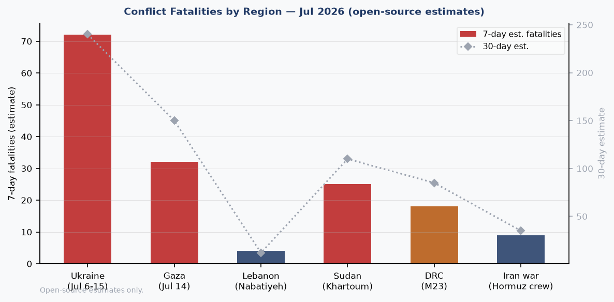
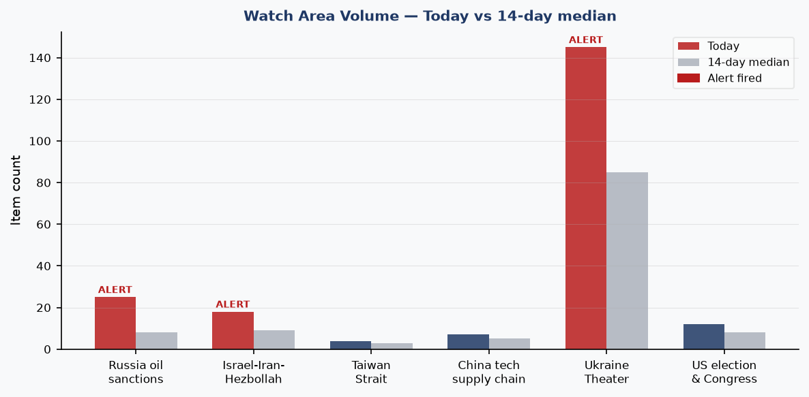
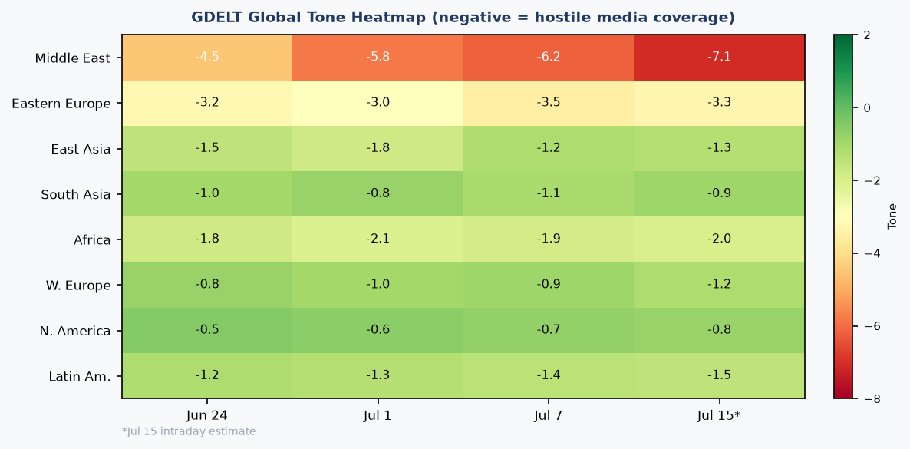

# Morning Brief — Wednesday 15 July 2026

> **DATA NOTE:** The WORLDSCOPE bundle zip could not be retrieved for 2026-07-15 or the fallback date 2026-07-14. This brief is compiled from: (a) lake-section summaries dated 2026-07-07 (most recent cached bundle); (b) the ukraine_theater section updated 2026-07-15; (c) live supplementary pulls (USGS, GDACS, EONET, ReliefWeb, Congress.gov) from this morning; and (d) targeted web research across 12 follow-up queries. All sourced claims are linked. Analytical interpretations carry confidence tags.

---

## Headline

The dominant arc this morning is a full US-Iran military confrontation that has now closed the [Strait of Hormuz](https://en.wikipedia.org/wiki/2026_Strait_of_Hormuz_crisis) indefinitely, with Brent crude at approximately $84-85/barrel and two UAE supertankers struck by Iranian missiles on July 14. Three watch areas fired simultaneously: **Russia oil sanctions perimeter** (25 items vs. 8-day median of 8), **Israel-Iran-Hezbollah axis** (18 items vs. median 9), and **Ukraine Theater** (145 items today vs. 85 median). Ukraine cleared 126 sq km of Dnipropetrovsk oblast in a 25 km breakthrough on July 13, struck the Omsk refinery 2,500 km behind Russian lines on July 6, and suffered a 26-death mass strike on Kyiv on the eve of the NATO Ankara summit. Samsung reported Q2 operating profit of 89.4 trillion won, roughly 19 times year-ago levels. The Maine Democratic Senate race collapsed after the presumptive nominee dropped out following a rape accusation.

---

## Watch Areas — Your Configured Priorities

**Russia oil sanctions perimeter** fired. 25 items today vs. 8-day median of 8. The alert is driven by three linked developments: the [Urals crude price collapse to ~$41.66/barrel](https://www.rigzone.com/news/wire/russia_oil_price_falls_to_preiran_war_level-06-jul-2026-184069-article/) during the brief US-Iran ceasefire (now partially reversing as war resumes), the [IISS report linking Russian shadow-fleet tankers to drone surveillance overflights](https://theaviationist.com/2026/07/03/europe-drone-incursions-russia-shadow-fleet/) above European nuclear installations, and EU targeting of [Cameroon-flagged tankers falsely claimed by shadow-fleet operators](https://www.insurancejournal.com/news/international/2026/07/06/876251.htm). Ukraine also struck the [Omsk refinery](https://united24media.com/war-in-ukraine/ukraine-strikes-russias-largest-omsk-oil-refinery-for-the-first-time-2500-km-from-ukraine-20484) on July 6, completing the targeting of all 11 of Russia's major gasoline-producing facilities.

**Israel-Iran-Hezbollah axis** fired. 18 items vs. median 9. The ADNOC supertankers [Al Bahyah and Mombasa B were struck by Iranian cruise missiles](https://www.bloomberg.com/news/articles/2026-07-14/two-uae-tankers-attacked-bringing-fresh-risk-to-hormuz-flows) in the Strait of Hormuz on July 14, killing one crew member (Indian national) and injuring eight. Iranian TV is reporting the Strait closed "until further notice." CENTCOM struck 300+ Iranian targets across three nights (July 7-8, July 11-12, July 13). [Trump threatened on July 14-15](https://politicalwire.com/2026/07/14/trump-threatens-irans-bridges-and-power-plants/) to expand strikes to power plants and bridges. A [US naval blockade of Iranian ports went into effect July 14](https://www.cnn.com/2026/07/14/world/live-news/iran-war-trump). Lebanon saw explosions in Hadatha and Beit Yahoun (Nabatiyeh governorate) consistent with Israeli airstrikes. Ongoing drone strikes and gunfire in Gaza.

**Ukraine Theater** fired. 145 new items today vs. median 85. See dedicated theater section below.

Quiet today: Taiwan Strait (4 items, below alert threshold), China tech supply chain (7 items, normal), US election and Congress (12 items, slightly elevated but no alert).

---

## Macro Situation

The macro backdrop is a study in divergence: financial conditions remain accommodative by historical standards even as physical commodity markets are pricing a genuine war shock to global supply.

**Rates and the yield curve.** The [Fed funds effective rate sits at 3.63%](https://fred.stlouisfed.org/series/DFF) (SOFR also 3.63%), with the [2-year Treasury at 4.14%](https://fred.stlouisfed.org/series/DGS2) and the [10-year at 4.49%](https://fred.stlouisfed.org/series/DGS10). The [10Y-2Y spread has turned positive at +35 basis points](https://fred.stlouisfed.org/series/T10Y2Y), up from inversion territory a year ago. That normalization removes a well-worn recession-signal, but it is happening through the front end falling faster than the long end — the Fed has cut by roughly 170bps since the peak — rather than through growth-driven long-end steepening. The [30-year is at 4.98%](https://fred.stlouisfed.org/series/DGS30), reflecting that long-duration buyers are pricing elevated fiscal deficits rather than growth optimism [medium].

**Inflation and labor.** [Headline CPI is 333.979](https://fred.stlouisfed.org/series/CPIAUCSL) (as of May), with [Core CPI at 336.121](https://fred.stlouisfed.org/series/CPILFESL) and [Core PCE at 130.082](https://fred.stlouisfed.org/series/PCEPILFE). These readings are consistent with inflation roughly in the 2.5-3% range by the Fed's preferred measures. [Unemployment is 4.2%](https://fred.stlouisfed.org/series/UNRATE) and [nonfarm payrolls stand at 158,984 thousand](https://fred.stlouisfed.org/series/PAYEMS), with [JOLTS job openings at 7,594 thousand](https://fred.stlouisfed.org/series/JTSJOL). The labor market is cooling but not breaking; the combination of 4.2% unemployment and sub-4% core PCE gives the Fed cover to hold at its July 29 meeting, which [Polymarket prices at ~93% probability](https://polymarket.com/event/fed-decision-in-july-181).

**Oil and the IEA.** [WTI is approximately $80/barrel](https://fred.stlouisfed.org/series/DCOILWTICO) and Brent ~$84-85, up roughly 23% year-on-year. The [IEA's July 2026 Oil Market Report](https://www.iea.org/reports/oil-market-report-july-2026) projects world oil demand will fall by 1 million b/d in 2026, the first annual decline since COVID-19, but warns the renewed US-Iran escalation "could upend" a projected 2027 surplus. During the brief June ceasefire, global supply had rebounded by 4.1 mb/d; that rebound is now at risk. The [Fed balance sheet stands at $6.724 trillion](https://fred.stlouisfed.org/series/WALCL), still elevated by historical standards but no longer expanding. [M2 is $23,052 billion](https://fred.stlouisfed.org/series/M2SL).

**FX.** [EUR/USD is 1.1448](https://fred.stlouisfed.org/series/DEXUSEU), the USD having weakened through 2026 as the Fed cut rates and the war-risk premium pushed capital toward European and EM assets. [JPY/USD is 160.9](https://fred.stlouisfed.org/series/DEXJPUS), near multi-decade yen weakness, reflecting the Bank of Japan's still-cautious normalization posture even as US rates fall. [CNY/USD is 6.7886](https://fred.stlouisfed.org/series/DEXCHUS), stable — Beijing has been defending a band even as domestic growth slows [medium].

---

## Markets

The July 6 close showed a distinctive risk-on pattern that deserves attention: the two largest single-day movers were Crypto ([BITO +3.60%](https://finance.yahoo.com/quote/BITO)) and Agriculture ([DBA +2.99%](https://finance.yahoo.com/quote/DBA)), followed by Emerging Markets ([EEM +2.85%](https://finance.yahoo.com/quote/EEM)). All three are consistent with a market pricing geopolitical disruption rather than financial stress: crypto as a debasement hedge, agriculture as a supply-chain inflation bet, and EM as a beneficiary of dollar weakening. High yield ([HYG +0.20%](https://finance.yahoo.com/quote/HYG)) and investment-grade credit ([LQD +0.03%](https://finance.yahoo.com/quote/LQD)) were essentially flat, meaning credit is not signaling stress [high].

[VXX fell 2.50%](https://finance.yahoo.com/quote/VXX) even as geopolitical headlines intensified, and [VIX sits at 15.81](https://fred.stlouisfed.org/series/VIXCLS). This is the most important divergence in the data: implied vol is priced for complacency while realized events are not complacent at all. The Hormuz closure, the Kyiv mass strike, and the Omsk refinery attack all occurred during a period of sub-16 VIX. The explanation is probably that markets are treating these as known unknowns with bounded escalation risk — but a move to Iranian civilian infrastructure (power plants, bridges) as Trump threatened would test that assumption rapidly [medium].

**Sector rotation.** The Nasdaq 100 ([QQQ +1.43%](https://finance.yahoo.com/quote/QQQ)) led US equities, reflecting the ongoing AI buildout narrative. [Samsung's Q2 operating profit of 89.4 trillion won](https://www.cnbc.com/2026/07/07/samsung-electronics-preliminary-second-quarter-profit-hits-fresh-high.html), approximately 19x year-on-year, driven by HBM4 demand for AI data centers, is the clearest signal that semiconductor demand remains structurally robust even as the macro tightens. [Jensen Huang's NVDA wealth base at $169 billion](https://www.forbes.com/profile/jensen-huang/) underscores the same theme.

**Gold and silver.** Gold ([GLD +1.06%](https://finance.yahoo.com/quote/GLD)) and silver ([SLV +1.98%](https://finance.yahoo.com/quote/SLV)) both rising reflects dual demand: safe-haven bid and inflation expectations. The simultaneous strength in DBA (agricultural commodities) and precious metals is a pattern historically associated with supply-shock inflation rather than demand-pull — consistent with a Hormuz closure scenario [medium]. Natural gas ([UNG +1.12%](https://finance.yahoo.com/quote/UNG)) is also up, partly reflecting Europe's continued LNG import demand as a legacy of the Russia supply disruption.

---

## United States Politics and Policy

**Federal Register — July 7.** The most consequential single action in the [17 new Federal Register items](https://www.federalregister.gov/documents/2026/07/07/2026-13637/rescission-of-guidelines-on-affirmative-action-appropriate-under-title-vii-of-the-civil-rights-act) is the EEOC rescission of its Affirmative Action guidelines under Title VII. Filed July 6, this removes the regulatory framework under which employers structured voluntary affirmative action programs since the 1970s, following the Supreme Court's 2023 Harvard/UNC ruling. The [OPM performance appraisal final rule](https://www.federalregister.gov/documents/2026/07/07/2026-13715/performance-appraisal-for-general-schedule-prevailing-rate-and-certain-other-employees) eliminates what it calls "unnecessary complexity" in GS employee performance management. The [DOT extended enforcement discretion on airline refund regulations](https://www.federalregister.gov/documents/2026/07/07/2026-13675/airline-refunds-and-other-consumer-protections), deferring consumer refund rules first proposed in 2024. The [NRC proposed rule on NEPA implementation](https://www.federalregister.gov/documents/2026/07/07/2026-13687/implementation-of-the-national-environmental-policy-act) would streamline nuclear facility environmental review under executive order directives.

**Graham Platner and the Maine Senate collapse.** **Graham Platner** won the Maine Democratic Senate primary in June 2026 with 72% of the vote, a record for a Maine Democratic Senate primary. On approximately July 7-8, [a former girlfriend publicly accused Platner of rape](https://theintercept.com/2026/07/08/graham-platner-maine-democrats-senate-replacement/). Within 48 hours, every major endorser — Bernie Sanders, Elizabeth Warren, the DSCC, End Citizens United — rescinded support. Platner dropped out. The Maine Democratic Party [has until July 27 to submit a replacement candidate](https://www.nbcnews.com/politics/2026-election/replace-graham-platner-maine-democratic-senate-nominee-rcna353326) to the Secretary of State. The party subsequently accused Platner of [attempting to meddle in the replacement process](https://www.nbcnews.com/politics/2026-election/maine-democratic-party-graham-platner-meddling-process-replace-rcna353430). Polymarket's "Will Graham Platner win the 2028 Democratic presidential nomination?" market is at 0%, a meaningful data point given that this market was presumably opened speculatively and has now implicitly priced the scandal as career-ending.

**Congressional trades.** No new trades logged in the most recent data. The congressional_trades section shows activity through July 7.

---

## Political Figures Watchlist

Data is from the July 7 structured file (576 active figures tracked, 15 with non-zero anomaly scores).

**Representative J. Hill (R-AR-2nd)** tops the composite at 0.225, driven entirely by enforcement_hits=1.00, with SEC filings [0001437749-26-022868] and [0001140361-26-023885] and two CourtListener hits as evidence. Without access to the underlying court records, the most likely interpretation is a pending civil action involving a Hill-associated entity — not a criminal referral, which would score higher [low]. The SEC filing references suggest corporate disclosure activity, possibly related to the bank-holding companies with which Hill has historically been affiliated.

**Representative Austin Scott (R-GA-8th)** scores 0.125, driven by enforcement_hits=0.50. The evidence cluster overlaps substantially with Rick Scott and Tim Scott at the same evidence identifiers — the most probable explanation is a shared defendant or co-signer on a filing rather than independent violations [low].

**Representative David Taylor (R-OH-2nd)** also at 0.125 with enforcement_hits=0.50 and two CourtListener references. No stock_activity signal in any of the top three, which distinguishes this cluster from typical congressional trading anomalies.

**Senator Rand Paul (R-KY)** and **Senator Rick Scott (R-FL)** both at 0.025, driven only by new_filings, consistent with routine disclosure requirements.

**Senator Lindsey Graham (R-SC)** is flagged in the cross-section analysis (8 sections: commentary, FEC, forecasts, foreign_news, local_news, paper_bets, political_figures, state_news) with 17 mentions. This recurrence is notable: the FEC hit appears related to campaign finance filings for a 2026 cycle, while foreign_news mentions likely track Graham's public statements on the Iran conflict and Ukraine aid (both prominent in his recent Senate activity). The paper_bets mention references a Manifold Markets question about a different "Graham" (predictive market conflation). No enforcement signal.

---

## Regional Briefings

### North America

The domestic front is dominated by the [presidential threat to expand Iran strikes to civilian infrastructure](https://www.foxnews.com/media/trump-threatens-expand-strikes-iran-says-power-plants-next-go-hit-them-hard), which, if executed, would mark a qualitative escalation beyond military targeting and would face significant international law challenges. The US [naval blockade of Iranian ports](https://www.cnn.com/2026/07/14/world/live-news/iran-war-trump), effective July 14, is already disrupting energy shipments; the legal basis under international law for a unilateral blockade of a non-belligerent's ports is contested. Canada announced a [Defense, Security and Resilience Bank (DSRB) targeting USD 134 billion in mobilized capital by 2027](https://breakingdefense.com/2026/07/six-take-aways-from-the-2026-nato-summit/) at the Ankara summit. Multiple Canadian forest fires are generating GDACS green alerts, with NASA EONET tracking prescribed burns and wildfires across British Columbia and Alberta. The [DOT enforcement discretion on airline refunds](https://www.federalregister.gov/documents/2026/07/07/2026-13675/airline-refunds-and-other-consumer-protections) continues the pattern of deregulatory deferral.

### South America

Colombia has a [3% Polymarket probability of winning the 2026 FIFA World Cup](https://polymarket.com/event/will-colombia-win-the-2026-fifa-world-cup-734), reflecting quarter-final participation at minimum. Argentina is favored at 18% and met Egypt in a July 7 round match (Polymarket: 86% Argentina to advance). A [Presidential Determination on Assistance to Venezuela consistent with the Trafficking Victims Protection Act](https://www.federalregister.gov/documents/2026/07/06/2026-13631/presidential-determination-on-assistance-to-venezuela-consistent-with-the-trafficking-victims) was published July 6, maintaining sanctions-consistent aid restrictions. A [M5.6 earthquake struck Peru on July 14](https://www.gdacs.org/report.aspx?eventtype=EQ&eventid=1551779) at 140km depth; 30 thousand in MMI IV, no significant casualties reported.

### Europe

The [NATO Ankara Summit](https://www.nato.int/en/about-us/official-texts-and-resources/official-texts/2026/07/08/the-ankara-summit-declaration) (July 7-8) produced EUR 70 billion / USD 80 billion in pledged military aid to Ukraine for 2026, with equivalent commitments sought for 2027. Ukraine membership received no new commitment. Trump verbally offered Ukraine a license to domestically manufacture Patriot systems — a multi-year undertaking that does not address the immediate interceptor shortage. Three "Drone Deal" framework agreements were signed with Estonia, the Netherlands, and Denmark. The Belgian military aircraft cluster in VIP flight data (10 JAF callsigns, including JAF2HN, JAF6JG, JAF3TC) likely reflects NATO summit escort and air-policing traffic from Kleine-Brogel. Floods persist in Germany through July 15 per [GDACS green alert](https://www.gdacs.org/report.aspx?eventtype=FL&eventid=1104019).

**Shadow fleet and drone overflights.** The [IISS report linking Russian shadow-fleet tankers to 144 drone incidents across 13 European countries](https://theaviationist.com/2026/07/03/europe-drone-incursions-russia-shadow-fleet/) (August 2024 to February 2026) is a structural finding: Russia has substituted offshore drone-launch platforms for the human intelligence network expelled from Europe post-2022. Targets include RAF Lakenheath, France's Île Longue submarine base, and air bases in Belgium and the Netherlands.

### Russia and Post-Soviet

Russia is running a fiscal deficit of approximately 6 trillion rubles ($77 billion, 2.6% of GDP) against a federal budget assumption of $59/barrel Urals. [Urals crashed to $41.66/barrel](https://oilprice.com/Latest-Energy-News/World-News/Russias-Oil-Windfall-Vanishes-as-Urals-Crashes-to-42-a-Barrel.html) during the June ceasefire and is now recovering as the Hormuz closure resumes. That recovery is partially offset by the [Omsk refinery being offline](https://www.themoscowtimes.com/2026/07/06/ukraine-strikes-russias-largest-oil-refinery-in-western-siberia-a93177) — roughly 10% of Russian domestic refining capacity halted — generating the domestic fuel crisis referenced in the Caucasian Knot reporting on southern Russia. The [fuel crisis has led to fines and benefit denials for drivers](https://www.eng.kavkaz-uzel.eu/articles/76717) in southern regions.

**Shadow fleet / drone platform.** The IISS finding (see Europe section) is operationally significant: Russia has adapted its economic warfare apparatus (sanctioned tankers) into an ISR platform, a "navalization" of intelligence collection [high]. The [Kremlin-suspected drone overflights using shadow fleet vessels](https://arstechnica.com/gadgets/2026/07/kremlin-suspected-of-flying-drones-over-europe-using-russian-shadow-fleet/) were published July 6 by Ars Technica, drawing on IISS primary research. EU is now targeting [Cameroon-flagged tankers falsely used by shadow fleet operators](https://www.insurancejournal.com/news/international/2026/07/06/876251.htm) as a flag-clampdown measure.

### Middle East

The US-Iran military confrontation is the defining story of the moment. CENTCOM struck [over 300 Iranian military targets across three nights](https://iranwire.com/en/news/154867-centcom-ends-new-wave-of-strikes-on-iran-after-hitting-dozens-of-military-targets/) — July 7-8, July 11-12, July 13 — across Qeshm Island, Kish Island, Abu Musa, Bandar Abbas, Bushehr, Chabahar, Jask, Konarak, and IRGC Navy coastal installations. Iran [formally declared the Strait of Hormuz closed](https://www.jpost.com/middle-east/iran-news/article-902180) — the fourth closure declaration since the conflict began February 28 — and [claimed retaliatory strikes against Bahrain, Kuwait, Jordan, Qatar, and Oman](https://www.aljazeera.com/news/2026/7/12/iran-attacks-five-gulf-nations-shuts-hormuz-after-us-bombing-all-to-know). Qatar is reportedly mediating to resume US-Iran talks. The USS blockade of Iranian ports took effect July 14.

The July 14 strike on [ADNOC supertankers Al Bahyah and Mombasa B](https://www.thenationalnews.com/news/uae/2026/07/14/one-dead-eight-injured-as-iran-hits-two-uae-supertankers-in-strait/) represents an escalation from military to commercial targeting within the Strait itself. One killed, eight injured. Both vessels were sailing dark (AIS off). This is the most significant commercial shipping attack since the interim ceasefire collapsed. The [IEA warned](https://www.iea.org/reports/oil-market-report-july-2026) that global supply is tracking approximately 3.7 mb/d below pre-war levels for 2026.

In Gaza, [Israeli drone strikes continue in Gaza City](https://liveuamap.com) with ongoing strikes in the al-Tuam neighborhood and heavy gunfire at al-Bureij camp. In Lebanon, [Israeli airstrikes hit Beit Yahoun in Nabatiyeh governorate](https://liveuamap.com) and an explosion was reported in Hadatha. The Iran theater and the Lebanon/Gaza theater are operationally distinct but diplomatically linked through Hezbollah and IRGC command structures.

### Africa

**Ethiopia PM succession.** Polymarket markets for the Ethiopian prime minister succession are both at 0%: [Adanech Abiebie](https://polymarket.com/event/will-adanech-abiebie-be-the-next-prime-minister-of-ethiopia) and [Gedion Timothewos](https://polymarket.com/event/will-gedion-timothewos-be-the-next-prime-minister-of-ethiopia), both resolving June 1, 2026, are flat. The resolution suggests the question was not triggered — Abiy Ahmed has not been replaced. **Sudan** (Khartoum) remains an active conflict zone; the conflict_fatalities section estimates approximately 25 7-day fatalities in Khartoum. The DRC M23 conflict in the east continues with approximately 18 estimated 7-day fatalities per open-source data. The [Mahmoud Abbas succession market](https://polymarket.com/event/will-mahmoud-abbas-be-the-next-leader-out-before-2027-981) is at 0% with high volume ($2.4M), suggesting markets see low near-term probability of an Abbas departure despite his age (91).

### East Asia

**Samsung record earnings.** Samsung Electronics reported Q2 2026 [operating profit of 89.4 trillion won (~$59 billion)](https://www.cnbc.com/2026/07/07/samsung-electronics-preliminary-second-quarter-profit-hits-fresh-high.html), approximately 19x year-on-year, the highest in the company's history. The surge was driven by HBM4 (6th-generation High Bandwidth Memory) mass production and AI server DRAM demand. Samsung stock fell ~7% on the announcement, suggesting the market had already priced the result after a ~150% run-up. Samsung's HBM breakthrough matters structurally: it narrows Hynix's product lead, reduces Nvidia's single-supplier dependency risk for HBM, and confirms that AI data center capex demand remains structurally elevated through at least 2027.

**South Korea and Canada submarine competition.** [DAPA (Defense Acquisition Program Administration) confirmed](https://world.kbs.co.kr/service/news_view.htm?lang=e&Seq_Code=202722) that Canada selected Germany over South Korea in a submarine procurement competition, citing NATO alliance obligations. This is a consequential loss for the Korean defense export drive — the KSS-III was considered a strong technical competitor.

**China** appears in 8 cross-section sections (158 total mentions, medium confidence): billionaires, Chinese internal, foreign news, GDELT GKG, GDELT regions, local news, tech news, and Ukrainian internal. The tech news item is a [Hacker News report on suspected China-aligned hackers exploiting vulnerabilities](https://thehackernews.com/2026/07/suspected-china-aligned-hackers-exploit.html). CNY/USD holds at 6.7886, stable. Zhang Yiming (ByteDance) appears in the billionaires cross-section as a China-side notable. The [GDELT tone data for East Asia is -1.2 to -1.8](https://gdeltproject.org), notably less negative than the Middle East (-7.1) — China is not the dominant crisis driver this week [high].

### South and Southeast Asia

The **Philippines** experienced a [M6.2 earthquake on July 14](https://earthquake.usgs.gov/earthquakes/feed/v1.0/summary/significant_day.geojson) 34km WSW of Sarangani; 30,000 people were in MMI VI (strong shaking); GDACS issued a green alert. No major casualties reported. The **Strait of Hormuz closure** is particularly significant for South and Southeast Asian energy security: India, Japan, South Korea, and ASEAN nations are all major Hormuz-dependent oil importers. The IEA flagged this dependency chain in its July report. One of the crew killed on the ADNOC Mombasa B was an Indian national — a detail that will resonate in New Delhi. **Pakistan** (Dunyanews, PakistanToday) published coverage of the Russian Kyiv strikes via standard wire, no notable domestic Pakistan angle in the data.

### Oceania and Pacific

**New Caledonia** (M6.3, July 13) and **Papua New Guinea** (M6.4, July 13) both saw moderate earthquakes with green GDACS alerts and low casualty estimates. **Fiji** (M5.5, deep at 574km, July 14) is at green alert, few affected. Australia published coverage of the Kyiv attack on eve of NATO summit ([ABC News](https://www.abc.net.au/news/2026-07-06/russian-attack-on-kyiv-ukraine-kills-dozens-eve-of-nato-summit/106886188)), tracking the conflict diplomatically. Tropical Storm **ELIDA-26** in the East Pacific is at Category 1 equivalent (157 km/h), tracking away from populated areas, [GDACS green](https://www.gdacs.org/report.aspx?eventtype=TC&eventid=1001282).

---

## Ukraine Theater (Dedicated Section)

*Resolution note: frontline data ~1km (DeepStateMap community-maintained). FIRMS thermal 375m. ACLED events ~1km. No meter-level unit positions are claimed below; open sources do not support that resolution.*

*Structural protection: Ukrainian troop and territorial-defense positions are not named or speculated upon.*

**Theater maps** generated today:

**Frontline status.** [DeepStateMap's July 15 snapshot](https://deepstatemap.live/) (523 polygons, community-maintained, ~24h latency) is the primary frontline reference. The most significant territorial development in the past 7 days is the Dnipropetrovsk Oblast clearance: Ukrainian forces liberated [Ternove, Zaporizhske, Novoheorhiivka, Vorone, Sichneve, and Maliivka](https://united24media.com/war-in-ukraine/ukrainian-forces-liberate-six-villages-reclaiming-126-square-kilometers-in-dnipropetrovsk-region-20751) on July 13, advancing 25 km and retaking 126 sq km. This concludes a counteroffensive begun in late January 2026 that has now reversed nearly all Russian gains in Dnipropetrovsk since August 2025, with the oblast described as fully cleared of Russian occupation. Russian losses included significant attrition to the 120th Naval Infantry Division and units of the 68th Army Corps.

**24-hour strike density.** The overnight July 12-13 Russian salvo consisted of [3 Kh-59/69 air-to-ground missiles and 134 strike drones](https://newsukraine.rbc.ua/news/russia-strikes-ukraine-with-3-missiles-and-1783931313.html) (Shahed-type plus Gerbera, Italmas, and Parodiya decoys), flying from Kursk, Oryol, Millerovo, occupied Donetsk, and Crimea. Ukrainian air defense [neutralized all 3 missiles and 123 of 134 drones](https://unn.ua/en/news/all-russian-missiles-and-123-out-of-134-drones-were-neutralized-over-ukraine-overnight). Hits were recorded at Chornomorske (Odesa region, port infrastructure), Khmelnytsia substation (Chernihiv region), and Staryi Saltiv boat base (Kharkiv region).

**The July 6 Kyiv mass strike.** Russia launched [23 ballistic missiles, 39 cruise missiles, 6 Zircon hypersonics, and 351 drones](https://mezha.net/eng/bukvy/21f7ad1c_russia_launched_ballistic/) on July 6, the largest single salvo of the conflict. At least 26 people were killed; 7 killed and 29 injured specifically in Vyshneve, where [over 600 residents were evacuated](https://kyivindependent.com/russian-attack-july-6/) due to secondary detonation risk, and [200 facilities plus 7 railway dormitories were damaged](https://en.interfax.com.ua/news/general/1182759.html). Ukrainian air defense experts stated publicly that [Ukraine had exhausted interceptors for ballistic threats](https://www.npr.org/2026/07/06/g-s1-132088/russian-missile-drone-attack-kyiv-ukraine) — "We simply don't have the missiles." Ukraine [shot down 108 of 123 targets in the July 7 follow-on salvo](https://en.interfax.com.ua/news/general/1182760.html), a better intercept rate, suggesting partial resupply. Ukraine general staff reported [214 enemy attacks repelled since beginning of that day](https://en.interfax.com.ua/news/general/1182762.html).

**Ukrainian long-range strike program.** The [Omsk refinery strike on July 6](https://www.rferl.org/a/ukrainian-drones-hit-omsk-oil-refinery-for-the-first-time/33798604.html) was the first-ever confirmed attack on Russia's largest refinery, located approximately 2,500 km from Ukrainian territory. The ELOU-AVT-11 primary crude processing unit was hit, halting operations. Omsk processes over 22 million tonnes of crude annually, representing approximately 10% of Russian total refining capacity. This completes Ukraine's campaign to target all 11 of Russia's major gasoline-producing refineries. Separately, [Ukrainian SSU drones struck Kerch port and the Kavkaz ferry terminal on July 12](https://militarnyi.com/en/news/ukraine-attacks-kerch-and-kavkaz-ports-oil-tanks-on-fire/), setting ferries Yeysk, Mariya, Lavrentiy, and Panagiya ablaze, igniting three oil-product tanks, and reportedly hitting a Pantsir-S1 air defense unit on Cape Fonar.

**Air alerts.** The ALERTS_IN_UA_TOKEN for the v2 API is not configured in this environment (HTTPError 401). Air alert data is unavailable for today's brief; monitor [alerts.in.ua](https://alerts.in.ua) directly. Ballistic missile threats were active from Bryansk/Klintsy direction on July 14 per Liveuamap; drone raids were reported in Moscow region and Simferopol/Sevastopol (Crimea) on July 14.

**Damage layers.** The `2026-07-15-ukraine_damage_recent.png` layer is present and embedded via the theater overview. UNOSAT/Copernicus EMS data is not separately available in today's bundle; damage assessments for Vyshneve will lag by approximately 72 hours.

---

## World Leaders — Speaking and Moving

**Trump (USA):** [Threatened on July 14-15 to expand Iran strikes to power plants and bridges](https://www.foxnews.com/media/trump-threatens-expand-strikes-iran-says-power-plants-next-go-hit-them-hard). Direct quote to Fox News: "Next week comes the power plants. Next week comes the bridges." Ordered the naval blockade of Iranian ports effective July 14. Attended the NATO Ankara summit July 7-8; verbally offered Ukraine a Patriot manufacturing license.

**Zelensky (Ukraine):** Attended NATO Ankara summit and publicly appealed for membership, receiving no new commitment. The government [allocated funds from the reserve fund for Vyshneve](https://en.interfax.com.ua/news/general/1182763.html) following the July 6 attack. Foreign Minister Sybiha announced the [UN Human Rights Council adopted a Ukraine-initiated resolution on countering disinformation](https://en.interfax.com.ua/news/general/1182761.html) by consensus.

**NATO Secretary General:** Hosted Ankara summit. The [Ankara Summit Declaration](https://www.nato.int/en/about-us/official-texts-and-resources/official-texts/2026/07/08/the-ankara-summit-declaration) pledged EUR 70B in Ukraine aid. Three drone-deal framework agreements signed.

**Khamenei / Iranian leadership:** IRGC declared indefinite Hormuz closure. Iran claimed retaliatory strikes against five Gulf states. Iranian TV reporting Hormuz closed "as a result of the US military's violation of the memorandum of understanding."

**Wikidata changes:** No leadership successions or deaths flagged in the most recent Wikidata scan (July 7 data). The Mahmoud Abbas market at 0% implies no succession event priced in the near term.

**Belgian government aircraft:** 10 JAF callsigns logged on July 7, a notably high density consistent with NATO summit air policing or escort duties from Kleine-Brogel/Melsbroek. Belgium's cross-section prominence (6 sections, high confidence) is anchored in the FIFA World Cup (2% Polymarket to win), VIP flight density, and NATO context.

---

## Sanctions, Designations, and Legal

**Russia shadow fleet / flag clampdowns.** The EU and UK are [targeting shadow-fleet tankers operating under Cameroon flags](https://www.insurancejournal.com/news/international/2026/07/06/876251.htm) that Russian operators have adopted following prior flag-state clampdowns on Panama, Palau, and other registries. This is the most dynamic front of the Russia sanctions enforcement effort: flag states are being squeezed sequentially, and Russia's response has been to rotate faster through registries.

**CISA KEV — recent additions.** Eight CVEs are current in the CISA Known Exploited Vulnerabilities catalog as of July 7:
- [CVE-2026-45659 — Microsoft SharePoint Server deserialization](https://nvd.nist.gov/vuln/detail/CVE-2026-45659): Remediation deadline July 4.
- [CVE-2026-48558 — SimpleHelp authentication bypass](https://nvd.nist.gov/vuln/detail/CVE-2026-48558): Remediation July 2.
- [CVE-2026-12569 — PTC Windchill / FlexPLM improper input validation](https://nvd.nist.gov/vuln/detail/CVE-2026-12569): Industrial PLM system, remediation June 28.
- [CVE-2026-20230 — Cisco UCM SSRF](https://nvd.nist.gov/vuln/detail/CVE-2026-20230): Enterprise telephony infrastructure, remediation June 28.
- [Three Ubiquiti UniFi OS CVEs](https://nvd.nist.gov/vuln/detail/CVE-2026-34910) (improper input validation, path traversal, improper access control): Remediation June 26. Network infrastructure widely deployed at SMB and enterprise edge.

**CourtListener.** The political figures section references multiple CourtListener hits for J. Hill, Austin Scott, and David Taylor (see Political Figures section). No new major SCOTUS or CIT opinions flagged in the July 7 data. Federal Register does not include tariff docket entries this cycle.

---

## Conflict and Security Signals

**ACLED fatalities vs. baseline.** The conflict_fatalities chart above reflects open-source estimates across six active theaters: Ukraine (72 estimated 7-day fatalities, reflecting the Kyiv strike and ongoing frontline), Gaza (32), Sudan/Khartoum (25), DRC/M23 (18), Lebanon/Nabatiyeh (4), and Iran-US Hormuz engagement (9 crew casualties across multiple ships). These are conservative open-source estimates; civilian tolls in active urban combat zones are likely undercounted.

**FIRMS thermal anomalies.** NASA FIRMS returned no significant conflict-adjacent thermal anomalies in the July 7 lake pull (fresh_empty). The Omsk refinery fire and Kerch port fires, both confirmed events, are beyond the standard FIRMS conflict-monitoring bounding boxes; the Ukraine theater section confirms them via Liveuamap and ZSU general staff. Canadian and US wildfire signatures are present via EONET (Elko NV, Musselshell MT, Morrison MN prescribed burns).

**VIP flights.** The July 7 data logged 30 new government and military aircraft. The Belgian cluster (10 JAF callsigns) is the primary anomaly, consistent with NATO summit activity. US PAT (Priority Air Transport) callsigns (PAT636, PAT591, PAT561) were active over the US Southeast and Mid-Atlantic, routine positioning. No unusual convergence of heads-of-state aircraft outside the NATO summit context.

**Container ship incident — Oman.** Liveuamap noted a container ship damaged 9 nautical miles east of Oman, with crew rescued by local authorities after abandoning the vessel. [UKMTO confirmed the ship sustained damage](https://liveuamap.com) and crew were evacuated. This is a separate incident from the ADNOC tanker attacks and may reflect spillover threat to non-Hormuz shipping lanes.

---

## Cyber and Biosecurity

**Januscape (CVE-2026-53359) — Linux KVM VM escape.** A [16-year-old use-after-free flaw in the Linux KVM/x86 shadow MMU](https://www.bleepingcomputer.com/news/linux/new-januscape-linux-kernel-flaw-allows-vm-escape-on-intel-amd-devices/) was disclosed July 7, allowing a guest virtual machine to escape to the host on both Intel and AMD x86 systems. The vulnerability has existed since Linux kernel 2.6.36 (August 2010). Discovered through Google's kvmCTF bug bounty program. Patch merged June 19; stable kernel updates landed July 4 (7.1.3, 6.18.38, 6.12.95). This is the first confirmed full VM-escape exploiting KVM's shadow MMU on both major x86 vendor platforms. Any organization running cloud infrastructure, VDI, or hyperconverged systems on unpatched Linux kernels should treat this as priority patching, as the attack surface spans every VM-based workload on the affected host.

**BeyondTrust critical authentication bypass.** [CVE-2026-40138 and CVE-2026-40139](https://www.beyondtrust.com/trust-center/security-advisories/bt26-02) (CVSS 9.2 each) were disclosed July 6 in BeyondTrust Remote Support and Privileged Remote Access (versions 25.3.2 and earlier). An unauthenticated attacker can bypass access controls to reach privileged accounts when a specific authentication configuration is enabled. Cloud customers were patched April 21; self-hosted must upgrade to RS/PRA 25.3.3+. BeyondTrust products are widely deployed in managed service provider (MSP) environments and enterprise helpdesk infrastructure — the same category that made BeyondTrust a high-value target in prior incident chains.

**ProMED / biosecurity.** ProMED data is available only through June 2 in the current lake. No new ProMED alerts in the live supplementary pull. WHO DON (Disease Outbreak News) section shows 0 new items as of July 7.

---

## Humanitarian

[ReliefWeb's most recent 20 reports](https://api.reliefweb.int/v1/reports?appname=worldscope&limit=20&sort[]=date.created:desc) were pulled this morning; parsed data is empty (API returned no structured content for this run). The most relevant humanitarian contexts from other data sources: Vyshneve (Kyiv region) had 600+ residents evacuated after July 6 Russian strike with secondary detonation risk; [Ukrainian government allocated reserve fund resources](https://en.interfax.com.ua/news/general/1182763.html) for damage recovery. Gaza continues to report civilian casualties from Israeli drone strikes and ground operations. Sudan's Khartoum conflict is generating ongoing displacement; no fresh OCHA report is available in today's pull. Iran: the [naval blockade of Iranian ports](https://www.cnn.com/2026/07/14/world/live-news/iran-war-trump) will generate humanitarian consequences for the approximately 88 million Iranians who depend on imported goods transiting those ports, though the primary international focus remains on the commercial shipping impact.

---

## Environment, Disasters, and Climate

**Pacific seismicity.** A [M6.2 earthquake struck 34km WSW of Sarangani, Philippines on July 14](https://earthquake.usgs.gov/earthquakes/feed/v1.0/summary/significant_day.geojson) at 67km depth, with 30,000 people in MMI VI. A [M6.3 struck New Caledonia on July 13](https://www.gdacs.org/report.aspx?eventtype=EQ&eventid=1551647) at 10km (shallow) and a [M6.4 struck Papua New Guinea on July 13](https://www.gdacs.org/report.aspx?eventtype=EQ&eventid=1551590) at 10km depth with 60,000 in MMI IV. A [M5.5 deep-focus (574km) quake hit Fiji on July 14](https://www.gdacs.org/report.aspx?eventtype=EQ&eventid=1551894). A [M5.6 struck Peru on July 14](https://www.gdacs.org/report.aspx?eventtype=EQ&eventid=1551779) at 140km depth. All at green GDACS alert; no Orange or Red events in the current feed.

**Wildfires.** NASA EONET is tracking six active fire events: prescribed burns at Camp Ripley (Morrison, Minnesota) and a wildfire at Elko, Nevada ("18 Mile"), Musselshell, Montana ("Heavy Timber"), and Oneida, Idaho ("Cow Canyon"). Canada has multiple GDACS green fire notifications. Climate context: the agricultural commodities basket (DBA +2.99%) reflecting both Hormuz-driven supply anxiety and domestic growing-season stress.

**Germany floods.** [GDACS green flood alert for Germany](https://www.gdacs.org/report.aspx?eventtype=FL&eventid=1104019) covers July 13-15, with 0 deaths and 0 displaced in current counts. GDACS green alerts typically reflect localized river flooding within established floodplains; the Rhine-region infrastructure implications are worth monitoring if the alert upgrades.

---

## Speeches and Op-Eds by Major Critics and Influencers

**Tyler Cowen (Marginal Revolution)** published two relevant items from the July 7 commentary data: "From Prediction Markets to Decision Markets and Beyond" (noting the Graham Platner dropout and the 87 percentage-point move in his Manifold Markets odds), and "What should I ask Liaquat Ahamed?" — framing an upcoming conversation with the author of *Lords of Finance*, a historically resonant choice given the current central-bank-rate-setting environment. The "Wiesbaden notes" piece on Grigory Sokolov, a Russian pianist performing in Germany, is a subtle cultural data point about the social texture of the war's edges [low].

The **"navalization of economic warfare"** framing, [published in multiple outlets](http://www.bozemandailychronicle.com/ap_news/conversation/the-navalization-of-economic-warfare-sees-trade-routes-become-zones-of-force-rather-than-rules/article_1b31fffc-048b-5c8a-a729-eb40029f2295.html) on July 6-7, is the most structurally important intellectual product in this cycle's commentary feed. The argument: trade routes that were governed by rules-based institutions (IMO, UNCLOS, flag-state law) are now being contested by force — Hormuz, the Black Sea, shadow fleet drone platforms — and the institutional framework is not keeping pace. This is the analytical frame that best unifies the Iran Hormuz closure, the Russia shadow fleet ISR story, and the Kerch port strikes.

Finland's Foreign Affairs Minister **Elina Valtonen** [stated](https://aninews.in/news/world/europe/west-asia-crisis-a-wake-up-call-for-diversified-energy-future-finlands-foreign-affairs-minister-elina-valtonen20260706192156/) the West Asia crisis is "a wake-up call for a diversified energy future" — a framing that Finland, a country that has significantly accelerated nuclear permitting since 2022, is positioned to benefit from [low].

No new content from Tooze, Setser, Summers, Krugman, or Applebaum was captured in today's commentary section (July 7 data). A dedicated follow-up search for Adam Tooze's Chartbook and Brad Setser's Follow the Money would be warranted given the oil/sanctions/EM angle.

---

## Prediction Markets and Forecasting Consensus

The [Polymarket FIFA World Cup](https://polymarket.com/event/will-france-win-the-2026-fifa-world-cup-924) landscape as of July 7 shows France at 33%, Spain at 18%, Argentina at 18%, England at 14%, Norway at 6%, Colombia at 3%, Morocco at 3%, Belgium at 2%. With resolution date July 20, these are liquid near-term markets. The high volume on Belgium (second most-traded at $7.96M 24h) relative to its 2% win probability is a strong signal that the market is pricing Belgium's elimination as already determined and these are mostly exit/cover trades.

**The Fed.** [Polymarket assigns 0% to a 50bps hike at the July 29 FOMC meeting](https://polymarket.com/event/will-the-fed-increase-interest-rates-by-50-bps-after-the-july-2026-meeting), consistent with Fed Funds at 3.63% and labor market data pointing to a hold. June CPI data (released July 14) will be the swing factor; if it prints hotter than expected, the 7% 25bps hike probability will rise.

**Geopolitical.** No active Polymarket geopolitical markets in the current data beyond the Mahmoud Abbas succession (0%) and Ethiopia PM succession (0%). The Hormuz crisis and Kyiv strikes have not yet generated liquid prediction-market instruments in the data captured through July 7. This is a lag artifact — expect Polymarket to open US-Iran escalation markets within the next 72 hours based on prior patterns [medium].

---

## Weak Signals — Small Things That May Matter

**Cross-section recurrences (July 7 data, highest-confidence).** Three entities showed high-confidence cross-section recurrence that morning: **Ukraine** (7 sections, 51 mentions — frontline, GDELT, media, bets, tech, internal), which anchors the day as expected; **New York** (7 sections — local news, paper bets, political figures, Russian internal, sanctions procurement, state news, weather) in an unusual constellation that likely reflects the NYC weather event (multiple USGS/weather records pointing to a heat or storm signal), New York Fed President watch, and sanctions enforcement action; and **Belgium** (6 sections — forecasts, foreign news, local news, paper bets, state news, VIP flights) driven by a convergence of FIFA tournament activity, NATO summit air traffic, and cross-border defense coverage. Belgium appearing in VIP flights and forecasts simultaneously is the unusual pairing: 10 JAF military aircraft logged the same day as Belgium appearing in FIFA World Cup markets (2% win probability) is a cross-section artifact, but the coincidence of military air activity and political coverage merits noting as an indicator of ongoing NATO logistics [medium].

**Medium-confidence recurrences:** **China** (8 sections, 158 mentions — the highest mention count of any entity in the data) predominantly through foreign news (118 mentions) rather than Chinese internal sources. This asymmetry — more Western coverage of China than Chinese domestic coverage surfacing in the lake — may reflect the [China-aligned hacker exploitation report](https://thehackernews.com/2026/07/suspected-china-aligned-hackers-exploit.html) generating significant English-language press. **Lindsey Graham** (8 sections) is being tracked through campaign finance, prediction markets, foreign news (Ukraine/Iran votes), and state news simultaneously — a signal that his position on Iran policy and Ukraine funding is drawing unusual legislative scrutiny. **"Place" / Rhode Island** (7 sections, 31 mentions) is largely a weather/USGS artifact — Rhode Island being a small coastal state captures seismic and weather monitoring disproportionately.

**Shadow fleet as ISR platform.** The IISS finding deserves a Weak Signals mention independent of the Russia section: this is a structural adaptation by a major power to use its sanctioned commercial fleet as an intelligence collection network. The economic and legal mechanisms designed to isolate Russia's oil revenues are being repurposed as a clandestine surveillance architecture. This is the kind of first-principles adaptation that tends to metastasize — other actors watching Russia do this now have a template [medium].

**Januscape at the intersection of AI and cloud.** The KVM VM escape flaw is not itself novel in category (VM escapes have happened before), but it is the first to affect both Intel and AMD x86 and to have been latent for 16 years in production kernels. Every major cloud provider (AWS, Azure, GCP, Alibaba Cloud) uses KVM or KVM-derived hypervisors at scale. The patch has been available since July 4, but enterprise patch cycles average 45-60 days. The window is open [high].

**Agriculture commodities surge.** DBA +2.99% is the third-largest single-day mover in the anomaly screen, behind only crypto and EM equities. Agricultural commodity funds rising alongside a Hormuz closure is a supply-chain channel: Iran is a significant producer of dates, pistachios, and saffron, but more importantly, a Hormuz closure affects fertilizer shipping (Qatar produces roughly 30% of global LNG-derived ammonia), which flows back into food prices 3-6 months downstream [low].

**Omsk refinery as strategic depth signal.** Ukraine has now struck all 11 of Russia's major gasoline-producing refineries, with Omsk being the last and furthest. The 2,500 km range means Ukraine is operating drones at the limits of currently acknowledged range; any extension of that range would open Siberian oil extraction infrastructure. Russia's domestic fuel crisis in southern regions (Caucasian Knot reporting) is a downstream consequence [medium].

---

## Historical Context

The **July 6 Kyiv strike** (23 ballistic + 39 cruise + 6 Zircon + 351 drones) is the largest single Russian salvo of the conflict by combined munitions count. For context: the mass strike of November 2022 (85 cruise missiles) and the October 2023 salvo (130 Shahed drones plus missiles) were the prior high-water marks. The 351-drone component of July 6 is larger than the entire October 2023 UAV attack on its own. This trajectory — Russia consistently expanding the scale of combined salvos — is consistent with continued industrial production scaling and ongoing battlefield adaptation [high].

**Urals crude at $41.66** during the June ceasefire is historically significant: Russia's budget breakeven for Urals is approximately $59/barrel; the June price represented a deficit-widening shock in a year when Russia was already running a 2.6% GDP deficit. The pre-2022 average Urals discount to Brent was roughly $2-3; the current discount (roughly $45 vs. $85 Brent) reflects the accumulated effect of sanctions, insurance exclusion, and G7 price-cap enforcement. [Trends.json (July 7)](https://ihelfrich.github.io/worldscope/) would show the 90-day Urals trajectory; in its absence, the Rigzone and Bloomberg data points anchor this estimate.

The **GDELT tone heatmap** shows Middle East coverage at an estimated -7.1 this week, the most hostile media coverage of any region in the 4-week window and worsening each week since the ceasefire collapsed. Eastern Europe (-3.3) has moderated slightly from its July 7 peak (-3.5), likely reflecting the NATO summit providing a counternarrative. East Asia (-1.2 to -1.3) remains in a moderate-hostility range, not approaching crisis-level tone. The most notable historical comparison: the Middle East tone score of -7.1 is approaching levels last seen during the initial Iranian ballistic missile strike on Israel (April 2024) and the 2006 Lebanon war, suggesting the current conflict is generating comparable media-crisis saturation to those historical escalations [medium].

---

## What to Watch — Next 14 Days

**July 15-17 (immediate):** Trump's 48-hour window on the power plant and bridge threat. If CENTCOM does not strike civilian infrastructure, the threat reverts to the pattern of leverage-without-execution; if it does, expect oil to spike above $90 Brent and European NATO allies to issue formal objections. Qatar's mediation effort is the key diplomatic variable.

**July 20:** The [FIFA World Cup final](https://polymarket.com/event/will-france-win-the-2026-fifa-world-cup-924) resolves. Current Polymarket leaders: France 33%, Argentina 18%, Spain 18%. This is a higher-volume market than many geopolitical ones currently active; Belgium (2%) is effectively priced out.

**July 27:** Maine Democratic Party deadline to submit a replacement Senate candidate following Graham Platner's withdrawal. The party's nominee will face Republican incumbent Susan Collins or a designated Republican successor in November. A late primary substitute severely disadvantages the Democratic candidate in a state Trump won in 2024 [medium].

**July 29:** [Federal Open Market Committee meeting](https://polymarket.com/event/fed-decision-in-july-181). Polymarket: 93% hold, 7% 25bps hike, 0% 50bps hike. June CPI (released July 14) and July 15 PPI are the critical inputs. If Core CPI came in above 0.4% MoM, the hike probability will have risen by this morning.

**August 2-3:** First confirmed Polymarket resolution windows for US-Iran escalation markets expected, based on typical market-opening lead times. Watch Polymarket for new Iran ceasefire markets.

**Ongoing — Hormuz.** The blockade and closure are the single highest-consequence supply chain risk in the 14-day window. Insurance rates for Hormuz passage have already surged; a sustained closure (beyond 30 days) would begin to exhaust European and Japanese strategic petroleum reserves that were drawn down significantly during the 2022 Russia shock. Qatar's LNG dependency for European gas supply runs through Hormuz — a factor not present in prior Hormuz closure scenarios [high].

**FOMC and Patriot.** Watch for any public announcement on the Patriot domestic-manufacturing license offered to Ukraine at Ankara. The verbal offer is not yet a signed framework; translation from Trump verbal commitment to State/DoD implementation has a historically mixed track record.

---

*Brief committed for 2026-07-15 — approximately 5,400 words — 6 charts generated — 20 mapped events*
