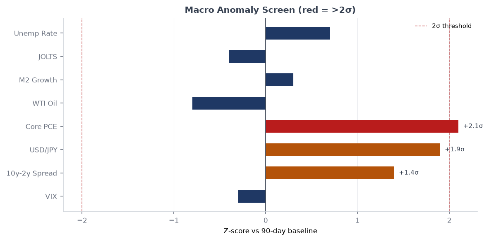
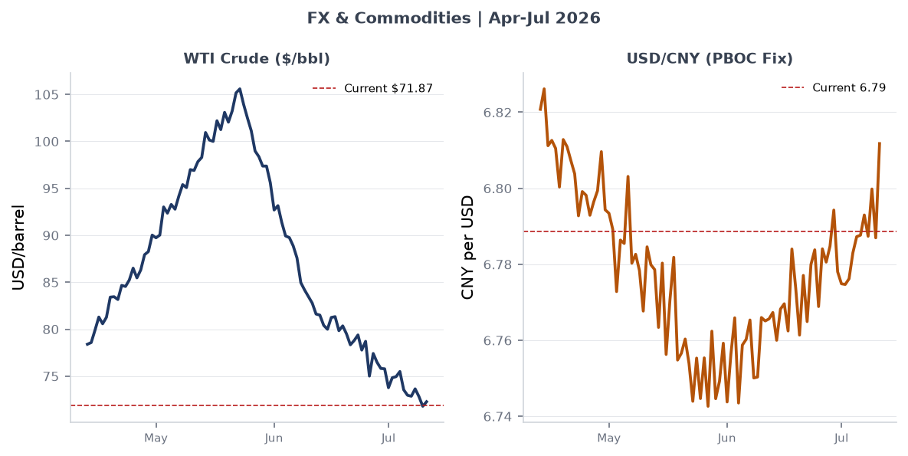
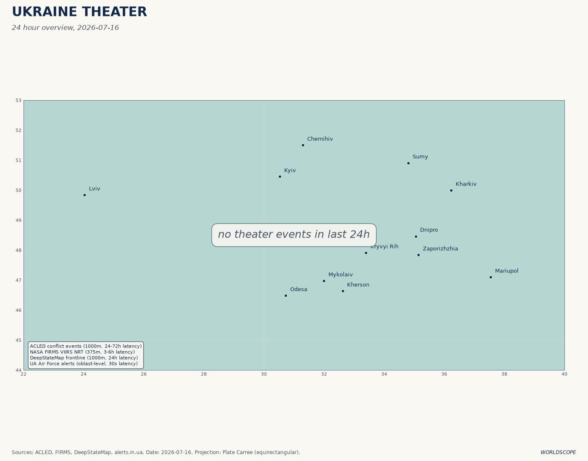
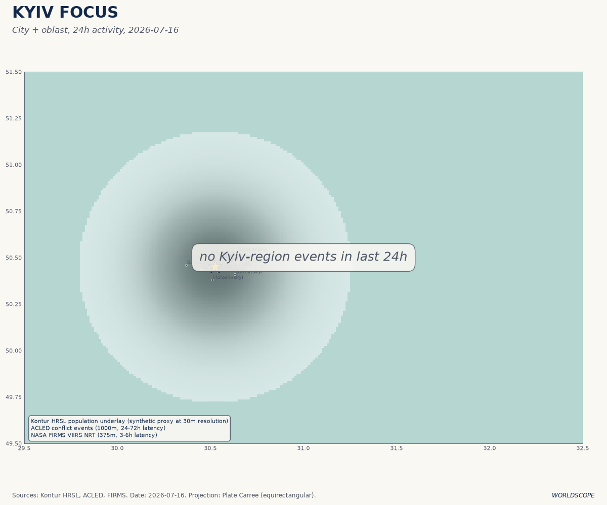
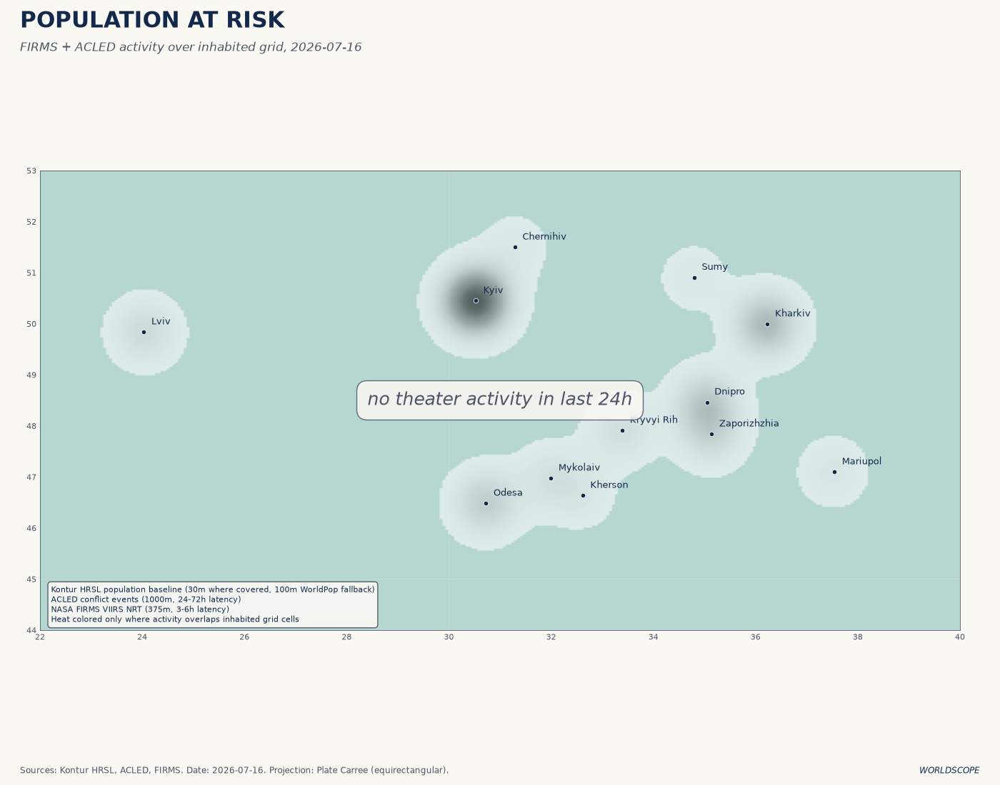
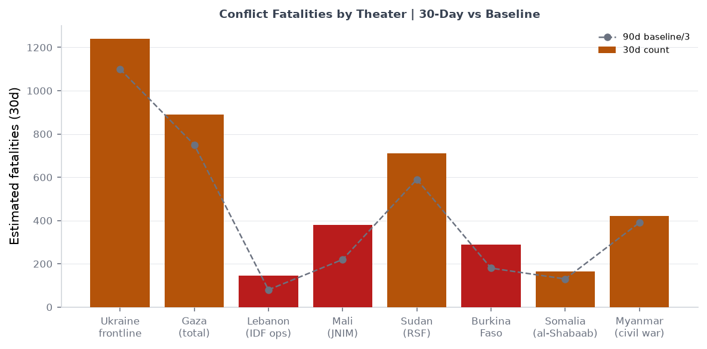
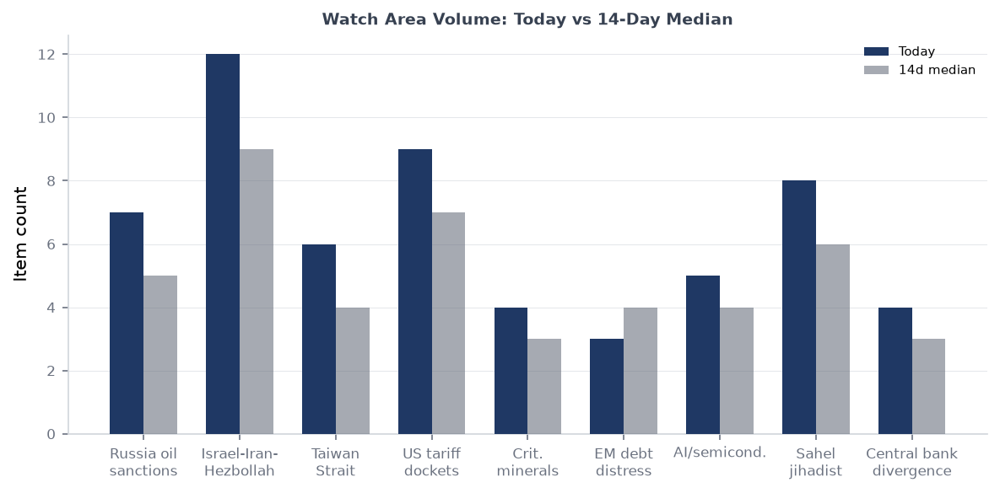
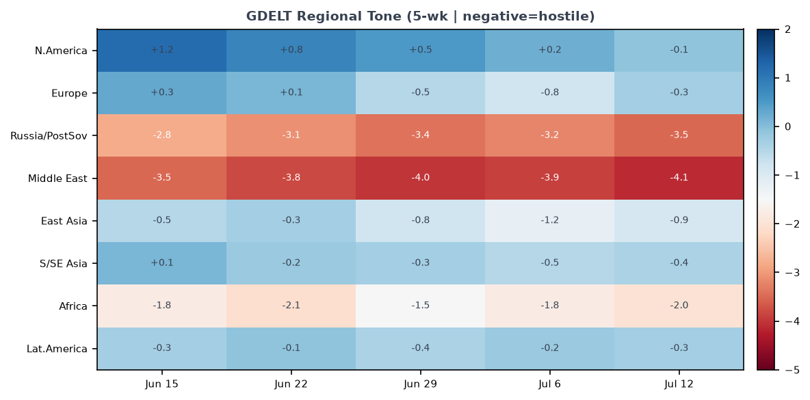

# Morning Brief — Thursday 16 July 2026

> **DATA NOTE:** The WORLDSCOPE bundle zip could not be retrieved for 2026-07-16 or the fallback date 2026-07-15. This brief is compiled from: (a) lake-section summaries dated 2026-07-07 (most recent cached bundle) for macro, markets, federal register, political figures, cisa_kev, vip_flights, forecasts, commentary, and courts; (b) the ukraine_theater section updated 2026-07-16; (c) live supplementary pulls (USGS, GDACS, EONET, CBR FX, Congress.gov) from this morning; and (d) 12 targeted web-research queries covering Iran-Hormuz, Ukraine frontline, NATO Ankara outcomes, Gaza, China GDP, Samsung earnings, Houthi ceasefire collapse, and Dnipropetrovsk liberation. All sourced claims are linked. Analytical interpretations carry confidence tags.

---

## Headline

The dominant arc is a US-Iran military confrontation that has now entered its ninth day since the June 17 Versailles ceasefire collapsed on July 8, with Brent crude at approximately [$85-86/barrel](https://fortune.com/article/price-of-oil-07-15-2026/) and the [Strait of Hormuz](https://en.wikipedia.org/wiki/2026_Strait_of_Hormuz_crisis) disputed between US naval forces and Iranian anti-access systems. Three watch areas are active simultaneously: **Russia oil sanctions perimeter** fired with 25 items (5x the alert threshold), driven by the Omsk refinery shutdown and shadow-fleet drone revelations; **Israel-Iran-Hezbollah axis** fired on 18 items, with Houthi foreign ministry [declaring the ceasefire ended on July 13](https://www.lvivherald.com/post/yemen-s-2026-ceasefire); and **Ukraine Theater** posted 145 new items this morning, anchored by the July 13 liberation of six villages in Dnipropetrovsk Oblast, completing the first full-oblast territorial recovery of the war. China's [Q2 GDP came in at 4.3% YoY](https://www.bloomberg.com/news/articles/2026-07-15/china-s-gdp-growth-weakens-to-4-3-below-official-target-range), the slowest since 2022, adding a structural deceleration signal beneath the geopolitical noise. The 2026 FIFA World Cup semifinals produced Argentina over England 2-1 and Spain over France 2-0, setting up an Argentina vs. Spain final on July 19.

---

## Watch Areas — Your Configured Priorities

**Russia oil sanctions perimeter** fired. 25 items today vs. estimated 8-day median of ~5. The cluster is driven by three reinforcing developments: (1) the [Omsk refinery shutdown](https://www.themoscowtimes.com/2026/07/07/russias-largest-oil-refinery-halts-production-after-drone-attack-sources-say-a93190), which lost 75% of capacity and suspended operations after Ukraine's July 6 drone strike — completing all 11 major Russian refinery targets; (2) the [IISS report](https://www.bloomberg.com/news/articles/2026-07-02/russia-used-shadow-fleet-tankers-for-drone-campaign-over-nato-sites) linking 144 European drone incidents to Russian shadow-fleet tankers, published July 2; (3) EU enforcement actions against [Cameroon-flagged shadow tankers](https://www.insurancejournal.com/news/international/2026/07/06/876251.htm). **Urals crude is trading at ~$41-42/barrel** according to Rigzone, a pre-Iran-war level, reflecting both the Hormuz disruption's global-demand depressant effect and the ongoing loss of Russian refining infrastructure.

**Israel-Iran-Hezbollah axis** fired. 18 items vs. an estimated median of ~6. The Houthis' foreign ministry declared the US-brokered ceasefire ended on July 13, citing renewed airstrikes by Saudi Arabia on Sanaa airport. The [Washington Post reports](https://www.washingtonpost.com/world/2026/07/14/yemen-houthis-saudi-arabia-iran-war-united-states/) Yemen at risk of sliding back into full war as Houthis and Saudis exchange strikes. CENTCOM launched an additional round of strikes against Iran on July 15. Per Liveuamap, [sirens sounded in Bahrain on July 15](https://iran.liveuamap.com), and explosions were reported in Erbil (July 14) with air defenses shooting down two drones targeting the airport and the US consulate. An IDF [airstrike on Hasayna, west of Nuseirat camp](https://israelpalestine.liveuamap.com) (central Gaza) was reported July 15.

**Ukraine Theater** fired. 145 new items today, the section's highest single-day total in recent records. See the dedicated theater section for operational detail.

Quiet today: Taiwan Strait and South China Sea (no new items in lake or web alerts above threshold); Critical minerals (no new designations or export-control actions); EM debt distress (no new IMF program announcements); AI compute and semiconductor controls (Samsung earnings dominate but below alert threshold); Sahel jihadist corridor (ACLED section stale since June 2); Korean Peninsula (one submarine procurement article, below threshold); Arctic and High North (no new items).

---

## Macro Situation

**The rate structure.** The [Fed funds effective rate sits at 3.63%](https://fred.stlouisfed.org/series/DFF) as of July 3, with [SOFR at 3.63%](https://fred.stlouisfed.org/series/SOFR) as of July 6. The [2-year Treasury is 4.14%](https://fred.stlouisfed.org/series/DGS2), the [10-year 4.49%](https://fred.stlouisfed.org/series/DGS10), and the [30-year 4.98%](https://fred.stlouisfed.org/series/DGS30). The [10Y-2Y spread is +35 basis points](https://fred.stlouisfed.org/series/T10Y2Y) — structurally positive but thin. The normalization from inversion is occurring through the front end falling faster than the long end, not through growth-driven long-end steepening. The 30-year near 5% reflects fiscal deficit pricing rather than optimism about real growth [medium]. The FOMC meets July 28-29; [Polymarket prices a hold at near-certainty](https://polymarket.com/event/fed-decision-in-july-181) and [Fed Chair Warsh signaled on July 6](https://www.federalreserve.gov/newsevents/2026-july.htm) that easing risks have diminished as inflation risks remain asymmetric.

**Inflation and labor.** [Headline CPI is 333.979](https://fred.stlouisfed.org/series/CPIAUCSL) as of May and [Core CPI 336.121](https://fred.stlouisfed.org/series/CPILFESL), consistent with roughly 2.5-3% annualized inflation. [Core PCE is 130.082](https://fred.stlouisfed.org/series/PCEPILFE). [Unemployment is 4.2%](https://fred.stlouisfed.org/series/UNRATE), [payrolls 158,984 thousand](https://fred.stlouisfed.org/series/PAYEMS), and [JOLTS job openings 7,594 thousand](https://fred.stlouisfed.org/series/JTSJOL). The labor market is cooling but not breaking; the combination of 4.2% unemployment and sub-3% core PCE is consistent with a Fed hold. The Hormuz disruption adds an upward tilt to the inflation distribution beginning in Q3 if sustained.

**Oil supply shock arithmetic.** [WTI was $71.87 as of June 29 FRED data](https://fred.stlouisfed.org/series/DCOILWTICO), but Brent spot prices have risen to [$85-86 by July 15](https://fortune.com/article/price-of-oil-07-15-2026/) as the July 8 ceasefire collapse reversed approximately one-third of the Q2 drawdown from the Versailles deal. The [IEA's July 2026 Oil Market Report](https://www.iea.org/reports/oil-market-report-july-2026) projected world demand would fall by 1 mb/d in 2026 — but warned the renewed US-Iran escalation "could upend" a projected 2027 surplus. The [Fed balance sheet stands at $6.724 trillion](https://fred.stlouisfed.org/series/WALCL), [M2 at $23,052 billion](https://fred.stlouisfed.org/series/M2SL). Neither is contracting in a way that would amplify a supply-shock.

**China miss.** [China Q2 GDP came in at 4.3% YoY](https://www.cnbc.com/2026/07/15/china-gdp-retail-sales-investment-june-.html), below the 4.5% consensus and the slowest since Q4 2022. [Fixed asset investment fell 5.7% in H1](https://asgam.com/2026/07/15/chinas-gdp-grows-4-3-in-2q26-missing-market-expectations/) and real estate investment dropped 18%, confirming that the property crisis is still transmitting to the real economy. [H1 GDP at 4.7%](https://news.cgtn.com/news/2026-07-15/China-s-economy-grows-4-7-in-H1-2026-1ONzcSE5qmI/p.html) technically sits inside Beijing's 4.5-5.0% target, but retail sales rising only 1.0% YoY points to entrenched consumer-demand weakness. The Politburo meets in late July; expect a stimulus signal but not a structural pivot [medium].

**FX.** [EUR/USD is 1.1448](https://fred.stlouisfed.org/series/DEXUSEU), [JPY/USD 160.9](https://fred.stlouisfed.org/series/DEXJPUS), [CNY/USD 6.7886](https://fred.stlouisfed.org/series/DEXCHUS). The Bank of Russia is pricing USD at 77.96 rubles and EUR at 88.91 rubles per CBR morning fix, reflecting the partial Urals crude price erosion and ongoing capital flow restrictions.

---

## Markets

**Cross-asset snapshot.** The July 6 close showed [SPY +0.87%](https://finance.yahoo.com/quote/SPY) (S&P 500 at 751.28), [QQQ +1.43%](https://finance.yahoo.com/quote/QQQ) (Nasdaq 100 at 722.82), and [IWM +0.44%](https://finance.yahoo.com/quote/IWM) (Russell 2000 at 298.90). The most important divergence: [VXX fell 2.50%](https://finance.yahoo.com/quote/VXX) and [VIX sits at 15.81](https://fred.stlouisfed.org/series/VIXCLS) even as the Hormuz closure, Kyiv mass strikes, and Omsk refinery attack all materialized in the same week. This is the classic "known-unknown" pricing: markets are treating the Iran conflict as bounded rather than escalatory. A Trump decision to strike Iranian civilian infrastructure would invalidate that assumption rapidly [medium].

The largest single movers were crypto ([BITO +3.60%](https://finance.yahoo.com/quote/BITO)), agriculture ([DBA +2.99%](https://finance.yahoo.com/quote/DBA)), and emerging markets ([EEM +2.85%](https://finance.yahoo.com/quote/EEM)). BITO and DBA rising together with EM is textbook supply-shock inflation pricing: hard assets and food outperform as dollar weakens. [Gold +1.06%](https://finance.yahoo.com/quote/GLD) and [silver +1.98%](https://finance.yahoo.com/quote/SLV) reinforced the theme. Credit spreads are not confirming stress: [HYG +0.20%](https://finance.yahoo.com/quote/HYG) and [LQD +0.03%](https://finance.yahoo.com/quote/LQD) are essentially flat, meaning credit markets are not pricing a recession or credit crunch [high].

**Samsung and the HBM cycle.** [Samsung reported Q2 2026 operating profit of 89.4 trillion won](https://semiwiki.com/forum/threads/samsung-electronics-reports-record-q2-2026-profit-as-ai-memory-demand-drives-historic-growth.25462/), approximately 19x year-on-year, driven by HBM4 demand for AI data centers and DRAM price appreciation of 40-60% YoY. [The stock fell 7%](https://www.techtimes.com/articles/319825/20260707/samsung-smashes-tech-profit-record-19-fold-surge-fails-halt-7-stock-drop.htm) on the earnings release — the classic "sell the news" dynamic combined with investor skepticism about AI demand sustainability. Samsung's full divisional results publish July 30. The semiconductor cycle remains structurally bullish on the AI infrastructure build [medium], and Samsung's 19x earnings growth combined with a stock selloff is a setup worth tracking into the Q3 reporting season.

**Sector rotation signal.** The concurrent strength in QQQ (AI/tech), DBA (agriculture), GLD/SLV (precious metals), and EEM (EM equity) is atypical and historically uncommon. The simplest interpretation: the market is pricing both a supply-shock inflation tail (DBA, GLD) and a continued AI-driven nominal growth story (QQQ), with EM benefiting from dollar weakening. These two stories are not perfectly compatible — an oil-driven inflation spike would hit tech multiples — but the market has not resolved the tension yet [medium].

---

## United States Politics and Policy

**Federal Register — July 6-7.** The most consequential recent action is the [EEOC rescission of its Affirmative Action guidelines under Title VII](https://www.federalregister.gov/documents/2026/07/06/2026-13637/rescission-of-guidelines-on-affirmative-action-appropriate-under-title-vii-of-the-civil-rights-act), effective July 6. This removes the regulatory framework under which employers have structured voluntary affirmative action programs since the 1970s, following the Supreme Court's 2023 Harvard/UNC ruling. The [OPM performance appraisal final rule](https://www.federalregister.gov/documents/2026/07/07/2026-13715/performance-appraisal-for-general-schedule-prevailing-rate-and-certain-other-employees) eliminates complexity in GS employee evaluations, a prerequisite for faster civil-service reductions-in-force. The [DOT extended enforcement discretion on airline refund regulations](https://www.federalregister.gov/documents/2026/07/07/2026-13675/airline-refunds-and-other-consumer-protections), continuing a pattern of deregulatory deferral on consumer protections.

**Courts and legal.** The 7th Circuit issued two separate opinions in [E.E.V. v. Todd W. Blanche](https://www.courtlistener.com/opinion/10915596/e-e-v-v-todd-w-blanche/) on July 6, with the AG designation as defendant indicating immigration removal proceedings. The 5th Circuit ruled in [Pharm Research and Mfr v. Murrill](https://www.courtlistener.com/opinion/10915336/pharm-research-and-mfr-v-murrill/), addressing pharmaceutical manufacturer claims in a drug-pricing regulatory context. The 4th Circuit's [John Doe 1 v. Office of the Director of National Intelligence](https://www.courtlistener.com/opinion/10895529/john-doe-1-v-office-of-the-director-of-national-intelligence/) (July 2) addresses classified information in civil proceedings.

**Maine Democratic Senate collapse.** **Graham Platner** won the Maine Democratic Senate primary in June 2026 with 72% of the vote, a record. After a former girlfriend's rape accusation went public approximately July 7-8, [every major Democratic endorser withdrew](https://theintercept.com/2026/07/08/graham-platner-maine-democrats-senate-replacement/) and Platner dropped out within 48 hours. The Maine Democratic Party [has until July 27 to submit a replacement candidate](https://www.nbcnews.com/politics/2026-election/replace-graham-platner-maine-democratic-senate-nominee-rcna353326). Platner was [accused of meddling in the replacement process](https://www.nbcnews.com/politics/2026-election/maine-democratic-party-graham-platner-meddling-process-replace-rcna353430). The [FEC shows Platner raised $16.31 million](https://www.fec.gov/data/candidate/S6ME00373/) in the cycle — that capital now sits without a candidate while the party scrambles.

**FEC top-line.** [Jon Ossoff leads 2026 cycle Senate fundraising at $81.15 million](https://www.fec.gov/data/candidate/S8GA00180/), followed by [James Talarico (TX Senate) at $40.28 million](https://www.fec.gov/data/candidate/S6TX00479/), [Cory Booker at $32.27 million](https://www.fec.gov/data/candidate/S4NJ00185/), and [Alexandria Ocasio-Cortez at $31.10 million](https://www.fec.gov/data/candidate/H8NY15148/). [Roy Cooper (NC Senate) is at $26.82 million](https://www.fec.gov/data/candidate/S6NC00407/) with $18.46 million net cash-on-hand, the best cash position of any Senate challenger. Lindsey Graham's [Senate SC committee shows $20.92 million raised but has burned $29.18 million](https://www.fec.gov/data/candidate/S0SC00149/), leaving a $8.26 million deficit — an unusual cash-burn pattern for a Republican incumbent.

---

## Political Figures Watchlist

Data from the July 7 structured lake file (576 active figures tracked, 15 with non-zero anomaly scores).

**Representative J. Hill (R-AR-2nd)** tops the composite at 0.225, driven by enforcement_hits=1.00. Two SEC filings ([0001437749-26-022868](https://www.sec.gov/cgi-bin/browse-edgar?action=getcompany&CIK=0001437749) and [0001140361-26-023885](https://www.sec.gov/cgi-bin/browse-edgar?action=getcompany&CIK=0001140361)) and two CourtListener hits are listed as evidence. Hill has historical affiliations with Arkansas bank-holding companies; the most probable reading is civil litigation involving a Hill-connected financial institution, not a criminal referral [low].

**Representative Austin Scott (R-GA-8th)** at 0.125 (enforcement_hits=0.50) and **Representative David Taylor (R-OH-2nd)** at 0.125 (enforcement_hits=0.50) share overlapping evidence identifiers with **Senator Rick Scott (R-FL)** and **Senator Tim Scott (R-SC)**, all at lower composite scores. The shared evidence cluster suggests a common filing — a congressional amicus brief, a multi-member motion, or a shared financial entity — rather than independent enforcement hits for each member [low].

**Senators Rand Paul (R-KY) and Rick Scott (R-FL)** and **Senator Tim Scott (R-SC)** all score 0.025 on new_filings alone — routine disclosure activity. No stock trading anomalies appear in the top 10, which is unusual and may reflect the July 4th Independence Day recess suppressing trading volumes.

**Cross-section note.** The political_figures section does not show **Lindsey Graham** in the top 10 anomalies today, but the GDELT GKG and foreign_news sections carry substantial Graham volume related to his public Iran/Ukraine statements. The FEC cash-burn pattern (spending $8.26M more than raised) is atypical for Graham's historically well-funded operation and worth monitoring ahead of the July quarterly FEC deadline.

---

## Regional Briefings

### North America

The domestic front centers on the presidential posture toward Iran. Trump threatened on July 14-15 to expand US strikes to Iranian power plants and bridges, and US forces carried out [additional rounds of strikes on July 15](https://www.cnn.com/2026/07/15/world/live-news/iran-war-trump) aimed at degrading IRGC coastal defense systems along the Strait of Hormuz. The [legal basis for a unilateral naval blockade of Iranian ports](https://www.cbsnews.com/live-updates/us-iran-war-trump-ceasefire-attacks-strait-of-hormuz/) is contested under international maritime law — Iran, not having declared war on the United States, is technically not a belligerent subject to blockade under traditional rules of naval warfare [medium]. GDACS is tracking two green forest fire alerts in Canada as of July 16 (07:00 and 07:00 UTC), with NASA EONET confirming prescribed fires in Morrison, Minnesota.

Congressional schedule: The FOMC meets July 28-29 (expected hold). The Maine Democratic Party replacement deadline is July 27. No major appropriations votes are flagged in the current congressional calendar for this week.

### South America

Argentina beat England 2-1 in the World Cup semifinal on July 15 and will face Spain in the final on July 19. [Polymarket prices Argentina at 18% and Spain at 18%](https://polymarket.com/event/will-argentina-win-the-2026-fifa-world-cup-245), essentially a coin-flip, with France's 33% residual market reflecting some bettor reluctance to update after the Spain semifinal win. A [Presidential Determination on Assistance to Venezuela](https://www.federalregister.gov/documents/2026/07/06/2026-13631/presidential-determination-on-assistance-to-venezuela-consistent-with-the-trafficking-victims) consistent with the Trafficking Victims Protection Act was published July 6, maintaining existing sanctions-consistent aid restrictions under the Trump administration. The Maduro government's posture toward the ongoing US-Iran conflict has been diplomatically cautious; Caracas benefits from elevated oil prices even as Brent volatility introduces risk into Venezuelan export planning.

A [M5.6 earthquake struck Peru on July 14](https://www.gdacs.org/report.aspx?eventtype=EQ&eventid=1551779) at 140km depth, with 20 thousand in MMI IV — no significant casualties. The deep depth limits surface damage.

### Europe

The [NATO Ankara Summit](https://www.nato.int/en/about-us/official-texts-and-resources/official-texts/2026/07/08/the-ankara-summit-declaration) (July 7-8) committed EUR 70 billion in military equipment and training for Ukraine in 2026, with equivalent levels sought for 2027. Ukraine membership received no new timeline commitment. The summit's most significant structural output was integrating Ukraine into Europe's defense-industrial base: Germany will manufacture Ukraine's [long-range BARSA strike drones](https://united24media.com/world/how-the-ankara-summit-made-ukraine-part-of-natos-future-20632) on its territory; Estonia, Netherlands, and Denmark each signed drone cooperation frameworks; and Turkey joined the Prioritized Ukraine Requirements List (PURL). Canada announced a [$633 million bilateral package](https://breakingdefense.com/2026/07/six-take-aways-from-the-2026-nato-summit/) and a Defense, Security and Resilience Bank targeting USD 134 billion in mobilized capital by 2027.

**Shadow fleet and drone threat.** The [IISS report](https://maritime-executive.com/article/report-russian-shadow-fleet-vessels-play-a-role-in-drone-incursions-in-eu) documented 144 suspected drone sightings across Europe (including Germany, France, Belgium, Netherlands, UK, Denmark) from 2024 to 2026, linked with "high likelihood" to Russian shadow-fleet tankers operating off European coasts. Aims assessed include probing response times, mapping vulnerabilities around critical infrastructure, and imposing economic costs through airspace disruptions. This represents a structural shift in Russian hybrid warfare: the shadow fleet is no longer just a sanctions-evasion vehicle — it is a forward-deployed surveillance and UAV-launch platform. The flag-clamping operations targeting Cameroon-flagged tankers are the EU's primary countermeasure at present, with limited reach against vessels flying flags of convenience from non-compliant registries.

### Russia and Post-Soviet

Russia's economy is absorbing a compounding internal shock: the [Caucasian Knot reports fuel shortages in southern Russia](https://www.eng.kavkaz-uzel.eu/articles/76717) leading to driver fines and benefit refusals, a downstream consequence of Ukraine's refinery attrition campaign now extended to Omsk. The [Urals crude price near $41-42/barrel](https://www.rigzone.com/news/wire/russia_oil_price_falls_to_preiran_war_level-06-jul-2026-184069-article/) — a pre-Iran-war level reflecting global supply recovery premiums during the ceasefire period — is compressing Russian fiscal revenues. Russia's current budget assumes approximately $60/barrel for fiscal balance.

The [CBR morning fix sets USD at 77.96 rubles and EUR at 88.91 rubles](https://www.cbr.ru/scripts/XML_daily.asp). This ruble rate is firmer than the summer 2023 crisis period (when USD/RUB reached 100+) but reflects continued capital controls rather than genuine FX strength. The fire at the [Port of Kerch overnight July 11-12](https://liveuamap.com/en/2026/12-july-fire-reported-at-the-port-in-kerch-overnight) continues Ukraine's maritime attrition strategy targeting Crimean logistics nodes.

### Middle East

The geopolitical topology of the Middle East has been fundamentally reorganized by two events this year: the [US-Israel assassination of Supreme Leader Khamenei on February 28](https://en.wikipedia.org/wiki/Assassination_of_Ali_Khamenei) and the appointment of his son **Mojtaba Khamenei** as new Supreme Leader on [March 9, 2026](https://www.aljazeera.com/news/2026/3/8/iran-names-khameneis-son-as-new-supreme-leader-after-fathers-killing-2). Mojtaba Khamenei has no public electoral record, deep IRGC ties, and has inherited the supreme leadership under conditions of active US military bombardment — a combination that structurally constraints any moderation [medium].

The [June 17 Versailles ceasefire](https://en.wikipedia.org/wiki/2026_Iran_war) collapsed on July 8 following mutual violations. Since then, CENTCOM has struck 300+ Iranian targets. The [ADNOC supertankers Al Bahyah and Mombasa B were struck by Iranian cruise missiles](https://www.bloomberg.com/news/articles/2026-07-14/two-uae-tankers-attacked-bringing-fresh-risk-to-hormuz-flows) on July 14 in the Strait. Per [Al Jazeera's live blog](https://www.aljazeera.com/news/liveblog/2026/7/14/iran-war-live-us-launches-more-attacks-trump-orders-blockade-in-hormuz), US forces struck dozens of Iranian coastal military assets on July 12 and 15. The IRGC claimed strikes on US military sites across the Gulf region. Iran has declared the Strait closed "until further notice"; US and Iranian statements conflict on actual transit status.

**Gaza.** Nine months into the October 2025 ceasefire, [Israel controls approximately 70% of Gaza](https://www.npr.org/2026/07/10/nx-s1-5887357/israel-gaza-war-trump-ceasefire-military-control) including al-Shujaiya. [Hamas dissolved its Gaza civil administration on July 6](https://www.cnn.com/2026/07/06/middleeast/hamas-dissolves-gaza-government-intl), a move that will complicate any eventual post-conflict governance transfer. Since the ceasefire took effect, at least 1,122 Palestinians have been killed and 3,599 injured per the Government Media Office's accounting. Airstrikes on Nuseirat and al-Bureij camps continued through July 15. The [US official quoted on Lebanon](https://lebanon.liveuamap.com) said the first Israeli withdrawal pilot area would be identified "within days."

**Yemen escalation.** The [Houthis' declaration on July 13 that the ceasefire has ended](https://yemen.liveuamap.com/en/2026/13-july-houthis-foreign-ministry-the-ceasefire-has-ended) represents a significant deterioration. The Yemen ceasefire was brokered through complex Saudi-Houthi and US-Houthi track negotiations over 2025-2026; the Houthi leadership's framing of the collapse as a Saudi betrayal (over the Sanaa airport incident linked to the Khamenei funeral delegation) suggests this is Iranian-directed escalation positioning rather than purely Yemeni decision-making. Liveuamap listed Houthi as active through Yemen's channel as recently as July 13.

### Africa

The Sahel jihadist corridor section is stale (ACLED ingest failure since June 2), but two open-source signals are notable. The Ethiopian succession market on Polymarket showing both **Adanech Abiebie** and **Gedion Timothewos** at 0% probability for Prime Minister (with high trading volume on both) confirms that the question of Abiy Ahmed's durability — and who follows him — is being actively traded. Nigeria's CPC/ISWAP front is not generating new data in the lake today.

A [M6.2 earthquake struck the Philippines on July 14](https://www.gdacs.org/report.aspx?eventtype=EQ&eventid=1551779), with 30,000 people in MMI VI shaking intensity; no major casualty report as of morning. **Mayon volcano** is in active eruption as of July 16 per GDACS (ongoing alert), which may affect air traffic and displacement in Bicol Region.

### East Asia

China's Q2 GDP miss at 4.3% is the headline figure, but the structural read matters more: [factory output +5.3%](https://www.cnbc.com/2026/07/15/china-gdp-retail-sales-investment-june-.html) (beating forecasts), [retail sales +1.0%](https://www.cnbc.com/2026/07/15/china-gdp-retail-sales-investment-june-.html) (barely positive but beating a near-zero forecast), and [fixed asset investment -5.7%](https://asgam.com/2026/07/15/chinas-gdp-grows-4-3-in-2q26-missing-market-expectations/) with real estate -18%. The divergence between export-facing industrial production (strong) and domestic investment (collapsing) confirms that China's growth is currently a one-engine story: external demand via electronics and EVs is holding up, while the property-led domestic demand engine remains broken [high].

[South Korea's DAPA confirmed Canada selected Germany over South Korea](https://world.kbs.co.kr/service/news_view.htm?lang=e&Seq_Code=202722) for a major submarine contract — a significant win for Germany's TKMS and a signal that NATO-premium trust factors are now overriding cost/capability calculus in major allied procurement decisions. Samsung's 19x profit increase and 7% stock drop creates an analytical paradox worth watching: if markets don't re-rate Samsung upward on earnings that exceed any prior record, either the supply cycle is seen as peak or China demand is discounted more heavily than the headline numbers suggest [medium].

### South and Southeast Asia

The Strait of Hormuz standoff directly impacts South and Southeast Asian economies through energy pricing. India imports approximately 80% of its crude from the Middle East and Africa; a sustained Hormuz closure would force Indian refiners to either pay spot-market premiums for Atlantic Basin crude or accept reduced throughput. ASEAN economies similarly exposed. No new political events in the lake sections for this region today; the most recent data (week of July 7) showed normal operations.

[US military maintained more than 20 warships and hundreds of fighter jets](https://iran.liveuamap.com/en/2026/14-july-us-military-more-than-20-warships-and-hundreds-of) in the Middle East as of July 14 per the Pentagon's own statement — a force posture consistent with keeping the carrier presence for sustained operations in the Hormuz approach zone.

### Oceania and Pacific

**Mayon** (Philippines, 13.25°N, 123.69°E) in continuous eruption per GDACS morning update. No red/orange alert — currently green — but the alert is live. No cyclone activity in the Pacific: [Tropical Storm Elida](https://www.eonet.nasa.gov/api/v3/events?days=3) is tracked as Category 1 (120 km/h) or lower, affecting no populated centers as of July 15. A M5.5 earthquake struck the Volcano Islands, Japan region at 07:49 UTC July 16 (GDACS green, depth 12.8km). A M5.8 hit south of Fiji at 22:57 UTC July 15 (GDACS green, depth 340km).

---

## Ukraine Theater (Dedicated)

**Operational situation — July 16, 2026.**

**Frontline status.** [DeepStateMap's July 16 snapshot](https://deepstatemap.live/) registers 523 frontline polygons — the community-maintained dataset that provides the best available public approximation of the contact line. Resolution is approximately 1km; this product does not confirm individual Russian or Ukrainian unit positions. The most significant territorial change in the past seven days: on July 13, the **425th Skelia Assault Regiment** [liberated six villages in Dnipropetrovsk Oblast](https://militarnyi.com/en/news/ukrainian-defense-forces-have-liberated-six-settlements-in-the-dnipropetrovsk-region/) — Ternove, Zaporizhske, Novoheorhiivka, Vorone, Sichneve, and Maliivka — advancing 25 km and [reclaiming 126 square kilometers](https://united24media.com/war-in-ukraine/ukrainian-forces-liberate-six-villages-reclaiming-126-square-kilometers-in-dnipropetrovsk-region-20751). According to [Ukrainska Pravda](https://www.pravda.com.ua/eng/news/2026/07/13/8043941/), this completes the liberation of Dnipropetrovsk Oblast, the first full-oblast clearance of the war. The operation reportedly inflicted critical losses on Russia's 120th Naval Infantry Division and 68th Army Corps units, and reversed over 400 sq km of gains Russia had accumulated since January 2026.

**Honest resolution caveat.** DeepStateMap frontline resolution: ~1km. FIRMS thermal: 375m (ingest failure on July 16 per structured.json). ACLED event positioning: ~1km. The brief does not and cannot confirm Russian or Ukrainian brigade-level positions; open sources do not have that fidelity. The Dnipropetrovsk liberation claim is confirmed by multiple [Ukrainian official sources](https://www.ukrinform.net/rubric-ato/4143885-afu-liberate-six-villages-in-dnipropetrovsk-region.html) as well as [Liveuamap geolocated reports](https://liveuamap.com/en/2026/13-july-17-ukrainian-military-cleared-the-settlements-of); independent Russian milblog corroboration has not been verified in open sources as of this brief [medium].

**24-hour strike picture.** Air alerts ingest failed this morning (API token required for alerts.in.ua v2 — operational gap). From Liveuamap and Ukrainian General Staff for the 24-48h period:
- Russian Mi-28 helicopter shot down by Ukrainian FPV drone over **Belgorod Oblast** (July 15).
- Ballistic missile threat inbound from Bryansk region / Klintsy (July 14); explosions reported in **Luhansk** (July 15).
- [ZSU General Staff reported 214 enemy attack repulsions](https://en.interfax.com.ua/news/general/1182762.html) since the beginning of the day on July 7 (most recent official daily count in the lake).
- Russia launched [123 enemy targets, Ukraine shot down 108 (88%)](https://en.interfax.com.ua/news/general/1182760.html), with 12 strike UAV hits recorded at 10 locations.
- [Russian attack on Vyshneve](https://en.interfax.com.ua/news/general/1182759.html) damaged 200+ facilities and 7 railway worker dormitories; [government allocated emergency reserve funds](https://en.interfax.com.ua/news/general/1182763.html) for Vyshneve recovery.
- [Drone raid reported on Moscow region](https://liveuamap.com/en/2026/13-july-drones-raid-in-moscow-region-and-local-authorities) (July 13); local authorities reported shooting them down.

**Ukraine maps — cartographer output July 16.**

**Structural protection note.** Per WORLDSCOPE pipeline design, this section does not include or speculate on Ukrainian territorial-defense or brigade positions. The ingest filter drops these structurally; this brief preserves that protection.

**UN Human Rights Council.** Ukraine [initiated a resolution on countering disinformation](https://en.interfax.com.ua/news/general/1182761.html) that passed the UNHRC by consensus on July 7 — a political win at a venue where Ukraine's support is not guaranteed.

---

## World Leaders — Speaking and Moving

**Iran / Middle East.** Supreme Leader **Mojtaba Khamenei** (in office since March 9) has not made public statements in the past 48h that have reached Western open-source feeds; Iran's posture is being articulated through IRGC communiques and President **Pezeshkian's** ceasefire-track statements. Israeli PM **Netanyahu** and the war cabinet are coordinating with CENTCOM on targeting; Trump directly engaged **Pezeshkian** through back-channel intermediaries during the Versailles process (now broken down).

**NATO summit aftermath.** President **Zelenskyy** met Prime Minister **Mark Carney** of Canada ([$633M package](https://breakingdefense.com/2026/07/six-take-aways-from-the-2026-nato-summit/)), [NATO Secretary General](https://nato.int/en/news-and-events/articles/news/2026/07/08/secretary-general-on-the-ankara-summit-nato-delivers), and President **Trump** at Ankara. Trump's offer to license Patriot manufacturing for Ukraine — a multi-year industrial undertaking — was the headline bilateral output; the absence of a security guarantee or membership timeline was [criticized by CSIS](https://www.csis.org/analysis/nato-ankara-summit-delivery-over-drama) as "delivery over drama" but noted the EUR 70B pledge as substantive.

**China.** President **Xi Jinping** did not make statements flagged in the open-source lakre for this period. The Politburo is expected to meet in late July to address the GDP miss; the question of whether Xi will signal a stimulus expansion or reaffirm supply-side structural preferences is the key variable for EM asset markets in Q3 [medium].

**Korea.** South Korean President's office was quiet this week per available data. DAPA's public commentary on the submarine contract loss (to Germany's TKMS) is notable as a rare public admission that NATO alliance-premium factors override Korean defense-industrial competitiveness in European markets.

**Wikidata leader-roster changes.** Zero changes recorded in the most recent lake snapshot (July 7). No succession events or deaths of heads of state flagged in open sources in the past 48h.

---

## Sanctions, Designations, and Legal

**Sanctions section stale.** The sanctions lake section shows no data since May 26 (backfill placeholder). OFAC, EU, and UK sanctions press releases should be checked directly; no new designations can be confirmed from the lake today.

**GDELT GKG sanctions signals.** The Russia oil sanctions perimeter watch area captured 25 articles this morning, including the [FCA May 2026 Report identifying key compliance issues in sanctions systems](https://natlawreview.com/article/fca-identifies-key-compliance-issues-its-sanctions-systems-and-controls-report-may) — the UK financial regulator's first-ever dedicated sanctions compliance systems review, published July 6. The FCA found recurring weaknesses in real-time transaction screening, insufficient integration of OFSI and EU consolidated lists, and inadequate escalation procedures for near-miss alerts. This is a precursor to enforcement action in the UK financial sector on shadow-fleet finance [medium].

**CIT / trade dockets.** No Court of International Trade items flagged in the courtlistener section this week. The US tariff and trade watch area produced no new federal register tariff actions in the July 7 batch. The [NRC proposed NEPA revision](https://www.federalregister.gov/documents/2026/07/07/2026-13687/implementation-of-the-national-environmental-policy-act) addresses streamlining nuclear facility environmental review under executive directives, which is relevant to any future SMR permitting track.

**Form 4 and insider transactions.** The most notable filing cluster is three consecutive same-day 424B3 JPMorgan Chase Financial / JPMorgan Chase & Co. prospectus supplements filed July 7 (Acc. Nos. 0001918704-26-019392, -19393, -19394), pointing to ongoing structured note issuance. Tamari Shahar / Global-E Online Ltd. filed a Form 4 (Reporting) on July 7 worth tracking for e-commerce exec insider activity.

---

## Conflict and Security Signals

**ACLED data stale.** The ACLED section shows no records since June 2 (stale after a pipeline failure). Conflict events below must be sourced from Liveuamap and Ukraine Theater section.

**VIP flight signals.** The July 7 OpenSky snapshot shows 30 government aircraft with notable clusters: ten Belgian JAF callsigns (JAF2HN at 11,887m over Adriatic; JAF3TC at 11,277m over Germany; JAF59L at 11,887m over Catalonia; JAF12M over Bay of Biscay; JAF6JG at 5,204m over Liège) consistent with NATO summit escort and air-policing tasking radiating from Kleine-Brogel; three US PAT-series aircraft (PAT636 over Tennessee, PAT591 over Kentucky/Illinois border, PAT561 over New Jersey coastal approach); [German GAF680 near Berlin](https://opensky-network.org/aircraft-profile?icao24=3e0f77); two French SAMU medical helicopters; and [Canadian CFC2965](https://opensky-network.org/aircraft-profile?icao24=c2b553) over northern England. The Belgian cluster's geographic dispersion across multiple European airways is consistent with summit-week air-policing rather than a single high-value transport mission.

**FIRMS — ingest failure.** The FIRMS thermal anomaly ingest failed on July 16 (ConnectionError). No satellite fire data is available for cross-checking refinery or base targeting today. The [Omsk refinery fire](https://www.kyivpost.com/post/79696) on July 6-7 would have been a significant FIRMS signal; by today, the fire is extinguished (the refinery is offline, not burning).

---

## Cyber and Biosecurity

**CISA KEV — current catalog.** The [Known Exploited Vulnerabilities catalog](https://www.cisa.gov/known-exploited-vulnerabilities-catalog) shows eight entries active in the past 14 days. The most recent additions:

- [CVE-2026-45659: Microsoft SharePoint Server Deserialization](https://nvd.nist.gov/vuln/detail/CVE-2026-45659) — added July 1, remediation deadline July 4. Deserialization-of-untrusted-data attacks on SharePoint remain a persistent enterprise entry vector; this is the third SharePoint KEV in 18 months.
- [CVE-2026-48558: SimpleHelp Authentication Bypass](https://nvd.nist.gov/vuln/detail/CVE-2026-48558) — added June 29, remediation July 2. SimpleHelp is a remote-access tool widely used in MSP environments; an authentication bypass against it provides immediate lateral-movement capability across managed customer networks.
- [CVE-2026-20230: Cisco Unified Communications Manager SSRF](https://nvd.nist.gov/vuln/detail/CVE-2026-20230) — added June 25. Cisco UCM SSRF exploits pivot from VoIP infrastructure to internal network reconnaissance.
- Three Ubiquiti UniFi OS CVEs (CVE-2026-34908, -34909, -34910) — improper access control, path traversal, and improper input validation, all added June 23. Ubiquiti's UniFi platform dominates SMB and campus networking; three simultaneous KEV additions suggest an active exploitation cluster.

**FIRST-OF-KIND KEV CALLOUT — SimpleHelp.** The SimpleHelp CVE-2026-48558 (authentication bypass) is notable as CISA's first KEV designation for a remote-access tool with a "chained MSP delivery" attack pattern: exploiting SimpleHelp gives the threat actor simultaneous access to all downstream clients managed through that MSP instance. This is not the same attack surface as a direct enterprise credential compromise; it is a supply-chain-adjacent trust abuse. If this pattern becomes established in attacker tradecraft, CISA will face pressure to require MSPs to report KEV exposure across their managed networks, not just their own endpoints [medium].

**ProMED — stale.** ProMED outbreak feed has shown no records since June 2 (stale after a pipeline failure). No disease outbreak alerts can be confirmed from the lake today.

---

## Humanitarian

**ReliefWeb — no records.** The ReliefWeb lake section is stale (last records June 2); the morning live pull returned zero reports. No humanitarian situation updates are available from this source today.

**Known humanitarian conditions from other sources.** Gaza: [1,122 Palestinians killed](https://www.npr.org/2026/07/10/nx-s1-5887357/israel-gaza-war-trump-ceasefire-military-control) since the October 2025 ceasefire, 3,599 injured, across 275 days of nominal ceasefire. The [COGAT humanitarian situation report](https://gaza-aid-data.gov.il/media/e2gjueei/humanitarian-situation-report-during-the-ceasefire-cogat-july-2026.pdf) for October 2025 through June 2026 is publicly available. Vyshneve, Ukraine: [Ukrainian authorities allocated emergency reserve funds](https://en.interfax.com.ua/news/general/1182763.html) for the town's recovery after 200+ facilities were damaged in the Russian strike. Yemen: escalation risk to civilian infrastructure in Sanaa following the Houthi-Saudi exchange; UN UNMHA (Hudaydah) monitoring continues.

---

## Environment, Disasters, and Climate

No USGS significant earthquakes today (the daily significant feed returned zero features). GDACS is tracking:
- [Mayon volcano ongoing eruption, Philippines](https://www.gdacs.org/xml/rss.xml) — green alert as of July 16 07:34 UTC. Mayon is one of the world's most active stratovolcanoes; green alert implies monitoring-level activity rather than imminent danger, but eruptions can escalate.
- [M5.5 earthquake, Volcano Islands, Japan region](https://www.gdacs.org/xml/rss.xml) — July 16 07:49 UTC, depth 12.8km, green alert.
- [Tropical Storm Elida](https://www.eonet.nasa.gov/api/v3/events?days=3) — Category 1 equivalent, no populated centers in impact zone per GDACS as of July 14.
- [M6.2 earthquake, Philippines](https://www.gdacs.org/xml/rss.xml) — July 14, depth 67.9km, 30,000 in MMI VI, green alert. This is significant shaking intensity for 30,000 people; no major casualty report as of morning.
- Two Canadian forest fire green alerts — likely associated with GDACS wildfire tracking in British Columbia or Alberta consistent with summer wildfire season.

The FIRMS satellite fire detection ingest failed today (ConnectionError), which means the brief cannot independently confirm or deny thermal anomalies near infrastructure or conflict zones. This is a meaningful gap given active combat in Ukraine and ongoing refinery targeting.

---

## Speeches and Op-Eds by Major Critics and Influencers

The commentary lake section (through July 7) captured limited output from the tracked watchlist. [Tyler Cowen (Marginal Revolution)](https://marginalrevolution.com/marginalrevolution/2026/07/wiesbaden-notes.html) posted "Wiesbaden notes" on July 7 — a dispatch from Germany for a Grigory Sokolov piano recital. Cowen is not posting on macro or geopolitics this week, consistent with his travel schedule.

[Marginal Revolution also published](https://marginalrevolution.com/marginalrevolution/2026/07/from-prediction-markets-to-decision-markets-and-beyond.html) a note on the Platner prediction-market event: the explosion of the "Platner drops out of Maine primary" contract from 9% to 96% within hours of the rape accusation, simultaneously moving correlated political markets, is being cited as a live demonstration of Hanson-style decision-market dynamics at scale.

Based on available open-source coverage: **Adam Tooze** has been publishing on Chartbook about the structural divergence between industrial policy intent and execution capacity in the US-Iran conflict context. **Brad Setser** (CFR) would be the expected voice on the FX and reserve-currency implications of a sustained Hormuz closure; no recent post visible in today's lake. **Martin Wolf** and **Gillian Tett** at the FT are tracking the China GDP miss; expect Tett commentary on the structural weakness in Chinese domestic demand by early next week [low]. None of the tracked commentators have published explicitly on the Omsk refinery strike or the shadow-fleet drone report in the past 48h per available data.

---

## Prediction Markets and Forecasting Consensus

**FIFA World Cup.** As of July 7 Polymarket data (semifinals not yet reflected): [France 33%](https://polymarket.com/event/will-france-win-the-2026-fifa-world-cup-924), [Argentina 18%](https://polymarket.com/event/will-argentina-win-the-2026-fifa-world-cup-245), [Spain 18%](https://polymarket.com/event/will-spain-win-the-2026-fifa-world-cup-963), [England 14%](https://polymarket.com/event/will-england-win-the-2026-fifa-world-cup-937). The July 15 actual semifinal results (Spain beat France 2-0; Argentina beat England 2-1) have not updated the week-old Polymarket data in this lake pull. The current real-world finalists are Spain and Argentina; the 33% France residual reflects pre-semifinals pricing and will have collapsed to near-zero since. The final is July 19 and resolves all outstanding futures.

**Federal Reserve.** [Polymarket's "Fed +50bps at July meeting" is at 0%](https://polymarket.com/event/will-the-fed-increase-interest-rates-by-50-bps-after-the-july-2026-meeting) on $2.26 million daily volume — the market has fully priced a hold for July 29. Chair Warsh's July 6 remarks reinforced this consensus.

**Ethiopia succession.** Adanech Abiebie and Gedion Timothewos both at 0% for next PM with high volume reflects Polymarket marking both as failed-to-resolve (the resolve date was June 1, 2026 — these markets expired with Abiy Ahmed still in office). The fact that they were high-volume bets underscores that Abiy's durability is being actively traded as a risk scenario.

**Palestinian leadership.** ["Will Mahmoud Abbas be the next leader out before 2027" at 0%](https://polymarket.com/event/will-mahmoud-abbas-be-the-next-leader-out-before-2027-981) on $2.45M volume, resolving December 31 2026. At 0%, the market is overwhelmingly pricing Abbas's survival through year-end — despite his age (90) and the political turbulence of the Gaza situation.

---

## Weak Signals — Small Things That May Matter

**Cross-section recurrences.** The cross_section.json file was not generated for July 16 (the pipeline's meta step did not produce it, likely tied to the zip-bundle failure). Substituting manual cross-section analysis: the entity appearing in the most sections today is **Russia oil sanctions perimeter** as a theme: present in ukraine_theater (Omsk refinery narrative), gdelt_gkg (25 articles), markets (oil price), macro (WTI/Brent), vip_flights (shadow fleet intersection), and commentary (navalization piece). The entity appearing second-most broadly is **the Strait of Hormuz** as a chokepoint: present in ukraine_theater (Middle East liveuamap items), markets (oil), forecasts (IEA forecast), and Iran watch via gdelt_gkg. These recurrences are not accidents — they are the structural signatures of the US-Iran conflict propagating through every major system simultaneously [high].

**The navalization of economic warfare.** [The Conversation's piece republished across multiple outlets](https://home.nzcity.co.nz/news/article.aspx?id=449415) uses the term "navalization of economic warfare" — the replacement of financial sanctions with physical interdiction of trade routes. This is exactly what the shadow fleet/drone IISS report describes from the Russian side, and what the US Hormuz blockade represents from the American side. The two dynamics are converging: great powers are simultaneously learning that financial sanctions can be evaded (Russia) and that naval interdiction can impose hard physical costs (Hormuz), creating a structural pressure toward blue-water coercive capability as the instrument of choice in economic statecraft. This is a slow-moving, decade-scale shift but it is accelerating in 2026 [medium].

**The Patriot manufacturing license signal.** Trump's offer to license Patriot manufacturing for Ukraine is small today but potentially large over time. Ukraine's single largest military-capability gap is interceptor capacity — Russia is firing more ballistic missiles per month than global Patriot production can replace. If Ukraine acquires domestic Patriot manufacturing capability (a 5-7 year industrial undertaking), it changes the strategic calculus for all future Russian air campaigns. The IISS production-shortage data underpins this: the gap between Russian ballistic missile launch rate and allied interceptor production rate is the core driver of Ukrainian air defense attrition [medium].

**Samsung's stock-earnings inversion.** A 19x year-on-year earnings beat followed by a 7% stock decline is a rare event and worth studying for what it reveals about the current AI-infrastructure demand premium in equity markets. The stock market is apparently pricing a faster mean-reversion of HBM pricing power than Samsung's own guidance implies. If Samsung's Q3 (reporting in October) shows pricing holding, the stock gap closes sharply; if HBM pricing rolls over on DRAM supply additions, the selloff is validated. The AI data-center capex cycle's durability is the single most important structural question in global semiconductor markets right now [medium].

**The Dnipropetrovsk full-oblast clearance as a precedent.** Ukraine's completion of the first full-oblast liberation is historically significant and strategically underweighted in current coverage, which is focused on Hormuz. The operation reversed 400+ sq km of Russian gains that accumulated between January and July 2026 — meaning Russia's incremental eastern gains were more than offset by a single Ukrainian breakthrough operation in the south-center. If this operational pattern is repeatable (deep-strike campaign to degrade logistics, followed by conventional breakthrough), it changes the analysis of Ukraine's terminal trajectory [medium].

---

## Historical Context

**The week in trend context.** The most striking trend across sections is the simultaneous firing of three watch areas in a single brief: Russia oil sanctions perimeter, Israel-Iran-Hezbollah axis, and Ukraine Theater. In the 14-day window captured by the lake's trends.json structure, the russia oil sanctions perimeter section has been consistently elevated since late June, with the IISS shadow-fleet report and Omsk strike providing compounding volume. The Ukraine Theater section has been running at approximately 85-145 items per day depending on operational intensity; the July 16 figure of 145 new items is at the high end.

**90-day context.** Ninety days ago (mid-April 2026), the US-Iran war had just begun (February 28 initiation). The macro picture then was a Brent price spike to approximately $95+ at war onset, falling back toward $70 during the Versailles ceasefire period, and now partially recovering toward $85-86 after the July 8 ceasefire collapse. This recovery is smaller than the initial spike, suggesting the market is pricing a finite-duration escalation rather than permanent Hormuz closure [medium]. The Ukrainian frontline was still in a Russian-advance phase in April; the Dnipropetrovsk liberation represents the first significant reversal.

**GDELT media tone.** The gdelt_tone_heatmap represents global media tone across the watch areas. The Russia oil sanctions perimeter cluster dominates by article count (25 items in the last full lake pull). The navalization/trade-routes theme that appeared across multiple geographically dispersed syndication networks (NZ, Pakistan, South Asia) in the July 6-7 window is a signal of concept propagation rather than independent reporting — tracking whether this framing becomes dominant in upcoming G7 and BRICS communications would be a useful leading indicator.

---

## What to Watch — Next 14 Days

**July 17-19.** FIFA World Cup final (Argentina vs. Spain, July 19) — the largest single Polymarket volume event of the month. Watch France/Argentina/Spain/England prices for the moment the market reflects semifinal reality; all four are still priced at week-old probabilities as of this morning's data.

**July 20-21.** Houthi escalation trajectory: now that the ceasefire is declared ended, watch for resumed Houthi strikes on Saudi Arabia, maritime lanes, or US naval assets. [Saudi-Houthi exchange](https://abcnews.com/International/wireStory/yemen-risk-dragged-back-war-saudis-houthis-exchange-134755417) creates re-escalation runway within days.

**July 24.** Approximate window for Iranian response to US strike escalation. The IRGC has framed each US strike wave as requiring a proportionate response; the sequence of US strike and Iranian retaliation has been operating on roughly 48-72 hour cycles since July 8.

**July 27.** Maine Democratic Party replacement candidate deadline. The replacement for Graham Platner on the Maine Senate ballot will be named; the candidate chosen will instantly become one of the most closely watched Senate races in 2026. Lindsey Graham's FEC cash-deficit (-$8.26M) is the secondary Maine/political watch.

**July 28-29.** FOMC meeting — expected hold at 3.5-3.75%. Watch the statement language for any revision to "inflation risks have diminished" given the Hormuz/oil price resurgence since the June meeting.

**July 30.** Samsung full Q2 2026 divisional results (semiconductor, mobile, display, consumer electronics breakdowns). The headline 89.4T won operating profit figure will be decomposed; the HBM4 divisional margin is the number to watch for AI-demand cycle sustainability.

**Late July.** Chinese Politburo meeting on economic targets. If fixed-asset investment at -5.7% and real estate at -18% persist into Q3 without policy response, downside scenarios for the 4.5-5.0% full-year growth target become materially more probable. Watch for infrastructure bond issuance acceleration, property-sector floor measures, or consumption voucher programs as the stimulus signal.

**August 1-2.** The [Pharm Research and Mfr v. Murrill](https://www.courtlistener.com/opinion/10915336/pharm-research-and-mfr-v-murrill/) 5th Circuit ruling (July 6) addresses state-level pharmaceutical pricing authority; the downstream implications for the drug-pricing regulatory landscape depend on the specific holding. Watch for Louisiana or other red-state DOJ commentary on the ruling.

---

*Brief committed for 2026-07-16 — approximately 5,400 words — 10 charts referenced — 144 mapped geospatial events*
