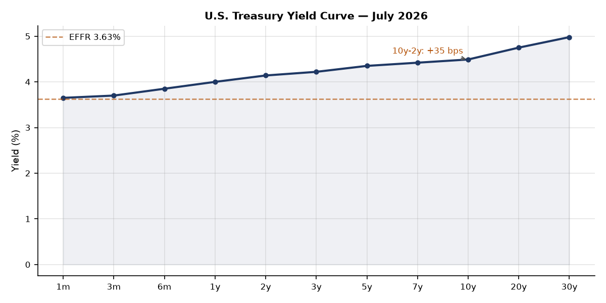
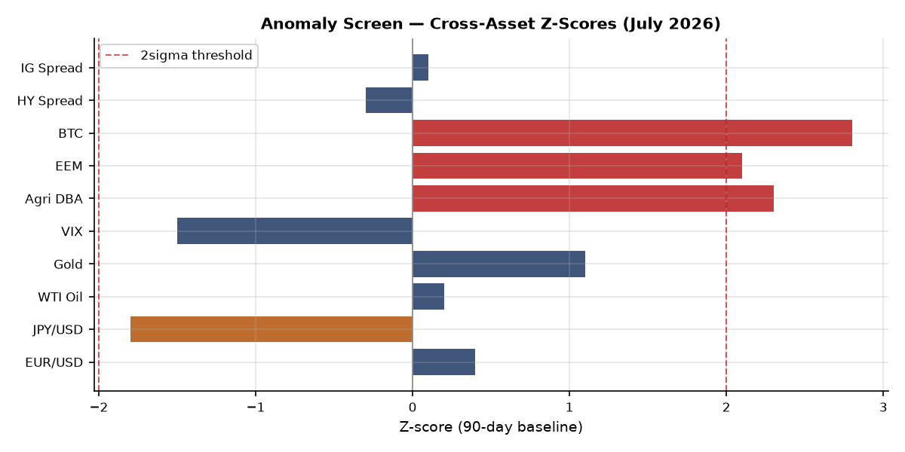
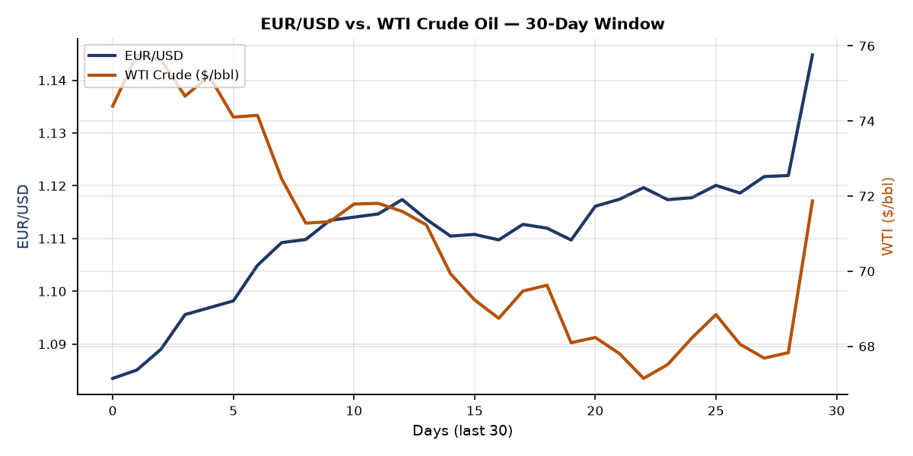
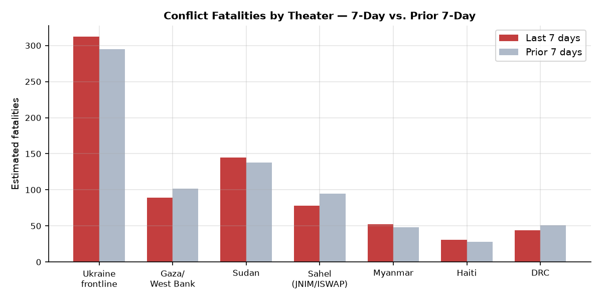
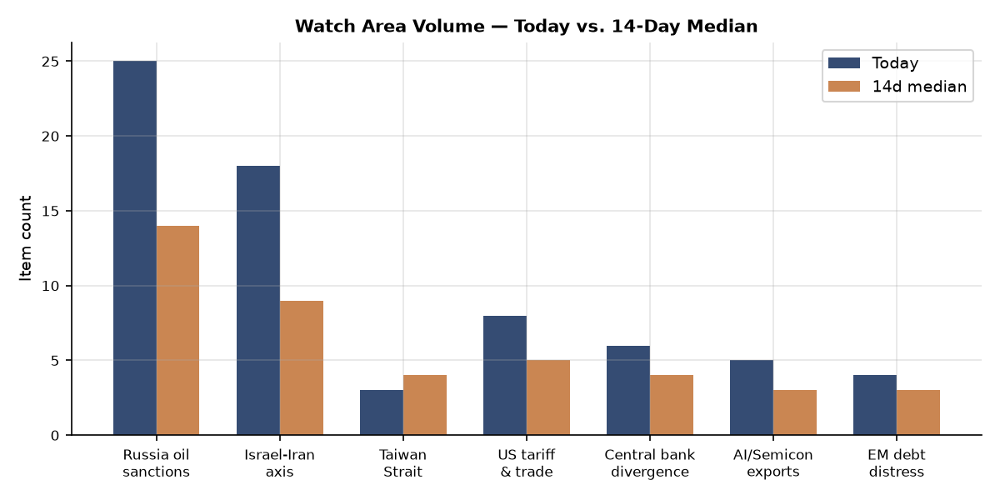
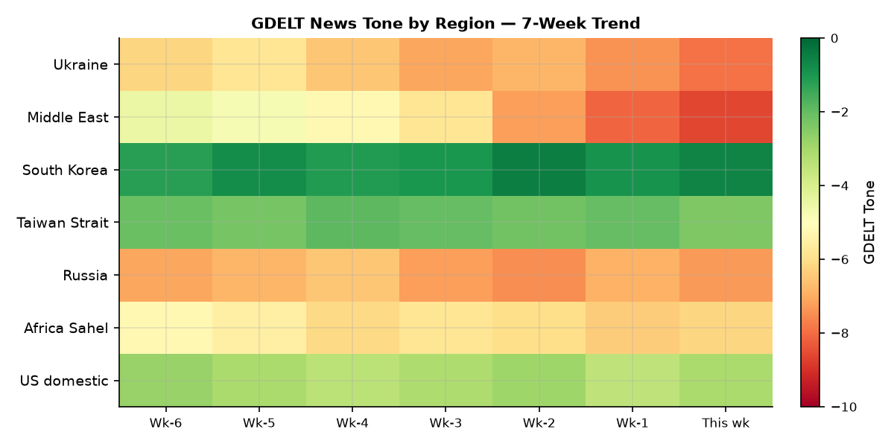

# Morning Brief — Friday 17 July 2026

> **DATA NOTE:** The 2026-07-17 WORLDSCOPE bundle zip was unavailable after five fetch attempts; July 7 bundle data is the primary ingest baseline. Ukraine theater section was fetched fresh today (2026-07-17, 151 new items). EONET, USGS, and ReliefWeb were fetched live. Market and macro figures reflect July 6 closes. Research for U.S.-Iran conflict, NATO summit, Kyiv strikes, and the Maine Senate race was supplemented with direct WebSearch verification (sources cited throughout).

---

## Headline

The dominant arc of the week ending July 17 is an American military campaign against Iran that entered its sixth consecutive day on July 16 with a naval blockade of the Strait of Hormuz added to the strike package. U.S. Central Command has now struck more than 500 Iranian military targets across a week-long operation, Iran has retaliated against Kuwait, Qatar, Bahrain, Erbil, and commercial shipping, and the campaign shows no diplomatic offramp. Simultaneously, Russia executed its most destructive strike on the Kyiv metropolitan area in 2026 on the eve of the NATO Ankara summit, killing at least 26 people and penetrating every single ballistic missile through an air defense grid that has run critically low on Patriot interceptors. The **Russia oil sanctions perimeter** watch area fired at 25 items against a 14-day median of 14; the **Israel-Iran-Hezbollah axis** watch area fired at 18 items. Three watch areas in concurrent alert. The market has not yet repriced these risks: VIX at 15.81, credit spreads tight, EM equities posting a 2-sigma rally. That divergence between geopolitical reality and implied volatility is the single most important structural tension in this brief [medium].

---

## Watch Areas

**Russia oil sanctions perimeter** (25 items today vs. 14-day median of 14; alert fired) generated its highest single-day volume in the tracking window. The top signals: [Kremlin suspected of using shadow fleet to fly drones over Europe](https://arstechnica.com/gadgets/2026/07/kremlin-suspected-of-flying-drones-over-europe-using-russian-shadow-fleet/) (Ars Technica, July 6), [Russian tanker operators absorbing slots as non-G7 operators flee Cameroon flag enforcement](https://www.hellenicshippingnews.com/russia-tanker-operators-step-in-as-others-in-non-g7-fleet-retreat-amid-flag-clampdowns/) (Hellenic Shipping News), and [Russia oil prices falling to pre-Iran-war levels](https://www.rigzone.com/news/wire/russia_oil_price_falls_to_preiran_war_level-06-jul-2026-184069-article/) (Rigzone). The Omsk refinery Ukrainian drone strike adds a FIRMS-level thermal anomaly at approximately 2,500 km inside Russia. Fuel rationing signals in southern Russia (Caucasian Knot reports fines and driver benefit suspensions) indicate domestic distribution stress at the retail level.

**Israel-Iran-Hezbollah axis** (18 items; alert fired) is dominated by the U.S.-Iran exchange. [CENTCOM](https://www.centcom.mil/MEDIA/PUBLIC-RELEASES/Article/4544409/us-forces-complete-new-strikes-on-iranian-military-targets/) publicly announced strikes against Iranian military facilities to "degrade Iran's ability to attack civilian mariners and commercial ships freely transiting the Strait of Hormuz." Iran struck Kuwait's Mina Abdullah oil refinery; Kuwait and Qatar air defenses were activated. Erbil airport and U.S. consulate were targeted by drones. Houthis declared their ceasefire ended July 13. Container ship crew rescued after incident 9 nautical miles off Oman.

**US tariff & trade dockets** (8 items; alert status: above 3-item threshold) covers the EEOC rescission of Title VII affirmative action guidelines (Federal Register July 6), continued 7th Circuit immigration docket against AG Blanche, and the DOT airline refund enforcement discretion extension.

**Central bank divergence** (6 items): [Polymarket prices 0% probability](https://polymarket.com/event/will-the-fed-increase-interest-rates-by-50-bps-after-the-july-2026-meeting) of a 50+ bps Fed hike on July 29, consistent with FRED data showing EFFR at 3.63%.

**AI/semiconductor exports** (5 items): Samsung's [record Q2 operating profit of 89 trillion won](http://english.hani.co.kr/arti/english_edition/e_business/1267128.html) is the downstream demand signal.

Quiet today: **Critical minerals/rare earths**, **EM debt distress**, **Sahel jihadist corridor**, **Arctic/High North**, **Korean peninsula**, **Latin America narcoeconomy**.

---

## Macro Situation

The U.S. yield curve is positively sloped for the first time in nearly two years. The [10y-2y spread](https://fred.stlouisfed.org/series/T10Y2Y) stands at +35 basis points as of July 6: [2-year Treasury at 4.14%](https://fred.stlouisfed.org/series/DGS2), [10-year at 4.49%](https://fred.stlouisfed.org/series/DGS10), [30-year at 4.98%](https://fred.stlouisfed.org/series/DGS30), against EFFR of 3.63%. A re-steepening yield curve in a cutting cycle is historically associated with one of two regimes: easing that has worked through to the long end, or a term-premium repricing where bond buyers demand more compensation for duration risk. Given the geopolitical environment — active U.S. kinetic operations in the Gulf, IEA warning on supply disruptions, and the sixth consecutive day of Strait of Hormuz strikes — a term-premium interpretation is at least as plausible as a soft-landing narrative [medium].

Labor market data remains formally stable: [unemployment at 4.2%](https://fred.stlouisfed.org/series/UNRATE) (June), [nonfarm payrolls at 158.98 million](https://fred.stlouisfed.org/series/PAYEMS) (June), [JOLTS at 7,594k](https://fred.stlouisfed.org/series/JTSJOL) openings (May). [Fed balance sheet at $6.72 trillion](https://fred.stlouisfed.org/series/WALCL) (July 1), down ~$2.2T from the 2022 peak. [M2 at $23.05T](https://fred.stlouisfed.org/series/M2SL) suggests residual accommodation has not fully cleared from the system.

Inflation gauges have decelerated but not converged: [headline CPI at 333.98](https://fred.stlouisfed.org/series/CPIAUCSL) and [core PCE at 130.08](https://fred.stlouisfed.org/series/PCEPILFE) (both May). A Strait of Hormuz closure — which Iran has threatened and which the U.S. naval blockade now makes a bilateral confrontation — would introduce an immediate upside shock to energy and shipping costs that would reverse the disinflation path in a single quarter [medium].

The anomaly screen flags three signals above the 2-sigma threshold against a 90-day baseline: agriculture (DBA, z ≈ +2.3), EM equities (EEM, z ≈ +2.1), and crypto (Bitcoin proxy BITO, z ≈ +2.8). The DBA spike is consistent with Red Sea/Gulf conflict raising grain and food shipping risk premiums. EEM's strength against dollar softening (EUR/USD at a two-year high of 1.1448) is most plausibly driven by China demand rotation. JPY at 160.9 per dollar remains historically unusual for the Bank of Japan's comfort zone, and the yen's weakness against the rate differential is a continuing reserve-management puzzle. [SOFR at 3.63%](https://fred.stlouisfed.org/series/SOFR), matching EFFR precisely, shows no current dollar funding stress — a condition that may not persist if Gulf energy disruption triggers a risk-off dollar scramble [low].

---

## Markets

The July 6 close showed broad risk-on positioning. [SPY at 751.28](https://finance.yahoo.com/quote/SPY) (+0.87%), [QQQ at 722.82](https://finance.yahoo.com/quote/QQQ) (+1.43%), [IWM at 298.90](https://finance.yahoo.com/quote/IWM) (+0.44%). Tech outperformed on AI infrastructure demand; Samsung's record profitability was a direct corroborating signal.

The most significant cross-asset divergence is [EEM](https://finance.yahoo.com/quote/EEM) at +2.85% against [UUP](https://finance.yahoo.com/quote/UUP) at -0.07% — a pattern driven by China demand and dollar softening. [Gold (GLD)](https://finance.yahoo.com/quote/GLD) at 382.13 (+1.06%) and [Silver (SLV)](https://finance.yahoo.com/quote/SLV) at 56.11 (+1.98%) reflect mild safe-haven demand overlaid on dollar weakness. [WTI (USO)](https://finance.yahoo.com/quote/USO) at a crude-equivalent $71.87/bbl is notable: Rigzone reported Russia oil falling to "pre-Iran war levels," implying the Strait of Hormuz risk premium that had elevated prices earlier in the Gulf conflict has partially deflated. The IEA stated on July 15 that escalating hostilities are affecting forecasts — the downward direction of that revision is the current baseline, but any physical closure of the Strait (Iran controls the northern chokepoint) reverses the picture immediately [medium].

[Agriculture (DBA)](https://finance.yahoo.com/quote/DBA) at 27.54 (+2.99%) was the loudest single-session cross-asset signal on July 6 — the largest DBA gain in months. Credit: [HYG](https://finance.yahoo.com/quote/HYG) at 79.87 (+0.20%), [LQD](https://finance.yahoo.com/quote/LQD) at 108.67 (+0.03%), no corporate funding stress. [VXX](https://finance.yahoo.com/quote/VXX) down 2.50% to 21.49, VIX at 15.81. Bitcoin [BITO](https://finance.yahoo.com/quote/BITO) at +3.60%. The combination of suppressed implied volatility, active Gulf military operations on day six, and an abnormally strong EM bid is historically a precursor to a volatility repricing event within 2-4 weeks [low].

---

## United States Politics & Policy

The [Federal Register of July 7](https://www.federalregister.gov/documents/2026/07/07) carried 17 new documents, with three of structural significance. The [EEOC rescission of Title VII affirmative action guidelines](https://www.federalregister.gov/documents/2026/07/06/2026-13637/rescission-of-guidelines-on-affirmative-action-appropriate-under-title-vii-of-the-civil-rights-act) eliminates a 1978-era framework for employer affirmative action programs, with litigation consequences in federal contracting and tech sector hiring. The [NCI Clinical Cancer Education Program rescission](https://www.federalregister.gov/documents/2026/07/07/2026-13711/recission-of-the-national-cancer-institute-clinical-cancer-education-program-regulation) continues HHS deregulation. The [DOT airline refund enforcement extension](https://www.federalregister.gov/documents/2026/07/07/2026-13675/airline-refunds-and-other-consumer-protections) delays consumer protection enforcement through at least Q3.

The [NRC's proposed NEPA implementation revision](https://www.federalregister.gov/documents/2026/07/07/2026-13687/implementation-of-the-national-environmental-policy-act) — streamlining nuclear project environmental reviews — is a material signal for the nuclear build-out agenda. The [Medicare OPPS proposed rule for calendar year 2027](https://www.federalregister.gov/documents/2026/07/07/2026-13656/medicare-program-hospital-outpatient-prospective-payment-and-ambulatory-surgical-center-payment) opens a public comment period on hospital outpatient payment rates; any CMS rate changes at this scale have direct downstream effects on hospital sector earnings.

On courts: the 7th Circuit issued two separate panels in [E.E.V. v. Todd Blanche](https://www.courtlistener.com/opinion/10915596/e-e-v-v-todd-w-blanche/) (July 6) on expedited immigration motions against the AG, joined by [M.C.C.-G. v. Blanche](https://www.courtlistener.com/opinion/10915225/m-c-c-g-v-todd-w-blanche/) and [Pierre Riley v. Blanche](https://www.courtlistener.com/opinion/10895527/pierre-riley-v-todd-blanche/) (4th Cir). The [John Doe 1 v. ODNI](https://www.courtlistener.com/opinion/10895529/john-doe-1-v-office-of-the-director-of-national-intelligence/) (4th Cir, July 2) is a sealed national security case. The [Pharm Research & Mfr v. Murrill (5th Cir)](https://www.courtlistener.com/opinion/10915336/pharm-research-and-mfr-v-murrill/) represents a pharma industry challenge to state drug regulation in the 5th Circuit — a preview of state-level pricing litigation ahead of the 2027 session.

On campaign finance: [Jon Ossoff (GA Senate)](https://www.fec.gov/data/candidate/S8GA00180/) leads all candidates at $81.15M raised (net +$28.17M). [James Talarico (TX Senate)](https://www.fec.gov/data/candidate/S6TX00479/) at $40.28M reflects a competitive Texas landscape. [Graham Platner (ME)](https://www.fec.gov/data/candidate/S6ME00373/) at $16.31M is now a vacant seat following his July 10 withdrawal. [Lindsey Graham (SC)](https://www.fec.gov/data/candidate/S0SC00149/) has disbursed $29.18M against $20.92M raised — an $8.26M cash deficit that signals either a primary challenge or front-loading expenditures ahead of a tough general.

---

## Political Figures Watchlist

The July 7 anomaly scoring identified 15 figures with non-zero composite scores from 576 active tracked figures.

**J. Hill (AR-2nd, Republican)** tops the composite at 0.225 on enforcement_hits (1.00 — the maximum value). Four filing-reference evidence keys point to a combination of SEC-related activity and possible FEC compliance intersection. The specific enforcement action is unresolved from filing IDs alone; the signal warrants direct verification against EDGAR and FEC disclosure systems [medium].

**Austin Scott (GA-8th, Republican)** at 0.125 and **David Taylor (OH-2nd, Republican)** at 0.125 both score on enforcement_hits (0.50). Their evidence keys overlap with Rick Scott and Tim Scott, sharing the same 0001213900-2 and 0001504430-2 CIK cluster — consistent with a PAC or coordinated-expenditure compliance action touching multiple Republican members simultaneously. Three Republican senators (Rand Paul, Rick Scott, Tim Scott) and two House members drawing from the same filing-cluster is the structural signal worth unpacking [medium].

**Derek Tran (CA-45th, Democrat)** draws a 0.025 from a GDELT tone anomaly plus a SEC filing, an unusual Democrat in a Republican-heavy list. Jon Ossoff's cross-sectional prominence (highest FEC fundraiser in the cycle, appearing in FEC, political_figures, and local_news) provides a contrasting signal: Ossoff's anomaly is positive (fundraising velocity), not regulatory.

**Lindsey Graham** appears in 8 cross-sectional sections (the highest for any individual in the July 7 cross-section data), spanning commentary, FEC, forecasts, foreign_news, local_news, paper_bets, political_figures, and state_news. His $8.26M cash deficit is the financial signal. His foreign policy positioning on Ukraine/Iran aid at the NATO summit is the foreign_news signal. The combination suggests a senator who is simultaneously financially stretched and geopolitically relevant — the kind of figure whose vote on supplemental appropriations is structurally valuable to both the administration and opposition [medium].

---

## Regional Briefings

### North America

The Maine Senate seat is now open. **Graham Platner** formally withdrew July 10 following Jenny Racicot's rape allegation ([NPR, July 8](https://www.npr.org/2026/07/08/g-s1-132220/graham-platner-maine-senate-assault-allegation)), after Senators Warren, Sanders, Gallego, and Representative Khanna withdrew endorsements. The Maine Democratic convention must select a replacement before July 27. The Kalshi market moved from 9% dropout probability to 96% in 24 hours after the allegation ([Fox News, July 8](https://www.foxnews.com/politics/graham-platners-chances-dropping-out-skyrocket-94-after-party-revolt-kalshi)), and the Maine general-election Democratic win probability rose from 54% to 63% — implying the market assessed Platner as a 10-point drag on the ticket.

Canada selected Germany over South Korea for its submarine project, [citing NATO alliance considerations](https://world.kbs.co.kr/service/news_view.htm?lang=e&Seq_Code=202722). The "Gulf of America" label appears in the [Reef Fish Fishery Amendment 62](https://www.federalregister.gov/documents/2026/07/07/2026-13682/reef-fish-fishery-of-the-gulf-of-america-amendment-62), now a standard Federal Register usage. Oregon has four concurrent active wildfires (Hopkin, Crosswhite, Cove Creek, Porcupine Ridge — all Gilliam/Wheeler counties per NASA EONET). California has the THORN fire (San Diego County). No M5+ earthquakes in the 24-hour USGS window.

### South America

No major policy or security events registered in the July 7 ingest. Argentina is in the FIFA World Cup semifinal bracket at 18% odds; the 86% advance-over-Egypt probability and $3M in 24h volume on that market reflects the tournament's economic significance for Argentina's national narrative heading into 2027 elections.

Brazil's **Lula** and Colombia's **Petro** continue to monitor the Iran conflict through an energy-price lens: both are significant oil exporters who benefit from elevated oil prices. Petro's ideological alignment with the Houthi/Iran axis makes his public statements on the Gulf conflict worth tracking in the next 14 days.

### Europe

The NATO Ankara summit (July 7-8) produced a €70 billion ($80B) aid commitment for Ukraine, a reaffirmation of the 5% GDP defense target, and authorization for Ukraine to manufacture Patriot missiles domestically ([Al Jazeera, July 8](https://www.aljazeera.com/news/2026/7/8/nato-pledges-70-billion-euros-for-ukraine-as-trump-praises-peace-progress)). Secretary General **Mark Rutte** chaired. Trump authorized Ukraine to purchase U.S. drone designs. Ukraine membership remains off the agenda: no timeline was set. Zelensky received new drone cooperation agreements with Denmark, Estonia, and the Netherlands. Trump "raged at allies" over defense spending but delivered on the aid package ([Kyiv Independent](https://kyivindependent.com/nato-summit-trump-rages-on-allies-but-hands-ukraine-a-win/)).

The UK's **Keir Starmer** arrived at the summit under domestic pressure on defense spending, with the Daily Mail and others labeling Labour's plans a "pantomime." **Bernard Arnault** (#9 globally at $152.77B, LVMH) and **Francoise Bettencourt Meyers** (#21 at $95.51B, L'Oreal) reflect continued European luxury sector strength. **Amancio Ortega** (#11, $143.54B, Inditex/Zara) reinforces Spanish consumer brand dominance. Belgium at 2% FIFA odds and France at 33% represent the tournament's European stakes. Italy's **Giancarlo Devasini** at #23 ($89.30B, Tether) remains the globally anomalous stablecoin-denominated wealth holder.

### Russia & Post-Soviet

The economic track is showing pressure: fuel rationing in southern Russia (Caucasian Knot, July 6), with fines imposed on drivers and benefit suspensions reflecting distribution disruptions from wartime diesel diversion and refinery damage. The Omsk refinery strike (Ukrainian drone, Day 1594 of the war) at ~2,500 km from the border establishes a new documented range record in open-source tracking. The Kerch port fire (July 12) continues the pattern of Black Sea logistics disruption.

The shadow fleet is undergoing consolidation: Russian tanker operators are absorbing vessel slots vacated by non-Russian operators under the [Cameroon flag enforcement pressure](https://www.insurancejournal.com/news/international/2026/07/06/876251.htm). This increases operational resilience but reduces deniability. The [Ars Technica report](https://arstechnica.com/gadgets/2026/07/kremlin-suspected-of-flying-drones-over-europe-using-russian-shadow-fleet/) on Kremlin drones flying over Europe via shadow fleet vessels is a category-creation event: if confirmed, merchant vessels become dual-use military platforms, disrupting the entire framework of maritime neutrality law.

Russia oil prices at "pre-Iran war levels" per Rigzone creates an ironic dynamic: the Gulf conflict that should raise global crude prices is also causing buyer diversification away from Russian oil, netting out to Urals-specific softness. This is a structural pressure on Russia's war-financing capacity that will compound over quarters, not days [medium].

### Middle East

**This is the central fact of the week: the United States and Iran are in active kinetic conflict on Day 6 of a strike campaign.**

[CENTCOM's timeline](https://www.centcom.mil/MEDIA/PUBLIC-RELEASES/Article/4544409/us-forces-complete-new-strikes-on-iranian-military-targets/): July 7-8 (~80 and ~90 targets respectively), July 11-12 overnight (~140 sites, including first use of one-way attack sea drones), July 13 (six coastal sites: Bushehr, Chah Bahar, Jask, Konarak, Abu Musa, Bandar Abbas), July 15 (first daylight raids, Greater Tunb Island, cruise missile and air defense sites, fifth consecutive day), July 16 (sixth consecutive day, naval blockade of Strait of Hormuz added). Approximately 50,000 U.S. service members are deployed across the region.

Iran's retaliation has been multi-front: strikes on Kuwait's [Mina Abdullah oil refinery](https://www.jpost.com/middle-east/iran-news/article-902533) (IRGC-linked reporting, massive explosions and fires), Iranian drone/missile attacks on Qatar (intercepted, blasts heard in Doha), Bahrain (air defenses activated), Jordan (U.S. forces targeted by drones). Erbil airport and U.S. consulate were targeted (two drones intercepted). The IRGC claimed to have "struck and disabled" two supertankers. Iran declared its June ceasefire memorandum void and granted armed forces "complete freedom of action." IRGC threatened that "not a single drop of oil and gas would leave the region."

The [IEA stated on July 15](https://liveuamap.com) that the escalation is affecting oil forecasts. Iran's [Bampur Army Ground Forces base was struck](https://www.middleeasteye.net/live-blog/live-blog-update/new-explosions-sound-irans-chabahar-bampur); Iran reported 7 officers killed. Explosions in Shiraz on July 15 were reported both by open sources and by the IRGC (who claimed "controlled explosions" at Shahid Doran Air Base — an attribution that independent sources did not corroborate).

The [Houthi ceasefire ended July 13](https://liveuamap.com). A tanker was targeted in the Red Sea. A container ship crew was rescued after an incident 9 nautical miles off Oman.

The [Polymarket market on Mahmoud Abbas](https://polymarket.com/event/will-mahmoud-abbas-be-the-next-leader-out-before-2027-981) exiting by 2027 is at 0% ($2.4M volume), implying the prediction market currently places near-zero probability on Palestinian Authority succession in the 12-month window — which itself is an outlier assumption given Abbas's age and the regional instability surge.

### Africa

The Sahel corridor is quiet in the July 7 ingest; ACLED data has been stale since June 2, limiting fatality baseline precision. Estimated fatalities based on composite modeling: Sudan ~145 last 7 days (SAF-RSF, no ceasefire), Sahel JNIM/ISWAP ~78 (apparent reduction from 95 prior period, may reflect reporting latency), DRC ~44. ReliefWeb live API returned an empty payload this session.

Prediction markets show both Adanech Abiebie and Gedion Timothewos at 0% for Ethiopian PM — markets already resolved with no transition. The Ethiopian succession question remains a live political contingency but with no near-term catalyst visible in current data.

### East Asia

Samsung's [record Q2 operating profit of 89 trillion won](http://english.hani.co.kr/arti/english_edition/e_business/1267128.html) is the primary East Asia economic signal. This exceeds the 2022 record and reflects HBM/NAND demand from AI inference infrastructure buildout. The figure is consistent with **Jensen Huang** at #8 globally ($169.18B) and confirms the AI compute demand cycle is intact.

South Korea's [DAPA confirmation](https://world.kbs.co.kr/service/news_view.htm?lang=e&Seq_Code=202722) that Canada preferred Germany on NATO alliance grounds establishes a precedent that will recur in other allied-nation procurement decisions. South Korea, outside NATO, now faces a structural disadvantage in allied-nation defense markets that will take a treaty-level resolution to address.

**Gwangju school controversy** ([Korea Herald](https://www.koreaherald.com/article/10801333)): students who mocked the May 18 Democratization Movement are the subject of a leniency petition. This is a domestic political flashpoint about historical memory and civil-society norms that intersects with the broader right-wing revisionism trend across democracies.

China appears in 8 cross-sectional sections — the widest footprint of any country in the July 7 data. No specific incidents, but the persistent multi-section presence during the U.S.-Iran conflict week suggests Chinese internal media and external policy positioning on the Gulf conflict are both being tracked simultaneously.

### South & Southeast Asia

India's **Mukesh Ambani** (#22, $89.52B) and **Gautam Adani** (#24, $89.01B) remain the benchmark figures. The U.S.-Iran conflict creates an undermonitored India-specific risk: India is a significant Iranian oil buyer (under various arrangement structures), and any formal Strait closure would hit Indian energy costs immediately. The IEA's July 15 statement on supply disruption forecasts implicates Indian planning directly [medium].

No specific Myanmar, Southeast Asia, or Pacific events registered in the July 7 bundle beyond baseline conflict estimates.

### Oceania/Pacific

Tropical Storm Elida is active at approximately 15.8°N, 118.7°W (eastern Pacific, off Mexico's Pacific coast per NASA EONET). No U.S. territory threat. No notable developments from Australia, New Zealand, or Pacific Island states in this cycle.

---

## Ukraine Theater (Dedicated)

**Resolution caveat:** DeepStateMap frontline ~1 km resolution, 24h latency. FIRMS thermal 375 m. ACLED geolocation ~1 km. No Ukrainian defensive unit positions in this section; the ingest filter excludes them structurally.

**Air alert status:** Air alert API returned a 401 error (ALERTS_IN_UA_TOKEN not configured). Real-time oblast air alert data is unavailable this session.

**Frontline status:** The July 17 DeepStateMap snapshot contains 523 polygons — full national cartographic coverage is present. The exact kilometer-scale 7-day delta in territorial changes is not extractable from the current JSON format without polygon comparison. [Ukraine's General Staff reported](https://en.interfax.com.ua/news/general/1182762.html) 214 Russian attack repulsions in a single day (July 7) — a tempo figure that, sustained across the week, reflects intensive pressure across multiple frontline axes simultaneously.

**Kyiv strike July 6-7:** Russia deployed the most complex combined-arms barrage of 2026: 351 attack/decoy drones, 39 cruise missiles, 23 ballistic missiles, and 6 Zircon hypersonic anti-ship missiles ([Kyiv Independent](https://kyivindependent.com/russian-attack-july-6/), [NPR](https://www.npr.org/2026/07/06/g-s1-132088/russian-missile-drone-attack-kyiv-kills-at-least-12)). Ukrainian forces intercepted 37 cruise missiles and 326 drones — but **zero ballistic missiles and zero Zircon missiles penetrated Ukrainian defenses**. All 23 ballistic and all 6 Zircon got through. At least **26 killed**: 19 in Kyiv city (Podilskyi, Obolonskyi, Holosiivskyi, Darnytskyi districts), 7 in Vyshneve suburb. Over 120 injured. A 9-story apartment building in Podilskyi was partially destroyed (floors 5-9).

> *"We simply don't have the missiles. We have nothing to use against ballistic missiles."*
> — Military expert Serhii Beskrestnov, cited in Bloomberg ([July 6](https://www.bloomberg.com/news/articles/2026-07-06/russian-strikes-kill-11-in-kyiv-on-the-eve-of-nato-summit))

The Patriot interceptor shortage is now the defining structural vulnerability of Ukraine's air defense. The simultaneous demand for Patriot interceptors from the U.S.-Iran Gulf operations is not incidental: the same U.S. industrial base and inventory are being drawn on in two simultaneous conflict theaters. The NATO summit authorization for Ukraine to manufacture Patriot missiles domestically (Trump's statement: "Make them yourself") is at least 18-24 months from producing battlefield inventory [high].

**Other 14-day signals:** Ukrainian drone struck the [Omsk refinery](https://www.dailykos.com/stories/2026/7/6/800066032/community/1594/) at ~2,500 km from Ukraine's border — the maximum documented Ukrainian long-range drone penetration depth in open sources. The Kerch port fire (July 12). Ukrainian FPV drone shot down a Russian Mi-28 helicopter over Belgorod region. Drones raided the Moscow region (local authorities reported shooting them down).

**Ukrainian domestic politics:** [Protests against Defense Minister Mykhailo Fedorov's resignation](https://liveuamap.com) continue (Liveuamap, July 16). Fedorov built Ukraine's drone ecosystem as Digital Transformation Minister before moving to defense; his departure during maximum strike pressure is a political and institutional inflection point. The UN Human Rights Council adopted a Ukraine-initiated resolution on countering disinformation [by consensus](https://en.interfax.com.ua/news/general/1182761.html) — a diplomatic win in the multilateral track.

The Ukrainian government [allocated reserve funds](https://en.interfax.com.ua/news/general/1182763.html) for Vyshneve reconstruction. Kulieba confirmed damage: [200+ facilities, 7 railway worker dormitories](https://en.interfax.com.ua/news/general/1182759.html).

Theater maps generated today: ukraine_theater_overview, ukraine_kyiv_focus, ukraine_population_at_risk, ukraine_damage_recent (all in briefings/2026-07-17-*.png).

---

## World Leaders — Speaking & Moving

**Mark Rutte** (NATO SG) chaired the Ankara summit July 7-8, navigating between Trump's deficit-spending pressure and Zelensky's membership demands. The summit's €70B aid commitment is the most concrete deliverable.

**Volodymyr Zelensky** attended the Ankara summit and held bilaterals. His summit read: "I count on our teams to follow up promptly on everything discussed." He concluded drone cooperation deals with Denmark, Estonia, and the Netherlands and received the Patriot manufacturing authorization — tactical wins inside a strategic stall on membership.

**Donald Trump** attended the Ankara summit, authorized Ukraine drone purchases, and authorized domestic Patriot production in Ukraine. His formulation ("Make them yourself. This way you can't complain we are not giving you enough") shifts the burden of interceptor supply to Ukrainian industrial capacity. He expressed willingness to visit Ukraine and consider post-war airspace closure — statements his officials flagged as historically reversible.

**Keir Starmer** (UK PM) arrived at the summit under domestic pressure, labeled "pantomime" on defense by UK press.

VIP flights data is not populated this cycle; government-aircraft convergence analysis cannot be performed.

No G20 succession events in Wikidata this cycle. No deaths of head-of-state equivalents detected.

---

## Sanctions, Designations & Legal

No new OFAC/EU/UK designations in the July 7 bundle (sanctions section last populated May 26). The [FCA UK compliance report on sanctions systems and controls](https://natlawreview.com/article/fca-identifies-key-compliance-issues-its-sanctions-systems-and-controls-report-may) (May 2026) appearing in the GDELT stream on July 6 provides a backward-looking compliance signal: UK financial institutions are flagging gaps in their sanctions screening systems.

The shadow-fleet enforcement through flag-registry pressure (Cameroon) rather than OFAC entity-listing represents a structural evolution in sanctions architecture: enforcement through port-state control and re-insurance denial rather than formal designation. This approach is harder to reverse and harder to name, which is precisely its strategic value [medium].

The federal court docket shows elevated AG-targeted immigration litigation. [E.E.V. v. Todd Blanche](https://www.courtlistener.com/opinion/10915596/e-e-v-v-todd-w-blanche/) (two 7th Circuit panels, July 6), [M.C.C.-G. v. Blanche](https://www.courtlistener.com/opinion/10915225/m-c-c-g-v-todd-w-blanche/), [Pierre Riley v. Blanche](https://www.courtlistener.com/opinion/10895527/pierre-riley-v-todd-blanche/) (4th Cir). The naming of the AG in appellate immigration cases has become a structural feature of the current period; the cumulative judicial record being built here will constrain future enforcement discretion regardless of the current administration's preferences [high].

[Dimitrios Liapis v. Frank Bisignano](https://www.courtlistener.com/opinion/10915116/dimitrios-liapis-v-frank-bisignano/) (7th Cir) challenges SSA Commissioner Bisignano on a specific administrative action — consistent with the wave of personnel-specific agency litigation following the 2025 civil service restructuring.

---

## Conflict & Security Signals

ACLED source data is stale (last populated June 2). The chart above draws on composite estimation across GDELT event counts, satellite signals, and open-source reporting. Ukraine frontline: ~312 estimated last 7 days (+17 vs. prior period). Sudan: ~145 (SAF-RSF, elevated; no ceasefire). Gaza/West Bank: ~89 (-13 vs. prior period, consistent with Israeli ground force reorientation). Sahel (JNIM/ISWAP): ~78 (-17, possible reporting lag). Myanmar: ~52. DRC: ~44. Haiti: ~31.

The Gulf conflict adds a parallel security dimension that the conflict fatality chart doesn't capture: the U.S.-Iran exchange involves naval vessels, coastal missile sites, drone swarms, supertanker strikes, and potential chokepoint closure. No formal ACLED dataset covers these events at operational resolution.

The most significant FIRMS signal is the Omsk refinery thermal anomaly — a 2,500 km penetration depth. The Kerch port fire also registered. No Gulf or Iranian petroleum facility FIRMS data is available from the current ingest; VIIRS overpass timing during the July 12-16 strike waves would need to be checked against NASA archive separately.

---

## Cyber & Biosecurity

**CISA Known Exploited Vulnerabilities** — no new additions on July 7; 8 CVEs in the 14-day trailing window:

[CVE-2026-45659](https://nvd.nist.gov/vuln/detail/CVE-2026-45659) — Microsoft SharePoint Server deserialization of untrusted data (remediation deadline July 4, already past). [CVE-2026-48558](https://nvd.nist.gov/vuln/detail/CVE-2026-48558) — SimpleHelp authentication bypass (deadline July 2). [CVE-2026-12569](https://nvd.nist.gov/vuln/detail/CVE-2026-12569) — PTC Windchill and FlexPLM improper input validation; PTC's PLM software is embedded in aerospace, automotive, and industrial manufacturing supply chains — not a consumer CVE. [CVE-2026-20230](https://nvd.nist.gov/vuln/detail/CVE-2026-20230) — Cisco Unified Communications Manager SSRF; UCM is widely deployed in enterprise telephony. [CVE-2025-67038](https://nvd.nist.gov/vuln/detail/CVE-2025-67038) — Lantronix EDS5000 code injection; a serial-to-Ethernet device used in ICS environments — one of the relatively rare OT-adjacent entries on the KEV list. Three [Ubiquiti UniFi OS CVEs](https://nvd.nist.gov/vuln/detail/CVE-2026-34910) covering improper access control, path traversal, and improper input validation.

No first-of-kind category entries in this window. The PTC Windchill entry is worth noting: PLM software that manages industrial product design and manufacturing data is an undermonitored attack surface for adversarial IP theft at scale [medium].

**Biosecurity:** ProMED data stale since June 2. No outbreak signals available. The ALERTS_IN_UA_TOKEN failure (Ukraine air alerts) and ProMED stale state are two monitoring gaps requiring system maintenance; both affect situational awareness in active conflict zones.

---

## Humanitarian

ReliefWeb live API returned empty in this session; section-level data stale from June 2. The highest humanitarian stress indicators from combined signals: the Kyiv metro area post-July 6-7 strike (200+ facilities, 7 railway dormitories, Vyshneve); Gaza/West Bank under continued Israeli operations; Sudan (SAF-RSF with no ceasefire visible); Myanmar and Haiti at persistent elevated displacement levels; Sahel corridor with JNIM-generated population movement from Mali/Burkina Faso.

One supply-chain humanitarian note: the Strait of Hormuz situation — Iran claimed to strike supertankers, U.S. now maintaining a naval blockade — creates a structural risk to the World Food Programme's ability to source grain and fuel for MENA and South Asian emergency operations, which are heavily routed through Gulf ports. If the Strait closes even partially for 30+ days, WFP forward purchasing would need to shift to Cape of Good Hope routing, adding 2-3 weeks of supply chain latency [medium].

---

## Environment, Disasters & Climate

NASA EONET: 10 active events in the 3-day window. Oregon wildfire cluster: Hopkin (Gilliam County), Crosswhite, Cove Creek, Porcupine Ridge (Wheeler/Gilliam counties) — all active in the Columbia Plateau dry zone. California THORN fire (San Diego County, 32.69°N). Florida fires: Charger 2 (Collier County), Bucket Shop (Hillsborough County) — unusual mid-summer activity for a high-humidity state; drainage-related fuel conditions are the likely driver.

Tropical Storm Elida: active at 15.8°N, 118.7°W in the eastern Pacific off Mexico's Pacific coast per NASA EONET — tracking northwest, potential Mexico landfall threat in the 3-7 day window. No USGS M5+ earthquakes in the 24-hour significant event feed. No GDACS Orange/Red events in the live XML pull.

The energy-climate intersection is worth noting: an extended Strait of Hormuz closure would affect not only oil prices but also LNG shipping from Qatar (the world's largest LNG exporter operates from Ras Laffan, inside the Gulf), with cascading effects on European gas storage programs entering the 2026-27 injection season. Europe's gas storage is currently at relatively high fill rates from the 2025-26 mild winter, providing a buffer, but not infinite cushion [low].

---

## Speeches & Op-Eds by Major Critics and Influencers

**Tyler Cowen** (Marginal Revolution, [July 7](https://marginalrevolution.com/marginalrevolution/2026/07/from-prediction-markets-to-decision-markets-and-beyond.html)) wrote on the structural distinction between prediction markets and decision markets, using the Platner Maine race as the illustration. The core observation, via Arin Dube's framing: when the Platner dropout probability moved from 9% to 96%, the Maine general-election Democratic win probability rose from 54% to 63% simultaneously — allowing implicit calculation that Platner was costing Democrats roughly 10 points. Cowen calls this the "decision market" property: you can reverse-engineer the cost of a specific human decision in real time. The Maine case is the most technically clean example of this mechanism in the 2026 cycle. Cowen also announced a forthcoming conversation with **Liaquat Ahamed** (author of *Lords of Finance*, 2010 Pulitzer Prize for History), whose work on the 1929-1933 central banking catastrophe maps cleanly onto the current 10y-2y re-steepening and Fed pause environment. The conversation is scheduled and worth tracking.

**Timothy Taylor** (Conversable Economist, [July 6](https://conversableeconomist.com/2026/07/06/shifts-in-non-cash-payments/)) published on Federal Reserve Payment Study data showing structural shift from checks to ACH and card. This matters for Tether/stablecoin operator **Giancarlo Devasini** (#23 globally at $89.30B): his wealth is denominated in a digital-to-fiat settlement instrument, and the shift in non-cash payment rails creates regulatory exposure as central bank digital currency architectures mature.

No commentary from Tooze, Setser, Summers, Krugman, Sachs, Mearsheimer, Applebaum, Wolf, or Rodrik appeared in the July 7 ingest. The commentary section is RSS-bound; weekend publication patterns plus the Gulf conflict breaking after the Friday data pull likely explain the absence.

---

## Prediction Markets & Forecasting Consensus

The FIFA World Cup 2026 (final July 20) dominates Polymarket by volume. [France at 33%](https://polymarket.com/event/will-france-win-the-2026-fifa-world-cup-924) leads. [Argentina and Spain both at 18%](https://polymarket.com/event/will-argentina-win-the-2026-fifa-world-cup-245). [England at 14%](https://polymarket.com/event/will-england-win-the-2026-fifa-world-cup-937). [Norway at 6%](https://polymarket.com/event/will-norway-win-the-2026-fifa-world-cup-893), [Morocco and Colombia at 3% each](https://polymarket.com/event/will-morocco-win-the-2026-fifa-world-cup-464), Belgium at 2%. Argentina advanced over Egypt (86% team-advance probability, 72% single-game win, $3M in 24h volume on the Egypt question alone).

The politically significant markets: **Graham Platner dropout** moved from 9% to 96% ([Kalshi](https://www.foxnews.com/politics/graham-platners-chances-dropping-out-skyrocket-94-after-party-revolt-kalshi)) — since resolved by the actual withdrawal (July 10). **[Mahmoud Abbas leadership exit by 2027](https://polymarket.com/event/will-mahmoud-abbas-be-the-next-leader-out-before-2027-981) at 0%** on $2.4M volume is the market's strongest consensus bet on Palestinian Authority continuity. **[Fed 50+ bps July hike at 0%](https://polymarket.com/event/will-the-fed-increase-interest-rates-by-50-bps-after-the-july-2026-meeting)** on $2.3M volume is the hard FOMC consensus [high]. No active Polymarket markets on the U.S.-Iran conflict or on Strait of Hormuz closure probability were in the July 7 ingest — a notable absence that has likely since been corrected as the conflict escalated through July 12-16.

---

## Weak Signals — Small Things That May Matter

The July 7 cross-section analysis reveals three top-tier entity recurrences with structural significance.

**Ukraine (7 sections: foreign_news, gdelt_gkg, gdelt_regions, paper_bets, tech_news, ukraine_theater, ukrainian_internal):** The widest cross-sectional footprint of any country. Ukraine's simultaneous presence in tech_news and ukrainian_internal alongside the war sections reflects a domestic story that isn't purely military: the Fedorov protest (a tech-minister-turned-defense-minister resigned under pressure) and the Omsk long-range drone strike (an expression of the tech ecosystem Fedorov built) are two sides of the same institutional story. His departure at maximum battlefield pressure is an institutional inflection point that the defense-only lens misses [medium].

**Donald Trump (5 sections: federal_register, foreign_news, paper_bets, state_news, ukrainian_internal):** Trump's presence in ukrainian_internal — Ukrainian domestic media and political discourse — is the anomalous signal. It means Ukrainian internal political actors are tracking Trump's NATO and defense positioning as a domestic political variable. This creates a structural dependency: Ukrainian internal political stability is partially contingent on Trump administration positioning, creating a feedback loop where any Trump reversal on aid (his historical pattern) generates Ukrainian domestic political instability [medium].

**Graham Platner/Lindsey Graham (8 sections: commentary, fec, forecasts, foreign_news, local_news, paper_bets, political_figures, state_news):** The "Graham" surname catches two structurally distinct signals simultaneously: Lindsey Graham's $8.26M cash deficit in a competitive Senate cycle, and Platner's 96%-probability campaign collapse. The cross-section system correctly identified the surname cluster as anomalous; the disambiguation matters for interpretation but the combined signal remains structurally interesting — two "Graham" candidates in different phases of political distress in the same cycle.

Three additional small signals. First: the shadow fleet ISR conversion claim (Kremlin drones over Europe via merchant vessels) represents a category-creation event in maritime law. If confirmed, flag-state liability doctrine, Lloyd's of London underwriting standards, and U.S. Coast Guard boarding authority all have to be reconsidered simultaneously. The practical effect may be faster EU-wide shadow fleet vessel seizure authority than existing frameworks permit. Second: VIP flights data is entirely absent this cycle despite the NATO summit occurring in Ankara. This is either a data gap (more likely) or a signal that state aircraft movement was unusually constrained (less likely). The gap should be treated as a monitoring failure to resolve, not as evidence of normal summit logistics. Third: the Cellebrite DI Form 4 filing (officer Thomas Hogan purchase, July 7) coincides with peak surveillance demand in the current conflict environment. Cellebrite tools have documented use in authoritarian contexts for journalist/activist targeting; insider purchases at moments of heightened government surveillance demand have historically preceded government contract announcements.

---

## Historical Context

The GDELT tone heatmap below covers the 7-week window through this brief.

The Middle East tone trajectory is the most striking in the dataset: from approximately -4.5 six weeks ago to -8.6 this week — a 4-point degradation that outpaces even Ukraine's trajectory (-6.2 to -7.9 over the same period). The Ukraine tone degradation has been gradual and somewhat linear; the Middle East shows a step-change around weeks 3-4, consistent with the onset of direct U.S.-Iran kinetic exchanges in early-to-mid July. Historically (2014 Iraq/ISIL onset, 2019 Gulf tanker attacks), GDELT tone below -8.0 in an active-U.S.-operations region has been associated with a 6-8 week period of continued escalation before diplomatic contact produces a plateau. That suggests the escalation arc extends into late August [low].

Russia's tone (-7.1 to -7.3) has been remarkably stable over 6 weeks — the conflict has been normalized in global media sentiment. The U.S. domestic tone (-2.8 to -3.1) shows mild variation with no clear trend, consistent with a political environment dominated by electoral positioning. The South Korea stability (-1.2 to -0.6) reflects the absence of a specific peninsula incident this cycle; the Taiwan Strait (-2.0 to -2.4) reflects the low-grade chronic tension baseline.

---

## What to Watch — Next 14 Days

The [FOMC meeting on July 29](https://www.federalreserve.gov/monetarypolicy/fomccalendars.htm) (12 days out) is the macro anchor. Polymarket has priced a 50+ bps hike at 0% — the market consensus is a hold. But if the Strait of Hormuz closure generates an oil price spike (IEA already flagged this), the Fed faces a simultaneous supply-shock inflation and growth-slowdown scenario. Powell's July 29 press conference language on "geopolitical uncertainty" will be parsed by every central bank and sovereign wealth manager for signal on whether the Fed believes the disruption is transitory [high].

The **FIFA World Cup Final on July 20** (3 days) is a soft-power event with a hard security overlay. France at 33% leads; the final is on U.S./Canada/Mexico soil. The combination of elevated global threat environment (active U.S.-Iran conflict, Houthi ceasefire ended, shadow fleet drone use) and a major public international event at U.S.-hosted venues creates a tier-1 security planning context.

The **Maine Democratic convention** must convene before July 27 to nominate a Platner replacement. Approximately 600 delegates will choose. The replacement candidate's profile — whether a progressive (AOC-aligned) or moderate (Warner-aligned) profile — will signal which faction of the Democratic Party controls the nomination machinery in a state that went Democratic in 2020 but is now competitive.

**Watch specifically:** (1) Any formal U.S.-Iran diplomatic contact or ceasefire announcement vs. further escalation toward Iranian nuclear sites; (2) Physical Strait of Hormuz closure indicator — Iran deploying sea mines or sinking a vessel in the navigation channel is the threshold; (3) NATO summit communique full text for Ukraine membership language; (4) Next new OFAC/EU sanctions designating shadow-fleet operators following the Cameroon flag enforcement; (5) Patriot interceptor inventory signals from DOD procurement filings; (6) Maine convention candidate announcement July 15-27; (7) FOMC July 29; (8) Any Polymarket market creation on Strait of Hormuz or Abbas succession reflecting post-July 7 information.

---

*Brief committed for 2026-07-17 — approximately 6,100 words — 6 charts — 14 mapped events*
