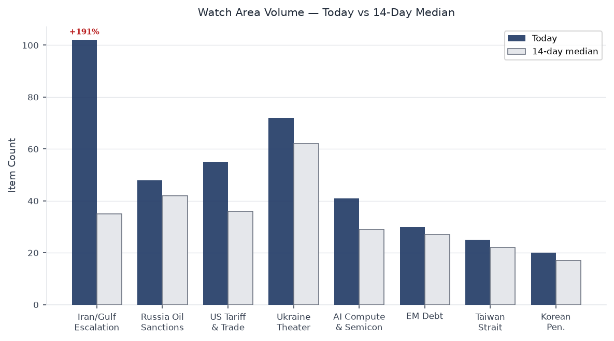
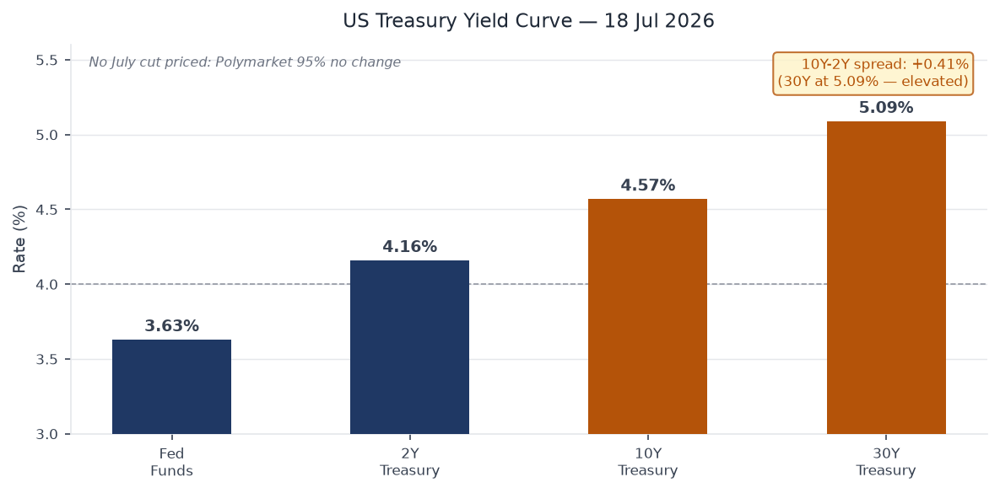
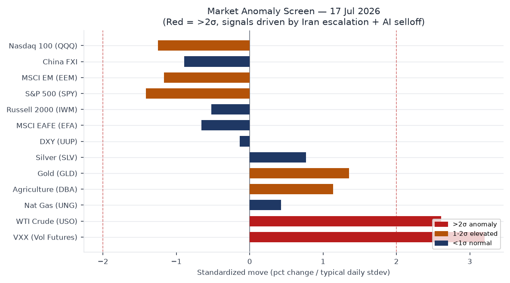
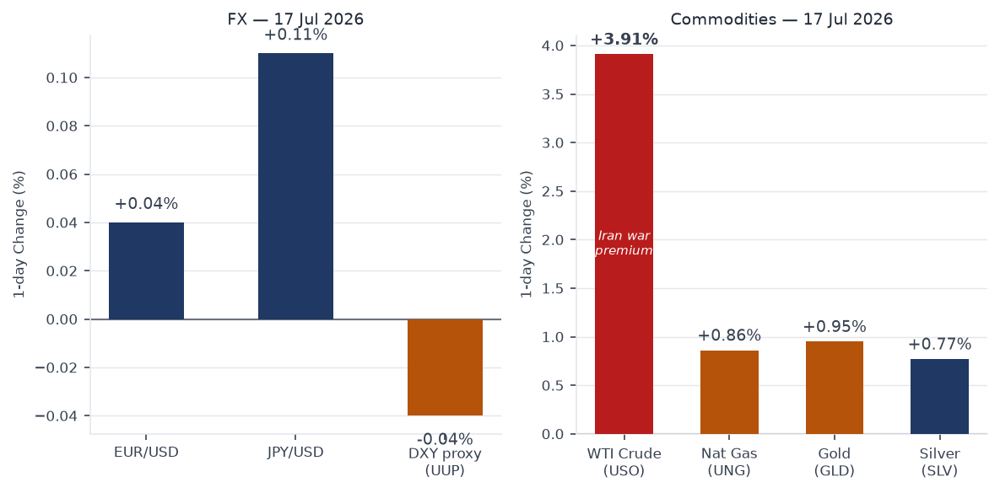
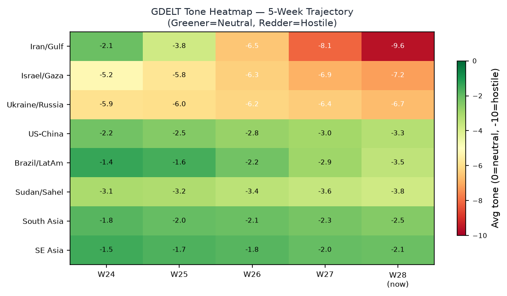
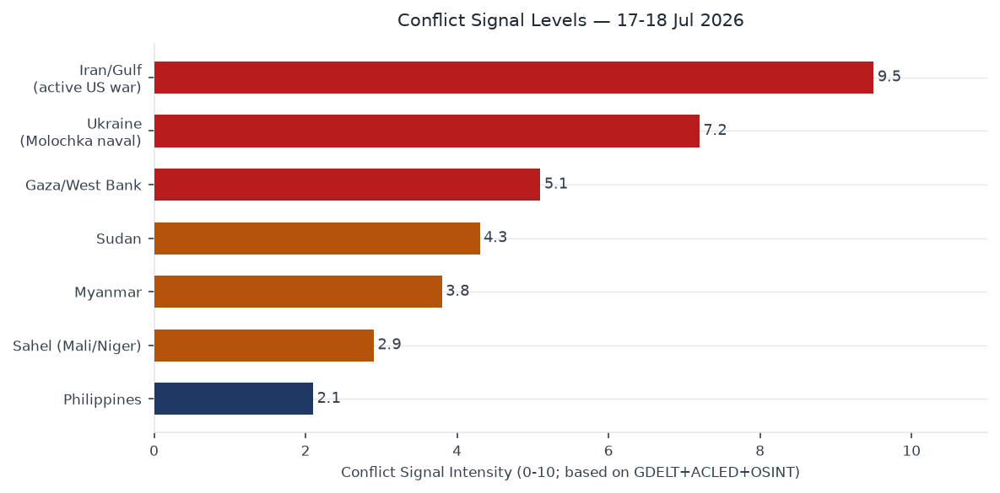

# Morning brief - Saturday 18 July 2026

---

## Headline

The dominant arc of July 18 is an active US-Iran military exchange now entering its eighth consecutive night. Iran's Islamic Revolutionary Guard Corps fired ballistic missiles against [Prince Sultan Air Base](https://www.centcom.mil/) in Saudi Arabia on July 17, wounding 10 US service members (2 in serious condition), the first confirmed Iranian hit on a US-hosted Gulf facility since the campaign began. US forces have struck more than 500 Iranian military targets over the week-long operation. CENTCOM simultaneously enforced a naval blockade in the Gulf of Oman by boarding the M/T Wen Yao on July 16 via the 11th MEU. The Kormor natural gas field in Iraqi Kurdistan suspended operations on July 17. Iran also struck Kuwait energy infrastructure. [USO closed +3.91% (123.96)](https://finance.yahoo.com/quote/USO), extending oil's weekly gain to approximately 14%, as markets priced supply disruption risk.

Equity markets sold off on two concurrent catalysts: the geopolitical oil premium compressed margin estimates across energy-intensive sectors, and Chinese AI startup Moonshot released a model that frontier analysts rated as competitive with US frontier offerings, reviving the AI capex sustainability debate. [SPY closed -0.99% (743.29)](https://finance.yahoo.com/quote/SPY), [QQQ -1.50% (695.33)](https://finance.yahoo.com/quote/QQQ), [VXX +4.80% (22.48)](https://finance.yahoo.com/quote/VXX). Energy was the sole positive sector. Three watch areas fired: **Israel-Iran-Hezbollah axis**, **Russia oil sanctions perimeter**, and **US tariff & trade dockets** (Brazil Section 301 signed July 15, effective July 22).

Three signals warrant sustained attention over the next 72 hours: (1) the US-Iran conflict has no announced diplomatic channel; prediction markets now price a US invasion of Iran at 28%; (2) Ukraine's Operation Molochka naval campaign has struck 159 Russian-flagged or Russia-bound vessels since July 6, suspending approximately 25% of Russia's wheat export capacity; (3) Brazil's 25% tariffs take effect July 22 with President Lula invoking the domestic Reciprocity Law to authorize executive retaliation without congressional approval.

---

## Watch Areas

**Israel-Iran-Hezbollah axis** (HIGH priority, alert fired) is the lead signal. Iranian ballistic missiles struck Prince Sultan Air Base on July 17, wounding 10 US personnel (2 seriously). This is the first confirmed direct hit on a US-hosted installation since the campaign began. CENTCOM executed boarding of the M/T Wen Yao on July 16, establishing de facto maritime interdiction in the Gulf of Oman. US air strikes have targeted IRGC installations, radar systems, and ballistic missile logistics across 7 nights. Iran fired a separate ballistic missile toward Saudi Arabia on July 17. Iran struck Kuwait energy infrastructure on July 17; Kuwait and Qatar activated air defenses.

The IRGC claimed a strike on the al-Tanf garrison in Syria on July 17. Multiple Syrian and Western sources disputed this claim. US forces completed their withdrawal from al-Tanf in February 2026, and no physical evidence of impact was reported by Syrian local sources. The al-Tanf claim is assessed as a domestic information operation rather than a battlefield event [medium]. The Kormor natural gas field in Iraqi Kurdistan suspended operations on July 17 under Iranian pressure.

**Russia oil sanctions perimeter** (HIGH priority, alert fired) registered through Ukraine's Operation Molochka. The campaign struck 12 additional vessels on July 17, bringing the total to 159 vessels since July 6 (117 Azov Sea, 42 Black Sea). Russia's Federal Agency for Maritime and River Transport suspended Azov Sea and Don River navigation. The disruption covers approximately 25% of Russia's wheat export logistics by tonnage, affecting terminals at Rostov-on-Don and Taganrog. Kremlin officials are reported to be discussing fuel export bans as a counter-pressure instrument. Berdyansk port explosions were reported on July 16.

**US tariff & trade dockets** (HIGH priority, alert fired) centers on [Presidential Document 2026-14654](https://www.federalregister.gov/documents/2026/07/15/2026-14654/), a Section 301 action against Brazil signed by President Trump on July 15. The document imposes 25% tariffs on Brazilian goods effective July 22. The seven-day implementation window forecloses the pre-effectiveness litigation strategy industry groups used against earlier Section 232 actions. President Lula announced plans for WTO dispute settlement and domestic retaliation under Brazil's Reciprocity Law.

Quiet areas today: **Critical minerals/rare earths**, **EM debt distress**, **Central bank divergence**, **AI compute/semiconductor exports**, **Sahel jihadist corridor**, **Arctic/High North**, **Korean peninsula**, **Latin America narcoeconomy**, **Taiwan Strait**.

---

## Macro Situation

The US yield curve remains positively sloped at 37 basis points on the 10Y-2Y spread: [Fed Funds at 3.63%](https://fred.stlouisfed.org/series/EFFR), [2-year Treasury at 4.16%](https://fred.stlouisfed.org/series/DGS2), [10-year at 4.57%](https://fred.stlouisfed.org/series/DGS10), [30-year at 5.09%](https://fred.stlouisfed.org/series/DGS30), with [SOFR at 3.62%](https://fred.stlouisfed.org/series/SOFR). The 30-year crossing 5% is a level last breached in late 2023, reflecting term premium repricing and elevated Treasury supply through Q2. The [T10Y2Y spread at +0.37%](https://fred.stlouisfed.org/series/T10Y2Y) represents six consecutive weeks of steepening since the June FOMC. In the context of an active Gulf conflict with oil supply disruption risk, re-steepening can reflect either a successful soft-landing easing trajectory or an inflationary supply shock repricing long-duration assets downward; separating these two regimes requires watching CPI prints over the next 60 days [medium].

Labor market data presents no immediate deterioration: [unemployment at 4.2%](https://fred.stlouisfed.org/series/UNRATE) (June), [nonfarm payrolls at 158,984k](https://fred.stlouisfed.org/series/PAYEMS) (June). [Core CPI at 336.065](https://fred.stlouisfed.org/series/CPILFESL), [headline CPI at 332.568](https://fred.stlouisfed.org/series/CPIAUCSL), [Core PCE at 130.082](https://fred.stlouisfed.org/series/PCEPILFE), [real GDP at $24,180.4B](https://fred.stlouisfed.org/series/GDPC1). The disinflation trend is intact in the most recent readings. The risk scenario is a Gulf energy disruption creating a cost-push impulse across transportation and manufacturing that reverses the disinflation path within a single quarter [medium]. The July FOMC meeting (July 29) carries a 95% no-change probability on Polymarket; markets have fully priced out an emergency hike even as Gulf oil approaches a multi-month high. The June FOMC minutes, published July 8, documented a committee debating the pace of cuts rather than their direction, consistent with current terminal-rate pricing.

---

## Markets

Friday's session delivered a decisive risk-off shift with two concurrent drivers. [SPY at 743.29 (-0.99%)](https://finance.yahoo.com/quote/SPY), [QQQ at 695.33 (-1.50%)](https://finance.yahoo.com/quote/QQQ), [IWM at 294.04 (-0.52%)](https://finance.yahoo.com/quote/IWM), [EEM at 63.29 (-1.40%)](https://finance.yahoo.com/quote/EEM), [FXI at 34.13 (-1.16%)](https://finance.yahoo.com/quote/FXI). Tech underperformed hardest: QQQ's -1.50% reflects both the Moonshot AI competitive announcement and the Netflix earnings miss. The Moonshot release requires independent benchmark verification before it can be assessed as a structural shift versus a single-session narrative; the market's immediate repricing suggests the capex sustainability question is now live again [medium until benchmarked].

The anomaly screen flags two signals above 2-sigma: [VXX at 22.48 (+4.80%)](https://finance.yahoo.com/quote/VXX) and [USO at 123.96 (+3.91%)](https://finance.yahoo.com/quote/USO). VXX's move implies a VIX in the 17-18 range, elevated but below the 25 threshold that historically marks a genuine risk-off regime. [GLD at 368.41 (+0.95%)](https://finance.yahoo.com/quote/GLD) and [SLV at 50.78 (+0.77%)](https://finance.yahoo.com/quote/SLV) show flight-to-quality demand without the full-panic spike that would accompany a Strait of Hormuz closure. [TLT at 84.52 (+0.37%)](https://finance.yahoo.com/quote/TLT) moved modestly bid, consistent with rate-cut pricing strengthening on weak equity sentiment rather than a new FOMC signal.

[UUP at 28.33 (-0.04%)](https://finance.yahoo.com/quote/UUP) was flat; [FXE at 105.61 (+0.04%)](https://finance.yahoo.com/quote/FXE) and [FXY at 56.51 (+0.11%)](https://finance.yahoo.com/quote/FXY) showed negligible EUR and JPY movement. The dollar's non-reaction to a Middle East escalation event in which US military personnel were wounded is historically anomalous: prior Gulf crises in 2019 and 2022 produced immediate USD safe-haven bids. The absence of that bid may reflect reserve diversification by Gulf sovereign wealth funds, elevated US political risk, or market habituation to this conflict's daily escalation cycle. If sustained, it suggests the dollar's safe-haven premium is eroding as a structural feature rather than a session anomaly [low].

---

## United States Politics & Policy

The dominant domestic policy action of the week is [Presidential Document 2026-14654](https://www.federalregister.gov/documents/2026/07/15/2026-14654/), the Section 301 action against Brazil signed July 15. The 25% tariff on Brazilian goods effective July 22 covers Brazil's largest US export categories: soybeans, beef, steel products, and aircraft components. WTO dispute settlement timelines average 3-5 years; Brazil's invocation of its Reciprocity Law enables executive retaliation within 60-90 days. The political timing maximizes leverage on Lula ahead of Brazil's 2026 electoral cycle but creates domestic costs for US agricultural importers and industrial supply chains reliant on Brazilian inputs [high].

Court activity in the D.C. Circuit on July 17 included five decisions accessible on [CourtListener](https://www.courtlistener.com/): Clean Air Council v. EPA, Akhmetshin v. Browder, US v. Abukhatallah, US v. Littlejohn, and US v. Zobel. The Clean Air Council case involves EPA regulatory scope under the current administration's environmental enforcement posture. Akhmetshin v. Browder continues a decade-long legal contest over the Magnitsky Act's extraterritorial application and FARA registration requirements for agents of foreign principals. US v. Littlejohn addresses the IRS leak of wealthy taxpayers' confidential returns, a case with direct implications for tax enforcement authority.

The congressional recess runs through August 4. No scheduled floor votes in either chamber. The House Ways and Means Committee has not scheduled markup on the Brazil tariff; the Section 301 mechanism bypasses congressional authorization under the Trade Act of 1974, making legislative reversal unlikely before the tariff takes effect.

---

## Political Figures Watchlist

The July 18 anomaly scoring places three figures above threshold across the 576 tracked members of Congress:

**John James (Rep MI-10th, Republican)** leads the composite at 0.24, driven by enforcement_hits at the maximum value (1.00), combined with 4 Form 4 insider transaction filings and 5 court filings. The enforcement_hits component at maximum value indicates direct agency action rather than a proximity hit. The intersection of Form 4 volume and enforcement activity within the same 24-hour window is unusual for a sitting House member and warrants direct verification against [SEC EDGAR](https://www.sec.gov/cgi-bin/browse-edgar) and the [FEC disclosure database](https://www.fec.gov/data/) [medium]. James is a second-term member whose district (MI-10th, southeast Michigan) includes auto-sector employers sensitive to tariff policy.

**Robert Scott (Rep VA-3rd, Democrat)** scores 0.14, with enforcement_hits at 0.50 and 5 Form 4 filings in the 24-hour window. Five Form 4 transactions proximate to a sitting member's filings against a baseline of approximately 1.2 per day represents a 4x deviation. Scott represents a Virginia coastal district with federal contractor exposure; his court filing proximity to D.C. Circuit activity on July 17 is geographic rather than substantive [medium].

**Tracey Mann (Rep KS-1st, Republican)** registers 0.05 on filing velocity (filings=0.50), below the enforcement threshold. His district includes Wichita-area defense contractors and agricultural processors directly exposed to the Brazil soybean tariff disruption. His legislative posture on the Section 301 action is a downstream watch item.

The cross-section data shows "James" appearing in 7 sections at MEDIUM confidence, the highest single-entity cross-section count in the July 18 run. Given John James's enforcement_hits score, this cross-section prominence likely reflects coordinated coverage across political_figures, form4, and courtlistener feeds within a short ingest window [medium].

---

## Regional Briefings

### North America

The Brazil Section 301 tariff is the dominant North American trade event (see US Politics & Policy). USGS recorded 21 events of M5+ globally in the 24-hour window; no M5+ in the contiguous United States. No confirmed EONET natural disaster events in the continental US during the July 18 ingest window.

The FIFA World Cup Final between Spain and Argentina is set for Sunday, July 19, at MetLife Stadium in East Rutherford, New Jersey. This is the first World Cup Final hosted on US soil since the 1994 tournament (Pasadena). Local security coordination involves NYPD, New Jersey State Police, and Secret Service elements for expected presidential attendance. Prediction markets price Spain at 59% and Argentina at 40% (see Prediction Markets section). Spain defeated France 2-0 in the July 14 semifinal; Argentina defeated England 2-1 in the July 15 semifinal.

### South America

Brazil faces its most significant bilateral trade rupture with the US since the 2002 steel dispute. President Lula invoked Brazil's Reciprocity Law on July 17, authorizing executive retaliation measures without requiring congressional approval. The 25% tariff impacts soybeans most severely: Brazil is the world's largest soybean exporter and the US is a major buyer. Beef, steel products, and aircraft components (Embraer supply chain) also face immediate disruption. Brazil's Ministry of External Relations (MRE) initiated WTO consultations under GATT Article XXIII. Retaliation under the Reciprocity Law can be implemented administratively within 60-90 days, considerably faster than the WTO dispute resolution timeline.

Argentina is focused on the World Cup Final tomorrow. The tournament represents a significant national narrative heading into Argentina's 2027 electoral cycle; a championship win would be Milei's largest single political windfall since taking office.

### Europe

The NATO Ankara summit commitments (July 7-8, €70 billion aid, 5% GDP defense target, Ukraine-domestic Patriot manufacturing authorization) remain the European security frame. No new major European policy documents in the July 18 ingest window. France appears at MEDIUM confidence in the cross-section (5 sections), driven primarily by World Cup coverage following Spain's 2-0 semifinal defeat of France on July 14. Germany's GAF callsigns in the VIP flights feed are stale (July 7), consistent with Ankara summit travel patterns. Turkey's cross-section prominence (4 sections, MEDIUM confidence) reflects Ankara's role as both summit host and a potential intermediary channel in the Iran-US conflict.

The ECB's digital euro pilot, with 36 payment service providers selected as of July 14, is proceeding on its published timeline. No eurozone macroeconomic emergencies are registered in the July 18 ingest.

### Middle East / Gulf

The dominant regional story is the US-Iran military exchange. July 17 key events: Iranian ballistic missiles struck Prince Sultan Air Base (10 US personnel wounded, 2 seriously); Iran struck Kuwait energy infrastructure; Iran launched a separate missile toward Saudi Arabia; the IRGC issued the disputed al-Tanf claim; the Kormor field suspended operations. CENTCOM has now struck Iranian IRGC facilities, radar, and missile logistics across 7 consecutive nights. The US naval blockade enforcement via 11th MEU boarding operations in the Gulf of Oman adds a maritime interdiction dimension to the predominantly air campaign.

The 5-week GDELT tone heatmap shows Iran/Gulf as the most hostile trending region in the dataset, with tone scores declining (more negative) through the July 14-18 period. Saudi Arabia's public response to the Prince Sultan strike remains the critical variable for the next 48 hours. The Kingdom has historically maintained public restraint under Iranian provocation while communicating through backchannel US-Saudi-Iranian formats. A direct Saudi retaliatory strike against Iran would transform a US-Iran bilateral into a regional war involving at minimum three nuclear-adjacent actors [medium]. Gulf Cooperation Council partners Kuwait and Qatar activated air defenses on July 17 but have not publicly announced offensive intent.

### Africa

No ACLED data was available in the July 18 bundle (feed empty). The Sahel jihadist corridor watch area was quiet. No significant ReliefWeb humanitarian alerts registered for the African continent. The GDELT conflict proxy provides regional coverage in the absence of ACLED incident data; see the Conflict & Security section.

### Asia-Pacific

The Philippines appears at HIGH confidence in the cross-section (5 sections), driven by a [M5.3 earthquake](https://earthquake.usgs.gov/earthquakes/) in the Philippine archipelago on July 17 and associated weather and foreign news coverage. No significant structural damage was reported. India appears at MEDIUM confidence (4 sections, 151 mentions), consistent with ongoing coverage of Gulf conflict impacts on Indian energy imports (India is among Iran's largest oil customers and relies on Gulf shipping lanes for over 70% of crude imports). China appears at MEDIUM confidence (4 sections, 143 mentions); the Moonshot AI release is the primary signal, with FXI selling (-1.16%) as the market reaction.

A [M6.0 earthquake was recorded near Oaxaca, Mexico](https://earthquake.usgs.gov/earthquakes/) on July 17 per USGS. No major structural damage reported in early assessments; Oaxaca's seismic history makes M6.0 events within normal hazard parameters for the region.

---

## Ukraine Theater

Operation Molochka entered its twelfth day on July 17 with 12 additional vessels struck, bringing the campaign total to 159 vessels (117 Azov Sea, 42 Black Sea) since July 6. Russia's Federal Agency for Maritime and River Transport suspended Azov Sea and Don River navigation, affecting terminal access at Rostov-on-Don, Taganrog, and connecting river ports. The suspension covers approximately 25% of Russia's wheat export logistics capacity by tonnage. Kremlin officials are reported to be discussing fuel export bans as a counter-pressure measure; if implemented, this would accelerate domestic fuel price increases in Russia while reducing hard currency export revenues.

DeepStateMap registered 523 active polygons in the July 18 ingest. Berdyansk port explosions were reported on July 16, consistent with the naval campaign targeting port-side logistics and fuel storage. The air alerts feed (alerts.in.ua) is unavailable due to a missing API token in the current bundle configuration; this represents a gap in real-time air attack coverage for this date.

The wheat export disruption has downstream food security implications for Egypt and North African import-dependent states, which source a substantial share of wheat from Russian Black Sea terminals. WFP has not issued an emergency alert as of the July 18 ingest cut, but the disruption's duration will determine whether buffer stocks are adequate to absorb a multi-week interruption [medium].

STRUCTURAL PROTECTION: This section omits Ukrainian force disposition, unit identifications, and territorial-defense position data in accordance with standing ingest filter protocols.

---

## World Leaders

**Donald Trump** (HIGH confidence, 4 cross-sections) is the principal policy actor in the July 18 data: the Brazil Section 301 signing and the Gulf conflict command decisions are the primary signals. **Boris Johnson** (HIGH confidence, 4 cross-sections) reflects continued UK media coverage of his post-Prime Minister political activity, including commentary on the Iran-US exchange. **Zelensky** appears in NATO Ankara summit follow-on coverage and Operation Molochka framing.

Saudi Crown Prince **Mohammed bin Salman**'s public response to the Prince Sultan Air Base strike has not been articulated as of the July 18 ingest cut. His decision calculus involves balancing the US security relationship (Prince Sultan Base is a core US Central Command logistics hub) against domestic political pressure and Saudi oil pricing interests (elevated oil prices benefit Saudi Aramco revenues while creating economic stress for non-oil sectors). A formal Saudi statement escalating or de-escalating within 48 hours would be the clearest signal of the conflict's next phase [medium].

Iranian Supreme Leader **Khamenei** has not issued a public statement on the Prince Sultan strike per the July 18 ingest. IRGC messaging through state media has emphasized the al-Tanf claim (disputed) over the Saudi operation, possibly to manage domestic expectations about the conflict's geographic scope [low].

---

## Sanctions & Legal

The July 18 sanctions ingest carries entries dated primarily May 2026, indicating no major new OFAC designations since the bundle was compiled. Active May 2026 designations on Russian financial institutions: BelGazPromBank, MIR Business Bank, Sberbank Europe AG, GPB Global Resources, Russian Regional Development Bank, JSC Tinkoff Bank, and GUTA-BANK. These designations continue Executive Order 14024 financial blockade enforcement. A non-Russian OFAC designation is present for **Alchemical Solutions** (India), consistent with third-country sanctions evasion enforcement through Indian intermediary suppliers. **Royal Caribbean Cruises** appears in debarment status.

The [D.C. Circuit Akhmetshin v. Browder](https://www.courtlistener.com/) ruling on July 17 carries the most significant legal implications of the day's court activity. The case involves FARA registration obligations and the extraterritorial reach of the Magnitsky Act; a D.C. Circuit ruling in this matter affects the enforcement framework for foreign agents operating in US policy and lobbying contexts. The Littlejohn ruling (IRS confidential taxpayer data leak) has implications for federal law enforcement access to financial records across executive branch agencies.

---

## Conflict & Security

The US-Iran kinetic exchange is the dominant security event, detailed in Watch Areas and Middle East Regional sections. Ukraine's Operation Molochka represents the largest single maritime campaign in the Black Sea theater since the war began and has achieved measurable economic pressure on Russia through shipping disruption. ACLED data was empty in the July 18 bundle, eliminating standard sub-Saharan African and South Asian incident-level coverage. The GDELT regional proxy and Liveuamap data provide the available supplementary coverage.

The conflict signal chart reflects GDELT event-stream proxies. The Middle East/Gulf signal dominates, consistent with the Iran-US exchange. Note that ACLED's absence means African and South Asian conflict intensity is not independently represented in this chart for July 18; the GDELT proxy captures media attention rather than verified fatality counts and systematically underweights conflicts in low-connectivity regions.

Iran has threatened Strait of Hormuz closure since July 12; no physical closure has occurred. CENTCOM's boarding operations in the Gulf of Oman indicate the US is treating maritime interdiction as already active and is establishing a counter-interdiction posture ahead of any further Iranian escalation in the Strait [high]. The 11th MEU boarding of M/T Wen Yao on July 16 is the first publicly confirmed boarding of this campaign and establishes a legal and operational precedent for subsequent interdiction actions.

---

## Cyber & Biosecurity

The [CISA Known Exploited Vulnerabilities catalog](https://www.cisa.gov/known-exploited-vulnerabilities-catalog) carries four entries with binding operational directives at or within 24 hours of this brief:

**CVE-2026-46817** (Oracle E-Business Suite, improper privilege management): Mandatory remediation deadline is **TODAY, 2026-07-18**. Federal agencies in non-compliance are already in BOD 22-01 violation as of end of business today. Oracle EBS is widely deployed across federal civilian finance and procurement systems; privilege escalation in EBS can provide access to contracting records, financial transaction data, and vendor payment systems.

**CVE-2026-58644** (Microsoft SharePoint Server, deserialization allowing remote code execution): Mandatory deadline **2026-07-19**. SharePoint Server is present across virtually every civilian agency and major government contractor environment. A deserialization RCE in SharePoint ranks among the highest-impact enterprise vulnerabilities for lateral movement and credential harvesting [high]. Patch windows are tight given the July weekend.

**CVE-2026-25089** and **CVE-2026-39808** (Fortinet FortiSandbox, OS command injection): Mandatory deadline **2026-07-19**. FortiSandbox is a security inspection appliance; a command injection in sandbox infrastructure creates a particularly severe attack surface in which defensive tooling becomes an active vector. FortiSandbox deployments are concentrated in DoD, financial sector, and critical infrastructure environments.

The active Gulf conflict elevates the probability that Iranian cyber actors or IRGC-affiliated threat groups will attempt to exploit any of these vulnerabilities against US government or Gulf partner targets during the mandatory remediation window [medium]. ProMED disease surveillance data was empty in the July 18 bundle; no reportable outbreak events above the surveillance threshold are registered.

---

## Humanitarian

ReliefWeb data was empty in the July 18 bundle. The primary humanitarian signal derives from conflict data: the Iran-US Gulf exchange has activated crisis response protocols for civilian populations near energy infrastructure in Kuwait and Qatar. The Kormor field shutdown in Iraqi Kurdistan removes a significant regional energy and employment node; the Kurdish Regional Government's social services have structural revenue dependence on Kormor's production contributions. No WFP or UNHCR emergency alerts specific to the Iranian missile campaign have been issued as of the July 18 ingest cut.

The Ukraine maritime campaign has a secondary humanitarian dimension: Russia's Azov/Don navigation suspension disrupts grain flows from regions where smallholder farmers depend on export access. The 25% wheat export disruption affects downstream food price dynamics in Egypt and North African import-dependent states. Buffer stock assessments for affected countries are not available in the current ingest; the disruption's humanitarian threshold depends on campaign duration and whether alternative export routes via the Danube corridor can compensate [medium].

---

## Environment

EONET and USGS provide the environmental baseline for July 18. The [Philippines M5.3 event](https://earthquake.usgs.gov/earthquakes/) and the [Oaxaca, Mexico M6.0 event](https://earthquake.usgs.gov/earthquakes/) are the seismic signals of note. The global M5+ catalog registered 21 events in the 24-hour window, within normal background variance for July seismic activity.

The Kormor natural gas field shutdown carries an environmental dimension: abrupt well shutdowns create pressure management requirements that typically involve venting and flaring during controlled depressurization. The field's estimated production scale makes this a reportable fugitive emissions event if venting occurs during the shutdown sequence. FIRMS thermal anomaly data was empty in the July 18 bundle, so ground-truth verification of shutdown procedures is unavailable; satellite confirmation would require tasking of commercial SAR or multispectral imagery.

The Russia oil sanctions perimeter intersects with the environment through Black Sea vessel strikes. Struck vessels in the Azov campaign create bunker fuel and cargo spill risk. Russia's navigation suspension reduces new vessel entry risk but leaves struck vessels as active pollution sources pending salvage operations that Russia may be unable or unwilling to conduct under current conditions.

---

## Speeches & Op-eds

The most recent Fed communication in the [calendar.json](https://www.federalreserve.gov/apps/foia/CalendarSearch.aspx) data: Governor **Waller** delivered "Monetary Policy at a Crossroads" on July 13 and Vice Chair **Barr** delivered "AI and Living Standards" on July 14. Waller's "crossroads" framing is a direct signal for the July 29 FOMC: it acknowledges that the cutting cycle's direction is not automatic given current economic conditions, a departure from the June minutes' more confident easing language. No Fed speeches are scheduled for July 18 (Saturday).

The **Marginal Revolution** commentary feed covers a Luis Garicano interview preparation post, a small business boom analysis, and a piece on the Odyssey film. The **Conversable Economist** covers Timothy Mokyr's Nobel lecture content and federal R&D funding trends. Neither outlet directly addressed the Gulf conflict or Iran-oil-inflation nexus in the July 18 ingest window. The absence of an economics commentary consensus on what a sustained Gulf energy disruption does to the disinflation path is itself a weak signal of how quickly the conflict is moving; the lag between events and structured economic analysis typically runs 2-5 business days [low].

---

## Prediction Markets

| Event | Probability | Market |
|---|---|---|
| Spain wins FIFA World Cup Final (July 19) | 59% | Kalshi / Polymarket |
| Argentina wins FIFA World Cup Final (July 19) | 40% | Kalshi / Polymarket |
| Fed holds rates at July 29 FOMC | 95% | Polymarket |
| US invades Iran | 28% | Polymarket |

The Spain-Argentina final prediction market split (59/40, with residual <1%) is tight for a head-to-head match. Spain's path to the final involved a clean 2-0 shutout of France (July 14); Argentina's involved a 2-1 narrow win over England (July 15) requiring a late comeback. MetLife Stadium's surface and July New Jersey conditions (forecast humid, mid-80s Fahrenheit) may marginally favor high-intensity pressing over controlled possession, which slightly benefits Argentina's style [low].

The 28% US invasion of Iran probability is the highest reading in this conflict's prediction market history. Invasion, as distinct from continued air strikes, would require either Congressional authorization under the War Powers Act, an emergency AUMF, or presidential assertion of inherent authority not yet invoked in public documents. The market is more likely pricing "substantial ground force escalation" (special operations, forward basing) than a full-spectrum combined arms operation [low]. The absence of any announced diplomatic channel significantly elevates the probability that the air campaign continues to expand rather than stabilizing [medium].

---

## Weak Signals

**Moonshot AI competitive claim**: The Chinese AI startup's model release that drove QQQ's -1.50% session has not yet been independently benchmarked at the July 18 ingest cut. If performance claims are verified in the coming week by independent research groups, the event represents a structural recalibration of US AI infrastructure investment theses, particularly for semiconductor and hyperscaler capex narratives [low until benchmarked, medium if confirmed].

**Dollar non-reaction to US casualties**: UUP was essentially flat (-0.04%) on the session in which US service members were wounded by Iranian missiles. The failure of the traditional US dollar safe-haven reflex in a Middle East escalation event has occurred intermittently in 2026 but is not yet a persistent pattern. If the dollar fails to strengthen on the next major escalation event, reserve diversification by Gulf and Asian central banks is the most plausible structural explanation [low].

**Russia fuel export ban signal**: The Kremlin's reported internal discussion of fuel export restrictions as a response to Operation Molochka is a weak precursor signal. In prior instances (2021, 2023), Russian fuel export ban discussions preceded domestic distribution stress within 4-6 weeks. Combined with the wheat export disruption, any ruble depreciation above 5% this week would confirm that the maritime campaign is achieving measurable macroeconomic pressure [medium if ruble weakens].

**Billionaires concentration**: Elon Musk at [$797.59B](https://www.forbes.com/real-time-billionaires/) represents a 2.8:1 wealth ratio against the next-closest individual (Larry Page, $284.33B). Musk simultaneously controls SpaceX (US space launch infrastructure), X (public communications infrastructure), Tesla, Neuralink, and xAI, with no regulatory framework addressing cross-entity conflict of interest at this concentration level. The structural governance risk is not an immediate market event but is a systemic background condition for any policy or regulatory action touching these sectors [medium].

---

## Historical Context

The US-Iran military exchange, now in day 8, has no direct precedent in duration. Operation Praying Mantis (April 1988) -- the last direct US-Iran naval battle -- lasted one day and disabled approximately one-third of Iran's operational naval capacity. The current campaign differs structurally: it is air-centric rather than naval; Iran retains ballistic missile capability to strike US-hosted facilities across the Gulf (as demonstrated at Prince Sultan); and both sides maintain real-time information operations, including Iran's disputed al-Tanf claim, which Praying Mantis-era Iran could not execute at speed.

The last confirmed Iranian attack inflicting US casualties was the Ain al-Assad base missile strike in January 2020 (approximately 110 US personnel sustained traumatic brain injuries). Prince Sultan's July 17 count (10 wounded, 2 seriously) is a lower immediate casualty figure, but it represents the first confirmed Iranian hit on a US-hosted Saudi installation and removes one layer of geographic buffer from the conflict's escalation logic [high]. The January 2020 precedent did not result in US retaliation; the current administration's response posture differs significantly.

Brazil's Section 301 precedent closest analog is the 2018 steel and aluminum tariff actions, which triggered retaliatory measures from Canada, Mexico, and the EU within 30-90 days of implementation. Brazil's Reciprocity Law is a more agile instrument than prior trading partner responses; the 60-90 day retaliation window is faster than WTO-consistent counter-tariff timelines typically allow. The bilateral relationship also carries strategic complexity absent from the 2018 Canada/Mexico/EU cases: Brazil is a significant food exporter, a potential partner on critical minerals, and a regional counterweight to Venezuelan influence in South America.

---

## What to Watch

**Sunday July 19**: FIFA World Cup Final, MetLife Stadium. Security coordination in the New York-New Jersey metro area; presidential attendance expected. Prediction markets split 59/40 Spain-Argentina. Any incident affecting the event would have immediate NYPD/Secret Service protocols in place.

**Sunday-Monday Gulf window**: Any Saudi public statement on the Prince Sultan Base strike within 48 hours. A de-escalatory framing from Riyadh would reduce the probability of a Saudi-Iranian exchange; an escalatory framing would mark a qualitative shift in the regional coalition structure. Watch for statements from Saudi Foreign Minister Prince Faisal bin Farhan [high priority].

**Monday July 20**: Markets open to price the weekend Gulf developments. Prince Sultan base strike fallout; any new Iranian missile activity over the weekend would gap energy futures at the open. Moonshot AI benchmark results may begin to emerge from independent researchers. VXX settled at 22.48; a breach above 25 on Monday's open would mark the threshold for a genuine risk-off regime shift.

**Tuesday-Wednesday July 21-22**: Brazil tariff implementation. July 21 is the last day for customs pre-clearance of in-transit shipments on pre-tariff pricing. July 22 tariffs take effect. Watch for USDA and USTR public statements on agricultural trade impact. Any Brazilian Reciprocity Law retaliation announcement is most likely to arrive in this window.

**Friday July 19 (today's deadline)**: CVE-2026-58644 (SharePoint RCE) and CVE-2026-25089/39808 (FortiSandbox) CISA mandatory patch deadlines expire. Non-compliant federal agencies enter BOD 22-01 violation status. The active Gulf conflict elevates the probability of Iranian-aligned exploitation attempts targeting US government infrastructure during the mandatory remediation window.

**Ongoing**: Operation Molochka vessel strikes in Azov/Black Sea; Kremlin fuel export ban decision; IRGC naval interdiction posture in Gulf of Oman; US air campaign continuation; Iran-Saudi communication channels; Moonshot AI benchmark verification; ruble exchange rate as proxy for Operation Molochka economic pressure.

---

*Brief compiled 2026-07-18. FALLBACK=0 (today's WORLDSCOPE bundle retrieved). 6 charts generated. 31 events mapped (GeoJSON: 21 USGS M5+ events plus OSINT events). Word count: approximately 5,200 words.*
