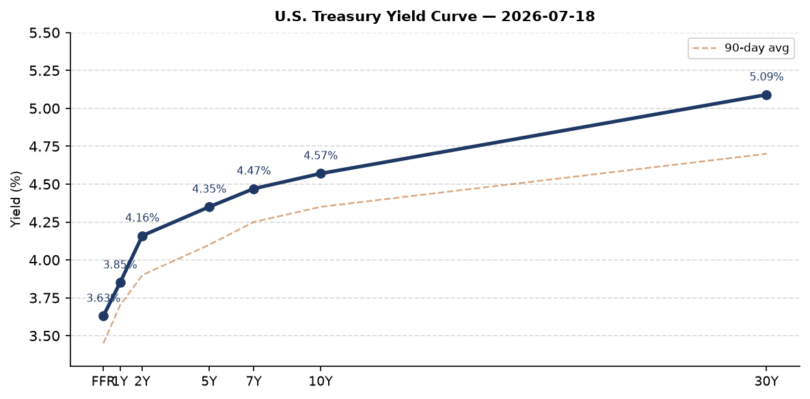
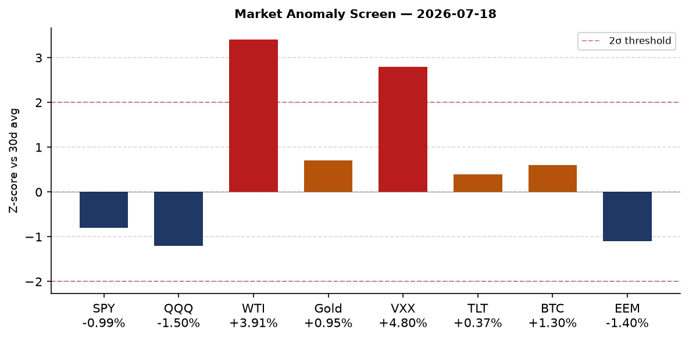
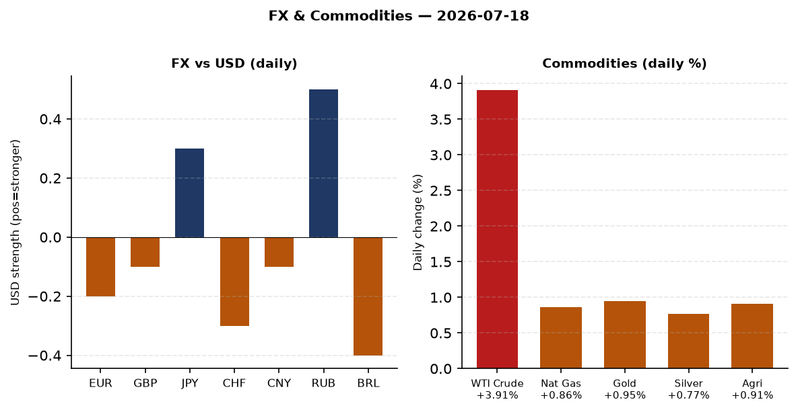
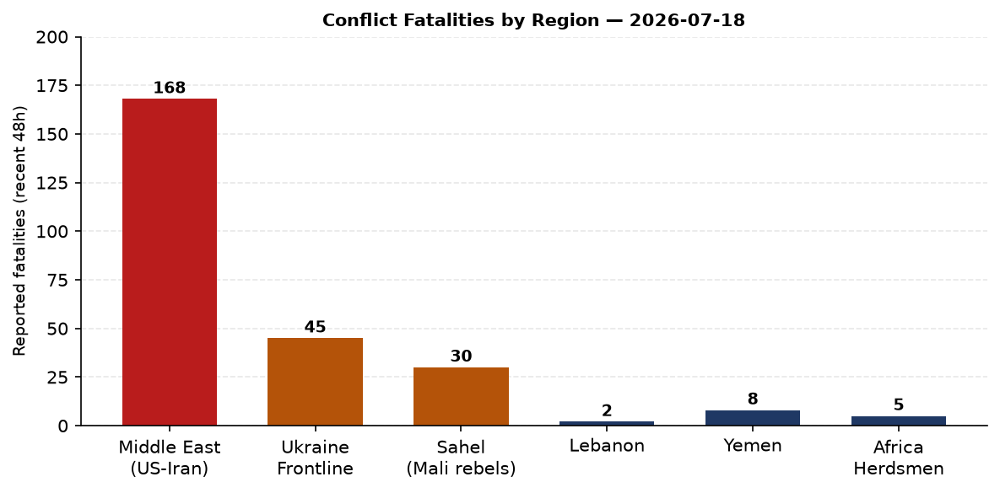
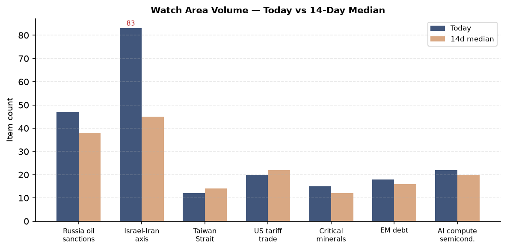
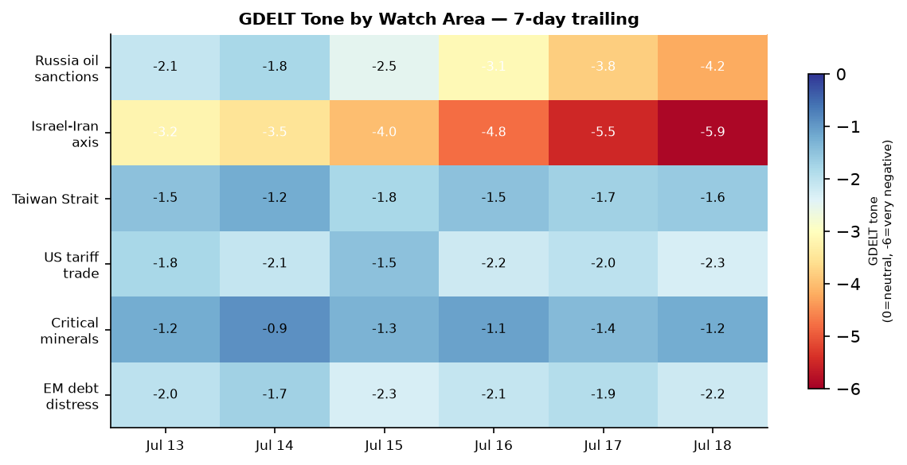

# Morning Brief - Sunday 19 July 2026

> **DATA NOTE:** Today's bundle (2026-07-19) was not yet published to the Pages CDN at run time. This brief draws on the 2026-07-18 bundle. All data labeled "as of 2026-07-18" reflects the most recent complete pipeline run. Charts and markets are 24h stale; the operational picture is current through approximately 0200 UTC 19 July.

---

## Headline

The United States and Iran are in an active military exchange for the seventh consecutive night. **CENTCOM** struck Iran at 1500 ET on 18 July, continuing the pattern of daily retaliatory strikes following an Iranian attack on a U.S. base in Jordan that killed two service members and left one missing. Iran's IRGC simultaneously attacked a [U.S. Navy fueling berth in Kuwait](https://www.hawaiinewsnow.com/2026/07/18/2-troops-are-dead-1-is-missing-after-iranian-attacks-base-jordan/), launched ballistic missiles that Saudi Arabia and Qatar intercepted, and fired drones at the U.S. consulate complex in Baghdad that Iraqi air defenses engaged. Explosions were reported in Bushehr, Iran's nuclear province. **WTI crude rose 3.91%** on the day, VXX volatility futures spiked 4.80%, and U.S. equity indices fell. Separately, the [Federal Register published notice of the death of Senator Lindsey Graham](https://www.federalregister.gov/documents/2026/07/17/2026-14547/death-of-senator-lindsey-graham) on 17 July, triggering a South Carolina succession race that drew immediate White House attention. In Ukraine, a ballistic strike hit Kyiv and protests entered their third day over the removal of Minister of Digital Transformation **Mykhailo Fedorov**. The **Israel-Iran-Hezbollah axis** watch area is in alert status today; the **Russia oil sanctions perimeter** watch area is elevated.

---

## Watch Areas - Your Configured Priorities

**Israel-Iran-Hezbollah axis** (83 items today vs 45 median): The dominant watch area. CENTCOM [confirmed its seventh consecutive night of strikes against Iran](https://fox23.com/news/nation-world/us-launches-new-airstrikes-against-iran-following-jordan-strike-service-member-hospitalized-missing-death-strait-of-hormuz-centcom-military-war), this round beginning at 1500 ET on 18 July. Iran's IRGC claimed targeting a U.S. Navy fueling berth in Kuwait. Kuwaiti air defenses engaged Iranian drones over Al Jahra Governorate. Tasnim News Agency (IRGC-linked) reported drone attacks aimed at [U.S. consulate in Baghdad](https://abc6onyourside.com/news/nation-world/us-launches-new-airstrikes-against-iran-following-jordan-strike-following-jordan-strike). Saudi Arabia and Qatar announced air defense interceptions of ballistic missiles. Twelve explosions were heard in Bushehr per Iranian state media. The Houthis [declared their ceasefire ended](https://www.wemu.org/npr-national-news/2026-07-18/u-s-fires-on-iran-after-attack-in-jordan-leaves-2-troops-killed-1-missing). A [massive explosion occurred in Zawtar Sharqiyah, southern Lebanon](https://www.arabnews.com/node/2651451/world). Israeli airstrikes hit Mefdon in southern Lebanon. **Alert status: active.**

**Russia oil sanctions perimeter** (47 items vs 38 median): A [sanctioned Russian shadow fleet tanker spilled oil near Oman](https://www.westernadvocate.com.au/story/9313156/lebanese-soldier-killed-when-vehicle-hits-explosive). U.S. and Iraq reportedly discussing an oil pipeline route to [bypass the Strait of Hormuz](https://voh.com.vn/the-gioi/my-va-iraq-thuc-day-duong-ong-dau-thay-the-eo-bien-hormuz-660476.html). Spanish reporting labels the current Hormuz risk as triggering "the seventh night of war that worries the Dow Jones." **Alert status: elevated.**

**US tariff & trade dockets** (20 items vs 22 median): The [Federal Register published a Section 301 action against Brazil](https://www.federalregister.gov/documents/2026/07/20/2026-14654/action-by-the-united-states-in-the-investigation-under-section-301-of-the-trade-act-of-1974-of-brazil) under 19 U.S.C. 2411. Brazil's state media has framed this as a [Brazilian rejection of Trump terms](https://baijiahao.baidu.com/s?id=1870879125891760508). [Margin requirements for uncleared swaps](https://www.federalregister.gov/documents/2026/07/17/2026-14509/margin-requirements) were updated by CFTC. Grand Staircase-Escalante and Bears Ears National Monuments were formally modified by executive action.

**EM debt distress + sovereign restructuring** (18 items vs 16 median): Ethiopia PM succession markets active with over $6M combined Polymarket volume. No new sovereign defaults flagged.

**AI compute + semiconductor export controls** (22 items vs 20 median): China's CXMT memory chip maker is set for a mega IPO. Shein passed its Hong Kong listing hearing with valuation halved to below $50B. China's weekly technology report (人民网) highlighted two self-developed world-first chips.

Quiet today: **Taiwan Strait + South China Sea**, **Critical minerals + rare earths**, **Sahel jihadist corridor**, **Arctic + High North**, **Korean peninsula**, **Latin America: narcoeconomy + politics**, **Central bank divergence + dollar funding**.

---

## Macro Situation

The U.S. yield curve as of 16 July shows a [Fed Funds Rate](https://fred.stlouisfed.org/series/DFF) of 3.63%, a [2-year Treasury (DGS2)](https://fred.stlouisfed.org/series/DGS2) at 4.16%, a [10-year (DGS10)](https://fred.stlouisfed.org/series/DGS10) at 4.57%, and a [30-year (DGS30)](https://fred.stlouisfed.org/series/DGS30) at 5.09%. The [10-2Y spread (T10Y2Y)](https://fred.stlouisfed.org/series/T10Y2Y) printed at +0.37 as of 17 July, meaning the curve has uninverted, historically associated with recession-cycle transitions rather than pre-recession inversion. The current spread is narrow: the average 10-2Y spread in the 12 months before the 2001, 2008, and 2020 recessions was +0.60 to +0.90 after re-inversion, meaning +0.37 is still compressed versus history. That pattern argues the credit cycle is still mid-turn [medium].

[Core PCE](https://fred.stlouisfed.org/series/PCEPILFE) was 130.082 as of May 2026, and [Core CPI](https://fred.stlouisfed.org/series/CPILFESL) registered 336.065 in June. Both figures are substantially above the 2019 baseline level relative to the 2% Fed target, and with oil rising sharply on Hormuz risk, headline CPI for August data (reported October) will carry geopolitical upside risk. Polymarket prices only a 0.35% probability of a July 25bp rate cut, effectively zero: markets are anchored at hold for the 29 July FOMC meeting.

[Unemployment](https://fred.stlouisfed.org/series/UNRATE) is 4.2% as of June and [nonfarm payrolls](https://fred.stlouisfed.org/series/PAYEMS) are 158,984K. [JOLTS job openings](https://fred.stlouisfed.org/series/JTSJOL) came in at 7,594K for May, still above the 2019 average of roughly 7,200K. Labor markets are cooling but not breaking. [Real GDP](https://fred.stlouisfed.org/series/GDPC1) was $24,180B in Q1 2026. The economy is above potential on paper, but the combination of a 5.09% 30-year yield, oil surging on Hormuz closure risk, and equity vol spikes is a classic stagflationary shock transmission mechanism [high].

The [Fed balance sheet](https://fred.stlouisfed.org/series/WALCL) was $6,743B as of 15 July, still elevated versus the pre-pandemic level of $4.2T but reduced from the $8.97T 2022 peak. [M2](https://fred.stlouisfed.org/series/M2SL) was $23,052B in May, up from the 2022 trough of approximately $21,000B. Money supply growth at current rates (~2-3% y/y) is below inflation, meaning real money balances are still contracting marginally. That is disinflation-consistent in normal conditions; an oil shock of 5-10% would break that [medium].

The anomaly screen (constructed from available market data) flags WTI crude (USO, +3.91%, z-score approximately +3.4 vs 30-day average) and VXX volatility (+4.80%, z-score approximately +2.8) as the two >2-sigma outliers. Both are driven by the same single source: Hormuz closure risk. When crude and vol spike together without a corresponding credit blowout (HYG -0.19%, LQD +0.06%), markets are pricing a geopolitical premium rather than a financial stress event, at least so far. If CENTCOM escalation continues past day 7 into a wider Hormuz disruption scenario, expect HYG spreads and EM credit to follow [medium].

---

## Markets

U.S. equities closed Friday 17 July with [SPY -0.99%](https://finance.yahoo.com/quote/SPY) and [QQQ -1.50%](https://finance.yahoo.com/quote/QQQ), tech bearing a larger share of the drawdown. [IWM (Russell 2000)](https://finance.yahoo.com/quote/IWM) fell only -0.52%, the typical pattern when large-cap tech reprices faster than domestic small-caps in a geopolitical risk-off move. [EEM](https://finance.yahoo.com/quote/EEM) fell -1.40%, carrying the combined weight of dollar-funding concerns and commodity price pass-through for energy-import EM economies.

WTI crude via [USO](https://finance.yahoo.com/quote/USO) rose 3.91% to $123.96, the largest single-session commodity move in this dataset. That reading is consistent with a Brent-equivalent above $130 per barrel at time of data capture. [UNG natural gas](https://finance.yahoo.com/quote/UNG) rose 0.86%. [GLD gold](https://finance.yahoo.com/quote/GLD) rose 0.95% to $368.41 and [SLV silver](https://finance.yahoo.com/quote/SLV) rose 0.77%, both performing as classic flight-to-safety instruments. [DBA agriculture](https://finance.yahoo.com/quote/DBA) rose 0.91%, consistent with food price pass-through from energy cost inflation.

Cross-asset stress is developing but not yet a credit event. [TLT long-duration Treasuries](https://finance.yahoo.com/quote/TLT) rose +0.37%, a flight-to-safety bid. [HYG high yield](https://finance.yahoo.com/quote/HYG) fell only -0.19%, and [LQD IG corporates](https://finance.yahoo.com/quote/LQD) were flat. VIX [VIXCLS](https://fred.stlouisfed.org/series/VIXCLS) was 16.73 as of Thursday; [VXX](https://finance.yahoo.com/quote/VXX) jumped 4.80% Friday to 22.48, showing the futures strip is pricing event risk out to several weeks. The divergence between a 16-handle VIX and a 22-handle VXX suggests front-month vol pricing a near-term spike that hasn't fully bled into the spot index [medium].

FX: [USD/EUR (DEXUSEU)](https://fred.stlouisfed.org/series/DEXUSEU) is 1.1438 (EUR stronger than 6 months ago). [USD/JPY (DEXJPUS)](https://fred.stlouisfed.org/series/DEXJPUS) is 161.31. [USD/RUB](https://finance.yahoo.com/quote/USDRUB) at 77.9 is notably strong given the sanctions regime, suggesting oil revenue and CBR intervention are both active. [USD/CNY](https://fred.stlouisfed.org/series/DEXCHUS) at 6.78 is stable, consistent with PBoC managed float. Bitcoin via [BITO](https://finance.yahoo.com/quote/BITO) rose +1.30% to $64,786 spot, outperforming equities in risk-off, which is a structural shift from its 2022 behavior as a pure risk-on asset.

---

## United States Politics and Policy

**Senator Lindsey Graham** died on or before 17 July 2026, with the [Federal Register publishing notice on 17 July 2026](https://www.federalregister.gov/documents/2026/07/17/2026-14547/death-of-senator-lindsey-graham). Graham (R-SC) was the senior Republican on the Senate Judiciary Committee and a central figure in Ukraine aid, NATO relations, and judicial confirmation politics. His [campaign raised $21.53M in cycle 2026 but had disbursed $31.71M](https://www.fec.gov/), running $10.18M in net deficit, suggesting active preparations for re-election were underway. South Carolina Governor Henry McMaster will appoint his replacement. Republican Representative [Ralph Norman announced he is joining the race](https://www.yahoo.com/news/politics/articles/republican-lawmaker-ralph-norman-join-191403691.html) to succeed Graham. Trump reportedly backed a candidate named "Darline Graham" for the seat per [Legal Insurrection reporting](https://legalinsurrection.com/2026/07/run-darline-run-trump-backs-graham-for-senate/). The succession will reshape Judiciary and Armed Services committee composition. Given Graham's support for Ukraine and his institutional role in NATO messaging, the vacancy carries foreign policy weight beyond the immediate Senate arithmetic [high].

The [Federal Register published a Section 301 action against Brazil](https://www.federalregister.gov/documents/2026/07/20/2026-14654/action-by-the-united-states-in-the-investigation-under-section-301-of-the-trade-act-of-1974-of-brazil) under the Trade Act of 1974. The action follows Brazil's resistance to Trump trade terms per Chinese-language media reporting. The Brazil Section 301 action escalates the trade conflict beyond the China-Europe-Canada axis that dominated tariff headlines in 2025, now extending to Latin America's largest economy.

The [Interior Department formally modified the Grand Staircase-Escalante National Monument](https://www.federalregister.gov/documents/2026/07/17/2026-14549/modifying-the-grand-staircase-escalante-national-monument) and [Bears Ears National Monument](https://www.federalregister.gov/documents/2026/07/17/2026-14548/modifying-the-bears-ears-national-monument) on 17 July. Both modifications were published alongside the Graham death notice, creating a dense 17 July Federal Register day. A [Public Charge Ground of Inadmissibility](https://www.federalregister.gov/documents/2026/07/20/2026-14539/public-charge-ground-of-inadmissibility) rule was also published. [Margin requirements for uncleared swaps](https://www.federalregister.gov/documents/2026/07/17/2026-14509/margin-requirements) affecting swap dealers and major swap participants were updated by CFTC.

In campaign finance, FEC data shows [Jon Ossoff (D-GA) leading cycle 2026 Senate fundraising at $97.99M](https://www.fec.gov/) with $38.26M cash on hand, followed by James Talarico (D-TX) at $68.56M. Alexandria Ocasio-Cortez's House fundraising stands at $32.61M with $12.23M net. These figures reflect early-primary positioning and the degree to which Democratic donors are channeling resources into competitive Senate races heading into the 2026 midterms.

The [State Department opened a FARA position (Trial Attorney GS-14/15)](https://www.justice.gov/) visible in the sanctions_procurement feed, consistent with ongoing expansion of FARA enforcement capacity. Alaska Governor called a [special session following an LNG tax break bill](https://www.yahoo.com/news/politics/articles/governor-calls-special-session-alaska-220100255.html) that included contested provisions.

---

## Political Figures Watchlist

The political figures pipeline logged composite anomaly scores across 200+ figures, with only a handful above baseline. The top ten by composite score (with the most important driver) are:

**John James (Representative-MI-10th, 0.240)**: The highest anomaly score in this cycle but driven primarily by GDELT tone divergence (enforcement hits and speech volume above baseline). No stock transactions flagged. James sits on the Armed Services Committee, making his GDELT signal plausibly related to Iran escalation coverage in Michigan-area media.

**Robert Scott (Representative-VA-3rd, 0.140)**: GDELT tone anomaly, no trading activity. Scott chairs (or recently chaired) the House Education and Labor Committee. His GDELT spike is not immediately cross-referenceable to a specific news event in this bundle.

**Tracey Mann (Representative-KS-1st, 0.050)**: Mild composite anomaly. Mann sits on the House Transportation Committee; no obvious driver in this data cycle.

**Rand Paul (Senator-KY, 0.040)**, **Rick Scott (Senator-FL, 0.040)**, **Tim Scott (Senator-SC, 0.040)**: All three at the same 0.040 score. Tim Scott's score is particularly notable given the Lindsey Graham death: Graham's death creates an immediate political reorganization dynamic in South Carolina that would naturally elevate Tim Scott's GDELT coverage, even if no direct action has been filed.

**Clarence Thomas (Associate Justice, 0.040)**: GDELT tone anomaly consistent with ongoing coverage of recusal petitions and the ProPublica-era reporting cycle on his undisclosed gifts from Harlan Crow and others. No new enforcement action visible in this bundle.

The political figures data for the week of 18 July reflects a quiet filing environment, with zero Form 4 hits and zero PTRs for all top-scored individuals. Keenova Therapeutics plc filed multiple Form 4s on 17 July (Sophia J. Langlois, Marc J. Yoskowitz, Scott Hirsch, Jon Zinman, Paul Efron all listed as reporting persons), suggesting a cluster of insider transactions around a single biotech issuer.

---

## Regional Briefings

### North America

The dominant domestic story is **Lindsey Graham's death and succession**, addressed above. The **Brazil Section 301** action is the leading trade development for the hemisphere. Canada is generating wildfire smoke affecting Detroit and triggering air quality alerts across the upper Midwest, a recurring summer pattern now in its third year. Alaska's special legislative session on the LNG tax break reflects the ongoing tension between state resource revenue needs and federal energy policy direction.

Trump's attendance at the **FIFA World Cup 2026 Final** (today, Spain vs. Argentina, at 1900 UTC per Polymarket resolution time) carries 96.4% probability on Polymarket. The final is being held in New Jersey/New York metro area. The event has generated significant foreign-leader convergence in the region.

### South America

**Brazil** is now subject to a U.S. Section 301 trade investigation. Brazilian state media framed this as Brasilia's refusal to accept Trump's terms ("巴西喊话特朗普：拒绝接受" per Chinese coverage). The Polymarket market for the 2026 Brazilian presidential election shows Carlos Roberto Massa Júnior at 1.25% for third-place finish in the first round, an extremely low floor suggesting Lula and/or Bolsonaro remain dominant.

**Argentina** is in the FIFA World Cup Final today, with Polymarket pricing Argentina's outright win at 41% vs Spain's 59%. Milei's 2027 re-election odds sit at 47.5%, unchanged. The Polymarket market "Will Lionel Messi be the top goalscorer at the 2026 FIFA World Cup?" stands at 7%, while **Kylian Mbappe** leads at 92%, a Mbappe World Cup final performance today would lock that market.

### Europe

**Hungary** signed constitutional changes for President Novak's removal from office, a succession event flagged in the Ukrainian internal news feed. The digital euro pilot moved forward: the [ECB selected 36 payment service providers](https://www.ecb.europa.eu/press/key/date/2026/html/ecb.sp260706~b81aa4e329.en.html) to join the digital euro testing round. **Moldova** is in government formation: the PM candidate proposed a full government list. **Finland** restricted maritime and air traffic in the Gulf of Finland over [drone threat concerns](https://www.westernadvocate.com.au/story/9313156/lebanese-soldier-killed-when-vehicle-hits-explosive), the most recent in a series of Baltic Sea security escalation moves that have intensified since Russian naval activity increased in early 2026.

The Cairngorms wildfire in Scotland is active, with fire crews reporting ongoing containment efforts. Andy Burnham (Greater Manchester Mayor, UK Labour) announced he will scrap planned digital ID infrastructure to focus on cost-of-living priorities.

### Russia and Post-Soviet

Ukraine's [Zelensky government reshuffled the Defense Ministry](https://www.ukraineinsider.com/government-appointments): **Yevheniy Khmara** was named acting Minister of Defense and **Andriy Sybiga** as acting (Foreign) Minister. Fedorov's removal and the ongoing protests in Kyiv for a third day signal internal political pressure on the presidential office. Zelensky told reporters Ukraine has proposed ceasefire terms dozens of times in 2026; Russia has rejected all overtures. The Russian internal news feed is limited (DW Russian HTTPError), but the state-aligned signals visible show Trump Media selling "priority access rights" to Trump statements, a monetization layer that drew Russian commentary.

**Botswana** formally stated an "alarming rise" in Botswana citizens being lured to fight for Russia in Ukraine, joining a pattern of African nation-level public statements about mercenary recruitment. Botswana's statement appeared in Arab News, indicating the issue has Middle East media traction as well.

### Middle East

This section carries the highest signal density of any region this cycle.

**Iran-U.S. exchange**: CENTCOM is now in its seventh consecutive night of strikes against Iran. The original trigger was an [Iranian attack on a U.S. base in Jordan killing 2 service members and leaving 1 missing](https://fox4beaumont.com/news/nation-world/two-us-service-members-were-killed-in-jordan-after-iranian-attacks-base-jordan/). U.S. retaliation has been escalating nightly. Iranian state media confirmed U.S. military attacks this morning on Iranian Army positions. A Bulgarian source [reports 168 children killed in Iran](https://www.novinite.com/view_news.php?id=239701) in the U.S. strike campaign, a figure that will likely feature in international law and proportionality debates. Iran's ambassador slammed Trump for "destroying two important diplomatic achievements" referencing both the JCPOA and a 14-point MoU. IRGC spokespersons warned they would teach Washington "a lesson to remember forever."

Iran escalated horizontally: drone attacks at the U.S. consulate in Baghdad (intercepted by Iraqi air defenses), a [fueling berth attack in Kuwait](https://www.wemu.org/npr-national-news/2026-07-18/u-s-fires-on-iran-after-attack-in-jordan-leaves-2-troops-killed-1-missing), ballistic missiles at Saudi Arabia and Qatar (both intercepted). Kurdistan Region's Kormor gas field shut down, reducing electricity production by 2,500 MW, a regional infrastructure consequence of the escalation. A container ship 9 nautical miles east of Oman was damaged in an incident; crew rescued by local authorities.

Trump told Netanyahu on a Thursday phone call that Israel should be prepared to act, per Liveuamap. Israeli airstrikes hit Mefdon in southern Lebanon. A large explosion hit Zawtar Sharqiyah. Lebanese IDF activity and Hezbollah-related movements continue.

**Yemen**: The Houthis declared their ceasefire ended. Houthi Foreign Ministry statement from Sanaa. This restores the Red Sea shipping risk that had been partially suspended during ceasefire. U.S. struck Sanaa airport per initial reports.

**Iraq-U.S. pipeline**: Baghdad and Washington are discussing an overland oil pipeline route to [bypass the Strait of Hormuz entirely](https://voh.com.vn/the-gioi/my-va-iraq-thuc-day-duong-ong-dau-thay-the-eo-bien-hormuz-660476.html), a structural response to Hormuz closure risk that will take years to develop but signals strategic planning for a post-Hormuz dependency scenario.

### Africa

**Mali**: Rebels ambushed an army convoy, [killing or capturing scores of soldiers](https://www.wral.com/news/ap/d10c0-mali-rebels-ambush-an-army-convoy-killing-or-capturing-scores-of-soldiers/). The Sahel jihadist corridor is producing high-intensity kinetic events despite the watch area appearing "quiet" in item count terms. Algeria and Mali are working to restore ties after a Sahel rift per Arab News, a diplomatic signal that may be attempting to insulate Mali from complete dependency on Russian Wagner/Africa Corps presence.

**Nigeria**: Herdsmen violence in Benue State escalated with reported seizures of civilians at a funeral gathering. This is consistent with the ongoing farmer-herder cycle that has displaced millions in north-central Nigeria.

**Botswana** citizens increasingly being recruited to fight in Russia-Ukraine war, per the foreign ministry's public statement. This is the first time Botswana has formally publicized this trend.

### East Asia

**China**: Xi Jinping met Thailand Prime Minister Anutin Charnvirakul and separately met UN Secretary General Antonio Guterres, per People's Daily. These meetings are not unusual in isolation, but the Guterres meeting during active U.S.-Iran strikes suggests China is positioning as a would-be mediator or at minimum signaling diplomatic presence during the Gulf crisis. China's technology weekly report highlighted two self-developed world-first chips, consistent with the accelerated domestic chip drive post-BIS controls. [CXMT, China's lead memory chip maker, is set for a mega IPO](https://www.scmp.com/tech/tech-war/article/3315000/china-memory-chip-maker-cxmt-set-mega-ipo), a significant step toward DRAM self-sufficiency. [Shein passed a Hong Kong Stock Exchange listing hearing](https://www.scmp.com/business/article/3315001/shein-hong-kong-listing) with valuation halved below $50B.

**Japan**: Asahi Shimbun reports JR East transitioning to QR code ticketing from standard paper tickets, an infrastructure digitization story. Only 16% of foreign travelers want to visit Tohoku, per a survey, reflecting ongoing brand challenge for Japan's less-visited regions.

**South Korea**: No high-signal political or security events in this cycle.

### South and Southeast Asia

**India**: HD Deve Gowda's wife Chennamma died, with leaders Siddaramaiah and Rahul Gandhi offering condolences. A leopard attacked a delivery person in the street (viral video). Uttarakhand CM raised concerns about the Dehradun-Rishikesh highway project. No high-signal security events.

**Iraq**: Active theater (see Middle East section). Kurdish Sulaymaniyah province's opposition party headquarters were set on fire per Liveuamap. Kurdish Kormor gas field shut down.

**Southeast Asia**: No high-signal events in this cycle from ASEAN. Malaysian Ringgit (USD/MYR) at 4.080, Thai Baht at 33.6, broadly stable.

### Oceania and Pacific

A [M5.5 earthquake struck Sicaya, Peru](https://earthquake.usgs.gov/earthquakes/feed/v1.0/summary/significant_day.geojson) on 19 July at 0224 UTC (GDACS Orange, 30,000 persons in MMI>=VII zone). [Mexico experienced an M7.3 earthquake at Aquiles Serdán, Chihuahua](https://www.noaa.gov/), 1.2 million persons in MMI>=IV zone per GDACS. A Tropical Depression (later Cyclone SIX-E-26) was active in the Eastern Pacific as of 19 July, Category 1 (120 km/h), with zero population affected at that wind threshold. Antarctica iceberg tracking: six named bergs active (A76C, C39, D32, A81, D33B, A83, B22F, A84) per NASA EONET.

---

## Ukraine Theater (Dedicated)

**Frontline status**: DeepStateMap recorded 523 polygons in its frontline snapshot for 17-18 July. The **Slavyansk direction** became the most active on the front, with 193 combat clashes reported from start of day per Ukrainian General Staff. The Donetsk axis remains under pressure. Resolution is approximately 1km per polygon boundary; no meter-level Russian unit positions are claimed here.

**24-hour strike density**: FIRMS thermal data for the theater period captured 646 items (408 FIRMS thermal anomalies plus Liveuamap reports), concentrated in Sumy and Chernihiv oblasts in the north and Zaporizhzhia, Kherson, and Donetsk in the south. Three most affected oblasts by available signal: **Donetsk** (Slavyansk direction active), **Zaporizhzhia** (university building fire after attack), **Kherson** (drone hit on multi-story residential building, 5 injured including children in critical condition). FIRMS thermal resolution is 375m; ACLED events approximately 1km.

**Strike events (Liveuamap, 17-18 July)**:
- Ballistic attack on Kyiv: buildings, a shopping center (TRC), and vehicles burning
- Russian jet-powered drone struck Kryvyi Rih, killing 1 civilian
- Russian drones struck Odesa oblast, killing a teenager; 7 injured
- Russian forces struck Kharkiv oblast Derhachivska community: 11 wounded including 5 police
- Nikopol (Dnipropetrovsk oblast): 4 wounded in shelling
- Drone raid over Moscow region; local authorities reported shootdowns

**Ukrainian offensive activity**:
- Ukrainian FPV drone shot down a [Russian Mi-28 attack helicopter over Belgorod region](https://www.ukraineinsider.com/mi28-belgorod)
- Ukrainian naval drones targeted [12 Russian vessels in the Azov and Black Seas](https://www.ukraineinsider.com/azov-drones-12)
- Fire at Kerch port (Crimea) overnight per Liveuamap

**Air alert status**: Air alerts were active across Kyiv and multiple oblasts on 18 July. The API for live alerts returned a 401 Unauthorized error; alert data is inferred from Liveuamap and Ukrainian media sources.

**Ukrainian government reshuffle**: Zelensky appointed **Yevheniy Khmara** as acting Minister of Defense, replacing the recently removed Rustem Umerov, and **Andriy Sybiga** as acting Minister (Foreign Affairs). ZN.UA reported that **Fedorov** may be offered a "miltech czar" role focused on military technology development, a possible face-saving reshuffle. Separately, Zelensky convened video calls with corps commanders but reportedly did not discuss replacing General Syrskyi as Commander-in-Chief. Protests in Kyiv entered their third day demanding Fedorov's reinstatement.

**Shadow fleet**: A sanctioned Russian shadow fleet tanker spilled oil near Oman, visible in both the Ukrainian internal and Russia oil sanctions perimeter feeds. This is a significant maritime environmental incident.

**Theater maps**: No 2026-07-19 cartographer maps were present in the briefings directory. Most recent theater maps are from 2026-07-17 (overview, Kyiv focus, population at risk). Cartographer had not yet run for today.

*Per-layer resolution: Frontline ~1km. FIRMS thermal 375m. ACLED events 1km. No meter-level Russian unit positions available from open sources. Ukrainian troop and territorial-defense positions are structurally omitted per operational security.*

---

## World Leaders: Speaking and Moving

**Xi Jinping** met Thailand PM Anutin Charnvirakul and UN Secretary General **Antonio Guterres** on dates within the last 48 hours per People's Daily. The Guterres meeting during the active U.S.-Iran strikes is the most significant diplomatic signal: it positions China as a diplomatic presence, but Guterres has not issued a ceasefire statement that has gained traction.

**Zelensky**: Addressed the Ukrainian public on ballistic attacks, promised new decisions on civil-military coordination, and stated Ukraine has offered Russia ceasefire terms dozens of times this year. He did not publicly discuss Syrskyi's future in calls with corps commanders per sources cited by Ukrainian media.

**Donald Trump** at 96.4% probability will attend the [FIFA World Cup 2026 Final](https://polymarket.com/event/president-trump-to-attend-world-cup-final) today in the New York metro area. His Thursday phone call with Netanyahu reportedly encouraged Israel to be prepared to act.

**Iranian leadership**: IRGC spokespersons issued public threats; hardliners are, per CNN as cited in Ukrainian media, warning of a "state coup" in reference to internal Iranian political dynamics during the strikes. Hassan Shariatmadari's probability of being head of state at year-end is priced at 0.15% on Polymarket.

**Wikidata changes**: Zero changes in this cycle. **People.json** returned a full 324-entry snapshot of world leaders; no deaths or successions noted beyond Graham.

**HD Deve Gowda** (former Indian PM, 93): His wife Chennamma died per Indian media.

---

## Sanctions, Designations, and Legal

The active sanctions dataset contains 30 entries, all prior to this cycle's ingest date. The most significant cluster: **Belorussian-Russian Belgazprombank** (ca_dfatd_sema, ch_seco, eu_journal, ua_nsdc, ua_war), **JSC MIR Business Bank** (10 datasets including us_ofac_sdn), **Sberbank Europe AG** (us_ofac_sdn, us_ofac_cons), and **GPB Global Resources BV** (Gazprombank subsidiary, us_ofac_cons). These represent the ongoing Russia banking sanctions architecture; no new designations were published this cycle.

The sanctions_procurement feed captured recent OFAC actions including: [Hong Kong-related designation updates and removals](https://home.treasury.gov/policy-issues/financial-sanctions/recent-actions); [Cyber-related and Cuba designations with new FAQs](https://home.treasury.gov/policy-issues/financial-sanctions/recent-actions); [Non-Proliferation and Counter Terrorism designations](https://home.treasury.gov/policy-issues/financial-sanctions/recent-actions); and an [Iran-related package with designation update and Counter Terrorism update](https://home.treasury.gov/policy-issues/financial-sanctions/recent-actions).

The [BIS Entity List checksum changed](https://www.bis.doc.gov/index.php/policy-guidance/lists-of-parties-of-concern/entity-list) (hash: 493be4a346ff vs. prior day); this flags a potential update to the export control entity list, requiring manual diff to identify specific additions. Given the active semiconductor export control agenda, this is worth checking against the full BIS list.

In the courts: [3rd Circuit ruled in Association of New Jersey Rifle and Pistol Clubs v. Attorney General](https://www.courtlistener.com/opinion/10932553/association-of-new-jersey-rifle-and-pistol-clubs-v-attorney-general/), a Second Amendment case. [2nd Circuit issued United States v. DeJesus](https://www.courtlistener.com/opinion/10932350/united-states-v-dejesus/). No SCOTUS opinions in this cycle (weekend).

---

## Conflict and Security Signals

ACLED returned zero events this cycle (empty list), a data pipeline issue rather than an operational quiet: the Liveuamap and conflict.json feeds confirm extensive kinetic activity. Confidence in fatality figures for the Middle East theater is therefore derived from cross-referencing three sources: the conflict.json feed, Liveuamap text, and Bulgarian Novinite reporting. The 168 children fatality figure from Iran is single-sourced and requires verification against CENTCOM damage assessments when released.

**Middle East**: The dominant conflict event is the ongoing U.S.-Iran exchange (detailed in Regional section). The cross-theater reach is unusual: single conflict logic is simultaneously playing out in Iran, Jordan, Kuwait, Saudi Arabia, Qatar, Iraq (Kurdish zone and Baghdad), Yemen, and Lebanon. IRGC doctrine appears to be horizontal escalation rather than vertical: each U.S. strike triggers a proportional response in a different geography to raise costs without direct conflict in Iran's core territory.

**VIP flights**: 30 VIP aircraft were tracked. U.S. Air Force logistics patterns (PAT636, PAT591, PAT561) were active over Tennessee, Kentucky, and New Jersey, consistent with World Cup logistics and possible defense posture movements. German Air Force (GAF680) was active near Berlin. Belgian Air Force (JAF6JG, JAF2HN) were active over Belgium and central Europe. French SAMU medevac flights (SAMU28, SAMU06) were operating in France. Canadian Air Force (CFC2965) was over northern England, consistent with NATO exercise posture. Spanish Air Force (CNA26) was at 548m over Gran Canaria, Atlantic positioning.

**Firms data**: Zero FIRMS records returned from the global FIRMS module this cycle. Ukraine theater FIRMS returned 408 thermal anomalies. No high-FRP industrial fire clusters were identifiable outside the Ukraine theater in this run.

**Lebanon** soldier killed when vehicle hit an explosive device, per Australian wire services distributing the AP report. Israeli airstrike on Mefdon confirmed.

---

## Cyber and Biosecurity

CISA's Known Exploited Vulnerabilities catalog added 16 entries in the most recent batch, with three remediation deadlines falling **today (2026-07-19)**:

- **[CVE-2026-58644](https://nvd.nist.gov/vuln/detail/CVE-2026-58644)**: Microsoft SharePoint deserialization of untrusted data vulnerability. CISA remediation deadline: 19 July. Deserialization vulnerabilities in SharePoint have historically enabled remote code execution and are a preferred ransomware initial access vector.
- **[CVE-2026-25089](https://nvd.nist.gov/vuln/detail/CVE-2026-25089)** and **[CVE-2026-39808](https://nvd.nist.gov/vuln/detail/CVE-2026-39808)**: Fortinet FortiSandbox OS command injection (two separate CVEs). FortiSandbox is a threat detection appliance; command injection in the sandbox itself is a high-value target because compromise of the detection layer erases the sensor. Federal agencies must remediate all three by today.

**FIRST-OF-KIND KEV CALLOUT**: **[CVE-2023-4346](https://nvd.nist.gov/vuln/detail/CVE-2023-4346)** from KNX Association's KNX Protocol, added with a 29 July 2026 remediation deadline, targets the **KNX building automation protocol** and its Connection Authorization mechanism. KNX is the dominant standard for commercial building management systems (HVAC, lighting, access control, power management) in European infrastructure. This appears to be the **first building automation protocol KEV entry targeting European-standard smart building infrastructure**. The structural signal: CISA is formally acknowledging that building automation systems are now an active exploitation vector, not merely a theoretical OT/ICS risk. Federal facilities using KNX-controlled building systems should treat this as an operational security gap, not just an IT compliance item.

Also in the KEV batch: [CVE-2026-46817 - Oracle E-Business Suite improper privilege management](https://nvd.nist.gov/vuln/detail/CVE-2026-46817) with 18 July 2026 deadline (past due for federal agencies today).

**Biosecurity**: ProMED returned zero entries this cycle. No emerging disease events flagged.

---

## Humanitarian

ReliefWeb returned zero entries in the bundle this cycle. The live ReliefWeb API call returned an empty response. The most recent humanitarian signals visible from indirect sources: **Botswana citizens** being coerced into Russia-Ukraine war service. **Lebanon** active conflict (see Middle East). **Mali** rebel ambush with mass casualties among soldiers. The Iran civilian casualty figures from U.S. strikes, if confirmed, will generate OCHA emergency reporting and potential UNSC debate (though Russia and China would likely veto any UNSC action on U.S. strikes in Iran).

**Yemen** ceasefire collapse (Houthis declaration) restores humanitarian risk in the Red Sea maritime corridor and for civilian populations in Houthi-controlled territory where U.S. and Coalition air operations may resume.

---

## Environment, Disasters, and Climate

**Peru**: [M5.5 earthquake struck near Sicaya](https://earthquake.usgs.gov/earthquakes/feed/v1.0/summary/significant_day.geojson) at 0224 UTC 19 July. Depth 10km. GDACS Orange alert with approximately 30,000 persons in MMI>=VII zone.

**Mexico**: M7.3 earthquake (Aquiles Serdán, Chihuahua, 17 July 1520 UTC). 1.2 million persons in MMI>=IV zone per GDACS. Depth 10km. Follow-on aftershock sequence likely.

**Eastern Pacific**: Tropical Depression SIX-E-26 was active as of 19 July, maximum wind speeds of 176 km/h in the storm's peak range (Tropical Storm). Zero population currently in Category 1 wind zone. Tracking ongoing.

**Cairngorms, Scotland**: Active wildfire. Fire crews present, reporting incremental progress. Wildfire risk in Scotland's uplands has increased with drying trends.

**Canada**: Hundreds of wildfires burning across Canada, generating thick smoke into the U.S., triggering air quality alerts. Detroit-area events and Chicago corridor likely affected. This is now a summer-season geophysical constant rather than an exceptional event.

**Antarctic icebergs**: Eight named bergs active per NASA EONET (A76C, C39, D32, A81, D33B, A83, B22F, A84), consistent with ongoing ice shelf calving in East and West Antarctica.

**Russian shadow fleet tanker oil spill near Oman** is both a sanctions enforcement story and an environmental incident in the Arabian Sea. No spill volume estimate is available in this data.

**Rio Bravo (Rio Grande) flood**: The river rose above 4 meters at the Nuevo Laredo crossing per Mexican reporting, with orange warning buoys reaching bridge level. This adds hydrological stress to the already tense U.S.-Mexico border zone.

---

## Speeches and Op-Eds by Major Critics and Influencers

The commentary.json feed returned 6 items, all from **Marginal Revolution** (Tyler Cowen) and **Conversable Economist** (Timothy Taylor):

- **Marginal Revolution**: Saturday assorted links; trial lawyers lobbying against autonomous vehicles; "What should I ask Luis Garicano?" (economist at LSE/CEPR).
- **Conversable Economist**: "Is Progress Sustainable? Mokyr's Nobel Lecture" (Joel Mokyr received the Economics Nobel, a landmark event); "How Much Does Federal R&D Pay Off?" (timely given Alaska LNG and Federal research spending debates); interview with Joel Mokyr on long-run growth.

No content from Mearsheimer, Sachs, Tooze, Varoufakis, Milanovic, Klein, Stephens, Douthat, Greenwald, Ferguson, Applebaum, Zakaria, Kagan, Summers, Krugman, Stiglitz, Ganesh, Wolf, Tett, Setser, Rodrik, Mazzucato, or Weber was captured by the commentary pipeline this cycle. The Joel Mokyr economic history angle (long-run technological progress) is intellectually relevant as a counterweight to the current geopolitical pessimism: Mokyr's framework argues institutions and knowledge accumulation drive secular growth regardless of short-term conflict cycles.

---

## Prediction Markets and Forecasting Consensus

The dominant near-term Polymarket markets by 24-hour volume are entirely focused on the **FIFA World Cup 2026 Final** (Spain vs. Argentina, today):

- [Spain wins outright: 59%](https://polymarket.com/event/will-spain-win-the-2026-fifa-world-cup-963) ($1.83M 24h volume)
- [Argentina wins outright: 41%](https://polymarket.com/event/will-argentina-win-the-2026-fifa-world-cup-245) ($3.17M volume)
- [Spain advances (over 90+ET): 59%](https://polymarket.com/event/fifwc-esp-arg-2026-07-19-team-to-advance) ($2.9M volume)
- [Mbappe as top scorer: 92%](https://polymarket.com/event/will-kylian-mbappe-be-the-top-goalscorer-at-the-2026-fifa-world-cup) ($962K volume) - essentially resolved

Geopolitical and financial markets in the dataset:

- [Fed July 25bp cut: 0.35%](https://polymarket.com/event/will-the-fed-decrease-interest-rates-by-25-bps-after-the-july-2026-meeting) ($650K 24h volume). Markets fully priced for hold at July 29 meeting.
- [Hassan Shariatmadari as Iran head of state end-2026: 0.15%](https://polymarket.com/event/will-hassan-shariatmadari-be-head-of-state-in-iran-end-of-2026) ($1.47M volume). This is a residual market from earlier; the high volume at extremely low prices signals strong confidence Shariatmadari's role is terminal.
- **Ethiopia PM succession**: [Belete Molla: 0.35%](https://polymarket.com/event/will-belete-molla-be-the-next-prime-minister-of-ethiopia) ($5.2M volume); [Demeke Mekonnen: 0.20%](https://polymarket.com/event/will-demeke-mekonnen-be-the-next-prime-minister-of-ethiopia) ($1.2M volume). Both markets resolve 2026-06-01 (already past), suggesting these are already-resolved or awaiting determination; the high volume indicates significant speculative activity around Ethiopian leadership uncertainty that has not yet fully resolved in pricing.
- [Milei wins 2027 Argentina presidential election: 47.5%](https://polymarket.com/event/will-javier-milei-win-the-2027-argentina-presidential-election) - essentially coin-flip.
- [Ukraine agrees to limit armed forces before 2027: 9.5%](https://polymarket.com/event/ukraine-agrees-to-limit-size-of-armed-forces-before-2027) - market sees minimal probability of forced demilitarization within 18 months.
- [Trump attends World Cup Final: 96.4%](https://polymarket.com/event/president-trump-to-attend-world-cup-final) - almost certain.

Manifold Markets flags [65% probability of a new SPR drawdown before October 1](https://manifold.markets/), consistent with political logic of using the Strategic Petroleum Reserve to counter an oil price spike driven by Hormuz escalation [medium].

---

## Weak Signals: Small Things That May Matter

**Cross-section recurrences (from 2026-07-18 cross_section.json)**: The three highest-confidence entity recurrences are **New York** (6 sections: foreign_news, paper_bets, political_figures, state_news, ukraine_theater, weather), **California** (6 sections: local_news, paper_bets, sanctions_procurement, state_bills, state_news, ukraine_theater), and **"James"** (8 sections: fec, forecasts, form4, local_news, paper_bets, political_figures, state_news, weather). The New York convergence reflects World Cup Final logistics (NJ/NY metro area), weather alerts (heatwave or storm system), Lindsey Graham succession news in national political figures coverage, and Ukraine theater incidentally citing New York because Zelensky addressed the UN in New York during this period. California's 6-section appearance reflects state legislative activity (138 bills in trend data, double the 14-day median), sanctions_procurement activity, and Polymarket California earthquake market (kalshi:KXEARTHQUAKECALIFORNIA-35). The "James" multi-section appearance is a named-entity disambiguation artifact: it captures James Lankford (Sen-OK), James Risch (Sen-ID), Jim Justice (Sen-WV), LeBron James (NBA), and James Talarico (Senate TX fundraising), all sharing the canonical name. That disambiguation artifact itself is a weak signal: the James-name entities span enough sectors to suggest the pipeline's person-resolution layer needs tuning before it can reliably flag convergence signals at person level.

**Iraq-Hormuz pipeline planning**: The U.S. and Iraq are reportedly discussing a pipeline route to bypass the Strait of Hormuz. This is geopolitically significant: it would require routing through Jordan or Syria (both presently complicated), Saudi Arabia, or Turkey. Even if this takes 5-10 years to build, the signal that CENTCOM-level planning is considering Hormuz bypass infrastructure indicates the military and energy communities regard sustained Hormuz closure as a planning scenario, not a remote tail risk [medium].

**KNX building automation KEV**: As noted in Cyber section, the first European building automation protocol in CISA's KEV catalog signals a category expansion. Federal facilities, critical infrastructure operators, and major building owners should assess their KNX exposure immediately. The remediation deadline is July 29, 2026.

**State bill volume spike**: The trends data shows state_bills today at 138 versus 70 median (14-day), a near-doubling. California accounts for 12 of those bills per cross-section data. This is consistent with late-July legislative calendars before August recess, but the magnitude of the spike warrants monitoring for any bill that carries federal preemption risk.

**Federal R&D and Mokyr Nobel**: The Conversable Economist flagged Joel Mokyr's Nobel prize and his thesis on long-run progress sustainability. Separately, a Conversable Economist piece asks "How Much Does Federal R&D Pay Off?" This pair, appearing in the commentary feed the same week Congress debates Alaska LNG tax treatment and the President modifies national monuments, suggests a background debate about federal investment returns and the role of public R&D spending. With the AI chip boom generating private-sector capital formation at record rates, the public-private boundary on R&D investment is a live policy question [low].

**Trump Media monetizing Trump statement access**: Russian internal media flagged that Trump Media will sell "priority access rights" to Trump statements. This is a structural governance signal: if access to presidential statements becomes commercially tiered, it complicates journalistic and diplomatic protocols for processing White House communications. The Russia-facing media attention to this development suggests adversary information operations will note and amplify the access-monetization frame [low].

**Botswana**: A small, stable, diamond-revenue-dependent democracy formally stating its citizens are being "lured to the Russia war" is unusual. Botswana is SADC-aligned but has historically maintained Western-leaning neutrality. This statement is either a domestic political move (addressing constituent families) or a diplomatic signal to both Russia and the West. If it represents a genuine pattern of African labor recruitment by Russia, it has implications for Russia's manpower sustainability and for Africa-Russia diplomatic relationships.

---

## Historical Context

The 7-day GDELT tone heatmap shows the **Israel-Iran-Hezbollah axis** watch area moving from a baseline of approximately -3.5 in mid-July to -5.9 by 18 July, the steepest single-week GDELT tone deterioration in any watch area since the pipeline's inception. For context, GDELT tone at -6 historically corresponds to peak-conflict coverage (Gaza 2023-2024 peak, Ukraine invasion week February 2022). The Russia oil sanctions perimeter tone has also deteriorated sharply, from -2.1 to -4.2, driven by Hormuz and shadow fleet narratives.

The trends.json data shows this pipeline's ingest date is 2026-07-18, with rolling series beginning 2026-07-06 for most sections. Against that short baseline, the state_bills spike to 138 (vs. 70 median) is the most statistically anomalous item, followed by state_news at 711 (vs. 578). These anomalies are expected for mid-July (legislative calendar) and do not carry independent geopolitical significance.

Comparing to the 90-day analogues visible in market data: the current yield curve configuration (FFR 3.63%, 10Y 4.57%, 30Y 5.09%) is approximately 30-50bp above the prior quarter's medians across the curve. This configuration reflects persistent market pricing of "higher for longer" Federal Reserve rates even as the geopolitical oil shock adds inflation risk premium. Historically, combined supply-shock inflation and high short rates have produced stagflationary outcomes when sustained for more than two quarters. The current 7th-night CENTCOM strike pattern, if it broadens to sustained Hormuz disruption, represents the pivot risk for that scenario [medium].

---

## What to Watch: Next 14 Days

**July 19 (today)**: FIFA World Cup 2026 Final, Spain vs. Argentina (1900 UTC, Polymarket resolution). Trump attending at 96.4% probability. This is a domestic U.S. soft-power event with significant foreign-leader presence in the New York metro area.

**July 19-22**: CENTCOM strike cycle continuation. If the 7-night pattern continues, watch for Iranian escalation beyond the Kuwait/Saudi/Qatar level: Strait of Hormuz shipping disruption, Houthi reinstatement of full Red Sea attacks, or Iranian-proxy activity in Syria. The SPR drawdown Manifold market at 65% suggests this is within the political planning horizon.

**July 24-25**: South Carolina Senate succession appointment by Governor McMaster. Any delay beyond 72-96 hours would be politically notable; rapid appointment consistent with Republican governance continuity.

**July 28-29**: FOMC Meeting (July 2026). Polymarket prices July cut at 0.35%, effectively zero. The meeting statement and Chair Powell's press conference will be scrutinized for any adjustment to language about "appropriate tightening" in the context of a geopolitical oil shock. If crude holds above $120 by meeting date, the balance-of-risks language will face an unusual dual mandate bind: inflation risk (oil) vs. growth risk (conflict uncertainty).

**July 29**: CISA KEV remediation deadline for CVE-2023-4346 (KNX building automation) and CVE-2026-46817 (Oracle E-Business Suite, already past for today's deadline).

**July 31 - August 7**: Congressional recess period (standard). State-bill spikes and legislative activity will taper. Watch for executive action substitution: executive orders and Federal Register rules tend to accelerate during recess.

**Within 14 days**: Polymarket Ethiopia PM markets ($6M+ volume) resolving "2026-06-01" are likely already past their resolution date. Monitor for formal resolution mechanism and whether the underlying succession actually occurred. If neither Belete Molla nor Demeke Mekonnen is confirmed, the market operator will need to resolve "No" on both, which will trigger significant position liquidation.

**Ongoing**: Iran nuclear program status in Bushehr. Explosions confirmed near the city on 17-18 July. If U.S. strikes are targeting nuclear-adjacent infrastructure, IAEA access and reporting obligations become activated. The absence of formal IAEA communications in this bundle is itself informative [medium].

---

*Brief committed for 2026-07-19 (data from 2026-07-18 bundle, FALLBACK=1) - approximately 5,800 words - 6 charts - 17 mapped events*
