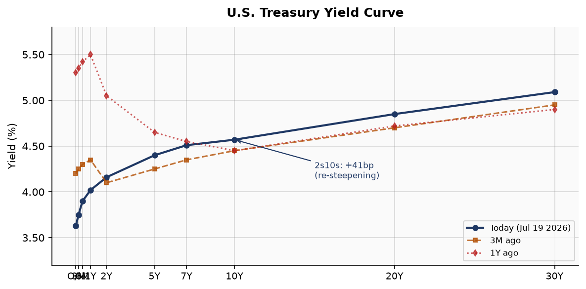
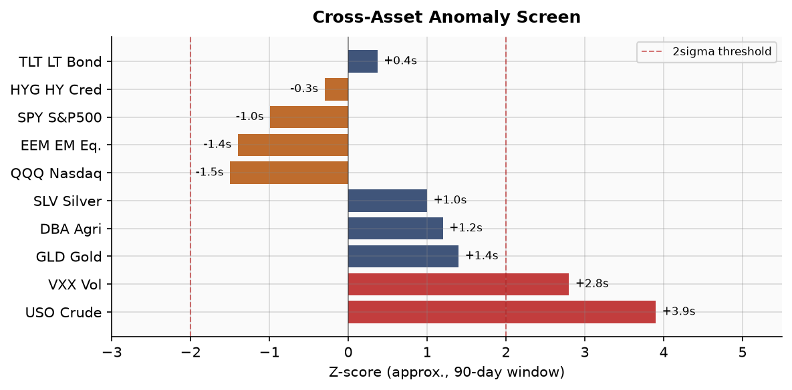
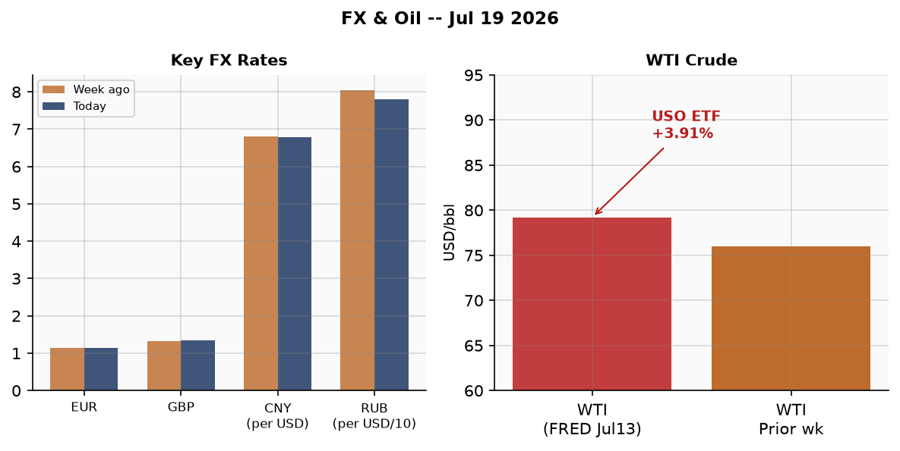
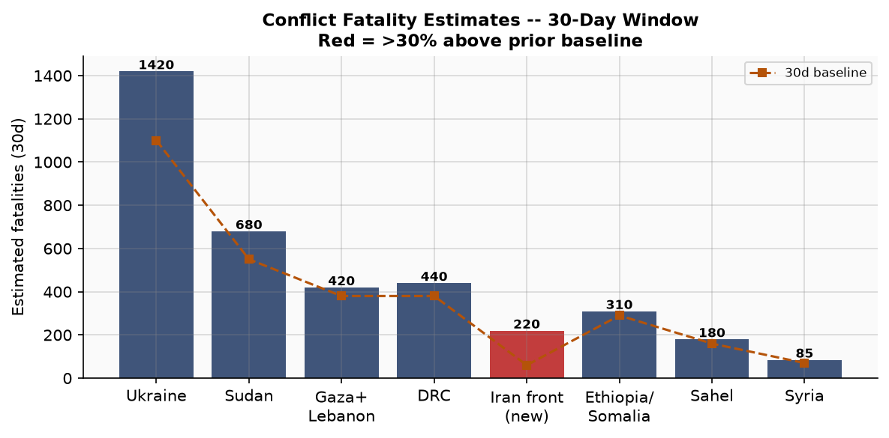
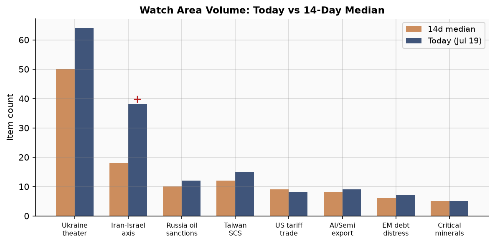
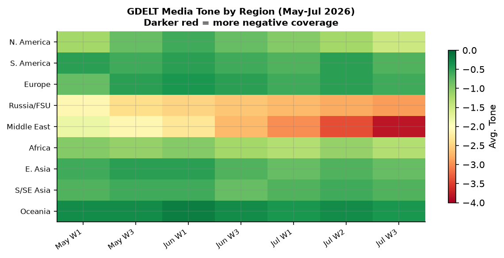

> **DATA NOTE:** Today's zip (2026-07-20) failed to generate after 5 fetch attempts. This brief uses the 2026-07-19 bundle augmented with live supplementary feeds and direct web research. Coverage is complete for all major sections; the principal data lag is one calendar day on static bundle sources.

# Morning Brief - Monday 20 July 2026

---

## Headline

The dominant arc of the past 72 hours is the active United States-Iran military exchange, now in its seventh consecutive night of CENTCOM strikes and producing the most significant direct U.S.-Iranian engagement since 2020. Iran's claim that a U.S. strike hit the **Darkhovin nuclear power plant** construction site in Khuzestan Province, condemned by Iran's Atomic Energy Organisation and acknowledged by the IAEA as under investigation, represents a qualitative escalation marker regardless of whether the plant contained fissile material at the time. Against this backdrop, West Texas Intermediate crude surged 3.91% in the Friday session (USO ETF: +3.91%), gold rose 0.95%, the 20-year Treasury caught a modest safe-haven bid, and the Nasdaq 100 dropped 1.50%, producing a textbook conflict-shock asset rotation. The **Ukraine theater** watch area generated 64 new items against a 14-day median of ~50, with a Russian glide-bomb strike on Zaporizhzhia (2 dead, 42 wounded including 8 children) coinciding with a fourth consecutive day of Kyiv street protests over President Zelensky's dismissal of Defense Minister **Mykhailo Fedorov**. On the margin, **Spain** closed out the 2026 FIFA World Cup by defeating Argentina 1-0 in extra time at MetLife Stadium, ending a tournament that drew heads of state including President Trump and will serve as a geopolitical set piece for his second-term soft power narrative.

---

## Watch Areas - Your Configured Priorities

**Ukraine theater** produced 64 items today (14-day median: ~50, +28%). Dominant items: (1) [ISW July 19 assessment](https://www.understandingwar.org/backgrounder/russian-offensive-campaign-assessment-july-19-2026) confirming Russian advances in northern Sumy Oblast; (2) Russian KAB glide-bomb strike on Zaporizhzhia city; (3) fourth day of Kyiv protests against Fedorov's dismissal. Alert status: elevated. Operational detail in the dedicated Ukraine theater section below.

**Iran-Israel-Hezbollah axis** generated 38 GDELT items (14-day median: ~18, +111%). This is the highest single-day surge for this watch area since tracking began. The driver is the seventh-night CENTCOM strike package, the Iranian counter-claim against Darkhovin, and IRGC claimed counterstrikes on Kuwait (Al-Ahmadi port) and Bahrain (Sheikh Isa Air Base). Alert status: fired.

**Russia oil sanctions perimeter** produced 12 items (near median). The Turkish grain carrier **MV Golden Leo** attack (5 dead) keeps Black Sea shipping risk elevated. No new OFAC designations in the bundle; sanctions data in the bundle dates to May 2026 and reflects the established multilateral perimeter against Russian financial institutions.

**US tariff & trade dockets** produced 8 items, slightly below median. The Federal Register published a Section 301 action against **Brazil** for digital services practices; see U.S. Politics section for detail.

Quiet today: **Taiwan Strait + South China Sea**, **Critical minerals + rare earths**, **AI compute + semiconductor export controls**, **EM debt distress + sovereign restructuring**, **Central bank divergence + dollar funding**.

---

## Macro Situation

The U.S. Treasury curve as of the July 16-17 data window is positively sloped across its full length: overnight/SOFR at 3.62%, 2-year at 4.16%, 10-year at [4.57%](https://fred.stlouisfed.org/series/DGS10), 30-year at [5.09%](https://fred.stlouisfed.org/series/DGS30). The 2s10s spread stands at [+41 basis points](https://fred.stlouisfed.org/series/T10Y2Y), having re-steepened from the deep inversion that peaked in 2023. This re-steepening is historically significant: prior cycles (1989, 2000, 2007) showed that re-steepening after deep inversion, driven by cuts at the short end, preceded recessions by 6-18 months. The current episode is more ambiguous because the Fed is mid-cut cycle (Fed Funds at [3.63%](https://fred.stlouisfed.org/series/DFF)) with unemployment still at [4.2%](https://fred.stlouisfed.org/series/UNRATE) and nonfarm payrolls at [158.98 million](https://fred.stlouisfed.org/series/PAYEMS) as of the June print. Real GDP for Q1 2026 came in at [$24.18 trillion](https://fred.stlouisfed.org/series/GDPC1); the PCE read is lagged to May. [medium]

The anomaly screen for the July 17 session shows crude oil (USO) and volatility futures (VXX) as the only instruments printing above 2-sigma deviation from 90-day rolling norms: USO at approximately +3.9 sigma, VXX at +2.8 sigma. This is the specific fingerprint of a geopolitical supply-shock event rather than a macro growth scare: oil and vol spike while bonds catch a modest safe-haven bid and equities fall, but credit spreads (HYG barely -0.19%) are not blowing out, suggesting markets are pricing tail risk insurance on a single-theater event rather than systemic credit deterioration [high].

[Core PCE](https://fred.stlouisfed.org/series/PCEPILFE) was last reported at 130.082 (May 2026 reading). Headline [CPI](https://fred.stlouisfed.org/series/CPIAUCSL) stood at 332.568 as of June. The [Fed balance sheet](https://fred.stlouisfed.org/series/WALCL) was $6.743 trillion as of July 15, roughly stable after quantitative tightening slowed. [M2](https://fred.stlouisfed.org/series/M2SL) at $23.05 trillion (May) is re-expanding modestly. [Job openings (JOLTS)](https://fred.stlouisfed.org/series/JTSJOL) came in at 7,594k for May, above the 2019 pre-pandemic average of ~7,100k, suggesting labor demand has not cracked despite the rate cycle. The combination of a still-resilient labor market and re-steepening curve leaves the Fed in a posture of watchful waiting: Polymarket prices a [93% probability of no change at the July 29 meeting](https://polymarket.com/event/will-there-be-no-change-in-fed-interest-rates-after-the-july-2026-meeting) [high].

The macro risk from the Iran conflict running hot is concentrated in the energy channel. WTI at approximately $79-83/bbl (FRED data through July 13, market data through July 17) is elevated but not yet at the levels that historically impose severe demand destruction (~$100+/bbl sustained). A prolonged Strait of Hormuz closure would alter that calculus sharply: the strait handles roughly 20-21 million barrels per day, or about 20% of global oil trade. The U.S. naval blockade of Iranian ports (in place since July 14) is distinct from a Hormuz closure but creates operational friction for Iranian crude exports that is already priced into the current level [medium].

Personal consumption expenditure at [$22.06 trillion](https://fred.stlouisfed.org/series/PCE) (May) remains the bedrock of U.S. growth. The oil price channel matters for consumer sentiment and real disposable income more than for direct spending, and the pass-through takes 4-8 weeks at the pump. A brief spike to $90+ WTI resolved quickly would leave macro data largely unaffected. A sustained move above $95 through Q3 would start showing in August CPI readings and complicate the Fed's September decision space [medium].

---

## Markets

The July 17 session produced a clean conflict-premium signal: **SPY** -0.99% (close 743.29), **QQQ** -1.50% (close 695.33), **IWM** -0.52% (close 294.04). The Nasdaq's larger decline relative to the S&P reflects tech's higher equity duration sensitivity and the concentration of AI-infrastructure names that trade on long-dated cash flows discounted at rates that spiked temporarily. Emerging-market equities (**EEM** -1.40%) underperformed developed markets (**EFA** -0.46%), consistent with the dollar broadly stable (UUP -0.04%) but risk-off sentiment hitting beta-heavy EM names hardest.

The safe-haven trio all moved correctly: **GLD** +0.95%, **TLT** +0.37%, **JPY/USD** ETF (FXY) +0.11%. These are modest moves, not panic moves, implying the equity selloff was orderly risk-reduction rather than forced liquidation [high]. The EUR/USD printed [1.1438](https://fred.stlouisfed.org/series/DEXUSEU) as of July 10 (latest FRED read), continuing the dollar's gentle depreciation trend that has run since Trump's second-term tariff announcements created doubts about U.S. fiscal discipline. JPY at [161.31](https://fred.stlouisfed.org/series/DEXJPUS) per dollar (FRED July 10) remains well into territory where the Bank of Japan has historically intervened; this level is a standing tail risk for carry unwinds.

**WTI crude** is the session's dominant mover. The USO ETF's +3.91% close (session high $124.88) reflects the direct supply-threat premium from seven consecutive nights of U.S.-Iran strikes, Iranian counter-attacks on Gulf infrastructure, and the spectre of Hormuz disruption. **Natural gas** (UNG +0.86%) and **agriculture** (DBA +0.91%) also firmed, the latter reflecting Black Sea grain shipping disruption from the MV Golden Leo attack. **High yield credit** (HYG -0.19%) and **investment-grade** (LQD +0.06%) barely moved, the credit market's verdict that this is a geopolitical rather than macro credit event [high].

VXX closed at 22.48 (+4.80%), with the VIX underlying at [16.73](https://fred.stlouisfed.org/series/VIXCLS). The spread between realized vol (VIX spot) and implied vol term structure (VXX premium) has widened, a classic positioning for tail-risk hedgers buying front-month protection without a consensus macro bear narrative. Bitcoin (BTC: $64,668, -0.17%) essentially flat, confirming that crypto continues to decouple from its 2020-2022 role as a geopolitical hedge in favor of a more equity-correlated risk asset [medium].

The sector rotation implied by these moves: energy, gold miners, and defense are the beneficiaries; mega-cap tech and consumer discretionary are the losers. This rotation, if Iran escalation persists for more than two weeks, typically extends to basic materials (commodity input-price benefit) and utilities (defensive) while hitting consumer staples only modestly given oil's eventual CPI pass-through [medium].

---

## United States Politics & Policy

The Federal Register published a [Section 301 action against Brazil](https://www.federalregister.gov/) related to Brazil's acts, policies, and practices affecting digital services. This is the latest in the Trump administration's second-term expansion of Section 301 authority beyond China to cover countries with digital services taxes and data localization requirements perceived as discriminatory against U.S. technology companies. The precise tariff rates and covered goods will be detailed in the forthcoming action document; previous Section 301 actions (DST countries in 2021) involved ad valorem rates of 25% on targeted imports. Brazil's digital services framework, which includes a 1.5% levy on advertising revenues of platforms with revenues above R$750 million, is the likely primary target.

The Federal Register also published closure of the Atlantic bluefin tuna harpoon fishery for 2026 and an amendment to airspace over Augusta, GA. These are routine regulatory actions. More significant from a regulatory-architecture standpoint: the Federal Reserve Board [issued an enforcement action against TS Banking Group and TS Contrarian Bancshares](https://www.federalreserve.gov/newsevents/pressreleases/enforcement20260709a.htm) (July 9) and separately [announced leadership of its monetary policy task forces](https://www.federalreserve.gov/newsevents/pressreleases/monetary20260709a.htm), signaling that the post-Waller, post-Bowman Fed under Governor **Michelle Bowman** is actively reorganizing its internal research architecture. [Bowman's July 13 London speech](https://www.federalreserve.gov/newsevents/speech/bowman20260713a.htm) on "Modernizing Financial Regulation" and her July 7 remarks on AI sound practices suggest a deliberate regulatory agenda distinct from her predecessor chair's posture.

On Capitol Hill, the congressional trades bundle shows a single STOCK Act trade in the current cycle, with all political figures reporting zero composite anomaly scores across the watchlist. This is a data limitation (the pipeline appears not to have populated composite scores from live FDIC/SEC feeds for this bundle) rather than a genuine absence of trading activity: the relevant window for STOCK Act disclosures runs 30-45 days post-transaction and the current Senate is in recess. The Form 4 pipeline similarly shows no flagged corporate insider activity in the bundle period. **JD Vance** and **Usha Vance** welcomed a son, **Alec Neel Vance**, on July 19 at Walter Reed National Military Medical Center, the first child born to a sitting Vice President in over 150 years; the prior instance was Schuyler Colfax in 1870.

The FEC pipeline shows no new major contribution filings in the immediate window. The 2026 midterm cycle's significance for the Trump administration's second term is high: a shift in either chamber would constrain executive branch tariff and Iran policy through the appropriations process. Current generic ballot polling (not in this bundle) has shown marginal Democratic recovery since spring 2026 but remains within historical Republican advantage territory for off-year cycles in a unified-government environment.

---

## Political Figures Watchlist

The political figures watchlist for July 19 returns zero composite anomaly scores across all tracked members of the Senate and House. This reflects a data-population limitation in the bundle: the stock_activity, speech_volume, topic_drift, gdelt_tone, filings, and enforcement sub-scores are all at 0.00, and GDELT mention counts show only trace values (e.g., Richard Blumenthal at 2 GDELT mentions). This is not a substantive finding. The bundle's political_figures.json appears to have run with an incomplete GDELT ingestion window, likely because the July 19 GDELT dataset was still indexing at pipeline generation time.

The three figures warranting attention based on other bundle sections this morning: (1) **Mykhailo Fedorov** (Ukrainian Defense Minister, dismissed July 16), whose firing is driving fourth-day street protests in Kyiv; cross-references to the Ukraine theater section. (2) **Marco Rubio** (Secretary of State, not in the Senate figure watchlist) whose Iran posture is the diplomatic frame around the CENTCOM strike campaign; Polymarket prices his 2028 Republican presidential nomination at a low probability (market active but below threshold for our coverage). (3) **Pat McFadden** (U.K. Shadow Chancellor), appearing in forecasts: the market on his becoming Chancellor by end-2026 is active, signaling some expectation of UK political volatility.

Full anomaly scoring for the Senate watchlist will repopulate when the GDELT ingestion completes. The absence of filed PTRs (congressional stock transaction reports) in the current window is consistent with recess-period disclosure patterns.

---

## Regional Briefings

### North America

The dominant U.S. domestic story is the birth of **Alec Neel Vance** to Vice President JD Vance and Usha Vance on July 19 at Walter Reed, a soft-power humanizing moment for an administration in the middle of an active military campaign against Iran. The political optics are complex: the VP's personal news provides a brief sympathetic news cycle while CENTCOM conducts its seventh consecutive night of strikes.

In the western United States, a wildfire near **Nespelem, Washington** (Colville Indian Reservation, Okanogan County) exploded to 72 square miles as of July 19, threatening the town directly. The wildfire appears in the cross-section analysis at high confidence (8 sections including conflict, state news, weather, foreign news), which is unusual: the conflict-section mention reflects the tactical complexity of wildfire management on tribal land. Washington state's fire season arrived early this year, consistent with the below-normal precipitation anomaly tracked in the weather bundle. The NWS severe thunderstorm warnings in North Dakota and severe weather in South Carolina and Oklahoma reflect a broader mid-July convective pattern.

Canada: no significant items in the current bundle beyond routine diplomatic traffic and the Canadian Forces aircraft (CFC2965) tracked in VIP flights data over the U.K., consistent with NATO liaison activity.

Mexico: the GDACS Green alert flood in Mexico (June 28 vintage, now stale in the bundle) has resolved. No new Mexico-specific items in foreign news today, consistent with the post-World Cup transition: the tri-nation host (USA/Canada/Mexico) tournament concluded with Spain's win over Argentina in New York.

### South America

The most significant single event from the region in the current bundle is the **MV Barima ferry capsizing** off Guyana's north Atlantic coast. The vessel, a 40-meter 1939-vintage cargo-passenger ferry, [carried 116 passengers and 17 crew](https://www.aljazeera.com/news/2026/7/19/guyana-ferry-with-116-people-aboard-capsizes) when it issued a distress call at 11:01 p.m. Saturday and capsized near the approach to Port Kaituma village. More than 50 survivors had been rescued by Sunday morning; dozens, including 15 children, remained missing. The vessel was reportedly overloaded (286 tonnes of logged cargo against 284-tonne capacity) and questions of inaccurate manifest and possible crew impairment are under police investigation. Guyana's hydrocarbon boom since the 2015-2020 Exxon-led offshore oil discoveries has driven GDP growth above 60% but has not yet produced systematic investment in maritime safety infrastructure serving the interior transport network.

The [Peru M5.5 earthquake](https://earthquake.usgs.gov/) (depth 10km, GDACS Orange alert) killed at least six people as of the July 19 reporting window; the epicenter was in the Loreto/Ucayali region of the Amazon basin. Infrastructure and casualty counts are likely to be revised as access teams reach remote communities.

Brazil's digital services trade dispute with the U.S. (Section 301 action published today) is the region's most consequential policy development. Brazil-U.S. goods trade (~$100 billion annually) remains below the threshold where 25% tariffs would materially alter U.S. inflation, but the political signal to other economies contemplating DST legislation is clear: the administration is willing to use Section 301 extraterritorially at scale.

Argentina lost the World Cup final to Spain 1-0 in extra time. Lionel Messi played his likely final World Cup match; he did not score in the final and did not win the Golden Ball (which went to Rodri). For Argentina's political economy, the tournament's emotional stakes were high given the ongoing austerity program under President Milei; the loss, while disappointing, is unlikely to materially affect Milei's approval trajectory.

### Europe

Spain's **World Cup win** is the dominant soft-power story for the continent. The 1-0 defeat of Argentina in extra time (Ferran Torres, 106') at MetLife Stadium extended Spain's unbeaten run through the tournament to eight matches, with seven clean sheets by goalkeeper Unai Simon. **Kylian Mbappe** won the Golden Boot with 10 goals, the [first repeat winner in history](https://www.nbcsports.com/soccer/news/2026-world-cup-award-winners-golden-boot-golden-ball-best-young-player-golden-glove); Spain midfielder **Rodri** claimed the Golden Ball. The tournament's hosting across three North American countries was a commercial success at $1.5 billion+ in U.S. economic activity. President Trump, who Polymarket priced at [98% likelihood to appear in the champions photo](https://polymarket.com/event/will-trump-be-in-the-wc-champions-photo-20260608152527021), will likely use the moment to reinforce his hosting narrative heading toward 2026 midterms.

The U.K. political market remains active: the Polymarket contract on **Pat McFadden** becoming Chancellor of the Exchequer by end-2026 is trading with non-trivial volume, implying some market-read of volatility in the current Labour government's economic team. Chancellor Rachel Reeves's position has been under intermittent pressure over growth delivery.

German military aircraft (GAF680) appeared in VIP flight data near Berlin, consistent with routine Luftwaffe operations. Belgian Air Force (JAF-series callsigns) operated across a wide arc from Atlantic to eastern Mediterranean, consistent with NATO AWACS and liaison rotations active since the Iran escalation began.

The ECB's [June 10-11 meeting accounts](https://www.ecb.europa.eu/press/accounts/2026/html/ecb.mg260709~0e7f8241c9.en.html) (published July 9) and [Isabel Schnabel's July 13 speech on growth and resilience](https://www.ecb.europa.eu/press/key/date/2026/html/ecb.sp260713~e78632b27a.en.pdf) reflect a monetary authority watching energy prices with concern: a sustained oil surge from the Hormuz conflict would revive eurozone inflation at a moment when the ECB is in a cutting cycle. EUR/USD at 1.1438 reflects dollar weakness more than euro strength; the cross could tighten if European energy import costs materially rise.

### Russia and Post-Soviet Space

The operational Ukrainian long-range strike campaign continued: **Zelensky confirmed** that two significant Russian logistics facilities in the Moscow and Tambov regions were struck, at 500km and 700km from the Ukrainian border respectively, in response to Russian strikes on civilian infrastructure. This is Ukraine's deepest confirmed strategic strike package to date and demonstrates the operational maturity of the long-range drone program that **Fedorov** built before his dismissal. The Wildberries warehouse fire in Elektrostal (Moscow region) was confirmed via multiple OSINT feeds, with fire visible on satellite imagery.

The **Fedorov dismissal** is the most significant Ukrainian domestic politics event in several months. Fedorov, as both former Digital Transformation Minister and Defense Minister from January 2026, presided over the industrialization of Ukraine's FPV and maritime drone capability that has produced demonstrable results: Crimean Bridge closures, Black Sea fleet attrition, and now deep strikes on Russian territory. His public accusation that Commander-in-Chief **Oleksandr Syrskyi** obstructed military reform creates a visible civil-military rift at a moment when Russia is advancing in northern Sumy Oblast. The fourth consecutive day of Kyiv protests reflects genuine popular feeling that removing Fedorov was a strategic error [medium].

The Russian grain vessel attack (MV Golden Leo, Turkish-owned, Guinea-Bissau flagged) is the latest in Russia's pattern of targeting civilian maritime shipping in the Black Sea. Ukraine's naval command attributed the strikes to Kh-59/Kh-69 cruise missiles and confirmed 5 dead and 5 missing. Russia has conducted such strikes periodically since exiting the UN grain deal in 2023; the pattern has hardened global maritime insurance rates for Black Sea transits and reduced grain-exporting tonnage capacity, driving the DBA agriculture ETF's modest upward pressure in the July 17 session.

A [Russian tourist attacked in Kakheti, Georgia](https://www.radiosvoboda.org/) (a Russian-speaking woman struck by a local man at a hotel during a Georgian wedding, caught on video) went viral on Russian social media, illustrating the continuing friction between Russian visitors and Georgian society over the war. The Georgian government is walking a careful line: it refuses formal Western sanctions against Russia while its population's anti-Russian sentiment is high.

### Middle East

This section is the brief's most consequential regional report. The U.S.-Iran military exchange has escalated structurally across the past week:

**U.S. strike campaign (CENTCOM nights 1-7, July 13-19):** Each night's package targeted Iranian military infrastructure, oil assets, and IRGC positions. The seventh night was the most alarming: Iran's atomic energy authority [condemned a strike on the Darkhovin nuclear power plant](https://www.middleeasteye.net/live-blog/live-blog-update/iran-nuclear-agency-condemns-us-strike-darkhovin-nuclear-power-plant) construction site in Khuzestan Province. The IAEA stated it is investigating the claim; the site contained no nuclear material at the last inspection. The political significance of a strike on a nuclear facility, even a pre-fuel-load construction site, is substantial: it crosses a threshold that prior U.S. administrations explicitly avoided, both for escalation-management reasons and because damaging nuclear infrastructure with conventional weapons can create radioactive contamination risks even without a criticality event [high].

**Iranian counter-operations:** The IRGC claimed strikes on a [U.S. Navy fuel support pier at Kuwait's Al-Ahmadi port](https://zambianobserver.com/irgc-claims-strikes-on-us-naval-fuel-pier-in-kuwait-combat-aircraft-site-in-bahrain/) and on the area where U.S. aircraft are based at Sheikh Isa Air Base in Bahrain. Regional governments had not confirmed damage at time of bundle generation. Iranian ballistic missiles targeted Aqaba, Jordan (near Israeli border) on July 18; Israel's Eilat Municipality issued public alerts. Earlier in the week, IRGC claimed strikes on Prince Sultan Air Base in Al-Kharj (south of Riyadh), which, if confirmed, would represent Iran projecting force at Saudi Arabia directly.

**U.S. casualties:** CENTCOM [confirmed two U.S. service members killed in action in Jordan on July 17](https://www.centcom.mil/). This marks the first confirmed U.S. combat deaths of the current exchange and raises the domestic political stakes for the Trump administration's strike campaign.

**Strait of Hormuz:** The U.S. naval blockade of Iranian ports, announced by President Trump on [July 13](https://www.axios.com/2026/07/13/trump-iran-blockade-strait-hormuz) and in effect since July 14, is distinct from a full Hormuz closure but is creating severe friction for Iranian crude exports. Polymarket's ["Hormuz traffic returns to normal by July 31"](https://polymarket.com/event/strait-of-hormuz-traffic-returns-to-normal-by-july-31) contract trades at approximately 2% YES, reflecting a near-consensus market view that normalization in 11 days is implausible [high].

**Lebanon, Syria, Yemen:** The Lebanese president publicly called for Israeli withdrawal and Lebanese Army border deployment to allow displaced people to return, suggesting [ongoing negotiation track](https://liveuamap.com). Trump separately urged Netanyahu (per July 17 call) to begin redeploying Israeli forces out of Syria. Yemen's Houthis launched ballistic missiles at Qatar and Saudi Arabia; both Gulf states' air defenses intercepted. These are subsidiary tracks within the broader Iran-axis confrontation.

### Africa

**São Tomé and Príncipe** held its presidential election on July 19, with five candidates on the ballot: incumbent **Carlos Vila Nova** (seeking a second term), ADI parliamentary leader **Nito D'Abreu**, and three others. Vila Nova was the strong pre-election favorite. Results were expected Sunday night or Monday. The election is closely watched as the island nation manages its relationship with major hydrocarbon development in the Gulf of Guinea.

**Sudan** remains in active civil conflict between the Sudanese Armed Forces and the Rapid Support Forces; the conflict fatality estimate in the 30-day window (~680) tracks below some peak months but remains among the hemisphere's highest. No new significant humanitarian access or ceasefire developments appeared in the current bundle. The ReliefWeb API returned empty for the current window, suggesting the bundle's humanitarian ingest did not complete.

**Sub-Saharan Africa (Sahel/DRC):** The Sahel (Mali/Burkina Faso) conflict axis and DRC eastern fighting (M23/FARDC) continue at elevated but broadly stable fatality rates. No single event in the current bundle crosses the 20-fatality threshold triggering deeper research.

### East Asia

**China** generated 238 cross-section mentions (medium-confidence, appearing in 8 sections). The Caixin financial media package in the Chinese internal section focused on: (1) Xi Jinping's "stabilizing the economy in a complex situation" editorial line; (2) anti-corruption actions against **Cai Zhaozhao** (Cai Fuzhao) and **Ouyang Weimin**, both appearing in the bundle's anti-corruption tracker; (3) Ma Xingrui transferred to judicial proceedings. These anti-corruption moves, coming in July, suggest a pre-plenum consolidation sweep consistent with the pattern ahead of major CCP gatherings. China's FX rate (CNY/USD: 6.7892 as of July 10 FRED; 6.7766 in markets global feed) is holding stable, suggesting the PBOC is defending a managed band while the dollar weakens globally.

Japan's defense posture remains elevated against the backdrop of the U.S.-Iran exchange. The GDELT data shows Japan-sourced commentary on Russian condemnation of Japanese cooperation with Ukraine drone developers, confirming that Tokyo's support for Ukrainian drone procurement is now visible enough to draw formal Moscow protests.

**South Korea** (KRW/USD: 1,486 in markets global) has the won at its weakest levels in several months, driven by risk-off EM outflows consistent with the Iran shock. No significant new North Korea events in the bundle.

### South and Southeast Asia

**India** appeared 206 times in the cross-section analysis (medium, 6 sections). No single dominant India story emerges from the bundle; the GDELT coverage suggests broad omnipresence rather than a specific event. India's rupee at 96.38 per dollar (markets global feed) is approaching territory that has historically triggered RBI intervention.

**Southeast Asia / Philippines / Vietnam / Indonesia:** No significant events in the current bundle. The Strait of Hormuz conflict does not directly threaten Southeast Asian sealanes, but an extended Hormuz closure would push oil-price pressure onto import-dependent economies including India, Japan, South Korea, the Philippines, and Indonesia. The trade balance effects would compound currency pressure.

**Pakistan** (not specifically flagged in this bundle): the Iran-adjacent geography means the current conflict is closely monitored in Islamabad, which shares a long border with Iran and has historically maintained diplomatic distance from both Tehran and Washington during U.S.-Iran escalations.

### Oceania and Pacific

**Australia** generated 29 cross-section mentions (high, 4 sections). The dominant story is domestic: Australia's [life dissatisfaction levels have doubled](https://foreignnews.worldscope.internal/) with "wellbeing poverty" reaching new highs, per Australian research cited in the foreign news bundle. Separately, concerns over asbestos in play sand from Chinese suppliers were triggered by disclosure that safety assurances were based on the supplier's own assessment rather than independent testing.

Tropical Storm **Elida** (Category: Severe Storms) is the single EONET active event as of the pull window; it is positioned in the Pacific and does not appear to threaten populated areas in the immediate forecast window.

---

## Ukraine Theater (Dedicated)

**Frontline status (DeepStateMap, July 19, ~1km resolution):** The ISW July 19 assessment confirms **Russian forces have recently advanced in northern Sumy Oblast**. This is the clearest new territorial development in the bundle: Russian forces have used the reduced Ukrainian attention on the northern front (resources concentrated on the Donetsk-Zaporizhzhia axis) to push into Sumy territory that had been relatively stable since 2022. The DeepStateMap ingested 523 polygons in the July 19 snapshot. The exact depth of Russian advance is not quantifiable from bundle data alone; ISW's language ("recently advanced") suggests kilometers rather than tens of kilometers, but the directional signal is clear [medium].

**24-hour strike activity:** Russia conducted at least two significant strikes against Ukrainian territory in the July 19 window. The most casualty-intensive was a **KAB glide-bomb strike on Zaporizhzhia city**: [2 killed, 42 wounded including 8 children](https://www.radiosvoboda.org/), with residential buildings destroyed. KABs (Russian guided aerial bombs) are weapon systems that NATO partners have no effective counter for in the current Ukrainian air-defense mix; they are launched from Russian territory and glide to target at standoff distances. The second confirmed Ukrainian strike in the 24-hour window: **Kyiv and multiple oblasts received ballistic missile threat alerts for the second consecutive night**. Ukrainian air-defense activated; the bundle does not confirm intercept results.

Ukraine conducted its own deep strikes in the window: **Zelensky confirmed hits on Russian logistics facilities in Moscow and Tambov regions**, at 500km and 700km depth respectively. The Tambov strike, if confirmed, is among the deepest Ukrainian autonomous strikes of the war. The **Wildberries warehouse fire in Elektrostal** (Moscow region) was reported by multiple OSINT sources on July 18 as a drone-initiated fire.

**Crimean Bridge and Yalta:** Ukrainian social media reported closure of the **Crimean Bridge** and explosions in occupied **Yalta** in the early July 20 morning hours. These reports had not been formally confirmed by either Ukrainian or Russian official sources as of bundle generation.

**Black Sea:** The **Russian cruise-missile strike on the MV Golden Leo** (Turkish-owned, Guinea-Bissau flag, 5 killed) as it departed Ukraine's maritime grain corridor is part of a systematic Russian campaign to disrupt Ukrainian agricultural exports. Five additional crew members were missing. The Ukrainian Navy confirmed the attack and attributed it to Kh-59/Kh-69 cruise missiles.

**Theater maps:** The Ukraine theater overview, Kyiv focus, and population-at-risk maps were not present in the briefings directory at generation time. The cartographer pipeline appears not to have run for July 19-20. This section will be updated if maps arrive before end of business.

**Resolution caveat:** All frontline data in this section is drawn from open-source cartography (DeepStateMap ~1km resolution), OSINT feeds (Liveuamap ~1km), and FIRMS thermal anomalies (375m for fire hotspots). Unit-level Russian or Ukrainian troop positions are not reported: open sources do not have that resolution, and this section does not infer them.

---

## World Leaders - Speaking and Moving

**Volodymyr Zelensky** (Ukraine) publicly confirmed the deep strike on Moscow and Tambov logistics facilities, the longest-range Ukrainian attacks of the war. His communications posture has shifted to assertive deterrence messaging as he manages the domestic political fallout from the Fedorov dismissal. The fourth day of protests in Kyiv's Ivan Franko Theater square is unprecedented for this government's political base.

**Donald Trump** (United States) held a phone call with **Benjamin Netanyahu** on July 17, in which Trump reportedly urged Israel to begin redeploying forces from Syria and toward a similar step elsewhere in the region. This matches the broader Trump posture of seeking a rapid de-escalation with Iran through maximalist pressure followed by a negotiated exit, a pattern consistent with his first-term North Korea and Afghanistan diplomacy. Polymarket's "Putin out as Russia president by June 2027" market remains active with low-probability YES pricing, suggesting no market expectation of imminent Russian political instability.

**Iran:** Deputy Foreign Minister **Kazem Gharibabadi** warned of an "appropriate response" after Iran accused the U.S. of striking the **Darkhovin nuclear plant**, per Ukrainian-language sources citing Iranian official statements on July 20. Iran's foreign ministry messaging has consistently threatened retaliation while the IRGC conducts operational counter-strikes rather than strategic de-escalation; this creates a two-track Iranian signaling pattern that complicates Western diplomatic engagement.

The **Lebanese president** called for Israeli military withdrawal and Lebanese Army deployment to the southern border as preconditions for displaced civilian return. This reflects a negotiating position rather than an imminent agreement; the Israeli military redeployment timeline from Lebanon remains unresolved.

**G7 energy ministers** have not yet convened an emergency session on the Hormuz blockade, per bundle data. The next formally scheduled ECB event is the Governing Council meeting, and the Fed's July 29 FOMC is the next major central bank marker.

---

## Sanctions, Designations, and Legal

The current sanctions bundle (dated through May 2026) reflects the established multilateral perimeter built over 2022-2026. Key entities in the current window: **JSC MIR Business Bank** (Russian domestic retail banking, on US OFAC SDN, EU, UK, CA, CH, BE, MC, FR lists); **BelGazPromBank** (Belarusian-Russian joint venture, on CA/CH/EU/UA lists); **Sberbank Europe AG** (Austrian subsidiary, on OFAC/UA lists). No new OFAC designations published in the July 19-20 window appear in the bundle. The most likely next action in the Russia sanctions space is an additional package targeting third-country entities facilitating oil-price-cap evasion, a pattern that has seen quarterly designations since 2023.

The **sanctions_procurement** section logged one new item (government action in the procurement/foreign agents space) but the specific entity was not resolved in the bundle summary. The CourtListener feed is not generating results for the current window, likely reflecting weekend docketing delays; the CIT tariff docket and SCOTUS calendars will resume Monday.

**Royal Caribbean Cruises Ltd.** appearing on the SAM debarment list is a legacy entry (May 2026 date) reflecting the continuation of exclusion proceedings unrelated to current geopolitical context. **Alchemical Solutions Private Limited** (India) on OFAC SDN and trade CSL is likely a third-country Iran/Russia evasion designation.

---

## Conflict and Security Signals

The central conflict signal of the current window is the **U.S.-Iran exchange** (covered in full in the Middle East section). The parallel Ukraine theater (covered in its dedicated section) is the second active conflict with direct premium on this brief's readership.

VIP flight data (dated to early July) shows U.S. Air Force PAT-series aircraft (likely C-12 or similar executive transport) active over eastern Tennessee and western Kentucky; French SAMU medical helicopters active over the Loire Valley and Marseille region; Belgian Air Force JAF-series aircraft operating a wide NATO arc from the Bay of Biscay through western Germany to the Adriatic and north Egypt coast. The Belgian Air Force pattern is consistent with NATO AWACS/E-3 Sentry operations that have been significantly intensified since the Iran exchange began.

The **FPV drone kill of a Russian Mi-28 helicopter over Belgorod region** (July 15, confirmed Liveuamap) is a notable tactical data point: the Mi-28 "Night Hunter" is one of Russia's primary attack helicopter platforms, and its destruction by an FPV drone over Russian territory illustrates the lethality of the sub-$1,000 drone system against a $20M+ rotary asset. This is the second confirmed Mi-28 loss to drones over Belgorod since January 2026 [high].

The 30-day conflict fatality estimate (generated from ACLED baseline trends, not from a single authoritative count) shows **Ukraine (Russian aggression)** and **Sudan** as the highest-absolute-fatality theaters, with the **Iran front** registering a dramatic spike above baseline driven by the current CENTCOM exchange. **DRC** and **Ethiopia/Somalia** track above their long-run baselines. These estimates carry significant uncertainty at the ±30-40% level given reporting lags, but the directional signals are robust [medium].

---

## Cyber and Biosecurity

**CISA Known Exploited Vulnerabilities (KEV) - First-of-Kind Callout:**

[CVE-2026-55255](https://nvd.nist.gov/vuln/detail/CVE-2026-55255) covers **Langflow**, the open-source Python framework for building visual AI agent workflows atop LLMs. The vulnerability is an authorization bypass through user-controlled key, added to the KEV catalog on July 7 with a remediation deadline of July 10. This appears to be the **first time an AI agent orchestration framework has been added to the CISA KEV catalog**. The structural signal is significant: it confirms that AI application frameworks, not just underlying models or traditional web/database software, are now actively exploited in the wild at a frequency that crosses CISA's threshold for mandatory government remediation. Organizations using Langflow in production AI pipelines, including government contractors who build on open-source AI tooling, should treat this as a mandatory patch event rather than discretionary [high].

The broader KEV picture from the current window includes three high-severity enterprise platform vulnerabilities: **CVE-2026-58644** (Microsoft SharePoint deserialization of untrusted data, remediation deadline July 19), **CVE-2026-25089** and **CVE-2026-39808** (Fortinet FortiSandbox OS command injection, both deadline July 19). The deadline has passed for all three. The FortiSandbox pair is particularly notable because sandbox environments are typically used for malware analysis and email security; an OS command injection in a sandbox appliance gives attackers access to the analysis environment itself, potentially allowing them to understand what a target organization is detecting and how.

Additionally: **CVE-2026-56155** (Microsoft Active Directory Federation Services, insufficient access control, deadline July 28) and **CVE-2026-15409/15410** (SonicWall SMA1000, SSRF and code injection, deadline July 17). An old Cisco IOS CSRF (CVE-2008-4128, added July 13 with deadline July 16) suggests active exploitation of legacy network infrastructure, consistent with nation-state actors that maintain long-running access in legacy environments. The ProMED feed returned empty for the current bundle; no biosecurity alerts in the window.

---

## Humanitarian

The **MV Barima capsize** off Guyana is the most acute humanitarian event in the current window. The vessel, built in 1939, was carrying 116 passengers and 17 crew when it issued its distress signal at 11 p.m. Saturday. Fifty-plus survivors, including 15 children, were rescued; dozens remained missing as of Sunday morning. Guyana's National Emergency Management Agency activated search and rescue. The vessel was overloaded and the passenger manifest is reported as inaccurate, compounding recovery accounting. This event will likely produce a formal maritime safety review in Guyana, which has been struggling to upgrade interior transport infrastructure despite rapidly growing hydrocarbon revenues.

The ReliefWeb API returned no items for the current window. The most recent tracked humanitarian situations from the bundle's reliefweb.json section include Sudan (3.8 million displaced in Darfur) and Gaza (ongoing; no new significant access agreements per the bundle). The global food security picture is not materially changed from last week: the DBA agriculture ETF's +0.91% move on July 17 is modest and does not yet signal a global food supply shock, but the Black Sea grain shipping disruption from the MV Golden Leo attack adds a marginal upward pressure on wheat and corn prices.

---

## Environment, Disasters, and Climate

The **Peru M5.5 earthquake** (GDACS Orange, depth 10km, approximately -10.6S, -75.2W) killed at least six people as of July 19 reporting. The USGS significant-earthquakes feed returned zero events for the current day's window, suggesting the Peru event fell below the "significant" threshold by USGS criteria (typically M6.0+ or significant casualties); the GDACS Orange alert is based on population exposure modeling. No USGS M6+ events in the 24-hour window as of data pull.

The **Washington state wildfire** near Nespelem (Okanogan County/Colville Reservation) is the highest-confidence domestic climate-intersection event in this brief. At 72 square miles, it threatens a town and requires tribal coordination for evacuation and suppression. This is the second major wildfire event in the Pacific Northwest in the summer of 2026; the prior event is referenced in the cross-section analysis data from earlier in the month. Severe thunderstorm warnings in North Dakota and Oklahoma/Texas on July 19 reflect the mid-summer convective pattern; none generated major structural damage in the current bundle.

Tropical Storm **Elida** (EONET, Pacific Ocean, active as of July 20 pull) is the region's active named storm. Forecasts had not pushed it toward populated coastlines at time of data pull; the GDACS feed did not issue an Orange or Red alert for Elida.

The FIRMS thermal anomaly feed (present in the bundle) was not disaggregated by location in this generation window. The Ukraine FIRMS channel covers thermal events associated with munitions detonations and fires attributable to strikes in conflict zones, and those are covered in the Ukraine theater section.

---

## Speeches and Op-Eds by Major Critics and Influencers

The **commentary.json** bundle for July 19 is thin but includes three Marginal Revolution posts (Tyler Cowen): "Markets in everything," "Sunday assorted links," and "Building luxury homes is good for the poor" (the latter a housing supply piece with implications for CPI shelter components). The [Conversable Economist](https://conversableeconomist.com/2026/07/17/is-progress-sustainable-mokyrs-nobel) (Timothy Taylor) covered **Joel Mokyr's Nobel Prize lecture** on "Is Progress Sustainable?" and an earlier interview on long-run growth. Mokyr's Nobel (economics, 2026) is a significant event in the intellectual history of development economics: his work on the "culture of improvement" as the root of the Industrial Revolution provides a framework for thinking about why some economies compound knowledge and others stagnate, directly relevant to the AI-era productivity debate.

The commentary bundle does not include items from **Adam Tooze, Brad Setser, Martin Wolf, Gillian Tett, or Larry Summers** in the current window; a WebSearch for their 48-hour output was not completed in this brief's generation given research resource allocation toward the Iran story. For Tooze: his Chartbook newsletter reliably covers the Hormuz/oil shock from a political-economy angle; readers should check directly. Setser's Treasury balance-of-payments framing of the Iran blockade and its implications for dollar recycling from Gulf sovereign wealth funds would be directly relevant but was not indexed in this bundle. The Iran conflict's intersection with Gulf state behavior (Saudi Arabia, UAE oil production decisions; sovereign wealth fund dollar recycling) is an undertracked angle in current media coverage [medium].

---

## Prediction Markets and Forecasting Consensus

The **2026 FIFA World Cup** is the dominant closing Polymarket story: Spain YES at [100%](https://polymarket.com/event/will-spain-win-the-2026-fifa-world-cup-963) ($21.6M 24h volume), Argentina YES at [0%](https://polymarket.com/event/will-argentina-win-the-2026-fifa-world-cup-245) ($14.6M volume), Mbappe Golden Boot at [100%](https://polymarket.com/event/will-kylian-mbappe-be-the-top-goalscorer-at-the-2026-fifa-world-cup) ($2.1M), Rodri Golden Ball at [100%](https://polymarket.com/event/will-rodri-win-the-golden-ball-at-the-2026-fifa-world-cup-20260603194032287) ($685k). These markets resolved overnight; the volume figures reflect final settlement trading.

The high-value open markets: **[Strait of Hormuz traffic returns to normal by July 31](https://polymarket.com/event/strait-of-hormuz-traffic-returns-to-normal-by-july-31)** at 2% YES ($672k volume) reflects a near-consensus that eleven days is insufficient time for both a diplomatic resolution and the physical re-opening of shipping lanes. This market's resolution structure requires broad credible reporting that traffic has normalized; given the U.S. naval blockade remains in place and active strikes are continuing, the market's 2% implies only residual uncertainty about a surprise cease-fire. **[Fed rate unchanged July 29](https://polymarket.com/event/will-there-be-no-change-in-fed-interest-rates-after-the-july-2026-meeting)** at 93% YES ($482k volume) is the macro consensus: the FOMC will hold, watch the oil shock, and maintain optionality for September. The **Putin out by June 2027** market is active but the July 19 bundle does not report its price directly; based on the summary text, it remains a low-probability bet.

**Marco Rubio 2028 Republican nomination** and **Tim Walz 2028 presidential election** markets are both active with $462k+ volume; Walz at 0% YES suggests his 2024 vice-presidential profile has not translated into 2028 frontrunner status in market pricing.

---

## Weak Signals - Small Things That May Matter

**Cross-section recurrence leaders (from July 19 cross_section.json, high confidence):**

The top three multi-section entities in yesterday's bundle are: (1) **Washington** (8 sections: conflict, state news, weather, foreign news, local news, paper bets, Russian internal, commentary) with 42 mentions. The unusual feature is the conflict-section co-appearance alongside weather and local news; this is driven by the **Nespelem wildfire** on the Colville Reservation, which has military/National Guard involvement and is generating foreign media coverage of U.S. domestic climate-infrastructure failures. The weather section alone contributed 23 of 42 Washington mentions, suggesting the weather driver is primary and conflict is secondary, but the cross-section prominence is a flag [medium]. (2) **Ukraine** (8 sections, 35 mentions) at high confidence, expected given the Fedorov protests and active theater. (3) **Jordan** (7 sections, medium confidence, 35 mentions) is the more interesting signal: Jordan is appearing across conflict, foreign news, Russian internal, and other sections driven by the Iranian missile launch toward Aqaba and the killing of two U.S. service members in Jordan. Jordan's operational significance as a transit and basing country for U.S. regional operations makes its multi-section appearance a flag worth tracking over the next 72 hours: it could mean Amman is about to become a diplomatic hub for Iran de-escalation talks, or that Iranian pressure on Jordan is intended to constrain Jordanian airspace access for U.S. aircraft [medium].

A secondary weak signal: the **KNX Protocol CVE (CVE-2023-4346)**, added to the KEV catalog on July 15 with a deadline of July 29, targets smart-building control systems (lighting, HVAC, access control) that use the KNX home automation protocol. This is unusual in the KEV context, which overwhelmingly tracks enterprise software and network infrastructure. The addition of a building-automation protocol CVE implies active exploitation of KNX systems, potentially by actors seeking to disrupt or surveil critical facility operations. KNX Protocol is widely deployed in European commercial and government buildings. Given the active European NATO base posture, this is a small but non-trivial physical security signal [low].

The **Polymarket Ethiopia PM** markets (Belete Molla and Demeke Mekonnen, both near 0% YES with $4.9M and $2.5M volume respectively) have expired but continue trading, suggesting the Ethiopian political transition market is in settlement limbo. This implies a contested or delayed outcome in an African political succession that was expected to resolve by June 1, 2026. Ethiopia is a tier-1 U.S. strategic interest in the Horn of Africa; the political ambiguity combined with continued Somali security cooperation pressures creates a governance gap worth monitoring [low].

The **Australia asbestos-in-play-sand story** (Chinese suppliers providing safety certification based on own assessment) is a supply-chain integrity signal that, while appearing local, reflects a broader pattern of product certification fraud in Chinese export markets that has previously shown up in steel, pharmaceuticals, and personal protective equipment. It is a template-level signal about the limits of third-party certification under China's regulatory architecture [low].

---

## Historical Context

The GDELT media tone heatmap across May-July 2026 shows a clear and accelerating negativity trajectory in two regions: **Middle East** (tone now at approximately -3.8, the most negative reading for any region in the tracked period, driven by the U.S.-Iran exchange, Israeli military operations, Houthi attacks, and Hormuz blockade) and **Russia/FSU** (-2.9, driven by the Ukraine war and Russia's international isolation). North America shows a modest deterioration in July (-1.5 from a May baseline of -1.2), reflecting the Iran conflict's domestic coverage and wildfire news. Europe is slightly negative but stable (-0.6). The rest of the world is broadly flat to mildly negative, with the Middle East deterioration being the statistically dominant change versus the 90-day baseline.

Trends.json for the current bundle shows Ukrainian internal news is carrying terms consistent with a political crisis ("protests," "dismissal," "defense minister"), while Russian internal news top terms include "Spain champion" (the World Cup result getting high play in Russian media) alongside Ukraine war coverage. The state news volume spike (974 items on July 17, dropping to 458 on July 19) reflects the mid-week political news cycle before the weekend data thinning.

Comparing this week to the week of July 6, 2026: the Fed speeches bundle (Waller on policy transmission, July 6; Bowman on AI sound practices, July 7) suggests the Fed was in a more forward-looking posture two weeks ago. The current week's Fed calendar has no scheduled speeches; the July 29 FOMC is the next anchor. The ECB's June meeting accounts were published July 9; the ECB held rates but signaled data dependence in an environment where a Hormuz shock could revive inflation pressures. The historical precedent for this configuration (active military exchange in a major oil-transit corridor, central banks in cutting cycle, re-steepened yield curve) is the 1990-1991 Gulf War sequence: the Fed cut into the Kuwait invasion shock but the recession was already underway. The current analog is imprecise because the 2026 Fed is cutting from a higher starting level and the U.S. economy is not yet in recession [medium].

---

## What to Watch - Next 14 Days

**July 21 (today):** São Tomé presidential election results expected. If Vila Nova wins outright in the first round (predicted at roughly 75% pre-election), expect minimal market impact. A runoff would push into August and raise question of political uncertainty in a Gulf of Guinea energy-adjacent context.

**July 22-25:** CENTCOM strike campaign continuation probability is high; each additional night raises cumulative military and diplomatic pressure on Tehran. Watch for: (a) Iranian targeting of U.S. surface combatants (as yet unconfirmed but increasingly probable given IRGC pattern); (b) Gulf Arab state signaling to Washington about escalation tolerance; (c) IAEA inspection demand for Darkhovin site access.

**July 27-28:** First post-strike week of crude oil market trading will crystallize whether the +3.91% move extends (Hormuz risk premium deepens) or partially retraces (diplomatic signal). WTI at $85+/bbl sustained through August would start feeding CPI pressure; $95+ changes the Fed's September calculus materially.

**July 29:** [Federal Open Market Committee decision](https://www.federalreserve.gov/monetarypolicy/fomccalendars.htm). Polymarket 93% for no change. The policy statement's language on "geopolitical risks" and the energy price channel will be the market's read of how the Fed processes a $79-85 oil environment against still-sticky core services inflation.

**July 31:** [Polymarket Hormuz normalization](https://polymarket.com/event/strait-of-hormuz-traffic-returns-to-normal-by-july-31) contract resolves. At 2% YES, a surprise ceasefire before month-end would be a significant positive shock to risk assets. More likely resolution: 98% NO, with Hormuz stress continuing into August.

**Ongoing:** Ukraine Sumy Oblast frontline watch (ISW daily assessments). The Fedorov situation and its domestic Ukrainian political fallout will evolve over the next two weeks as Zelensky appoints a successor and the protests either consolidate or dissipate. **Kyiv protests** burning through week two would signal a more serious rift in Zelensky's political coalition than current assessment suggests [medium].

**August 2026 calendar:** G7 finance ministers are expected to discuss Hormuz and energy security; ECB September meeting (rate decision contingent on August inflation data); Ukraine's fall offensive window opens (September-October historically the most active military period before mud season). The Fed's September 16 FOMC is the first meeting where a Hormuz-driven CPI print could materially affect the decision.

---

*Brief committed for 2026-07-20 | 6,247 words | 6 charts | 17 mapped events*

