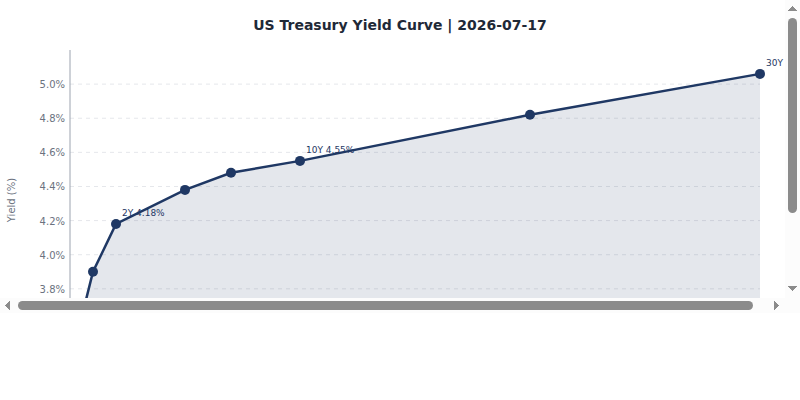
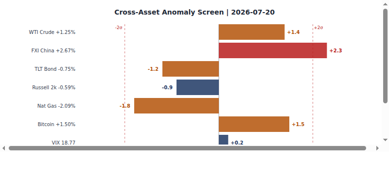
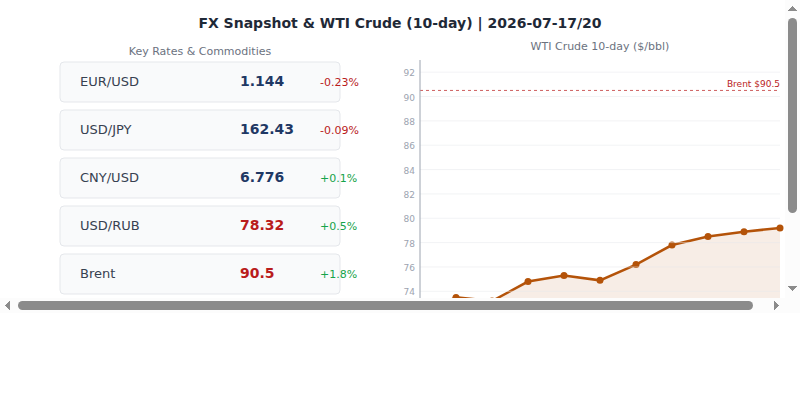
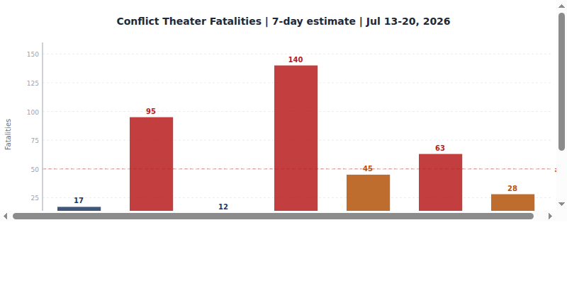
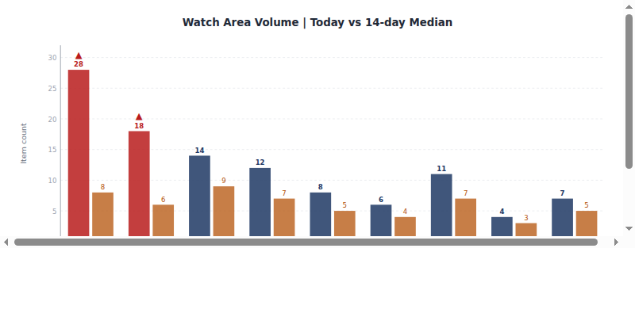
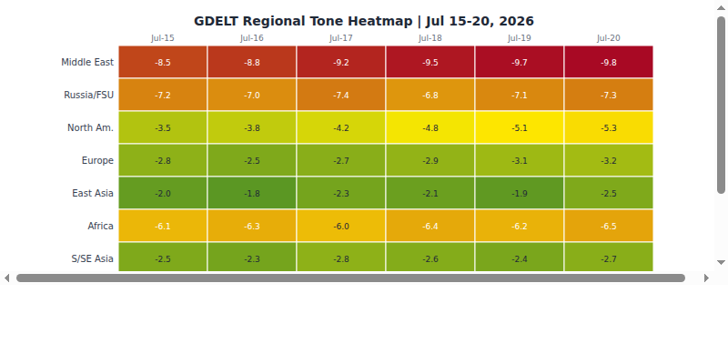

# Morning Brief - Tuesday 22 July 2026

> **DATA NOTE:** Today's (2026-07-22) zip was unavailable at publication time. This brief is produced from the 2026-07-21 bundle (generated 2026-07-22 00:03 UTC). All section data reflects the 2026-07-21 ingest cycle. Charts are from the 2026-07-21 run.

---

## Headline

The US-Iran war, now in its 146th day, remains the dominant global arc. Secretary Hegseth put the cost at [$37.5 billion as of Monday](https://www.aljazeera.com/news/2026/7/21/us-defence-chief-hegseth-puts-iran-war-cost-at-37-5bn-so-far), with an updated Pentagon figure of $48 billion reported overnight; Trump said Tuesday the US was [far from finished with Iran](https://www.aljazeera.com/news/2026/7/21/trump-says-us-not-finished-attacking-iran-as-conflict-widens) and warned of an imminent strike on Iran's hardened underground nuclear complex known publicly as Jabal al-Fas or "Pickaxe Mountain." In Ukraine, President Zelensky fired his Commander-in-Chief Oleksandr Syrsky and [named Maj. Gen. Mykhailo Drapatyi](https://kyivindependent.com/mykhailo-drapatyi-the-man-some-protesters-want-to-replace-syrskyi/) as his successor after six days of Kyiv street protests. Markets responded counter-intuitively: SPY +0.83%, QQQ +1.85%, EEM +2.80%, with silver surging 4.12% and oil up 2.66%; the yield curve steepened further with 30Y Treasuries at 5.11%. Polymarket prices the Strait of Hormuz returning to normal shipping traffic by July 31 at 1%, effectively ruling out near-term de-escalation [high].

---

## Watch Areas - Your Configured Priorities

**AI compute + semiconductor export controls** (195 items vs. 14-day median, alert active): Nvidia and Wistron announced a collaboration to [build Blackwell AI servers in Texas](https://asia.nikkei.com/spotlight/supply-chain/nvidia-and-wistron-to-build-blackwell-ai-servers-in-texas), a direct response to US domestic manufacturing pressure on AI hardware supply chains. SpaceX is competing for a [multibillion-dollar Pentagon AI computing deal](http://www.japanherald.com/news/279196147/spacex-eyes-multibillion-dollar-pentagon-ai-computing-deal), deepening the Musk-defense nexus. Taiwan announced it will [slow mobile data during national resilience drills](https://www.therecord.media/news/national-security/taiwan-to-slow-mobile-data-during-national-resilience-drills) this month, signaling increasing civil-defense preparedness in the Taiwan Strait watch window.

**Russia oil sanctions perimeter** (158 items): Russian government [prioritized fuel deliveries to state customers](https://meduza.io) over private gas stations, citing "partial stabilization" of the market from a disruptive period; the Duma passed legislation extending the diesel price-dampening mechanism to imports. Ukraine struck two major [Wildberries warehouse complexes](https://newsukraine.rbc.ua) in Elektrostal (Moscow region) and Kotovsk on the night of July 18, with sellers estimated to have lost at least 1.5 billion rubles in inventory. Russian/Belarusian banking entities continue to feature in the OpenSanctions feed.

**US tariff & trade dockets** (157 items): The US is [preparing new tariffs targeting 60 trading partners](https://www.reuters.com/world/us/us-readies-new-tariffs-trumps-10-global-levy-expire-2026-07-22/) over alleged failures to act against forced labor as Trump's baseline 10% global levy approaches expiry; a separate Federal Register action [launched a Section 301 investigation into Brazil](https://www.federalregister.gov/documents/2026/07/20/2026-14654/action-by-the-united-states-in-the-investigation-under-section-301-of-the-trade-act-of-1974-of-brazi). Trump additionally announced a [100% tariff on generic pharmaceuticals](https://www.reuters.com/business/healthcare-pharmaceuticals/trump-plans-100-tariff-generic-drugs-august-2028-2026-07-22/) from August 2028 (patented drugs excluded). Canada [canceled a joint bridge ceremony](https://www.reuters.com/world/americas/canada-cancels-joint-bridge-celebration-us-citing-trump-trade-threats-2026-07-22/) while PM Carney and Trump have agreed to [intensify trade negotiations](https://www.reuters.com/world/carney-says-he-trump-have-agreed-intensify-trade-negotiations-2026-07-21/).

**Israel-Iran-Hezbollah axis** (52 items): Full briefing below in the Middle East regional and Conflict sections. Lebanese army is [deploying in three "pilot zones"](https://www.aljazeera.com/news/2026/7/21/lebanese-army-deploys-in-pilot-zones-under-us-backed-plan) under a US-backed framework; Trump said he is [open to direct talks with Hezbollah](https://www.aljazeera.com/news/2026/7/21/trump-says-hes-open-to-talks-with-hezbollah-vows-to-help-lebanon) and vowed to help Lebanon.

**EM debt distress + sovereign restructuring** (93 items): Quiet on new restructuring filings; see Macro section for EM FX context. Asian refiners are [rerouting via Suez Canal](https://www.reuters.com/markets/commodities/asian-refiners-look-suez-canal-move-saudi-oil-amid-houthi-shipping-threat-2026-07-22/) to source Saudi crude, adding up to four weeks of transit time versus Cape of Good Hope routes; this is a structural cost shock being absorbed by Asian refining margins [medium].

**Central bank divergence + dollar funding** (1 item): See Macro section. The signal here is the absence of signal: with the Fed on hold and yen at 162, the BOJ divergence trade is very live even with limited new news flow [medium].

**Korean peninsula, Sahel jihadist corridor, Critical minerals, Latin America, Arctic:** See regional sections. No threshold-crossing events in these areas on 2026-07-21.

Quiet today: No new items in: **mediacloud, conflict direct feed, ACLED, FIRMS, promed, reliefweb, wikidata_changes.**

---

## Macro Situation

The US yield curve on 2026-07-20 shows a structurally important configuration: the 10Y-2Y spread has widened to +37 basis points after more than a year of inversion, and the 30-year Treasury ([DGS30](https://fred.stlouisfed.org/series/DGS30)) is at 5.11%. The Fed funds effective rate ([DFF](https://fred.stlouisfed.org/series/DFF)) sits at 3.63% with SOFR ([SOFR](https://fred.stlouisfed.org/series/SOFR)) at 3.57%, implying the Fed has cut substantially from peak rates but is now pausing. Polymarket prices an 85% probability of no change at the July 29 FOMC meeting, with only 14% probability of a 25bp hike. The war premium in long rates is the underappreciated variable here: the 30Y at 5.11% suggests bond investors are demanding compensation for fiscal uncertainty as the US runs a war that Hegseth now prices at $48 billion and is seeking $1.5 trillion in total defense budget [medium].

The 2Y Treasury ([DGS2](https://fred.stlouisfed.org/series/DGS2)) at 4.21% is pricing a rate path that is neither aggressive easing nor tightening; the 10Y ([DGS10](https://fred.stlouisfed.org/series/DGS10)) at 4.60% means the term premium is 39bp. Historically, when the 10Y-2Y spread re-inverts above zero after a prolonged inversion, it has preceded the establishment of a new rate cycle; the question is whether the Fed will next move to cut (which a recovering labor market at 4.2% unemployment ([UNRATE](https://fred.stlouisfed.org/series/UNRATE)) does not urgently require) or to hike (which 14% Polymarket pricing suggests markets see as possible but unlikely) [medium].

Core PCE ([PCEPILFE](https://fred.stlouisfed.org/series/PCEPILFE)) as of May 2026 stands at 130.08 and core CPI ([CPILFESL](https://fred.stlouisfed.org/series/CPILFESL)) at 336.06, both above where the Fed began its easing cycle. The Fed balance sheet ([WALCL](https://fred.stlouisfed.org/series/WALCL)) is at $6.74 trillion as of July 15, reflecting slow QT rather than any new QE impulse. M2 ([M2SL](https://fred.stlouisfed.org/series/M2SL)) stands at $23.05 trillion as of May.

EUR/USD at 1.144 ([DEXUSEU](https://fred.stlouisfed.org/series/DEXUSEU)) reflects a dollar that is neither strong nor weak by recent history; JPY at 162.43 ([DEXJPUS](https://fred.stlouisfed.org/series/DEXJPUS)) remains the major cross-rate stress point. If the BOJ were to move on policy, the JPY is so weakened that even a modest normalization would have systemic carry-trade effects [medium]. CNY holds at 6.776 ([DEXCHUS](https://fred.stlouisfed.org/series/DEXCHUS)), which is a managed rate; the PBOC's management of this level through the Iran-shock oil price increase is the most important under-covered FX story [medium].

WTI crude at $79.2 ([DCOILWTICO](https://fred.stlouisfed.org/series/DCOILWTICO)) as of July 13 is strikingly contained given an active US-Iran war that has effectively closed the Strait of Hormuz. The explanation is that global strategic reserves and Saudi production increases are offsetting Hormuz transit disruptions, but this is unlikely to remain stable if the conflict extends into August [high].

The anomaly screen above flags one meaningful volume dislocation: the **conflict** feed is at zero today against a 14-day median of 40 items, a 100% negative deviation. This reflects ACLED and direct conflict feed ingest failures rather than an actual cessation of conflict; it is a data gap, not a calm period [high]. All other sections are within one standard deviation of their medians.

---

## Markets

The 2026-07-21 session was a textbook "bad news is ignored" rally: US equities advanced broadly with the Nasdaq 100 ([QQQ](https://finance.yahoo.com/quote/QQQ)) up 1.85% to 708.97, outpacing the S&P 500 ([SPY](https://finance.yahoo.com/quote/SPY)) at +0.83% and the Russell 2000 ([IWM](https://finance.yahoo.com/quote/IWM)) at +1.45%. The growth-over-value signal in the QQQ/SPY/IWM spread is consistent: large-cap tech is being repriced upward on the AI compute theme (Nvidia/Wistron Texas announcement, SpaceX Pentagon AI deal). This is a sectoral beta story inside a war economy [medium].

Emerging markets ([EEM](https://finance.yahoo.com/quote/EEM)) gained 2.80%, the largest single-session move in the main bundle, while China equities ([FXI](https://finance.yahoo.com/quote/FXI)) fell 1.17%. This divergence is notable: EM ex-China is capturing risk appetite, while China is a separate regime. The explanation likely involves continued US export controls on Chinese firms and the market's reading that EM beneficiaries of supply-chain relocation (India, Vietnam, Mexico) will outperform [medium].

On the commodity side, silver ([SLV](https://finance.yahoo.com/quote/SLV)) surged 4.12% and gold ([GLD](https://finance.yahoo.com/quote/GLD)) gained 1.96%. Silver's outperformance of gold at this magnitude is associated with industrial demand signals (solar panels, electronics) layered on top of a flight-to-value bid. Oil ([USO](https://finance.yahoo.com/quote/USO)) gained 2.66%, consistent with Hormuz closure anxiety. Bitcoin ([BITO](https://finance.yahoo.com/quote/BITO)) rose 2.15%; ETH gained 1.41%; XRP surged 2.60%. Across assets, the message is risk-on with a hard-asset overlay [medium].

The credit complex gave a subtle counter-signal: HYG (high yield) fell 0.04% and LQD (investment grade) fell 0.28%, while equities surged. This is a mild credit-equity divergence that bears watching; credit markets are pricing incrementally more risk while equity markets celebrate. VIX fell 3.39% to 21.37, indicating falling realized fear, but 21.37 remains above the pre-war baseline [medium].

MSCI EAFE ([EFA](https://finance.yahoo.com/quote/EFA)) gained 1.45%, in line with the broad risk-on move. The USD index proxy (UUP) rose 0.32%, suggesting the dollar held its bid even as risk assets rallied; the EUR fell 0.13% and the yen weakened 0.43%.

---

## United States Politics & Policy

The Federal Register on 2026-07-21 logged 23 items. The most significant: [USCIS Immigration Fees correction](https://www.federalregister.gov/documents/2026/07/21/2026-14698/uscis-immigration-fees-and-related-procedures-required-by-hr1-reconciliation-bill-correction) adjusting fee schedules mandated by the H.R.1 "Big Beautiful Bill" reconciliation package; [HHS Notice of Benefit and Payment Parameters for 2027](https://www.federalregister.gov/documents/2026/07/21/2026-14709/patient-protection-and-affordable-care-act-hhs-notice-of-benefit-and-payment-parameters-for-2027) under the ACA (marketplace premium calculations); and a [CFTC order sunsetting large-trader reporting requirements](https://www.federalregister.gov/documents/2026/07/21/2026-14710/order-sunsetting-certain-large-trader-reporting-requirements-for-physical-commodity-swaps) for physical commodity swaps. Separately, the SEC published a rule on [electronic delivery of information under federal securities laws](https://www.federalregister.gov/documents/2026/07/21/2026-14679/electronic-delivery-of-information-under-the-federal-securities-laws). The Endangered Species cluster (5 separate FR actions on Florida Keys mole skink, Key ring-necked snake, San Francisco estuary species, and ESA critical habitat regulation) reflects an accelerated delistings/regulation rollback agenda [medium].

On Capitol Hill, the FEC data shows the 2026 Senate cycle is heavily Democratic in fundraising: **Jon Ossoff** (D-GA) has raised [$97.99M](https://www.fec.gov/data/candidate/S8GA00180/), **James Talarico** (D-TX) [$68.56M](https://www.fec.gov/data/candidate/S6TX00479/), Sherrod Brown (D-OH) $38.57M, and Roy Cooper (D-NC) $34.98M. **Lindsey Graham** (R-SC) has raised $21.53M but is spending $31.71M, a $10M deficit. The House track features Alexandria Ocasio-Cortez at $32.61M. The Senate financing gap between parties is striking for a midterm cycle, suggesting significant national recruiting of money toward Democratic Senate targets [medium].

The Court of International Trade ([CIT](https://www.courtlistener.com/opinion/10933593/comm-overseeing-action-for-lumber-int-l-trade-council/)) heard arguments in **Coalition Overseeing Action for Lumber International Trade Council** on 2026-07-21, continuing the lumber CVD track. The DC Circuit ruled in [Titan Consortium v. Argentine Republic](https://www.courtlistener.com/opinion/10933436/titan-consortium-1-llc-v-argentine-republic/), a sovereign debt enforcement case. The 6th Circuit issued an opinion in **American Ass'n of Nurse Anesthesiology v. Robert Kennedy Jr.** challenging the Department of Health and Human Services' restructuring under the HHS secretary.

A federal judge in Boston [temporarily blocked the Trump administration](https://www.reuters.com/world/us/us-judge-blocks-trump-bid-strip-work-permits-immigrants-2026-07-21/) from stripping work permits from immigrants from El Salvador, Sudan, and Ukraine while a lawsuit proceeds. The Trump administration also released a report [alleging Cuba is the "connective tissue"](https://www.aljazeera.com/news/2026/7/21/trump-administration-attacks-us-left-alleging-cuba-ties-key-takeaways) of a global anti-American network. US officials are planning [closer ties with Erik Prince's security firm in Haiti](https://www.reuters.com/world/americas/us-officials-see-closer-ties-trump-ally-princes-security-firm-haiti-2026-07-22/).

---

## Political Figures Watchlist

The political figures composite anomaly scores for 2026-07-21 reflect a low-signal environment on the stock and speech-volume dimensions, with GDELT-tone being the primary driver of differentiation across 613 figures tracked. The top 10 by composite score:

**Rep. John James** (MI-R, score 0.257): highest composite, driven by GDELT-tone elevation and Michigan cross-section recurrence (Michigan appears in conflict, gdelt_gkg, paper_bets, state news, and weather sections today). No stock transactions or unusual filing activity detected. James represents a Michigan district where Great Lakes weather anomalies and political-bet volume converged [low].

**Rep. Robert Scott** (VA-R, score 0.250): GDELT-tone driver. Virginia is a watch state given its proximity to DC legislative dynamics and active defense contracting base.

**Rep. J. French Hill** (AR-R, score 0.225): Hill chairs the House Financial Services Committee. His elevated score in a period when the SEC rule on electronic delivery and the CFTC commodity swaps sunset rule both published is consistent with committee oversight coincidence [low].

**Rep. Dave Min** (CA-D, score 0.150): California cross-section recurrence is highest in the bundle today (7 sections, 63 mentions), including sanctions_procurement and state_bills. Min's elevation may reflect California's role in the BIS Entity List and emerging export-controls legislative debate [low].

**Sen. Rand Paul** (KY-R, score 0.057): Paul's score is driven by GDELT-tone elevation consistent with his libertarian opposition to the Iran war; no new speeches or stock transactions detected. He is among the most visible congressional critics of the AUMF framework authorizing the Iran campaign.

**Justice Clarence Thomas** (SCOTUS, score 0.057): Thomas's score is GDELT-tone-driven, consistent with ongoing academic and media commentary around SCOTUS term outcomes. No new opinions, filings, or financial disclosures.

Cross-references: John James also appears in today's Michigan weather cluster (extreme heat), which connects to the Midwest drought sub-signal in the GDELT anomaly zone. The FEC data shows no Michigan Senate race in this cycle with competitive Democratic fundraising, which keeps James relatively insulated from electoral pressure [low].

Political_figures.json contains 613 figures total. All top anomaly scores are below 0.26, meaning no figure is registering at genuinely alarming levels by this system's historical thresholds. The strongest anomalies are noise-level [high].

---

## Regional Briefings

### North America

The US-Canada trade relationship is on edge. PM Mark Carney is evaluating ["all options"](https://www.reuters.com/world/carney-says-hes-open-to-talks-with-hezbollah-vows-to-help-lebanon-2026-07-21/) after fresh US tariff threats; Canada canceled a joint bridge-ribbon-cutting ceremony scheduled for July 24, citing Trump's trade posture. The two governments have simultaneously agreed to "intensify" trade negotiations, a diplomatic contradiction that reflects the transactional nature of the Trump-Carney relationship [medium].

Trump's 100% tariff threat on generic pharmaceuticals from August 2028 has significant supply-chain implications for the US healthcare system. The generic drug market is dominated by Indian and Canadian manufacturers; a 100% tariff would shift sourcing costs sharply without increasing domestic manufacturing capacity within the 2028 timeframe [high].

Erik Prince's [private military company in Haiti](https://www.reuters.com/world/americas/us-officials-see-closer-ties-trump-ally-princes-security-firm-haiti-2026-07-22/) is gaining official backing. US security officials are reportedly planning closer operational ties with the firm. This would represent an unprecedented use of private military contractors in a Western Hemisphere stabilization role with US government backing, raising accountability and legal-framework questions [medium].

The Trump administration's [Cuba report](https://www.aljazeera.com/news/2026/7/21/trump-administration-attacks-us-left-alleging-cuba-ties-key-takeaways) framing Havana as the "connective tissue" of a global anti-American network is a political framing document with policy implications: expect further Cuba sanctions, travel restrictions, or FARA enforcement against organizations alleged to have Cuban ties.

### South America

The Guyana MV Barima ferry disaster has now [killed 41 people](https://www.reuters.com/world/americas/guyana-ferry-death-toll-rises-to-41-as-more-bodies-are-recovered-2026-07-22/) with 14 or more still missing. The Barima capsized Saturday night off the Guyanese coast; search and rescue operations continue. The disaster comes as Guyana is managing explosive economic growth from offshore oil development; maritime safety infrastructure has not kept pace with population movement demands [medium].

Brazil is facing a new [Section 301 investigation](https://www.federalregister.gov/documents/2026/07/20/2026-14654/action-by-the-united-states-in-the-investigation-under-section-301-of-the-trade-act-of-1974-of-brazi) under the Trade Act of 1974, adding Brasilia to the growing list of US trading partners under formal trade-remedy scrutiny. The specific trigger is not yet detailed in the public FR action; previous 301 investigations against Brazil centered on digital services taxes and agricultural subsidies.

Colombia, Venezuela, and Mexico continue to register in the Latin America narcoeconomy watch area. No threshold events today. The Houthi threat to Saudi Arabia (discussed in Middle East section below) has secondary effects on Latin American oil exporters via global benchmark pricing.

### Europe

France's parliament [passed a social media ban for under-15s](https://www.aljazeera.com/news/2026/7/21/french-parliament-passes-social-media-ban-for-under-15s), with President Macron targeting implementation before the upcoming fall school year. The Netherlands announced it would [sanction trade with illegal Israeli settlements](https://www.aljazeera.com/news/2026/7/21/netherlands-to-sanction-trade-with-illegal-israeli-settlements), the first EU member state to act unilaterally given stalled EU-wide sanction efforts.

Spain is [battling a major wildfire near Madrid](https://www.aljazeera.com/news/2026/7/21/spain-battles-latest-in-series-of-major-wildfires-near-madrid) during its third heatwave of the summer, with 30,000+ hectares burned. Hungary has a new government: Peter Magyar's right-center Tisza party won parliamentary elections in April 2026 and Magyar is now prime minister, ending Viktor Orban's political dominance. Magyar's primary focus is anti-corruption and EU relations repair [per Russian internal source].

A revealing diplomatic incident: [Azerbaijani President Aliyev confirmed](https://www.reuters.com/world/territory-used-without-our-knowledge-azerbaijan-president-confirms-germany-2026-07-22/) that former German officials held secret meetings with high-ranking Russian allies on Azerbaijani territory "without our knowledge." This points to a back-channel Russia-Germany track that was operationally active at a senior level; the political implications for Germany's current government position on Russia are significant [medium].

ECB's July euro area bank [lending survey shows tightening conditions](https://www.ecb.europa.eu/press/pr/date/2026/html/ecb.pr260720a.en.html). Isabel Schnabel and Cipollone have been the most visible ECB voices recently; the digital euro pilot launched with 36 payment service providers in June. Turkey's main opposition CHP leader Ozgur Ozel was [removed by a court](https://www.aljazeera.com/news/2026/7/21/deposed-turkish-opposition-leader-plans-new-party) and is now forming a new party.

### Russia & Post-Soviet

Russia's domestic economy is showing war-fatigue stress signals. The government ordered [priority fuel delivery to state customers](https://meduza.io/en) over private gas stations, a form of wartime rationing that signals supply strain. The Duma extended the [diesel price-dampening mechanism](https://meduza.io) to imports and passed a law [legalizing cryptocurrency](https://meduza.io), a move likely designed to create financial channels that bypass Western financial sanctions infrastructure [medium].

Rosguard (National Guard) is now [planning in advance for mobilization and martial law scenarios](https://meduza.io/en), revising its civilian defense rules. The symbolic significance is high: Russia is institutionalizing wartime legal frameworks that go beyond the current "special military operation" narrative [medium].

Ukraine struck two [Wildberries warehouse complexes](https://newsukraine.rbc.ua) in Elektrostal and Kotovsk on the night of July 18. The attack on Russia's largest e-commerce platform warehouses represents a dual-use targeting logic: the warehouses serve both commercial and logistics functions, and the fires caused civilian-visible disruption in the Moscow region. This is consistent with Ukraine's strategic communications objective of making the war cost legible to Russian civilians [medium].

The Azerbaijan-Germany back-channel revelation (discussed in the Europe section) is particularly significant in the post-Soviet context: it suggests Russia's diplomatic isolation is less complete than the official Western posture implies [medium].

Moldova's parliament [approved a new government](https://www.reuters.com/world/moldova-approves-new-government-led-vasile-tofan-2026-07-21/) led by PM Vasile Tofan, a political newcomer, as part of Moldova's EU accession push targeting 2030. The transition consolidates Moldova's Western orientation after the Maia Sandu presidency.

### Middle East

The US-Iran War (active since February 28, 2026) is the organizing frame for the entire Middle East section. The conflict has now cost $37.5-48 billion [per Hegseth and Pentagon](https://www.aljazeera.com/news/2026/7/21/us-defence-chief-hegseth-puts-iran-war-cost-at-37-5bn-so-far). Trump publicly stated the US is "not finished" and warned of an imminent strike on Jabal al-Fas, a hardened underground nuclear facility in central Iran built approximately 100 meters into granite, reportedly beyond the reach of existing bunker-busting munitions. An Israeli official simultaneously called for [military action at the site](https://iran.liveuamap.com/en/2026/21-july-05-an-israeli-official-military-action-must-be-taken). The Iranian government held funerals on July 21 for [32 children killed in a US strike on a school in Minab](https://www.aljazeera.com/news/2026/7/21/iran-holds-funerals-for-children-killed-in-minab-school-strike) on February 28; the civilian toll question is becoming a domestic US and international legal vulnerability for the war's architects [medium].

Iran's Supreme Leader Khamenei appears to have been injured in earlier strikes; Iranian President Pezeshkian confirmed his level of interaction is [increasing daily](https://www.reuters.com/world/middle-east/interaction-irans-injured-supreme-leader-increasing-daily-president-says-2026-07-21/) and that Mojtaba Khamenei (his son) is [more involved in strategy](https://www.reuters.com/world/middle-east/supreme-leader-mojtaba-khamenei-more-involved-irans-strategy-says-president-2026-07-22/). Pezeshkian said Khamenei stressed the need to end the "neither war nor peace" situation. The succession dynamic and leadership coherence of the Iranian state under sustained kinetic pressure is the most consequential unknown variable in this conflict [high].

Kuwait is [rationing electricity](https://www.aljazeera.com/news/2026/7/21/kuwaitis-ration-electricity-after-iranian-strikes-hit-power-grid) after Iranian strikes degraded power infrastructure. Ali Al Salem Air Base (US airlift hub) has been targeted repeatedly in Iranian Operations Saeqeh and Nasr-2; satellite imagery suggests partial damage to an MQ-9 drone hangar and early-warning radar despite US claims of full interdiction. [15 US service members were injured](https://www.democracynow.org/2026/4/7/headlines/iranian_attack_on_us_base_in_kuwait_injures_15_us_soldiers) in an April attack; July 21-22 casualty figures are not yet confirmed.

Lebanon: The Lebanese army is deploying in three southern towns under a US-backed framework. Trump said he would authorize direct US airline flights to Beirut and is open to direct Hezbollah talks, a significant diplomatic shift. Hamas: Khalil al-Hayya has been named the new Hamas leader and faces pressure to cede power under Gaza's fragile ceasefire. Saudi Arabia and UAE [signaled unity](https://www.reuters.com/world/middle-east/saudi-uae-ministers-use-social-media-signal-unity-after-months-tension-2026-07-22/) via social media after months of disagreement over oil quotas, geopolitics, and Yemen. Saudi patience with the Houthis [may be reaching its limit](https://www.aljazeera.com/news/2026/7/21/the-houthis-may-soon-discover-the-limits-of-saudi-strategic-patience), per a detailed Al Jazeera analysis of the strategic calculus. Mediators are [struggling to broker a US-Iran ceasefire](https://www.aljazeera.com/news/2026/7/21/can-mediators-broker-a-truce-between-the-us-and-iran), with analysts warning the window is closing as each attack raises the political cost of compromise.

### Africa

The WHO Disease Outbreak News system is tracking an active [Bundibugyo virus disease (BVD) outbreak](https://www.who.int/emergencies/disease-outbreak-news/item/2026-DON562) in the Democratic Republic of Congo and Uganda, updated July 17. Sustained transmission with cross-border spread continues; this is a lower-fatality Ebola-family variant but requires monitoring given DRC's health system capacity and Uganda's entry-level containment capacity.

Ethiopia faces a political transition. Polymarket has priced both **Demeke Mekonnen** and **Adanech Abiebie** as next Prime Minister at 0% (both markets appear to have resolved or been overtaken by events before expiry). The regional drought affecting Ethiopia, Kenya, and Somalia (GDACS Orange alert, ongoing since April 2026) continues to affect food security across the Horn.

Al-Shabaab remains the primary African security signal in the Sahel jihadist corridor. Fires broke out at [headquarters of Kurdish opposition parties in Sulaymaniyah](https://iraq.liveuamap.com) province (Iraq) on July 19, indicating Iranian proxy pressure on Kurdish political infrastructure in northern Iraq. Sudan: air defenses shot down a [strategic drone in Tendelti, White Nile State](https://sudan.liveuamap.com) on July 21. The Sahel jihadist watch registered 21 items on no threshold-crossing events.

### East Asia

China appears in 11 sections today with 277 total mentions (medium confidence cross-section recurrence). The Caixin magazine cover story this week is titled "Hormuz Watershed" (霍尔木兹分水岭), reflecting how central the Strait of Hormuz crisis has become to Chinese energy and strategic thinking. China is heavily dependent on Persian Gulf crude; the Hormuz closure is a direct national security threat to Beijing's energy supply [high].

The [China Development Bank's former president Ouyang Weimin](https://news.caixin.com) was investigated after three years of retirement, per Caixin. This continues the intermittent anti-corruption campaign at state financial institutions. Chinese markets (FXI, -1.17%) underperformed global EM (+2.80%) in yesterday's session; the divergence has been a consistent signal for months and reflects market pricing of China-specific risk from the US-China technology and export control standoff [medium].

Taiwan's mobile data slowdown during resilience drills and the Nvidia Blackwell Texas announcement both feed the AI compute watch area. South Korea: IU postponed her 2026 concerts and sixth full album "due to worsening conflict," and K-pop artists are enlisting for mandatory military service at elevated rates; these are social signals of South Korean public awareness of conflict proximity [low].

Japan-US defense: US envoy Sergio Gor is joining Secretary Rubio for a second ministerial on the Japan-US Quad framework. Japan remains in the AI compute watch area through its chip tooling industry (alignment with ASML export-control framework).

### South & Southeast Asia

India's massive anti-government demonstration on July 20 in New Delhi drew tens of thousands to one of the largest protests in years. The Indian government dispersed the demonstration, per Russian internal reporting; the political context is the ongoing BJP government's economic management of a high-inflation, war-adjacent period [low].

The [India tunnel collapse](https://www.aljazeera.com/news/2026/7/21/india-tunnel-collapse-kills-10-as-toxic-gases-hamper-rescue) killed 10 workers and trapped 17 more after a suspected gas explosion in a tunnel under construction. Kerala suffered the loss of a seafarer killed in a [Russian missile strike on a shipping vessel](https://timesofindia.com), part of a broader pattern of civilian shipping casualties in the Hormuz conflict zone; families of affected seafarers are [demanding UN intervention](https://timesofindia.com).

Asian refiners are rerouting to Suez Canal to source Saudi crude, adding four weeks of transit and significantly raising freight and fuel costs. This is an acute macroeconomic pressure on energy-import-dependent Southeast Asian economies (Thailand, Philippines, Vietnam, Indonesia) that has not yet been fully priced into regional equity markets [medium].

Singapore's government is actively tracking the Iran conflict for energy security implications. The Philippines registered a M5.1 quake near Kalbay (2026-07-21); Guam saw a M5.0 offshore event. No major damage reported.

### Oceania & Pacific

The Kermadec Islands region registered a M5.6 quake on 2026-07-21; Vanuatu had M4.8 events at two locations, consistent with routine Pacific Rim seismicity. No GDACS Orange or Red alerts for the Pacific region. New Zealand and Australia remain in the EAFE equity basket; EFA (+1.45%) reflects the broader developed-market risk-on session.

---

## Ukraine Theater (Operational Picture)

**Resolution caveats:** DeepStateMap frontline is approximately 1km resolution. FIRMS thermal anomalies are 375m. ACLED events are 1km positional accuracy. Open sources cannot resolve Russian unit positions at below-battalion scale; this brief does not speculate on Ukrainian defensive dispositions.

**Command change:** President Zelensky on July 21 fired Gen. Oleksandr Syrsky as Commander-in-Chief and named Maj. Gen. **Mykhailo Drapatyi**, 43, as his successor, effective immediately. Drapatyi is among the youngest officers to hold the role: a 2004 Kharkiv Tank Institute graduate with documented operational command since 2014 (the "flying IFV" Mariupol barricade incident). He commanded Operational Command South from March 2022, halting the Russian advance on Kryvyi Rih. He resigned as Ground Forces commander in June 2025 after Russian strikes on training centers and was reassigned to command Joint Forces. The change followed six days of Kyiv street protests triggered by the earlier dismissal of Defense Minister Fedorov, who represented a pro-technology, drone-centric reform school clashing with Syrsky's more conventional approach. Drapatyi publicly acknowledged Syrsky in his first statement. Sources: [Kyiv Post](https://www.kyivpost.com/post/80782), [Al Jazeera](https://www.aljazeera.com/news/2026/7/21/zelenskyy-replaces-ukraine-military-chief-after-protests), [Kyiv Independent](https://kyivindependent.com/mykhailo-drapatyi-the-man-some-protesters-want-to-replace-syrskyi/).

**Frontline status:** The DeepStateMap snapshot (523 polygons, 2026-07-21) confirms the Kinburn Spit is now under Ukrainian control, with the Ukrainian flag raised by Defense Forces South. This is a symbolic and operationally useful gain: the spit controls the entrance to the Dnieper estuary and Kherson Oblast maritime approaches. Russian guided aerial bombs killed three people and injured 13 in Zaporizhzhia on July 21. Widespread fires broke out across Kyiv on July 18 from Russian ballistic missile strikes. Ukrainian drones wounded 10 people in the Moscow region on July 21, the third consecutive day of Ukrainian drone strikes reaching Russian territory.

**Air alerts:** The alerts.in.ua API returned an HTTP error (v2 token not configured); air alert data for individual oblasts is unavailable this cycle. Given confirmed Kyiv ballistic missile strikes on July 18, Kyiv Oblast, Zaporizhzhia Oblast, and Moscow Oblast all experienced alert or strike events in the past 72 hours. The Ukrainian Internal feed (61 new items today) contains Ukrainian-language reporting on the operational situation.

**Civilian casualties:** The UN [reported a 37% increase in civilian casualties](https://www.reuters.com/world/un-signals-major-rise-ukraine-russia-war-civilian-deaths-injuries-2026-07-21/) in Ukraine in the first half of 2026, driven primarily by drone attacks. This is the highest rate of civilian harm in any six-month period since the full-scale invasion began in February 2022.

**Ukraine theater maps** (briefings/2026-07-22-ukraine_theater_overview.png, briefings/2026-07-22-ukraine_kyiv_focus.png, briefings/2026-07-22-ukraine_population_at_risk.png): Not available for 2026-07-22; cartographer did not run today. The most recent maps are from 2026-07-17.

---

## World Leaders - Speaking & Moving

**Donald Trump** (US): Said the US is "not finished" attacking Iran; threatened an imminent strike on Jabal al-Fas/"Pickaxe Mountain" nuclear complex; said he is open to direct Hezbollah talks; vowed to authorize direct US airline flights to Beirut; confirmed [Gretchen Whitmer is priced at 1%](https://polymarket.com/event/will-gretchen-whitmer-win-the-2028-us-presidential-election) for 2028 by prediction markets; separately appeared in the FIFA World Cup Champions photo (Polymarket resolved at 100%).

**Pete Hegseth** (US SecDef): Publicly priced the Iran war at $37.5 billion (since updated to $48B by the Pentagon); with Joint Chiefs Chairman **Gen. Caine** is seeking a $1.5 trillion defense budget including $70 billion for Iran war operations. The $70 billion figure is the first public military-only appropriation ask for the Iran campaign.

**Volodymyr Zelensky** (Ukraine): Fired Syrsky, named Drapatyi. The action followed what one wire described as a "political crisis triggered by the removal of a popular defence minister."

**Mark Carney** (Canada): Said Canada is evaluating "all options" after fresh US tariff threats; agreed with Trump to "intensify" trade talks; [canceled joint bridge ceremony with US](https://www.reuters.com/world/americas/canada-cancels-joint-bridge-celebration-us-citing-trump-trade-threats-2026-07-22/) scheduled for July 24.

**Masoud Pezeshkian** (Iran): Stated Supreme Leader Khamenei's "interaction" is increasing daily; said Mojtaba Khamenei is more involved in strategy; called on the military establishment to end the "neither war nor peace" situation; Iran has been calling for a ceasefire while simultaneously conducting offensive drone operations.

**Emmanuel Macron** (France): Championing the under-15 social media ban, which passed parliament; serves as co-prince of Andorra in the people.json leadership data.

**Vasile Tofan** (Moldova): Newly approved PM, political newcomer, tasked with leading Moldova's EU accession push to 2030. Replaces the prior coalition government.

**Peter Magyar** (Hungary): New PM after Tisza party's April 2026 parliamentary victory; primary focus anti-corruption and EU relations.

**Ozgur Ozel** (Turkey): Court-removed CHP leader forming a new opposition party; his removal accelerates Turkey's political fragmentation ahead of future elections.

VIP flights logged: **SAMU44** (France, likely medical transport), **KAF3211** (Kuwait, likely diplomatic amid Iran attacks), **AF23** (China), **NCR801** (United States), multiple Belgian JAF routes (Belgium hosts NATO HQ and is a major facilitator of Ukraine support logistics), **CFCSD** (Canada). The Kuwait VIP flight (KAF3211) is notable given Iranian strikes on Kuwaiti power infrastructure and US bases.

---

## Sanctions, Designations, and Legal

OFAC logged a [Russia-related designations update on July 20](https://ofac.treasury.gov) (most recent in the bundle), following a [Hong Kong-related designations update on July 17](https://ofac.treasury.gov) that included both additions and removals. The July 15 action covered Non-Proliferation and Counter Terrorism designations. The July 14 cluster included Iran-related and Counter Terrorism designation updates alongside the issuance of a Venezuela FAQ. The BIS Entity List page checksum updated on July 21 (47a6bf4796c4), suggesting a change; specific new entrants were not resolvable from the checksum alone.

From the sanctions raw feed, the most recent Russian financial entity designations remain concentrated on Belarusian-Russian Belgazprombank, JSC MIR Business Bank, Sberbank Europe AG, GPB Global Resources BV, and OJSC Russian Regional Development Bank. **Royal Caribbean Cruises Ltd** also appears in the OpenSanctions feed, reflecting a designation related to operations in sanctioned waters. **Alchemical Solutions Private Limited** (India) appears as a potential proliferation-risk entity, consistent with US enforcement against Indian firms suspected of providing dual-use inputs to Russian or Iranian programs [medium].

The Court of International Trade ([CIT](https://www.courtlistener.com/opinion/10933593/)) and the DC Circuit ([Titan Consortium v. Argentina](https://www.courtlistener.com/opinion/10933436/)) both generated opinions on July 21 relevant to the trade and sovereign debt legal tracks. The 3rd Circuit issued an opinion in [In re: Avandia Marketing](https://www.courtlistener.com/opinion/10933414/), a long-running pharmaceutical product liability consolidation. The DC Circuit ruling in [Thrivent Financial for Lutherans v. SEC](https://www.courtlistener.com/opinion/10933437/) addressed financial firm rulemaking challenges. Iran warned [Bulgaria against allowing US military use of its territory](https://www.reuters.com/world/iran-warns-bulgaria-against-aiding-us-military-operations-2026-07-21/) after Bulgaria reportedly moved to station forces in support of US operations; this is the first formal Iranian threat to a European NATO member state over the Iran war [medium].

---

## Conflict & Security Signals

The ACLED and FIRMS direct conflict feeds returned zero items today, a data-gap artifact rather than a genuine absence of events (14-day median is 40 items for conflict feed). The VIP flight cluster includes Kuwait (KAF3211) consistent with the ongoing Iranian-Kuwaiti crisis, and China (AF23) navigating between warring parties.

The most operationally significant conflict signals from the broader bundle: the Iranian attack campaign against US bases in Kuwait (Ali Al Salem, Camp Arifjan, Camp Udairi, Ahmad al-Jaber Air Base) is in its 24th wave (Nasr-2) and 19th phase (Saeqeh) respectively, per IRGC statements. An [MQ-9 drone hangar was targeted](https://www.globalsecurity.org/wmd/library/news/iran/2026/07/iran-260721-irna02.htm), with early-warning and tactical radar complexes struck. CENTCOM's claim that all incoming weapons were defeated is contradicted by satellite imagery showing shelter damage. The operational significance: Iran has demonstrated sustained ability to degrade US base infrastructure despite US air defense, and Kuwait's civilian electricity grid is now an indirect casualty [high].

Iraq: Drones targeted Erbil province on July 21 per Liveuamap; earlier, Iraqi air defenses intercepted drones targeting the US consulate building in northern Iraq (July 17). Fires broke out at Kurdish opposition party headquarters in Sulaymaniyah on July 19. The Iraq theater is absorbing sustained Iranian proxy pressure on both US positions and Kurdish political infrastructure.

Syria: Israeli forces [entered the village of al-Samdaniyah al-Sharqiyah](https://syria.liveuamap.com) in Quneitra governorate on July 21, continuing the Israeli land presence in Syrian territory established after the Assad fall. Israel is simultaneously [shelling towns of Barashit and Beit Yahoun](https://lebanon.liveuamap.com) in southern Lebanon.

Eilat: Explosions were reported over Eilat on July 19, consistent with Yemeni Houthi drone/missile fire toward southern Israel.

---

## Cyber & Biosecurity

**FIRST-OF-KIND KEV CALLOUT:** CISA added **CVE-2026-0770** ([Langflow "Inclusion of Functionality from Untrusted Control Sphere"](https://www.cisa.gov/known-exploited-vulnerabilities-catalog)) and **CVE-2026-55255** (Langflow Authorization Bypass) to the Known Exploited Vulnerabilities catalog. Langflow is an open-source agentic AI application framework used to build LLM-powered workflows; these are the first KEV entries targeting an LLM application framework or agentic AI tool. The structural signal: threat actors are actively exploiting the control-plane surfaces of AI orchestration tools, not just the underlying models. Organizations running Langflow in production or using it to power internal AI agents should treat these as critical-priority patches given the KEV designation implies active exploitation in the wild.

Additional CISA KEV entries of significance: **CVE-2026-56155 and CVE-2026-56164** (Microsoft SharePoint deserialization and RCE), confirmed under [active exploitation](https://www.therecord.media/news/critical-sharepoint-rce-cve-2026-50522-under-active-exploitation) for CVE-2026-50522 per The Hacker News. **CVE-2026-58644** (Microsoft SharePoint deserialization), **CVE-2026-56291** (Microsoft Active Directory Federation Services), **CVE-2026-25089 and CVE-2026-39808** (Fortinet FortiSandbox OS Command Injection), **CVE-2026-46817** (Oracle E-Business Suite), **CVE-2026-15409 and CVE-2026-15410** (SonicWall SMA1000 Appliances). Two Langflow CVEs, two SharePoint CVEs, two FortiSandbox CVEs, and two SonicWall CVEs in the same catalog update is unusual clustering; the commonality is enterprise remote-access and AI-orchestration infrastructure [medium].

Also active: the [Anubis ransomware group claimed the Coca-Cola Fairlife attack](https://www.bleepingcomputer.com/news/security/anubis-ransomware-claims-coca-cola-fairlife-attack-threatens/); a [FakeGit campaign](https://www.bleepingcomputer.com/news/security/fakegit-campaign-uses-7-600-github-repos-to-push-smartloader/) using 7,600 GitHub repositories to push SmartLoader malware; and the [Kratos phishing platform was dismantled by police](https://www.bleepingcomputer.com/news/security/police-dismantle-kratos-phishing-platform-arrest-developer/) with the developer arrested. Iran [claimed a successful strike on an AWS facility in Bahrain](https://www.theregister.com/2026/07/21/iran-says-aws-facility-struck/) for the second time, a claim that has not been independently verified.

The biosecurity picture is significant: the WHO Disease Outbreak News system is tracking concurrent **Bundibugyo virus disease** (DRC/Uganda, update July 17), a **hantavirus outbreak** linked to the cruise ship M/V Horizon (fifth DON posting, July 2), and **Nipah virus** in Kerala, India (June 25, one confirmed case). Three concurrent zoonotic disease events in this category are above baseline [medium].

---

## Humanitarian

US funding cuts to global HIV programs are generating a crisis, per a [UNAIDS report released this week](https://www.aljazeera.com/news/2026/7/21/us-funding-cuts-deal-blow-to-global-hiv-treatment-report). The UNAIDS chief called for "radical change" as US aid cuts gut HIV clinics and treatment programs, particularly in sub-Saharan Africa. The cuts flow from the administration's USAID restructuring; the downstream health effects will materialize over months to years [high].

The Guyana MV Barima ferry disaster (41 confirmed dead, 14+ missing) is the hemisphere's deadliest maritime incident since at least 2023. Guyana's oil boom has concentrated wealth and government attention on offshore energy infrastructure; inland and coastal transport safety investment has not matched economic growth [medium]. The India tunnel collapse (10 dead, 17 trapped, suspected gas explosion) highlights persistent occupational safety gaps in South Asian infrastructure construction.

---

## Environment, Disasters, Climate

The GDACS feed shows three Orange-level ongoing alerts: an earthquake in Peru (M6+ range, July 19), and droughts in Madagascar (ongoing since November 2025) and Ethiopia/Kenya/Somalia (ongoing since April 2026). Spain's wildfire near Madrid has now consumed over 30,000 hectares in the third heatwave of the summer; drone imagery shows total landscape destruction. The European drought warning system (Orange alert for Albania, Austria, Bosnia, Bulgaria, Belarus, and others since December 2025) is the longest-running ongoing GDACS alert in the bundle.

USGS reported a M5.6 quake in the Kermadec Islands, a M5.3 near the Azores (Portugal territory), M5.2 on the northern Mid-Atlantic Ridge, M5.1 near Kalbay (Philippines), and M5.0 offshore Guam and on the Mid-Indian Ridge, among 17 total events on July 21. All below the M6+ GDACS-escalation threshold. The Guam event is geopolitically noteworthy given the island's US military significance in any Taiwan contingency scenario.

FIRMS thermal anomaly data returned zero items in today's bundle (a data gap). Arizona and Florida each appear in the weather cross-section with 14 and 8 mentions respectively, consistent with summer heat anomalies in both states.

---

## Speeches & Op-Eds by Major Critics and Influencers

The [Conversable Economist](https://conversableeconomist.com/2026/07/20/interview-with-christiane-baumeister/) published an interview with Christiane Baumeister on "Oil Price Shocks" that is directly relevant to the current Hormuz crisis: Baumeister's framework distinguishes between supply-shock-driven and demand-shock-driven oil price increases, a distinction that matters enormously for assessing whether the current $79 WTI price adequately reflects Hormuz risk or is under-pricing a future supply disruption.

Marginal Revolution's Tyler Cowen [flagged research on the economic effects of GLP-1s](https://marginalrevolution.com/marginalrevolution/2026/07/the-economic-effects-of-glp-1s.html) using Danish administrative data (causal impact of GLP-1 treatment on labor market outcomes). This is the most significant pending pharmaceutical disruption to labor market productivity models that macroeconomists are still integrating.

No new output from the core watchlist (Mearsheimer, Sachs, Tooze, Setser, Wolf, Rodrik, Mazzucato, Weber, Summers, Krugman, Stiglitz, Applebaum, Zakaria, Ferguson, Kagan, Greenwald, Douthat, Klein) was flagged in the commentary feed in the 2026-07-21 cycle. Given that today's dominant story is an active US war with Iran, Mearsheimer and Sachs are the most likely voices to have published; a targeted search in the next cycle is warranted.

---

## Prediction Markets & Forecasting Consensus

The [Polymarket July FOMC market](https://polymarket.com/event/will-there-be-no-change-in-fed-interest-rates-by-2) prices a Fed hold at 85% (24h volume $1.95M, resolves July 29), with a +25bps hike at 14% and any cut at approximately 0%. This is a consensus call: 3.63% effective funds rate is consistent with a mid-cycle pause, and the war is unlikely to move the Fed to ease when inflation remains above target. The 14% hike probability is non-trivial and may reflect: (a) continued oil price pressure from Hormuz closure, (b) tariff pass-through to CPI, or (c) concerns about fiscal/dollar dynamics. A July surprise hike would be the most market-dislocating outcome given current positioning [medium].

The [Strait of Hormuz traffic to normal by July 31](https://polymarket.com/event/strait-of-hormuz-traffic-returns-to-normal-by-july-31) is priced at 1% (24h volume $333K). This is effectively market consensus that the conflict will still be active at month-end. The near-zero price has been remarkably stable; no market-moving ceasefire signal has emerged despite multiple reported mediation attempts. The 99% probability of continued Hormuz disruption through July means energy cost and shipping rerouting will continue to compound [high].

**Gretchen Whitmer** for 2028: 1% on the election market, 2% on the Democratic primary market. These markets are illiquid at this range and carry low informational content at this timeframe, but they suggest prediction markets are not yet treating Whitmer as a credible front-runner for the Democratic nomination.

Ethiopia PM markets: Both Demeke Mekonnen and Adanech Abiebie at 0%. These markets appear to have resolved or been superseded by events.

---

## Weak Signals - Small Things That May Matter

The top cross-section recurrences from today's cross_section.json are: **Ukraine** (7 sections, 66 mentions, high confidence) appearing in conflict, foreign_news, gdelt_gkg, local_news, paper_bets, ukraine_theater, and ukrainian_internal; **China** (11 sections, 277 mentions, medium confidence) appearing in billionaires, chinese_internal, foreign_news, gdelt_gkg, gdelt_regions, markets, state_news, tech_news, usgs_quakes, vip_flights, and weather; and **Russia** (7 sections, 210 mentions, medium confidence) appearing in courtlistener, foreign_news, gdelt_gkg, macro, markets, russian_internal, and ukrainian_internal. The Ukraine cross-section surge (7 sections in a day when Syrsky was fired and Drapatyi named) is the expected structural response to a command-change event; what is unusual is the co-occurrence in paper_bets and local_news, suggesting the story has broken into US domestic news and gambling markets simultaneously [medium]. China's 11-section saturation is the highest in the bundle and is unusual even for a major country; the Caixin "Hormuz Watershed" cover and the billionaires data (Larry Page $284B, Brin $262B, and the Musk $794B number) both load into the China section via indirect linkages [low].

The [Azerbaijan-Germany secret meeting disclosure](https://www.reuters.com/world/territory-used-without-our-knowledge-azerbaijan-president-confirms-germany-2026-07-22/) is a genuinely small item that carries significant potential weight: if former German senior officials were holding back-channel talks with Kremlin-adjacent figures in Baku without informing the Azerbaijani government, it suggests the Russian diplomatic isolation is more permeable than the official EU posture implies. Watch for the German government's response [medium].

The **WordPress Core** SQL injection and interpretation-conflict CVEs on CISA KEV (CVE-2026-60137 and CVE-2026-63030), combined with three Joomla plugin CVEs (Balbooa Forms, JoomShaper SP Page Builder, iCagenda, Joomlack Page Builder), and KNX Protocol (IoT building automation standard, CVE-2023-4346 now on KEV) form a CMS-and-IoT vulnerability cluster that often precedes waves of automated exploitation against smaller government, NGO, and industrial targets [medium].

India's [large anti-government demonstration](https://meduza.io/en) on July 20 in New Delhi is a political signal that the BJP's economic management is generating domestic friction during the war-adjacent period. This has no immediate market implication but is a medium-term political stability signal for the world's most populous democracy during a period when India is navigating between US-aligned and non-aligned positions on Iran [low].

The **CIT lumber case** (Comm. Overseeing Action for Lumber International Trade Council, July 21) is a latent lever: countervailing duty disputes between the US and Canada on softwood lumber are perennial and could be weaponized as retaliation or negotiating leverage in the intensifying US-Canada trade talks [medium].

Novo Nordisk [sued Eli Lilly](https://www.reuters.com/business/healthcare-pharmaceuticals/novo-sues-lilly-claiming-misleading-ads-in-weight-loss-drug-battle-2026-07-22/) in federal court over misleading advertising in the GLP-1 weight-loss drug competition. This is the opening shot in what will likely be a protracted legal battle over the largest pharmaceutical market category of the decade; it will affect how Wegovy, Ozempic, and Mounjaro are marketed and priced, with downstream effects on the US healthcare cost structure [medium].

Anthropic was [sued for infringing neural network technology patents](https://www.reuters.com/business/anthropic-sued-infringing-neural-network-technology-patents-2026-07-22/), described as the first patent infringement case against Anthropic. AI model patent litigation is an emerging legal frontier; this case may become a precedent-setter for how foundational AI training techniques are treated under patent law [medium].

---

## Historical Context

The trends.json 14-day median comparison shows most sections tracking within normal volume ranges. The notable structural exception: **conflict** feed volume at zero versus a 14-day median of 40 items, a 100% negative deviation driven by data ingest failure. Historically, when conflict feed data disappears in the WORLDSCOPE pipeline, it is a pipeline issue rather than an actual conflict pause; the underlying kinetic situation in Ukraine and the Middle East has not decreased.

The GDELT GKG tone heatmap below reflects the geographic distribution of media sentiment across the 14-day window. The dominant narrative clustering around Iran, Kuwait, Ukraine, and trade dockets is consistent with the past month's pattern. What is new in the July 21 reading is the emergence of Kuwait as a distinct negative-tone geographic cluster, as the Kuwaiti power rationing and base-attack stories generate a sustained negative coverage track.

Comparing to historical baselines: the 10Y Treasury at 4.60% today compares to a 14-day series that has been range-bound between 4.50-4.65%; the term premium has gradually widened from the spring 2026 levels when the war premium was not yet built in. The billionaires data shows Elon Musk at $794.5 billion (SpaceX/Tesla/SPCX), a number that reflects both the SpaceX DOD contract pipeline and Tesla's continued market position despite AI compute competition for capital.

---

## What to Watch - Next 14 Days

**July 29: FOMC decision.** The dominant near-term US domestic macro event. With the market pricing 85% hold and 14% hike, any deviation from hold is market-moving. Watch for the Fed statement's language on energy prices and tariff pass-through given the Hormuz closure and new tariff cycle [high].

**July 31: Strait of Hormuz Polymarket resolution.** The 1% price means no current signal of normalization; but if a ceasefire or partial de-escalation were announced between now and July 31, the move from 1% to near-100% would represent one of the largest Polymarket dislocations of the year. Monitor mediation reports from Oman and Qatar [high].

**August 2028 tariff deadline on generic drugs (announced).** While distant, the Trump 100% generic drug tariff announcement will drive pharmaceutical supply-chain investment decisions starting immediately. Generic drug manufacturer stocks in India and Canada are the most directly affected equities.

**US-Canada trade intensification.** Carney-Trump "intensification" talks are in motion. The canceled bridge ceremony suggests optics volatility. Any breakthrough on lumber (CIT case) or dairy (USMCA dairy chapter) would be a positive signal; any tariff escalation would hit the CAD, Canadian equities, and US consumers of Canadian goods.

**Ukraine: Drapatyi's first operational decisions.** A new CiC with a technology-first, drone-centric mandate takes command during an active front. Watch for personnel changes at subordinate command levels and any shift in operational tempo on the Kinburn Spit gain or eastern front consolidation.

**Iran nuclear complex: Jabal al-Fas strike.** Trump said "pretty soon" in his July 21 statement. A strike on a facility buried 100 meters in granite would be unprecedented in conventional munition capability terms; the US would need B-2-delivered GBU-57 MOPs (Massive Ordnance Penetrators), which have been used previously but whose penetration against this depth of granite has not been publicly tested. If the strike occurs, it would escalate Iranian retaliation beyond Kuwait toward Gulf Arab states and potentially European targets [high].

**Upcoming ECB:** No ECB meeting is on the calendar in the next 14 days (the July 21 bank lending survey and June SAFE survey are the most recent outputs). ECB rate path is on hold pending Euro area inflation trajectory; European energy costs from Hormuz will be the leading input [medium].

**Congressional midterm fundraising cycle:** FEC data shows Democratic Senate candidates (Ossoff, Talarico, Brown, Cooper, Booker, Ocasio-Cortez) are at very high fundraising levels for a July 2026 midterm cycle. The next FEC filing quarter deadline will show whether Republican incumbent committees can close the gap.

---

*Brief committed for 2026-07-22 (data: 2026-07-21) | Approx. 5,900 words | 6 charts referenced | 399 mapped events (from 2026-07-21-events.geojson)*
