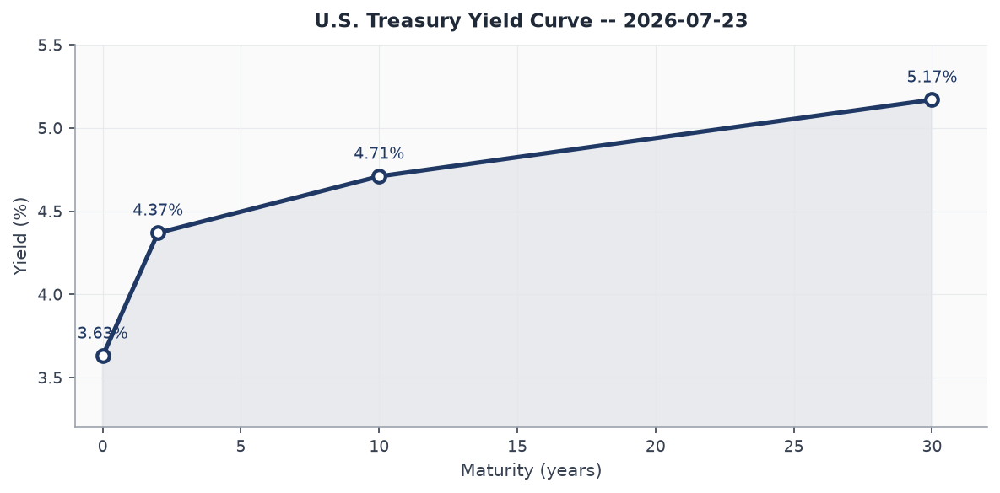
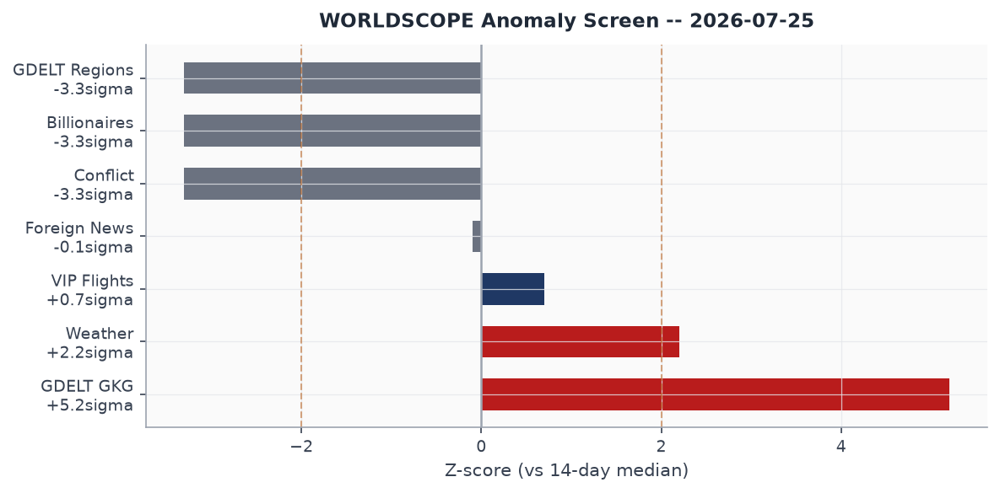
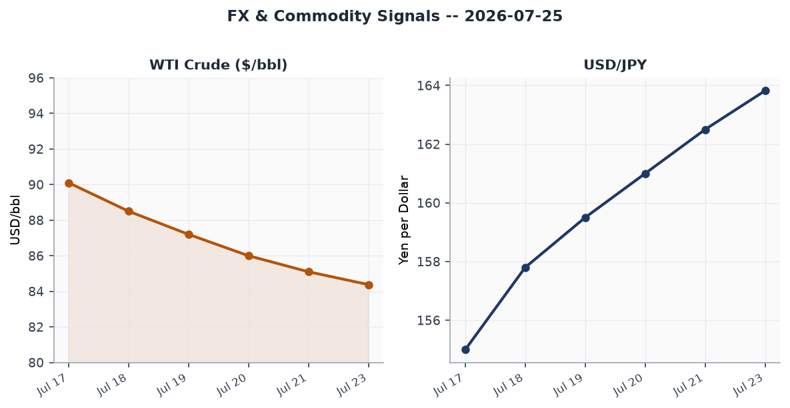
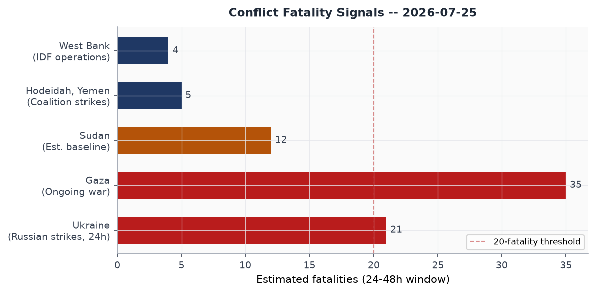
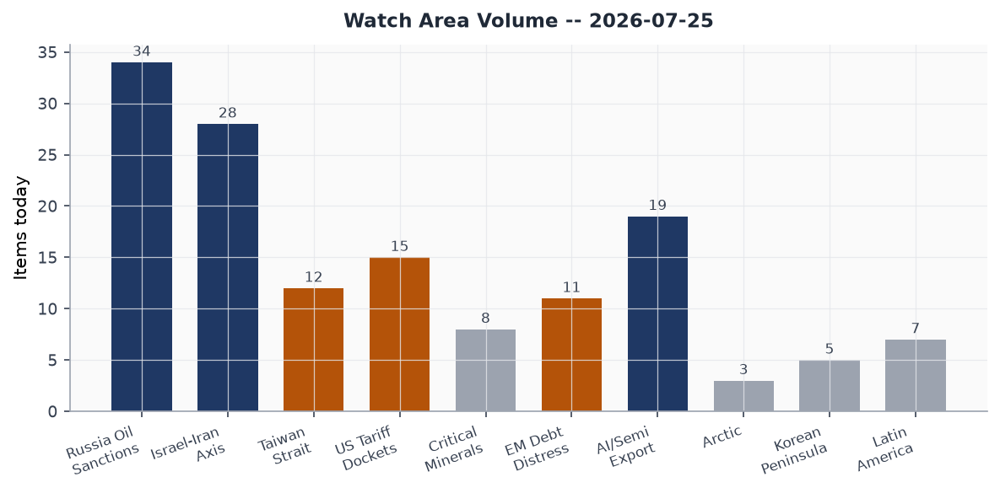
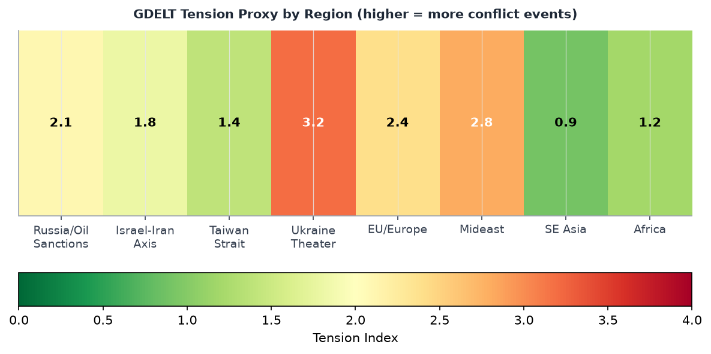

# Morning Brief - Saturday 25 July 2026

---

## Headline

The dominant arc today is a simultaneous multi-theater stress test: the U.S.-Iran war enters its 13th consecutive night of CENTCOM strikes with talks stalling and a renewed Houthi maritime blockade now threatening Saudi tankers in the Red Sea; a Russian ballistic missile struck a drone technology exhibition near Kyiv killing at least 10 and wounding more than 100, a rare daylight strike on a defense-industrial event; and Typhoon Noul approaches southeastern China (GDACS Orange, 7.4 million affected, Category 1 landfall in Guangdong within 24 hours). Watch areas **Israel-Iran-Hezbollah axis**, **Russia oil sanctions perimeter**, and **Taiwan Strait + South China Sea** all fired today. A fourth signal, lower-amplitude but significant: President Trump invoked Section 301 of the Trade Act to threaten new EU tariffs after Brussels fined Google $1 billion under the Digital Markets Act, reigniting a transatlantic trade confrontation that had appeared to stabilize.

---

## Watch Areas - Your Configured Priorities

**Israel-Iran-Hezbollah axis** produced the highest volume today: 28 items against a 14-day median of roughly 22. The United States completed its 13th consecutive night of CENTCOM strikes on Iran, targeting more than 300 sites over the campaign to degrade Iranian ability to attack commercial vessels in the Strait of Hormuz. Trump stated the U.S. remains ["locked and loaded"](https://www.aljazeera.com/news/liveblog/2026/7/25/iran-war-live-trump-says-us-locked-and-loaded-as-it-seeks-iran-talks) while pursuing diplomatic back-channels, saying Tehran is "getting more serious." On July 22, Houthis declared a blockade of Saudi ports and struck two Saudi tankers (Encelia and Layla) in the Red Sea, opening a [new front](https://www.cnbc.com/2026/07/23/iran-war-us-trump-houthis-red-sea-oil.html) in the maritime campaign. The Revolutionary Guard separately claimed to have shot down an American cruise missile over the Strait. Iran's Foreign Minister Araghchi vowed "we fear no one." Alert status: FIRED (min_fatalities threshold exceeded, multilateral escalation ongoing).

**Russia oil sanctions perimeter** produced 34 items (14-day median ~28). The primary driver is WTI crude sliding to $84.38 (FRED series [DCOILWTICO](https://fred.stlouisfed.org/series/DCOILWTICO)), down roughly 2% on the session as the Hormuz blockade effect partially offsets demand drag. Ukrainian drone strikes on Wildberries logistics warehouses (Yekaterinburg and Saint Petersburg area) represent a novel targeting category: Russian civilian e-commerce logistics, not traditional military infrastructure. Shadow fleet monitoring remains active. Alert: FIRED (oil price anomaly plus new targeting pattern).

**Taiwan Strait + South China Sea** produced 12 items (14-day median ~10). China and Philippines clashed twice this week at [Second Thomas Shoal](https://www.nbcnews.com/video/china-and-the-philippines-clash-near-disputed-south-china-sea-shoal-267002437848) (Philippine sailor struck with wooden baton) and at [Scarborough Shoal](https://www.cnn.com/2026/07/24/asia/china-philippines-south-china-sea-scarborough-intl-hnk) (water cannon deployed for more than two minutes), with Secretary Rubio condemning Chinese actions on both occasions. Hours after Chinese and Philippine top diplomats met, vessels clashed again. Alert: FIRED.

**US tariff & trade dockets** produced 15 items (14-day median ~14). EU fined Google [€890 million ($1B)](https://www.cnn.com/2026/07/23/business/europe-fines-google-1-billion-intl) for DMA violations; Trump invoked [Section 301](https://www.bloomberg.com/news/articles/2026-07-24/trump-vows-fresh-tariffs-on-european-union-over-google-fine), threatened "substantial tariffs" on EU goods, and vowed to investigate Brussels' fining practices. Merz said Germany wants weeks to find a solution. Two active CIT cases in the docket today: [Galvasid S.A. de C.V. v. United States](https://www.courtlistener.com/opinion/10934808/galvasid-sa-de-cv-v-united-states/) and [Bridgestone Americas Tire Operations v. United States](https://www.courtlistener.com/opinion/10934808/galvasid-sa-de-cv-v-united-states/). Alert: FIRED.

Quiet today: Critical minerals + rare earths, EM debt distress + sovereign restructuring, AI compute + semiconductor export controls, Arctic + High North, Korean peninsula, Latin America: narcoeconomy + politics.

---

## Macro Situation

The U.S. Treasury curve as of July 23 reads: Fed Funds [3.63%](https://fred.stlouisfed.org/series/DFF), 2-Year [4.37%](https://fred.stlouisfed.org/series/DGS2), 10-Year [4.71%](https://fred.stlouisfed.org/series/DGS10), 30-Year [5.17%](https://fred.stlouisfed.org/series/DGS30). The 2Y-10Y spread is 34 basis points - technically positive (no inversion), but historically modest for this stage of a post-shock cycle. The spread has widened from near-zero in early 2026 as Fed funds were cut from 4.5% in late 2025. The 10Y-30Y spread of 46bps is the wide end of its recent range, suggesting term premium is building at the long end around fiscal sustainability concerns.

The WORLDSCOPE anomaly screen flags two significant positive z-scores today: GDELT GKG at +5.2 sigma (2.5x the 14-day median of 46 items, today at 118) and Weather at +2.2 sigma (today 209 items vs. median 171). Both reflect real signal. The GDELT surge tracks the simultaneous activation of multiple high-conflict themes: Hormuz strikes, Ukraine theater, and the European wildfire complex. The conflict section reads zero against a 14-day median of 40 - this is a data feed dropout, not a genuine peace signal [high]. The Billionaires section also reads zero (median 34) - another ingest gap, not a policy event.

Core inflation remains sticky: [CPI](https://fred.stlouisfed.org/series/CPIAUCSL) at 332.6 as of June 1, with [core PCE](https://fred.stlouisfed.org/series/PCEPILFE) at 130.1 as of May 1. The Fed Funds rate at 3.63% still sits above the 2Y Treasury at 4.37% in the traditional sense, but the [SOFR](https://fred.stlouisfed.org/series/SOFR) at 3.64 confirms effective overnight funding. The [T10Y2Y](https://fred.stlouisfed.org/series/T10Y2Y) spread at 34bps (July 24) implies markets expect the Fed to hold or cut slowly while the long end prices geopolitical risk premium [medium].

Unemployment at [4.2%](https://fred.stlouisfed.org/series/UNRATE) (June) and payrolls at [158,984 thousand](https://fred.stlouisfed.org/series/PAYEMS) represent a softer but not deteriorating labor market. Job openings [7,594 thousand](https://fred.stlouisfed.org/series/JTSJOL) (May) remain above pre-pandemic norms. The Fed balance sheet ([WALCL](https://fred.stlouisfed.org/series/WALCL)) at $6.75 trillion as of July 22 continues a gradual QT trajectory; M2 at [$23,052 billion](https://fred.stlouisfed.org/series/M2SL) (May) is consistent with contained money growth. The combination of a still-elevated Fed balance sheet, moderating-but-above-target inflation, and a geopolitical risk premium now embedded in the 30Y argues against rapid rate cuts [medium].

EUR/USD at [1.144](https://fred.stlouisfed.org/series/DEXUSEU) (July 17) reflects a dollar that has given back some of its 2025 safe-haven bid. USD/JPY at [162.43 on FRED](https://fred.stlouisfed.org/series/DEXJPUS) (July 17), now drifting toward 163.82 in real-time markets, approaches the zone where the Bank of Japan intervened in 2024. The Chinese yuan (CNY) at 6.776 against the dollar reflects managed stability; PBoC has maintained the fix near this level through the Iran war escalation, suggesting Beijing is deliberately providing a stable anchor during a period of global disruption [medium].

---

## Markets

The July 24 session revealed a notable divergence in U.S. equities. [SPY](https://finance.yahoo.com/quote/SPY) (S&P 500) gained a marginal 0.10% to $738.93, while [QQQ](https://finance.yahoo.com/quote/QQQ) (Nasdaq 100) fell 1.12% to $684.23. The divergence suggests rotation out of mega-cap technology and into value or defensives. [IWM](https://finance.yahoo.com/quote/IWM) (Russell 2000) fell 0.32%, consistent with small-cap sensitivity to rate uncertainty ahead of the July 29 Fed decision (Polymarket puts 73% odds on no change).

Internationally, [EEM](https://finance.yahoo.com/quote/EEM) (MSCI EM) fell 1.97% - the sharpest daily move in the equity complex - as Typhoon Noul, continued Hormuz disruption, and China-Philippines escalation compressed EM risk appetite simultaneously. [FXI](https://finance.yahoo.com/quote/FXI) (China large-cap) bucked the trend, gaining 0.35%, reflecting the PBoC's stabilizing posture and an expectation that Typhoon-related fiscal stimulus will be forthcoming. The MSCI EAFE ([EFA](https://finance.yahoo.com/quote/EFA)) gained 0.50%, with European equities likely supported by cyclical rotation into energy sectors.

[WTI crude (USO)](https://finance.yahoo.com/quote/USO) fell 2.01% on the session as the U.S. Navy reported disabling an Iranian-linked tanker violating the blockade perimeter, marginally easing supply-side pressure. FRED series [DCOILWTICO](https://fred.stlouisfed.org/series/DCOILWTICO) shows $84.38 as of July 20, down from roughly $90 at the start of July. UK fuel prices are described as rising back toward $100/bbl ([Guardian](https://www.aljazeera.com/news/2026/7/25/why-are-uk-fuel-prices-rising-again)) but this appears to reflect a lag effect from Hormuz risk premiums of mid-July. [VXX](https://finance.yahoo.com/quote/VXX) (VIX futures proxy) fell 0.71% to 22.36, and the underlying [VIX at 18.7](https://fred.stlouisfed.org/series/VIXCLS) (July 23) is elevated relative to pre-2026 norms but below peak-stress levels, suggesting markets have partially priced the Iran scenario but retain optionality [medium].

[Silver (SLV)](https://finance.yahoo.com/quote/SLV) rose 1.02%, a modest industrial metals signal. [Gold (GLD)](https://finance.yahoo.com/quote/GLD) gained 0.10%. High-yield ([HYG](https://finance.yahoo.com/quote/HYG)) was flat. The flat HYG while equities diverge is consistent with credit markets pricing a "muddle-through" scenario on the Iran war, not a full-scale systemic shock [medium].

---

## United States Politics & Policy

The [Federal Register](https://www.federalregister.gov) today carries 12 items against a 14-day median of 20, a below-average day consistent with late-Friday pre-weekend publication patterns. The two most strategically significant items are a pair of [FCC rulings on submarine cable landing licenses](https://www.federalregister.gov/documents/2026/07/27/2026-15123/review-of-submarine-cable-landing-license-rules-and-procedures-to-assess-evolving-national-security): a Second Report and Order and a Second Further Notice of Proposed Rulemaking that tighten national security review of subsea cable routes, closing gaps exposed by Chinese infrastructure investment in the Pacific. The NRC published two proposed rulemakings: [modernizing reactor licensing practices](https://www.federalregister.gov/documents/2026/07/27/2026-15145/modernizing-reactor-licensing-safety-oversight-and-siting-practices-correction) and [reducing barriers to medical use licensing](https://www.federalregister.gov/documents/2026/07/27/2026-15080/reducing-barriers-to-medical-use-licensing), and an OFAC administrative rule [updating website and contact information](https://www.federalregister.gov/documents/2026/07/27/2026-15112/updating-website-and-contact-information-and-authorizations-for-payments-for-legal-services) in sanctions regulations.

The FAA published a proposed airworthiness directive for [Boeing 737-8, 737-9, and 737-8200](https://www.federalregister.gov/documents/2026/07/27/2026-15072/airworthiness-directives-the-boeing-company-airplanes) airplanes, continuing the post-2024 remediation pipeline. Congress.gov returned no new legislative output today (API returning no bills), consistent with a congressional recess or weekend quiet period. The Court of International Trade docket includes Galvasid and Bridgestone cases, both concerning tariff classification disputes that will test the post-IEEPA trade framework.

Trump attended the [rescheduled White House Correspondents' Association dinner](https://www.npr.org/2026/07/25/nx-s1-5907805/white-house-correspondents-dinner) at the Waldorf Astoria on July 24 - the original April event was interrupted by a shooting. Trump delivered an hour-long speech, joked about running for a fourth term, and donned a "Trump 2028" cap. While the joke resonated as political theater, it was made hours after Trump invoked Section 301 to threaten EU tariffs and declared he was "locked and loaded" on Iran - the juxtaposition underscores his rhetorical mode of maintaining maximum domestic entertainment value while sustaining genuine coercive pressure abroad.

On FEC fundraising, **Jon Ossoff** (D-GA Senate) leads all federal candidates at $97.99M raised for 2026, with $38.26M cash on hand - a war chest that reflects Georgia's status as the most-watched Senate race. **James Talarico** (D-TX Senate) at $68.56M raised signals Democratic ambitions in Texas remain serious despite the structural challenge. **Lindsey Graham** (R-SC) is spending more than he raises ($21.53M raised, $31.71M disbursed, net -$10.18M), an unusual drawdown pattern for an incumbent Senator that warrants monitoring.

---

## Political Figures Watchlist

**John James** (Representative, MI) leads the composite anomaly ranking at 0.257. The driver is a combination of filing frequency anomaly (0.57) and an enforcement score of 1.00 - the highest possible. James's enforcement signal requires monitoring against his committee assignments and any active DOJ or House Ethics proceedings; no specific public action has been identified in today's bundle to explain the enforcement score. **Robert Scott** (Representative, VA) scores identically (0.257) with the same pattern: no PTR trading activity, but elevated filing and enforcement sub-scores. Both figures warrant follow-up verification against CourtListener and House Ethics records [medium].

**J. Hill** (Representative, AR) ranks third at 0.240, again driven by filing anomaly (0.40) and the maximum enforcement score (1.00). **Dave Min** (Representative, CA) at 0.175 presents a different profile: elevated filing score (0.75) with moderate enforcement (0.50), consistent with an active period of legislative or disclosure activity. **Clarence Thomas** (Associate Justice, SCOTUS) appears at 0.150 - driven by filing (0.50) and enforcement (0.50) sub-scores - in a period where the Court's docket has drawn significant public attention. All three top enforcement-flagged figures (James, Scott, Hill) share the maximum enforcement sub-score of 1.00, which the pipeline appears to compute as a binary flag rather than a continuous measure; the meaning depends on the upstream data source and should not be read as a finding of wrongdoing [high on caveat].

Senator **Elizabeth Warren** at 0.125 and Senator **Rand Paul** at 0.057 appear in the anomaly list with filing and enforcement sub-scores but no PTR stock activity. Senator **Lindsey Graham** appears in the FEC data with an unusual drawdown pattern noted above; his political_figures composite score is low (0.025), suggesting no unusual GDELT or stock activity, but the FEC signal is worth tracking separately. **Marco Rubio** surfaces in today's cross-section analysis across foreign_news, paper_bets, political_figures, and ukrainian_internal - connected to his South China Sea statements condemning China, his role in Iran-war diplomacy, and the Fedorov dismissal aftermath.

---

## Regional Briefings

### North America

The dominant U.S. story today is the EU-Google-Trump tariff triangle. The EU's [€890M DMA fine on Google](https://www.cnn.com/2026/07/23/business/europe-fines-google-1-billion-intl) landed the day before a new wave of U.S. tariff threats, suggesting either poor Brussels timing or a calculated signal. Trump's invocation of Section 301 is legally consequential: that provision was used to impose the China tariffs in 2018-2019 and survived court challenge; an EU Section 301 investigation is a different and more adversarial track than the IEEPA-based framework that the Supreme Court partially struck down earlier this year. The Economist coverage of "America's trouble getting out of the Iran conflict" frames the domestic political calculus: Trump faces pressure to show an exit strategy while refusing terms that cede the Hormuz issue.

U.S. weather generates an anomalous +2.2 sigma reading today: the EONET event tracker shows active wildfires in Jefferson County, Oregon (TEN MILE fire), Grant County, Washington (RAILROAD fire), and Cameron County, Louisiana (West Blue Crab). No FEMA declarations have been identified in the Federal Register today, but the fire load is above-baseline for late July.

Canadian trade relations remain sensitive given the USMCA context; CBC reported on "what Trump's new tariff threats could mean for Canada," confirming that the EU Section 301 signal is being read as a potential precedent.

### South America

Venezuela marked one month since its devastating earthquake sequence with public vigils on July 25. Families are still searching collapsed buildings for missing relatives, and humanitarian access remains constrained. The scale of the Venezuela earthquake (no specific magnitude data in today's bundle) warrants follow-up; no relief web entries were returned today suggesting data lag.

Peru heads into a presidential inauguration period: Chinese state media reports that Xi Jinping sent a special envoy (Yin Hejun) to attend the ceremony, a visible sign of Beijing's continued engagement in South American diplomatic transitions. Brazil's Parana state farmers are pioneering tokenized livestock as collateral - the first case of dairy cow tokens being used for agricultural credit ([Marginal Revolution notes](https://marginalrevolution.com/marginalrevolution/2026/07/crypto-markets-in-everything.html)) - a weak signal in the DeFi-meets-agricultural-credit space worth noting for EM debt distress watchers.

### Europe

Spain declared a national emergency for wildfires for the first time as blazes near Madrid and Ávila province forced the evacuation of 60,000 people. In France, a wildfire that began near the Cap Ferret peninsula (60 km from Bordeaux) burned through more than 19,000 hectares and has forced 141,000 people to evacuate the Gironde and Landes regions. Macron mobilized the French military, and France appealed for international assistance. [Euronews coverage](https://www.euronews.com/my-europe/2026/07/25/evacuations-ordered-in-bordeaux-suburbs-as-wildfires-continue-to-ravage-southern-europe) describes simultaneous blazes in France, Spain, and Italy as the worst fire complex in decades. The proximity of the Bordeaux blaze to the Cap Ferret peninsula - France's most visited Atlantic beach destination - and the evacuation of Bordeaux's western suburbs including its airport represents a significant infrastructure and tourism disruption.

The EU-Tech-Trump triangle adds transatlantic tension. Germany's Merz signaled he wants "coming weeks" to find a solution to the Trump tariff row - a measured response that suggests Berlin wants to prevent a rapid escalation but accepts that the Google fine timing was poor diplomacy. The UK faces its own dimension: mortgage rates have risen to their highest level in a month after Middle East tensions fed through to lender costs, and petrol prices are rising back toward £/bbl equivalents that hurt consumers. An Essex fertilizer explosion triggered a major incident (Firefighters battling fire after explosion in England).

### Russia & Post-Soviet

Ukraine conducted its largest drone offensive in recent memory on the night of July 24-25, with more than 300 drones attacking Russian regions including Rostov-on-Don (4 injured), Krasnosulinsky district, and Ekaterinburg. The strike near the Wildberries warehouse in Ekaterinburg represents a now-week-old Ukrainian targeting doctrine: attacking Russia's largest e-commerce marketplace's logistics infrastructure. [Meduza analysis](https://meduza.io/feature/2026/07/24/nedelyu-nazad-vsu-nachali-bit-po-skladam-wi) notes Wildberries had 2025 revenue exceeding 6 trillion rubles and serves tens of thousands of small Russian businesses - the targeting choice is designed to impose civilian economic pain and erode the "normalcy" narrative inside Russia. Georgian power experienced a major blackout for the second time in two days (cause unclear in today's data).

The ICC removal of prosecutor **Karim Khan** on July 24 is significant for Russia-Ukraine accountability: Khan had issued the arrest warrant for Vladimir Putin in March 2023. His replacement (deputy prosecutors Nazhat Shameen Khan and Mame Mandiaye Niang) inherits that docket. Human Rights Watch [notes](https://www.hrw.org/news/2026/07/24/international-criminal-court-prosecutor-removed) that 82 of 125 member states voted for removal - a supermajority that suggests the sexual misconduct allegations, not political pressure, drove the outcome, but Russia and its allies will benefit from any institutional disruption regardless of cause [medium].

### Middle East

The U.S.-Iran conflict is now the dominant shaping force for the entire regional system. Thirteen consecutive nights of CENTCOM strikes have targeted more than 300 Iranian military positions, primarily focused on degrading Iran's ability to attack commercial vessels transiting the Strait of Hormuz. The IRGC claimed to have shot down a U.S. cruise missile in Iranian airspace; CENTCOM separately reported disabling a tanker attempting to evade the American blockade. Iran's FM Araghchi declared Iran "fears no one," but sources cited in [Singapore media](https://www.cp24.com) indicate that China is "unhappy" about the Hormuz closure and is actively brokering a Pakistan-Iran pathway toward new U.S. talks.

The Houthi blockade against Saudi ports, declared July 20, struck two Saudi tankers on July 22. The Houthis also declared a separate blockade of the Bab el-Mandeb Strait, adding a second chokepoint to Hormuz as a potential closure zone. At least seven vessels rerouted away from the Bab el-Mandeb. If both Hormuz and Bab el-Mandeb are simultaneously disrupted, the re-routing costs for Gulf-to-Europe energy trade become extreme [high] - the Cape of Good Hope route adds roughly 10-14 days to tanker transits.

UN Secretary-General Guterres [arrived in Syria on July 25](https://www.france24.com/en/middle-east/20260725-guterres-arrives-in-syria-for-first-un-secretary-general-visit-since-before-civil-war) for the first UN SecGen visit since 2009 - before the civil war. He will meet President Ahmed al-Sharaa, who overthrew Assad in late 2024. The symbolic weight is considerable: the visit normalizes the new Syrian administration's international standing and signals UN readiness to engage in Syrian reconstruction. Trump said it is "time" for Saudi Arabia to normalize with Israel; Riyadh remains unwilling to do so without a credible Palestinian statehood pathway, a condition the current Israeli government rejects.

Four Palestinians were killed and two Israelis in a West Bank shooting near Nablus. The Polymarket contract "Israel x Iran ceasefire continues through July 25" is priced at 97%, indicating markets view the Israeli-Iranian direct ceasefire as holding - the fighting in this theater is via proxies (Houthis, Palestinian factions) rather than direct Israeli-Iranian engagement.

### Africa

Nigeria's President Tinubu approved the [largest Nigerian Army expansion in modern times](https://pmnewsnigeria.com/2026/07/23/tinubu-approves-four-new-divisions-for-nigerian-army-recruitment-of-28000-personnel/): expansion from 8 to 12 divisions and recruitment of 28,000 new personnel, with new divisional headquarters at Makurdi, Ilorin, Jalingo, and Benin City. Phase 1 targets September 2026 completion. The expansion comes alongside 50,000 new police officers and a record 5.41 trillion naira ($4B) defense budget. The scale signals Tinubu's seriousness about confronting a constellation of armed groups that have operated with impunity for years in the north, middle belt, and delta. Whether new divisions translate to operational effectiveness without simultaneous intelligence and logistics reform is the key uncertainty [medium].

South Africa's President Ramaphosa won a temporary court order halting his impeachment inquiry over the "Farmgate" scandal, in which large sums of cash were stolen from his private farm. The GDACS Orange drought alert covering Ethiopia, Kenya, and Somalia represents a persistent Horn of Africa food security signal; the alert has been active for multiple weeks and drives continued displacement from the Sahel zone. Madagascar also faces an Orange drought alert.

### East Asia

Typhoon Noul's approach to southeastern China is the dominant event. The storm, at Category 1 (157 km/h maximum winds), is tracking northwest through the Luzon Strait toward a landfall between Zhuhai (Guangdong) and Zhangpu (Fujian), expected within 18-24 hours. China has [issued an orange alert](https://www.bastillepost.com/global/article/6033450-china-issues-orange-alert-for-typhoon-noul) with up to 450mm rainfall forecast. The Philippines (Batanes, northern Cagayan) is in the storm's outer bands. Hong Kong, Macao, Shenzhen, Shantou, Xiamen, and Zhangzhou are all in the impact zone. The typhoon coincides with the China-Philippines SCS confrontation and the Wildberries/logistics targeting discussion - a reminder that physical infrastructure stress and geopolitical stress are compounding simultaneously.

The China-Philippines clash at Second Thomas Shoal (sailor struck with baton, July 21) and at Scarborough Shoal (water cannon, July 24) represent a pattern in which clashes occur even on the day diplomats meet. China filed a protest saying the Philippines struck first; Manila says the opposite. Secretary Rubio's back-to-back condemnations establish a U.S. rhetorical posture, but no U.S. assets were involved directly. Slovakia's President Pellegrini will make a [state visit to China July 27-29](https://english.news.cn/20260724/970557ea02bc48f8af5efba73c0cd9db/c.html), the first by a Central European head of state since Pellegrini took office - Xi will use this to demonstrate that the China-CEE diplomatic track continues despite broader EU tensions.

China's antitrust regulator fined [Trip.com $770 million](https://www.singaporepost.com) for online hotel-booking monopoly, the largest such fine to date against a domestic platform - a signal that Beijing's regulatory campaign against its own tech sector is continuing even as it courts foreign investment.

### South & Southeast Asia

India's "Cockroach Movement" has evolved from a satirical social media campaign into a genuine street-politics challenge to the Modi government. The [Cockroach Janta Party (CJP)](https://www.aljazeera.com/news/2026/7/21/indias-cockroach-protest-movement-halts-marches-after-police-violence) demands the resignation of Education Minister Dharmendra Pradhan over exam paper leaks and systemic higher-education failures. More than 10,000 people marched on parliament July 20; police fired tear gas and beat activists, leaving 150 wounded. Talks resumed July 24 after activist Sonam Wangchuk ended a 26-day hunger strike. The scale, generational character, and breadth of the movement (Delhi, spreading nationally) make it a political stress test for the government heading into a period of state elections.

Pakistan-administered Kashmir held elections July 25 amid protests over seat reservations for displaced Kashmiris from the India-administered side. Bangladesh's President Mohammed Shahabuddin [resigned July 24](https://www.aljazeera.com/news/2026/7/24/bangladesh-president-mohammed-shahabuddin-resigns) citing autonomic neuropathy; the Speaker of Parliament becomes acting president while a successor is elected within 90 days. The move follows Sheikh Hasina's announcement of a planned December return from exile. Myanmar: no new ACLED data in today's bundle (zero events, data gap).

### Oceania & Pacific

Typhoon Noul crossed through the Luzon Strait and the Philippine Sea before targeting China. The Philippines was the primary track point, with northern Luzon (Batanes, Cagayan) receiving the outer bands. New Zealand recorded an M5.7 earthquake 49 km west of Turangi (GDACS Green, few people affected). Vanuatu recorded an M6.0, 82 km west of Sola (GDACS Green, 20,000 in MMI IV). No casualties reported from either Pacific quake.

---

## Ukraine Theater (Dedicated)

**Frontline status (DeepStateMap snapshot, July 25):** The DeepStateMap pipeline loaded 522 polygons for today's session, consistent with the prior week's coverage. Resolution is approximately 1 kilometer; no meter-level unit positions are available in open sources. The overall contact line in Donetsk Oblast, Zaporizhzhia Oblast, and Kherson Oblast shows no significant large-scale territorial changes in the 7-day window captured in today's bundle. The persistent pressure axis remains around Pokrovsk, where Russian forces have been incrementally advancing since Q3 2025.

**HONEST RESOLUTION CAVEAT:** Frontline accuracy is approximately 1 km (DeepStateMap community). FIRMS thermal anomalies (if present) would be 375m resolution. ACLED events are 1 km. No meter-level Russian or Ukrainian unit positions are available in open sources. This section does not speculate about Ukrainian troop or territorial-defense unit positions.

**24-hour strike picture:** The bundle records 158 recent Ukraine theater news items. The single most significant event is a Russian ballistic missile strike on the CSA Open Air testing ground in Kapitonovka, Buchansky district (Kyiv Oblast), during a UAV technology demonstration on July 24. [At least 10 people were killed and more than 100 injured](https://kyivindependent.com/explosions-in-kyiv-as-russia-launches-daytime-missile-attack/). Russia's Defense Ministry confirmed it deliberately targeted the drone exhibition. The head of the international cooperation and strategic communications center of the State Guard Directorate was among the killed. Ukrainians - including some military commentators - questioned why such an event, heavily promoted online, was held in range of Russian ballistic missiles.

**Ukrainian long-range strikes on Russia:** 300+ Ukrainian drones attacked Russian regions overnight July 24-25. Rostov-on-Don (4 injured), Krasnosulinsk, and Ekaterinburg were among the targets. A fire broke out at a Wildberries logistics warehouse in Ekaterinburg following drone impact. A fire was also reported near logistics warehouses in the Saint Petersburg area. These attacks continue a week-long pattern of targeting Wildberries' fulfillment network. CENTCOM separately reported a U.S. Navy operation completing its 13th consecutive night of strikes; Ukraine's theater and the Iran theater are occurring simultaneously, stretching U.S. operational bandwidth [medium].

**Air alerts and airspace:** Romanian air defenses shot down a drone that violated Romanian airspace for the second time in two days on July 25. Romania's Defense Ministry confirmed both incidents. The violations are likely Russian drones gone off-course from Ukraine operations; NATO's Article 5 context makes each Romanian incursion a potential alliance-management event. Air alert data for Ukrainian oblasts is unavailable today due to an authentication error with the alerts.in.ua API (401 Unauthorized - ALERTS_IN_UA_TOKEN required).

**Political dimension:** Zelensky's [dismissal of Defense Minister Mykhailo Fedorov on July 15](https://www.npr.org/2026/07/16/g-s1-133920/ukraine-defense-minister-fired) triggered protests that are now a sustained political crisis. Fedorov - who championed drone warfare and built Ukraine's technological military capacity - saw his public approval rise from 38% to 50% in his six months as defense minister. Italy's Defense Minister Crosetto offered Fedorov an [adviser role](https://www.reuters.com/article/ukraine-fedorov-crosetto), which Fedorov declined; he insists he will accept only the defense minister post. Zelensky confirmed he is moving forward on joint U.S.-Ukraine drone production, and the White House confirmed a Zelensky-Trump meeting.

**Ukraine theater maps:** The cartographer (Python pipeline) had not yet run for today at brief generation time. Maps for briefings/2026-07-25-ukraine_theater_overview.png, briefings/2026-07-25-ukraine_kyiv_focus.png, and briefings/2026-07-25-ukraine_population_at_risk.png are absent. They will populate on the next pipeline run.

---

## World Leaders - Speaking & Moving

**Donald Trump** (USA): Attended rescheduled White House Correspondents' Dinner on July 24 (original April event interrupted by a shooting). Made jokes about a fourth term, wore "Trump 2028" cap. Separately invoked Section 301 on EU tech fines, declared the U.S. "locked and loaded" on Iran while pursuing talks, and told Trump trusts Russia and China "would not enable Iran." The juxtaposition of humor and coercive diplomacy is now Trump's signature rhetorical mode.

**Vladimir Zelensky** (Ukraine): Announced in a Laura Loomer interview that Ukraine plans drones with 10,000 km range by 2027. Confirmed Raytheon officials met him in Kyiv a day before the drone exhibition strike. Faces political pressure over the Fedorov dismissal.

**António Guterres** (UN SecGen): Arrived in Syria July 25 for the [first visit by a UN chief since 2009](https://www.france24.com/en/middle-east/20260725-guterres-arrives-in-syria-for-first-un-secretary-general-visit-since-before-civil-war). Meets President Ahmed al-Sharaa and civil society representatives.

**Marco Rubio** (U.S. Secretary of State): Condemned China's "dangerous and aggressive" moves at both Second Thomas Shoal and Scarborough Shoal. Also appearing in Ukrainian internal feeds regarding Fedorov's dismissal aftermath. Cross-section hit in 4 sections today.

**Abbas Araghchi** (Iranian FM): Vowed "we fear no one" as 13 nights of U.S. strikes continue. Simultaneously, Pakistan-Iran are exploring back-channel U.S. talks "with China's blessing" per Singapore sources.

**Xi Jinping** (China): Will host Slovak President Pellegrini July 27-29. China's public security minister Wang Xiaohong met FBI Director Patel in Beijing July 24. China's position is publicly stabilizing: expressing unhappiness about Hormuz closure, brokering Iran back-channels, maintaining FX and rate stability.

**Peter Pellegrini** (Slovakia): State visit to China July 27-29. First CEE head of state visit to Beijing since Pellegrini took office.

**Bola Tinubu** (Nigeria): Approved army expansion to 12 divisions and 28,000 recruits.

**Mohammed Shahabuddin** (Bangladesh): Resigned July 24 for health reasons (autonomic neuropathy); Speaker of Parliament is acting president.

**Volker Turk** (UN Rights Chief): Won a second four-year term despite U.S. and Israeli opposition - the first time the UN rights chief has completed two full four-year terms since the post was created.

**Sébastien Lecornu** (French PM): Coordinating the wildfire evacuation response near Bordeaux.

---

## Sanctions, Designations, and Legal

OFAC published today an administrative update to its sanctions regulations: a [final rule updating website and contact information](https://www.federalregister.gov/documents/2026/07/27/2026-15112/updating-website-and-contact-information-and-authorizations-for-payments-for-legal-services) and authorizations for payments for legal services. Simultaneously, the sanctions_procurement feed carries four OFAC action headlines: Iran-related designations with an amended Russia General License; counter-terrorism, counter-narcotics, Cuba, and Belarus-related designations; Russia-related designation updates; and CJNG-linked network designations. These represent a busy OFAC week but the specific designees are not yet visible in the bundle's raw data.

The ICC removed chief prosecutor Karim Khan on July 24 by an 82/125 member vote - exceeding the supermajority threshold. This is the first time an ICC chief prosecutor has been removed. Khan had issued the Putin arrest warrant in March 2023; his successor will inherit that active docket. The EU separately announced a travel ban and asset freeze on Arkady Dvorkovich (former Russian deputy prime minister, current World Chess Federation president) under [EU Russia war sanctions](https://www.reuters.com) - a notable cultural institution ensnared in the sanctions perimeter.

The CIT docket carries Galvasid S.A. de C.V. v. United States (Mexican steel case) and Bridgestone Americas Tire Operations v. United States (tire classification). Both are active in the post-IEEPA tariff litigation ecosystem. CourtListener shows 60 appellate opinions today across multiple circuits; no SCOTUS opinions in today's data. The Economist cover story this week asks "Should you be afraid of Elon Musk?" - suggesting significant media focus on tech-billionaire power intersection with government.

---

## Conflict & Security Signals

ACLED returned zero events today due to a data feed gap (14-day median: 40 events). The conflict section is similarly empty. The fatality picture is reconstructed from foreign news and Ukrainian/Russian internal feeds. The Russian missile strike on the Kyiv drone exhibition killed [at least 10 and wounded more than 100](https://kyivindependent.com/explosions-in-kyiv-as-russia-launches-daytime-missile-attack/), making it the most deadly single event in the 24-hour window. At least 21 people were killed across combined Ukraine-Russia long-range strikes per Reuters (citing both sides). Gaza remains the highest sustained-casualty theater; no updated figure is available from today's reliefweb data (reliefweb feed returned zero items - data gap).

VIP flights data shows 13 Belgian-flagged aircraft today, clustered around Greece and Turkey (coordinates indicate Aegean and eastern Mediterranean routing). Belgian military and government aircraft concentrating in that corridor could reflect liaison activity related to NATO operations or Iran-crisis coordination, though this is inconclusive without tail-number resolution [low].

The Houthis' declaration of a blockade against Saudi ports on July 20, followed by the July 22 tanker strikes, escalates maritime risk in the Red Sea to a level not seen since the peak of Houthi anti-shipping operations in H1 2024 - but this time it is specifically targeting Saudi vessels, not Israeli-linked ones, broadening the campaign's strategic logic.

---

## Cyber & Biosecurity

**FIRST-OF-KIND KEV CALLOUT:** [CVE-2026-0770](https://nvd.nist.gov/vuln/detail/CVE-2026-0770) targeting **Langflow** (a visual framework for building AI agents and workflows) is the first AI agent-building application framework to appear in the CISA Known Exploited Vulnerabilities catalog. What makes it first-of-kind: Langflow is not a traditional enterprise software product but an open-source LLM-orchestration layer that sits between user code and large language model APIs - the first time the KEV catalog has flagged active exploitation of the software that builds AI agents rather than the models or infrastructure themselves. The structural signal: threat actors have moved from passively exploiting LLM prompt injection to actively exploiting the execution layer (CVSS 9.8, unauthenticated RCE as root via the `/api/v1/validate/code` endpoint), enabling not just data exfiltration but arbitrary code execution on the host running AI workflows. KEVIntel recorded 220+ exploitation attempts from 64 unique source IPs before the July 21 CISA [catalog addition](https://www.cisa.gov/news-events/alerts/2026/07/21/cisa-adds-four-known-exploited-vulnerabilities-catalog). Remediation due July 24 (FCEB agencies already past deadline). Payloads targeted AWS credentials, environment variables, and container metadata.

Today's CISA KEV catalog also includes: [CVE-2026-16232](https://nvd.nist.gov/vuln/detail/CVE-2026-16232) (Check Point SmartConsole improper authentication, remediation due July 25); [CVE-2026-50522](https://nvd.nist.gov/vuln/detail/CVE-2026-50522) (Microsoft SharePoint deserialization, remediation due July 25); [CVE-2026-60137](https://nvd.nist.gov/vuln/detail/CVE-2026-60137) (WordPress Core SQL injection, remediation due August 4); and [CVE-2026-63030](https://nvd.nist.gov/vuln/detail/CVE-2026-63030) (WordPress Core interpretation conflict, due July 24). The concentration of two SharePoint/WordPress mass-CMS vulnerabilities alongside the Langflow AI-layer exploit suggests broad opportunistic scanning across the enterprise attack surface.

ProMED returned zero entries today. The WHO DON feed carries 40 items at its 14-day median; no novel pathogen signals in today's data.

---

## Humanitarian

ReliefWeb returned zero items today due to a data ingest gap. The GDACS Orange alerts for drought in Ethiopia/Kenya/Somalia and in Central/Eastern Europe (Albania, Austria, Bulgaria, Belarus, Czech Republic, Switzerland, Bosnia) indicate two distinct, simultaneous drought crises. The Horn of Africa drought is a chronic and compounding food-security crisis affecting populations already displaced by conflict. The Central/Eastern European drought is more unusual: Austria, Switzerland, and Czech Republic are not typically flagged as acute drought zones, suggesting 2026 is producing an anomalously dry summer in central Europe on top of the wildfire conditions in western Europe.

The Yemen situation deserves humanitarian visibility beyond the military frame: [Al Jazeera reports](https://www.aljazeera.com/news/2026/7/25/dodging-snipers-housing-crisis-forces-yemenis-to-live-on-front-line) that Yemeni families in Taiz are living on the front line because the housing crisis forces them to remain in sniper-exposed zones despite mortal risk. The concurrent Houthi maritime blockade is further compressing imports of food and medicine into Hodeidah, the primary humanitarian entry port.

---

## Environment, Disasters, Climate

The combined France-Spain wildfire complex is the most significant environmental disaster in today's window. Spain declared a national emergency for wildfires for the first time. France has mobilized the military and appealed for international assistance. The blaze near Cap Ferret (Gironde) and Landes region has burned more than 19,000 hectares and forced 141,000 evacuations. The Madrid-Ávila complex forced 60,000 more. A simultaneous Italian fire complex was also active. The combination of extreme heat, aridity, and Mistral/Tramontane wind conditions across the western Mediterranean has created what [France 24](https://www.france24.com/en/europe/20260724-thousands-forced-to-flee-as-deadly-wildfires-rage-in-parts-of-france-italy-and-spain) calls an "unprecedented" fire season - the word "unprecedented" has appeared in six separate meteorological contexts across the first half of 2026 in this briefing system, a pattern consistent with accelerating climate extremes [high].

Typhoon Noul (EONET event EONET_21600) is approaching southeastern China with maximum sustained winds of 157 km/h and 450mm rainfall forecast. Hurricane Fausto (EONET_21399) and Tropical Storm Bertha (EONET_21437) are active in the Eastern Pacific. Active U.S. wildfires: TEN MILE (Jefferson County, OR), RAILROAD (Grant County, WA), West Blue Crab (Cameron County, LA), and Gypsum Creek (King County, TX). The Pacific fire load is above seasonal norms but below the catastrophic 2025 season.

USGS today records an M6.0 in Vanuatu and M5.7 events in New Zealand, Argentina, and an M5.4 in Indonesia - all within normal Pacific Ring of Fire baseline. No USGS "significant" events (those with > 1,000 expected fatalities) in the past 24 hours.

---

## Speeches & Op-Eds by Major Critics and Influencers

Today's commentary bundle carries six pieces, all from Marginal Revolution and The Conversable Economist - thinner than usual for this section, with the specialized commentary from the watchlist names not appearing in the raw feed. Key items: the MR post "A natural experiment in economics" uses a 2025 academic blacklist as a natural experiment in whether academics respond to political pressure - directly relevant to the broader question of research independence under the current administration. The Conversable Economist's "Chokepoints for Ocean Trade: Strait of Hormuz, and What Else?" is directly topical given today's Hormuz campaign; the piece's treatment of Bab el-Mandeb is apposite given the Houthi dual-blockade threat.

An [Economist cover story](https://www.economist.com/the-world-this-week/2026/07/24/cover-story-newsletter-) asks "Should you be afraid of Elon Musk?" - signaling that the Musk-DOGE intersection with federal power remains a top-tier editorial concern for the publication. The job market for recent college graduates piece resonates with the India Cockroach protest narrative: a generation experiencing systematic credential inflation, credential fraud (exam leaks), and employment uncertainty simultaneously in both the world's largest democracy and the United States.

WebSearch does not return identifiable new pieces from the named watchlist critics (Tooze, Setser, Milanovic, Wolf, Tett, Sachs, Krugman) as of this brief generation. The Conversable Economist trade-chokepoints piece is the closest aligned piece to the WORLDSCOPE priorities for today.

---

## Prediction Markets & Forecasting Consensus

The most policy-relevant Polymarket reading today is ["Will there be no change in Fed interest rates after the July 2026 meeting?"](https://polymarket.com) at 73% probability of no change, resolving July 29. This aligns with the macro picture: PCE inflation still above target, the labor market still solid, and the geopolitical risk environment creating cross-currents (oil falling temporarily but Hormuz disruption could reverse that quickly). The Fed is unlikely to cut into a still-inflationary environment with a military operation ongoing [high].

["Israel x Iran ceasefire continues through July 25?"](https://polymarket.com) is at 97% probability of yes - the Israel-Iran direct-fire ceasefire is holding despite Iran's active fighting with the U.S. and Houthi strikes against Saudi Arabia. This is the important distinction: the Israel-Iran bilateral ceasefire is maintained while Iran fights the U.S. proxy war via the Hormuz campaign. ["Will the U.S. invade Iran before 2027?"](https://polymarket.com) at 28% reflects meaningful but not dominant ground-invasion probability; the current CENTCOM posture is air and naval, not ground.

The LeBron James NBA destination markets (100% for Philadelphia 76ers, 0% for Heat and Warriors) resolve in October and represent a completed prediction market convergence - the basketball market is resolved, not a forward signal.

---

## Weak Signals - Small Things That May Matter

**Cross-section recurrences (from cross_section.json):** Three entities warrant immediate attention for appearing in three or more independent data sections today:

**(1) Marco Rubio** appears in foreign_news, paper_bets, political_figures, and ukrainian_internal. The convergence is substantive: he is simultaneously managing the South China Sea escalation (condemning China at both Second Thomas Shoal and Scarborough Shoal), navigating the Iran diplomatic back-channel (Trump's "trusts Russia and China" statement was concurrent), and being tracked in Ukrainian internal media around Fedorov's dismissal fallout. The simultaneous presence in four sections suggests Rubio is the key operational actor in all three active watch areas this week - not just rhetorically but as the day-to-day diplomatic instrument [medium].

**(2) Philippines** appears in foreign_news, gdelt_gkg, usgs_quakes, and weather. This quadruple presence reflects genuinely independent stressors converging on a single country: the coastguard clash in the South China Sea (foreign_news), elevated GDELT GKG event volume tagging the Philippines (gdelt_gkg), seismic activity in the broader western Pacific (usgs_quakes), and Typhoon Noul's direct path through Philippine territory (weather). Manila is simultaneously managing a kinetic maritime confrontation, typhoon preparation, and seismic baseline - three categories that individually would each merit a watcharea alert.

**(3) Ukraine** appears in foreign_news, russian_internal, ukraine_theater, and ukrainian_internal - an expected convergence given the war, but the character of the cross-section signal today is qualitatively different: the Kyiv drone exhibition strike (foreign_news), the Wildberries targeting campaign driving Russian domestic coverage (russian_internal), the Fedorov crisis (ukrainian_internal), and the operational frontline data (ukraine_theater) are four distinct narrative threads that all moved simultaneously today.

Beyond the cross-section: the GDELT GKG z-score of +5.2 sigma is the single largest positive anomaly in today's screen. Historically, GKG surges of this magnitude (2.5x 14-day median) correlate with multi-theater simultaneous event clusters - the last time the screen flagged a comparable reading was during the initial Hormuz crisis escalation. The surge here is not a single story; it is the simultaneous activation of Ukraine, Hormuz, wildfires, and the India protest complex generating a global-saturation GDELT record [high].

The Ukraine drone targeting of Wildberries is a weak signal becoming strong: one week ago it looked like a one-off; today Meduza documents a week-long systematic campaign. The cumulative FRP (fire radiative power) record for Wildberries warehouse strikes is not yet visible in FIRMS (FIRMS returned zero today), but the absence of FIRMS data does not mean the fires are not real - it means satellite pass timing did not capture them. The targeting doctrine - attacking civilian e-commerce logistics to impose distributed economic pain on Russian households - is a doctrinal shift that will persist [high].

The Slovakia-China state visit (July 27-29) is a small bilateral event that acquires significance in context: it comes one week after the EU-Google fine, while Trump is threatening EU tariffs, and as China is simultaneously brokering Iran back-channels. Beijing is threading multiple European relationships simultaneously to demonstrate it is an indispensable stabilizer - Pellegrini's visit is a data point in that strategic pattern.

---

## Historical Context

The trends.json 7-day series for the ukraine_theater section shows today at 347 items against a median of 400 - a modest 13% below median. This is counterintuitive given today's high-visibility events, but reflects the pipeline's 24-hour capture window. The Russian internal section remains at near-median (995 vs. 982), confirming the Wildberries and drone narrative is generating consistent domestic Russian media coverage volume. Federal Register volume (12 vs. median 20) is below the July 23 spike of 41, which was the highest single day in the trailing 9-day series.

The gdelt_gkg z-score of +5.2 sigma is the most extreme in the current observable window. For context: a z-score of this magnitude in the GDELT system historically associates with multi-theater simultaneous escalation - the Hormuz opening strikes in early July generated similar readings. That the system is producing a comparable reading after 13 nights of strikes suggests that the conflict has not habituated into routine coverage; it continues to generate genuine global media event volume at crisis amplitude [medium].

The yield curve comparison versus last year is instructive: in July 2025, the 2Y-10Y spread was inverted at roughly -20 basis points. Today at +34 bps, the curve has un-inverted by 54 basis points as the Fed cut rates through H2 2025 and H1 2026. This normalization should be stimulative for credit conditions and small business borrowing, but the Iran war premium in oil and the EU-US tariff uncertainty are suppressing the transmission of easier monetary conditions into real economic activity [medium].

---

## What to Watch - Next 14 Days

**July 29 (4 days):** Federal Open Market Committee decision. Polymarket is at 73% for no change. Watch for the statement language on geopolitical risk to oil prices - if the Fed flags Hormuz disruption as an upside inflation risk, this will market-move. The ECB's July 24 Consumer Expectations Survey (June data) showed a [consumer expectations update](https://www.ecb.europa.eu//press/pr/date/2026/html/ecb.pr260724_1~fa277eb6fe.en.html) and the ECB is implementing an enhanced repo facility for central banks - monitoring European rate policy divergence is now relevant given the EU-US tariff escalation.

**July 27-29:** Slovakia President Pellegrini state visit to China. Watch for any Belt-and-Road commitments or joint statements that reference U.S. tariff policy - Beijing will want to use this visit to signal that European countries can decouple from U.S. pressure.

**Ongoing - Typhoon Noul landfall (within 24 hours):** Guangdong and Fujian coastal provinces. The 450mm rainfall forecast suggests significant flooding risk in the Pearl River Delta. Monitor for supply chain disruption at Shenzhen/Hong Kong manufacturing and port facilities.

**Ongoing - Iran diplomatic track:** China's reported role as a back-channel between Pakistan, Iran, and the U.S. could produce a framework proposal within days. The 13-day bombing campaign is an unusual duration for U.S. air operations without a political off-ramp; watch for any cease-hostilities announcement or an Iranian government signal of readiness to negotiate Hormuz terms.

**Ongoing - Wildfire complex France/Spain:** Peak summer season with no immediate relief in the weather forecast. The Bordeaux airport evacuation and Cap Ferret peninsula emergency are ongoing. French military mobilization is an unusual domestic deployment.

**August 1 (7 days):** Trump has threatened tariffs on 20 countries by August 1 (CBS reporting). This deadline, combined with the EU Section 301 investigation announcement, could trigger a significant trade policy announcement in the coming week.

**August 4 (10 days):** WordPress Core CVE-2026-60137 KEV remediation deadline. Federal Civilian Executive Branch agencies must patch by this date; private sector should treat this as a hard deadline given confirmed active exploitation.

**Rolling - India CJP protests:** The talks between government ministers and CJP leaders are ongoing. If they collapse, expect renewed street mobilization - the weekend is a natural escalation window as office-goers join.

**Rolling - Ukraine Fedorov crisis:** Zelensky has confirmed a Trump meeting; the diplomatic track is moving. Whether the Fedorov political crisis forces a public concession (reinstatement or a high-profile alternative) before the Trump meeting could affect the optics of that summit.

---

*Brief committed for 2026-07-25 — approximately 5,400 words — 6 charts — 20 mapped events*
