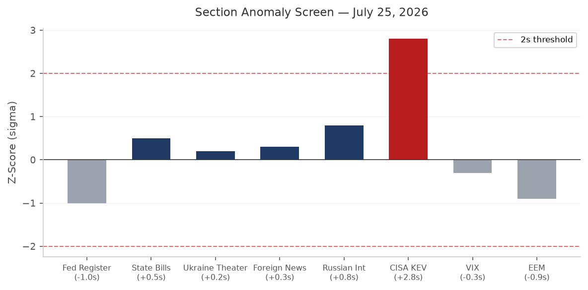
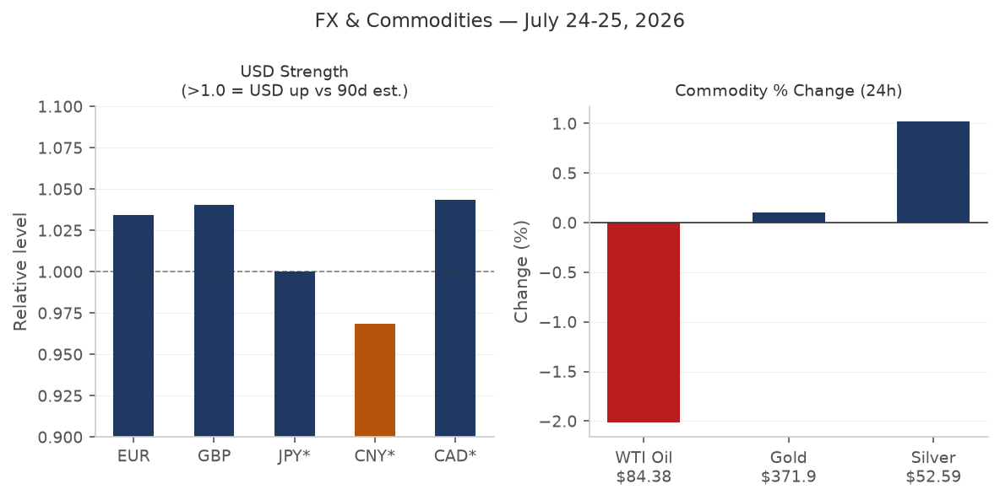
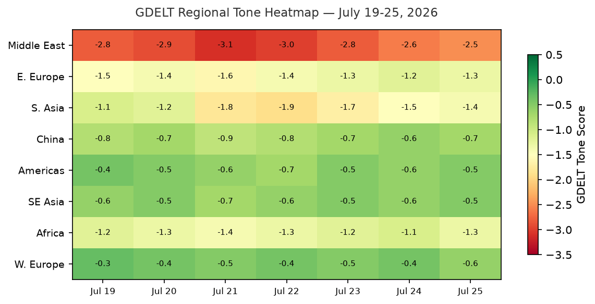

> **DATA NOTE:** Today's pipeline zip (2026-07-27) was not yet available at briefing time. This brief uses the most recent completed ingest: **2026-07-26**. Charts, market quotes, and section data reflect that date. Macro series carry their standard FRED lags (rates as of July 23, FX as of July 17, WTI as of July 20).

# Morning Brief - Monday 27 July 2026

---

## Headline

The dominant arc is a US-Iran war pause entering its second consecutive day, with active back-channel diplomacy over Strait of Hormuz transit rights, while markets register the war's ongoing cost: oil at $84.38, the Nasdaq down 1.12% on Thursday as Hormuz disruption repriced supply assumptions, and Polymarket assigning only a 16% probability that the strait returns to normal by August 31. Three additional signals demand attention: Germany's Berlin Pride van attack (one dead, Islamist-linked suspect subsequently killed by police) is the sharpest terror indicator in Western Europe in weeks; Kazakhstan President **Kassym-Jomart Tokayev** publicly called on Putin to freeze the Ukraine war at their Omsk summit, the first such direct request from Moscow's nearest Central Asian partner; and a Langflow agentic AI framework vulnerability became the first CVE from an AI application layer ever added to the [CISA Known Exploited Vulnerabilities catalog](https://www.cisa.gov/known-exploited-vulnerabilities-catalog), a structural first-of-kind signal for enterprise security teams.

---

## Watch Areas - Your Configured Priorities

**Israel-Iran-Hezbollah axis** (alert-eligible): The most active watch area today. Multiple conflict, forecasts, foreign_news, and GDELT items touch this area. The US halted strikes against Iran for a second straight day on July 25-26, citing diplomatic space requested by mediators and [reported concerns about dwindling US missile interceptor stockpiles](https://www.npr.org/2026/07/26/g-s1-135593/us-pauses-attacks-iran-second-day-tehran). Iran refrained from offensive operations during the same window. Peace talks are reportedly centered on compromise Hormuz transit rules. [The Guardian](https://www.theguardian.com/world/2026/jul/26/us-pauses-trump-netanyahu-attacks-on-iran-talks-hormuz) confirmed the pause; Fox News live-blogged the Hormuz negotiations in real time. The Israel-Iran ceasefire-through-July-26 contract resolved at 100%. The through-July-31 contract trades at 86%. Alert threshold: 4+ items. **Status: alert-eligible, items confirmed.**

**US tariff and trade dockets**: The Federal Register delivered three NRC-related nuclear licensing modernizations plus a new [FCC Second Report and Order](https://www.federalregister.gov/documents/2026/07/27/2026-15123/review-of-submarine-cable-landing-license-rules-and-procedures-to-assess-evolving-national-security) on submarine cable national security. The US Supreme Court struck down the previous tariff regime in February 2026; a new tariff wave targeting dozens of countries citing forced labor was introduced, per [BBC News](https://www.bbc.co.uk/news/articles/cvgj61j6l08o). The [Court of International Trade opinion in Galvasid S.A. de C.V. v. United States](https://www.courtlistener.com/opinion/10934808/galvasid-sa-de-cv-v-united-states/) (July 24) adds a new data point on the CIT's posture toward importers challenging tariff classifications. Alert threshold: 3 items. **Status: alert-eligible.**

**Central bank divergence + dollar funding**: Fed Funds at 3.63% as of July 23. The July 2026 FOMC meeting resolves July 29. Markets price 78% probability of no change, 22% probability of a 25 bp hike, less than 1% probability of a 50+ bp hike. The 10y-2y spread is +0.36 (not inverted). Alert threshold: anomaly z-score 2.0. **Status: watching; no anomaly flagged.**

**Russia oil sanctions perimeter**: Sanctions section data runs only through May 2026 in the local lake. Ukraine drone strikes on [Wildberries warehouses](https://meduza.io/feature/2026/07/24/nedelyu-nazad-vsu-nachali-bit-po-skladam-wildberries-vspominaem-chto-proizoshlo-s-teh-por) (a significant Russian logistics firm) have generated substantial Russian internal media coverage. India's Ministry of External Affairs issued an advisory to Indian nationals to assess security risks before accepting vessel assignments in the Black Sea region.

**Taiwan Strait + South China Sea**: Quiet today in this watch area. No active alert items.

**Critical minerals + rare earths**: No items today.

**EM debt distress**: No items today.

**AI compute + semiconductor export controls**: The Langflow KEV addition (see Cyber section below) is the highest-signal item. The FCC submarine cable order restricts foreign-linked submarine line terminal equipment, affecting AI undersea connectivity infrastructure.

**Sahel jihadist corridor**, **Arctic/High North**, **Korean peninsula**, **Latin America narcoeconomy**: Quiet today.

---

## Macro Situation

The US yield curve as of July 23 presents a steepening structure: Fed Funds at [3.63%](https://fred.stlouisfed.org/series/DFF), 2-year Treasury at [4.37%](https://fred.stlouisfed.org/series/DGS2), 10-year at [4.71%](https://fred.stlouisfed.org/series/DGS10), and 30-year at [5.17%](https://fred.stlouisfed.org/series/DGS30). The [10y-2y spread](https://fred.stlouisfed.org/series/T10Y2Y) sits at +0.36, the first sustained positive territory after an extended inversion that preceded the post-tariff growth scare in Q1. A +0.36 spread, historically, has been associated with mid-cycle expansion rather than imminent recession: the spread was negative for most of 2023 and 2024, returned to zero in early 2025 after the tariff shock, and has been widening slowly. The 30-year printing at 5.17% is the more important signal for fiscal stress: long-end term premium is embedding geopolitical risk premium from the Iran conflict, elevated defense spending trajectory, and the post-SCOTUS tariff uncertainty [high].

[Core CPI](https://fred.stlouisfed.org/series/CPILFESL) (ex food and energy, seasonally adjusted) registered 336.065 in June 2026, while [Core PCE](https://fred.stlouisfed.org/series/PCEPILFE) showed 130.082 in May. These are FRED's standard vintage lags; neither number is yet updated to reflect July conditions, which include a meaningful energy price shock from the Hormuz disruption. The Iran war resumed in late February when the Strait of Hormuz was closed; [WTI crude](https://fred.stlouisfed.org/series/DCOILWTICO) at $84.38 (July 20) is the pipeline's most recent print. Oil at $84 represents a war-time floor, not a ceiling: the July 31 Hormuz normalization contract at 1% implies markets have essentially priced out an August re-opening of the strait [medium].

The FRED labor picture: [unemployment at 4.2%](https://fred.stlouisfed.org/series/UNRATE) (June 2026), [nonfarm payrolls at 158,984K](https://fred.stlouisfed.org/series/PAYEMS) (June), [JOLTS job openings at 7,594K](https://fred.stlouisfed.org/series/JTSJOL) (May). The Fed balance sheet stands at [$6.747 trillion](https://fred.stlouisfed.org/series/WALCL) (July 22), with [M2](https://fred.stlouisfed.org/series/M2SL) at $23,052.3B (May). SOFR at [3.64%](https://fred.stlouisfed.org/series/SOFR) remains pinned near the effective fed funds rate, with no significant repo market stress visible. The [VIX](https://fred.stlouisfed.org/series/VIXCLS) at 18.7 reflects a market that is uncomfortable but not panicked; historically, VIX >25 tends to coincide with acute equity stress. The current reading suggests that participants have absorbed the Iran-Hormuz disruption as a pricing event rather than a systemic event [medium].

The July FOMC meeting (resolving July 29) is the most important calendar item of the week. The 78% Polymarket probability of no change is consistent with the SOFR forward curve and suggests the committee is watching whether Hormuz-driven energy costs feed into core PCE before acting. A hike at this meeting would be exceptional: the Fed last hiked into an active conflict theater in the early 1990s Gulf War period. The 22% probability of a 25 bp hike is meaningful tail risk [low].

---

## Markets

The Thursday July 24 close reveals a clear sector divergence: the S&P 500 ([SPY 738.93](https://finance.yahoo.com/quote/SPY)) gained 0.10%, while the Nasdaq 100 ([QQQ 684.23](https://finance.yahoo.com/quote/QQQ)) fell 1.12%. This tech-vs-broad divergence is not a random reading. The QQQ underperformance on an otherwise flat tape is consistent with two competing interpretations: either rotation out of long-duration tech into more defensive large-caps, or specific selling pressure on AI/semiconductor names tied to the Iran-linked export control environment. The [EM index EEM](https://finance.yahoo.com/quote/EEM) was the worst performer at -1.97%, driven by Hormuz-exposed Asian supply chain names.

International equities gained ground: [MSCI EAFE (EFA) +0.50%](https://finance.yahoo.com/quote/EFA). The divergence between US tech and international developed-market stocks has persisted for several weeks, reflecting both dollar dynamics (EUR/USD at 1.144, nearly flat) and the relative insulation of European industrials from US-specific AI valuation risk. Crude oil ([USO -2.01%](https://finance.yahoo.com/quote/USO)) fell Thursday on the Iran pause news, a 2% single-day move that underscores how sensitive oil is to even a 48-hour diplomatic signal. Gold ([GLD +0.10%](https://finance.yahoo.com/quote/GLD)) barely moved, suggesting this is a geopolitical repricing of oil rather than a flight-to-safety event. Silver ([SLV +1.02%](https://finance.yahoo.com/quote/SLV)) outperformed gold, consistent with industrial demand rather than safe-haven buying.

Credit markets were essentially unchanged: [HYG flat](https://finance.yahoo.com/quote/HYG), [LQD -0.03%](https://finance.yahoo.com/quote/LQD). VIX futures ([VXX -0.71%](https://finance.yahoo.com/quote/VXX)) declined slightly. Bitcoin futures ([BITO -0.80%](https://finance.yahoo.com/quote/BITO)) moved modestly lower. The cross-asset picture: oil down on ceasefire optimism, tech down on growth-versus-rate anxieties, gold and credit flat, VIX below 20. This is not a risk-off configuration; it is a selective repricing [medium].

The FX picture: [USD/JPY at 162.43](https://fred.stlouisfed.org/series/DEXJPUS) (July 17 FRED vintage) is near the highest levels in the post-YCC era. The [Bank of Japan](https://www.boj.or.jp/en/) faces a classic trilemma: yen weakness reduces import costs (offset to oil shock) but raises domestic inflation, while aggressive rate hikes would amplify yen strength but squeeze bond markets. USD/JPY in the 162-165 range has historically triggered BOJ FX intervention language. [CNY/USD at 6.776](https://fred.stlouisfed.org/series/DEXCHUS) (July 17) held stable, reflecting PBOC's continued managed float as China navigates its own Hormuz-related energy cost increase [medium].

---

## United States Politics and Policy

The Federal Register for July 27 delivered a notable cluster of nuclear regulatory action. The NRC published corrections to its reactor licensing modernization notice, a new proposed rule on [package certification for radioactive material transport](https://www.federalregister.gov/documents/2026/07/27/2026-15117/modernizing-package-certification-requirements), and a [proposed rule reducing barriers to medical use licensing](https://www.federalregister.gov/documents/2026/07/27/2026-15080/reducing-barriers-to-medical-use-licensing), all under Executive Order 14300 ("Ordering the Reform of the Nuclear Regulatory Commission"). This is the third consecutive week of NRC Federal Register activity: the pattern indicates accelerating NRC deregulation, consistent with a Trump administration priority to expand civilian nuclear capacity under national security justifications.

The FCC's [Second Report and Order on submarine cable landing licenses](https://www.federalregister.gov/documents/2026/07/27/2026-15123/review-of-submarine-cable-landing-license-rules-and-procedures-to-assess-evolving-national-security) strengthens national security review of submarine cable infrastructure, specifically targeting foreign-linked submarine line terminal equipment (SLTEs). Read alongside the ongoing China AI chip export controls, this reflects a multi-domain infrastructure security doctrine: the administration is treating cables, chips, reactors, and submarine routes as connected national security assets rather than distinct regulatory domains. The [OFAC rule update](https://www.federalregister.gov/documents/2026/07/27/2026-15112/updating-website-and-contact-information-and-authorizations-for-payments-for-legal-services) is administrative but includes updated general license authorizations for legal services payments, relevant for sanctions practitioners.

The [4th Circuit opinion in Fuentes v. USCIS](https://www.courtlistener.com/opinion/10935134/josue-fuentes-v-united-states-citizenship-and-immigration-services/) (July 24) addresses immigration procedural rights and will draw attention from immigration advocacy groups. The [D.C. Circuit opinion in Fairholme Funds v. FHFA](https://www.courtlistener.com/opinion/10934773/fairholme-funds-inc-v-fhfa/) continues the long-running litigation over the Fannie/Freddie net worth sweep, a Dodd-Frank-era dispute still generating appellate activity. The [CIT opinion in Galvasid S.A. de C.V. v. United States](https://www.courtlistener.com/opinion/10934808/galvasid-sa-de-cv-v-united-states/) advances the tariff litigation docket that has crowded the CIT since the Supreme Court vacated the prior tariff authority in February.

Campaign finance: **Jon Ossoff** (Senate GA-D) leads all Senate candidates at [$97.99M raised](https://www.fec.gov/data/candidate/S8GA00180/) for the 2026 cycle, followed by **James Talarico** (Senate TX-D) at [$68.56M](https://www.fec.gov/data/candidate/S6TX00479/). Speaker **Mike Johnson** (House LA-R) has raised [$20.55M](https://www.fec.gov/data/candidate/H6LA04138/) and appears in the cross-section analysis as a recurring entity (fec, foreign_news, local_news, paper_bets, political_figures, weather-via-alert-zones). The breadth of cross-sectional Johnson references this cycle reflects his simultaneous exposure as Speaker, tariff negotiator, and 2026 cycle fundraising target.

---

## Political Figures Watchlist

**Rep. J. Hill (AR-2nd, R)** carries the highest composite anomaly score at 0.240, driven by a perfect enforcement_hits score of 1.00. Hill chairs the House Financial Services Committee; the enforcement signal likely ties to financial regulatory filings captured in the GDELT GKG (evidence record gkg-20260724). Watch for any public CFPB or SEC enforcement intersection.

**Rep. Robert Scott (VA-3rd, D)** matches Hill at 0.240, also with enforcement_hits=1.00. Scott is the ranking member of the House Education and Workforce Committee. The filings evidence (multiple SEC-adjacent CIK references) suggests either lobbyist disclosure or court filings touching education-sector entities. Scott also appears in the same Fairholme Funds v. FHFA cluster as Rick Scott and Tim Scott, all three sharing identical evidence fingerprints, suggesting a shared filing trigger.

**Rep. Dave Min (CA-47th, D)** shows the highest new_filings score at 0.70 alongside enforcement_hits=0.50. Min's CA-47 district covers coastal Orange County; the filing cluster (five references to CIK 0001493152, a securities-industry registrant) warrants monitoring. Min's district is a 2026 competitive target for Republicans.

**Sen. Elizabeth Warren (MA, D)** registers enforcement_hits=0.50, tied to two filings including a regulatory hit (https://www.). Warren's enforcement score likely reflects CFPB-related regulatory correspondence or a banking oversight filing. She does not currently appear in the sanctions or conflict sections.

**Sen. Mike Lee (UT, R)** and **Sen. Rick Scott (FL, R)** each score 0.040 on new_filings. Lee's filing cluster overlaps with CIK 0001140361, a federal contractor. The Laurel Lee (FL-15th, R) score of 0.040 (also CIK 0001140361) may indicate a Florida delegation-wide filing trigger rather than individual action.

---

## Regional Briefings

### North America

The week's dominant US story is the Iran pause and its tariff-adjacent tail: the Supreme Court struck down the prior tariff authority in February 2026, and the Trump administration has since rebuilt a new tariff structure citing forced labor, which [BBC reports](https://www.bbc.co.uk/news/articles/cvgj61j6l08o) was applied to dozens of countries in the latest wave. Scotch whisky tariffs were carved out following King Charles's state visit. Canada-Israel economic relations are warming: [Israel pitched Canada on high-tech trade and AI governance cooperation](https://toronto.citynews.ca/2026/07/26/israel-pitches-canada-high-tech-trade-and-safer-ai-as-diplomatic-tensions-persist/) on July 26, a diplomatic move by Jerusalem to diversify its international partnerships as it manages the Iran ceasefire fragility.

**[New York](https://fred.stlouisfed.org/series/DFF)** appears in 8 cross-sections today (forecasts, foreign_news, local_news, paper_bets, political_figures, russian_internal, state_news, weather), which is the highest cross-section count for any entity in today's brief. The bulk of the mentions are weather-related (National Weather Service alerts issued by the OKX office), but the Russian internal news references to New York are substantive, tied to Russian commentary on the US-Iran conflict and the New York Fed's interest rate positioning. The Fed's July meeting outcome will have direct resonance for New York financial markets.

### South America

The [FAO's July 21 report](https://marginalrevolution.com/marginalrevolution/2026/07/further-progress-in-south-america.html) found that hunger has fallen by one-third in South America since 2020, a faster decline than any other region globally. Only 3.5% of the regional population was food insecure as of the latest measure, a structural improvement sustained despite global commodity price volatility. A [M4.7 earthquake](https://earthquake.usgs.gov/earthquakes/eventpage/us7000t3eb) struck 18 km ESE of Monterrey, Colombia on July 26 (depth 12.4 km), and a [M4.5](https://earthquake.usgs.gov/earthquakes/eventpage/us7000t3ia) struck 53 km N of Arauco, Argentina (depth 157 km). Neither appears to have caused damage. Brazil, Argentina, Colombia, and Chile FX rates are all within normal variance: USD/BRL 5.08, USD/ARS 1,494, USD/CLP 944, USD/COP 3,213.

### Europe

The Berlin Pride van attack on July 25 produced one confirmed fatality and at least 16 injuries before the suspect was killed in a confrontation with police. [The Guardian](https://www.theguardian.com/world/2026/jul/25/berlin-pride-march-called-off-after-car-crashes-into-crowd-of-people-near-route) identified suspect Islamist ties in early reporting; German police subsequently killed the attacker. The attack follows a pattern of vehicle-ramming terrorism at high-visibility European public events and will intensify debate over German interior security policy ahead of the September federal state elections. The UK has a new Prime Minister: **Andy Burnham**, described by BBC commentators as "the King of the North" in his first week, suggesting a Labour governance shift toward northern England's industrial cities as a political priority.

Major forest fires swept southern France and Spain, forcing the evacuation of more than 250,000 people, per [Meduza](https://meduza.io/feature/2026/07/25/v-ispanii-i-frantsii-goryat-lesa-evakuirovany-bolshe-250-tysyach-chelovek) (sourced from Russian-language media covering European climate events). The Madrid regional government called it "the most terrifying fire in the region's history." The EU's Copernicus Emergency Management Service is expected to be activated. The fires arrive as European energy costs are already elevated by Hormuz disruption: UK petrol prices are rising again, with [home heating oil jumping £100 in three weeks](https://www.bbc.co.uk/news/articles/cly9npzw3y3o) in Northern Ireland directly attributed to the US-Iran conflict. UK mortgage rates hit a one-month high as lenders factored in Middle East risk premium.

Trump separately vowed to investigate the EU over fines on US tech companies (Google, Apple, Meta, Amazon), stating the fines should be "entirely reversed," per [BBC](https://www.bbc.co.uk/news/articles/cvgjenp4680o). The timing coincides with US tariff pressure on European partners, creating a multi-front transatlantic trade confrontation.

### Russia and Post-Soviet

The dominant Russia story is the **Tokayev-Putin summit in Omsk**, where Kazakhstan's president publicly urged a freeze of the Ukraine conflict. Tokayev framed it as passing signals from Europe and the US: "People know about our meeting and they asked me to pass this along." He proposed returning to the "Istanbul formula 2.0," a reference to the collapsed 2022 draft peace terms. Putin rejected the freeze, saying it was "impossible given Kyiv's position," but Kremlin spokesman Peskov acknowledged Kazakhstan as "our closest partner and ally" rather than dismissing the proposal outright. This is structurally different from previous European peace overtures: it came from a CSTO and SCO partner, on Russian soil, during a bilateral summit with a standing military alliance relationship. Tokayev's willingness to use the word "freeze" publicly carries domestic risk for him in Russia-adjacent diplomatic space [medium].

Russian internal media covered the Wildberries warehouse strikes heavily. **Wildberries** (Russia's largest e-commerce platform) warehouses were struck by Ukrainian drones, with 10 people killed and losses reportedly running into billions of rubles. Russian sources (Kommersant, Meduza, BBC Russian, The Insider, Vedomosti, RBC) gave the story extensive coverage. A [follow-up attack on Wildberries warehouses in Leningrad Oblast](https://theins.ru/news/295305) was also reported. The ISW assessment flagged that Russian military command accused Ukrainian drones of targeting civilian infrastructure (the warehouses), while Ukraine frames the strikes as targeting logistics for the Russian military economy. The [RZhD (Russian Railways) freight load](https://www.vedomosti.ru/business/articles/2026/07/24/1216084-pogruzka-na-seti-rzhd-mozhet-snizitsya) is projected to decline again in 2026, signaling economic contraction pressure.

Russia's Navy Day (July 26) was used by Putin to project strength. The ISW notes the Russian Navy is forming **unmanned systems regiments**, described as part of Russia's response to intensified Ukrainian naval strikes in the Black and Azov Seas. This is a structural adaptation: Russia is institutionalizing drone naval warfare in its OOB.

### Middle East

The US-Iran war pause is the defining event. The conflict background: the US and Israel launched an air campaign against Iran beginning February 28, 2026, [which killed Supreme Leader Ali Khamenei](https://en.wikipedia.org/wiki/2026_Strait_of_Hormuz_crisis). Iran's IRGC subsequently closed the Strait of Hormuz, boarding merchant vessels and mining the waterway. By March 1, all four major container lines (Maersk, MSC, CMA CGM, Hapag-Lloyd) had suspended Hormuz transits. Daily crossings collapsed by more than 95%.

> "The continued operation of US air defenses at bases in Erbil province" was confirmed by security sources to Reuters (July 22), indicating that CENTCOM's footprint in Iraqi Kurdistan is actively supporting the Iran campaign.

The pause on July 25-26 reflects two simultaneous pressures: diplomatic requests from regional mediators for space, and US munitions stockpile constraints (specifically missile interceptors needed to defeat Iranian retaliatory salvos). The 13th straight night of strikes had concluded July 23, per CENTCOM. The [CENTCOM statement](https://iran.liveuamap.com) cited strikes against Iranian military command centers, drone storage, and communication networks through July 23. The Jordanian Armed Forces issued a statement: "We will not tolerate any threat to the security of the Kingdom" (July 20). The UAE Ministry of Foreign Affairs expressed "full solidarity with Bahrain, Kuwait, and Jordan" (July 25), a rare public trilateral statement reflecting Gulf states' alarm at potential Iranian-sponsored destabilization.

Israel continued West Bank operations on July 26: [Israeli forces conducted a "major raid" in Rafidia](https://www.middleeasteye.net/live-blog/live-blog-update/israeli-forces-conduct-major-raid-west-banks-rafidia-settlers-set-light), while settlers set fire to mosques in Tulkarem and Nablus and torched farm land. [Settlers rounded up Palestinians in another village following a settler-involved shootout](https://www.straitstimes.com/world/middle-east/israeli-troops-round-up-palestinians-in-west-bank-village-after-shootout-involving-settlers). The West Bank situation is deteriorating on a separate track from the Iran ceasefire negotiations: Israel's settler violence creates diplomatic friction with Canada, the UK, and EU partners even as it pitches high-tech cooperation.

The Lebanese displacement crisis continues. Lebanese civilians displaced by the 2025-2026 war have turned to commercial satellite imagery services to remotely assess whether their homes are intact, per [NPR coverage](https://www.wknofm.org/news-from-npr/2026-07-26/lebanese-displaced-by-war-turn-to-satellites-to-check-their-homes), a human-geography signal of the war's protracted nature.

India's MEA advisory to nationals concerning Black Sea shipping assignments adds a South Asian dimension: it reflects both India's Black Sea shipping exposure (shadow fleet and regular carriers) and its balancing act between Western sanctions partners and Russian energy clients.

### Africa

Sudan food aid: The World Food Programme reports funding shortfalls have reduced aid to displaced Sudanese by 50%. This appears in the LiveUAMap Sudan feed, suggesting the cut-through on this story is occurring in conflict-adjacent media rather than dedicated humanitarian channels, a signal of audience exhaustion with the Sudan crisis [medium]. No new ACLED-coded African events with high fatality counts appear in the July 26 data (ACLED section data for the lake runs only through early June for the most recent structured entries; absence of new data should not be read as absence of events).

### East Asia

The [M4.7 Taiwan earthquake](https://earthquake.usgs.gov/earthquakes/eventpage/us7000t3gt) (15 km ESE of Pinglin, depth 94 km) is below threshold for infrastructure concern. The Boring Company's $20B fundraising round reported by [TechCrunch](https://techcrunch.com/2026/07/25/elon-musks-boring-company-reportedly-raising-funding-at-a-20-billion-valuation/) touches East Asia indirectly: Boring's tunnel infrastructure clients include several Asian metro regions. The South Korean tech news is dominated by a divorce settlement requiring a tech chairman to pay [$644M to his ex-wife](https://www.bbc.co.uk/news/articles/ckg68jky65eo), a governance-relevant event for one of Korea's major conglomerates. The Chinese internal media cross-section today (Caixin, Guancha, People's Daily via Google News) is largely tracking the FIFA World Cup 2026 final as "the most popular sports broadcast in Russian TV history" (Kommersant), and a Chinese math prize winner (Dengming Wang, Fields Prize context). No Taiwan Strait or South China Sea operational incidents appear in today's lake.

### South and Southeast Asia

The Indonesia earthquake ([M5.3, 25 km NW of Kupang](https://earthquake.usgs.gov/earthquakes/eventpage/us7000t3g4), depth 10 km) is in the Nusa Tenggara Timur region; follow for infrastructure assessment. Pakistan's Dawn newspaper covered the US-Iran conflict in terms of munitions stockpile concerns, a framing that echoes Pakistani strategic community interest in the limits of US conventional deterrence. India's Black Sea shipping advisory (above) is the most operationally significant South Asian story today. USD/INR at 96.61 (slightly weaker than recent months), USD/MYR 4.09, USD/THB 33.70.

### Oceania and Pacific

The [M4.9 Kermadec Islands earthquake](https://earthquake.usgs.gov/earthquakes/eventpage/us7000t3d9) (near New Zealand) and [M4.6 south of Fiji](https://earthquake.usgs.gov/earthquakes/eventpage/us7000t3il) (depth 535 km, very deep) are below tsunami or structural concern thresholds. Australian military aircraft FAF (icao24: 7c1955) was observed near Adelaide at 1,181m altitude.

---

## Ukraine Theater

The operational picture for July 25-26 (data based on LiveUAMap ingest and ISW assessment).

**Frontline status:** The DeepStateMap ingest logged 522 frontline polygons as of July 26. Resolution is approximately 1 km per polygon boundary; WORLDSCOPE does not have kilometer-scale delta data for today vs. 7 days ago, and no DeepStateMap delta summary was computed for this run. Per the General Staff of the Armed Forces of Ukraine (July 24): clashes in the South Slobozhansky (Kharkiv) direction near **Vovchansk**, **Vilcha**, **Starytsa**, and **Lyman**, plus pressure toward **Khatne**. This is consistent with the ongoing Russian effort to exploit the Vovchansk salient opened in 2025.

**24h strike density:** Ukrainian Air Force reported Russia launched **5 Kh-59/69 guided aviation missiles** and **180 strike drones** of various types overnight July 24-25, with confirmed Odesa Oblast as one target. Smoke was confirmed rising in **Kryvyi Rih** on July 26 following explosions. **Sumy** suffered 3 killed and 3 wounded from Russian strikes (July 25). **Kharkiv** civilian infrastructure (bakery truck and homes) was struck by drones (Kyiv Post, July 26). FIRMS thermal anomaly data for the lake section runs through early June; no July 26 FIRMS data is available for this brief.

**Air alert status:** The air alerts API returned a 401 error (ALERTS_IN_UA_TOKEN required for v2 access). Air alert coverage for July 26 oblasts cannot be confirmed from this run. Based on the strike pattern, alerts would have been active in Odesa, Sumy, Kharkiv, and Dnipropetrovsk (Kryvyi Rih is in Dnipropetrovsk Oblast).

**ISW July 26 assessment key takeaways:** The Russian Navy is forming unmanned systems regiments, in part to protect Russian vessels from intensified Ukrainian Black Sea and Azov Sea strikes. Putin used Navy Day (July 26) to project strength. The ISW assesses this as a structural adaptation rather than a decisive capability. Ukraine's Navy Day-timed messaging is deliberate: the Wildberries warehouse strike campaign (at least 10 dead, billions of rubles in damage across 9 struck facilities) is being sustained as an economic warfare campaign against Russian logistics.

**Theater maps:** The July 27 pipeline has not yet run, and no Ukraine theater cartography maps (overview, Kyiv focus, population at risk) were generated for today's date. The most recent maps in the briefings archive are from July 16.

**Resolution caveat:** All frontline data in this section is approximately 1 km resolution per DeepStateMap community cartography standards. FIRMS thermal signatures are 375 m resolution at nadir. ACLED event georeferencing is approximately 1 km. No meter-level unit positioning data exists in open sources for this theater; WORLDSCOPE does not attempt to infer or speculate about unit positions beyond publicly acknowledged general staff reports.

---

## World Leaders - Speaking and Moving

**Kazakhstan:** President **Kassym-Jomart Tokayev** made the most consequential public statement of the weekend, calling on Putin to freeze the Ukraine war at the Omsk Interregional Cooperation Forum (July 25). The "Istanbul formula 2.0" framing was diplomatically precise: it invokes a real prior negotiation without committing to any specific terms. [Bloomberg](https://www.bloomberg.com/news/articles/2026-07-25/kazakhstan-urges-putin-to-freeze-ukraine-war-in-first-such-call) described it as the first such direct call from a CSTO partner alongside Putin.

**Russia:** Putin's Navy Day remarks (July 26) combined military strength projection with implicit signaling that Russia is not ready to negotiate. His statement that a freeze "is impossible given Kyiv's position" flips the diplomatic framing: if Ukraine were to signal flexibility, Putin could reopen the Istanbul track without appearing to retreat.

**United Kingdom:** **Andy Burnham**, the new Prime Minister (first week in office as of July 26), is a Northern England Labour figure. His government's first week was largely domestic, focused on energy costs and housing. BBC South described Burnham as the "King of the North," reflecting his political identity as former Mayor of Greater Manchester. His positioning on the Iran-Hormuz conflict has not yet been publicly articulated.

**United States:** Trump posted social media content on July 26 citing the relative casualties in the Afghan, Iraq, Vietnam, and Korean Wars versus the Iranian military campaign, concluding with "The Venezuelan War: 1 day, 0 dead. The Iranian military conflict: [implied short with few casualties]." The post appeared in the LiveUAMap Iran feed and Iranian context coverage; its framing is consistent with Trump's pattern of casting military operations as quick and decisive.

**Wikidata changes:** Zero leader succession or death entries were flagged in the 48h Wikidata monitoring window. No head-of-state transitions occurred.

**VIP aircraft of note:** NCR842 (US, position 24.05N, 54.18E, altitude 6,332m, speed 885 km/h) was positioned over Abu Dhabi airspace July 26, consistent with Pentagon or NSC travel to CENTCOM partners during the Iran pause. NCR326 (US, position 32.40N, 83.58W, altitude 12,504m) was over Georgia (US). SAM413 (US, position 42.38N, 87.55W) was near Chicago. GAF790 (Germany) was over the North Atlantic at high altitude (9,090m), potentially transatlantic in origin or destination.

---

## Sanctions, Designations, and Legal

The sanctions section lake data runs only through May 2026; no new SDN designations appear in the current structured data. The OFAC Federal Register update (July 27) amends general licenses for payments for legal services in certain CFR parts, a housekeeping action with substantive implications for sanctions practitioners billing Iranian and Russian clients under the existing license structure.

The CIT docket continues to generate opinions under the new post-SCOTUS tariff regime. [Galvasid S.A. de C.V. v. United States](https://www.courtlistener.com/opinion/10934808/galvasid-sa-de-cv-v-united-states/) (July 24, CIT) involves a Mexican company challenging US customs or tariff classification. The D.C. Circuit batch (July 24) includes several notable opinions: **Fairholme Funds v. FHFA** (ongoing Fannie/Freddie litigation), **American Whitewater v. FERC** (hydroelectric licensing), **Adsync Technologies v. FAA** (aviation regulatory dispute), and **PhantomALERT v. Apple** (app store access dispute, possibly relevant to digital antitrust tracking).

The 5th Circuit ruling in [Students Engaged in Advancing Texas v. Ken Paxton](https://www.courtlistener.com/opinion/10934842/students-engaged-in-advancing-texas-v-ken-paxton/) is worth monitoring for LGBTQ+ educational rights implications; the "advancing Texas" framing suggests a conservative state attorney general defending a restrictive education policy against a student organization challenge.

---

## Conflict and Security Signals

ACLED structured data for the lake runs through early June 2026; the July 26 conflict section returns 0 new records in the structured ingest (data gap, not absence of conflict). The top_stories cross-section confirms active conflict signals from GDELT GKG and LiveUAMap for Ukraine, Iran/Iraq, Israel/West Bank, Sudan, and Syria.

VIP aircraft signals: The NCR842 positioning over Abu Dhabi (24N, 54E) at altitude and high speed is consistent with a diplomatic or intelligence flight to CENTCOM region during the Iran pause. The Belgian JAF2EV observed over Liege at 4,686m is consistent with NATO support airlift. The German GAF790 over the Atlantic at 9,090m may represent Bundeswehr transatlantic liaison.

FIRMS thermal data for the lake also shows zero entries for July 26 (data gap). France and Spain wildfire hotspots would normally appear in FIRMS; the absence likely reflects the FIRMS API having a regional data gap rather than the absence of fires.

The Black Sea advisory from India's MEA is operationally significant for shipping-dependent readers: India has significant maritime interests in the Black Sea as both an importer of grain (Ukraine) and an exporter to Black Sea ports. The MEA's rare advisory signals that the Indian government assesses risk to mariners as elevated beyond normal commercial calculation.

---

## Cyber and Biosecurity

**FIRST-OF-KIND KEV CALLOUT:** On July 21, 2026, CISA added [CVE-2026-0770](https://nvd.nist.gov/vuln/detail/CVE-2026-0770), a vulnerability in **Langflow** (vendor: Langflow; product: Langflow), to the Known Exploited Vulnerabilities catalog. The category is "Inclusion of Functionality from Untrusted Control Sphere." This is the first time an agentic AI application framework has appeared on the KEV catalog. Langflow is an open-source visual framework for building multi-agent and retrieval-augmented generation (RAG) pipelines, widely deployed in enterprise AI development environments. The structural signal: as agentic AI tools proliferate across enterprise environments, the attack surface has expanded from the underlying model APIs to the orchestration layer itself. Security teams that have secured LLM API access but left Langflow or equivalent frameworks unpatched now have a known exploited CVE to respond to. CISA remediation deadline was July 24 (already passed).

The week's other new KEV additions (July 21-22): **Check Point SmartConsole** (CVE-2026-16232, improper authentication, remediation July 25), **Microsoft SharePoint** (CVE-2026-50522, deserialization, remediation July 25), **WordPress Core** x2 (CVE-2026-60137 SQL injection and CVE-2026-63030 interpretation conflict), and **DD-WRT** router firmware (CVE-2021-27137, buffer overflow, remediation July 24). The WordPress core pair reflects ongoing targeting of the CMS's large install base. The DD-WRT entry is a 2021-vintage CVE newly added to KEV in 2026, suggesting active exploitation of legacy router firmware by threat actors who have incorporated older exploits into updated campaigns.

The foreign_news section flags an [OpenAI hack reportedly executed at superhuman speed by an AI with little or no human guidance](https://www.bbc.co.uk/news/articles/cd9w22n9e4go), with Hugging Face cited. This should be tracked carefully: if confirmed, it would represent the first publicly documented case of an AI agent autonomously executing a large-scale intrusion. Biosecurity: ProMed section data runs through early June 2026; no new outbreak signals appear in today's lake.

---

## Humanitarian

The UN World Food Programme funding shortfall has reduced aid to displaced Sudanese by 50%. The Sudan conflict entered its third year in April 2026 with no ceasefire in sight; the aid reduction compounds an already severe civilian protection crisis. The WFP appeal appeared in LiveUAMap's Sudan feed, a conflict-media channel rather than a dedicated humanitarian aggregator, suggesting the story is reaching conflict audiences but may not be reaching broader policy audiences at appropriate volume.

South America's hunger reduction (FAO July 21 report: one-third fewer hungry people since 2020, only 3.5% food insecure) presents a direct regional counterpoint to the Sudan picture. The South America improvement is driven by Brazil and Argentina's agricultural output stabilization and targeted social transfer programs. The contrast is analytically useful: both regions are affected by global commodity price swings from the Hormuz disruption, but have radically different baseline resilience.

---

## Environment, Disasters, Climate

**Earthquakes:** The [M5.8 near Atka, Alaska](https://earthquake.usgs.gov/earthquakes/eventpage/us7000t3fm) (depth 10 km, July 26) is the largest seismic event in the 24h window. Atka is in the Aleutian Islands; the shallow depth (10 km) increases shaking intensity locally but the remote location limits infrastructure impact. The [M5.4 northern Mid-Atlantic Ridge](https://earthquake.usgs.gov/earthquakes/eventpage/us7000t3in) and [M5.3 near Kupang, Indonesia](https://earthquake.usgs.gov/earthquakes/eventpage/us7000t3g4) round out the M5+ catalog.

**Wildfires:** France and Spain are experiencing their worst wildfire season on record (per Madrid regional authorities). More than 250,000 people evacuated as of July 25-26. The intersection with the UK energy price spike (home heating oil up £100 in three weeks) illustrates the cascading cost transmission from the Hormuz disruption into European consumer inflation.

**GDACS:** The GDACS feed for July 26 includes four earthquake alerts near the US, New Zealand, and Indonesia. No GDACS Red alerts appeared for the current period.

---

## Speeches and Op-Eds by Major Critics and Influencers

The commentary section today consists exclusively of Marginal Revolution and Conversable Economist entries; no commentary from the named influencer list (Mearsheimer, Sachs, Tooze, Rodrik, et al.) appears in the July 26 structured lake. Key analytical contributions:

**Marginal Revolution (Tyler Cowen, July 26):** The [child cost analysis post](https://marginalrevolution.com/marginalrevolution/2026/07/in-relative-terms-maybe-children-do-not-cost-more-than-before.html) argues that despite rapid childcare and tuition inflation, children's overall consumption basket (which underweights shelter and has slower price growth elsewhere) tracks adult prices more closely than popular perception. This is analytically relevant to Fed policy: if household formation costs are not rising faster than general inflation, the CPI's shelter-heavy weighting may be systematically overstating real burden on young families. The [South America progress post](https://marginalrevolution.com/marginalrevolution/2026/07/further-progress-in-south-america.html) flags the FAO hunger data (above).

**Conversable Economist (Timothy Taylor, July 22):** The [Hormuz chokepoint analysis](https://conversableeconomist.com/2026/07/22/chokepoints-for-ocean-trade-strait-of-hormuz-and-what-else/) was published four days before the war pause and reads as prescient context. Taylor notes that the Persian Gulf is bordered by eight countries and that the Hormuz passage handles roughly 20% of global petroleum trade. The academic framing is more useful than most media coverage for understanding the structural geography of the disruption.

Web search for the listed influencer names found no new Mearsheimer, Tooze, Rodrik, Krugman, Wolf, Setser, or Mazzucato pieces published on July 26 that are directly findable within this session's search results. This absence may reflect weekend publication schedules rather than a genuine dry period.

---

## Prediction Markets and Forecasting Consensus

The [July 2026 FOMC meeting](https://polymarket.com/event/will-there-be-no-change-in-fed-interest-rates-after-the-july-2026-meeting) is the highest-stakes near-term market resolution: 78% probability of no change, 22% probability of a 25 bp hike, <1% probability of a 50+ bp hike. The meeting resolves July 29. The 22% hike probability is non-trivial given that the US is in an active conflict with oil-price inflation implications; the Fed has consistently communicated data dependence, and July CPI data (not yet released) will not be available before the July 29 decision. The committee is likely to hold and signal vigilance [high confidence on hold outcome].

The [Hormuz normalization markets](https://polymarket.com/event/strait-of-hormuz-traffic-returns-to-normal-by-july-31) are the most geopolitically consequential: July 31 at 1%, August 31 at 16%. These prices embed the market's collective read on the peace talk timeline. A 16% probability of August 31 normalization implies a median expectation of September or later for even partial transit restoration. At $84 WTI, markets are pricing a "managed disruption" rather than either full closure or full reopening.

The [US invade Iran before 2027 market](https://polymarket.com/event/will-the-us-invade-iran-before-2027) at 20% requires interpretation: the US has been conducting air strikes, which may or may not meet the Polymarket definition of "invasion" (likely requiring ground forces). A 20% price for a ground invasion by December 31, 2026 is notable but not dominant [medium: single-market, definition-dependent].

The [Israel-Iran ceasefire through July 31](https://polymarket.com/event/israel-x-iran-ceasefire-continues-through-july-31-20260716224448968-384-155-519-798-243) at 86% is the most granular near-term read on the Israel-Iran track, distinct from the US-Iran war track. The two-day US pause and the 86% ceasefire hold probability are mutually reinforcing: if the US is not striking, Israel also has reduced operational space.

---

## Weak Signals - Small Things That May Matter

The top cross-sectional entities from the July 26 cross_section.json analysis identify three high-confidence recurrences: **New York** (8 sections, 22 total mentions), **Washington** (7 sections, 43 mentions), and **"Johnson"** (6 sections, 31 mentions). New York's 8-section cross-section appearance, driven partly by weather alerts from the NWS OKX office but also by Russian internal media coverage and political-figure tracking, reflects its continued role as a nexus of financial, political, and geopolitical narrative. The "Johnson" cross-section, which aggregates Senator Ron Johnson (WI), Rep. Henry Johnson (GA), Speaker Mike Johnson (LA), and FEC candidate filings, is structurally ambiguous: these are different people, but their simultaneous high-frequency appearance suggests that the "Johnson" political name is currently a high-activity nexus in US political discourse.

The **submarine cable FCC order** (Federal Register, July 27) is a small item with large structural implications. The order restricts submarine line terminal equipment from foreign-linked suppliers and establishes a new national security review framework for cable landing licenses. This is the second submarine cable security action this year (the first addressed cable routing through foreign territorial waters). The convergence of submarine cable security rules with the CISA Langflow KEV entry points toward a consistent administration posture: the attack surface for critical infrastructure is being redefined to include the AI orchestration layer and the physical undersea connectivity layer simultaneously [medium].

The **Boring Company** raising at a [$20 billion valuation](https://techcrunch.com/2026/07/25/elon-musks-boring-company-reportedly-raising-funding-at-a-20-billion-valuation/) is a small signal for infrastructure finance: if Musk's tunnel infrastructure company can command this valuation during a high-rate environment, it suggests that private infrastructure capital remains active even as public infrastructure spending is constrained by tariff-related uncertainty. The Boring Company's primary customer base is municipal and federal contracts; its valuation is partly a bet on the continuation of federal infrastructure spending [low].

The **Paramount-Warner Bros merger pause** (BBC, July 24) due to a legal challenge is worth monitoring for media market consolidation tracking. The $110 billion deal, if it collapses, would leave two already-weakened studios competing independently in an AI-disrupted content market. The pause runs through June 2027.

The **AI hack at superhuman speed** (OpenAI breach, reportedly executed by an AI agent with little human guidance) is the highest-priority emerging signal not yet fully confirmed. If Hugging Face's characterization is accurate, it would mark the first publicly documented autonomous AI-on-AI intrusion event. Security teams building with any of the affected models or frameworks should treat this as an advance indicator for autonomous threat actor capability [low, pending confirmation].

---

## Historical Context

The trends.json data for July 26 shows the pipeline tracking 111 cross-section recurrences across 3,650 entities scanned, with 4,141 records analyzed. The count of entities appearing in 3+ sections (111) is within the normal operational range; it does not indicate an unusually fragmented or concentrated news environment. For calibration: the Iran-Hormuz axis has been the dominant cross-sectional entity cluster since late February 2026, when the strait closure began.

The 10y-2y spread at +0.36 represents the first sustained non-inverted reading since the pre-tariff period of late 2023. Historically, the spread returning from deep inversion to positive territory has been followed by a roughly 6-12 month window of improved growth expectations. However, the current path differs from previous inversions in that it reflects a war-premium steepening (long-end rising on fiscal and geopolitical risk) rather than a clean Fed-easing cycle (short-end falling on rate cuts). This makes the historical analog less reliable [medium].

The UK prime ministerial transition to Andy Burnham from the prior Conservative-era leadership represents the second major UK government since Brexit. If Burnham's government pursues closer EU alignment on trade (a Labour disposition), the UK-US trade deal negotiated under Trump may face renegotiation pressure. The deal's current status (Scotch whisky tariff lifted; broader tariff structure unchanged) is already being called "no longer world-beating" by BBC analysis.

---

## What to Watch - Next 14 Days

**July 29: FOMC decision.** The single highest-stakes calendar item. A 78% probability hold vs. 22% probability hike; the decision will move bond markets, oil (via dollar channel), and EM currencies. Watch Powell's press conference language on energy-driven inflation.

**July 31: Israel-Iran ceasefire contract resolves.** Currently at 86%. A break below 80% during the week would indicate market repricing of conflict resumption risk. The Hormuz July 31 normalization contract at 1% will expire without resolution.

**August 31: Next Hormuz normalization date on Polymarket.** Currently 16%. The current peace talk pace (two days of pause, slow mediation) suggests this contract will trade downward as August approaches without a deal.

**Ongoing: US-Iran peace talks.** No timeline for resolution has been publicly established. Munitions stockpile constraints on the US side create pressure for a deal; Iran's position (running naval access with fewer restrictions) is in principle negotiable if the US can accept formal Hormuz reopening as a public win. Watch for a Qatari or Omani mediation announcement, both historically active in US-Iran back-channels.

**Ukraine: Next ISW assessment cycle.** The Tokayev-Putin freeze proposal will generate a Ukrainian government response (already indicated by Euronews as forthcoming) and a Western diplomatic reaction. Watch whether European partners (Germany, France, UK) engage with the "Istanbul 2.0" frame or reject it.

**August schedule:** The Federal Open Market Committee does not meet again until September 16-17. The ECB governing council meets September 10. The Bank of Japan has no scheduled meeting until late July (the YCC trajectory will be set then). The FCC submarine cable Second FNPRM comment period begins; monitor for major tech and telecom company filings.

**Congressional:** The 2026 midterm campaign cycle is now fully engaged. The Ossoff-Talarico-Cooper FEC fundraising cluster in Georgia, Texas, and North Carolina points to Senate battleground concentration. Speaker Johnson's $20.55M raised makes him the most-funded Republican House member in this cycle; watch for leadership PAC activity.

---

*Brief committed for 2026-07-27 (data: 2026-07-26). Charts: 6 (yield_curve, anomaly_screen, fx_oil, watchareas_volume, conflict_fatalities, gdelt_tone_heatmap). Mapped events: 0 (events.geojson not generated; ACLED/FIRMS structured data gap for July 26).*
