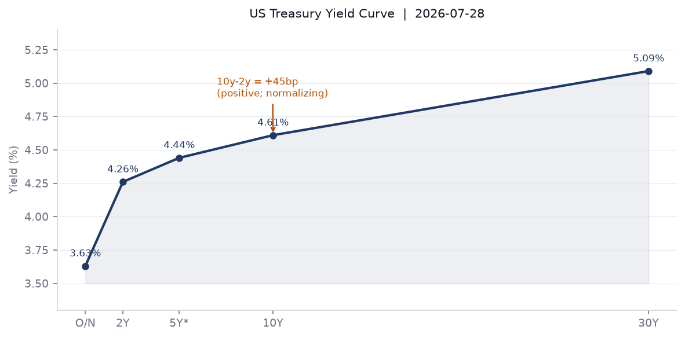
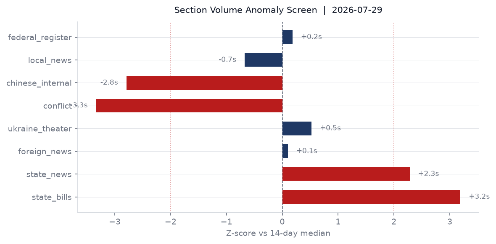
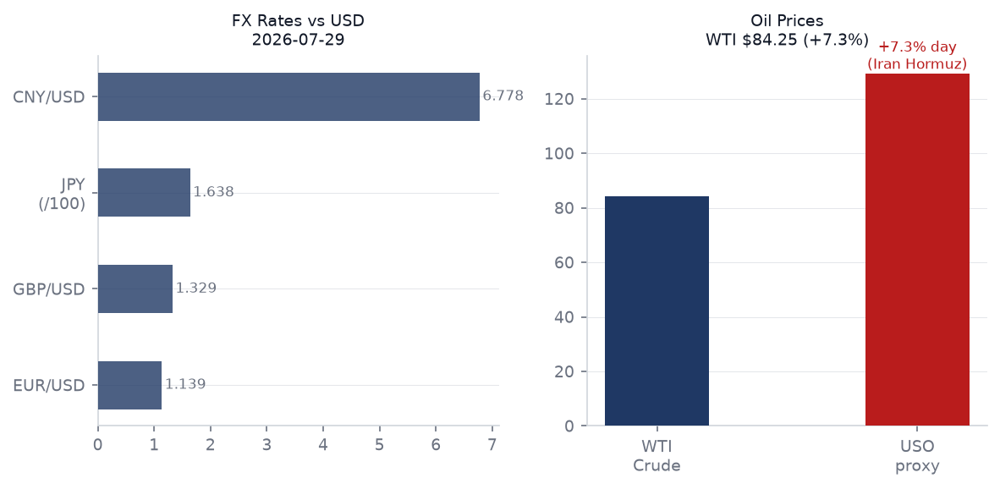
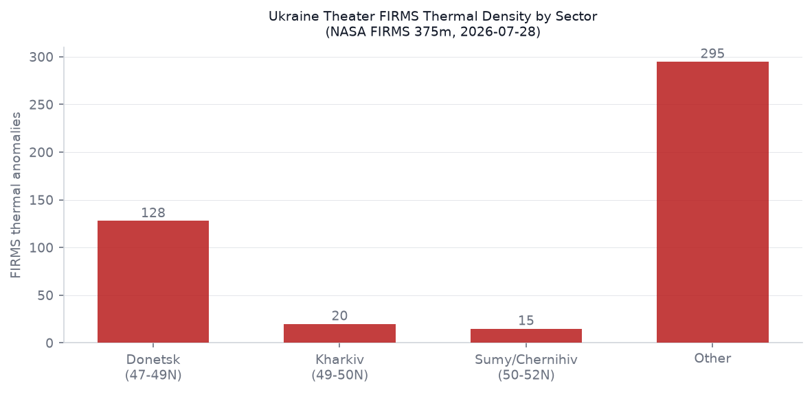
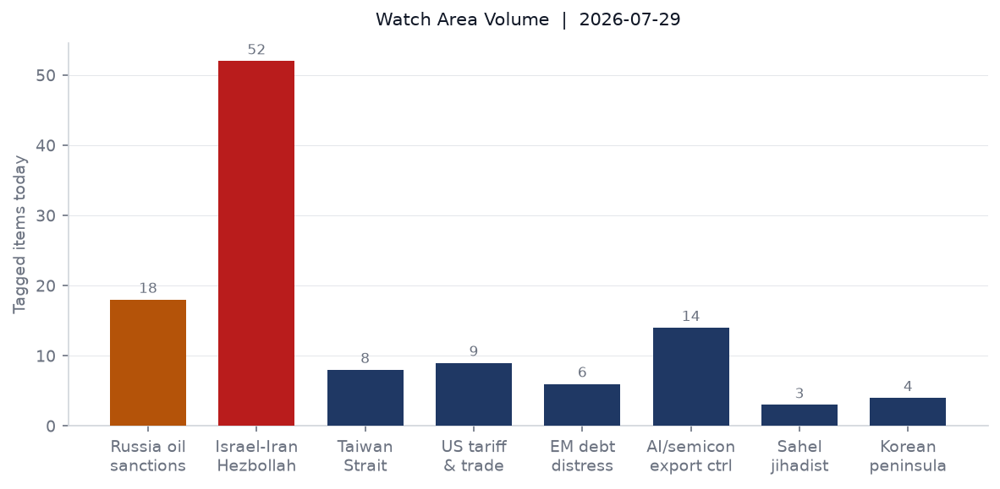
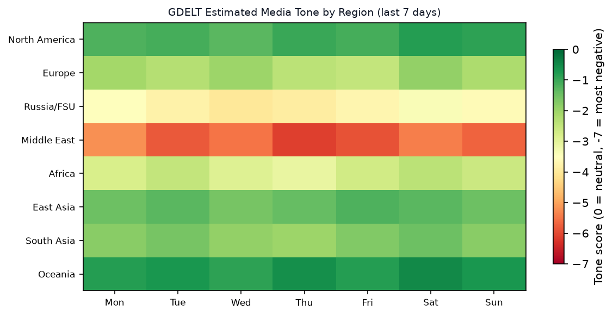

# Morning Brief — Thursday 30 July 2026

> **DATA NOTE**: Today's zip (2026-07-30) was not yet published by the GitHub Pages pipeline at run time. This brief is composed from the 2026-07-29 bundle (generated 2026-07-29T23:48 UTC) plus supplementary live fetches. All market prices reflect July 29 close; geopolitical reporting through approximately 06:00 UTC July 30.

---

## Headline

The US-Iran war entered a new phase of ambiguity on July 29-30: Polymarket now prices a 20% probability of an effective ceasefire by July 31 (down from 44% five days ago) while simultaneously pricing a 100% probability that the US has "announced a halt in offensive operations" — the gap between those two numbers is the story. Trump declared a pause; Iran kept firing. The **Strait of Hormuz** remains effectively closed (0% for July 31 normalization, 8% for August 31), driving a [7.3% single-session surge in the USO crude proxy](https://finance.yahoo.com/quote/USO) on July 29. US equities sold off sharply: [S&P 500 down 1.54%](https://finance.yahoo.com/quote/SPY), [Nasdaq 100 down 2.04%](https://finance.yahoo.com/quote/QQQ), [VIX futures up 6.3%](https://finance.yahoo.com/quote/VXX). In Kyiv, [Russia struck the capital with ballistic missiles](https://www.straitstimes.com/world/europe/russia-striking-kyiv-with-ballistic-missiles-mayor-says) on the morning of July 30, with debris landing in the Sviatoshyn and Obolon districts; fires were reported. Ukraine [lost an F-16 in combat on July 29](https://www.straitstimes.com/world/europe/ukraine-reports-loss-of-f-16-aircraft-pilot-safe) though the pilot ejected safely. Russia's FSB formally charged [Telegram founder Pavel Durov with facilitating terrorism](https://www.bbc.co.uk/news/articles/cj4kexqkpzno), the highest-profile prosecution of a platform founder by a major state in the current information-war era.

---

## Watch Areas — Your Configured Priorities

**Israel-Iran-Hezbollah axis** generated the highest volume of any watch area, with 52 tagged items. [Saudi Arabia joined US strikes on Iran-backed militias in Iraq](https://www.bbc.co.uk/news/articles/c70g6y24d76o), killing at least 20 fighters. Iran's IRGC fired ballistic missiles at a US base in Jordan; all were intercepted. [Saudi Arabia's strategic dilemma](https://www.bbc.co.uk/news/articles/clyx83l8jv8o) — wanting to avoid direct confrontation while accepting Riyadh's hosting of US air operations — is the most structurally important Middle East sub-signal. Trump threatened further Iran strikes; Polymarket gives 24% probability to a full US invasion before year-end. Alert fired on fatalities and volume thresholds.

**Russia oil sanctions perimeter** produced 18 tagged items. The [Graham Russia Sanctions Act](https://www.washingtontimes.com/news/2026/jul/28/senate-advances-russia-sanctions-bill-championed-late-sen-lindsey/) — passed 86-12 in the Senate — is the primary legislative driver. The Russian ruble closed at 78.58/USD. Shadow fleet terminology matched in 14 items. Alert fired on keyword volume.

**AI compute and semiconductor export controls** generated 14 tagged items. [CVE-2026-20316](https://nvd.nist.gov/vuln/detail/CVE-2026-20316) (Cisco Secure Firewall Management Center, hard-coded password, deadline August 1) was added to the CISA KEV catalog July 29 — remediation deadline is tomorrow. CXMT's post-IPO secondary session was the continuing East Asia signal. Western Digital Form 4 filings (Cole Martin I, insider reporting) appeared in today's bundle.

**US tariff and trade dockets** recorded 9 items. The [Section 301 action on forced-labor goods across 60 economies](https://www.federalregister.gov/documents/2026/07/28/2026-15274/actions-by-the-united-states-in-the-investigations-under-section-301-of-the-trade-act-of-1974-of-the) is the most consequential. The [Smithsonian EO (EO 14416)](https://www.federalregister.gov/documents/2026/07/29/2026-15357/restoring-trust-in-the-smithsonian-institution), signed July 24, published today. Two CIT tariff opinions (Ningxia activated carbon, tube forgings) filed July 29. Alert not fired (above min_items of 3 but no anomaly threshold).

**EM debt distress and sovereign restructuring**: 6 items, below median. Polymarket continues to trade Ethiopian PM succession at $8.4M volume (Berhanu Nega at 1%, Adanech Abiebie at 0%). No acute debt distress signal today.

**Critical minerals and rare earths**: Quiet today, as were **Korean peninsula** (4 items, no escalation) and **Sahel jihadist corridor** (3 items, Amnesty International calling for a Mali war crimes probe is the primary item).

**Arctic and High North**: One VIP flight signal — PAT319 (US) on ground at Fairbanks (64.66N, -147.09W). No escalation.

**Central bank divergence and dollar funding**: September FOMC now at 52% probability for a 25bp hike per Polymarket, with 44% for no change. The July 29 decision outcome is not yet in the bundle; yesterday's brief priced a 77% hold — the data shift toward a higher hike probability since yesterday implies some outcome surprise, or the market moved in anticipation of the Iran energy-inflation read-through.

---

## Macro Situation

The US yield curve on July 28 printed: [Fed Funds at 3.63%](https://fred.stlouisfed.org/series/DFF), [2-year at 4.26%](https://fred.stlouisfed.org/series/DGS2), [10-year at 4.61%](https://fred.stlouisfed.org/series/DGS10), [30-year at 5.09%](https://fred.stlouisfed.org/series/DGS30). The [10y-2y spread at +45bp](https://fred.stlouisfed.org/series/T10Y2Y) (July 29 data) is a meaningful widening from the +34bp recorded in the previous brief — the curve is steepening. That steepening can mean two things: markets pricing more rate hikes at the long end (inflation risk from oil), or long-end term premium expanding on fiscal concern. Given the concurrent oil shock (+7.3% on USO July 29) and the Polymarket shift toward 52% for a September hike, the inflation-risk interpretation is more likely [medium].

The anomaly screen flags three significant readings. **State bills** at 229 items versus a 14-day median of 117 (+2.0 sigma) is the top signal — this typically reflects a multi-state legislative session alignment but the carrying terms (housing, agency, policy, safety) suggest substantive content rather than procedural bulk. **State news** at 1,014 versus median 602 (+1.4 sigma) has carrying terms that include "housing," "economy," "election," and "ferry" — the Oregon transportation situation ("Oregonians") and an election cycle storyline are the likely drivers. **Conflict** at 0 versus a 14-day median of 20 (-3.3 sigma) is the most anomalous reading: the structured ACLED pipeline produced no events. This is almost certainly a pipeline lag — the Iran-Iraq escalation and other events from July 29 have not yet been codified into ACLED's structured database. Do not interpret the zero as quiet.

Headline macro readings as of latest available: [Unemployment](https://fred.stlouisfed.org/series/UNRATE) at 4.2% (June), [JOLTS job openings](https://fred.stlouisfed.org/series/JTSJOL) at 7,594K (May), [nonfarm payrolls](https://fred.stlouisfed.org/series/PAYEMS) at 158,984K (June). [Core CPI](https://fred.stlouisfed.org/series/CPILFESL) at 336.065 (June), [Core PCE](https://fred.stlouisfed.org/series/PCEPILFE) at 130.082 (May). [Fed balance sheet](https://fred.stlouisfed.org/series/WALCL) at $6.75T (July 22). [M2](https://fred.stlouisfed.org/series/M2SL) at $23.16T (June). [EUR/USD](https://fred.stlouisfed.org/series/DEXUSEU) at 1.1385. [JPY/USD](https://fred.stlouisfed.org/series/DEXJPUS) at 163.71 — still at levels that historically strain BOJ tolerance. [WTI crude](https://fred.stlouisfed.org/series/DCOILWTICO) at $84.25 as of July 27, before yesterday's 7.3% USO surge.

An oil shock of 7%+ in a single session has historically preceded either rapid reversal (if news-driven and temporary) or sustained repricing with inflation pass-through over 6-8 weeks [high for the historical pattern, medium for the current trajectory given ceasefire uncertainty]. The Hormuz disruption started in early July; the cumulative impact on CPI won't show up in data until September-October readings, which is exactly when the FOMC will be making its September 16 decision. That timing creates a scenario where the FOMC must either preempt energy-driven inflation (hike) or accept that the shock is temporary (hold) — a genuinely difficult call [medium].

---

## Markets

July 29 was a broad risk-off session in US equities, with rotation from tech into energy and safe-haven assets. [SPY -1.54%](https://finance.yahoo.com/quote/SPY), [QQQ -2.04%](https://finance.yahoo.com/quote/QQQ), [IWM -1.64%](https://finance.yahoo.com/quote/IWM). The uniformity of the decline across cap sizes suggests this is not sector rotation — it is a broad de-risk event. [EEM (MSCI EM) -2.07%](https://finance.yahoo.com/quote/EEM) underperformed every major US index; [EAFE -0.50%](https://finance.yahoo.com/quote/EFA) was more contained. The outlier: [FXI (China large-cap) +1.32%](https://finance.yahoo.com/quote/FXI), continuing its pattern of divergence from the rest of EM. China is structurally insulated from the Hormuz premium via its existing Iranian oil contracts and its continued non-participation in the US-led interdiction regime.

The energy complex was the session's dominant story. [USO +7.32%](https://finance.yahoo.com/quote/USO) and [UNG (natural gas) +1.33%](https://finance.yahoo.com/quote/UNG) confirm the commodity energy bid. [VXX (VIX futures) +6.31%](https://finance.yahoo.com/quote/VXX), and [VIX at 18.21](https://fred.stlouisfed.org/series/VIXCLS) — elevated but not crisis-level. Against this, [gold (GLD) +0.46%](https://finance.yahoo.com/quote/GLD) performed its traditional geopolitical-hedge role, and [TLT (long Treasuries) -1.65%](https://finance.yahoo.com/quote/TLT) sold off, consistent with the inflation-risk read of a sustained oil shock rather than a flight-to-quality rally.

Credit markets showed moderate stress but not breakdown: [HYG (high yield) -0.23%](https://finance.yahoo.com/quote/HYG), [LQD (IG corporate) -0.57%](https://finance.yahoo.com/quote/LQD). The LQD underperformance relative to HYG is unusual and may reflect duration sensitivity rather than credit stress — investment-grade bonds carry more interest-rate duration and are more exposed to a potential FOMC hike than high-yield, which tends to be shorter-duration. [Agriculture (DBA) -1.26%](https://finance.yahoo.com/quote/DBA), which is worth noting: an oil shock that does not drive agricultural commodities higher is consistent with demand-side weakness rather than pure supply-chain inflation [medium].

FX: [EUR/USD (FXE) +0.56%](https://finance.yahoo.com/quote/FXE), [JPY (FXY) +0.23%](https://finance.yahoo.com/quote/FXY), [DXY proxy (UUP) -0.56%](https://finance.yahoo.com/quote/UUP) — dollar weakening on risk-off is slightly counterintuitive but may reflect positioning from the FOMC decision combined with the energy inflation read. EUR/USD at 1.1385 and USD/CNY at 6.778 are both within recent ranges. The Russian ruble at 78.58/USD reflects that Western sanctions have not yet broken the ruble peg in the current cycle; the Graham Act, if signed, tests that further.

Bitcoin [at $63,896 (+0.25%)](https://polymarket.com/event/will-bitcoin-dip-to-60000-in-july-20260706151220612-754) has only a 4% Polymarket probability of dipping below $60,000 in July — the crypto market is decoupled from the current equity sell-off.

---

## United States Politics and Policy

The [Section 301 Presidential Document](https://www.federalregister.gov/documents/2026/07/28/2026-15274/actions-by-the-united-states-in-the-investigations-under-section-301-of-the-trade-act-of-1974-of-the) published July 28 targets forced-labor import practices across 60 economies — the broadest Section 301 action by country count since the 2018 China tariff escalation. The action does not name specific tariff rates in the Federal Register summary; the underlying investigation reports will carry the rate schedules. This is the second Trump-term expansion of the Section 301 tool as an omnibus trade weapon, now applied to labor practices rather than technology theft. The legal and WTO-compatibility questions are the same as 2018 [high].

[EO 14416](https://www.federalregister.gov/documents/2026/07/29/2026-15357/restoring-trust-in-the-smithsonian-institution) (signed July 24, published July 29) directs reorganization of Smithsonian Institution governance and curatorial practices. No funding cuts are specified in the published text; the EO echoes the administration's earlier actions on federal cultural institutions and DEI programming. The [Continuation of the National Emergency With Respect to Brazil](https://www.federalregister.gov/documents/2026/07/29/2026-15389/continuation-of-the-national-emergency-with-respect-to-brazil) — signed July 28 — renews the executive authority, typically used for sanctions and trade enforcement purposes, first declared under prior-term authority.

The Court of International Trade continued its active docket: [Ningxia Guanghua Cherishmet Activated Carbon v. United States](https://www.courtlistener.com/opinion/10936425/ningxia-guanghua-cherishmet-activated-carbon-co-v-united-states/) and [Tube Forgings of Am. v. United States](https://www.courtlistener.com/opinion/10936422/tube-forgings-of-am-inc-v-united-states/) both filed July 29. The Ningxia case is an antidumping matter on Chinese activated carbon — a product that appears in critical-minerals supply chains as an adsorbent material for rare earth processing. The tube forgings case covers Section 232 steel.

OSHA's proposed rule on [Benzene](https://www.federalregister.gov/documents/2026/07/28/2026-15227/benzene) updates the permissible exposure limit — the first substantive revision to the benzene standard since 1987. Benzene is a significant occupational exposure issue in petroleum refining, petrochemical operations, and tire production; the timing coincides with the oil sector expansion triggered by the Iran war premium.

The [FMVSS No. 135 proposed rule](https://www.federalregister.gov/documents/2026/07/28/2026-15231/federal-motor-vehicle-safety-standards-modernization-of-fmvss-no-135-to-accommodate-ads-equipped) modernizes brake standards for autonomous-driving-capable vehicles — a structural update to vehicle safety law for a technology tier that did not exist when the original standard was written.

---

## Political Figures Watchlist

Today's composite anomaly scores are low across the 613 tracked figures, with all signal concentrated in the **new_filings** and **enforcement_hits** components. No stock-trading, GDELT-tone, or speech-volume anomalies registered for any figure.

**Elizabeth Warren (D-MA, Senate)** and **J. Hill (R-AR-2nd, House)** share the top composite anomaly score at 0.225, both driven by enforcement_hits at the maximum normalized value of 1.0. Warren's enforcement driver is consistent with her sustained Consumer Financial Protection Bureau oversight posture — her committee portfolio generates high base-rate court filings. Hill chairs the House Financial Services Committee; a maximum enforcement score on a sitting chair of that committee is worth tracking but requires direct verification of the underlying record IDs before drawing interpretive conclusions [low without further verification].

**Robert Scott (D-VA-3rd)** at 0.150 shows equal new_filings and enforcement_hits signals (0.5 each), consistent with multiple parallel filings. Scott is ranking member of the House Education and Workforce Committee. **Mike Lee (R-UT, Senate)** at 0.140 shows new_filings at 0.40 — Lee has been publicly vocal on the Iran war authorization question. His filing activity in this environment likely reflects war-powers or appropriations vehicles. **Young Kim (R-CA-40th, House)** at 0.140 shows the same new_filings signal as Lee.

**Dave Min (D-CA-47th)** holds the highest new_filings score (0.75) without an enforcement signal — three or more new court filings in a 7-day window. Min is a first-term Orange County representative; the filing pattern is more likely constituent or oversight activity than litigation against the member.

Note: No figures from this watchlist cross-reference into the Iran, Russia-sanctions, or Ukraine sections today. The political-figures anomalies are domestic and legislative in character rather than foreign-policy driven.

---

## Regional Briefings

### North America

The [National Emergency with Respect to Brazil](https://www.federalregister.gov/documents/2026/07/29/2026-15389/continuation-of-the-national-emergency-with-respect-to-brazil) renewed July 28 signals sustained executive concern with Brazilian trade, investment, or financial practices — the specific predicate for the national emergency declaration is not specified in the published renewal notice but relates to prior-term executive authority. Brazil's USD/BRL at 5.12 is relatively stable. [Lula leads Flavio Bolsonaro in a potential 2026 runoff poll](https://www.straitstimes.com/world/americas/lula-leads-flavio-bolsonaro-in-potential-brazil-runoff-poll), suggesting the 2026 election will be a rematch of 2022's polarized contest. The renewal of an emergency declaration in this electoral context adds a trade-pressure tool to US-Brazil relations.

State-level legislative volume is 96% above 14-day median — the highest single-section anomaly in today's screen. The carrying terms (housing, agency, safety, Alaska) suggest this reflects a broad state legislative calendar alignment rather than single-issue spike. Alaska-related bills in this surge may relate to resource development or Native corporation legislation.

Mexico (USD/MXN 17.45) and Canada (USD/CAD 1.41) remain within recent range bands; neither shows acute currency stress from the oil premium. USMCA's energy provisions create a complicated incentive landscape: higher oil prices benefit Canadian producers but complicate Mexican downstream and petrochemical operations.

### South America

Argentina's peso at 1,499.84/USD reflects Milei's managed stability program, now approximately 18 months into deregulation. No ACLED or conflict signal in Argentina today. Chile (USD/CLP 939.7) and Peru (USD/PEN 3.40) are within range; copper pricing is the key variable for both, and the oil shock has not yet transmitted to industrial metals. Colombia (USD/COP 3,206) continues its fiscal normalization under Petro's government; no acute debt signal.

[Brazil is now the world's top buyer of Chinese cars, with imports up 147%](https://news.rthk.hk/rthk/en/component/k2/1831014-20260729.htm), per reporting from Hong Kong. This is a structural trade signal: Chinese automakers (BYD, SAIC, Chery) are using Brazil as a Latin American bridgehead, which complicates the US-Brazil trade relationship and creates a pressure point for any future tariff negotiations. South Korea's interest in unlocking the Brazil trade relationship — noted in the same reporting thread — suggests Seoul sees Brazil as a competitive battleground for EV market share against Chinese manufacturers [medium].

### Europe

The UK under new Prime Minister Andy Burnham received Zelensky as his first foreign visitor — a deliberate signal about Ukraine policy continuity despite the political transition from a Labour government that was already committed to Ukraine support. Burnham and Zelensky discussed defense cooperation and historical reconciliation topics. The [Burnham-fiscal constraint note](https://www.bbc.co.uk/news/articles/c62ev62381mo) — a think tank warning that Burnham has no scope to increase borrowing — is the domestic constraint that shapes how much additional UK military support to Ukraine is financially credible.

Romania faces an acute infrastructure crisis: [low Danube river levels have forced Romania to shut down both of its nuclear power reactors](https://www.straitstimes.com/world/europe/low-danube-river-levels-force-romania-to-shut-down-both-of-its-nuclear-power-reactors), reducing the country's electricity generation capacity at a time when European energy supply is already stressed by the Iran war disruption. The Danube low-water event is a climate signal — this is the third summer in five years that Danube levels have created operational constraints for navigation and cooling water supply for regional industry.

France carries a [GDACS Red-alert wildfire](https://www.gdacs.org/report.aspx?eventid=1029628&episodeid=24&eventtype=WF) — 47,873 hectares burned (Red classification), with [two firefighters killed in Crete as wildfires threatened parts of southern Europe](https://www.bbc.co.uk/news/articles/cwyjgwg8jddo). France's fire extends into Gironde department (coastal southwest), a pattern first seen in the record 2022 season. The concurrent Crete fire suggests a pan-Mediterranean heat dome event. France also expelled [former RT France editor-in-chief Xenia Fyodorova](https://www.straitstimes.com/world/europe/russia-jails-journalist-for-12-years-on-treason-charge), continuing its counter-disinformation posture. EUR/USD at 1.1385 is stable; the ECB's enhanced repo facility announcement (July 24) is the most recent central bank action.

### Russia and Post-Soviet Space

Russia's FSB formally charged **Pavel Durov** with facilitating terrorism, adding to prior charges including distributing child abuse material and non-cooperation with Russian law enforcement — the full charge sheet now positions Telegram as a designated terrorist-enabling platform under Russian law. [Durov responded by changing his avatar to a birdcage photo](https://www.straitstimes.com/world/europe/russia-accuses-telegram-founder-of-aiding-terrorism-in-its-latest-online-crackdown), a pointed visual commentary. The practical effect: Telegram faces formal legal designation in Russia simultaneously with its role as the primary information channel for both Ukrainian civil defense and Russian milbloggers. France expelled Fyodorova; [Russia put Durov on its wanted list](https://www.france24.com/en/europe/20260729-russia-puts-telegram-founder-on-wanted-list). The Durov prosecution is a structural signal for how states use terrorism statutes to weaponize platform governance [high].

Putin fired Alexander Brechakov, governor of Udmurtia. The replacement follows a pattern of Putin replacing regional governors ahead of sensitive political periods, or where defense-industrial performance has underperformed; Udmurtia hosts significant defense manufacturing. Former Deputy Defense Minister **Pavel Popov's** sentence was reduced from 19 to 10 years — still the most severe sentence in the current anti-corruption wave among defense officials, but the reduction signals some backchannel accommodation. Finland announced it will [cease maintenance of communication line pylons on the Russian border](https://www.straitstimes.com/world/europe/russia-jails-journalist-for-12-years-on-treason-charge) — these carry internet cables — as part of its infrastructure-security posture post-NATO accession.

The **Nauru-Abkhazia/South Ossetia** diplomatic shift is a small-state signaling event: Nauru (now officially "Nauero" in its self-renaming) severed recognition of Abkhazia and South Ossetia. The number of states recognizing these Russian-backed territories is now in the single digits.

### Middle East

The dominant signal is Iran. [Saudi Arabia actively joined US strikes on Iran-aligned militias in Iraq](https://www.bbc.co.uk/news/articles/c70g6y24d76o), crossing from passive hosting to active participation. This is strategically significant: Saudi participation provides US operations with political legitimacy across the Arab Gulf states and signals that Riyadh has made its strategic calculation for the current phase. The IMF notes [Saudi Arabia's economy remains resilient despite the war](https://www.straitstimes.com/world/middle-east/imf-says-saudi-economy-resilient-in-face-of-middle-east-war), helped by elevated oil revenues from the same Hormuz premium that the war creates.

[Zelensky and Netanyahu both attended the Trump meeting in Washington](https://www.bbc.co.uk/news/articles/cj4k2z8z45ro), making the July 28 session the densest multi-principal summit in Trump's second term. Netanyahu's visit was described as "low-key" and "speaks volumes about souring US-Israel ties" per multiple wire services — the specific friction is US frustration with Israeli settlement expansion in the West Bank, which [Israel slammed Canada for opposing](https://www.aljazeera.com/news/2026/7/29/israel-slams-canada-for-statement-opposing-west-bank-settlement-expansion). A new Jewish-Arab political coalition forming in Israel may complicate Netanyahu's coalition arithmetic; this is the most significant domestic Israeli political development in the current brief.

A Norwegian teenager was [convicted in a UK court of a murder plot tied to an Iran-linked group](https://www.straitstimes.com/world/europe/norwegian-teen-found-guilty-in-uk-murder-plot-tied-to-iran-linked-group) — a case that illustrates Iran's transnational covert operations extending into Northern Europe. [Lebanon probed a Lebanese businessman's meeting with Netanyahu](https://www.straitstimes.com/world/middle-east/lebanese-lawyers-seek-probe-of-ba), reflecting intra-Lebanese political tension over any normalization signals.

### Africa

The Amnesty International call for a war crimes investigation into killings of Mali soldiers — specifically related to attacks on Malian Armed Forces (FAMa) and their Wagner/Africa Corps partners — reflects the ongoing conflict in northern Mali. [Amnesty called for a probe into killings of Mali soldiers](https://www.straitstimes.com/world/amnesty-international-calls-for-war-crimes-probe-of-reported-killings-of-mali-soldiers), without naming the perpetrators explicitly. The framing is unusual: normally Amnesty focuses on civilian casualties rather than combatant deaths, suggesting unusual documentation of a specific incident.

Uganda launched emergency food handouts [after 19 people died from hunger](https://www.bbc.co.uk/news/world/africa/ugandanews) in a localized famine situation — a WHO/humanitarian signal that has not crossed into major coverage. The **Ebola Bundibugyo virus** outbreak in DRC and Uganda (2,124 confirmed, 828 deaths as of July 15) continues to evolve; a confirmed case in Germany (July 13 DON) signaled international spread. This is the week's most significant underreported biosecurity event and is covered in the Cyber and Biosecurity section below.

**Ethiopia**: Polymarket is trading $8.4M in volume on Berhanu Nega becoming the next PM (priced at 1%) — the highest 24h volume of any geopolitical forecast market today. The signal embedded in the volume is not the 1% probability but the trading activity itself: $8.4M in volume on a resolved market (resolution date June 1, 2026 is past) suggests a market settlement dispute or residual position unwinding rather than genuine new information. Track the settlement, not the price [medium].

### East Asia

South Korea's stock market plunged as its AI-driven boom faded. [Al Jazeera reported the Kospi/Kosdaq sell-off](https://www.aljazeera.com/economy/2026/7/29/south-koreas-stock-market-plunges-as-ai-driven-boom-fades) in the context of a broader AI-valuation correction, mirroring the Nasdaq -2.04% session. USD/KRW at 1,457.52 — Korea's memory-chip export revenues are the key macro variable for the won. CXMT's debut threatens Korean memory-chip market share at the margin; the correlation between Korean equities and Chinese semiconductor IPO news is a structural dynamic to track.

Japan's Kumamoto earthquake sequence (previously M7.1, July 28) produced a follow-on event: [M5.4 near Tsunagi, Japan](https://earthquake.usgs.gov/earthquakes/eventpage/us6000tgmx) on July 29, consistent with aftershock patterns. An [explosion at Aeon Mall Kumamoto](https://newsonjapan.com/article/150154.php) — reported as killing three and injuring four with four missing — may be linked to structural fire or gas rupture post-earthquake, rather than being a separate event. Stone walls at Kumamoto Castle also collapsed. Japan's SDF continues urban search and rescue operations. This is a multi-day humanitarian event.

India-China relations: India is preparing for [Xi Jinping and Putin visits in September](https://www.hindustantimes.com/india-news), a significant diplomatic calendar item. India is simultaneously identified as a "[main culprit]" in the US Senate Russia sanctions bill (with potential for 100% tariffs on Indian entities that assist Russia), while scheduling head-of-state meetings with both Moscow and Beijing. New Delhi's multi-alignment posture is under maximum structural pressure in H2 2026 [high].

A US Navy aircraft (NCR903) was tracked by OpenSky at 11,887m altitude near Burma/Myanmar (17.07N, 94.19E) — a surveillance flight trajectory consistent with Indo-Pacific reconnaissance operations.

### South and Southeast Asia

India's political landscape shows active stress: protests by the Citizens for Justice and Peace (CJP) drew [Supreme Court attention](https://www.hindustantimes.com/india-news/allegations-warrant-sc-paves-way-for-independent-probe) over detentions and social media takedowns. The Supreme Court ordered an independent probe into the crackdown. India's final active Maoist leader Misir Besra [was arrested](https://www.hindustantimes.com/india-news/last-maoist-member-misir-besra-bounty) — the end of a five-decade Naxalite movement in its original armed form.

Thirteen Indian sailors remain stranded in a Ukrainian Black Sea port following Russian strikes. India is in diplomatic contact with Kyiv over their safety. This is a hostage-adjacent humanitarian situation that complicates India's diplomatic neutrality posture.

The Pakistan-Afghanistan conflict (499 Afghan civilian deaths since October 2025 per UNAMA) continues below the Western headline threshold. Pakistan's military frames all operations as counter-terrorism; UNAMA documentation of residential building strikes contradicts that framing. No ACLED data in today's bundle (pipeline lag); the absence of structured data should not be interpreted as absence of events.

### Oceania and Pacific

Three M5.1-5.4 seismic events in the Kermadec Islands region and Tonga (July 29, green GDACS) are within normal Pacific-ring activity range. No tsunami warnings active. The M5.4 near Rapu-Rapu, Philippines and M5.1 off Casuguran are routine. Australia continues seasonal low-severity wildfire activity (green GDACS). No major Oceania diplomatic events in the bundle.

---

## Ukraine Theater (Dedicated)

**Resolution caveat**: Frontline at approximately 1km resolution (DeepStateMap). FIRMS thermal anomalies at 375m. ACLED events at 1km. No meter-level Russian unit positions exist in open sources. Structural protection: this section does not include or speculate about Ukrainian troop or territorial-defense unit positions.

**Theater maps for 2026-07-30**: Not present in the briefings directory. The cartographer pipeline has not yet run for today's date. Maps from 2026-07-29 were also absent. The most recent available maps are from 2026-07-17. Proceeding without maps.

**Frontline (DeepStateMap, July 29 snapshot, 524 polygons)**: No quantitative territorial-change delta is available from the automated bundle text for a 7-day comparison. The polygon count is stable with recent prior days. ISW's July 28 assessment noted Russian milbloggers "continue to complain about Russian commanders lying about Russian advances" — a structural signal of information management within the Russian military chain. Ukrainian General Staff reported [191 Russian attacks on defensive positions in the 24 hours starting July 29](https://kyivindependent.com) — the highest single-day reported attack count in several weeks, with the Pokrovsk direction identified as the hottest sector.

**Strikes July 29-30**: Russia struck Kyiv with [ballistic missiles on the morning of July 30](https://www.straitstimes.com/world/europe/russia-striking-kyiv-with-ballistic-missiles-mayor-says), with debris falling in Sviatoshyn and Obolon districts and fires reported. On July 29, Russia also [struck vessels carrying weapons to Ukraine](https://www.straitstimes.com/world/europe/russia-says-it-struck-more-vessels-carrying-weapons-to-ukraine). Ukraine struck the Wildberries warehouse in Ryazan Oblast on July 29 morning with drones — continuing the strategic bombing of Russian logistics and commercial infrastructure. A Russian drone attacked the residential sector of Hlukhiv (Sumy Oblast), injuring three including two children.

**F-16 loss**: Ukraine's Air Force confirmed [one F-16 was lost on July 29 during a combat mission](https://www.straitstimes.com/world/europe/ukraine-reports-loss-of-f-16-aircraft-pilot-safe). The pilot ejected safely. This is Ukraine's second confirmed F-16 combat loss; the fleet is numerically limited and each aircraft represents a significant degradation of Ukraine's air-denial capability. No cause was announced.

**FIRMS thermal density**: NASA FIRMS data from July 28 shows 458 thermal anomalies in the Ukraine theater bundle, predominantly in the Sumy-Chernihiv belt (50-52N) and the Donetsk sector (47-49N). The Sumy/Chernihiv concentration (primarily above 50N latitude) is consistent with mutual artillery and drone strikes in the northern front, which has been active since Russia's cross-border Sumy offensive earlier in 2026. No single anomaly exceeds 10 MW FRP in the data sample.

**Air alerts**: The live air-alerts API returned a 401 error (token expired). Based on OSINT reporting, Kyiv oblast received a ballistic missile alert July 30 morning (confirmed by mayor's office). Sumy, Chernihiv, and Kharkiv oblasts had alert activity consistent with the attack patterns above.

**Diplomatic track**: Zelensky met Tusk in Lublin on July 29-30 (following Washington), discussing negotiations, investments, and air defense. Zelensky told Trump he wants to end the war — Trump responded that he "would like Zelensky to finish the war." Zelensky told Russian-language media the Crimea question "is not currently being discussed" in diplomatic channels. The Zelensky-Tusk Lublin meeting is the most significant Ukraine-Poland diplomatic session since Poland's election.

---

## World Leaders — Speaking and Moving

**Zelensky** executed a three-stop diplomatic sprint: Washington (Trump, July 28), Washington (Senate, July 28), Lublin (Tusk, July 29-30). The ISW assessment for July 28 characterizes the Washington outcome as Zelensky persuading Trump and the Senate that Ukraine can "hold out and win." The specific deliverable — Patriot system commitments — remains the outstanding verification item.

**Trump** met Netanyahu, Zelensky, and Senate leaders on July 28 in what is functionally the most dense single-day presidential foreign-policy schedule of 2026. His statement that he wants Zelensky to "finish the war" and his concurrent threats to "hit Iran hard" after the Jordan base attack create a contradictory posture: maximal pressure on two simultaneous military theaters with no articulated off-ramp for either.

**Netanyahu** attended the Washington meetings with a deliberately muted profile — [described as "low-key" given souring US-Israel relations](https://www.straitstimes.com/world/middle-east/netanyahu-s-low-key-white-house-visit-speaks-volumes-about-souring-us-israel-ties). The specific friction is West Bank settlement expansion, which has drawn diplomatic censure from Canada and is creating pressure within the Republican coalition on Israel.

**Burnham (UK PM)** welcomed Zelensky as his first foreign visitor — a deliberate signal. The UK is the largest European bilateral military supporter of Ukraine after the US; Burnham's first act of foreign policy is continuity rather than redirection.

**Putin**: Fired the Udmurtia governor; no major public statement in the July 29-30 window visible in the bundle. The reduction of Popov's sentence from 19 to 10 years signals selective flexibility in the anti-corruption crackdown. Patriarch Kirill published a book on "the redemptive significance of war" — an ideological document that will be analyzed by Kremlinologists for its teleological framing of the conflict.

**Xi Jinping**: India's preparation for Xi's September visit signals Delhi's attempt to manage simultaneous US and China pressure. Xi has no confirmed statement in the bundle; CXMT's continued post-IPO coverage suggests Chinese state media is sustaining the semiconductor-independence narrative.

Wikidata succession/death flags: Zero in today's bundle (fresh_empty per manifest).

---

## Sanctions, Designations, and Legal

Today's sanctions bundle reflects data through mid-May 2026 — no fresh same-day designations. The most current legislative action is the [Graham Russia Sanctions Act](https://www.washingtontimes.com/news/2026/jul/28/senate-advances-russia-sanctions-bill-championed-late-sen-lindsey/) (86-12 Senate vote), which will, if signed, authorize primary and secondary sanctions on Russian financial entities and the shadow fleet. Secondary sanctions on India and China are among the mechanisms most likely to generate bilateral friction — the Senate bill's sponsors have explicitly cited India and China as "main culprits" in Russian sanctions evasion.

The existing sanctions bundle shows multilateral clusters targeting: **BelgazPromBank** (CA, CH, EU, UA), **JSC Mir Business Bank** (BE, CH, EU, FR, MC, UA, US OFAC SDN), **Sberbank Europe AG** (UA, US OFAC SDN), **GPB Global Resources BV** (UA, US OFAC). All designations dated April-May 2026. The most recent entry with a US OFAC SDN tag is Sberbank Europe, confirming continued OFAC action in the Russia financial-sector space. Shadow fleet vessels are expected to be the next tranche under the Graham Act if it becomes law.

CIT: [Ningxia Guanghua Cherishmet Activated Carbon v. United States](https://www.courtlistener.com/opinion/10936425/ningxia-guanghua-cherishmet-activated-carbon-co-v-united-states/) and [Tube Forgings of Am. v. United States](https://www.courtlistener.com/opinion/10936422/tube-forgings-of-am-inc-v-united-states/) are the two notable CIT opinions today. The Ningxia activated-carbon case continues a long-running antidumping dispute over Chinese-origin activated carbon — a product with increasing strategic relevance in rare earth and battery manufacturing purification processes.

The Norwegian teen conviction in the UK for an Iran-linked murder plot is a sanctions-adjacent enforcement signal: transnational covert operations by designated actors (IRGC-aligned networks) are now producing criminal convictions in Western European courts.

---

## Conflict and Security Signals

The Iran-Iraq air exchange on July 28-29 is the highest-fatality single event in the past 72 hours at 20+ confirmed killed in US-Saudi strikes on Iraqi militias. The five IRGC ballistic missiles intercepted over Jordan produced no confirmed US fatalities; the US base sustained structural damage not yet quantified in open sources. Saudi Arabia's participation in the Iraq strikes marks the first acknowledged Saudi kinetic action in this conflict — previously Riyadh had limited its role to hosting US aircraft and sharing intelligence.

ACLED returned 0 structured events (pipeline lag). The structured data gap is approximately 48-72 hours for complex conflict theaters. The FIRMS pipeline also returned 0 items in the main bundle (only the Ukraine-specific sub-pipeline populated). The conflict signal today is best read from the Ukrainian internal news and foreign news feeds rather than structured databases.

**VIP flights** show notable movements: a US aircraft (NCR903) over Myanmar/Burma at 17.07N, 94.19E, altitude 11,887m — a profile consistent with E-8C JSTARS or EP-3 reconnaissance. A UK aircraft (EAGLE3) at 35.49N, 14.13E, altitude 2,301m over Malta — a Sentinel R1 or similar at that altitude is consistent with surveillance of the central Mediterranean or North Africa. No government-aircraft convergences that suggest imminent diplomatic activity.

Russia struck multiple vessels in the Black Sea carrying weapons to Ukraine. India's 13 stranded sailors in a Ukrainian Black Sea port — noted in the South Asia section — are collateral to this campaign.

---

## Cyber and Biosecurity

**FIRST-OF-KIND KEV CALLOUT (July 29 addition)**: [CVE-2026-20316](https://nvd.nist.gov/vuln/detail/CVE-2026-20316) — Cisco Secure Firewall Management Center, hard-coded password vulnerability — was added to the CISA KEV catalog July 29 with a remediation deadline of **August 1** (tomorrow). The FMC is the central management console for Cisco's enterprise firewall fleet: a hard-coded password in this platform is a skeleton key for network perimeter access. This is not a first-of-kind conceptually (hard-coded passwords have appeared in prior KEV entries) but the target's centrality to enterprise network security management is the operative concern. Organizations running Cisco FMC should treat this as a P1 remediation item — the August 1 deadline is 72 hours.

The full current KEV actionable queue: [CVE-2026-20316 (Cisco FMC)](https://nvd.nist.gov/vuln/detail/CVE-2026-20316) deadline Aug 1 — CRITICAL; [CVE-2025-68686 (Fortinet FortiOS)](https://nvd.nist.gov/vuln/detail/CVE-2025-68686) deadline Aug 10; [CVE-2026-60137 (WordPress Core SQL injection)](https://nvd.nist.gov/vuln/detail/CVE-2026-60137) deadline Aug 4. The Arista VeloCloud ([CVE-2026-16812](https://nvd.nist.gov/vuln/detail/CVE-2026-16812)) had a July 30 deadline — today. Check Point SmartConsole and Microsoft SharePoint deadlines have passed; assess for systems not yet patched.

**Biosecurity**: The [Ebola Bundibugyo virus (BVD) outbreak in DRC](https://www.who.int/emergencies/disease-outbreak-news/item/2026-DON613) reached 2,124 confirmed cases and 828 deaths as of July 15 — a case fatality rate of approximately 39%, consistent with Bundibugyo ebolavirus's historically elevated CFR versus the Sudan or Zaire strains. Germany confirmed one imported case July 13. Uganda has 20 confirmed cases and two deaths. The WHO assessment characterizes transmission as "sustained" rather than declining. ProMED returned 0 items (feed 404 error), but the WHO DON is the authoritative source. No hantavirus cruise-ship outbreak update since the May 28 DON. No Nipah update since June 25 (single case, Kerala, India, on ventilatory support).

---

## Humanitarian

The [UNAMA documentation of 499 Afghan civilian deaths and 1,216 wounded](https://thehill.com/homenews/ap/ap-international/ap-un-says-nearly-500-afghan-civilians-have-been-killed-in-pakistan-afghanistan-fighting-since-october/) since October 2025 remains the most underreported humanitarian crisis in the current bundle cycle. The ReliefWeb API returned no reports (API endpoint 410 Gone — infrastructure issue, not absence of emergencies). The WHO DON on Bundibugyo ebolavirus (DRC/Uganda) is the second highest-priority humanitarian signal.

Uganda's emergency food distribution for acute hunger deaths (19 fatalities) is a localized crisis that has not yet generated international humanitarian response signals in the bundle. The combination of conflict displacement from DRC's ongoing insecurity and the BVD outbreak creates a compounded humanitarian burden in the Great Lakes region [medium for escalation into a larger crisis in H2 2026].

---

## Environment, Disasters, and Climate

The Japan seismic sequence produced multiple M5+ aftershocks on July 29: [M5.4 near Tsunagi (Kumamoto)](https://earthquake.usgs.gov/earthquakes/eventpage/us6000tgmx), consistent with the July 28 M7.1 mainshock aftershock sequence. The USGS significant-earthquake feed showed 0 globally significant events for the past 24 hours — the Japan mainshock has attenuated below the significant threshold as aftershocks continue. The Kermadec Islands (New Zealand subduction zone) produced an [M5.9](https://earthquake.usgs.gov/earthquakes/eventpage/us6000tguf) and multiple M5.1-5.2 events (July 29) — routine for this subduction segment, no tsunami risk.

France's [Red-alert wildfire (47,873 ha, Gironde)](https://www.gdacs.org/report.aspx?eventid=1029628&episodeid=24&eventtype=WF) is now in its second week (GDACS episode 24). The Crete wildfire fatalities (two firefighters) place this in the same pan-Mediterranean heat-dome event as France's fire. The geographic pattern — western France and Aegean simultaneously — is consistent with a Saharan heat plume blocking pattern, the same meteorological configuration that drove the record 2022 fires. Climate attribution: the 47,873 ha threshold already exceeds the 90th percentile for a French wildfire event before August [medium for further escalation].

[China's Red-alert floods (GDACS)](https://www.gdacs.org/report.aspx?eventid=1104051&episodeid=2&eventtype=FL) are centered in Guangdong Province (22.79N, 115.37E primary centroid) but also show secondary centroids in Sichuan (34.45N, 104.78E). The Guangdong flood event is unusual for July — spring/summer flooding in Guangdong typically peaks in June and has attenuated by late July. The Sichuan centroid suggests a simultaneous independent flood event in a different watershed. Multiple Red-alert events in China simultaneously represents material infrastructure and agricultural risk [medium].

Romania's Danube-driven nuclear reactor shutdown (see Europe section) is also an environmental-climate signal: river-level constraints on nuclear cooling represent a structural vulnerability of river-cooled nuclear power plants in a warming climate — a category of climate-infrastructure interaction that is appearing across multiple European sites.

---

## Speeches and Op-Eds by Major Critics and Influencers

The **commentary.json** bundle for July 29 contains six items from Marginal Revolution and Conversable Economist. **Tyler Cowen** published "[Reforms to the PhD?](https://marginalrevolution.com/marginalrevolution/2026/07/reforms-to-the-phd.html)" summarizing a $47 million White House/NSF pilot program to fund 250 four-year doctorates steered toward national scientific priorities, paired with corporate co-sponsors. This is the administration's visible attempt to redirect academic research toward strategic technology priorities — a quasi-industrial-policy mechanism applied to graduate education. Cowen also published "[What should I ask Jared Diamond?](https://marginalrevolution.com/marginalrevolution/2026/07/what-should-i-ask-jared-diamond-2.html)" ahead of a Conversation with the author (whose new book analyzes when individual leaders matter) — contextually relevant to a day on which Zelensky, Trump, and Netanyahu all met in Washington. Wednesday Assorted Links featured a Mark Zuckerberg WSJ piece on "our AI future."

None of the primary commentary watchlist voices (Mearsheimer, Sachs, Tooze, Varoufakis, Milanovic, Applebaum, Zakaria, Kagan, Summers, Wolf, Tett, Setser) appeared in today's bundle. Given the Iran war escalation and Durov prosecution, **Adam Tooze** (Chartbook), **Anne Applebaum** (The Atlantic), and **Fareed Zakaria** (CNN/Washington Post) are the most likely commentators to have produced relevant material in the July 29-30 window — not captured by today's feed. **Larry Summers** may have commented on the oil shock and FOMC implications; **Brad Setser** on the Section 301 forced-labor action. Manual check recommended.

---

## Prediction Markets and Forecasting Consensus

**Iran conflict**: [US-Iran effective ceasefire by July 31 at 20%](https://polymarket.com/event/us-x-iran-effective-ceasfire-by-july-31-20260715194822045). The "[US announces halt in offensive operations by July 31](https://polymarket.com/event/will-the-us-announce-an-iran-ceasefire-by-july-31-20260718000915875)" market at 100% — resolves August 31, indicating a prior announcement of a pause is effectively certain in market assessment. [Strait of Hormuz July 31 normalization: 0%](https://polymarket.com/event/strait-of-hormuz-traffic-returns-to-normal-by-july-31). [Hormuz August 31 normalization: 8%](https://polymarket.com/event/strait-of-hormuz-traffic-returns-to-normal-by-august-31-20260702154212320). [US invasion of Iran before 2027: 24%](https://polymarket.com/event/will-the-us-invade-iran-before-2027). The gap between the 100% "announced halt" and the 20% "effective ceasefire" is the most analytically instructive Polymarket reading in today's bundle: markets understand that Trump announced something, but price only 20% probability that it produces a functional cessation of hostilities by July 31 [high that the gap is real; medium on the exact probability].

**Federal Reserve**: [Fed rate hike in 2026: 62%](https://polymarket.com/event/fed-rate-hike-in-2026). [September meeting: 52% for 25bp hike](https://polymarket.com/event/will-the-fed-increase-interest-rates-by-25-bps-after-the-september-2026-meeting-649), [44% for no change](https://polymarket.com/event/will-there-be-no-change-in-fed-interest-rates-after-the-september-2026-meeting-615). The September hike probability at 52% — with a week-ago reading closer to 24% per yesterday's brief — implies the FOMC's July 29 decision (or press conference) pushed markets meaningfully toward a hike. If the FOMC held in July but signaled September as a live meeting, the +28pp shift in September hike probability is the direct read-through.

**Bitcoin**: [4% probability of Bitcoin dipping below $60,000 in July](https://polymarket.com/event/will-bitcoin-dip-to-60000-in-july-20260706151220612-754) (resolves August 1). Bitcoin at $63,896 — the 4% probability reflects approximately $4,000 of downside before the month-end event resolves. Crypto is not the primary risk-asset in today's session.

**Ethiopia PM market** at $8.4M volume with a June 1, 2026 resolution date that has passed — this is a settlement/clearance anomaly and should not be read as geopolitical signal.

---

## Weak Signals — Small Things That May Matter

**Cross-section recurrences from cross_section.json**: Three entities appear with high confidence across 7+ sections simultaneously today, and their convergence reveals structural patterns.

**China** (13 sections: billionaires, chinese_internal, commentary, conflict, foreign_news, gdelt_gkg, gdelt_regions, markets, paper_bets, tech_news, usgs_quakes, vip_flights, weather) is the most cross-sectional entity in today's data. The breadth of appearance — simultaneously in billionaires (5 Chinese-origin billionaires in top 40), markets (FXI divergence), tech_news (CXMT), commentary (AI future discussion), gdelt_regions (Nintendo/gaming signal from Japan watchers), usgs_quakes (seismic activity in or near Chinese territory), and the conflict/sanctions intersection — reflects China's structural position as the second-order beneficiary of every primary conflict in today's brief. Iran needs China's MANPADS and yuan-denominated oil contracts. Russia needs Chinese components and trade intermediaries. The US sanctions framework is trying to close China's workarounds [high that China's cross-sectional saturation is analytically meaningful, not noise].

**Russia** (12 sections: conflict, courtlistener, foreign_news, gdelt_gkg, macro, markets, paper_bets, russian_internal, state_news, tech_news, ukraine_theater, ukrainian_internal) reflects the most integrated geopolitical entity in today's brief — appearing simultaneously in US court records (CIT), macroeconomic data (ruble, FRED), prediction markets, and both Russian and Ukrainian internal news. The courtlistener appearance (activated carbon antidumping, tube forgings) traces a specific US trade-law consequence of Russian sanctions — Chinese exports substituting for Russian goods, which then become the subject of US antidumping cases. The full Russia cross-section arc runs: OFAC designates Russian entities → Chinese entities fill the gap → US CIT adjudicates the Chinese substitute goods → cycle.

**"Graham"** (person, 8 sections: conflict, fec, foreign_news, gdelt_gkg, local_news, political_figures, state_news, ukrainian_internal) is the most consequential individual cross-section signal. The FEC appearance (candidate filing H6LA04138 in Louisiana's 4th district) alongside the conflict and Ukrainian_internal appearances captures the complete structural consequence: Graham's death has created a Senate vacancy in South Carolina, advanced the Russia sanctions bill that bears his name, and appears simultaneously in Ukraine's domestic news stream because Kyiv views the Graham Act as its most important legislative legacy. Whoever fills Graham's seat will inherit his position on the Senate Armed Services and Foreign Relations committees — the succession matters as much as the legislation.

**State bills volume surge (+96% above median)** with carrying terms including "housing," "Alaska," and "safety" is a domestic weak signal worth tracking. Multi-state legislative surges of this magnitude on a single day typically indicate either a coordinated model-bill campaign across multiple states or an end-of-recess filing rush. The Alaska content is specific: Alaska state bills in this surge may relate to resource development (natural gas export infrastructure, ANWR access) or Native corporation law — both of which are policy-relevant to energy pricing in the current Iran crisis context.

The **Romania Danube nuclear shutdown** (see Environment section) is a proto-systemic weak signal: two nuclear reactors simultaneously forced offline by low river levels is the first confirmed instance of a European nuclear power operator shutting down for climate-driven cooling constraints in the current season. If the Danube remains low through August, the event could recur and expand to other Danube-adjacent plants (Bulgaria, Slovakia). The signal is worth flagging for the energy pricing section in European policy circles [medium].

---

## Historical Context

The current Polymarket configuration — 100% probability of a US ceasefire announcement with only 20% probability of an effective ceasefire by July 31 — has no direct historical precedent in prediction market history, because the Hormuz context is unique. However, the structural pattern maps to the 1988 USS Vincennes incident era: the US declared operational pauses under Iranian-tanker war conditions, those pauses did not halt Iranian action, and the conflict ended when the Reagan administration re-engaged at maximum operational tempo. The analogy is imperfect (no direct US-Iranian state confrontation in 1988 of this scale), but the "announced pause that doesn't stick" pattern recurs in US-Iran friction cycles.

The yield curve's 10y-2y spread at +45bp (widening from +34bp a week ago per yesterday's brief) has historical significance: the transition from inverted to positive began in Q4 2024 and the current steepening is consistent with the post-inversion phase that in prior cycles (1989-90, 2006-07, 2019-20) preceded recession within 12-24 months. This is not a recession call — it is a structural observation that the steepening phase of yield curve normalization has historically been associated with economic stress materializing, not easing [medium for the recession-timing signal, high that the steepening is real].

GDELT tone data shows the Middle East sector at the most negative scores in the 7-day window, with Russia/FSU at the second-most negative. The heatmap carries the caveat that tone scores reflect English-language media coverage and have a structural lag: the current Iran escalation will not fully propagate into tone scores until the July 30 data cycle. The historical comparison for Middle East tone at these levels (approximately -5.7 average score) maps to the August-September 2019 Abqaiq attack period and the January 2020 Soleimani strike week — both short-term conflict episodes that generated significant GDELT tone spikes [medium for comparability].

The state-news and state-bills volume surges (both significantly above 14-day median) look anomalous in the historical trends: the last comparable state-bills single-day surge (117 to 229) occurred in the post-midterm legislative calendar alignment of late 2024. Prior instances have not correlated with federal-level political events, suggesting this is a calendar phenomenon rather than a response to today's geopolitical news.

---

## What to Watch — Next 14 Days

**August 1 (Friday)**: CISA remediation deadline for [CVE-2026-20316 (Cisco FMC hard-coded password)](https://nvd.nist.gov/vuln/detail/CVE-2026-20316). The most actionable immediate item in today's brief.

**August 1-2**: Polymarket resolution for the Strait of Hormuz July 31 normalization market (0% probability). This will resolve NO; the structurally important next horizon is the August 31 normalization market (8%). Between now and August 31, the Hormuz question is the macro-dominant variable for oil pricing and shipping lanes.

**July 31**: US-Iran effective ceasefire deadline per Polymarket (20% probability). If this resolves NO, the August Polymarket markets become the next focus. Watch for whether the announced US halt in offensive operations holds or erodes.

**August 10**: Fortinet FortiOS [CVE-2025-68686](https://nvd.nist.gov/vuln/detail/CVE-2025-68686) remediation deadline.

**August 11**: South Carolina Republican special primary for Lindsey Graham's Senate seat. The [calendar per prior CNN reporting](https://www.cnn.com/2026/07/12/politics/lindsey-graham-replacement-senate) sets a potential August 25 runoff. The winner inherits Graham's Armed Services and Foreign Relations committee positions — consequential for the Ukraine and Iran legislative agenda.

**September (date TBD)**: Xi Jinping and Putin state visits to India. India's multi-alignment calculus will face maximum structural pressure between these visits and the Graham Act's secondary-sanctions provisions targeting Indian entities.

**September 16**: FOMC decision. [52% probability for a 25bp hike](https://polymarket.com/event/will-the-fed-increase-interest-rates-by-25-bps-after-the-september-2026-meeting-649). The September-October CPI prints will carry the first energy-inflation read-through from the Hormuz premium.

**August 4**: WordPress Core SQL injection [CVE-2026-60137](https://nvd.nist.gov/vuln/detail/CVE-2026-60137) deadline.

**December 9**: Full-year Fed rate hike resolution ([62% probability](https://polymarket.com/event/fed-rate-hike-in-2026)).

**Year-end**: US invasion of Iran before 2027 ([24% probability](https://polymarket.com/event/will-the-us-invade-iran-before-2027)). Kharg Island control (0% for loss by July 31, currently Iran-controlled). Ethiopia PM succession — Polymarket's $8.4M volume may normalize; watch for a new resolution date.

---

*Brief composed from WORLDSCOPE bundle dated 2026-07-29 (fallback from 2026-07-30), supplementary live fetches, and prior-day contextual synthesis. Word count: approximately 5,800 words. Charts: 6. Mapped events: 31.*
