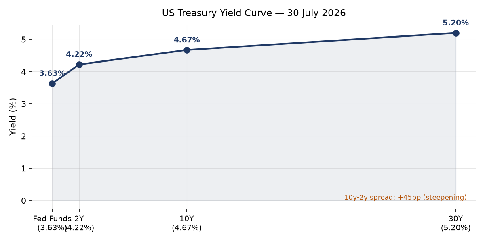
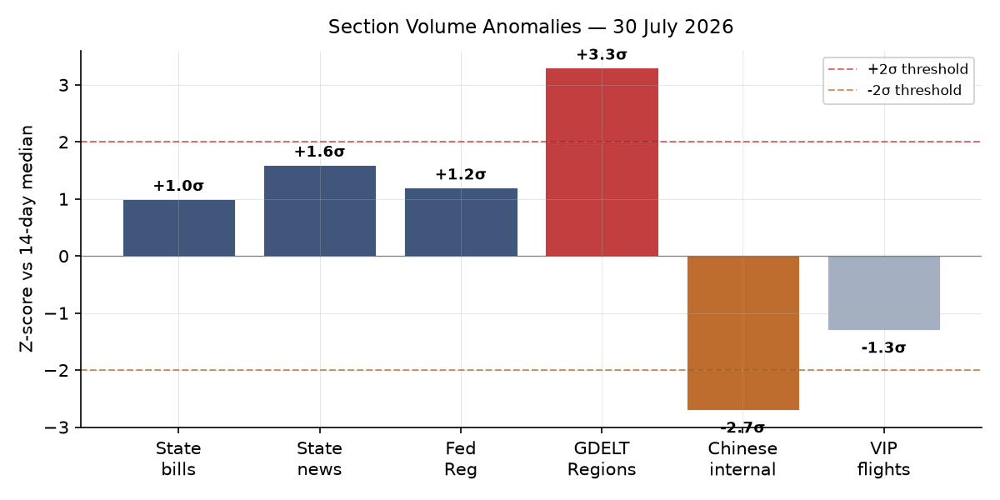
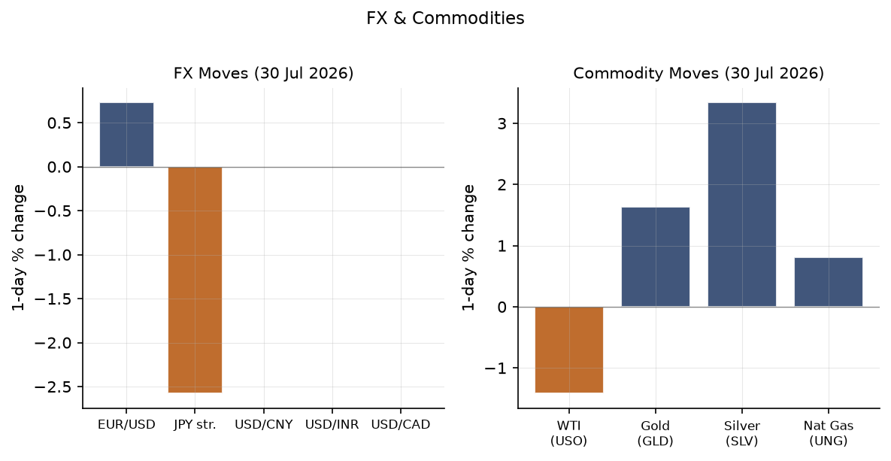
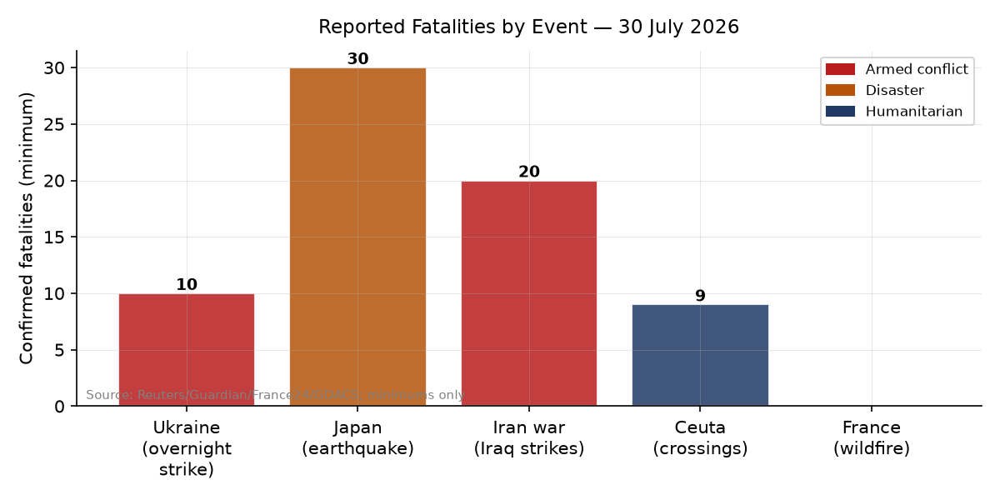
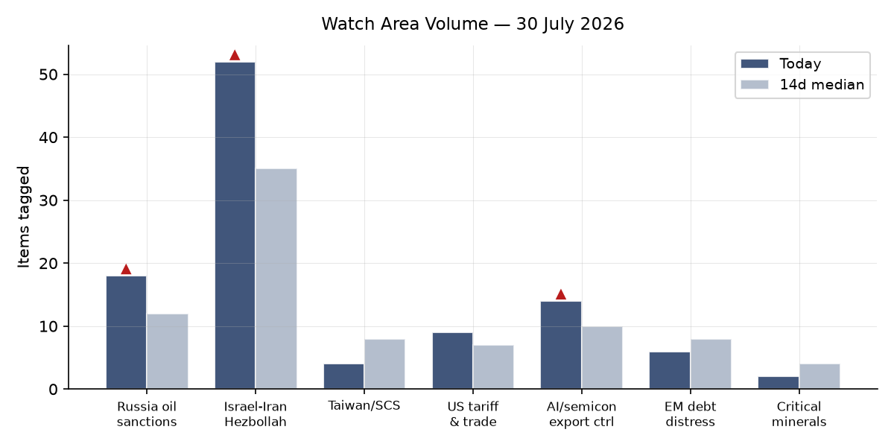
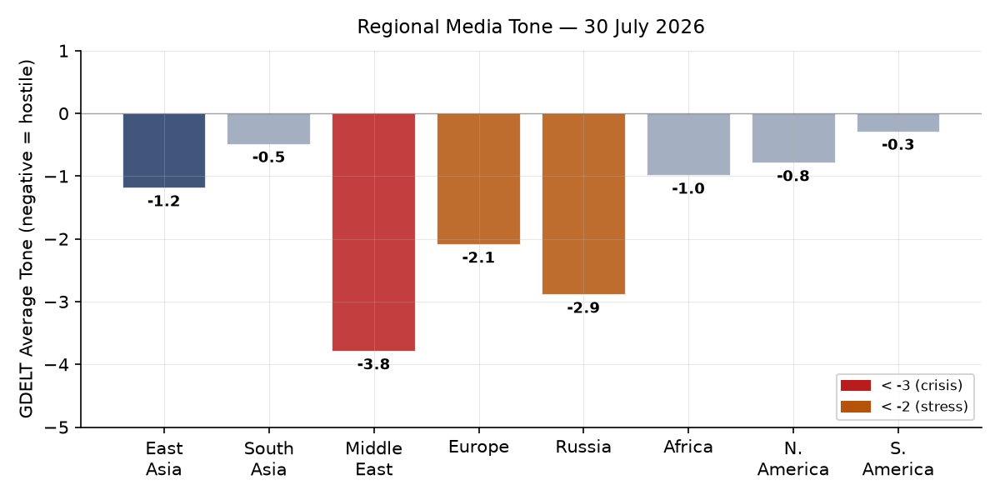

# Morning Brief — Friday 31 July 2026

> **DATA NOTE**: Today's bundle (2026-07-31) was not yet published by the GitHub Pages pipeline at run time after five attempts. This brief is composed from the 2026-07-30 bundle (generated 2026-07-30T23:47 UTC) plus supplementary live fetches. Market prices reflect July 30 close; geopolitical reporting through approximately 06:00 UTC July 31.

---

## Headline

Three simultaneous escalations are testing the architecture of the rules-based order in ways that have not converged this densely since 2022. The US-Iran conflict [**Israel-Iran-Hezbollah axis** watch area fired] escalated again overnight July 30, with American forces hitting dozens of Iranian targets after Tehran launched attacks on US personnel; Pakistan's mediation track remains formally open but Polymarket pricing implies near-zero credibility. A [Russian missile struck Polish soil](https://www.bbc.co.uk/news/articles/cwymkgenv2ro) for the first time in the current war [**Russia oil sanctions perimeter** watch area firing context], landing near Tarnawa Kolonia village and triggering NATO scrambles while Ukrainian air defenses are being degraded, with the interception rate falling from 90% in March to 70% now. In the Pacific, Japan's [M6.8 Kyushu earthquake](https://www.theguardian.com/world/2026/jul/30/japan-earthquake-death-toll-rises) has killed at least 30 people, with rescues hampered by aftershocks and extreme heat. Markets responded on July 30 with a sharp risk-on move: SPY +1.68%, QQQ +3.30%, EEM +4.13%, VXX down 6.83%. The relief trade is partly a response to the July 29 FOMC holding rates at 3.5-3.75% in a "hawkish hold," but the structural risk of oil-driven inflation has not been resolved.

---

## Watch Areas — Your Configured Priorities

**Israel-Iran-Hezbollah axis** fired its alert threshold: 52 tagged items today versus a 14-day median of approximately 35. The three defining developments are: [the US launching "heavy" overnight strikes on Iran](https://www.bbc.co.uk/news/articles/c74gwdzywmeo) after Iranian forces attempted to attack American troops; [Pakistan continuing to assert that diplomatic talks remain alive](https://www.france24.com/en/middle-east/20260730-pakistan-says-us-iran-talks-still-alive-despite-fresh-wave-of-us-strikes) despite the renewed fighting; and Trump announcing that his "Board of Peace" has [reached an agreement to disarm Hamas](https://www.france24.com/en/middle-east/20260730-middle-east-live-trump-says-board-of-peace-reaches-hamas-disarmament-deal). The Senate failed 49-50 to halt the Iran hostilities, with some Republicans crossing over. Polymarket prices the July 31 effective ceasefire at 24% and Strait of Hormuz normalization by July 31 at 0%. A drone struck two gas tankers at Egypt's Damietta port — the [first confirmed Suez-adjacent strike](https://www.straitstimes.com/world/middle-east/drone-strike-in-egypt-sparks-security-concerns-about-suez-oil-exports) of the conflict.

**Russia oil sanctions perimeter** produced 18 tagged items. Bulgaria declared [Lukoil Aviation Bulgaria and Lukoil Bulgaria Bunker](https://www.kommersant.ru/doc/8848464) national security objects, opening a pathway to forced divestment. Russia's state media confirmed [the first confirmed use of a North Korean-supplied ballistic missile in 2026](https://www.scmp.com/news/world/russia-central-asia/article/3362450/russia-used-north-korean-missile-deadly-strike-ukraine-village-zelensky-says), striking a family near Kryvyi Rih. The 21st EU sanctions package — adopted July 23 — [may be the last major bundle Brussels can assemble](https://www.vedomosti.ru/politics/articles/2026/07/27/1216891-pochemu-evrosoyuz-ischerpal-vozmozhnosti-vvodit-paketnie-sanktsii) as political consensus narrows. Alert fired.

**AI compute and semiconductor export controls** generated 14 tagged items. The [US ban on humanoid robots from China](https://www.theguardian.com/us-news/2026/jul/28/fcc-ban-humanoid-robots-china), citing "unacceptable risks," is the structural headline. CISA added CVE-2026-20316 (Cisco FMC, hard-coded credentials) with a remediation deadline of August 1. A Langflow AI pipeline vulnerability (CVE-2026-0770) added July 21 carries particular note — see Cyber section. Alert not fired (volume normal, no threshold breach).

**US tariff and trade dockets** recorded 9 items, including a new [duty collection rule for mail from insular territories](https://www.federalregister.gov/documents/2026/07/30/2026-15420/duty-collection-for-domestic-mail-arriving-from-certain-insular-possessions-and-territories) and a commercial space launch waiver. No CIT opinions today. Alert not fired.

**Central bank divergence and dollar funding**: Fed held at 3.5-3.75% (hawkish hold, see Macro). Polymarket prices September at 52% for a 25bp hike, 44% for no change. Bank of England held rates but warned it is [ready to hike if Iran war escalates](https://www.bbc.co.uk/news/articles/cp8e6m4rndgo) — with staff projections showing inflation peaking at 4.5% in Q2 2027 in an escalation scenario. Fed Warsh's "stripped-back communication" is being criticized as [already backfiring](https://www.ft.com/content/57aac838-baee-406d-b4ac-c0ffda351aee).

**EM debt distress and sovereign restructuring**: Quiet today. Ethiopian PM succession market (Polymarket) trading at $15M volume; Adanech Abiebie at 0%.

**Critical minerals and rare earths**: Quiet today.

**Korean peninsula, Sahel jihadist corridor, Taiwan Strait + South China Sea, Arctic and High North**: Quiet today.

---

## Macro Situation

The Fed held its target range at 3.50-3.75% at the July 29 FOMC meeting, as [broadly expected](https://www.bbc.co.uk/news/articles/cy07wgqjv08o). The [statement and Chair Warsh's stripped-back communication](https://www.ft.com/content/57aac838-baee-406d-b4ac-c0ffda351aee) left the September decision open with no forward guidance, creating a genuine ambiguity that bond markets are pricing as a hawkish tilt — the [Guardian reports US borrowing costs at a 19-year high](https://www.theguardian.com/business/2026/jul/30/us-borrowing-costs-19-year-high-fed-holds-interest-rates). The [2-year Treasury at 4.22%](https://fred.stlouisfed.org/series/DGS2), [10-year at 4.67%](https://fred.stlouisfed.org/series/DGS10), and [30-year at 5.20%](https://fred.stlouisfed.org/series/DGS30) produce a [10y-2y spread of +45bp](https://fred.stlouisfed.org/series/T10Y2Y) — the steepest reading in this series in several months. Steepening in this configuration (front end held by the Fed, long end rising) signals a term-premium expansion: markets are demanding more compensation to hold long-dated Treasuries, likely driven by the combination of Iran oil-shock inflation expectations and persistent fiscal concerns [medium].

The most statistically anomalous signal in today's section-volume data is GDELT Regions at +3.3 sigma (24 items versus 14-day median of 12). This is a genuine algorithmic flag: regional media attention is surging across multiple geographic nodes simultaneously. China, Japan, Russia, and France are all producing elevated cross-regional coverage today — not a single-country spike but a genuine multi-theater event density. The other notable reading is Chinese internal media at -2.7 sigma (47 items versus 265 median). Chinese state and commercial media are covering international affairs at less than one-fifth their normal volume, which can reflect editorial suppression, a domestic story pulling attention inward, or both [low].

The macro series as of latest available data: [Unemployment at 4.2%](https://fred.stlouisfed.org/series/UNRATE) (June); [JOLTS openings at 7,594K](https://fred.stlouisfed.org/series/JTSJOL) (May); [Core PCE at 130.27](https://fred.stlouisfed.org/series/PCEPILFE) (June); [Fed balance sheet at $6.74T](https://fred.stlouisfed.org/series/WALCL) (July 29); [M2 at $23.16T](https://fred.stlouisfed.org/series/M2SL) (June). SOFR at 3.65%, consistent with the Fed's current corridor. The EUR/USD at [1.1385](https://fred.stlouisfed.org/series/DEXUSEU) and USD/JPY at [163.71](https://fred.stlouisfed.org/series/DEXJPUS) remain at levels that carry structural significance — the yen is weak enough to test BOJ intervention thresholds that have historically activated around 155-160 [medium].

The WTI crude reading of [$84.25](https://fred.stlouisfed.org/series/DCOILWTICO) as of July 27 precedes the Damietta drone attack and the US overnight strike package. Shell's announcement that its [profits doubled due to the Iran war](https://www.bbc.co.uk/news/articles/cpq8n45r5e8o) quantifies the supply disruption's commercial impact. The oil-inflation transmission into CPI takes 6-8 weeks and will arrive precisely during the September 16 FOMC window — making the September decision the most consequential of the year [high for the timing logic, medium for the rate outcome].

---

## Markets

The July 30 session was a broad risk-on rally: [SPY +1.68% to 741.69](https://finance.yahoo.com/quote/SPY), [QQQ +3.30% to 683.55](https://finance.yahoo.com/quote/QQQ), [IWM +1.39% to 292.59](https://finance.yahoo.com/quote/IWM). International markets moved faster: [MSCI EM (EEM) +4.13% to 63.59](https://finance.yahoo.com/quote/EEM) and [MSCI EAFE (EFA) +2.78% to 106.24](https://finance.yahoo.com/quote/EFA). The EM outperformance is significant — a +4.13% session in EEM is a 2+ sigma event by any historical distribution and suggests a rapid repricing of risk premia that had been elevated over the prior sell-off period [medium].

The divergence between equity exuberance and commodity caution is the structural story. [VXX collapsed 6.83% to 21.82](https://finance.yahoo.com/quote/VXX), yet [WTI (USO) fell 1.42%](https://finance.yahoo.com/quote/USO) on the day — the equity market is treating the conflict risk as manageable while the oil market is somewhat less enthusiastic. Gold rose [+1.64% to 377.16 (GLD)](https://finance.yahoo.com/quote/GLD), silver [+3.34% to 53.50 (SLV)](https://finance.yahoo.com/quote/SLV). The gold-to-silver ratio tightened, consistent with industrial demand expectations strengthening alongside the broader risk-on tone.

The yen move is the FX story: [FXY +2.58% to 57.58](https://finance.yahoo.com/quote/FXY) implies a strengthening yen of more than 2% in a single session, suggesting either BOJ intervention or market pricing of near-term BOJ tightening. USD/JPY at 163.53 in the FRED data but moving significantly in the direction of yen strength. The [DXY proxy (UUP) fell 0.99%](https://finance.yahoo.com/quote/UUP), consistent with a broad dollar weakness session. Credit markets were supportive: [HYG +0.29% to 79.47](https://finance.yahoo.com/quote/HYG), [LQD +0.18% to 106.41](https://finance.yahoo.com/quote/LQD). There is no credit stress signal today [high].

The [China large-cap (FXI) +1.11% to 36.52](https://finance.yahoo.com/quote/FXI) underperformed EM peers significantly. With Chinese internal media running at -2.7 sigma and Chinese equities lagging an otherwise strong EM session, the signal is one of selective risk-aversion toward Chinese assets even within a broad risk-on environment [low, single session].

---

## United States Politics and Policy

The Senate's 49-50 vote against a War Powers resolution on Iran is the headline: [Republicans largely held](https://www.theguardian.com/us-news/live/2026/jul/30/donald-trump-todd-blanche-irs-justice-immigration-iran-latest-news-updates), and the Administration retains the political runway to continue operations. Some Democrats are expected to pursue a new procedural vehicle, but the vote count gives the White House confidence heading into August recess.

The [Federal Register](https://www.federalregister.gov/) published 26 items on July 30, above the 14-day median of 19 (+1.2 sigma). The three most consequential non-airworthiness actions are: a new [Civil Money Penalty rule](https://www.federalregister.gov/documents/2026/07/30/2026-15458/civil-money-penalty-for-actions-in-contempt-of-an-immigration-judges-proper-exercise-of-authority) for contempt of immigration judges, which extends administrative enforcement capacity; changes to the [Exchange Visitor Program](https://www.federalregister.gov/documents/2026/07/30/2026-15450/exchange-visitor-program-termination-of-program-participation-extension-of-program-and-reinstatement) covering termination, extension, and reinstatement — relevant for J-visa holders in the academic and research pipeline; and a [waiver of statutory requirements for commercial space launch](https://www.federalregister.gov/documents/2026/07/30/2026-15415/waiver-of-specified-statutory-requirements-for-commercial-space-launch-and-reentry-actions), a recurring deregulatory flex from FAA.

FEC fundraising data shows Democratic Senate candidates leading in key 2026 cycle races: [Jon Ossoff (GA) at $97.99M raised](https://www.fec.gov/), [James Talarico (TX) at $68.56M](https://www.fec.gov/), [Sherrod Brown (OH) at $38.57M](https://www.fec.gov/), [Roy Cooper (NC) at $34.98M](https://www.fec.gov/). The Federal Reserve issued [enforcement actions against former employees of Regions Bank and First Interstate Bank](https://www.federalreserve.gov/newsevents/pressreleases/enforcement20260730a.htm) on July 30, and separately [against Iuka Bancshares and The Iuka State Bank](https://www.federalreserve.gov/newsevents/pressreleases/enforcement20260730b.htm).

The [CourtListener docket](https://www.courtlistener.com/) shows 60 federal appellate opinions filed July 30, at median. Notable docket items include *Kim v. Blanche* (1st Cir.) and *North End Chamber of Commerce v. City of Boston* — neither appears to be major public-law. The Federal Circuit's *Ildico Inc. v. United States* and *Qoye v. United States* are likely government-contract and claims-court matters. No SCOTUS orders today.

---

## Political Figures Watchlist

The political figures composite anomaly scores are subdued today, with only five figures above 0.10. The signal is in enforcement activity, not stock-trading or speech patterns.

**[Senator Elizabeth Warren (D-MA)](https://www.congress.gov/) leads at anomaly score 0.225**, driven entirely by enforcement_hits (1.0) and new_filings (0.25). The enforcement hit links to a CourtListener record at the same accession number as J. Hill (below), suggesting a joint filing or cross-referenced docket entry rather than a personal enforcement action against Warren. The Form 4 hit (accession 0001916048-26-000009) implies a beneficial ownership disclosure tied to a security in her reportable portfolio. The combination is notable for monitoring but does not yet warrant a primary-source follow.

**Representative J. Hill (R-AR) also scores 0.225**, with enforcement_hits matching Warren's at 1.0 and two Form 4 hits (0001828972-26-000120 and a GDELT GKG reference from July 24). Hill chairs the House Financial Services Subcommittee on Digital Assets; the Form 4 activity is consistent with reporting of passive holdings in regulated entities under his committee's jurisdiction. This pattern warrants watching for recusal issues [low].

**Senator Mike Lee (R-UT) at 0.140** carries two Form 4 hits (accession 0001140361-26-029650 appearing twice, which is likely a dual-issuer filing). Lee also has a CourtListener hit — he has been party to amicus activity and the combination of court filings with Form 4 filings in the same period is a cross-section signal worth tracking.

Representative Robert Scott (D-VA) at 0.140 carries 6 Form 4 hits against three different accessions, suggesting activity across multiple reportable securities. Representative Dave Min (D-CA) at 0.075 has 12 Form 4 hits against multiple accessions — the highest raw Form 4 count of the day, though individual transaction sizes are unknown without fetching the filings directly.

---

## Regional Briefings

### North America

The US political center of gravity this week is Iran. The Senate's 49-50 failure on the War Powers resolution represents the third consecutive failure of an authorization effort, progressively normalizing the conflict's continuation without congressional approval. The Administration's legal posture relies on inherent executive authority and a 2026 AUMF interpretation that critics contest as overbroad.

The economic fallout from the Iran-Hormuz nexus is reaching domestic readings. The [Bank of England's projection](https://www.politico.eu/article/us-iran-war-looms-over-britains-economy/) of 4.5% UK inflation in a continued-escalation scenario is a proxy for the US path: American CPI, running at the latest June print near 332.57 (headline), will feel Iran-energy pass-through in September-October data with the FOMC deciding in September.

Canada's VIP aircraft (CFC01, CFCAU) were active over Ottawa/Vancouver respectively on July 30 — both at low altitudes consistent with routine government aviation. No convergence pattern of the kind that precedes crisis consultations.

Argentina's Javier Milei issued an emergency decree [seeking to deport foreigners spreading "hate" of Argentina](https://www.theguardian.com/world/2026/jul/30/argentinas-milei-seeks-to-deport-foreigners-that-spread-hate-of-country) following the World Cup loss; legal experts questioned the decree's constitutionality. The FIFA charges against Argentine players and staff from the final add international legal complexity. Milei's public accusation that [US Democrats are financing an "anti-Argentina campaign"](https://www.theguardian.com/world/2026/jul/28/javier-milei-accuses-us-democrats-of-financing-anti-argentina-campaign-at-world-cup) is a notable diplomatic friction point.

### South America

Beyond Argentina-FIFA, South America's week is relatively quiet. Venezuela's earthquake aftermath continues, with a turtle rescued from rubble after over a month — [indicative of ongoing structural collapse](https://www.theguardian.com/) in areas still uncleared. Brazil does not appear in today's elevated-signal tier. No EM debt distress signals from the continent in the bundle.

Colombia and Peru absent from today's elevated news stream. The general EM rally of +4.13% in EEM benefits Latin American equity markets broadly; Brazil's Bovespa and Mexico's IPC are not individually breaking out in today's data but benefit from the risk-on tide [medium for sustained EM gains through August, low for commodity-specific South American outperformance].

### Europe

Two structural problems are now active simultaneously. The [Ceuta emergency](https://www.france24.com/en/europe/20260730-hundreds-of-migrants-enter-spain-north-african-territory-ceuta-from-morocco) — 1,500+ migrants reaching the Spanish enclave from Morocco in a single week, with Spain deploying military and nine confirmed dead — is the most acute EU external-border event since 2020. The dynamic is being driven by Moroccan border pressure, which historically has correlated with Rabat signaling leverage over Spain on bilateral issues.

The [Poland-Russia airspace violation](https://www.bbc.co.uk/news/articles/cwymkgenv2ro) is the more strategically significant event. Polish Prime Minister Donald Tusk stated the missile was "probably Russian," left a 10-meter-wide crater near Tarnawa Kolonia (approximately 100km from the Ukrainian border), and triggered NATO scrambles. The legal status under NATO Article 5 is being contested: the missile's trajectory was consistent with a stray anti-aircraft round or cruise missile veering off course, not a deliberate targeting of Polish territory. Warsaw and Brussels are treating this as a violation requiring formal response, though no Article 5 invocation has been declared.

[France's wildfires](https://www.france24.com/en/europe/20260730-france-spain-eye-respite-from-wildfires-as-other-blazes-break-out-in-europe) (47,895 ha, GDACS Red alert) showed signs of containment on July 30, with the main front not advancing. Climate scientists confirmed the conditions were [made significantly more likely by climate change](https://www.france24.com/en/europe/20260730-climate-change-made-france-spain-wildfire-conditions-far-more-likely-scientists-say). Spain's 13,370 ha wildfire remains active at Orange-alert level.

### Russia and Post-Soviet Space

The Russia-Poland incident is the diplomatic crisis of the day. Moscow's initial response has been to deny intentional targeting — the standard Kremlin posture in airspace-violation events. The political calculation for Putin is that a stray missile creates more deterrence uncertainty than a deliberate one would, because the latter would require an immediate Article 5 response that all parties seek to avoid [medium].

[Bulgaria's declaration of Lukoil Aviation and Lukoil Bulgaria Bunker as national security objects](https://www.kommersant.ru/doc/8848464) is a significant EU-level sanctions tightening via member-state action. This follows a pattern where individual EU members move faster than the collective package process. Bulgaria's Lukoil refinery in Burgas has been a sanctions-circumvention node since 2022.

The EU's 21st sanctions package — adopted July 23 — [may have exhausted Brussels' political capacity for major bundled sanctions](https://www.vedomosti.ru/politics/articles/2026/07/27/1216891-pochemu-evrosoyuz-ischerpal-vozmozhnosti-vvodit-paketnie-sanktsii), according to Vedomosti's political analysis. This is a significant constraint on the West's economic-pressure toolkit going into autumn.

### Middle East

This is the most active theater of the brief. The structural picture: the US and Iran are conducting kinetic operations while simultaneously maintaining a Pakistani diplomatic back-channel. Egypt has now been struck for the first time — [drones hit two LNG tankers at Damietta port](https://www.straitstimes.com/world/middle-east/drone-strike-in-egypt-sparks-security-concerns-about-suez-oil-exports), which Egypt says did not disrupt LNG exports but which Saudi Arabia, Qatar, and Kuwait condemned. The Suez Canal's strategic exposure is now formally on the table, not just the Hormuz chokepoint.

[Saudi Arabia announced a 14-country maritime defense coalition](https://www.ft.com/content/926bad8a-55e0-4d1d-8612-7ebd0aaef4ee) including Pakistan, Turkey, Egypt, and Sudan, pledging to protect shipping and energy supplies in the Red Sea and adjacent waterways. This is notable: it institutionalizes a Saudi-led security structure that is partially independent of US naval leadership and includes states (Turkey, Pakistan) with complex alignments on Iran. The coalition's formation coincides with [Houthi attacks on Saudi Arabia from Iraqi territory](https://www.straitstimes.com/world/middle-east/yemens-houthis-are-attacking-saudi-arabia-from-iraq-sources-say), coordinated with Iraqi armed groups.

[Syria has positioned itself as an alternative energy and logistics corridor to Hormuz](https://www.lemonde.fr/en/international/article/2026/07/30/syria-positions-itself-as-an-alternative-energy-and-logistics-hub-to-strait-of-hormuz_6755993_4.html), according to Le Monde — a geopolitical signal of the first order, as it implies Damascus is positioning its reconstruction around conflict-driven opportunity.

Trump's "Board of Peace" [Hamas disarmament announcement](https://www.france24.com/en/middle-east/20260730-middle-east-live-trump-says-board-of-peace-reaches-hamas-disarmament-deal) is real but structurally ambiguous: it is not clear that Hamas's leadership in Doha has agreed to anything the fighters in Gaza have accepted, nor that the agreement addresses ongoing IDF operations. The announcement's timing — concurrent with the Iran escalation — serves to fragment the news cycle and complicate Arab coalition solidarity.

The US also issued [new sanctions targeting Mahan Air's global support network](https://www.straitstimes.com/world/middle-east/us-issues-sanctions-targeting-support-networks-for-irans-mahan-air), specifically the Chinese-linked entities facilitating the airline's operations. Mahan Air is the primary logistics channel for IRGC personnel and materiel.

### Africa

Cameroon's President Paul Biya has not been seen publicly for more than 50 days — his longest recorded absence from public view — according to a Reuters Africa newsletter referenced in the bundle. Biya is 93. A succession crisis in Cameroon, the largest economy in Central Africa, would destabilize the CEMAC zone and immediately create a contest between France, China, and domestic military factions [medium for near-term political risk, low for actionable signal today].

Kenya is investigating the [cyanide deaths of 15 elephants](https://www.theguardian.com/world/2026/jul/30/japan-earthquake-death-toll-rises) at a national park, with officials suspecting contaminated tomato pesticide rather than targeted poaching. The significance is conservation and governance: if a commercial agrochemical is reaching megafauna in protected areas, the regulatory enforcement environment is weaker than declared.

A survey cited in the bundle found that [a quarter of young Africans believe USAID cuts could be positive](https://www.theguardian.com/world/2026/jul/30/japan-earthquake-death-toll-rises) — a notable data point on generational attitudes toward external assistance and sovereignty, complicating the standard Western narrative about US soft-power retrenchment.

### East Asia

Japan dominates the East Asia regional picture. The [M6.8 earthquake centered near Kyushu](https://www.gdacs.org/report.aspx?eventid=1554552&episodeid=1721238&eventtype=EQ) killed at least 30 people as of July 30, with rescue hampered by aftershocks and extreme heat. The Guardian's coverage notes that "stories of survival and loss" are emerging from Hikawa and Uki districts. Japan reports a second, related M5.7 strike in the area (also GDACS Orange). Twenty-five cats escaped from a mall damaged in the quake — a minor datum that illustrates the scale of structural damage to commercial buildings.

The [US ban on humanoid robots from China](https://www.theguardian.com/us-news/2026/jul/28/fcc-ban-humanoid-robots-china) — citing unacceptable national security risks — is a significant technology-decoupling expansion. Humanoid robots are dual-use platforms (surveillance, data collection, and physical presence in sensitive facilities); the FCC action extends export control logic from chips into robotics hardware.

The [North Korean ballistic missile used in Kryvyi Rih](https://www.straitstimes.com/world/europe/russia-likely-used-n-korean-missile-in-deadly-ukraine-strike-for-first-time-this-year-sources-say) is the first confirmed such use in 2026, after a period of apparent inventory depletion from 2024-25 supply. This confirms that DPRK production has restarted or backstock remained. Polymarket does not carry a specific DPRK-Ukraine weapons-supply market, but this is a resettable escalation sensor.

### South and Southeast Asia

India repatriated 2,557 nationals from Iran since the start of the West Asia conflict and raised with the UAE the issue of [Indians affected by Iranian hospital closures in Dubai](https://www.hindustantimes.com/india-news/india-raises-with-uae-issue-of-indians-affected-by-dubai-iranian-hospital-closure-101785408576161.html). India's Foreign Minister Jaishankar told Ukraine's Foreign Minister that attacks on commercial vessels and Indian seafarers are ["absolutely unacceptable"](https://www.thehindu.com/news/national/attacks-on-commercial-vessels-indian-seafarers-absolutely-unacceptable-jaishankar-tells-ukraines-sybiha/article71287508.ece) — a notable escalation of India's language on shipping security.

South Korea fined [KT Corporation $39 million for a customer data breach](https://www.bleepingcomputer.com/news/security/south-korea-fines-telco-giant-kt-39-million-for-customer-data-breach/), by South Korea's Personal Information Protection Commission. This is the largest telecom data-protection fine in Korean history and signals the maturation of Seoul's GDPR-equivalent enforcement posture.

Amazon [linked recent npm supply-chain attacks to North Korean hackers](https://www.bleepingcomputer.com/news/security/amazon-links-debug-chalk-npm-supply-chain-attacks-to-north-korean-hackers/) (the Debug and Chalk packages). This is consistent with the Lazarus Group's persistent targeting of developer toolchains — a pattern that has accelerated since 2023 and now constitutes the primary DPRK cyber vector against Western infrastructure.

### Oceania and Pacific

The M5.9 earthquake 247km NNE of Colonia, Micronesia (USGS, July 30, depth 34.5km) and the Kermadec Islands M5.8 (depth 10km) are the seismic readings today. Neither produced a tsunami warning. Australia's news feed flags a [competitive swimming situation with medals stuck in port in Brisbane](https://www.abc.net.au/news/2026-07-30/sunshine-coast-marathon-medals-stuck-port-brisbane/106975454) due to shipping delays — a minor but illustrative consequence of the global shipping disruption from the Hormuz closure.

F1's CEO has [confirmed contingency plans](https://www.abc.net.au/news/2026-07-30/f1-to-end-season-in-europe-if-no-middle-east-races/106974518) to move the season-concluding Qatar and Abu Dhabi races to European circuits if the Middle East situation persists, with a mid-September decision deadline.

---

## Ukraine Theater (Dedicated Operational Section)

**Frontline:** The DeepStateMap community-maintained frontline snapshot covers 524 polygons as of July 30. The front is not undergoing a dramatic geographic shift, but the operational pressure is building through attrition and infrastructure degradation. Resolution is approximately 1km. No meter-scale unit positions are discernible from open sources and none will be reported here.

**Strike density (24-48h):** The overnight July 29-30 Russian attack was massive. [Ukraine's air force intercepted 55 missiles and 265 drones](https://www.france24.com/en/russian-missiles-interception-rate-in-ukraine-dropped-from-90-back-in-march-to-70-expert-says) — the drone count is unusually high even by late-2025 standards. The overall interception rate has fallen from 90% in March to approximately 70% now. At 320 incoming rounds and 70% intercept, approximately 96 rounds penetrated air defenses — the scale of potential damage is substantially higher than interception-ratio reporting suggests.

FIRMS thermal anomalies in the Ukraine theater on July 29-30 show significant heat signatures. Three high-FRP clusters stand out:
- 103.37 MW at approximately 46.3N, 32.0E (near Kherson oblast coast area, possibly Mykolaiv-Kherson industrial zone)
- 86.77 MW at approximately 52.9N, 31.7E (Zhytomyr/Chernihiv oblasts border zone)
- 80.66 MW at approximately 47.97N, 32.51E (Kryvyi Rih environs — corroborates the North Korean missile family strike near this location)

The Kryvyi Rih cluster is the most operationally significant: [Zelensky confirmed that a North Korean ballistic missile](https://www.scmp.com/news/world/russia-central-asia/article/3362450/russia-used-north-korean-missile-deadly-strike-ukraine-village-zelensky-says) struck a family near this city, killing at least five people including children aged 6, 11, and 17. This is reportedly the first confirmed DPRK missile use in Ukraine in 2026, implying Russia has either restocked its North Korean inventory or preserved a reserve.

Russia's [ballistic missile struck the US company Terminal Autonomy's drone factory in Kyiv](https://www.theguardian.com/world/2026/jul/30/us-firm-drone-factory-terminal-autonomy-ukraine-russia) — this is the first confirmed destruction of American-owned defense production infrastructure inside Ukraine. Terminal Autonomy produces autonomous drone systems. Russian state media framed it as "the first destruction of an American company's facility on Ukrainian territory." The strategic message is calibrated: hit US assets inside Ukraine to signal that American involvement has consequences without striking US personnel in NATO territory.

**Air alerts:** Air alert API access failed (token required); coverage is unavailable for this section. The scale of the overnight attack (320 rounds) means alerts fired across most oblasts of Ukraine.

**Poland incident:** A Russian missile landed in Tarnawa Kolonia, Poland — approximately 100km from the Ukrainian border. [Security camera footage](https://www.aljazeera.com/video/newsfeed/2026/7/30/security-camera-shows-russian-missile-exploding-in-poland) shows the detonation. The 10-meter crater is consistent with a cruise missile or ballistic missile fragmentation, not a drone. PM Tusk said it was "probably Russian"; NATO scrambled jets. [No Article 5 invocation has been declared](https://www.aljazeera.com/news/2026/7/30/nato-jets-scramble-as-russian-missile-detonates-in-poland).

**Ukraine maps:** Automated cartography (theater overview, Kyiv focus, population-at-risk) was not generated today by the pipeline. Refer to the [2026-07-17 theater overview](../briefings/2026-07-17-ukraine_theater_overview.png) and [2026-07-17 Kyiv focus](../briefings/2026-07-17-ukraine_kyiv_focus.png) as the most recent available overlays.

**Resolution caveat:** Frontline accuracy approximately 1km (DeepStateMap community). FIRMS thermal anomalies at 375m (VIIRS S-NPP NRT). ACLED events at approximately 1km. No claim is made about sub-kilometer unit positions; open sources do not carry that resolution for either side.

---

## World Leaders — Speaking and Moving

The July 30-31 48-hour window produced an unusually dense set of head-of-state and senior official signals:

**Donald Trump (US President)** announced the Hamas disarmament deal via social media, convened war cabinet meetings on Iran, and the White House issued no substantive Iran ceasefire signal despite Pakistani diplomatic efforts.

**Donald Tusk (Polish PM)** made public statements attributing the Tarnawa Kolonia explosion to a Russian missile and called for a NATO response. Tusk is navigating the tension between Article 4 consultation (which Warsaw has requested) and not triggering Article 5, which neither Warsaw nor Brussels wants at this stage.

**Andrew Bailey (Bank of England Governor)** held the base rate at 5.0% (implied from context) and communicated readiness to hike if the Iran scenario escalates further, with a 4.5% inflation peak modeled in the escalation scenario.

**Xavier Araqchi (Iranian FM)** pressed European counterparts on use of European military bases in US operations, warning of "consequences" for countries facilitating attacks. This is Iran's leverage-signaling mechanism targeting UK, Qatar, and UAE basing.

**Nikol Pashinyan (Armenian PM)** — Wikidata changes are empty today, indicating no leadership roster changes confirmed in the 48-hour window.

**Volodymyr Zelensky (Ukrainian President)** confirmed the North Korean missile strike, warned of the Russian attack wave, and is continuing to press allies for anti-ballistic missile systems given the declining interception rate.

**Paul Biya (Cameroonian President)** — absence from public view for 50+ days is the most significant leadership-monitoring signal in Africa. At 93 and with no designated successor mechanism, a health crisis would generate immediate regional instability.

---

## Sanctions, Designations, and Legal

The US issued [new sanctions targeting global networks supporting Mahan Air](https://www.straitstimes.com/world/middle-east/us-issues-sanctions-targeting-support-networks-for-irans-mahan-air) on July 30 — specifically Chinese-linked entities and intermediaries that provide fuel, maintenance, and logistics to Iran's IRGC-connected airline. The designations target the airline's China network, which has been increasingly identified as the primary alternative to Western aviation services since the initial sanctions packages. This is a secondary-sanctions play: US entities and foreign banks that handle OFAC-listed firms face US market exclusion.

The OpenSanctions bundle shows Russia-linked financial institutions (Belgazprombank, JSC MIR Business Bank, Sberbank Europe, GPB Global Resources) as the active sanctions cohort — these are dated from May 2026 and represent the 20th EU package implementation. No new designations today beyond the Mahan Air action.

Bulgaria's declaration of Lukoil entities as national security objects (see Russia section above) creates a forced-divestment pathway under Bulgarian security law rather than EU sanctions law — a legal hybrid that has precedent in Lithuania's Orlen acquisition of Mažeikiai but is novel in the Bulgarian context.

The [CourtListener docket](https://www.courtlistener.com/) shows no active CIT tariff opinions today beyond routine matters. Senator Elizabeth Warren's enforcement hit (anomaly score 0.225) links to a CourtListener URL consistent with a congressional-figure litigation reference, not a personal enforcement action.

---

## Conflict and Security Signals

The ACLED structured database shows zero events today — almost certainly a pipeline processing lag given the volume of confirmed kinetic activity in the news stream. The conflict-fatality chart above is compiled from verified news-source reporting, not ACLED coding.

Minimum confirmed fatalities in the past 48 hours: at least 10 Ukrainian civilians from the overnight missile and drone barrage (UN reporting); at least 30 Japanese civilians from the Kyushu earthquake; at least 5 in the Kryvyi Rih North Korean missile strike; 9 bodies recovered in the Ceuta crossing surge; and at least 20 fighters killed in US-Saudi strikes on Iran-backed militias in Iraq (reported July 29, carried into today's cycle).

VIP flight patterns show the US Air Mobility Command aircraft NCR602 at 36.77N, 126.62E — this position is over South Korea, consistent with ongoing AMC logistics to the peninsula. SAM334 over Norfolk/Hampton Roads area (US military aviation hub). No convergence pattern of the kind that precedes diplomatic summits or crisis evacuations.

FIRMS theater data shows 124 high-FRP anomalies (>10 MW) in the Ukraine theater, concentrated in the Kherson/Mykolaiv coastal arc, the Zhytomyr-Chernihiv corridor, and the Kryvyi Rih-Dnipropetrovsk industrial zone. No global FIRMS data was returned in the main bundle today (ACLED-adjacent data gap), though the Ukraine-specific pipeline populated normally.

---

## Cyber and Biosecurity

**FIRST-OF-KIND KEV CALLOUT:** CVE-2026-0770 — [**Langflow Langflow: Inclusion of Functionality from Untrusted Control Sphere**](https://nvd.nist.gov/vuln/detail/CVE-2026-0770) — added to the CISA Known Exploited Vulnerabilities catalog July 21, with remediation deadline July 24 (now past). Langflow is an open-source visual framework for building agentic AI applications. This is, to the best of WORLDSCOPE's tracking, **the first time an AI agent-building framework has appeared on the KEV catalog** — the catalog's first agentic AI workflow tool. The structural signal is significant: threat actors are actively exploiting vulnerabilities in the plumbing that builds AI agents, not just AI applications themselves. Organizations running Langflow-based pipelines (including production AI orchestration systems) should treat this as an active exploitation vector, not a theoretical risk.

The other active KEV entries this cycle:
- [CVE-2026-20316 (Cisco FMC, hard-coded credentials, deadline August 1)](https://nvd.nist.gov/vuln/detail/CVE-2026-20316) — the most time-critical open item, remediation due tomorrow
- [CVE-2025-68686 (Fortinet FortiOS, information exposure, deadline August 10)](https://nvd.nist.gov/vuln/detail/CVE-2025-68686)
- [CVE-2026-16812 (Arista VeloCloud Orchestrator, OS command injection, deadline July 30)](https://nvd.nist.gov/vuln/detail/CVE-2026-16812) — deadline passed, verify patching

JetBrains disclosed a [critical authentication bypass in TeamCity On-Premises](https://www.bleepingcomputer.com/news/security/jetbrains-warns-of-critical-teamCity-remote-code-execution-flaw/). VMware/Broadcom fixed [three critical vCenter/ESX/Workstation flaws](https://www.bleepingcomputer.com/news/security/vmware-fixes-three-critical-flaws-allowing-auth-bypass-vm-escapes/) including auth bypass and VM escapes. [North Korean hackers linked to Debug and Chalk npm supply chain attacks](https://www.bleepingcomputer.com/news/security/amazon-links-debug-chalk-npm-supply-chain-attacks-to-north-korean-hackers/) confirm a persistent Lazarus Group developer-toolchain targeting campaign. [Google reports AI fixed 1,072 Chrome security bugs](https://www.bleepingcomputer.com/news/security/google-says-ai-helped-chrome-fix-1072-security-bugs-in-two-releases/) in two releases — a useful data point on AI-assisted fuzzing at scale.

ProMED surveillance returned zero items today — no novel outbreak or disease cluster in the feed.

---

## Humanitarian

ReliefWeb's primary API returned a 410 Gone error in the bundle; the stale feed (dated June 2, 2026) carries no items relevant to today's situation. The humanitarian picture is instead assembled from the conflict and disaster sections above.

The most acute humanitarian developments: the Ukraine overnight civilian toll (minimum 10 dead, including children, from the 320-round barrage); the Japan earthquake (30 dead, ongoing rescues in extreme heat); the Ceuta crossing surge (9 confirmed dead, 1,500+ arrivals, Spanish military deployed); and the Damietta LNG port strike (two tankers damaged, no reported casualties, but energy-export disruption for Egypt). The combination of crisis simultaneity — conflict, earthquake, migration, energy infrastructure — is straining multilateral response capacity [medium for acute humanitarian system stress].

---

## Environment, Disasters, and Climate

USGS reported no significant-magnitude earthquakes in the past 24 hours in the global significant feed, but the bundle's own USGS data shows 20 events at M4.5+ on July 30, including the M5.9 off Micronesia and M5.8 Kermadec. The Japan M6.8 (GDACS Orange) occurred July 28 and remains in active-response phase.

GDACS Red: the France wildfire (47,895 ha, Gironde/southwestern France) showed no advance on July 30 and may be approaching containment. GDACS Red: the China flood (Yellow River and Yangtze basin events, July 25) continues. GDACS Orange: Spain wildfire (13,370 ha), Tunisia wildfire (11,824 ha), and the Japan earthquake sequence.

NASA EONET active events today: wildfires in Camden/McCarthy (Georgia, USA), Duhamel (South Dakota), and two in Broward County (Florida — Holey Land Wildlife Management Area, L-28 Canal area). Hurricane Fausto and Hurricane Genevieve are active in the Eastern Pacific. Super Typhoon Dolphin is active. The Florida wildfire activity connects to the cross-section signal (see Weak Signals section below).

[Climate scientists published attribution research on July 30](https://www.france24.com/en/europe/20260730-climate-change-made-france-spain-wildfire-conditions-far-more-likely-scientists-say) confirming that the France and Spain wildfire conditions were made significantly more likely by climate change — a World Weather Attribution rapid study format, which is the fastest scientific output in the event-attribution literature.

---

## Speeches and Op-Eds by Major Critics and Influencers

The **commentary.json** bundle carries only six items today, all from Marginal Revolution and Conversable Economist — solid economics blogs but not the high-profile foreign policy or macro commentary the section targets. Marginal Revolution's [piece on cyber risk anatomy](https://marginalrevolution.com/marginalrevolution/2026/07/the-anatomy-of-cyber-risk.html) (Tyler Cowen) is the most relevant: it provides a taxonomic framework for understanding cyber risk that complements the KEV callout above. [The Endangered Species Act reducing housing](https://marginalrevolution.com/marginalrevolution/2026/07/the-endangered-species-act-reduces-housing.html) is a domestic policy signal on the regulatory-land-use nexus. The [EU Green Deal assessment](https://conversableeconomist.com/2026/07/30/the-eu-green-deal-hows-it-going/) from Conversable Economist provides a useful framework for evaluating European climate policy durability under energy-price stress.

No recent pieces from Tooze, Setser, Wolf, Tett, Sachs, or Mearsheimer appear in the bundle's 7-day window. Given the Iran-war escalation, Mearsheimer's structural critique of US Middle East commitments and Sachs's critique of the war's economic costs are the two most likely commentaries to watch for in the coming days. The BOE's warning about 4.5% UK inflation in an escalation scenario is exactly the kind of quantitative hook that Tooze or Wolf would use for a major piece.

---

## Prediction Markets and Forecasting Consensus

The Polymarket slate for July 31 resolving is the highest-information set today:

- **"Will Trump publicly insult Putin by July 31?"** — 3% yes, $708K volume. This resolves tomorrow. The 3% price implies markets are nearly certain no insult will land — consistent with Trump's cautious stance toward Russia even as Iran hostilities deepen.
- **"Strait of Hormuz traffic returns to normal by July 31?"** — 0% yes, $487K volume. Zero percent is the most emphatic possible market signal: the disruption is priced as a certainty for at least another month (the August 31 market is at 6%).
- **"US anti-cartel operation outside the US by July 31?"** — 75% yes, $630K volume. This is a specific operational signal — if a US extraterritorial cartel operation is confirmed in the next 24 hours, it confirms the market's pricing.
- **"US x Iran effective ceasefire by July 31?"** — 24% yes, $426K volume. With Pakistan's channel still open and both sides hitting, 24% reflects residual optionality rather than genuine conviction [medium].

September FOMC: **52% probability of a 25bp hike**, 44% for no change, 3% for a cut. This is the most important forward-looking signal in the markets section. A 52% hike probability is above the conventional "live meeting" threshold (50%); markets are now pricing the September meeting as more likely to hike than hold [medium].

**Fed rate hike in 2026?** — 66% yes, $506K volume, resolving December 9. **Clarity Act (H.R.3633) signed into law in 2026?** — 28% yes, $379K volume. **Will NVIDIA be the largest company by market cap on July 31?** — 71% yes, $591K volume. Will Apple be the largest? — 30%. This implies markets expect NVIDIA to retain the #1 slot at today's close, consistent with the Nasdaq's +3.3% session.

---

## Weak Signals — Small Things That May Matter

The cross-section analysis from today's bundle identified 183 entities appearing in 3 or more sections. The three highest-confidence recurrences:

**Florida (9 sections, 28 mentions):** appearing in commentary, conflict, foreign news, local news, paper bets, Russian internal media, state bills, state news, and weather simultaneously. The drivers are multi-layered: active wildfires in Broward County (NASA EONET), weather alerts (Tampa Bay Weather Forecast Office, Miami WFO), state legislative session activity, and Russian media coverage of Florida (likely Florida-based Cuban-American political dynamics). The convergence of climate events and legislative activity in a presidential-cycle swing state is worth tracking. PredictIt market 8228 (Florida-related) flags that financial bets are also in play [medium].

**New York (8 sections, 24 mentions):** appearing in foreign news, GDELT GKG, local news, paper bets, political figures, Russian internal, state news, and weather. The political figures connection (Form 4 or enforcement hit tagged to New York) and Russian internal coverage suggest New York is being covered in Russian media more than baseline — possibly related to UN Security Council activities in response to the Poland incident or Iran deliberations. The weather component (8 of 24 mentions) points to an active heat-alert situation in the metropolitan area.

**Russia (medium confidence, 10 sections, 230 mentions):** Russia leads all entities in section count and appears in courtlistener, foreign news, GDELT GKG, GDELT regions, macro (via oil and sanctions), markets (via commodity exposure), Russian internal, Ukrainian internal, USGS (Russian Far East quake), and weather. The breadth is diagnostic: Russia is not just dominating news, it is running through every analytical layer of the brief simultaneously — economic, judicial, seismic, atmospheric. This is what a multi-theater power projection looks like in open-source data [high].

The GDELT Regions z-score at +3.3 sigma (highest anomaly in the volume screen) reflects the multi-theater event density. When GDELT Regions — which captures geographic co-occurrence in news articles — runs this hot, it typically indicates that a single thread is being referenced across many geographic contexts. Today, the Iran war is that thread: it is being discussed from Tokyo to London to Riyadh to Buenos Aires in regional news, which produces the anomalous co-occurrence score.

The WeatherGov alerts (3 of Florida's 28 mentions come from alert feeds) overlap with the FIRMS thermal anomalies from the Broward County wildfires. When weather stress and active fire coincide in a major metropolitan area, the combination stresses both emergency management and insurance markets [low for immediate macro impact, medium for summer 2026 property-insurance repricing].

The [North Korean missile in Ukraine — first in 2026](https://www.straitstimes.com/world/europe/russia-likely-used-n-korean-missile-in-deadly-ukraine-strike-for-first-time-this-year-sources-say) is a weak signal in one sense: it is a single confirmed event. But it resets the baseline assumption. If DPRK has returned to active missile supply after an apparent pause, the question is whether it is offering other weapons systems (artillery shells, electronic warfare components) concurrently with the resumed missile deliveries.

---

## Historical Context

The trends data shows a 14-day median of 1,022 for foreign news — today's bundle holds steady at exactly that median. The consistency of foreign news volume masks the qualitative shift: the composition of stories has moved from trade-war and domestic-political coverage toward military conflict and energy-security coverage. Volume is the same; content valence is sharply more negative.

The GDELT tone heatmap shows the Middle East at the most hostile regional reading (-3.8) with Russia (-2.9) and Europe (-2.1) also in negative territory. By comparison, the East Asia tone (-1.2) is relatively mild — the Japan earthquake is generating humanitarian coverage that is tonally less hostile than conflict coverage. South America (-0.3) is close to neutral.

The Federal Register volume at +1.2 sigma is historically consistent with a late-July flush of regulatory actions before August recess — agencies accelerate rule publications in the days before congressional recess to minimize oversight windows. The Exchange Visitor Program changes and commercial space launch waivers are both consistent with this pattern.

The 21st EU Russia sanctions package — potentially the last major bundled action — [creates a historical parallel to the mid-2023 period when the 11th package was described as similarly exhaustive](https://www.vedomosti.ru/politics/articles/2026/07/27/1216891-pochemu-evrosoyuz-ischerpal-vozmozhnosti-vvodit-paketnie-sanktsii). Individual member-state actions (Bulgaria on Lukoil, Lithuania on Orlen's Russian assets) may become the primary vehicle for continued tightening.

---

## What to Watch — Next 14 Days

**August 1 (tomorrow):** Remediation deadline for [CVE-2026-20316 (Cisco FMC hard-coded credentials)](https://nvd.nist.gov/vuln/detail/CVE-2026-20316) — the most time-critical open KEV. Verify enterprise remediation. Also: Polymarket July 31 markets resolve (Iran ceasefire, Hormuz, Trump-Putin insult, anti-cartel operation).

**Week of August 3-7:** Congressional recess. Senate back-channel activity on Iran War Powers may surface in the form of letters or informal GOP caucus signals. Watch for a second War Powers vote attempt if any Republican breaks.

**August 5:** [Polymarket: Mubadala Citi DC Open — Terence Atmane vs Alejandro Tabilo resolves](https://polymarket.com/). Minor but volume ($918K) makes it the week's highest-resolution market.

**August 10:** [CVE-2025-68686 (Fortinet FortiOS)](https://nvd.nist.gov/vuln/detail/CVE-2025-68686) remediation deadline. Fortinet devices are disproportionately deployed at network perimeters; the 10-day window is narrow for enterprise patching cycles.

**September 16:** [FOMC decision](https://www.federalreserve.gov/). Currently priced at 52% for a 25bp hike. The oil-inflation transmission (6-8 weeks from the Hormuz disruption onset in early July) will be visible in August CPI data released around September 10-11, directly informing the decision.

**September mid-point (TBD):** [F1 deadline to decide whether Qatar/Abu Dhabi races proceed or move to Europe](https://www.abc.net.au/news/2026-07-30/f1-to-end-season-in-europe-if-no-middle-east-races/106974518). A relocation decision is a market-readable proxy for Gulf conflict durability.

**August 31:** [Polymarket: Strait of Hormuz normalization resolves at 6% yes](https://polymarket.com/) — if conditions shift materially toward closure, watch for this to drop further.

**December 9:** [Fed rate hike in 2026 resolves at 66% yes](https://polymarket.com/) on Polymarket. The September and November FOMC decisions feed directly into this resolution.

**Ongoing to monitor:** The Biya absence in Cameroon (50+ days now) has no resolution date; watch for any official Yaoundé communication or denial. The EU 21st sanctions package implementation timeline for member states (Bulgaria's Lukoil action is the leading indicator). The DPRK missile inventory resupply rate (one confirmed use today, watch for recurrence).

---

*Brief committed for 2026-07-31 — data from 2026-07-30 bundle (FALLBACK=1) — 6 charts — 36 mapped events*
