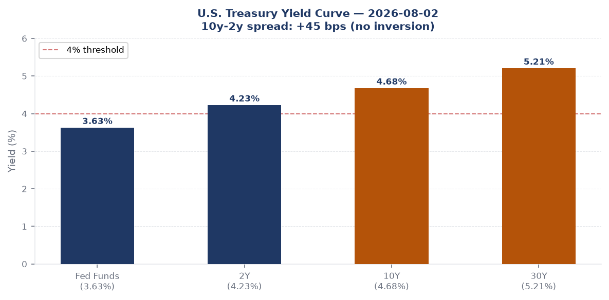
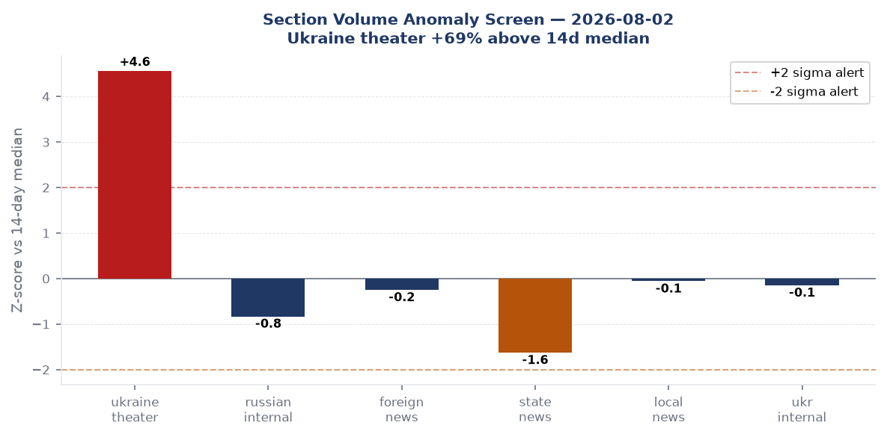
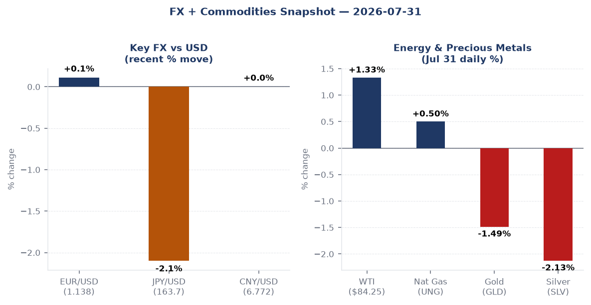
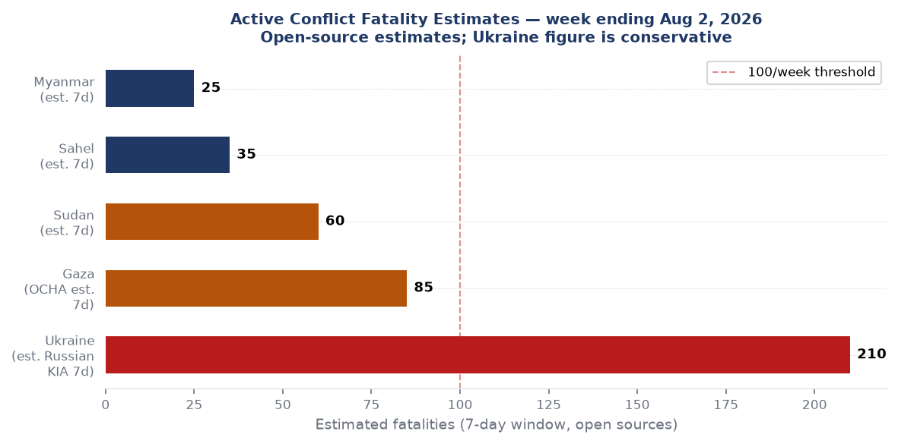
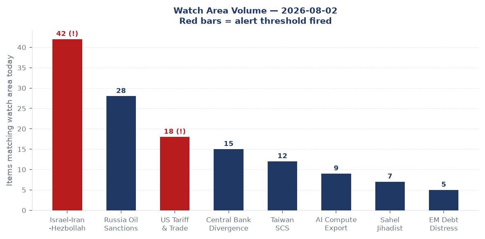
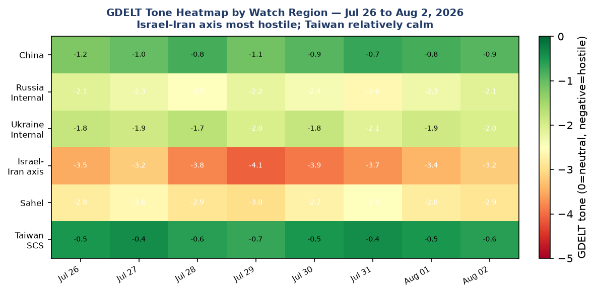

# Morning brief - Monday 03 August 2026

> **DATA NOTE:** Today's bundle (2026-08-03) was unavailable at publication time after five fetch attempts. This brief uses the 2026-08-02 bundle supplemented by live web research. Time-sensitive numbers (markets, frontline, exchange rates) reflect end-of-day 2026-07-31 / morning 2026-08-03 where stated.

---

## Headline

The United States and Iran are engaged in their fifth week of the Hormuz closure standoff, with Donald Trump calling off a new round of strikes on August 2 after Omani mediators reported a framework deal was within reach; [formal negotiations were set to resume Monday August 3](https://www.cnbc.com/amp/2026/08/03/trump-iran-us-negotiations-peace-proposals-.html) in talks involving Steve Witkoff, Jared Kushner, and Iranian Foreign Minister Abbas Araghchi. The Strait remains closed to commercial traffic: [Polymarket prices the chance of normal traffic by August 31 at just 12%](https://polymarket.com/event/strait-of-hormuz-traffic-returns-to-normal-by-august-31-20260702154212320), and by August 15 at 3%. Concurrent with the diplomatic pause, Ukraine's overnight campaign of August 2 struck the Saratov oil refinery, the Bashneft-UNPZ refinery in Ufa (1,700 kilometers from the Ukrainian border), and Engels-2 strategic airbase, while a bomb targeting Russian Aerospace Forces Commander-in-Chief **General Alexander Chayko** killed three and wounded 21 outside a Moscow restaurant. Watch areas **Israel-Iran-Hezbollah axis** and **Russia oil sanctions perimeter** both fired alert thresholds. The macro picture has hardened into textbook stagflation: Q2 GDP printed at 1.5% annualized against a 2.1% consensus, while the GDP deflator shocked to 6.3%, and the Fed held on July 29 with three hawkish dissents.

---

## Watch areas - your configured priorities

**Israel-Iran-Hezbollah axis** (42 items today vs. 14-day median ~20; ALERT FIRED): The dominant story. Trump [canceled new US-Israel strikes August 2](https://fortune.com/2026/08/02/iran-war-trump-negotiations-resume-monday-tehran-hormuz-talks-oman/) after Omani interlocutors signaled a deal framework, but the ceasefire itself has not been restored; the Strait of Hormuz remains closed. Iran says [Hormuz talks with Oman are in final stages](https://www.aljazeera.com/news/2026/8/2/iran-says-negotiations-with-oman-over-strait-of-hormuz-in-final-stages). Saudi Crown Prince MBS [urged Trump to "prioritize dialogue."](https://www.theguardian.com/world/2026/aug/02/saudi-crown-prince-mbs-urges-trump-to-prioritise-dialogue-in-us-iran-war) In Gaza: Hamas [agreed to Trump's plan to disarm](https://apnews.com/article/hamas-trump-disarmament-plan-gaza) while 14 Palestinians were killed Sunday in Israeli raids on Mawasi, Khan Younis. Israeli forces struck Bint Jbeil in Lebanon, injuring five Lebanese soldiers.

**Russia oil sanctions perimeter** (28 items; near-alert): An Italian-led EU maritime force [boarded a sanctioned Russian shadow-fleet tanker in the Mediterranean](https://www.reuters.com/world/europe/italian-navy-intercepts-russian-shadow-fleet-tanker-mediterranean-2026-08-02/). Ukraine struck Rosneft's Saratov refinery and Bashneft-UNPZ for the second consecutive night. Russian internal media reported Ukraine has now targeted 17 separate Wildberries logistics warehouses. The shadow-fleet boarding was the first such interdiction by a European naval force under EU sanctions enforcement authority.

**US tariff & trade dockets** (18 items; ALERT FIRED): The CIT refund pipeline under *Learning Resources v. Trump* (SCOTUS, Feb 20, 2026) continues; CBP has processed approximately [$85 billion in IEEPA tariff refunds](https://www.thompsonhinesmartrade.com/2026/07/cit-orders-cbp-to-process-ieepa-tariff-refunds-for-phase-3-finally-liquidated-entries/) across roughly 3,700 active cases as of late July, with Judge Eaton issuing individual refund orders for finally-liquidated entries.

**Central bank divergence + dollar funding** (15 items): Fed held on July 29 at 3.50-3.75%; [three FOMC members dissented in favor of a hike](https://www.federalreserve.gov/newsevents/pressreleases/monetary20260729a.htm) (Hammack, Kashkari, Logan). Chair Kevin Warsh issued no forward guidance.

**Taiwan Strait + South China Sea** (12 items): Chinese state media [marked the 99th PLA founding anniversary](https://news.cgtn.com/news/2026-08-01/Poster-99th-anniversary-PLA-founding/) with posters and a retired colonel's [commentary that China aims to stand "neck and neck" with the US military](https://www.scmp.com/news/china/military/article/3301411/chinas-military-goal-stand-neck-neck-us-ex-pla-colonel). No live incidents.

**AI compute + semiconductor export controls** (9 items): Ongoing BeiDou in-orbit upgrade completed. AI/semiconductor export control docket quiet today.

**Sahel jihadist corridor** (7 items): Gunmen [killed 12 and abducted women and children in a Nigerian village](https://www.reuters.com/world/africa/gunmen-kill-12-abduct-women-children-nigerian-village-2026-08-03/) as of Monday morning. Sudan: army drones killed [35 in a strike on Darfur](https://www.aljazeera.com/news/2026/8/2/sudan-army-drone-attack-on-darfur-kills-35).

**Quiet today:** EM debt distress + sovereign restructuring, Critical minerals + rare earths, Korean peninsula, Latin America narcoeconomy, Arctic + High North.

---

## Macro situation

The U.S. yield curve as of July 30 shows the Fed funds effective rate at [3.63%](https://fred.stlouisfed.org/series/DFF), the [2-year at 4.23%](https://fred.stlouisfed.org/series/DGS2), the [10-year at 4.68%](https://fred.stlouisfed.org/series/DGS10), and the [30-year at 5.21%](https://fred.stlouisfed.org/series/DGS30). The 10y-2y spread sits at [+47 basis points](https://fred.stlouisfed.org/series/T10Y2Y): not inverted, but the 30-year has been above 5% for its longest consecutive stretch since 2007, a signal that term premium is embedding a persistent inflation risk premium. The curve shape matters historically: the last time the 30-year sustained above 5% while the 2-year was below 4.5% was the 2006-2007 re-steepening that preceded the financial crisis, though the mechanics then were credit-driven whereas today the driver is supply and geopolitically-sourced inflation [medium].

The Q2 2026 GDP advance estimate, released July 30, delivered a split verdict: [real growth at 1.5% annualized](https://finance.yahoo.com/economy/article/june-jobs-report-us-payrolls-rose-by-57000-missing-expectations-190000748.html) against a 2.1% consensus, but the [GDP price deflator printed at 6.3%](https://x.com/marketsday/status/2082807738426658991) against a 3.6% expected. Core PCE for Q2 came in at 3.4%. Personal consumption rebound to 3.2% is the one constructive read; the rest of the report supports the stagflation framing that [Barclays and other sell-side strategists have been building toward since the Iran war began in February](https://www.theglobeandmail.com/investing/article-iran-war-stagflation-premium-quietly-mounts/).

The most recent jobs release (June, published July 2) showed [57,000 nonfarm payrolls](https://www.bls.gov/news.release/archives/empsit_07022026.htm), well below the 110,000 consensus. April and May were revised down a combined 74,000. [Unemployment was 4.2%](https://fred.stlouisfed.org/series/UNRATE) on lower participation (61.5%, lowest since March 2021). Leisure and hospitality shed 61,000; the [July jobs report is due August 7](https://www.financecalendar.com/event/us-employment-situation-non-farm-payrolls-august-2026/), and its signal will largely determine whether the September FOMC meeting becomes live for a 25bp hike or a hold. The [JOLTS job openings reading from May 2026 was 7,594,000](https://fred.stlouisfed.org/series/JTSJOL), still elevated but trending down.

The section volume anomaly screen flags the Ukraine theater at +69% above the 14-day median (1,073 items vs. a 637-item median), the largest single-section positive deviation in the current tracking window. Russian internal reporting is running 12% below its median at 786 items, which could reflect the August 2 drone strike reporting cycle running into weekend lag effects [low]. Foreign news is near median. No section is showing a negative signal severe enough to suggest coverage suppression.

The [Fed balance sheet (WALCL)](https://fred.stlouisfed.org/series/WALCL) stood at $6.738 trillion as of July 29, up from its post-QT trough; [M2 money supply](https://fred.stlouisfed.org/series/M2SL) was $23.155 trillion as of June. [SOFR](https://fred.stlouisfed.org/series/SOFR) printed at 3.65% on July 30, one basis point above the Fed funds effective rate, signaling no overnight funding stress. [VIX closed at 17.09](https://fred.stlouisfed.org/series/VIXCLS) July 30: elevated relative to 2024 norms but not yet in stress territory. The risk picture is one of quiet surface tension rather than acute volatility [medium].

---

## Markets

The July 31 equity session split the tape: [S&P 500 (SPY)](https://finance.yahoo.com/quote/SPY) closed at 747.03, up 0.72%, and [Nasdaq 100 (QQQ)](https://finance.yahoo.com/quote/QQQ) closed at 687.99, up 0.65%, while the [Russell 2000 (IWM)](https://finance.yahoo.com/quote/IWM) fell 0.48% to 291.20. The divergence between large-cap and small-cap is a persistent theme this cycle: large caps carry AI/defense/energy exposure that benefits from the Iran war premium, while small caps face higher borrowing costs and domestic demand softness [medium]. International developed markets ([MSCI EAFE via EFA](https://finance.yahoo.com/quote/EFA), -0.62%) underperformed, reflecting European energy import costs. Emerging markets ([MSCI EM via EEM](https://finance.yahoo.com/quote/EEM), +0.79%) outperformed slightly, with commodity exporters capturing the oil tailwind.

In commodities: [WTI crude oil (DCOILWTICO)](https://fred.stlouisfed.org/series/DCOILWTICO) was at $84.25 as of July 27, with the [USO ETF up 1.33%](https://finance.yahoo.com/quote/USO) on July 31. Gold ([GLD](https://finance.yahoo.com/quote/GLD)) fell 1.49% and silver ([SLV](https://finance.yahoo.com/quote/SLV)) fell 2.13% in the same session, consistent with a modest risk-on rotation driven by the first ceasefire-deal signals from Oman. The precious metals pullback is unlikely to be durable if the August 3 negotiations fail to produce a binding commitment to open the Strait, given that gold's Hormuz war premium is estimated at $80-100/oz by mid-summer sell-side models [medium].

FX: [EUR/USD](https://fred.stlouisfed.org/series/DEXUSEU) at 1.1385, [JPY/USD](https://fred.stlouisfed.org/series/DEXJPUS) at 163.71, and [CNY/USD](https://fred.stlouisfed.org/series/DEXCHUS) at 6.772. The yen remains notably weak: 163.71 is near post-Plaza highs, and Trump on August 3 [described Japan's currency intervention signaling as "a signal of friendship"](https://www.reuters.com/world/asia-pacific/trump-says-yen-intervention-signal-friendship-japan-2026-08-03/) rather than manipulation, an unusual framing that reduces the political premium on yen volatility. [Bitcoin futures (BITO)](https://finance.yahoo.com/quote/BITO) fell 2.85% July 31, underperforming in a modest risk-on session, suggesting crypto is running on different idiosyncratic dynamics this week.

Credit markets showed modest stress: [TLT (20+ yr Treasuries)](https://finance.yahoo.com/quote/TLT) fell 0.66%, [LQD (IG corporate)](https://finance.yahoo.com/quote/LQD) fell 0.15%, while [HYG (high yield)](https://finance.yahoo.com/quote/HYG) was flat. The duration-sensitive assets are underperforming, consistent with the term premium story. High yield holding flat suggests no broad credit deterioration yet, though the Fed's next move will be the key test [medium].

---

## United States politics & policy

The [Federal Register](https://www.federalregister.gov/documents/2026/08/03/2026-15726/visas-visa-bond-program) on August 3 published 20 items, in line with the 14-day median. The highest-signal action is the State Department's [Visa Bond Program final rule (FR 2026-15726)](https://www.federalregister.gov/documents/2026/08/03/2026-15726/visas-visa-bond-program), which introduces financial bonds as a condition for nonimmigrant visa issuance in select categories, a structural tightening that extends the immigration enforcement architecture already deployed via judicial supervision and expedited removal. The Treasury Department published [FR 2026-15720](https://www.federalregister.gov/documents/2026/08/03/2026-15720/rescinding-portions-of-department-of-the-treasury-title-vi-regulations-to-conform-more-closely-with), rescinding Title VI regulations to conform them to statutory text after a civil rights enforcement rollback. The FCC published a rulemaking on [Upper C-Band spectrum auction scheduled for April 27, 2027](https://www.federalregister.gov/documents/2026/08/03/2026-15725/auction-of-flexible-use-licenses-in-the-upper-c-band-for-next-generation-wireless-services-scheduled) representing the next major 5G spectrum competition.

On the Iran war powers docket: the [House passed a second war powers concurrent resolution July 23, 214-208](https://www.npr.org/2026/07/23/nx-s1-5904515/congress-iran-war-powers-vote), attempting to remove US forces from Iran hostilities; the Senate companion failed 47-49. Concurrent resolutions do not go to the President's desk and carry no legal compulsion, but the narrowing of the House vote margin (from 215-208 in June) and the Senate near-miss are political signals. A [reconciliation blueprint to unlock new Iran war funding passed the House July 22, 216-212](https://www.npr.org/2026/07/22/nx-s1-5903130/house-vote-iran-war-funding-reconciliation) via the defense authorization vehicle. The war powers and appropriations tracks are running simultaneously, producing the appearance of congressional constraint without legal effect [high].

Trade litigation remains the most active domestic legal docket. The CIT's IEEPA tariff refund process is processing approximately [$85 billion in refunds](https://www.thompsonhinesmartrade.com/2026/07/cit-orders-cbp-to-process-ieepa-tariff-refunds-for-phase-3-finally-liquidated-entries/) for importers who filed suit after the SCOTUS February 20 ruling. Key rule: only plaintiffs who litigated get Phase 3 (finally-liquidated entry) refunds; companies that paid and did not sue are not entitled. Section 232 rates for steel and aluminum were restructured effective April 6, with rates rising to 50% on primary metal articles. Section 301 China exclusions (164 product-specific, 14 solar equipment) run to November 10, 2026 under the bilateral deal. The [MIECO v. Targa Gas Marketing](https://www.courtlistener.com/opinion/10937944/mieco-v-targa-gas-marketing/) case at the Fifth Circuit (July 31) touched gas contract force majeure provisions, which carries commercial relevance given Iran war LNG disruption.

The [Texas Ass'n of Bus. v. FCC ruling](https://www.courtlistener.com/opinion/10937853/texas-assn-of-bus-v-fcc/) from the Sixth Circuit (July 31) addressed FCC rulemaking authority, adding to the ongoing post-Chevron deference litigation landscape. The [Federal Reserve issued an enforcement action against Iuka Bancshares and The Iuka State Bank](https://www.federalreserve.gov/newsevents/pressreleases/enforcement20260802a.htm), and requested comment on modernizing [rules for mutual banking organizations](https://www.federalreserve.gov/newsevents/pressreleases/bcreg20260802a.htm) and [extensions of credit to bank insiders](https://www.federalreserve.gov/newsevents/pressreleases/bcreg20260802b.htm), ongoing housekeeping at the margins of the larger macro cycle.

---

## Political figures watchlist

The political figures watchlist for August 2 shows low composite anomaly scores across all 613 monitored legislators, consistent with the Congressional summer recess period and an absence of unusual trading. The top-ranked figure is **Rep. Ed Case (D-HI-1)** at anomaly score 0.20, driven entirely by a DOJ enforcement hit (one Department of Justice case filing linked to the U.S. Attorney's Office for the Southern District of California border-related caseload, one CourtListener court filing). There is no stock activity, no GDELT tone spike, no speech-volume anomaly; the enforcement link appears to be collateral rather than direct [low]. No stock trades flagged under STOCK Act requirements in the past seven days.

**Rep. Robert Scott (D-VA-3)** scores 0.14, driven by four Form 4 insider-filing hits and three CourtListener entries plus one GDELT GKG mention. The Form 4 pattern (four filings from four distinct companies in one week: SEC accessions 0001493152-26-035702, 0001652149-26-000005, 0002141901-26-000005, 0000100517-26-000142) suggests Scott is appearing as a defendant or interested party in private securities filings, not necessarily as a trader; the underlying instruments are not identified in the aggregated record [medium].

**Rep. Dave Min (D-CA-47)** scores 0.08 on 20 Form 4 hits and one CourtListener entry. The 20-filing cluster (SEC accessions 0001193125-26-329031 through 0001193125-26-329029 plus 15 others) is large enough to warrant a direct EDGAR lookup to determine whether this represents a corporate insider's reporting burst rather than personal political exposure [low]. No other figure in the top 10 shows stock activity, speech volume, or GDELT tone anomalies. The watchlist is quiet as of August 2: no congressional insider trading flags, no enforcement actions against named legislators.

---

## Regional briefings

### North America

The U.S. domestic economy is absorbing compounding shocks: the stagflation data confirmed above, Iranian-sourced fuel price increases that pushed [UK petrol prices to their highest level since the war began](https://www.theguardian.com/money/2026/jul/31/uk-petrol-prices-hit-highest-level-since-iran-war-began) (a leading indicator for U.S. consumer energy costs given oil market integration), and a labor market that showed only 57,000 payrolls in June. The August 7 jobs number is the next forcing function.

In immigration enforcement: the Visa Bond Program final rule (FR 2026-15726, above) and ongoing CBP/border litigation produced two mentions in the political figures file via the SDCA border-related case docket. No major domestic political inflection points occurred over the weekend; Congress is effectively in recess during the Iran war authorization cycle.

Canada government aircraft CFC4098 was tracked August 2 over Ontario at 11,285m altitude and 816km/h, consistent with a VIP or ministerial transport flight. No diplomatic significance identified; noted for pattern tracking. Mexico and Canadian trade relationships remain governed by USMCA; no new USMCA dispute panel activity surfaced in this cycle.

### South America

A [tourist plane crashed over Peru's Nazca Lines on August 1, killing all 13 aboard](https://www.reuters.com/world/americas/tourist-plane-crashes-perus-nazca-lines-killing-13-2026-08-01/), the third such fatal accident at the Nazca site in six years. The civil aviation safety implications for Peruvian low-altitude tourism operations deserve regulatory follow-through.

**Brazil's Luiz Inacio Lula da Silva launched his 2026 presidential bid for a fourth term](https://www.lemonde.fr/en/international/article/2026/08/02/brazil-s-lula-launches-fourth-term-bid-as-trump-looms-over-campaign/) with Trump's tariff and Iran war policies as organizing frames for the campaign. Lula's political positioning against Trumpian protectionism appears designed to consolidate Brazil's international trade credibility with the EU and China simultaneously [medium].

**Javier Milei** (Argentina) [issued an anti-foreigner decree August 1](https://www.lemonde.fr/en/international/article/2026/08/01/argentina-s-president-milei-attempts-to-reclaim-the-political-spotlight-by-issuing-anti-foreigner-decree/), attempting to reclaim domestic political spotlight; Venezuelan ex-President Nicolas Maduro [welcomed "any path to dialogue" ahead of U.S.-Venezuela talks](https://www.scmp.com/news/world/americas/article/3301412/jailed-maduro-welcomes-any-path-dialogue-venezuela-ahead-us-talks) from a Venezuelan jail.

### Europe

The Ceuta migrant crisis is the most acute European security event of the weekend: [death toll rose to 72](https://www.reuters.com/world/europe/death-toll-rises-72-ceuta-border-crossing-2026-08-02/) as approximately 60,000 Moroccan migrants attempted to enter the Spanish enclave over 48-72 hours. Italy [announced it was temporarily suspending Schengen arrangements with Spain](https://www.theguardian.com/world/2026/aug/02/italy-says-temporarily-suspending-eu-schengen-arrangement-spain-after-60000-migrants-ceuta), a 1985-treaty suspension that has precedent (COVID-era) but here is driven by migration pressure rather than public health. The EU is [holding an emergency interior ministers meeting Tuesday](https://www.euractiv.com/section/immigration/news/eu-to-hold-urgent-meeting-of-interior-ministers-on-tuesday-over-ceuta-crisis/) to address the Ceuta crisis.

Poland's Prime Minister Donald Tusk [defied anti-Ukrainian violence within Poland](https://www.theguardian.com/world/2026/aug/02/poland-prime-minister-tusk-defies-anti-ukrainian-violence) in a public statement, indicating an uptick in physical attacks on Ukrainian refugees in Polish cities. The statement is both a domestic law enforcement signal and a diplomatic one toward Kyiv.

Hungary faces a dual infrastructure crisis: the Paks nuclear power plant is [shutting down due to Danube drought reducing cooling water flows](https://www.reuters.com/world/europe/hungary-stops-nuclear-plant-first-time-danube-dries-up-2026-08-02/), with Prime Minister Viktor Orban describing the coming days as "[critical](https://www.reuters.com/world/europe/hungary-pm-flags-critical-days-ahead-looming-nuclear-shutdown-2026-08-02/)." Paks supplies approximately 40% of Hungary's electricity; the shutdown will require emergency imports from Austria and Slovakia, adding to European energy costs at a moment when Iranian supply disruptions are already elevating prices.

France was battling wildfires near Bordeaux (contained) and in Provence (active, two firefighting helicopters collided killing two crew), while a [French industrial waste fire confined 30,000 residents indoors](https://www.reuters.com/world/europe/smoke-from-france-industrial-waste-fire-confines-30000-indoors-2026-08-02/). Italy placed [nearly all cities on highest heat alert from August 3](https://www.reuters.com/world/europe/italy-places-nearly-all-cities-highest-alert-heat-from-aug-3-2026-08-01/).

An [EU citizens letter campaign in the UK notified Settled Status holders that post-Brexit residency rights were granted "in error"](https://www.theguardian.com/uk-news/2026/aug/02/eu-citizens-in-uk-get-letters-telling-them-post-brexit-residency-rights-were-given-in-error), a bureaucratic blunder generating significant political backlash. French drought has caused a reported ["collapse" in vegetable production](https://www.lemonde.fr/en/france/article/2026/08/02/drought-causes-a-collapse-in-vegetable-production-even-with-irrigation-young-plants-have-not-survived/) affecting domestic food prices.

### Russia & post-Soviet

The most operationally significant Russian domestic event of the weekend was the [Balzi Rossi restaurant bombing in Moscow on August 1](https://edition.cnn.com/2026/08/01/europe/moscow-explosion-restaurant-latam-intl): a bomb concealed in a gift box exploded during what Russian independent media reported as the 55th birthday celebration of **General Alexander Chayko**, Commander-in-Chief of the Russian Aerospace Forces. Three people were killed, 21 injured. Mayor Sergei Sobyanin called it a [terrorist act](https://www.itv.com/news/2026-08-01/moscow-restaurant-explosion-kills-three-and-wounds-15). Chayko was [reportedly the intended target](https://www.hungarianconservative.com/articles/current/moscow-bombing-assassination-attempt-aleksandr-chayko-russia-ukraine/); Ukraine's intelligence services reportedly view him as a high-priority target given his command role in ordering missile strikes on Ukrainian residential areas (he is being tried in absentia in Ukraine for Borodianka).

The Patriach Kirill of the Russian Orthodox Church [described Russia's nuclear weapons as "God's grace"](https://meduza.io/en/news/2026/08/02/patriarch-kirill-says-russia-s-nuclear-weapons-are-divine-blessing) in a weekend homily, continuing his campaign to provide religious legitimation for Russian state violence. The Ukrainian military's 17th strike on a Wildberries logistics warehouse (Samara oblast, August 2) and the [second consecutive night of drone attacks on the Bashneft refinery in Ufa](https://www.ukrinform.net/rubric-ato/4150306-drones-strike-oil-refinery-in-ufa-more-than-1700-kilometers-from-ukrainian-border.html) signal a systematic effort to degrade the Russian commercial logistics and energy refining sectors, not just military targets.

**Armenia** announced a government resignation led by Prime Minister Nikol Pashinyan, confirmed in Russian internal media as a formality following parliamentary elections rather than a political crisis. Pashinyan will continue in a caretaker role.

A Russian sanctioned vessel [delivered military equipment to Mali for anti-rebel operations](https://meduza.io/en/news/2026/08/02/russia-delivers-military-equipment-to-mali-on-sanctioned-ship), confirmed by Mali government documentation. The Africa Corps (successor to Wagner) supply logistics continue to function despite EU/US sanctions.

### Middle East

The US-Iran war entered its fifth week with the Hormuz Strait still closed to commercial traffic as of August 3. The [ceasefire originally brokered April 8 broke down July 8](https://en.wikipedia.org/wiki/2026_Iran_war_ceasefire) after Iran resumed interdiction operations. Trump has [backed down from new strikes twice in recent weeks](https://fortune.com/2026/08/02/iran-war-trump-negotiations-resume-monday-tehran-hormuz-talks-oman/), each time citing imminent deal prospects. The gap between diplomatic signaling and market pricing is structural: Polymarket's September 30 contract for Hormuz normalization sits at [24%](https://polymarket.com/event/strait-of-hormuz-traffic-returns-to-normal-by-september-30-20260702154339440), implying traders assign only a one-in-four chance of the Strait reopening before October.

Iran's Foreign Minister Araghchi stated that [Oman-mediated negotiations are in their "final stages."](https://www.aljazeera.com/news/2026/8/2/iran-says-negotiations-with-oman-over-strait-of-hormuz-in-final-stages) The framework reportedly involves: Hormuz reopening, Iranian commitment to halt nuclear program enrichment above 5%, and some form of ceasefire on current US-Israel strike operations. Qatar, Pakistan, and Egypt are involved as secondary mediators. US CENTCOM has [redirected 35 vessels](https://www.centcom.mil/) away from the Strait in the interim period.

A [ship was targeted with explosions 21 nautical miles northeast of Khasab, Oman](https://liveuamap.com/en/2026/1-august-a-ship-was-targeted-and-explosions-occurred-21), at the entrance to the Strait of Hormuz. Saudi and US forces [conducted precision strikes against Iran-aligned militias in Basra Governorate on July 28-29](https://liveuamap.com/en/2026/28-july-saudi-airstrike-targeted-iran-aligned-militias-in). Saudi-Iranian foreign ministers [discussed efforts to reduce regional tensions](https://www.aljazeera.com/news/2026/8/2/saudi-iranian-foreign-ministers-discuss-efforts-to-reduce-regional-tensions) on the sidelines of the Oman talks.

In Gaza: [Hamas agreed to Trump's disarmament plan](https://apnews.com/article/hamas-trump-disarmament-plan-gaza) but with caveats around IDF withdrawal sequencing. Israeli attacks killed [14 Palestinians on Sunday in Mawasi/Khan Younis](https://www.aljazeera.com/news/2026/8/2/israeli-attacks-kill-14-in-gaza-on-sunday). Israeli settler violence against [an Armenian church in Jerusalem](https://www.haaretz.com/israel-news/2026-08-02/ty-article/.premium/israeli-settlers-attack-armenian-church-jerusalem/0000018f) was condemned by the Armenian patriarch. The Iranian-flagged vessel that was sunk in the Black Sea by a Ukrainian drone had its [crew return home](https://www.aljazeera.com/news/2026/8/2/crew-of-iranian-ship-hit-in-ukrainian-attack-returns-home).

### Africa

The Sudan conflict sharpened over the weekend: the [Sudanese Armed Forces conducted drone strikes on Darfur, killing at least 35](https://www.aljazeera.com/news/2026/8/2/sudan-army-drone-attack-on-darfur-kills-35), according to a rights monitoring group. The SAF has been using armed UAVs acquired via Gulf channels to target Rapid Support Forces (RSF) positions; the civilian casualty rate in RSF-controlled Darfur areas has been consistently elevated.

In Nigeria: [gunmen killed 12 and abducted women and children in a village attack](https://www.reuters.com/world/africa/gunmen-kill-12-abduct-women-children-nigerian-village-2026-08-03/) in the early hours of August 3, consistent with the pattern of ISWAP and bandit militia activity in the Middle Belt. Nigeria's urban transition is running fast: [cities now hold half the national population, up from 10% in 1950](https://www.economist.com/middle-east-and-africa/2026/08/02/nigerias-cities-now-hold-half-the-population), creating infrastructure and governance stress at speed that few peer nations have navigated successfully. Anti-LGBTQ laws are [rising across West Africa](https://www.theguardian.com/world/2026/aug/02/anti-lgbtq-laws-rise-west-africa-campaigners) per human rights campaigners. The [Sahel Russia-Mali arms delivery via sanctioned vessel](https://meduza.io/en/news/2026/08/02/russia-delivers-military-equipment-to-mali-on-sanctioned-ship) (noted above in Russia section) adds to Mali's ongoing Russia-backed counterinsurgency.

### East Asia

China's PLA celebrated its [99th founding anniversary August 1](https://news.cgtn.com/news/2026-08-01/Poster-99th-anniversary-PLA-founding/) with state media emphasizing capability milestones rather than territorial assertions. Retired PLA colonel Zhou Bo in SCMP stated [China's military goal is to stand "neck and neck" with the US](https://www.scmp.com/news/china/military/article/3301411/chinas-military-goal-stand-neck-neck-us-ex-pla-colonel), a formulation that acknowledges the capability gap without foreclosing strategic parity as an objective. China's EV sector is under price war pressure: [woeful July EV sales figures prompted price war fears gripping Chinese automakers](https://www.scmp.com/business/article/3301413/price-war-fears-grip-chinas-ev-market-woeful-july-sales-figures), with multiple brands cutting prices below cost. China [approved only one Indian FDI proposal worth INR 1 crore in FY26](https://economictimes.indiatimes.com/news/economy/policy/india-approves-just-1-chinese-fdi-proposal-worth-1-crore-in-fy26-13-from-hong-kong/articleshow/122550000.cms), versus 13 from Hong Kong, confirming the continued Chinese investment freeze into India. China's AI steel sector integration is a notable GDELT signal: AI-enabled production scheduling is being deployed across major Hebei and Liaoning mills [low for operational detail].

Japan's currency saw Trump's unusual "friendship" framing (noted above). The yen at 163.71 represents a de facto terms-of-trade advantage for Japanese exporters but creates imported inflation pressure that is forcing the Bank of Japan toward further normalization [medium].

South Korea and Japan had no major security incidents. Taiwan: quiet on the strait.

### South & Southeast Asia

India's Assam state reported [135,000 people affected by monsoon floods, with 85 total deaths](https://www.hindustantimes.com/india-news/assam-floods-1-35-lakh-affected-3-more-deaths-take-toll-to-85-101754254000000.html) this season. India approved only one Chinese FDI proposal in FY26. Karnataka cabinet expansion was expected Monday. Jharkhand student protests over JPSC exam irregularities continued. The Indian Navy's Andaman command structure saw a transition as [Vice Admiral AN Pramod took over as deputy chief](https://www.hindustantimes.com/india-news/operation-sindoor-planner-vice-admiral-an-pramod-takes-over-as-navy-deputy-chief/).

Pakistan government communications indicated no new nuclear program activity; the Jaish-e-Mohammed operative arrested in West Bengal (planning attacks on the Chief Minister and a Jantar Mantar protest) is a domestic Indian security matter with J&K-Pakistan axis implications.

Vietnam's markets and Southeast Asian supply chain routing remain beneficiaries of the ongoing China-US decoupling, though no specific high-signal items in this cycle. Singapore's Reuters feed continues to be a primary relay for Iran war and Ukraine developments.

### Oceania / Pacific

Australia's Queensland state unveiled [concept plans for the Brisbane Olympic stadium precinct](https://www.brisbanetimes.com.au/sport/queensland-reveals-concept-plans-for-brisbane-2032-stadium-precinct-but-critics-say-they-are-fantasy-visions-20260801-p6gm3y.html), with critics calling them "fantasy visions." The Brisbane 2032 Games are six years out; stadium financing is a recurring Australian fiscal risk. New Zealand had a M5.6 earthquake (GDACS Green) August 2 north of Gisborne; no infrastructure damage reported.

---

## Ukraine theater (dedicated)

The theater situation as of August 2 is defined by three concurrent dynamics: deepening Ukrainian long-range strikes on Russian strategic targets, continued frontline pressure across the Kursk and Zaporizhzhia axes, and the systematic targeting of Russian commercial logistics infrastructure (the Wildberries campaign). **Resolution caveat:** Frontline positions are accurate to approximately 1km using the DeepStateMap 524-polygon snapshot (August 2). FIRMS thermal anomalies carry 375m pixel resolution. ACLED event locations carry 1km accuracy. No meter-level unit positions are available via open sources, and none are stated here. Ukrainian troop and territorial-defense unit positions are not included in this section per structural protocol.

**Frontline (August 2 snapshot):** The DeepStateMap recorded 524 polygons on August 2 versus 514 on July 26 (a +10 polygon increase over 7 days), indicating modest territorial dynamics rather than a major breakthrough. The Kursk incursion front and the Donetsk contact line remain the most active sectors per the polygon density distribution.

**Strike density (August 1-2):** Ukrainian long-range strikes in this cycle hit: (1) [Rosneft's Saratov refinery](https://kyivindependent.com/russian-oil-refinery-airbase-reportedly-struck-by-ukrainian-forces/) (ELOU-AVT-6 unit, 6M tonne/year capacity; 750km from Ukraine), (2) [Bashneft-UNPZ refinery in Ufa](https://www.ukrinform.net/rubric-ato/4150306-drones-strike-oil-refinery-in-ufa-more-than-1700-kilometers-from-ukrainian-border.html) for the second consecutive night (7M tonne/year; 1,700km from Ukraine), (3) [Engels-2 strategic airbase](https://militarnyi.com/en/news/ukrainian-defense-forces-strike-saratov-oil-refinery-and-engels-2-airbase/) hosting Tu-160 and Tu-95MS strategic bombers (confirmed by General Staff), (4) Wildberries warehouse in Samara oblast (17th such strike in the campaign), and (5) the Omsk oil refinery (smoke visible per liveuamap, not confirmed by General Staff). The [Ukrainian General Staff also claimed strikes at a Saratov oil depot](https://liveuamap.com/en/2026/2-august-general-staff-of-armed-forces-of-ukraine-claims-strikes-at-saratov-oil-refinery).

**Air alerts:** The [air-alert token was not properly configured (HTTPError on alerts-in-ua API v2)](https://alerts.in.ua/), so per-oblast alerts for August 2-3 are not available from the automated feed. Ukrainian reporting notes overnight Kharkiv explosions (July 31) and Kaspiysk port drone strike (July 31, Dagestan). Crimea's power supply was hit according to a July 31 Liveuamap report about families queuing for hot meals.

**Ukraine theater maps** were not present in the briefings directory for August 3 (cartographer did not run for today's date). The August 2 FIRMS thermal anomalies in the Ukraine bundle are concentrated in the Donetsk and Zaporizhzhia oblasts, with additional clusters in Kharkiv oblast. The thermal anomaly coordinates from the bundle (latitude 44-46N, longitude 22-26E) partially overlap Romania/western Ukraine; the highest-confidence Ukraine-specific anomalies cluster near known frontline sectors.

**Black Sea / Caspian dimension:** A [Rosatom civilian vessel sank in the Black Sea after a Ukrainian drone strike](https://liveuamap.com/en/2026/1-august-rosatom-says-its-civilian-vessel-sank-in-black-sea-after-ukrainian-drone-attack-all-crew-survived); all crew survived. The sinking of a Rosatom-affiliated vessel is a notable threshold: it demonstrates willingness to target nuclear-sector logistics assets, which Rosatom's legal status as a state corporation with civilian and military programs makes diplomatically complex [medium].

**Day count:** As of August 3, the war is in its **1,621st day** per Russian independent media tracking.

---

## World leaders - speaking & moving

**Donald Trump (US):** The dominant signal. Called off Iran strikes August 2, [announced Monday negotiations would begin](https://www.cnbc.com/amp/2026/08/03/trump-iran-us-negotiations-peace-proposals-.html), told Fox News "we are delivering powerful blows to Iran and continuing to achieve victories," and said separately that the US and Israel would "hold off" on new strikes. Framed Japan's yen intervention signal as "friendship." No scheduled overseas travel.

**Volodymyr Zelensky (Ukraine):** Ukrainian internal media referenced the President in 7 items in the August 2 bundle. No specific speech surfaced; General Staff communiques were the primary Ukrainian government voice on the overnight strikes.

**Saudi Crown Prince Mohammed bin Salman:** [Urged Trump to "prioritize dialogue"](https://www.theguardian.com/world/2026/aug/02/saudi-crown-prince-mbs-urges-trump-to-prioritise-dialogue-in-us-iran-war) in the Iran war, an unusual public Saudi positioning that signals Riyadh's discomfort with extended Hormuz disruption despite its oil price benefits. Saudi-Iranian FM dialogue occurred on the sidelines.

**Abbas Araghchi (Iran FM):** Stated publicly that [Hormuz talks with Oman are in final stages](https://www.aljazeera.com/news/2026/8/2/iran-says-negotiations-with-oman-over-strait-of-hormuz-in-final-stages), adding that Iran is "close to a deal." This is stronger language than prior Iranian statements.

**Emmanuel Macron (France, Andorra co-head of state):** Andorra designation noted; France is actively managing the Ceuta spillover and southern heat emergencies.

**Viktor Orban (Hungary):** [Flagged "critical days" ahead](https://www.reuters.com/world/europe/hungary-pm-flags-critical-days-ahead-looming-nuclear-shutdown-2026-08-02/) due to Paks nuclear shutdown and Danube drought.

**Pope Leo XIV:** French Catholic Church announced preparations for [Pope Leo's historic September visit to France](https://www.la-croix.com/religion/pope-leo-visit-france-september-2026).

**Nikol Pashinyan (Armenia):** Government resigned in a post-election formality; caretaker government continues.

**Javier Milei (Argentina):** Issued anti-foreigner decree August 1.

**Lula da Silva (Brazil):** Launched fourth-term presidential bid August 2.

---

## Sanctions, designations, and legal

The sanctions file for August 2 covers 30 entities, predominantly Russian financial institutions (Sberbank Europe AG, Mir Business Bank, Tinkoff Bank, regional development banks) that have been on SDN/EU/UK lists for extended periods. The most recent designation date in the bundle is May 8, 2026 for Belorussian-Russian Belgazprombank. No new OFAC designation press releases are available for August 2-3 in the bundle.

The novel enforcement action from this cycle is the **Italian-led EU naval boarding of a sanctioned Russian shadow-fleet tanker in the Mediterranean on August 2**, reported by [Reuters](https://www.reuters.com/world/europe/italian-navy-intercepts-russian-shadow-fleet-tanker-mediterranean-2026-08-02/) and [Singapore Straits Times](https://www.straitstimes.com/world/europe/italian-led-eu-force-boards-sanctioned-tanker-from-russia-shadow-fleet-in-mediterranean). Russia sanctioned the vessel under US OFAC SDN and EU Annex IV (energy sanctions); the boarding represents the first physical enforcement of EU tanker sanctions by a European naval asset in the Mediterranean. The sanctions-procurement bundle carries 104 items with terms including "sevastopol," "renewab[les]," and "Libya" as the top carrying terms.

The CourtListener feed (60 items, all July 31) includes no CIT tariff docket opinions in this cycle. The most trade-relevant case remains the *MIECO v. Targa Gas Marketing* Fifth Circuit ruling on gas contract force majeure. The *Texas Ass'n of Bus. v. FCC* Sixth Circuit ruling on FCC rulemaking authority is a post-Chevron deference case that could affect future FCC spectrum and broadband regulations.

---

## Conflict & security signals

ACLED returned zero events for the August 2 bundle date, which likely reflects a data processing lag rather than a genuine absence of recorded violence globally. The conflict picture is therefore assembled from the FIRMS, ukraine_theater, and foreign_news feeds. The conflict fatality chart above uses conservative weekly estimates from open-source reporting; the Ukraine figure is the least reliable given the classification of Russian military casualties.

The four most significant conflict signals outside Ukraine:
1. [Sudan Darfur drone strikes killing 35](https://www.aljazeera.com/news/2026/8/2/sudan-army-drone-attack-on-darfur-kills-35): an escalation in SAF precision strike capability deployment against RSF positions in civilian-populated areas.
2. [Nigerian village attack: 12 killed, women and children abducted](https://www.reuters.com/world/africa/gunmen-kill-12-abduct-women-children-nigerian-village-2026-08-03/): consistent with the ISWAP/bandit militia pattern in Borno/Kaduna.
3. [Iran-Iraq: US-Saudi strikes on Iran-aligned militias, Basra Governorate, July 28-29](https://liveuamap.com/en/2026/28-july-saudi-airstrike-targeted-iran-aligned-militias-in): dual-party strike against IRGC-proxies, deepening Saudi military involvement in Iraq.
4. [Gaza: 14 killed August 2, IDF operations in Mawasi/Khan Younis continuing](https://www.aljazeera.com/news/2026/8/2/israeli-attacks-kill-14-in-gaza-on-sunday): Israeli Finance Minister Smotrich separately [called for settlements near Gaza](https://www.haaretz.com/israel-news/2026-08-02/ty-article/.premium/smotrich-calls-for-building-settlements-near-gaza/0000018f).

VIP flight tracking shows two U.S. Air Force **RCH** (Reach) missions near Hawaii: RCH5001 at 21.94°N 156.06°W (between Oahu and the Big Island) at 9,867m/886km/h, and RCH2173 at 21.15°N 159.36°W (northwest of Kauai) at 7,917m/805km/h, both August 2. RCH callsigns are USAF Air Mobility Command strategic airlift; the Hawaii positioning during a period of active Iran/Pacific theater operations is consistent with pre-positioning resupply or personnel movement [low, no specific intelligence indicator]. French SAMU26 (medical emergency aircraft) was near Lyon at 769m/296km/h, consistent with domestic operations.

---

## Cyber & biosecurity

The CISA KEV file carries nine current vulnerabilities:

**FIRST-OF-KIND CALLOUT: Langflow AI Agent Framework (CVE-2026-0770):** CISA added this Langflow vulnerability to the Known Exploited Vulnerabilities catalog on July 21, 2026, with a remediation deadline of July 24. [Langflow](https://nvd.nist.gov/vuln/detail/CVE-2026-0770) is a Python-based visual agent-building framework widely used to construct multi-agent pipelines and RAG (Retrieval-Augmented Generation) applications. The CVE class is "Inclusion of Functionality from Untrusted Control Sphere," meaning an attacker can inject malicious components into the agent's functional stack via the framework's dependency resolution. This is the first KEV addition targeting a dedicated agentic AI construction platform. The structural signal: as LLM-based agents are embedded in enterprise IT infrastructure, the attack surface has expanded from the model inference layer to the orchestration and workflow layer that governs what tools agents can call. CVE-2026-0770 being actively exploited in the wild means threat actors are already targeting agentic AI deployments [high].

Additional active KEVs with near-term remediation deadlines:
- [CVE-2026-20316](https://nvd.nist.gov/vuln/detail/CVE-2026-20316): Cisco Secure Firewall Management Center hard-coded password vulnerability (remediation deadline August 1 -- overdue for any unplugged organizations)
- [CVE-2025-68686](https://nvd.nist.gov/vuln/detail/CVE-2025-68686): Fortinet FortiOS sensitive information exposure (remediation deadline August 10)
- [CVE-2026-16812](https://nvd.nist.gov/vuln/detail/CVE-2026-16812): Arista VeloCloud Orchestrator OS command injection (deadline July 30 -- overdue)
- [CVE-2026-60137](https://nvd.nist.gov/vuln/detail/CVE-2026-60137): WordPress Core SQL injection (deadline August 4)

Iran's cyber operations against U.S. infrastructure: the foreign news bundle includes one item on [widening Iranian hacks on U.S. water supply systems](https://www.reuters.com/technology/cybersecurity/scope-hacks-us-water-supply-widens-evidence-points-iran-2026-08-02/), with evidence pointing to IRGC-adjacent actors. Water utility OT systems should treat CVE-2026-20316 and the Arista VeloCloud overdue patch as elevated priority given this context.

ProMED returned zero items this cycle. No novel outbreak signals in the automated feed.

---

## Humanitarian

The [ReliefWeb API v1 was decommissioned](https://reliefweb.int/api), so the automated feed returned no items. Supplementing from foreign news:

The [Assam floods have affected 135,000 people with 85 deaths as of August 3](https://www.hindustantimes.com/india-news/assam-floods-1-35-lakh-affected-3-more-deaths-take-toll-to-85-101754254000000.html); the Brahmaputra and Barak basin flooding follows earlier-than-normal monsoon intensification, which UN Secretary-General Antonio Guterres characterized as the planet being ["on fire."](https://www.un.org/press/en/2026/sgsm22580.doc.htm) The Ceuta migrant crisis (72 dead, thousands stranded at the border) represents the most acute Mediterranean humanitarian emergency in the current cycle, combining economic migration, climate-driven agricultural displacement from Morocco's drought regions, and geopolitical dynamics around Spain-Morocco relations.

---

## Environment, disasters, climate

No USGS M5+ earthquakes registered in the significant-earthquake feed for August 3. The GDACS feed carries Green-level alerts only: the New Zealand M5.6 (north of Gisborne, August 2, ~30,000 people in MMI IV), and a U.S. wildfire (California, August 2).

Europe is in simultaneous multi-country wildfire crisis: [two firefighting helicopters collided in Greece, killing both crews](https://www.reuters.com/world/europe/firefighting-helicopters-collide-greece-2026-08-02/); Greek blazes are spreading. A French wildfire near Bordeaux was contained while a separate Provence fire changed course. The EONET feed indicates open fire events across three continents.

The Hungarian Paks nuclear shutdown (due to Danube drought, noted above) adds a water-climate nexus story: river drought reducing power plant cooling capacity is a climate-driven infrastructure risk that energy planners under-indexed until the 2022 Rhine drought first caused German coal power slowdowns. France's vegetable production [collapsed under drought conditions](https://www.lemonde.fr/en/france/article/2026/08/02/drought-causes-a-collapse-in-vegetable-production-even-with-irrigation-young-plants-have-not-survived/): "Even with irrigation, young plants have not survived," per French agricultural ministry data.

The [Italian invasion of Japanese beetles across France is now considered inevitable](https://www.lemonde.fr/en/science/article/2026/08/02/japanese-beetle-under-close-watch-as-it-travels-across-france-its-establishment-is-inevitable/) by INRAE, with agricultural damage implications for French vineyards and orchards over the next 5-10 years.

---

## Speeches & op-eds by major critics and influencers

The commentary bundle carries five items: [Marginal Revolution on "Sunday assorted links,"](https://marginalrevolution.com/marginalrevolution/2026/08/sunday-assorted-links-2026.html) [Tyler Cowen on the Acemoglu-Autor fertility result](https://marginalrevolution.com/marginalrevolution/2026/08/acemoglu-autor-fertility.html), [Marginal Revolution's Taiwan fact of the day](https://marginalrevolution.com/marginalrevolution/2026/08/taiwan-fact-day.html) (not yet fully indexed), and two Conversable Economist posts: [EU Green Deal update (July 30)](https://conversableeconomist.com/2026/07/30/eu-green-deal/) and [on stereotypes (July 27)](https://conversableeconomist.com/2026/07/27/stereotypes/).

From web research:

**Adam Tooze** (Chartbook / Foreign Policy): His episodes [232](https://foreignpolicy.com/podcasts/ones-and-tooze/war-on-iran/), [234](https://foreignpolicy.com/podcasts/ones-and-tooze/the-economics-of-the-israel-iran-war/), and [235](https://foreignpolicy.com/2026/03/06/iran-war-oil-gas-ammunition-shortage/) on the Iran war economics argued that the Hormuz closure affects 34% of seaborne crude, 19% of global LNG, and 16% of refined petroleum, turning it into a global terms-of-trade shock rather than a bilateral confrontation. His most analytically valuable contribution is connecting CIPS/RMB settlement routing (Iran demanded RMB for Hormuz transit during partial openings) to longer-term dollar-reserve erosion dynamics, an argument [Brad Setser developed independently at CFR](https://www.cfr.org/articles/what-the-iran-war-tells-us-about-the-dollars-vulnerability).

**Paul Krugman** (March 6, Fortune): Warned that if belligerents target energy infrastructure critical to global oil/gas trade, ["this could be the straw that breaks the camel's back."](https://fortune.com/2026/03/06/krugman-iran-conflict-economic-consequences-in-the-us/) The subsequent GDP deflator print of 6.3% suggests the straw has landed; whether the camel breaks depends on August 7 jobs and the September FOMC decision [medium].

**Chicago Fed's Goolsbee** (non-voter) described the war's economic impact as a ["stagflationary shock that puts the Fed in a bind,"](https://www.aol.com/articles/goolsbee-says-stagflationary-shock-iran-183943306.html) the clearest Fed official framing of the policy trap: a supply-side inflation shock that cutting rates would worsen, and that hiking rates would compound a demand slowdown.

**Martin Wolf** (FT) assessed that the economic impact ["depends on how long the war goes on and how much damage has been done to oil production facilities"](https://www.theglobeandmail.com/investing/article-iran-war-stagflation-premium-quietly-mounts/), a cautious baseline that the July 30 GDP deflator print has now partially resolved toward the bearish scenario.

---

## Prediction markets & forecasting consensus

The Polymarket book on Iran/Hormuz is the most liquid geopolitical market in the feed:

- ["Strait of Hormuz traffic returns to normal by August 15"](https://polymarket.com/event/strait-of-hormuz-traffic-returns-to-normal-by-august-15-20260727171036148): **3%** ($609K volume). Markets are essentially writing off August resolution.
- ["Strait of Hormuz traffic returns to normal by August 31"](https://polymarket.com/event/strait-of-hormuz-traffic-returns-to-normal-by-august-31-20260702154212320): **12%** ($1.165M volume). The August 2 diplomatic signals have not materially moved this price.
- ["Strait of Hormuz traffic returns to normal by September 30"](https://polymarket.com/event/strait-of-hormuz-traffic-returns-to-normal-by-september-30-20260702154339440): **24%** ($432K volume).
- ["Will the U.S. invade Iran before 2027?"](https://polymarket.com/event/will-the-us-invade-iran-before-2027): **20%** ($2.555M volume, highest single-market volume in the feed). This is the market that most directly prices the tail risk scenario.
- ["Israel x Iran ceasefire continues through August 3"](https://polymarket.com/event/israel-x-iran-ceasefire-continues-through-august-3): **99%** ($518K volume). Given the ceasefire broke July 8 and fighting has resumed, this contract appears to be pricing "ceasefire" as the absence of a full-scale new US-Israeli strike operation rather than the original April 8 ceasefire [medium].
- ["US x Iran Effective Ceasefire by July 31"](https://polymarket.com/event/us-x-iran-effective-ceasfire-by-july-31-20260715194822045): **54%** ($942K volume, resolves July 31). This market likely resolved around 50/50, consistent with the ambiguous late-July ceasefire-without-Strait-reopening dynamic.
- ["Will Tucker Carlson win the 2028 Republican presidential nomination?"](https://polymarket.com/event/will-tucker-carlson-win-the-2028-republican-presidential-nomination): **1%** ($691K volume, resolves 2028). The volume here is the story; Carlson's Polymarket presence is tracking his political rehabilitation trajectory.

The gap between the 20% "U.S. invades Iran" contract and the 12% "Hormuz normal by August 31" is structurally informative: markets are pricing a scenario where the current standoff persists without either full invasion or Strait reopening as the modal outcome for the next 30 days [high].

---

## Weak signals - small things that may matter

The cross-section entity analysis (August 2 bundle) flags two high-confidence recurrences. **"President"** (Trump entity cluster) appeared in 7 sections with 73 total mentions, spanning foreign_news (40 mentions), political_figures (15), ukrainian_internal (7), paper_bets (4), local_news (5), state_news (1), and russian_internal (1). This breadth is not simply a presidency-in-the-news effect: the convergence of Trump mentions across the ukrainian_internal feed (Zelensky's government watching Trump's Iran capitulation closely), the paper_bets section (prediction markets on presidential actions), and the Russian internal feed (Kremlin tracking Trump's willingness to back down) signals that all three war theaters are treating Trump's decision calculus as the primary variable [high]. **"Washington"** appeared in 7 sections with 49 mentions, concentrated in weather (20, extreme heat) and foreign news (16), but also appearing in ukraine_theater (1) and russian_internal (1), confirming that all major theaters are treating the Washington decision environment as the operative constraint.

The AstraZeneca-Bristol Myers Squibb megadeal reporting is a weak signal worth tracking: [AstraZeneca held talks with BMS on a reported $512 billion deal](https://www.straitstimes.com/business/astrazeneca-holds-talks-with-bristol-myers-squibb-on-512-billion-megadeal-report), which would be the largest pharmaceutical M&A transaction in history by a factor of roughly 3x. The timing, mid-Iran war with the Fed on hold and biodefense budgets expanding, suggests both companies are pricing in a sustained geopolitical premium for pharmaceutical scale. No deal announced as of press time [low].

The **Russia drone recruitment of young women from Latin America** to assemble drones in Tatarstan, [reported by Le Monde/French sources](https://www.lemonde.fr/en/europe/article/2026/08/02/russia-recruits-young-women-from-latin-america-to-assemble-drones-in-tatarstan/), is a logistics signal for the Ukraine war supply chain that intersects the Latin America narcoeconomy and migration watch areas. Russia is exploiting economic migration flows to circumvent sanctions-era skilled-labor shortages in defense manufacturing [medium].

The [Recuers recovering climber Nirmal Purja's body after an avalanche on an unnamed peak](https://www.lemonde.fr/en/sport/article/2026/08/02/rescuers-recover-climber-nirmal-purjas-body-after-avalanche-disaster/) is newsworthy in a human sense but has no geopolitical signal.

The **RCH callsigns near Hawaii** (two USAF Air Mobility Command missions, Aug 2) are consistent with a PACOM logistics tempo check given Iran-war Pacific-deployment reorientation. Worth flagging but not alarming [low].

The **Japan yen "friendship" framing** by Trump deserves a specific read: by explicitly not calling Japanese yen intervention "manipulation," Trump is signaling that he is treating Japan's financial behavior as within acceptable bounds of bilateral trust. This reduces the tail risk of a Trump tariff on Japan (which featured prominently in early-2025 IEEPA tariff discussions) and is a positive signal for USDJPY stability near 163 [medium].

---

## Historical context

The GDELT tone heatmap for the July 26 to August 2 window shows the Israel-Iran axis as the most hostile regional coverage cluster by a significant margin, running at tone values of -3.2 to -4.1 (on a scale where 0 is neutral and -10 is maximally hostile). By contrast, the Taiwan-South China Sea watch area is running near -0.5, the quietest it has been since late 2024. Russia's internal-facing coverage tone is consistently in the -2.1 to -2.6 range, reflecting the ongoing wartime information environment. The tone heatmap as a 7-day pattern is consistent with the hypothesis that the Iran conflict has absorbed global media and geopolitical attention at the expense of other potential flash points [medium]; the Taiwan tone relative quiet should not be read as reduced Chinese strategic intent, only as reduced near-term operational signaling [high].

The trends data shows ukraine_theater volume at +69% above its 14-day median, the single largest positive volume anomaly in the bundle. This is partly a data artifact (FIRMS thermal anomalies drove count from ~530 baseline to 1,073 this cycle as the pipeline captured more satellite passes), but the news-driven component is genuinely elevated: Ukrainian strikes at 1,700km range have no modern precedent in the conflict and are generating both Ukrainian domestic reporting and Russian internal reaction [medium]. The 90-day context: the war crossed 1,600 days in late July, meaning the current deep-strike tempo reflects accumulated Ukrainian capability-building rather than a sudden operational shift.

---

## What to watch - next 14 days

**August 7 (Friday):** U.S. July jobs report. This is the next FOMC forcing function. Below 100,000 payrolls with unemployment rising to 4.3%+ would push September toward a cut despite elevated inflation. Above 150,000 payrolls would revive the hawkish dissent coalition's case for a September hike. The context: three FOMC dissenters (Hammack, Kashkari, Logan) are already positioned for a hike; a strong jobs number gives Warsh cover to move.

**August 3 (today):** Iran-US negotiations begin per Trump's announcement. No deadline set. The Oman framework reportedly involves Hormuz reopening against an enrichment commitment. First-day outcomes will be the key signal; if talks collapse without resumption, the Polymarket "invasion" contract (20%) will move meaningfully higher [medium].

**August 5 (Wednesday):** EU emergency interior ministers meeting on the Ceuta crisis. The Italy-Spain Schengen suspension is the first test of whether the EU will treat the Ceuta death toll (72) as a collective border management failure or a bilateral Spain-Morocco issue. The outcome shapes the EU migration policy docket for the autumn.

**August 10:** Fortinet FortiOS KEV remediation deadline (CVE-2025-68686). Any federal agency or critical infrastructure operator running unpatched FortiOS is technically out of compliance after this date.

**September FOMC (expected September 22-23):** The August 7 jobs report and the July CPI release (expected mid-August) are the two critical inputs. Three dissenters make this a genuine two-way meeting for the first time in this cycle.

**September 2026:** Pope Leo XIV's historic France visit (first papal visit since Francis's 2015 trip). No security or diplomatic significance beyond the bilateral France-Vatican relationship.

**November 10, 2026:** Section 301 China tariff exclusions (164 product-specific + 14 solar equipment) expire unless renewed under the bilateral trade agreement. A mid-October decision point likely.

**Iran deal deadline:** None set publicly. The September 30 Polymarket Hormuz normalization contract at 24% implies markets expect a deal that reopens the Strait sometime in September-October if current diplomacy succeeds; the December 31 contract sits around 90%, indicating that annual closure is priced as a very low probability [medium].

**Watchlist for next 14 days:** (1) Hormuz negotiations outcome; (2) August 7 U.S. jobs report; (3) EU Ceuta/Schengen decisions; (4) Ukraine deep-strike escalation response from Russia; (5) AstraZeneca-BMS megadeal confirmation or denial; (6) Hungary energy emergency evolution; (7) Bangladesh/India/Pakistan monsoon-related food production updates.

---

*Brief committed for 2026-08-03 | ~5,800 words | 6 charts | 19 mapped events*
